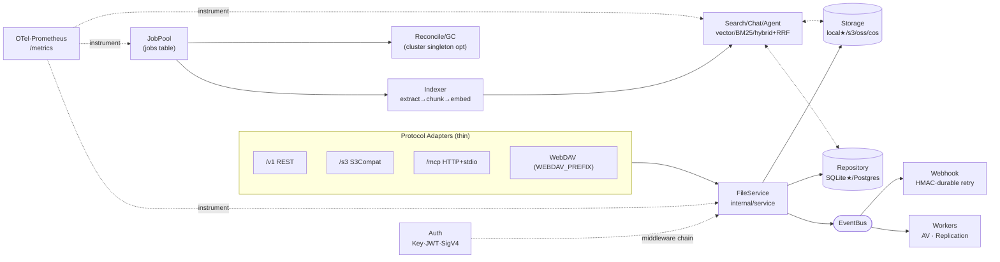

# AGENTS.md

> 本库 AI Agent/贡献者工作合约。全局概述 → `README.md`；配置详表 → `docs/configuration.md`；架构深度 → `docs/architecture.md`。

---

## 1. 系统全局架构与工作流 (System Overview & DAG)

**Binary:** `github.com/aero-vault/aero-vault` · Go 1.25 · `cmd/server/main.go`  
**启动装配顺序（main.go 唯一）：** `config → storage → repo → service → workers → middleware → router`



**★ 默认基线：** SQLite + local FS + 无鉴权 + AI off — CI gate 唯一验证路径。

---

## 2. 核心智能体定义 (Core Agent Profiles)

### 2.1 FileService（核心控制器）

| 属性 | 定义 |
|------|------|
| **Package** | `internal/service` |
| **职责** | 对象 CRUD、配额、版本控制、对象锁/WORM、Tags、ACL、Range、条件请求、预签名、事件发布、ChunkCleaner 钩子 |
| **输入** | 任意协议适配器调用 |
| **输出** | `Object` 元数据 · 存储 key · 事件 payload |
| **禁止** | ① 协议层绕过 FileService 直连 Storage；② handler 自行校验 key 合法性；③ `ChunkCleaner.DeleteObjectChunks` 失败不得阻断硬删除 |

### 2.2 Protocol Adapters

| Adapter | Package | 核心职责 | 禁止 |
|---------|---------|---------|------|
| REST `/v1` | `internal/api/rest` | JSON API：files/search/chat/agent/events-SSE/buckets/admin/ACL/thumbnail；`router.go` 注册；scope 校验；OpenAPI | 业务逻辑写入 handler |
| S3 `/s3` | `internal/api/s3compat` | 对象 CRUD/listing(v1v2)/versions/multipart/tagging/ACL/copy/batch-delete/bucket 子资源(versioning·lock·lifecycle·acl·location)；SigV4 验签 | 绕过 FileService |
| WebDAV | `internal/api/webdav` | PROPFIND/MKCOL/PUT/GET/DELETE；在 chi 外独立分发 | 修改 chi 路由注册 |
| MCP | `internal/mcp` | 工具：`list_files` `read_file` `search` `write_file` `delete_file` `chat`(仅 `s.chat != nil`) | 硬编码工具列表；`chat` 在 AI 未配置时暴露 |

### 2.3 AI/RAG Pipeline（`AI_INDEX_ENABLED=true` 激活）

| 阶段 | 组件 | 输入 → 输出 |
|------|------|------------|
| 提取 | `ai.Extractor` / `RemoteExtractor`(`AI_EXTRACTOR_ENDPOINT`) | 对象字节流 → 纯文本 |
| 分块 | `ai.Chunker` | 文本 → `[]Chunk`；`AI_CHUNK_WINDOW(600)` / `AI_CHUNK_OVERLAP(80)` |
| 向量化 | `Embedder`(`AI_EMBED_PROVIDER`) | `[]string` → `[][]float32`；`AI_EMBED_DIM(256)` |
| 索引写入 | `ChunkSink`（BM25★ / pgvector / Qdrant） | Chunk+向量 → 持久化索引 |
| 检索 | `Search.Query` | query + mode → `[]Hit`；RRF 融合，tiebreak `(score DESC, chunkID ASC)` |
| 生成 | `Chat.Answer` / `Agent.Run` | `[]Hit` + 问题 → answer+citations；`AI_AGENT_MAX_STEPS(4)` |
| PII | `PIIDetector` | 文本 → Scan 报告 / Redact 脱敏；信用卡规则加 Luhn 校验 |
| 跳过计量 | `telemetry.IncIndexerSkip` | 跳过路径 → `indexer_skip_total{reason∈{unsupported,error,empty}}` |

**AI 专项限流：** `AI_RATE_LIMIT_RPS` / `AI_RATE_LIMIT_BURST` → 仅作用于 `/search` `/chat` `/chat/stream` `/agent` `/lineage`。  
**nil 安全：** `embedder`/`llm`/`reranker` 为 `nil` 时不影响文件 CRUD。

### 2.4 EventBus + Workers

| Worker | 触发 | 输出 | 失败策略 |
|--------|------|------|---------|
| Antivirus | `object.created` 事件 | 染毒 → 隔离/标记 | 跳过+记录，非致命 |
| Replication | `object.created/deleted` 事件 | 跨区副本写入 | JobPool 重试 |
| Reconcile/GC | `RECONCILE_INTERVAL_MINUTES` 定时 | 孤儿清理·版本保留·软删除清除 | 幂等，可重跑；`RECONCILE_CLUSTER_SINGLETON` 防重 |
| Webhook | 任意事件 + `EVENTS_WEBHOOK_URL` | HMAC-SHA256 签名 HTTP POST | durable retry → `webhook_failures` 表 |
| JobPool | `jobs` 表轮询 | 执行注册 handler | 超 `MaxAttempts` → `failed` |

### 2.5 Auth + Middleware（链路顺序不可变）

```
RequestID → CORS → Auth → Tenant → RateLimit(global) → OTel → Recoverer → AccessLog
                                   └─ RateLimit(AI)  → AI 路由组内
```

| 组件 | 职责 |
|------|------|
| Auth | Bearer JWT(`AUTH_JWT_SECRET`) / X-Api-Key(sha256 hash) / SigV4(S3) / 匿名公读 |
| Tenant | JWT/Key/Header 提取 tenant；`*` = operator key；默认 `default` |
| RateLimiter | Token-bucket per tenant；`RATE_LIMIT_RPS` 全局；`AI_RATE_LIMIT_RPS` AI 路由组独立 |

**绕过 Auth：** `/healthz` `/metrics` `/openapi.json` `/docs` `/ui`  
**Handler 不自挂中间件链**（isolated handler tests 无 tenant/auth — 设计行为，非 bug）。

### 2.6 Storage + Repository（持久化层）

| 层 | 默认(★) | 可选 | 激活方式 |
|----|---------|------|---------|
| Storage | `local ./var/objects` | `s3` `oss` `cos` | `STORAGE_BACKEND` |
| Repository | SQLite `./var/aero.db` | Postgres | `DB_DRIVER=postgres` + `DB_DSN` |
| Vector Index | 内存暴力扫描 | pgvector / Qdrant | `AI_VECTOR_BACKEND` |
| Lexical Index | 内存 BM25 | pgFTS | `AI_LEXICAL_BACKEND=pgfts` |
| SSE/KMS | keyfile | HTTP KMS | `STORAGE_SSE_KEY` / `STORAGE_SSE_KMS_*` |

---

## 3. 已实现功能矩阵 (Feature Matrix & State Triggers)

| 功能 | 触发条件/入口 | 确定性产物 | 激活标志 |
|------|-------------|-----------|---------|
| 对象 CRUD | 任意协议 PUT/GET/DELETE | Object 元数据 + storage blob | — |
| 对象版本控制 | `VERSIONING_ENABLED` bucket | `@v<id>` blob + version 行 | bucket 配置 |
| 对象锁/WORM | `x-amz-object-lock-*` / REST ACL | `locked_until` 字段 | — |
| 多分片上传 | S3 multipart init/upload/complete/abort | 合并 blob + ETag | — |
| Tags / ACL | PUT `/tags` · PUT `/acl` | tags/acl 元数据行 | — |
| 预签名 URL | POST `/presign` | 时效 URL + HMAC | — |
| 缩略图 | GET `/thumbnail?w=&h=` | JPEG/PNG bytes | — |
| Range 请求 | `Range` header / GET with offset | 部分内容流 | — |
| 条件请求 | `If-Match` / `If-None-Match` | 304/412 | — |
| Idempotency-Key | `Idempotency-Key` 请求头 | 幂等响应缓存；`IDEMPOTENCY_HASH_BODY` 启用 body 指纹 | — |
| 多租户隔离 | `X-Aero-Tenant` / JWT | 租户隔离元数据+存储 | — |
| 租户管理 | POST/GET/DELETE `/v1/admin/tenants` | `TenantRecord` | admin scope |
| 租户状态/配额/预算 | PUT `.../status` `.../quota` `.../budget` | 字段更新行 | admin scope |
| API Key 管理 | POST/GET/DELETE `/v1/admin/keys` | sha256-hashed key 行 | admin scope |
| JWT 签发 | POST `/v1/admin/jwt` | HS256 signed token | `AUTH_JWT_SECRET` |
| 审计日志 | 所有 admin 操作写路径 | `audit_log` 行 | — |
| SSE 加密 | `STORAGE_SSE_KEY` / KMS provider | 加密 blob；versioned key envelope | `STORAGE_SSE_*` |
| Key 轮换重包装 | `STORAGE_SSE_REWRAP_ON_START=true` | 旧版本 envelope → 当前 primary key | 启动时单次 |
| Webhook | 任意事件 + `EVENTS_WEBHOOK_URL` | HMAC POST；失败 → `webhook_failures` 持久化重试 | `EVENTS_WEBHOOK_URL` |
| 跨区复制 | `REPLICATION_ENABLED=true` + 事件 | 目标后端副本写入 | `REPLICATION_*` |
| Antivirus 扫描 | `object.created` + AV 配置 | 染毒 → 隔离/标记 | `AV_*` |
| 软删除保留清除 | `RECONCILE_RETENTION_DAYS > 0` 定时 | 清除过期软删除行+blob | `RECONCILE_*` |
| 集群单例 | `RECONCILE_CLUSTER_SINGLETON=true` | `leases` 表 advisory lock | Postgres |
| S3 兼容 | `/s3/*` + SigV4 | 标准 S3 XML 响应 | — |
| S3 bucket 子资源 | `?acl` `?versioning` `?lock` `?lifecycle` `?location` `?versions` | 对应 XML 响应 | — |
| WebDAV | `WEBDAV_PREFIX` 路由 | PROPFIND/MKCOL XML | `WEBDAV_PREFIX` |
| MCP (HTTP+stdio) | `/mcp` 或 `aero-vault mcp` | JSON-RPC 工具响应 | — |
| 语义检索 | POST `/v1/search` mode=`vector` | `[]Hit` cosine 排序 | `AI_INDEX_ENABLED` |
| BM25 检索 | POST `/v1/search` mode=`bm25` | `[]Hit` BM25 排序 | `AI_INDEX_ENABLED` |
| 混合检索 RRF | POST `/v1/search` mode=`hybrid` | `[]Hit` RRF 融合；tiebreak `(score DESC, chunkID ASC)` | `AI_INDEX_ENABLED` |
| 检索结果缓存 | `AI_SEARCH_CACHE_SIZE > 0` | TTL 命中跳过 embed+retrieval | `AI_SEARCH_CACHE_*` |
| RAG Chat | POST `/v1/chat` | `{answer, model, citations}` | `AI_CHAT_PROVIDER` |
| Chat SSE 流式 | POST `/v1/chat/stream` | `event:{token\|done\|citations\|error}` SSE 帧 | `AI_CHAT_PROVIDER` |
| Agent 工具循环 | POST `/v1/agent` | `{steps, answer, model}`；max `AI_AGENT_MAX_STEPS` | `AI_CHAT_PROVIDER` |
| PII 检测/脱敏 | `PIIDetector.Scan` / `.Redact` | Scan 报告 / 脱敏文本；credit_card 加 Luhn 校验 | 内部调用 |
| 索引跳过计量 | Indexer 跳过路径 | `indexer_skip_total{reason}` OTel counter | OTel |
| AI 专项限流 | AI 路由组 middleware | 429；独立于全局 RPS | `AI_RATE_LIMIT_RPS` |
| 日费用预算 | `AI_TENANT_DAILY_BUDGET_USD` | 超限 → ChatStream `event:error code:BudgetExceeded` | `AI_TENANT_DAILY_BUDGET_USD` |
| 对象血缘 | GET `/v1/lineage/objects/{id}` | 血缘图 JSON | — |
| OTel 指标 | 全量请求路径 | 15 instruments → Prometheus `/metrics` | `OTEL_*` |
| Grafana 仪表盘 | Prometheus 数据源 | 12 panels：embed/search 延迟·吞吐·队列·存储·租户 | `deploy/grafana/` |
| Prometheus 告警 | 规则评估 | HighEmbedLatencyP95·HighSearchLatencyP95·JobQueueDepthHigh | `deploy/prometheus/` |
| Qdrant 集成 | `AI_VECTOR_BACKEND=qdrant` | 集合自动创建(Cosine)·向量 CRUD | `AI_VECTOR_URL` |
| pgvector/pgFTS | `AI_VECTOR_BACKEND=pgvector` | 可扩展 ANN + 全文检索 | `AI_VECTOR_DSN` |
| Web UI | `/ui` embedded | 4-tab SPA：search/detail/lineage/chat；拖拽上传；SSE 流式渲染 | — |
| Python/JS/Go SDK | 客户端调用 | 完整 API 覆盖 + 14 admin 方法 | `sdk/` |
| CLI | `aero-vault cli …` | upload/get/ls/rm/search/tag/versions/lineage/snapshot | `internal/cli` |

---

## 4. 全局约束与异常处理规则 (Global Constraints & Edge Cases)

### CI Gate（每次变更提交前必须全绿）

```bash
gofmt -l .      # 必须无输出；触碰文件即 gofmt -w
go build ./...
go vet ./...
go test ./...   # SQLite + local FS；零网络；零 Docker
```

Postgres/pgvector → `make test-integration`（Docker）；Qdrant → `make test-integration-qdrant`（Docker）— 均在 CI gate 外。

### 硬性不变量

| # | 规则 | 违反后果 |
|---|------|---------|
| **I1** | **SQL 占位符不可复用：** `$N` 经 `s.rebind`(`repository/sql.go`) 按个数改写为 `?`；每个 bind 独立编号（同值亦需新 `$N`）；时间统一 `RFC3339Nano` | SQLite 静默绑错参数 |
| **I2** | **迁移双文件：** 每次 schema 变更 = `migrations/{sqlite,postgres}/NNNN_*.{up,down}.sql`；不得编辑或重编已应用文件；`repo.Migrate` 启动自动执行 | 升降级破坏 |
| **I3** | **存储 key 唯一且不反解析：** `storageKey(tenant,bucket,key)` = `path.Join`；versioned blob 追加 `@v<id>` 后缀；GC 匹配精确 key，禁止反向解析；key 校验（禁空/`/`前缀/`..`）只在 FileService 层执行 | 数据覆盖/信息泄露 |
| **I4** | **Middleware 链顺序固定：** `RequestID→CORS→Auth→Tenant→RateLimit→OTel→Recoverer→AccessLog`；handler 不自挂链；隔离 handler 测试无 tenant/auth — 设计行为 | 鉴权失效/上下文丢失 |
| **I5** | **Opt-in 安全默认：** AI/pgvector/Qdrant/events/cluster/retention/WebDAV 均 flag-gated，默认 off；`nil` embedder/llm/reranker 不得破坏 core CRUD | 基线路径回归 |
| **I6** | **Stdlib 优先：** 新 `go.mod` 依赖需论证 + `go mod tidy`；单元测试仅用标准 `testing` 包 | 依赖膨胀 |

### 异常处理规则

| 场景 | 处理方式 |
|------|---------|
| ChatStream 运行时错误（SSE headers 已发） | `event: error\ndata: {"code":"…","message":"…"}\n\n`；不中断流 |
| Indexer 跳过对象 | `telemetry.IncIndexerSkip(ctx, reason)`；reason ∈ `{unsupported,error,empty}`；非致命 |
| BM25 孤儿清理失败 | `FileService` 硬删除路径同步调 `ChunkCleaner.DeleteObjectChunks`；失败 warn log，不阻断删除 |
| Reranker 失败 | 降级为原始排序 + warn log；不向调用方返回错误 |
| AI 日费用超限 | ChatStream 发送 `code:BudgetExceeded`；Agent 终止工具循环 |
| 向量模型漂移 | 检索时跳过 `EmbedModel` 不匹配的 chunk（`search.go` 内过滤） |

### 测试模式

```go
// 标准夹具
repo, _ := repository.Open(ctx, "sqlite", "file:"+filepath.Join(t.TempDir(), "x.db"))
_ = repo.Migrate(ctx)
store, _ := storage.NewLocal(storage.LocalConfig{Root: t.TempDir()})

// AI mock（零网络）
ai.MockLLM{}      // 确定性 LLM
ai.HashEmbedder   // 确定性向量
```

- HTTP handler → `net/http/httptest.NewRecorder()`
- 需 tenant/auth 上下文 → `mw.Tenant(mw.Auth(h))`（对齐 `main.go` 装配方式）
- 新 Storage backend → 必须通过 `storage.contract_test.go`
- Qdrant 集成测试 → `//go:build integration`，探测 `/readyz`，失败自动 skip

### 扩展入口

| 扩展点 | 操作序列 |
|--------|---------|
| REST route | `rest/` handler → `router.go` 注册 + scope → `*_test.go` → `openapi.json` |
| Storage backend | 实现 `storage.Storage` → `factory.go`+`BackendKind` → `config.go`+`main.go:buildStorageFrom` → 通过 contract suite |
| DB schema | dual migration pair → `sql.go` Repository 方法（遵守 I1） |
| Background job | job-type const + handler → `main.go:jobReg.Register` → `Queue.Enqueue` |
| MCP tool | `listTools` + `callTool` switch in `mcp/server.go` |
