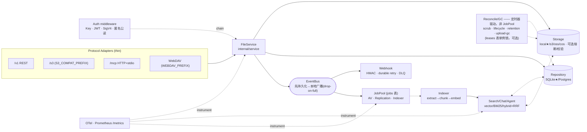

# AGENTS.md

> **Agent 启动加载顺序（由外到内）：** `docs/agent/BOOTSTRAP.md`（全局知识）→ **本文**（行为合约/架构/不变量）→ `docs/agent/CURRENT_SPRINT.md`（本轮范围）→ `docs/agent/TASK.md`（当前任务）→ `HARNESS.md`（提交前 `make check`）。
>
> 本文是 AI Agent/贡献者的**工作合约**：只写*契约、架构边界、不变量*。全局概述 → `README.md`；架构深度 → `docs/architecture.md`。
>
> **环境变量的名称以本文为准；具体默认值/取值以 `docs/configuration.md` + `.env.example` 为准，本文不内联易漂移的数值默认。**

---

## 0. 工程约束 (Engineering Constraints)

**硬门禁（`make check` / CI 失败即拒绝合入）：** `gofmt -l` 无输出 · `go build ./...` · `go vet ./...` · `go test ./...`（SQLite+local FS，零网络/零 Docker）· **单文件 ≤ 500 行**。

**约定（仅告警，不阻断——违反不会自动拒绝，但 review 会要求整改）：** 单函数 ≤ 50 行 · 圈复杂度 ≤ 10（`gocyclo -over 10` 仅 `WARN`）· 禁 God 类型（> 300 行）· 禁 `utils/` `common/` `helper/` 包（按领域分散）· 单测覆盖率 ≥ 50%（目标 80%）· **重构优先于功能**。

> `make check` **不**运行 `go mod tidy` / `golines`（那是独立的 `make tidy`）——`HARNESS.md` §1 的“7 步等价”描述已过时，以本表为准。新增 `go.mod` 依赖需论证 + `go mod tidy`（见 I6）。

---

## 1. 系统架构与装配 (System Overview & DAG)

**Binary:** `github.com/aero-vault/aero-vault` · Go 1.26.1 · `cmd/server/main.go`
**装配顺序（main.go 唯一）：** `config → storage → repo → service → workers → middleware → router`



**★ CI 基线（唯一被 `go test` 验证的路径）：** SQLite + local FS + 无鉴权 + AI off。所有 AI/pgvector/Qdrant/events/cluster/retention/WebDAV/S3 网关均 **opt-in、默认关闭**（见 I5）。

---

## 2. 组件契约 (Component Contracts)

> 每个组件的“职责/禁止/激活”只在此定义一次；行为细节见 §4 不变量。

### 2.1 FileService — 核心控制器 · `internal/service`

- **职责（唯一入口）：** 对象 CRUD + 软/硬删除 + Restore、配额（字节/对象数预检）、per-bucket 版本控制、对象锁/WORM、**法律保留（legal hold，独立于 WORM，均阻断硬删除）**、Tags/ACL、Range、预签名、事件发布、`ChunkCleaner` 钩子；写入侧完整性：Content-MD5 校验（失败 `ErrBadDigest` 并删除已写 blob）、元数据尺寸上限、可选 on-read ETag 校验、损坏对象守卫（`_aero_scrub_status=corrupt` → `ErrObjectCorrupt`）。
- **key 合法性校验（禁空 / `/` 前缀 / `..`）在 FileService 与 storage 后端两层执行——唯独不在 adapter/handler 层**（见 I3）。
- **禁止：** ① adapter 绕过 FileService 直连 Storage；② handler 自校验 key 合法性；③ `ChunkCleaner.DeleteObjectChunks` 失败**不得**阻断硬删除（warn log 后继续，见 §4）。
- **注意：** 条件请求（If-Match/304/412）的判定属**协议适配器**职责，FileService 只暴露 `ErrPreconditionFailed` 哨兵。

### 2.2 Protocol Adapters（thin；业务逻辑一律下沉 FileService）

| Adapter | Package | 职责要点 | 禁止 |
|---------|---------|---------|------|
| REST `/v1` | `api/rest` | JSON API；`router.go` 注册 + 方法派生 scope（读:GET/HEAD/OPTIONS，写:其余）+ `Require(scope)`；SSE、Idempotency、OpenAPI | 业务逻辑写入 handler |
| S3 `/s3` | `api/s3compat` | 对象 CRUD/list(v1v2)/versions/multipart/tagging/acl/copy/batch-delete/`?restore`/legal-hold；bucket 子资源；**每次操作执行 bucket policy（IAM 风格 allow/deny + 源 IP）** | 绕过 FileService |
| WebDAV | `api/webdav` | 基于 `x/net/webdav`：PROPFIND/PROPPATCH/MKCOL(虚拟 no-op)/PUT/GET/HEAD/DELETE/COPY/**MOVE(copy-then-delete)**/LOCK/UNLOCK(内存锁)；仅作用于 default bucket；在 chi 外独立分发 | 改动 chi 路由注册 |
| MCP | `mcp` | tools=恒有`list_files·read_file·write_file·delete_file`，`search`(仅 embedder 就绪)、`chat`(仅 llm 就绪) 条件暴露；**resources/list·read**（`aero-vault://{tenant}/{bucket}/{key}`，跨租户 URI 拒绝）；HTTP+stdio | 硬编码工具列表；在依赖未就绪时暴露 search/chat |

> SigV4（请求头 + 预签名）的**验签在 `internal/auth` 中间件完成，不在 /s3 adapter 内**（见 2.5）。

### 2.3 AI/RAG Pipeline（`AI_INDEX_ENABLED=true` 激活，默认关）

`Extractor`/`RemoteExtractor`(`AI_EXTRACTOR_ENDPOINT`) → `Chunker`(`AI_CHUNK_WINDOW`/`AI_CHUNK_OVERLAP`) → `Embedder`(`AI_EMBED_PROVIDER`/`AI_EMBED_DIM`) → `ChunkSink`(内存 BM25★ / pgvector / Qdrant)。

- **检索 `Search.Query`(mode)：** `vector`/`bm25` 按后端序返回；**仅 `hybrid` 走 RRF 融合**，tiebreak `(score DESC, chunkID ASC)`。检索期跳过 `EmbedModel` 不匹配的 chunk；`AI_REINDEX_STALE_ON_START` 可启动时重嵌漂移 chunk。
- **生成：** `Chat.Answer` → `{answer, model, citations}`；`Agent.Run` → `{answer, model, steps}`（工具轨迹，**无 citations**；工具=list_files/read_file/search(hybrid)；`AI_AGENT_MAX_STEPS` 为**步数**上限，非费用上限）。
- **日费用预算：** 生效上限 = per-tenant 覆盖(`AI_PER_TENANT_BUDGETS`) 否则 `AI_TENANT_DAILY_BUDGET_USD`；超限 → `/chat` 返回 **HTTP 402 `BudgetExceeded`**，`/chat/stream` 发 **SSE `event:error code:BudgetExceeded`**。**Agent 不做费用预算检查。**
- **PII `PIIDetector`：** 覆盖 email/phone/credit_card(Luhn)/ssn/ipv4；`Scan`/`Redact`(可选 kind 白名单)；Indexer 命中时将计数写入对象 tag `pii_scan`。
- **限流/降级：** `AI_RATE_LIMIT_RPS`/`BURST` 独立作用于 `/search /chat /chat/stream /agent /lineage`；同组套 `REQUEST_TIMEOUT_SECONDS` 单请求超时；`AI_DEGRADED_MODE=true` → 所有 AI 端点返回 **503**。`embedder`/`llm`/`reranker` 为 `nil` 不影响文件 CRUD（I5）。
- **计量：** `telemetry.IncIndexerSkip(reason∈{unsupported,error,empty})`（见 §4）。

### 2.4 EventBus + Workers

EventBus **先 `InsertEvent` 持久化，再非阻塞本地广播**（订阅者缓冲满则 drop 计数）。`JobPool` 轮询 `jobs` 表；`DedupeKey` 去重；`JOBS_WORKERS>0` 才启用 AV/Replication；`JOBS_MAX_DEPTH` 背压 → `ErrQueueFull`(429)；崩溃 worker 的 job 由 reaper 重排；重试指数退避 + 抖动，超 `MaxAttempts` → `failed`。

| Worker | 触发 | 行为 / 失败策略 |
|--------|------|----------------|
| Antivirus | `created` 事件 → 桥接为 `virus_scan` job | 桥接失败非致命；扫描 job 失败由 JobPool 重试/终态。`AV_PROVIDER`=内置 EICAR 签名 / http 外部 |
| Replication | **仅 `created` 事件**（删除不复制） | 目标后端副本；JobPool 重试。`REPLICATION_*` |
| Webhook | 任意事件 + `EVENTS_WEBHOOK_URL`（可多个逗号分隔） | HMAC-SHA256(`EVENTS_WEBHOOK_SECRET`) POST；durable retry(退避+抖动)→ `webhook_failures` 表；> 上限进 DLQ |
| **Reconcile/GC** | **定时器驱动（`RECONCILE_INTERVAL_MINUTES`），独立于 JobPool** | 四个独立 job：孤儿行/blob 回收(删 blob opt-in `RECONCILE_DELETE_ORPHAN_BLOBS`)+MD5 scrub · lifecycle 过期 · retention/软删清除+幂等键 GC · multipart upload GC(`UPLOAD_GC_TTL_HOURS`)。幂等可重跑；各 job 可选 `leases` 表单例锁（`RECONCILE_CLUSTER_SINGLETON=true`）|

### 2.5 Auth + Middleware（链路顺序即契约）

**全局链（入站执行序，共 12 环）：**
```
RequestID → BucketCORS → CORS → SecureHeaders → MaxBodySize
          → Auth → Tenant → RateLimit(global) → OTel → Recoverer → Concurrency → AccessLog
                                  └─ RateLimit(AI) 在 AI 路由组内额外套一层
```
> **不可变的载荷不变量**（I4）：`Auth ≺ Tenant ≺ RateLimit`；`RequestID` 最外、`AccessLog` 最内。**Handler 不自挂链**——隔离 handler 测试无 tenant/auth 是设计行为，非 bug。

- **Auth**（`api/rest` 之外的注册表中间件）：Bearer JWT（本地 HS256；外部令牌必须复用 Snaplink `interfaces/ssoclient/rs` SDK 做 JWKS/issuer/audience 验证，Aero 仅映射 Principal）· Snaplink/OIDC Authorization Code+PKCE（opt-in；state/cookie/授权 URL/PKCE/Token exchange 必须复用 `interfaces/ssoclient/remote.BrowserFlow` + `TokenClient`）· X-Api-Key(sha256；静态 `AUTH_KEYS` 或持久化 `AUTH_PERSIST_KEYS`) · SigV4(`S3_SIGV4_CREDENTIALS`，头+预签名) · REST PUT capability HMAC(`AUTH_PRESIGN_SECRET`；空值为进程随机，多副本须共享同一 ≥32-byte 值) · 匿名公读。任一普通凭据源配置即启用；仅 PUT capability signer 不改变默认透传。tenant-scoped key 与冲突 `X-Aero-Tenant` → 403。
- **Tenant：** 从 JWT/Key/Header 提取；`*` = operator key；缺省 `default`。
- **限流/并发：** token-bucket per-tenant（`RATE_LIMIT_RPS` 全局 + `AI_RATE_LIMIT_RPS` AI 组）；bucket map 上限 5w + 空闲淘汰；`Concurrency` 加权信号量（写=2/读=1，`MAX_INFLIGHT_REQUESTS`/`PER_TENANT_CONCURRENCY_MAX`）。
- **免鉴权 & 免限流路径：** `/`（仅 302 到 `/ui/`）· `/favicon.ico` · `/healthz` `/readyz` `/metrics` `/openapi.json` `/docs` `/ui*`（前缀）及 opt-in `/auth/oidc/*` 登录回调。

### 2.6 Storage + Repository

| 层 | 默认 ★ | 可选 | 激活 |
|----|--------|------|------|
| Storage | `local ./var/objects` | `s3` `oss` `cos` | `STORAGE_BACKEND` |
| ↳ 可选包装 | — | 熔断器 / on-read 校验 | `STORAGE_CB_ENABLED` / `STORAGE_VERIFY_ON_READ` |
| Repository | SQLite `./var/aero.db` | Postgres | `DB_DRIVER=postgres` + `DB_DSN` |
| Vector Index | 内存暴力扫描 | pgvector / Qdrant | `AI_VECTOR_BACKEND` |
| Lexical Index | 内存 BM25 | pgFTS | `AI_LEXICAL_BACKEND=pgfts` |
| local SSE/KMS | 明文 | keyfile/URL → **KMS**（优先级：KMS > SecretProvider > 单密钥） | `STORAGE_LOCAL_SSE_KEY` / `STORAGE_LOCAL_SSE_KEYFILE` / `STORAGE_LOCAL_SSE_KEY_URL` / `STORAGE_LOCAL_SSE_KMS_*`（**注意 `LOCAL` 段**；唯 `STORAGE_SSE_REWRAP_ON_START` 用裸前缀，启动时单次重包裹旧 envelope）|

---

## 3. 接口与能力速查 (Surface Index)

> 仅列**入口**；契约在 §2、不变量在 §4。默认关闭者标注门禁 flag。

**REST `/v1`：** `files/*`(CRUD·Range·条件请求·`/metadata`·`/restore`·`/thumbnail?w=&h=` **仅 JPEG**) · `/presign` · `/tags` · `/acl` · `/legal-hold` · `/folders/*` · `/batch/{delete,tag}` · `/usage` · `/buckets`+子资源 · `/events/stream`(SSE，`Last-Event-ID` 回放+keepalive) · **AI 组**`/search`·`/chat`·`/chat/stream`·`/agent`·`/lineage/objects/{id}`(返回 AI-usage 列表，非图) · **Admin 组**(`requireAdmin`)`/admin/{tenants,keys,jwt,jobs,jobs/{id}/retry,config,webhook-failures}`。审计写 `audit_log` 的仅 quota/budget/key/tenant 变更（JWT 签发、job retry、lifecycle 不写审计）。

**S3 `/s3`（`S3_COMPAT_PREFIX`，空串禁用网关）：** 对象 CRUD/list(v1v2)/versions/multipart/tagging/acl/copy/batch-delete/`?restore`/legal-hold header/canned `x-amz-acl`/`x-amz-expected-bucket-owner`。bucket 子资源：`?versioning ?object-lock ?lifecycle ?acl ?location ?versions ?policy ?cors ?logging ?notification ?accelerate ?uploads`。

**MCP：** tools（见 2.2 条件暴露）+ resources；协议版 `2024-11-05`；`write_file`/`delete_file` 恒作用于 default bucket（delete 为软删）。

**CLI `aero-vault cli …`：** `upload get ls rm search(-k,--mode=vector|bm25|hybrid) tag versions lineage snapshot lsbuckets bucket-rm` + `admin {keys,tenants,jobs,audit}`。

**SDK `sdk/`：** Python·JS·Go，覆盖对象/搜索/chat + 管理面（数量随 API 演进，以各 SDK README 为准，勿在本文写死计数）。

**Web UI `/ui`（`WEBUI_ENABLED`，默认开）：** 内嵌 vanilla-JS SPA，5 tab（search/detail/lineage/chat/access）+ 拖拽/文件上传 + SSE chat 流式 + 文件生命周期/分享/公开图片/部门/ACL/备份管理；tenant/apikey 存 localStorage。

**Ops：** `/healthz` `/readyz` · `/metrics`(**`PROMETHEUS_ENABLED`，默认关**；域指标 ~32 个 + HTTP + gauges，实时清单 `grep internal/telemetry`) · OTLP 推送(`OTEL_EXPORTER_OTLP_ENDPOINT`)。`deploy/`：2 个 Grafana 仪表盘（AI/Ops 13 panel + HTTP/runtime 17 panel）、`deploy/prometheus/alerts.yml` 共 16 条告警（http/ai-cost/integrity/ai-latency/ai-search/audit-governance 六组）。

---

## 4. 不变量与边界 (Invariants & Edge Cases)

### 硬性不变量

| # | 规则 | 违反后果 |
|---|------|---------|
| **I1** | **SQL 占位符不可复用：** `s.rebind`(`repository/sql.go`) 将每个 `$N` 按文本出现顺序改写为 `?`（数字值被忽略），同值也须新占位符；时间统一 `RFC3339Nano` | SQLite 静默绑错参数 |
| **I2** | **迁移双文件 + 单向自动执行：** schema 变更 = `internal/repository/migrations/{sqlite,postgres}/NNNN_*.{up,down}.sql`（`//go:embed` 进二进制）；`repo.Migrate` 启动按版本串跳过已应用（无校验和），**`.down.sql` 从不自动执行**（无回滚 runner）；不得编辑/重编已应用文件 | 升降级破坏 |
| **I3** | **存储 key 唯一且不反解析：** `storageKey(tenant,bucket,key)=path.Join`；versioned blob 追加 `@v<id>` 后缀（该 id 即权威 version_id）；GC 按**精确 key** 匹配 `ListStorageKeys` 集合，禁反向解析 `@v`；key 校验在 FileService+storage 两层（非 adapter/handler） | 数据覆盖/信息泄露 |
| **I4** | **Middleware 链顺序固定：** 见 §2.5（12 环，`Auth≺Tenant≺RateLimit`，`RequestID` 最外/`AccessLog` 最内）；handler 不自挂链 | 鉴权失效/上下文丢失 |
| **I5** | **Opt-in 安全默认：** AI/pgvector/Qdrant/events-transport/cluster/retention/WebDAV/S3 网关/熔断/校验 均 flag-gated 默认 off；`nil` embedder/llm/reranker 不得破坏 core CRUD；`AI_DEGRADED_MODE` 为全局 AI kill-switch | 基线路径回归 |
| **I6** | **Stdlib 优先：** 新增 `go.mod` 依赖需论证 + `go mod tidy`；单测**不引入断言框架**（testify 等），仅用 `testing`（少量测试为驱动生产码引入 chi/aws-sdk 属正常） | 依赖膨胀 |

### 异常处理规则

| 场景 | 处理 |
|------|------|
| ChatStream 运行时错误（SSE 头已发） | `event:error\ndata:{"code","message"}`；**SSE 事件仅 `token｜done｜error`；citations 内嵌于 `done` 帧**，无独立 citations 事件 |
| Indexer 跳过对象 | `IncIndexerSkip(reason∈{unsupported,error,empty})`；非致命 |
| ChunkCleaner 孤儿清理失败 | 硬删除路径同步调用；失败 warn log，**不阻断删除** |
| Reranker 失败 | 降级为原始排序 + warn；不向调用方报错 |
| hybrid 检索单模态失败 | 降级为健康模态结果（BM25-only / vector-only）+ warn + `ai_search_degraded_total` 计数；**200 响应无降级标记——计数器 + SearchDegraded 告警（alerts.yml `aero-vault-ai-search` 组）是唯一可见面** |
| AI 日费用超限 | `/chat` → 402 `BudgetExceeded`；`/chat/stream` → SSE error 帧（Agent 不检查费用） |
| 对象损坏/WORM/legal-hold | scrub 标记 `corrupt` → Get/Stat 返回 `ErrObjectCorrupt`；WORM `locked_until` 或 legal hold 未释放 → 拒绝覆盖/硬删 |

### 测试模式

```go
repo, _ := repository.Open(ctx, "sqlite", "file:"+filepath.Join(t.TempDir(), "x.db"))
_ = repo.Migrate(ctx)
store, _ := storage.NewLocal(storage.LocalConfig{Root: t.TempDir()})
ai.MockLLM{}                 // 确定性 LLM
ai.NewHashEmbedder(dim)      // 确定性向量（勿写裸 ai.HashEmbedder）
```
- HTTP handler → `httptest.NewRecorder()`；需 tenant/auth 上下文 → `mw.Tenant(mw.Auth(h))`（对齐 main.go）。
- 新 Storage backend → 必须过 `storage` contract suite；Qdrant/PG 集成测试 `//go:build integration`（探活失败自动 skip），在 CI gate 外（`make test-integration[-qdrant]`）；数据竞争 `make test-race`。

### 扩展入口

| 扩展点 | 操作序列 |
|--------|---------|
| REST route | `rest/` handler → `router.go` 注册 + scope → `*_test.go` → **同步 `openapi.json`**（当前已漂移，务必补齐） |
| Storage backend | 实现 `storage.Storage` → `factory.go`+`BackendKind` → `config.go`+`main.go:buildStorageFrom` → 过 contract suite |
| DB schema | 双迁移文件对 → `sql.go` Repository 方法（遵守 I1/I2） |
| Background job | job-type const + handler → `main.go:jobReg.Register` → `Queue.Enqueue`（可设 `DedupeKey`） |
| MCP tool/resource | `mcp/server.go` 的 `listTools`/`callTool`（或 `listResources`/`readResource`）switch |
