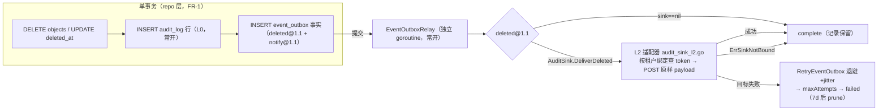

# 设计：复用 audit-governance 事务性 outbox —— `vault.file.deleted@1.1` durable_async 投递（AuditSink 端口）

> **配套规格：** `docs/requirements/audit-sink-deleted-11-v1.md`（FR-1…FR-4 / AC-1…AC-6）· **模块：** `internal/repository` + `internal/events` + `internal/service` + `internal/config` + `cmd/server` · **状态：** 设计（未实现）· **基线：** HEAD `fb74b19` + 未提交 outbox WIP（0041 迁移 / `event_outbox.go` / `payload.go` / relay / 装配）
> **门禁：** `make check` 全绿 · 单文件 ≤ 500 行（L2 适配器独立文件）· 纯 stdlib（I6）· I1/I2 纪律 · 无新 `go.mod` 依赖 · **无 REST 路由/OpenAPI 变更**（无新 HTTP 端点；`ListAudit` 结果行为变化不涉及 schema）

---

## 1. 证据复核（规格全部主张独立复验；构建与测试本次实测）

| # | 规格引用 | 复核结论 |
|---|---------|---------|
| E1 | `repository_interface.go:173` `RecordAudit` 直写 `audit_log`；调用方仅 `admin.go:421` + governance 包装器 | ✅ 精确。`audit.go:12-22` 单条 INSERT 无事务；全仓 `RecordAudit(` 调用点 = `admin.go:421`、`auditgovernance/repository.go:22-27`，**删除路径零调用**（G1 成立） |
| E2 | `bus.go:81-85` Publish "Errors are logged but never propagated" | ✅ 逐字命中；`InsertEvent` 失败仅 Warn 返回 |
| E3 | `RecordAuditWithGovernance`/`InsertEventWithGovernance` 同事务模式 | ✅ `audit_governance_write.go:14`/`:45`；claim 查询确实在 `audit_governance_claim.go`（`ClaimAuditGovernance`:16、`CompleteAuditGovernance`:124、`RetryAuditGovernance`:135）——规格修正成立 |
| E4 | `0039_audit_governance_outbox.up.sql` 重试字段 | ✅ sqlite+postgres 双文件存在（30 行） |
| E5 | `relay.go` claim/complete/retry + `boundedBackoff` | ✅ `auditgovernance/relay.go:62/:89/:100/:130` |
| E6 | `WrapRepository` 租户绑定缝 | ✅ `auditgovernance/repository.go:15-21`；`Publisher`（http.go:97-131）为纯 stdlib 配置驱动 L2 先例 |
| E7 | `Event` 无 version 字段 | ✅ `repository.go:175-185` 无 version；`EventType` 仅 created/updated/deleted/accessed |
| E8 | WIP 已落地（未提交） | ✅ `event_outbox.go`（WithEvent 同事务 + claim/complete/retry + `EventTypeFileDeleted11/Notify11` + payload 校验 `schema_version=="1.1"`）、0041 双方言迁移、`payload.go` `BuildDeletedFact/BuildNotifyFact`、relay `deliverFact` 对 deleted@1.1 **仅 complete**（`:167-168`，G2 成立）、`workers.go:63/:152` 装配、`file_delete.go:46/:86/:101` 调用、`notifier.go` 去重、`config_event_outbox.go` 16 个 EVENT_OUTBOX 引用 |
| E9 | 全仓无 `AuditSink` 符号 | ✅ grep 零命中（G2 成立） |
| E10 | 构建与测试全绿 | ✅ 本次实测：`go build ./...` 退出码 0；`go test ./internal/repository/ -run 'TestEventOutbox|TestDeleteObjectWithEvent'` 与 `./internal/events/ -run 'Outbox|EventSchema'` 均 `ok` |
| E11 | G3：deleted@1.1 envelope 缺 `object_id` | ✅ `payload.go:34-45` `deletedFact` 无 ObjectID 字段 |
| E12 | G4：无 durable_async 时序测试 | ✅ 全仓无"删除响应不阻塞投递"断言（既有 `TestEmitDoesNotBlock` 是 Bus 语义，非本面） |

**结论：规格全部主张成立，且为增量规格（非绿地）。** 设计据此展开，锚定四个真实缺口 G1–G4。

---

## 2. 设计总览



**核心语义（三条不变量）：**

1. **原子性在事务，投递在异步**：删除事务 = 元数据删除 + audit_log 行 + outbox 事实，任一失败整体回滚（AC-1）；DELETE 响应与 L2 投递进度零耦合（AC-3）。
2. **端口常开、L2 opt-in**：L0（audit_log）无 gate；L2 只经配置接入，核心代码零 sibling 导入；sink 为 nil / 租户未绑定 = complete 降级（记录保留，前向兼容）。
3. **载荷原样投递**：relay 不重 marshal、不补字段——接收方看到的就是删除时刻的字节（notify 先例）；`object_id` 缺失的旧行照常投递，接收方契约容忍（AC-2 ⑤）。事实身份经**请求头** `X-Audit-Fact-Id`（outbox 行 id）旁路携带（echo receipt，D5）——身份不进 verbatim 载荷，且对接收方可见（修复 C1/G5"权威键不可见"）。
4. **egress 安全基线不缩水（H1–H6，§9）**：L2 端点强制 HTTPS-or-loopback、禁用重定向、401/403 立即终态、绑定文件 0600 纪律、错误串/日志零 token——取 governance `Publisher` 先例基线，**不继承 notify 面的宽松形状**。
5. **at-least-once 契约显式（C9–C11）**：接收方幂等预期（去重键 = 事实 id + 载荷字节）、无跨事实顺序保证、接收方 commit point = 2xx + echo 匹配（2xx-未持久化 = 永久丢失边界）；**L0 audit_log 为权威记录**（与删除同事务，投递故障不影响，F4）。

**关键设计决策（D1–D7）：**

| # | 决策 | 理由 |
|---|------|------|
| D1 | repo 方法**加参数** `entry AuditEntry`（而非独立 `RecordAuditTx`） | 保持"删除+审计+事实"单一事务边界；独立 tx 方法需向接口透传 tx，破坏封装且易被误用 |
| D2 | 端口定义在 `internal/events`（`audit_sink.go`），relay 经 `EventOutboxRelayOptions` 注入 | relay 是投递面的唯一消费方；`internal/events` 与 `internal/repository` 无环；FileService 不依赖端口（它只依赖 repo 事务） |
| D3 | L2 适配器独立新文件 `internal/events/audit_sink_l2.go` | WIP `event_outbox.go` 414 行已近 500 上限；新文件保持 ≤500 门禁 |
| D4 | 绑定配置用 JSON 文件（镜像 `AUDIT_GOVERNANCE_BINDINGS_FILE` 形状），超时复用 `EVENT_OUTBOX_HTTP_TIMEOUT_SECONDS` | 每租户 token 放 env 易泄露且难管理；文件先例已存在；超时单旋钮使既有 `ClaimTTL > 2×HTTPTimeout` 校验（config_event_outbox.go:52-69）直接覆盖 L2。**H4 修订：** 文件含明文 bearer token → 权限纪律高于 governance（`mode&077==0`，0600）或采用 `token_env` 间接（governance `client_secret_env` 先例，推荐变体） |
| D5 | 投递成功判定 = **2xx + echo receipt**（响应头 `X-Audit-Fact-Id` 与请求头所带事实 id 精确匹配）；**401/403 = 立即终态 failed（H2）**；echo 缺失/不匹配 = 普通错误走既有退避重试 | **两个独立决策，分开论证（回应契约评审"论证只针对 401 token 缓存"）：** ① **echo receipt（采纳，兑现 FR-2）**：FR-2 承诺 receipt 校验（镜像 governance `validateReceipt`，http.go:178-197）——2xx 可来自只受理不持久化的中间层，"2xx-未持久化"即永久丢失边界（该点退化为 at-most-once）；echo 校验把边界收窄为"2xx+echo 未持久化"，并使 outbox 行 id 对接收方可见（C1/G5）。② **401/403 终态（H2）**：静态 Bearer token 无 401 失效缓存可做（governance `Invalidate` 是给 OAuth 动态 token 的）；401/403 对静态 token 是**永久**故障（无刷新路径）——退避重试不可达成功，且重复向拒绝方投递敏感载荷、延迟运维发现。两决策正交：401/403 在 receipt 判定之前短路 |
| D6 | `object_id` 加在 `deletedFact` 的 `key` 之后（字段序固定 → golden 字节稳定） | AC-4 要求字节钉死 |
| D7 | 新遥测 3 个计数器（`l2_delivered_total`/`l2_unbound_total`/`l2_rejected_total`）；错误复用既有 `retried_total`/`failed_total` | 失败路径已由 WIP 计数覆盖，避免计数器爆炸；rejected（401/403 终态，H2）与 unbound（无绑定降级）必须可区分，否则运维修 token 时无从观测 |

---

## 3. API 变更

### 3.1 `internal/repository` — 删除事务并入 audit 行（FR-1）

```go
// repository_interface.go（接口） + event_outbox.go（实现）
HardDeleteObjectWithEvent(ctx context.Context, tenant, bucket, key string,
    entry AuditEntry, facts []OutboxFact) error
SoftDeleteObjectWithEvent(ctx context.Context, tenant, bucket, key string,
    entry AuditEntry, facts []OutboxFact) error
```

- 实现：既有事务内、`deleteObjectAccessState` 之后、`insertOutboxFacts` 之前插入：

```sql
INSERT INTO audit_log (created_at, actor, action, target, tenant_id, detail)
VALUES ($1,$2,$3,$4,$5,$6)          -- CreatedAt 空则盖 RFC3339Nano（audit.go 既有行为）
```

  I1 纪律：每占位符独立编号，`s.rebind` 按文本序改写；与 `RecordAudit`（单写方法，**不改签名**）并存。
- 新常量（`internal/repository/audit.go`）：`const AuditActionFileDelete = "file.delete"`；`Detail` = `"hard"` / `"soft"`（区分删式，不扩充 action 词汇）。

### 3.2 `internal/events` — AuditSink 端口 + L2 适配器（FR-2/FR-4）

```go
// audit_sink.go（新文件，端口 + 哨兵）
// ErrSinkNotBound: 租户无 L2 绑定 → relay 按 complete 处理（记录保留）。
var ErrSinkNotBound = errors.New("audit sink: tenant has no L2 binding")
// ErrSinkUnauthorized: L2 目标返回 401/403（静态 token 被拒）→ relay 立即终态
// failed（H2：无退避重试——静态 token 无刷新路径，重试不可达成功）。
var ErrSinkUnauthorized = errors.New("audit sink: L2 rejected credentials")

type AuditSink interface {
    // DeliverDeleted 把 vault.file.deleted@1.1 envelope（fact.Payload 原样字节）
    // 投递到 tenant 绑定的 L2 目标；factID = outbox 行 id，经请求头
    // X-Audit-Fact-Id 旁路携带（echo receipt，D5——不触碰 verbatim 载荷）。
    // 返回 nil = 2xx 且响应头 echo 精确匹配（已受理）；ErrSinkNotBound →
    // complete 降级；ErrSinkUnauthorized（401/403）→ 立即终态 failed（H2）；
    // 其余错误（含 echo 缺失/不匹配）由 relay 走既有退避重试（maxAttempts → failed）。
    DeliverDeleted(ctx context.Context, tenant string, factID int64, payload []byte) error
}

// event_outbox_relay.go（变更）
type EventOutboxRelayOptions struct {
    // …既有字段不变…
    AuditSink AuditSink // nil → deleted@1.1 保持现状（complete，记录保留）
}

// deliverFact 的 deleted@1.1 分支：
//   sink == nil                       → complete
//   err == ErrSinkNotBound            → complete（l2_unbound_total++）
//   err == ErrSinkUnauthorized        → 终态：RetryEventOutbox 以
//                                        maxAttempts=fact.Attempts 调用（无退避，
//                                        直接 failed；l2_rejected_total++，H2）
//   err != nil（含 echo 缺失/不匹配）→ r.retry(fact, err)（既有退避+jitter）
//   nil                               → complete（l2_delivered_total++）
```

```go
// audit_sink_l2.go（新文件，纯 stdlib，≤500 行）
func NewAuditSinkL2(endpoint string, bindings map[string]string,
    client *http.Client, logger *slog.Logger) (*AuditSinkL2, error)
// 构造时二次校验端点（H1/H6 防御纵深，镜像 governance secureEndpoint + 构造 error）：
// URL 形状（绝对、无 userinfo/query/fragment）且 https 或 loopback http；失败 →
// 启动失败（config.Validate 已拦，此为兜底，F6 fail-fast）。
// client 必须是禁用重定向的实例（H6：CheckRedirect → ErrUseLastResponse；不得复用
// relay 的默认 client——其默认跟随 ≤10 次重定向，307/308 会把载荷转发到重定向目标、
// 同源重定向还携带 Authorization）。超时仍复用 EVENT_OUTBOX_HTTP_TIMEOUT_SECONDS（C6）。
// DeliverDeleted: bindings[tenant] 无 → ErrSinkNotBound；
// POST endpoint，Authorization: Bearer <token>，X-Audit-Fact-Id: <factID>，
// Content-Type: application/json，body = payload 原样（不重 marshal、不补字段——
// D6/verbatim 不变量）；401/403 → ErrSinkUnauthorized（H2，receipt 判定前短路）；
// 2xx 且响应头 X-Audit-Fact-Id 与请求值精确匹配（trim 后比较）→ nil（echo
// receipt，D5/FR-2）；2xx 但 echo 缺失/不匹配 → error（走退避重试——"2xx-未
// 持久化"边界收窄）；其余非 2xx / 传输错误 → error。
// 响应体有界读取（≤64KiB，镜像 governance maxResponseBytes），不落日志、不进错误串。
// 错误契约（H5）：error 串只含状态码或 sentinel 分类，绝不包含 token、payload 字节
// 或响应体内容（relay 把 cause.Error() 写入 last_error 并 Warn 打日志——泄漏即双暴露）。
// 载荷上界：POST 前校验 len(payload) ≤ 1MB（防畸形行打爆目标），超限 → 普通错误
// （与 governance 一致，可重试；F9）。
```

### 3.3 `internal/events/payload.go` — envelope 加 `object_id`（FR-3）

```go
type deletedFact struct {
    // …既有字段（schema_version/event_type/tenant/bucket/key/version_id/
    //   size/etag/backend/request_id/actor）不变，字段序不变…
    ObjectID int64 `json:"object_id"` // 插在 key 之后（D6）
}
// BuildDeletedFact 签名不变（obj 已含 obj.ID）——调用点零改动；
// 输出字节变化 → schema_test.go golden 常量同步更新（AC-4）。
```

### 3.4 `internal/service/file_delete.go` — 构造审计行（FR-1）

```go
// 新增，与 deleteFacts 并列；actor 复用既有 PrincipalFrom(ctx) 模式（空值合法）
func (s *FileService) deleteAuditEntry(ctx context.Context, obj repository.Object,
    tenant string, hard bool) repository.AuditEntry
// → {Actor: principal.SubjectID 或 "", Action: repository.AuditActionFileDelete,
//    Target: bucket + "/" + key, TenantID: tenant, Detail: "hard"/"soft", CreatedAt: ""}

// hardDeleteObject（:46）与 softDeleteObject（:86）调用点各加 entry 实参。
```

### 3.5 `internal/config` + `cmd/server` — L2 配置装配（FR-2）

```go
// config.go: 新增 AuditSinkL2 AuditSinkL2Config 字段
// config_audit_sink_l2.go（新文件，镜像 config_audit_governance.go 形状）:
type AuditSinkL2Config struct {
    Endpoint      string // AUDIT_SINK_L2_ENDPOINT；空 → L2 禁用（sink=nil，降级）
    BindingsFile  string // AUDIT_SINK_L2_BINDINGS_FILE；JSON {"bindings":[{"tenant","token"}]}
    Bindings      []AuditSinkL2Binding
}
// Validate（H1/H4/H6）:
//  ① Endpoint 非空 → URL 形状 + 协议校验（镜像 validateAuditGovernanceURL，
//     config_audit_governance.go:168-180）：绝对 URL、无 userinfo/query/fragment；
//     scheme 必须 https 或 loopback http（localhost / 127.0.0.0/8 / ::1）——拒绝明文
//     外网（载荷含 object key/元数据，H3）与 SSRF 目标（H6）；非法 → 启动失败。
//  ② BindingsFile 若指定 → governance 同款读取纪律 + 更严权限（H4）：regular 文件、
//     mode&077==0（0600，禁组/他读——文件含明文 token；governance 的 0o022 只禁写
//     不禁读，不适用于含密钥文件）、lstat/open same-file、≤1MiB、
//     DisallowUnknownFields、尾随 JSON 拒绝；读取/解析错误 → 启动失败（F6）。
//  ③ token 校验：非空、无首尾空白、长度 ≥16、跨租户不重复；tenant 非空且去重。
// 无额外超时旋钮（D4）。
// 注（H4 推荐变体）：token 经环境变量间接（{"bindings":[{"tenant":"t",
// "token_env":"AUDIT_SINK_L2_TOKEN_T"}]}，镜像 governance client_secret_env）可
// 彻底避免明文落盘；文件权限纪律仍执行（纵深）。
// config_validate.go: c.AuditSinkL2 校验并入 Validate 链。
// workers.go startEventOutboxRelay: endpoint 非空 → NewAuditSinkL2(...) 注入
// EventOutboxRelayOptions.AuditSink（http client 复用 relay 的 timeout）。
```

**编译影响面（签名变更全量清单）：** `repository_interface.go` · `event_outbox.go` · `file_delete.go`（2 调用点）· `event_outbox_test.go` · `event_outbox_relay_test.go`（`:99`/`:271` 调用点）——共 5 文件，无其他实现者（已 grep 全仓）。

**零变更面（明确不动）：** `Bus.Publish` 签名与语义 · `repository.Event` 结构体 · `object_events`/SSE 回放 · `auditgovernance` 全部机制 · `RecordAudit` 单写方法 · REST 路由与 `openapi.json` · 中间件链（I4）。

---

## 4. 兼容性约束

| # | 约束 | 处理 |
|---|------|------|
| C1 | 已落库的旧 deleted@1.1 载荷（无 `object_id`） | relay **无解析路径**（原样投递即兼容，无 panic 风险面）；L2 投递**原样字节**，接收方契约：`object_id` 对升级前行可能缺失——**载荷自身即身份（G5 修订，弃"origin_id 列权威"——该列对接收方不可见）**：同一事实重 POST 载荷字节恒等；去重键 = 请求头 `X-Audit-Fact-Id`（outbox 行 id，echo receipt 使其对接收方可见）+ 载荷 SHA-256（跨版本兜底）；`object_id` **不可作去重键**（`payload.go:17-20`：RestoreObject 复用行 id → 软删→恢复→硬删产出两条同 object_id 事实，但 request_id 必不同）；不阻断、不 enrich（verbatim 不变量） |
| C2 | `notify@1.1` relay 行为 | 本设计只改 deleted@1.1 分发分支；notify 分支（`deliverNotify`）零改动 |
| C3 | L2 未配置 / 租户未绑定 | 降级 = 现状语义（complete + 记录保留）；L0 audit_log 照常（常开）——端口前向兼容 |
| C4 | `EventOutboxRelayOptions` 零值 | 新字段 `AuditSink` nil 默认，既有构造/测试不受影响 |
| C5 | 事务回滚语义扩展 | 审计插入失败 → 删除整体回滚（AC-1 强制）；这是**有意的行为收紧**——之前删除成功但不留痕；audit INSERT 与 DELETE 同库同事务，失败场景与删除自身失败重合，不引入新故障面 |
| C6 | 既有 `ClaimTTL > 2×HTTPTimeout` 校验（config_event_outbox.go:67） | L2 复用同一 timeout 旋钮 → 校验自动覆盖 L2（慢目标 + 租约过期不产生无崩溃并发重复 POST）。**三个 caveat（契约评审逐拍推演，代码注释 config_event_outbox.go:52-54 佐证）：** **(a) per-attempt 界**：单次尝试链 claim(≤T)+POST(≤T)+complete(≤T) ≤ 3T；"2×"因子继承自 notify 多目标路径（"targets×timeout < TTL"），对 L2 单 POST 保守正确——实际无并发重复界为 TTL > 3×timeout（默认 30s vs 15s，余量 15s）；校验保证的严格界 = "单次 POST 不可能跨租约边界"。**(b) 跨副本时钟偏差**：TTL 校验不防钟偏——偏快副本可提前重 claim → 并发重复 POST；运维要求副本间钟偏 < TTL − 3×timeout（默认 15s 余量）。**(c) TTL=50ms 反例测试**：`TestOutboxRelay_ClaimLostLeadsToReclaimNotDoubleSchedule`（event_outbox_relay_test.go:229-260）故意用 ClaimTTL=50ms < POST delay=100ms 使 POST 跨租约边界以测 claim-lost→reclaim——**反例配置，不代表生产形状**（生产校验 TTL > 2×timeout 禁止之）；代码注释已钉死，此处固化 |
| C7 | 多副本部署 | 每副本 relay 独立 claim，owner+token 栅栏既有；L2 静态 token 无共享状态；`AUDIT_SINK_L2_*` 须各副本一致（与 EVENT_OUTBOX_* 同要求）；token 轮换须各副本同步改文件 + 重启（无热重载，H2）——滚动重启窗口内不同副本可能以新旧 token 并存投递，接收方按 at-least-once 幂等处理 |
| C8 | Postgres 方言 | 审计 INSERT 无方言差异（占位符走 `s.rebind`）；events outbox **无需新迁移**（0042 系 governance `audit_governance_outbox` 终态列，与 events 表无关；`payload` 为 TEXT，schema 演进在应用层） |
| C9 | **接收方幂等预期**（契约评审阻塞项 1） | 重复 POST 是设计内行为（租约重 claim / 崩溃重投 / F10）；接收方**必须幂等**（F3）：去重键 = `X-Audit-Fact-Id`（事实 id，每事实唯一，echo receipt 携带）+ 载荷字节 SHA-256（跨版本兜底）；重复 audit 行**可接受且预期内**；`object_id` 不可作去重键（C1）。**echo 契约（契约 B pin）：** 接收方必须在**每次** 2xx 回显 `X-Audit-Fact-Id`，**含租约丢失后的 re-POST**——echo 缺失即退避重试不 complete（receiver contract test：`TestOutboxRelay_DeliversDeletedFactToL2` 新增子用例，首 POST echo / re-POST 无 echo ⇒ 不 complete） |
| C10 | **顺序保证**（契约评审阻塞项 2） | **无跨事实顺序保证**：`deliverBatch` 每 fact 一个 goroutine（event_outbox_relay.go:135-157）→ 单实例单批次也无序；同对象多条 deleted@1.1（软删→硬删）顺序不保证；重试把 available_at_ns 推后（relay.go:32 注释）进一步打乱序——接收方不得依赖到达顺序（以载荷内字段为准） |
| C11 | **commit point / 丢失边界**（契约评审阻塞项 3） | 接收方 commit point = **2xx + echo 匹配**（D5）；"2xx 但未持久化" = **永久丢失边界**（该点退化为 at-most-once）——echo receipt 收窄为"2xx+echo 未持久化"；无 gap-scan、无自动补投（F1/G2，PruneEventOutbox 注释明示）——**L0 audit_log 为权威记录**（与删除同事务，任何投递故障不影响，F4）；L2 丢失不追溯 |

---

## 5. 失败模式

| # | 故障 | 行为 | 恢复 |
|---|------|------|------|
| F1 | L2 目标 5xx / 网络错误 / **echo 缺失或不匹配（D5）** | `RetryEventOutbox` 退避 + jitter（WIP 既有）→ `maxAttempts` 到顶 → `status='failed'`（7d 后 prune） | 无人工介入；修复目标后新事实正常投递；failed 行可经 Prune 保留窗口内人工重放（运维面，不在本设计）。**G2 修订（丢失边界）：** 退避和 ≈9.5min（默认 maxAttempts=10）→ 目标不可达超 ~10 分钟该批事实**永久丢失**——无 gap-scan、无自动补投（`PruneEventOutbox` 注释明示，event_outbox.go:323-326）；**L0 audit_log 为权威记录**（C11），L2 缺口只能人工重放（机制未定义）或接受丢失。**7d delivery-recovery SLA（D10，随附落地）：** `failed` 行保留 7d（`eventOutboxFailedRetain`）即**人工重放窗口**——窗口内重放是唯一 L2 恢复手段，超窗后唯一持久痕迹 = 删除事务内 L0 audit_log；终态触发 `IncEventOutboxFailed` → Prometheus 告警 `EventOutboxTerminalFailures`（`deploy/prometheus/alerts.yml`，integrity 组） |
| F2 | L2 目标 401/403（token 错/轮换） | **立即终态 failed**（H2：`ErrSinkUnauthorized` → `RetryEventOutbox` 以 `maxAttempts=attempts` 调用，无退避等待、不重复投递）；`last_error` 仅含状态码（H5） | 运维修正 `AUDIT_SINK_L2_BINDINGS_FILE` 后重启；静态 token 无缓存失效问题（D5）；轮换 = 改文件 + 重启（无热重载），重启窗口内 in-flight 事实由租约重 claim 以新 token 重投（at-least-once 使轮换安全）；`l2_rejected_total` 可观测 |
| F3 | 投递中崩溃 / 租约过期 | 重 claim 同事实 → 重投（at-least-once，显式语义）；接收方必须幂等（C9：去重键 = 事实 id + 载荷字节；重复行可接受） | 自动；重复 POST 是设计内行为。**G1 修订（预算上限）：** claim 即 `attempts+1`（event_outbox.go:205/:253）→ 每次崩溃重 claim 消耗投递预算；默认 maxAttempts=10 次崩溃循环后终态 failed，**即使目标从未出错**——"自动恢复"有预算上限；relay restart mid-claim 分两子情形：POST 前 restart 无害、POST 后 restart 产生设计内重复——两者都烧 attempts |
| F4 | 审计插入失败（磁盘满/只读） | 删除事务整体回滚：对象不删、事实不落、audit 不落；调用方收到 error | 磁盘恢复后重试删除；与删除自身失败同路径 |
| F5 | 事实校验失败（非法 event_type） | 事务内 `validateOutboxFacts` 报错 → 整体回滚（AC-1 断言） | 编程错误；测试钉死 |
| F6 | L2 配置损坏（BindingsFile 解析失败） | 启动失败（镜像 governance 先例）——fail 显式而非静默降级 | 修复配置重启 |
| F7 | claim-lost（complete/retry 时 owner/token 不匹配） | Warn + 计数，不循环重试（WIP 语义：租约重 claim 是恢复机制） | 自动 |
| F8 | 未知 fact type | 既有 retry-with-error 分支 | 自动至 failed |
| F9 | 畸形超长 payload 打爆目标 | **G4 修订：** 1MB 上界**并入插入校验**（`validateOutboxFacts` 增 `len(payload) ≤ 1MB`，超限 → 事务回滚，与 F5 同路径，AC-1 断言扩展）——原"POST 前校验"无法覆盖既有行（插入时无尺寸限制，"正常不可达"论证不成立）；POST 前保留上界为纵深防御（防外部写入/畸形行） | 超限行插入时即被回滚；POST 侧触发仍走重试至 failed，`last_error` 可见 |
| F10 | complete/retry 的 DB 持久化失败（非 claim-lost，如磁盘瞬时故障）（G3） | complete/retry UPDATE 报错 → 事实滞留 `inflight` 至租约过期 → 下一轮重 claim **已投递成功的事实**产生无谓重复 POST | 自动（租约恢复）；重复 POST 是 at-least-once 设计内代价，非 bug（C9 接收方幂等兜底） |

**L0 永不失效保证：** audit_log 行与删除同事务提交，任何投递故障不影响 L0（AC-3 断言 audit 行在目标 down 时已存在）。

---

## 6. 迁移步骤

**无数据库迁移。** `event_outbox.payload` 为 TEXT，envelope schema 演进在应用层（C8）；audit_log 表既有（`0041` 之前的迁移已建）。

| 步骤 | 动作 | 说明 |
|------|------|------|
| 1 | 合入本设计代码 | 编译影响面 §3.1 五文件同步；`make check` 全绿 |
| 2 | 部署 | **L0 立即生效、零配置**：删除事务开始写 audit_log 行；relay 对 deleted@1.1 仍 complete（sink=nil） |
| 3 | （可选）启用 L2 | `.env.example` + `docs/configuration.md` 新增 `AUDIT_SINK_L2_ENDPOINT` / `AUDIT_SINK_L2_BINDINGS_FILE`；重启后新事实开始投递 |
| 4 | 验证 | `curl /metrics | grep event_outbox_l2`（`l2_delivered_total`/`l2_unbound_total` 增长）；`ListAudit` 可见 `file.delete` 行 |
| 5 | 回滚 | 仅回退代码（无 schema 变更）；已写 audit/outbox 行无害残留；relay 降级回 complete |

**时序注意（文档化）：** 启用 L2 前已 complete 的 deleted@1.1 行**不会追溯投递**（complete 即终态）；L2 只覆盖启用后的新事实。升级窗口内（步骤 2→3）的行若已 complete，L0 audit_log 仍是完整记录。

---

## 7. 验收映射（AC-1…AC-6 → 可执行测试）

> 测试基建（既有先例）：`repository.Open("sqlite","file:…")`+`Migrate`（`event_outbox_test.go`）；relay 测试 httptest 目标（`event_outbox_relay_test.go`）；全服务器 e2e `internal/integration/fullserver_test.go`（`httptest.NewServer` + SQLite + local FS）。

| AC | 测试（文件 / 函数） | 断言要点 |
|----|--------------------|---------|
| **AC-1** 单事务原子 | `internal/repository/event_outbox_test.go` → `TestDeleteObjectWithAudit_OneTx`（扩展既有 `TestDeleteObjectWithEvent_OneTx`）；`internal/service/file_delete_test.go`（新建）→ `TestFileServiceDelete_WritesAuditRow` | ① 有效路径（hard+soft）：`GetObject`→`ErrNotFound`；`event_outbox` 中 deleted@1.1 恰 1 行且 `payload.schema_version=="1.1"`、`payload.object_id==obj.ID`；`audit_log` 恰 1 行（tenant/Actor/Target 匹配，`id` 大于删前 max）② 注入非法事实（event_type 不在允许集 / payload > 1MB（F9/G4））→ 方法报错；对象仍在、outbox 0 行、audit 无新增 ③ service 层：actor 经 access 上下文注入（无上下文 → `""`），Action==`"file.delete"`，Detail=="hard"/"soft" |
| **AC-2** relay claim→publish→complete | `internal/events/event_outbox_relay_test.go` → `TestOutboxRelay_DeliversDeletedFactToL2` | ① 成功（绑定租户）：L2 httptest 目标收恰 1 次 POST，body == `fact.Payload` 字节原样，`Authorization: Bearer <binding token>`、`X-Audit-Fact-Id: <fact.ID>`；目标回显同值响应头 → status==`delivered`；再次 claim 无行 ② 目标 500 / **2xx 但 echo 缺失或不匹配**：`RetryEventOutbox` 已调度（attempts==1、`available_at_ns > now`、退避 ∈ [initial/2, max]、jitter ±25%——镜像 `TestEventOutboxBackoffBounds`）③ 租约过期重 claim 重投同一事实（at-least-once，可重复 POST）④ 未绑定租户：L2 零 POST 且仍 complete（`l2_unbound_total` 计数）⑤ 旧载荷兼容（原 AC-4 ④ 迁入）：以 `const oldDeleted11Fixture`（**无 `object_id`**）seed `event_outbox` 行 → claim→投递→complete；L2 收**恰为 fixture 字节**（verbatim：不重 marshal、不补字段），重复 POST 字节恒等——deleted@1.1 无解析路径，真实兼容契约 = 原样投递（C1） |
| **AC-3** durable_async 时序（**信号式，非墙钟**） | `internal/integration/fullserver_test.go` → `TestDeleteResponse_DoesNotBlockOnDelivery`（前置 harness 改造：`startFullServer` 显式构造 relay，见“测试注入点约定”） | ① L2 目标 = httptest handler 阻塞在 `release` channel（不自行响应）② 发起 `DELETE /v1/files/k?hard=1`，在目标**仍阻塞期间** select 响应 channel：响应先到即通过（同步实现不可能在 release 前返回——release 只在 t.Cleanup 关闭）；**hang-guard 取 4s（必须 < 默认 5s relay timeout**——同步实现恰在 timeout 边界返回会与 5s 守卫竞态，4s 使判定确定）③ 响应后 outbox 行 status ∈ {pending, inflight}（目标阻塞中 `delivered` 不可达，两态皆合法、无竞态）、audit_log 行已存在（L0 不受影响）④ 恢复阶段：`close(release)` → waitForTarget 风格轮询至 `delivered`（~15s 上界：容忍 in-flight POST 完成 ≤5s + 短 poll 50ms + 1s±25% 退避）；期间无第二次删除 ⑤ `t.Cleanup` 顺序固定：**先 `close(release)` 放行 in-flight POST，再 `srv.Close()` 停 relay**——否则 `-race` 下 goroutine 泄漏 |
| **AC-4** envelope schema | `internal/events/schema_test.go` → `TestEventSchema_Deleted11Envelope` | ① 必填字段（JSON-schema 风格）：`schema_version:"1.1"`、`event_type:"vault.file.deleted@1.1"`、tenant/bucket/key/**object_id**（整数 == obj.ID）/actor（允许 ""）；version_id/size/etag/backend/request_id 仍必填 ② 无 `records` 字段 ③ golden 字节更新：`goldenObject()` **显式设 `ID: 42`**（防 `"object_id":0` 混入 golden），`BuildDeletedFact` 输出 == 新 golden 常量（含 `"object_id":42`，字段序固定；未来 Go 版本若变更 json 输出，pin 失败即有意为之）④ **移除**——deleted@1.1 载荷无解析路径（relay 原样投递不解析、`parseNotifyPayload` 仅 notify、`validOutboxPayload` 只读 `schema_version`），“解析不 panic”是空断言；旧载荷 verbatim 兼容回归迁入 **AC-2 ⑤** |
| **AC-5** 组合 e2e | `internal/integration/fullserver_test.go` → `TestComposition_AuditSinkL2BoundTenant` | ① L2 仅经配置（httptest URL + bindings 文件）接入；适配器 import 仅 stdlib/internal（review 级 grep）② 绑定租户 t1：PUT→DELETE → L2 收 1 次 POST（AC-4 载荷）；audit_log 有 t1 行 ③ 未绑定 t2：L2 零 POST；audit_log 仍有 t2 行 ④ 无 L2 配置对照服务器：删除照常 2xx + audit + outbox，relay complete（always-on 降级） |
| **AC-6** 回归 | `make check` + `go test ./internal/repository/ ./internal/events/ ./internal/service/ ./cmd/server/ ./internal/integration/` + **cli.py 清洁门** | 全绿；`Bus.Publish` 签名与吞错语义不变；`object_events`/SSE 路径不变；notify@1.1 relay 行为不变；`auditgovernance` 零改动改由 **cli.py 子命令（或 `make check` 同款 root-policy 门）断言 `git status --porcelain -- internal/auditgovernance/` 为空**（`git diff HEAD` 漏 untracked 文件——实现期新增文件未跟踪会漏判，不可用；门在实现提交后运行，基线 = 最终提交）；`gofmt -l` 空；单文件 ≤ 500 行 |

**安全硬化验收（H1–H6 映射，随 AC-2/AC-6 一并纳入）：**

| 硬化项 | 测试（文件 / 函数） | 断言要点 |
|--------|--------------------|----------|
| H1/H6 | `internal/config/config_audit_sink_l2_test.go` → `TestAuditSinkL2Config_EndpointScheme` | http 非 loopback（含 169.254.169.254 等非回环 IP）拒绝；userinfo/query/fragment 拒绝；https/loopback 通过；适配器构造层二次校验同断言（防御纵深） |
| H4 | `internal/config/config_audit_sink_l2_test.go` → `TestAuditSinkL2BindingsFile_Discipline` | mode&077≠0 拒绝（含仅组读）；未知字段/尾随 JSON 拒绝；重复 tenant/token 拒绝；token 空白或 <16 字符拒绝；>1MiB 拒绝 |
| H2 | `internal/events/event_outbox_relay_test.go` → `TestOutboxRelay_L2UnauthorizedFailsImmediately` | 401 → status=='failed'、attempts 不再增长、退避未调度（available_at 不置未来）；403 同断言；`l2_rejected_total` 计数 |
| H5 | `internal/events/audit_sink_l2_test.go` → `TestAuditSinkL2_ErrorsRedactTokenAndPayload` | 适配器错误串不含 token/payload/响应体字节；relay `last_error` 同断言（含 512B 截断路径）；配置解析错误串不含 token 值 |
| H6 | `internal/events/audit_sink_l2_test.go` → `TestAuditSinkL2_RejectsRedirect` | 302/307 目标 → 返回错误且不跟随（目标零收到第二次请求；同源 307 亦不跟随） |

> **与 AC-2/AC-5 的组合性（复核结论）：** 5 项硬化测试与既有场景正交——响应语义不重叠（AC-2 成功=200 / 重试=500 / 重投=挂起；H2=401/403；H6=302/307；各自独立 httptest 目标 + 独立临时 DB）；遥测计数不冲突（`l2_unbound_total` vs `l2_rejected_total` vs 既有 `delivered/retried/failed_total`，D7 已分立）；H1/H4 为 config 级纯单元测试，不触碰 relay/服务路径；H5 仅断言错误串内容，不改投递语义。 |

**测试注入点约定：** relay 测试经 `EventOutboxRelayOptions.AuditSink` 注入桩（httptest 目标由 L2 适配器直连，与 governance Publisher 测试同型）；repo 测试直接调 `HardDeleteObjectWithEvent(…, entry, facts)` 新签名；e2e 的 `startFullServer` **显式装配 relay**——`NewEventOutboxRelay` + `EventOutboxRelayOptions{AuditSink: L2 适配器, PollInterval: 50 * time.Millisecond}`（短 poll 供 AC-3 恢复阶段），harness 直接构造、**不经环境变量**；`t.Cleanup` 先放行阻塞目标再关服务器（AC-3 ⑤）。

---

## 8. 范围边界（承接规格 §5，设计不越界）

- `repository.Event` 版本化 / `object_events` schema 改造 —— 不做（版本化在 outbox envelope，WIP 已落地 `schema_version`）。
- `notify@1.1` 分发改动 —— 不做（仅 deleted@1.1 分支）。
- `auditgovernance` 绑定表/revision/draining 复用 —— 不做（L2 是新端口面，配置独立）。
- `RecordAudit` 签名 / `audit_log` 表结构 —— 不动（tx 内插入变体并存）。
- `DeleteVersion`/delete marker/隔离保留清除路径的 outbox 化 —— 锚定 `FileService.Delete`，其余是同一模式的机械扩展（后续方向）。
- Webhook 管线 / `webhook_failures` —— 不动（独立投递面）。
- L2 绑定表的持久化/管理 API —— 不做（配置驱动；动态管理走后续方向 + 0042 迁移双文件对）。
- actor 身份管线 —— 不新增（`PrincipalFrom(ctx)` 空值合法）。
- L2 接收方幂等协议设计 —— 不在本仓库范围（at-least-once **契约**已文档化于 §4 C9–C11：去重键/顺序/commit point/丢失边界；本仓库只交付契约文档 + 投递侧行为，接收方去重协议的**实现**设计不属交付——与 F3"接收方必须幂等"不矛盾：F3 是契约要求，§8 是协议实现范围）。

---

## 9. 审校增量总清单（H1–H6 安全硬化 + 契约/失败面/测试修订；§9 实施净改动）

> 本设计复用的 outbox/relay 机制没有独立的 egress 安全基线——既有两个先例给出**相反方向**的约束：
> governance `Publisher`（`internal/auditgovernance/http.go`）强制 **HTTPS-or-loopback**（`secureEndpoint`，配置层 + 构造层双处校验）、**禁用重定向**（`CheckRedirect → ErrUseLastResponse`）、错误仅含状态码（`httpStatusError` + `classifyRelayError`，relay.go:148-158 把未知传输错误折叠为通用串）、响应体有界读取（64KiB，model.go:20）；
> 而 notify `postEventTo`（`notifier.go:137`）无端点校验、默认跟随重定向。**L2 是第三方端点 + 明文敏感载荷（object key/元数据/actor）+ 静态 bearer token——必须取 governance 基线，不得继承 notify 面的宽松形状。**

| # | 硬化项 | 决策 | 依据/先例 |
|---|--------|------|-----------|
| H1 | **TLS 强制** | `AUDIT_SINK_L2_ENDPOINT` 校验：绝对 URL、无 userinfo/query/fragment；scheme 必须 https 或 loopback http（localhost / 127.0.0.0/8 / ::1）；**明文外网拒绝**。config.Validate 与适配器构造双处执行（防御纵深），任一处失败 → 启动失败 | `validateAuditGovernanceURL`（config_audit_governance.go:168-180）+ `secureEndpoint`（http.go:28-44）双处先例 |
| H2 | **静态 token 生命周期** | ① 401/403 → `ErrSinkUnauthorized` → **立即终态 failed**（`RetryEventOutbox` 以 `maxAttempts=attempts` 调用；不退避、不重复投递——静态 token 无刷新路径，重试不可达成功，且重复投递会向拒绝方泄露敏感载荷）；② 绑定启动时读取一次，**无热重载、无撤销端点**：轮换 = 改文件 + 重启（F2 运维面）；重启窗口 in-flight 事实由租约重 claim 以新 token 重投——at-least-once 使轮换安全（C7）；③ token 校验：非空、无首尾空白、长度 ≥16、跨租户不重复 | governance 401→`Invalidate`（http.go:126）是 OAuth 动态 token 语义，静态 token 无对应物——终态 failed 是其等价物（D5 修订） |
| H3 | **敏感载荷暴露面** | verbatim 投递是有意决策（D6），但必须文档化：payload 含 object key/bucket/tenant/version_id/size/etag/actor/object_id，**未脱敏**（与 governance digest 脱敏面不同——L2 是独立信任面）；信任边界 = L2 端点运营方；传输安全由 H1 强制兜底；响应体有界读取（≤64KiB）、不落日志；1MB 请求上界保留（F9） | governance `maxResponseBytes=64KiB`（model.go:20）；notify 面无此承诺，L2 不沿用 |
| H4 | **绑定文件权限/格式** | 镜像 governance 读取纪律（regular file、lstat/open same-file、≤1MiB、DisallowUnknownFields、尾随 JSON 拒绝）且**更严**：文件含明文 bearer token → `mode&077==0`（0600，禁组/他读）——governance 的 `0o022` 只禁写不禁读，不适用于含密钥文件；token 经 `token_env` 间接（governance `client_secret_env` 先例）可彻底避免明文落盘，列为**推荐变体**（§3.5 注） | `readAuditGovernanceBindings`（config_audit_governance.go:99-132） |
| H5 | **日志/错误脱敏** | 适配器错误契约：error 串只含状态码或 sentinel 分类，**绝不包含 token、payload 字节、响应体**（relay 把 `cause.Error()` 写入 `last_error`（512B 截断，event_outbox.go:166-168）并 Warn 打日志——泄漏即持久化 + 日志双暴露）；未知传输错误折叠为通用分类（镜像 `classifyRelayError`）；绑定文件解析错误不得包含 token 值（JSON 解码错误天然只含字段名，测试钉死）；token 不随 URL（H1 禁 userinfo） | `classifyRelayError`（relay.go:148-158）、`opaqueFact` 日志先例 |
| H6 | **SSRF/误配面** | ① 端点校验（H1）同时挡元数据地址（169.254.169.254 等内网目标）——非 loopback 明文 http 拒绝即覆盖；② **禁用重定向**：适配器专用 client `CheckRedirect → ErrUseLastResponse`，**不得复用 relay 的默认 client**（`&http.Client{Timeout}`，默认跟随 ≤10 次；307/308 把载荷转发到重定向目标、同源重定向携带 Authorization）；③ userinfo/query/fragment 拒绝防凭据进 URL、防 URL 入日志 | `noRedirectClient`（http.go:70-74）；relay client 现状（event_outbox_relay.go:104） |

**净改动总清单（四轮审校全部采纳项；实现阶段逐一核销）：**

**安全（H1–H6）：** ① 适配器构造签名加 error 返回（端点二次校验）；② 新哨兵 `ErrSinkUnauthorized` + relay 终态分支 + 新计数器 `l2_rejected_total`（D7 修订）；③ 配置 Validate 加 H1/H4 校验项；④ 适配器专用 no-redirect client（超时仍复用 `EVENT_OUTBOX_HTTP_TIMEOUT_SECONDS`，C6 不变）；⑤ 安全硬化验收测试 5 项（§7 H1–H6 表）。

**契约（交付语义评审）：** ⑥ **echo receipt 采纳**（D5 修订）：`DeliverDeleted` 加 `factID int64` 参数；POST 请求头 `X-Audit-Fact-Id`；成功 = 2xx + 响应头 echo 精确匹配——兑现 FR-2 receipt 承诺、收窄"2xx-未持久化"丢失边界、修复 FR-2 vs D5 矛盾；⑦ 契约三分文档化（新增 C9–C11：接收方幂等预期 / 无顺序保证 / commit point + L0 权威记录）；⑧ C1 修订（G5）："载荷自身即身份"，弃 `origin_id` 列权威，`object_id` 不作去重键；⑨ C6 增 ClaimTTL 三 caveat（per-attempt 界 TTL>3×timeout / 跨副本钟偏 / TTL=50ms 反例测试注释）。

**失败面（G1–G5）：** ⑩ F1 增 echo 不匹配触发 + G2 永久丢失边界（~10min 不可达 → failed+prune，L0 权威）；⑪ F3 增 G1 投递预算（claim 即 attempts+1，默认 10 次崩溃循环 → failed，即使目标未出错）；⑫ 新增 F10（G3）：complete/retry DB 持久化失败 → inflight 滞留 → 无谓重复 POST（设计内代价）；⑬ F9 增 G4：1MB 上界并入插入校验（回滚，与 F5 同路径），POST 侧保留为纵深防御。

**测试（测试设计评审，§7 已并入）：** ⑭ AC-3 信号化断言（目标阻塞下响应返回 + 4s 挂起守卫 < 5s timeout + `t.Cleanup` 先 release 后 Close + ~15s 恢复界）；⑮ AC-4 ④ 删除（无解析路径，空断言）→ 兼容契约迁入 AC-2 ⑤（旧载荷 verbatim 投递）；⑯ `goldenObject()` 显式 `ID: 42` + golden 常量同步；⑰ e2e harness 扩展：`startFullServer` 显式构造 relay（注入 `EventOutboxRelayOptions`，短 poll ~50ms）；⑱ AC-6 git-diff-zero 移出 Go 测试 → cli.py 门禁（`git status --porcelain -- internal/auditgovernance/`，campaign 提交后运行）。
