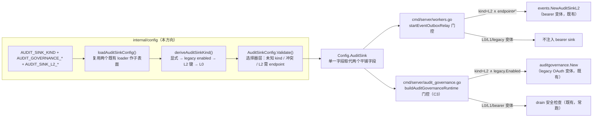

# 设计：泛型 `AuditSinkConfig` —— kind L0/L1/L2 选择器 + legacy L2 mapping

> **配套规格：** `docs/requirements/auditsink-config-v1.md`（FR-1…FR-5 / AC-1…AC-5）· **模块：** `internal/config`（选择层）+ `cmd/server`（双装配点）· **状态：** 设计（未实现）· **基线：** HEAD `acfaaf4` + 工作树 91 个修改文件（未提交批量）
> **门禁：** `make check` 全绿 · 单文件 ≤ 500 行（`config_audit_sink.go` 目标 ~280 行）· 纯 stdlib（I6）· 无新 `go.mod` 依赖 · 无 REST 路由/OpenAPI/DB schema 变更 · 无 `events.AuditSink` 端口变更

---

## 1. 证据复核（独立复验，本次实测：`go build ./...` 退出码 0；逐行对照）

| # | 规格主张 | 复核结论 |
|---|---------|---------|
| E1 | `config_audit_governance.go`：`AuditGovernanceConfig`/`loadAuditGovernanceConfig`(:53)/`readAuditGovernanceBindings`(:86)/`resolveAuditGovernanceSecrets`(:140)/`validateAuditGovernanceURL`(:195) | ✅ 全部精确命中；:140 确认强制 `AUDIT_GOVERNANCE_CLIENT_SECRET_` 前缀 + `os.LookupEnv` 必解析 |
| E2 | `.env.example:186-204` 为 `AUDIT_GOVERNANCE_*` 块；sibling 名在 :185/:188 | ✅ 块确在 :186-204，**16 个键**（规格写"18 个键"，计数差 2——块存在性主张成立）；:185 头注释 "Snaplink Audit Governance durable relay"、:188 行内注释 "Snaplink OAuth token endpoint" 精确 |
| E3 | `docs/configuration.md:264` 显式 sibling 名 | ✅ "Snaplink OAuth token endpoint" 精确命中；`deploy/snaplink-audit-governance-bindings.example.json` 存在 |
| E4 | `config_billing.go` bindings 模式（≤1 MiB、DisallowUnknownFields、EOF 拒绝、env 间接） | ✅ 结构逐项吻合（`readBillingBindings`/`resolveBillingSecrets`/`validateBillingURL`） |
| E5 | `config_validate.go`：`validateCommercialIntegrations`(:38 调用/:51-61 定义)、`validateCommercialCredentialSeparation`(:63-81) | ✅ 精确。**新发现：** :38 对 `governance.Validate()` 是**无条件调用**（disabled 时恒通过——`TestValidate_OK` 证明）；设计必须保留此调用模式 |
| E6 | `internal/auditgovernance/relay.go`：`deliverBatch`(:59)/`boundedBackoff`(:163)/`classifyRelayError`(:181) | ✅ 全部精确（`deliverBatch` 为 `*Runtime` 方法）；另有 `deliverFact`:80/`failFact`:111/`retryFact`:124 |
| E7 | WIP L2 表面：`config_audit_sink_l2.go`、`Config.AuditSinkL2`(config.go:34/66/227)、`config_validate.go:45`、`workers.go:166-175` 隐式 `Endpoint != ""`、`events.AuditSink` 端口 | ✅ 全部精确。`events/audit_sink.go`：`DeliverDeleted(ctx, tenant, factID, payload)` + `ErrSinkNotBound`/`ErrSinkUnauthorized`；`events/audit_sink_l2.go`：redirect-free client、端点复验、`X-Audit-Fact-Id` 回显 commit point |
| E8 | 测试基线：governance 5 个、L2 2 个；`TestAuditSinkL2Config_EndpointScheme` 断言空 Endpoint 恒合法 | ✅ 5+2 精确；:22 测试内 ~:31 断言 `AuditSinkL2Config{}.Validate()==nil`——**"L2 需 endpoint"只能在选择器层强制**的约束成立 |
| E9 | `TestOutboxRelay_DeliversDeletedFactToL2`:432；integration harness `startFullServerWithRelay`:55 / `TestDeleteResponse_DoesNotBlockOnDelivery`:700 / `assertAuditRowFor`:1334 | ✅ 全部精确 |
| E10 | `.env.example` 无任何 `AUDIT_SINK` 键（仅 docs/configuration.md:359-360）——G5 | ✅ grep 证实 |
| E11 | 全仓无 `AuditSinkConfig` 符号、无 `AUDIT_SINK_KIND`——G1/G4 | ✅ grep 零命中 |
| E12 | `config_test.go` 模式：`TestValidate_OK`:194 / `TestLoad_OverridesAndLowercasing`:454 | ✅ 精确 |

### 修正与新增发现（设计据此调整）

- **C1 ⚠️ "未提交 WIP" 不精确：** `git log` 证实 `internal/config/config_audit_sink_l2.go` 与 `internal/events/audit_sink.go` **已提交于 HEAD `acfaaf4`**（其测试 `config_audit_sink_l2_test.go` 反而在未提交批量里被修改）。工作树确有 91 个修改文件，但 L2 表面属**已提交基线**、其文档（docs/configuration.md:359-360）已发布——设计按"永久已发布表面"对待，不做任何"可能被回退"的假设。
- **C2 微漂移：** `validAuditGovernanceConfig()` 定义在 :10（非规格所引 :24；首个调用 :25）。无实质影响。
- **C3 ⚠️ 规格只点名一个装配点，实际有两个：** `cmd/server/audit_governance.go:18` 是 legacy runtime 的**第二门控点**（`!cfg.AuditGovernance.Enabled` ⇒ safe-disable drain 检查；:42 `auditgovernance.New(cfg.AuditGovernance, …)`；:46 日志含 sibling 名）。规格 FR-3/§6 只写 workers.go——设计补全此点（§3.5）。
- **C4 行为变更（本设计故意为之，须写入迁移说明）：** 今日两种 L2 配置可**同时激活**（legacy runtime + bearer sink 双投递）；设计后 = **启动失败**（双重凭据源歧义）。另：今日"仅设 `AUDIT_SINK_L2_BINDINGS_FILE` 无 endpoint"是**静默 no-op**（workers.go 门控只看 `Endpoint != ""`）；设计后 = kind 派生 L2 → 校验失败（fail-fast）。
- **C5 新约束（来自 cmd/server/audit_governance_test.go:26）：** 该测试以 `cfg := &config.Config{}` **零值**调用 `buildAuditGovernanceRuntime`——新门控必须对零值 Config 走 drain-check 路径（`kind==L2 && legacy.Enabled` 为 false），该测试即可**零改动**通过。

---

## 2. 设计总览



**核心决策：** 配置层单一选择表面；装配层**两处**门控都只读 `cfg.AuditSink.Kind`；relay 状态机、`events.AuditSink` 端口、`internal/auditgovernance` runtime **零改动**。

---

## 3. API 变更（具体签名）

### 3.1 新文件 `internal/config/config_audit_sink.go`（≤500 行，目标 ~280）

```go
// AuditSinkKind 是 AuditSink 适配器选择器（FR-1）。
type AuditSinkKind string

const (
	AuditSinkKindL0 AuditSinkKind = "L0" // 本地 audit_log（删除事务内写入，常开；无 endpoint/凭据）
	AuditSinkKindL1 AuditSinkKind = "L1" // 协议面（bus/SSE/webhook，既有 EventsConfig 驱动；无治理凭据）
	AuditSinkKindL2 AuditSinkKind = "L2" // governance 端点投递（bearer 或 legacy OAuth 变体）
)

// AuditSinkConfig 取代 Config.AuditGovernance + Config.AuditSinkL2（config.go:33-34）。
type AuditSinkConfig struct {
	Kind AuditSinkKind // AUDIT_SINK_KIND（大小写不敏感；空 = 派生）

	// L2 bearer 变体 —— 形状与键沿用既有 AuditSinkL2Config（不重命名，避免 WIP churn）。
	Endpoint     string               // AUDIT_SINK_L2_ENDPOINT
	BindingsFile string               // AUDIT_SINK_L2_BINDINGS_FILE
	Bindings     []AuditSinkL2Binding // 由 loadAuditSinkL2Config 解析

	// Legacy —— Snaplink 线上契约整体保留（类型/键/默认/校验零改动）。
	Legacy AuditGovernanceConfig
}

// loadAuditSinkConfig 装载两个子表面（复用 loadAuditGovernanceConfig /
// loadAuditSinkL2Config，不复制解析逻辑），再按 env 派生 Kind 并做冲突检查。
func loadAuditSinkConfig() (AuditSinkConfig, error)

// deriveAuditSinkKind 实现 FR-1 优先级（对 struct 与对 env 同一函数，便于直构测试）：
//   1) AUDIT_SINK_KIND 显式非空 ⇒ 以之为准（值 ∉ {L0,L1,L2} ⇒ error）
//   2) 否则 Legacy.Enabled ⇒ L2（legacy 选择机制，存量零迁移）
//   3) 否则 Endpoint≠"" 或 BindingsFile≠"" ⇒ L2（WIP 表面向后兼容）
//   4) 否则 ⇒ L0（默认；CI 基线形状，I5 不受影响）
// 冲突即失败：显式 kind∈{L0,L1} ∧ (Legacy.Enabled ∨ Endpoint≠"" ∨ BindingsFile≠"")
//   ⇒ error（dead-config）；显式 L2 ∧ Legacy.Enabled ∧ Endpoint≠"" ⇒ error（双重凭据源）。
func deriveAuditSinkKind(c AuditSinkConfig) (AuditSinkKind, error)

// Validate 是选择器层严格校验（FR-2）。不改 AuditSinkL2Config/AuditGovernanceConfig
// 自身规则（空 Endpoint 对 AuditSinkL2Config 恒合法——既有测试钉死，见 E8）。
//   未知 kind ⇒ error；L0/L1 带治理凭据 ⇒ error；
//   L2 且 ¬Legacy.Enabled ∧ Endpoint=="" ⇒ error（BindingsFile 单独不满足）；
//   L2 bearer 变体 ⇒ 委托 AuditSinkL2Config{Endpoint,BindingsFile,Bindings}.Validate()
//   （端点 scheme + binding 卫生复用既有规则）。
// 注意：零值 AuditSinkConfig{} ⇒ 派生 L0 ⇒ 通过（TestValidate_OK 形状保持）。
func (c AuditSinkConfig) Validate() error

// L2Variant 报告 kind=L2 时的凭据源（装配点用；双重源已被拒绝，恰一为 true）。
func (c AuditSinkConfig) L2Variant() (bearer, legacy bool)
```

### 3.2 `internal/config/config.go`

- `Config` 结构体：删除 `AuditGovernance AuditGovernanceConfig`（:32）与 `AuditSinkL2 AuditSinkL2Config`（:34）两字段，新增 `AuditSink AuditSinkConfig`（**替换而非保留平铺字段**：调用点已全量枚举且均为单二进制内部引用，见 §3.6；测试以 `Config.AuditSink.Kind` 断言为准）。
- `Load()`：删除 :62/:66 两个 loader 调用与 :225/:227 两行装配，改为 `auditSink, err := loadAuditSinkConfig()` 单次装载。

### 3.3 `internal/config/config_validate.go`

```go
// :38 调用点签名更新（调用仍无条件——与今天一致）：
if err := validateCommercialIntegrations(c.Billing, c.AuditSink); err != nil { return err }
// :45 取代为：
if err := c.AuditSink.Validate(); err != nil { return err }

func validateCommercialIntegrations(billing BillingConfig, sink AuditSinkConfig) error {
	if err := sink.Legacy.Validate(); err != nil { return err } // 无条件调用，保留今天语义（C5 前提）
	if err := billing.Validate(); err != nil { return err }
	return validateCommercialCredentialSeparation(billing, sink)
}

// 签名从 (Billing, AuditGovernance) 更新为 (Billing, AuditSink)：
//  - legacy 规则原样透传（billing.Enabled && sink.Legacy.Enabled 时：HMAC ≠ billing 凭据、
//    legacy client_id/secret_env/secret 与 billing 三互异）——审计行为零变化；
//  - 新增：billing.Enabled && sink.Kind==L2 && sink.Endpoint!="" 时，各 resolved bearer
//    token（inline 或 token_env 解析后）与每个 billing ClientSecret 互异。
//    （Legacy 与 bearer 不能共存——冲突已被选择器拒绝——故"三者互异"退化为两对互异。）
func validateCommercialCredentialSeparation(billing BillingConfig, sink AuditSinkConfig) error
```

### 3.4 `cmd/server/workers.go`（bearer 注入点）

提取可单测的辅助函数（`startEventOutboxRelay` 现有 goroutine 形状不便直测）：

```go
// auditSinkForEventOutbox 按 kind 选择 relay 的 bearer sink（FR-3）。
// kind=L2 ∧ Endpoint≠"" ⇒ NewAuditSinkL2（bearer 变体，既有逻辑）；
// 其余（L0/L1/legacy 变体）⇒ nil。kind 检查是第二道防线（config 已拒绝冲突，
// 直构 Config 跳过 Validate 时不至于双投递——与"双重强制"模块纪律一致）。
func auditSinkForEventOutbox(cfg *config.Config, timeout time.Duration, logger *slog.Logger) (events.AuditSink, error)
```

`startEventOutboxRelay` 内：`:166` `if cfg.AuditSinkL2.Endpoint != ""` 整块替换为对上述辅助函数的调用；并**无条件**输出选择日志：`logger.Info("event outbox relay audit sink", "kind", string(cfg.AuditSink.Kind), "variant", "bearer"|"none")`（FR-3 启动日志要求；`auditSinkL2Bindings` helper :191 保留不动）。

### 3.5 `cmd/server/audit_governance.go`（legacy runtime 门控点 —— 规格 C3 补全）

```go
func buildAuditGovernanceRuntime(cfg *config.Config, repo repository.Repository, logger *slog.Logger) (*auditgovernance.Runtime, error) {
	legacy := cfg.AuditSink.Legacy
	if !(cfg.AuditSink.Kind == config.AuditSinkKindL2 && legacy.Enabled) {
		// 与今天完全相同的 safe-disable drain 检查（kind=L0/L1/bearer 变体时照跑：
		// 持久化 legacy 绑定未排空 ⇒ 启动失败——安全不变量不因 kind 模型放宽）。
		// 零值 Config{}（cmd/server/audit_governance_test.go:26 直构）走此路径 ⇒ 既有测试零改动。
		...
		return nil, nil
	}
	runtime, err := auditgovernance.New(legacy, store, logger) // 签名不变；传子表面
	...
	// 日志去品牌化（FR-4 精神；无测试断言该串，已验证）：
	logger.Info("legacy L2 audit governance relay enabled", "tenants", ..., "revision", ...)
}
```

**门控语义对照（今日 → 设计后）：**

| 配置组合 | 今日行为 | 设计后行为 |
|---------|---------|-----------|
| legacy enabled（无 L2 键） | legacy runtime 起；无 bearer sink | 派生 L2 legacy：同左（零迁移） |
| L2 endpoint 设（legacy 关） | bearer sink 起；无 legacy runtime | 派生 L2 bearer：同左 |
| **两者都设** | **双投递（legacy runtime + bearer sink）** | **启动失败（双重凭据源，C4）** |
| 仅 L2 bindings file（无 endpoint） | 静默 no-op（sink 不建） | 派生 L2 → 校验失败（fail-fast，C4） |
| 全缺省 | 隐式 L0 | 派生 L0（显式断言） |

### 3.6 调用点全量清单（已 grep 枚举，替换字段的全部影响面）

| 文件 | 今日引用 | 变更 |
|------|---------|------|
| `internal/config/config.go` :32/:34/:62/:66/:225/:227 | 字段 + loader + 装配 | §3.2 |
| `internal/config/config_validate.go` :38/:45/:52/:64 | `validateCommercialIntegrations` | §3.3 |
| `cmd/server/workers.go` :166-175/:191 | bearer 注入 | §3.4 |
| `cmd/server/audit_governance.go` :18/:23/:42/:47 | legacy 门控 + `New` 实参 | §3.5 |
| `cmd/server/audit_governance_test.go` :26（`&config.Config{}`） | 零值直构 | **零改动**（C5 门控设计保证） |
| `internal/config/config_audit_governance_test.go`（5 个）/`config_audit_sink_l2_test.go`（2 个） | 直构子类型 | **零改动**（类型与规则不变） |

`internal/auditgovernance/*`（消费 `config.AuditGovernanceConfig`/`AuditGovernanceBinding`）、`internal/events/*`（端口与适配器）**零改动**。

---

## 4. 兼容性约束（不变量）

| # | 约束 | 依据 |
|---|------|------|
| K1 | 全部 env 键不变：`AUDIT_GOVERNANCE_*`（16 键）、`AUDIT_SINK_L2_ENDPOINT`/`AUDIT_SINK_L2_BINDINGS_FILE`；仅**新增** `AUDIT_SINK_KIND` | 存量部署零 env 迁移（FR-1） |
| K2 | `AuditGovernanceConfig`/`AuditGovernanceBinding`/`AuditSinkL2Config`/`AuditSinkL2Binding` 类型与各自 `Validate()` 规则**零改动**（含"空 Endpoint 恒合法"） | E8 既有测试钉死 |
| K3 | `auditgovernance.New(cfg config.AuditGovernanceConfig, …)` 签名不变；`events.AuditSink` 端口（`DeliverDeleted`）不变；relay 状态机/退避/租约/载荷不变 | §5 范围纪律 |
| K4 | `validateCommercialIntegrations` 对 legacy 子配置的**无条件调用**模式保留（disabled 恒通过） | C5/`TestValidate_OK` |
| K5 | 默认派生 L0 ⇒ CI 基线（SQLite+local FS+无凭据）形状不变；`nil` sink 语义不变（claim→complete，L0 `audit_log` 权威） | I5 |
| K6 | 零值 `Config{}`/`AuditSinkConfig{}` 通过 `Validate()` 且装配走 drain-check 路径 | `TestValidate_OK`:194、`TestDisabledAuditGovernanceRequiresPersistedBindingsRemoved` |
| K7 | legacy bindings 文件路径与 JSON 形状、`deploy/snaplink-audit-governance-bindings.example.json` 文件名**不改**（只去品牌化注释文案） | §5 范围纪律 |
| K8 | **行为变更（有意，须文档化）：** "legacy+L2 双设"从双投递变为启动失败；"仅 bindings file"从静默 no-op 变为启动失败 | C4，迁移说明 §6 |
| K9 | `Config.AuditGovernance`/`Config.AuditSinkL2` 字段删除 = 内部 Go API 破坏——影响面仅 §3.6 六处，单二进制无外部消费者 | 已枚举 |

---

## 5. 失败模式

| # | 条件 | 结果 | 检测层 |
|---|------|------|--------|
| F1 | `AUDIT_SINK_KIND` 非空且 ∉ {L0,L1,L2}（含 `l3`/`foo`；空串走派生不在拒绝集） | `Load()`/`Validate()` 报错 | 选择器层（新增） |
| F2 | kind=L0/L1 + `AUDIT_GOVERNANCE_ENABLED=true` | 启动失败（dead-config） | 选择器层（新增） |
| F3 | kind=L0/L1 + 任一 `AUDIT_SINK_L2_*` 非缺省 | 启动失败（dead-config） | 选择器层（新增） |
| F4 | kind=L2 + legacy 关 + `AUDIT_SINK_L2_ENDPOINT` 空（含仅 bindings file） | 启动失败（L2 需 endpoint） | 选择器层（新增；C4） |
| F5 | kind=L2 + legacy enabled + `AUDIT_SINK_L2_ENDPOINT` 也设 | 启动失败（双重凭据源） | 选择器层（新增；C4） |
| F6 | kind=L2 bearer + 端点 scheme 非法（非 HTTPS/非 loopback HTTP/含凭据等） | 启动失败 | 既有 `validateAuditGovernanceURL`（经 `AuditSinkL2Config.Validate` 委托） |
| F7 | legacy env 错配（缺 secret、前缀不符、bindings 纪律违例、URL 非法） | 启动失败 | 既有 `loadAuditGovernanceConfig` 链（零改动） |
| F8 | L2 bindings 文件纪律违例（0600/≤1 MiB/未知字段/trailing JSON/token 卫生/重复） | 启动失败 | 既有 `loadAuditSinkL2Config` 链（零改动） |
| F9 | bearer 变体运行时端点不可达/5xx | relay 退避重试 → 超 MaxAttempts 终态；不阻断删除响应 | 既有状态机（零改动） |
| F10 | 租户无绑定 | `ErrSinkNotBound` ⇒ complete 无投递；启动日志 `bindings: 0` | 既有（零改动） |
| F11 | L2 目标 401/403 | `ErrSinkUnauthorized` ⇒ 立即终态 | 既有（零改动） |
| F12 | legacy 持久化绑定未排空且 runtime 不跑（L0/L1/bearer） | 启动失败（drain 检查，与今天一致） | 既有（门控保序） |

**残余风险（记录）：** 派生依赖精确 env 拼写（如 `AUDIT_GOVERNANCE_ENABLED` 拼错则落入 L0）——缓解：启动日志无条件输出所选 kind（FR-3），运维可即时发现；不引入额外告警机制（范围纪律）。

---

## 6. 迁移步骤

**阶段 0 —— 基线快照：** 当前工作树 `make check` 全绿记录；`go test ./internal/config/ ./internal/events/ ./cmd/server/ ./internal/integration/` 计数留档。

**阶段 1 —— 配置表面（独立可合入 commit）：**
1. 新增 `internal/config/config_audit_sink.go`（§3.1）；`config.go` 字段替换 + `loadAuditSinkConfig()` 接线（§3.2）；`config_validate.go` 更新（§3.3）。
2. 新增 `config_audit_sink_test.go`（AC-1 全项）。
3. 回归：既有 5+2 子类型套件 + `TestValidate_OK`/`TestLoad_OverridesAndLowercasing` 零改动全绿。**此阶段不碰装配**——`Config.AuditGovernance` 消失会让 cmd/server 编译失败，故阶段 1 与 2 必须同 commit 或阶段 1 暂时保留两个旧字段（二选一；推荐**同 commit**，因为 §3.6 影响面已枚举且单二进制无外部消费者）。

**阶段 2 —— 装配 + 测试（与阶段 1 同 commit 或紧随）：**
4. `workers.go`：§3.4 辅助函数提取 + kind 门控 + 启动日志。
5. `audit_governance.go`：§3.5 门控改造（零值路径保持）+ 日志去品牌化。
6. 新增：`cmd/server` kind 门控单测（§7 AC-4a）；`event_outbox_relay_test.go` 扩展（AC-2/AC-3）；`internal/integration` 扩展（AC-4b）。

**阶段 3 —— 文档（与实现同 commit，FR-5）：**
7. `.env.example`：新增 `AUDIT_SINK_KIND`（注释含 L0/L1/L2 语义与派生优先级）与 `AUDIT_SINK_L2_ENDPOINT`/`AUDIT_SINK_L2_BINDINGS_FILE` 条目（G5 修复）；legacy 块注释去品牌化（:185/:188 → "legacy L2 governance adapter (OAuth client-credentials + HMAC)"），**键名与默认值不动**。
8. `docs/configuration.md`：审计 sink 段重写为 kind 表 + legacy mapping 小节（标注"存量键，新部署用 `AUDIT_SINK_KIND`"）；文档化 K8 两条行为变更。

**阶段 4 —— 全量回归：** `make check`；`go test ./internal/config/ ./internal/events/ ./cmd/server/ ./internal/integration/`。

**运维迁移表：**

| 存量部署形态 | 动作 |
|-------------|------|
| `AUDIT_GOVERNANCE_*`（Snaplink OAuth） | **零动作**（自动派生 L2 legacy，行为与今天完全一致） |
| `AUDIT_SINK_L2_*`（bearer） | **零动作**（自动派生 L2 bearer） |
| **两者都设** | **必须删除其一**（升级后启动失败——K8） |
| 仅 `AUDIT_SINK_L2_BINDINGS_FILE` | 补 `AUDIT_SINK_L2_ENDPOINT` 或删文件（升级后启动失败——K8） |
| 新部署 | `AUDIT_SINK_KIND=L0\|L1\|L2`（缺省 L0） |

**回滚：** 回退实现 commit 即可；env 键零变化 ⇒ 无 ops 回滚动作。

---

## 7. 验收映射（AC → 具体测试 → 断言锚点 → 门禁）

| AC（规格 §4） | 测试文件/函数（新增） | 关键断言与锚点 | 门禁 |
|---------------|---------------------|---------------|------|
| **AC-1** kind 解析/派生/严格校验 | `internal/config/config_audit_sink_test.go`：`TestAuditSinkKind_ParseAndDerive`、`TestAuditSinkKind_StrictValidation`、`TestAuditSinkConfig_L2Variant` | ① `t.Setenv` + `config.Load()` 模式（锚 `TestLoad_OverridesAndLowercasing`:454）：`l0`/`L0`/`L1`/`L2` 均解析；空+全缺省 ⇒ `Config.AuditSink.Kind=="L0"`；仅 `AUDIT_GOVERNANCE_ENABLED=true`（+ 完整必填 legacy 集）⇒ L2；仅 `AUDIT_SINK_L2_ENDPOINT` ⇒ L2；② 冲突/未知/缺 endpoint 各 ⇒ `Load()` 报错（F1-F5）；③ L1 零凭据 ⇒ 成功；④ 直构 `AuditSinkConfig{}` ⇒ `Validate()==nil`（K6）；⑤ `TestAuditSinkL2Config_EndpointScheme` 空 Endpoint 断言**保持成立**（选择器层强制） | `go test ./internal/config/` + `make check` |
| **AC-2** outbox 投递按 kind 路由 | `internal/events/event_outbox_relay_test.go`：`TestOutboxRelay_SinkSelectedByConfigKind`（镜像 `TestOutboxRelay_DeliversDeletedFactToL2`:432） | 同一 relay 构造路径仅 `opts.AuditSink` 差异：nil ⇒ L2 httptest 目标**零 POST** + complete（`status=='delivered'`）；注入 sink ⇒ **恰 1 次 POST**（`Authorization: Bearer <token>`）+ complete；"共享同一状态机"的证据 = `deliverFact`/`deliverDeleted` 内**无 kind 分支**（grep 断言） | `go test ./internal/events/` |
| **AC-3** payload 字节恒等 | `internal/events/event_outbox_relay_test.go`：`TestOutboxRelay_L2PayloadByteIdentical` | relay claim → L2 POST 请求体 `bytes.Equal(body, event_outbox.payload)`（verbatim，不 enrich/不重排）；envelope @1.1 字段集锚定既有 schema golden；kind 切换不改变 payload 来源（单一生产者） | `go test ./internal/events/` |
| **AC-4a** 装配门控单测 | `cmd/server/audit_governance_test.go` 扩展 + 新增 workers 门控测试 | `buildAuditGovernanceRuntime`：kind=L2+legacy ⇒ runtime 非 nil；kind=L0/L1/bearer ⇒ nil 且 drain 检查照跑（复用 `TestDisabledAuditGovernanceRequiresPersistedBindingsRemoved` 三态形状：fresh/drained/undrained）；`auditSinkForEventOutbox`：kind=L2+bearer ⇒ sink 非 nil，L0/L1/legacy ⇒ nil；零值 `Config{}` 全绿（K6） | `go test ./cmd/server/` |
| **AC-4b** 组合 e2e | `internal/integration/fullserver_test.go`：`TestComposition_AuditSinkKindEndToEnd` | 新增 harness 变体 `startFullServerWithAuditSinkConfig(t, *config.Config)`（镜像生产装配 ~10 行，注释标明镜像；现 harness :55 直构 relay 不经 `config.Load()`）：① kind=L2 bearer ⇒ 治理 httptest sink 收到 deleted@1.1 POST + `assertAuditRowFor`(:1334) 行存在；② kind=L0 ⇒ 治理端点零 POST + audit_log 行；③ kind=L1 ⇒ 零治理 env 启动成功、删除 2xx、audit_log 行；④ 三种 kind 下删除响应均不等待投递（复用 :700 语义）；⑤ 启动日志含 `kind=L2`（可选：harness logger 捕获断言） | `go test ./internal/integration/` |
| **AC-5** 回归 | 既有全套件 | `config_audit_governance_test.go`（5 个）+ `config_audit_sink_l2_test.go`（2 个）**零改动**通过；`internal/auditgovernance` 零改动；`events.AuditSink` 端口签名零改动 | `make check` |

---

## 8. 范围纪律（明确不做，与规格 §5 对齐 + 设计期新增）

- `events.AuditSink` 端口（`DeliverDeleted`）签名不动；relay 状态机/退避/租约/载荷处理不动（sibling 方向所有物）。
- `AUDIT_SINK_L2_*` 键不重命名（已是泛型无 sibling 命名的表面；重命名 = churn）。
- `internal/auditgovernance` runtime 不动（legacy 消费侧原样保留）。
- auth 面 Snaplink SDK 引用（`config_auth_validate.go:27`、`cmd/server/auth.go:37`、billing 日志串）不动——AGENTS.md §2.5 既有契约。**仅** audit sink 面相关日志/注释去品牌化（`audit_governance.go:44/:46`、`.env.example:185/188`、docs/configuration.md:264）。
- L1 的具体投递路由设计（deleted@1.1 经协议面细节）不做——L1 = 配置断言 + 无凭据自举 + 装配 no-op 分支（有测试钉死的显式分支，非 TODO 钩子）。
- 无 DB schema/迁移（I2 零触碰）；无 REST/OpenAPI 变更；无新依赖（I6）；单测仅 `testing`。
