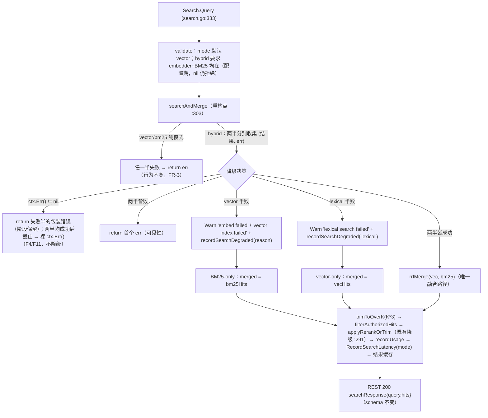

# 设计：hybrid 检索模态级降级 —— embedder/vector 超时降级为 BM25-only，而非硬 500

> **配套规格：** `docs/requirements/d1-drill-ai-read-path-degrade-v1.md`（FR-1…FR-3 / AC-1…AC-5）· **模块：** `internal/ai` + `internal/telemetry` + `internal/api/rest`（缝测试）· **状态：** 设计（未实现）· **基线：** HEAD `15763e2`
> **修订：** v2 汇入三轮评审修订（failure_mode / observability / testing），逐项追踪见 §9；迁移步骤扩为 **M1–M9**（M9 = 告警 + 仪表盘 + AGENTS.md §3 计数修复）。
> **门禁：** `make check` 全绿（gofmt / build / vet / test）· 单文件 ≤ 500 行 · 纯 stdlib（I6，无新 `go.mod` 依赖）· I4（中间件链不动）· I2（零迁移）· **无 REST 路由 / OpenAPI / 配置键变更**

---

## 1. 证据复核（规格全部主张独立复验；行号为复核时实测，与规格验证表一致）

| # | 规格引用 | 独立复核结论 |
|---|---------|-------------|
| E1 | `search.go:303-331` searchAndMerge 硬失败，`:309`/`:317` `return nil, err` | ✅ 精确。`searchAndMerge` 于 `:303`；`:309`（vector 半）、`:317`（lexical 半）两处 `return nil, err`，直接丢弃另一模态已收集结果 |
| E2 | `search.go:168-189` searchVector，`:171`/`:178` 错误上抛 | ✅ 精确。`:171` `fmt.Errorf("embed query: %w", err)`、`:178` `fmt.Errorf("search chunks: %w", err)`——**这两个包装前缀是本设计 `degradeReason` 分类的锚点**（§3.2） |
| E3 | `search.go:285-301` applyRerankOrTrim 降级先例，`:291` warn | ✅ 精确。`s.logger.Warn("rerank failed; using raw order", "err", err)` + 原始排序——本设计 warn 风格同源 |
| E4 | REST 缝 500：`rest/search.go:78`（Search）`:174`（Chat）`:215`（Agent）；`router.go:253` `mw.RequestTimeout`；`main.go:156` `aiTimeout` | ✅ 精确。AI 组 `r.Use(mw.RequestTimeout(aiTimeout))` 于 `router.go:258`（规格 253 为组内首行，同一闭包）；`aiTimeout := REQUEST_TIMEOUT_SECONDS` 于 `main.go:156`。`NewRouter` 签名 `router.go:214` 含 `aiTimeout`/`aiDegraded` 形参 |
| E5 | `middleware/timeout.go:14-26` | ✅ 精确。`RequestTimeout` 于 `:14`-`:26`，`context.WithTimeout` 注入，注释明示 *"all AI pipeline calls honour context cancellation"* |
| E6 | `embedder.go:106` 30s 客户端超时；`rerank.go:44` 同值 | ✅ 两处均精确逐行命中 |
| E7 | `metrics.go:276-281` IncIndexerSkip；声明 `:31`、注册 `:77` | ✅ 精确。`mIndexerSkip` 字段 `:31` 区、`Int64Counter("indexer.skip_total")` `:77` 区、`Add` 带 `reason` 属性 `:281`——新计数器完整镜像目标 |
| E8 | Chat 经共享 `search.Query`（chat.go:132） | ✅ 精确。`chat.go:132` `c.search.Query(ctx, Request{...})`，`:137` `"retrieval: %w"` 包装 → Chat 500；Agent 工具 search 同路径——降级自动传导 |
| E9 | REST 缝零 AI handler 测试 | ✅ 全仓 `NewAIHandler` 在 `*_test.go` 零命中（本次实测）。AC-2 为新建，非扩展 |
| E10 | 测试基建：`newTestEnv`（integration_test.go:26-64）、`seedChunks`（`:58`）、`testTenant/testBucket`（`:17-18`）、`NewBM25()+BuildFromRepo`（bm25.go:48/:76；integration_test.go:95/:197 先例）、`fakeVectorIndex`（vectorindex_test.go:12-20）、`recordEmbedUsage` 包变量缝（embedder.go:21）、`scrapeValue` 行精确解析（metrics_test.go:57-75；评审实测 :61，原引 :42-55 为引文漂移，符号与语义一致）、`mw.Auth` 透传（middleware.go:113，`reg==nil` 时 router.go:229 同款） | ✅ 全部精确命中，可直接引用 |
| E11 | 规格补充事实：`Request.Mode` 空值默认 `"vector"`（search.go:157-160）；hybrid 校验要求 embedder+BM25 均可用（`:136-143`）；`searchLexical` 用 `s.embedder.Name()` 做 `matchesEmbedModel` 过滤（`:195-198`） | ✅ 精确。**失败 embedder 的 `Name()` 必须等于种子 chunk `EmbedModel`**——AC-1 fixture 内建约束 |
| E12 | `searchResponse` schema（dto.go:100-103） | ✅ `{query, hits}`，本次设计零改动 |
| E13 | 评审复核事实：`middleware/timeout.go:21` 是请求路径**唯一**截止时间注入点（grep `internal/middleware/`+`internal/api/rest/` 无其他 `WithTimeout`/`WithDeadline`）；`REQUEST_TIMEOUT_SECONDS` 默认 **120s**（config.go:80）；`WithResultCache` 在 main.go **零调用点**（结果缓存未接线） | ✅ 全部精确。F4/F11 判别（E13 前半）、F1 超时分支可达性（120s 默认）、缓存计数交互（§4.3）的前提事实 |
| E14 | 评审复核事实：alerts.yml 实为 **14 条规则 / 5 组**（http 2 · ai-cost 2 · integrity 6 · ai-latency 3 · audit-governance 1），而 AGENTS.md §3 Ops 行声称「12 条告警（四组）」——B3-2 引入 `AuditGovernanceBacklogDegraded` 时未同步计数，**漂移在 HEAD 已存在**；AI/Ops 仪表盘实测 12 panel | ✅ 精确。M9 一并修复漂移（→ 15 条 / 六组 / 13 panel），否则 AGENTS.md §3 在本次变更后仍不真实 |
| E15 | 评审复核事实：`scrapeValue`（metrics_test.go:61）按系列名匹配并返回**首个**命中行——多标签系列无法逐行断言；`internal/ai` 全包零 `t.Parallel`（-race 下缝替换安全） | ✅ 精确。AC-4 需标签感知变体（M5）；degrade_test.go 不引入并行（M3 约束） |

**结论：** 规格全部主张成立；本设计锚定三个真实缺口 G1（无降级）、G2（无遥测）、G3（无测试），全部增量实现。

---

## 2. 设计总览

核心决策：**降级决策收敛在 `searchAndMerge` 一处**（两半结果与错误齐备之处），`searchVector`/`searchLexical` 行为零改动；hybrid 下某半失败 → 以健康半结果走既有管线（`trimToOverK` → 鉴权过滤 → rerank 降级 → usage → 延迟直方图 → 结果缓存），warn + 计数器；纯模式、两半皆败、ctx 已 done → 错误原样上抛（可见性优先）。



**判定顺序（hybrid 分支，固定）：** `ctx.Err() != nil` → 两半皆败 → vector 半败 → lexical 半败 → 融合。`ctx` 检查在最前：截止时间已触发时词法半在同一 ctx 上同样无法完成，降级无意义且会掩盖超时根因（FR-1 边界）。

**ctx 分支的返回体（评审修订 R2）：** 若某半已失败，返回该半的**包装错误**（`embed query:` / `search chunks:` / `lexical search:` 阶段信息保留，`errors.Is(err, context.DeadlineExceeded)` 语义不变）；仅当两半**均已成功**而截止恰在检索结束与 switch 之间的微秒窗口触发（F11）才返回裸 `ctx.Err()`——保证 500 响应体携带阶段信息，避免「embed 阶段截止」退化为无阶段裸错误（今日行为反而不退化）。

---

## 3. API 变更

### 3.1 新增符号（共 3 个）

**① `internal/telemetry/metrics.go` —— 新导出函数**（三处改动，逐行镜像 IncIndexerSkip `:31/:77/:279-281`）：

```go
// 字段声明区（:31 区，mIndexerSkip 旁）
mSearchDegraded          metric.Int64Counter

// initDomain 注册区（:77 区，mIndexerSkip 旁）
mSearchDegraded, _ = m.Int64Counter("ai.search.degraded")

// 函数区（:279 区，IncIndexerSkip 旁）
// IncSearchDegraded counts one degraded search read path, attributed by
// reason ("embed" | "vector" | "lexical") so operators can distinguish a
// healthy BM25-only result from a degraded fallback.
func IncSearchDegraded(ctx context.Context, reason string) {
	initDomain()
	mSearchDegraded.Add(ctx, 1, metric.WithAttributes(attribute.String("reason", reason)))
}
```

Prometheus 导出名 **`ai_search_degraded_total{reason="embed"|"vector"|"lexical"}`**。固定 3 值标签，无基数风险。

**② `internal/ai/search.go` —— 新包变量缝**（文件顶部，镜像 `embedder.go:21` 的 `recordEmbedUsage`）：

```go
// recordSearchDegraded reports degraded hybrid-search fallbacks. It's a
// package var so tests can observe reasons without a metrics reader.
var recordSearchDegraded = telemetry.IncSearchDegraded
```

**③ `internal/ai/search.go` —— 新私有分类辅助**：

```go
// degradeReason classifies a vector-half failure for the degraded counter.
// Anchored on searchVector's stable wrapper prefixes (search.go:171/:178);
// drift falls back to "vector" and is caught JOINTLY by D-AC-6 (literal +
// emission-side pins) and AC-1 (end-to-end reasons==["embed"]): classifier
// drift → D-AC-6 red; wrapper drift → AC-1 red; both changed → pin moves
// with the change (correct procedure).
func degradeReason(err error) string {
	switch {
	case err == nil:
		return ""
	case strings.HasPrefix(err.Error(), "embed query:"):
		return "embed"
	default:
		return "vector" // "search chunks:" 或任何前缀漂移
	}
}
```

> 设计决策：**不用字符串匹配以外的机制**——`searchVector` 的两个包装前缀定义在本文件内（同地修改），且由 D-AC-6 + AC-1 **联合**钉死（见上方注释）；`errors.As` 类型标记方案需改动 `searchVector`（规格明确"不改"），收益不成比例。需要新增 `"strings"` import（当前 search.go 未引入）。
> **已知保守错标：** `search.go:174` `"embedder returned no vectors"`（无前缀、无 `%w`）→ `"vector"`——embed 半失败标成 vector 半，与 F8 回退同语义（保守、不 panic、不误降级），D-AC-6 显式钉住该输入。

### 3.2 行为契约变更（唯一用户可见变更）

| 场景 | 现状 | 变更后 |
|------|------|--------|
| `POST /v1/search {"mode":"hybrid"}` + embedder 超时/5xx/拒连 | **500** `InternalError`（:78），BM25 结果被丢弃 | **200** + BM25-only 命中 + warn + `ai_search_degraded_total{reason="embed"}` |
| hybrid + 向量后端（pgvector/Qdrant）故障 | **500** | **200** + BM25-only + warn + `reason="vector"` |
| hybrid + 词法后端（pgFTS）故障 | **500** | **200** + vector-only + warn + `reason="lexical"` |
| hybrid + 两半皆败 | 500（首个错误，vector 半优先，带阶段包装）——不计数 | 既有错误面；D-AC-7 钉具体错误（R3） |
| hybrid + ctx 已 done 且某半失败（F4） | 500 该半**包装错误**（阶段保留，`errors.Is(err, context.DeadlineExceeded)` 仍成立）——不降级、不计数 | 错误链含 `embed query:`/`search chunks:` + deadline；D-AC-8a 钉（R2） |
| hybrid + ctx 已 done 且两半均成功（F11 竞态窗口） | 500 裸 `ctx.Err()`——与 HEAD 的 200（健康结果在手）**有意差异**，截止后一律不降级 | 错误链无阶段（仅此一情形）；D-AC-8b 钉（R1） |
| 纯 `vector` / `bm25` 模式任何失败 | 500 | **500（不变，FR-3 回归钉）** |
| `/chat` `/chat/stream` `/agent` | — | 经共享 `search.Query`（chat.go:132）**自动受益**；检索整体失败时错误面不变 |

`/chat` 语义、预算 402、SSE 错误帧形状、`aiDegraded` 503 kill-switch（rest/search.go:37-47）均不动。

> **评分语义注记（评审 Q2）：** 降级单模态命中携带**原始模态分数**（BM25 原始分 / 向量分），健康 hybrid 命中携带 RRF 分数（≈0.016）——同 chunk 在降级/健康响应中 `Hit.Score` 量纲不同。纯模式本就暴露原始分，属既有差异；文档明示、不改。

### 3.3 明确不变的 API

`ai.Search.Query` 签名、`ai.Request`/`ai.Hit` 结构、`searchResponse{query,hits}` JSON、`openapi.json`、REST 路由、中间件链（I4）、全部配置键、`ai.search.duration_ms` 语义（降级路径照常以 `mode="hybrid"` 记录）——零改动。

---

## 4. 兼容性约束

1. **错误链兼容：** 降级仅发生在 hybrid 且单半失败；所有错误路径返回的包装消息与今日逐字节一致（`embed query:` / `search chunks:` / `lexical search:` / `retrieval:`），REST 500 响应体形状不变，`errors.Is(err, context.DeadlineExceeded)` 语义不变（`%w` 链未改）。**500 响应体增强（R2）：** 截止时间分支改返失败半的包装错误（阶段保留），仅 F11 竞态情形返回裸 `ctx.Err()`——对今日行为唯一响应体差异是**增加**阶段信息（`embed query: … context deadline exceeded` 不再退化为裸 `context deadline exceeded`），`errors.Is` 语义不变。
2. **鉴权与租户：** `filterAuthorizedHits` 对降级结果照常执行（降级不绕过 HitAuthorizer）；`recordUsage` 按降级命中照常写 `ai_usage`（审计面不变）。
3. **结果缓存：** 降级结果可入缓存（`resultCacheKey` 不变）——"结果可陈旧"是 `WithResultCache` 既有属性，本设计不改；缓存命中路径不产生降级计数（计数只在实际降级时 +1）。**计数交互（评审 Q5）：** 缓存命中不计数；若运维启用 `WithResultCache`（当前 main.go 零调用点、未接线，E13），降级结果被缓存后计数器降至**每 TTL 一次**——计数语义 = 「实际执行降级」而非「用户感知降级」，文档明示。
4. **`nil` embedder / BM25 语义不变：** validate（search.go:136-143）在配置期拒绝，降级路径前提是"已配置但运行期失败"，与 I5 一致。
5. **并发安全：** OTel 计数器并发安全；`recordSearchDegraded` 包变量缝仅测试替换，生产路径无竞态（与 `recordEmbedUsage` 同模式）。
6. **多实例：** 计数器为进程内（同 IncIndexerSkip），无跨实例聚合保证需求。
7. **顺序依赖：** 无装配顺序变化；`NewSearch`/`WithBM25`/`WithLexicalIndex`/`WithVectorIndex` 组合方式不变。
8. **`ai_search_degraded_total==0` ≠ 索引健康（评审 Q5 明示）：** 不报错的损坏（垃圾 embedding、静默错序）不触发降级、不计数、照常 200——既有盲区，计数器无法覆盖；勿将零值读作「索引健康」信号。

---

## 5. 失败模式

| # | 失败场景 | 行为 | 可观测信号 |
|---|---------|------|-----------|
| F1 | embedder 30s 客户端超时 / HTTP 5xx / 连接拒绝（embedder.go:106） | hybrid → BM25-only 200；纯 vector → 500 | warn `embed failed; …` + `reason="embed"` |
| F2 | 向量后端（pgvector/Qdrant）`SearchVectors` 报错 | hybrid → BM25-only 200；纯 vector → 500 | warn `vector index failed; …` + `reason="vector"` |
| F3 | 词法后端（pgFTS）`SearchLexical` 报错 | hybrid → vector-only 200；纯 bm25 → 500 | warn `lexical search failed; …` + `reason="lexical"` |
| F4 | `REQUEST_TIMEOUT_SECONDS` 截止时间在 embed 阶段触发（ctx 已 done、该半已失败） | **500 失败半的包装错误**（`embed query: … context deadline exceeded`，阶段保留；`errors.Is(err, context.DeadlineExceeded)` 成立），不降级、不计数；mock 嵌入器返回 `DeadlineExceeded` 但**不取消**传入 ctx 时才降级（AC-1 判别条件）。**可达性注记（R4）：** `REQUEST_TIMEOUT_SECONDS < 30`（embedder.go:106 客户端超时）时截止总先于客户端超时，F1 的超时降级分支**永不可达**（仅快速 5xx/拒连可降级）；默认 120s（config.go:80）无碍 | 错误链含 `embed query:` + `context deadline exceeded`（D-AC-8a 钉） |
| F5 | 两半皆败 | 500（首个错误，vector 半优先），**不计数**（错误本身已可见，FR-2） | 既有错误面 |
| F6 | 降级后 reranker 失败 | 既有 `applyRerankOrTrim` warn + 原始排序（search.go:291），无新行为。**截止时间不对称（R5，需文档明示）：** 同一 deadline——检索阶段 → 500（新策略拒降级）；rerank 阶段 → warn + 200 原始排序（既有策略吞掉一切错误含 ctx deadline）。依据充分（检索截止=结果不完整；rerank 截止=结果已完整），但运维面对「同一超时有时 500 有时 200」须有据可查 | warn `rerank failed; using raw order` |
| F7 | 降级后 `recordUsage` 失败 | warn + 继续（既有 :403），不影响响应 | warn `audit usage failed` |
| F8 | `searchVector` 包装前缀漂移（如改为 "embedding failed"） | `degradeReason` 回退 `"vector"`——标签可能错标但**绝不 panic、绝不误降级**；**联合钉（R8/R12，评审强制）：** D-AC-6 钉字面量 + 发射锚点（真实 `searchVector` 返回含 `"embed query:"`），AC-1 钉端到端 `reasons==["embed"]`——任一方向漂移即 CI 红，两钉不可互相替代；`:174` "embedder returned no vectors" 无前缀同样落 `"vector"`（已知保守错标，D-AC-6 钉住） | `reason="vector"`（保守默认） |
| F9 | 计数器注册失败（OTel 不可用） | `Int64Counter` 返回 nil 计数器 + 忽略错误（既有模式），`Add` no-op——降级行为不受遥测故障影响 | 无（遥测缺失本身由 scrape 告警覆盖） |
| F10 | 标签基数 | `reason` 固定 3 值，`mode`/`tenant` 不入标签；告警 `sum by (reason)`（M9）同样限 3 值——无高基数风险 | — |
| F11 | 截止时间在两半**均已成功**后触发（检索结束与 switch 之间的微秒窗口） | **500 裸 `ctx.Err()`**——与 HEAD 的 200（健康结果在手）有意差异：一致性优先，截止后一律不降级；D-AC-8b 钉死（R1） | 错误链 `context deadline exceeded`（无阶段，仅此一情形） |

**降级安全边界（不变量）：** 降级只在「另一模态在同一 ctx 上已成功返回结果」时发生；任何错误路径的响应码与今日一致（200 只发生在有健康结果时）。无新增 500→200 静默映射，除 hybrid 单半失败外。**F11 是唯一「手握健康结果仍 500」的情形**（评审 Q1 Caveat 1 强制枚举）；其余 500 均无健康结果或截止已触发。

---

## 6. 迁移步骤

无数据迁移、无配置迁移、无 OpenAPI 变更——纯代码增量，按序：

| 步 | 文件 | 内容 | 门禁 |
|----|------|------|------|
| M1 | `internal/telemetry/metrics.go` | 3 处：字段声明（:31 区）→ `initDomain` 注册 `Int64Counter("ai.search.degraded")`（:77 区）→ `IncSearchDegraded`（:279 区，镜像 IncIndexerSkip） | `go build ./...` |
| M2 | `internal/ai/search.go` | ① `"strings"` import；② 包变量缝 `recordSearchDegraded`（文件顶）；③ `degradeReason` + `warnDegrade` 辅助；④ 重构 `searchAndMerge`（:303-331）为 collect-then-decide（§3.1/§3.2），**ctx 分支返失败半包装错误、仅 F11 返裸 `ctx.Err()`**（R2）。预计净增 ~43 行，文件 405 → ~448（≤500 ✓，余量 ~10%） | `go vet ./...` |
| M3 | `internal/ai/degrade_test.go`（新建，≤500 行） | AC-1 / AC-1 对称 / AC-3 + D-AC-6/D-AC-7/D-AC-8/D-AC-9（§7，含全部评审修订：D-AC-6 发射锚点 R8、D-AC-7 具体错误钉 R3、D-AC-8 双情形 R1/R2、新增 D-AC-9 向量端到端 R11）。**文件头注释（R12）：** F6/F7/F9「未改代码路径」子集理由 + 联合 D-AC-6/AC-1 漂移归因 + **不引入 `t.Parallel`**（internal/ai 零并行，-race 安全） | `go test ./internal/ai/` |
| M4 | `internal/api/rest/search_ai_test.go`（新建） | AC-2（§7） | `go test ./internal/api/rest/` |
| M5 | `internal/telemetry/metrics_test.go`（扩展） | AC-4（§7）——**新增标签感知 `scrapeValueLabel(body, name, labelKey, labelVal)` 辅助**（R10：`scrapeValue` 按系列名只取首行，无法逐标签断言；同文件既有 `TestAuditGovernanceMetrics_SurfaceInScrape` 惯例） | `go test ./internal/telemetry/` |
| M6 | `docs/CHANGELOG.md` | 「Added」一条：hybrid 模态级降级 + 新计数器（仓库惯例，功能变更必记） | — |
| M7 | `AGENTS.md` §4 异常处理表 | 新增一行：`hybrid 检索单模态失败 \| 降级为健康模态结果 + warn + ai_search_degraded_total 计数`——注明 **200 响应无降级标记，计数器 + SearchDegraded 告警（M9）是唯一可见面**（R9：告警是可见性契约，非 nice-to-have）；与既有 reranker 行同构 | — |
| M8 | `make check` 全绿；回归 `go test ./...` | AC-5 | 硬门禁 |
| M9 | `deploy/prometheus/alerts.yml` + `deploy/grafana/aero-vault-ai-ops-dashboard.json` + `AGENTS.md` §3 Ops 行 | ① alerts.yml 新组 `aero-vault-ai-search`：`SearchDegraded` 规则（§9.1 全量 YAML，R6）；② AI/Ops 仪表盘新增第 13 panel：`sum by (reason) (rate(ai_search_degraded_total[5m]))`，legend `{{reason}} degraded/s`（R7）；③ **修复既有漂移**：AGENTS.md §3 Ops 行「12 条告警（四组）→ **15 条（六组）**」「AI/Ops 12 panel → **13 panel**」——B3-2 漏更的计数一并修正（E14） | YAML 解析校验（`python3 -c 'import yaml; yaml.safe_load(open("deploy/prometheus/alerts.yml"))'`；有 promtool 则 `promtool check rules`）；`grep -c 'alert:' deploy/prometheus/alerts.yml` == 15；dashboard JSON `len(panels)==13` |

**发布/回滚：** 行为型变更随版本发布，无开关；回滚 = revert M2（M1/M3-M5 同 revert 无害，计数器消失即回旧行为；M9 同 revert，告警/panel/计数行一并回退）。无启动顺序、无多副本协调要求。

---

## 7. 验收映射（AC → 设计元素 → 测试）

> 测试基建全部为已验证既有模式（E10）：`newTestEnv`/`seedChunks`/`testTenant`（integration_test.go:17-58）、`NewBM25()+BuildFromRepo`（bm25.go:48/:76）、`fakeVectorIndex`（vectorindex_test.go:12-20）、`recordEmbedUsage` 缝替换模式（http_clients_test.go:69-73）、`scrapeValue` 行精确解析（metrics_test.go:57-75）、`mw.Tenant`/`mw.Auth`（middleware.go:113 透传）。

| 验收 | 规格来源 | 测试文件 / 用例 | 设计锚点 | 关键断言 |
|------|---------|----------------|---------|---------|
| AC-1 | 方向 acceptance ①（FR-1/FR-2） | `internal/ai/degrade_test.go` `TestSearchHybrid_DegradesToBM25OnEmbedderFailure` | §3.2 决策分支 D1；缝 §3.1② | `failingEmbedder{inner: NewHashEmbedder(128)}`（`Embed` 返回 `context.DeadlineExceeded` 但不取消传入 ctx；`Name()` 委托 inner = 种子 chunk `EmbedModel`）→ hybrid：`err==nil`、hits 含 "raft" chunk；warn ≥1 条含子串 `"embed failed"`；`reasons==["embed"]`（缝替换恰一次）；**对照组** `Mode:"bm25"` 命中集合与降级结果一致（证明未改词法排序） |
| AC-1 对称 | FR-1 第二子句 | 同文件 `TestSearchHybrid_DegradesToVectorOnLexicalFailure` | §3.2 决策分支 D2 | 健康 embedder + `WithLexicalIndex(&failingLexical{})`（`SearchLexical` 返回 `DeadlineExceeded`）→ `err==nil`、hits 非空（vector-only）、warn 含 `"lexical search failed"`、`reasons==["lexical"]` |
| AC-2 | 方向 acceptance ②（REST 缝） | `internal/api/rest/search_ai_test.go` `TestSearchREST_HybridDegradesOnVectorBackendError`（新建——E9 证实当前零 AI handler 测试） | §3.2 决策分支 D1 经缝 | 装配：SQLite+Migrate、service.Put 落对象、`repo.InsertChunks` 种子（`EmbedModel==embedder.Name()`）、`NewBM25()+BuildFromRepo`、`WithVectorIndex(&failingVIndex{})`（`SearchVectors`→`DeadlineExceeded`）；`aih := NewAIHandler(repo, s, nil, nil, slog.Default(), false)`；`r := chi.NewRouter(); r.Use(mw.Tenant, mw.Auth); r.Post("/v1/search", aih.Search)`。POST `{"query":"raft consensus","mode":"hybrid","k":5}` → **200**、`searchResponse.hits` 非空且首条含 "raft"；**负控制** `{"mode":"vector"}` → **500** `error.code=="InternalError"`（FR-3 缝上钉死） |
| AC-3 | 方向 acceptance ③（回归钉） | 同 degrade_test.go `TestSearchVectorMode_SurfacesEmbedderError` | §3.2 纯模式路径 | `Mode:"vector"` + failingEmbedder → `errors.Is(err, context.DeadlineExceeded)` 且 `reasons` 为空（错误路径不计数）；`Mode:"bm25"` + failingLexical 同理 |
| AC-4 | FR-2 遥测面 | `internal/telemetry/metrics_test.go` 扩展 `TestSearchDegradedMetrics_SurfaceInScrape` | §3.1① | 三次 `IncSearchDegraded(ctx,"embed"/"vector"/"lexical")` 后单次 scrape（TestMain 单一 EnablePrometheus，main_test.go）：**标签感知 `scrapeValueLabel(body, "ai_search_degraded_total", "reason", "embed")` == 1**，三标签各自精确一行（R10：`scrapeValue` 只取系列首行，原写法不可行） |
| AC-5 | 既有行为不回归 | 既有全套：`TestSearchHybridMode`、`TestSearchWithReranker`、`TestSearchResultCache_*`、`search_validation_test.go`、rest/telemetry 全套 + `make check` | §3.3 | hybrid 两半健康 → rrfMerge 结果与今日一致（重构不动融合路径）；纯模式/预算 402/SSE 帧/`aiDegraded` 503 不变 |

**设计补充钉（规格之外的边界，防回归必需，D- 前缀标记）：**

| 验收 | 测试文件 / 用例 | 断言 |
|------|----------------|------|
| D-AC-6 | degrade_test.go `TestDegradeReason_Classification` | **字面量钉：** `degradeReason(errors.New("embed query: boom"))=="embed"`；`"search chunks: boom"=="vector"`；`"anything else"=="vector"`（回退）；`nil==""`；`"embedder returned no vectors"=="vector"`（已知保守错标钉）。**发射锚点钉（R8）：** 真实 `s.searchVector(ctx, req)`（failingEmbedder）返回错误**包含 `"embed query:"`**——本地钉住 `searchVector` 发射侧，不依赖 AC-1 间接覆盖；文件注释写明联合归因（R12）：字面量/发射漂移 → D-AC-6 红，端到端语义漂移 → AC-1 红，两钉共同构成 F8 防护，不可互相替代 |
| D-AC-7 | degrade_test.go `TestSearchHybrid_BothHalvesFail_SurfacesError` | hybrid + failingEmbedder（哨兵 `errSentinelEmbed`）+ failingLexical → **钉具体错误（R3）：** `errors.Is(err, errSentinelEmbed)` 且 `err.Error()` 含 `"embed query:"`（vector 半优先确定性——半序翻转会静默改面，测试必须红）；`reasons` 为空（FR-2 不计数边界） |
| D-AC-8 | degrade_test.go `TestSearchHybrid_DeadlineCtx_NoDegrade`（**双情形，R1/R2**） | **(a) F4：** 已取消 ctx + failingEmbedder → `errors.Is(err, context.DeadlineExceeded)` 且含 `"embed query:"`（阶段保留的 500 体）、`reasons` 为空；**(b) F11：** 已取消 ctx + 两半健康（HashEmbedder/BM25 忽略 ctx，均返回命中）→ `err == ctx.Err()`（裸形式唯一合法处）、`reasons` 为空——钉住「截止后一律不降级」并区分两种返回体 |
| D-AC-9 | degrade_test.go `TestSearchHybrid_DegradesToBM25OnVectorIndexFailure`（**R11，评审新增**） | F2 的模块内端到端补钉：健康 embedder + `WithVectorIndex(&failingVIndex{})`（`SearchVectors`→`DeadlineExceeded`）→ `err==nil`、hits 非空（BM25-only）、warn 含 `"vector index failed"`、`reasons==["vector"]`——AC-2 在 REST 层无法观测缝，D-AC-6 只钉字面量，此用例闭合 F2 的端到端缺口 |

> **覆盖子集明示（R12，评审强制）：** F6（rerank 失败）/F7（usage 失败）/F9（计数器注册失败）为**未改代码路径**——既有 `TestSearchWithReranker`、`recordUsage` warn 路径、`IncIndexerSkip` 镜像覆盖，不新写测试（测未改代码属冗余）；理由写入 degrade_test.go 文件头注释。`internal/ai` 全包零 `t.Parallel`，degrade_test.go 不引入并行——`-race` 下缝替换安全。

---

## 8. 范围边界（与规格 §5 一致，设计不越界）

| 不做 | 理由 |
|------|------|
| `/chat` `/chat/stream` `/agent` 语义/错误面改动 | 共享 `search.Query` 自动受益（chat.go:132）；检索整体失败仍 500/SSE error 帧 |
| 新超时/重试/上下文分离（`context.WithTimeout` 分离半模态） | 规格只要求降级；30s 客户端超时（embedder.go:106）不改 |
| 降级结果稳定重排（score DESC, chunkID ASC） | 评审列为**可选**，采纳否：两半各自排序已成立（内存 BM25 `sortHitsDesc` 全序、PgFTS `ORDER BY score DESC`、`SearchChunks` 排序），仅 PgFTS 平局顺序 SQL 未定义——既有属性；增量不引入额外排序行数，保持行数门禁余量 |
| 响应体降级标记（新字段/header）、`openapi.json` | 降级可观测性 = warn + 计数器（与 rerank 降级先例一致，无响应标记） |
| 结果缓存语义、`resultCacheKey` | "结果可陈旧"是既有属性 |
| `aiDegraded` 503 kill-switch、`AI_DEGRADED_MODE` | 显式全局开关，独立于 per-query 降级 |
| 既有遥测计数器改名、`ai.search.duration_ms` 语义 | 只新增一个计数器 |
| 新配置键、迁移、中间件链（I4）、`openapi.json` | 零配置、零迁移、零中间件 |
| `searchVector`/`searchLexical` 内部改动 | 错误原样上抛，决策收敛在 `searchAndMerge` 一处 |

**实现要点回读（§6 M2 的 `searchAndMerge` 重构骨架）：**

```go
func (s *Search) searchAndMerge(ctx context.Context, req Request, mode string) ([]ranked, error) {
	var vecHits []ranked
	var vecErr error
	if mode == "vector" || mode == "hybrid" {
		vecHits, vecErr = s.searchVector(ctx, req)
	}
	var bm25Hits []ranked
	var lexErr error
	if mode == "bm25" || mode == "hybrid" {
		bm25Hits, lexErr = s.searchLexical(ctx, req)
	}
	var merged []ranked
	switch mode {
	case "vector":
		if vecErr != nil {
			return nil, vecErr // 纯模式：行为不变（FR-3）
		}
		merged = vecHits
	case "bm25":
		if lexErr != nil {
			return nil, lexErr // 纯模式：行为不变（FR-3）
		}
		merged = bm25Hits
	case "hybrid":
		switch {
		case ctx.Err() != nil:
			// F4：截止后不降级；有失败半则返回其包装错误（阶段保留，
			// errors.Is(err, DeadlineExceeded) 仍成立）；仅两半均成功后
			// 截止（F11 竞态）才返回裸 ctx.Err()。
			if vecErr != nil {
				return nil, vecErr
			}
			if lexErr != nil {
				return nil, lexErr
			}
			return nil, ctx.Err()
		case vecErr != nil && lexErr != nil:
			return nil, vecErr // F5：两半皆败，不计数
		case vecErr != nil:
			reason := degradeReason(vecErr)
			s.warnDegrade(reason, vecErr)
			s.recordSearchDegraded(ctx, reason)
			merged = bm25Hits // BM25-only（不融合）
		case lexErr != nil:
			s.warnDegrade("lexical", lexErr)
			s.recordSearchDegraded(ctx, "lexical")
			merged = vecHits // vector-only（不融合）
		default:
			merged = rrfMerge(vecHits, bm25Hits) // 唯一融合路径，结果与今日一致
		}
	}
	return trimToOverK(merged, req.K*3), nil
}
```

`warnDegrade(reason, err)` 按 reason 选消息：`"embed failed; falling back to lexical results"` / `"vector index failed; falling back to lexical results"` / `"lexical search failed; falling back to vector results"`（FR-1 精确子串约束）。文件尾部净增 ~43 行（重构 +17、辅助 +24、缝 +4、import +1、F11 分支 +2），`search.go` 405 → ~448，低于 500 硬门禁（余量 ~10%）。

---

## 9. 评审修订汇入（v2 traceability）

> 三轮评审（failure_mode / observability / testing）全部主张已复核并汇入 M1–M9；本节为逐项追踪、冲突核查与门禁复核。评审全文存档：`docs/auto/runs/d1-drill-degrade-ai-read-paths-on-embedder-vecto-cc8d177c/artifacts/adversarial_review-9c87f3a7/meta/`。

### 9.1 修订 → 步骤 / 所有权映射

| # | 来源 | 修订项 | 汇入位置 | 归属步骤 / 所有权 |
|---|------|--------|---------|------------------|
| R1 | failure_mode Q1-C1（中） | 枚举 **F11**：截止-after-两半均成功 → 500 裸 `ctx.Err()`（vs HEAD 的 200），原设计未枚举 | §5 F11、§3.2 行为表、§7 D-AC-8(b) | **M2**（骨架 F11 分支）+ **M3**（`TestSearchHybrid_DeadlineCtx_NoDegrade` 情形 b，`internal/ai/degrade_test.go`） |
| R2 | failure_mode Q1-C2 | 500 体改返失败半**包装错误**（阶段保留），裸 `ctx.Err()` 仅限 F11；D-AC-8 放宽为 `errors.Is(err, context.DeadlineExceeded)` | §3.2、§4.1、§5 F4、§7 D-AC-8(a)、§8 骨架 | **M2**（switch 骨架）+ **M3**（D-AC-8 双情形） |
| R3 | failure_mode Q3 | D-AC-7 钉**具体错误**（vector 半优先 + 哨兵 `errors.Is`），防半序翻转静默改面 | §7 D-AC-7、§5 F5 | **M3**（`TestSearchHybrid_BothHalvesFail_SurfacesError`） |
| R4 | failure_mode Q1-C3 | `REQUEST_TIMEOUT_SECONDS < 30` 时 F1 超时降级分支不可达；默认 120s 无碍 | §5 F4 可达性注记 | **M2**（实现注释）+ 本设计文档 |
| R5 | failure_mode Q4 | 检索 vs rerank 截止**不对称**（检索截止→500；rerank 截止→warn+200 原始排序）文档化 | §5 F6 注记 | **M6**（CHANGELOG 行为叙述）+ 本设计文档 |
| R6 | observability 决策 2（阻塞级） | **SearchDegraded 告警入范围**——否则 500→200 转换使 embedder/索引故障在 hybrid-heavy 流量下完全静默（净可观测性回退） | §9.2 全量 YAML、§6 M9 | **M9**（`deploy/prometheus/alerts.yml`，新组 `aero-vault-ai-search`） |
| R7 | observability 决策 3 | AI/Ops 仪表盘 panel 入范围（12→13）；**修复 12-vs-14 告警计数漂移**（B3-2 漏更） | §6 M9、§9.3 | **M9**（`deploy/grafana/aero-vault-ai-ops-dashboard.json` + `AGENTS.md` §3 Ops 行） |
| R8 | observability §4 | D-AC-6 增**发射侧锚点**（真实 `searchVector` 返回含 `"embed query:"`）——原 D-AC-6 只钉字面量，wrapper 漂移靠 AC-1 间接覆盖，归因过强 | §7 D-AC-6、§5 F8 | **M3**（`TestDegradeReason_Classification`） |
| R9 | observability §5 | 残余注记入文档：无 tenant 标签（全局基础设施）；延迟面板不可区分降级/健康（计数器是唯一判别器）；API 消费者无法感知 200-半命中 → **告警是可见性契约** | §5、§6 M7 行措辞、§4.8 | **M7**（AGENTS.md §4 行）+ **M9** |
| R10 | testing ① | AC-4 机制修正：`scrapeValue` 按系列名只取首行，无法逐标签断言 → **标签感知 `scrapeValueLabel`** | §7 AC-4、§6 M5 | **M5**（`internal/telemetry/metrics_test.go`） |
| R11 | testing ②（可选→采纳） | 对称模块内向量端到端测试（`reasons==["vector"]`）——闭合 F2 缺口（AC-2 在 REST 层看不到缝，D-AC-6 只钉字面量） | §7 D-AC-9 | **M3**（`TestSearchHybrid_DegradesToBM25OnVectorIndexFailure`） |
| R12 | testing ③ | 联合 D-AC-6/AC-1 漂移归因 + F6/F7/F9 子集理由 + 零 `t.Parallel` 约束，写入测试文件注释 | §7 注、§6 M3 | **M3**（degrade_test.go 文件头注释） |

### 9.2 M9 告警规则（全量 YAML，observability 评审给定）

```yaml
  - name: aero-vault-ai-search
    rules:
      - alert: SearchDegraded
        expr: sum by (reason) (rate(ai_search_degraded_total[5m])) > 0
        for: 5m
        labels:
          severity: warning
        annotations:
          summary: "Hybrid search degraded to single-modality results (reason={{ $labels.reason }})"
          description: "reason=embed → embedding provider failed; reason=vector → vector index backend (pgvector/Qdrant) failed; reason=lexical → lexical backend (pgFTS) failed. HTTP 200 still served from the healthy half. Root cause in warn logs: 'embed query:'/'search chunks:'/'lexical search:'."
```

> `> 0 for 5m` 与 `EventBusDropping` 同形——持续降级 = 后端宕机，正是应告警的形态；瞬态抖动也告警是**正确**行为（flapping embedder 不该静默）。`sum by (reason)` 使告警标签基数固定为 3（F10）。

### 9.3 冲突核查（修订间互斥性）

| 疑似冲突 | 核查结论 |
|---------|---------|
| R2（D-AC-8 放宽为 `errors.Is`）vs testing 评审「D-AC-8 可行前提」（已取消 ctx + 健康两半 → 两半仍返回命中） | **不冲突**：后者正是 F11 情形——D-AC-8 拆双情形后 (a) 钉 F4 包装错误、(b) 钉 F11 裸 `ctx.Err()`，两断言互补 |
| R8（发射锚点进 D-AC-6）vs R12（联合归因声明） | **不冲突**：observability 要求本地化钉（不依赖 AC-1），testing 要求声明两钉联合性——D-AC-6 同时承担「字面量+发射」钉与归因注释，AC-1 仍保留端到端钉 |
| R6/R7（告警+panel 强制）vs 原设计「可选项（非门禁）」 | **不冲突**：原可选项行已删除，M9 升为正式步骤；M1–M8 无一步触碰 `deploy/`，无重叠 |
| R4/R5（配置注记 + 不对称文档） | **纯文档**，不影响骨架/测试断言，无交互 |
| R1（F11 枚举）vs R2（F11 裸错误形式） | 同一修订的两面：R1 要求枚举，R2 限定其返回体为裸 `ctx.Err()`——一致 |

### 9.4 门禁复核（修订后仍成立）

| 门禁 | 复核 |
|------|------|
| `internal/ai/search.go` ≤ 500 行 | 实测 **405** 行（HEAD）；M2 净增 ~43 → **~448**，余量 ~10%（评审双方独立重建 ≈ +41/+43 一致） |
| alerts.yml 计数真实 | 现状 14 条/5 组（AGENTS.md 错报 12/四组）；M9 后 **15 条/6 组**，AGENTS.md §3 同步改为 15/六组 + AI/Ops 13 panel——**漂移修复，非新增漂移** |
| AGENTS.md §3/§4 真实 | §3 Ops 行计数修正（E14）；§4 新增行与 reranker 行同构且注明可见性契约（R9）；无其它段受影响 |
| 零新 `go.mod` 依赖（I6） | 仅新增 `"strings"` import（stdlib）；`errors`/`context` 均已在包内可用 |
| 零迁移/零配置/零中间件（I2/I4/I5） | M1–M9 不触 DB、config、middleware 链、OpenAPI、路由 |
| 测试文件约束 | 新建 degrade_test.go ≤500 行、不引入 `t.Parallel`（-race 安全，E15）；M5 仅扩展既有文件 |
| `make check` | M8 终验；M9 属 `deploy/` 非 Go 构建路径，另以 YAML/JSON 解析校验（§6 M9 门禁列） |
