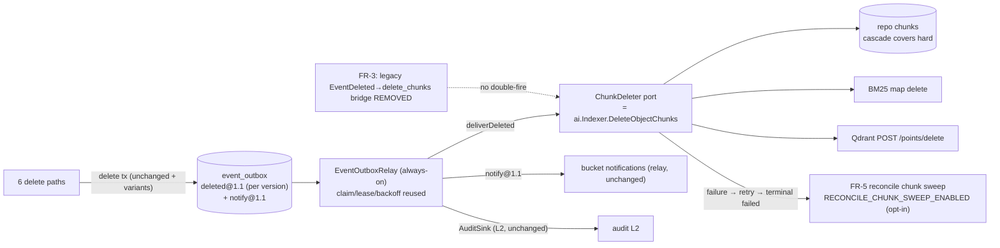

# Design: Durable-async + transactional RAG chunk invalidation (`internal/ai` + outbox relay)

> **Companion spec:** `docs/requirements/durable-chunk-invalidation-v1.md` (FR-1…FR-6, AC-1…AC-4) · **Module:** `internal/ai` + `internal/events` + `internal/repository` + `internal/service` + `internal/reconcile` + `internal/config` + `cmd/server` · **Status:** design (not implemented) · **Baseline:** HEAD `35ff4ce` + outbox WIP · **Gates:** `make check` green · single file ≤ 500 lines · stdlib only (I6) · no `go.mod` changes · I1/I2 discipline (**zero DB migrations** — `storage_key` is payload-only) · **Zero wire-level API changes** (no REST/S3/MCP/WebDAV routes, no OpenAPI, legacy `Event`/bus untouched)

---

## 1. Evidence re-verification (independent check against working tree)

All 12 evidence citations and all 4 corrections were re-checked directly. **All hold**; line nits: E7/E10 cite the `if s.chunkCleaner != nil` guard line, calls sit one line below (`:28/:82/:196`, `:54/:62/:71`) — immaterial.

| # | Claim | Verified location | Verdict |
|---|-------|-------------------|---------|
| E1 | `indexer.go:230-239` `DeleteObjectChunks` — repo rows then sinks, error on first sink failure | `internal/ai/indexer.go:230-239` (repo `:231`, sink loop `:233-238`, `fmt.Errorf("sink delete chunks %d…")`) | ✅ |
| E2 | `processEvent`: `EventDeleted` → `JobDeleteChunks` | `internal/ai/indexer.go:184-201` (branch `:196-197`) | ✅ |
| E3 | `dispatch` uses `DedupeKey`; queue-nil → inline | `internal/ai/indexer.go:207-225` (`:220`) | ✅ |
| E4 | `EncodeObjectID` object_id-only payload | `internal/ai/indexer.go:36-40` | ✅ |
| E5 | `sink.go:17` `ChunkSink` interface | `internal/ai/sink.go:17-22` (plus `_ ChunkSink` asserts in `bm25.go`/`qdrant.go`) | ✅ |
| E6 | BM25/pgvector/Qdrant "adapters" | **⚠️ as claimed:** BM25 `bm25.go:210-218` (map delete); Qdrant `qdrant.go:281-285` (`POST /points/delete?wait=true` — 1 RTT per object in-request today); **pgvector is NOT a `ChunkSink`** — `PgVectorIndex` implements `VectorIndex` only and queries the **chunks table directly** (`pgvector.go:121-146`, `Table` default `"chunks"`, `embedding_vec` column). Repo-row deletion covers it. | ✅ (partial claim, correctly flagged) |
| E7 | `file_delete.go` sync `chunkCleaner` calls ×3 | `:27-34` (per-version loop, skips markers), `:81-87` (soft), `:195-201` (version) — all warn-only, in-request | ✅ |
| E8 | `file.go:59-64,136-149` `ChunkCleaner` interface doc + accessor | `file.go:64` interface ("called synchronously on hard delete… Non-fatal"); `svc.ChunkCleaner()` used by `workers.go:67` | ✅ |
| E9 | `emit` after delete; payload lacks version identity | `file.go:296-313` (`Payload{backend,size,etag,content_type}` only; publish after `HardDeleteObjectWithEvent` committed) | ✅ |
| E10 | marker/quarantine/bucket-delete sites | `delete_marker.go:54` (cleans `current.ID`; legacy event at `:70` carries **marker row id** — identity mismatch real); `object_worker.go:62` + `SoftDeleteObjectByID` `:70` (no facts); `file_bucket_delete.go:71` + `repo.DeleteBucket` (`sql_buckets.go:64`, no per-object facts) | ✅ |
| E11 | `bus.go:Publish → InsertEvent` second, non-transactional commit | `bus.go:77-99` (`InsertEvent` `:84`, errors logged never propagated; buffer 64, drop-on-full `:154-155`) | ✅ |
| E12 | `reconcile/deletion.go:82` seam; no orphan-chunk sweep | `reconcile/deletion.go:82-92`; `reconcile/job.go:106-129` `sweep` = orphan rows + blobs + scrub only — no chunks pass; `maybeSweep` `:99-104`; `RecordReconcileBlobs` `:125` | ✅ |

**Corrections (all verified true):**

| # | Claim | Verified |
|---|-------|----------|
| C1 | Outbox facts committed atomically with the delete; **no AI consumer** of `deleted@1.1` | `event_outbox.go:96-179` (`HardDeleteObjectWithEvent`/`SoftDeleteObjectWithEvent`, zero-row rollback `:117-121`); `event_outbox_relay.go:171-225` (`deliverFact`→`deliverDeleted` routes to `AuditSink` or `complete` only); D3 comment "would double-fire webhook/indexer/AV/replication/SSE" | ✅ |
| C2 | `deleted@1.1` has `version_id`, **not** `storage_key` | `payload.go:24-40` (`deletedFact` struct — no `storage_key`); golden bytes pinned at `schema_test.go:31,42,96` | ✅ |
| C3 | Version-delete / marker / quarantine / bucket-delete emit **no facts**; marker identity bug | `notifier.go:68-83` D2 comment names "E14 paths (DeleteVersion / delete-marker / quarantine)"; `InsertDeleteMarker` (`sql_objects_versions.go:10-64`) sets `deleted_at`+`version_tombstone` on the shadowed version; `delete_marker.go:70` legacy event id ≠ chunk target | ✅ |
| C4 | `DeleteChunksForObject` own statement; cascade repo-half only | `sql_chunks.go:11`; `migrations/{sqlite,postgres}/0004_ai.up.sql` `ON DELETE CASCADE` (both dialects) — soft deletes never cascade; BM25/Qdrant never covered | ✅ |

**Two additional gaps found (not in the spec; closed here):**

| # | Gap | Evidence | Design response |
|---|-----|----------|-----------------|
| **G-A** | `hardDeleteObject` cleans chunks **per version** (loop over all non-marker versions, `file_delete.go:27-34`), but the outbox fact covers only the **current row id** (`deleteFacts` from `obj`). Removing the sync loop with one fact per delete leaves BM25/Qdrant entries of superseded versions stale until the opt-in sweep | `file_delete.go:46` (facts built from `obj` only); `HardDeleteObjectWithEvent` deletes **all** rows of the key (`DELETE FROM objects WHERE tenant_id/bucket/key`, `event_outbox.go:128`) | **FR-2 hard delete emits one `deleted@1.1` per non-marker version** (faithful 1:1 replacement of today's per-version loop), plus **one** `notify@1.1` (current) preserving single-notification semantics |
| **G-B** | D2 notifier skip interplay: when marker/version/quarantine paths start emitting facts, `notify@1.1`'s `OriginID` must equal the **legacy event's `ObjectID`** or the notifier's `HasEventOutboxFact` check misses → **both** bus and relay deliver → double notification. For delete-marker the legacy event carries the **marker row id** (`delete_marker.go:70`) while chunk invalidation targets the shadowed version | `notifier.go:74-83` (skip keyed on `*e.ObjectID` = marker id) | **Split origins on the marker path:** `deleted@1.1` origin = shadowed version id (`current.ID`), `notify@1.1` origin = marker id. Bucket cascade emits `deleted@1.1` **only** (no `notify@1.1` — today bucket delete sends no notifications; S3 semantics) |

**Verdict:** the spec's problem statement and direction are fully confirmed; the design below is the spec's FR set plus G-A/G-B closure.

---

## 2. Design overview



The delete transaction writes the facts (repo side already exists for hard/soft); the relay drains them; the new `ChunkDeleter` port executes the same `DeleteObjectChunks` implementation the sync calls used; the opt-in sweep is the durable backstop. All six sync calls in the business flow are removed.

---

## 3. API changes

### 3.1 `internal/events` — `ChunkDeleter` port on the relay (FR-1)

```go
// event_outbox_relay.go
// ChunkDeleter is the optional chunk-invalidation consumer of deleted@1.1
// facts. Structurally identical to service.ChunkCleaner / reconcile.ChunkCleaner;
// defined here so events never imports service. Idempotent (FR-4).
type ChunkDeleter interface {
    DeleteObjectChunks(ctx context.Context, objectID int64) error
}

type EventOutboxRelayOptions struct {
    // ...existing fields unchanged...
    ChunkDeleter ChunkDeleter // nil = complete-only (existing behavior)
}
```

- `deliverDeleted` becomes: **1)** if `r.chunkDeleter != nil` → `DeleteObjectChunks(ctx, fact.OriginID)` (target = `OriginID`, which by construction equals the payload `object_id` — asserted in AC-3; no JSON parse); **2)** then the existing `AuditSink` step; **3)** any error → existing `retry` path (backoff+jitter → terminal `failed`), success → `complete`. Chunk invalidation runs **before** the L2 sink (search-staleness is time-critical); a chunk failure retries the whole fact (AuditSink redelivery is safe under the existing at-least-once contract C9–C11).
- No new table, no new config; claim fencing/lease/prune reused unchanged.
- Telemetry (mirror `IncEventOutboxL2Delivered`, `metrics.go:157`): `event_outbox.chunks_deleted_total`, `event_outbox.chunks_failed_total` (terminal-failed counted → visible backstop demand).

### 3.2 `internal/repository` — four WithEvent variants (FR-2), zero migrations

All reuse `insertOutboxFacts` inside the existing transaction; validation via `validateOutboxFacts` (I1: `$N` placeholders per text order, no reuse):

| Method | Base | Facts inserted in same tx |
|--------|------|---------------------------|
| `DeleteObjectVersionWithEvent(ctx, tenant, bucket, key, versionID string, facts []OutboxFact) error` | `DeleteObjectVersion` (`sql_objects_maint.go:143`, physical row delete → cascade covers repo chunks) | `deleted@1.1` + `notify@1.1` (removed version row) |
| `InsertDeleteMarkerWithEvent(ctx, obj Object, facts []OutboxFact) (Object, error)` | `InsertDeleteMarker` (`sql_objects_versions.go:10`) | `deleted@1.1` (origin = shadowed version id) + `notify@1.1` (origin = marker id) — G-B split origins |
| `SoftDeleteObjectByIDWithEvent(ctx, id int64, facts []OutboxFact) error` | `SoftDeleteObjectByID` (`sql_objects_maint.go:42`) | `deleted@1.1` + `notify@1.1` (origin = `id`) |
| `DeleteBucketWithEvent(ctx, tenant, bucket string, facts []OutboxFact) error` | `DeleteBucket` (`sql_buckets.go:64`, already deletes bucket chunks repo-half in-tx) | per-object `deleted@1.1` **only** (G-B: no notify) |

Old methods removed once grep confirms zero remaining callers (service is the sole consumer of all four).

New read for FR-5 (in `sql_chunks.go`, no migration):

```go
// ListOrphanChunkObjectIDs returns object ids whose chunks have no live object
// row: hard-deleted (o.id IS NULL — non-cascaded leftovers) or soft-deleted /
// marker-shadowed (o.deleted_at IS NOT NULL, incl. version_tombstone rows).
func (s *sqlStore) ListOrphanChunkObjectIDs(ctx context.Context, tenant string, limit int) ([]int64, error)
// SQL: SELECT c.object_id FROM chunks c LEFT JOIN objects o ON o.id = c.object_id
//      WHERE c.tenant_id=$1 AND (o.id IS NULL OR o.deleted_at IS NOT NULL)
//      GROUP BY c.object_id ORDER BY c.object_id LIMIT $2
```

### 3.3 `internal/service` — remove the six sync calls (FR-2)

Delete the six `s.chunkCleaner.DeleteObjectChunks` invocations. Per-site fact coverage (the table is the contract; deferring a site to the sweep backstop must be stated per site in the PR — default: all six done):

| Site | Today | Change |
|------|-------|--------|
| `hardDeleteObject` (`file_delete.go:27-34`) | per-version sync cleanup; `HardDeleteObjectWithEvent` already | **G-A:** new `deleteFactsAllVersions` — one `deleted@1.1` per non-marker version (origin=version.ID, payload from that version row, no post-delete re-query) + one `notify@1.1` (origin=`obj.ID`); drop the loop |
| `softDeleteObject` (`:81-87`) | sync cleanup + `SoftDeleteObjectWithEvent` already | drop the call only (fact exists) |
| `DeleteVersion` (`:195-201`) | sync cleanup + bare `repo.DeleteObjectVersion` | `DeleteObjectVersionWithEvent` with facts from the removed version (origin=`obj.ID`); `version_id` in payload = removed version → distinguishable (C3/FR-6.3) |
| delete-marker (`delete_marker.go:54`) | sync cleanup of `current.ID`; legacy event carries marker id | `InsertDeleteMarkerWithEvent`; `deleted@1.1` built from `current` (origin=`current.ID` — **fixes the latent identity bug**, E10/R2), `notify@1.1` built from `marker` (origin=`marker.ID` — keeps D2 skip working, G-B) |
| quarantine (`object_worker.go:62`) | sync cleanup + `SoftDeleteObjectByID` | `SoftDeleteObjectByIDWithEvent`, facts from `obj` (origin=`obj.ID`) |
| bucket cascade (`file_bucket_delete.go:71`) | sync cleanup per object; `repo.DeleteBucket` | collect facts in `deleteBucketData` (it already has `objects`); `DeleteBucketWithEvent` with per-object `deleted@1.1` only (G-B). R5 fallback: delegate to sweep, stated in PR |

Legacy `emit` (`file.go:296-313`) stays at every site, unchanged (webhook/SSE/audit/AV/replication consumers untouched; D2 now skips bus notification only where the matching `notify@1.1` exists — same rule as today, extended to the four new fact-covered paths).

### 3.4 `internal/ai` — retire the legacy bridge (FR-3), pin the contract (FR-4)

- Remove the `EventDeleted → dispatch(JobDeleteChunks)` branch (`indexer.go:196-197`), the `JobDeleteChunks` const (`:22`), and the registration (`cmd/server/ai.go:145`). Keep `EventCreated → index_object`, `EncodeObjectID`/`DecodeObjectID`, `IndexObjectByID`, `DeleteObjectChunks` (shared impl of relay port + reconcile seam + sweep).
- Doc comment on `DeleteObjectChunks` (FR-4.1): *idempotent — repo `DELETE` no-ops, BM25 map delete no-ops, Qdrant delete-by-filter no-ops on repeat; relay at-least-once redelivery therefore yields exactly-once observable deletion per object.* Ordering repo-first/sinks-after kept; first error now flows into relay retry instead of a request-path warn.

### 3.5 `internal/config` + `cmd/server` — wiring (FR-1.2, FR-5.2)

- `ReconcileCfg` (`config_app.go:29`): new `ChunkSweepEnable bool` ← `RECONCILE_CHUNK_SWEEP_ENABLED` (default `false`, opt-in per I5; documented in `docs/configuration.md` + `.env.example`).
- `startEventOutboxRelay(ctx, cfg, logger, repo, svc)` (`workers.go:158`): `opts.ChunkDeleter = svc.ChunkCleaner()` — nil when AI off (relay complete-only, byte-identical behavior). `svc.WithChunkCleaner(indexer)` runs at `ai.go:124` before `buildBackgroundWorkers` at `main.go:134` — ordering safe. `service.ChunkCleaner` satisfies `events.ChunkDeleter` structurally (same method set); no import cycle.
- `startReconcile` (`workers.go:84-101`): `j.WithChunkSweep(cfg.Reconcile.ChunkSweepEnable)`; sweep no-ops when `chunkCleaner == nil` (AI off) or the chunks table is empty (cheap query).

### 3.6 `internal/events/payload.go` — `storage_key` (FR-6)

Add one field to `deletedFact` (fixed position — after `backend`, before `request_id`; `object_id`/`version_id` positions stable):

```go
Backend   string `json:"backend"`
StorageKey string `json:"storage_key"` // NEW — FR-6
RequestID string `json:"request_id"`
```

`BuildDeletedFact(obj, actor, requestID, tenant)` (`payload.go:101`) populates `obj.StorageKey`. `notifyFact` unchanged (owned by the sibling spec). Payloads stay byte-stable for fixed input; the sibling `audit-sink-deleted-11-v1.md` note + `schema_test.go` golden bytes update in the **same** PR (R1).

### 3.7 `internal/reconcile` — chunk sweep job (FR-5)

- `Job` (`reconcile/job.go`): `WithChunkSweep(bool)`; in `sweep` (`:106-129`), after the existing passes: per tenant, `ListOrphanChunkObjectIDs` (batch e.g. 500/round) → per id: **live-ness re-check** (`GetObjectByID`: `ErrNotFound` or `DeletedAt != nil` → delete; live → skip) → `j.chunkCleaner.DeleteObjectChunks`. Cluster-singleton + interval gating reused (`maybeSweep` `:99-104`); `RECONCILE_INTERVAL_MINUTES > 0` required.
- Telemetry: `reconcile.chunks_scanned_total` / `reconcile.chunks_deleted_total` per round (mirror `RecordReconcileBlobs` `:125`).
- Safety (FR-5.4): predicate never matches live rows; restore clears `deleted_at` before re-index (`sql_objects_maint.go:240-247`); the per-id re-check shrinks the restore race to a microsecond window, and any interleaving is self-healed by the re-index job's `DeleteChunksForObject`+`InsertChunks` (`indexer.go` `prepareCurrentObject`).

### 3.8 Explicitly unchanged

Legacy event bus, `EventDeleted` emission, webhook/SSE/audit-L0/AV/replication consumers · `notify@1.1` payload shape · bucket-notification rules · JobPool (`JOBS_*`, `JobIndexObject`) · retrieval SQL / read path (sibling `rag-liveness-gate-v1.md`) · storage/blob delete ordering (WebDAV MOVE rollback) · quota/audit-L0 rows · any REST/S3/MCP/WebDAV/OpenAPI surface.

---

## 4. Compatibility constraints

1. **Zero DB migrations.** `storage_key` lives only in the JSON payload. New repo methods are additive-then-replace; wrapper repos (`auditgovernance`, `billing`) embed `repository.Repository` → interface growth transparent (F9 of sibling design).
2. **Payload forward-compat:** `deleted@1.1` gains one JSON key — additive for strict decoders; the L2 adapter POSTs bytes as-is (no parse) and the relay never re-derives payloads, so only the pinned golden bytes change (same PR, R1).
3. **AI off / embedder nil:** no chunks, `svc.ChunkCleaner()` nil → relay complete-only; baseline (`go test` CI) behavior byte-identical. FR-5 sweep no-ops.
4. **Notification semantics preserved** via G-B: bus→relay handover only where a `notify@1.1` with matching origin exists; bucket delete stays notification-silent (as today). Marker-path notifications now ride the durable relay payload (improvement: retryable, byte-exact) instead of the drop-prone bus.
5. **L2 audit volume** (documented, not changed): hard delete of an N-version object now yields N `deleted@1.1` facts (one per deleted version row) vs 1 today — L0 `audit_log` stays one row per API call (unchanged). The sibling audit spec's per-fact delivery contract is unaffected (it never asserted a count per delete). **Pinned by Reg-4 (§5.1)** so the volume change cannot silently regress or break the sibling spec's per-fact contract.
6. **Relay failure domain:** chunk-delete failure retries the whole fact, re-invoking `AuditSink` — permitted under the existing at-least-once/C9–C11 contract; both consumers are idempotent.
7. **No new config gates the core path:** the relay is already always-on (`workers.go:63,177`); only the sweep is opt-in (I5).

---

## 5. Failure modes

| # | Failure | Behavior | Recovery | Coverage (§5.1) |
|---|---------|----------|----------|-----------------|
| F1 | Qdrant/BM25 delete fails transiently (network, 5xx) | relay `retry` (1s→5min backoff+jitter, ≤ `MaxAttempts`) — **never in the request path**; request latency unchanged | automatic; terminal-failed facts counted by `chunks_failed_total` | AC-4(v) (real sink 500→200); relay unit retry test with `ChunkDeleter` fake |
| F2 | Sink permanently down | fact terminal `failed` after maxAttempts; stale chunks searchable (fail-open today, same outcome) | FR-5 sweep (opt-in) deletes via shared `DeleteObjectChunks`; failed rows pruned after 7d — sweep is independent of outbox rows (scans `chunks`), so no window coupling. **Caveat: the sweep itself needs a reachable sink** (sink errors propagate through `DeleteObjectChunks`) | AC-4(iv); Reg-2; repo `TestEventOutboxRetryBackoffAndTerminalFailed` (existing) |
| F3 | Crash between delete-tx commit and relay claim | facts pending; lease expiry re-claims (existing `TestEventOutboxClaimLeaseExpiryRedelivers` shape) | redelivery is an idempotent no-op (AC-1) | AC-2(iii); AC-4(iii) |
| F4 | Crash between repo-row delete and sink delete (within one `DeleteObjectChunks`) | repo half gone, sink stale | relay retry re-runs (repo no-op, sink completes) — the exact gap AC-2(iv)/AC-1(iii) exercise | AC-2(iv); AC-1(iii) |
| F5 | Double-fire (bridge accidentally kept / relay overlap across replicas) | idempotent `DeleteObjectChunks`; D3 forbids re-broadcast and FR-3 removes the bridge | AC-1 asserts call counts; claim fencing prevents cross-replica overlap | Reg-3; AC-1 call counts; relay D3 test |
| F6 | Marker identity regression (fact targets marker id, not shadowed version) | shadowed version's chunks stay searchable | AC-3(c) golden origins + FR-2 table; sweep backstop | AC-3(c); Reg-1 |
| F7 | Sweep vs concurrent restore+re-index | per-id live re-check skips live rows; interleaving self-heals via re-index job | AC-4(iv) exercises backstop; FR-5.4 | Reg-2 live-row skip; AC-4(iv) |
| F8 | Bucket delete with huge object count → large fact batch in one tx | per-fact payload ≤ 1 MiB (existing bound); N rows in one tx is bounded by bucket size | R5 documented fallback: delegate to sweep | Reg-1 (per-object facts, no notify); Reg-4 (fact-count math) |
| F9 | SQL placeholder misuse in new queries (I1) | `s.rebind` text-order rewrite | new queries use fresh `$N` per value; covered by repo tests | Reg-1/Reg-2 repo tests (SQLite+PG shape) |
| F10 | Relay `ChunkDeleter` bound while AI disabled later (config flip) | chunks may exist from a previous AI-enabled run; cleaner is the indexer (non-nil) → drains fine | no action; sweep also available | Reg-2 nil-cleaner no-op; wiring-order test (`ai.go:124` ≺ `main.go:134`) |

### 5.1 F/G × AC/Reg coverage matrix

> Every failure mode (F1–F10) and both spec-external gaps (G-A/G-B) maps to at least one acceptance test or regression suite in §7. ● = primary coverage (the artifact fails if this failure regresses); ○ = secondary/indirect; · = no direct mapping.

| Artifact (§7) | F1 | F2 | F3 | F4 | F5 | F6 | F7 | F8 | F9 | F10 | G-A | G-B |
|---|---|---|---|---|---|---|---|---|---|---|---|---|
| AC-1 idempotency / exactly-once table | · | · | ○ | ● | ● | · | · | · | · | · | · | · |
| AC-2 crash-window drain + lease redelivery | · | · | ● | ● | · | · | · | · | · | · | · | · |
| AC-3(a/b) golden bytes + envelope | · | · | · | · | · | · | · | · | · | · | · | · |
| AC-3(c) marker split origins | · | · | · | · | · | ● | · | · | · | · | · | ● |
| AC-4 e2e (asyncness, drain, F1/F2) | ● | ● | ○ | · | · | · | · | · | · | · | · | · |
| Reg-1 per-site fact emission | · | · | · | · | ○ | ● | · | ● | ○ | · | ○ | ● |
| Reg-2 sweep + tenant isolation | · | ● | · | · | · | · | ● | · | ○ | ● | ○ | · |
| Reg-3 bridge retired | · | · | · | ○ | ● | · | · | · | · | · | · | · |
| Reg-4 L2 fact volume (N per N-version) | · | · | · | · | · | · | · | ○ | · | · | ● | · |

AC-3(a/b) intentionally has no failure mapping: it pins payload bytes (R1 churn guard); origin-identity coverage lives in AC-3(c)/Reg-1. F8's volume bound is asserted by Reg-1 (bucket cascade emits `deleted@1.1`-only) and Reg-4 (N-fact math). F9 is exercised wherever the new `$N` queries run (Reg-1/Reg-2 repo tests). G-A's sweep backstop leg is Reg-2 (superseded-version chunks); G-B's notifier leg is the existing `TestHasEventOutboxFact` guard + AC-3(c).

---

## 6. Migration steps

No schema migration, no wire change — this is a code-rollout + config story:

1. **Single PR** (R1): `payload.go` `storage_key` + `schema_test.go` golden bytes + `audit-sink-deleted-11-v1.md` note **together**; `event_outbox_relay.go` port; four repo WithEvent variants; six service call-site removals with per-site facts (incl. G-A per-version, G-B split origins); FR-3 bridge retirement; `DeleteObjectChunks` contract doc; telemetry counters; `reconcile` sweep; `RECONCILE_CHUNK_SWEEP_ENABLED` in `config_app.go` + `docs/configuration.md` + `.env.example`.
2. Deploy order is a single binary rollout — relay is always-on, so chunk deletion starts draining the moment the new binary serves; old facts (pending from pre-deploy deletes) drain under the new port with no re-run.
3. Post-deploy: observe `event_outbox.chunks_delivered_total`/`chunks_failed_total`; enable `RECONCILE_CHUNK_SWEEP_ENABLED=true` once `RECONCILE_INTERVAL_MINUTES > 0` is confirmed healthy (singleton lease when multi-replica).
4. No rollback runner; a rollback to the pre-change binary re-enables the legacy bridge only if FR-3's removal is reverted too — the design keeps `DeleteObjectChunks` identical so old/new binaries interoperate on the same outbox table.

---

## 7. Testable acceptance mapping

> Coverage wiring: each row below maps to F1–F10 / G-A / G-B in the §5.1 matrix.

| AC | Testable spec | Artifact (gating) |
|----|---------------|-------------------|
| **AC-1** | Table-driven idempotency: real SQLite repo + counting fake `ChunkSink` + real `BM25` + Qdrant `httptest` (pattern `qdrant_test.go:213`). (i) index one object → repo rows + sink state present; (ii) `DeleteObjectChunks` once → repo rows gone, each sink invoked **exactly once**, sink state empty; (iii) repeat → no error, counts unchanged; (iv) two objects → per-object isolation | `internal/ai/sink_test.go` extend (`go test ./internal/ai/`) |
| **AC-2** | Crash-window reality check + drain, restructured for the post-FR-2 world: (i) seed object + repo chunks + sink state (counting fakes and/or real BM25 + Qdrant httptest); (ii) run the **real** delete path — `HardDeleteObjectWithEvent` as the service calls it (there is no sync cleanup left to omit, FR-2) — then assert the **actually observable** window: repo chunk rows **gone** (migration 0004 `ON DELETE CASCADE` fires inside the delete tx — the repo-half window the old wording claimed is **unreachable by construction**, C4), **sink entries still present** (BM25 map / Qdrant points — the real stale window, F3/F4-visible) **and** `HasEventOutboxFact(deleted@1.1)` true; soft-delete variant (`SoftDeleteObjectWithEvent`): repo rows **present** (UPDATE never cascades — the FR-5 sweep's soft-delete case); (iii) one relay `deliverBatch` round with `ChunkDeleter` bound → called with the fact's `OriginID` (== payload `object_id`, AC-3 envelope), sink entries gone, repo delete no-op; two-tenant variant: seed facts for tenants A+B, drain one batch with a recording fake → every `DeleteObjectChunks(objectID)` maps to the fact's tenant's object, no cross-tenant call; (iv) lease-expiry redelivery (existing `TestEventOutboxClaimLeaseExpiryRedelivers` pattern) → second delivery is a no-op (AC-1). **Answer to “is the window real?”:** *partially* — the repo-half window is unreachable on hard delete (cascade); the sink-half window is real and is the **designed steady state** between commit and drain (not a crash artifact), so the crash *variants* (F3 commit→claim, F4 mid-`DeleteObjectChunks`) are what the test isolates, via (iv) + AC-1(iii) | `internal/repository/event_outbox_test.go` + `internal/events/event_outbox_relay_test.go` extend (fake `ChunkDeleter` mirroring the `AuditSink` fake) |
| **AC-3** | Golden-byte JSON for `deleted@1.1` asserts `version_id` **and** `storage_key` present and populated for (a) full-object hard delete and (b) single-version delete (`version_id` = removed version; payload built from the removed row, no post-delete re-query); (c) **marker-path split origins (G-B)**: build both facts with the production builders — `deleted@1.1` from the **shadowed version** row (`object_id` == shadowed.ID, `version_id`/`storage_key` from that row), `notify@1.1` from the **marker** row (`object_id` == marker.ID, `version_id` == marker's, marker metadata) — golden-byte + required-field asserts for each, plus outbox-row `OriginID` split (deleted row origin = shadowed.ID, notify row origin = marker.ID — the D2 skip key, F6/R2/R8); envelope test additionally asserts payload `object_id` == relay deletion target for both facts | `internal/events/schema_test.go` extend (`TestEventSchema_GoldenJSON` `:31`, `TestEventSchema_RequiredFields` `:42`, `TestEventSchema_Deleted11Envelope` `:96`) + marker fixtures in `internal/service/delete_marker_test.go` (Reg-1) |
| **AC-4** | New AI-enabled server variant `startFullServerWithAI` (extends `fullServerHarness`; baseline `startFullServer` untouched — intentionally no-AI, `fullserver_test.go:44`): real BM25 + `httptest` Qdrant sink with ≥1 s latency injected on **`POST /points/delete` only** (search stays fast), relay with ~1 s poll (keeps the commit→claim gap observable) and `MaxAttempts=2`; (i) upload+index, **precondition: poll `/v1/search` until ≥1 hit** (indexing is itself async — zero hits pre-index would false-pass); (ii) admin hard delete via API → response < 300 ms while the sink delete is still sleeping — proves the drain is off the request path (relay goroutine); (ii-bis) **negative control**: immediately after the response, search still returns the hit — the stale window is observable, so the later zero-hits is caused by invalidation, not a read-path liveness gate or a search defect; (iii) poll until relay `chunks_deleted_total` increments / sink receives the delete → `/v1/search`, `/v1/chat`, `/v1/agent` zero hits for the deleted content (BM25+Qdrant), **other tenant's doc still hits** (tenant isolation); (iv) kill sink (500) → relay retries (F1 machinery) → fact terminal `failed` (assert outbox status `failed` + `chunks_failed_total`) → **restore sink** → run FR-5 sweep once (construct `reconcile.New(...).WithChunkSweep(true).WithChunkCleaner(indexer)` and call `maybeSweep` directly — the `scrub_test.go` pattern; no cluster singleton) → zero hits again (F2 end-to-end; sweep is independent of failed outbox rows; **the sweep itself needs a reachable sink**, so the restore is part of the choreography, not a cheat); (v) transient variant: sink returns 500 once then 200 → drains after one backoff, **no** terminal failure (F1 end-to-end with the real relay + real sink) | `internal/integration/` new test (SQLite + httptest, no Docker) |
| Reg-1 | Per-site fact emission: removed sync sites now produce `deleted@1.1` (correct origin) and **no** chunk delete in-request (counting fake cleaner records zero calls); marker path asserts the split origins incl. the JSON payloads per AC-3(c); quarantine asserts `SoftDeleteObjectByIDWithEvent` origin = `obj.ID`; bucket delete asserts per-object `deleted@1.1`-**only** (no `notify@1.1` — F8/G-B) | `internal/service/file_delete_test.go`, `delete_marker_test.go`, bucket/quarantine tests |
| Reg-2 | Sweep: orphan chunks (soft-deleted, marker-shadowed, injected non-cascaded rows) removed; live rows untouched (F7); no-op with nil cleaner (F10); **tenant isolation: seed orphan chunks in tenants A+B, sweep with `tenants=[A]` → B's chunks untouched, then `[B]` → cleaned** (`ListOrphanChunkObjectIDs` is tenant-scoped, `WHERE c.tenant_id=$1`), and A's sweep must not touch B's live rows either | `internal/reconcile/chunk_sweep_test.go` (mirror `scrub_test.go`) |
| Reg-3 | Bridge retired: `processEvent` no longer dispatches `JobDeleteChunks`; `JobIndexObject` path unchanged | `internal/ai/indexer_test.go` + `cmd/server/ai_test.go` |
| Reg-4 | **L2 fact-volume regression (§4.5, G-A):** seed one object with N versions (`repo.InsertObjectVersion`), hard delete via the service → exactly **N** `deleted@1.1` facts — one per non-marker version: distinct `OriginID`s == each version's row id, payload `object_id` == its `OriginID`, distinct `version_id`s + `storage_key`s — and exactly **1** `notify@1.1` (origin = current `obj.ID`; single-notification semantics preserved); a delete-marker row among the versions is excluded (matches today's `IsDeleteMarker` skip in the per-version loop, `file_delete.go:27-34`); L0 `audit_log` stays **1** row (per API call, unchanged) | `internal/service/file_delete_test.go` extend (`deleteFactsAllVersions`) |
| Gate | `gofmt` · `go vet` · `go build ./...` · `go test ./...` · ≤ 500 lines/file · stdlib only (I6) | `make check` |

---

## 8. Risks and open decisions

| # | Risk / decision | Mitigation |
|---|-----------------|------------|
| R1 | Payload golden-byte churn (`storage_key`) pins `schema_test.go` + sibling audit spec | single PR (see §6); fixed field position after `backend` |
| R2 | Marker identity bug (E10) | FR-2 table + split origins (G-B) + AC-3(b) |
| R3 | Double-fire if bridge kept | FR-3 removal + idempotency (AC-1) + D3 |
| R4 | Terminal-failed facts leave stale chunks permanently | FR-5 sweep (AC-4 iv) + `chunks_failed_total` |
| R5 | Bucket-delete per-object facts = largest repo change; big buckets → large tx | default: per-object `deleted@1.1` (no notify); documented fallback: delegate bucket cascade to sweep (stated per site in PR) |
| R6 | Sweep vs concurrent restore/re-index race | predicate + per-id live re-check + re-index self-heal (F7) |
| R7 | **G-A decision:** per-version `deleted@1.1` on hard delete raises L2 fact volume (N per delete) | documented in §4.5; L0 unchanged; alternative (sweep-only for non-current versions) rejected — fail-open window until opt-in sweep; **volume pinned by Reg-4** (§5.1) so the sibling audit spec's per-fact contract cannot silently break |
| R8 | **G-B decision:** split origins on marker path is the only shape that keeps D2 skip correct | AC-3(c)/Reg-1 assert both origins (golden bytes + outbox `OriginID` split); notifier tests extended |
| R9 | AuditSink outage now also delays chunk deletion (shared fact retry) | chunk deletion runs first in `deliverDeleted`; both idempotent; latency bounded by `EVENT_OUTBOX_CLAIM_TTL`/`HTTP_TIMEOUT` |

**Effort:** spec-scored 7/10 confirmed. Largest items: four repo WithEvent variants (incl. G-A per-version facts), relay port + wiring, FR-3 bridge removal, sweep job, AC-4 AI harness variant. No new dependencies (I6).
