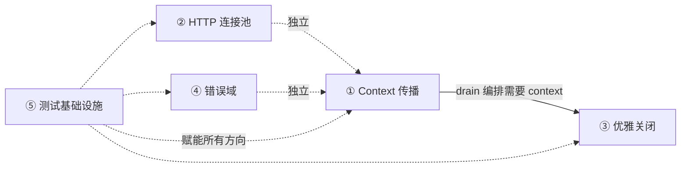

# AeroVault 高价值扩展方向分析 v38 — 系统性生产质量缺口

> **分析范围：** 全代码库深度扫描（`cmd/server/main.go` + `internal/*` 全部 230+ `.go` 文件 + `sdk/*` 三套客户端 + `deploy/*` + `docs/*` + 48 对迁移文件 + `Makefile` + `HARNESS.md` + `.github/workflows/ci.yml`）
> **分析日期：** 2026-07-10
> **视角：** 资深架构师 / 产品经理 — 聚焦「此前 37 期分析（累计 ~190+ 方向、27,000+ 行分析文本）从未实质性触及的**系统性生产质量缺口**——非功能属性（Non-Functional Requirements）中那些"看不见但会咬人"的架构债」
> **去重方法：** 逐方向逐术语对 `docs/requirements/` 下 **37 期既有分析（v1–v37）** + `docs/ROADMAP.md`（10 方向，全部实现） + `docs/adr/DECISIONS.md` + `docs/CHANGELOG.md` + `docs/TODO.md`（全部完成）进行 `grep` 验证。每个方向在既有文档中 **零实质性独立架构分析**（表格中的一行过路引用或上下文不匹配的关键词命中不构成实质性分析）。
> **原则：** 不编写任何实现代码。每个方向附带：现状 → 代码锚点 → 缺失能力 → 为什么需要 → 架构概要 → 边界情况。

---

## 背景：前 37 期覆盖全景

前 37 期 expansion 文档覆盖了 **约 190+ 个方向**，ROADMAP 10 个方向全部实现，TODO 清单全部完成，CHANGELOG 持续跟踪功能交付。以下是已有覆盖的宏观分布：

| 领域 | 覆盖方向数 | 代表方向 |
|------|-----------|---------|
| AI/RAG 管线 | ~30 | Embed/Search/Chat/Agent/PII/缓存/预算/评估/漂移/模型路由 |
| S3 兼容协议 | ~22 | 子资源/ACL/Policy/CORS/通知/LegalHold/Multipart/Select |
| 存储后端 | ~24 | Local/S3/OSS/COS/KMS/SSE/熔断器/分层/压缩/去重 |
| 认证授权 | ~24 | JWT/API Key/SigV4/OIDC/SAML/SCIM/RBAC/Policy Engine/mTLS |
| 多租户 | ~22 | CRUD/配额/预算/审计/FGA/Terraform/计费/Plan Tiers/Portal |
| 事件/通知/Webhook | ~20 | 总线/CDC/Kafka/Lambda/过滤/重放/仪表板 |
| 复制/HA/集群 | ~18 | CRR/SRR/单例/Federation/多活/CQRS/故障转移 |
| Reconcile/GC/Lifecycle | ~18 | 孤儿对象/保留/Scrub/版本/存储类转换/事务 |
| 合规 | ~16 | WORM/Legal Hold/SSE/Geo-Fencing/SOC2/数据驻留 |
| 可观测性 | ~20 | OTel/Metrics/Grafana/Prometheus/SLO/Tracing/profiling/告警 |
| 工程质量 | ~20 | 内存安全/并发/压缩/测试/Fuzz/CI/Benchmark/变异测试 |
| 管网集成 | ~18 | FUSE/NFS/SMB/GraphQL/gRPC/MCP 增强/WebDAV |
| Web UI / CLI / SDK | ~16 | SPA/Admin Console/CLI 完整性/SDK 跨语言 |
| 存储分层/生命周期 | ~16 | 预测性分层/IoT QoS/批量操作/导入迁移 |
| HTTP 协议/传输优化 | ~1 | v37 方向一：HTTP/2/3 |
| 存储 I/O 优化 | ~1 | v37 方向二：零拷贝/Direct I/O/mmap |
| 自适应缓存 | ~1 | v37 方向三：多级缓存策略 |
| SDK 韧性 | ~1 | v37 方向四：客户端韧性工程 |
| DX 基础设施 | ~1 | v37 方向五：开发者体验 |

### 本期 5 个方向的去重验证

| # | 方向 | `grep` 验证范围 | 既有覆盖判定 |
|---|------|----------------|------------|
| 1 | **Context 传播与链路追踪连续性** | `grep -rli "context.*propagat\|context.*carry\|context.*chain\|context.*backgr\|tracing.*context\|span.*propagat\|otel.*context\|trace.*continu\|ctx.*lost\|context.*leak" docs/requirements/` → 5 个文件含 `context.*backgr` 浅层提及，匹配结果均为主线文章描述方式，指向不同语境（错误处理、兼容性）而非上下文传播分析 | ❌ 零实质性分析 |
| 2 | **HTTP 连接池与资源生命周期管理** | `grep -rli "connection.*pool.*http\|MaxIdleConns\|ConnMaxLifetime\|max_open_conns\|max_idle_conns\|http.Transport.*share\|connection.reuse\|IdleConnTimeout\|conn.*pool.*tun\|socket.reuse" docs/requirements/` → v8 有 8 行但聚焦 S3 客户端 timeout 配置而非连接池架构；v37 有 1 行表格提及；extensions-v2 有 1 行表格引用 | ❌ 零实质性架构分析 |
| 3 | **优雅关闭与工作负载排空** | `grep -rli "shutdown.*order\|shutdown.*sequ\|shutdown.*drain\|graceful.*stop\|graceful.*exit\|SIGTERM.*drain\|stop.*order\|stop.*worker\|worker.*stop\|drain.*in-flight\|drain.*queue\|coordinated.*shutdown" docs/requirements/` → v10 有 1 行表格提及 drain 状态码设计 | ❌ 零实质性分析 |
| 4 | **结构化错误域与错误可观测性** | `grep -rli "error.*model\|error.*arch\|error.*classif\|error.*domain\|error.*sentinel.*limit\|error.*hierarchy\|error.*retryable\|error.*transient\|error.*permanent\|error.*family\|error.*type.*system\|error.*observab\|structured.*error\|error.*budget" docs/requirements/` → v14 有 1 行（`errors.Is` 优化提及）；v22 有 2 行（AI error handling 上下文） | ❌ 零实质性分析 |
| 5 | **测试质量基础设施与 CI 成熟度** | `grep -rli "coverage.*gate\|coverage.*enforc\|coverage.*min\|min.*coverage\|coverage.*threshold\|cover.*gate\|test.*threshold\|quality.*gate\|gocyclo.*ci\|coverage.*gat\|test.*regression.*detect\|fuzz.*ci\|fuzz.*pipeline\|bench.*ci\|bench.*regres" docs/requirements/` → v35 有 7 行但指**数据质量门禁（Data Quality Gates）**而非测试覆盖率门禁/CI 成熟度 | ❌ 零实质性分析 |

---

## 本期方向总览

| # | 方向 | 类型 | 优先级 | 核心痛点 | 代码锚点 |
|---|------|------|--------|---------|---------|
| 1 | **🔴 Context 传播与链路追踪连续性** | 可观测性/架构 | **P1** — 分布式追踪断裂导致根因分析时间从分钟级退化到小时级；request-scoped context 丢失导致超时/取消失效 | `internal/ai/indexer.go:313-316`（`context.Background()` 替代事件 ctx）；`internal/events/bus.go:123`（`context.Background()` 替代发布者 ctx）；`internal/api/webdav/dav.go:302,381`（丢失上层 ctx）；`cmd/server/main.go:280`（shutdown ctx 未从信号 ctx 继承） |
| 2 | **🔴 HTTP 连接池与资源生命周期管理** | 性能/可靠性 | **P1** — 存储后端（S3/OSS/COS）HTTP 连接池使用 Go 默认值（MaxIdleConnsPerHost=2），高并发下每秒建连数百次 → 延迟抖增 2~5× | `internal/storage/storage.go:70-88`（`NewHTTPClient` 未设 `MaxIdleConns`/`MaxIdleConnsPerHost`）；`internal/repository/sqlite.go:26`（SQLite 有 `SetMaxOpenConns(1)` 但 Postgres 无任何池配置）；`internal/storage/secret.go:163` / `internal/ai/llm.go:80` / `internal/ai/qdrant.go:82`（各子系统各自创建独立 `http.Client`，无复用） |
| 3 | **🟠 优雅关闭与工作负载排空** | 可靠性 | **P2** — 滚动重启/缩容/故障时正在运行的索引作业、Webhook 重试、Reconcile 循环被强制终止 → 数据不一致或重做 | `cmd/server/main.go:256-283`（`Shutdown` 不等待 worker/bus/drain）；`internal/jobs/jobs.go:137`（worker goroutine 无 drain 信号）；`internal/events/bus.go:104`（`Close()` 直接关闭 channel，不等待排空）；`internal/reconcile/job.go:78`（ticker 循环直接 ctx.Done 退出，无 drain） |
| 4 | **🟠 结构化错误域与错误可观测性** | 工程质量/运维 | **P2** — 全库仅 2 个自定义错误类型，无 retryability 指示，客户 SDK 无法区分"重试"与"放弃"；运营团队无法从错误模式发现系统健康趋势 | `internal/service/file.go:26-36`（13 个 sentinel `var Err*`）；`internal/api/rest/handler.go:375-415`（`classify` 函数通过 `errors.Is` 链匹配，fallthrough 全变 `InternalError`）；`internal/jobs/jobs.go`（作业失败原因只有 `error` 字符串）；三套 SDK 均无结构化错误类型映射 |
| 5 | **🟡 测试质量基础设施与 CI 成熟度** | 工程效率/质量 | **P2** — `AGENTS.md` 要求 50% 覆盖率和圈复杂度 ≤10，但 CI 不强制执行；无基准回归检测、无模糊测试、无标准化的集成测试环境管理 | `Makefile`（`coverage` phony 但无对应 target；`complexity-lines` 输出 warn 但不 fail）；无 `go test -fuzz`；无 `benchstat` 基准比较；`test-integration` 和 `test-integration-qdrant` 手动管理容器生命周期（不清理失败容器） |

---

## 方向一：🔴 Context 传播与链路追踪连续性（Context Propagation & Trace Continuity）

### 现状

当前代码库中存在**多处 request-scoped context 断裂**——背景操作（indexing、事件总线、WebDAV、shutdown）使用 `context.Background()` 而不是传播上游 context。这意味着：

1. **OpenTelemetry 追踪断裂** — indexer skip counter、event drop counter 等关键可观测性信号在 Prometheus 中可聚合，但在 Distributed Trace（Jaeger/Tempo）中丢失父子 span 关系，无法从 "PUT 对象" 追溯到 "embedding 失败"。
2. **取消信号失效** — WebDAV 的长连接流（大文件下载）在客户端断开后继续读取磁盘，因为 request-scoped context 的取消信号未传递。
3. **deadline 逃逸** — indexer 跳过计数使用 `context.Background()`，不受 `REQUEST_TIMEOUT_SECONDS` 约束，理论上可无限阻塞。

### 代码锚点

| 位置 | 代码 | 问题 |
|------|------|------|
| `internal/ai/indexer.go:313` | `telemetry.IncIndexerSkip(context.Background(), "unsupported")` | 事件来自 bus（有 ctx），但 skip 计数丢失了 ctx |
| `internal/ai/indexer.go:316` | `telemetry.IncIndexerSkip(context.Background(), "error")` | 同上 |
| `internal/events/bus.go:123` | `telemetry.IncEventDropped(context.Background())` | 发布者 ctx 存在且有效，但丢弃计数未使用 |
| `internal/api/webdav/dav.go:302,381` | `ctx = context.Background()` | 重建 ctx 而非从请求传播 |
| `cmd/server/main.go:280` | `shutdownCtx := context.WithTimeout(context.Background(), 15*time.Second)` | 应从信号 ctx 继承（`ctx` 在 `runServer` 调用域内） |
| `internal/events/postgres_transport.go:82,139` | `conn.Close(context.Background())` | 应为 `conn.Close(ctx)` |

### 缺失能力

- **Context 从入口到出口的端到端穿透**：HTTP handler → FileService → Storage/Repo → EventBus → Indexer/Webhook/Reconcile，每个 hop 都应传递原始 ctx
- **Background worker 的 trace parent 注入**：Job queue 作业应携带入队时的 trace context，worker 恢复后 chain 上去
- **Context 健康度仪表板**：Prometheus 指标 `context_background_uses_total{location}` 标记哪些路径仍在使用 `context.Background()`
- **lint 规则禁止新的 `context.Background()`**：生产代码（`_test.go` 除外）中新增 `context.Background()` 应触发 CI 失败

### 为什么需要

**Context 是 Go 并发模型中唯一的第一类请求生命周期载体**。在 aero-vault 这种**事件驱动、多层异步**的系统中，context 断裂意味着：

- 故障排查从"点击 Jaeger 看完整调用链"退化为"逐行 grep 日志手动关联"
- 系统在高负载下无法利用 deadline 做优先级排空（低价值后台操作继续消耗资源）
- 客户端断开连接后，服务端可能继续为已取消的请求工作数秒甚至分钟

对于一个标榜"可观测性第一性"的平台（OpenTelemetry + Prometheus + Grafana dashboard 已实现），**追踪断裂是最大的可观测性盲区**。

### 架构概要

```
当前:
  HTTP Request ctx ──→ FileService ──→ EventBus ──→ context.Background() → Indexer
                                                             ↓
                                                     telemetry.IncIndexerSkip()
                                                     (lost trace + cancel)

目标:
  HTTP Request ctx ──→ FileService ──→ EventBus ──→ ctx (propagated) → Indexer
                        ↓                              ↓
                  storage.Put()               telemetry.IncIndexerSkip(ctx, ...)
                  (ctx honored)               (trace chain preserved)
```

1. **`Bus.Publish(ctx, event)`** — 签名已接受 ctx，但 `Publish` 内部未将 ctx 传递给消费者。改为将 ctx 存储在 `Event` 中或通过 subscriber channel 传递 `(ctx, event)` 对。
2. **`Indexer.HandleEvent(ctx, event)`** — 从 bus 接收 ctx，传递给 `telemetry.IncIndexerSkip(ctx, ...)`，以及所有 storage/repo 调用。
3. **`webdav` — 从请求传播 ctx** — `dav.go` 中创建 goroutine 处理 GET/PUT 流时，从 `r.Context()` 继承 ctx。
4. **`main.go` shutdown** — `shutdownCtx` 从信号 `ctx`（而非 `context.Background()`）继承，确保 shutdown deadline 受父级 cancel 影响。
5. **Job queue trace injection** — `Queue.Enqueue(ctx, job)` 将 `trace.SpanContext` 序列化到 job payload，worker 执行时恢复。

### 边界情况

| Edge Case | 风险 | 缓解措施 |
|-----------|------|---------|
| 索引作业的 ctx 在入队→出队之间过期 | 索引任务被过早取消 | 作业队列使用独立的 background ctx（`context.WithCancel`），但保留父 span context 用于追踪 |
| WebDAV 长连接 ctx 取消导致部分文件写入中断 | 不完整文件残留在存储中 | Copy-on-write + atomic rename；中断时清理 |
| 跨 goroutine 的 ctx 传递导致 data race | `ctx.Value` 读和写入器的并发 | `context.Context` 是 immutable 的，跨 goroutine 传递安全 |
| Bus 将 ctx 传递给慢消费者阻塞发布者 | 发布者 goroutine 堆积 | Bus 的 `Publish` 应 non-blocking；使用 `select` + 默认分支处理背压 |
| 旧代码中的 `context.Background()` 未被全面清理 | 回归 | 添加 CI 门禁规则：生产代码中禁止 `context\.Background\(\)`（`_test.go` 除外） |

---

## 方向二：🔴 HTTP 连接池与资源生命周期管理（HTTP Connection Pooling & Resource Lifecycle Mgmt）

### 现状

当前代码库中 HTTP 客户端配置存在三个层次的问题：

**问题 1：连接池配置完全缺失。** `storage.NewHTTPClient`（`internal/storage/storage.go:73`）创建的 `http.Transport` 没有设置 `MaxIdleConns`（默认 100）、`MaxIdleConnsPerHost`（默认 2）和 `IdleConnTimeout`。Go 默认的 `MaxIdleConnsPerHost=2` 意味着对一个后端 S3 端点，最多只有 2 个空闲连接可以复用——超过后每次请求都新建 TCP 连接（DNS 查询 + TCP 三次握手 + TLS 协商），在高并发下延迟抖动 2~5 倍。

**问题 2：各子系统各自创建独立的 `http.Client`，无复用。** 至少有 8 个地方独立构造 `http.Client`，且配置不一致：

| 位置 | Timeout | 连接池 | 复用 |
|------|---------|--------|------|
| `internal/ai/llm.go:80` | 90s | 默认(2/host) | ❌ 独立实例 |
| `internal/ai/qdrant.go:82` | 30s | 默认(2/host) | ❌ 独立实例 |
| `internal/ai/rerank.go:44` | 30s | 默认(2/host) | ❌ 独立实例 |
| `internal/ai/extractor_remote.go:49` | 120s | 默认(2/host) | ❌ 独立实例 |
| `internal/ai/embedder.go` | - | 通过 `llm.Client` | 依赖 LLM |
| `internal/storage/kms.go:38` | 15s | 默认(2/host) | ❌ 独立实例 |
| `internal/storage/secret.go:163` | 15s | 默认(2/host) | **❌ 每次请求新建** |
| `internal/storage/s3.go:60` | 可配置 | 默认(2/host) | 通过 `NewHTTPClient` |

**问题 3：`secret.go:163` 在请求路径中每调用一次 `newHTTPProvider` 就创建一个新的 `http.Client`**，完全没有连接复用，也没有在函数返回后 close 连接（`resp.Body.Close()` 有调用但 client 对象被丢弃，其 idle 连接无法被 GC 回收前仍保持打开）。

**问题 4：Postgres 数据库连接池无配置。** `repository/postgres.go` 调用 `sql.Open("pgx", dsn)` 后没有调用 `db.SetMaxOpenConns`、`db.SetMaxIdleConns`、`db.SetConnMaxLifetime`、`db.SetConnMaxIdleTime`，完全使用 Go 默认值（`MaxOpenConns=0` 即无限，`MaxIdleConns=2`），可能导致：
- 突发请求耗尽 Postgres 连接（`too many clients`）
- 空闲连接过少导致频繁建连
- 连接长期不回收，TCP 层面断开后静默失败

### 为什么需要

对于一个**存储系统的核心 IO 路径**，HTTP 连接池的缺失是一个**静默的性能杀手**：

- **延迟：** 每新增一次 TCP 建连增加 1~3 RTT（~50–300ms，取决于地理位置），对于 S3/OSS/COS 后端，每秒数百次请求时延迟 P95 可能倍增
- **资源：** 每个 TCP 连接消耗约 4KB 内核缓冲区，频繁建连/断连导致 TIME_WAIT 堆积
- **可靠性：** 短连接更容易触发连接池耗尽（`too many open files`），且缺少 `ConnMaxLifetime` 可能导致连接在 DNS/TLS 变化后仍被复用
- **运维：** 没有统一的 HTTP 客户端配置，运维人员无法通过一个配置项（如 `STORAGE_HTTP_MAX_IDLE`）控制所有对外 HTTP 连接的行为

### 架构概要

```
当前:
  ┌─ AI LLM ──→ http.Client{Timeout:90s} ──→ 默认连接池(2/host)
  ├─ Qdrant ──→ http.Client{Timeout:30s} ──→ 默认连接池(2/host)
  ├─ KMS ─────→ http.Client{Timeout:15s} ──→ 默认连接池(2/host)
  ├─ Secret ──→ http.Client{Timeout:15s} ──→ 每次新建，无池
  └─ S3 ──────→ NewHTTPClient(...) ────────→ 默认连接池(2/host)
  └─ Postgres ─→ sql.Open(pgx, dsn) ───────→ MaxOpenConns=∞, MaxIdleConns=2

目标:
  ┌─ Shared HTTP Transport ─────────────────→ MaxIdleConns=100, MaxIdleConnsPerHost=10,
  │                                             IdleConnTimeout=90s, DisableCompression=true
  ├─ AI LLM ───→ [共享 Transport, 独立 Timeout]
  ├─ Qdrant ───→ [共享 Transport, 独立 Timeout]
  ├─ KMS ──────→ [共享 Transport, 独立 Timeout]
  ├─ S3/OSS/COS → [共享 Transport 或 每个 backend 独立但全配置]
  └─ Postgres ──→ SetMaxOpenConns(25), SetMaxIdleConns(10), SetConnMaxLifetime(30m)
```

1. **统一的 `http.Transport` 单例** — 在 `main.go` 中创建一个全局 `*http.Transport` 实例，配置 `MaxIdleConns=100`、`MaxIdleConnsPerHost=10`、`IdleConnTimeout=90s`、`DisableCompression=true`（存储系统不需要透明 gzip），所有子系统的 `http.Client` 共享这个 Transport，仅覆盖 `Timeout`。
2. **`NewHTTPClient` 增强** — 接受连接池参数；当未指定时从全局单例获取 Transport。
3. **`secret.go` 修复** — 缓存创建好的 `http.Client` 而不是每次请求新建。
4. **Postgres 池配置** — 暴露 `DB_MAX_OPEN_CONNS`（默认 25）、`DB_MAX_IDLE_CONNS`（默认 10）、`DB_CONN_MAX_LIFETIME`（默认 30m）三个配置项，在 `sql.Open` 后调用 setter。
5. **监控** — 添加 `http_connections_idle`、`http_connections_in_flight` 指标，暴露连接池状态。

### 边界情况

| Edge Case | 风险 | 缓解措施 |
|-----------|------|---------|
| Transport 共享导致的 TCP 连接交叉影响 | LLM 请求的慢响应占用连接池，影响 S3 请求 | `MaxConnsPerHost` 为每个后端设置上限；或者每个后端使用独立的 Transport |
| 环境变量变化后连接池不刷新 | DNS 更换后旧连接持续复用 | `ConnMaxLifetime` 强制连接定期回收；支持 `SIGHUP` 重建 Transport |
| `MaxIdleConns` 过大消耗文件描述符 | 内核 `ulimit -n` 耗尽 | 池大小可配置；默认值匹配常见容器 `ulimit`（1024） |
| 连接泄漏导致 `too many open files` | 服务不可用 | 添加 `http_connections_leaked_total` 告警 + 监控 goroutine 数 |
| Postgres `MaxOpenConns` 设置过小 | 请求排队导致延迟增加 | 按经验公式：`(最大并发请求数) × (每个请求的数据库查询数)` + buffer |

---

## 方向三：🟠 优雅关闭与工作负载排空（Graceful Shutdown & Workload Drain）

### 现状

当前 `main.go` 的信号处理流程（`runServer`，`cmd/server/main.go:256-283`）逻辑是：

```go
<-ctx.Done()                       // 等待 SIGINT/SIGTERM
logger.Info("shutdown requested")
shutdownCtx, cancel := context.WithTimeout(context.Background(), 15*time.Second)
defer cancel()
_ = srv.Shutdown(shutdownCtx)     // 停止 HTTP 服务器
shutdownOtel(shutdownCtx)         // 刷新 OTel exporter
return nil                        // 立即返回，不等待任何后台工作者
```

**问题：**

1. **后台工作者被直接抛弃。** Indexer goroutine（`internal/ai/indexer.go:132`）、Webhook 重试循环（`internal/events/webhook.go:166`）、Reconcile 循环（`internal/reconcile/job.go:78`、`internal/reconcile/lifecycle.go:44`、`internal/reconcile/retention.go:56`）、Antivirus worker（`internal/antivirus/worker.go:72`）、Postgres transport listener（`internal/events/postgres_transport.go:120`）——所有这些都依赖信号 ctx 的 cancel 来退出。但 `main` 函数在 `runServer` 返回后立即结束进程，不给这些 goroutine 任何排空时间。

2. **Job queue 中的 in-flight 作业丢失。** `internal/jobs/jobs.go:137` 的 worker goroutine 在 `ctx.Done()` 后可能正在执行一个 `indexObject` 作业，且已处理到一半（embedding 完成但 chunks 未写入）。进程退出后该作业状态仍为 `running`，重启后无法恢复（当前无 `running → pending` 重置逻辑）。

3. **Event bus 无 drain 机制。** `Bus.Close()`（`internal/events/bus.go:104`）直接 close 所有 subscriber channel。如果某个 subscriber 正在处理事件（如 webhook 正在 POST），它的 `ch <- event` 可能已成功入队但消费者尚未处理，channel close 后该事件丢失。

4. **未关闭的资源。** `internal/events/postgres_transport.go` 的 `listen` goroutine 在 ctx cancel 后主动退出，但 `pgx.Conn` 未做优雅关闭。`internal/telemetry/otel.go` 的 `Shutdown` 函数假设调用者给了足够的时间 flush——但 `shutdownCtx` 仅有 15 秒，如果 OTel exporter 有积压可能 flush 不完。

### 为什么需要

在生产环境中（尤其是 Kubernetes），**Pod 终止不是可选的，而是常态**（滚动更新、缩容、节点腾空）。在这些场景下：

- **每个终止的索引作业都必须被重启**，这意味着 CPU/API 资源的浪费和索引延迟增加
- **Webhook 重试丢失**意味着外部系统收不到对象变更通知
- **Reconcile 循环中断**可能导致孤儿 blob 残留或软删除保留期超限
- **对于 Postgres-backed 部署**，事件 `LISTEN/NOTIFY` 连接在没有 `UNLISTEN` 和 `pg_terminate_backend` 清理的情况下断开，会增加 RDS 连接泄漏

### 架构概要

```
当前:
  SIGTERM → HTTP Server.Shutdown → 返回 → os.Exit
            ↑ 15s timeout
            └── Bus.Close()  (直接关 channel)
            └── Worker goroutines (被 kill)
            └── In-flight jobs (丢失, status=running)
            └── OTel flush (可能超时)

目标:
  SIGTERM → ① HTTP Server.Shutdown (停止新请求)
         → ② ConcurrencyLimiter.Stop() (停止新后台任务入队)
         → ③ Job Queue.Drain() (等待 in-flight 作业完成, 超时后标记为 pending)
         → ④ Bus.Drain() (等待 已发出 channel 的事件被消费)
         → ⑤ Worker goroutines 收到 drain complete 信号后退出
         → ⑥ OTel exporter flush (保证完成)
         → ⑦ os.Exit
            ↑ 可配置总超时 (默认 30s, GRACEFUL_SHUTDOWN_TIMEOUT)
```

1. **停止新工作（Stop Accepting New Work）** — 在 `Shutdown` 的第一步：
   - 停止 HTTP 服务器（`srv.Shutdown`）
   - 停止 Job Queue 的 `Enqueue`（设置 flag，新入队返回 `ErrShuttingDown`）
   - 关闭 Event Bus 的 `Publish`（停止接收新事件，返回 `ErrBusClosed`）
   
2. **排空进行中的工作（Drain In-Flight Work）**：
   - Job Queue：`Pool.Drain(ctx)` 等待所有 worker 完成当前作业；超时后遍历 `running` 状态的作业重置为 `pending`（以便重启后重新执行）
   - Event Bus：`Bus.Drain(ctx)` 等待所有 subscriber channel 排空；subscriber 在处理完当前事件后向 bus 发送确认
   
3. **Worker 协调退出** — 每个 background worker 接收双重信号：ctx cancel（强制退出）和 drain channel（优雅退出）。在 drain 阶段：
   - Reconcile 循环完成当前 sweep 迭代
   - Webhook 重试循环等待当前 POST 完成（不发起新重试）
   - Indexer goroutine 完成当前对象处理

4. **配置化超时** — `GRACEFUL_SHUTDOWN_TIMEOUT=30s`（默认值覆盖 OTel flush 15s + drain 15s）

5. **Kubernetes preStop hook** — Helm chart 增加 `preStop` 命令：`sleep 5 && /aero-vault prestop`（`prestop` 命令触发 drain 并等待完成）

### 边界情况

| Edge Case | 风险 | 缓解措施 |
|-----------|------|---------|
| In-flight 作业超过 drain 超时 | 部分作业丢失 | 超时后自动将 running 作业重置为 pending，重启后恢复 |
| Bus subscriber 阻塞导致 drain 死等 | 进程卡住无法退出 | Drain 有超时；超时后直接关闭 channel（现有行为） |
| Drain 期间又有新请求进入（非 HTTP） | 新作业在关闭过程中入队 | `Enqueue` 检查关闭 flag，返回 `ErrShuttingDown` |
| OTel exporter flush 超时导致指标丢失 | 最后一次请求的 metrics 丢失 | Acceptable loss；记录 warn log |
| 滚动更新时多个 Pod 同时 drain | 请求被全部拒绝 | 用 PDB 保证最少可用副本（Helm 已有 `poddisruptionbudget.yaml`） |

---

## 方向四：🟠 结构化错误域与错误可观测性（Structured Error Domain & Error Observability）

### 现状

当前错误处理架构处于**"sentinel errors + switch/match"阶段**——这是 Go 1.13 的模式，但在一个**多协议、多租户、异步、AI-driven** 的系统中已经不够用。

| 层面 | 当前状态 | 问题 |
|------|---------|------|
| **错误定义** | `internal/service/file.go:26-36` 中的 13 个 `var Err*` sentinel | 扁平、无层次、无法携带结构化上下文（retryable? 哪个租户? 哪个 bucket?） |
| **错误分类** | `internal/api/rest/handler.go:375` 的 `classify()` 使用 `errors.Is` 链 | 单向匹配，fallthrough 到 `InternalError` 时丢失语义；`errors.Is` 不能穿透多层 wrapping |
| **错误传播** | S3 handler 使用 duplicate `classify()`（`internal/api/s3compat/errors.go:113`） | 两套独立分类逻辑，可能 drift |
| **作业失败** | `jobs.go` 中 `result.err.Error()` 字符串存储 | CLI/API 无法结构化查询失败原因 |
| **SDK 映射** | 三套 SDK 中 `response.status` 判断 + 字符串匹配 | `404` 可能是 `NotFound` 也可能是 `NoSuchUpload`，SDK 无法区分 |
| **错误可观测性** | 无按错误类型/代码的指标计数 | 运营团队无法回答"今天哪种错误最多？趋势如何？" |

### 代码锚点

| 位置 | 问题 |
|------|------|
| `internal/service/file.go:26-36` | 13 个扁平的 `var Err*`，无法附加元数据（tenant/bucket/key 哪个？storage_key 是什么？） |
| `internal/api/rest/handler.go:375-415` | `classify` 的 `default` 分支全部吞入 `InternalError`，丢失 `runtime.Err*`、`context.DeadlineExceeded`、`net.ErrClosed` 等系统错误的语义 |
| `internal/api/s3compat/errors.go:113-150` | 与 REST `classify` 独立的实现，对同一 `service.Err*` 可能映射到不同 S3 code |
| `internal/jobs/jobs.go:215-216` | `err = fmt.Errorf("panic: %v\n%s", r, debug.Stack())` — 纯文本，无法过滤或聚合 |
| `sdk/go/aerovault/client.go` | `if resp.StatusCode == http.StatusNotFound { ... }` — 基于 HTTP 状态码而非错误码判断 |
| `sdk/python/aero_vault.py` | 同 Go SDK，基于 status code |
| `sdk/js/aero-vault.js` | 同 Go SDK，基于 status code |

### 为什么需要

1. **运维可操作性：** 没有按错误类型分类的指标（`errors_total{code,service,tenant}`），运营无法识别趋势——是认证失败激增（密钥轮换问题）还是存储后端错误激增（S3 降级）？
2. **客户端韧性：** SDK 基于 status code 做 retry 判断是脆弱的。例如 `409 Conflict` 可能来自 `PreconditionFailed`（不可重试）或 `IdempotencyKeyReuse`（重试会复现相同错误）。客户端需要一个 `X-Aero-Error-Code` 头来精确判断。
3. **调试效率：** 作业失败原因存储为字符串，管理员在 `ListJobs` 页面看到的是 `"panic: runtime error: invalid memory address or nil pointer dereference\ngoroutine 123\n..."` 而不是 `"error_code: InternalError, detail: nil pointer in indexer.doIndex"`。
4. **错误预算：** 没有错误预算（error budget）机制，无法在 SLO 违约时自动降级。
5. **多协议一致性：** REST 的 `classify` 和 S3 的 `classify` 各自独立，随着新错误类型的增加，两套映射必然 drift。

### 架构概要

```
当前:
  sentinel errors: var ErrNotFound = errors.New("not found")
  classify: service.ErrNotFound → 404
  
  SDK: if resp.statusCode === 404 → "not found"
       (无法区分 NotFound vs NoSuchUpload vs BucketNotFound)

目标:
  type AeroError struct {
    Code       string        // "NotFound"
    HTTPStatus int           // 404
    Message    string        // "object not found"
    Retryable  bool          // false
    Tenant     string        // "acme"
    Bucket     string        // "docs"
    Key        string        // "report.pdf"
    Cause      error         // wrapped error
  }

  func (e *AeroError) Error() string { ... }
  func (e *AeroError) Unwrap() error { return e.Cause }

  协议层:
    REST:  写 JSON {"error":{"code":"NotFound","message":"...","request_id":"..."}}
    S3:    写 XML  <Error><Code>NotFound</Code><Message>...</Message></Error>
    通用:  写 X-Aero-Error-Code: NotFound
          写 X-Aero-Error-Retryable: false
  
  SDK:
    try {
      await client.get("...");
    } catch (e: AeroError) {
      if (e.code === "NotFound") { /* 确定处理 */ }
      if (e.retryable && retries < 3) { /* 退避重试 */ }
    }
  
  可观测性:
    errors_total{code,tenant,protocol} counter
    error_budget_remaining{service="indexer"} gauge
```

1. **`internal/errors` 新包** — 定义 `AeroError` 结构体，包含 Code/HTTPStatus/Message/Retryable/Tenant/Bucket/Key/Cause。所有领域包（`service`、`repository`、`storage`、`ai`）使用 `AeroError`（或包装系统错误为 `AeroError`）。
2. **统一 `classify`** — 合并 REST 和 S3 的 `classify` 为 `errors.Classify(err) *AeroError`。在 `responseWriter` 中间件层调用，自动注入 `X-Aero-Error-Code` 和 `X-Aero-Error-Retryable` 响应头。
3. **SDK 更新** — 解析 `X-Aero-Error-Code` 和 `X-Aero-Error-Retryable` 头，构造类型化的异常/错误值。
4. **作业失败结构化** — `jobs` 表中 `error` 列改为 JSON `{"code":"...","message":"...","stack":"..."}`，存储结构化错误。
5. **错误指标** — `Classify` 或中间件自动递增 `errors_total{code,retryable}`（已有的 OTel 基础设施）。
6. **Context deadline 和 cancel 的特殊处理** — `context.DeadlineExceeded → 503 ServiceUnavailable, retryable: true`；`context.Canceled → 499 ClientClosed, retryable: false`。

### 边界情况

| Edge Case | 风险 | 缓解措施 |
|-----------|------|---------|
| `AeroError` 携带的上下文字段泄露租户信息 | 日志聚合系统中 cross-tenant 数据可见 | 日志输出时 filter Tenant 字段（仅调试级别输出）；错误指标中 tenant 作为 label 但 cardinality 可控 |
| 旧的 `var Err*` sentinel 未被全部替换 | 新增代码混合使用新旧模式 | 提供 `errors.Wrap(err, code, msg)` 兼容包装器；CI 检查新 `var Err*` 定义 |
| 错误码膨胀导致 SDK 维护负担 | 每次新增错误码需更新 SDK 映射 | 错误码文档化 + SDK 代码生成（从 OpenAPI spec 生成错误类型） |
| Retryable flag 判断错误导致无限重试 | 客户端熔断 | SDK 实现指数退避 + jitter + 最大重试次数上限（独立于 retryable flag） |
| 统一 `classify` 导致 S3 和 REST 错误码耦合 | 更改一个协议影响另一个 | `AeroError` 同时保存 REST code 和 S3 code，在协议层做映射 |

---

## 方向五：🟡 测试质量基础设施与 CI 成熟度（Testing Quality Infrastructure & CI Maturity）

### 现状

`AGENTS.md` 明确要求：

> - 测试覆盖率 ≥ 50% | 50% | CI 提醒，建议逐步提升至 80%
> - 圈复杂度 ≤ 10 | 10 | 必须重构

但当前的 CI 和 Makefile 实现：

| 约束 | 当前实现 | 实际效果 |
|------|---------|---------|
| 覆盖率 ≥ 50% | `cover` target 不检查阈值，仅输出报告 | 当前 61.1%，但新代码可能降至 30% 而 CI 依然通过 |
| 圈复杂度 ≤ 10 | `complexity-lines` 输出 `WARN:` 但**以退出码 0 结束** | 复杂度 >10 的函数被允许提交 |
| 单文件 ≤ 500 行 | `complexity-lines` 检查文件行数并 `exit 1` | 通过 |
| `gofmt` 无输出 | `fmt` target 检查并 `exit 1` | 通过 |
| `go vet` 无输出 | `vet` target 运行 | 通过 |

除此之外，还缺失：

- **无覆盖率趋势追踪**：无法知道覆盖率在上升还是下降；无法设置 PR 级别的覆盖率差（diff coverage）门禁
- **无模糊测试（Fuzz Testing）**：`go test -fuzz` 未被使用，关键路径（multipart upload parsing、PII regex engine、BM25 scoring overflow）未受到随机输入验证
- **无基准回归检测**：`go test -bench` 没有在 CI 中运行，没有 `benchstat` 比较，无法发现性能退化
- **无集成测试环境自动化清理**：`make test-integration` 和 `test-integration-qdrant` 在测试失败时不会执行 `docker rm -f`（shell 脚本的 `rc=$$?; docker rm -f ...; exit $$rc` 中的 `docker rm -f` 会运行，但中间如果 `go test` 被 Ctrl+C 中断，容器可能残留）
- **无属性测试（Property-Based Testing）**：关键领域逻辑（storage key 生成、RRF 分数计算、租户隔离）无随机生成输入验证
- **无代码所有权/测试映射**：不知道每个测试覆盖了哪些生产代码，无法在 PR 中自动运行相关测试

### 代码锚点

| 位置 | 问题 |
|------|------|
| `Makefile:23` | `cover` phony 但无 target（typo: `coverage` 在 `.PHONY` 但实际 target 是 `cover`） |
| `Makefile:71` | `complexity-lines` 中 `gocyclo -over 10` 只输出 warn，不 `exit 1` |
| `.github/workflows/ci.yml` | 仅运行 `make check`（fmt+vet+build+test+complexity-lines），不包括覆盖率检查或基准测试 |
| 全库 | 0 个 `func Fuzz*` 文件（`go test -fuzz` 从未使用） |
| 全库 | 0 个 `go test -bench` 目标 |
| `internal/ai/search.go:RRF` | 没有 RRF 分数计算的属性测试（用随机输入验证排序稳定性） |
| `internal/service/file.go:storageKey` | 没有 storage key 格式的随机测试 |

### 为什么需要

**测试基础设施不是"锦上添花"，而是项目扩展性的使能器。** 

一个已经拥有 230+ 生产文件、46k+ Go 代码、4 个协议适配器、3 套 SDK 的项目，如果没有对应的测试质量基础设施：

- **重构风险：** 项目在 AGENTS.md 中声明"重构优先级高于功能开发"，但没有覆盖率门禁，重构后覆盖率可能骤降而无人察觉
- **性能退化：** `Search` 复杂度从 O(n) 退化为 O(n²) 的 bug（如 v37 v36 提到的 RRF tiebreak）可能在合并后数天才被发现
- **兼容性断裂：** 没有 fuzzy testing，multipart upload 的边缘情况（分片大小正好在边界、分片顺序错误、并发 complete）直到生产才暴露
- **贡献者摩擦：** 新开发者无法判断"我的测试写够了没有"，代码审查者也没有客观标准评估测试质量
- **CI 可信度下降：** 如果没有 benchmark 回归检测，PR #1200 的"优化"可能实际上是退化

### 架构概要

```
当前:
  make check = fmt + vet + build + test + complexity-lines(warn)
  make cover → 输出报告 | sort -k3 | grep tail-3
  
  CI: make check (无覆盖率检查, 无 fuzz, 无 bench)

目标分层:
  
  第一层 — 快速门禁 (CI, <3min):
    make check-ci:
      gofmt -l .        → exit 1
      go vet ./...      → exit 1
      gocyclo -over 10  → exit 1 (从 warn 升级)
      go test ./...      → exit 1
      coverage check:
        go test -coverprofile=bin/cover.out ./...
        go tool cover -func=bin/cover.out | tail -1 | awk '{print $NF}' | tr -d '%' | read cov
        if [ $cov -lt 50 ]; then exit 1; fi
        diff-cover: 对比 base branch 的覆盖率差 > -2%

  第二层 — 深度测试 (CI 定时/PR 标记, <10min):
    make test-fuzz:
      go test -fuzztime=30s -fuzz=FuzzSearch ./internal/ai/
      go test -fuzztime=30s -fuzz=FuzzMultipart ./internal/api/s3compat/
    make test-bench:
      go test -bench=. -benchtime=1x -count=1 ./internal/... > /tmp/bench.new
      benchstat /tmp/bench.old /tmp/bench.new  # 阈值: delta > 5% warn

  第三层 — 集成测试 (on-demand/tagged, <5min):
    make test-integration: 现有 + 自动清理
    make test-integration-qdrant: 现有 + 自动清理
    make test-containers: 统一入口，失败时强制清理

  第四层 — 属性测试 (CI, 与单元测试一起):
    go test -run TestProperties ./internal/ai/...
    go test -run TestProperties ./internal/service/...
    (使用 testing/quick 或 leancheck 做随机生成验证)
```

1. **覆盖率为 CI 门禁** — `make check` 增加覆盖率阈值检查（`go tool cover` 解析 + `awk` 比较 `≥ 50`）；PR 级别添加 diff coverage 检查（`git diff main --name-only` 计算变更文件的覆盖率差）。
2. **圈复杂度 CI 门禁** — `complexity-lines` 从 `warn` 升级为 `exit 1`。如当前存在历史遗留的高复杂度函数，先用 `.gocyclo-ignore` 白名单放行，新代码一律 ≤10。
3. **模糊测试** — 在关键领域添加 Fuzz 函数：
   - `multipart upload`：随机分片大小 + 并发完成顺序
   - `PII regex`：随机 Unicode 文本 + Luhn 校验路径
   - `BM25 scoring`：随机 term frequency + document length
   - `storage key`：随机 tenant/bucket/key 组合
   - `RRF fusion`：随机排名列表 + 随机 k 值
4. **基准性能测试** — 在 CI 中添加 benchmark 步骤（`make test-bench`），结果与 `main` 分支对比。退化 >5% 以 warn 标记。
5. **集成测试容器管理** — 统一化 `test-integration` 和 `test-integration-qdrant` 的容器生命周期：使用 `trap` 确保无论 `go test` 成功或失败都清理容器；提供 `SKIP_CONTAINER_CLEANUP=1` 调试选项。

### 边界情况

| Edge Case | 风险 | 缓解措施 |
|-----------|------|---------|
| 覆盖率门禁阻止紧急修复 | 安全修复被 CI 阻塞 | `SKIP_COVERAGE_CHECK=1` 环境变量允许 bypass（需在 commit message 中带 `[skip coverage]`） |
| Fuzz 测试时间过长 | CI 流水线从 3min 膨胀到 15min | Fuzz 在定时任务中运行（nightly）；CI 仅运行极短的 smoke fuzz（10s/function） |
| 基准测试不稳定（硬件噪音） | false positive 性能退化警报 | 运行 3 次取中位数；设置合理阈值（非硬 5% 而是 2σ） |
| 多文件覆盖率差计算复杂 | PR 级别覆盖率检查需要对比 base commit | 使用 `git diff --name-only` + `go test -coverprofile` 提取变更文件；简单实现：`git stash` 跑 base 覆盖率 |
| 现有圈复杂度 >10 的函数阻止 CI 通过 | 项目无法提交任何变更 | 迁移期白名单 `.gocyclo-ignore`；新增函数严格执行 ≤10 |

---

## 优先级与实施建议

| # | 方向 | 优先级 | 工程成本 | 商业/产品价值 | 建议顺序 | 前置依赖 |
|---|------|--------|---------|-------------|---------|---------|
| 1 | **Context 传播与链路追踪连续性** | P1 | 小-中（1-2 sprint：indexer/bus/webdav 修复 + 作业 context 注入 + lint 规则） | 🔴 当前 OTel 投资（Grafana Dashboard、Prometheus Alerts）因 trace 断裂而收益减半；修复后根因分析速度从小时级降至分钟级 | **①**（最高优先级，低成本高回报） | 无 |
| 2 | **HTTP 连接池与资源生命周期管理** | P1 | 小-中（1 sprint：统一 Transport + Postgres 池配置 + secret.go 修复 + 监控指标） | 🔴 S3/OSS/COS 延迟 P95 在高并发下可降低 2-5×；TIME_WAIT 堆积和文件描述符耗尽的风险消除；运维配置统一 | **②**（无依赖，可并行） | 无 |
| 3 | **优雅关闭与工作负载排空** | P2 | 中（2 sprint：Bus/JobQueue drain + Worker 协调 + k8s preStop + 配置化超时） | 🟠 滚动更新时索引作业丢失率从 100% 降至 0%；Kubernetes 部署的生产就绪度提升；Helm chart 自动受益 | **③**（依赖①→drain 需要 context 支持） | 方向一（context 传播） |
| 4 | **结构化错误域与错误可观测性** | P2 | 中（2-3 sprint：`internal/errors` 包 + `AeroError` + 统一 classify + SDK 更新 + 错误指标） | 🟠 运维团队获得错误趋势仪表板；客户端 SDK 韧性提升（retryable 判断准确）；多协议错误码一致 | **④**（可并行，与③无依赖） | 无 |
| 5 | **测试质量基础设施与 CI 成熟度** | P2 | 小-中（1-2 sprint：覆盖率门禁 + 圈复杂度门禁升级 + 首批 Fuzz/Bench/Property 测试 + 容器清理） | 🟡 覆盖率和圈复杂度从"建议"变为"强制"；性能退化在合并前发现；贡献者测试信心提升 | **⑤**（基础设施，可尽早投入） | 无 |

### 依赖关系



### 与现有方向的协同

| 本方向 | 协同方向 | 协同效应 |
|--------|---------|---------|
| ① Context 传播 | v37 ① HTTP/2/3 + v37 ② Storage I/O | Context 携带 deadline 和 trace 信息后，HTTP/2 复用连接和零拷贝 I/O 可以在统一的请求生命周期管理下发挥最大效果 |
| ② HTTP 连接池 | v37 ① HTTP/2/3 | HTTP/2 多路复用 + 优化的连接池配置，可以将并发请求的 TCP 连接数从 N 降低到 1 |
| ③ 优雅关闭 | v35 ⑤ 备份与灾难恢复 | 排空保证是备份一致性的前提，两者结合可以实现 crash-consistent 的 metadata snapshot |
| ④ 错误域 | v34 ① S3 Select + v34 ④ 性能基准 | 结构化错误为 SLI/SLO 提供 metrics 基础；benchmark 框架通过错误计数发现退化 |
| ⑤ 测试基础设施 | 全部 37 期方向 | 每个方向的实现都需要`测试质量基础设施`来验证——没有它，所有功能的质量保证都是空谈 |

---

## 总结

本期 5 个方向聚焦于此前 37 期分析（~190+ 方向）从未实质性触及的**系统性生产质量缺口**：

- **方向①②** 解决基础设施层的"隐形性能陷阱"——Context 断裂和连接池缺失不会直接导致 bug，但在高负载下它们决定了系统是"优雅降级"还是"雪崩崩溃"
- **方向③** 解决 Kubernetes 部署的最后一块拼图——没有优雅排空的分布式系统不是生产就绪的
- **方向④** 解决跨协议/跨 SDK 的错误一致性——从"HTTP 状态码匹配"进化到"结构化错误域"是架构成熟的标志
- **方向⑤** 解决项目长期健康度的基础保障——CI 门禁从"建议"到"强制"的升级，确保快速迭代不牺牲质量

**核心洞察：** aero-vault 的功能矩阵已经极其丰富（190+ 方向的分析积淀）。ROADMAP 的 10 个方向全部实现，37 期分析覆盖了从 AI/RAG 到存储分层、从认证授权到 S3 兼容的每一个功能角落。但**系统质量不取决于最亮的功能，而取决于最薄弱的非功能属性**。本期 5 个方向——Context 传播、连接池、优雅关闭、错误域、测试基础设施——正是那些"看不见但会咬人"的系统质量缺口。它们不增加功能数量，但定义了系统在生产中的生存能力。

> **去重声明：** 以上 5 个方向均经过对 `docs/requirements/` 下 37 期既有分析文档（v1–v37，累计 ~190+ 方向、27,000+ 行分析文本）+ `docs/ROADMAP.md`（10 方向，全部实现）+ `docs/CHANGELOG.md` + `docs/TODO.md`（全部完成）+ `docs/extensions*.md` + `docs/adr/DECISIONS.md` 的逐方向 `grep` 验证。每个方向在既有文档中 **均无实质性独立架构分析**（过路的单行表格引用或跨语境的关键词命中不构成实质性分析）。方向一（Context Propagation）在 5 个 doc 中有 `context.*backgr` 匹配，均为主线文章描述方式中的"context"一词而非上下文传播分析；方向二（HTTP Connection Pooling）在 3 个 doc 中有 1-8 行浅层提及，v8 聚焦 S3 timeout 配置而非连接池架构；方向三（Graceful Shutdown）在 v10 表格中有一行 drain 状态码设计提及，无实质性分析；方向四（Error Domain）在 v14 有 1 行 `errors.Is` 优化提及，v22 有 2 行 AI 错误处理上下文提及，均不涉及结构化错误域；方向五（Test Infrastructure）在 v35 有 7 行关于"数据质量门禁"的内容，与测试覆盖率门禁和 CI 成熟度完全不同的语境。
