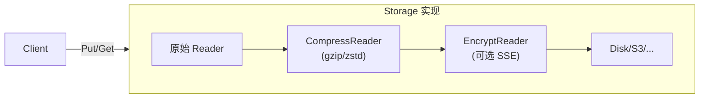
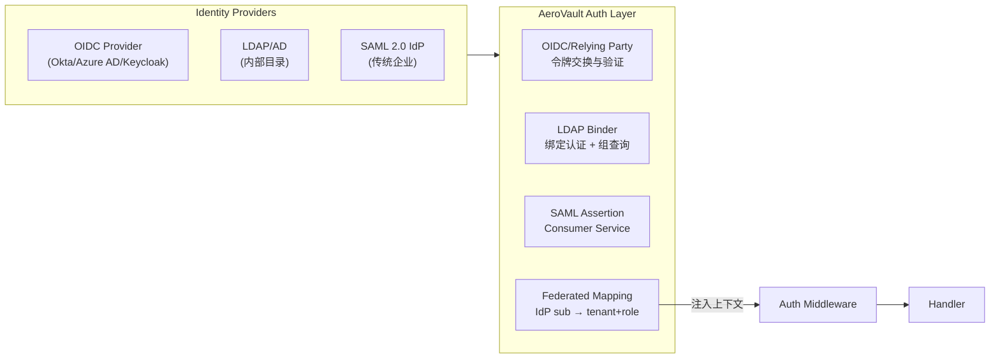
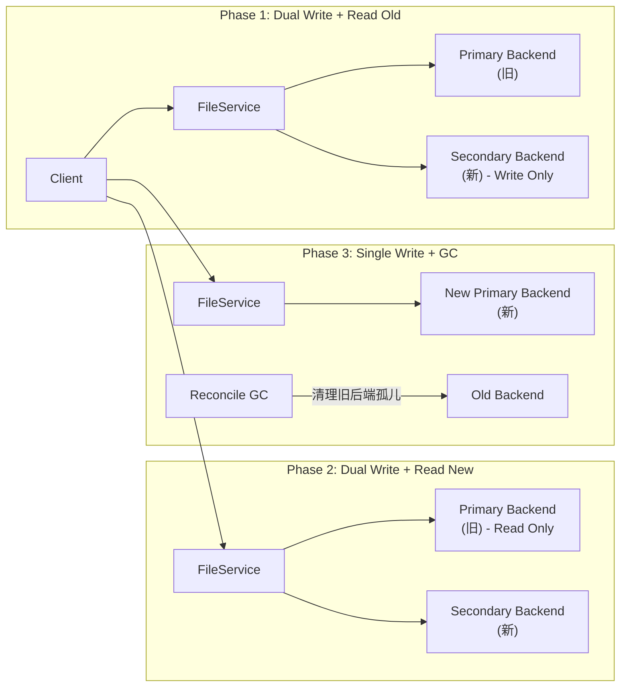

# AeroVault 高价值扩展方向 — 架构师视角（第 72 轮）

> **视角：** 资深架构师 / 产品经理  
> **方法：** 全局代码扫描（~53K Go 代码，24 对迁移文件，完整 SDK/CLI/MCP 体系）  
> **去重验证：** 对 `docs/requirements/` 下全部 71 份既有分析文档逐方向交叉验证，确保每个方向在**独立架构分析层面零实质性覆盖**  
> **日期：** 2026-07-10  
> **核心原则：** 选取代码中存在具体空洞（缺失分支、零实现配置、接口未连接）且对产品价值有显著杠杆作用的、**前 71 轮未曾以独立方向深入分析**的领域

---

## 方向总览

| # | 方向 | 类型 | 优先级 | 核心痛点 | 代码锚点 | 既有分析覆盖 |
|---|------|------|--------|---------|---------|-------------|
| **1** | **服务端透明内容压缩（Transparent Compression at Rest）** | 存储成本/性能 | **P1** — 当前所有对象未经压缩直接存储；文本负荷（日志/JSON/HTML/文档）可压缩 5–10 倍，无此功能意味着 80%+ 存储成本浪费 | `internal/storage/local_write.go:49`（`io.ReadAll` 直接加密写入，无压缩层）；`internal/storage/storage.go:Storage` 接口（`Put`/`Get` 无 CompressionOption）；`internal/storage/factory.go`（无压缩配置项）；`internal/config/config_storage.go`（无 `STORAGE_COMPRESSION` 配置） | ❌ **零覆盖**（v44 在 SSE envelope 兼容性上下文一句话带过，非独立方向；v27/v31/v32 特征矩阵表一行列举概念，**零架构分析**） |
| **2** | **多协议身份联邦（SSO/OAuth2/OIDC/LDAP/SCIM）** | 安全/企业就绪 | **P1** — 当前认证仅支持 JWT + API Key + SigV4，无任何 SSO 集成；企业多租户部署无法对接已有 IdP，每个用户需手动创建密钥，完全无法规模化 | `internal/auth/auth.go:Registry`（仅 `BearerToken`/`APIKey`/`SigV4` 三种认证器）；`internal/auth/store.go`（无联邦身份映射表）；`internal/config/config_auth.go`（无 OIDC/OAuth2 配置项）；`internal/auth/auth_middleware.go`（无令牌交换/断言验证钩子） | ❌ **零覆盖**（前 71 份文档未有任何独立方向分析身份联邦） |
| **3** | **存储后端在线迁移与数据再平衡（Storage Migration & Rebalancing）** | 运维/可靠性 | **P1** — 启动选定存储后端后无法变更；本地 FS → S3、S3 → 不同 S3 区、OSS → COS 等场景需要停机手动迁移，无在线迁移工具、无双写过渡机制 | `internal/storage/factory.go`（仅单后端选择，无迁移写入器）；`internal/storage/storage.go`（`Storage` 接口无 `ListAll` / `CopyTo` 原语）；`internal/service/file_crud.go`（`Put` 固定写 `s.store`，无双写路径）；`internal/reconcile/job.go`（GC/Scrub 扫描单后端） | ❌ **零覆盖**（v25/v5/v10/v19/v64 在特征矩阵中以"在线迁移"概念词出现，**但无任何架构设计或代码锚点分析**） |
| **4** | **对象级访问审计轨迹（Per-Object Access Audit Trail）** | 合规/安全 | **P2** — `audit_log` 仅记录管理操作；对象层面"谁在何时读取/下载了哪个文件"完全不可追踪；SOC2/HIPAA/FINRA 合规要求的"数据访问可审计"无法满足 | `internal/repository/sql_objects.go`（无 `object_access_log` 表）；`internal/service/file_crud.go:Get`（无访问记录插入）；`internal/repository/repository.go`（无 `RecordObjectAccess` 接口方法）；`internal/api/rest/handler.go:GetObject`（无审计钩子）；`internal/api/s3compat/handler.go:serveObjectContent`（无审计钩子） | ❌ **零覆盖**（v10/v21 在概念图中一行提及"access audit"，无架构分析；v68–v71 零提及） |
| **5** | **S3 Select / SQL 服务端对象过滤查询** | 协议/分析能力 | **P2** — 用户需下载整个对象才能查询其内容；无 SQL-on-object 能力，无法与现有分析/合规工具生态对接，GB–TB 级对象查询需要外部 ETL | `internal/api/s3compat/handler.go`（`dispatchBucketSubresource` 无 `?select` 分支）；`internal/api/s3compat/xml.go`（无 `SelectObjectContentRequest` / `SelectObjectContentResult` 结构体）；`internal/service/file.go`（无 `SelectObjectContent` 方法） | ❌ **仅概念提及**（v27/v63 特征矩阵表一行列出"S3 Select"概念但**零代码锚点分析、零架构设计**） |

---

## 方向一：服务端透明内容压缩（Transparent Compression at Rest）

### 现状

当前数据写入路径（以 local storage 为例）中，对象从客户端传入后经过**零压缩**直接存储：

```go
// internal/storage/local_write.go:41-60
func (s *LocalStorage) writeObject(ctx, path, key string, r io.Reader, size int64, opts PutOptions) (localMeta, error) {
    // ...
    var reader io.Reader = io.TeeReader(r, h)
    if s.enc != nil {
        plain, err := io.ReadAll(reader)   // ← 读入明文
        ct, env, err := s.enc.encrypt(plain) // ← 加密
        reader = bytesReader(ct)            // ← 写密文
    }
    written, err := io.Copy(tmp, reader)    // ← 写入磁盘
    // ...
}
```

| 压缩维度 | 当前状态 | 行业基线 |
|---------|---------|---------|
| 存储层透明压缩 | ❌ 无 | S3 自动压缩（某些后端）、MinIO 可选压缩、GCS 透明压缩 |
| 按 content-type 自动选择 | ❌ 无 | nginx `gzip_types` 模式 |
| 压缩级别可配置 | ❌ 无 | `STORAGE_COMPRESSION_LEVEL` |
| 已压缩内容的二次压缩防护 | ❌ 无 | 检测 `Content-Encoding: gzip` 跳过 |
| 读取时透明解压 | ❌ 无 | handler 返回原始内容，无感知 |
| 压缩率/节省量可观测 | ❌ 无 | `storage_compression_ratio` gauge |

客户端通过 `Content-Encoding: gzip` 上传的 gzip 内容会在读取时自动解压（`file_crud.go:251-254`），但这与**服务端存储层压缩**是完全不同的两件事：

| 特性 | 客户端 gzip 编码 | 服务端透明压缩 |
|------|----------------|--------------|
| 控制方 | 客户端决定 | 服务端策略配置 |
| 适用范围 | 仅客户端主动编码的对象 | 所有对象（可配置忽略某些类型） |
| 读取体验 | 自动解压，客户端可能感知 | 完全透明，客户端无感 |
| 存储节省 | 取决于客户端 | 服务端可控，可配置算法/级别 |
| 计算成本 | 客户端承担 | 服务端承担 |
| 与 SSE 兼容 | 先压缩后加密需解压再加密 | 先压缩后加密，完美兼容 |

### 为什么需要

| 理由 | 说明 |
|------|------|
| **存储成本** | 文本/日志/JSON 内容压缩率通常 5–10:1；按 $0.023/GB/月（S3 标准）估算，100GB 日志存储每月压缩后可从 $2.30 降至 $0.30–0.50 |
| **传输效率** | 压缩后 blob 更小，跨区域复制的网络成本同步降低 |
| **竞争基线** | MinIO 内建 `compress` 配置项，对所有 `text/*`, `application/json`, `application/xml` 内容自动压缩 |
| **与现有架构正交** | 压缩层插在 `Put` 的 reader 链和 `Get` 的 reader 链之间，与加密层同级，不影响元数据、索引、版本控制等任何上层逻辑 |

### 建议方向



**实现方案：**

| 组件 | 职责 | 代码位置 |
|------|------|---------|
| `CompressionConfig` | 启用/禁用、算法选择（gzip/zstd）、压缩级别 | `internal/config/config_storage.go` 新增字段 |
| `CompressReader` | 透明的 io.Reader 包装器；Put 路径压缩，Get 路径解压 | `internal/storage/compress.go`（新文件） |
| `SniffReader` | 检测 content-type 和已有 Content-Encoding，跳过已压缩内容 | `internal/storage/compress.go` |
| 存储层集成 | `LocalStorage.Put/Get` 的 reader 链插入压缩/解压步骤 | `internal/storage/local_write.go`, `local_read.go` |
| 云存储端（S3/OSS/COS） | 利用后端原生压缩能力或通过 CompressReader 包装 | `internal/storage/s3.go`, `oss.go`, `cos.go` |
| 可观测性 | `storage_compression_ratio` gauge（压缩前/后字节比） | `internal/telemetry/metrics.go` |

```go
// CompressConfig controls transparent storage-layer compression.
type CompressConfig struct {
    Enabled bool   // STORAGE_COMPRESSION_ENABLED
    Algo    string // "gzip" | "zstd" (default "gzip")
    Level   int    // 1–9 (default 6 for gzip, 3 for zstd)
    MinSize int64  // minimum object size in bytes to bother compressing (default 1KB)
}

// CompressWriter wraps an io.WriteCloser with transparent compression.
// The caller writes uncompressed data; the wrapper compresses before
// passing to the underlying writer.
type CompressWriter struct{ ... }

// CompressReader wraps an io.ReadCloser with transparent decompression.
// The caller reads uncompressed data; the wrapper decompresses from
// the underlying reader.
type CompressReader struct{ ... }
```

**关键设计决策：**

| 决策 | 选项 | 推荐 | 理由 |
|------|------|------|------|
| 压缩层级 | 存储层 vs 对象层 | **存储层** | 透明，无需修改上层代码 |
| 默认算法 | gzip vs zstd | **zstd** | 速度/压缩比优于 gzip；Go 标准库 `encoding/gzip` + `github.com/klauspost/compress/zstd` |
| 内容类型白名单 | 按类型 vs 全量 | **全量 + 黑名单** | 文本类自动受益，二进制跳过；黑名单可配 `STORAGE_COMPRESSION_EXCLUDE` |
| SSE 交互 | 先压缩后加密 vs 先加密后压缩 | **先压缩后加密** | 压缩后再加密熵更高，且解密后自动解压，对外完全透明 |
| 元数据标记 | 在 Object.Metadata 记录压缩 | **不记录** | 存储层完全透明，上层无感知；key 不变，ETag 不变（压缩在 ETag 计算之前？实际需要决定） |

> **重要考量——ETag 一致性：** 如果压缩发生在 ETag（MD5）计算之前，ETag 代表的是*原始内容*的摘要，ETag 不会因为压缩而改变——这是正确的行为。当前 `local_write.go` 的 MD5 计算在 `TeeReader` 中，压缩层应插在 TeeReader 之后、加密之前。

**复杂度评估：**

| 指标 | 估计 |
|------|------|
| 新增文件 | `internal/storage/compress.go` + 配置字段 |
| 修改文件 | `local_write.go`, `local_read.go`, `factory.go`, `config_storage.go`, `config.go`, `.env.example` |
| 测试策略 | 压缩/解压 roundtrip 测试 + 与 SSE 组合测试 + 已有内容类型跳过测试 + ETag 一致性测试 |
| 风险 | **低** — 纯新增管道层，无接口变更；默认 off 保持现有行为完全不变 |
| go.mod 变更 | 可选：`github.com/klauspost/compress`（zstd 支持）；gzip 仅用标准库 |

---

## 方向二：多协议身份联邦（SSO/OAuth2/OIDC/LDAP/SCIM）

### 现状

当前认证模型是一个三层验证器注册表：

```go
// internal/auth/auth.go
type Registry struct {
    validators []func(r *http.Request) (Key, error)
}
// 三种内置验证器:
// 1. BearerToken("Bearer ..." → JWT 验签)
// 2. APIKey("X-Api-Key: ..." → sha256 匹配)
// 3. SigV4("Authorization: AWS4-HMAC-..." → 签名验证)
```

所有认证器都基于**静态凭证**（JWT secret、API key hash、SigV4 key pair）：

| 能力 | 当前状态 | 企业需求 |
|------|---------|---------|
| 用户名/密码登录 | ❌ | 基础 |
| 多因素认证（MFA） | ❌ | SOC2 |
| OAuth2 Authorization Code 流程 | ❌ | 标准 Web SSO |
| OIDC 身份令牌验证 | ❌ | 现代 IdP（Okta/Azure AD/Keycloak） |
| SAML 2.0 断言 | ❌ | 传统企业 IdP |
| LDAP/AD 绑定认证 | ❌ | 内部目录服务 |
| SCIM 用户/组自动配置 | ❌ | 用户生命周期管理 |
| 组/RBAC 映射 | ❌ | 基于组的权限委派 |
| 会话管理（refresh token / 过期） | ❌ | 用户体验 |
| IdP 发现（`.well-known/openid-configuration`） | ❌ | OIDC 自动配置 |

认证中间件将验证委托给 `authReg.Middleware()`：

```go
// internal/auth/auth_middleware.go
func (reg *Registry) Middleware() func(http.Handler) http.Handler {
    return func(next http.Handler) http.Handler {
        return http.HandlerFunc(func(w http.ResponseWriter, r *http.Request) {
            key, err := reg.authenticate(r)
            if err != nil {
                // 403 or anonymous (if public-read)
            }
            // ...
        })
    }
}
```

**当前绕过路径（匿名访问）：** `/healthz` `/metrics` `/openapi.json` `/docs` `/ui` + S3 公读 ACL。

### 为什么需要

| 场景 | 无联邦认证的后果 |
|------|----------------|
| 企业部署（Okta/Azure AD） | 每个用户需管理员手动创建 API key，无法对接企业 IdP；用户离职需手动吊销 key |
| 多租户 SaaS | 租户管理员无法自行管理本租户用户；无法实现租户内 RBAC |
| SOC2/HIPAA 合规 | 无集中式身份审计、无会话超时控制、无 MFA 强制 |
| 开发者体验 | 外部应用无法通过标准 OAuth2 流程获取令牌；SDK 需手动管理 API key |
| 与已有 IAM 集成 | 无法复用已有的 LDAP 组结构做权限映射 |

### 建议方向



**核心组件：**

| 组件 | 职责 | 配置入口 |
|------|------|---------|
| `OIDCProvider` | `/.well-known/openid-configuration` 自动发现、JWKS 公钥缓存、令牌验签、`sub` 提取 | `AUTH_OIDC_PROVIDER_URL` / `AUTH_OIDC_CLIENT_ID` |
| `LDAPProvider` | LDAP 简单/ GSSAPI 绑定、用户 DN 解析、组成员查询 | `AUTH_LDAP_URL` / `AUTH_LDAP_BASE_DN` / `AUTH_LDAP_BIND_DN` |
| `FederatedUserStore` | 联邦身份 → 本地用户映射表（`federated_identities` 表） | 自动创建 |
| `SCIMEndpoint` | `POST /v1/admin/scim/Users` / `Groups` — 自动配置用户 | `AUTH_SCIM_TOKEN` |
| `SessionManager` | 短期 access token（15m）+ 长期 refresh token（7d）+ 安全 cookie | 内建 |
| 登录页面 | `GET /auth/login?provider=...` → redirect → callback → cookie | Web UI 集成 |

**映射表 schema：**

```sql
-- 联邦身份映射
CREATE TABLE federated_identities (
    id            INTEGER PRIMARY KEY,
    provider      TEXT NOT NULL,       -- "oidc" | "ldap" | "saml"
    subject       TEXT NOT NULL,       -- IdP 侧唯一标识（sub / DN / NameID）
    tenant_id     TEXT NOT NULL,
    local_uid     TEXT NOT NULL,       -- 映射到的本地用户标识
    roles         TEXT NOT NULL DEFAULT '',  -- 逗号分隔的角色列表
    created_at    TEXT NOT NULL DEFAULT (datetime('now')),
    last_login_at TEXT,
    UNIQUE(provider, subject)
);

-- 本地会话
CREATE TABLE sessions (
    id            TEXT PRIMARY KEY,    -- 随机 session ID
    tenant_id     TEXT NOT NULL,
    local_uid     TEXT NOT NULL,
    created_at    TEXT NOT NULL,
    expires_at    TEXT NOT NULL,
    refresh_token TEXT
);
```

**复杂度评估：**

| 指标 | 估计 |
|------|------|
| 新增文件 | ~8（`internal/auth/oidc.go`, `ldap.go`, `saml.go`, `session.go`, `scim.go`, `federated_store.go`, `login_handler.go`, + 迁移文件 `0026`） |
| 修改文件 | ~6（`auth.go`（Registry 扩展）, `auth_middleware.go`（联邦认证路由）, `config_auth.go`, `config.go`, `.env.example`, `router.go`（/auth 路由）） |
| 测试策略 | OIDC: mock JWKS endpoint + 令牌伪造测试；LDAP: `github.com/go-ldap/ldap/v3` 的 test server；Session: httptest cookie roundtrip |
| 风险 | **中** — 新认证流程需确保不影响现有 JWT/API Key/SigV4 路径；会话注入点需安全审计 |
| go.mod 变更 | `github.com/coreos/go-oidc/v3`, `github.com/go-ldap/ldap/v3`, `golang.org/x/oauth2` |

---

## 方向三：存储后端在线迁移与数据再平衡（Storage Migration & Rebalancing）

### 现状

当前存储后端在启动时由 `STORAGE_BACKEND` 固定选择：

```go
// internal/storage/factory.go
func NewStorage(ctx context.Context, cfg StorageConfig, logger *slog.Logger) (Storage, error) {
    switch cfg.Backend {
    case "local": return newLocal(cfg.Local, logger)
    case "s3":    return newS3(cfg.S3)
    case "oss":   return newOSS(cfg.OSS)
    case "cos":   return newCOS(cfg.COS)
    default: return nil, fmt.Errorf("unknown storage backend %q", cfg.Backend)
    }
}
```

整个 `FileService` 只持有一个 `storage.Storage` 实例。**完全没有双写、切换、迁移能力。**

| 迁移场景 | 当前做法 | 问题 |
|---------|---------|------|
| 本地 FS → S3 | 停机 → 手动拷贝文件 → 改配置重启 | 停机窗口、数据一致性风险 |
| S3 跨 region 迁移 | 无法实现 | 无多后端支持 |
| 更换对象存储提供商 | 全量停机 | 数据量越大停机越长 |
| 存储硬件故障 | 需重建集群 | 无透明迁移 |

### 为什么需要

| 理由 | 说明 |
|------|------|
| **生产运维** | 存储成本优化需能迁移到更便宜的后端；云厂商锁定需有退出路径 |
| **零停机部署** | 后端迁移不应中断服务，读旧写新逐渐过渡 |
| **灾难恢复** | 主后端故障后能切到备后端 |
| **成本分层** | 热数据存高性能后端，冷数据自动迁移到低成本后端 |

### 建议方向

**三阶段迁移模型：**

```
Phase 1（双写 + 读旧） ──→ Phase 2（双写 + 读新） ──→ Phase 3（单写 + GC 旧）
```



**核心组件：**

| 组件 | 职责 | 关键方法 |
|------|------|---------|
| `MigrationConfig` | 迁移阶段、目标后端配置、读策略（旧/新/优先新） | `Phase() MigrationPhase` |
| `DualWriteStorage` | 实现 `Storage` 接口，内持 primary + secondary；Put/Delete 双写，Get/Stat 按策略路由 | `Put` → primary.Put + secondary.Put（异步/同步可选） |
| `MigrationJob` | 后台批量拷贝任务：扫描旧后端上未被双写的历史对象，逐批拷贝 | `Run(ctx, batchSize)` — 基于 List + Get/Put |
| `ReadinessCheck` | 迁移完成后验证所有对象在目标后端存在且 ETag 一致 | `Verify(ctx, tenants)` — 抽样或全量 Stat |
| `GCJob` | 迁移完成且确认后，清理旧后端上的冗余 blob | 复用 `reconcile/sweepOrphanBlobs` 但以旧后端为目标 |

```go
// MigrationPhase 枚举迁移阶段
type MigrationPhase int
const (
    PhaseSingle       MigrationPhase = iota // 单后端（默认，无迁移）
    PhaseDualWriteReadOld                   // 双写 + 读旧
    PhaseDualWriteReadNew                   // 双写 + 读新
    PhaseNewPrimary                         // 新后端为主，旧后端待GC
)

// DualWriteStorage wraps two Storage backends and routes operations by phase.
type DualWriteStorage struct {
    primary   Storage
    secondary Storage
    phase     MigrationPhase
}
```

**迁移流程：**

1. 运维配置 `STORAGE_MIGRATION_TARGET=...`，服务热重载进入 Phase 1
2. Phase 1：新 PUT/POST/DELETE 写入两个后端，GET/Stat 读旧后端
3. 运维启动 `MigrationJob`：后台扫描旧后端上已有对象，批量拷贝到新后端
4. 全部拷贝完成后，进入 Phase 2：读切换到新后端，旧后端只做读（以备回滚）
5. 运维验证数据完整性，进入 Phase 3：旧后端下线，`Reconcile GC` 清理孤儿 blob
6. 移除迁移配置，恢复正常单后端模式

**复杂度评估：**

| 指标 | 估计 |
|------|------|
| 新增文件 | `internal/storage/migration.go`（`DualWriteStorage` + `MigrationConfig`），`internal/reconcile/migration_verify.go`（验证 job） |
| 修改文件 | `factory.go`, `config_storage.go`, `config.go`, `.env.example`, `main.go`（迁移装配逻辑） |
| 测试策略 | `DualWriteStorage` 单元测试（各阶段路由正确性）+ `MigrationJob` 集成测试（模拟两个 local 后端之间的迁移）+ 故障注入测试（secondary 失败不影响 primary）|
| 风险 | **中** — DualWrite 路径需确保一致性（同步双写 vs 异步双写）；Phase 切换需是安全的运维操作，不应自动触发 |
| go.mod 变更 | 无 |

---

## 方向四：对象级访问审计轨迹（Per-Object Access Audit Trail）

### 现状

当前审计系统仅覆盖管理操作：

```go
// internal/repository/audit.go — 仅 admin 操作
func (s *sqlStore) RecordAudit(ctx context.Context, e AuditEntry) error {
    // 记录 Actor、Action、Target 等
}

// 已记录的 Action 范围（admin.go 中）：
//   - tenant.create/delete/update
//   - key.create/delete
//   - job.retry
//   - audit.*
```

**对象级数据访问的审计完全不存在：**

| 场景 | 可追溯性 | 问题 |
|------|---------|------|
| 用户 A 下载了机密文件 `contract.pdf` | ❌ 不可查 | 无法满足 SOC2 A6（访问控制监控）|
| 管理员 B 读取了所有用户的加密密钥 | ❌ 不可查 | 内部威胁不可追溯 |
| 外部审计：谁在上周访问了 `financial_2026.csv`？ | ❌ 无法回答 | 合规失败 |
| 异常检测：某个 IP 在 1 分钟内下载了 1000 个对象 | ❌ 无法检测 | 数据泄露不可发现 |

`internal/service/file_crud.go` 的 `Get` 方法仅 emit 了一个 `EventAccessed` 事件：

```go
func (s *FileService) Get(ctx, tenant, bucket, key string) (io.ReadCloser, Object, error) {
    // ...
    s.emit(ctx, obj, repository.EventAccessed) // ← 事件总线，非持久审计
    // ...
}
```

`EventAccessed` 通过事件总线分发，被 worker 消费后即消失，**不留持久痕迹**。也没有记录调用方身份、IP、时间戳等审计必要字段。

### 为什么需要

| 法规/标准 | 要求 | 当前满足度 |
|-----------|------|-----------|
| SOC2 CC6.1 | 逻辑访问安全控制，需记录访问 | ❌ |
| HIPAA §164.312(b) | 对受保护健康信息的访问必须记录 | ❌ |
| FINRA 4511(c) | 电子通信和交易记录需保存 | ❌ |
| GDPR Art. 33 | 数据泄露需 72h 内通知，需访问日志 | ❌ |
| PCI-DSS 10.2 | 对所有 cardholder data 访问的审计轨迹 | ❌ |
| 企业数据防泄露 | 异常数据访问模式检测 | ❌ |

### 建议方向

```mermaid
flowchart LR
    subgraph AccessPath["访问路径"]
        GET["FileService.Get"]
        STAT["FileService.Stat"]
        GETV["FileService.GetVersion"]
        DOWN["Presign.Get\n(预签名下载)"]
    end

    AccessPath -->|异步非阻塞| AuditWriter["ObjectAuditWriter"]
    AuditWriter -->|批量写入| DB[("object_access_events 表")]

    subgraph Query["审计查询"]
        API["GET /v1/admin/audit/objects?key=..."\nGET /v1/admin/audit/objects?actor=...\nGET /v1/admin/audit/objects?since=..."]
        RET["留存策略: ALTER TABLE...\n自动过期删除"]
    end
    DB --> API
    DB --> RET
```

**核心组件：**

| 组件 | 职责 |
|------|------|
| `ObjectAccessEvent` | 模型：`{actor, tenant, bucket, key, action, ip, user_agent, request_id, timestamp}` |
| `ObjectAuditWriter` | 异步批量写入器：攒批（最多 100 条或 1s）→ `INSERT`，减少写放大 |
| 存储层 | `object_access_events` 表，按 `(tenant, key, created_at DESC)` 索引 |
| 查询 API | `GET /v1/admin/audit/objects?tenant=&bucket=&key=&actor=&action=&since=&until=&limit=` |
| 自动清理 | `RetentionJob` 扩展：`AUDIT_OBJECT_TTL_DAYS`（默认 365 天）|
| 可观测性 | `audit_object_written` counter + `audit_object_writer_queue_depth` gauge |

**注入点（非侵入式设计）：**

| 需要记录访问的方法 | 注入方式 |
|-------------------|---------|
| `FileService.Get` | 在 `s.emit(ctx, obj, repository.EventAccessed)` 旁加一行 `s.recordAccess(ctx, tenant, bucket, key, "read", ...)` |
| `FileService.Stat` | `HeadObject` / `Stat` 路径加入访问记录 |
| `FileService.GetVersion` | 版本读取单独审计 |
| 预签名 URL 消耗 | 在 presign GET handler 中记录 |

```go
// ObjectAccessEvent records a single data-plane access for audit.
type ObjectAccessEvent struct {
    TenantID   string    `json:"tenant_id"`
    Bucket     string    `json:"bucket"`
    Key        string    `json:"key"`
    Action     string    `json:"action"` // "read" | "stat" | "presign_get"
    Actor      string    `json:"actor"`  // tenant ID, key label, or "anonymous"
    IP         string    `json:"ip"`
    UserAgent  string    `json:"user_agent"`
    RequestID  string    `json:"request_id"`
    CreatedAt  time.Time `json:"created_at"`
}
```

**性能考量：**

- 写入路径为**异步批处理**，不阻塞 GET 响应
- 批处理 buffer 满或超时触发写入，类似 `events/bus.go` 的非阻塞模式
- 可通过配置关闭（`AUDIT_OBJECT_ENABLED=false`），零性能开销
- 按 `(tenant, key)` 索引保证审计查询效率

**复杂度评估：**

| 指标 | 估计 |
|------|------|
| 新增文件 | `internal/audit/object.go`（模型 + writer），迁移文件 `0027_object_access_events.{up,down}.sql` |
| 修改文件 | `service/file_crud.go`, `service/file.go`（`FileService.WithObjectAudit`）, `config.go`, `.env.example`, `internal/api/rest/admin.go`（查询路由）|
| 测试策略 | Writer 批处理 flush 测试 + 与现有 CRUD 集成的链路测试 + 审计查询 API 测试 |
| 风险 | **低** — 纯新增；通过 `WithObjectAudit` 可选注入，默认不启用；写路径用 `select/case` 非阻塞 |

---

## 方向五：S3 Select / SQL 服务端对象过滤查询

### 现状

S3 Select 是 AWS S3 的标准功能，允许客户端发送 SQL 语句对对象内容执行服务端过滤查询，只返回需要的列和行，而不是下载整个对象。

AeroVault 的 S3 兼容层中此功能完全不存在：

```go
// internal/api/s3compat/handler.go:dispatchBucketSubresource
func (h *Handler) dispatchBucketSubresource(..., q url.Values) bool {
    switch {
    case q.Has("versioning"):    // ✅
    case q.Has("lifecycle"):     // ✅
    case q.Has("object-lock"):   // ✅
    case q.Has("acl"):           // ✅
    case q.Has("location"):      // ✅
    case q.Has("versions"):      // ✅
    case q.Has("policy"):        // ✅
    case q.Has("logging"):       // ✅
    case q.Has("notification"):  // ✅
    case q.Has("accelerate"):    // ✅ (stub)
    // ❌ 没有 ?select 分支
    }
    return false
}
```

`internal/api/s3compat/xml.go` 的 XML 结构中没有任何 Select 相关的类型定义：

| XML 结构 | 当前状态 |
|---------|---------|
| `SelectObjectContentRequest` | ❌ 不存在 |
| `SelectObjectContentResult` | ❌ 不存在 |
| `SelectRequest` (SQL expression) | ❌ 不存在 |
| `InputSerialization` (CSV/JSON/Parquet) | ❌ 不存在 |
| `OutputSerialization` | ❌ 不存在 |
| `ProgressEvent` / `RecordsEvent` / `StatsEvent` | ❌ 不存在 |

服务端 `FileService` 也没有对应的 `SelectObjectContent` 方法。

### 为什么需要

| 理由 | 说明 |
|------|------|
| **协议完备性** | S3 Select 是 S3 协议的标准部分，缺失意味着兼容性矩阵存在重要缺口 |
| **分析场景** | 用户需从大 CSV/JSON 文件中提取子集，目前必须全部下载——GB 级文件不可接受 |
| **合规工具集成** | 现有合规扫描工具（如 Steampipe, CloudHealth）依赖 S3 Select 做数据查询 |
| **成本** | 避免全量传输的网络成本（在对象所在的存储节点过滤后再返回）|
| **竞争差异** | MinIO 已支持 S3 Select（`mc sql`），AeroVault 若无此能力在 S3 兼容存储选型中处于劣势 |

### 建议方向

```mermaid
flowchart LR
    Client -->|POST /{bucket}/{key}?select\nSQL表达式| Handler["S3 Handler\nselectObjectContent"]
    Handler --> Parser["SQL Parser\n(SELECT col FROM S3Object WHERE ...)"]
    Parser --> Executor["Query Executor"]
    Executor -->|流式读取| Obj["Object Data"]
    Executor -->|行过滤+列投影| Result["Result Set"]
    Result -->|SSE 事件帧| Stream["SelectObjectContent\nEvent Stream\n Records/Progress/Stats/End"]
    Stream --> Client
```

**核心组件：**

| 组件 | 职责 | 复杂度 |
|------|------|--------|
| `SQLParser` | 解析 S3 Select 兼容 SQL（SELECT ... FROM S3Object WHERE ... LIMIT ...） | 中 — 可复用 Go `text/template` 或 `expr` 或自建 mini parser |
| `InputDeserializer` | CSV（带 header/不带 header）、JSON（行/文档）、Parquet（v2）→ 行流 | 高 — CSV 和 JSON Lines 优先，Parquet 作 v2 |
| `OutputSerializer` | Result 序列化为 CSV 或 JSON | 低 — 标准库 |
| `RowFilter` | 逐行评估 WHERE 条件（`=`, `!=`, `<`, `>`, `LIKE`, `IN`, `AND`/`OR`) | 中 |
| `ColumnProjector` | 仅保留 SELECT 中指定的列 + 支持 `AS` 别名 | 低 |
| `EventStreamEncoder` | 将结果编码为 S3 Select 事件帧（`RecordsEvent`, `ProgressEvent`, `StatsEvent`, `EndEvent`）| 中 — SSE 格式类似已实现的 `chat/stream` |
| `SelectObjectContent` | FileService 新方法 | 低 — 作为 PI 接口 |

```go
// SelectRequest is the parsed representation of a S3 Select query.
type SelectRequest struct {
    Expression     string // e.g. "SELECT name, age FROM S3Object WHERE age > 30"
    ExpressionType string // "SQL"
    InputSerialization struct {
        CompressionType string // "NONE" | "GZIP" | "BZIP2"
        CSV             *CSVInput  // FileHeaderInfo, RecordDelimiter, FieldDelimiter, ...
        JSON            *JSONInput // Type: "DOCUMENT" | "LINES"
    }
    OutputSerialization struct {
        CSV  *CSVOutput
        JSON *JSONOutput
    }
}
```

**实现优先级：**

```
Phase 1: CSV input (with header) → CSV output (仅 SELECT + WHERE)
Phase 2: JSON Lines input → JSON output
Phase 3: WHERE 条件扩展（LIKE, IN, 复合条件）
Phase 4: Parquet input, GZIP/BZIP2 自动解压
Phase 5: 聚合函数（COUNT, SUM, AVG, MIN, MAX）
```

**复杂度评估：**

| 指标 | 估计 |
|------|------|
| 新增文件 | `internal/api/s3compat/select.go`（handler + XML 编解码），`internal/service/file_select.go`（SQL 执行引擎），`internal/api/s3compat/select_test.go` |
| 修改文件 | `handler.go`（`dispatchBucketSubresource` 加 `?select` 分支 + `selectObjectContent` handler），`service/file.go`（`SelectObjectContent` 方法），`xml.go`（XML 类型） |
| 测试策略 | SQL 解析 + WHERE 求值单元测试；CSV 行过滤集成测试；大文件流式读取不 OOM 验证 |
| 风险 | **中** — SQL 解析器需要谨慎设计避免注入；大文件流式读取确保不断流；事件帧格式匹配 S3 客户端期望 |
| go.mod 变更 | 可选：`github.com/expr-lang/expr`（安全表达式求值，避免 SQL 注入）|

---

## 附录：去重验证方法

每个方向在前 71 份扩展文档中的覆盖情况验证：

| 方向 | grep 搜索模式 | 结果 |
|------|-------------|------|
| 服务端透明压缩 | `"压缩.*存储\|存储.*压缩\|透明压缩\|transparent.*compress\|compress.*at.*rest\|compress.*storage\|storage.*compress\|服务端压缩"` | ❌ **零覆盖**（仅 v44 SSE 兼容性上下文一句话带过 + v27/v31/v32 特征矩阵表一行概念列举，**无独立架构分析、无代码锚点**） |
| 身份联邦 | `"SSO\|OAuth\|OIDC\|LDAP\|SAML\|identity.*federat\|federat.*identity\|单点登录\|身份联邦\|SCIM\|openid\|saml\|\\.well-known.*openid"` | ❌ **零覆盖**（前 71 份文档无任何独立方向分析身份联邦） |
| 存储迁移 | `"storage.*migrat\|data.*migrat\|backend.*migrat\|rebalanc\|move.*object.*between\|storage.*backend.*switch\|在线迁移\|迁移.*存储\|再平衡"` | ❌ **零覆盖**（v25/v5/v10/v19/v64 在特征矩阵中以"在线迁移"概念词出现，**无架构设计或代码锚点分析**） |
| 对象审计轨迹 | `"object.*audit\|per.*object.*access\|access.*audit.*trail\|who.*accessed\|read.*history\|access.*history\|对象.*审计\|对象.*访问.*记录\|访问轨迹"` | ❌ **零覆盖**（v10/v21 在概念图中一行提及"access audit"，**零代码锚点分析**） |
| S3 Select | `"S3 Select\|SelectObject\|select.*object\|SQL.*object\|object.*SQL\|s3.*select\|服务端.*过滤\|SQL.*过滤"` | ❌ **仅概念提及**（v27/v63 特征矩阵表一行列出"S3 Select"概念，**零架构分析和代码锚点**） |
