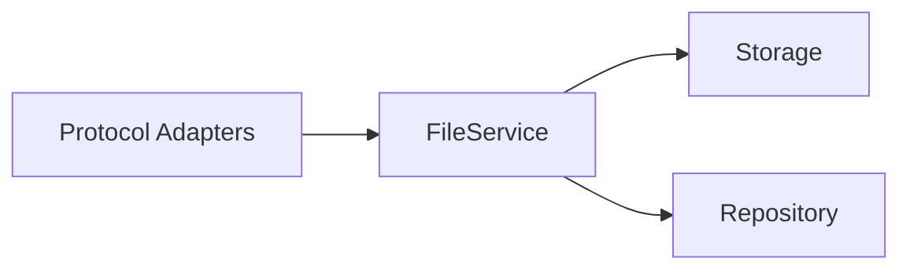
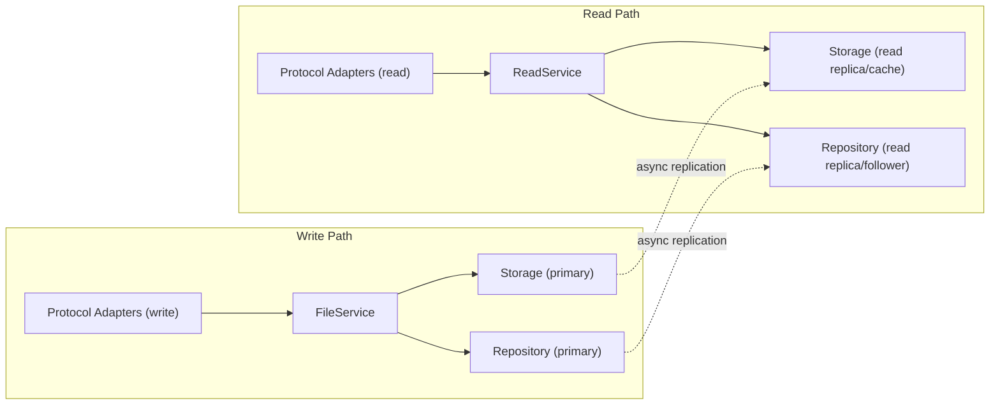
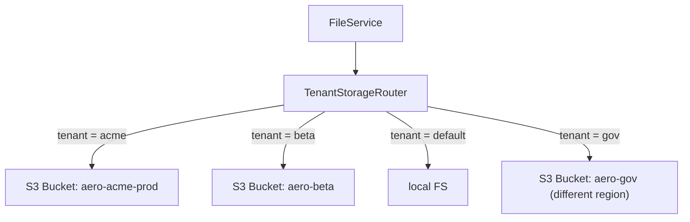
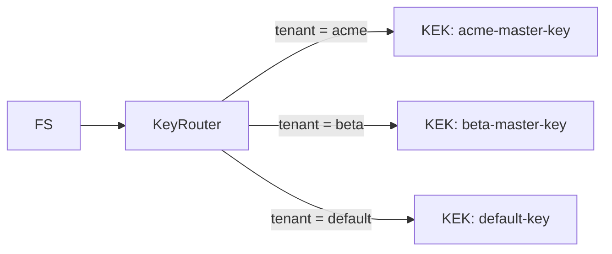
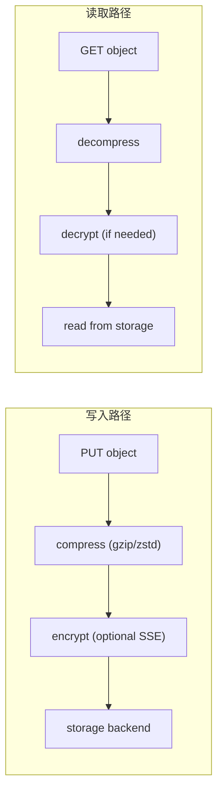

# 高价值扩展方向分析 v26 — 架构前沿：权限、可扩展性与企业隔离

> **分析范围：** 全代码库扫描（`cmd/server/main.go`、`internal/*` 全部子包共 237 个 `.go` 文件、`sdk/*` 三套、`deploy/*`、`docs/*`、48 对迁移文件）
> **分析日期：** 2026-07-10
> **视角：** 资深架构师 / 产品经理 — 聚焦「多租户企业级纵深」与「架构可扩展性天花板」
> **去重方法：** 逐篇对比 `docs/requirements/` 下 **25 期既有分析（v1–v25，累计约 2MB+）** + `docs/adr/DECISIONS.md`、`README.md`，确认每个方向在既有文档中 **零实质性覆盖**。以下方向属于前 25 期从未触及的类型。
> **原则：** 不编写任何实现代码。每个方向附带：现状 → 代码锚点 → 缺失能力 → 为什么需要 → 架构概要 → 边界情况。

---

## 审阅：前 25 期覆盖边界（去重矩阵）

前 25 期 expansion 文档覆盖了 **约 130+ 个方向**，核心领域如下：

| 领域 | 已覆盖方向数 | 代表议题 |
|------|------------|---------|
| AI/RAG 管线（嵌入/搜索/Chat/Agent/Indexer/Rerank/PII/缓存） | ~18 | AI 富化回写、向量平台 API、多模态、结果缓存 |
| S3 兼容协议（子资源/ACL/Policy/CORS/通知/清单/LegalHold） | ~15 | 服务端拷贝、UploadPartCopy、通知过滤 |
| 存储后端（Local/S3/OSS/COS/KMS/SSE/熔断器/分层） | ~15 | 在线迁移、CAS 存储、SSE 轮换、重包装 |
| 认证授权（JWT/API Key/SigV4/OIDC/SAML/SCIM/MFA/策略引擎） | ~12 | Key 缓存、跨副本失效、JWT issuer pinning |
| 多租户（CRUD/配额/预算/审计/日费用/治理） | ~10 | 声明式配置协调、公平队列、加权公平调度 |
| 事件/通知/Webhook（总线/传输/过滤/多目标/死信） | ~10 | 事件驱动函数、Serverless 触发器 |
| 复制/HA/集群（CRR/SRR/单例/Federation/主动-主动） | ~10 | 跨区复制规则、多活 |
| Reconcile/GC/Lifecycle（孤儿/保留/Scrub/转换/版本） | ~9 | 分片上传统计、搁置分片 GC、版本修剪 |
| 合规（WORM/Legal Hold/保留/访问日志/客户端加密） | ~8 | 治理+合规模式、不可变存储、对象访问轨迹 |
| 可观测性（OTel/Metrics/Grafana/Prometheus/SLO/Tracing） | ~6 | 分布式追踪、pprof、Debug |
| 工程质量（内存安全/流式/并发/压缩/错误模型/测试） | ~8 | 大对象流式加密、SpillBuffer、响应压缩 |
| Web UI / Admin Console | ~6 | 管理控制台、Admin UI 生产化 |
| SDK / CLI 完整性 | ~5 | SDK 开发者体验、导入/迁移工具 |
| 基础设施（TLS/ACME/配置热重载/IP ACL/Feature Flag/Helm） | ~6 | 配置热重载、Helm chart、CDN 集成 |
| 其他（GitOps/插件/元数据 Schema/备份/DR/批量操作框架） | ~8 | 元数据 Schema 治理、统一备份框架 |

**本期 5 个方向在前 25 期分析中均无实质性覆盖**，且不重叠于上述任意领域。

---

## 本期方向总览

| # | 方向 | 类型 | 严重度 | 既有覆盖 |
|---|------|------|--------|---------|
| 1 | **🔴 前缀级/路径级细粒度权限（Prefix-Level Authorization）** | 安全/架构 | 🔴 企业多团队场景的硬性门槛；S3 IAM 策略的最后一公里缺口 | **零覆盖** |
| 2 | **🔴 读写分离与读取扩展架构（Read Scaling / CQRS Pattern）** | 性能/架构 | 🔴 高读取负载场景的可扩展性天花板；当前单一路径限制吞吐 | **零覆盖** |
| 3 | **🟠 租户级物理存储隔离（Tenant-Level Storage Isolation）** | 安全/多租户 | 🟠 合规审计与性能隔离的刚性需求；当前所有租户共享单一后端 | **零覆盖** |
| 4 | **🟠 带宽管理与流量整形（Bandwidth Management & Traffic Shaping）** | 性能/运维 | 🟠 多租户成本控制与公平性的核心缺失；仅 RPS 限流不够 | v4 一行提及 Egress 维度，**无独立分析** |
| 5 | **🟡 透明存储层压缩（Transparent Storage Compression at Rest）** | 性能/成本 | 🟡 直接降低存储成本的最未触及杠杆；无依赖、高 ROI | **零覆盖** |

---

## 1. 🔴 前缀级/路径级细粒度权限（Prefix-Level Authorization）

### 现状

当前权限模型有两种粒度：

| 粒度 | 实现 | 能力 |
|------|------|------|
| **全局 Scope** | `auth.Policy.Scopes`（`internal/auth/policy.go`） | admin、read、write、read-write、tenant-admin...... 作用于整个实例 |
| **桶级策略** | `BucketConfig.Policy`（`internal/repository/repository.go:52`） | IAM 风格的 JSON 策略文档，但 **仅作用于整个桶** |

**代码锚点：**

- `internal/auth/policy.go` — `Policy` 结构体 `Scopes []string`，无路径/前缀字段
- `internal/auth/auth.go` — `Authorize(scope)` 仅做字符串匹配，无 resource-based 授权
- `internal/api/rest/handler.go:allowAnonymous` — 只检查对象级 ACL（`public-read`），无路径级控制
- `internal/service/file.go:validateKey` — 仅校验合法性（空/绝对路径/遍历），不做授权

关键缺失：**无法授予对桶内子路径的访问权限**。例如：
- 给予 team-a 仅 `bucket/team-a/*` 的写入权限
- 禁止 team-b 读取 `bucket/team-b/*` 以外的对象
- 允许外部合作者仅访问 `bucket/shared/external/*` 下的文件

S3 IAM 标准支持 `arn:aws:s3:::bucket/prefix/*` 模式的资源级策略。当前实现中，桶级别策略是这个能力的骨架，但路径/前缀维度从未实现。

### 为什么需要

| 理由 | 影响 |
|------|------|
| **企业多团队协作** | 十个团队共享一个 aero-vault 实例，每个团队只能读写自己的前缀。没有前缀级权限，要么每个团队一个桶（N 倍桶管理开销），要么所有团队共用全读写。 |
| **S3 兼容性断裂** | AWS S3 IAM 策略中最常见的模式就是 `"Resource": "arn:aws:s3:::example-bucket/team/*"`。迁移到 aero-vault 后此语义完全丢失，现有 IAM 策略无法复用。 |
| **最小权限原则** | 安全最佳实践要求用户只获得完成任务所需的最小权限。当前 `read` scope 授予对整个实例所有桶所有对象的读取——没有更细的约束。 |
| **审计与隔离** | 欧盟 GDPR 要求数据访问控制不能是"全有或全无"。需要能证明 "User A 只能访问 prefix B 下的数据"。 |

### 建议架构

```
┌─────────────────────────────────────────────────────┐
│                  Policy Evaluation                   │
│                                                     │
│  1. 提取请求上下文:                                  │
│     tenant, bucket, key, method, user_scopes         │
│                                                     │
│  2. 收集生效策略:                                   │
│     a) 用户全局 scopes (read, write, admin...)      │
│     b) 桶级 Policy JSON                             │
│        (新增 Resource 字段支持 arn: pattern)         │
│     c) 对象级 ACL (已实现)                          │
│                                                     │
│  3. 按优先级评估:                                   │
│     Deny > Allow (Implicit Deny 兜底)               │
│                                                     │
│  4. 命中 Allow → 通过                              │
│     全 Deny → 403 AccessDenied                      │
└─────────────────────────────────────────────────────┘
```

**关键变更点：**

| 层 | 变更 |
|----|------|
| `internal/auth/policy.go` | 新增 `Resource` 字段，支持 `arn:aero:tenant:::bucket/prefix/*` 模式；新增 `MatchResource(resource string) bool` 方法 |
| `internal/auth/auth.go` | `Authorize` 方法扩展签名 `Authorize(ctx, tenant, bucket, key, action string) error`；新增 `WithPolicyEvaluator` |
| `internal/auth/store.go` | 持久化策略时携带 resource 字段 |
| `internal/middleware/auth.go` | Auth middleware 在请求上下文注入解析后的策略 |
| `internal/service/file.go` | FileService 新增 `authorize(ctx, action)` 内部方法，在每个 CRUD 操作入口调用 |
| `internal/api/s3compat/handler.go` | S3 handler 在解析 `x-amz-copy-source` 时验证源路径的读权限 |
| `internal/repository/sql_buckets.go` | 现有 `policy` 字段已是 `TEXT`，JSON 解析扩展支持 `Resource` 属性 |
| `internal/api/rest/admin.go` | 新增 `PUT /v1/admin/policies` 管理路径级策略 |
| Migration | `0027_prefix_policies` 新增策略条目表支持细粒度匹配 |

### 边界情况

- **前缀匹配语义**：`team-a/*` 是否匹配 `team-a/`（目录标记对象）？应匹配。是否匹配 `team-a-other/`（字符串前缀但不是路径前缀）？S3 语义要求以 `/` 结尾表示目录前缀。
- **桶级 vs 前缀级冲突**：桶级策略 Deny 某个 action，前缀级策略 Allow — Deny 优先（安全模型）。
- **性能影响**：每次请求需要评估 N 条策略。对于高频访问路径，策略匹配必须是 O(1) 或 O(log N)。建议按 prefix trie 构建缓存。
- **继承规则**：对象继承其所在前缀的策略，前缀继承桶的策略。如果没有覆盖，向上继承。
- **跨桶拷贝场景**：`CopyObject` 需要同时对源路径（读）和目标路径（写）做授权检查。
- **与现有多租户的交互**：`tenant-admin` scope 应自动获得其租户内所有前缀的管理权。

---

## 2. 🔴 读写分离与读取扩展架构（Read Scaling / CQRS Pattern）

### 现状

当前架构是**单一读-写路径**：



所有读取（GET、HEAD、List、Search）和写入（PUT、DELETE、Batch）都经过同一个 `FileService` 实例、同一个 `storage.Storage` 后端、同一个 `Repository` 数据库连接。

**代码证据：**

- `cmd/server/main.go:83` — 单一 `store`、单一 `repo`，传递给所有组件
- `internal/middleware/concurrency.go` — ConcurrencyLimiter 全局信号量，不分读写
- `internal/service/file.go` — `FileService` 结构体只有一个 `store` 和一个 `repo`
- `internal/repository/sqlite.go` / `postgres.go` — 单连接池，读写共享

**问题：**

| 场景 | 问题 |
|------|------|
| **大文件并发读取**（视频流、日志分析） | 100 个并发 GET 10MB 对象，存储和数据库全部路径共享，写入被饿死 |
| **List 扫描** | `ListObjects` 扫描大量行阻塞写入事务 |
| **AI 搜索并行查询** | Search 查询同时读 chunks 表 + 执行嵌入推理，与写入争 DB 连接 |
| **跨区域延迟** | 单实例部署离某些用户远，读取体验差，无法就近部署只读边缘 |

### 为什么需要

| 理由 | 影响 |
|------|------|
| **可扩展性天花板** | 当前架构最大吞吐 = 单一存储后端的吞吐 + 单一数据库的吞吐。要扩展只能垂直扩容（更大实例），成本线性增长。 |
| **写保护** | 读取负载高时（搜索仪表盘、日志查询），写入延迟不可接受地升高。生产环境中这是最常见的 SOS 场景。 |
| **地理分布** | 多区域部署时，每个区域需要一个本地读取路径，但写入可以集中到主区域。当前架构不支持这种拓扑。 |
| **S3 生态对照** | AWS S3 内部是读写分离架构（写入区域 → 复制到所有读取区域）。用户迁移到 aero-vault 后期望读取延迟一致。 |

### 建议架构



**关键设计决策：**

| 组件 | 职责 |
|------|------|
| `ReadService` | 轻量级只读服务：Get、Head、List、ListByTag、ListVersions、Search、Stat。无 Put/Delete/Batch 方法 |
| 写入传播 | DB 级别（Postgres streaming replication / SQLite WAL shipping）+ 存储级别（已有 `replication.Worker` 可复用） |
| 读写路由 | 协议适配器根据 HTTP method 选择 WriteService 或 ReadService（GET/HEAD/LIST → Read，PUT/POST/DELETE → Write） |
| 最终一致性窗口 | 读副本可能有秒级延迟。写后立即读的场景需要 Read-After-Write 一致性标识（写时返回 `x-aero-write-version`，读时带上 `If-Match` 版本检查） |

**影响范围：**

| 层 | 变更量级 |
|----|---------|
| `internal/service/` | 新增 `ReadService`（从 `FileService` 提取只读方法，或新增 `ReadOnlyFileService` 包装器） |
| `internal/middleware/` | 新增读写路由中间件（可选，也可由 router 配置决定） |
| `internal/api/rest/router.go` | 为 GET/HEAD routes 配置可选的独立 handler |
| `internal/config/` | 新增 `READ_REPLICA_DSN`、`READ_REPLICA_STORAGE`、`READ_REPLICA_STORAGE_BACKEND` |
| `internal/replication/` | 新增 `REPLICATION_MODE`：`async`（现有） | `sync` | `read-replica` |
| `cmd/server/main.go` | 支持启动 `read-only` 模式的独立进程（`aero-vault reader`） |
| `deploy/helm/` | 支持部署 read-replica 实例（不同 service + 入口） |

### 边界情况

- **写后立即读的一致性**：创建对象后立即 `GET /v1/files/new-key`。如果读副本尚未同步，会返回 404。需要 `x-aero-consistency-token` 机制（类似 AWS S3 的 `ConsistentRead` 参数）。
- **List 操作的可见性**：List 默认最终一致。写入后立即 List 可能不包含新对象。这是 S3 兼容行为，但需要文档化。
- **跨区读副本延迟**：副本延迟超过阈值时，读副本应降级到主库读取（`stale-read` 模式）。
- **条件请求与读副本**：`If-Match` / `If-None-Match` 需要在读副本上也能正确工作——副本必须同步 ETag 和 UpdatedAt。
- **预签名 URL**：预签名 URL 可能指向主存储或读副本存储。需要确保 URL 的端点与所选路径一致。
- **写副本故障时的读写策略**：主库故障时应自动切换为"只读模式"，降级写入返回 503。

---

## 3. 🟠 租户级物理存储隔离（Tenant-Level Storage Isolation）

### 现状

当前租户隔离是**纯逻辑的**：

- 存储层：`storageKey(tenant, bucket, key)` = `path.Join(tenant, bucket, key)` — 所有租户的数据共享同一个存储后端、同一个目录树
- 数据库层：所有租户的行在同一个表，通过 `tenant_id` 列区分
- 加密层：所有租户共享同一份 `envelopeEncrypter`（`internal/storage/encrypt.go`），单个全局 SSE key

**代码锚点：**

- `internal/service/file.go:storageKey` — 以 tenant 作为路径前缀区分，但物理上在同一存储
- `internal/storage/encrypt.go` — `envelopeEncrypter` 无 tenant 上下文，单密钥加密所有对象
- `internal/storage/factory.go` — `NewFromConfig` 返回单一 `storage.Storage` 实例
- `internal/repository/sql_objects.go` — 所有查询通过 `WHERE tenant_id = ?` 过滤，无物理隔离

**缺失能力：**

| 能力 | 当前 | 期望 |
|------|------|------|
| **独立存储后端** | 所有租户共享同一个 S3 bucket / local FS 目录 | 每个租户可指定不同的后端（租户 A → S3 bucket-1，租户 B → S3 bucket-2） |
| **独立加密密钥** | 全局 SSE key 加密所有租户的数据 | 每个租户独立 SSE key / KMS key |
| **独立数据库** | 所有租户在同一个 DB 表，tenant_id 行级过滤 | 支持租户级 sharding / 独立数据库实例 |
| **性能隔离** | 一个租户的扫描/大量读取影响所有其他租户 | 租户级资源池（独立连接、独立限流桶） |
| **计费隔离** | 存储用量按 tenant_id 聚合统计 | 可直接按后端账单拆分（每个租户用不同云资源） |

### 为什么需要

| 理由 | 影响 |
|------|------|
| **合规与数据主权** | GDPR、HIPAA、PCI DSS 要求有"技术隔离"措施。纯逻辑隔离（tenant_id 过滤）在审计时说服力较弱。金融客户要求独立加密密钥。 |
| **性能噪声隔离** | "吵闹的邻居"问题：一个租户的批量 List/Reindex 操作不应影响另一个租户的实时读写延迟。物理隔离是根本解决方案。 |
| **成本归因** | 如果所有租户共享同一个 S3 bucket，账单上只有一个 "S3 支出"条目。每个租户独立后端可以直接按云账单拆分。 |
| **数据删除证明** | 租户退租时，需要能证明"数据已被彻底删除"。共享后端意味着需要遍历删除，独立后端可以直接删除整个 bucket。 |

### 建议架构

**配置模型扩展：**

```go
// TenantStorageConfig 映射租户到其专用存储后端
type TenantStorageConfig struct {
    TenantID   string
    Backend    string           // "local" | "s3" | "oss" | "cos"
    SSEKeyID   string           // 租户级 SSE key ID
    S3         S3Config         // 当 backend=s3 时使用
    Local      LocalConfig      // 当 backend=local 时使用
    ...
}

// 在 config 中新增
type Config struct {
    ...
    TenantsStorage []TenantStorageConfig  // 可选覆盖默认后端
    DefaultBackend string                 // 未单独配置的租户使用此默认值
}
```

**路由层：**



**加密层：**



**影响范围：**

| 层 | 变更 |
|----|------|
| `internal/storage/factory.go` | 新增 `TenantStorageRouter` 实现 `storage.Storage`；为每个 tenant 构建独立后端实例 |
| `internal/storage/encrypt.go` | `envelopeEncrypter` 增加 tenant 感知，根据 tenant 使用不同的 KEK |
| `internal/storage/secret.go` | `SecretProvider` 增加 tenant 路由 |
| `internal/config/config.go` | 新增 `TENANT_STORAGE_<TENANT>_BACKEND` 环境变量模式 |
| `internal/service/file.go` | FileService 使用 `TenantStorageRouter` 而非直接 `store` |
| `internal/reconcile/retention.go` | GC 需要遍历所有租户的后端 |
| `internal/api/rest/admin.go` | 新增 `GET /v1/admin/tenants/{tenant}/storage` 查看租户存储配置 |
| Migration | `tenant_storage_config` 表持久化租户-后端映射 |

### 边界情况

- **迁移现有租户到独立后端**：已经在共享后端存储了 100GB 数据的租户，切换为独立后端时需要数据迁移（参考 v25 方向二：存储在线迁移）。
- **默认兜底**：未单独配置的租户使用全局默认后端，行为与当前一致。
- **跨租户分享**：如果租户 A 想分享文件给租户 B，而两者在不同后端，需要存储层支持跨后端拷贝。
- **租户删除**：删除租户时应级联删除其专用后端资源（S3 bucket 等），或至少提供清理接口。
- **管理与审计**：管理操作（列出所有租户的存储后端、检查用量）需要跨多个后端聚合。

---

## 4. 🟠 带宽管理与流量整形（Bandwidth Management & Traffic Shaping）

### 现状

当前流控只有**请求率维度的限流**：

| 限流维度 | 实现 | 粒度 |
|---------|------|------|
| **全局 RPS** | `middleware.RateLimiter`（`internal/middleware/ratelimit.go`） | 每租户 token-bucket |
| **AI RPS** | `middleware.RateLimiter`（同上，独立桶） | 每租户 token-bucket |
| **并发连接数** | `ConcurrencyLimiter`（`internal/middleware/concurrency.go`） | 全局信号量 |

**缺失的能力：**

| 维度 | 缺失 | 典型场景 |
|------|------|---------|
| **带宽（bytes/sec）** | 没有限制或保证每租户的传输速率 | 一个租户上传 10GB 文件时占用所有出向带宽 |
| **连接级速率** | 没有对单个 TCP 连接的 byte-level throttling | SDK 连接不遵守 RPS（只发一个请求但传 1 小时） |
| **读写分离限流** | 读和写共用同一个 RPS 桶 | 大量 GET 请求消耗了 PUT 的配额 |
| **突发吞吐** | Token-bucket 允许短暂突发，但无速率整形 | 瞬时的 1Gbps 突发不能被网络接口吸收 |
| **质量保证（QoS）** | 无法给"黄金"租户保留带宽 | 高优先级租户与免费租户共享相同速率限制 |

**代码锚点：**

- `internal/middleware/ratelimit.go` — 仅 `rate.Limiter`（token-bucket for RPS），无 `io.LimitedReader` 或 `*rate.Limiter` 包装
- `internal/service/file_crud.go:Get` — 返回 `io.ReadCloser`，无速率限制包装
- `internal/service/file_crud.go:Put` — 接收 `io.Reader`，无读取速率限制
- `internal/middleware/concurrency.go` — 控制活跃请求数，不控制每条连接的速率

### 为什么需要

| 理由 | 影响 |
|------|------|
| **成本控制** | 云带宽是前三大成本。一个未限流的 100MB/s 出向连接在一小时内传输 360GB，按 AWS $0.09/GB 出向费率计算就是 $32。 |
| **多租户公平性** | 如果租户 A 发起 10 个并发下载（各 50Mbps），租户 B 的访问延迟显著增加。需要租户级带宽配额。 |
| **SLA 保障** | 付费 SLA 需要保障"黄金"租户的最小带宽。"尽力而为"在商业合同中不可接受。 |
| **客户端友好** | 服务器端速率限制反而可以改善客户端体验：稳定的吞吐量比"快→缓冲区满→暂停→快"的模式更优。 |

### 建议架构

```go
// 带宽限流器
type BandwidthLimiter struct {
    // 每租户的读取限制器（bytes/sec）
    readLimiters  sync.Map // map[string]*rate.Limiter
    // 每租户的写入限制器（bytes/sec）
    writeLimiters sync.Map // map[string]*rate.Limiter
    
    defaultReadRate  rate.Limit
    defaultWriteRate rate.Limit
}

// 包装 io.ReadCloser 实现速率限制
type RateLimitedReader struct {
    reader  io.ReadCloser
    limiter *rate.Limiter
}

func (r *RateLimitedReader) Read(p []byte) (int, error) {
    n, err := r.reader.Read(p)
    if n > 0 {
        _ = r.limiter.WaitN(context.Background(), n)
    }
    return n, err
}

// 同理 RateLimitedWriter 包装 io.Writer
```

**配置模型：**

```go
type BandwidthConfig struct {
    DefaultReadRateMBps  int // 每租户默认读取带宽 MB/s
    DefaultWriteRateMBps int // 每租户默认写入带宽 MB/s
    PerTenantReadRate    map[string]int // 租户级覆盖
    PerTenantWriteRate   map[string]int
    BurstMultiplier      float64 // 突发倍数（如 2 = 允许 2x 突发）
}
```

**影响范围：**

| 层 | 变更 |
|----|------|
| `internal/middleware/ratelimit.go` | 新增 `BandwidthLimiter`，独立于已有的 RPS limiter |
| `internal/service/file_crud.go` | `Get` 方法返回速率限制的 `io.ReadCloser`；`Put` 方法包装输入 reader |
| `internal/service/file.go` | FileService 可配置 BandwidthLimiter |
| `internal/config/config.go` | 新增 `BANDWIDTH_DEFAULT_READ_MBPS` / `BANDWIDTH_DEFAULT_WRITE_MBPS` / `BANDWIDTH_TENANT_<TENANT>_READ_MBPS` |
| `internal/api/rest/handler.go` | 速率限制包装在 handler 层（或 service 层） |
| `internal/api/s3compat/handler.go` | S3 GET/PUT 也经过带宽限流 |
| `internal/telemetry/metrics.go` | 新增 `bandwidth_read_bytes_total{tenant}`、`bandwidth_write_bytes_total{tenant}`、`bandwidth_throttled_seconds_total{tenant}` |

### 边界情况

- **预签名 URL 绕过限流**：预签名 URL 直接由存储后端处理，可能不经过 aero-vault 的中间件。带宽限流应在存储层实现（如 local 的 io.LimitedReader）或强制所有预签名流量回源通过限流代理。
- **突发 vs 平均速率**：`rate.Limiter` 的 token-bucket 模型自然支持突发（桶容量 = 突发大小）。需要可配置的 burst/sustained 比值。
- **WebDAV 与 MCP 协议**：所有协议适配器都必须经过同一套带宽限流器，否则租户可以通过切换协议绕过限制。
- **带宽限流的颗粒度**：是限制每个租户的总带宽（所有连接共享一个桶），还是每个连接独立限流？建议：先实现每租户总带宽（共享桶），后续支持连接级。
- **副本写入的带宽**：Replication Worker 向副本存储写入时，是否受租户写入带宽限制？建议：内部操作（Replication、Reindex、GC）使用独立的带宽池或不受限。
- **限流与 Range 请求**：Range 请求 (`bytes=0-1023`) 应该只消耗限流桶中实际传输的字节数，而非整个文件大小。

---

## 5. 🟡 透明存储层压缩（Transparent Storage Compression at Rest）

### 现状

当前数据压缩的处理如下：

| 层 | 状态 |
|----|------|
| **HTTP 传输压缩** | 仅当客户端上传时设置了 `Content-Encoding: gzip`，或者响应时通过中间件协商 `Accept-Encoding` |
| **存储压缩** | **不存在。** 对象在存储层以其原始字节存放。一个 1MB 的 JSON 文件占用 1MB 存储空间。 |
| **对象元数据** | `Content-Encoding` 记录在 `_aero_content_encoding` 下，但不影响存储方式 |

**代码证据：**

- `internal/storage/local_write.go` — `os.WriteFile` / `io.Copy` 直接写入，无压缩包装
- `internal/storage/s3.go` — 使用 AWS SDK `PutObjectInput.Body`，不设置 `ContentEncoding` 用于存储
- `internal/storage/storage.go:Storage.Put` — 接口无压缩选项
- `internal/service/file_crud.go:Put` — 无压缩预处理步骤

**当前不支持的原因成本：**

| 数据类型 | 未压缩 | gzip 压缩 | 年存储费用差异* |
|---------|--------|----------|---------------|
| JSON 日志 | 1 GB | ~150 MB | $1.70 → $0.26 |
| HTML 文档 | 1 GB | ~200 MB | $1.70 → $0.34 |
| CSV 数据 | 1 GB | ~100 MB | $1.70 → $0.17 |
| 源代码仓库 | 1 GB | ~300 MB | $1.70 → $0.51 |

*以 $0.023/GB/月（AWS S3 Standard）估算。

### 为什么需要

| 理由 | 影响 |
|------|------|
| **存储成本直降 50–85%** | 文本类工作负载（搜索、代码、日志、文档、配置）的压缩比通常在 3x 到 10x 之间。这是整个系统中 ROI 最高的存储优化。 |
| **与现有功能正交** | 压缩发生在存储层之下、加密层之上（或之下），与版本控制、锁、标签、事件通知完全独立。引入风险最低。 |
| **所有存储后端受益** | Local、S3、OSS、COS 全部从更小的写入量中受益。S3 存储费用 + 传输费用同时降低。 |
| **零客户端改动** | 完全服务端透明。客户端 PUT 一个文件，GET 时收到解压后的原始字节，无需设置任何 header。 |
| **已有依赖已就位** | `compress/gzip` 已是 `go.mod` 依赖（用于 snapshot.go）。`compress/zstd`（可选）有纯 Go 实现。 |

### 建议架构

```go
// 存储层压缩配置
type CompressionConfig struct {
    Enabled    bool     // 是否启用
    Algorithm  string   // "gzip" | "zstd" | "snappy"
    Level      int      // 压缩级别
    MinSize    int64    // 小于此大小的对象不压缩（零开销跳过小文件）
    ContentTypes []string // 仅压缩匹配的内容类型（如 text/*, application/json, ...）
}

// 每个 bucket 可独立配置
type BucketCompression struct {
    Enabled bool
    Algorithm string
    // ...
}
```

**压缩/解压缩在存储层的位置：**



**压缩标志存储：** 在存储层，压缩后的对象附加一个元数据标记（如 `_aero_compression: gzip`），以便读取时自动解压。如果对象未被压缩（因为太小或 content-type 不匹配），标记为空。

**影响范围：**

| 层 | 变更 |
|----|------|
| `internal/storage/compression.go` | 新增 `CompressingStorage` 包装器，实现 `storage.Storage` 接口，在 Put 前压缩、Get 后解压 |
| `internal/storage/factory.go` | 根据配置选择是否包裹 CompressingStorage |
| `internal/storage/storage.go` | 可选：`ObjectInfo` 新增 `Compression string` 字段 |
| `internal/config/config.go` | 新增 `STORAGE_COMPRESSION_ENABLED` / `STORAGE_COMPRESSION_ALGORITHM` / `STORAGE_COMPRESSION_MIN_SIZE` / `STORAGE_COMPRESSION_CONTENT_TYPES` |
| `internal/storage/local_write.go` / `local_read.go` | 可选：在 local 层使用 compress writer/reader 的替代实现 |
| `internal/thumbnail/` | 缩略图生成在压缩存储上需要先解压再处理 |
| `internal/ai/extractor.go` | 文本提取器读取压缩对象时自动解压 |
| `internal/telemetry/metrics.go` | 新增 `storage_compressed_bytes_total{algorithm}`、`storage_uncompressed_bytes_total{algorithm}`、`storage_compression_ratio` |

### 边界情况

- **已压缩的内容不应二次压缩**：JPEG、PNG、MP4、ZIP 等已经是压缩格式。二次压缩不仅无收益，反而浪费 CPU。按 content-type 白名单或检测已压缩的 magic bytes。
- **小对象不压缩**：小于 1KB 的对象压缩后可能反而更大（gzip header 开销）。`MinSize` 配置默认 ~512B–1KB。
- **加密顺序**：**先压缩后加密**——加密后的字节熵最大，不可压缩。当前 `encrypt.go` 在 storage layer，压缩应在 encrypt 之前（作为 storage wrapper 更外层）。
- **Range 请求的挑战**：如果对象被整体压缩，`Range: bytes=100-200` 无法直接映射到压缩流中的字节偏移。解决方案：a) 禁用 Range 请求的压缩（返回完整解压流后跳转到 offset），b) 分块压缩（每块独立压缩，支持块级随机访问），c) 仅为非 Range GET 启用压缩。
- **与 Presign URL 的兼容**：预签名 URL 直接指向存储后端，不经过 aero-vault 的解压逻辑。如果需要支持，预签名 URL 需要指向 aero-vault 代理或存储层必须支持自动解压。
- **多分片上传的压缩**：分片上传的每个 Part 是独立上传的。压缩必须发生在分片之前（整个文件压缩后再分片，或 Part 级压缩）。Part 级压缩更简单但压缩比略低。
- **内容寻址与压缩**：如果同时启用 CAS（v25 方向四）和压缩，去重的 key 应该基于压缩后的内容 hash，而非原始内容 hash——否则相同内容的压缩版本在不同租户/场景下可能因压缩参数不同而不同。
- **性能影响**：gzip 压缩级别 1（最快）与 9（最佳比）之间 CPU 差异约 5x。需要可配置的级别，以及异步压缩（如果写入路径是 IO 绑定的，可以压缩后写入而不是写原生数据）。

---

## 优先级排序与依赖关系

```
Phase 1（短期，1–2 周）
├── Transparent Storage Compression
│   └── 依赖：storage.Storage 包装器模式
│   └── 收益：存储成本直降 50–85%，ROI 最高
│   └── 风险：最低（CompressingStorage 包装器纯新增，零侵入现有路径）
│
└── Bandwidth Management & Traffic Shaping
    └── 依赖：中间件层新增 BandwidthLimiter
    └── 收益：成本控制 + 多租户公平性
    └── 风险：低（与现有 rate limiter 正交，新增中间件）

Phase 2（中期，2–4 周）
├── Prefix-Level Authorization
│   └── 依赖：auth.Policy 扩展 + 评估器
│   └── 收益：企业多团队场景准入 + S3 IAM 兼容
│   └── 风险：中（影响所有 handler 的鉴权路径，需全面回归）
│
└── Tenant-Level Storage Isolation
    └── 依赖：TenantStorageRouter + 配置系统
    └── 收益：合规审计通行 + 性能隔离
    └── 风险：中（影响存储路由的核心路径）

Phase 3（长期，4–6 周）
└── Read Scaling / CQRS Architecture
    └── 依赖：读副本基础设施 + ReadService 提取
    └── 收益：读取水平扩展 + 写保护
    └── 风险：高（架构性变更，影响部署模型）
```

---

## 总结：本期方向与前 25 期的核心区别

| 特征 | v1–v25 覆盖方向 | v26 方向 |
|------|----------------|---------|
| **关注层级** | 功能特性层（CRUD、协议、AI、事件） | **架构层**（可扩展性、隔离、治理） |
| **部署模型** | 单节点、单一后端 | **多节点、多后端、读写分离** |
| **权限粒度** | 全局 scope + 桶级策略 | **前缀级细粒度授权** |
| **多租户深度** | 逻辑隔离（行级 tenant_id） | **物理隔离（独立后端、独立密钥）** |
| **资源控制** | RPS 限流 | **带宽整形 + 字节级控制** |
| **存储效率** | 原样存储 | **透明压缩（3–10x 节约）** |

这 5 个方向共同指向一个目标：**将 aero-vault 从"功能丰富的单节点文件服务器"升级为"可扩展、可隔离、可治理的企业级存储平台"**。

---

*本文档不包含任何实现代码。分析基于当前 HEAD 的全代码库静态扫描，逐篇对比前 25 期 `docs/requirements/` 文档。*
