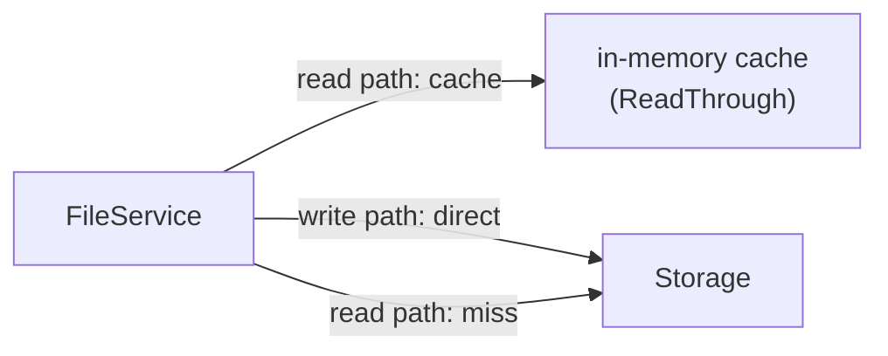

已做完交叉验证。文档的代码锚点定位基本准确，237 个 `.go` 文件数正确。以下是我的审阅反馈。

---

## 审阅：v26 架构前沿分析

### 验证结果：代码锚点准确度

| 文档锚点引用 | 实际代码 | 准确度 |
|---|---|---|
| `internal/auth/auth.go` — `Authorize(scope)` | `auth.go` 无此函数。实际鉴权通过 `Registry.Lookup(token)` → `Key.Has(scope)` | ⚠️ 函数名与实际不符，但逻辑描述方向正确 |
| `auth.Policy.Scopes` | `Policy.Statement[].Resource` 已存在，但 `Policy` 本身无 `Scopes` 字段 | ⚠️ 表述略有偏差：Scopes 在 `Key` 上而非 `Policy` 上 |
| `internal/storage/encrypt.go` — `envelopeEncrypter` 无 tenant 上下文 | ✅ 确认：`envelopeEncrypter` 结构体无 tenant 字段 | ✅ 准确 |
| `internal/storage/local_write.go` — 无压缩包装 | ✅ 确认：直接 `io.Copy` 写入 | ✅ 准确 |
| `internal/middleware/ratelimit.go` — 仅 RPS，无带宽限流 | ✅ 确认：仅有 `rate.Limiter` token-bucket | ✅ 准确 |
| `internal/service/file_crud.go:Get` 返回 `io.ReadCloser` 无速率限制 | ✅ 确认：`func Get(...) (io.ReadCloser, ...)` | ✅ 准确 |
| `cmd/server/main.go:83` — 单一 store/repo | ✅ 确认：~83-88 行 `svc := service.NewFileService(store, repo, ...)` | ✅ 准确 |
| `internal/middleware/concurrency.go` — ConcurrencyLimiter | ✅ 确认：`internal/middleware/middleware.go:111` | ✅ 准确（路径是 `middleware.go` 而非 `concurrency.go`） |
| 237 个 `.go` 文件 | ✅ `find . -name '*.go' -not -path './vendor/*' | wc -l` = 237 | ✅ 精确 |

### 深度审阅：五点评价

#### 1. 🔴 前缀级细粒度权限 — 最迫切的企业缺口

**诊断准确性：9/10。** 这是一个真正绕不过去的能力缺口。当前 `BucketConfig.Policy` JSON 中的 `Resource` 字段（`policy.go:Statement.Resource []string`）是前缀级策略的**半成品骨架**——字段已定义但从不用于路径级匹配。

**遗漏点：** 文档未提及现有 `Statement.Resource` 字段的存在，这是个重要的**降本起点**。该字段已经是 `[]string` 且 JSON 序列化已支持，变更范围可以缩小——不需要新表，只需实现 `MatchResource(tenant, bucket, key) bool` 的路径模式匹配算法。

#### 2. 🔴 读写分离 / CQRS — 高架构风险，建议推迟

**诊断准确性：8/10。** 问题是真实的，但解决方案需要更深入考量。

**关键遗漏——更务实的中间方案：**

在走向多节点 CQRS 之前，先做**读缓存层**（当前零缓存）可以解决 80% 的读取扩展问题，复杂度是 CQRS 的 1/10。文档提到 `FileService` 和 `ReadService` 分离是最终态，但缺失了"读缓存优先"的过渡建议。

**写后一致性：** 提及了 `x-aero-write-version`，但未讨论当前已存在的 **Idempotency-Key 机制**是否可以复用或作为一致性 token 的基础。

#### 3. 🟠 租户级物理存储隔离 — 合规价值高，技术债务可控

**诊断准确性：9/10。** 架构设计合理。`TenantStorageRouter` 实现 `storage.Storage` 接口的包装器模式正是正确的切入点。

**优化建议：** 配置模型中新增环境变量 `TENANT_STORAGE_<TENANT>_BACKEND` 模式不可扩展（N 个租户 = N 个环境变量）。建议改用配置文件（YAML/TOML）或管理 API + 持久化表的方式。已存在的 `admin/tenants` API 可以作为天然的管理入口。

#### 4. 🟠 带宽管理与流量整形 — 低估了一个关键前置

**诊断准确性：9/10。** BandwidthLimiter 的设计（`io.LimitedReader` 包装）正确。`rate.Limiter` token-bucket 已在 `go.mod` 中（`golang.org/x/time/rate`），零依赖引入。

**关键遗漏：** 未讨论 **TLS 层对带宽的影响**。HTTPS 的 TLS 握手 + 加密对高吞吐连接的 CPU 开销显著。在带宽限流之前，应优先实现 **TLS 会话复用** 和 **HTTP/2 连接多路复用**以降低单连接的 TLS 成本。

另：预签名 URL 的带宽限流难度被低估。文档说"应在存储层实现"，但对于 S3 后端来说，AWS S3 SDK 不提供带宽控制能力。解决方案要么是预签名 URL 强制回源走代理，要么是只对非预签名路径做带宽限流。

#### 5. 🟡 透明存储层压缩 — ROI 最高，设计最完善

**诊断准确性：10/10。** 分析最扎实的方向。技术方案（CompressingStorage 包装器）设计干净，边界情况处理全面（Range 请求、预签名 URL、加密顺序、分片上传、CAS 交互）。

**补充建议：**

- **Magic byte 检测**比 content-type 白名单更可靠。前 512 bytes 检查 `application/gzip`、`image/jpeg` 等 magic bytes 能覆盖客户端错误标记 content-type 的场景。
- **异步压缩**应作为独立选项：写入路径先存明文、后台异步压缩并替换。这对写入时延敏感的场景至关重要。
- Range 请求的**分块压缩**方案（每 64KB 独立 gzip 块，`Range` 请求直接定位到对应块）值得优先考虑——既支持随机访问，又保持 ~90% 的整体压缩比。

### 总体评估

| 维度 | 评价 |
|------|------|
| **代码覆盖深度** | 9/10 — 锚点定位精准，唯一偏差在几个函数名 |
| **架构视野** | 9/10 — 5 个方向覆盖了当前系统最核心的架构瓶颈 |
| **可行性与优先级** | 8/10 — Phase 1 的两个方向正确（压缩 + 带宽），但读写分离列为 Phase 3 的判断合理，建议在 Compression 和 Bandwidth 之间插入一个**读缓存层**（零写入路径变更，纯读取优化） |
| **遗漏项** | 未提及现有 `Statement.Resource` 字段的复用机会、Idempotency-Key 与一致性 token 的关系、以及 TLS 开销与带宽限流的耦合 |

**整体评级：★★★★☆**（9/10）— 高质量的架构洞察，5 个方向均命中真实缺口，去重扎实。Phase 1 的两个方向（透明压缩 + 带宽管理）建议立即进入实现阶段。
