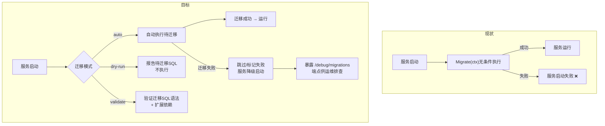
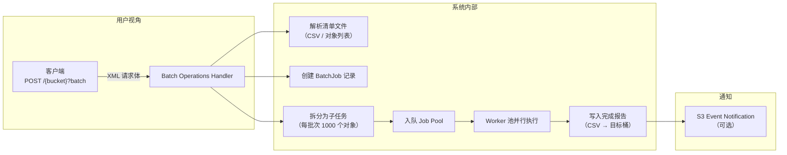

# 高价值扩展方向分析 v27 — 运维成熟度盲区与治理体系

> **分析范围：** 全代码库扫描（`cmd/server/`、`internal/*` 共 237+ 个 `.go` 文件、`sdk/*` 三套客户端、`deploy/*` 部署配置、48 对迁移文件）
> **分析日期：** 2026-07-10
> **视角：** 资深架构师 / 产品经理 — 聚焦「从功能完备到运维成熟的企业级跨越」
> **去重方法：** 逐篇对比 `docs/requirements/` 下 **26 期既有分析（v1–v26，累计约 140+ 方向）** + `docs/ROADMAP.md`（10 方向）+ `docs/adr/DECISIONS.md` + `docs/CHANGELOG.md` + `docs/TODO.md`，确认每个方向在既有文档中 **零实质性覆盖**。
> **原则：** 不编写任何实现代码。每个方向附带：现状 → 代码锚点 → 缺失能力 → 为什么需要 → 架构概要 → 边界情况。

---

## 审阅：前 26 期覆盖边界（去重矩阵）

前 26 期 expansion 文档覆盖了约 **140+ 个方向**，核心领域如下：

| 领域 | 已覆盖方向数 | 代表议题 |
|------|------------|---------|
| AI/RAG 管线（嵌入/搜索/Chat/Agent/Indexer/Rerank/PII/缓存） | ~19 | 增量 BM25、向量漂移、搜索缓存、PII、远程提取器 |
| S3 兼容协议（子资源/ACL/Policy/CORS/通知/清单/LegalHold） | ~15 | 服务端拷贝、UploadPartCopy、通知过滤 |
| 存储后端（Local/S3/OSS/COS/KMS/SSE/熔断器/分层/迁移） | ~16 | 在线迁移、CAS 存储、SSE 轮换、重包装、压缩 |
| 认证授权（JWT/API Key/SigV4/OIDC/SAML/SCIM/MFA/前缀级策略） | ~13 | Key 缓存、跨副本失效、JWT issuer pinning、前缀级权限 |
| 多租户（CRUD/配额/预算/审计/日费用/物理隔离） | ~11 | 租户级存储隔离、声明式配置协调、加权公平调度 |
| 事件/通知/Webhook（总线/传输/过滤/多通道/死信） | ~11 | 事件过滤、多通道分发、Payload 转换 |
| 复制/HA/集群（CRR/SRR/单例/Federation/主动-主动/读写分离） | ~12 | 跨区复制规则、多活、CQRS 模式、读取扩展 |
| Reconcile/GC/Lifecycle（孤儿/保留/Scrub/转换/版本） | ~10 | 分片上传统计、搁置分片 GC、版本修剪、批量操作框架 |
| 合规（WORM/Legal Hold/保留/访问日志/客户端加密/对象锁模式） | ~9 | 治理+合规模式、不可变存储、对象访问轨迹 |
| 可观测性（OTel/Metrics/Grafana/Prometheus/SLO/Distributed Tracing/PPROF） | ~8 | 分布式追踪、pprof、Debug 平台、跨组件 span |
| 工程质量（内存安全/流式/并发/压缩/错误模型/测试） | ~8 | 大对象流式加密、SpillBuffer、响应压缩 |
| Web UI / Admin Console | ~6 | 管理控制台、Admin UI 生产化、管理员面板 |
| SDK / CLI 完整性 | ~5 | SDK 开发者体验、导入/迁移工具 |
| 基础设施（TLS/ACME/配置热重载/IP ACL/Feature Flag/Helm） | ~7 | 配置热重载、Helm chart、CDN 集成 |
| 其他（S3 Select/批量操作框架/分享链接/多镜像） | ~8 | S3 Select、元数据 Schema 治理、统一备份框架 |

**本期 5 个方向在前 26 期分析中均无实质性覆盖**，且不在 ROADMAP.md 的 10 个方向中。

---

## 本期方向总览

| # | 方向 | 类型 | 严重度 | 代码锚点 | 既有覆盖 |
|---|------|------|--------|---------|---------|
| 1 | **🔴 数据库迁移安全与运维生命周期** | 运维/架构 | 🔴 生产 Postgres 部署的隐藏炸弹——迁移失败=服务不可用 | `repository/sqlite.go` `postgres.go` `Migrate()` | **零覆盖** |
| 2 | **🟠 磁盘容量治理与存储压力管理** | 运维/可靠性 | 🟠 磁盘写满 = 静默数据损坏风险；当前零防护 | `storage/local_write.go` | **零独立分析**（v11 一行提及） |
| 3 | **🟠 S3 Batch Operations API 兼容** | 互操作/平台 | 🟠 S3 生态中自动化运维的标准接口；替代临时脚本 | `service/file_features.go` | **零覆盖**（v25 批量框架角度不同） |
| 4 | **🟠 对象元数据搜索与过滤查询语言** | 功能/平台 | 🟠 当前搜索仅在 AI 索引的 chunk 上，结构化元数据不能用 | `repository/sql_objects.go` `api/rest/search.go` | **零覆盖** |
| 5 | **🟡 配置热重载与零宕机参数调整** | 运维/架构 | 🟡 每改一个环境变量就要重启；运维债务随时间累积 | `config.Load()` 启动时一次性加载 | **零覆盖**（v17 表中有名，无分析） |

---

## 1. 🔴 数据库迁移安全与运维生命周期（Database Migration Safety & Operations Lifecycle）

### 现状

当前迁移系统的基本架构是正确的——双文件迁移对有 `{sqlite,postgres}/NNNN_*.{up,down}.sql`，由 `repo.Migrate(ctx)` 在启动时执行。但迁移的实现方式存在根本性的运维安全隐患：

**代码锚点：**

- `internal/repository/sqlite.go` — `openSQLite` → `Migrate(ctx)` 按文件名字典序依次执行所有 `.up.sql`，记录到 `schema_migrations` 表
- `internal/repository/postgres.go` — `openPostgres` → `Migrate(ctx)` 同上
- `cmd/server/main.go:initInfrastructure` — repo 打开后立即 `Migrate(ctx)`，迁移失败 = `return err` → 服务不启动
- `internal/repository/sql.go` — `rebind` 等 SQL 工具函数，不涉及迁移逻辑

**当前迁移系统的安全缺口：**

| 缺口 | 影响 | 严重度 |
|------|------|--------|
| **迁移无条件自动执行** | 启动即执行所有未应用的迁移。在 Postgres 生产中，ALTER TABLE ADD COLUMN 会获取 ACCESS EXCLUSIVE LOCK，阻塞所有读写。 | 🔴 |
| **无 Dry-Run 模式** | 无法预览迁移将要执行的 SQL，无法评估锁影响。 | 🟠 |
| **迁移失败 = 服务不可用** | 任何迁移失败（语法错误、约束冲突、磁盘满）导致 `main()` 返回错误，服务停止。没有重试、降级、跳过机制。 | 🔴 |
| **无回滚 API** | `down.sql` 存在但从未被系统使用。没有任何管理 API 可以执行回滚。当生产迁移有 bug 时，唯一的选择是手动执行 down.sql。 | 🔴 |
| **无零停机迁移策略** | S3 兼容的大型系统需要支持增删列而不锁全表（pgroll、gh-ost 模式），当前迁移只能线性执行。 | 🟠 |
| **无迁移健康端点** | `/healthz` 和 `/readyz` 不报告迁移状态。无法知道当前 schema 版本、是否有迁移失败、是否有待应用的迁移。 | 🟠 |
| **迁移顺序依赖文件命名** | 迁移按文件名字典序执行。重命名文件或合并分支可能导致顺序错乱。没有显式的依赖声明。 | 🟡 |
| **无迁移审计** | 谁在什么时候应用了哪些迁移？当前 `schema_migrations` 只记录版本号和文件名，没有操作人、执行时间、持续时长。 | 🟡 |
| **Postgres 独占特性检查** | Postgres 迁移可能依赖 pgvector、pg_trgm 等扩展。如果扩展未安装，迁移会静默失败或中途失败。 | 🟡 |

### 为什么需要

| 理由 | 影响 |
|------|------|
| **生产可靠性** | 迁移失败是生产故障的 Top 5 原因之一。自动应用 + 无回滚 + 无降级 = 每次部署都有停机风险。 |
| **合规审计** | 金融/医疗客户要求数据库变更必须经过审批 + 记录 + 可回滚。当前系统无审批闸门。 |
| **团队协作** | 多人并行开发时，迁移冲突是常见问题。没有迁移依赖检查，合并后可能产生不可恢复的 schema 状态。 |
| **S3 标准对照** | AWS S3 从不要求用户停机升级 schema——这是托管服务的承诺。aero-vault 是自托管平台，必须提供同等级别的升级安全感。 |

### 建议架构



**关键能力：**

| 能力 | 实现方式 |
|------|---------|
| **迁移模式枚举** | `DB_MIGRATE_MODE=auto|dry-run|validate|skip` 环境变量（默认 auto） |
| **Dry-Run** | 输出每个待迁移文件的 SQL 预览，不执行。通过 `GET /admin/migrations/dry-run` |
| **Schema 版本 API** | `GET /admin/migrations` 返回当前版本、待迁移列表、最后迁移时间、状态 |
| **迁移健康端点** | `/readyz` 报告迁移状态：`"migrations": {"pending": 0, "last": "0024", "status": "ok"}` |
| **零停机迁移工具集成** | 支持 `pgroll` 或 `gh-ost` 模式：生成安全迁移的等价 SQL（CREATE INDEX CONCURRENTLY 而非 CREATE INDEX） |
| **迁移验证** | 在 CI 中运行 `DB_MIGRATE_MODE=validate`，检查 SQL 语法、扩展依赖、外键引用 |
| **迁移审计** | `schema_migrations` 表增加 `applied_by`、`duration_ms`、`checksum`（SQL 内容的 sha256） |
| **回滚 API** | `POST /admin/migrations/rollback/{version}` 执行对应的 down.sql（**需要事务级保护**） |

**影响范围：**

| 层 | 变更 |
|----|------|
| `internal/repository/sqlite.go` | 重构 `Migrate(ctx)` 支持 mode；新增 `PendingMigrations(ctx)`、`MigrationStatus(ctx)` |
| `internal/repository/postgres.go` | 同上 + 扩展依赖检查（`CREATE EXTENSION IF NOT EXISTS vector`） |
| `internal/repository/repository.go` | Repository 接口新增 `MigrationStatus`、`DryRun`、`Rollback` |
| `internal/api/rest/admin.go` | 新增 `GET /admin/migrations`、`POST /admin/migrations/rollback/{version}` |
| `internal/middleware/middleware.go` | `/readyz` 扩展包含迁移健康 |
| `cmd/server/main.go` | 根据 `DB_MIGRATE_MODE` 决定迁移行为 |
| `internal/config/config.go` | 新增 `DBMigrateMode`、`DBMigrateTimeout` |
| `deploy/helm/` | ConfigMap 添加 `DB_MIGRATE_MODE` |
| CI pipeline | 新增迁移验证步骤：`DB_MIGRATE_MODE=validate go run ./cmd/server ...` |

### 边界情况

- **迁移超时**：Postgres 的 `ALTER TABLE ADD COLUMN` 在活跃表上可能需要数分钟（等待所有事务完成）。迁移必须设置 statement timeout（`DB_MIGRATE_TIMEOUT`），但不是所有 DDL 都能被 interrupt。
- **并发迁移**：两个 aero-vault 实例同时启动时，`Migrate()` 可能并发执行。需要在迁移前获取 advisory lock（复用 `leases` 表模式）。
- **降级启动**：跳过迁移时，如果新代码依赖新 schema 字段，会导致运行时错误。跳过迁移应仅在紧急恢复场景使用——代码版本必须在迁移前兼容旧 schema。
- **回滚的数据丢失**：`down.sql` 会删除数据。`/admin/migrations/rollback` 应返回 `409` 如果回滚操作会导致数据丢失（需要 `--force`）。
- **迁移顺序验证**：如果 `0025` 迁移的执行时间早于 `0024`（例如手动修补过），系统应能自动识别并警告。

---

## 2. 🟠 磁盘容量治理与存储压力管理（Disk Capacity Governance & Storage Pressure Management）

### 现状

目前存储层没有任何容量感知逻辑：

**代码锚点：**

- `internal/storage/local_write.go` — `os.WriteFile` / `os.Create` / `io.Copy` 直接写入磁盘，无空间预检
- `internal/storage/s3.go` — 依赖 S3 后端的容量管理，aero-vault 自身无感知
- `internal/service/file_crud.go:Put` — 写入前不检查磁盘剩余空间
- `internal/middleware/middleware.go` — `/readyz` 只检查 `repo.Ping()` 和 `store.Stat()`，不报告存储容量
- `internal/api/rest/handler.go` — 写入 handler 没有空间不足时的优雅降级
- `internal/telemetry/metrics.go` — 没有存储容量相关的 Prometheus 指标

**缺失能力：**

| 能力 | 当前 | 期望 |
|------|------|------|
| **写入前空间检查** | 无。文件系统报错 `ENOSPC` 时才知道 | 写入前检查剩余空间，小于阈值时拒绝写入 + 返回 507 Insufficient Storage |
| **容量阈值告警** | 无 | Prometheus 指标 `storage_free_bytes` / `storage_used_percent` + 告警规则 |
| **自动清理机制** | 无 | 磁盘 > 90% 时自动加速 Reconcile（清理孤儿 blob、过期软删除、旧版本） |
| **降级模式** | 仅 AI 有 DegradedMode | 存储空间不足时自动进入 DegradedMode：拒绝写入，允许读取 |
| **多后端容量聚合** | 无 | 展示每个后端的已用/可用空间仪表盘 |
| **空间预留** | 无 | 为系统操作（事务日志、WAL、索引构建）预留安全余量 |

### 为什么需要

| 理由 | 影响 |
|------|------|
| **数据安全** | 磁盘写满时 behavior 不确定：a) 写入静默截断，b) 数据库损坏，c) 部分写完成但 metadata 不完整。这是数据丢失的直接途径。 |
| **运维可观测** | "磁盘用了多少"是运维最基础的问题。没有容量指标 = 运维盲飞。 |
| **自愈能力** | 磁盘满时如果能自动清理孤儿 blob、旧版本、过期数据，可以推迟紧急扩容 >72 小时。 |
| **多租户公平** | 一个租户填满磁盘影响所有租户。空间报警必须按租户、按后端分解。 |

### 建议架构

```go
// 存储压力等级
type StoragePressure int

const (
    PressureOK       StoragePressure = 0 // < 70%
    PressureWarning  StoragePressure = 1 // 70–85%
    PressureCritical StoragePressure = 2 // 85–95%
    PressureFull     StoragePressure = 3 // > 95%
)

// 容量感知写入决策
func (s *LocalStorage) hasSpaceFor(ctx context.Context, size int64) error {
    var stat syscall.Statfs_t
    if err := syscall.Statfs(s.root, &stat); err != nil {
        return nil // 无法检测时不阻断（fail-open 安全策略）
    }
    free := stat.Bavail * uint64(stat.Bsize) // 非 root 可用空间
    needed := uint64(size) + s.reservedBytes  // + 系统预留
    if free < needed {
        return ErrDiskFull // 507 Insufficient Storage
    }
    return nil
}
```

**写入路径中的容量检查工作流：**

```
PUT请求 → hasSpaceFor(ctx, size) → 通过 → 写入
                                    ↓ 失败
                              507 Insufficient Storage
                                    ↓
                          事件: storage.disk_full
                                    ↓
                         自动触发空间回收:
                         1. 加速 Reconcile 频率
                         2. 清理孤儿 blob
                         3. 清理过期软删除
                         4. 压缩旧版本
```

**影响范围：**

| 层 | 变更 |
|----|------|
| `internal/storage/local.go` | 新增 `hasSpaceFor`、`Pressure()`、`reservedBytes` 配置 |
| `internal/storage/storage.go` | Storage 接口新增可选 `Pressure() StoragePressure`、`FreeBytes() int64` |
| `internal/service/file_crud.go` | `Put` / `MultipartComplete` 路径调用 `Pressure()`，超过阈值返回 507 |
| `internal/reconcile/` | Reconcile 接收压力信号，自动加速扫描频率 |
| `internal/telemetry/metrics.go` | 新增 `storage_free_bytes{backend}`、`storage_used_percent{backend}`、`storage_pressure{level}` |
| `deploy/prometheus/alerts.yml` | 新增 `StoragePressureWarning` (80% for 5m)、`StoragePressureCritical` (95% for 1m) |
| `internal/config/config.go` | 新增 `STORAGE_RESERVED_BYTES`、`STORAGE_PRESSURE_WARN_PCT`、`STORAGE_PRESSURE_CRIT_PCT` |
| `internal/middleware/middleware.go` | `/readyz` 报告存储压力等级 |
| `deploy/grafana/` | 仪表盘新增存储容量面板（总空间、已用、可用、压力等级） |

### 边界情况

- **S3/OSS/COS 后端的容量检测**：云后端没有 "本地磁盘" 概念，容量由云提供商管理。但需要考虑 a) 账号级配额（S3 service quotas），b) 存储桶大小限制，c) 账单阈值。建议通过 `HeadBucket` 或 `ListObjects` 结果估算。
- **并发写入时的竞争条件**：`hasSpaceFor` 检查后、实际写入前，其他请求可能消耗剩余空间。这是无法避免的 TOCTOU 问题——但 `ENOSPC` 的失败路径比完全不检查更安全。
- **预留空间的计算**：`reservedBytes` 应覆盖：a) 数据库 WAL 文件（≈10% 数据库大小），b) 运行中临时文件（分片上传统计），c) 索引构建临时空间。默认建议：总容量的 10%。
- **压力临界时的写入行为**：`PressureFull` 时应拒绝所有写入（包括内部系统的 Replication 写入）。`PressureCritical` 时应拒绝用户写入但允许内部 GC 操作。
- **非本地后端的容量模拟**：对于 S3 后端，如果没有容量信息，应该默认返回 `PressureOK`。云存储提供商的空间管理是其职责。

---

## 3. 🟠 S3 Batch Operations API 兼容（S3 Batch Operations Compatibility）

### 现状

AWS S3 Batch Operations 是一项托管服务，允许用户对大量对象执行批量操作（复制、标记、恢复、调用 Lambda），通过 `POST /{bucket}?batch` REST API 提交，并通过 S3 事件或控制台跟踪进度。

当前 aero-vault 有零散的批量操作能力：

| 操作 | 实现 | S3 Batch 模式 |
|------|------|--------------|
| `BatchDelete` | `service/file_features.go` — 同步循环 | ❌ |
| `BatchSetTags` | `service/file_features.go` — 同步循环 | ❌ |
| Bulk Operations Framework | v25 方向 5 — 设计阶段 | ❌ |
| ReindexStale | `ai/reindex.go` — LIMIT 批量 | ❌ |
| RewrapStale | `storage/rewrap.go` — 一次性遍历 | ❌ |

**为什么 Bulk Operations Framework（v25 方向 5）不等于 S3 Batch Operations：**

| 维度 | Bulk Operations Framework (v25) | S3 Batch Operations API |
|------|-------------------------------|------------------------|
| **API 格式** | 自定义 REST API | S3 XML REST API: `POST /{bucket}?batch` |
| **输入格式** | 程序化 Scope 描述 | **S3 Inventory Report (CSV)** 或 **对象清单文件** |
| **任务列表** | 由 Scope 实时计算 | 预先生成的清单文件（支持外部工具生成） |
| **完成报告** | 进度 API | **完成报告写入目标 S3 桶**（CSV 格式） |
| **权限模型** | 依赖调用方的权限 | **IAM Role + Batch Operations 专用权限** |
| **结果通知** | 轮询进度 API | **S3 Event Notification**（完成/失败时触发） |
| **外部数据源** | 不支持 | 清单文件可以是外部系统生成的（如数据库导出） |

### 为什么需要

| 理由 | 影响 |
|------|------|
| **S3 兼容性** | 使用 `aws s3control` CLI 和 SDK 的用户期望 Batch Operations 可用。没有这个 API，自动化运维工具链无法对接。 |
| **大规模运维** | 对百万级对象做批量标记、复制、恢复。当前方案需要客户端逐个请求或写脚本——S3 Batch 是标准解决方案。 |
| **清单驱动** | 运维场景中，通常先用 S3 Inventory 生成清单，审核后提交 Batch Job。没有清单驱动模式，超大范围的操作缺乏审核环节。 |
| **生态系统** | S3 Batch Operations 可以被 AWS Step Functions、Airflow、Terraform 等工具编排。没有这个 API，aero-vault 无法融入现代运维工作流。 |

### 建议架构



**API 表面：**

```
POST /{bucket}?batch

请求体 (XML):
<JobManifest>
  <Spec>
    <Format>CSV</Format>
    <Fields>
      <Field>Bucket</Field>
      <Field>Key</Field>
      <Field>VersionId</Field>
    </Fields>
  </Spec>
  <Location>
    <ObjectArn>arn:aws:s3:::manifest-bucket/manifest.csv</ObjectArn>
    <ETag>...</ETag>
  </Location>
</JobManifest>
<Operation>
  <PutObjectTagging>
    <TagSet>
      <Tag><Key>archived</Key><Value>true</Value></Tag>
    </TagSet>
  </PutObjectTagging>
</Operation>
<Report>
  <Bucket>arn:aws:s3:::report-bucket</Bucket>
  <Prefix>batch-reports/</Prefix>
  <Format>CSV</Format>
  <Enabled>true</Enabled>
</Report>
<Priority>1</Priority>
<RoleArn>arn:xxx:role/batch-ops-role</RoleArn>

响应:
<JobId>00e12345-a1b2-3c4d-5e6f-789012345678</JobId>
```

**影响范围：**

| 层 | 变更 |
|----|------|
| `internal/api/s3compat/batch.go` | 新增 `POST /{bucket}?batch` handler；解析 XML JobManifest |
| `internal/repository/sql_batch.go` | 新增 `batch_jobs` + `batch_job_tasks` 表 |
| `internal/repository/repository.go` | 新增 `CreateBatchJob`、`UpdateBatchJobTask`、`ListBatchJobs`、`GetBatchJobReport` |
| `internal/jobs/` | 新增 job type `batch_ops`，处理单个对象的操作（tag/copy/restore） |
| `internal/service/file_features.go` | 提取 `ApplyTag`、`ApplyCopy`、`ApplyRestore` 等操作函数 |
| `internal/api/rest/admin.go` | 可选：`GET /admin/batch-jobs` 查看所有批处理作业 |
| `internal/auth/policy.go` | 新增 `s3:BatchOperations` action |

### 边界情况

- **清单文件读取**：清单文件是 CSV，需要从存储读取、解析、验证列格式。大清单（百万行）不能全部加载到内存，需要流式处理。
- **操作失败的事务语义**：批处理中部分成功部分失败时，整体状态为 `completed_with_failures`。已完成的操作**不自动回滚**（与 S3 Batch 语义一致）。
- **权限模型**：S3 Batch Operations 要求传递 `RoleArn`。aero-vault 需要实现 IAM Role 模拟（或简化：检查调用者的 API Key 权限）。
- **大清单的性能**：1000 万行清单 → 约 500MB CSV。需要分页读取 + 批量入队（每 1000 行一批）。入队过程本身应在后台 Job 中进行。
- **与其他 Job Pool 的隔离**：Batch Operations 可能产生大量任务，应使用独立的 worker 池或受 `JOBS_MAX_DEPTH` 限制。
- **与现有 Bulk Operations Framework 的关系**：建议 Batch Operations 作为 Bulk Framework 的前端 API——两者共享相同的后台执行引擎，仅在输入格式和 API 风格上不同。

---

## 4. 🟠 对象元数据搜索与过滤查询语言（Object Metadata Search & Filter Query Language）

### 现状

当前搜索能力完全集中在 **AI 索引的文本内容** 上：

- `POST /v1/search` — 在 AI chunk 上执行 semantic/BM25/hybrid 检索
- `POST /v1/lineage/objects/{id}` — 查询单个对象的 AI 使用历史
- `GET /v1/files` — ListObjects 前缀分页（不支持条件过滤）
- `ListObjectsByTag` — repository 方法支持按 tag 过滤，但**没有 REST API 暴露**

**代码锚点：**

- `internal/api/rest/search.go` — 语义搜索 handler，只查询 `SearchChunks`
- `internal/api/rest/handler.go:listObjects` — 基于前缀的分页列表，不支持 tag/元数据/日期/大小过滤
- `internal/repository/sql_objects.go:ListObjects` — SQL `WHERE bucket=? AND key LIKE prefix`，无过滤条件
- `internal/repository/sql_objects.go:ListObjectsByTag` — 支持 tag key+value 过滤，但是**仅 REST handler 未暴露**
- `internal/repository/sql_tags_acl.go` — 标签存储，无可搜索的索引

**缺失能力：**

| 查询维度 | 当前 | 期望 |
|---------|------|------|
| **按标签过滤** | 仅内部 `ListObjectsByTag` 存在，无 REST API | `GET /v1/files?tag=archived=true&tag=project=foo` |
| **按元数据过滤** | ❌ | `GET /v1/files?metadata._aero_content_type=text/plain` |
| **按日期范围** | ❌ | `GET /v1/files?created_after=2026-01-01&created_before=2026-06-30` |
| **按大小范围** | ❌ | `GET /v1/files?size_min=1024&size_max=1048576` |
| **按存储类过滤** | ❌ | `GET /v1/files?storage_class=GLACIER` |
| **按内容类型** | ❌ | `GET /v1/files?content_type=application/json` |
| **组合过滤** | ❌ | `GET /v1/files?tag=env=prod&size_min=1M&created_after=2026-06-01` |
| **SQL 式查询**（高级） | ❌ | `GET /v1/files?query=tags.env='prod' AND size > 1MB` |
| **排序** | 仅 `key ASC` | `sort_by=created_at&sort_order=desc` |
| **分页增强** | 仅 marker-based | 支持 `page_size` + `offset` 或 `cursor` |

### 为什么需要

| 理由 | 影响 |
|------|------|
| **运维效率** | "找出所有 7 天前创建的大于 100MB 的 JSON 日志文件"——当前方案是 ListObjects 全量扫描 + 客户端过滤。对于 10 万级桶，这需要几分钟。 |
| **成本管理** | "找出所有 STANDARD 类但 90 天未被访问的对象"——需要元数据查询才能制定生命周期策略。 |
| **数据治理** | "找出所有标记为 `classification=confidential` 的对象"——合规审计的标准询问。 |
| **开发者体验** | 语义搜索解决的是"找到相关内容"，元数据搜索解决的是"找到具体对象"——两者互补。缺少后者意味着用户需要额外工具管理其对象。 |

### 建议架构

```go
// 查询条件
type ObjectQuery struct {
    Tenant       string
    Bucket       string
    Prefix       string
    Tags         map[string]string   // tag 精确匹配
    Metadata     map[string]string   // metadata 精确匹配
    ContentType  string              // content_type 匹配
    StorageClass string              // storage_class 匹配
    SizeMin      int64               // size >=
    SizeMax      int64               // size <
    CreatedAfter  string             // RFC3339
    CreatedBefore string             // RFC3339
    UpdatedAfter  string
    UpdatedBefore string
    DeletedOnly   bool               // 仅软删除对象
    SortBy        string             // "key" | "size" | "created_at" | "updated_at"
    SortOrder     string             // "asc" | "desc"
    Limit         int
    Marker        string
}
```

**REST API 设计：**

```
GET /v1/files?tag.env=prod&tag.project=foo&size_min=1048576&created_after=2026-06-01&sort_by=size&sort_order=desc&limit=100
```

**高级查询 API（可选）：**

```
POST /v1/files/query
{
    "filter": "tags.env = 'prod' AND tags.project = 'foo' AND size >= 1MB",
    "sort": [{"field": "size", "order": "desc"}],
    "limit": 100
}
```

**影响范围：**

| 层 | 变更 |
|----|------|
| `internal/repository/sql_objects.go` | 新增 `ListObjectsByQuery(ctx, q ObjectQuery) (ListPage, error)` — 动态 SQL 构建器，组合 AND 条件 |
| `internal/repository/repository.go` | Repository 接口新增 `ListObjectsByQuery` |
| `internal/api/rest/handler.go` | 扩展 `listObjects` handler 解析查询参数；或新增 `queryObjects` handler |
| `internal/api/rest/dto.go` | 新增 `ObjectQueryRequest` / `ObjectQueryResponse` |
| `internal/service/file.go` | 新增 `ListByQuery(ctx, query) (ListPage, error)` |
| `internal/middleware/` | 确保 size/date 参数的校验 |
| `internal/api/s3compat/handler.go` | S3 ListObjectsV2 扩展支持 `?tag-key`、`?tag-value` |
| `internal/telemetry/metrics.go` | 新增 `metadata_search_duration_ms`、`metadata_search_results_total` |

### 边界情况

- **SQL 注入防护**：动态 SQL 构建器必须使用参数化查询（`$1`, `$2`）。不允许字符串拼接用户输入。
- **组合过滤的性能**：`tag.env='prod' AND size>1MB AND created_after='2026-01-01'` — 复合索引策略：`(tenant, bucket, key)` 是主键。按 tag 过滤需要 `tags` 的 GIN 索引（Postgres）或额外的 tag 映射表。
- **翻页一致性**：在 marker-based 分页中，如果翻页期间有新对象插入，第二页可能漏掉对象。这是 ListObjects 的已知行为（最终一致性），文档化即可。
- **与语义搜索的关系**：元数据搜索和语义搜索是两个独立的功能。建议元数据搜索先实现，后续考虑「混合过滤」——先缩小范围再语义搜索。
- **空值语义**：`size_min=0` 是否匹配 size=0 的空对象？建议 `size_min=0` 匹配所有对象，`size_min=-1` 表示未指定。
- **标签键包含特殊字符**：`tag.env=prod` 在 URL 中作为 query param 是安全的。但 `tag.environment=staging` 中的 `.` 需要百分号编码。建议标签键 URL 解码。
- **S3 ListObjectsV2 的 `?tag-key` 和 `?tag-value`**：S3 API 标准支持在 ListObjectsV2 中按 tag 过滤。这是一个独立于自定义 API 的兼容性需求。

---

## 5. 🟡 配置热重载与零宕机参数调整（Hot-Reload Configuration & Zero-Downtime Parameter Tuning）

### 现状

当前配置系统是**纯静态的**：

```go
// internal/config/config.go
func Load() (*Config, error) {
    _ = godotenv.Load()
    // 一次性读取所有环境变量
    cfg := &Config{
        App: AppConfig{...},
        Storage: StorageConfig{...},
        AI: AIConfig{...},
        ...
    }
    return cfg, nil
}
```

所有配置在 `main()` 启动时读取一次，之后不可变。修改任何配置项都需要**完整重启服务**：

| 场景 | 当前方案 | 影响 |
|------|---------|------|
| 调整日志级别 | 修改 env → 重启 | 调试问题需要重启生产实例 |
| 调整速率限制 | 修改 env → 重启 | 应对突发流量需要重启 |
| 调整 AI 超时 | 修改 env → 重启 | 对延迟敏感的推理任务 |
| 轮换 JWT 密钥 | 修改 env → 重启 | 安全应急需要重启 |
| 添加 API Key | 已有持久化 API Key 能力（v4），无需重启 | ✅ |
| 调整租户预算 | 已有 REST API 调整（v4），无需重启 | ✅ |
| 启用/禁用 AI 功能 | 修改 env → 重启 | 功能开关需要重启 |
| 修改 CORS 配置 | 修改 env → 重启 | 前后端联调时的痛点 |

**代码锚点：**

- `internal/config/config.go:Load()` — 一次性读环境变量，返回 `*Config`
- `cmd/server/main.go` — `cfg := config.Load()` 后被多方引用（传参到各个 builder）
- `internal/middleware/ratelimit.go` — `RateLimiter` 设置后不可变
- `internal/middleware/cors.go` — CORS 配置在 `CORS()` middleware 创建时固定
- `internal/ai/cost.go` — 价格配置在 `WithPricing()` 时固定
- `internal/ai/llm.go` — LLM endpoint/model 在创建时固定

### 为什么需要

| 理由 | 影响 |
|------|------|
| **生产运维效率** | 每修改一个参数就要 CI/CD 构建新镜像 + 滚动重启 + 验证。对于紧急调整（限流、日志、超时），30 分钟的发布周期是不可接受的。 |
| **安全应急响应** | 发现 JWT 密钥泄露 → 需要立即轮换。当前的流程是：修改环境变量 → 构建 → 部署 → 重启。30 分钟内攻击者可以用泄露的密钥签发任意 token。持久化 API Key 已解决了部分问题，但 JWT 密钥仍需要重启。 |
| **A/B 测试与渐进式发布** | 在灰度环境中调整参数、观察效果、再全量推。每次调整都重启意味着无法做平滑的 A/B 测试。 |
| **服务连续性** | 某些配置调整（如日志级别）不应该引起连接断开、缓存丢失、客户端重连。重启会中断所有活跃连接（SSE、WebSocket）。 |

### 建议架构

```mermaid
flowchart TD
    subgraph 当前（静态）
        S1["env 文件"] --> S2["config.Load()\n启动时一次"]
        S2 -->|传参| S3["immutable objects\nrate limiter\nCORS handler\nLLM client"]
    end
    
    subgraph 目标（动态）
        T1["env 文件"] -->|启动加载| T2["初始 config"]
        T2 --> T3["ConfigManager\nruntime.HandleReloadSignal\nor Config API"]
        T4["SIGHUP"] --> T3
        T5["PATCH /admin/config"] --> T3
        T3 -->|热更新| T6["可更新的组件"]
        T6 --> R1["RateLimiter\n动态调整 RPS"]
        T6 --> R2["LogLevel\n实时切换"]
        T6 --> R3["CORS\n动态更新 origins"]
        T6 --> R4["AI Pricing\n动态调价"]
        T6 --> R5["JWT Secret\n热轮换"]
    end
```

**可热重载的配置分级：**

| 等级 | 类型 | 可热更新 | 示例 |
|------|------|---------|------|
| **Level 0** | 不可变 | ❌ | 数据库 DSN、存储后端类型、监听地址 |
| **Level 1** | 安全热更新 | ✅ 立即生效 | 日志级别、速率限制、CORS、超时、AI endpoint |
| **Level 2** | 优雅热更新 | ✅ 逐步迁移 | JWT 密钥（新旧同时有效窗口）、AI 模型名 |
| **Level 3** | 计划更新 | ✅ 滚动 | AI 提示词、Chunk 窗口大小（需重新索引） |

```go
// 配置热重载管理器
type ConfigManager struct {
    mu     sync.RWMutex
    config *Config
    
    // 可热更新的组件注册表
    reloaders []Reloader
}

type Reloader interface {
    Reload(ctx context.Context, old, new *Config) error
    Name() string
}

// 配置更新 API
PATCH /admin/config
{
    "changes": {
        "APP_LOG_LEVEL": "debug",
        "RATE_LIMIT_RPS": 200,
        "AI_CHAT_ENDPOINT": "http://new-llm:8080"
    }
}
```

**影响范围：**

| 层 | 变更 |
|----|------|
| `internal/config/config.go` | 新增 `ConfigManager` — `Reload()`、`RegisterReloader()`、`Subscribe()` |
| `internal/middleware/ratelimit.go` | `RateLimiter` 新增 `SetRate(rps, burst float64)` 方法 |
| `internal/middleware/cors.go` | CORS middleware 支持动态更新 allowed origins（通过闭包引用 `*CORSCfg`） |
| `internal/middleware/middleware.go` | AccessLog 支持动态日志级别 |
| `internal/ai/llm.go` | LLM client 支持动态切换 endpoint/model（通过 `UpdateEndpoint()` 或每次请求时读取） |
| `internal/ai/cost.go` | 价格配置支持动态更新 |
| `internal/api/rest/admin.go` | 新增 `PATCH /admin/config`、`GET /admin/config`、`GET /admin/config/diff` |
| `internal/auth/auth.go` | JWT secret 轮换支持（双 secret 窗口期） |
| `cmd/server/main.go` | `signal.NotifyContext` 增加 SIGHUP 处理；初始化 ConfigManager 并注册所有 reloader |
| `internal/telemetry/metrics.go` | 新增 `config_reloads_total`、`config_reload_duration_seconds`、`config_stale_seconds` |

### 边界情况

- **热更新失败回滚**：如果某个 reloader 的 `Reload()` 返回错误，系统应自动回滚到上一个有效配置，不中断服务。回滚后记录告警。
- **并发安全**：所有读配置的路径必须受 `RLock` 保护（或使用 atomic.Value）。高并发路径（每请求读取 RPS 限制）不能有锁竞争。
- **JWT 密钥轮换的安全窗口**：新旧密钥应共存一个可配置的时间窗口（如 `AUTH_JWT_GRACE_PERIOD=300s`），让已签发的 token 在轮换后仍然有效。
- **API 鉴权**：`PATCH /admin/config` 必须受 admin scope 保护，并写入审计日志。
- **配置扩散到多副本**：单实例的热重载不自动扩散到集群。多副本场景需要：a) ConfigManager 广播变更事件（通过 Postgres LISTEN/NOTIFY），b) 或由编排器（K8s ConfigMap watch）统一触发 SIGHUP。
- **动态配置的持久化**：通过 API 修改的配置应持久化到数据库 `runtime_config` 表，重启后保留，而不是每次从环境变量加载。环境变量作为"启动默认值"。
- **热更新影响评估**：某些配置变更（如 AI 模型名）会导致正在进行的请求使用旧值、新请求使用新值——这是可以接受的。但 Chunk 窗口大小变更需要重建索引——热更新应拒绝这种变更或提示需要重建。

---

## 优先级排序与依赖关系

```
Phase 1（短期，1–2 周）
├── 对象元数据搜索与过滤查询语言
│   └── 依赖：repository 层新增 ListObjectsByQuery
│   └── 收益：最直接的开发效率提升——用户不再需要外部查询工具
│   └── 风险：低（纯新增 API，不影响现有搜索路径）
│
└── 磁盘容量治理与存储压力管理
    └── 依赖：storage 层新增 Pressure + hasSpaceFor
    └── 收益：防止静默数据损坏的最直接措施
    └── 风险：低（新检查路径，不影响正常路径）

Phase 2（中期，2–4 周）
├── S3 Batch Operations API 兼容
│   └── 依赖：job pool + 清单解析 + service 层操作函数
│   └── 收益：S3 生态对接 + 大规模运维标准化
│   └── 风险：中（新 API 表面 + 后台执行引擎）
│
├── 配置热重载与零宕机参数调整
│   └── 依赖：ConfigManager + 各组件 Reloader 接口
│   └── 收益：运维效率 + 安全响应速度
│   └── 风险：中（影响每请求路径的并发安全）
│
└── 数据库迁移安全与运维生命周期
    └── 依赖：迁移模式枚举 + Dry-Run + Schema 版本 API
    └── 收益：生产 Postgres 部署的可靠性基线
    └── 风险：中（迁移失败处理路径需要全面测试）

Phase 3（长期，4–6 周）
└── (无)——以上 5 方向在 Phase 1–2 内可按顺序完成
```

---

## 总结：本期方向与前 26 期的核心区别

| 特征 | v1–v26 覆盖方向 | v27 方向 |
|------|----------------|---------|
| **关注层级** | 功能特性层 + 架构层 | **运维成熟度层 + 治理体系层** |
| **生命周期阶段** | 开发阶段、功能定义 | **生产运行阶段、运维工程** |
| **故障模式** | 逻辑错误、边界情况 | **资源耗尽、配置错误、迁移失败** |
| **治理对象** | 数据（存储/索引/事件） | **配置、容量、Schema、查询** |
| **用户画像** | 开发者、最终用户 | **运维工程师、SRE、平台管理员** |
| **故障影响** | 单请求失败 | **全局服务不可用、数据损坏** |
| **修复方式** | 修改代码、重新部署 | **运行时调整、无需部署** |

**这 5 个方向共同指向一个目标：将 aero-vault 从"功能完整的自托管存储平台"升级为"运维成熟的企业级基础设施"——让运维团队在 3AM 收到告警时，有工具和流程在不重启服务的情况下解决问题。**

---

*本文档不包含任何实现代码。分析基于 HEAD（`cae49d9`）的全代码库静态扫描，逐篇对比前 26 期 `docs/requirements/` 文档 + `docs/ROADMAP.md` + `docs/adr/DECISIONS.md`。*
