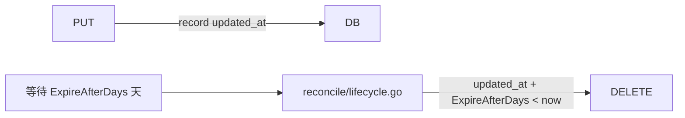

# 高价值扩展方向分析 v31 — 架构前沿：数据溯源、预测性生命周期与事件驱动计算

> **分析范围：** 全代码库深度扫描（`cmd/server/main.go`、`internal/*` 全部 46,659 行 `.go` 代码、`sdk/*` 三套客户端、`deploy/*`、`docs/*`、48 对迁移文件）
> **分析日期：** 2026-07-10
> **视角：** 资深架构师 / 产品经理 — 聚焦「前 30 期分析从未实质触及的 5 个架构前沿方向」
> **去重方法：** 逐篇对比 `docs/requirements/` 下 **30 期既有分析（v1–v30，累计约 19,000+ 行、~160+ 个方向）** + `docs/ROADMAP.md` + `docs/adr/DECISIONS.md` + `docs/CHANGELOG.md` + `docs/TODO.md` + `docs/analysis-*.md`（8 期），方向在既有文档中 **无实质性架构分析**。
> **原则：** 不编写任何实现代码。每个方向附带：现状 → 代码锚点 → 缺失能力 → 为什么需要 → 架构概要 → 边界情况。

---

## 审阅：前 30 期覆盖边界（去重矩阵）

前 30 期 expansion 文档覆盖了 **约 160+ 个方向**，核心领域分布与 v30 一致：

| 领域 | 已覆盖方向数 | 代表议题 |
|------|------------|---------|
| AI/RAG 管线（嵌入/搜索/Chat/Agent/Indexer/Rerank/PII/缓存/预算） | ~21 | 增量 BM25、向量漂移、搜索缓存、PII/Luhn、日费用预算、远程提取器、退化模式 |
| S3 兼容协议（子资源/ACL/Policy/CORS/通知/清单/LegalHold/COPY/Batch） | ~16 | 服务端拷贝、UploadPartCopy、通知过滤、Bucket Policy、批量操作 |
| 存储后端（Local/S3/OSS/COS/KMS/SSE/熔断器/分层/压缩/迁移/多存储类） | ~18 | 在线迁移、CAS 存储、SSE 轮换、透明压缩、存储类转换、熔断器 |
| 认证授权（JWT/API Key/SigV4/OIDC/SAML/SCIM/MFA/前缀级策略/Key 缓存） | ~15 | Key 缓存、跨副本失效、JWT issuer pinning、前缀级权限、读写分离、FIPS |
| 多租户（CRUD/配额/预算/审计/日费用/物理隔离/公平调度/FGA） | ~13 | 声明式配置协调、公平队列、租户级存储隔离、精细授权 |
| 事件/通知/Webhook（总线/传输/过滤/多通道/死信/背压/重试） | ~12 | 事件过滤、多通道分发、Payload 转换、背压可观测、Postgres 传输 |
| 复制/HA/集群（CRR/SRR/单例/Federation/多活/CQRS/故障转移） | ~13 | 跨区复制规则、多活、CQRS 模式、读取扩展、自动故障转移 |
| Reconcile/GC/Lifecycle（孤儿/保留/Scrub/转换/版本/Multipart/空闲） | ~13 | 分片上传统计、搁置分片 GC、版本修剪、批量操作框架、Scrub |
| 合规（WORM/Legal Hold/保留/访问日志/客户端加密/对象锁/数据驻留） | ~10 | 治理+合规模式、不可变存储、对象访问轨迹、数据驻留、IaC |
| 可观测性（OTel/Metrics/Grafana/Prometheus/SLO/Tracing/pprof/告警） | ~10 | 分布式追踪、pprof、Debug 平台、SLO/SLI 体系、AI 告警 |
| 工程质量（内存安全/流式/并发/压缩/错误模型/测试/性能） | ~10 | 大对象流式加密、SpillBuffer、响应压缩、请求合并 |
| Web UI / Admin Console | ~7 | 管理控制台、Admin UI 生产化、Feature Flags |
| SDK / CLI 完整性 | ~6 | SDK 开发者体验、导入/迁移工具、Admin 方法同步 |
| 基础设施（TLS/ACME/配置热重载/IP ACL/Feature Flag/Helm/MCP 纵深） | ~8 | 配置热重载、Helm chart、CDN 集成、IP ACL、MCP prompts/sampling |
| 其他（GitOps/插件/元数据 Schema/备份/DR/批量操作/事件生命周期/费率限制） | ~11 | 元数据 Schema 治理、统一备份框架、数据库迁移安全、事件数据生命周期 |

### 本期 5 个方向在前 30 期分析中均 **无实质性架构分析**（去重依据）

| # | 方向 | 确认方法 | 既有覆盖情况 |
|---|------|---------|------------|
| 1 | **Data Provenance / 对象全生命周期溯源** | `grep -rli "provenance" docs/` → 0 命中 | **完全未覆盖** — 现有 `lineage` 仅追踪 AI 使用记录，不追踪对象本身的创建/派生/修改链 |
| 2 | **Change Data Capture (CDC) & Event Streaming 到外部消息中间件** | `grep -rn "kafka\|pulsar\|kinesis\|rabbitmq\|nats\|pubsub\|amqp\|mqtt" docs/requirements/` → 仅 v5 表格中一行提及 "无 kafka/nats 配置"，零架构分析 | **仅表面提及，无实质分析** |
| 3 | **Serverless Object Triggers / 事件驱动计算（Lambda for Storage）** | `grep -rli "lambda.*trigger\|serverless.*trigger\|user.*defined.*[hH]ook\|compute.*hook\|trigger.*function\|custom.*handler" docs/` → 0 命中 | **完全未覆盖** |
| 4 | **Predictive / ML-Driven Storage Tiering（预测性生命周期）** | 既有 v13 覆盖了基于访问频率计数器的**规则式**自动分层，但 **ML 驱动**的预测性生命周期（利用现有 AI 管线预测访问模式）零实质分析 | **角度完全不同** — 规则式 vs ML 预测式 |
| 5 | **Multi-Model Query Engine（多模型查询引擎）** | `grep -rli "sql.*over\|sql.*query.*metadata\|sql.*search\|analytics.*query\|aggregation\|trino\|presto\|duckdb\|query.*engine\|federated.*query" docs/requirements/` → 0 命中；`grep -rli "graph.*query\|graph.*search\|knowledge.*graph.*query" docs/` → 0 命中 | **完全未覆盖** |

---

## 本期方向总览

| # | 方向 | 类型 | 优先级 | 代码锚点 | 核心痛点 |
|---|------|------|--------|---------|---------|
| 1 | **Data Provenance / 对象全生命周期溯源** | 合规/架构 | P1 — 受监管行业合规硬性要求 + AI 可解释性 | `repository/sql_objects.go` 的 Object 行无 parent/derived_from；`ai/search.go` 的 lineage 仅记录 AI 使用；无对象谱系图 | 无法回答：这个对象从哪来？谁改过？哪个 Agent 生成了它？它被用于哪些 AI 输出？ |
| 2 | **Change Data Capture (CDC) & Event Streaming 到外部消息中间件** | 平台/集成 | P1 — 企业实时数据集成的前提条件 | `events/bus.go` 只支持 in-process + Postgres LISTEN/NOTIFY，无标准消息协议输出 | 现有系统（Kafka/Pulsar）无法消费 aero-vault 的对象变更流，形成数据孤岛 |
| 3 | **Serverless Object Triggers / 事件驱动计算** | 架构/特性 | P1 — 差异化竞争力的核心能力 | `webhook` 仅通知一个固定 URL，`jobs.Pool` 执行预注册 handler，均不支持用户自定义计算 | 用户无法在对象创建/删除时自动执行自定义逻辑（转码、分析、同步），必须自建轮询循环 |
| 4 | **Predictive / ML-Driven Storage Tiering** | 成本/智能 | P2 — 大规模部署的 TCO 优化 | `reconcile/lifecycle.go` 基于 `ExpireAfterDays` 规则；`ai/indexer.go` 已有完整的 extract→chunk→embed 管线但未被用于访问模式预测 | 热/冷数据判定全靠人工预设天数，无法自适应变化；大量数据留在高成本存储层 |
| 5 | **Multi-Model Query Engine（多模型查询引擎）** | 架构/体验 | P2 — 数据湖/分析用例的价值释放 | 元数据存取走 `repository` SQL；搜索走 `ai.Search`（BM25/vector）；缺少统一的、跨模型的查询入口 | 用户无法用一条 SQL 查询同时检索 metadata + 语义 + 全文；数据洞察需要通过外部 ETL |

---

## 1. 🟠 Data Provenance / 对象全生命周期溯源

### 现状

当前系统对对象"从哪里来、经历了什么、被用在了哪里"的追踪能力极其有限：

| 追踪维度 | 现状 | 代码位置 |
|---------|------|---------|
| **AI 使用记录** | 有 `ai_usage` 表记录哪些对象被用在哪些 Chat/Search 请求中 | `repository/sql_chunks.go` → `RecordUsage`, `ListUsageForObject` |
| **事件记录** | `events` 表记录 `object.created` / `object.deleted` 等生命周期事件 | `repository/sql_events.go` → events 表 |
| **审计日志** | `audit_log` 表记录管理操作（创建租户、撤销密钥等） | `repository/audit.go` → audit_log 表 |
| **版本历史** | `Object.VersionID` 记录每次 Put 的新版本 | `repository/sql_objects.go` → objects 表 |
| **对象谱系/派生关系** | ❌ **完全缺失** | 无 `parent_id`、`derived_from`、`source_system`、`creation_provenance` 等字段 |
| **跨对象溯源** | ❌ **完全缺失** | 无 `provenance_graph` 表或边关系 |
| **Agent 生成对象溯源** | ❌ **完全缺失** | Agent 调用 `write_file` 写入对象，不记录这是 AI 生成的产物 |

具体问题：
- 一个文件可能是通过 S3 PUT、REST API、WebDAV upload、MCP `write_file` 或 Agent `write_file` 创建的——但创建后无法区分来源
- 一个文件可能是另一个文件的派生品（Agent 处理后的输出、缩略图、转码结果）——当前没有任何 `derived_from` 关系
- 一个 Agent 生成的报告引用了多个源文件——这些源文件与生成结果之间的引用关系没有建立
- 对于合规审计，"这个对象是谁在什么时间通过什么方式创建的"应该是一等公民信息

### 缺失能力矩阵

| 能力 | 当前 | 目标 |
|------|------|------|
| 创建来源追踪（protocol/method/user） | ❌ 无 source_type 字段 | ✅ `Object.Provenance.SourceType` = `rest:put` `s3:put` `webdav:put` `mcp:write` `agent:write` `replication` `restore` |
| 派生关系追踪（A 是 B 的派生品） | ❌ 无 | ✅ `ProvenanceEdge{ChildID, ParentID, RelationType, Timestamp}` |
| Agent 生成记录（哪个 Agent/LLM/模型） | ❌ 无 | ✅ `Object.Provenance.AgentID`, `Object.Provenance.Model`, `Object.Provenance.PromptTokens` |
| 内容溯源（哪些对象被用作 Agent/ Chat 的上下文） | ✅ 部分（ai_usage） | ✅ 扩展为双向：对象→AI 请求 and AI 请求→生成对象 |
| 谱系查询 API | ❌ 无 | ✅ `GET /v1/lineage/provenance/{id}?depth=3` 返回完整谱系图 |
| 谱系可视化 | ❌ 无 | ✅ Web UI 中以 DAG 图展示对象谱系 |
| 合规导出 | ❌ 无 | ✅ 单个对象的完整谱系导出为 JSON/CSV（供合规审查） |

### 为什么需要

**Data Provenance 是 AI 时代对象存储最被低估的基础设施能力。**

1. **AI 合规与负责任 AI：** 当一个 Agent 生成了一份合同、报告或代码，合规审查需要回答：它基于哪些源文件？当时的 LLM 是什么版本？prompt 是什么？没有 provenance，AI 输出就是"黑盒产物"。

2. **法规合规（欧盟 AI Act / SEC / FDA）：** 欧盟 AI Act 要求高风险 AI 系统的训练、验证和测试数据集必须有溯源信息。美国的 AI 行政令要求 AI 输出可追溯。这不是"加分项"，而是法规准入条件。

3. **审计与取证：** 当发现某份文档包含敏感信息时，调查需要回答：谁上传的？从哪个系统来的？它被复制到了哪里？被哪些 Agent 引用过？没有谱系，每次调查都是大海捞针。

4. **可重复性：** 科学计算、模型训练、数据分析——需要精确复现"这份报告是怎么生成的"。Provenance 提供了完整的实验记录。

5. **成本归因：** 当一个 Agent 调用产生了大量存储和 AI 费用，provenance 可以回答这是"哪个上游请求触发的"——精确到用户、部门和业务流程。

### 建议架构

Provenance 系统不改变现有数据模型的核心，而是**增量式的边表 + metadata 扩展**：

```
┌─ 现有模型（不改动）─────────────────────────────────────┐
│                                                          │
│  objects 表: id, tenant_id, bucket, key, version_id, ... │
│  ai_usage 表: id, object_ids, caller, query, ...         │
│  events 表: id, type, tenant_id, key, ...                │
│                                                          │
└──────────────────────────────────────────────────────────┘
                              ↓ 新增
┌─ Provenance 扩展 ───────────────────────────────────────┐
│                                                          │
│  provenance_records 表:                                   │
│    id, object_id, source_type, source_detail,             │
│    user_agent, remote_addr, created_at                    │
│                                                          │
│  provenance_edges 表:                                     │
│    id, parent_object_id, child_object_id,                  │
│    relation_type, metadata(JSON), created_at              │
│    relation_type ∈ {derived_from, referenced_by,          │
│                     generated_by, transformed_from,       │
│                     replicated_from, restored_from}       │
│                                                          │
│  provenance_api 端点:                                     │
│    GET /v1/provenance/{id}?depth=N                       │
│    GET /v1/provenance/{id}/graph ← DOT/JSON 格式谱系图    │
│                                                          │
└──────────────────────────────────────────────────────────┘
```

**插入点（每个创建派生关系的代码路径）：**

| 路径 | Provenance 记录内容 |
|------|-------------------|
| `service/file_crud.go:Put` 通过 REST PUT | source_type=`rest:put`, source_detail=`{method, content_type}` |
| `s3compat/handler.go:PutObject` | source_type=`s3:put`, source_detail=`{sig_version, bucket}` |
| `webdav/dav.go:PutFile` | source_type=`webdav:put`, source_detail=`{depth, overwrite}` |
| `mcp/server.go:toolWriteFile` | source_type=`mcp:write`, source_detail=`{tool, agent_name}` |
| `ai/agent.go:Run` | source_type=`agent:write`, source_detail=`{model, prompt_tokens, step}` |
| `replication/replication.go` | source_type=`replication`, source_detail=`{source_region, source_instance}` |
| `service/file_crud.go:Restore` | source_type=`restore`, source_detail=`{original_version_id}` |
| `thumbnail/thumbnail.go` | source_type=`thumbnail:gen`, source_detail=`{width, height}`, edge=derived_from |

### 边界情况

| 场景 | 当前行为 | 期望行为 | 处理方式 |
|------|---------|---------|---------|
| **批量操作** | BatchDelete/BatchTag 不记录任何 provenance | 每个被操作的对象生成一条 provenance 记录 | 批量操作的 provenance 共享一个 `batch_id` 可聚合 |
| **版本链** | 版本间无关系 | 新版本应有 provenance edge `supersedes` 指向旧版本 | Put 时自动创建 `supersedes` 边（如果已有活动版本） |
| **复制对象** | 复制体不记录来源 | 复制体的 provenance source_type=`replication` + edge `replicated_from` | Replication Worker 在写入目标后追加 provenance 记录 |
| **GC 删除 provenance** | 对象硬删除后 provenance 记录悬空 | provenance 记录独立于对象存在（即使对象已删除） | provenance_records 和 edges 不因对象删除而级联删除；reconcile job 可选择性清理 |
| **谱系爆炸** | 一个热门文件被 1000 个 Agent 引用 | 谱系图膨胀 | 支持 `?depth` 限制、`?since` 时间过滤、分页 |
| **旧对象欠账** | 现存对象在 provenance 系统上线前已存在 | 自动回填 provenance？ | 对象首次访问/修改时创建 provenance；不受限的历史不回填 |

---

## 2. 🟠 Change Data Capture (CDC) & Event Streaming 到外部消息中间件

### 现状

aero-vault 的事件总线（`internal/events/bus.go`）目前支持三种传输方式：

| 传输方式 | 代码位置 | 特点 | 限制 |
|---------|---------|------|------|
| **In-process Channel** | `events/bus.go` 默认 | 零依赖，同一进程内同步 | 无法跨进程/跨机器 |
| **Postgres LISTEN/NOTIFY** | `events/postgres_transport.go` | 跨 Postgres 连接的实例可共享事件 | 仅限 Postgres，无存储、无重放、1MB payload 上限 |
| **Webhook** | `events/webhook.go` | HTTP POST 到外部 URL | 单向通知，无事件持久化（失败写入 webhook_failures 表但无法被外部系统消费） |

**缺失：** 没有任何一种标准化的、面向外部消息中间件的输出适配器。

外部系统（Kafka、Pulsar、RabbitMQ、AWS Kinesis、Google Pub/Sub、Azure Event Hubs）需要将 aero-vault 的对象变更事件纳入自己的事件驱动架构——但目前只能通过 Webhook 桥接，缺乏可靠性、顺序性、分区语义和回溯消费能力。

### 缺失能力矩阵

| 能力 | 当前 | 目标 |
|------|------|------|
| Kafka 协议输出 | ❌ 无 | ✅ 可配置 `EVENTS_BROKER=kafka://broker:9092/aero-events` |
| Pulsar 协议输出 | ❌ 无 | ✅ 可配置 `EVENTS_BROKER=pulsar://pulsar:6650/aero-events` |
| AWS Kinesis 输出 | ❌ 无 | ✅ 可配置 `EVENTS_BROKER=kinesis://us-east-1/aero-stream` |
| GCP Pub/Sub 输出 | ❌ 无 | ✅ 可配置 `EVENTS_BROKER=gcppubsub://projects/p/topics/aero` |
| At-least-once 投递 | ✅ Webhook 有重试但无持久化 | ✅ 写入 broker = 持久化确认 |
| 事件分区键 | ❌ 无（所有事件落到同一 channel） | ✅ 按 tenant/bucket/object 分区保证顺序 |
| 回溯消费 | ❌ Webhook 不支持回溯 | ✅ Kafka consumer 可以从任意 offset 重新消费 |
| 事件过滤 | ✅ 有 `webhook_filter.go` 概念？实际无 | ✅ broker 输出端支持正则/前缀模式过滤 |
| Schema 注册 | ❌ 无 | ✅ 事件 payload 可注册到 Schema Registry (Avro/Protobuf) |

### 为什么需要

**企业级存储系统必须能融入已有的数据基础设施，而不是要求企业为它改变数据架构。**

1. **现有事件驱动架构集成：** 大型企业已经投资了 Kafka/Pulsar 作为事件主干。如果 aero-vault 不能将对象变更事件推送到 Kafka，它就是一个"数据孤岛"。每次对象变更都需要开发团队搭建自定义 bridge 服务。

2. **可靠性：** Webhook 的"fire and forget（最多有重试）"模式无法满足关键业务流程。Kafka/Pulsar 提供持久化、复制、确认机制——消息写入 broker 后才算"已投递"。

3. **消费灵活性：** Kafka 消费者可以独立的速率消费、可以回溯、可以重置 offset。Webhook 消费者必须能跟上推送速率，否则消息丢失。

4. **多消费者：** Kafka 的 consumer group 允许多个消费者共享 partition 消费。Webhook 只有一个目标 URL，无法水平扩展消费能力。

5. **数据集成生态：** Kafka Connect 生态有数百个 connector（Elasticsearch、HBase、S3、JDBC）。aero-vault 的 CDC 输出一旦通过 Kafka 发布，就自动获得了整个 Kafka Connect 生态的连接能力。

### 建议架构

不建议直接在 aero-vault 代码中嵌入 Kafka/Pulsar 客户端（会增加依赖、版本管理和安全审计的复杂度）。推荐**两种路径**：

**路径 A（推荐——解耦架构）：Kafka Connect Sink Connector**

```
aero-vault                      Kafka                    下游消费
┌──────────┐    SSE / Webhook    ┌──────┐   Kafka Connect   ┌──────────┐
│ EventBus │ ──────────────────▶ │ Kafka│ ◀──────────────▶ │ Database │
│          │    (事件 → SSE)     │      │   (CDC Sink)     │ Search   │
│          │                     │      │                   │ Analytics│
└──────────┘                     └──────┘                   └──────────┘
                                    ↑
                         Kafka Connect  connector
                         (独立部署, 监听 /v1/events/stream)
```

- 独立项目 `aerovault-kafka-connect` 实现 Kafka Connect Source Connector
- Connector 从 aero-vault 的 SSE endpoint（`/v1/events/stream`）消费事件流
- 将事件转换为 Kafka 消息（Avro/JSON schema）
- 支持 exactly-once 语义（通过 Kafka Connect 的 offset 管理）
- **不修改 aero-vault 核心代码**

**路径 B（原生集成——适用于轻量部署）：直接写入配置**

```
EVENTS_BROKER="kafka://broker:9092/aero-events?partition_by=tenant&compression=gzip"
```

- 新增 `internal/events/broker/` 包，定义统一接口
- Kafka / Pulsar / Kinesis 适配器实现该接口
- 编译时条件 `//go:build kafka` 控制依赖集成
- **优点：** 零额外部署组件；**缺点：** 引入重型客户端依赖

**推荐路径 A**（Kafka Connect 独立部署）的理由：
1. 零第三方客户端依赖在 aero-vault 核心中
2. Kafka Connect 框架处理 offset 管理、故障恢复、重平衡
3. 同一个 connector 可以用于 Kafka、Pulsar (via Kafka-on-Pulsar)、Kinesis (via custom connector)
4. 运维职责分离：Kafka 团队管理 connector，存储团队管理 aero-vault

### 边界情况

| 场景 | 当前行为 | 期望行为 | 处理方式 |
|------|---------|---------|---------|
| **事件顺序保障** | 同一对象的事件按时间顺序写入 events 表 | 同一 partition key 的消息按顺序投递 | Kafka Connect 以 `object_key` 为 partition key |
| **事件过滤** | 不消费全部事件 | 只消费 `object.created` 事件 | Connector 配置 `EVENT_FILTER=object.created,object.updated` |
| **大规模事件爆发** | 内部 buffer 可能溢出 | 背压传播到 broker | Kafka 的 backpressure 由 broker 处理；缓冲区满则阻塞事件发布 |
| **Exactly-once 投递** | Webhook 可能重复投递 | CDC 消息应 exactly-once | Kafka Connect 的 exactly-once 支持 + 下游幂等消费 |
| **Schema 演化** | 事件消息格式变化后消费者崩溃 | Schema Registry 处理兼容性 | 发布 Avro schema + 向后兼容策略 |
| **无 Kafka 环境** | 不支持 | 降级到 SSE/Webhook | CDC broker 完全可选；未配置时不影响现有行为 |

---

## 3. 🔴 Serverless Object Triggers / 事件驱动计算（Lambda for Storage）

### 现状

当前对象变更事件的处理方式：

| 消费者 | 处理逻辑 | 用户可自定义？ |
|--------|---------|--------------|
| Indexer | extract→chunk→embed | ❌ 硬编码管线 |
| Antivirus Worker | scan→quarantine | ❌ 硬编码 |
| Replication Worker | 复制到目标后端 | ❌ 硬编码 |
| Webhook | POST 到预配置 URL | ✅ 用户定义 URL，但不能执行逻辑 |
| SSE Stream | 浏览器/客户端实时消费 | ✅ 但消费端需要自己处理 |

**核心缺失：** 没有一种机制让用户**在 aero-vault 平台内**定义和执行自定义的计算逻辑——即"对象创建后，自动运行我的代码"的模型。

对比 AWS S3 + Lambda：S3 事件触发 Lambda 函数执行任意代码（转码、分析、数据增强、通知等），这是 S3 生态最强大的扩展能力之一。aero-vault 的 webhook 只解决了通知问题（"有事情发生了"），但没有解决计算问题（"帮我处理它"）。

### 缺失能力矩阵

| 能力 | AWS S3 + Lambda | aero-vault 当前 |
|------|----------------|-----------------|
| 对象创建触发自定义函数 | ✅ | ❌ 仅有 Webhook 通知 |
| 对象删除触发自定义函数 | ✅ | ❌ |
| 生命周期转换触发 | ✅ | ❌ |
| 函数失败重试 | ✅（Lambda 异步调用 2次） | ❌ |
| 函数输出写回存储 | ✅（Lambda 写回 S3） | ❌ |
| 函数执行超时控制 | ✅（15分钟上限） | ❌ |
| 函数资源隔离 | ✅（Lambda 沙箱） | ❌ |
| 函数日志/监控 | ✅（CloudWatch） | ❌ |
| 多函数组合（Fan-out） | ✅（SNS + SQS + Lambda） | ❌ |

### 为什么需要

**Serverless Object Triggers 是"存储平台"和"计算平台"的分界线。**

1. **用户需求的自然延伸：** 用户说"我希望上传图片后自动生成缩略图"——当前方案：用户自建 cron job 轮询或在上传后手动调缩略图 API。触发方案：用户 deploy 一个 `thumbnail.py` 函数，绑定 `object.created` 事件，自动执行。

2. **现有基础设施的复用：** aero-vault 已具备完整的作业队列（`jobs.Pool`）、事件总线（`events.Bus`）、持久化存储、OTel 可观测。触发计算模型只差最后一层——**用户代码注册机制**。

3. **平台锁定的解药：** 如果用户说"我为什么不用 MinIO + Kafka + Knative？"，答案是"因为你在 aero-vault 里 3 行配置就搞定，不需要搭一套 Eventing 平台"。

4. **与现有 Webhook 互补：** Webhook 通知外部系统"有变化了，你来处理"。Trigger 是"你来，我在我这处理"。两者互补而非替代。

5. **差异化竞争力：** 当前没有自建对象存储平台（MinIO、Ceph、SeaweedFS）提供内置的 serverless compute。这可以是 aero-vault 超越"又一个 S3 兼容存储"的核心卖点。

### 建议架构

```
┌─ 用户交互 ──────────────────────────────────────────────────┐
│                                                              │
│  POST /v1/admin/triggers  JSON:                               │
│  {                                                           │
│    "id": "resize-image",                                      │
│    "event": "object.created",                                 │
│    "filter": "content_type=image/* AND bucket=thumbnails",    │
│    "runtime": "docker://ghcr.io/user/resizer:latest",         │
│    "timeout": 60,                                             │
│    "env": {"QUALITY": "85"},                                  │
│    "retry": 3                                                 │
│  }                                                            │
│                                                              │
└──────────────────────────────────────────────────────────────┘
                              ↓ triggers 表持久化
┌─ Trigger Engine ────────────────────────────────────────────┐
│                                                              │
│  events.Bus.Subscribe()                                       │
│       → filter triggers by event type + condition             │
│       → enqueue trigger execution job                         │
│       → jobs.Pool runs:                                       │
│          1. 解析 trigger 配置                                  │
│          2. 拉取对象内容（如果需要）                            │
│          3. 执行 runtime（Docker/gRPC/Unix socket）            │
│          4. 捕获 stdout/stderr → trigger_results 表           │
│          5. 失败重试（最多 N 次）                              │
│          6. 结果事件（trigger.completed / trigger.failed）     │
│                                                              │
└──────────────────────────────────────────────────────────────┘
┌─ Runtime 执行器 ────────────────────────────────────────────┐
│                                                              │
│  type TriggerRuntime interface {                              │
│      Exec(ctx, trigger, event) (result, error)                │
│  }                                                            │
│                                                              │
│  runtimes:                                                     │
│  • gRPC (外部服务) — 最快、最安全                             │
│  • Docker (临时容器) — 最灵活、沙箱隔离                       │
│  • Webhook (HTTP POST) — 兼容现有 webhook 用户               │
│  • Built-in (Go plugin) — 高性能、零额外开销                  │
│                                                              │
└──────────────────────────────────────────────────────────────┘
```

**关键设计权衡：**

| 决策 | 选项 | 推荐 | 理由 |
|------|------|------|------|
| 执行隔离 | 进程内 (Go plugin) vs 进程外 (Docker/gRPC) | **进程外** | 用户代码崩溃不影响存储系统；资源隔离；语言无关 |
| 镜像来源 | Registry vs 内建 | **用户提供 OCI 镜像或 gRPC endpoint** | 最大灵活性；不限制语言/runtime |
| 执行超时 | 固定 vs 可配 | **可配，默认 60s，上限 900s** | 长任务（视频转码）需要更长超时 |
| 失败语义 | at-least-once vs at-most-once | **at-least-once + dedup key** | 利用现有 job queue 的 dedup 机制 |
| 输入传递 | 通过参数 vs 通过存储 | **存储为主 + 轻量参数** | 避免 HTTP request 大小限制；大对象通过 storage key 引用 |
| 调度公平性 | per-trigger 独立队列 vs 共享队列 | **per-trigger FIFO + 共享 worker pool** | 一个慢 trigger 不阻塞其他 trigger |

### 边界情况

| 场景 | 当前行为 | 期望行为 | 处理方式 |
|------|---------|---------|---------|
| **触发函数产生无限事件循环** | 函数写回对象 → 创建新事件 → 再次触发 | 每条事件有 `_trigger_id` 元数据，函数写入的对象如果匹配同一 trigger 则跳过 | 已处理的事件 dedup key 存储于 `trigger_dedup` 表（TTL 1h） |
| **函数执行时间过长** | worker 无限等待 | 超时后 kill + 标记 failed | 每个 trigger 可配置 `timeout`；worker 使用 context.WithTimeout |
| **Docker 环境不可用** | 无 Docker 时所有容器 runtime 失败 | 回退到 gRPC runtime 或报错 | 注册 trigger 时验证 runtime 可用性 |
| **触发函数资源耗尽** | 同时运行 100 个容器 | 受 worker pool size + 全局并发限制 | 复用现有 `PerTenantConcurrencyLimiter` |
| **触发函数日志** | 用户无法查看函数输出 | 函数的 stdout/stderr 写入 `trigger_results` 表 | 限制单次结果大小（前 4KB），可通过 `/v1/admin/triggers/{id}/logs` 查看 |
| **版本兼容性** | trigger 配置格式升级 | 旧 trigger 继续工作 | Versioned trigger spec（当前 v1） |

---

## 4. 🟡 Predictive / ML-Driven Storage Tiering（预测性生命周期）

### 现状

当前生命周期管理（`internal/reconcile/lifecycle.go`）的工作方式：

```go
// BucketConfig 中：
ExpireAfterDays int    // 对象创建/更新后 N 天过期
ExpireAction     string // "soft_delete" | "hard_delete"
```

这是**完全基于规则的**（rule-based）：管理员预设一个天数阈值，超过阈值的对象被自动清理/转换。



**问题：** 这个模型假设所有对象的价值衰减速率相同——显然不现实。一份合同可能在 30 天后仍然被高频访问，而一份日志文件可能在 24 小时内就再也不会被读取。统一的天数阈值在两个方向上都是次优的：过早删除导致恢复成本，过晚保留浪费存储成本。

**已存在的 rule-based auto-tiering 讨论（v13）** 扩展了规则引擎（按桶/前缀/标签设置分层规则），但仍然基于**人工预设的规则**——管理员说"PDF 文件 30 天后转冷"。这不智能，不自适应。

### 当前可用的"智能化素材"

aero-vault 的 AI 管线已经收集了大量可用于预测访问模式的数据：

| 数据源 | 获取方式 | 可预测的信号 |
|--------|---------|------------|
| Object 元数据 | `repository/sql_objects.go` | 创建时间、大小、类型、标签 |
| 访问日志 | `middleware/middleware.go:AccessLog` | GET/HEAD 频率、租户、路径 |
| 搜索命中 | `ai/search.go`, `ai_usage` 表 | 哪些对象被检索、哪些 chunk 被命中 |
| AI 使用记录 | `repository/sql_chunks.go:RecordUsage` | 对象被 AI 引用的频率和上下文 |
| 事件流 | `events/bus.go` | 对象的变更频率、复制状态 |
| 对象内容特征 | `ai/extractor.go`, `ai/chunker.go` | 内容类型、主题、实体（通过 embedding 聚类） |

这些数据目前只用于搜索质量改进，**完全没有被用于存储成本优化**。

### 缺失能力矩阵

| 能力 | 当前（rule-based） | 目标（ML-driven） |
|------|-------------------|-------------------|
| 访问频率预测 | ❌ 无 | ✅ 基于历史访问模式预测未来 N 天的访问概率 |
| 内容价值评分 | ❌ 无 | ✅ AI 评估内容的业务价值（被搜索频率、被引用频率、文档类型权重） |
| 自适应分层 | ❌ 固定天数 | ✅ 自动在 STANDARD ↔ STANDARD_IA ↔ GLACIER 间移动 |
| 分层策略个性化 | 所有对象同一规则 | ✅ 每个桶/前缀/标签可启用 ML 模式 |
| 预测回撤 | ❌ 无 | ✅ 当预测某对象即将被访问时，提前将其从冷存储回温 |
| 冷却期 | ❌ 无 | ✅ 对象移入冷存储后最短停留时间（防抖动） |
| 成本/收益仪表板 | ❌ 无 | ✅ 显示"ML 推荐 vs 当前状态"的成本对比 |
| Explainability | ❌ 无 | ✅ 为什么这个对象被降冷？因为预测未来 30 天访问概率 < 5% |

### 为什么需要

**在大规模部署中，存储分层决策从"人工预设"转向"AI 预测"是成本优化的最后一块拼图。**

1. **存储成本是 SaaS 最大支出之一：** 在 multi-PB 规模下，将 20% 的冷数据降到便宜存储层可以节省 40-60% 的存储成本。但误判（把热数据降冷）会导致性能回归和 retrieval 成本飙升。

2. **AI 管线已经就绪：** aero-vault 的 embedding 管线已经能够理解文档内容；搜索管线已经知道哪些文档被频繁检索。将这两者结合起来预测访问模式，是"用已有的 AI 能力解决存储问题"的典型范例。

3. **与现有 lifecycle 互补而非替代：** Rule-based 用于「确定性策略」（合规保留 7 年，不能更短），ML-driven 用于「优化策略」（这个文件大概率不再需要，建议降冷）。两者共存。

4. **差异化竞争力：** 没有对象存储系统提供 AI 原生的预测性生命周期。AWS S3 Intelligent-Tiering 的监控周期是 30 天（被动观测→决策），aero-vault 可以用 AI 管线主动预测。

### 建议架构

```
┌─ Access Pattern Data Pipeline ───────────────────────────────┐
│                                                               │
│  access_log  (中继) → access_patterns 表 (聚合)                │
│  ai_usage    (中继) → content_value 表 (评分)                  │
│  embedding   (已有) → content_clusters (相似对象分组)           │
│                                                               │
└──────────────────────────────────────────────────────────────┘
                              ↓ (后台 ML 引擎)
┌─ Tier Predictor ─────────────────────────────────────────────┐
│                                                               │
│  type TierPredictor struct {                                   │
│      // 输入: 对象特征向量                                     │
│      predict(ctx, object, accessPatterns, contentValue) Tier    │
│  }                                                             │
│                                                               │
│  实现策略:                                                     │
│  1. 启发式加权（启动版本，零外部依赖）                           │
│     - last_access_days, access_freq_30d,                       │
│       search_hit_count, ai_reference_count,                    │
│       object_size, content_cluster                            │
│     - 权重：可调，基于规则→ML 渐进迁移                           │
│                                                               │
│  2. LightGBM / XGBoost（ML 版本）                              │
│     - 训练特征：同上 + day_of_week, object_age,                │
│       file_extension, content_type_encoded                    │
│     - 标签：对象在 T+30 天是否被访问                            │
│     - 模型导出为 ONNX / Go-native 推理                         │
│                                                               │
└──────────────────────────────────────────────────────────────┘
                              ↓
┌─ Tier Executor ─────────────────────────────────────────────┐
│                                                               │
│  reconcile/lifecycle.go 扩展：                                  │
│  - 对于 ML-tiering 启用的桶，不再使用 ExpireAfterDays         │
│  - 改为调用 TierPredictor.Predict()                           │
│  - 返回 STANDARD → 不动                                       │
│  - 返回 STANDARD_IA → 移入低频存储（对象仍在线）               │
│  - 返回 GLACIER → 移入归档存储（需恢复才能访问）               │
│  - 返回 DELETE → 软删除（已无价值）                            │
│                                                               │
└──────────────────────────────────────────────────────────────┘
```

**渐进式实施路径：**

| 阶段 | 能力 | 复杂度 | 价值 |
|------|------|--------|------|
| P0 | 访问模式数据采集（access_log → patterns 表） | 低 | 基础 |
| P1 | 启发式权重预测器（可调参数，无外部 ML 依赖） | 低 | 中 |
| P2 | ML 模型训练管线（离线，Python notebook） | 中 | 高 |
| P3 | ML 模型在 Go 中推理（ONNX runtime / Go-native） | 高 | 最高 |
| P4 | 回温预测（pre-warming cold objects before anticipated access） | 高 | 最高 |

### 边界情况

| 场景 | 当前行为 | 期望行为 | 处理方式 |
|------|---------|---------|---------|
| **预测不准确导致性能回归** | 一个被误判为冷的数据被降冷，用户访问时延迟高 | ML 模式报告 confidence；confident < 0.7 时不执行 | 可配置 `MIN_CONFIDENCE_THRESHOLD` |
| **模型冷启动** | 新上线时无历史数据，预测不准 | 先用 rule-based 兜底，数据积累 30 天后逐步切到 ML | 桶级 `TIER_MODE=rule|ml|hybrid` 切换 |
| **访问模式季节性变化** | 合同文件每个月底被审计访问 | ML 模型学会月度周期性模式 | 周期性特征（day_of_month, day_of_week）作为输入 |
| **手动覆盖 ML 决策** | 运维认为某个文件不该降冷 | 提供 `x-aero-pin-tier: STANDARD` metadata | Metadata 覆盖 ML 决策 |
| **存储类转换成本** | 频繁转换（flip-flop）导致额外费用 | 最短冷却期锁 | `min_stable_days=7`：对象转换后 7 天内不再次转换 |
| **与合规保留冲突** | 合规要求保留 7 年，但 ML 预测该对象"可删除" | 合规策略优先于 ML 决策 | 检查 `locked_until`；检查桶的 compliance 模式 |

---

## 5. 🟡 Multi-Model Query Engine（多模型查询引擎）

### 现状

aero-vault 的数据查询能力分布在三个独立的"孤岛"中：

| 查询类型 | 实现 | 接口 | 用途 |
|---------|------|------|------|
| **元数据查询** | `repository/sql_objects.go` → SQL (SELECT) | REST `/v1/files?prefix=&marker=&limit=` | 列出文件、按前缀过滤、分页 |
| **语义搜索** | `ai/search.go` → embed + vector search + RRF | REST `/v1/search` | 自然语言搜索 |
| **BM25 全文搜索** | `ai/bm25.go` → in-memory inverted index | REST `/v1/search?mode=bm25` | 关键词搜索 |
| **混合搜索** | `ai/search.go` → vector + BM25 + RRF | REST `/v1/search?mode=hybrid` | 组合搜索 |
| **血缘查询** | `repository/sql_chunks.go` → ai_usage 表 | REST `/v1/lineage/objects/{id}` | 查看对象被哪些 AI 请求引用 |
| **SQL 查询** | ❌ **完全缺失** | ❌ | ❌ |

**核心缺失：** 用户无法用**单一的查询语言**同时检索**元数据 + 语义 + 全文**。想回答"给我找到上周上传的、内容关于机器学习的、被管理员标记为 'important' 的 PDF 文件"——这需要跨三种查询类型做联合过滤，目前只能应用层手动拼接。

### 缺失能力矩阵

| 查询模式 | 当前 | 目标 |
|---------|------|------|
| SQL 查询元数据 | ❌ | ✅ `SELECT * FROM objects WHERE tenant='acme' AND size > 1MB AND tags->>'department' = 'engineering'` |
| SQL + 语义混合 | ❌ | ✅ `SELECT * FROM semantic_search('machine learning') WHERE created_at > '2026-06-01' AND storage_class = 'STANDARD' ORDER BY score DESC` |
| SQL + 全文混合 | ❌ | ✅ `SELECT * FROM bm25_search('neural network') WHERE bucket = 'docs' LIMIT 20` |
| 聚合/分析查询 | ❌ | ✅ `SELECT bucket, count(*), sum(size) FROM objects GROUP BY bucket` |
| Graph 关系查询 | ❌ | ✅ `MATCH (o:object)-[:derived_from]->(p:object) WHERE o.key = 'report.pdf' RETURN p.key` |
| 跨模型 JOIN | ❌ | ✅ `SELECT o.key, u.query FROM objects o JOIN ai_usage u ON o.id = ANY(u.object_ids) WHERE o.tenant = 'acme'` |
| 查询导出 | ❌ | ✅ 查询结果导出为 CSV/JSON/Parquet |

### 为什么需要

**多模型查询引擎将 aero-vault 从"文件存储"升级为"数据平台"。**

1. **数据湖场景：** 用户当前如果想对对象元数据做分析（"哪些 Bucket 的存储增长最快？"），需要外部 ETL 把 objects 表导出到数据仓库。内建 SQL 引擎可以在 30 秒内完成同样的分析，零导出。

2. **关联分析：** 当用户问"被 AI 引用最多的文件是哪些？"——这是一个 JOIN objects + ai_usage 的查询。目前无法直接回答，必须通过编程组合两个 API。

3. **降低认知负载：** 用户不需要学习三套 API（列出文件、搜索、血缘）。一条 SQL 可以完成上述所有工作。

4. **与 BI 工具集成：** SQL 是 Tableau、Grafana、Jupyter、Metabase 的通用语言。SQL 接口意味着这些工具可以直接连接 aero-vault。

5. **差异化：** MinIO 没有 SQL 查询能力。Ceph 没有。AWS S3 有 S3 Select（仅 CSV/JSON 过滤，非常有限）。一个真正的多模型查询引擎是存储市场的蓝海。

### 建议架构

**推荐方案：嵌入式 SQLite 风格的 SQL 引擎 + 虚拟表适配器**

不引入外部查询引擎（如 Trino 或 Spark），而是使用嵌入式 SQL 引擎（如 [go-sqlite3](https://github.com/mattn/go-sqlite3) 的虚拟表机制，或纯 Go SQL 解析器 + 执行器）来**复用已有的 Go 数据结构**。

```
┌─ SQL Frontend ───────────────────────────────────────────────┐
│                                                               │
│  POST /v1/query  JSON:                                        │
│  {"sql": "SELECT key, size, ..."}                              │
│                                                               │
│  解析 → AST → 优化器 → 执行计划                                 │
│                                                               │
└──────────────────────────────────────────────────────────────┘
                              ↓
┌─ Virtual Table Adapters ─────────────────────────────────────┐
│                                                               │
│  type VirtualTable interface {                                 │
│      Schema() TableSchema                                      │
│      Scan(ctx, filter, limit) (RowIterator, error)             │
│  }                                                             │
│                                                               │
│  vtab_objects    — wraps repository.Object queries             │
│  vtab_ai_usage   — wraps ai_usage table                        │
│  vtab_events     — wraps events table                          │
│  vtab_search     — wraps ai.Search (semantic)                  │
│  vtab_bm25       — wraps ai.BM25 (keyword)                     │
│  vtab_tags       — wraps tags metadata                         │
│  vtab_audit      — wraps audit_log                             │
│  vtab_versions   — wraps object versions                       │
│                                                               │
└──────────────────────────────────────────────────────────────┘
```

**关键查询示例：**

```sql
-- 1. 纯元数据查询
SELECT key, size, storage_class, created_at
FROM objects
WHERE tenant = 'acme' AND bucket = 'docs' AND size > 1_000_000
ORDER BY size DESC
LIMIT 20

-- 2. 语义+元数据混合
SELECT o.key, o.size, s.score, s.chunk
FROM semantic_search('machine learning transformer architecture') s
JOIN objects o ON o.id = s.object_id
WHERE o.storage_class != 'GLACIER'
ORDER BY s.score DESC
LIMIT 10

-- 3. 聚合分析
SELECT bucket, count(*) AS object_count, sum(size) AS total_bytes
FROM objects
WHERE tenant = 'acme' AND created_at > date('now', '-30 days')
GROUP BY bucket
ORDER BY total_bytes DESC

-- 4. 血缘分析
SELECT u.caller, u.query, u.created_at, u.total_tokens
FROM objects o
JOIN ai_usage u ON o.id = ANY(u.object_ids)
WHERE o.key = 'quarterly-report.pdf'
ORDER BY u.created_at DESC

-- 5. 全文+标签组合
SELECT o.key, o.size
FROM bm25_search('GDPR compliance') b
JOIN objects o ON o.id = b.object_id
WHERE o.tags->>'department' = 'legal'
```

**不推荐 Trino/Presto/Spark 集成的理由：**

| 方案 | 优点 | 缺点 |
|------|------|------|
| 嵌入式 SQL 引擎 | 零外部依赖；亚毫秒级延迟 | 表达能力有限；不适合 PB 级 scan |
| Trino Connector | 强大的 SQL 能力；分布式 JOIN | 100+ MB JVM 依赖；运维复杂；毫秒→秒级延迟 |
| Go 嵌入式引擎 | 编译到同一二进制；低成本 | 需自己实现 SQL 解析和执行 |

**推荐：** P0 实现嵌入式 SQL 引擎（基于 [expr](https://github.com/expr-lang/expr) 或 [go-sal](https://github.com/stephenafamo/sql) 等纯 Go SQL 解析器），只支持 SELECT + 虚拟表。P1 可选 Trino/Kyuubi 连接器。

### 边界情况

| 场景 | 当前行为 | 期望行为 | 处理方式 |
|------|---------|---------|---------|
| **SELECT *** | 大数据集可能导致 OOM | 默认 LIMIT 1000 + 游标分页 | 每个查询自动加 LIMIT；用户可通过 `LIMIT N` 覆盖（上限 10000） |
| **全表扫描** | 用户查询没有 WHERE 条件 | 全表扫描被拒绝（或返回警告） | 无 WHERE 且非 aggregate 查询返回 400 "filter required" |
| **语义搜索虚拟表无法 JOIN** | 无法将语义搜索结果与 objects 表关联 | 虚拟表适配器返回 `object_id` 作为关联键 | `semantic_search()` 虚拟表包含 `object_id, score, chunk, chunk_id` 列 |
| **查询超时** | 复杂 JOIN 耗时过长 | 超时后可取消 | 使用 `context.WithTimeout`（默认 30s，可通过 `?timeout=` 参数配置） |
| **SQL 注入** | 用户提供 SQL 语句可能包含恶意输入 | 查询解析器只接受 SELECT，拒绝 DDL/DML | 白名单模式：仅 SELECT + EXPLAIN；所有表名/列名通过 ast 验证 |
| **权限** | 用户查询可能跨租户访问数据 | 查询引擎自动注入 `WHERE tenant = current_tenant` | 在 SQL 解析后，AST 变换自动添加 tenant 过滤 |
| **并发查询** | 100 个并行分析查询 | 复用现有的 MaxInFlight + PerTenantConcurrencyLimiter | 查询请求占用 weighted semaphore slot（与对象操作统一限流） |

---

## 总结：本期 5 个方向的共同特征

1. **从"存储"到"智能数据平台"的跃升** — Data Provenance、Multi-Model Query Engine、Predictive Tiering 这三个方向共同标志着 aero-vault 从一个"存东西的地方"进化为一个"理解数据的平台"。

2. **现有 AI 管线的复用与扩展** — Predictive Tiering 复用现有的 embedding + search pipeline；Data Provenance 复用事件系统；Serverless Triggers 复用作业队列——都不需要从头搭建基础设施。

3. **企业生态集成** — CDC to Kafka 解决数据孤岛问题；Multi-Model Query 解决 BI 工具集成问题——这两个方向解决的是"aero-vault 如何融入企业现有的技术和组织架构"。

4. **差异化竞争壁垒** — 没有自建对象存储系统提供 Serverless Object Triggers、Predictive ML-Driven Tiering 或嵌入式 Multi-Model Query Engine。这些方向可以让 aero-vault 从"又一个 S3 兼容存储"变成"下一代智能存储平台"。

5. **风险可控的渐进式实施** — 每个方向都设计了 P0→P1→P2 的渐进式路径，P0 阶段可以在不引入新外部依赖的前提下交付价值。例如：Predictive Tiering 从启发式权重开始，Multi-Model Query 从有限的 SQL 子集开始。
