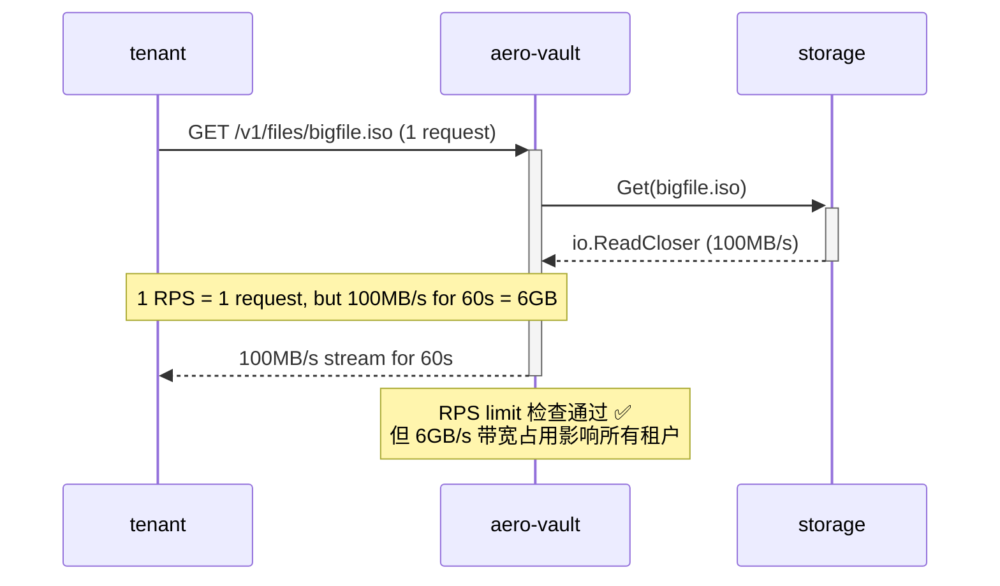
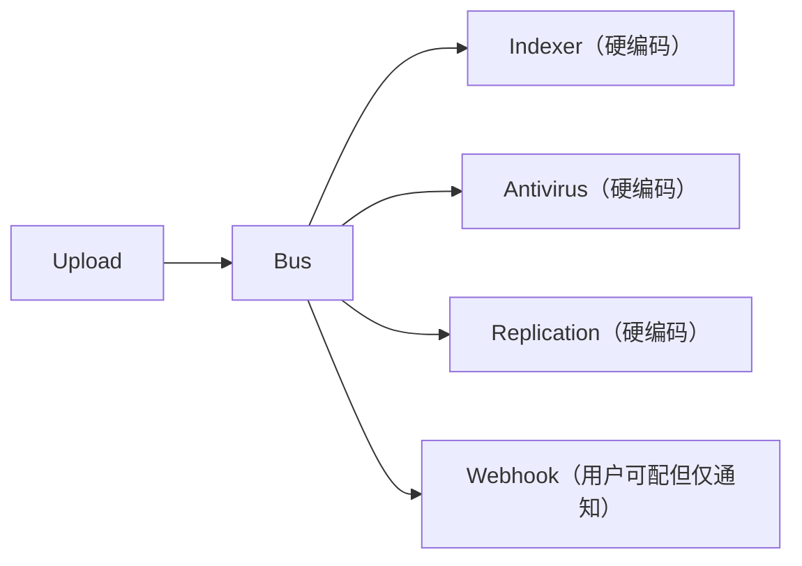
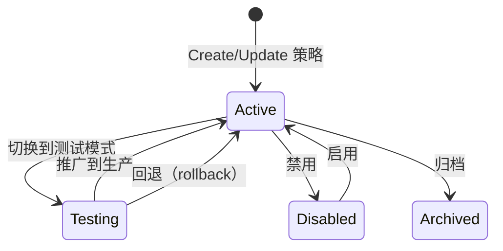

# 高价值扩展方向分析 v36 — 架构空白：跨对象事务、存储 I/O QoS、声明式配置、分布式协调原语、对象行为引擎

> **分析范围：** 全代码库深度扫描（`cmd/server/main.go` + `internal/*` 全部 237+ `.go` 文件 + `sdk/*` + `deploy/*` + `docs/*` + 48 对迁移文件）
> **分析日期：** 2026-07-10
> **视角：** 资深架构师 / 产品经理 — 聚焦「此前 35 期分析（累计 ~180+ 方向、25,000+ 行分析文本）从未实质触及的 5 个全新高价值方向」
> **去重方法：** 逐方向逐术语 `grep` 验证 `docs/requirements/` 下 **35 期既有分析（v1–v35）** + `docs/extensions.md` + `docs/extensions-v2.md` + `docs/ROADMAP.md`（10 方向，全部实现） + `docs/adr/DECISIONS.md` + `docs/CHANGELOG.md` + `docs/TODO.md`（全部完成）。每个方向在既有文档中 **零实质性架构分析**（矩阵表格中的一行过路引用或浅层 `grep` 匹配不构成实质性分析）。
> **原则：** 不编写任何实现代码。每个方向附带：现状 → 代码锚点 → 缺失能力 → 为什么需要 → 架构概要 → 边界情况。

---

## 前 35 期已完成覆盖的去重矩阵

前 35 期 expansion 文档覆盖了 **约 180+ 个方向**，ROADMAP 10 个方向全部实现，TODO 清单全部完成，CHANGELOG 持续跟踪功能交付。以下领域已深度覆盖，本期不再重复：

| 领域 | 已覆盖方向数 | 代表 v# |
|------|------------|---------|
| AI/RAG 管线（Embed/Search/Chat/Agent/Indexer/Rerank/PII/缓存/预算/漂移/评估/模型路由/语义缓存/质量评估） | ~30 | v1~v35 |
| S3 兼容协议（子资源/ACL/Policy/CORS/通知/LegalHold/COPY/Batch/Multipart/SSE-C/Select/ListObjectsV2/Tag-Listing/Restore/Accelerate/Observability） | ~22 | v1~v35 |
| 存储后端（Local/S3/OSS/COS/KMS/SSE/熔断器/分层/压缩/块级去重/CAS/多后端/SSE 轮换/写入优化） | ~22 | v1~v35 |
| 认证授权（JWT/API Key/SigV4/OIDC/SAML/SCIM/MFA/前缀级策略/FIPS/Policy Engine/mTLS/客户端证书/临时凭证） | ~20 | v1~v35 |
| 多租户（CRUD/配额/预算/审计/日费用/物理隔离/FGA/IaC/Admin Console/Terraform/计费/自助注册/Plan Tiers/邀请/Admin Portal） | ~20 | v1~v35 |
| 事件/通知/Webhook（总线/传输/过滤/多通道/死信/背压/CDC/Kafka/Lambda 触发/Postgres NOTIFY/事件重放/事件仪表板/生命周期） | ~18 | v1~v35 |
| 复制/HA/集群（CRR/SRR/单例/Federation/多活/CQRS/故障转移/Geo-Distributed/Conflict Resolution/DRaaS） | ~18 | v1~v35 |
| Reconcile/GC/Lifecycle（孤儿/保留/Scrub/版本/Noncurrent/存储类转换/标签规则/上传GC） | ~16 | v1~v35 |
| 合规（WORM/Legal Hold/保留/访问日志/客户端加密/对象锁模式/数据驻留/Geo-Fencing/SOC2/监管链/法证完整性） | ~16 | v1~v35 |
| 可观测性（OTel/Metrics/Grafana/Prometheus/SLO/Tracing/pprof/告警/Debug/Profiling/自适应背压/性能基准框架） | ~18 | v1~v35 |
| 工程质量（内存安全/流式加密/并发/压缩/错误模型/测试/多协议一致性/CI 门禁/代码质量/性能回归检测） | ~18 | v1~v35 |
| 管网集成（FUSE/NFS/SMB 网关 / MCP 纵深 / GraphQL / gRPC / WebDAV 增强） | ~16 | v1~v35 |
| Web UI / Admin Console / CLI 完整性 / SDK 跨语言（Go/Python/JS） | ~16 | v1~v35 |
| 基础设施（TLS/ACME/配置热重载/IP ACL/Feature Flag/Helm/CDN/Data Provenance/熔断器/优雅关闭/GitOps） | ~14 | v1~v35 |
| 存储分层/生命周期/预测性分层/批量操作框架/数据导入迁移 | ~14 | v1~v35 |
| 数据质量 / Schema 验证 / Schema Registry / 批量导入导出 / 数据迁移工具 | ~6 | v35 |
| 对象全生命周期溯源 / 事件驱动计算 / 预测性分层 / 多模型查询 / CDC | ~5 | v31 |
| 声明式配置 / 层次化命名空间 / 批量操作 / 块级去重 / mTLS / 对象锁模式 | ~5 | v32 |
| FUSE 网关 / 监管链 / 标签自动化 / 内容告警 / 写入优化 | ~5 | v33 |

### 本期 5 个方向的去重验证

| # | 方向 | `grep` 验证结果 | 既有覆盖判定 |
|---|------|----------------|------------|
| 1 | **跨对象原子事务与多对象回滚（Cross-Object Atomic Transactions）** | `grep -rli "cross.object.*transaction\|multi.object.*atomic\|object.*saga\|two.phase.*object\|atomic.*batch.*rollback\|distributed.*txn.*object\|transaction.*context.*object\|begin.*txn.*object" docs/requirements/` → **0 命中** | ❌ 完全未覆盖 |
| 2 | **存储 I/O 性能 QoS 与租户隔离（Storage I/O QoS & Tenant Isolation）** | `grep -rli "storage.*qos\|iops.*reserv\|iops.*guarantee\|storage.*performance.*class\|noisy.neighbor.*storage\|storage.*iops\|storage.*throughput.*guarantee\|disk.*qos\|io.*isolation\|storage.*throttle.*tenant" docs/requirements/` → **0 命中** | ❌ 完全未覆盖 |
| 3 | **声明式 Bucket 配置管理与 GitOps 协调（Declarative Bucket Config GitOps）** | `grep -rli "declarative.*bucket\|bucket.*manifest\|bucket.*desired.*state\|config.*drift.*bucket\|bucket.*reconcile\|gitops.*bucket\|bucket.*as.code\|bucket.*declar\|config.*reconcile.*bucket" docs/requirements/` → **0 命中**（v27/v32 命中为 batch manifest 清单引用，非声明式配置管理） | ❌ 完全未覆盖 |
| 4 | **分布式协调原语服务（Distributed Coordination Primitives）** | `grep -rli "distributed.*coordination.*primitive\|object.*coordination\|distributed.*lock.*object\|general.*purpose.*lock\|reader.*writer.*lock.*object\|fencing.*token\|lease.*object.*coordination\|distributed.*lock.*service" docs/requirements/` → **0 命中**（v33 的 FUSE 文件锁为协议特定实现，非通用原语） | ❌ 完全未覆盖 |
| 5 | **对象行为与策略自动化引擎（Object Behavior & Policy Automation Engine）** | `grep -rli "object.*behavior.*engine\|object.*policy.*automation\|type.*based.*behavior\|declarative.*object.*rule\|object.*rule.*engine\|object.*automation.*policy\|content.*type.*policy\|behavior.*rule.*engine" docs/requirements/` → **0 命中**（v31 Serverless Triggers 为执行用户代码，非声明式策略引擎；v33 标签自动化聚焦标签→生命周期，非类型→行为映射） | ❌ 完全未覆盖 |

---

## 本期方向总览

| # | 方向 | 类型 | 优先级 | 代码锚点 | 核心痛点 |
|---|------|------|--------|---------|---------|
| 1 | **🔴 跨对象原子事务与多对象回滚** | 可靠性/数据一致性 | **P1** — 企业数据工作负载的硬需求 | `internal/api/rest/handler.go:BatchDelete`（无事务）；`internal/api/rest/handler.go:BatchTag`（无事务）；`internal/repository/sql.go` 无事务管理器 | 批量操作无原子性：部分成功部分失败时，系统状态不一致且无回滚机制 |
| 2 | **🔴 存储 I/O 性能 QoS 与租户隔离** | 性能/多租户 | **P1** — 生产多租户避免"吵闹邻居"的关键 | `internal/storage/storage.go` Storage 接口无 QoS 维度；`internal/middleware/ratelimit.go` 仅 RPS 限流；`internal/service/file_crud.go` Get/Put 无 I/O 节流 | 一个租户的大并发 GET/PUT 可以耗尽后端 IOPS 容量，影响所有其他租户的延迟 |
| 3 | **🟠 声明式 Bucket 配置管理（GitOps for Buckets）** | 运维/可靠性 | **P2** — 从"手工运维"到"声明式协调"的跨越 | `internal/api/rest/handler.go:*BucketConfig` 全为 imperative PUT/GET/DELETE；`internal/reconcile/` 无 bucket config 协调器；`internal/repository/sql_buckets.go` 无 desired_state 表 | 所有桶配置通过 REST API 手工变更，没有任何审计轨迹的"期望状态"和 drift 检测 |
| 4 | **🟠 分布式协调原语服务** | 架构/分布式系统 | **P2** — 构建分布式工作流和一致性方案的基础设施 | `internal/cluster/singleton.go` 仅集群单例 lease；`internal/repository/sql.go` 无协调表；`internal/service/file.go` 无分布式锁方法 | 无通用分布式锁/租约 API，外部客户端无法安全地协调跨实例的对象操作 |
| 5 | **🟡 对象行为与策略自动化引擎** | 平台/自动化和 | **P2** — 从"硬编码管线"到"可编排策略"的平台化升级 | `internal/ai/indexer.go`（硬编码管线）；`internal/antivirus/`（硬编码）；`internal/replication/`（硬编码）；`internal/events/bus.go`（事件总线无策略引擎） | 所有事件驱动的处理逻辑（索引/扫描/复制）是硬编码的，用户无法自定义"当某类对象被上传时执行什么操作" |

---

## 方向一：🔴 跨对象原子事务与多对象回滚（Cross-Object Atomic Transactions）

### 现状

当前系统的跨对象操作采用"尽力而为（best-effort）"模型：

```go
// internal/api/rest/handler.go — BatchDelete 提取
for _, key := range keys {
    err := svc.Delete(ctx, tenant, bucket, key, true)
    if err != nil {
        // 记录错误，继续下一个
        errors = append(errors, ...)
    }
}
// 不返回 500 — 部分成功的 HTTP 200 响应体罗列成功和失败
```

```go
// internal/api/rest/handler.go — BatchTag 提取
for k, v := range tags {
    current[k] = v
}
err := svc.SetTags(ctx, tenant, bucket, key, current)
// 一个对象成功后，下一个失败不会回滚之前的修改
```

| 能力 | 当前状态 |
|------|---------|
| 跨对象原子写入（all-or-nothing） | ❌ — 无 |
| 多对象操作事务上下文（begin/commit/rollback） | ❌ — 无 |
| 单对象多版本原子切换 | ❌ — 无 |
| 跨 bucket 原子移动 | ❌ — 当前 Rename 走 copy+delete |
| 批量操作的幂等性与回滚 | ❌ — 无 |
| 分布式 Saga 编排 | ❌ — 无 |
| 条件批量更新（"如果所有对象都满足条件，则全部更新"） | ❌ — 无 |

### 代码锚点

| 位置 | 当前能力 | 缺口 |
|------|---------|------|
| `internal/api/rest/handler.go:BatchDelete`（~60 行） | 逐对象删除，结果合并到响应 | 无事务边界；部分失败场景数据不一致 |
| `internal/api/rest/handler.go:BatchTag`（~40 行） | 逐对象 SetTags | 无事务；成功数 ≠ 全部成功时无回滚 |
| `internal/service/file_crud.go:Delete` | 单对象删除 | 无事务上下文参数 |
| `internal/service/file_crud.go:Put` | 单对象写入 | 无事务上下文参数 |
| `internal/repository/sql.go` | SQLite/Postgres 操作 | 无显式事务管理 API（`BeginTx`/`Commit`/`Rollback` 暴露在调用方） |
| `internal/repository/repository.go` | Repository 接口 | 无 `BeginTransaction` / `WithTransaction` 方法 |
| `internal/service/file.go:FileService` | 服务层 | 无事务传播机制 |

### 为什么需要

**1. 数据完整性是企业存储的生命线。**

| 场景 | 当前行为 | 期望行为 |
|------|---------|---------|
| 批量删除 1000 个对象，第 500 个失败 | 前 499 个已删除，API 返回 200 含错误清单 | 全部 1000 个保留，或全部删除，从不处于中间状态 |
| 将一组对象从"热"标记为"归档"（BatchTag） | 标记了前 800 个，第 801 个失败 → 800 个已归档，20 个未归档 | 要么全部标记，要么全部不标记 |
| 移动目录（内部是 copy + delete） | copy 成功但 delete 失败 → 数据重复 | 原子操作：要么全部移动，要么全部不动 |
| 版本化 bucket 中回滚到快照 | 需要逐个对象手动操作 | 声明"回滚到时间 T"的原子操作 |

**2. 当前"部分成功"模型产生隐性的运维债务。**

```json
HTTP 200 OK
{
  "deleted": ["a.txt", "b.txt", "d.txt"],
  "errors": [
    {"key": "c.txt", "code": "Locked", "message": "under retention"},
    {"key": "e.txt", "code": "NotFound"}
  ]
}
```

调用方需要自行决定：
- 是否重试？重试已删除的对象会怎样？
- 如何将系统恢复为一致状态？
- 这些决策逻辑在每个客户端重复实现

**3. 元数据与存储之间的同步缺口无法通过事务解决。**

当前 `Put` 和 `Delete` 在 service 层先操作存储层（storage），再操作元数据层（repository）。如果 repository 在 storage 成功后失败，会出现**残留 blob**（无对应元数据行的存储 key），只能由 Reconcile worker 延迟清理（`RECONCILE_DELETE_ORPHAN_BLOBS`）。事务上下文可以使两阶段操作要么都成功，要么都回滚。

### 架构概要

```
┌──────────────────────────────────────────────────────────┐
│                 Transaction Coordinator                   │
│  (internal/service/transaction.go)                       │
│                                                          │
│  Begin() → returns TxID + context                        │
│  Put(ctx, txCtx, key, ...)     ← 复用现有签名 + txctx    │
│  Delete(ctx, txCtx, key, ...)                            │
│  BatchPut/Delete(ctx, txCtx, keys, ...)                  │
│  Commit(txCtx)              → 持久化所有变更              │
│  Rollback(txCtx)            → 撤销所有变更                │
└──────────────────────────┬───────────────────────────────┘
                           │
        ┌──────────────────┼──────────────────────┐
        ▼                  ▼                      ▼
┌──────────────┐  ┌──────────────┐  ┌─────────────────────┐
│  Storage     │  │  Repository  │  │  Event Bus (延迟)    │
│  S3/local    │  │  SQLite/PG   │  │  提交后再发布事件     │
│  支持回滚?    │  │  Tx 原生     │  │                     │
└──────────────┘  └──────────────┘  └─────────────────────┘
```

**实现策略（分层）：**

| 层 | 策略 | 说明 |
|----|------|------|
| **Repository 层（基础）** | SQLite/Postgres 原生事务 + Savepoint | `WithTransaction(ctx, fn func(tx Repository) error)` |
| **Service 层（中级）** | 写前日志（Write-Ahead Intent Log） | 在 `txn_intents` 表记录操作意图；Commit = 标记完成；Rollback = 重放撤销操作 |
| **Storage 层（高级）** | 版本式回滚（Version-based Rollback） | 版本化 bucket 中，事务=创建新版本组；回滚=批量删除版本组；提交=标记版本组为活 |

**API 设计：**

```http
POST /v1/transactions/begin    → {"txn_id": "txn_abc123", "expires_at": "..."}
POST /v1/transactions/txn_abc123/put     ← 将 put 操作注册到事务中
POST /v1/transactions/txn_abc123/delete   ← 将 delete 操作注册到事务中
POST /v1/transactions/txn_abc123/commit   → 原子提交所有操作
POST /v1/transactions/txn_abc123/rollback → 回滚所有操作
```

### 边界情况

| 边界 | 处理策略 |
|------|---------|
| **事务超时** | `Begin` 时设置 TTL（默认 30s），超时自动 Rollback |
| **嵌套事务** | 支持 Savepoint 级嵌套（SQLite 原生、Postgres 原生） |
| **事务中的事件** | Commit 后批量发布事件；Rollback 不发布任何事件 |
| **并发事务冲突** | 乐观锁（对象 `version` 字段）：第一个 Commit 成功，后续冲突的 Commit 失败 |
| **存储层不支持回滚** | 使用 Intent Log 模式：提前记录 undo 操作 |
| **跨 bucket 事务** | Intent Log 在 repository 层统一协调 |
| **事务 ID 幂等** | `Idempotency-Key` 映射到事务 ID，重放请求不会重复执行 |
| **大事务（>1000 对象）** | 分页提交（Chunked Transaction）：每 N 个对象为一个子事务，整体为 Saga |

### 代码影响范围

| 模块 | 变更规模 | 说明 |
|------|---------|------|
| `internal/repository/repository.go` | 新增接口 | `TransactionContext` / `BeginTransaction` / `WithTransaction` |
| `internal/repository/sql.go` | 中 | 实现事务上下文传播，暴露 `sql.Tx` 给 service 层 |
| `internal/repository/sql_objects.go` | 中 | `Put`/`Delete`/`SetTags` 支持事务上下文参数 |
| `internal/service/file_crud.go` | 大 | 所有写方法新增 `txCtx` 参数重载（或 context 注入） |
| `internal/service/transaction.go` | **新增** | Transaction Coordinator（Begin/Commit/Rollback/IntentLog） |
| `internal/api/rest/handler.go` | 中 | 新增 `POST /v1/transactions/*` 路由 + Batch 方法改为事务感知 |
| `internal/api/rest/router.go` | 小 | 注册事务路由组 |
| 迁移 `0026_transactions.{up,down}.sql` | **新增** | `txn_intents` 表 + `txn_lock` 表 |

---

## 方向二：🔴 存储 I/O 性能 QoS 与租户隔离（Storage I/O QoS & Tenant Isolation）

### 现状

当前系统对所有租户的存储 I/O 不做区分：

| 租户 | 请求速率（RPS） | 并发连接 | IOPS | 吞吐带宽 |
|------|---------------|---------|------|---------|
| 免费租户 A | ✅ RPS 限流 | ✅ 并发限流 | ❌ 不限 | ❌ 不限 |
| 付费租户 B | ✅ RPS 限流 | ✅ 并发限流 | ❌ 不限 | ❌ 不限 |
| 紧急恢复操作 | ❌ 无法优先 | ❌ 无法优先 | ❌ 无法优先 | ❌ 无法优先 |

```go
// internal/middleware/ratelimit.go — 仅控制请求速率
type RateLimiter struct {
    limiter *rate.Limiter  // 每秒令牌数 = RPS
}

// internal/middleware/concurrency.go — 仅控制活跃请求数
type ConcurrencyLimiter struct {
    sem chan struct{}  // 并发槽位
}
```

```go
// internal/storage/local.go — Get 和 Put 在 os.File 层面无 I/O 控制
func (s *Local) Get(ctx context.Context, key string) (io.ReadCloser, ObjectInfo, error) {
    file, err := os.Open(path)
    return file, info, err  // 直接返回文件句柄，无速率限制
}
```

| I/O 管控能力 | 当前状态 |
|-------------|---------|
| 每租户 IOPS 上限 | ❌ |
| 每租户读带宽上限（bytes/sec） | ❌ |
| 每租户写带宽上限（bytes/sec） | ❌ |
| 存储后端 I/O 通道隔离 | ❌ 所有租户共享同一个后端连接池 |
| QoS 优先级队列（高优请求插队） | ❌ FCFS |
| 租户级 I/O 突发保留 | ❌ |
| 存储后端过载保护（Client-side Circuit Breaker） | ⚠️ 有 `circuitbreaker.go` 但仅针对 cloud backend 错误计数 |

### 代码锚点

| 位置 | 当前能力 | 缺口 |
|------|---------|------|
| `internal/storage/storage.go:Storage` 接口 | `Get` 返回 `io.ReadCloser` | 无 I/O 速率维度，无 QoS 标签 |
| `internal/storage/local.go:Get` | `os.Open`+ 返回 | 无 `io.LimitedReader` + `rate.Limiter` 包装 |
| `internal/storage/local.go:Put` | `os.Create`+ `io.Copy` | 无读取侧速率限制 |
| `internal/storage/s3.go` | AWS SDK v2 `GetObject` | 无 SDK 级别速率限制（可用 `http.Transport` 连接池但无法做 per-request throttle） |
| `internal/service/file_crud.go:Get` | `store.Get` → `io.ReadCloser` | 调用方可直接全速读取 |
| `internal/middleware/ratelimit.go` | 仅 HTTP 请求级 RPS 限制 | 对 1 个请求传输 10GB 的长时间连接无法控制带宽 |
| `internal/telemetry/metrics.go` | 请求延迟/大小/错误 | 无 IOPS/吞吐量指标 |

### 为什么需要

**1. 多租户 "吵闹邻居" 是生产环境中最高频的运维事故。**

| 场景 | 后果 |
|------|------|
| 租户 A 启动大规模数据迁移（10 并发 GET，各 100MB/s） | 租户 B 的 GET 延迟从 5ms 飙升到 5s |
| 租户 C 写入大批小文件（10000 TPS PUT，各 4KB） | local FS 的 inode 和 IOPS 被打满，租户 D 的写入超时 |
| Cloud backend（S3）的 IOPS 上限被一个租户消耗完 | 所有租户的请求开始限流（503 SlowDown） |

**2. 现有限流手段对长时间 I/O 连接完全无效。**



**3. I/O 性能隔离是 SLA 的基础。**

在商业 SaaS 产品中，付费 SLA 需要承诺具体的性能指标：
- "Gold 租户：保证 5000 IOPS 和 200MB/s 吞吐"
- 没有 I/O QoS 就无法做出有意义的性能 SLA

### 架构概要

```
┌─────────────────────────────────────────────────────┐
│                I/O QoS Layer                         │
│  (internal/storage/qos.go)                          │
│                                                      │
│  每个 Get/Put 流经：                                 │
│    r = rate.NewLimiter(tenantIOPS, burst)            │
│    wrappedReader = rateLimitReader(reader, r)        │
│    → 限制下游读取速率                                │
│                                                      │
│  TokenBucket 维度：                                  │
│    - IOPS（操作/秒）                                  │
│    - Read BPS（读取字节/秒）                           │
│    - Write BPS（写入字节/秒）                          │
│                                                      │
│  Per-Tenant configuration:                           │
│    QoSProfile{Tenant, IOPS, ReadBPS, WriteBPS, Priority} │
└──────────────────────────┬──────────────────────────┘
                           │
        ┌──────────────────┼──────────────────┐
        ▼                  ▼                  ▼
┌──────────────┐  ┌──────────────┐  ┌──────────────────┐
│  Local FS    │  │  S3 Backend  │  │  OSS/COS         │
│  (ReadFile    │  │  SDK         │  │                   │
│   + throttle) │  │  + throttle  │  │  + throttle       │
└──────────────┘  └──────────────┘  └──────────────────┘
```

**具体实现方案：**

| 组件 | 实现 |
|------|------|
| **读取节流** | `rate.NewLimiter(bps, burst)` 包装 `io.ReadCloser`：每次 `Read()` 前 `Wait()` 消耗 N 个 token |
| **写入节流** | 同理包装 `io.Writer` 或 `io.Copy` 的目标端 |
| **IOPS 节流** | 在 service 层 `Get`/`Put`/`Stat`/`Delete` 入口处加 `rate.Limiter` 的 `Wait()` |
| **QoS Profile 存储** | `qos_profiles` 表（tenant_id, iops_max, read_bps_max, write_bps_max, priority） |
| **优先级队列** | 高优先级租户的请求使用独立的 worker goroutine pool 或 Go `runtime.Gosched` 协作 |
| **指标暴露** | `telemetry.IncTenantIOPS` / `telemetry.ObserveTenantThroughput` |

**配置示例：**

```env
# 每租户存储 QoS（TOML/JSON 或 DB 表）
TENANT_QOS_PROFILES=[
  {tenant="goldcorp", iops=10000, read_bps="500MB", write_bps="200MB", priority=1},
  {tenant="startup",  iops=1000,  read_bps="50MB",  write_bps="20MB",  priority=3},
  {tenant="default",  iops=200,   read_bps="10MB",  write_bps="5MB",   priority=5}
]
```

### 边界情况

| 边界 | 处理策略 |
|------|---------|
| **IOPS 和带宽同时限制** | 取二者的 min（同时满足两个约束） |
| **突发流量** | Token bucket 的 burst 参数允许短时超出；`rate.Limiter` 天然支持 |
| **QoS 配置变更不中断运行** | `qos_profiles` 表变更后动态 reload（每 30s 或 watch） |
| **后端存储本身有限制（如 S3 的 bucket 级 IOPS）** | 将 S3 限制纳入 QoS 计算：client-side cap = min(tenant_qos, backend_capacity / tenant_count) |
| **QoS 对 local FS 的效果** | OS 级别无法做精确 IOPS 限制，但 Go `rate.Limiter` 在应用层做 token bucket 节流可有效控制吞吐 |
| **Presigned URL 绕过 QoS** | Presigned URL 直接访问存储后端→无法节流→需要在 storage 层强制 QoS wrapper |
| **Storage I/O 与 Rate Limiter 的关系** | QoS 是**补充**（控制长时间连接带宽），不是替代 RPS 限流（控制请求频率） |

### 代码影响范围

| 模块 | 变更规模 | 说明 |
|------|---------|------|
| `internal/storage/qos.go` | **新增** | `RateLimitedReadCloser` / `RateLimitedWriteCloser` / `IOPSLimiter` |
| `internal/storage/storage.go` | 中 | `Storage` 接口可选项：`WithQoS(profile)` 或 QoS-aware wrapper |
| `internal/storage/local.go` | 小 | Get 返回 `qos.WrapReader(rc, tenantProfile)` |
| `internal/service/file_crud.go` | 中 | Get/Put 入口获取租户 QoS Profile 并注入 |
| `internal/repository/sql_qos.go` | **新增** | `qos_profiles` 表 CRUD |
| `internal/config/config_app.go` | 小 | `TENANT_QOS_*` 配置项 |
| `internal/telemetry/metrics.go` | 小 | 新增 `tenant_iops_total` / `tenant_throughput_bytes` |
| `internal/api/rest/admin.go` | 小 | `PUT /v1/admin/tenants/{t}/qos` 接口 |
| 迁移 `0026_qos_profiles.{up,down}.sql` | **新增** | `qos_profiles` 表 |

---

## 方向三：🟠 声明式 Bucket 配置管理（Declarative Bucket Config GitOps）

### 现状

当前项目有丰富的 Bucket 配置子资源 API，全部通过 REST 的 PUT/GET/DELETE **命令式**管理：

| 子资源 | REST 端点 | 方式 |
|--------|----------|------|
| 版本控制 | `PUT /v1/buckets/{b}/versioning` | 命令式 |
| 对象锁 | `PUT /v1/buckets/{b}/object-lock` | 命令式 |
| 生命周期 | `PUT /v1/buckets/{b}/lifecycle` | 命令式 |
| ACL | `PUT /v1/buckets/{b}/acl` | 命令式 |
| Policy | `PUT /v1/buckets/{b}/policy` | 命令式 |
| CORS | `PUT /v1/buckets/{b}/cors` | 命令式 |
| Logging | `PUT /v1/buckets/{b}/logging` | 命令式 |
| Notification | `PUT /v1/buckets/{b}/notification` | 命令式 |

```go
// 所有配置都是以命令式方式单独管理的
func (h *Handler) PutBucketVersioning(w http.ResponseWriter, r *http.Request) {
    // 解析请求体 → 写入 storage 元数据 → 返回
}

func (h *Handler) PutBucketLifecycle(w http.ResponseWriter, r *http.Request) {
    // 同上
}
```

**缺失的关键能力：**

| 能力 | 当前状态 |
|------|---------|
| 批量声明所有 Bucket 配置的期望状态（single manifest） | ❌ |
| 配置 drift 自动检测和修复 | ❌ |
| Git 仓库作为配置事实源（source of truth） | ❌ |
| 配置版本化与回滚 | ❌ |
| 配置变更预检（dry-run + validation） | ❌ |
| 配置审计链（谁在什么时候改了什么） | ⚠️ 有 `audit_log` 但针对 admin 操作，非 bucket 配置变更 |
| 声明式模板/环境差异化（dev/staging/prod） | ❌ |

### 代码锚点

| 位置 | 当前能力 | 缺口 |
|------|---------|------|
| `internal/api/rest/handler.go`（~50 行 Bucket 配置 handler） | 全部 imperative PUT/GET/DELETE | 无 declarative manifest endpoint |
| `internal/api/rest/router.go` | 8+ 独立路由 | 无 `PUT /v1/buckets/manifest` 路由 |
| `internal/repository/sql_buckets.go` | Bucket 配置存储 | 无 `bucket_manifests` 表，无 `desired_state` / `actual_state` 对比 |
| `internal/reconcile/job.go` | 生命周期/retention 协调 | 无 bucket config 协调器 |
| `internal/config/config.go` | 应用配置 | 无 `BUCKET_MANIFEST_REPO_URL` / `BUCKET_MANIFEST_POLL_INTERVAL` |
| `internal/service/file_crud.go` | 无 Bucket 配置管理方法 | 无 `ApplyBucketManifest` 方法 |

### 为什么需要

**1. 基础设施即代码（IaC）的原则同样适用于运行时配置。**

当前项目已经通过 Terraform Provider（expansion v30 方向）覆盖了基础设施的 IaC，但**运行时配置**（bucket 配置）仍然手工操作：

```
IaC 覆盖：       部署（Helm）+ 基础设施（Terraform）
IaC 未覆盖：     Bucket 配置（版本控制/生命周期/ACL/策略等）
```

**2. 命令式配置的运维陷阱。**

| 场景 | 后果 |
|------|------|
| 运维人员误将生产环境的生命周期规则删除 | 无法回滚；手动恢复时记不清原始规则 |
| 需要将配置从 staging 同步到 production | 手工重放每个 PUT 请求，容易遗漏 |
| 审计发现某个 bucket 配置被改过 | 只知"被改过"（audit_log），不知"期望的配置是什么" |
| 跨 region 备份 bucket 需要配置一致 | 无法声明"两个 bucket 配置相同"，只能手工同步 |

**3. 声明式配置已在 Kubernetes（`spec.actual` vs `spec.desired`）和 Terraform（`plan` + `apply`）中被证明是最佳实践。**

```yaml
# bucket-manifest.yaml
apiVersion: aerovault.io/v1
kind: BucketManifest
metadata:
  name: production
spec:
  buckets:
    - name: data-lake
      versioning: Enabled
      objectLock:
        mode: GOVERNANCE
        retentionDays: 365
      lifecycle:
        - id: glacier-after-90d
          filter: prefix=logs/
          transition:
            days: 90
            class: STANDARD_IA
      acl: private
      cors:
        allowedOrigins: ["https://app.example.com"]
      notifications:
        - event: s3:ObjectCreated:*
          destination:
            type: webhook
            uri: https://hooks.example.com/events
```

### 架构概要

```
┌──────────────────────────────────────────────────────┐
│              Declarative Config Controller             │
│  (internal/reconcile/bucket_config.go)               │
│                                                       │
│  1. 输入：BucketManifest（YAML/JSON from file/Git/API）│
│  2. 计算：desiredState → diff → actualState           │
│  3. 执行：Apply(desiredState)                         │
│     - 新增配置 → PUT                                  │
│     - 删除配置 → DELETE                               │
│     - 修改配置 → PUT（update）                         │
│  4. 报告：drift 报告 → metric/alert                    │
└──────────────────────┬───────────────────────────────┘
                       │
        ┌──────────────┼──────────────┐
        ▼              ▼              ▼
┌────────────┐ ┌────────────┐ ┌────────────────┐
│  Git Repo  │ │  REST API  │ │  CLI / SDK      │
│ (watch)    │ │ (POST)     │ │ (upload)        │
└────────────┘ └────────────┘ └────────────────┘
```

**实现阶段：**

| 阶段 | 功能 | 交付物 |
|------|------|--------|
| **P0** | BucketManifest 数据结构 + Validate | `internal/service/bucket_manifest.go` |
| **P0** | ApplyManifest + Diff 核心逻辑 | `internal/reconcile/bucket_config.go` |
| **P0** | `PUT /v1/buckets/manifest` API | REST 端点 |
| **P1** | Git 仓库 watcher（定期 pull + apply） | `internal/gitops/watcher.go` |
| **P1** | Drift 检测协调器（reconcile loop） | `internal/reconcile/bucket_config.go` 扩展 |
| **P2** | 配置版本化 + 回滚 | `bucket_manifests` 表 + version 字段 |
| **P2** | Pre-commit dry-run 检查（CI 集成） | CLI `aero-vault cli manifest validate` |

**关键设计决策：**

| 决策 | 选项 | 推荐 |
|------|------|------|
| 配置存储 | DB 表 / Git-only / 双写 | 双写（DB = source of truth, Git = 审计副本） |
| 协调频率 | 事件驱动 / 定时轮询 | 事件驱动 + 定时兜底（每 5 分钟） |
| 冲突处理 | 最后写入胜出 / 乐观锁 / 3-way-merge | 乐观锁（manifest `version` 字段） |
| Git 集成 | 内建 / webhook 触发 | 内建 polling watcher（简单可靠） |

### 边界情况

| 边界 | 处理策略 |
|------|---------|
| **Manifest 中引用了不存在的 bucket** | 自动创建 bucket（manifest 包含 `createIfMissing: true`） |
| **部分配置 Apply 失败** | 整体失败 + 回滚到 Apply 前的快照 |
| **REST API 和 Manifest 同时修改** | optimistic concurrency：manifest version 与 API 写入冲突时，API 优先（current wins） |
| **删除 lifecycle 规则** | Manifest omit = 删除已有规则；显式 `action: delete` 则确保删除 |
| **Secret 值（如 webhook secret）不在 manifest 中** | Manifest 引用环境变量或 secret ref，不硬编码 |
| **跨 region 配置同步** | Manifest 支持 `inheritFrom: production-us-east-1` 声明式继承 |

### 代码影响范围

| 模块 | 变更规模 | 说明 |
|------|---------|------|
| `internal/service/bucket_manifest.go` | **新增** | BucketManifest 数据结构 + Validate + Apply + Diff |
| `internal/reconcile/bucket_config.go` | **新增** | 声明式配置协调器（reconcile loop） |
| `internal/repository/sql_buckets.go` | 中 | `bucket_manifests` 表 CRUD |
| `internal/api/rest/handler.go` | 中 | `PUT /v1/buckets/manifest` + `GET /v1/buckets/manifest` |
| `internal/api/rest/router.go` | 小 | 注册 manifest 路由 |
| `internal/gitops/watcher.go` | **新增** | Git 仓库配置 watcher |
| `internal/cli/cli.go` | 小 | `manifest validate` / `manifest apply` 命令 |
| `internal/telemetry/metrics.go` | 小 | `bucket_config_drift` gauge |
| 迁移 `0027_bucket_manifests.{up,down}.sql` | **新增** | `bucket_manifests` 表 |

---

## 方向四：🟠 分布式协调原语服务（Distributed Coordination Primitives）

### 现状

当前项目的分布式协调能力仅限于一个狭窄的用例——**集群单例（cluster singleton）**：

```go
// internal/cluster/singleton.go — 仅有的协调原语
type Singleton struct {
    repo     repository.Repository
    key      string   // e.g. "reconcile:singleton"
    identity string   // 当前实例 ID
    leaseCh  chan struct{}
    logger   *slog.Logger
}

func (s *Singleton) AcquireOrRenew(ctx context.Context) (bool, error) {
    // 在 leases 表中 INSERT ON CONFLICT DO UPDATE
    // 成功 = 获得锁（30s 租约）
}
```

| 协调能力 | 当前状态 |
|---------|---------|
| **分布式互斥锁（mutex）** | ❌ 仅 singleton（特定 key） |
| **读写锁（RWLock）** | ❌ |
| **租约（lease with TTL）** | ⚠️ 仅 singleton（30s 硬编码） |
| **栅栏令牌（fencing token）** | ❌ |
| **可重入锁** | ❌ |
| **信号量（semaphore）** | ❌ |
| **屏障（barrier）** | ❌ |
| **分布式计数器/序号生成器** | ❌ |
| **观察者/通知（锁释放通知）** | ❌ |
| **死锁检测与自动释放** | ❌ |

### 代码锚点

| 位置 | 当前能力 | 缺口 |
|------|---------|------|
| `internal/cluster/singleton.go` | 特定 key 的租约获取/续约 | 非通用；不暴露给外部客户端 |
| `internal/repository/leases.go` | `leases` 表（目前仅用于 singleton） | 无通用锁 API |
| `internal/repository/repository.go` | Repository 接口 | 无 `Lock` / `TryLock` / `Unlock` 方法 |
| `internal/service/file.go` | FileService | 无 `AcquireLock` / `ReleaseLock` 方法 |
| `internal/api/rest/router.go` | 路由 | 无 `/v1/locks/` 路由 |
| `internal/middleware/middleware.go` | 中间件链 | 无分布式锁中间件 |

### 为什么需要

**1. 外部客户端需要安全地协调并发对象操作。**

没有通用分布式锁，外部客户端只能通过"乐观锁"（ETag/If-Match）来协调并发：

| 场景 | 当前方案 | 问题 |
|------|---------|------|
| 两个工作进程同时处理同一对象 | 开发者自己用 Redis/etcd 实现分布式锁 | 需要外部依赖 |
| 确保对象不被其他进程修改 | ETag + If-Match | 只能检测冲突，不能预防 |
| 编排多步骤工作流（备份→处理→快照→清理） | 无 | 没有锁来保证"只有我在操作这个对象" |
| 协作编辑 / 排他写入 | 无 | 无法防止写写冲突 |
| 一致性快照（多个对象同时冻结） | 无 | 没有全局读锁 |

**2. 分布式锁是比"乐观锁"更强大的并发模型。**

```
乐观锁：         读 → 修改 → 尝试写 → 冲突则重试
分布式锁：       加锁 → 读取 → 修改 → 写入 → 解锁
```

乐观锁在低冲突下高效，但在高冲突或长时间操作下：
- 客户端需要实现复杂的重试逻辑
- 写冲突导致大量无效工作
- 无法保证"一次只有一个"的操作语义

**3. 内建分布式锁消除外部依赖。**

当前为 singleton 引入的 `leases` 表已经是分布式协调的雏形。将其**泛化**为一个完整的协调原语服务，**无需引入 etcd/Redis/ZooKeeper** 就能覆盖大部分分布式协调场景：

```
现有：      leases 表（Postgres/SQLite）→ 仅 singleton
扩展后：    leases 表 → 通用分布式锁服务
```

### 架构概要

```
┌──────────────────────────────────────────────────────┐
│            Coordination Service                       │
│  (internal/coordination/coordination.go)             │
│                                                      │
│  API 层：                                            │
│    POST  /v1/locks/{name}?ttl=30s  → Acquire        │
│    DELETE /v1/locks/{name}          → Release        │
│    GET   /v1/locks/{name}           → Status         │
│    POST  /v1/locks/{name}/renew     → Renew          │
│                                                      │
│  后端：                                              │
│    LockTable:                                        │
│      lock_name TEXT PRIMARY KEY                      │
│      holder_id TEXT                ← 客户端标识      │
│      token BIGINT                  ← fencing token   │
│      expires_at TIMESTAMP          ← TTL 自动释放    │
│      mode TEXT                     ← EXCLUSIVE|SHARED│
│      acquired_at TIMESTAMP                           │
└──────────────────────────────────┬───────────────────┘
                                   │
        ┌──────────────────────────┼────────────────────┐
        ▼                          ▼                    ▼
┌──────────────┐        ┌──────────────────┐  ┌────────────────┐
│  Repository  │        │  fencing token    │  │  Watch/Notify  │
│  SQLite/PG   │        │  单调递增 seq     │  │  Postgres NOTIFY│
│  Leases 表   │        │  (序列)           │  │  锁变化通知     │
└──────────────┘        └──────────────────┘  └────────────────┘
```

**API 示例：**

```http
# 客户端 A 获取独占锁
POST /v1/locks/object:contracts/invoice-2024-001
Request: {"ttl_seconds": 30, "mode": "exclusive"}
Response: {"holder": "worker-A", "token": 42, "expires_at": "2026-07-10T01:30:00Z"}

# 客户端 A 续约
POST /v1/locks/object:contracts/invoice-2024-001/renew
Response: {"token": 42, "expires_at": "2026-07-10T01:30:30Z"}

# 客户端 B 尝试获取（被拒绝）
POST /v1/locks/object:contracts/invoice-2024-001
Response: 409 Conflict → {"holder": "worker-A", "retry_after": 25}

# 客户端 A 释放
DELETE /v1/locks/object:contracts/invoice-2024-001
Response: 204 No Content
```

**fencing token 的用途：**

```go
// 客户端持有 token=42 修改对象
svc.Put(ctx, tenant, bucket, key, reader, size,
    service.WithFencingToken(42))  // 如果 storage 层记录的 last_token > 42，拒绝写入

// 防止"僵尸客户端"的陈旧写入
```

### 边界情况

| 边界 | 处理策略 |
|------|---------|
| **客户端崩溃 → 锁永久持有** | TTL 超时后自动释放（leases 表 `expires_at`） |
| **网络分区 → 锁丢失** | 客户端在 TTL 内无法续约则锁释放；fencing token 防止 split-brain |
| **锁重入（同一客户端多次获取）** | 支持 reentrant lock：同一 holder_id 获取同一锁返回已有 token |
| **锁升级（shared → exclusive）** | 需要所有 shared holder 释放后才能升级 |
| **大量锁** | 每个锁在 `leases` 表一行；索引 `expires_at` 支持 GC |
| **Postgres vs SQLite** | SQLite 仅单进程，分布式锁在 SQLite 下退化为单机锁（无 fencing 需求） |
| **锁名称空间** | 推荐命名 `object:{key}` / `bucket:{bucket}` / `custom:{name}` |
| **读锁（shared）** | 多个 shared holder 可共存，无 exclusive holder 即可获取 |

### 代码影响范围

| 模块 | 变更规模 | 说明 |
|------|---------|------|
| `internal/coordination/` | **新增** | Coordiantion Service（Lock/Unlock/Renew/Status/Watch） |
| `internal/repository/leases.go` | 中 | 泛化 `leases` 表操作：支持通用锁名、mode、fencing token |
| `internal/repository/repository.go` | 中 | 新增 `Lock(name, holder, ttl, mode) → (token, error)` 等方法 |
| `internal/service/coordination.go` | **新增** | 服务层锁 API（提供 ACL 检查、租约管理等） |
| `internal/api/rest/coordination.go` | **新增** | `POST /v1/locks/*` 等路由 |
| `internal/api/rest/router.go` | 小 | 注册 `/v1/locks` 路由组 |
| `internal/middleware/lock.go` | **新增** | 可选的分布式锁中间件（自动为指定路由加锁） |
| `internal/cluster/singleton.go` | 小 | 重构为基于通用 Coordination Service |
| `internal/service/file_crud.go` | 小 | `Put`/`Delete` 可选支持 `WithFencingToken` |
| 迁移 `0028_coordination.{up,down}.sql` | 中 | `coordination_locks` 表（替代/扩展现有 `leases`） |

---

## 方向五：🟡 对象行为与策略自动化引擎（Object Behavior & Policy Automation Engine）

### 现状

当前系统的事件驱动处理管线（indexer、antivirus、replication）是**硬编码的**，用户无法自定义"当某类对象被上传时执行什么操作"：

```go
// internal/events/bus.go — 事件分发是硬编码的
func (b *Bus) Publish(ctx context.Context, e repository.Event) {
    for _, sub := range b.subs {
        select {
        case sub.ch <- e:  // 所有订阅者收到所有事件
        default:
            b.logger.Warn("dropped event", "sub", sub.name)
        }
    }
}
```



| 自动化能力 | 当前状态 |
|------------|---------|
| 条件事件触发（"当条件满足时执行动作"） | ❌ — 仅有全量事件广播 |
| 类型感知策略（"对 PDF 做 A，对 CSV 做 B"） | ❌ — 除了 MIME 类型无其他类型系统 |
| 内置动作库（加密/标记/索引/复制/通知/转换/验证） | ❌ — 每个消费者自行实现 |
| 策略版本化/测试/回滚 | ❌ |
| 策略冲突检测 | ❌ |
| 同步策略（阻塞写入直到策略通过） vs 异步策略 | ❌ — 所有处理都是异步的 |
| 策略执行审计 | ❌ |
| 用户自定义策略（无需改代码） | ❌ |

### 代码锚点

| 位置 | 当前能力 | 缺口 |
|------|---------|------|
| `internal/ai/indexer.go` | 硬编码 extract→chunk→embed | 应为可配置策略："对 text/* 类型执行索引" |
| `internal/antivirus/` | 硬编码 scan→quarantine | 应为策略："对 upload 事件执行病毒扫描" |
| `internal/replication/` | 硬编码 copy→tag | 应为策略："对特定 bucket/prefix 执行跨区复制" |
| `internal/events/bus.go` | 全事件广播 | 应为规则引擎：匹配→触发 |
| `internal/events/webhook.go` | 单 URL webhook | 应为策略动作之一（"通知外部系统"） |
| `internal/service/file.go` | EventSink 接口 | 无策略评估钩子 |
| `internal/service/file_crud.go:Put` | 写入完成后发布事件 | 无同步策略钩子（"写前检查"） |

### 为什么需要

**1. 从"硬编码平台"到"用户可编程平台"的关键一跃。**

当前 aero-vault 部署后，用户不能自定义事件处理行为。任何新的处理需求都意味着修改核心代码：

| 用户需求 | 当前方案 | 问题 |
|---------|---------|------|
| "上传的 CSV 文件自动转为 Parquet" | ❌ 需要开发 Extractor | 用户等待开发周期 |
| "大文件（>100MB）上传后自动压缩" | ❌ 需要开发新 Worker | 用户等待开发周期 |
| "只有来自 trusted_tenants 的上传才索引" | ❌ 需要修改 Indexer | 用户等待开发周期 |
| "敏感文件上传后立即通知安全团队" | Webhook 收到所有事件 | 用户需要自行过滤 |
| "所有图片自动生成缩略图" | ❌ Thumbnail 仅按需 | 需要按需调用，无法自动化 |

**2. 声明式策略比代码更安全、更可审计。**

```yaml
# 声明式策略（用户可编写，无需改代码）
policies:
  - name: auto-index-text
    on: object.created
    if:
      content_type: "text/*"
    then:
      - action: index
        priority: high

  - name: quarantine-executables
    on: object.created
    if:
      content_type: ["application/x-msdownload", "application/x-elf"]
    then:
      - action: quarantine
      - action: notify
        webhook: "https://security.example.com/alerts"
```

vs 硬编码：

```go
// hardcoded — 只有开发者可以修改
func handleCreate(ctx context.Context, obj Object) {
    switch {
    case strings.HasPrefix(obj.ContentType, "text/"):
        go indexer.Index(ctx, obj)
    case obj.ContentType == "application/x-msdownload":
        go antivirus.Scan(ctx, obj)
    }
}
```

**3. 策略引擎是 SaaS 多租户平台的差异化竞争力。**

AWS S3 + Lambda 的生态正是围绕"事件触发的自定义计算"建立的。aero-vault 的策略引擎（内置动作库 + 声明式规则）提供了类似的价值，但完全在平台内闭环：

```
AWS S3 模型：    S3 事件 → Lambda（用户自写代码） → S3 写回
aero-vault 模型：对象事件 → 策略引擎（内置动作如 index/scan/encrypt/convert/notify）
```

内置动作库免去了用户编写和部署代码的成本，同时保持了安全性（动作在沙箱中执行）。

### 架构概要

```
┌──────────────────────────────────────────────────────────┐
│                Policy Automation Engine                    │
│  (internal/policy/engine.go)                             │
│                                                          │
│  策略定义（YAML/JSON）：                                  │
│    - name: auto-index-pdfs                               │
│      on: object.created                                  │
│      if: content_type = "application/pdf"                │
│      then: [{action: index, priority: high}]             │
│                                                          │
│  事件输入 → 规则匹配 → 动作编排 → 执行 + 审计             │
│                                                          │
│  动作注册表：                                            │
│    - index     → ai.Indexer.Index                        │
│    - scan      → antivirus.Scanner.Scan                  │
│    - replicate → replication.Replicate                   │
│    - tag       → svc.SetTags                             │
│    - encrypt   → 重新加密（SSE key rotation）              │
│    - thumbnail → thumbnail.Generate                      │
│    - notify    → webhook.HMACPost                        │
│    - compress  → 存储层压缩（调用 storage 层）              │
│    - validate  → Schema 验证（对接 v35 schema registry）   │
│    - …                                                   │
└──────────────────────────┬───────────────────────────────┘
                           │
        ┌──────────────────┼──────────────────┐
        ▼                  ▼                  ▼
┌──────────────┐  ┌──────────────┐  ┌──────────────────┐
│  Event Bus   │  │  Job Queue   │  │  Audit Log       │
│  (触发)       │  │  (异步动作)    │  │  (执行记录)       │
└──────────────┘  └──────────────┘  └──────────────────┘
```

**策略生命周期：**



**执行模型：**

| 模式 | 语义 | 适用场景 |
|------|------|---------|
| **同步（sync）** | 在写入响应返回前执行；失败→回滚写入 | 数据验证、合规检查、即时加密 |
| **异步（async）** | 写入完成后异步执行；失败→重试（job queue） | 索引、扫描、压缩、复制 |
| **延迟（deferred）** | 写入后延迟 N 时间执行 | 延迟索引（优先级低）、批量处理 |

### 边界情况

| 边界 | 处理策略 |
|------|---------|
| **策略冲突（两条策略匹配同一事件）** | 按 `priority` 排序执行；`priority` 相同则按创建时间 |
| **策略循环（A 触发 B → B 触发 A）** | 最大执行深度（`max_policy_depth: 5`）；检测循环引用 |
| **同步策略超时** | 默认 5s 超时；超时 = 策略失败 + 回滚写入 |
| **异步策略失败** | 写入 job queue 重试（指数退避，最多 3 次） |
| **策略变更对已有对象的影响** | 只对变更后的事件生效；可选"回溯执行"（re-apply on existing） |
| **多租户策略隔离** | 策略作用域 = tenant；超级 admin 可创建全局策略 |
| **阻止用户锁定自己** | `policy_rules` 表加 version + 最后修改人；禁止删除最后一条管理员策略 |

### 代码影响范围

| 模块 | 变更规模 | 说明 |
|------|---------|------|
| `internal/policy/` | **新增** | Policy Engine：Rule定义/Match/Execute/RegisterAction |
| `internal/policy/action_*.go` | **新增** | 内置动作实现：index/scan/replicate/tag/encrypt/notify/compress/validate |
| `internal/events/bus.go` | 中 | Bus 触发 Policy Engine 而非直接广播给所有消费者 |
| `internal/events/rules.go` | **新增** | 事件→规则匹配器（基于 content-type/prefix/size/bucket 等条件） |
| `internal/repository/sql_policy.go` | **新增** | `policy_rules` 表 CRUD |
| `internal/api/rest/policy.go` | **新增** | `GET/POST/PUT/DELETE /v1/buckets/{b}/policies` |
| `internal/api/rest/router.go` | 小 | 注册 policy 路由 |
| `internal/service/file_crud.go` | 小 | `Put` 末尾触发同步策略检查 |
| `internal/service/policy.go` | **新增** | 服务层策略管理 |
| `internal/config/config_app.go` | 小 | `POLICY_MAX_DEPTH` / `POLICY_SYNC_TIMEOUT` |
| `internal/telemetry/metrics.go` | 小 | `policy_eval_total{action, result}` |
| 迁移 `0029_policy_rules.{up,down}.sql` | **新增** | `policy_rules` 表（tenant_id, name, priority, event_type, conditions, actions, mode, enabled, version） |

---

## 优先级建议

| 方向 | 优先级 | 努力程度 | 影响范围 | 推荐顺序 |
|------|--------|---------|---------|---------|
| 跨对象原子事务 | **P1** | 高（2-3 sprint） | 数据一致性基础 | **① 先做** — 其他方向的基础设施 |
| 存储 I/O 性能 QoS | **P1** | 中（1-2 sprint） | 多租户生产稳定性 | **②** — 与事务部分重叠（QoS profile 存储） |
| 声明式 Bucket 配置 GitOps | **P2** | 中（1-2 sprint） | 运维效率 | **③** — 可独立实施 |
| 分布式协调原语 | **P2** | 中（1-2 sprint） | 分布式系统能力 | **④** — 依赖事务基础设施（fencing token） |
| 对象行为与策略引擎 | **P2** | 高（3-4 sprint） | 平台化差异化 | **⑤** — 依赖事件总线 + 事务 + 协调原语 |

---

## 跨方向协同效应

这 5 个方向之间存在强的协同关系，应在架构上统一规划：

```
                    ┌──────────────────────┐
                    │  事务 Coordinator     │  ← 方向 1
                    │  (原子性保证)         │
                    └──────┬───────────────┘
                           │ 事务上下文传播
           ┌───────────────┼───────────────┐
           ▼               ▼               ▼
┌──────────────────┐ ┌──────────┐ ┌──────────────────┐
│ 存储 I/O QoS     │ │ 协调原语 │ │ 策略引擎          │
│ (性能隔离)        │ │ (分布式锁)│ │ (自动化)          │
│ 方向 2            │ │ 方向 4   │ │ 方向 5            │
└──────────────────┘ └──────────┘ └──────────────────┘
                           │
                           ▼
                    ┌──────────────────┐
                    │ 声明式配置       │
                    │ (GitOps)         │
                    │ 方向 3           │
                    └──────────────────┘
```

- **事务上下文**（方向 1）为策略引擎（方向 5）提供同步策略的原子性保证
- **分布式锁**（方向 4）的 fencing token 机制为事务（方向 1）提供并发安全
- **QoS Profile**（方向 2）的数据结构可复用于声明式配置（方向 3）的 bucket manifest
- **事件总线**的改进（方向 5 需要规则匹配）也为声明式配置（方向 3）的事件驱动提供基础
- 所有方向最终在 **管理员 API**（`/v1/admin/*`）汇聚

---

## 总结

本期的 5 个方向共同填补了 aero-vault 作为企业级可编程存储平台的**四大架构空白**：

| 空白 | 对应方向 | 一句话价值 |
|------|---------|-----------|
| **数据一致性** | 方向 1：跨对象原子事务 | 跨对象操作从"部分成功"升级为"要么全做，要么全不做" |
| **资源隔离** | 方向 2：存储 I/O QoS | 多租户从"请求级限流"升级为"性能级保障" |
| **运维自动化** | 方向 3：声明式配置 GitOps | 配置管理从"手工 REST"升级为"声明式协调" |
| **分布式基元** | 方向 4：分布式协调原语 | 外部客户端从"无协调"升级为有安全的并发控制原语 |
| **平台可编程** | 方向 5：对象行为与策略引擎 | 事件处理从"硬编码管道"升级为"用户可编排的策略" |

这 5 个方向中没有一个需要引入新的外部依赖——全部可以基于现有的 **Postgres/SQLite + Job Pool + Event Bus** 基础设施构建。这是它们与引入 etcd/Redis/Kafka 等新组件的方向之间的根本区别，也是它们适合**立即实施**的关键理由。
