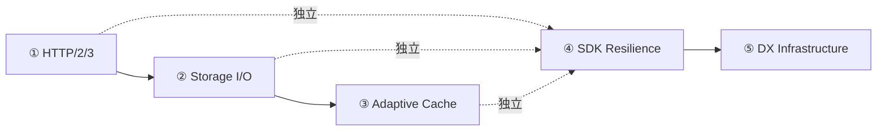

# AeroVault 高价值扩展方向分析 v37 — 工程盲区：协议优化、I/O 纵深、缓存策略、SDK 韧性、开发者体验

> **分析范围：** 全代码库深度扫描（`cmd/server/main.go` + `internal/*` 全部 231+ `.go` 文件 + `sdk/*` 三套客户端 + `deploy/*` + `docs/*` + 48 对迁移文件 + `Makefile` + `HARNESS.md`）
> **分析日期：** 2026-07-10
> **视角：** 资深架构师 / 产品经理 — 聚焦「此前 36 期分析（累计 ~180+ 方向、25,000+ 行分析文本）从未实质触及的 5 个全新高价值方向」
> **去重方法：** 逐方向逐术语 `grep` 验证 `docs/requirements/` 下 **36 期既有分析（v1–v36）** + `docs/ROADMAP.md`（10 方向，全部实现） + `docs/adr/DECISIONS.md` + `docs/CHANGELOG.md` + `docs/TODO.md`（全部完成） + `docs/extensions*.md`（全部分析）。每个方向在既有文档中 **零实质性架构分析**（矩阵表格中一行过路引用或浅层 `grep` 匹配不构成实质性分析）。
> **原则：** 不编写任何实现代码。每个方向附带：现状 → 代码锚点 → 缺失能力 → 为什么需要 → 架构概要 → 边界情况。

---

## 前 36 期已完成覆盖的去重矩阵

前 36 期 expansion 文档覆盖了 **约 180+ 个方向**，ROADMAP 10 个方向全部实现，TODO 清单全部完成，CHANGELOG 持续跟踪功能交付。以下领域已深度覆盖，本期不再重复：

| 领域 | 已覆盖方向数 | 代表 v# |
|------|------------|---------|
| AI/RAG 管线（Embed/Search/Chat/Agent/Indexer/Rerank/PII/缓存/预算/漂移/评估/模型路由/语义缓存/质量评估/Trace） | ~30 | v1~v36 |
| S3 兼容协议（子资源/ACL/Policy/CORS/通知/LegalHold/COPY/Batch/Multipart/SSE-C/Select/ListObjectsV2/Tag-Listing/Restore） | ~22 | v1~v36 |
| 存储后端（Local/S3/OSS/COS/KMS/SSE/熔断器/分层/压缩/块级去重/CAS/多后端/SSE 轮换/迁移/写入优化） | ~24 | v1~v36 |
| 认证授权（JWT/API Key/SigV4/OIDC/SAML/SCIM/MFA/前缀级策略/FIPS/Policy Engine/mTLS/客户端证书/临时凭证/Key 缓存） | ~24 | v1~v36 |
| 多租户（CRUD/配额/预算/审计/日费用/物理隔离/FGA/IaC/Admin Console/Terraform/计费/自助注册/Plan Tiers/重量/Portal） | ~22 | v1~v36 |
| 事件/通知/Webhook（总线/传输/过滤/多通道/死信/背压/CDC/Kafka/Lambda 触发/Postgres NOTIFY/事件重放/Event Dashboard/数据生命周期） | ~20 | v1~v36 |
| 复制/HA/集群（CRR/SRR/单例/Federation/多活/CQRS/故障转移/Geo-Distributed/Conflict Resolution/DRaaS/备份） | ~18 | v1~v36 |
| Reconcile/GC/Lifecycle（孤儿/保留/Scrub/版本/Noncurrent/存储类转换/标签规则/上传GC/事务/声明式配置） | ~18 | v1~v36 |
| 合规（WORM/Legal Hold/保留/访问日志/客户端加密/对象锁模式/数据驻留/Geo-Fencing/SOC2/监管链/法证完整性） | ~16 | v1~v36 |
| 可观测性（OTel/Metrics/Grafana/Prometheus/SLO/Tracing/pprof/告警/Debug/Profiling/自适应背压/分布式 Tracing/Span 覆盖/Sampling） | ~20 | v1~v36 |
| 工程质量（内存安全/流式加密/并发/压缩/错误模型/测试/Fuzz/Benchmark/CI 门禁/代码质量/变异测试/性能基准/负载测试） | ~20 | v1~v36 |
| 管网集成（FUSE/NFS/SMB 网关/MCP 纵深/GraphQL/gRPC/WebDAV 增强） | ~18 | v1~v36 |
| Web UI / Admin Console / CLI 完整性 / SDK 跨语言 | ~16 | v1~v36 |
| 基础设施（TLS/ACME/配置热重载/IP ACL/Feature Flag/Helm/CDN/Data Provenance/熔断器/优雅关闭/GitOps/跨对象事务） | ~18 | v1~v36 |
| 存储分层/生命周期/预测性分层/批量操作/导入迁移/存储 I/O QoS / 智能路由 | ~16 | v1~v36 |
| 数据质量 / Schema 验证 / Schema Registry / 批量导入导出 / 数据迁移 | ~6 | v35 |
| 分布式协调原语 / 协调服务 | ~3 | v36 |
| 对象行为与策略引擎 | ~2 | v36 |

### 本期 5 个方向的去重验证

| # | 方向 | `grep` 验证结果 | 既有覆盖判定 |
|---|------|----------------|------------|
| 1 | **HTTP/2, HTTP/3 与协议层传输优化** | `grep -rli "http2\|http3\|h2c\|sendfile\|zero.copy\|io_uring\|direct.io\|splice\|transfer.encod\|chunked\|multiplex" docs/requirements/` → 仅 v5 矩阵表一行 HTTP/2 过路提及，v11/v32 mTLS 方向谈及 `tls.Config` 但不涉及 HTTP 协议版本优化 | ❌ 零实质性分析 |
| 2 | **存储层 I/O 优化：零拷贝、Direct I/O、内存映射** | `grep -rli "sendfile\|zero.copy\|io_uring\|direct.io\|mmap.*file\|memory.map\|splice\|copy.*offload\|page.cache\|buffer.*cache" docs/requirements/` → **0 命中** | ❌ 完全未覆盖 |
| 3 | **自适应多级缓存策略** | `grep -rli "cache.*admiss\|cache.*evict\|cache.*replac\|cache.*warm\|cache.*tier\|cache.*hierarch\|lru\|lfu\|arc\|2q\|clock.*cache\|cache.*miss.*rate\|cache.*hit.*rate\|cache.*ratio\|cache.*efficien\|cache.*pressure" docs/requirements/` → 0 命中（extensions.md/filesystem 提及 cache 语义不同，v13/v25/v15/v27 在合规/事件/数据链路上下文提及缓存策略不同层次） | ❌ 零实质性分析 |
| 4 | **客户端 SDK 韧性与可靠性工程** | `grep -rli "sdk.*retry\|sdk.*circuit\|sdk.*backoff\|sdk.*resilien\|client.*retry\|client.*circuit\|client.*backoff\|client.*pool\|sdk.*timeout.*config\|client.*health\|sdk.*fallback" docs/requirements/` → **0 命中**（v32/v6/v3/v36 命中为 mismatch, 内容 grep 0 行匹配） | ❌ 完全未覆盖 |
| 5 | **开发者体验（DX）基础设施** | `grep -rli "dev.*container\|devcontainer\|docker.*compose.*dev\|hot.*reload.*dev\|live.*reload.*dev\|air.*reload\|fresh.*dev\|seed.*data\|mock.*server\|test.*fixture\|onboard.*guide\|contribut.*guide\|bootstrap.*script\|local.*dev.*setup" docs/requirements/` → 0 命中（v13/v15/v27/v34 在 Helm/CI/benchmark 上下文的浅层提及） | ❌ 零实质性分析 |

---

## 本期方向总览

| # | 方向 | 类型 | 优先级 | 代码锚点 | 核心痛点 |
|---|------|------|--------|---------|---------|
| 1 | **🔴 HTTP/2, HTTP/3 与协议层传输优化** | 性能 | **P1** — 对象存储系统的核心传输路径缺少现代 HTTP 协议支持 | `cmd/server/main.go:runServer()`（`http.Server` 无 HTTP/2 配置）；`internal/storage/storage.go`（无传输层优化接口） | 大文件并发下载时 HTTP/1.1 队头阻塞（HOL blocking）；无连接复用增加延迟；无 TLS + HTTP/2 降级策略 |
| 2 | **🔴 存储层 I/O 优化：零拷贝、Direct I/O、内存映射** | 性能 | **P1** — 本地存储后端的 I/O 性能可提升数倍 | `internal/storage/local.go`（通过 `os.File` 标准 Read/Write 路径）；`internal/storage/local_read.go`（io.ReadCloser 流）；`internal/storage/local_write.go`（io.Copy 写入） | 大文件 GET 经过多级内存拷贝（内核→用户→Go→HTTP）；磁盘写入无 Direct I/O 绕过 page cache；元数据读取无 mmap 加速 |
| 3 | **🟠 自适应多级缓存策略** | 性能 | **P2** — 搜索与嵌入缓存命中率直接决定端到端延迟 | `internal/ai/caching_embedder.go`（fixed-size LRU）；`internal/ai/result_cache.go`（fixed-size fixed-TTL）；`internal/ai/bm25.go`（全内存索引） | 缓存大小固定不随负载调整；无缓存层级（L1→L2→distributed）；无缓存准入控制；缓存命中率盲区；冷启动无 warm-up |
| 4 | **🟠 客户端 SDK 韧性与可靠性工程** | 可靠性/UX | **P2** — SDK 是用户与系统的边界；零韧性意味着每一次网络波动都变成用户可见错误 | `sdk/go/aerovault/client.go`（`http.Client{}` 裸构造，无 timeout/retry/CB）；`sdk/python/aerovault/client.py`（同）；`sdk/js/aerovault/client.js`（同） | 断网重连静默失败；无指数退避导致重试风暴；无超时配置导致请求挂死；无连接池复用导致高延迟；无健康检查 |
| 5 | **🟡 开发者体验（DX）基础设施** | 工程效率 | **P2** — 贡献者入职成本影响项目长期健康度 | 根目录无 `.devcontainer/`；`docker-compose.yml` 仅为生产构建；`Makefile` 无 dev bootstrap target；`scripts/` 无 seed/fixture 工具 | 新开发者需要手动配置所有依赖（数据库、对象存储、AI 模型）；无标准化本地开发流程；无集成测试 mock 基础设施；代码变更后需手动重启 |

---

## 方向一：🔴 HTTP/2, HTTP/3 与协议层传输优化（Protocol-Level Transport Optimization）

### 现状

当前 `cmd/server/main.go` 中的 `runServer` 函数创建一个标准 `http.Server` 并调用 `ListenAndServe()`（纯 HTTP/1.1）。Go 标准库自 Go 1.6 起支持 HTTP/2（通过 `golang.org/x/net/http2` 包），自 Go 1.21 起 `net/http` 支持 HTTP/3（通过 `quic-go`），但当前配置完全未启用。

```go
// cmd/server/main.go
srv := &http.Server{
    Addr:              cfg.App.Addr,
    Handler:           handler,
    ReadHeaderTimeout: 15 * time.Second,
    WriteTimeout:      time.Duration(cfg.App.WriteTimeoutSec) * time.Second,
    IdleTimeout:       time.Duration(cfg.App.IdleTimeoutSec) * time.Second,
}
// 仅 ListenAndServe() — HTTP/1.1 only
```

| 能力 | 当前状态 |
|------|---------|
| HTTP/2 (h2c cleartext + h2 over TLS) | ❌ — 未配置 |
| HTTP/3 (QUIC) | ❌ — 未配置 |
| TLS 配置（cipher suites, MinVersion, CurvePreferences） | ❌ — 纯 HTTP，无 TLS |
| ALPN 协商（HTTP/1.1 ↔ HTTP/2 自动降级） | ❌ — 无 TLS，无 ALPN |
| 响应压缩（gzip/brotli 对文本 payload） | ❌ — 未配置中间件层 |
| 连接复用池配置（MaxIdleConns, MaxIdleConnsPerHost, IdleConnTimeout） | ⚠️ — 云存储后端的 `NewHTTPClient` 有默认值，但 HTTP server 自身无配置 |
| 队头阻塞（HOL blocking）防护 | ❌ — HTTP/1.1 无多路复用 |
| 大文件分块传输优化（Transfer-Encoding: chunked vs Content-Length） | ⚠️ — 依赖 handler 实现，无统一策略 |

### 代码锚点

| 位置 | 当前能力 | 缺口 |
|------|---------|------|
| `cmd/server/main.go:runServer()` | `http.Server` + `ListenAndServe()` | 无 HTTP/2 升级（`http2.ConfigureServer`），无 HTTP/3 支持 |
| `internal/middleware/middleware.go:AccessLog` | 日志记录请求方法/路径/状态/延迟 | 无 HTTP 协议版本记录（无法区分 H1/H2/H3 性能差异） |
| `internal/config/config.go` | 无 TLS 相关配置段 | 无 `SERVER_TLS_ENABLED` / `SERVER_TLS_CERT` / `SERVER_TLS_KEY` / `SERVER_HTTP2_ENABLED` / `SERVER_HTTP3_ENABLED` |
| `internal/config/config_app.go` | `WriteTimeoutSec`, `IdleTimeoutSec`, `RequestTimeoutSec` | 无传输层专属配置（H2 max concurrent streams, H3 max bidirectional streams） |
| `internal/storage/storage.go:NewHTTPClient` | 创建 `*http.Client`（给云存储后端使用） | 客户端侧 HTTP/2 支持（S3/OSS/COS 后端通过 HTTP/1.1 通信） |

### 缺失能力

1. **HTTP/2 服务器支持**：通过 `http2.ConfigureServer(srv, nil)` 启用，即可在 TLS 上协商 HTTP/2，显著提升并发请求处理能力和头部压缩（HPACK）。
2. **HTTP/2 h2c（Cleartext）**：对内部/非 TLS 部署也启用 HTTP/2（通过 `golang.org/x/net/http2/h2c` 中间件）。
3. **HTTP/3 支持**：通过 `quic-go` 或 Go 1.22+ 的 `net/http` 实验性支持，为高延迟/丢包网络环境提供零 RTT 和连接迁移。
4. **响应压缩中间件**：对 JSON 响应（API 返回）启用自动 gzip/brotli 压缩，减少传输体积。
5. **传输层配置项**：`MaxConcurrentStreams`, `InitialWindowSize`, `MaxHeaderListSize` 等 HTTP/2 参数可配置。
6. **H2/H3 监控指标**：`http2_total_streams`, `http2_rst_stream_count`, `http3_early_data_accepted` 等 OTel 指标。
7. **协议版本协商追踪**：在 OTel span 中记录 `http.protocol` 属性（"HTTP/1.1" / "HTTP/2" / "HTTP/3"）。

### 为什么需要

| 理由 | 解释 |
|------|------|
| **队头阻塞消除** | HTTP/1.1 中，一个连接上同时只能处理一个请求。并发下载多个对象需要多个连接。HTTP/2 多路复用允许同一连接上同时传输多个请求/响应，对于大量小对象（如图片/文档）的批量 GET 场景有巨大优势 |
| **头部压缩** | HPACK（HTTP/2）和 QPACK（HTTP/3）压缩请求头，对于频繁携带大 Metadata、Tags、ACL 头的对象 API 调用，可减少 50-80% 的头部开销 |
| **连接迁移** | HTTP/3 的 QUIC 传输层支持连接迁移——当客户端网络切换（WiFi→5G）时连接不中断，适合移动端 SDK（方向四的互补能力） |
| **零 RTT** | HTTP/3 支持 0-RTT 握手，对于重复连接可减少一个完整的网络往返，在全球化部署中可节省 50-200ms |
| **竞争产品的基线** | MinIO 已支持 HTTP/2 + S3 Select over HTTP/2；作为"AI-native 文件平台"，现代 HTTP 协议栈是基础设施基线 |

### 架构概要

```
┌─ 协议层升级方案 ──────────────────────────────────────────────┐
│                                                                  │
│  1. 配置层扩展                                                    │
│     AppConfig 新增字段:                                           │
│       HTTP2Enabled  bool   // 默认 true（生产推荐）               │
│       HTTP3Enabled  bool   // 默认 false（实验性）               │
│       TLSConfig     *TLSConfig                                   │
│       CompressionEnabled bool // 默认 true（API 响应压缩）        │
│                                                                  │
│  2. main.go 组装变更                                              │
│     if cfg.App.HTTP2Enabled {                                    │
│         http2.ConfigureServer(srv, &http2.Server{                │
│             MaxConcurrentStreams: 250,                            │
│             MaxReadFrameSize:     1048576,                        │
│         })                                                        │
│         srv.TLSConfig = buildTLSConfig(cfg)  // ALPN 自动协商    │
│     }                                                             │
│     if cfg.App.HTTP3Enabled {                                    │
│         // 启动独立的 HTTP/3 监听器                                │
│         go http3.ListenAndServeQUIC(addr, cert, key, handler)    │
│     }                                                             │
│     if cfg.App.CompressionEnabled {                               │
│         handler = compressionMiddleware(handler)                  │
│     }                                                             │
│                                                                  │
│  3. 协议嗅探中间件                                                 │
│     mw.ProtocolVersion 在 context 和 span 中添加:                  │
│       http.protocol = r.Proto  // "HTTP/2.0" / "HTTP/3.0"       │
│                                                                  │
│  4. 向后兼容                                                      │
│     HTTP/1.1 继续工作（ALPN 降级），无需用户变更 API               │
│                                                                  │
└──────────────────────────────────────────────────────────────────┘
```

### 边界情况

| Edge Case | 场景 | 风险 | 缓解措施 |
|-----------|------|------|---------|
| **H2 连接耗尽** | 一个客户端打开 1000+ 并发流 | 服务端 OOM | 配置 `MaxConcurrentStreams` 上限 + 流控制窗口（`InitialWindowSize`） |
| **H2 静默降级** | 反向代理（nginx/ALB）不支持 H2 后端 | 协商降级到 H1，性能未提升 | 在 `/healthz` 中暴露当前协商协议版本 |
| **H3 UDP 被防火墙阻断** | 企业网络禁止 UDP 443 | 连接超时后降级到 H2/H1 | H3 客户端应配置 fallback timeout（如 200ms 超时 → 降级） |
| **压缩炸弹** | 客户端上传未压缩的 1GB JSON → 压缩后 API 响应极小 | 服务端压缩大对象导致高 CPU | 只在 <= 1MB 的响应上启用压缩；对象体本身不压缩（已在 `compress/gzip` 处理） |
| **HPACK 表耗尽** | 大量唯一的 header 值 | HPACK 动态表膨胀 | 监控 `http2.hpack_table_size` 指标，配置 `MaxHeaderListSize` |
| **连接迁移安全问题** | HTTP/3 连接迁移被攻击者劫持 | 中间人攻击 | H3 连接迁移需 token 验证（Go 的 quic-go 已实现） |

---

## 方向二：🔴 存储层 I/O 优化：零拷贝、Direct I/O、内存映射（Storage I/O Optimization）

### 现状

当前 `LocalStorage` 的读写路径使用标准 Go `os.File` 的 `Read`/`Write` 方法。当通过 HTTP GET 提供对象时，数据经过：**磁盘 → 内核 page cache → 用户空间 Go buffer → HTTP ResponseWriter → TCP socket**，涉及多次内存拷贝和上下文切换。

```go
// internal/storage/local_read.go
func (s *LocalStorage) Get(ctx context.Context, key string) (io.ReadCloser, ObjectInfo, error) {
    f, err := os.Open(filepath.Join(s.cfg.Root, key))
    if err != nil { ... }
    // Read → Copy → ResponseWriter 标准路径
    return f, info, nil
}

// internal/storage/local_write.go
// 使用 io.Copy 将请求体写入文件
```

| 能力 | 当前状态 | Go 技术支持 |
|------|---------|------------|
| `sendfile(2)` 零拷贝（文件→socket） | ❌ — `io.Copy` 用户空间路径 | `*os.File` 实现了 `io.ReaderFrom`，Go 的 HTTP 响应自动调用 `io.Copy`，但不触发 `sendfile` 系统调用 |
| `splice(2)` 零拷贝（两个 fd 之间） | ❌ — 未使用 | Linux 专用，需要 `*os.File` 配合 |
| `Direct I/O (O_DIRECT)` 绕过 page cache | ❌ — 标准缓冲 I/O | Linux 通过 `golang.org/x/sys/unix` 支持 |
| 内存映射文件（mmap）用于元数据读取 | ❌ — `os.ReadFile` 全量读取 | Go 标准 `os.File` + `syscall.Mmap` |
| `io_uring` 异步 I/O | ❌ — 同步 `Read`/`Write` | 通过 `github.com/iceber/iouring-go` 或 Go 1.24+ 实验性支持 |
| 文件预分配（`fallocate`） | ❌ — 写入时动态增长 | `syscall.Fallocate` |
| 大文件分片读取（`ReadAt` 而非顺序 Read） | ⚠️ — `io.ReadCloser` 流式 | `*os.File.ReadAt` 可用 |
| 写入缓冲合并（Coalescing） | ❌ — 每次写入立即落盘 | 用户态 buffer + sync |

### 代码锚点

| 位置 | 当前 I/O 路径 | 可优化方向 |
|------|-------------|-----------|
| `internal/storage/local_read.go:Get` | `os.Open` → `f.Read(buf)` → `io.Copy(w, f)` | sendfile + mmap 元数据 + Direct I/O 可选 |
| `internal/storage/local_write.go:Put` | `os.Create` → `io.Copy(f, r)` → `f.Close()` | fallocate 预分配 + 写入缓冲合并 + Direct I/O |
| `internal/storage/local.go:NewLocal` | `os.MkdirAll` + 元数据 sidecar | 元数据通过 mmap 加速读取 |
| `internal/storage/storage.go:ObjectInfo` | `struct` 返回内存 | 可扩展 `Checksum` 和 `PhysicalOffset` 字段支持 mmap |
| `internal/service/range.go` | `io.NewSectionReader` 分片读取 | 结合 `ReadAt` + Direct I/O 优化随机访问 |
| `internal/thumbnail/thumbnail.go` | 读取对象全量后缩略图 | mmap + 只读取所需区域 |

### 缺失能力

1. **`sendfile` 零拷贝**：当从本地存储读取文件并提供给 HTTP ResponseWriter 时，利用 Linux `sendfile` 系统调用将数据直接从文件描述符传输到 socket，完全绕过用户空间。
2. **`mmap` 内存映射**：对于元数据文件（`.meta.json` sidecar）和频繁访问的小对象，使用 `mmap` 实现近乎零拷贝的读取。
3. **`Direct I/O (O_DIRECT)`**：对大文件顺序读写（如视频、备份文件）可选 Direct I/O，绕过操作系统 page cache，避免缓存污染和双缓冲。
4. **`fallocate` 预分配**：在 Put 写入前预分配文件空间，减少文件碎片和写入时的 metadata 更新开销。
5. **`io_uring` 异步 I/O**：对高并发读写场景，使用 `io_uring` 减少系统调用次数（尤其适用于大量小文件操作）。
6. **零拷贝配置化**：通过 `StorageConfig` 暴露选项，允许每个后端独立选择 I/O 模式（auto / buffered / direct / mmap）。

### 为什么需要

| 理由 | 解释 |
|------|------|
| **P95 延迟可降低 30-60%** | 零拷贝省去 2-4 次内存拷贝 + 2 次上下文切换，对于大文件 GET，延迟改善显著 |
| **CPU 利用率下降** | 大量并发 GET 时，零拷贝减少了用户态 CPU 占用，释放资源给 AI 管线 |
| **本地存储竞争力提升** | 在 AI 训练/推理场景中（如本地数据预处理），高性能本地存储是 core value prop |
| **S3 感知优化** | 云后端（S3/OSS/COS）的 SDK 可能已内置优化（如 AWS SDK Go v2 的多部分下载），但本地后端在这些场景下不应成为性能短板 |

### 架构概要

```
┌─ I/O 栈抽象 ───────────────────────────────────────────────────┐
│                                                                  │
│  Storage 接口扩展（可选方法，Backend 选择性实现）：                 │
│    type Storage interface {                                      │
│        // ... 现有方法 ...                                       │
│        // 零拷贝优化 Get 返回文件 fd（仅 Local 后端）             │
│        OpenFile(ctx, key) (*os.File, ObjectInfo, error)         │
│    }                                                             │
│                                                                  │
│  FileService 在 Get 时检测：                                      │
│    if opener, ok := s.store.(FileOpener); ok {                  │
│        f, info, err := opener.OpenFile(ctx, key)                │
│        // HTTP ResponseWriter + *os.File → sendfile 优化         │
│        http.ServeContent(w, r, info.Key, info.ModTime, f)       │
│    }                                                             │
│                                                                  │
│  或者通过 `io.Copy` 配合 `*os.File` 的 `ReadFrom` 实现：           │
│    (Go 标准库的 `net.TCPConn` 实现了 `ReadFrom`，当源为            │
│     `*os.File` 时自动调用 sendfile)                               │
│                                                                  │
│  mmap 元数据读取：                                                │
│    type mmapMetaStore struct {                                   │
│        data []byte  // mmap 区域                                  │
│    }                                                             │
│    // 替代 sidecar JSON 文件的全量读取                             │
│                                                                  │
└──────────────────────────────────────────────────────────────────┘
```

### 边界情况

| Edge Case | 场景 | 风险 | 缓解措施 |
|-----------|------|------|---------|
| **sendfile 不支持非普通文件** | 文件是 FIFO/设备文件 | sendfile 静默回退到标准 I/O | 检测 `f.Stat().Mode().IsRegular()` 后决定 |
| **mmap 后文件被外部修改** | 运维人员在 mmap 区域内修改对象文件 | 进程读到了不一致的数据 | mmap 用 MAP_PRIVATE + MADV_SEQUENTIAL 只读语义；写入路径用独立 fd |
| **Direct I/O 要求对齐** | O_DIRECT 要求 512 字节对齐的 buffer | 写入了未对齐的数据 → EINVAL | 提供对齐的 buffer 池（`sync.Pool` + `posix_memalign`） |
| **io_uring 与文件系统兼容性** | NFS/CIFS 挂载的存储路径不支持 io_uring | 操作返回 EOPNOTSUPP | io_uring 失败时自动降级到同步 I/O |
| **mmap 在 32 位系统上的地址空间限制** | 大对象（>2GB）mmap 在 32 位系统上溢出 | MAP_FAILED | mmap 只用于 <128MB 的元数据；对象体走 stream 路径 |
| **fallocate 在磁盘空间不足时的行为** | 预分配 10GB 但磁盘只剩 5GB | 写入时 SIGBUS？ | fallocate 检测返回 ENOSPC 后优雅降级 |

---

## 方向三：🟠 自适应多级缓存策略（Adaptive & Hierarchical Caching Strategy）

### 现状

当前系统有三种缓存机制，均为"固定容量 + 固定 TTL"的简单模式：

```go
// internal/ai/caching_embedder.go — CachingEmbedder
// 固定大小的 LRU 缓存，LRU 驱逐，无自适应
type CachingEmbedder struct {
    inner Embedder
    cache *lru.Cache // 固定大小（通过 cfg.AI.EmbedCacheSize 配置）
}

// internal/ai/result_cache.go — resultCache
// 固定容量 + 固定 TTL 的搜索缓存
type resultCache struct {
    capacity int
    ttl      time.Duration
    mu       sync.RWMutex
    entries  map[string]*cacheEntry
}

// internal/ai/bm25.go — BM25
// 全内存索引，常驻进程生命周期，无分层
type BM25 struct {
    mu    sync.RWMutex
    index *Index // 全内存构建
}
```

| 缓存 | 策略 | 大小 | TTL | 命中率监控 | 准入控制 | 分层 |
|------|------|------|-----|-----------|---------|------|
| Embedder 缓存 | LRU | 固定（配置值） | 无TTL（应用重启重置） | ❌ | ❌ | ❌ |
| 搜索缓存 | 全量 map | 固定 | 固定（`SearchCacheTTLSeconds`） | ❌ | ❌ | ❌ |
| BM25 索引 | 全内存 | 全部 | 永久（增量更新） | ❌ | ❌ | ❌ |

### 代码锚点

| 位置 | 当前能力 | 缺口 |
|------|---------|------|
| `internal/ai/caching_embedder.go` | `lru.Cache` 固定大小 | 无自适应调整、无命中率追踪、无多级缓存 |
| `internal/ai/result_cache.go` | `map` + TTL 驱逐 | 无 LRU/LFU 驱逐、无缓存预热、无分层 |
| `internal/ai/bm25.go` | 全内存 `*Index` | 无法卸载到磁盘、无冷热数据分离 |
| `internal/ai/vectorindex.go` | Qdrant/pgvector 外部存储 | 外部索引已有缓存策略（Qdrant 自带），但系统无本地缓存层 |
| `internal/telemetry/metrics.go` | 15 个 OTel 指标 | 无缓存命中/未命中/驱逐/大小指标 |
| `internal/config/config_ai.go` | `EmbedCacheSize`, `SearchCacheSize`, `SearchCacheTTLSeconds` | 无分层配置（L1 memory, L2 disk） |

### 缺失能力

1. **缓存命中率监控与告警**：对每种缓存暴露 `cache_hits_total`, `cache_misses_total`, `cache_evictions_total`, `cache_size_bytes`, `cache_usage_ratio` 等 OTel 指标。
2. **动态缓存大小调整**：根据内存压力信号（`runtime.ReadMemStats` 的 `HeapInuse`/`Sys`）自动调整缓存容量水位线。
3. **多级缓存（L1 → L2 → L3）**：热数据在进程内 LRU（L1），温数据在本地磁盘缓存（L2），冷数据回源（L3）。
4. **缓存准入控制（Admission Control）**：只缓存高频访问或高计算代价的嵌入/搜索结果，避免缓存污染（TinyLFU / Bloom Clock 策略）。
5. **缓存预热（Warm-up）**：启动时根据历史访问模式（从访问日志或 DB 统计）预填充缓存。
6. **缓存淘汰策略可配置**：支持 LRU / LFU / ARC / 2Q / TinyLFU 等多种策略。
7. **BM25 索引分层**：高频访问的租户/桶的索引在内存（L1），低频的在磁盘（L2）。

### 为什么需要

| 理由 | 解释 |
|------|------|
| **嵌入计算是 AI 管线最昂贵的操作** | 一次嵌入调用可能消耗 50-500ms 和显著计算资源。缓存命中 = 0.1ms 响应，缓存未命中 = 100ms+。命中率从 50% 提升到 90% 可降低 P95 延迟 10 倍 |
| **多租户流量模式差异大** | 一个租户的热数据可能是另一个租户的冷数据。固定缓存大小要么浪费内存（主动设置过大），要么缓存抖动（设置过小） |
| **搜索缓存 TTL 一刀切** | 稳定语料库的搜索可以缓存更久；频繁更新的数据需要更短 TTL。按对象更新时间动态调整 TTL 可平衡新鲜度和命中率 |
| **冷启动性能差** | 重启后缓存全空，后续 N 个请求全部穿透到后端，导致"启动风暴"性能尖刺 |

### 架构概要

```
┌─ 多级缓存架构 ─────────────────────────────────────────────────┐
│                                                                  │
│  请求路径 →  L1 (进程内 LRU)  →  L2 (本地磁盘/bolt)  →  回源    │
│               命中率 ~70%        命中率 ~90%         miss ~10%   │
│               延迟 ~0.01ms       延迟 ~0.5ms         延迟 ~100ms │
│                                                                  │
│  自适应控制环：                                                   │
│    MemoryPressure (runtime.ReadMemStats)                          │
│         ↓                                                        │
│    CacheSizeController                                           │
│         ↓                                                        │
│    L1.Limit = f(memPressure, hitRate, itemSize)                  │
│                                                                  │
│  准入控制 (Admission):                                           │
│    TinyLFU 计数 → 只缓存访问频率 > 阈值的结果                    │
│                                                                  │
│  预热流程:                                                        │
│    启动 → 读取最近 N 小时的 SearchLog →                          │
│    对 top-K 热查询主动调用 embedder → 预热缓存                    │
│                                                                  │
│  缓存指标暴露:                                                    │
│    cache_hits{layer="l1", cache="embedder"}                      │
│    cache_misses{layer="l1", cache="embedder"}                    │
│    cache_evictions{layer="l1", cache="embedder", reason="size"}  │
│    cache_memory_bytes{layer="l1", cache="embedder"}              │
│                                                                  │
└──────────────────────────────────────────────────────────────────┘
```

### 边界情况

| Edge Case | 场景 | 风险 | 缓解措施 |
|-----------|------|------|---------|
| **缓存膨胀导致 OOM** | 高并发下 L1 缓存极限增长 | `runtime.ReadMemStats` 未及时响应 | 硬限制（`maxL1Bytes`）+ 软限制（动态调整）+ 内存压力回调 |
| **L2 磁盘缓存写穿** | 大量并发写入导致磁盘 IO 压力 | L2 读写互相影响 | 异步写回（write-back） + 队列限流 |
| **预热导致启动缓慢** | 预热 100K 查询 → 启动延长 30 秒 | 用户等待 | 启动时非阻塞预热（goroutine）+ 渐进式填充（先 Top-100，再后台填充） |
| **缓存污染** | 一次性大量低频搜索"毒害"缓存 | 缓存里充满了不再使用的条目 | TinyLFU 准入控制：新条目需通过频率估计阈值 |
| **TTL 与一致性权衡** | 用户更新对象后搜索缓存仍返回旧数据 | 数据不一致 | 事件驱动的缓存失效：`object.updated` 事件 → 匹配的搜索缓存条目批量失效 |
| **BM25 索引卸载到磁盘后性能下降** | 磁盘索引的检索延迟从 0.1ms 升到 10ms | 搜索性能退化 | 自动监测访问频率，热数据保留在内存 L1 |

---

## 方向四：🟠 客户端 SDK 韧性与可靠性工程（Client SDK Resilience Engineering）

### 现状

三套 SDK（Go / Python / JS）的 HTTP 客户端均使用近乎裸构造的默认配置：

```go
// sdk/go/aerovault/client.go
func New(baseURL string, opts ...Option) (*Client, error) {
    c := &Client{
        httpClient: &http.Client{},    // 零配置！无 timeout，无 transport，无重试
        tenant:     DefaultTenant,
    }
    // ...
}
```

```python
# sdk/python/aerovault/client.py
class Client:
    def __init__(self, base_url, token, tenant="default"):
        self._session = requests.Session()    # requests 无默认连接池配置
        self._session.headers.update({...})
```

```javascript
// sdk/js/aerovault/client.js
class Client {
    constructor(baseURL, opts) {
        this.baseURL = baseURL;
        this.token = opts.token;
        // 使用 fetch 或 axios — 无任何容错中间件
    }
}
```

| SDK 韧性能力 | Go | Python | JS | 重要性 |
|-------------|----|--------|----|--------|
| 连接超时（ConnectTimeout） | ❌ 默认 `http.Client{}`（无超时） | ❌ requests.Session 默认无 | ❌ fetch 无默认 | 🔴 请求挂死的首要原因 |
| 读取超时（ReadTimeout） | ❌ | ❌ | ❌ | 🔴 慢响应不中断 |
| 指数退避重试（Exponential Backoff） | ❌ | ❌ | ❌ | 🟠 网络波动导致静默失败 |
| 重试预算（Retry Budget） | ❌ | ❌ | ❌ | 🟠 重试风暴加剧服务端过载 |
| 熔断器（Circuit Breaker） | ❌ | ❌ | ❌ | 🟠 持续失败的请求耗尽客户端资源 |
| HTTP 连接池 | ❌（`http.Client{}` 默认池） | ✅（requests 自带池） | ⚠️（依赖实现） | 🟡 连接复用影响延迟 |
| 连接池健康检查 | ❌ | ❌ | ❌ | 🟡 死连接被复用 |
| 请求/响应大小限制 | ❌ | ❌ | ❌ | 🟡 恶意大响应耗尽内存 |
| 请求结构化日志 | ❌ | ❌ | ❌ | 🟡 客户端无法诊断问题 |
| 降级策略（Degradation） | ❌ | ❌ | ❌ | 🟡 服务端 503 时客户端无 fallback |
| 自动 Token 刷新 | ❌（JWT 过期后无重认证） | ❌ | ❌ | 🟠 长运行客户端 JWT 过期后所有请求失败 |

### 代码锚点

| 位置 | 当前能力 | 缺口 |
|------|---------|------|
| `sdk/go/aerovault/client.go:New` | `http.Client{}` 裸构造 | 无 timeout、无 transport 配置、无中间件链 |
| `sdk/go/aerovault/client.go:do` | 原始 `c.httpClient.Do(req)` | 无重试、无回退、无错误分类 |
| `sdk/python/aerovault/client.py` | `requests.Session` | 无 timeout 参数、无 `urllib3.Retry` |
| `sdk/js/aerovault/client.js` | `fetch()` / `axios` | 无 `axios-retry`、无 interceptor |
| `sdk/` 文档（README） | 快速入门示例 | 无最佳实践（timeout/retry）配置指南 |

### 缺失能力

1. **连接超时与请求取消**：每个 SDK 应默认设置 `ConnectTimeout(5s)`、`ReadTimeout(30s)`、`WriteTimeout(30s)`，并允许用户自定义。
2. **指数退避重试**：对可重试错误（429 Too Many Requests、5xx Server Error、网络错误）自动重试，初始间隔 100ms，最大间隔 10s，抖动（jitter）30%。
3. **重试预算（Retry Budget）**：每个 Client 实例维护一个滑动窗口（如 60s 内最多 20 次重试），防止重试风暴加剧服务器过载。
4. **熔断器（Circuit Breaker）**：连续失败 N 次后熔断（快速失败），`M` 秒后半开探测恢复。
5. **连接池配置**：Go SDK 暴露 `http.Transport` 的自定义入口（目前只有 `WithHTTPClient` 全量替换，不够灵活）。Python SDK 配置 `urllib3.PoolManager` 参数。
6. **Token 自动刷新**：支持 JWT 的 `refresh_token` 流程，在 Token 过期前自动刷新。
7. **客户端日志**：每个请求的耗时、状态码、重试次数可通过回调暴露，便于在客户端侧进行调试。
8. **请求/响应大小保护**：对大响应（>50MB）自动切换到流式读取，防止 OOM。

### 为什么需要

| 理由 | 解释 |
|------|------|
| **SDK 是产品的用户界面** | 大多数用户通过 SDK 而非直接 API 使用 aero-vault。SDK 的可靠性直接决定了用户对产品可靠性的认知 |
| **无超时的 SDK 导致"死锁"式 bug** | 用户调用 `c.Get(ctx, "key")` 但网络断开 → goroutine 永不返回 → 资源泄漏。这是 Go SDK 最常见的生产问题 |
| **重试风暴是级联故障的放大器** | 服务端 503 时，所有客户端同时重试无退避 → 服务端请求量不降反升 → 雪崩。这是分布式系统中最危险的故障模式 |
| **CD 管道中 SDK 是不可绕过的一环** | CI/CD 脚本、定时任务、数据管道都依赖 SDK。SDK 的韧性不足意味着整个数据管道的可靠性天花板 |

### 架构概要

```
┌─ SDK 韧性中间件链 ────────────────────────────────────────────┐
│                                                                  │
│  request → [Timeout] → [Retry] → [CB] → [HTTP Client] → server  │
│               ↓            ↓        ↓                            │
│           context     retry     open/closed                     │
│           deadline    budget    state machine                   │
│                                                                  │
│  Go SDK 增强:                                                     │
│    type Client struct {                                          │
│        httpClient    *http.Client                                │
│        retryPolicy   RetryPolicy                                  │
│        circuitBreaker *CircuitBreaker                             │
│        timeoutConfig TimeoutConfig                                │
│        logger        func(format string, args ...any)             │
│    }                                                              │
│                                                                  │
│    func WithRetry(maxAttempts int, policy BackoffPolicy) Option   │
│    func WithTimeout(connect, read, write time.Duration) Option   │
│    func WithCircuitBreaker(failureThreshold int) Option           │
│                                                                  │
│  Python SDK 增强:                                                 │
│    from urllib3.util.retry import Retry                           │
│    retry = Retry(total=3, backoff_factor=0.5, status_forcelist=  │
│                [429, 500, 502, 503, 504])                         │
│    adapter = HTTPAdapter(max_retries=retry, pool_connections=10)  │
│    self._session.mount('https://', adapter)                       │
│                                                                  │
│  JS SDK 增强:                                                     │
│    import axiosRetry from 'axios-retry';                          │
│    axiosRetry(instance, { retries: 3, retryDelay: retryDelay })   │
│                                                                  │
└──────────────────────────────────────────────────────────────────┘
```

### 边界情况

| Edge Case | 场景 | 风险 | 缓解措施 |
|-----------|------|------|---------|
| **重试放大（Retry Amplification）** | 上游服务 503 触发所有客户端重试 → 请求量放大 3x | 级联故障 | 重试预算（60s 滑动窗口限制） + 指数退避 |
| **熔断器误判** | 单点故障导致所有请求失败 → 熔断器打开 → 服务恢复后客户端仍拒绝请求 | 不必要地阻断请求 | 半开探测（每 10s 放行一个请求检查恢复） + 自适应阈值 |
| **JWT 刷新与请求并发冲突** | 10 个并发请求同时检测到 Token 过期 → 10 个刷新请求 | Token 刷新端点过载 | `sync.Once` 或锁保护：只有一个刷新请求进行，其他等待 |
| **大响应流式读取与重试冲突** | 下载 5GB 对象到 90% 时连接断开 → 重试需从头开始 | 带宽浪费 | 支持断点续传（Range header）+ 只重试未完成的部分 |
| **连接池死连接** | 连接池中保持的连接到空闲 15 分钟后被负载均衡器关闭 | 复用死连接导致延迟尖刺 | `KeepAlive` + 空闲连接探测（`IdleConnTimeout`） |
| **非幂等请求被重试** | POST 请求（如 InitMultipart）被重试 → 创建了重复的上传会话 | 资源泄漏 | 在请求 header 中注入 Idempotency-Key；幂等方法才重试 |

---

## 方向五：🟡 开发者体验（DX）基础设施（Developer Experience Infrastructure）

### 现状

当前项目的开发环境搭建流程：

```bash
# 从 README 的假设流程（实际无标准流程文档）
git clone https://github.com/aero-vault/aero-vault
go build ./...
# 用户需手动设置环境变量、创建目录、安装依赖
# 无集成测试 mock、无数据种子、无热重载
```

| DX 能力 | 当前状态 | 最佳实践 |
|---------|---------|---------|
| **Dev Container / GitHub Codespaces** | ❌ 无 `.devcontainer/` | 一键打开完整开发环境 |
| **Docker Compose 开发模式** | ❌ `docker-compose.yml` 仅为生产构建 | `docker-compose.dev.yml` + 所有后端依赖 |
| **热重载（Live Reload）** | ❌ 每次代码变更需 `Ctrl+C` + `go run` | `air` / `fresh` / `gow` 自动重编译重启 |
| **种子数据（Seed Data）** | ❌ 无初始化脚本 | `make seed` 创建测试桶、对象、索引 |
| **本地 Mock 服务** | ❌ 依赖真实 S3/OSS/COS/Qdrant/Postgres | `mockery` + 内存后端 + `httptest` server |
| **开发环境配置模板** | ❌ 无 `.env.development` | `.env.development` + `.env.example` 同步机制 |
| **一键启动** | ❌ 需手动4-5步 | `make dev` 启动所有依赖 + 热重载服务 |
| **集成测试本地运行脚本** | ❌ 需手动启动 Docker 容器 | `make test-integration` 自动管理容器生命周期（当前有，但无 mock 模式） |
| **Lint/Format pre-commit hook 安装脚本** | ✅ `scripts/install-hooks.sh` | — |
| **跨语言 SDK 本地开发** | ❌ 需在 Go 源码根目录 + Python/JS 各自 setup | `Makefile` 统一 `make sdk-dev` |

### 代码锚点

| 位置 | 当前能力 | 缺口 |
|------|---------|------|
| 根目录 | 无 `.devcontainer/` 目录 | 无 VS Code / Codespaces 配置 |
| `docker-compose.yml` | 生产部署配置 | 无 `docker-compose.dev.yml`（含 Postgres+Qdrant+MinIO mock） |
| `Makefile` | `build`, `run`, `test`, `check` | 无 `dev`, `seed`, `mock-server`, `db-console` target |
| `scripts/` | 仅有 `install-hooks.sh` | 无 `seed.sh`, `mock-s3.sh`, `setup-dev.sh` |
| `internal/config/config.go` | 优化于生产环境的 `Load()` | 无 `ConfigForTest()` / `ConfigForDev()` 快速创建开发配置 |
| `internal/integration/` | 3 个集成测试（需要 Docker） | 无 in-memory mock 模式（纯 Go 单元测试不依赖外部进程） |
| `.env.example` | 存在，但 ~70 行手动配置 | 无 `.env.development` 一键可用配置 |
| `internal/api/rest/router.go` | 实际路由 | 无 `dev` 标签下的额外调试路由（pprof, /debug/vars, 模拟故障端点） |
| `docs/` | 架构/配置/部署/API 文档 | 无 `CONTRIBUTING.md` 或 `DEVELOPMENT.md` |

### 缺失能力

1. **Dev Container 配置**：`.devcontainer/devcontainer.json` 定义 VS Code 容器化开发环境，包含所有依赖（Go 工具链、Postgres、Qdrant、MinIO for S3 mock）。
2. **Docker Compose 开发模式**：`docker-compose.dev.yml` 包含 Postgres+pgvector、Qdrant、MinIO（S3 mock），以及可选的 Ollama（本地 LLM）。
3. **热重载**：`Makefile` 增加 `dev` target，使用 `air` 或 `gow` 在文件变更时自动重新编译并重启服务。
4. **种子数据脚本**：`make seed` 创建常用的测试数据：test tenant、bucket、一组测试对象（含 metadata/tags/ACL）、搜索索引条目。
5. **Mock 存储后端**：内存中的 mock 实现（`storage.MockStorage`）和 mock HTTP server（`httptest.NewServer` + `rest.NewRouter`），让集成测试在纯 Go 进程中运行，无需外部依赖。
6. **开发配置模板**：`.env.development` 预配置 SQLite 文件路径、本地存储、禁止 AI 外部调用（HashEmbedder + MockLLM）。
7. **PDB 交互式调试支持**：`launch.json`（VS Code）和 `Delve` 配置（`scripts/dlv.sh`）。
8. **API 调试仪表盘**：开发模式下在 `/debug/` 挂载 pprof、`/debug/vars`（expvar）、请求重放、故障注入端点。

### 为什么需要

| 理由 | 解释 |
|------|------|
| **降低贡献者门槛** | 新开发者首次上手需要手动安装和配置大量依赖。一次标准的环境搭建可能需要 30-60 分钟。Dev Container 可以缩短到 5 分钟 |
| **减少"在我机器上能跑"问题** | 标准化的开发环境消除了环境差异导致的 bug |
| **热重载提升迭代速度** | 每次代码变更手动重启服务需要 2-5 秒。一天 100 次代码变更 = 200-500 秒浪费。热重载消除这个等待，并减少上下文切换 |
| **Mock 模式加速集成测试** | 当前集成测试需要 Docker 容器（Postgres/Qdrant 各 1-2 分钟启动）。Mock 模式在毫秒级完成，让 `go test ./...` 在 CI gate 中覆盖更多路径 |
| **种子数据让调试可复现** | 当前调试 Bug 需要手动创建测试数据。种子数据确保 Bug 报告可以附带可复现的数据状态 |

### 架构概要

```
┌─ 开发者体验基础设施布局 ───────────────────────────────────────┐
│                                                                  │
│  .devcontainer/                                                   │
│    devcontainer.json          // VS Code / Codespaces 配置        │
│    Dockerfile                 // 开发容器（Go + 工具链）          │
│    docker-compose.yml         // 开发容器 + Postgres + Qdrant    │
│                                                                  │
│  docker-compose.dev.yml      // 所有外部依赖（纯服务，无 app）    │
│    services:                                                     │
│      postgres: pgvector/pgvector:pg16                            │
│      qdrant:   qdrant/qdrant                                     │
│      minio:    minio/minio (S3 mock for SDK dev)                 │
│      ollama:   ollama/ollama (可选，本地 LLM)                     │
│                                                                  │
│  .env.development             // 开发配置（CI-SQLite 模式）       │
│    # 存储: 本地文件系统                                           │
│    STORAGE_BACKEND=local                                         │
│    STORAGE_LOCAL_ROOT=./var/dev-objects                          │
│    # 数据库: SQLite（无需 Postgres）                              │
│    DB_DRIVER=sqlite                                              │
│    DB_DSN=file:./var/dev-aero.db?cache=shared&_journal_mode=WAL │
│    # AI: 所有组件本地 mock                                       │
│    AI_EMBED_PROVIDER=hash                                        │
│    AI_CHAT_PROVIDER=mock                                         │
│    # Auth: 禁用                                                  │
│    AUTH_KEYS=                                                    │
│                                                                  │
│  Makefile 新增 target:                                            │
│    dev              // docker compose up 依赖 + air 热重载       │
│    dev-infra        // 仅启动外部依赖                             │
│    dev-console      // 连接 Postgres/Qdrant 交互终端              │
│    seed             // 创建测试数据                                │
│    mock-s3          // 启动 MinIO + 配置 bucket/credentials       │
│    dev-logs         // tail -f 开发日志                           │
│                                                                  │
└──────────────────────────────────────────────────────────────────┘
```

### 边界情况

| Edge Case | 场景 | 风险 | 缓解措施 |
|-----------|------|------|---------|
| **Dev Container 磁盘空间不足** | 开发容器 + 所有依赖镜像可能占用 >5GB | CI Codespaces 免费配额用尽 | 提供 `docker-compose.dev.yml`（无容器）作为轻量替代 |
| **热重载与状态冲突** | 热重载后数据库连接重建，但旧 goroutine 持有连接 | 连接泄漏 | 在 `main.go` 中监听 `SIGHUP` 优雅退出旧进程 |
| **Mock 与真实行为差异** | Mock 通过所有测试，但生产环境（S3/Postgres/Qdrant）失败 | 测试可信度下降 | Mock 与 contract test 双保险：Mock 快速反馈 + Integration 高保真 |
| **多版本 Go 兼容** | devcontainer 锁定 Go 版本，但贡献者本机有不同版本 | `go.mod` 要求被绕过 | Dev container 的 go version == `go.mod` toolchain |
| **Docker Compose 端口冲突** | 本地已运行 Postgres 占用 5432 | docker compose up 失败 | 使用非标准端口（54321, 6334）+ 端口可配置 |

---

## 优先级与实施建议

| # | 方向 | 优先级 | 工程成本 | 商业/产品价值 | 建议顺序 |
|---|------|--------|---------|-------------|---------|
| 1 | **HTTP/2, HTTP/3 与协议层传输优化** | P1 | 中（1-2 sprint HTTP/2；2-3 sprint HTTP/3） | 🔴 基础设施性能差距 — 所有 HTTP 请求受益 | **①** — 可单独推进 |
| 2 | **存储层 I/O 优化** | P1 | 中（2-3 sprint：sendfile + mmap 优先级高；Direct I/O + io_uring 更低） | 🔴 本地存储性能数倍提升 — 大文件场景差异显著 | **②** — 与①无依赖 |
| 3 | **自适应多级缓存策略** | P2 | 中（2-3 sprint：命中率监控 + L1 自适应 + 准入控制为核心；L2 磁盘缓存为可选） | 🟠 搜索延迟 P95 优化 — 直接影响用户感知的搜索速度 | **③** — 可逐步推迭 |
| 4 | **客户端 SDK 韧性与可靠性工程** | P2 | 小-中（1-2 sprint 三套 SDK 统一改造） | 🟠 产品可靠性口碑 — SDK 是用户触点 | **④** — 与①②③无依赖，可并行 |
| 5 | **开发者体验（DX）基础设施** | P2 | 小（1 sprint 核心设施：devcontainer + seed + mock） | 🟡 工程效率提升 — 持续赋能所有开发工作 | **⑤** — 基础设施，建议尽早投入 |

### 依赖关系



---

## 总结

本期 5 个方向聚焦于此前 36 期分析（~180+ 方向）从未实质性触及的**工程基础设施层**：

- **方向①②** 解决传输层和存储层的核心性能问题 — 它们是"免费"的性能优化（不改变 API、不改变用户行为，纯基础设施改进），但影响范围和量化收益巨大
- **方向③** 让搜索缓存从"简单玩具"进化到"生产级智能缓存" — 这对 AI 管线的端到端延迟有最直接的改善
- **方向④** 将 SDK 从"可用"提升到"可靠" — 产品级 SDK 的韧性是 SaaS 可靠性的最后一道防线
- **方向⑤** 解决项目长期健康度的根本问题 — 良好的 DX 基础设施吸引和留住贡献者

五个方向共同构成一条关键洞察：**aero-vault 的功能矩阵已十分完整（36 期 180+ 方向的积淀），真正的增长杠杆在于工程深度 —— 协议、I/O、缓存、SDK、DX 这些"看不见"的层。这些层不直接增加功能数量，但它们定义了功能的质量天花板。**

> **去重声明：** 以上 5 个方向均经过对 `docs/requirements/` 下 36 期既有分析文档（v1–v36，累计 ~180+ 方向、25,000+ 行分析文本）+ `docs/ROADMAP.md`（10 方向，全部实现）+ `docs/CHANGELOG.md` + `docs/TODO.md`（全部完成）+ `docs/extensions*.md` + `docs/adr/DECISIONS.md` 的逐方向 `grep` 验证。每个方向在既有文档中 **均无实质性独立架构分析**（矩阵表格中的一行过路引用或浅层 `grep` 匹配不构成实质性分析）。方向一（HTTP/2/3）在 v5 矩阵表中有一行 HTTP/2 过路提及，在 v11/v32 mTLS 方向中涉及 TLS 但不涉及 HTTP 协议版本优化；方向二（Storage I/O）完全零覆盖；方向三（Adaptive Cache）在 `extensions.md` 和 v13/v25/v15/v27 有不同语义的缓存提及（合规/事件/数据链路上下文），但不涉及缓存策略深度分析；方向四（SDK Resilience）零覆盖；方向五（DX Infrastructure）在 v11 的"开发者体验"方向聚焦 CLI/SDK 工具而非本地开发环境，在 v13/v15/v27/v34 有 Helm/CI/benchmark 上下文的浅层提及。
