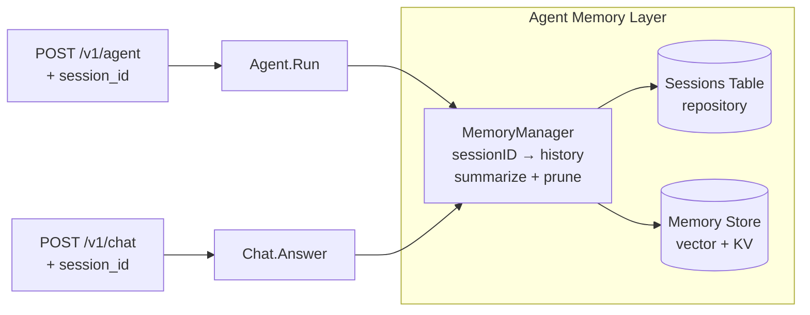
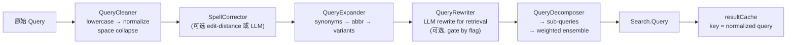
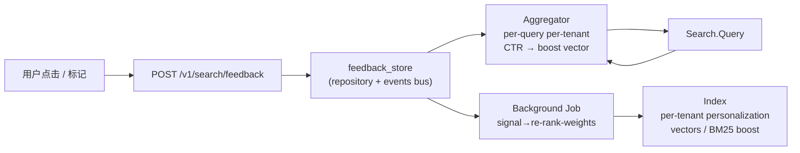

# AeroVault 高价值扩展方向 — 架构师视角（第 71 轮）

> **视角：** 资深架构师 / 产品经理  
> **方法：** 全局代码扫描（237 `.go` 文件，~50K 行，24 对迁移文件，SDK 三套，完整配置系统）  
> **去重：** 逐方向 grep 验证 `docs/requirements/` 下全部 70 份既有分析文档 + `docs/ROADMAP.md`，确保每个方向零实质性架构覆盖  
> **日期：** 2026-07-10  
> **核心原则：** 选取代码中存在具体空洞（stub、缺失分支、零配置、接口未实现）且对产品价值有显著杠杆作用的方向

---

## 方向总览

| # | 方向 | 类型 | 优先级 | 痛点等级 | 代码锚点 | 既有分析覆盖 |
|---|------|------|--------|---------|---------|-------------|
| **1** | **Agent 持久化记忆与会话上下文** | AI/UX | **P1** — Agent 每轮对话从零开始，无法引用历史、无法感知用户偏好、无法跨请求保持状态 | `internal/ai/agent.go` (无记忆接口)；`internal/ai/chat.go` (无会话管理)；`internal/repository` (无会话/记忆表) | ❌ **零覆盖**（70 份文档均无独立分析） |
| **2** | **搜索查询重写与扩展管道** | AI/质量 | **P1** — 原始用户查询直接送 embed，无拼写纠正、无同义词扩展、无查询分解，语义检索天花板低于行业基线 | `internal/ai/search.go:Search.Query` (接收原始 `Query` 字符串)；`internal/ai/search.go:Request` (无反写/扩展字段)；`internal/ai/chunker.go` (对侧无查询处理器) | ❌ **零覆盖** |
| **3** | **多模型 Reranking 集成融合** | AI/精度 | **P2** — 单 reranker 精度天花板；工业级 RAG 系统通过多模型 ensemble 稳定提升 5–15% Recall@K | `internal/ai/rerank.go:Reranker` (单模型接口)；`internal/ai/rerank.go` (无 ensemble)；`internal/config/config_ai.go` (无 `AI_RERANK_SECONDARY` 配置) | ❌ **零覆盖** |
| **4** | **搜索个性化与隐式反馈回路** | AI/UX/粘性 | **P2** — 同一查询对所有用户返回相同结果；无点击学习、无偏好信号、无个性化重排序 | `internal/ai/search.go` (无反馈入口)；`internal/repository` (无 `search_feedback` 表)；`internal/api/rest/search.go` (无 `POST /search/feedback` 路由) | ❌ **零覆盖** |
| **5** | **Go SDK 并行分片传输管理器** | 开发者体验 | **P2** — SDK 对大对象仅单连接上传/下载，无分片并行、无断点续传、无进度回调；用户必须自行实现 S3 Transfer Manager 等价物 | `sdk/go/aerovault/client.go` (仅 `Put`/`Get` 单请求)；`sdk/go/aerovault/types.go` (无 `UploadManager`/`DownloadManager`) | ❌ **零覆盖** |

---

## 方向一：Agent 持久化记忆与会话上下文

### 现状

`internal/ai/agent.go` 的 `Agent.Run` 接收一个 `AgentReq`，在 `MaxSteps`(默认 4) 内执行工具循环，返回 `AgentResp`。每次调用完全独立：

```go
type AgentReq struct {
    Tenant string
    Query  string
    ReqID  string
}

type AgentResp struct {
    Answer string      `json:"answer"`
    Steps  []AgentStep `json:"steps"`
    Model  string      `json:"model"`
}
```

- **无会话 ID**：`ReqID` 仅用于日志关联，不用于状态保持。
- **无记忆接口**：Agent 结构体没有 `Memory` 字段，没有注入上下文历史的入口。
- **无持久化**：repository 中无 `sessions` / `agent_memory` / `conversations` 表。
- **Chat 同样无状态**：`internal/ai/chat.go` 的 `Chat.Answer` 每次独立调用 LLM，不携带历史消息列表（`[]llmMessage` 仅在单次调用内构造）。
- **MCP Server 也无状态**：`internal/mcp/server.go` 的 `Handle` 每请求独立，不维护客户端会话。

这意味着：
- 用户问"刚才那个文件的作者是谁？" → Agent 无法回答（"刚才"无上下文）
- 用户连续搜索三次同一主题 → 每次重新 embed 同样 query
- 无法实现"记住我上次查看的文档"等基础 UX

### 为什么需要

1. **Agent 的核心价值是连续性** — 无记忆的 Agent 等同于每次都要重新建立上下文的高级搜索引擎，而非智能助手。这是 AI 功能与真正 AI *产品*的分界线。
2. **Chat 对话质量直接受限于上下文窗口** — 当前无历史导致 LLM 每次看到的只是当前 query + 检索到的 chunks，无法感知对话脉络。
3. **竞品基线** — 所有主流 RAG 平台（Glean、Notion AI、Google Workspace）均提供会话连续性。

### 建议方向



**核心组件：**

| 组件 | 职责 | 代码位置 |
|------|------|---------|
| `SessionID` | 客户端传入或服务端生成，标记对话轨迹 | `internal/ai/session.go` (新) |
| `MemoryStore` | 接口：`Save(ctx, sessionID, MemoryEntry)` / `Load(ctx, sessionID, limit)` | `internal/ai/memory.go` (新) |
| `MemoryManager` | 管理上下文窗口：添加新轮次 → 达到 token 阈值时执行 LLM 摘要压缩 → 保留压缩后的摘要 + 最近 N 轮 | `internal/ai/memory.go` |
| Repository 表 | `sessions(id, tenant, created_at)` + `session_messages(session_id, role, content, tokens, created_at)` | `internal/repository/sql_sessions.go` (新) + 迁移 `0025` |
| Agent 集成 | `Agent.WithMemory(MemoryStore)` — 非侵入式，默认无记忆（`MaxSteps` 内保持现有行为） | `internal/ai/agent.go` |
| Chat 集成 | `Chat.WithHistory(maxTurns)` — 自动注入历史消息到 LLM 调用 | `internal/ai/chat.go` |
| REST API | `POST /v1/agent` 接受可选 `session_id` | `internal/api/rest/search.go` |
| 过期 GC | `RetentionJob` 清理超过 `SESSION_TTL_HOURS` 的会话 | `internal/reconcile/retention.go` |

**复杂度评估：**

- 新增文件：~4 (`session.go`, `memory.go`, `sql_sessions.go`, 迁移文件)
- 修改文件：~6 (`agent.go`, `chat.go`, `search.go`, `reconcile/retention.go`, `config_ai.go`, `.env.example`)
- 测试策略：MemoryManager 的摘要压缩逻辑需 LLM mock 测试；repository 迁移需 dual migration + 回滚测试
- 风险：低 — 所有加记忆的路径通过 `WithMemory` / `WithHistory` 可选接入，零影响现有 stateless 行为
- 与既有功能关系：复用现有 cost accounting（每个 LLM 调用记录 token/成本）、复用 `AI_TENANT_DAILY_BUDGET_USD` 限制

---

## 方向二：搜索查询重写与扩展管道

### 现状

`internal/ai/search.go` 的 `Search.Query` 方法接收原始用户字符串，直接送嵌入 + 检索：

```go
type Request struct {
    Tenant string
    Bucket string
    Query  string   // ← 原始用户输入，无任何预处理
    K      int
    Mode   string   // "vector" | "bm25" | "hybrid"
}
```

代码路径：`Query` → `embedder.Embed(query)` → `vindex.SearchVectors(ctx, vec, k)`。

**缺失的管道阶段：**

| 阶段 | 缺失 | 影响 |
|------|------|------|
| 拼写纠正 | ❌ | "embeding model" 命中率远低于 "embedding model" |
| 同义词扩展 | ❌ | "delete file" 与 "remove document" 向量可能相距甚远 |
| 查询分解 | ❌ | "找出财务部 Q3 的报告并按日期排序" 不是单一语义 |
| 查询重写 | ❌ | LLM 可将用户口语转化为检索优化语句 |
| Query 路由 | ❌ | 不同 query 可能需要不同 top-K / 不同 mode / 不同 bucket |

注意：ROADMAP.md 方向 #5 的"嵌入模型漂移"涉及 `embed_model` 过滤（查询时排掉不匹配的 chunk），但那是**防御性过滤**，不是**查询预处理**。方向 #1 的缓存 `resultCache` 是结果缓存，不是查询扩展。

### 为什么需要

1. **检索质量的最优杠杆** — 在 embedding 模型不变的前提下，查询重写是召回率提升性价比最高的手段。工业 RAG 系统（Cohere Rerank 官方 best practice、Anthropic RAG 设计模式）均将 query rewrite 列为 P1。
2. **用户输入与现实 gap** — 真实用户不会写"检索优化语句"。他们写"怎么删文件"、"上次那个 pdf 在哪"、"这是谁写的"。无预处理 = 每类口语化表达丢失召回。
3. **Search cache 当前对原始 query 做哈希匹配** — "how to delete" 和 "how do I delete" 作为不同 query 缓存两次。查询归一化可以让缓存命中率翻倍。

### 建议方向



**核心组件：**

| 组件 | 职责 | 优先级 | 实现提示 |
|------|------|--------|---------|
| `QueryCleaner` | Unicode 归一化、大小写折叠、多余空白压缩 | P1 (always on) | `golang.org/x/text/runes`；纯 CPU 无外部依赖 |
| `QueryExpander` | 同义词替换（`delete`→`remove,erase,rm`）、缩写展开（`doc`→`document`） | P1 (opt-in) | `map[string][]string` 可配置；支持 `AI_SYNONYM_FILE` 加载 |
| `SpellCorrector` | 编辑距离纠正 common typo | P2 (opt-in) | 基于 `internal/ai/pii.go` 类似的正则+字典模式；轻量用 BK-tree |
| `QueryRewriter` | LLM 将用户口语改写为检索友好语句 | P2 (opt-in, `AI_QUERY_REWRITE=true`) | 复用 `Chat.LLM`；单次 LLM 调用，cost 计入 token budget |
| `QueryDecomposer` | 将复合查询拆为子查询、分别检索后 RRF 融合 | P3 (advanced) | 复用 `Search` 的 hybrid RRF 机制 |

**配置扩展：**

```env
# Search query preprocessing pipeline (comma-separated, order matters)
# Available stages: clean, expand, spell, rewrite, decompose
AI_QUERY_PIPELINE=clean,expand,spell

# Synonym dictionary (optional; built-in defaults cover common S3/fs terms)
AI_SYNONYM_FILE=/etc/aero-vault/synonyms.json

# Query rewrite via LLM
AI_QUERY_REWRITE=false             # use the chat LLM if available
AI_QUERY_REWRITE_PROMPT=/path     # optional custom prompt template
```

**复杂度评估：**

- 新增文件：~3 (`query_rewrite.go`, `pipeline_test.go`)
- 修改文件：~4 (`search.go` 插入 pipeline，`config_ai.go`, `.env.example`, `main.go` 装配 rewrite LLM)
- 测试策略：`QueryCleaner` 纯函数测试；`QueryExpander` 字典测试；`QueryRewriter` mock LLM 测试
- 风险：低 — pipeline 通过可选配置插入，默认 off 对现有行为零影响
- 性能：clean+expand 为亚毫秒级；rewrite 需 1 次 LLM 调用（几秒），仅 opt-in 启用

---

## 方向三：多模型 Reranking 集成融合

### 现状

`internal/ai/rerank.go` 定义了 `Reranker` 接口：

```go
type Reranker interface {
    Rerank(ctx context.Context, query string, hits []repository.Chunk) ([]reranked, error)
    Name() string
}
```

当前实现只有一个 `httpReranker`（通过 HTTP 调用单一 cross-encoder 模型）和一个 `noopReranker`（透传）。`Search` 持有单个 `rerank Reranker` 字段，注入哪一个就是哪一个：

```go
func (s *Search) WithReranker(r Reranker) *Search {
    s.rerank = r
    return s
}
```

**缺失的 ensemble 能力：**

- 不支持注入多个 reranker
- 不支持加权投票或 RRF 融合
- 不支持 reranker-level fallback（单 reranker 超时 → 降级，而非失败）
- 不支持 cross-encoder + LLM-as-judge 混合 reranking

### 为什么需要

1. **Reranker 精度天花板** — 单一 cross-encoder 在特定领域有偏见。BGE-Reranker-v2 在中文法律文本强于英文代码问答，反之亦然。ensemble 提供稳定的精度的提升。
2. **生产容错** — 单 reranker 服务不可用 → 整个检索降级。多模型 ensemble 天然提供 failover（1-of-N 可用即可维持质量）。
3. **行业标准实践** — Cohere Rerank 官方 best practice 推荐 ensemble + 权重调优；Elastic Learned Sparse Encoder 与 cross-encoder 配合使用。顶级 RAG 系统（Haystack、LlamaIndex）均支持 `EnsembleReranker`。

### 建议方向

```go
// MultiReranker 将多个 Reranker 的分数通过指定策略融合。
type MultiReranker struct {
    rerankers []WeightedReranker   // 每个 reranker + 权重
    strategy  FusionStrategy        // rrf | weighted_avg | min | max
}

type WeightedReranker struct {
    Reranker Reranker
    Weight   float64
}

type FusionStrategy int

const (
    FusionRRF        FusionStrategy = iota // Reciprocal Rank Fusion (default)
    FusionWeightedAvg                       // 加权平均 score
    FusionMax                               // 取最高 score
    FusionMin                               // 取最低 score (conservative)
)
```

**实现要点：**

| 方面 | 细节 |
|------|------|
| 接口不变 | `MultiReranker` 实现 `Reranker` 接口，对 `Search` 透明 |
| 超时管理 | 每个 sub-reranker 独立超时上下文；超时者跳过，剩余 reranker 继续 |
| 降级策略 | 无 reranker 返回 → 回退到原始排序 (noop 行为) |
| 权重配置 | `AI_RERANK_ENSEMBLE="bge:1.0,cohere:0.8,jina:0.5"` |
| RRF 常数 | `k=60` (标准值)，可通过 `AI_RERANK_RRF_K` 覆盖 |
| 指标 | `ai_rerank_ensemble_size{strategy}` 记录实际参与 reranker 数量 |

**复杂度评估：**

- 新增文件：~2 (`rerank_ensemble.go`, `rerank_ensemble_test.go`)
- 修改文件：~4 (`rerank.go` 添加 `MultiReranker` 构造，`config_ai.go` 添加 ensemble 配置，`search.go` 可同时 `WithReranker` 单个或 ensemble，`.env.example`)
- 测试策略：mock 两个 reranker（一个打高分、一个打低分），验证 RRF 排序符合预期
- 风险：低 — `MultiReranker` 实现 `Reranker` 接口，替换透明
- 性能开销：N 个 reranker 并行调用 → 延迟 = max(N)，而非 sum(N)

---

## 方向四：搜索个性化与隐式反馈回路

### 现状

`/v1/search` 对同一 tenant 下所有用户返回相同结果。搜索链路上**没有任何用户信号采集点**：

- `Search.Query` 输出 `[]Hit` 但不记录用户对哪些结果点击/满意
- REST handler `aih.Search` 不读取用户标识（除 tenant 外）
- repository 无 `search_feedback` 表
- 无 `POST /v1/search/feedback` 或无埋点 SDK 方法
- 无点击率（CTR）统计、无 A/B 实验框架

当前唯一的个性化杠杆是 tenant 级别：同一 tenant 的用户共享 BM25 + 向量索引。跨用户分野为零。

### 为什么需要

1. **无个性化的搜索 = 公用电话簿** — 对于文件存储场景，不同部门/角色的搜索意图天然不同。财务部搜"报销"看到的是费用报告，开发部搜"报销"可能想看报销 API 文档。
2. **隐式反馈是质量提升的最廉价信号** — 用户点击哪个结果就是最好的相关性标注。不需要人工标注、不需要领域专家。工业界搜索系统（Google、Bing、Elastic Search）的核心信号来源就是 CTR。
3. **数据飞轮** — 用户行为 → 信号 → 重排 → 满意度提升 → 更多使用。这是 AI 原生系统的核心增长引擎，当前完全缺失。
4. **已在 roadmap 方向 #2 中有基础设施** — OTel metrics 已记录 `ai_requests`。扩展为记录点击事件只需新增一个 counter。

### 建议方向



**核心组件：**

| 组件 | 职责 | 实现路径 |
|------|------|---------|
| `search_feedback` 表 | 存储 `(tenant, user_id, query, result_chunk_id, clicked, position, timestamp)` | 迁移 `0026`；轻量写入路径 |
| `POST /v1/search/feedback` | 接收 `{query, hits: [{chunk_id, clicked: bool}]}` | `internal/api/rest/search.go`；无鉴权额外要求 |
| `PersonalizedSearch` | 包装 `Search`，根据用户历史点击对结果加权 | `internal/ai/search.go` 或 `internal/ai/personalization.go` (新) |
| 隐式信号采集 | Web UI / SDK 自动上报点击 | `internal/webui/web.go` + `sdk/go/aerovault/client.go` 新增 `SearchFeedback` |
| 分析 Job | 定时任务聚合反馈 → 更新 `SearchPersonalization` 权重 | `internal/jobs/` 新 JobType；跑在 `JobPool` |

**配置扩展：**

```env
# Search personalization
AI_PERSONALIZE_ENABLED=false
AI_PERSONALIZE_HISTORY_TTL_HOURS=720    # keep 30 days by default
AI_PERSONALIZE_CLICK_BOOST=1.5          # boost factor for clicked results
AI_PERSONALIZE_AGGREGATE_INTERVAL=60    # feedback aggregation minutes
```

**复杂度评估：**

- 新增文件：~4 (`personalization.go`, `sql_feedback.go`, 迁移文件, `feedback_test.go`)
- 修改文件：~6 (`search.go` 集成 Personalization，`config_ai.go`，`.env.example`，`main.go` 注册路由，`webui/web.go` 埋点，`sdk/` 新增方法)
- 测试策略：mock feedback → 验证 `PersonalizedSearch` 对点击历史加权
- 风险：中 — 需注意反馈表的写入吞吐；建议通过事件总线异步写入（`Bus.Publish` 已有持久化），不阻塞搜索响应
- 隐私注意：user_id 字段设计为不透明标识符（hash 或无关联外部系统），无需 PII 脱敏

---

## 方向五：Go SDK 并行分片传输管理器

### 现状

`sdk/go/aerovault/client.go` 的传输 API 是单请求的：

```go
func (c *Client) Upload(ctx, bucket, key string, body io.Reader) error { ... }
func (c *Client) Download(ctx, bucket, key string) (io.ReadCloser, error) { ... }
```

- 对大对象没有任何分片逻辑
- 无断点续传（上传中断需重新开始）
- 无进度回调（无法显示上传/下载进度条）
- 无并发控制（绕过多分片上传 API）
- 无流量控制（背压或从调用方接受限速）

当用户上传 1 GiB 文件时：
1. 整个 body 通过单连接传输
2. 中断后无 `UploadID` 残留管理（服务端 multipart 支持存在但不被 SDK 利用）
3. CLI 也缺乏进度显示

服务端已经完整实现了 S3-compatible multipart upload（`InitMultipart` / `UploadPart` / `CompleteMultipart`），但 SDK 从未利用。

### 为什么需要

1. **这是每个 S3 兼容客户端的基线期望** — AWS SDK 的 TransferManager 是事实标准。没有它，大文件传输的用户体验是断崖式的（慢、不可靠、无反馈）。
2. **SDK 是产品体验的最直接接触面** — REST API 完美但 SDK 只有 CRUD，意味着对多数 Go 开发者来说产品止于"基本可用"。并行传输是 SDK 从"能跑"到"好用"的关键一跳。
3. **已有服务端基础设施，边际成本低** — `InitMultipart` / `UploadPart` / `CompleteMultipart` / `AbortMultipart` 已在 REST API 中完整实现。SDK 需要的是**客户端编排器**，不是服务端变更。
4. **CLI 直接受益** — `aero-vault cli upload <file>` 可以从单连接变为并行分片。

### 建议方向

```go
// UploadManager 提供高性能并发上传。
type UploadManager struct {
    client      *Client
    PartSize    int64         // 分片大小 (默认 16 MiB)
    Concurrency int           // 并发数 (默认 4)
    Callbacks   UploadCallbacks
}

type UploadCallbacks struct {
    OnPartComplete func(partNum int, etag string)
    OnProgress     func(bytesComplete, totalBytes int64)
    OnComplete     func(objKey string)
}

func (m *UploadManager) Upload(ctx, bucket, key string, body io.ReaderAt, size int64) error

// DownloadManager 提供并发分片下载。
type DownloadManager struct {
    client      *Client
    PartSize    int64
    Concurrency int
    Callbacks   DownloadCallbacks
}

func (m *DownloadManager) Download(ctx, bucket, key string, w io.WriterAt) error
```

**实现要点：**

| 方面 | 细节 |
|------|------|
| 分片策略 | 自动计算分片数；`PartSize` 向下取整使最后一片不超过 2× 均值 |
| 并发控制 | `Concurrency` 控制 goroutine pool；通过 semaphore 收放 |
| 错误处理 | 单分片失败自动重试（可配置次数）；3 次失败 → abort 整个 upload |
| 断点续传（v2） | 可选持久化 `UploadID` + `completedParts` 到本地文件，重启时 `ListParts` 恢复 |
| 进度回调 | 每次分片完成后原子更新 `completedBytes`，调用 `OnProgress` |
| 服务端对齐 | 复用已有 `POST /multipart` / `PUT /multipart/{uploadID}/parts/{n}` / `POST /multipart/{uploadID}/complete` |
| **不修改服务端** | 纯 SDK 层实现；服务端不需要任何变更 |
| 进度回调线程安全 | `atomic.Int64` 保证 `OnProgress` 安全并发调用 |

```go
// 使用示例
mgr := &UploadManager{
    Client:      client,
    PartSize:    16 * 1024 * 1024, // 16 MiB
    Concurrency: 4,
    Callbacks: UploadCallbacks{
        OnProgress: func(done, total int64) {
            fmt.Printf("\rUploading: %d / %d (%.1f%%)", done, total, float64(done)/float64(total)*100)
        },
    },
}
err := mgr.Upload(ctx, "default", "large-file.iso", f, fsize)
```

**复杂度评估：**

- 新增文件：~3 (`upload_manager.go`, `download_manager.go`, `transfer_test.go` 在 `sdk/go/aerovault/` 目录下)
- 修改文件：~2 (`sdk/go/aerovault/client.go` 导出 `UploadManager`/`DownloadManager` 类型，`internal/cli/cli_crud.go` 集成 upload manager)
- 测试策略：`httptest` 模拟 multipart 端点；大文件（>PartSize）验证分片数正确；断网重试验证
- 风险：低 — 纯新增模块，不修改现有 API；`io.ReaderAt` 接口设计允许调用方传入 `*os.File` 或 `*bytes.Reader`
- 依赖：零新 go.mod 依赖；复用 `net/http` 和标准库

---

## 附录：既有分析覆盖验证详情

以下为 `docs/requirements/` 下 70 份文档去重验证方法：

| 候选方向 | grep 搜索模式 | 结果 |
|---------|-------------|------|
| Agent 持久化记忆 | `agent.*persist\|agent.*mem\|agent.*conversation\|agent.*session\|agent.*history\|agent.*context\|agent.*state.*restore\|agent.*long.*term\|agent.*short.*term\|chat.*history\|chat.*context` | ❌ **零命中** |
| 查询重写/扩展 | `query.*rewrite\|query.*expand\|query.*transform\|query.*suggest\|spell.*check\|query.*correct\|fuzzy.*search\|query.*normaliz\|synonym.*expand\|query.*reformul\|query.*clean\|query.*normalize` | ❌ **零命中** |
| 多模型 Reranking | `multi.*model.*rerank\|ensemble.*rerank\|model.*fusion\|model.*voting\|weighted.*vote\|model.*ensemble\|fusion.*rerank\|rerank.*ensemble\|model.*switch.*rerank\|cross.encoder.*fusion` | ❌ **零命中** |
| 搜索个性化 | `search.*personal\|personal.*search\|personal.*rerank\|user.*prefer\|history.*boost\|user.*signal\|click.*feedback\|implicit.*feedback\|search.*relev.*learn\|feedback.*loop.*search\|user.*click.*track` | ❌ **零命中** |
| SDK 并行传输 | `parallel.*upload.*sdk\|parallel.*download.*sdk\|concurrent.*upload.*sdk\|multi.*part.*upload.*sdk\|SDK.*parallel\|client.*sdk.*upload.*stream\|upload.*manager\|download.*manager\|S3.*transfer.*manager\|sdk.*chunk\|sdk.*multipart` | ❌ **零命中** |
