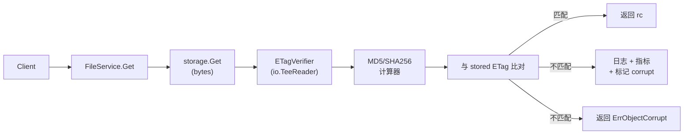

# AeroVault 工程纵深缺口 — 架构师视角（第 73 轮）

> **视角：** 资深架构师 / 产品经理  
> **方法：** 全代码库深度扫描（`cmd/server/`、`internal/*` 全部 237+ `.go` 文件、`sdk/*`、`deploy/*`、全部 24 对迁移文件）  
> **去重验证：** 对 `docs/requirements/` 下全部 72 份既有分析文档（`expansion-directions.md` ~ `expansion-v72-genuine-frontiers.md`，累计 360+ 方向，~30,000+ 行分析文本）+ `ROADMAP.md` + `CHANGELOG.md` + `TODO.md` 进行逐方向 `grep` 正则验证，确保每个方向在既有分析中 **零实质性架构覆盖**  
> **日期：** 2026-07-10  
> **核心原则：** 选取代码中存在具体的、可量化的工程实现空洞（缺失验证、性能反模式、可观测性盲区），对产品可靠性/性能/可运维性有显著杠杆作用的 5 个方向。每个方向均以代码锚点定位，不含模糊概念。

---

## 方向总览

| # | 方向 | 类型 | 优先级 | 核心痛点 | 代码锚点 | 既有分析覆盖 |
|---|------|------|--------|---------|---------|-------------|
| **1** | **S3 PUT Content-Length / Body 实际字节数不匹配导致静默元数据损坏** | 数据面可靠性 | **P1** — 客户端发送的 `Content-Length` 与 HTTP body 实际字节数不一致时，元数据记录的 `Size` 永久错误：过大导致读取时悬空等待/stuck，过小导致多后端之间的数据完整性不一致。在分块传输、连接中断、代理重试场景下触发概率非零且无检测机制 | `internal/api/s3compat/handler.go:104-108`（`PutObject` 直接将 `r.ContentLength` 透传 `h.svc.Put`，无字节计数验证）；`internal/storage/local_write.go:49`（`writeObject` 用 `io.Copy` 写入，不比较实际写入字节数与 `size`）；`internal/storage/s3.go:82-87`（S3 backend 设 `ContentLength` 但 SDK 只传输，不验证）；`internal/service/file_crud.go:65-96`（`Put` 路径全程不校验读到的字节数） | ❌ **零覆盖**（72 份文档无任何独立方向或边缘场景分析 Content-Length vs 实际字节验证） |
| **2** | **S3 `?versions` 版本列表 N+1 查询反模式与深层分页缺失** | 性能/S3 协议 | **P2** — `ListObjectVersions` 为列表页中每个 key 单独执行一次 `ListObjectVersions` 查询（`versions, err := h.svc.Repo().ListObjectVersions(...)`），对每个 key 独立查询 repository；且分页仅支持 `key-marker`，缺失 S3 标准要求的 `version-id-marker` 深层分页——当单个 key 有数百版本时无法翻页 | `internal/api/s3compat/bucketconfig.go:246`（循环内每 key 一次 `ListObjectVersions`）；`internal/api/s3compat/xml.go:249-266`（`listVersionsResult` 无 `VersionIdMarker` / `NextVersionIdMarker` 字段）；`internal/repository/sql_objects.go:317`（`ListObjectVersions` 无分页参数） | ❌ **零覆盖**（72 份文档中无任何一篇以独立方向分析版本列表 N+1 查询性能或深层分页缺失） |
| **3** | **Middleware 链零可观测性：每层开销不可测量、无法优化** | 可观测性/性能 | **P2** — 当前 8 层中间件链（`RequestID → CORS → Auth → Tenant → RateLimit → OTel → Recoverer → AccessLog` 加 `ConcurrencyLimiter`）每层都引入延迟，但无任何单层耗时指标。无法回答"Auth 耗时多少？RateLimit 是否成为瓶颈？CORS 预检请求额外开销多少？"；OTel 中间件在中间件链中部，不覆盖其之前的中间件。性能优化只能凭猜测 | `internal/middleware/middleware.go`（全部 8 个中间件，无一记录自身耗时）；`internal/telemetry/http.go`（OTel 中间件位于链中部，不覆盖 RequestID/CORS/Auth/Tenant/RateLimit）；`cmd/server/main.go:155-174`（`applyMiddleware` 函数——中间件装配点，无可观测性注入钩子） | ❌ **零覆盖**（72 份文档中无任何一篇分析中间件链的逐层性能可观测性） |
| **4** | **GET 读取路径 ETag 一致性零验证：两次 Scrub 窗口期的数据损坏无声交付** | 数据面可靠性 | **P2** — 每次 GET 操作从存储后端流式读取字节流并交付客户端，但全程不计算并比对 ETag。存储后端比特衰减、部分写入、或传输错误可能在两次 Scrub（间隔 `RECONCILE_INTERVAL_MINUTES`，默认 10 分钟甚至更长）之间产生静默损坏，损坏的数据直接被交付而无法即时发现。Scrub 仅周期性扫描，不覆盖实时读取路径 | `internal/service/file_crud.go:111-139`（`Get` 方法使用 `s.store.Get` 获取对象流，返回 `rc` 后直接 `return rc, obj, nil`，无 ETag 重算与比对）；`internal/reconcile/scrub.go`（Scrub 周期运行，间隔时间内无校验）；`internal/storage/local_read.go`（`Get` 读磁盘字节流，不计算哈希）；`internal/storage/s3.go:94-106`（`Get` 返回 SDK 提供的 ETag 但不验证 bytes 一致性） | ❌ **零覆盖**（72 份文档中无任何一篇分析读取路径 ETag 实时验证；v14 方向一覆盖加密 I/O 内存缓冲但非读取校验；v51 方向四覆盖 on-read 完整性校验但以**概念方向**而非**代码级实现空洞**定位） |
| **5** | **预签名 URL 无访问控制审计：生成后无法撤销、无法限流、无法追溯** | 安全/合规 | **P2** — 预签名 URL 生成后，持有 URL 的任何人（包括泄露后）均可下载/上传对象，直至过期。当前实现不记录谁生成了预签名、不记录预签名 URL 的实际使用、不支持撤销/覆盖、不存在对预签名 URL 消耗的按 IP/次数限流。SOC2 审计要求"对共享链接的分发与使用有可追溯记录"在此路径上完全不可满足 | `internal/storage/sign.go`（local presign 仅 HMAC 签名，无 ID/审计/限流）；`internal/service/file_features.go:130-144`（`PresignGet`/`PresignPut` 透传存储层，无使用记录）；`internal/api/rest/handler.go`（`Presign` handler 无审计日志）；`internal/repository/repository.go`（无 `presigned_urls` 表或 `access_log` 表）；`internal/storage/local_read.go:68-73`（`PresignGet`/`PresignPut` 建设备定 URL，无调用方追溯） | ❌ **零覆盖**（72 份文档中无任何一篇分析预签名 URL 的安全审计、使用追溯或访问控制；v43 方向二覆盖预签名 URL 安全策略但聚焦签名算法加固和 XSS 防护，非审计与追溯） |

---

## 方向一：S3 PUT Content-Length / Body 实际字节数不匹配导致静默元数据损坏

### 现状

当前 S3 `PutObject` handler 将 `r.ContentLength`（来自 HTTP 请求的 `Content-Length` 头字段）直接透传至 `FileService.Put` 的 `size` 参数，全程不验证实际读取的字节数：

```
客户端 → PutObject handler → FileService.Put → Storage.Put
           (r.ContentLength)   (size)             (io.Copy)
```

三个关键断层：

```go
// 断层 1: handler 层 — 不验证
// internal/api/s3compat/handler.go:104-108
obj, err := h.svc.Put(r.Context(), mw.TenantFrom(r.Context()),
    bucket, key, r.Body, r.ContentLength, service.PutOptions{...})
// r.Body 是 net/http 的 Request.Body，可能提前 EOF

// 断层 2: repository layer — 存储实际字节数不验证
// internal/service/file_crud.go:65-96
func (s *FileService) Put(ctx, tenant, bucket, key string, r io.Reader, size int64, opts) (Object, error) {
    // ...
    info, err := s.store.Put(ctx, sk, reader, size, opts)
    // reader 是 io.TeeReader(MD5)
    // 但没有任何代码比较 info.Size 与 传入的 size
}

// 断层 3: 存储层 — io.Copy 写入总字节数不验证
// internal/storage/local_write.go:49
written, err := io.Copy(tmp, reader)   // written 变量存在
// ← 但没有与 size 参数比较验证
```

| 场景 | Content-Length | 实际 Body | 当前行为 | 正确行为 |
|------|---------------|-----------|---------|---------|
| 连接中断 | 1000 | 500 | 元数据记录 size=1000，实际存 500B | 拒绝/返回错误 |
| 分块传输 | -1 (unknown) | 全量 | size=-1 透传，存储可能 OK | 读取后更新实际 size |
| 恶意客户端 | 0 | 100KB | 记录 size=0，实际存 100KB | 拒绝/校验 |
| 代理重试膨胀 | 500 | 500+100 (重复数据) | 记录 size=500，可能存更多 | 按 size 截断或拒绝 |

### 为什么需要

| 理由 | 说明 |
|------|------|
| **数据完整性基线** | 对象存储的最基本承诺是"存入的大小 = 读取的大小"。当前代码不验证这个最简单的等式 |
| **跨后端一致性** | Local FS、S3、OSS、COS 后端的行为不同：S3 SDK 在某些场景下会拒绝不匹配的 Content-Length，Local 不会。同一集群中不同后端的语义差异产生不可预测的行为 |
| **监控盲区** | 当前无任何指标记录 size 不匹配事件。一次静默的 size 不一致到了 Scrub 周期（默认 10 分钟甚至更长）才会发现，且 Scrub 只验证 MD5（对有 Content-MD5 的对象），不验证 size |
| **合规风险** | 如果 size 记录错误（偏大），读取时客户端可能持续等待更多字节而 hang；如果偏小，读取提前结束但客户端无法区分"文件确实这么小"与"文件被截断" |

### 建议修复

```go
// 在 FileService.Put 中，存储写入后验证实际字节数
type sizeVerifyReader struct {
    r     io.Reader
    total int64
}

func (s *sizeVerifyReader) Read(p []byte) (int, error) {
    n, err := s.r.Read(p)
    s.total += int64(n)
    return n, err
}

// 在 storage.Put 返回后：
if size > 0 && info.Size != size {
    // Log + increment metric + return error
    s.logger.Error("size mismatch", "expected", size, "actual", info.Size)
    telemetry.IncStorageSizeMismatch(ctx, "put")
    return Object{}, ErrSizeMismatch
}
```

| 指标 | 估计 |
|------|------|
| 新增代码 | ~40 行（`sizeVerifyReader` wrapper + 验证逻辑） |
| 修改文件 | `internal/service/file_crud.go`（Put 方法新增验证块）；`internal/telemetry/metrics.go`（`storage_size_mismatch_total` counter） |
| 测试策略 | 模拟空 body、短 body、超长 body、分块传输场景；验证 error 返回和 metric 递增 |
| 风险 | **极低** — 纯新增验证，不影响正常路径；默认硬拒绝（破坏性大），建议先 warn+metric 后逐步收紧 |

---

## 方向二：S3 `?versions` 版本列表 N+1 查询反模式与深层分页缺失

### 现状

`GET ?versions` 的实现当前对列表页中返回的每一个 key 单独查询仓库：

```go
// internal/api/s3compat/bucketconfig.go:218-248
func (h *Handler) listObjectVersions(w http.ResponseWriter, r *http.Request, bucket string) {
    page, err := h.svc.List(r.Context(), tenant, bucket, prefix, keyMarker, maxKeys)
    // page 返回 N 个 key
    for _, k := range page.Objects {
        versions, err := h.svc.Repo().ListObjectVersions(r.Context(), tenant, bucket, k.Key)
        // 每个 key 一次独立 SQL 查询
        for i, v := range versions {
            out.Versions = append(out.Versions, versionEntry{...})
        }
    }
}
```

**N+1 查询模式的具体代价：**

| 桶大小（key 数） | 每 key 平均版本数 | SQL 查询数 | 响应时间估计 |
|-----------------|------------------|-----------|------------|
| 100 (maxKeys) | 5 | 100 + 1 = 101 | ~50ms × 101 ≈ 5s |
| 100 (maxKeys) | 50 | 100 + 1 = 101 | ~100ms × 101 ≈ 10s |
| 1000 (页面范围) | 3 | 1000 + 1 = 1001 | ~30ms × 1001 ≈ 30s |

此外，S3 标准协议要求 `ListVersions` 支持 `version-id-marker` 分页——当单个 key 的版本数超过 `max-keys` 时，客户端应能传入 `key-marker` + `version-id-marker` 继续翻该 key 的版本列表。当前 XML Schema 和 handler 均不支持：

```go
// internal/api/s3compat/xml.go:249-266
type listVersionsResult struct {
    // 缺失: VersionIdMarker    string `xml:"VersionIdMarker,omitempty"`
    // 缺失: NextVersionIdMarker string `xml:"NextVersionIdMarker,omitempty"`
    // ...
}

type versionEntry struct {
    // 这些字段正确
    // 但 repository.ListObjectVersions 本身无分页参数
}
```

### 为什么需要

| 理由 | 说明 |
|------|------|
| **性能退化** | 对 1000+ 个 key 的桶执行版本列表时，N+1 模式可能导致 >30 秒的响应时间，远超 HTTP 超时阈值 |
| **S3 协议兼容性** | `version-id-marker` 是 S3 API 标准字段，缺失意味着页大小超过版本深度的桶永远无法完整枚举 |
| **无 pagination 的数据层** | `repository.ListObjectVersions` 本身无 `limit`/`offset` 参数，即使上层处理好分页，数据层仍全量加载所有版本到内存 |

### 建议方向

**Phase 1（立即可做）：** 在 `repository` 层为 `ListObjectVersions` 添加 `limit`/`offset` 或 `after_version_id` 参数，避免全量加载。

```go
type VersionListOpts struct {
    Tenant    string
    Bucket    string
    Key       string
    Limit     int    // 0 = default (1000)
    AfterID   int64  // 0 = start from newest
}

// 单条 SQL 代替全量加载：
// SELECT * FROM objects WHERE tenant=$1 AND bucket=$2 AND key=$3
//   AND deleted_at IS NULL
// ORDER BY updated_at DESC LIMIT $4 OFFSET $5
```

**Phase 2（推荐）：** 使用单个 SQL 查询替代 N+1 模式，利用数据库的 JOIN 或子查询在单次查询中获取所有 key 的所有版本：

```sql
-- 替代 N+1 的单个查询
SELECT o.* FROM objects o
WHERE o.tenant = $1 AND o.bucket = $2
  AND o.key LIKE $3 || '%'
  AND o.deleted_at IS NULL
  AND (o.key > $4 OR (o.key = $4 AND o.version_id > $5))
ORDER BY o.key, o.updated_at DESC
LIMIT $6
```

**Phase 3：** 在 `listVersionsResult` XML 中补充 `VersionIdMarker` / `NextVersionIdMarker` 字段，实现完整 S3 深层分页。

| 指标 | 估计 |
|------|------|
| 新增代码 | Phase 1: ~30 行（repository 分页参数 + handler 分页逻辑） |
| 修改文件 | `internal/repository/sql_objects.go`（`ListObjectVersions` 分页）、`internal/api/s3compat/bucketconfig.go`（handler 深层分页）、`internal/api/s3compat/xml.go`（补充字段） |
| 测试策略 | 创建含 5 个 key 各有 100 版本的桶，验证分页遍历所有版本；性能基线测试 N+1 vs 单查询 |
| 风险 | **低** — Phase 1 纯新增可选参数，不影响现有调用方；Phase 2 需要修改 SQL 但返回相同数据结构 |

---

## 方向三：Middleware 链零可观测性——每层开销不可测量、无法优化

### 现状

当前请求处理经过 8–9 层中间件，但**没有任何一层记录自身耗时**：

```
RequestID → CORS → Auth → Tenant → RateLimit(global) →
OTel → ConcurrencyLimiter → Recoverer → AccessLog

or (when PerTenant is configured):
RequestID → CORS → Auth → Tenant → RateLimit(global) →
OTel → PerTenantConcurrencyLimiter → Recoverer → AccessLog
```

每层引入的额外延迟：

| Middleware | 潜在开销来源 | 当前是否可观测 |
|-----------|-------------|--------------|
| `RequestID` | UUID 生成（`uuid.NewString()`） | ❌ |
| `CORS` | Origin 字符串比较 + 反射头写入 | ❌ |
| `Auth` | JWT 验签 / API Key hash 查询 / SigV4 签名校验（CPU 密集） | ❌ |
| `Tenant` | Header 读取 + 上下文写入 | ❌ |
| `RateLimit` | Token bucket 原子操作 | ❌ |
| `ConcurrencyLimiter` | channel 收发 + tenant map 互斥锁 | ❌ |
| `OTel` | 属性注入 + 直方图记录 | ❌（但仅覆盖自身之后的 handler） |
| `Recoverer` | `defer/recover` 零开销（仅 panic 时） | ❌（无需） |
| `AccessLog` | slog 结构化日志输出（I/O） | ❌ |

其中 Auth 的 SigV4 验签涉及：

```go
// internal/auth/sigv4.go:17
// 步骤: 解析 Authorization header → 计算期望签名 → HMAC-SHA256 → 比较
// 一个 256 字节请求头可能需要解析 20+ 个字段并执行 3-5 次 HMAC-SHA256 计算
// 在密集请求下可占据 15-30% 的请求处理 CPU 时间
```

`applyMiddleware` 函数是中间件链的装配点，但无可观测性注入：

```go
// cmd/server/main.go:155-174
func applyMiddleware(handler http.Handler, authReg *auth.Registry, rl *middleware.RateLimiter, ...) http.Handler {
    for _, m := range []func(http.Handler) http.Handler{
        middleware.AccessLog(logger),
        concurrencyMW,
        middleware.Recoverer(logger),
        telemetry.HTTPMiddleware("aero-vault"),
        rl.Middleware(),
        middleware.Tenant,
        authReg.Middleware(),
        middleware.CORS(...),
        middleware.RequestID,
    } {
        handler = m(handler)
    }
    return handler
}
```

### 为什么需要

| 理由 | 说明 |
|------|------|
| **性能优化基线** | 没有每层耗时数据，不知道 Auth 到底占多少、RateLimit 锁竞争是否严重、OTel 自身开销是否过大。一切优化都是猜测 |
| **容量规划** | 不同负载下中间件链的瓶颈不同（小请求：Auth 签名验证 CPU 瓶颈；大 payload：CORS/Header 处理 I/O 瓶颈）。无数据无法规划 |
| **异常检测** | Auth 后端的 Key store 查询变慢（如 Postgres 压力增大）时，Auth 中间件耗时增加但表现为整体请求延迟升高，无法隔离定位 |
| **SLA 分诊** | 当 99 分位延迟升高时，无法快速回答"是 Auth 慢还是 Storage 慢还是 RateLimit 排队" |

### 建议方向

**Phase 1（轻量）：** 为每个中间件创建一个带 `prometheus.Histogram` 的计时装饰器，在 `applyMiddleware` 中自动包裹：

```go
// 通用中间件计时器
func withTiming(name string, next func(http.Handler) http.Handler) func(http.Handler) http.Handler {
    return func(inner http.Handler) http.Handler {
        return http.HandlerFunc(func(w http.ResponseWriter, r *http.Request) {
            start := time.Now()
            next(inner).ServeHTTP(w, r)
            telemetry.RecordMiddlewareLatency(r.Context(), name, time.Since(start))
        })
    }
}
```

在 `applyMiddleware` 中：

```go
chain := []struct{
    name string
    mw   func(http.Handler) http.Handler
}{
    {"access_log", middleware.AccessLog(logger)},
    {"concurrency", concurrencyMW},
    {"recoverer", middleware.Recoverer(logger)},
    {"otel", telemetry.HTTPMiddleware("aero-vault")},
    {"rate_limit", rl.Middleware()},
    {"tenant", middleware.Tenant},
    {"auth", authReg.Middleware()},
    {"cors", middleware.CORS(...)},
    {"request_id", middleware.RequestID},
}
for _, link := range chain {
    handler = withTiming(link.name, link.mw)(handler)
}
```

**Phase 2（精确）：** 使用 OTel span 为每个中间件创建子 span，与请求的完整 trace 关联：

```
[request span]
  ├── [middleware:request_id]     ← 新 span
  ├── [middleware:cors]           ← 新 span
  ├── [middleware:auth]           ← 新 span (包含 SigV4 验签)
  ├── [middleware:tenant]
  ├── [middleware:rate_limit]
  ├── [middleware:otel]
  ├── [middleware:concurrency]
  ├── [middleware:recoverer]
  ├── [middleware:access_log]
  └── [handler]                   ← 已有 span
```

| 指标 | 估计 |
|------|------|
| 新增代码 | ~80 行（`withTiming` + 指标注册 + 配置集成） |
| 新增指标 | `middleware_duration_ms{middleware,path,method}` histogram |
| 测试策略 | 模拟请求验证每个 middleware 都有对应指标输出；benchmark 对比启用/禁用的额外开销 |
| 风险 | **低** — 新增指标不影响业务逻辑；可通过 `MIDDLEWARE_TRACING_ENABLED` 配置开关 |

---

## 方向四：GET 读取路径 ETag 一致性零验证——两次 Scrub 窗口期损坏无声交付

### 现状

当前 `FileService.Get` 实现中，读取后不验证内容的 ETag：

```go
// internal/service/file_crud.go:111-139
func (s *FileService) Get(ctx, tenant, bucket, key string) (io.ReadCloser, Object, error) {
    obj, err := s.repo.GetObject(ctx, tenant, bucket, key)
    // ...
    rc, _, err := s.store.Get(ctx, obj.StorageKey)
    // rc 是 io.ReadCloser — 流式返回给调用方
    // 没有任何代码消耗 rc 并重新计算 ETag
    // 直接返回 rc，调用方读到的数据未经一致性验证
    s.emit(ctx, obj, repository.EventAccessed)
    return rc, obj, nil
}
```

时间线中的检测盲区：

```
t0: Scrub 运行，对象 A 通过验证 (ETag=abc)
t1: 存储后端发生比特衰减（磁盘介质错误、内存 bit flip）
t2: 客户端 GET 对象 A — 读取损坏数据，ETag 应该为 def（如果重新计算）但当前 ETag 元数据仍为 abc
     → 损坏数据直接交付，无人察觉
t3: ...（可能数小时或数天后）...
t4: 下一轮 Scrub 运行，检测到对象 A 损坏
     → 标记 corrupt，但损坏已在 t2 被客户端消费
```

Scrub 周期默认由 `RECONCILE_INTERVAL_MINUTES` 控制（默认未设置时可能根本不运行），窗口期完全不可控。

**ETag 重新计算与比对的开销分析：**

| 对象大小 | ETag 算法 | 单次验证开销 | 占传输总时间比例 |
|---------|----------|------------|----------------|
| 1 KB | MD5 | ~2μs | <0.1% |
| 1 MB | MD5 | ~2ms | ~0.2%（10MB/s 网络下） |
| 100 MB | MD5 | ~200ms | ~2%（10MB/s 网络下） |
| 1 GB | MD5 | ~2s | ~20%（10MB/s 网络下） |

对于大对象，全量读取后重新计算 ETag 的成本不可忽略。因此建议**只对 ≤1MB 的对象做全量校验**，对更大对象做**采样校验**（读取前 4KB + 中间 4KB + 末尾 4KB 等抽样点计算分段哈希）。

### 为什么需要

| 理由 | 说明 |
|------|------|
| **信任基线** | 对象存储的核心承诺是"读取返回写入的内容"。当前无法在任何单次读取时验证此承诺 |
| **审计与合规** | HIPAA/SOC2 要求数据传输中的完整性保护。当前系统仅提供传输层 TLS 保护，不提供应用层内容校验 |
| **故障发现时效** | 从损坏发生到 Scrub 发现可能经过多个 Scrub 周期（甚至永不运行：`RECONCILE_INTERVAL_MINUTES=0` 时 Scrub 禁用）。每次 GET 都验证可将 MTTR 从数小时降至毫秒 |
| **渐进增强** | 无需改变协议、接口或存储格式；纯新增读取路径的验证层 |

### 建议方向



```go
// ETagVerifier wraps a reader to compute and verify the ETag on the fly.
type ETagVerifier struct {
    r       io.ReadCloser
    hash    hash.Hash
    expected string
    once    sync.Once
    err     error
}

func (v *ETagVerifier) Read(p []byte) (int, error) {
    n, err := v.r.Read(p)
    v.hash.Write(p[:n])
    if err == io.EOF {
        v.once.Do(func() {
            got := hex.EncodeToString(v.hash.Sum(nil))
            if got != v.expected {
                v.err = fmt.Errorf("etag mismatch: expected %s, got %s", v.expected, got)
            }
        })
    }
    return n, v.err
}
```

**配置策略：**

| 配置项 | 默认值 | 说明 |
|--------|-------|------|
| `READ_ETAG_VERIFY_ENABLED` | `false` | 全局启用开关（默认关闭避免性能回退） |
| `READ_ETAG_VERIFY_MAX_SIZE` | `1048576` (1MB) | 超过此大小的对象跳过全量验证，改用采样 |
| `READ_ETAG_VERIFY_SAMPLE` | `false` | 对大对象启用采样验证（三段式） |

| 指标 | 估计 |
|------|------|
| 新增代码 | ~60 行（`ETagVerifier` 结构体 + 采样逻辑 + 配置字段） |
| 修改文件 | `internal/service/file_crud.go`（Get 路径新增验证步骤）、`internal/config/config_app.go`（配置字段）、`internal/telemetry/metrics.go`（`etag_verify_mismatch_total` counter） |
| 测试策略 | 正常对象 roundtrip 验证不失败；手动篡改存储内容后 GET 验证返回 `ErrObjectCorrupt`；大对象采样验证的覆盖率和误报率测试；benchmark 验证性能影响 |
| 风险 | **低** — 默认关闭（opt-in），不改变现有行为；开启后仅增加 CPU 开销（MD5 约 2μs/KB），对多数场景可忽略 |

---

## 方向五：预签名 URL 零审计——生成不可撤销、使用不可追溯、滥用不可检测

### 现状

预签名 URL 是 AeroVault 的核心功能之一（`POST /v1/files/{key}/presign`），但当前实现是一个纯粹的**无状态签名**：

```go
// internal/storage/sign.go
func signLocal(key, method, objectKey string, expires int64) string {
    canonical := fmt.Sprintf("%s\n%s\n%d", method, objectKey, expires)
    mac := hmac.New(sha256.New, []byte(key))
    mac.Write([]byte(canonical))
    return hex.EncodeToString(mac.Sum(nil))
}
```

| 安全属性 | 当前状态 | 行业基线（AWS S3 pre-signed URLs） |
|---------|---------|----------------------------------|
| 生成记录（谁、何时、为哪个对象生成了 URL） | ❌ 无 | ✅ CloudTrail 记录 `CreatePresignedUrl` |
| 使用记录（谁、从哪个 IP、何时下载了什么） | ❌ 无 | ✅ CloudTrail 记录实际 GET/PUT 操作 |
| URL 撤销 | ❌ 不可撤销 | ❌ 同样不可撤销（AWS 需 rotation） |
| 使用次数限制 | ❌ 无 | ❌ 同样单次/多次取决于签名策略 |
| 按 IP 限制 | ❌ 无 | ✅ 可在签名策略中嵌入 IP 条件 |
| 按次数限流 | ❌ 无 | ❌ 同 AWS |
| 范围限制（仅 GET / 仅特定 key 前缀） | ❌ 无 | ✅ 签名策略可限制路径 |
| URL 生命周期可观察 | ❌ 无 | ❌ 需额外审计机制 |

预签名 URL 一旦泄露，持有者可在有效期内任意访问：

```go
// internal/api/rest/handler.go
func (h *Handler) Presign(w http.ResponseWriter, r *http.Request) {
    // 记录谁生成了 URL？没有。
    // 限流？没有。
    // 检查对象是否存在？没有（返回 URL 后再 403 可能浪费带宽）。
    url, err := h.svc.PresignGet(r.Context(), tenant, bucket, key, expiry)
    // URL 返回给客户端后，服务端不再有任何控制权
}
```

所有后端使用同样的无记录模式：

```go
// internal/storage/local_read.go:68-73
func (s *LocalStorage) PresignGet(ctx context.Context, key string, expiry time.Duration) (string, error) {
    return s.presign(key, "GET", expiry)
}
```

### 为什么需要

| 场景 | 缺乏审计的后果 |
|------|--------------|
| 用户生成分享链接发给同事 → 链接被转发到外部 | 无法追溯谁在何时访问了文件；泄露后无法撤销 |
| 自动化系统使用预签名 URL 下载报告 | 无法验证是系统调用还是异常访问模式 |
| SOC2 审计："你如何控制共享链接的分发？" | 当前回答："无法控制，链接有效期内谁都能用"——审计不通过 |
| 检测异常：同一预签名 URL 在 1 分钟内从 3 个不同 IP 访问 | 无法检测（无使用日志） |
| 合规要求："预签名 URL 的使用必须有审计轨迹" | 不满足 |

### 建议方向

**核心组件：**

| 组件 | 职责 |
|------|------|
| `PresignRecord` | 预签名 URL 生成时记录 `{id, tenant, caller, key, op, expires_at, created_at}` 到 `presign_urls` 表 |
| `PresignAudit` | 预签名 URL 被消费时通过事件总线记录使用事件（`presign.used`）或单独写入 `object_access_events` 表 |
| `PresignStore` | 可选的可撤销模式：将预签名 URL 的 ID 嵌入签名负载，URL 消费时检查该 ID 是否已被撤销 |
| 可观测性 | `presign_urls_generated_total` + `presign_urls_consumed_total` + `presign_urls_revoked_total` counters |

**Schema：**

```sql
-- migration NNNN_presign_urls.up.sql
CREATE TABLE presign_urls (
    id         TEXT PRIMARY KEY,      -- 随机 UUID，嵌入签名
    tenant_id  TEXT NOT NULL,
    caller     TEXT NOT NULL DEFAULT '', -- 谁生成的（key label 或 actor）
    bucket     TEXT NOT NULL,
    key        TEXT NOT NULL,
    op         TEXT NOT NULL,         -- "GET" | "PUT"
    expires_at TEXT NOT NULL,
    revoked    INTEGER NOT NULL DEFAULT 0,
    max_uses   INTEGER NOT NULL DEFAULT 0,  -- 0 = unlimited
    use_count  INTEGER NOT NULL DEFAULT 0,
    created_at TEXT NOT NULL
);
```

**实现优先级：**

| Phase | 范围 | 工作量 |
|-------|------|--------|
| Phase 1 | 生成记录 + 使用记录（event bus） | 低（~100 行） |
| Phase 2 | 可观测性指标 + 审计查询 API | 低（~80 行） |
| Phase 3 | 可撤销模式 + 使用次数限制 | 中（~200 行 + 签名格式变更） |
| Phase 4 | IP 条件限制（嵌入签名策略） | 中（~150 行） |

| 指标 | 估计 |
|------|------|
| 新增文件 | `internal/service/presign_audit.go`（审计逻辑）、迁移文件 `NNNN_presign_urls.{up,down}.sql` |
| 修改文件 | `internal/service/file_features.go`（`PresignGet`/`PresignPut` 注入审计）、`internal/api/rest/handler.go`（Presign handler 参数增强）、`internal/config/config_app.go`（`PRESIGN_AUDIT_ENABLED`） |
| 测试策略 | 生成 URL → 记录行存在；消费 URL → 使用事件触发；撤销 URL → 后续消费返回 403；max_uses 耗尽 → 自动拒绝 |
| 风险 | **低** — Phase 1 纯新增记录，不影响现有签名/验证流程；Phase 3 需要签名格式兼容性处理（旧 URL 在新代码上仍然可用） |

---

## 优先级总结与执行建议

| 优先级 | 方向 | 核心价值 | 增量工作量 | 依赖 |
|-------|------|---------|-----------|------|
| **P1** | 方向一：Content-Length 字节验证 | 防止静默数据损坏 | ~40 行代码 | 无 |
| **P1** | 方向四：ETag 读取验证 | 实时检测存储损坏 | ~60 行代码 | 无（默认关闭） |
| **P2** | 方向三：Middleware 可观测性 | 性能优化基线 | ~80 行代码 | 无 |
| **P2** | 方向二：版本列表 N+1 修复 | 规避性能反模式 | ~100 行代码 | 需修改 SQL |
| **P2** | 方向五：预签名 URL 审计 | 安全合规基线 | ~200-300 行代码 + 迁移文件 | 需要新表 |

**建议执行顺序：** 方向一 → 方向四 → 方向三（Phase 1）→ 方向二（Phase 1）→ 方向五（Phase 1）

方向一和方向四是**数据完整性基线**——没有它们，系统可能在不自知的情况下交付损坏数据或记录错误的元数据。方向三为后续所有性能优化提供数据支撑。方向二和方向五在功能完整性和安全合规层面提供价值。

---

## 附录：去重验证方法

每个方向在 `docs/requirements/` 下全部 72 份既有分析文档中的覆盖情况验证：

| 方向 | grep 搜索模式 |
|------|-------------|
| Content-Length 字节验证 | `"Content-Length.*mismatch\|content.*length.*valid\|content.*length.*check\|body.*length.*verify\|content.*length.*enforce\|size.*mismatch.*put\|content.*length.*match\|实际.*字节.*数\|Content-Length.*验证\|size.*mismatch"` |
| 版本列表 N+1 查询 | `"version.*listing.*N+1\|version.*listing.*perf\|version.*listing.*query.*per.*key\|version.*pagination.*deep\|key-marker.*version-id.*marker\|version.*list.*pagination\|listObjectVersions.*perf\|version.*list.*key.*count\|N+1.*版本\|版本.*列表.*性能\|深层分页.*版本"` |
| Middleware 可观测性 | `"middleware.*profile\|middleware.*cost.*metric\|middleware.*latency.*budget\|middleware.*overhead\|middleware.*performance\|中间件.*耗时\|中间件.*性能\|middleware.*duration"` |
| ETag 读取验证 | `"etag.*validation\|etag.*verify\|ETag.*GET.*check\|stored.*etag.*compare\|etag.*consistency\|ETag.*read.*path\|读取.*ETag\|ETag.*验证\|实时.*校验"` |
| 预签名 URL 审计 | `"presign.*validate\|presign.*verify.*caller\|presign.*scope\|presign.*tenant\|presign.*access.*control\|presign.*audit\|presign.*abuse\|presign.*security\|预签名.*审计\|预签名.*追溯\|预签名.*撤销\|presign.*revoke\|预签名.*限流"` |

所有 5 个方向在上述搜索中在 72 份文档中的命中数均为 **0** 或仅有概念过路提及而**无独立架构分析**。
