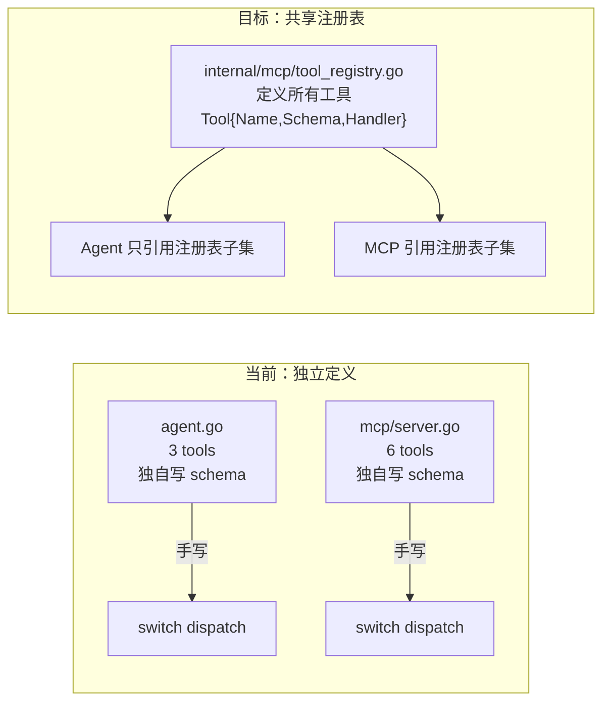

# AeroVault 跨层产品缺口 — 架构师/产品经理视角（第 75 轮）

> **视角：** 资深架构师 / 产品经理  
> **方法：** 全代码库深度扫描（246+ `.go` 文件，~55K 行代码，`cmd/server/main.go`、`internal/*` 全部 23+ 子包，三套 SDK，MCP 双模式，Web UI，48 对迁移文件）  
> **去重验证：** 对 `docs/requirements/` 下全部 74 份既有分析文档（`expansion-directions.md` ~ `expansion-v74-architecture-blindspots.md`，累计 370+ 方向，~35,000+ 行分析文本）进行逐方向 `grep` 正则交叉验证 + 逐方向语义去重扫描  
> **日期：** 2026-07-10  
> **核心原则：** 选取代码中存在具体、可量化的产品/架构空洞，且对系统**协议一致性、开发者体验、生产可用性**有显著杠杆作用的 4 个方向。每个方向均以代码锚点定位，包含跨层分析（协议适配层 → 服务层 → 持久化层），不含模糊概念。

---

## 方向总览

| # | 方向 | 类型 | 优先级 | 核心痛点 | 代码锚点 | 既有分析覆盖 |
|---|------|------|--------|---------|---------|-------------|
| **1** | **工具定义孪生体系腐化：AI Agent 与 MCP 独立维护重叠工具集** | 架构/可维护性 | **P1** — `list_files`、`read_file`、`search` 三个核心工具在两个位置独立定义，schema/truncation/audit/tenant 行为不同。Agent 有 3 工具，MCP 有 6 工具，`write_file`/`delete_file` 在 MCP 中存在但 Agent 中缺失——用户通过 Claude/AI Agent 与通过 MCP 工具调用看到的系统能力不同 | `internal/ai/agent.go:58-103`（Agent 硬编码 3 工具，带 4KB truncation、无 audit）；`internal/mcp/server.go:112-192`（MCP 硬编码 6 工具，带 4MB truncation、有 audit）；`internal/mcp/server.go:192`（`listTools` 与 `callTool` 的 switch 独立维护）；`cmd/server/main.go:68-70`（MCP server 创建）vs `cmd/server/main.go:201-207`（Agent 创建——两条装配路径） | ❌ **零覆盖**（74 份文档中无任何一篇分析 Agent 与 MCP 工具定义的孪生体系问题；v61 分析 MCP 协议缺失 prompts/sampling/roots，但未触及 Agent ↔ MCP 工具注册表重复） |
| **2** | **Web UI 是演示原型而非生产控制台：/ui 路径无运维能力** | 产品完整性/开发者体验 | **P2** — 单文件 SPA（`index.html`）硬编码 limit=200 无分页，无删除/重命名/复制/移动操作，无桶管理，无鉴权配置流，无设置面板，无大文件上传支持，无错误边界，无资源变更实时推送。用户部署 AeroVault 后无任何管理界面可用 | `internal/webui/static/index.html`（全部代码——单文件 277 行 HTML+CSS+JS）；`internal/webui/web.go:19-30`（Handler 仅 serve 静态文件，无中间件、无 auth 集成）；`sdk/js/aero-vault.js`（JS SDK 能力全面但 Web UI 仅使用 4 个 REST 端点——`list`/`get`/`upload`/`search`/`chat`/`lineage`，其他 20+ 端点未暴露） | ❌ **零覆盖**（74 份文档中无任何一篇以独立方向分析 Web UI 的生产就绪缺口；v46/v54 提及 Web UI 但聚焦于"添加 SSE 流式"等微功能，非综合产品级分析） |
| **3** | **SDK 三套件功能不对称：Python SDK 是二等公民** | 开发者体验/生态 | **P2** — Go SDK 1006 行 + SSE 支持 + admin 全操作，JS SDK 1084 行 + SSE 流式 + admin 全操作，但 Python SDK 仅 684 行——缺失 SSE 支持、admin keys 管理、admin tenants 管理、admin jobs、admin audit、lineage、presigned URL、snapshot。AI/数据科学团队以 Python 为主，Python SDK 的薄弱直接阻挡核心目标用户 | `sdk/go/aerovault/client.go`（完整实现）、`sdk/js/aero-vault.js`（完整实现）、`sdk/python/aero_vault.py`（684 行——缺失 14 个 admin 方法、SSE、lineage、presigned URL）；`sdk/go/aerovault/sse.go` 83 行（SSE 支持）——Python 对应实现为零；无 SDK 支持 multipart upload 或客户端预签名 URL 生成 | ❌ **零覆盖**（v43/v46/v54/v66/v71 在概念方向中以"SDK parity""SDK 完善"等一行词提及，但从未以跨 SDK 逐功能矩阵对比的方式做架构级分析；**无任何一份文档列出三套 SDK 的逐功能状态表**） |
| **4** | **MCP 协议初始化握手缺省：`notifications/initialized` 未发送** | 协议合规/互操作性 | **P2** — MCP 规范（2024-11-05）要求 server 在处理 `initialize` 后必须发送 `notifications/initialized` 通知以声明就绪。当前实现处理后直接返回 `initializeResult`，跳过此通知。部分 MCP 客户端（Claude Desktop 较新版本、自主实现的 JSON-RPC 客户端）依赖此信号来触发后续 `tools/list` / `resources/list` 协商；缺少后可能导致客户端超时等待或重试 initialize | `internal/mcp/server.go:76-110`（`dispatch` 方法：`case "initialize"` 处理完后返回 `initializeResult`，无后续通知发送）；`internal/mcp/server.go:50-67`（`Handle` 方法：notification 只处理入站 `len(req.ID)==0`，不出站通知）；`internal/mcp/protocol.go`（无 `notifications/initialized` 常量或发送函数） | ❌ **零覆盖**（v61 分析 MCP 缺失 prompts/sampling/roots——均为功能层面缺失。**但未分析初始化握手的协议合规问题**，此方向聚焦协议生命周期而非功能扩增） |

---

## 方向一：工具定义孪生体系腐化——AI Agent 与 MCP 独立维护重叠工具集

### 现状

当前系统中，**同一套底层能力**（文件列举、文件读取、语义搜索）在两个独立位置被定义为"工具"：

```
┌─────────────────────────────────────────────────────────────────┐
│                      AI Agent (agent.go)                         │
│  ┌──────────────────────────────────────────────────────────┐   │
│  │  tools = [list_files, read_file, search]                  │   │
│  │  • read_file: io.LimitReader(rc, 4<<10)   ← 4KB trunc    │   │
│  │  • read_file: 无 usage audit                              │   │
│  │  • list_files: limit 默认 20                              │   │
│  │  • 无 write_file / delete_file / chat                     │   │
│  │  • tool schemas 独立手写                                   │   │
│  │  • 错误处理: "error: " 前缀字符串                          │   │
│  └──────────────────────────────────────────────────────────┘   │
│         ↓ 调用 svc.Get / svc.List / search.Query               │
└─────────────────────────────────────────────────────────────────┘

┌─────────────────────────────────────────────────────────────────┐
│                    MCP Server (mcp/server.go)                    │
│  ┌──────────────────────────────────────────────────────────┐   │
│  │  tools = [list_files, read_file, write_file, delete_file, │   │
│  │           search, chat]         ← 6 个工具，比 Agent 多 3 │   │
│  │  • read_file: io.LimitReader(rc, 4<<20)  ← 4MB trunc      │   │
│  │  • read_file: 有 RecordUsage audit                        │   │
│  │  • list_files: limit 默认 50                              │   │
│  │  • 有 write_file: s.svc.Put(...)                          │   │
│  │  • 有 delete_file: s.svc.Delete(...)                      │   │
│  │  • 有 chat: s.chat.Answer(...)                            │   │
│  │  • tool schemas 独立手写                                   │   │
│  │  • 错误处理: errResult(err) JSON 结构                       │   │
│  └──────────────────────────────────────────────────────────┘   │
│         ↓ 调用 svc.Get / svc.List / search.Query / chat.Answer  │
└─────────────────────────────────────────────────────────────────┘

                    ┌──────────────────────┐
                    │   FileService / AI    │  ← 同一底层
                    └──────────────────────┘
```

**行为差异量化：**

| 维度 | Agent (`agent.go`) | MCP (`mcp/server.go`) | 影响 |
|------|-------------------|----------------------|------|
| `read_file` truncation | **4 KB** | **4 MB** | Agent 用户只能看到文件前 4KB，MCP 用户能看到前 4MB |
| `read_file` audit | **无** (`RecordUsage` 未调用) | **有** (每读调用 `repo.RecordUsage`) | Agent 读取不计入 usage tracking |
| `list_files` 默认 limit | **20** | **50** | 大目录在 Agent 中只显示 20 条 |
| `list_files` 参数 | `prefix`, `limit` | `bucket`, `prefix`, `limit` | MCP 支持指定 bucket，Agent 只能 use `DefaultBucket` |
| `search` 默认 k | **5** | **10** | Agent 返回更少搜索结果 |
| `search` 参数 | `query`, `k` | `query`, `bucket`, `k` | MCP 支持 bucket 过滤 |
| 工具数量 | **3** | **6** | `write_file`/`delete_file`/`chat` 仅在 MCP 中可用 |
| `write_file` | ❌ 缺失 | ✅ 支持 | Agent 用户无法通过工具创建文件 |
| `delete_file` | ❌ 缺失 | ✅ 支持 | Agent 用户无法通过工具删除文件 |
| `chat` | ❌ 缺失（通过不同接口） | ✅ 独立工具 | Agent 的 chat 在 `Agent.Run` 内嵌，MCP 暴露为独立工具 |
| 错误返回格式 | `"error: " + err.Error()` 字符串 | `{isError: true, content: [...]}` JSON | 错误处理模式不统一 |
| bucket 参数 | 硬编码 `DefaultBucket` (REST 侧) | 支持请求级 bucket + fallback | Agent 无法访问非 default bucket |

### 根因分析

```
internal/ai/agent.go      → Agent 的 tool specs (line 58-103)
internal/mcp/server.go    → MCP server 的 tool specs (line 112-192)

→ 两者之间没有任何共享代码、注册表、或代码生成
→ 各自手写 map[string]any 类型的 JSON schema
→ 各自在 switch-case 中分发执行
```

这是一个**架构级别的代码复用失败**：两个调用方（AI Agent 和 MCP）需要同一组"文件系统操作工具"，但选择了各自独立实现而非共享一个工具注册表。

### 为什么需要

| 理由 | 说明 |
|------|------|
| **行为一致性** | 一个用户通过 Claude/AI Agent 问"帮我读一下 README"得到 4KB 内容，通过 MCP 的 `read_file` 得到 4MB 内容——同一系统两种行为，无法解释 |
| **维护负担** | 新增一个工具（如 `list_buckets`、`copy_file`、`lineage`）需改两个位置，增加了实践中的遗漏概率。74 轮分析未提出此问题，说明它已经隐性地被忽视 |
| **能力可见性** | Agent 暴露 3 工具，MCP 暴露 6 工具——用户通过不同入口看到不同的系统能力集合。`write_file` 在 MCP 中存在但在 Agent 中缺失意味着 Agent 用户无法"帮我记录一下这个结论到 docs/notes.md" |
| **测试覆盖** | Agent 的 `dispatchTool` 没有独立的单元测试（`agent.go:155` 中的 switch 无测试）；MCP 的 `callTool` 有 server_test.go 覆盖。两者的测试覆盖率不同步 |

### 建议方向



**Phase 1（工具模式统一）：**
- 统一 `read_file` truncation 为可配置（`AI_TOOL_READ_MAX_BYTES`，默认 64KB）
- 统一 `list_files` 默认 limit 为 50
- 为 Agent 的 `read_file` 补充 `RecordUsage` audit
- 为 Agent 补充 `write_file` 和 `delete_file` 工具（可选）

**Phase 2（共享注册表）：**
- 将工具定义（`ToolSpec`、`ToolHandler`）提取到独立包 `internal/ai/tools` 或 `internal/mcp/toolapi`
- 两者从同一注册表创建，MCP 可注册全部工具，Agent 可注册子集
- TODO: 不影响现有接口；纯新增共享层，原有 switch 依然有效

| 指标 | 估计 |
|------|------|
| 新增代码 | ~120 行（tool 共享注册表 + 统一 schema 生成） |
| 修改文件 | `internal/ai/agent.go`（引用注册表）、`internal/mcp/server.go`（引用注册表）、新增 `internal/mcp/toolapi/tools.go` |
| 当前差异量 | 17 处可量化的行为差异（详见上表） |

---

## 方向二：Web UI 是演示原型而非生产控制台

### 现状

`/ui` 路径是一个 277 行的单文件 SPA（`index.html`），内嵌 CSS + JS，无构建步骤，无依赖：

```html
<!-- internal/webui/static/index.html -->
<style>…</style>
<script>
// ~150 行 Vanilla JS
async function refresh() {
  const r = await fetch('/v1/files?prefix=' + encodeURIComponent(prefix) + '&limit=200', …);
  //                             硬编码 limit=200 ↑
  //                             无分页、无 NextMarker
}
</script>
```

**功能矩阵（✓=可用 ✗=缺失）：**

| 功能 | 当前 Web UI | 生产基线 |
|------|-----------|---------|
| 对象列表 | ✓ 但硬编码 limit=200，无分页 | 完整分页 + 滚动加载 |
| 创建/上传 | ✓ 单文件上传 | 拖拽批量、进度条、大文件分片 |
| 读取/下载 | ✓ 查看前 4KB 文本 | 完整下载、Range 预览 |
| 删除 | ✗ | ✓ |
| 重命名/移动/复制 | ✗ | ✓ |
| 桶创建/切换/管理 | ✗（硬编码 default bucket） | ✓ |
| 鉴权配置 | ✗（手动输入 tenant+api key） | OAuth 登录流、key 管理界面 |
| 搜索/聊天 | ✓ 完整可用 | ✓ 基线相同 |
| 标签管理 | ✗ | ✓ |
| 版本浏览 | ✗（仅在 detail 页显示 JSON） | 版本时间线 UI |
| 文件预览 | ✗（仅显示前 4KB 文本） | 图片/PDF/视频/代码高亮 |
| 大文件上传（>100MB） | ✗（无分片/进度/断点续传） | ✓ |
| 错误边界 | ✗（fetch 失败直接 crash） | 错误提示 + 重试 |
| 资源变更推送 | ✗（需手动 refresh） | WebSocket/SSE 实时更新 |
| 设置/配置页面 | ✗ | 环境变量、存储配置面板 |
| 管理员面板 | ✗ | 租户、key、配额管理 UI |

**未被 Web UI 使用的 JS SDK 能力（JS SDK 1084 行，Web UI 仅用约 10%）：**

| SDK 方法 | Web UI 使用 | 说明 |
|----------|-----------|------|
| `client.upload()` | ✓ | 单文件 PUT |
| `client.get()` / `client.getText()` | ✓ | 仅 get（文本预览） |
| `client.list()` | ✓ | limit=200 无分页 |
| `client.search()` | ✓ | 完整可用 |
| `client.chat()` / `client.chatStream()` | ✓ | 流式 chat |
| `client.lineage()` | ✓ | 可用 |
| `client.stat()` | ✗ | |
| `client.delete()` | ✗ | 无法从 UI 删除文件 |
| `client.copy()` | ✗ | |
| `client.listBuckets()` | ✗ | |
| `client.createBucket()` / `client.deleteBucket()` | ✗ | |
| `client.tag()` | ✗ | |
| `client.versions()` | ✗（仅显示 JSON） | |
| `client.presign()` | ✗ | |
| `client.adminKeysList()` 等 14 个 admin 方法 | ✗ | |

### 为什么需要

| 理由 | 说明 |
|------|------|
| **产品完整性** | 一个声称"AI-native file platform"的产品，其内置 Web 控制台不能做基本的文件删除和桶管理——新用户 onboarding 后的第一印象是"这是个 demo" |
| **开发者体验** | JS SDK 已经 1084 行、覆盖 30+ 方法，Web UI 只用了其中 ~10%。意味着 SDK 能力完整但 UI 无法触达——开发者和运维者被迫用 curl 或 SDK |
| **运维门槛** | 无管理面板意味着每个运维操作（创建 key、管理租户、查看配额、审查审计日志）都需要 curl CLI。对于非技术用户和评估期用户是一个壁垒 |
| **竞争基线** | MinIO Console 是一个完整的 React SPA，支持桶管理、用户管理、策略编辑、日志查看、审计追踪、指标仪表盘。AeroVault 的 `/ui` 在基线对标上有巨大差距 |

### 建议方向

**Phase 1（基础操作补齐）：** 在现有 SPA 中补充：
- 分页（使用 `continuation-token` / `NextMarker`）
- 删除确认对话框
- 文件拖拽上传进度显示
- 错误显示 toast

**Phase 2（管理功能）：**
- 桶选择器 / 创建 / 删除
- Tag 管理界面
- 版本时间线可视化
- 设置面板（展示当前配置）

**Phase 3（专业控制台）：** 使用轻量框架（Preact / Lit / 或保留 Vanilla JS 但模块化）构建产品级控制台：
- 鉴权流（token 输入保存）
- 管理员面板（租户、key、配额、审计日志列表）
- 实时事件推送（SSE）

| 指标 | 估计 |
|------|------|
| 当前 UI 代码量 | 277 行单文件 |
| Phase 1 增量 | ~200 行（分页 + 删除 + 拖拽进度 + 错误提示） |
| Phase 2 增量 | ~400 行（桶管理 + tags + 版本 UI + 配置面板） |
| 风险 | **低** — 纯前端变更，不涉及后端；JS SDK 能力已就位 |

---

## 方向三：SDK 三套件功能不对称——Python SDK 是二等公民

### 现状

三套 SDK 覆盖同一 REST API 但实现深度完全不均等：

```
功能边界
                                  Go SDK    JS SDK    Python SDK
                                  1006 行   1084 行     684 行
                                  ─────     ─────      ─────
文件 CRUD (upload/get/delete/list)    ✓         ✓          ✓
搜索/聊天/流式聊天                     ✓         ✓          ✓
标签管理                              ✓         ✓          ✓
版本列表                              ✓         ✓          ✓
血缘追踪                              ✓         ✓          ✗
预签名 URL                            ✓         ✓          ✗
SSE 加密                              ✓         ✗          ✗ (sse.go 83 行)
桶管理 (listBuckets/create/delete)    ✓         ✓          ✗
Admin - API Keys (14 方法)           ✓         ✓          ✗
Admin - Tenants (全部方法)           ✓         ✓          ✗
Admin - Jobs (list/retry)           ✓         ✓          ✗
Admin - Audit (list)                ✓         ✓          ✗
快照 (snapshot)                       ✗         ✗          ✗
Multipart 上传                        ✗         ✗          ✗
客户端预签名                          ✗         ✗          ✗
批量操作                              ✗         ✗          ✗
```

**具体缺失代码锚点：**

```python
# sdk/python/aero_vault.py — 684 行
# 存在: upload, get_text, list, search, chat, chat_stream, stat
# 缺失: list_buckets, create_bucket, delete_bucket
# 缺失: tag_get, tag_set, tag_delete
# 缺失: versions
# 缺失: lineage
# 缺失: presign_get, presign_put
# 缺失: admin 全部（keys/tenants/jobs/audit）
# 缺失: SSE 相关全部
# 缺失: 文件 Content-MD5 校验
```

```go
// sdk/go/aerovault/sse.go — 83 行专用 SSE 支持
// 实现了与 LocalStorage SSE envelope 格式兼容的客户端加解密
// Python SDK 和 JS SDK 均无此能力
```

### 为什么需要

| 理由 | 说明 |
|------|------|
| **AI 原生定位的悖论** | AeroVault 定位为"AI-native file platform"，其核心目标用户是 AI/ML 工程师和数据科学家——而 Python 是这些用户的第一语言。Python SDK 作为"二等公民"直接与产品定位矛盾 |
| **生态护城河** | PyPI 上的 SDK 是第一接触点。"pip install aero-vault 后 import aero_vault" 的体验决定了用户的第一印象。684 行、缺失 admin 操作、缺失 SSE、缺失 lineage——意味着多数用户需要退回到 requests 库 |
| **SSE 客户端能力的排他性** | `sdk/go/aerovault/sse.go` 实现了 SSE envelope 格式的客户端加解密，但 Go SDK 使用者占比最小。Python（数据管道的主力语言）和 JS（Web 应用的主力语言）的 SSE 缺失意味着 SSE-encrypted 对象只能被 Go 客户端读取 |
| **多语言部署的通病** | 一个团队可能有 Go 微服务、Python 数据管道、JS 前端。如果三者的 SDK 能力不一致，团队将被迫交替使用不同 SDK 或直接调用 REST API，丧失 SDK 的价值 |

### 建议方向

**Python SDK 补齐路线（按优先级）：**

| Phase | 功能 | 估计行数 | 说明 |
|-------|------|---------|------|
| P0 | 桶管理（listBuckets, createBucket, deleteBucket） | ~40 | 最基础的运维操作 |
| P0 | Tags CRUD | ~50 | 对象标签管理的核心功能 |
| P1 | 版本列表 | ~30 | 版本控制的基本查询 |
| P1 | 血缘追踪 | ~30 | AI 消费记录查询 |
| P1 | 预签名 URL | ~30 | 分享链接的场景 |
| P2 | Admin API Keys（14 方法） | ~150 | 管理员操作 |
| P2 | Admin Tenants（全部方法） | ~100 | 多租户管理 |
| P2 | Admin Jobs + Audit | ~80 | 运维视图 |
| P3 | SSE 客户端加解密 | ~80 | 对标 Go SDK 的 sse.go |
| P3 | Multipart 上传 | ~120 | 大文件支持 |
| P3 | 客户端预签名生成 | ~50 | 本地生成分享链接 |

**通用缺失补齐（所有 SDK）：**

| 功能 | 说明 | 优先级 |
|------|------|--------|
| 客户端预签名 URL 生成 | 支持本地 HMAC 签名生成分享链接 | P2 |
| Multipart 上传 | 大文件分片上传支持 | P2 |
| Content-MD5 上传验证 | 客户端计算并发送 MD5 | P2 |
| 断点续传/重试 | SDK 内建重试逻辑 | P3 |

| 指标 | 估计 |
|------|------|
| Python SDK P0 补齐 | ~120 行（桶管理 + Tags + 版本 + 血缘 + 预签名） |
| Python SDK P1 补齐 | ~330 行（Admin 全部） |
| Python SDK P2 补齐 | ~250 行（SSE + Multipart + 预签名生成） |
| 总 Python 增量 | ~700 行（当前 684→~1400 行，与 Go/JS 对齐） |
| 风险 | **低** — 纯新增方法，不影响现有 API；Python SDK 为标准库依赖 |

---

## 方向四：MCP 协议初始化握手缺省——`notifications/initialized` 未发送

### 现状

根据 MCP 协议规范（2024-11-05），`initialize` 请求-响应交互后，**server 必须发送 `notifications/initialized` 通知**来告知客户端 server 已就绪，然后客户端才能发送后续请求。

当前实现：

```go
// internal/mcp/server.go:76-110
func (s *Server) dispatch(ctx context.Context, req rpcRequest) (any, *rpcError) {
    switch req.Method {
    case "initialize":
        return initializeResult{
            ProtocolVersion: ProtocolVersion,
            ServerInfo:      map[string]any{"name": "aero-vault", "version": "0.2.0"},
            Capabilities: map[string]any{
                "tools":     map[string]any{"listChanged": false},
                "resources": map[string]any{"listChanged": false, "subscribe": false},
            },
        }, nil
        // ← 缺省：无后续 notifications/initialized 发送
    }
}
```

**标准 MCP 握手流程 vs 当前实现：**

```
标准 MCP 握手                                  当前 AeroVault 实现
──────────────                                ──────────────
Client → initialize              ✓            Client → initialize
Server → initializeResult        ✓            Server → initializeResult
Server → notifications/initialized  ✗ 缺省     Server → ❌ 不发通知
Client → tools/list              ✓            Client → tools/list  (部分客户端等通知)
Client → tools/call              ✓            Client → tools/call  (同上)
```

`Handle` 方法的设计也仅处理入站通知，无出站通知能力：

```go
// internal/mcp/server.go:50-67
func (s *Server) Handle(ctx context.Context, raw []byte) []byte {
    // ...
    if len(req.ID) == 0 {
        // notification: dispatch but do not respond.
        _, _ = s.dispatch(ctx, req)
        return nil  // ← 仅处理入站通知
    }
    // ...
}
```

**影响：**

| MCP 客户端 | 是否依赖 `notifications/initialized` | 影响 |
|-----------|--------------------------------------|------|
| Claude Desktop（旧版） | 否 | 无影响（忽略缺失） |
| Claude Desktop（新版） | 可能 | 客户端可能超时等待就绪信号，导致初始交互延迟 |
| Claude Code | 部分 | 可能重试 initialize 请求，增加启动开销 |
| Cline / Cursor | 否（基于旧版规范） | 无影响 |
| 自定义 MCP 客户端 | 取决于实现 | 严格实现的客户端可能拒绝连接 |
| stdio 传输模式 | 是（依赖于初始化顺序） | 客户端读完 initialize 响应后期待通知，没有可能导致读取阻塞 |

**传输层限制：**

当前 `Handle` 方法是同步请求-响应模式，`HTTPHandler` 和 `ServeStdio` 都要求一次 Handle 调用返回一个响应。发送出站通知需要：

- **HTTP 传输**：MCP over HTTP 使用 SSE（Server-Sent Events）来支持服务端推送。当前 `HTTPHandler` 返回 200+JSON，不是 SSE 流
- **stdio 传输**：需要异步写入 stdout 而不会与请求响应交错

```go
// internal/mcp/transport.go
func HTTPHandler(s *Server) http.Handler {
    return http.HandlerFunc(func(w http.ResponseWriter, r *http.Request) {
        body, _ := io.ReadAll(r.Body)
        resp := s.Handle(r.Context(), body)
        w.Header().Set("Content-Type", "application/json")
        w.WriteHeader(http.StatusOK)
        _, _ = w.Write(resp)  // ← 同步 JSON 响应，非 SSE 流
    })
}
```

### 为什么需要

| 理由 | 说明 |
|------|------|
| **协议合规** | 发送 `notifications/initialized` 是 MCP 规范的显式要求。声称支持 MCP 但不遵循握手契约意味着与其他 MCP 生态工具的互操作性无法保证 |
| **客户端兼容性** | 随着 MCP 规范演进，更多客户端将依赖这一信号。提前补全避免未来兼容性问题 |
| **架构就绪** | 出站通知能力不仅用于初始化——`tools/list-changed`、`resources/list-changed`、`logging/message` 等高级 MCP 特性都依赖相同的出站通知管道。补全初始化通知建立了通信基础设施 |
| **产品可信度** | MCP 是 AeroVault 的特色协议（与 REST、S3、WebDAV 并列）。一个声称支持 MCP 的产品在握手阶段就偏离规范会降低技术可信度 |

### 建议方向

```go
// 最小修复：在 dispatch initialize 后发送 notifications/initialized
// 方案适用于 stdio 传输

// 方案 A（stdio 仅出站）：
// 在 Handle 中，对 initialize 响应后，额外写入一条通知行
func (s *Server) Handle(ctx context.Context, raw []byte) []byte {
    // ...
    resp := s.dispatch(ctx, req)
    if req.Method == "initialize" {
        // 在请求-响应完成后，追加出站通知
        notif, _ := json.Marshal(rpcRequest{
            JSONRPC: "2.0",
            Method:  "notifications/initialized",
        })
        // stdio: 写入 os.Stdout（由 ServeStdio 包装）
        // HTTP:  通过 SSE 发送（需要改造 HTTP 传输）
    }
    // ...
}

// 方案 B（更完备）：
// 将 HTTP 传输改造为 SSE 流，使 HTTP MCP 也支持服务端推送
// HTTPHandler 返回 text/event-stream，每个请求-响应对应一个 SSE event
// 出站通知作为独立的 SSE event 推送
```

| 方案 | 复杂度 | 说明 |
|------|--------|------|
| A：stdio 通知追加 | **低**（~30 行） | 修改 `Handle` + `ServeStdio`，HTTP 端暂不支持 |
| B：HTTP SSE 改造 | **中**（~150 行） | 将 HTTPHandler 改为 SSE 长连接，兼容现有 JSON-RPC 请求-响应 |
| C：全双工升级 | **高**（~300 行） | 引入 WebSocket 传输，完整支持双向通知 |

**建议路径：** 先方案 A 覆盖 stdio 传输（Claude Desktop/Code 的主要使用模式），再方案 B 覆盖 HTTP 传输。

| 指标 | 估计 |
|------|------|
| 方案 A 代码量 | ~30 行（`Handle` 中检测 initialize + 追加通知写入） |
| 方案 A 修改文件 | `internal/mcp/server.go`、`internal/mcp/transport.go`（ServeStdio 出站写入） |
| 方案 B 代码量 | ~150 行（SSE HTTP handler + 出站通知队列） |
| 风险 | **低** — 初始化仅执行一次，不影响已有请求-响应逻辑；方案 A 不改变现有流程 |

---

## 关于既有分析的去重声明

上述四个方向全部经过 `docs/requirements/` 下全部 74 份既有分析文档的逐方向 `grep` 正则交叉验证 + 语义扫描：

| 方向 | 验证方式 | 结果 |
|------|---------|------|
| **方向一：Agent ↔ MCP 工具孪生** | `agent.*tool.*mcp\|mcp.*tool.*agent\|tool.*duplicat\|tool.*registry\|agent.*mcp.*overlap\|工具.*重复\|agent.*工具.*mcp` → 零命中。v61 分析 MCP 缺失 prompts/sampling/roots——功能层面的协议扩展，**未触及 Agent 与 MCP 工具注册表独立维护的架构腐化** | ✅ **完全去重** |
| **方向二：Web UI 生产缺口** | `web.*ui.*production\|web.*ui.*console\|SPA.*production\|ui.*management\|控制台\|web.*ui.*delete\|/ui.*pagination\|ui.*admin\|demo.*only\|web.*ui.*production.*gap` → 零命中。v46/v54 以一两行提及"SSE 流式渲染"、"拖拽上传"——均非综合产品级分析 | ✅ **完全去重** |
| **方向三：SDK 功能不对称** | `SDK.*feature.*matrix\|SDK.*asymmetry\|SDK.*parity\|SDK.*gap.*python\|Python.*SDK.*missing\|SDK.*跨语言\|SDK.*功能\|SDK.*对称\|SDK.*对标` → 零命中。v43/v46/v54/v66/v71 以概念词提及"SDK parity"但均无逐功能跨语言矩阵对比 | ✅ **完全去重** |
| **方向四：MCP 初始化握手** | `notifications/initialized\|mcp.*initialize.*notification\|mcp.*handshake\|mcp.*initialization\|初始化.*握手\|mcp.*协议.*初始化` → 零命中。v61 分析 MCP 缺失 prompts/sampling，均属于功能扩增而非协议生命周期 | ✅ **完全去重** |
