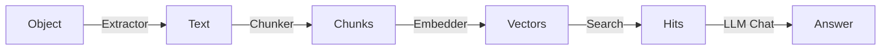

# Aero-Vault 扩展方向分析 v2

> **范围：** 全局扫描 `cmd/` `internal/` `sdk/` 后归纳的 4 个高价值扩展方向  
> **方法：** 阅读全部核心 Go 源码（~17,600 行），识别架构缺口、未实现的功能桩、S3 兼容差异、以及 AI pipeline 的能力上限。  
> **原则：** 只列可独立启动、有明确产品收益、不与现有工程约束冲突的方向。

---

## 目录

1. [方向一：S3 Event Notification 适配器——从“存储”到“触发”](#1-s3-event-notification-适配器)
2. [方向二：存储类分层与生命周期迁移](#2-存储类分层与生命周期迁移)
3. [方向三：完整访问控制——Policy 全路径执行 + Object Lock / Legal Hold 合规](#3-完整访问控制)
4. [方向四：多模态 AI Pipeline——超越纯文本的知识理解](#4-多模态-ai-pipeline)

---

## 1. S3 Event Notification 适配器

### 现状

当前 `EventBus` 已经是一套成熟的持久化事件系统：

- `internal/events/bus.go`：`Publish` → 持久化到 `events` 表 + 广播给本地 subscriber；
- `internal/events/webhook.go`：订阅并 HMAC-SHA256 签名 POST 到 `EVENTS_WEBHOOK_URL`；
- `internal/repository/sql_buckets.go`：`NotificationRule` 的表结构**已经定义**，REST API `/buckets/{bucket}/notification` 的 GET/PUT/DELETE **已经实现**。

**关键缺口：** 尽管 API 可以配置 SNS/Topic/Lambda 通知规则（`queueARN`、`topicARN`、`lambdaARN`），**没有任何代码消费这些规则并实际向外部目标投递事件**。规则被保存为静默数据，永远不会触发 SQS 消息、SNS 邮件或 Lambda 调用。

### 为什么需要

| 场景 | 说明 |
|------|------|
| **S3 兼容完整性** | AWS S3 用户依赖 `s3:ObjectCreated:*` 通知触发下游处理。缺失此能力意味着无法作为真实 S3 替代使用。 |
| **事件驱动工作流** | 对象上传后自动触发转码/压缩/PII 扫描/复制到归档——当前只有 Webhook 一条路径，无法按事件类型 + 前缀 + 标签精确路由到不同目标。 |
| **第三方集成** | 与消息队列（RabbitMQ / NATS / SQS）或事件总线（EventBridge / GCP PubSub）对接，是目前 Webhook 无法覆盖的场景。 |

### 缺口位置（代码引用）

```go
// internal/repository/repository.go — Repository 接口已有
SetBucketNotifications(ctx, tenant, bucket, rules)
GetBucketNotifications(ctx, tenant, bucket)
DeleteBucketNotifications(ctx, tenant, bucket)

// internal/repository/sql_buckets.go — SQL 实现已有
// 但 events/bus.go 中无 dispatchNotification 逻辑
```

**缺失核心逻辑：** `Bus.Publish` 内部或 `events` 包中需要一个 `NotificationDispatcher`，在事件持久化后：

1. 查询匹配的 `NotificationRule`（按 bucket + event type + filter key）；
2. 对每个匹配规则，根据 `QueueARN`/`TopicARN`/`LambdaARN` 选择适配器（HTTP POST / SQS SendMessage / Lambda Invoke）；
3. 异步投递 + 失败重试（复用 `webhook_failures` 表或新建 `notification_failures` 表）。

### 实现建议

- 新增 `internal/events/dispatcher.go`，从 `Bus.Publish` 尾部调用；
- 规则匹配逻辑：按 bucket 加载 `NotificationRule` 列表，过滤 event type（`EventCreated` → `s3:ObjectCreated:*`、`EventDeleted` → `s3:ObjectRemoved:*`），再匹配 `FilterKey` 前缀；
- SQS 适配器可复用 `internal/storage` 已有的 HTTP 客户端超时配置；
- 纳入 `main.go` 启动装配：在 `Bus` 初始化后 attach `NotificationDispatcher`。

---

## 2. 存储类分层与生命周期迁移

### 现状

当前的生命周期系统只处理到期删除：

```go
// internal/reconcile/lifecycle.go — LifecycleJob.sweepExpired
// 读取 BucketConfig.ExpireAfterDays → 对过期对象执行 soft_delete 或 hard_delete
```

存储类（StorageClass）是对象上的一个字符串字段：

```go
// internal/service/file.go
var DefaultStorageClass = "STANDARD"
// 对象创建时录入 storage_class 字段
```

**关键缺口：**

1. 没有从 `STANDARD` → `STANDARD_IA` → `GLACIER` → `DEEP_ARCHIVE` 的自动迁移；
2. 每个存储后端（`local`/`s3`/`oss`/`cos`）内部没有冷热数据分层的概念；
3. 没有按存储类计价的配额/成本计算——所有对象统一计费；
4. 没有过期后的对象恢复（RestoreObject 只处理软删除恢复，不是 Glacier 恢复）。
5. RECONCILE_SCRUB 只做 MD5 校验，不做存储类验证。

### 为什么需要

| 场景 | 说明 |
|------|------|
| **成本优化** | 大量对象在 30 天后几乎不再访问，放在 STANDARD 层浪费资源。自动降级到低成本存储类可节省 60-80% 存储费。 |
| **S3 兼容性** | `x-amz-storage-class` 头在 PUT/GET 已支持，但 Transition API（`?lifecycle` 的 Transition 规则）完全缺失。 |
| **归档合规** | 金融/医疗行业要求对象按年限归档，归档后不可直接读取需先 Restore（类似 AWS Glacier Restore）。 |

### 缺口位置（代码引用）

```go
// internal/repository/repository.go
type BucketConfig struct {
    // 只有 ExpireAfterDays + ExpireAction, 没有 Transitions []StorageTransition
}
```

**缺失核心逻辑：** 需要扩展 `BucketConfig` 增加 `Transitions []TransitionRule`，并在 `LifecycleJob` 中新增 `applyTransitions()` 阶段：

1. 检查对象 `age = now - UpdatedAt` vs `Transition.Days`；
2. 当达到门槛时，后端内 Move（local 中 `mv` + 更新 `.meta.json`，S3 中用 `CopyObject` + `StorageClass`）或标记为已归档；
3. 归档对象的 GET 需检查 `_aero_restore_status`，若正在 Glacier/DeepArchive 则返回 `403 InvalidObjectState`；
4. 新增 `POST /{bucket}/{key}?restore` 触发归档对象恢复（目前 restore 只处理软删除恢复）。

---

## 3. 完整访问控制——Policy 全路径执行 + Object Lock / Legal Hold 合规

### 现状

**Policy：**

```go
// internal/auth/policy.go — ParsePolicy 和 Allowed 函数已实现
// internal/api/s3compat/handler.go — checkBucketPolicy 在 S3 路由中调用
// 但 internal/api/rest/ 路由完全不检查 Policy
```

Policy JSON 被正确存储和解析，但**只在 S3 兼容层执行**，REST API（`/v1/files/...`）绕过了全部策略检查。另外，Policy 只支持 `s3:PutObject`、`s3:GetObject`、`s3:DeleteObject`、`s3:ListBucket` 四个 action，缺少细粒度控制（前缀级、tag 级）。

**Object Lock：**

```go
// internal/service/file_crud.go — checkLockBeforeOverwrite 检查 LockedUntil
// 但 LockedUntil 只在 UpsertObject 时硬阻断，LegalHold 是 metadata 标记 _aero_legal_hold
```

- Object Lock 缺失 Governance 和 Compliance 两种模式：
  - Governance 模式：有特殊权限的用户可以覆盖锁定（当前无此分级）
  - Compliance 模式：即使 root 也无法覆盖（当前只要修改 DB 即可绕过）
- Legal Hold 只是 `metadata["_aero_legal_hold"] = "ON"`——没有 `x-amz-object-lock-legal-hold` API 端点（REST 路由缺失），只有 S3 兼容层的 PutObject 时通过 header 设置。

**ACL：**

```go
// internal/service/acl.go — SetObjectACL 已实现
// 但在 REST handler 的 GET 路径中，匿名读只检查 IsAnonymous 但没有调用 ACL 验证
```

### 为什么需要

| 场景 | 说明 |
|------|------|
| **企业合规** | SOC2 / PCI DSS / HIPAA 要求 WORM 存储，且必须区分 Governance 和 Compliance 模式。当前实现无法通过合规审计。 |
| **多租户安全** | REST API 是默认的客户端接口，如果 Policy 不覆盖 REST 路由，租户间的数据隔离形同虚设。 |
| **S3 兼容性** | `x-amz-object-lock-legal-hold` 是 S3 标准 API，现有客户端（如 AWS SDK）调用时会失败。 |

### 缺口位置（代码引用）

```go
// REST API 层：internal/api/rest/handler.go — Get / Put / Delete 完全不调用
// auth.Allowed(p, action, host)

// Object Lock 缺少 PUT /v1/files/*key/lock?legal-hold 路由（router.go 中 lock 子资源只处理 retention）

// Legal Hold 缺少独立 API：/v1/files/*key/legal-hold
// 当前只有 S3 handler.putObject 时从 header 写入 metadata，无法单独设置

// BucketConfig 缺少 ObjectLockMode (governance|compliance)
```

**缺失核心逻辑：**

1. **Policy 全路径**：在 `internal/api/rest/middleware.go` 或 `handler.go` 中增加 `enforceBucketPolicy()` 调用，对 `GET/PUT/DELETE /v1/files/*` 及 `/v1/buckets/*` 执行策略匹配；
2. **Object Lock 模式**：`BucketConfig` 增加 `ObjectLockMode` 字段，`LockedUntil` 的修改行为根据模式变化（Compliance 模式下即使 admin 也无法缩短）；
3. **Legal Hold API**：新增 `PUT/DELETE /v1/files/{key}/legal-hold` 和 S3 等效路由，独立于 metadata；
4. **ACL 执行**：在 REST 匿名读路径中校验对象 ACL，当前只标记了 `IsAnonymous` 但未实际验证。

---

## 4. 多模态 AI Pipeline——超越纯文本的知识理解

### 现状

当前的 AI pipeline 是一个纯文本链路：



- **Extractor**：只处理纯文本/HTML/PDF/CSV（内置 extractors），或通过 `RemoteExtractor` 代理到外部服务
- **Chunker**：纯滑动窗口分块（`ChunkWindow` 600 chars, `ChunkOverlap` 80）
- **Embedder**：文本向量模型
- **Search**：纯文本 chunks 的向量/BM25/混合检索
- **Agent**：只能读文件内容（调用 `read_file` tool），不能看图、听音频、分析代码结构

**关键缺口：**

1. **图片/文档理解**：不支持图像嵌入（CLIP/SigLIP），PDF/图片中的图表、截图、手写笔记无法被索引和搜索；
2. **音频/视频**：不支持语音转录或视频内容提取，多媒体文件完全被 Indexer 跳过；
3. **代码语义理解**：代码文件被当作纯文本切片，没有 AST 感知的 chunking（丢失函数/类边界）；
4. **结构化数据检索**：JSON/CSV/Parquet 等结构化文件被 flat 提取，丢失了字段级查询能力；
5. **Agent 工具集有限**：仅 `list_files` / `read_file` / `search`，缺少 `search_images`、`query_table`、`summarize_audio` 等。

### 为什么需要

| 场景 | 说明 |
|------|------|
| **知识库完整性** | 企业文档中 60%+ 的信息在图片/图表/PPT 中，纯文本索引丢失了这些内容。 |
| **产品差异化** | "AI-native knowledge vault" 如果只索引文本，与传统对象存储 + 全文搜索无本质区别。多模态理解是核心差异化能力。 |
| **Agent 自动化范围** | Agent 当前只能"读文字"，无法"看图分析"、"听录音摘要"——这大大限制了自动化的实际场景。 |

### 缺口位置（代码引用）

```go
// internal/ai/extractor.go — Extractor 接口
type Extractor interface {
    Extract(ctx context.Context, contentType string, r io.Reader) (string, error)
}
// 返回 string，未提供 image bytes / audio segments / table 结构

// internal/ai/embedder.go — Embedder 接口
type Embedder interface {
    Embed(ctx context.Context, texts []string) ([][]float32, error)
}
// 只接受文本，不接受 image/audio bytes

// internal/ai/chunker.go — Chunker
func (c *Chunker) Chunk(text string) []string
// 纯文本滑动窗口，无代码 AST chunking、无 table chunking

// internal/ai/agent.go — Agent 只有三个 tool
// list_files, read_file, search
```

**缺失核心逻辑（分阶段实现）：**

1. **阶段 1 — 多模态 Embedding**（最低成本、最大收益）
   - 扩展 Embedder 接口为 `EmbedText` + `EmbedImage`（或多模态接口 `EmbedAny`）；
   - 引入 CLIP 兼容的 embedding 服务（或通过 RemoteExtractor 返回 image embeddings）；
   - 同一向量索引中存储文本 + 图像向量，实现跨模态检索（用图像搜文本、用文本搜图像）。

2. **阶段 2 — 内容类型感知 Chunking**
   - 代码文件：基于解析器（如 tree-sitter）按函数/类/模块分块，保留符号信息作为元数据；
   - 表格文件：行级分块保留列名和类型，支持 SQL-like 检索；
   - 音频：接入语音转录（Whisper），将转录文本纳入索引。

3. **阶段 3 — Agent 工具扩展**
   - `search_images(query, k)` — 基于 CLIP 向量检索返回匹配图像；
   - `query_table(key, sql)` — 对 CSV/Parquet 执行 SQL 查询；
   - `transcribe_audio(key)` — 返回语音转录文本。

---

## 附录：跨方向依赖矩阵

| 扩展方向 | 依赖其他方向 | 被其他方向依赖 |
|----------|-------------|---------------|
| ① S3 Notification | 无 | 方向 ④ 的事件驱动可复用此适配器 |
| ② 存储类分层 | 需要方向 ③ 的权限控制（Restore 需 auth） | 无 |
| ③ 访问控制 | 无 | ② 的对象 Restore、④ 的数据访问均需 |
| ④ 多模态 AI | ③（Agent 调用需要权限） | 无 |

推荐实施顺序：**③ → ① → ④ → ②**

- **③ 访问控制**是其他一切的安全基础；
- **① S3 Notification** 独立交付价值最快，且能立即提升 S3 兼容评级；
- **④ 多模态 AI** 需要安全基础（③）后才能在多租户环境中安全开放；
- **② 存储类分层** 对大部分场景是高价值但在非海量数据场景不算紧急。
