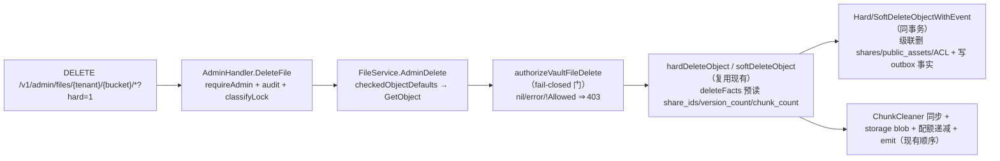

# 设计：fail-closed `vault.file.delete` 授权（Authorizer 端口）+ 管理端跨租户删除端点（失效 share/version/RAG 引用）

> **配套规格：** `docs/auto/runs/fail-closed-vault-file-delete-authorization-via--7996bbf7/artifacts/requirements-10762e10/requirements.md`（5 FRs / 4 ACs）· **模块：** `internal/access` + `internal/service` + `internal/events` + `internal/api/rest` + `cmd/server` 装配 · **状态：** 设计（未实现）· **基线：** HEAD `fb74b19` + 未提交 outbox 工作树（0041 迁移 / `event_outbox.go` / `payload.go` / relay）
> **门禁：** `make check` 全绿 · 单文件 ≤ 500 行 · 纯 stdlib（I6）· I1/I2 纪律 · 无新 `go.mod` 依赖 · `openapi.json` 同步（AGENTS.md §3 扩展入口）。

---

## 1. 证据复核（8 条引用 + 2 条演化修正，全部逐行验证）

| # | 引用 | 复核结论 |
|---|------|---------|
| E1 | `cmd/server/access.go:11-13` Access 禁用时 authorizer 为 nil | ✅ 精确。`buildAccessManager` 返回 `nil, nil` |
| E2 | `internal/service/access.go:65-67` nil→allow | ✅ `authorize()` 内 `if s.authorizer == nil { return nil }`（当前文件 `:66-67`） |
| E3 | `internal/access/authorizer.go:12-14` 禁用时 `Allowed:true` | ✅ 精确。`if !m.cfg.Enabled { return Decision{Allowed:true,...} }` |
| E4 | `internal/access/types.go:70-81` 词汇缺 `vault.file.delete` | ✅ Action 常量集（`object:list`…`asset:publish`、`object:export`、`*`）无该名；`ValidAction` 同步 |
| E5 | `admin.go:326-356` 无管理端文件删除；`TenantNotEmpty` 守卫 | ✅ `DeleteTenant`（`internal/api/rest/admin.go:326-356`）；admin 面仅有 tenants/keys/jwt/jobs/config/audit/departments，无文件删除 |
| E6 | `handler.go:239-248` 租户作用域 Delete | ✅ `Handler.Delete` 用 `mw.TenantFrom(r.Context())` + `DefaultBucket`，无跨租户能力 |
| E7 | `sql_access_shares.go:11-23,78` share 按 key、仅按 id 撤销 | ✅ `ListShares(tenant,bucket,key)`（`:57-70`）、`RevokeShare(tenant,id,…)`（`:78-84`）——按 key 级联缺失 |
| E8 | `file_delete.go:22-29,61-68` ChunkCleaner 同步清理 | ✅ 行为确认；行号修正为 `:27-29`（hard）、`:81-85`（soft）——硬/软删均同步调 `DeleteObjectChunks` |

**演化修正（C1/C2，规格已记录，设计据此展开）：**

- **C1**：按 key 的 share/public-asset 级联**已存在**于 repository 层——`internal/repository/sql_access_cleanup.go` `deleteObjectCapabilities`（`DELETE FROM shares/public_assets WHERE tenant_id AND bucket AND object_key`），事务内由 `HardDeleteObjectWithEvent`（`event_outbox.go:114`）/ `SoftDeleteObjectWithEvent`（`:154`）调用。**真实差距**：被撤销的 `share_ids` 从不透出到 service 层 → `deleted@1.1` 事实无法携带它们。
- **C2**：事务性 outbox **已存在**：`event_outbox` 表（迁移 `0041`，sqlite+postgres 双文件）、`ClaimEventOutbox`/`CompleteEventOutbox`/`RetryEventOutbox`/`HasEventOutboxFact`、relay（`cmd/server/workers.go:63` 启动 / `:152` 定义）、`vault.file.deleted@1.1` golden 测试（`internal/events/schema_test.go:15`）。"同一 outbox" = **复用需求**，非新建。

**设计前复核的新发现（N1–N8）：**

| # | 发现 | 依据 | 设计影响 |
|---|------|------|---------|
| N1 | `Manager.ListShares` 带 `ActionShare` 权限门 | `internal/access/shares.go:58-64` | 删除路径**不可**经 Manager 枚举 share（用户可能无 `object:share` → 整个删除会失败）；改用 `access.Store.ListShares` 直连（`sql_access_shares.go:57-70`，无权限门） |
| N2 | `ChunkCleaner.DeleteObjectChunks` 仅返回 `error` | `internal/service/file.go:64` | `chunk_count` 不扩该接口；`Repository.ListChunksForObject` 已在核心接口（`repository_interface.go:114`）→ service 预读计数，**零接口拓宽** |
| N3 | `requireAdmin` 在 reg 禁用时放行 | `admin.go:457-467` | HTTP 层不足；service 层 fail-closed 门（authorizer nil → 403）兜底——双层防御 |
| N4 | 审计 actor 约定 = key 的 tenant | `admin.go:410-428` `auditForTenant`：`actor = k.Tenant` | AC-4 断言 operator key → actor `"*"`；outbox 事实 actor = `Principal.SubjectID`（`file_delete.go:deleteFacts`）——两处身份语义不同，各自沿用现有约定 |
| N5 | `checkObjectProtection` 统一返回 `ErrLocked`（WORM/legal hold） | `file_crud.go:273-286`；事务内另有 legal-hold `EXISTS` 检查（`event_outbox.go:98-106`） | admin 端点 409 映射复用 `classifyLock` 先例（`management.go:225-231`） |
| N6 | `errorStatus`（`handler_helpers.go:30-63`）无 `ErrLocked` 分支——用户 DELETE 现存 500 缺口 | 同左 | 不在本方向修复；admin 端点用 `classifyLock` 显式 409（自包含） |
| N7 | catch-all key 模式：`chiURLParam(r, "*")` + `TrimPrefix("/")` | `handler.go:58-61`（`keyFromPath`） | admin 路由 `/admin/files/{tenant}/{bucket}/*` 同型 |
| N8 | 用户删除路径的 `deleteFacts` 同时服务 hard/soft 两处 | `file_delete.go:57,91` | 扩展后用户删除与 admin 删除自动共享同一事实形状（AC-2 的"同一 outbox"） |

---

## 2. 设计总览



**核心语义：** `vault.file.delete` 是**独立、特权**权限，只能被 PDP 正面授予；系统在"无法判定"（authorizer nil / disabled / error）时**拒绝**——与 `object:delete` 的 nil→allow（I5 基线）相反。该门只挂在新的管理端端点；普通用户删除路径（`object:delete`）**完全不变**（FR-5）。

---

## 3. API 变更

### 3.1 权限词汇 — `internal/access/types.go`

```go
const (
    // ... 现有 Action 常量不变 ...
    ActionDelete    Action = "object:delete"
    ActionVaultFileDelete Action = "vault.file.delete" // 新增：fail-closed 特权权限
)
// ValidAction 增加该 case（ACL 条目/能力可引用它）
```

### 3.2 PDP — `internal/access/authorizer.go`（`Manager.Authorize`）

1. **disabled 分支按 action 分流**（I5 基线的唯一例外，FR-5）：

```go
if !m.cfg.Enabled {
    if action == ActionVaultFileDelete {
        return denied("access_control_disabled"), nil // fail-closed：禁用即不可判定 ⇒ 拒绝
    }
    return Decision{Allowed: true, Reason: "access_control_disabled"}, nil
}
```

2. **授权路径**（现有顺序，仅两处跳过 + 一处新增）：
   - ACL entry：`actionMatches` 已支持 `ActionAll`/精确匹配 → `vault.file.delete` 显式 allow/deny 条目照常生效（无需改动）；
   - capability：`capabilityAllows` 已做 tenant/bucket/key 精确匹配 + action 列表包含性检查 → **"unrelated keys" 拒绝的天然来源**（AC-1 第 2 句）；
   - **owner 例外跳过**（新增条件）：`principal.SubjectID == resource.OwnerID` 不再隐式授予该 action；
   - `isAdministrator`（operator `"*"` / `admin` scope / `vault.tenant_admin` / `vault.file_admin`）——不变，是管理端主授予路径；
   - **DefaultTenant 默认策略跳过**（新增条件）：`scopeAllows` 不对该 action 返回 true，除非显式 scope；
   - 其余 → `denied("default_deny")`。

3. **`scopeAllows` 新增分支**：

```go
case ActionVaultFileDelete:
    // 只认显式 scope；绝不从 read/write scope 或 vault.member/publisher 角色派生
    return slices.Contains(principal.Scopes, "vault.file.delete")
```

### 3.3 Service 层 — `internal/service/file_admin.go`（新文件，≤500 行）

```go
// ShareLister 是 deleted@1.1 事实 share_ids 的预读端口（N1：绕过 Manager 的
// ActionShare 权限门；直连 access.Store）。nil = Access 禁用（share 不可能存在）。
type ShareLister interface {
    ListShares(ctx context.Context, tenant, bucket, key string) ([]access.Share, error)
}

func (s *FileService) WithShareLister(l ShareLister) *FileService // 可选装配

// authorizeVaultFileDelete —— fail-closed 门（FR-1/AC-1）：
// authorizer nil / Authorize 出错 / 判定拒绝 ⇒ 一律 ErrForbidden。
// 不调用 requireActiveTenant（D4：治理删除须能覆盖 disabled 租户）。
func (s *FileService) authorizeVaultFileDelete(ctx context.Context, obj repository.Object) error {
    if s.authorizer == nil {
        return ErrForbidden // 无法判定 ⇒ 拒绝（与 object:delete 的 nil→allow 相反）
    }
    principal, _ := access.PrincipalFrom(ctx)
    decision, err := s.authorizer.Authorize(ctx, principal, access.ActionVaultFileDelete, access.Resource{
        TenantID: obj.TenantID, Bucket: obj.Bucket, Key: obj.Key,
        Kind: objectResourceKind(obj.Key), OwnerID: obj.Metadata[ownerMetadataKey],
    })
    if err != nil {
        return fmt.Errorf("%w: vault.file.delete decision: %v", ErrForbidden, err)
    }
    if !decision.Allowed {
        return fmt.Errorf("%w: %s", ErrForbidden, decision.Reason)
    }
    return nil
}

// AdminDelete —— 管理端跨租户删除。复用现有 hard/soft 删除路径
// （storage-first → 事务级联+outbox → 配额 → emit，顺序不变）。
// 不调用 preflightQuota：删除只释放配额，无写前预检语义。
func (s *FileService) AdminDelete(ctx context.Context, tenant, bucket, key string, hard bool) error {
    tenant, bucket, err := checkedObjectDefaults(tenant, bucket, key) // I3：key 校验在 service 层
    if err != nil {
        return err
    }
    obj, err := s.repo.GetObject(ctx, tenant, bucket, key)
    if errors.Is(err, repository.ErrNotFound) {
        return ErrNotFound
    }
    if err != nil {
        return err
    }
    if err := s.authorizeVaultFileDelete(ctx, obj); err != nil {
        return err
    }
    if hard {
        return s.hardDeleteObject(ctx, obj, tenant, bucket, key)
    }
    return s.softDeleteObject(ctx, obj, tenant, bucket, key)
}
```

### 3.4 删除路径改造 — `internal/service/file_delete.go` + `internal/events/payload.go`

`deleteFacts` 扩展（hard/soft 共用，AC-3）：

```go
type deleteRefs struct {
    ShareIDs     []string // 预读 + RevokedAt 过滤（仅活动 share；已撤销属历史）
    VersionCount int      // hard=非 marker 版本数；soft=1（当前版本）
    ChunkCount   int      // Σ ListChunksForObject(version.ID)（N2：零接口拓宽）
}
// collectDeleteRefs：nil lister → ShareIDs 空；查询失败 → 仅 warn 并继续
// （载荷是尽力快照，D1；级联才是权威失效源），不得阻断删除。
func (s *FileService) deleteFacts(ctx context.Context, obj repository.Object, tenant string, refs deleteRefs) []repository.OutboxFact
```

- `hardDeleteObject`：`versionsForHardDelete` 之后构建 refs（version/chunk 计数基于 versions 循环），再调 `HardDeleteObjectWithEvent`；
- `softDeleteObject`：`VersionCount: 1`，chunk 计数基于 `obj.ID`；
- `internal/events/payload.go`：

```go
type deletedFact struct {
    // ... 现有字段不变，schema_version 保持 "1.1"（纯增量，D6） ...
    Actor        string   `json:"actor"`
    ShareIDs     []string `json:"share_ids,omitempty"` // 无 share 时省略（旧行/旧消费方兼容）
    VersionCount int      `json:"version_count"`
    ChunkCount   int      `json:"chunk_count"`
}
func BuildDeletedFact(obj repository.Object, actor, requestID, tenant string,
    shareIDs []string, versionCount, chunkCount int) []byte
```

`notify@1.1`（`BuildNotifyFact`）、`event_outbox` 表、claim/complete/retry 协议**一律不动**（FR-5）。

### 3.5 REST 端点 — `internal/api/rest/admin.go` + `router.go` + specgen 表

```go
// DELETE /v1/admin/files/{tenant}/{bucket}/*?hard=1 — 204；403/404/409 见 §5。
func (h *AdminHandler) DeleteFile(w http.ResponseWriter, r *http.Request) {
    if !h.requireAdmin(w, r) { return } // N3：reg 禁用时 HTTP 层放行，service 门兜底
    tenant := chiURLParam(r, "tenant")
    bucket := chiURLParam(r, "bucket")
    if bucket == "" { bucket = service.DefaultBucket }
    key := strings.TrimPrefix(chiURLParam(r, "*"), "/") // N7：与 keyFromPath 同型
    hard := r.URL.Query().Get("hard") == "1"
    if err := h.svc.AdminDelete(r.Context(), tenant, bucket, key, hard); err != nil {
        if code, msg, status, ok := classifyLock(err); ok { // N5/N6：ErrLocked ⇒ 409
            writeJSON(w, status, errorBody{Error: errorPayload{Code: code, Message: msg}})
            return
        }
        h.writeError(w, r, err) // ErrForbidden→403 / ErrNotFound→404（现有映射）
        return
    }
    h.auditForTenant(r, "file.delete.admin", key, bucket, tenant) // N4：actor=k.Tenant 约定
    w.WriteHeader(http.StatusNoContent)
}
```

- `router.go` admin 组：`r.Delete("/admin/files/{tenant}/{bucket}/*", adm.DeleteFile)`（组内已有 `adminRL` 限流）；
- specgen 表新增：`{Method: "DELETE", Path: "/v1/admin/files/{tenant}/{bucket}/{key}", Summary: "Delete a file in any tenant (fail-closed vault.file.delete)", Tag: "admin", AdminOnly: true, Status: 204}`（`/openapi.json` 由该表生成，同步 = 加这一行）。

### 3.6 装配 — `cmd/server/main.go`

```go
svc := service.NewFileService(store, repo, logger).WithAuthorizer(accessManager).WithEventSink(bus)
if store, ok := repo.(access.Store); ok { // 与 buildAccessManager 同一断言；Access 禁用时跳过
    svc.WithShareLister(store)
}
```

---

## 4. 兼容性约束

| # | 约束 | 说明 |
|---|------|------|
| K1 | **I5 基线不变** | 用户 DELETE / S3 / WebDAV / MCP / MOVE 源删除全部继续走 `object:delete`（authorizer nil→allow 保留）；`vault.file.delete` 仅由新端点评估 |
| K2 | **payload 纯增量** | `deleted@1.1` 新增 3 字段均为可选语义；`schema_version` 保持 `"1.1"`；历史 outbox 行（无新字段）仍合法；消费方必须把新字段当可选 |
| K3 | **outbox 协议冻结** | `event_outbox` 表、0041 迁移、claim/complete/retry/prune、relay 语义零改动（C2 复用） |
| K4 | **删除事务顺序不变** | storage-first → 事务（级联+outbox）→ 配额 → emit；`notify@1.1`、`DeleteVersion` 不动 |
| K5 | **行为变化（文档化）** | ① Access 禁用时新端点恒 403（fail-closed 的代价：启用 Access 才能用治理删除）；② `audit_log` 新增 `file.delete.admin` 类目——AGENTS.md §3 原列审计仅限 quota/budget/key/tenant，此为 AC-4 强制的有意表面扩展 |
| K6 | **零 schema/依赖变更** | 无新表/列（无迁移，I2）；无新 `go.mod` 依赖（I6）；单文件 ≤ 500 行 |

---

## 5. 失败模式

| # | 场景 | 行为 | 备注 |
|---|------|------|------|
| F1 | Access 禁用（authorizer nil）| **403**（fail-closed）| 操作影响：需 `Access.Enabled=true` + PDP 授予 |
| F2 | PDP store/目录查询错误 | **403**，无任何副作用（删除未开始）| `Authorize` 出错 ⇒ 拒绝 |
| F3 | 对象不存在 / 并发双删 | **404** | `WithEvent` 零行回滚（`event_outbox.go:112-117`），无幻影事实 |
| F4 | WORM/retention/legal hold | **409** `ObjectLocked` | `checkObjectProtection`（`file_crud.go:273`）统一 `ErrLocked`；`classifyLock` 先例映射；事务内 legal-hold `EXISTS` 是第二道 |
| F5 | 预读竞争（D1）| 载荷可能漏掉并发新建的 share / chunk 计数略旧 | 级联在事务内仍**精确**失效；已提交后新建的 share 行无害（解析时对象已不存在 → 404）；载荷为尽力快照，只影响事实完备性，不影响失效正确性 |
| F6 | 配额记录失败 | 删除已提交、usage 滞后（错误上抛）| 与用户删除完全一致的既有行为 |
| F7 | outbox relay 投递失败 | 现有 durable retry（指数退避+抖动 → `failed` 终态）| 无新失败模式 |
| F8 | 审计写失败 | `RecordAudit` 错误被忽略（`admin.go:426` `_ =`）| 既有约定 |
| F9 | 软删已软删对象 | **404**（零行回滚）| 与用户路径一致 |
| F10 | 删除 disabled/不存在租户对象 | disabled 允许（D4）；租户不存在 → GetObject → **404** | 治理删除须覆盖 disabled 租户 |

---

## 6. 迁移步骤

1. **无 DB 迁移**：无 schema 变更（I2 纪律；不新增迁移文件，不触碰 0041）。
2. **代码改动顺序**（依赖序）：`types.go` 词汇 → `authorizer.go` PDP → `payload.go`/`schema_test.go` → `file_delete.go`/`file_admin.go`(+tests) → `admin.go`/`router.go`(+e2e) → `main.go` 装配。
3. **文档同步**：specgen 路由表（`/openapi.json` 生成源）→ AGENTS.md §3 admin 面 → `docs/api.md`（若列端点）。
4. **部署**：单二进制、无顺序依赖；端点默认即活（Access 禁用时 403）。运维启用条件：`Access.Enabled=true` + operator key（或 `admin` scope / `vault.tenant_admin` / `vault.file_admin`，且 PDP 正面授予 `vault.file.delete`——operator 与 admin scope 经 `isAdministrator` 自动授予）。
5. **回归**：`make check`（gofmt/build/vet/test 全绿）；重点回归 `event_outbox_test.go`（outbox 协议未动）、`schema_test.go`（golden 已更新）、`access_cleanup_test.go`（级联未动）、`access_test.go`（I5 disabled→allow 保留用例）。

---

## 7. 可测验收映射（AC-1..AC-4）

### AC-1 — fail-closed 门（unit）
**文件：** `internal/service/file_admin_test.go`（表驱动）+ `internal/access/access_test.go`（PDP 直测）

| 用例 | 装配 | 期望 |
|------|------|------|
| authorizer nil | `svc` 不挂 authorizer | `AdminDelete` → `ErrForbidden` |
| authorizer disabled | `NewManager(store, Config{Enabled:false,…})` | `ErrForbidden`（PDP disabled 分支对该 action 拒绝） |
| authorizer error | 桩返回 `(Decision{}, err)` | `ErrForbidden` |
| 判定拒绝 | 桩返回 `Allowed:false` | `ErrForbidden` |
| **unrelated keys** | capability `{tenantB, default, docs/a.txt, [vault.file.delete]}` 删 `docs/b.txt` | `ErrForbidden`（capability 精确 key 匹配）；同 principal 删 `docs/a.txt` → 成功 |
| operator | principal `{TenantID:"*", Scopes:["admin"]}` | 成功 |
| owner 无权限 | principal = obj owner，无任何授予 | `ErrForbidden`（owner 例外跳过） |
| PDP 直测 | `Manager.Authorize(disabled, ActionVaultFileDelete)` | `denied("access_control_disabled")`；同 Manager `ActionDelete` → `Allowed:true`（**I5 回归**） |
| 词汇 | `ValidAction(ActionVaultFileDelete)` | `true` |
| ACL 授予 | allow entry `{Action: vault.file.delete, PrincipalType: user}` | `Allowed`（`actionMatches` 既有逻辑） |

### AC-2 — 同一 outbox、actor=admin（service 级）
**文件：** `internal/service/file_admin_test.go`（复用 `internal/repository/event_outbox_test.go` 的 `HasEventOutboxFact`/`ClaimEventOutbox`/`CompleteEventOutbox` 基建）

1. admin principal（`SubjectID:"admin-1"`, `TenantID:"*"`）`AdminDelete(tenantB, …, hard=true)` → `HasEventOutboxFact(obj.ID, EventTypeFileDeleted11)` == true；
2. `ClaimEventOutbox(owner, token, …)` → 事实 payload 断言：`actor=="admin-1"`、`tenant=="tenantB"`、`event_type=="vault.file.deleted@1.1"`；
3. `CompleteEventOutbox` → 再 claim 不重投（claim 谓词已排除 delivered——既有语义）；
4. **同一 outbox**：与用户 `Delete` 共用同一 `sqlStore` 事务路径（实现单一性）——由既有 repo 层 outbox 测试 + 本条共同覆盖。

### AC-3 — 事件 schema（golden）
**文件：** `internal/events/schema_test.go`（扩展既有 golden）

- `goldenDeletedFact` 更新为固定输入下的**字节精确**新形状（含 `share_ids`/`version_count`/`chunk_count`，例如 `…,"actor":"alice","share_ids":["sh-1","sh-2"],"version_count":3,"chunk_count":4}`）；
- `BuildDeletedFact` 以固定参数调用（生产构建器，非手写 JSON）；
- 回归臂：`goldenNotifyFact` **字节不变**（证明 notify@1.1 未受影响）；必需字段列表保持；新字段在 `doc` 中可断言存在/省略（`share_ids` 空 → omitempty 省略）。

### AC-4 — 组合 e2e（全服装配）
**文件：** `internal/api/rest/admin_file_delete_test.go`（chi + `httptest` + sqlite + local FS + 真 `access.Manager` + auth registry，对齐 `admin_ops_test.go` 模式；AGENTS.md 测试模式）

装配：`reg`（operator key：`Tenant:"*"` + `admin` scope + 固定 SubjectID；tenantB 普通 key）；`mw.Tenant(mw.Auth(h))`；`Manager{Enabled, DefaultPolicy: deny, ShareSecret ≥32B}`；`svc.WithAuthorizer(mgr).WithShareLister(repo.(access.Store)).WithChunkCleaner(fake→repo.DeleteChunksForObject)`（无 AI 管线，chunk 用 `repo.InsertChunks` 直种）。

种子：tenantB 对象（`UpsertObject` + local blob）→ `InsertChunks` → `Manager.CreateShare`（`access.SystemContext`）→ `Manager.PublishAsset` → `AddTenantUsage` 计数。

请求：`DELETE /v1/admin/files/tenantB/default/docs/a.txt?hard=1`（operator key）→ **204**。

| # | 断言（验收五要素）| 依据 |
|---|------|------|
| 1 | share URL 404：`repo.GetShareByTokenHash(hash)` → `access.ErrNotFound`（级联删除行）| C1 级联 |
| 2 | 公开资产下架：`repo.GetPublicAsset(slug)` → `access.ErrNotFound` | C1 级联 |
| 3 | RAG 无 chunk：`repo.ListChunksForObject(obj.ID)` 空；`SearchChunks` 0 hits | 现有 ChunkCleaner 同步清理 |
| 4 | 审计行：`repo.ListAudit` 含 `{Action:"file.delete.admin", TenantID:"tenantB", Actor: operator key tenant "*"}` | N4 约定 + 新 audit 类目 |
| 5 | 配额递减：`GetTenantQuota(tenantB)` → `UsedBytes` 减 `obj.Size`、`UsedObjects` −1 | 现有 `addTenantUsage` |
| 6 | （组合加固）outbox 事实存在且 `actor` == operator principal SubjectID | AC-2 在 e2e 复验 |

负向：tenantB 普通 key（无 `admin` scope）→ 403（`requireAdmin`）；Access 禁用装配 → 403（fail-closed）。

---

## 8. 范围边界（FR-5 纪律）

**改动清单（8 改 + 3 新）：** `internal/access/types.go`、`internal/access/authorizer.go`、`internal/access/access_test.go`、`internal/service/file_delete.go`、`internal/events/payload.go`、`internal/events/schema_test.go`、`internal/api/rest/admin.go`、`internal/api/rest/router.go`（含 specgen 表）；新增 `internal/service/file_admin.go`、`internal/service/file_admin_test.go`、`internal/api/rest/admin_file_delete_test.go`；装配 `cmd/server/main.go`。

**显式排除：** `DeleteVersion`/`DeleteObjectVersion`（无级联、无事实——现状维持）；`notify@1.1` 与 outbox 表结构（C2 冻结）；`object:delete` 语义与全部既有删除入口（I5）；用户路径 `preflightQuota`（admin 路径不调用，见 §3.3）；`errorStatus` 的 `ErrLocked` 缺口修复（N6，另一方向）；CLI/SDK（管理端点暂仅 REST，SDK 数量随 API 演进）。
