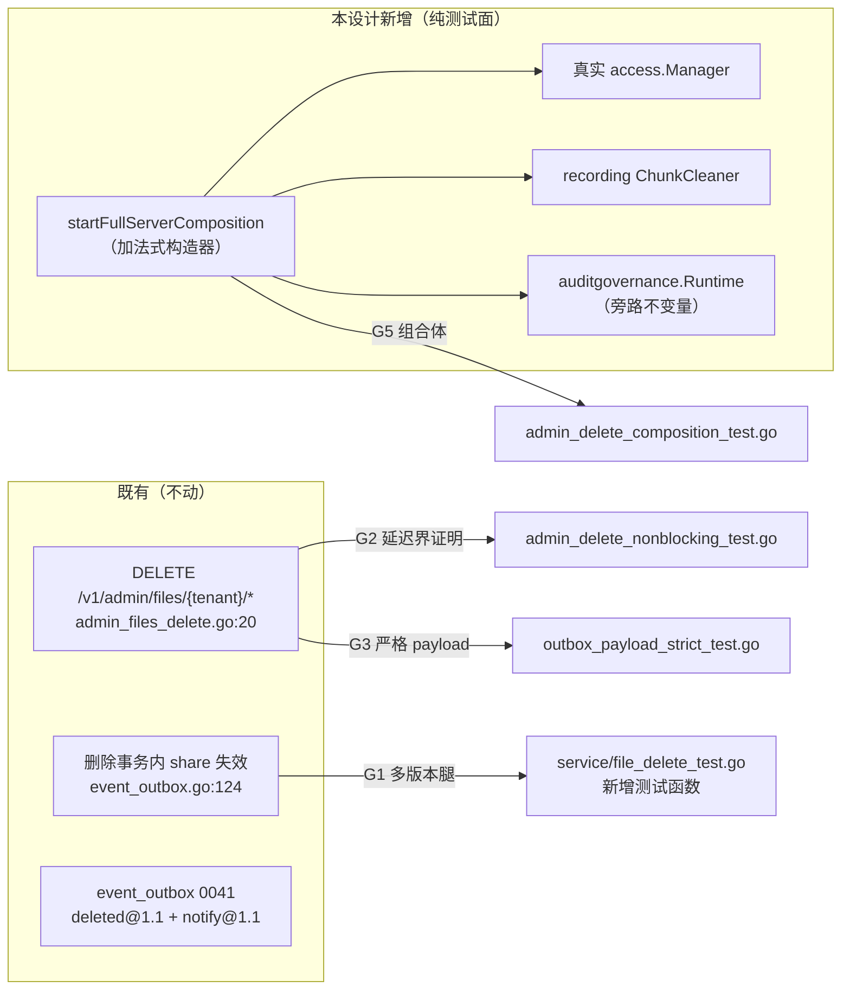

# Design: 组合画像 harness 升级（G1–G5 验收落点 + startFullServerComposition 构造器）

> **Companion spec:** `docs/requirements/integration-composition-harness-v1.spec.md`（E1–E9 核验 + 缺口 G1–G5）· **模块：** `internal/service`（单元腿）· `internal/integration`（harness + 组合腿）· **Status:** design (not implemented) · **Baseline:** HEAD `acfaaf4` · **Gates:** `make check` green · 新增/改动文件 ≤ 500 行（门禁实际豁免 `*_test.go`，见 §1 D1）· stdlib only (I6) · 零 `go.mod` 变更 · I1/I2 纪律（**零 DB 迁移、零 schema 变更**）· **零生产代码变更**（无路由/无 OpenAPI/无配置/无 env/无事件类型变更）

---

## 1. Evidence re-verification（独立逐条核验，对照工作树）

spec 的 E1–E9 与 G1–G5 全部引证已逐条对树核验，**全部成立**；行号锚点精确匹配。另发现 **2 处 spec 自身的新偏差（D1/D2）**，已在本设计内消化。

| # | 核验对象 | 工作树位置 | 结论 |
|---|---------|-----------|------|
| E8 | admin 删除路由存在 | `api/rest/router.go:203`（openapi 条目，AdminOnly/204）+ `:352`（`r.Delete("/admin/files/{tenant}/*", adm.DeleteFile)`）；handler `admin_files_delete.go:20`（`DeleteFile`：requireAdmin → 空 tenant 拒绝（F13）→ `?hard=1` → `svc.Delete`）；测试 `admin_files_delete_test.go:112`（TestAC2）/`:167`（TestComposition_AdminFilesDeleteEndToEnd） | ✅ 与 spec 一致；"无 admin 删除路由"论断确实过时 |
| E6 | share 失效同事务 | `repository/sql_access_cleanup.go:14-40`（`deleteObjectCapabilities` :14-27 → shares+public_assets；`deleteObjectAccessState` :30-40 → resource_acls）；调用点 `repository/event_outbox.go:124`（**精确命中**，HardDeleteObjectWithEvent 事务内）；断言 `service/file_delete_test.go:184`（**精确命中**，TestAdminDelete_InvalidatesShareAndChunks） | ✅ 与 spec 一致；"proposed" 论断过时属实 |
| E9 | outbox 表名 + governance 旁路 | 迁移 `0041_event_outbox.{up,down}.sql` **双方言**（sqlite+postgres 均存在）；`audit_governance_outbox` 为 0039（独立管线）；事件常量 `repository/event_outbox.go:22-25`；删除事务直写 SQL（`insertAuditEntry`/`insertOutboxFacts`，event_outbox.go:139-146），不经 `RecordAudit`/`InsertEvent` → governance 旁路结论成立；`auditgovernance.WrapRepository`（repository.go:15）、`Runtime.New`（runtime.go:54，**要求 enabled cfg + Store**）、`Start`（:105）/`Close`（:121） | ✅ 与 spec 一致 |
| E1 | harness 装配现状 | `startFullServerOpts` 精确落在 `fullserver_test.go:72-178`；`svc.WithAuthorizer(allowAllProvider{})` :94；`bus`/`WithEventSink` :97/:104；`NewNotifier`+订阅 :105-113；relay :163-172；auth 注册表变体 :65/:72；**无** access.Manager / auditgovernance.Runtime / WithChunkCleaner | ✅ 与 spec 一致（仍缺三者属实） |
| E7 | 生产装配范式 | `cmd/server/main.go:81`（WrapRepository）/:94（WithAuthorizer）精确命中；**关键顺序事实：** `buildAccessManager(cfg, repo)` 在 :63 用**原始 repo** 构建（governance wrap 之前）→ svc 用 wrapped repo + 预构建 manager；`cmd/server/access.go:11-25` 精确命中（Config{Enabled, DefaultPolicy, ShareSecret, DeleteFailOpen}，ShareSecret ≥32B 校验 manager.go:49） | ✅ 与 spec 一致；**G4 必须复制该顺序**（D-C） |
| G1 前置 | `Storage()` accessor / `ListObjectVersions` / marker 跳过 | `service/file.go:303` `Storage()`；`repository/sql_objects_versions.go:121` `ListObjectVersions`；`file_delete.go:18-56` hardDeleteObject（chunk 循环 :24-31 **含 `IsDeleteMarker` 跳过**，逐版本 blob 删除带 StorageKey 去重 :38-49）；`mockChunkCleaner` 定义于 `service_test.go:316-322` | ✅ 全部存在 |
| G2 前置 | 信号判别范式 | `TestDeleteResponse_DoesNotBlockOnDelivery` :702（4s 守卫 < 5s HTTPTimeout，注释明示确定性判别）；`outboxStatus` :1243 / `outboxPayload` :1275；`deliveredCountFor` :35 / `deliveredAt` :51 / `deliveredTotal` :67（admin_files_delete_test.go，R2 JOIN 语义 :39-46）；`outboxCountFor` :51 / `outboxPayloadFor` :69（authz_parity_test.go） | ✅ 全部存在 |
| G3 前置 | payload 形状 | `events/payload.go:33-52` `deletedFact`（13 字段，reason omitempty）；`:54-81` `notifyFact`（signature omitempty）；`assertNotifyContent` :1298；`setDeleteRule` :1262（FM-7 注释） | ✅ 与 spec 一致 |
| G4 前置 | governance 测试最小配置 | `auditgovernance/http_test.go:21`：`AuditGovernanceConfig{Enabled: true, BaseURL: stub, TokenURL: stub+"/token", ...}`；`Runtime.New` 构造期即 `applyDesiredBindings`（DB-only，无网络） | ✅ 可无网络装配 |
| G5 前置 | 四协议路由 + WebDAV 探针 | harness 挂载 `/v1`、`/s3`（`s3compat/router.go:23-26` 形如 `/{bucket}/*` → `GET /s3/default/k`）、`/mcp`、`/webdav`（dispatcher :149-156）；`dav.go:109-121` 目录探针精确命中（ErrNotFound → `List(name+"/")` → 有兄弟对象返回 davDir/200，否则 `os.ErrNotExist` → 404）；MCP `errResult`（server.go:401-406，`IsError: true` + text content）；`putObjectAs`（admin_files_delete_test.go:83，Bearer opsecret PUT） | ✅ 全部存在 |

### 新发现偏差（spec 自身两处过期）

| # | 偏差 | 证据 | 设计响应 |
|---|------|------|---------|
| **D1** | spec §3 AC-2 声称 `admin_files_delete_test.go` 现 **383 行**；实际 **506 行** | `wc -l` = 506 | ① 500 行门禁**豁免 `*_test.go`**（`Makefile:162` `-not -name '*_test.go'`；`checks/filesize.py` + `engineering.yaml` ignore_patterns `_test.go`），故无论 383 还是 506 均不违反门禁；② 但该文件已是包内最大且 G2 还要加 ~80 行 → **新文件 `admin_delete_nonblocking_test.go` 由"条件性"改为"无条件"**（§3.2） |
| **D2** | 工作树相对 HEAD `acfaaf4` 有 69 个未提交改动（+3067/-156），spec 标注 HEAD acfaaf4 | `git status` | 核验针对工作树进行，所有引证行号仍精确命中（含 main.go:81/94、access.go:11-25、file_delete_test.go:184）→ 漂移对结论无影响；实现时以工作树为准，落地前 `git status` 复查目标文件 |

---

## 2. Design overview



- **零生产代码变更**；全部为断言 + 1 个加法式 harness 构造器 + 2 个新测试文件 + 3 个新测试函数。
- 四条协议 404、chunk 归零、notify exactly-once、actor/request_id 非空——全部落在 CI 门内（SQLite + local FS + AI off，I5）。

---

## 3. API changes（全部 test-scope，加法式）

### 3.1 生产面：无

无路由、无 OpenAPI、无配置项、无 env、无 schema/迁移、无事件类型、无 go.mod。`openapi.json` 不触碰。

### 3.2 测试面新增

| # | 符号 | 落点 | 形状 |
|---|------|------|------|
| A1 | `startFullServerComposition(t, relayOpts, authKeys)` | `internal/integration/fullserver_test.go` | 新公共构造器：`startFullServerComposition(t *testing.T, relayOpts *events.EventOutboxRelayOptions, authKeys string) *fullServerHarness`，经共享内部构造器装配 access.Manager + recording ChunkCleaner + governance Runtime（§3.3） |
| A2 | `harnessConfig`（内部） | 同上 | `type harnessConfig struct { relayOpts *events.EventOutboxRelayOptions; authKeys string; withAccess, withChunkCleaner, withGovernance bool }`；`startFullServerOpts` 现函数体下沉为 `startFullServerInternal(t, harnessConfig)`，既有三个构造器（:50/:57/:65/:72）变一行转发——**既有调用点零改动** |
| A3 | `recordingCleaner` | 同上 | 实现 `service.ChunkCleaner`：mutex 保护 `ids []int64` 追加 + `IDs() []int64` 快照；G1 复用既有 `mockChunkCleaner`（service_test.go:316），本类型供 G5 与 harness 装配用 |
| A4 | `fullServerHarness.cleaner *recordingCleaner`（字段，加法式） | 同上 | 非组合构造器下为 nil；组合构造器填充 |
| A5 | `TestAdminDelete_HardDeleteMultiVersion` | `internal/service/file_delete_test.go`（新增函数；文件 293 行，余量充足） | G1 四条断言（§7） |
| A6 | `TestAdminDelete_DoesNotBlockOnDelivery` | **新文件** `internal/integration/admin_delete_nonblocking_test.go` | G2（§7）；**无条件新文件**（D1），不复用已 506 行的 admin_files_delete_test.go |
| A7 | `strictDeletedPayload(t, payload []byte)` + `strictNotifyPayload(t, payload []byte)` + `TestAdminDelete_StrictPayloadAndActor` | **新文件** `internal/integration/outbox_payload_strict_test.go` | G3（§7）；stdlib `encoding/json` `Decoder.DisallowUnknownFields`（I6） |
| A8 | `TestComposition_AdminDelete_404AcrossProtocols_ChunksZero_NotifyOnce` | **新文件** `internal/integration/admin_delete_composition_test.go` | G4 断言（旁路不变量）+ G5（§7） |

### 3.3 组合构造器装配顺序（复制 main.go:63/81/92-94 的生产顺序，D-C）

```go
func startFullServerComposition(t *testing.T, relayOpts *events.EventOutboxRelayOptions, authKeys string) *fullServerHarness {
    return startFullServerInternal(t, harnessConfig{
        relayOpts: relayOpts, authKeys: authKeys,
        withAccess: true, withChunkCleaner: true, withGovernance: true,
    })
}
```

`startFullServerInternal` 内（相对现函数体的增量，顺序即契约）：

1. **access.Manager 用原始 repo 构建**（对齐 main.go:63，wrap 之前——`WrapRepository` 返回的包装器不实现 `access.Store`，类型断言会失败）：
   ```go
   mgr, err := access.NewManager(repo, access.Config{
       Enabled: true, DefaultPolicy: access.DefaultTenant,
       ShareSecret: []byte("integration-composition-share-secret-32bytes"),
       DeleteFailOpen: false, // 生产 cfg.Access.DeleteFailClosed 语义
   })
   ```
2. **governance wrap**（对齐 main.go:78-83）：
   ```go
   rt, err := auditgovernance.New(config.AuditGovernanceConfig{
       Enabled: true, BaseURL: stubURL, TokenURL: stubURL + "/token",
       HMACKey: "integration-governance-hmac-key-32bytes", HTTPTimeoutSeconds: 5,
       PollMilliseconds: 1000, BatchSize: 32, ClaimTTLSeconds: 30,
       InitialBackoffSeconds: 1, MaxBackoffSeconds: 300, MaxLagSeconds: 900,
       Bindings: []config.AuditGovernanceBinding{{TenantID: "default", ClientID: "e2e",
           ClientSecret: "e2e-secret", State: "bound"}},
   }, repo, logger) // New 构造期 applyDesiredBindings 仅 DB 操作（http_test.go:21 范式）
   rt.Start(ctx); t.Cleanup(rt.Close)          // LIFO：rt.Close 在 repo.Close 之前（cleanup 注册序）
   repo = auditgovernance.WrapRepository(repo, rt)
   bus.WithRepository(repo)
   ```
   `stubURL` = 本地 `httptest.NewServer` 的 /token 桩（返回 `{"access_token":"e2e","token_type":"bearer"}`）。
3. **svc**：`service.NewFileService(store, wrappedRepo, logger).WithAuthorizer(mgr).WithEventSink(bus).WithChunkCleaner(cleaner)`（对齐 main.go:92-97 + 本设计的 cleaner）。
4. **harness 返回**：`h.repo` 保持**原始 repo**（测试的 `repo.(access.Store)` 断言、`ListChunksForObject`、`SetBucketNotifications` 均走原始 repo——governance 包装器仅拦截 `RecordAudit`/`InsertEvent`，旁路不变量即建立在此边界上）；`h.cleaner = cleaner`。
5. authKeys 透传既有 `auth.Parse` 注册表（"opsecret:*:admin" 变体不变）。

---

## 4. Compatibility constraints

| # | 约束 | 依据 |
|---|------|------|
| C1 | **既有调用点零改动**：`startFullServer`/`startFullServerWithRelay`/`startFullServerWithAuthAndRelay`/`startFullServerOpts` 签名与行为不变（内部下沉 `startFullServerInternal` 后为一行转发）；`fullServerHarness` 仅加字段 | E1 加法式演进范式（authKeys 参数先例） |
| C2 | **AI 保持 off（I5）**：组合 harness 不装配 embedder/indexer；`/v1/search` 503 钉（`TestFullServer_SearchDisabled`）不变；chunk 断言限仓库层（`ListChunksForObject`）+ cleaner 调用集 | G5 断言 2 的 CI 门内读法 |
| C3 | **零 schema/迁移（I2）**：不新增迁移文件、不改 payload 结构；G3 严格校验器只读，不写 | spec §5 超范围 |
| C4 | **stdlib only（I6）**：G3 用 `encoding/json` 的 `DisallowUnknownFields`，不引断言框架 | 门禁 |
| C5 | **判别式常量序**：G2 守卫 4s < relay HTTPTimeout 5s（严格小于）；恢复窗口 15s；无重复窗口 5s——沿用 TestDeleteResponse_DoesNotBlockOnDelivery 的既有常量，不新造 | 确定性判别 |
| C6 | **Teardown LIFO**：`release → l2.Close → rt.Close → relayCancel → notifCancel → bus.Close → ts.Close → repo.Close`（新增 `rt.Close` 插在 relayCancel 之前注册/之后执行）；`close(release)` 必须早于 `l2.Close`（-race 下 in-flight POST 泄漏） | 既有范式（fullserver_test.go:718-724） |
| C7 | **授权真实化**：组合 harness 中 `requireAdmin` 与 Manager 授权均真实（"opsecret:*:admin" + DefaultTenant policy）；admin 删除若被 manager 拒绝则测试失败——这是装配意图，非缺陷 | G4 |
| C8 | **WebDAV 探针语义**：G5 的 key 选无同前缀兄弟对象的键（`"k"`，既有模式）；删除前防御性断言 `List("k/")` 无对象 | dav.go:109-121 |

---

## 5. Failure modes & mitigations

| # | 模式 | 触发 | 缓解 |
|---|------|------|------|
| F1 | G2 判别失效（同步实现挂起 vs 守卫） | relay HTTPTimeout ≤ 4s 或守卫 ≥ 5s | 常量与既有测试同源（C5），注释钉死 4s<5s 判别式；不得单独调参 |
| F2 | G2 响应时 status 读到 delivered | 目标阻塞中 delivered 不可达（relay 必须完成 POST 才写 delivered 行） | 断言允许 `pending\|inflight` 二值（既有注释），`deliveredTotal == 0` 作全局守卫 |
| F3 | G5 WebDAV 返回 200 目录列表 | 测试对象存在同前缀兄弟（探针 List 命中） | 唯一 key `"k"` + 前置防御断言（C8）；若失败信息指出 davDir 而非 404，即为 key 冲突 |
| F4 | G4 governance Runtime.New 失败 | cfg 缺 HMACKey/绑定非法 → `cfg.Validate()` / `applyDesiredBindings` 错误 | 构造期即失败（fail fast），测试 t.Fatal；配置常量从 http_test.go:21 范式复制 |
| F5 | G4 governance 运行期污染 | Publisher 向空 URL 推送 | stub token 端点（§3.3）；`rt.Close` 在 LIFO 序内；旁路断言保证删除路径不依赖 runtime 状态 |
| F6 | G3 严格校验器在未来 payload 演进时变红 | payload 新增字段（契约变更） | **预期行为**：与 `schema_test.go` golden 同步更新的维护路径；`deletedFact` 新字段必须同步 `strictDeleted` 结构体（测试内注释指引） |
| F7 | G1 版本化前置未生效 | `SetBucketVersioning` 未调用或调用后 PUT 路径未产生版本行 | 断言 1 前先 `ListObjectVersions` 快照非空（≥2 版本 + 1 marker），否则 t.Fatal 前置失败 |
| F8 | -race 下 goroutine 泄漏 | L2 in-flight POST 在 l2.Close 后完成 | C6 LIFO；`releaseOnce` 模式（既有 :705-718） |
| F9 | 回归锚点变红 | harness 重构引入行为漂移 | §8 锚点清单全量跑；构造器转发后 `go test ./internal/integration/` 必须全绿再继续 |

---

## 6. Migration steps（零 DB；实施顺序）

1. **G1 先行**（无 harness 依赖）：`internal/service/file_delete_test.go` 新增 `TestAdminDelete_HardDeleteMultiVersion`；`go test ./internal/service/ -run TestAdminDelete` 绿。
2. **Harness 重构（纯加法）**：`startFullServerOpts` 函数体下沉 `startFullServerInternal(t, harnessConfig)` + 既有构造器一行转发 + `recordingCleaner` + `fullServerHarness.cleaner` 字段；**此时不装任何新组件**，跑 `go test ./internal/integration/` 全量回归（锚点 F9）——重构先于功能（AGENTS 约定）。
3. **组合构造器**：`startFullServerComposition` + §3.3 三件装配（access/governance/cleaner）。
4. **G3**：`outbox_payload_strict_test.go`（严格解码器 + admin 路径 actor/request_id 断言）——仅需 auth harness，先行验证 auth 路径事实。
5. **G2**：`admin_delete_nonblocking_test.go`（复用 L2 阻塞范式 + admin 路由）。
6. **G5**：`admin_delete_composition_test.go`（四协议 404 + chunk 归零 + notify exactly-once + G4 旁路断言内联）。
7. **门禁**：§8 全命令。

---

## 7. Testable acceptance mapping

| 缺口 | 验收（spec §3 原文语义） | 测试函数 / 文件 | 关键断言（可测试化） | 验证命令 |
|------|------------------------|-----------------|---------------------|---------|
| **G1** | unit：多版本硬删原子性（版本墓碑 + 逐版本 blob + 逐版本 chunk + share） | `TestAdminDelete_HardDeleteMultiVersion` · `internal/service/file_delete_test.go` | ① versioning bucket 写 v1、v2 + delete marker（`SetBucketVersioning(true)` → 2×Put → `svc.Delete(soft)` 产生 marker）；`svc.Delete(hard=true)` 后 `repo.ListObjectVersions` == 0（含 marker 行）；② 删除前快照中每个**非 marker** 版本的 `StorageKey` 经 `svc.Storage().Stat` 返回 error（I3 精确 key）；③ recording `mockChunkCleaner` 收到 id 集合 == {v1.ID, v2.ID}（marker 被 `IsDeleteMarker` 跳过，file_delete.go:24-31）；④ `repo.(access.Store)` share rows == 0（先 seed 一条 share，复用 :184 测试模式） | `go test ./internal/service/ -run 'TestAdminDelete' -v` |
| **G2** | outbox：REST admin 路由延迟界非阻塞 + exactly-once | `TestAdminDelete_DoesNotBlockOnDelivery` · **新文件** `internal/integration/admin_delete_nonblocking_test.go` | ① L2 目标阻塞（httptest + `X-Audit-Fact-Id` 回显）→ `DELETE /v1/admin/files/default/{key}?hard=1`（Bearer opsecret，`startFullServerWithAuthAndRelay`）在 **4s 内**返回 204（同步实现必挂到 5s 超时后）；② 响应时刻 `outboxStatus == pending\|inflight` + `outboxCountFor(deleted@1.1) == 1`（origin_id == obj.ID 内蕴）+ `deliveredTotal == 0`；③ `release` 后 ≤15s `deliveredCountFor == 1`（R2 JOIN），再 5s 无重复窗口计数不变 | `go test ./internal/integration/ -run 'TestAdminDelete_DoesNotBlock|TestDeleteResponse' -v` |
| **G3** | schema：严格 JSON 校验 + actor/request_id 非空 | `strictDeletedPayload` / `strictNotifyPayload` / `TestAdminDelete_StrictPayloadAndActor` · **新文件** `internal/integration/outbox_payload_strict_test.go` | ① `json.Decoder.DisallowUnknownFields` + 类型化结构体（字段集 == `events/payload.go:33-52` deletedFact 13 字段，reason omitempty）；`schema_version=="1.1"`、`event_type=="vault.file.deleted@1.1"`、tenant/bucket/key 非空、`object_id>0`、`request_id` 非空、`actor` 非空；② 经 auth harness 真实 admin 路径：`actor == "opsecret"`（auth_middleware.go:183 principal）、request_id 非空；③ notify@1.1 严格解码（`signature` 为 omitempty 字段不破坏校验）+ `assertNotifyContent` 复用 + sequencer `^[0-9a-f]{32}$` | `go test ./internal/integration/ -run 'StrictPayload' -v` |
| **G4** | composition：harness 装配真实组件（旁路不变量） | 内联于 A8（`TestComposition_AdminDelete_404AcrossProtocols_ChunksZero_NotifyOnce`） | ① 装配后（manager + governance + cleaner 全真实）admin 删除仍 **204**、`event_outbox` 两事实照常提交（`outboxCountFor` == 1/1）——删除不依赖 governance；② `assertAuditRowFor` 本地 audit 行存在（L0 恒写，wrap 旁路） | `go test ./internal/integration/ -run 'TestComposition_AdminDelete' -v` |
| **G5** | composition：四协议 404 + chunk 归零 + notify exactly-once | `TestComposition_AdminDelete_404AcrossProtocols_ChunksZero_NotifyOnce` · **新文件** `internal/integration/admin_delete_composition_test.go` | 前置：`startFullServerComposition` + relay（Poll 50ms/Batch 32/ClaimTTL 30s/HTTPTimeout 5s/MaxAttempts 10）+ `setDeleteRule`（FM-7 规则先于删除）+ `putObjectAs("k")`；admin DELETE `?hard=1` → 204 后：① REST `GET /v1/files/k`（Bearer opsecret + X-Aero-Tenant）→ 404；S3 `GET /s3/default/k` → 404；WebDAV `GET /webdav/k` → 404（无兄弟前缀 key，dav.go:109-121）；MCP `tools/call read_file{key:"k"}` → result `isError == true`（errResult，server.go:401-406）；② `repo.ListChunksForObject(ctx, obj.ID)` == 0 + `h.cleaner.IDs()` 含全部非 marker 版本 id；③ notify 目标**恰好 1 次** POST、wire body **字节等于** `outboxPayloadFor(notify@1.1)`、`assertNotifyContent` 自包含、deleted `deliveredCountFor == 1`、5s 无重复窗口 | `go test ./internal/integration/ -run 'TestComposition' -v` |

**回归锚点（不得变红）：** `TestFullServer_REST_CRUD`/`ProtocolInterop`/`SearchDisabled`（:204/:452/:372）、`TestDeleteResponse_DoesNotBlockOnDelivery`（:702）、`TestComposition_DeleteDeliversBothFacts`（:893）、`TestComposition_MidClaimRestartRedeliversOnce`（:1032）、`TestAC2_AdminDelete_EventTypeFilteredState`（:112）、`TestComposition_AdminFilesDeleteEndToEnd`（:167）、`TestAdminDelete_EmitsExactlyOneDeletedFact`/`InvalidatesShareAndChunks`（service :156/:184）。

---

## 8. Validation

- **门禁：** `make check` 全绿（gofmt / go build / go vet / go test；行数门禁豁免 `*_test.go`，新增文件仍保持 ≤500 行自约束）。
- **定向：**
  - `go test ./internal/service/ -run 'TestAdminDelete' -v`（G1 + 既有回归）
  - `go test ./internal/integration/ -run 'TestAdminDelete|TestComposition|TestDeleteResponse|TestFullServer|StrictPayload' -v`（G2–G5 + 锚点）
  - `go test -race ./internal/integration/`（G2/G5 新增 goroutine 腿；C6 LIFO 序）
- **重构闸：** 步骤 2 完成后、步骤 3 前，`go test ./internal/integration/` 全量必须全绿（F9）。
- **一致性：** G3 结构体字段集与 `internal/events/schema_test.go` golden 钉同步维护（F6 注释指引）。
