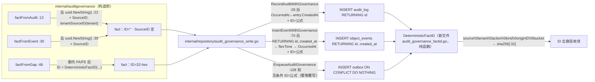

# 设计：Deterministic fact IDs across the three constructors (B3.3 / T-4)

> **配套规格：** `docs/requirements/internal-ai-audit-governance-deterministic-fact-ids-v1.spec.md`（REQ-1…REQ-7 / AC-1…AC-4）· **模块：** `internal/auditgovernance`（构造/relay）+ `internal/repository`（outbox 写层）· **状态：** 设计（未实现）· **基线：** HEAD `acfaaf4`（`facts.go`/`audit_governance_write.go` 工作树无修改，与 HEAD 一致）
> **门禁：** `make check` 全绿（gofmt/build/vet/test，SQLite+local FS）· 单文件 ≤ 500 行 · 纯 stdlib（I6，零新 `go.mod` 依赖）· **无 DB schema 变更**（I2：0039 已应用，不触碰）· 无配置表面 · 无 `internal/service` 变更 · 无 REST/S3/MCP/CLI 表面变更

---

## 1. 证据复核（独立复验，全部引用逐行对照本次 checkout）

| # | 规格主张 | 复核结论 |
|---|---------|---------|
| E1 | `facts.go:22`/`:39` 两处 `uuid.NewString()`；`factFromGap`(:48-68) 无直接 uuid 调用，经委托 `factFromEvent`(:55)/`factFromAudit`(:65) 再设 `fact.OriginID = gap.OriginID`(:56/:66) | ✅ 精确。`facts.go` 112 行、工作树干净 |
| E2 | 直接路径在 `origin_id` 已知前构造 fact（`repository.go:32,43`） | ✅ 实质成立。文件实为 **`internal/auditgovernance/repository.go`**（auditedRepository 包装）：`:32` `fact := r.runtime.redactor.factFromAudit(entry, time.Now().UTC())` → `:33` `RecordAuditWithGovernance`；`:43-44` 同构（文件名为微小漂移，C2） |
| E3 | `write.go:28` `row.Scan(&fact.OriginID)`；`:70` `fact.OriginKind, fact.OriginID = AuditOriginFile, id`（RETURNING id） | ✅ 精确 |
| E4 | `http.go` `governanceWire`：`EventID: fact.ID`(:148)、`IdempotencyKey: fact.ID`(:153)；`receiptMatches` 钉死 `EventID == fact.ID` | ✅ 精确（文件为 `internal/auditgovernance/http.go`；`receiptMatches` 定义 :214、`receipt.EventID != fact.ID` 判定 :216） |
| E5 | B3 公式 `SHA-256(source\|tenant\|event_type\|origin_kind\|origin_id\|time_bucket)[:32]` 由 campaign 钉死；字段映射未验证 | ✅ `docs/campaigns/campaign-aero-vault-b3.yaml:9-10,60-61` + `implementation-gate.md:23` 逐字一致；`audit-contract-batch-aero-vault.md:15` 确标 "time_bucket 粒度/动作串 mismatch 未验证" |
| E6 | 去重 = `ON CONFLICT (origin_kind,origin_id) DO NOTHING`（`write.go:140`，仅 `ignoreDuplicate`）；UNIQUE 在 0039 | ✅ 精确（:140；`migrations/sqlite/0039_audit_governance_outbox.up.sql` UNIQUE 实为 **:23**——C3 纠错作废） |
| E7 | 今日无任何确定性 ID | ✅ `facts.go` 无 sha256 符号；`relay.go:186` 的 sha256 仅作退避抖动 |
| E8 | 事件 `created_at` 精度漂移：sqlite `strftime(...,'now')` ms / postgres `now()` µs；`service/file.go:308` `emit` 不设 `CreatedAt`；`write.go:58-62` INSERT 不含 `created_at` | ✅ 全部成立（0003_events.up.sql 两方言均 :11，C4；`flexTime` `sql_helpers.go:196-231` 覆盖 time.Time/[]byte/string 三型） |
| E9 | 失败保留清除无 tombstone → gap 复现 → 重新入队 | ✅ `audit_governance_cleanup.go` 注释 :109-110 逐字一致（函数体 :113，C5）；`runtime_test.go:181-185` 印证 prune 语义 |
| E10 | 校验在 `insertAuditGovernanceResult` 内、晚于 origin 赋值；`fact.ID != ""` 于 :162 | ✅ 实质成立。`validateAuditGovernanceFact` 定义 :148（函数体 :148-159）、调用 :129（规格引 :148-159 **正确**，C6 纠错作废）；`:162` 精确 |
| E11 | `tenantSourceID` = 纯函数 of (key, tenant)，与 wire `SourceSystem` 同源 | ✅ `redaction.go:43-50`；`digest` = HMAC-SHA256 + base64.RawURLEncoding（:29-35） |
| E12 | 现有测试不钉 ID 值 | ✅ `audit_governance_test.go:40` 构建带 uuid 的 fact 但不断言 ID；`TestAuditGovernanceReconcileFindsAndDeduplicatesLocalFacts`(:98-135) 只断言 inserted 布尔；`http_test.go:80/:154/:208` 手写 fact 绕过 store；`runtime_test.go` 断言投递计数 |
| — | 规格 160 行；analysis JSON direction 1 忠实 | ✅ `wc -l` = 160；JSON problem/evidence/acceptance 与规格 §1/§5 逐项对应 |

### 修正（C1-C7，均非阻断）

- **C1 ⚠️ 工作树状态：** `internal/repository` 与 `internal/auditgovernance` 下有未提交的 sibling 方向修改（B3-1 终态分类：`relay.go`/`claim.go`/`cleanup.go`/`audit_governance_types.go` 已改、0042/0043 迁移新增）。**干净文件只有两个**：`facts.go` 与 `audit_governance_write.go`（与 HEAD 一致）；`audit_governance_types.go` 属 B3-1 **已脏**（接口 :85-88/:92 新增 `FailAuditGovernance`/`CleanupFailedAuditGovernance`）。本设计只触碰这两个干净文件 + 类型文件（struct 字段追加在 `ID`(:37) 后，与接口块 :75-93 **区域不相交**——hunk 级零重叠成立，文件级不成立）；测试签名（`FailAuditGovernance(ctx, id, owner, token, lastErr)`，`claim.go:159`）以工作树为准。
- **C2** E2 文件名：`repository.go` → `internal/auditgovernance/repository.go`（非 `internal/repository/repository.go`）。
- **C3** 0039 UNIQUE 约束在 **:23**（规格原引正确；此前“修正”为 :25 系自身错误，已回正）。
- **C4** 0003_events 两方言 `created_at` 默认均在 :11（非 :10/:9）。
- **C5** `CleanupFailedAuditGovernance` 函数体 :113-141（规格引 :104-141 混含 delivered 清理尾部 :104-105，属漂移；no-tombstone 注释 :107-112）。
- **C6** `validateAuditGovernanceFact` 定义 :148（函数体 :148-159）、调用 :129（规格 E10/REQ-3 引 :148-159 **正确**；此前“修正”为 :144-146 系自身错误，已回正）。
- **C7** `claim.go:10-11` → 实为 `internal/repository/audit_governance_claim.go:12`（`auditGovernanceCols`）。

---

## 2. 设计总览



**核心决策：** 一个导出纯函数 `DeterministicFactID` 全仓唯一定义（规格 D1）；repository 写层三方法**无条件覆写** `fact.ID`（store 权威，规格 D1）；`OccurredAt` 以**持久化 origin 行**的 `created_at` 为准（REQ-2，消除 E8 精度漂移）；**无 schema/配置/服务层变更**。

---

## 3. API 变更（具体签名与落点）

### 3.1 新文件 `internal/repository/audit_governance_factid.go`（~35 行）

```go
package repository

import (
	"crypto/sha256"
	"encoding/hex"
	"strconv"
	"time"
)

// DeterministicFactID derives the B3-3 fact ID: hex(SHA-256(frame))[:32],
// frame = source \x00 tenant \x00 eventType \x00 originKind \x00
// decimal(originID) \x00 decimal(unixSeconds(occurredAt.UTC().Truncate(time.Second))).
// Pure: no randomness, no mutable state, no clock — identical inputs yield
// identical output in any process, any restart.
func DeterministicFactID(source, tenant, eventType, originKind string,
	originID int64, occurredAt time.Time) string {
	bucket := occurredAt.UTC().Truncate(time.Second).Unix()
	frame := source + "\x00" + tenant + "\x00" + eventType + "\x00" + originKind +
		"\x00" + strconv.FormatInt(originID, 10) + "\x00" + strconv.FormatInt(bucket, 10)
	sum := sha256.Sum256([]byte(frame))
	return hex.EncodeToString(sum[:])[:32]
}
```

- NUL 不可能出现在任一字段（`source` 为 `SourcePrefix + "." + base64url`；`tenant`/`action` 经 `normalizedTenant`/`safeAction` 约束；余为十进制数字）——无歧义定界。
- 截断取 **hex digest 前 32 字符**（128-bit），小写，匹配 campaign "32-hex"。

### 3.2 `internal/repository/audit_governance_types.go` — 新增瞬态字段

`AuditGovernanceFact`（:36-54）在 `ID`（:37）字段后追加（接口 :75-93 **不变**——该块已被 B3-1 扩展 `FailAuditGovernance` :85-88 / `CleanupFailedAuditGovernance` :92，本设计不触碰）：

```go
	// SourceID is the deterministic per-tenant source-system identifier used
	// for fact-ID derivation only. It is never persisted: the outbox INSERT
	// column list and claim round-trips omit it (claims carry "" with zero
	// behavioral impact — the publisher derives the wire SourceSystem from
	// the binding, http.go:111). Do not persist without re-validating the
	// ID formula.
	SourceID string
```

### 3.3 `internal/auditgovernance/facts.go` — 构造器停止铸 ID

- 删除 `"github.com/google/uuid"` import（:8）。
- `factFromAudit`（:13-27）：`:22` 移除 `ID: uuid.NewString(),`；新增

  ```go
  source, _ := r.tenantSourceID(tenant) // normalizedTenant (non-empty, trimmed) 使错误不可达；两路径同构
  ```
  并把 `SourceID: source` 放入返回字面量。
- `factFromEvent`（:30-44）：`:39` 同构移除 + `SourceID: source`（`normalizedTenant(event.TenantID)` 后调用）。
- `factFromGap`（:48-68）：保留两分支委托与 `fact.OriginID = gap.OriginID`（:56/:66），**收拢为单返回点**：

  ```go
  fact.ID = repository.DeterministicFactID(fact.SourceID, fact.TenantID,
      fact.Action, fact.OriginKind, fact.OriginID, fact.OccurredAt)
  return fact
  ```

  （两分支返回合并为一次计算后返回——同公式、同调用点，避免双处漂移。）

### 3.4 `internal/repository/audit_governance_write.go` — store 权威 ID + occurred 规范化

- **`RecordAuditWithGovernance`（:14-43）**，在 `fact.OriginKind = AuditOriginAdmin`（:31）之后、`governanceCaptureActive`（:32）之前：

  ```go
  // REQ-2: canonicalize occurred to the durably stored origin timestamp.
  if t, err := time.Parse(time.RFC3339Nano, entry.CreatedAt); err == nil && !t.IsZero() {
      fact.OccurredAt = t
  }
  fact.ID = DeterministicFactID(fact.SourceID, fact.TenantID, fact.Action,
      fact.OriginKind, fact.OriginID, fact.OccurredAt)
  ```

  （`entry.CreatedAt` 已在 :17-19 兜底为非空，parse 实际恒成功；失败时保留构造值——与 gap 路径的 fallback 语义一致。）

- **`InsertEventWithGovernance`（:45-82）**：
  - 两方言 query（:59 sqlite / :62 postgres）`RETURNING id` → **`RETURNING id, created_at`**；
  - Scan 改为

    ```go
    var occurred flexTime
    err = tx.QueryRowContext(ctx, s.rebind(query), ...).Scan(&id, &occurred)
    if err != nil {
        return 0, err
    }
    fact.OccurredAt = occurred.Time // DB 默认精度：sqlite ms / postgres µs — 与 gap 解析值字节一致
    ```
  - 在 `fact.OriginKind, fact.OriginID = AuditOriginFile, id`（:70）之后：同样的 `DeterministicFactID` 赋值。

- **`EnqueueAuditGovernance`（:96-117）**：在 `insertAuditGovernanceResult`（:108）前**无条件**覆写 `fact.ID`（同公式；对 `factFromGap` 产出的 fact 是幂等同值重算，对测试/外部调用者自带的 ID 一律取代——store 权威）。
- **三方法共用硬化点（design-gate H2）：** 公式的 `tenant` 输入一律取 `defaultTenant(fact.TenantID)`（镜像 `InsertEventWithGovernance:48` 对 event 的规范化）——生产调用方（仅 `repository.go:33/:44` 与 `relay.go:40` 三处，均 redactor 产物）已规范化，此规范化是幂等 no-op，但对未来传入未规范化 tenant 的外部调用者是防漂移纵深防御。`SourceID`/`Action` 为调用方字段，store 无法验核——信任边界在 §4.9 显式记录。

- 校验链不动：`validateAuditGovernanceFact`（调用 :129）在 `insertAuditGovernanceResult` 内执行，ID 赋值恒早于它，`fact.ID != ""`（:162）天然满足；`ON CONFLICT (origin_kind,origin_id) DO NOTHING`（:140）与列清单（:134-135）**零改动**。

### 3.5 无变更面（明确排除）

| 面 | 结论 |
|---|---|
| `repository.AuditGovernanceStore` 接口（types.go:75-93，B3-1 已扩展 Fail/CleanupFailed） | 不变（仅 struct 字段 + 新函数） |
| `internal/auditgovernance/http.go` wire/`governanceWire`/`receiptMatches` | 不变——`EventID`/`IdempotencyKey` 仍是 `fact.ID` 字符串 |
| `internal/auditgovernance/relay.go`（含 :62 claim token uuid） | 不变（token 是 per-claim 随机认证，非事实身份） |
| `audit_governance_claim.go` `auditGovernanceCols`（:12）、claim/complete/fail | 不变（round-trip 不携带 `SourceID`） |
| `internal/service`（`emit` :308 不设 `CreatedAt`） | 不变——REQ-2 在 repository 层吸收零值形态 |
| 配置/CLI/REST/S3/MCP/OpenAPI | 不变 |
| schema / migrations | **无迁移**（I2：0039 已应用且不触碰） |

---

## 4. 兼容性约束

1. **无 schema 变更（I2）：** 不加迁移文件、不编辑已应用的 0039；去重目标恒为 `(origin_kind, origin_id)` 元组。
2. **在途 outbox 行不重写：** 已入队的行保留其 UUID ID 直到投递/失败（ID 只在入队时计算；无 UPDATE、无迁移）。sink 对同行的幂等键不变——**无在途重复投递**。升级后**新 origin** 才获得 32-hex ID。
3. **ID 格式变更（uuid → 32-hex）是 sink 可见的格式变化：** `EventID`/`IdempotencyKey` 在契约中是不透明字符串（`receiptMatches` 仅做相等比较）；新旧 ID 字母表不相交（旧含 `-`，新为纯 32 小写 hex），**不存在跨格式碰撞**。契约 A（幂等重 POST）不受影响。
4. **已投递 origin 不回炉：** `audit_governance_delivered_origins` + gap 查询 `d.origin_id IS NULL` + INSERT `WHERE NOT EXISTS` 三重守卫不变——升级后已 ledger 的 origin 不会以新 ID 重发（一次性重复仅限升级前就已失败的陈旧行，属 T-4 目标行为）。**prune→re-enqueue 的 sink 侧红利（H3）：** 失败行 7d 保留期满被 prune 后重入队的 re-POST 携带**同一** `EventID`/`IdempotencyKey`（确定性 ID 保证）→ sink 自身幂等折叠为 Duplicate；现行 UUID 方案每次 prune→re-enqueue 都铸新 key，凡 sink 已部分记账（ack-lost/回执歧义/乱序）即**必然**双账——本设计把该窗口转为 sink 侧 Duplicate，是超越 T-4 收敛本身的正确性改进。跨格式边界仅一处：升级前已失败的 UUID 行在升级后被 prune→以 32-hex 重入队（一次性、有界于升级前失败集）。
5. **现有测试零改动通过（E12）：** `governanceFact`（uuid ID）会被 store 覆写为确定性 ID，现有断言只查 inserted/计数/格式无关值；`TestAuditGovernanceReconcileFindsAndDeduplicatesLocalFacts`(:98-135) 两次 `EnqueueAuditGovernance` 期望 `(true,nil)`/`(false,nil)` 保持成立。
6. **claim round-trip 兼容：** `SourceID` 不持久化，claim 返回 `""`；publisher 用 `binding.sourceID`（http.go:111），无下游可观测差异。
7. **工程门禁：** `make check` 全绿；新增文件 ~35 行、`facts.go` 减至 ~106 行、`write.go` +~18 行（≈291）、types.go +6 行——均 ≤ 500；纯 stdlib（I6）；单测仅 `testing`。
8. **并发同一 origin（H6，强于原表述）：** 直接路径的 origin 行与 outbox 行**同事务**提交（`write.go:20-42`/`:53-81`）——gap 扫描在提交前看不到 origin 行、提交后 outbox 行已同时在场（`o.id IS NULL` 恒不成立），且 origin id 为 autoincrement 永不复用 → 直接路径 `ignoreDuplicate=false` 的 INSERT **不可能**冲突，origin 行**不可能**因去重冲突被回滚。唯一可达的同 origin 双入队是 gap-vs-gap（多副本 reconcile），由 `EnqueueAuditGovernance` 的 `ON CONFLICT` 吸收（§4.9 H1）。

### 4.9 并发/幂等硬化不变量（design-gate 复核，H1-H6）

> 以下结论均从源码重推导（design-gate artifact `docs/auto/runs/deterministic-fact-ids-across-the-three-construc-0ccbd8a8/artifacts/design_gate-6a76b0dd/task-1-design-gate.md`），实施时不得违反：
>
> - **H1（`(false,nil)` 三义）：** `EnqueueAuditGovernance` 的 `(false,nil)` 有三分支——① `ON CONFLICT (origin_kind,origin_id)` 命中（write.go:140）；② delivered_origins `WHERE NOT EXISTS` 命中（:137-138）；③ 绑定未激活/未绑定（:105-106，active 检查 :104）。runtime 丢弃 bool（relay.go:40），生产无影响；测试须用行数/gap 断言钉死分支。
> - **H2（store 权威覆写顺序）：** 三方法中公式输入的最后变更点（OriginID←RETURNING :28/:70、OriginKind←:31/:70、OccurredAt←REQ-2）必须早于 ID 计算——设计已如此落位，AC-1 测试钉死顺序；`SourceID`/`Action` 为调用方字段，store 不验核（生产调用方仅 3 处、均 redactor 产物，收敛按构造成立）；`tenant` 取 `defaultTenant(fact.TenantID)`（H2 硬化）。
> - **H3（prune→re-enqueue 同 ID）：** `CleanupFailedAuditGovernance`（cleanup.go:113-141）无 tombstone 删除 → gap 复现 → 重入队 ID == 清除前 ID（origin 行追加-only 保证）；re-POST 同 `EventID` → sink 幂等折叠为 Duplicate（现行 UUID 方案此处必然双账）。跨格式边界仅限升级前已失败的陈旧行。
> - **H4（碰撞失败模式）：** 128-bit 碰撞的表现是 `id` 主键冲突的**响亮错误**（有界延迟 ≤ 撞行生命周期、warn 风暴、可能 maxLag），**不是**静默双账，也**不是** origin 元组 UNIQUE 吸收——该 UNIQUE 是 `ON CONFLICT` 的仲裁索引。概率 N²/2^129，不缓解。
> - **H5（在途 UUID 行）：** 与 32-hex 字母表不相交 → 跨格式碰撞不可能；行内 ID 全程不可变（无任何 UPDATE id 路径）；claim 序 `(available_at_ns, created_at_ns, id)` 不变，sink 到达序本就并发无序、依赖 EventID 幂等（receiptMatches 等值比较）——两格式等价。
> - **H6（直接路径零冲突）：** origin+outbox 同事务原子提交 + id 永不复用 → 直接路径 `ignoreDuplicate=false` 恒无冲突，origin 行永不因去重回滚；gap-vs-gap 是唯一可达双入队且被吸收。

---

## 5. 失败模式

| # | 模式 | 影响 | 缓解/处置 |
|---|------|------|----------|
| F1 | occurred 秒边界漂移：构造器 `now`（ns）与 gap 解析的 DB 默认 `created_at`（ms/µs）落在不同秒桶 | 同一事实两路径 ID 不同 → sink 双账（正是 T-4 要消除的） | **REQ-2 消除**：ID 输入一律取持久化 `created_at`（RETURNING / entry 值）。残余：手工构造的不可解析 `audit_log.created_at` 使 gap 落回 `now`（facts.go:17-19）——该列只由本代码以 RFC3339Nano 写入，理论性，文档化不缓解（规格 §6） |
| F2 | redaction key 轮换 → `source` 变 → 全部 fact ID 变 | 在途事实失去 sink 幂等 → 重复账 | `SourceSystem` 既有属性，规格 D2 声明不变；运营侧：轮换窗口内避免重投递 |
| F3 | `RETURNING id, created_at`：SQLite 多列 RETURNING 需 ≥3.35（modernc/mattn 均满足）；PG 分支当前**无任何测试**调用 `InsertEventWithGovernance`（Defect B） | 方言语法错 → 每次事件插入运行时失败 | SQLite 路径被 `make check` 全量覆盖。PG 分支由 `TestPostgresAuditGovernanceInsertEventRoundTrip`（§7 AC-1-PG）经 `-run 'TestPostgres|TestPg'` 在 PG 门禁执行（workflow integration-pg.yml / 本地 `make test-integration`）——**骨架已落地**于 `internal/integration/audit_governance_postgres_test.go` 并通过本地 PG 验证，设计合入时强化 32-hex + occurred 规范化断言；强化前 PG 分支覆盖为**文档化残余**。`flexTime.Scan` 兼容 time.Time（pgx）/[]byte/string（sqlite）三型（sql_helpers.go:204-208） |
| F4 | `flexTime` 解析失败（格式漂移） | Scan 返回 err → 方法**响亮失败**（fail-closed），tx 回滚，origin 行不落库 | 无静默零值/静默分歧；现有格式集（RFC3339Nano/RFC3339/两种空格布局/ns 整数）已含全部方言输出 |
| F5 | 调用方传非法 fact（`OriginID<=0` 等） | 公式仍确定性产出，但 `validAuditGovernanceIdentity`（:162 区）照旧拒绝 | 校验链不动，无静默坏行 |
| F6 | 128-bit 截断碰撞 | 不同 origin 同 ID → 第二次 INSERT 违反 `id` **主键**（0039:1-2）→ `EnqueueAuditGovernance` 返回 `(false,err)` → reconcile warn+break（relay.go:45-52）→ 被撞 origin 滞留 gap 直至撞行离开 outbox（投递清除或 ≤7d 失败保留 prune），随后正常入队 | **响亮、有界、瞬态**：非静默双账（T-4 最惧结果），也**非** origin 元组 UNIQUE 吸收——该 UNIQUE 是 `ON CONFLICT` 子句的仲裁索引（去重机制本体，两方言均要求存在），不是碰撞兜底。每对 2^-128；N 行生日界 ≈ N²/2^129（N 受 outbox 周转约束，N=10⁶ 仍 ≈10^-33）——不缓解、不测试（公共 API 无法强制 SHA-256 碰撞），文档化（H4）。跨格式（旧 UUID 36 字符含 `-` vs 新 32 小写 hex）字母表不相交，碰撞不可能（§4.3 ✓） |
| F7 | origin 行在捕获与 gap 之间被原地改写（如 `audit_log.action`） | gap 重导出不同输入 → 不同 ID → sink 重复 | `audit_log`/`object_events` 在本仓只追加不改写；文档化不缓解 |
| F8 | 直接路径与 reconcile 同刻入队同一 origin | **不可达**（H6）：origin 行与 outbox 行同事务原子提交 + origin id 永不复用 → 直接路径 INSERT 恒无冲突；唯一可达的同 origin 双入队是 gap-vs-gap（多 reconciler），由 `ON CONFLICT` 吸收 | 本设计不引入/不恶化；更强保证：origin 行**永不**因去重冲突回滚（E6 语义未动） |
| F9 | 未来把 `SourceID` 持久化而忘记重验公式 | 公式输入漂移 | 字段注释（§3.2）显式警告；当前 publisher 不读该字段 |

---

## 6. 迁移步骤

**无 DB 迁移（I2）。** 纯代码变更，单提交落地：

1. **新增** `internal/repository/audit_governance_factid.go`（§3.1）——纯函数，先落可独立单测。
2. **改** `audit_governance_types.go`：加 `SourceID` 字段（§3.2；文件属 B3-1 已脏，字段区与接口区不相交，见 C1）。
3. **改** `facts.go`：删 import、两构造器去 uuid、`factFromGap` 单返回点计算 ID（§3.3）。
4. **改** `audit_governance_write.go`：三方法 ID 覆写 + `RETURNING id, created_at` + occurred 规范化（§3.4）。
5. **新增测试** `internal/auditgovernance/fact_id_test.go`（§7）+ `DeterministicFactID` 单元测试。**已先行落地（本次复核）：** AC-4 的 `TestEnqueueSameFactTwiceDeduped`（`internal/repository/audit_governance_test.go`，`make check` 全绿）+ AC-1-PG 的 `TestPostgresAuditGovernanceInsertEventRoundTrip` 骨架（`internal/integration/audit_governance_postgres_test.go`，本地 PG 验证通过）。
6. **门禁：** `make check`（gofmt/build/vet/test 全绿）；PG 方言分支跑 `make test-integration` 或 `go test -tags=integration ./internal/integration/ -run 'TestPostgres|TestPg'`（integration-pg.yml:59-60，workflow_dispatch-only；F3）。
7. **部署：** 滚动升级安全——在途 outbox 行 ID 不变（§4.2）；升级瞬间无需 drain/停写；sink 无需变更（ID 为不透明字符串）。

**不做的事（显式）：** 不写 0044 迁移；不 UPDATE 存量 outbox 行；不改 `.env.example`/`docs/configuration.md`；不改 `docs/api.md`/OpenAPI；不改 `internal/service`。

---

## 7. 测试性验收映射

测试置于 `internal/auditgovernance`（需未导出的 `newRedactor` + `factFromGap`），store 按 `runtime_test.go:52-64` 模式构建（`repository.Open` + `Migrate` + 断言 `AuditGovernanceStore` + `ApplyAuditGovernanceBindings` 激活 acme，等价 repository 侧 `openGovernanceStore` :16-43），redactor key 用 ≥32 字节常量。全确定性：无 sleep、无 httptest。**例外（已落地）：** AC-4 的 `TestEnqueueSameFactTwiceDeduped` 置于 `internal/repository/audit_governance_test.go`（不需 auditgovernance 未导出符号——事实由 `ListAuditGovernanceGaps` 字段构建，行数断言经 `sql.Open("sqlite", dsn)` 原始连接）；AC-1-PG 置于 `internal/integration/audit_governance_postgres_test.go`（`TestPostgres` 前缀 → PG 门禁 `-run 'TestPostgres|TestPg'` 自动执行）。

| 验收（campaign → 规格） | 测试 | 具体断言 |
|---|---|---|
| **AC-1** T-4 捕获 vs gap ID 相等（admin） | `TestDeterministicFactID_GapEqualsAtomic_Admin` | `factFromAudit`（显式 `CreatedAt: "2026-08-08T01:17:41.123456789Z"`）→ `RecordAuditWithGovernance` → `ClaimAuditGovernance(ctx,"owner","token",1,10,time.Minute)` 记 `claimed[0].ID` → `FailAuditGovernance(ctx, claimed[0].ID, "owner","token","boom")` → `CleanupFailedAuditGovernance(ctx, time.Now().Add(time.Hour), 10)` 返回 1（无 tombstone，行消失）→ `ListAuditGovernanceGaps(ctx,"acme",10)` len==1 → `factFromGap(gap, time.Now()).ID == claimed[0].ID`，双方 `^[0-9a-f]{32}$` |
| **AC-1** 同上（file，**零 `CreatedAt`**，证明 REQ-2） | `TestDeterministicFactID_GapEqualsAtomic_File` | `Event{TenantID:"acme", Bucket:"default", Key:"k", Type: EventCreated}`（`CreatedAt` 零值）→ `InsertEventWithGovernance` → 同一 claim→fail→prune→gap→`factFromGap` 生命周期 → ID 相等 + 32-hex。无 REQ-2 时此断言仅在秒边界漂移时失败（概率性：构造 now 与 DB 默认毫秒值落入不同秒桶才触发；确定性通过依赖 REQ-2） |
| **AC-1-PG** file 生命周期 PG 镜像（Defect-B 载体） | `TestPostgresAuditGovernanceInsertEventRoundTrip`（`internal/integration/audit_governance_postgres_test.go`） | 零 `CreatedAt` Event → `InsertEventWithGovernance` → origin 行落库（DB 默认 `created_at` 非零）+ outbox 行恰 1 行（origin 元组匹配）→ claim 回读 opaque ID == outbox id → complete。**设计合入时强化（同文件用例）：** outbox id `^[0-9a-f]{32}$` + `occurred_at_ns == origin created_at .UnixNano()`（REQ-2 规范化，PG `now()` µs）。骨架**已落地且本地 PG 验证通过**；今日断言不含格式/规范化——旧码（UUID + 调用方 ns 时间）下不成立 |
| **AC-2** `facts.go` 无 uuid | `TestNoUUIDInFactsGo`（同目录 `os.ReadFile("facts.go")`，`strings.Contains(src,"uuid")` 为假）+ 门禁 grep | `grep -n "uuid" internal/auditgovernance/facts.go` 零命中；`grep -rn "uuid.NewString" internal/auditgovernance/` 仅剩 `relay.go:62`（claim token，范围外） |
| **AC-3** 跨重启稳定 | `TestDeterministicFactID_Stable` + `TestDeterministicFactID_PruneReenqueueSameID` | (a) 纯函数：同元组重复调用输出恒等；逐一改任一输入（source/tenant/action/kind/originID/秒桶）输出必变；同一秒内不同 `occurredAt` 输出恒等、跨秒必变；(b) 生命周期：REQ-7.1 步骤 (4) 后以 `factFromGap` 重建 fact → `EnqueueAuditGovernance` → 再 `ClaimAuditGovernance` → 复建行 ID == 清除前 ID |
| **AC-4** 同 ID 重入队被去重 | `TestEnqueueSameFactTwiceDeduped`（**已落地** `internal/repository/audit_governance_test.go`） | 同 gap fact 两次 `EnqueueAuditGovernance` → `(true,nil)` 后 `(false,nil)`，两次调用携带同一 32-hex ID；**强化（H1）：** 首入队后断言 `ListAuditGovernanceGaps` 空 + outbox 行数 == 1，把 `(false,nil)` 钉死到 ON CONFLICT 分支（`(false,nil)` 另有 delivered-guard/未绑定两义，见 §4.9 H1——测试内绑定已 active、origin 全新，故必为 dup 分支，行数断言防误义掩蔽）；`TestAuditGovernanceReconcileFindsAndDeduplicatesLocalFacts` 不改动通过；grep 钉死冲突目标 `ON CONFLICT (origin_kind,origin_id)` 于 `write.go:140`。**现状：** 去重语义现网已成立，测试今日即过 `make check`（含 -race）；设计合入后同一测试继续验证 store 权威 32-hex ID 的去重（32-hex 断言随实现落地） |
| **回归** | 既有全套 | `audit_governance_test.go` / `audit_governance_pending_idx_test.go` / `runtime_test.go` / `relay_terminal_test.go` / `relay_metrics_test.go` / `http_test.go` 零改动通过（E12） |

额外单元测试（`internal/repository/audit_governance_factid_test.go`）：格式 `^[0-9a-f]{32}$`、确定性、输入敏感性、NUL 帧对含 `|`/`\x00` 边缘输入的确定性输出（函数全函数：任何输入都产出合法 ID，校验在上游）。

---

## 8. 风险

- **主正确性风险（秒桶漂移）已被 REQ-2 结构性关闭**（ID 输入 = 持久化 `created_at`，两路径同源）；残余仅手工篡改时间列的理论情形（F1）。
- **ID 格式变更的 sink 兼容**依赖契约 A 的"不透明字符串"语义——已由 `receiptMatches`（http.go:214-217）证实现有实现即按此语义工作；sink 侧无需改动（`QueryEvents 1 行` 属 snaplink 仓，范围外）。
- **key 轮换改 ID**（F2）与 **128-bit 截断**（F6）为规格已声明属性，不新增风险面。
- **PG 方言分支**（F3，Defect B 已关闭）：`TestPostgresAuditGovernanceInsertEventRoundTrip` 骨架**已落地**（§7 AC-1-PG，本地 PG 验证通过），确保 PG 门禁执行 `InsertEventWithGovernance` 的方言分支（含设计后的 `RETURNING id, created_at` + flexTime 规范化）；实施时须跑 `make test-integration` 或 `go test -tags=integration ./internal/integration/ -run 'TestPostgres|TestPg'` 并**强化**该测试的 32-hex + occurred 规范化断言（强化前，设计 SQL 的 PG 分支覆盖为文档化残余，见 F3）。
- **未提交 sibling 变更共存**（C1）：本设计只改**两个**干净文件（`facts.go`、`audit_governance_write.go`）+ 类型文件（B3-1 已脏、区域不相交）+ 新文件，与 B3-1/0042/0043 hunk 级零重叠；合入顺序无耦合（设计自带 AC-1 测试引用 B3-1 的 `FailAuditGovernance`/`CleanupFailedAuditGovernance` 符号——单提交落在含 B3-1 的工作树之上，故无实际耦合）。
- 文件尺寸：全部 ≤ 500 行 ✓（`make check` 硬门禁不含 lint 单测覆盖率，目标 80% 由 §7 新增测试支撑）。
