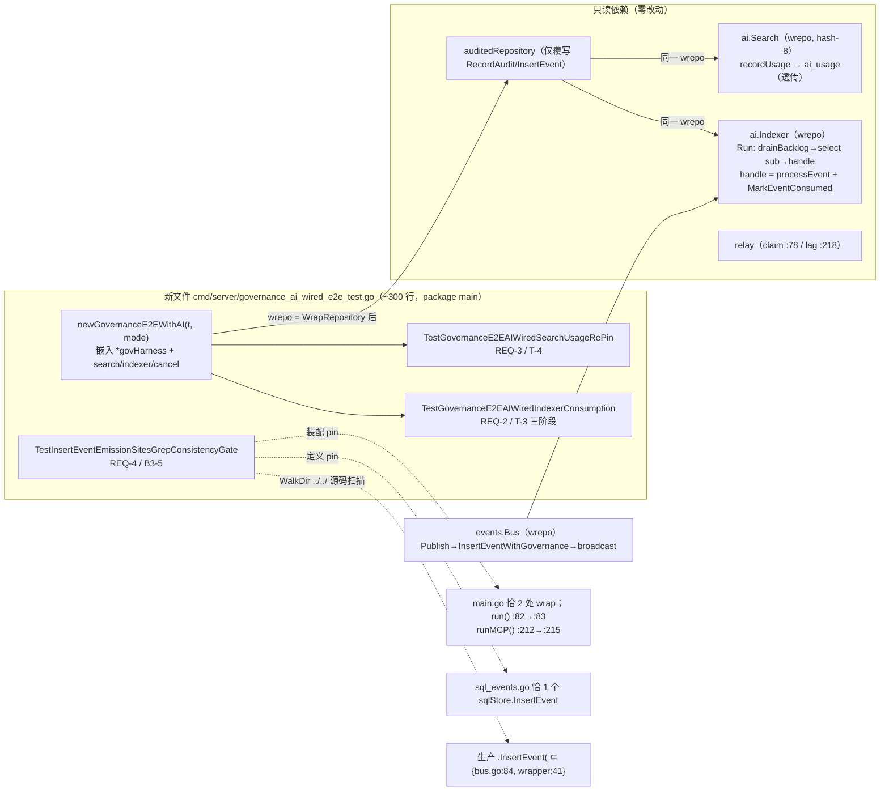

# 设计：AI-wired governance e2e（indexer 消费 + usage 记录与 relay 并发；B3-5 emission-site 门）

> **配套规格：** `docs/requirements/internal-ai-governance-ai-wired-e2e-v1.spec.md`（REQ-1…REQ-4 / T-3 / T-4 / B3-5）· **模块：** `cmd/server`（新测试文件，package `main`）+ `internal/ai` 只读依赖 · **状态：** 设计（未实现）· **基线：** HEAD `15763e2`（spec 为 untracked 新文件；工作树含 sibling B3 未提交修改——本方向**零生产改动**，仅依赖已落地的 seam）
> **门禁：** `make check` 全绿（gofmt/build/vet/test，SQLite+local FS）· 单文件 ≤ 500 行（预算 ≈ 300）· 纯 stdlib（I6，零新 `go.mod` 依赖）· **无 DB schema 变更**（I2）· 无配置表面 · 无 `internal/service`/`internal/ai` 生产代码变更 · 矩阵 harness（`governance_e2e_test.go`）**零编辑**

---

## 1. 证据复核（独立复验，逐行对照本次 checkout；spec §1 全部 7 行 + seam facts）

| # | 规格主张 | 复核结论 |
|---|---------|---------|
| E1 | `governance_e2e_test.go`：`newGovernanceE2E`(:182)、REQ-1(:360)、`wantFactID`(:296)、零 `internal/ai` 引用 | ✅ 实质成立。`grep internal/ai` = **0**；`newGovernanceE2E` 精确 **:182**；REQ-1 注释 :360、测试函数 :361；`wantFactID` 注释 :296-298、函数 **:299**（C3）。文件 489 行 |
| E2 | `internal/ai/indexer.go:143-179`：`Run`/`drainBacklog`/`handle`/`MarkEventConsumed` | ✅ `Run` **:143**（backlog 排空 → select 实时 `sub` → `handle`）；`drainBacklog` **:163**（C2）；`handle` **:174**（`processEvent` + `MarkEventConsumed` **:179**）；`pollEvery` 5s **:136**（C2b）、`batch` 32 **:137** |
| E3 | `internal/ai/search.go:387-410` usage 记录 + warn-only 失败（:462 调用） | ✅ 实质成立。`recordUsage` **定义 :450-466**（C1——:387-410 是 `Query` 体内 cache-hit 路径，调用 :408；主路径调用 :428）；`repo.RecordUsage` **:462 精确**；失败 warn-only **:466**（`"audit usage failed"`）。`RecordUsage` → `sql_chunks.go:115` ✅ |
| E4 | `audit_governance_write.go` `InsertEventWithGovernance` 单事务原子捕获 | ✅ `InsertEventWithGovernance` **:53-96**：同一 tx 内 `INSERT object_events`（RETURNING id, created_at）+ `insertAuditGovernance`（:84 `DeterministicFactID` store 权威 + `OccurredAt` 规范化）→ `tx.Commit()` **:96** |
| E5 | `main.go:82,212` `WrapRepository` 顺序 | ✅ **:82→:83 精确**（`run()`：wrap 后立即 `bus.WithRepository(repo)`）；**:212→:215 精确**（`runMCP()`：wrap 后 `events.NewWithBuffer(repo,…)`）。两处装配均先 wrap 再建 bus |
| E6 | claim/lag 谓词 `delivered_at_ns=0 AND failed_at_ns=0`（`audit_governance_claim.go:78,218`） | ✅ **:78**（SQLite claim）、**:218**（`OldestPendingAuditGovernance` lag）逐字一致；另有 postgres claim :54、IDs 子查询 :110/:169/:191 同谓词 |
| E7 | B3-5 缺口：生产 `.InsertEvent(` 恰 2 处，无既有扫描；`readyz_drill_test.go:332` 先例 | ✅ 独立重跑 `grep -rn "\.InsertEvent("`（排除 `_test.go`/vendor/docs-auto）= **恰 2 处**：`internal/events/bus.go:84`（`Publish`，错误仅 warn 不传播）、`internal/auditgovernance/repository.go:41`（wrapper 透传；定义 `repository.go:36`，包装仅覆写 `RecordAudit`+`InsertEvent`，共 47 行）。先例文件成立但行号漂移（C4）：`TestAlertsYMLAuditGovernanceExprParity` 实为 **:344-370**、`filepath.Join("..","..")` 实为 **:354**；`fact_id_test.go` 先例为 `TestNoUUIDInFactsGo` **:195** |

### 修正（C1-C4，均非阻断）

- **C1** `recordUsage` **定义**在 `search.go:450-466`（非 :387-410）；:387-410 是 `Query` 方法体区间（cache-hit 调用 :408）。:462/:466 两个关键钉点**精确**。
- **C2** `drainBacklog` 定义 **:163**（非 :164）；`pollEvery: 5*time.Second` **:136**（非 :135）。
- **C3** `wantFactID` 函数体 **:299**（:296 为注释首行；规格 T-4 引用语义不变）。
- **C4** readyz 先例行号：函数 **:344**、`"..",".."` 惯用法 **:354**（规格引 :332-369/:338 偏移 ~10 行）；`fact_id_test.go:200` → 实为 **:195**。仅影响注释精度，不影响 REQ-4 设计（本设计引用实际行号）。

### 复核中发现的关键 seam 事实（喂入设计）

- **S1 包装 seam：** `auditedRepository`（47 行）仅覆写 `RecordAudit`(:22) + `InsertEvent`(:36)，`var _ repository.Repository`(:46) 保证全接口；`NextUnconsumedEvents`/`MarkEventConsumed`/`RecordUsage` **原样透传**。`MarkEventConsumed`（`sql_events.go:96-107`）只 `UPDATE object_events.consumed_at`，**不触碰 outbox** —— claim/lag 谓词不可能被 indexer 消费扰动，即 T-3 要钉的 seam。
- **S2 AI 装配链：** `AI_INDEX_ENABLED` → `config.go:146` `AI.Enabled` → `build.go:144-146` `buildEmbedder` 返 nil → `main.go:132` `if embedder != nil` → `ai.go:32` `buildIndexer(...)`；`buildIndexer` 定义 `ai.go:105`：`NewDefaultExtractor`(extractor.go:30) → `NewIndexer`(indexer.go:115-134，nil chunker → `NewChunker()` 600/80，`pollEvery` 5s) → `bus.Subscribe()`(:126) + `go indexer.Run(systemCtx, idxSub)`(:128)。
- **S3 确定性组件：** `NewHashEmbedder(dim)`（embedder.go:37，`Name()="hash-<dim>"` :45；5-rune shingle SHA-256 分桶 + L2 归一）；`NewSearch(repo, emb, logger)`（search.go:37，默认 `repoVectorIndex` :41-43）；`Request`（search.go:94-102，`validate` :152 默认 `K=10` :157 / `Mode="vector"` :164）。`matchesEmbedModel`（search.go:233-235：`current=="" || chunk==current`）要求 chunk 带 `embed_model` —— indexer 插入时钉 `EmbedModel: ix.embedder.Name()`（**indexer.go:395**）：`hash-8` 双侧一致，命中**必然**（REQ-3 确定性依赖）。
- **S4 存储：** `chunks`/`ai_usage` 表在 `0004_ai.up.sql`（:1/:19）；`ai_usage` 列 `tenant_id,caller,query,chunk_ids,object_ids,request_id`（JSON text）齐全；`InsertChunks` `sql_chunks.go:16`、`RecordUsage` `:115`。
- **S5 bus：** `Subscribe()`（bus.go:115，每订阅者缓冲 `defaultSubBuffer=64` :19）；`Publish` 先持久化（经 wrapper → `InsertEventWithGovernance`）再 `broadcast`。
- **S6 harness 现状：** `newGovernanceE2E`(:182-227) = sqlite repo + Migrate + local store + `config.AuditGovernanceConfig{Enabled:true, PollMilliseconds:5, ...}` + `auditgovernance.New` + `WrapRepository` + `events.New(wrepo)` + `bus.WithRepository(wrepo)` + `service.NewFileService(store, wrepo).WithEventSink(bus)`。helpers：`putObject`(:229)/`startRelay`(:239)/`eventRowID`(:248)/`outboxRow`(:279)/`wantFactID`(:299)/`waitForRow`(10s/5ms, :324)/`quiesce`(:340)/`rowFor`(:351)；`e2eTenant="acme"`(:47)；receiver 的 `tokenCalls`/`postCount` 为 `atomic.Int64`。全部 package-`main` 可直接复用。
- **S7 装配 pin 的匹配串必须带限定符：** `grep -rn WrapRepository` 命中 5 处（含 `billing.WrapRepository` `billing.go:33` 与定义 `auditgovernance/repository.go:15`）——REQ-4 只扫 `cmd/server/main.go` 且匹配 **`auditgovernance.WrapRepository(repo, auditRuntime)`** 全限定串，billing 与定义天然排除。

---

## 2. 设计总览



**核心决策：**

- **DD-1（D1 的字面实现）：** `govAIHarness struct { *govHarness; search *ai.Search; indexer *ai.Indexer; cancel func() }` —— **嵌入**而非编辑矩阵 struct。`governance_e2e_test.go` 零编辑（D1 硬约束），而规格要求的可观察 API `h.search.Query(...)` 与 `h.svc/h.dsn/h.rt/h.receiver`（提升字段）完全成立。这消解了规格 REQ-1 第 5 步 "unchanged struct + extend the struct" 的表述张力。
- **DD-2（装配镜像）：** helper 复制 `newGovernanceE2E` 到 wrapped-repo/bus/FileService 步，然后按 `main.go:132-133`→`ai.go:105-129` 序：`NewHashEmbedder(8)` → `NewIndexer(wrepo, store, NewDefaultExtractor(), nil, emb, logger)` → `NewSearch(wrepo, emb, logger)` → `bus.Subscribe()` → `go indexer.Run(ctx, sub)`，**先于任何 PUT 启动**（生产序：indexer 随 server 启动，relay 在事件存在后 claim）。`svc.WithChunkCleaner`/job 注册/BM25/Qdrant 均省略（非目标，见 §4）。
- **DD-3（确定性阶段，零墙钟竞争）：** 正向断言只用 `waitForRow`（10s/5ms 轮询）；负向只用 `quiesce`（50ms 窗口）；并发是真实的（Phase C 中 indexer `handle` 与 relay claim 并行）但**无断言依赖竞态时序**；indexer 的 5s `pollEvery` 永不 gate 断言（`Run` 先 select 实时 `sub`）。
- **DD-4（门的三重 pin）：** 精确匹配串 + 文件级 allowlist + 函数边界解析（`\nfunc ` 切分 main.go），全部 stdlib（`filepath.WalkDir`/`os.ReadFile`/`strings`）。`docs/auto/`、`vendor/`、`.git/`、`.pi-batch/`、`ai-dev/` 跳过（后二者为对规格"仅 docs/auto+vendor"的加固，理由见 F3）。

---

## 3. API 变更（全部为测试面；生产 API 零变更）

### 3.1 新文件 `cmd/server/governance_ai_wired_e2e_test.go`（package `main`）

```
imports: context, encoding/json, io, log/slog, os, path/filepath, strings, testing, time
        internal/ai, internal/auditgovernance, internal/config, internal/events,
        internal/repository, internal/service, internal/storage
```

### 3.2 新 harness（DD-1）

```go
type govAIHarness struct {
    *govHarness               // 提升 svc/dsn/receiver/rt；矩阵文件零编辑
    search  *ai.Search
    indexer *ai.Indexer
    cancel  func()            // bus.Subscribe 的 cancel；t.Cleanup 注册
}

func newGovernanceE2EWithAI(t *testing.T, mode string) *govAIHarness
```

构造序（DD-2）：复制 `newGovernanceE2E` 主体至 `svc` 建立 → `emb := ai.NewHashEmbedder(8)` → `indexer := ai.NewIndexer(wrepo, store, ai.NewDefaultExtractor(), nil, emb, logger)`（`wrepo` = wrapper 返回值，与 bus 持有的同一对象）→ `search := ai.NewSearch(wrepo, emb, logger)` → `sub, cancel := bus.Subscribe()` → `go indexer.Run(context.Background(), sub)` → `t.Cleanup(cancel)`。

### 3.3 测试函数与断言流

**`TestGovernanceE2EAIWiredIndexerConsumption`（REQ-2 / T-3，mode `202-echo`）** —— 三阶段：

| 阶段 | 动作 | 断言（全部 sqlite `?` 占位符，I1） |
|------|------|------|
| A（indexer 存活，纯 B1 快照） | `putObject(t, h.svc, e2eTenant, "wired.txt")` → `eventRowID` | `SELECT COUNT(*) FROM audit_governance_outbox WHERE origin_kind='file' AND origin_id=?` == 1；`outboxRow` 快照：`attempts==0 && deliveredAtNS==0 && failedAtNS==0 && availableAtNS!=0 && claimOwner==""` |
| B（消费并发，relay 未启） | 正向等 `SELECT consumed_at FROM object_events WHERE id=?` 非 NULL（10s 死线） | `SELECT COUNT(*) FROM chunks WHERE object_id=?` ≥ 1；outbox 仍恰 1 行且 `deliveredAtNS==0 && failedAtNS==0`；`OldestPendingAuditGovernance` 返回非空（lag 谓词 `claim.go:218` 仍命中） |
| C（relay + indexer 并发） | `startRelay(t, h.rt)` | `waitForRow(deliveredAtNS>0 && failedAtNS==0 && attempts==1 && claimOwner=="" && lastError=="")`（claim :78 恰产一 claim）；`quiesce(50ms, postCount==1)`；`tokenCalls==1`；`COUNT(*)==1`；`row.id == wantFactID(t, h.dsn, h.receiver.source, obj.ID)`；`OldestPendingAuditGovernance` 变空 |

**`TestGovernanceE2EAIWiredSearchUsageRePin`（REQ-3 / T-4，mode `202-echo`）**：

1. PUT → 等 Phase B 完成（`consumed_at` 非 NULL + chunks ≥ 1）。
2. **PUT 与投递之间**（relay 未启）：`hits, err := h.search.Query(ctx, ai.Request{Tenant: e2eTenant, Bucket: "default", Query: "x", K: 10, Mode: "vector", Caller: "e2e:search", ReqID: "e2e-usage-1"})`；断言 `err==nil`、≥1 hit 且 `ObjectID == obj.ID`（确定性：查询 "x" 与 1 字节 chunk 内容 "x" 经 trim→5-rune 补空格垫成同一 shingle → 同一向量，`hash-8` 双侧 `matchesEmbedModel` 命中，S3）。
3. `SELECT COUNT(*) FROM ai_usage WHERE tenant_id=? AND caller=? AND query=? AND request_id=?` == 1；`object_ids` JSON 含 `obj.ID`（`sql_chunks.go:115` 经 wrapper 透传，不覆写 `RecordUsage`）。
4. `startRelay` → `waitForRow(delivered, attempts==1, failedAtNS==0)` → `quiesce(50ms, postCount==1)` → **`row.id == wantFactID(...)` 重钉**（usage 记录 + chunk 读不扰动 outbox 投递与确定性 ID 输入 `object_events` id/type/created_at + `source_system`）。
5. 负向稳定：`quiesce(50ms, postCount==1)` 在搜索后不变（搜索不产事件、不产 POST）。

**`TestInsertEventEmissionSitesGrepConsistencyGate`（REQ-4 / B3-5）** —— 见 3.4。

### 3.4 门测试设计细节（DD-4）

```go
root := filepath.Join("..", "..")                        // readyz_drill_test.go:354 惯用法
// WalkDir 跳过目录：.git, vendor, docs/auto, .pi-batch, ai-dev（后二者为加固）
// 仅 *.go 且非 *_test.go（测试文件豁免：测试里裸 sqlStore 访问合法）
// 收集全部 `.InsertEvent(` 出现点 (file:line)
```

1. **Call-site allowlist**：每个命中必须属于 `{internal/events/bus.go, internal/auditgovernance/repository.go}`（规约路径 + 行号报告；任何其他生产调用点 → `t.Fatalf` 列出 file:line）。`.InsertEvent(` 的点号前缀天然排除定义行（`func (s *sqlStore) InsertEvent(` 无前缀点）与接口声明。
2. **定义 pin**：`os.ReadFile(internal/repository/sql_events.go)`，`strings.Count(data, "func (s *sqlStore) InsertEvent(")` == 1。
3. **装配 pin**：读 `cmd/server/main.go`，按 `"\nfunc "` 切函数块；断言 `auditgovernance.WrapRepository(repo, auditRuntime)` 全限定串出现**恰 2 次**（billing 包装与 wrapper 定义天然排除，S7）；含 :82 wrap 的函数块内 `bus.WithRepository(repo)` 出现在 wrap 之后；含 :212 wrap 的函数块内 `events.NewWithBuffer(repo` 出现在 wrap 之后。任何把 bus 构造提到 wrap 之前的重排 → CI 红。

---

## 4. 兼容性约束

- **I1（SQL 占位符）：** 全部原生 SQL 用 sqlite `?`（沿用 `outboxRow`/`eventRowID` 既有写法，不经 `rebind`）。
- **I2（迁移）：** 零 schema 变更；依赖既有 `0004_ai.up.sql`（chunks/ai_usage）与 0039-0044 系列（sibling 已落地）。
- **I5（opt-in 安全默认）：** 测试**字面构造**确定性组件（DD-2/D4），不驱动 `AI_INDEX_ENABLED` 环境变量——生产门链（config→buildEmbedder→buildIndexer）是 sibling spec（production-assembly-e2e）的领地，本设计在测试注释中记录映射而非断言。
- **I6（stdlib）：** 仅 `testing` + stdlib；零新依赖。
- **D1（矩阵不动）：** `governance_e2e_test.go` 零编辑（嵌入式 harness，DD-1）；`newGovernanceE2E`、M1-M6 矩阵测试、全部既有 helper 原样。
- **≤500 行门禁：** 预算 ≈ 300 行（harness ~60 / T-3 ~70 / T-4 ~60 / 门 ~80 / 头注 + 空行）。
- **Seam 语义（S1）：** 测试断言的是**行为**（outbox 计数/谓词不受 `MarkEventConsumed` 扰动、usage 经 wrapper 透传落库），不 assert 包装器方法集（接口行为，非 pin——D2）。
- **确定性依赖：** REQ-3 命中断言依赖 indexer 钉 `embed_model`（indexer.go:395）与 HashEmbedder shingle 数学——任一侧漂移都会让断言红（这正是 pin 的目的）。
- **race 兼容：** 并发共享面 = sqlite + `atomic.Int64`（postCount/tokenCalls）+ indexer/search 构造后只读字段；`search.results` 默认 nil（cache 路径跳过），无跨 goroutine 缓存写。`make test-race` 预期绿。
- **`make check` 全量适用：** gofmt/build/vet/test 对新增测试文件无豁免。

---

## 5. 失败模式

| # | 模式 | 缓解 |
|---|------|------|
| F1 | **时序 flake**：indexer 消费与 relay 投递竞争 | 与已绿的矩阵 e2e 同款包络（5ms 轮询 + `waitForRow` 10s 正向 + `quiesce` 负向）；`Run` 先 select 实时 `sub`（broadcast 在 `Publish` 持久化后），5s `pollEvery` 不 gate 任何断言；断言只依赖状态终值，不依赖到达顺序 |
| F2 | **`search.Query` 确定性漂移**：chunk/查询向量不一致 → 命中 flake | `HashEmbedder(8)`：查询 "x" 与 1 字节内容 "x" 同经 trim + 5-rune 空格垫 → 单 shingle 同向量；1 字节内容 < chunker window（600）→ 恒单 chunk；`embed_model` 双侧 `hash-8`（S3）。三环任一断 → 测试红即 pin |
| F3 | **grep 门脆弱**：未来合法新发射点 / 生成物误伤 | allowlist 精确 file+line（门的本意：合法新增须同步改 spec+allowlist）；跳过 `docs/auto/`、`vendor/`，并加固跳过 `.git/`、`.pi-batch/`、`ai-dev/`（分析产物/工作树不可能触发字面扫描）；定义 pin 用全限定串防 `billing` 误配 |
| F4 | **文件超 500 行**：硬门禁拒绝合入 | 预算 ≈300 行；三测试共享 helper 与既有 `waitForRow`/`quiesce`/`outboxRow`/`wantFactID`，零复制 |
| F5 | **goroutine 泄漏**：indexer 未退出 | `t.Cleanup(cancel)` 关 sub；`Run` 在 `ctx.Done()`/`sub` 关闭时返回（indexer.go:148-153）；测试进程退出即回收 |
| F6 | **sqlite 写竞争**：indexer 插 chunk + relay claim 同库并发 | 矩阵 e2e 已有 relay(5ms) 与服务写并发先例；`waitForRow` 对瞬时查询错容忍（`last, _ = outboxRow(...)`）；若 busy 抖动出现，属测试基础设施问题而非产品缺陷，10s 死线吸收 |
| F7 | **usage 写入静默失败**：warn-only 吞错 | REQ-3 以 `COUNT(*)==1` 正向断言兜底——若 `RecordUsage` 失败，测试即红（正是要钉的行为） |
| F8 | **装配重排漏检**：wrap 与 bus 构造换序 | 函数边界解析 + 顺序断言（wrap 索引 < 构造索引，同函数块内）；匹配串全限定，重排即 CI 红 |

---

## 6. 迁移步骤

**生产面：无**（零生产代码、零 schema、零配置、零依赖变更——REQ-1..4 全部是 `cmd/server` 测试）。

1. 新增 `cmd/server/governance_ai_wired_e2e_test.go`（§3）。
2. `gofmt -l cmd/server/governance_ai_wired_e2e_test.go`（须无输出）；`go build ./...`；`go vet ./cmd/server/...`。
3. 定向验证：`go test ./cmd/server -run 'TestGovernanceE2EAIWiredIndexerConsumption|TestGovernanceE2EAIWiredSearchUsageRePin|TestInsertEventEmissionSitesGrepConsistencyGate' -count=1`。
4. 全量门禁：`make check`（SQLite+local FS，零网络）；可选 `make test-race ./cmd/server`。
5. 合入时 spec/design 成对提交（`docs/requirements/` 两文件均为新增，无编辑既有文件）。

---

## 7. 可测验收映射

| 验收（方向） | 规格 | 测试 | 关键断言（→ 证据） |
|------|------|------|------|
| **T-3**：bound-tenant 首 PUT 恰 1 outbox 行 + 恰 1 POST；claim/lag 谓词不受并发 `MarkEventConsumed` 影响 | REQ-2 | `TestGovernanceE2EAIWiredIndexerConsumption` | ① pending/consumed/terminal 三态 `COUNT(*)==1`；② `consumed_at` 置位 + ≥1 chunk 时行仍 pending（`claim.go:218` lag 仍命中）；③ 终态 `deliveredAtNS>0 && failedAtNS==0 && attempts==1`、`postCount==1`（quiesce）、`tokenCalls==1`、`row.id==wantFactID(...)`；④ 投递后 lag 为空 |
| **T-4**：`wantFactID` 以 PUT 与投递之间的 live `search.Query` 重钉 | REQ-3 | `TestGovernanceE2EAIWiredSearchUsageRePin` | ① vector 搜索命中含 `obj.ID`；② `ai_usage` 恰 1 行 `(acme, e2e:search, "x", e2e-usage-1)` 且 `object_ids` 含对象；③ 之后投递仍 exactly-once 且 `row.id==wantFactID(...)`（usage/chunk 读不扰动确定性 ID 输入）；④ 搜索后 `quiesce` POST 数不变 |
| **B3-5**：grep/CI 一致性——所有发射点经 governance wrapper | REQ-4 | `TestInsertEventEmissionSitesGrepConsistencyGate` | ① 生产 `.InsertEvent(` ⊆ {`bus.go:84`, `repository.go:41`}（WalkDir 全树）；② `sql_events.go` 恰 1 个 `sqlStore.InsertEvent` 定义；③ `main.go` 恰 2 处 `auditgovernance.WrapRepository(repo, auditRuntime)`，run() `:82→:83` 与 runMCP() `:212→:215` 均 wrap 先于 bus 构造 |

*验证基准：全部引用在本次 checkout（HEAD `15763e2` 工作树）逐行复验；C1-C4 为已记录的微小行号漂移，不影响任何断言设计。*
