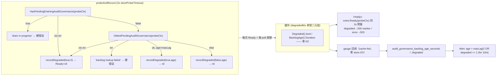

# 设计记录：`internal/auditgovernance` D1 read-path half —— 限定 readiness/gauge 读路径，超时降级而非 503（已落地，本设计 = 回归契约）

> **配套规格：** `docs/requirements/internal-auditgovernance-d1-read-path-timeout-degrade-v1.spec.md`（REQ-1..6 / AC (a)–(d)）· **方向：** `docs/auto/analyses/internal-auditgovernance-ef1a62fa.json` direction 1 · **模块：** `internal/auditgovernance` + seam `cmd/server/http.go` + `cmd/server/build.go` + `deploy/prometheus/alerts.yml` · **状态：** ✅ 已在当前 worktree 落地（commit `15763e2` + 未提交变更，2026-08-08 03:15 UTC）· **实现阶段预期：零生产 delta** —— 验证命名 pin 存在并通过，缺失才补。
> **门禁：** `make check` 全绿（本次实测：`go build ./...` ✓ · `go vet ./...` ✓ · `go test ./internal/auditgovernance/` 36.7s ✓ · `go test ./internal/telemetry/` ✓ · `go test ./cmd/server/ -run 'TestReadyz|TestAlertsYML|TestAuditGovernance'` 8.3s ✓）· 单文件 ≤ 500 行（生产文件全部达标，测试文件按 `Makefile:172-173` 豁免）· 无新 `go.mod` 依赖（I6）· 无 schema 迁移（I2）· 无新配置项。

---

## 0. 结论（verdict）

证据（requirements 阶段输出）**全部核心主张经独立复核成立**：D1 read-path half 已在当前 worktree 落地，五个证据引用 E1–E4 描述的是 ship 前状态（stale）、E5 仍准确；验收 (a)–(d) 均有生产实现 + 通过中的测试 pin；基线全绿。发现 **4 处非阻断性引用漂移**（§1.3），其中 1 处（分析文件名 `ef1fa62a`→`ef1a62fa`）值得在规格里顺手修正。实现阶段**不应**新增 pin（pin 缺口为零），只需跑 `make test-race` 后合入。

---

## 1. 证据复核（对 evidence 表的独立复验，本次实测）

### 1.1 生产代码引用 —— 全部命中

| # | 规格引用 | 复核结论 |
|---|---------|---------|
| S1 | `storeProbeTimeout = 2s`，`runtime.go:22-26` | ✅ 逐字命中（注释明确"Mirrors readyzProbeTimeout (cmd/server/http.go)"，常量 = 2s） |
| S2 | 双探针超时→降级+nil：`runtime.go:255-259` / `:268-272` | ✅ `probeAndRecord` 内 `HasPendingDrainingAuditGovernance`/`OldestPendingAuditGovernance` 均以 `probeCtx`（`:252-253` `context.WithTimeout(ctx, storeProbeTimeout)`）执行；`isProbeCtxError`（`:228-233` = `DeadlineExceeded‖Canceled`）→ Warn + `recordDegraded(true, 0)` + return nil |
| S3 | 真错误 fail-closed：`:260-262` / `:273` | ✅ `"audit governance drain lookup failed"` / `"audit governance backlog lookup failed"` 逐字；drain-in-progress 硬错误 `:263-265` 不变 |
| S4 | maxLag 翻转降级：`:283-288` | ✅ `ok && age > r.maxLag` → Warn + `recordDegraded(true, age)` + nil；健康 `:289` |
| S5 | 降级缓存单锁二元组、零 I/O getter：`:64-67` / `:235-244` / `:213-219` / `:222-226` / 运行循环 `:320-323` | ✅ `degradedMu` 字段注释、`recordDegraded` 单 Lock 写双字段、`Degraded()`/`BacklogAge()` 纯 RLock；run() 每 poll 周期 `probeAndRecord(context.Background())` 喂缓存（G3 注释） |
| S6 | `/readyz` seam：`http.go:96-109`、降级 marker `:113-121`、健康 `:125-127` | ✅ `pingCtx`（`:96-99`）→ `probeCtx`（`:102-103`）→ `store.Stat(probeCtx)`（`:104`）→ `extra.Ready(probeCtx)`（`:109`）共享同一 2s 预算；`dc.Degraded()`（`:117`）→ `{"ok":true,"degraded":true,"backlog_age_seconds":%d}`（`:120`）；健康 `{"ok":true}`（`:126`）；`degradedChecker` 接口 `:39`、组聚合 `:65-84` |
| S7 | gauge 回调 cache-fed、零 store I/O：`build.go:101-118` / `:153-154` | ✅ `auditGovernanceBacklogAgeGaugeFn` → `rt.BacklogAge()`（`:103`）、`auditGovernanceDegradedGaugeFn` → `rt.Degraded()`（`:112`），回调签名 `func(context.Context) int64` 但忽略 ctx；注册 `:153-154`；instrument `internal/telemetry/metrics.go:364-386`（`audit_governance.backlog_age_seconds` / `audit_governance.degraded`） |
| S8 | 告警 OR 臂：`alerts.yml:186-195` | ✅ `expr: audit_governance_backlog_age_seconds > 450 OR audit_governance_degraded == 1`、`for: 10m`、`severity: warning`、description 含 "/readyz stays 200"；注释明确 OR 臂防 `for: 10m` 饥饿重置 |
| S9 | 读路径分类独立于投递路径 | ✅ 读路径 `isProbeCtxError`（`runtime.go:228-233`）；投递路径 `isPermanentDeliveryError` 定义于 `relay.go:255`、调用于 `:87` —— 两处独立，`DeadlineExceeded` 在投递侧仍是 transient（`relay_terminal_test.go:225`，closed list 内） |
| — | repo 查询排除终态行 | ✅ `internal/repository/audit_governance_claim.go:54/78/218` 谓词 `delivered_at_ns=0 AND failed_at_ns=0` |
| — | 告警阈值 450 = 默认 900/2 | ✅ `internal/config/config_audit_governance.go:68` `getEnvInt("AUDIT_GOVERNANCE_MAX_LAG_SECONDS", 900)` |

### 1.2 测试 pin —— 位置与通过状态全部命中（本次 `-count=1` 实测）

| Pin（规格引用） | 实测 |
|---|---|
| `TestRuntimeReadyDegradedSentinel`（`runtime_ready_test.go:176`，elapsed ∈ [1s,5s]） | ✅ PASS 2.18s（挂起 stub 只能等 ctx 截止 → 确定性下界） |
| `TestRuntimeReadyFailClosedOnGenuineStoreError`（`:206`，c1/c2 精确错误串 + `Degraded()==false`；c3 pre-canceled ctx < 1s） | ✅ PASS 0.59s，三子测试全过 |
| `TestRuntimeReadyDegradesOnBacklogLag`（`runtime_test.go:618`，relocated `:415` 模式） | ✅ PASS 4.70s |
| `TestRuntimeBacklogAgeZeroWhenAllTerminal`（`runtime_ready_test.go:254`）、`TestRuntimeRunLoopRefreshesCacheWithoutReadyCalls`（`:348`）、`TestRuntimeRunLoopSurvivesWedgedStore`（`:397`）、`TestRuntimeDegradedCacheConcurrentAccess`（`:416`） | ✅ 全 PASS（0.19s / 0.22s / 2.20s） |
| `TestIsPermanentDeliveryErrorClosedList`（`relay_terminal_test.go:200`，`DeadlineExceeded` @ `:225`）；`assertTerminalState` @ `:117`，`OldestPending... ok==false` @ `:126-128` | ✅ PASS；语义核对无误 |
| `TestReadyzAuditGovernanceDegradedDrill`（`readyz_drill_test.go:447`，200 + marker + elapsed ∈ [1s,5s] + ageGauge=0 ∧ degradedGauge=1） | ✅ PASS 2.54s |
| `TestReadyzExtraProbeTimeout`（`:164`，非降级 checker 超时→503 ∈ [1s,5s]）、`TestReadyzImmediateExtraError`（`:182`，< 1s 503）、`TestReadyzBacklogLagDegradesNot503`（`:215`，8s backdate vs 4s maxLag = 2× margin）、`TestReadyzDrainStill503`（`:261`）、`TestReadyzDeadLetteredBacklog200AndGaugeZero`（`:291`，phase 0–2）、`TestAlertsYMLAuditGovernanceExprParity`（`:384`，阈值由 `config.Load()` 派生 + OR 臂必检） | ✅ 全 PASS（2.00s / 0.00s / 0.62s / 0.49s / 0.57s / 0.00s） |
| `TestReadyzStorageProbeTimeout`（`http_test.go:71-88`，规格 E4 已自行标注 `:69`→`:71` 漂移）、`TestReadyzImmediateStorageError`（`:115-146`）、`TestHelmReadinessProbeTimeoutSeconds`（`:284`，helm `timeoutSeconds: 10` + 禁 `failureThreshold`） | ✅ 全 PASS |
| `TestAuditGovernanceBacklogAgeGaugeSurfaceInScrape`（`metrics_test.go:171`）、`TestAuditGovernanceDegradedGaugeSurfaceInScrape`（`:192`） | ✅ PASS |

文件行数：`runtime.go` 353 · `http.go` 242 · `build.go` 220 · `metrics.go` 489 · `config_audit_governance.go` 327（均 < 500）；`readyz_drill_test.go` 恰好 500、`runtime_ready_test.go` 472（测试文件按 `Makefile:172-173` 豁免 500 行检查）。

### 1.3 非阻断性漂移（evidence 表之外的发现）

| # | 漂移 | 处置 |
|---|------|------|
| D1 | 规格头部引用的分析文件名为 `internal-auditgovernance-ef1fa62a.json`，**实际为 `internal-auditgovernance-ef1a62fa.json`**（十六进制两字符换位；`docs/auto/SUMMARY.md:68-74` 用正确名） | 建议在规格头部顺手修正（文档级，无代码影响） |
| D2 | 分析文件扩展名为 `.json` 但内容是 prose + 内嵌 JSON 块（`JSONDecodeError` at char 0） | 已知既有约定，不影响引用；不改 |
| D3 | 规格 S9 写 `relay.go:87 isPermanentDeliveryError`——`:87` 是调用点，定义在 `:255` | 文档精确化；语义无影响 |
| D4 | 规格 §1 称 worktree 变更窗口为 Aug 8 04:00–06:16；commit `15763e2` 时间戳为 2026-08-07 19:15 -0800（= 08-08 03:15 UTC）。分析文件 mtime 08-07 23:38。若同为 UTC，则分析早于实现成立 | 无需处置；"分析先于实现"结论成立 |

---

## 2. 设计总览（已落地设计即权威设计）

**四条核心语义：**

1. **超时即降级，永不 503**：探针 ctx 超时/取消 = wedge 形状 → `recordDegraded(true, 0)`（age 未知故为 0）+ `Ready` 返回 nil；`/readyz` 得到 200 + `{"ok":true,"degraded":true,"backlog_age_seconds":0}`。真 store 错误仍 fail-closed 503（两条路径的判定边界 = `isProbeCtxError`）。
2. **预算共享**：`/readyz` 的 ping、storage、audit 三组探针共用一个 2s `readyzProbeTimeout` 预算（最坏降级延迟 = 2+2+2 = 6s，注释见 `http.go:50`）；audit 内部探针另有自含的 `storeProbeTimeout = 2s` 兜底（`Ready(req.Context())` 的调用方 ctx 再宽也不会拖垮 readiness）。非降级 checker（无 `degradedChecker` 实现）超时后仍 503 —— 双层契约，两个半边各自有 pin。
3. **读路径 bounded by construction**：gauge 回调不触 store（比"探针 ctx 限定"更强——scrape 永不阻塞在 store 上）；喂缓存的 store 读只发生在 probe 路径且受 2s 约束。wedge 的信号载体是 `degraded == 1` 而非 age（超时 age 未知 = 0），告警用 OR 臂保证 `for: 10m` 累积不被 timeout 样本饿死重置。
4. **两路径分类互不泄漏**：读路径 `isProbeCtxError` 与投递路径 `isPermanentDeliveryError` 是独立函数；`DeadlineExceeded` 在投递侧仍是 transient（重投），在读侧是 degrade——各自有独立 pin（`relay_terminal_test.go:225` vs `runtime_ready_test.go:176`）。

**关键决策（继承规格 D1–D5，逐条确认）：**

| # | 决策 | 复核 |
|---|------|------|
| D1 | `storeProbeTimeout` 是包常量非配置项（镜像 `readyzProbeTimeout`，互引注释） | ✅ `runtime.go:21-26` |
| D2 | 降级是缓存哨兵非活查询（确定性 drill 的前提） | ✅ `Degraded()`/`BacklogAge()` 纯 RLock；run 循环 + 每次 `/readyz` 刷新 |
| D3 | gauge 回调 cache-fed 支配方向的"回调受限（probe ctx）"验收 | ✅ 零 store I/O，`build.go:101-118` |
| D4 | wedge 信号 = degraded gauge + 告警 OR 臂，非 age gauge | ✅ `alerts.yml:187`；drill pin `ageGauge=0 ∧ degradedGauge=1` |
| D5 | 双层 seam 契约（预算保证对所有 extra；自降级仅 audit runtime） | ✅ `TestReadyzExtraProbeTimeout` vs `TestReadyzAuditGovernanceDegradedDrill` |

---

## 3. API 变更（相对 ship 前状态；全部已落地）

| 面 | 变更 | 兼容性 |
|----|------|--------|
| `Runtime.Ready(ctx)` | 语义增强：超时/取消 → **nil + 降级**（此前仅 fail-closed）；真错误路径语义不变 | 行为超集；既有调用方（`readyzHandler`、run 循环）无需改 |
| `Runtime.BacklogAge(ctx) (time.Duration, bool, error)` | **重命名**为 `PendingBacklogAge(ctx)`（store 查询访问器） | ⚠️ breaking（包内 API）；已全仓迁移，实测零残留 `BacklogAge(ctx` 调用点（`runtime.go:198` 为唯一定义；测试侧 `readyz_drill_test.go`、`runtime_ready_test.go`、`runtime_test.go`、`cumulative_window_test.go` 全部改用新名） |
| `Runtime.Degraded() bool`（新） | 零 I/O 缓存 getter | 新增，无破坏 |
| `Runtime.BacklogAge() time.Duration`（新，无参） | 零 I/O 缓存 getter | 新增，无破坏 |
| `degradedChecker` 接口（`cmd/server/http.go:39`） | 新 seam：`Degraded() bool` + `BacklogAge() time.Duration`；组聚合 OR + max（`:65-84`） | 新增；非实现者行为不变（仍走 503 路径） |
| `readyzHandler`（`http.go:90-127`） | `extra.Ready(probeCtx)` 纳入 2s 预算；degraded → 200 marker | 健康响应 `{"ok":true}` 字节不变；marker 仅降级时出现（additive） |
| 指标 | 新增 `audit_governance.backlog_age_seconds`、`audit_governance.degraded`（`metrics.go:364-386`） | 新序列名，无重命名 |
| 告警 | 新增 `AuditGovernanceBacklogDegraded`（`alerts.yml:186-195`） | 纯增量规则 |
| 配置 / schema / 依赖 | 无 | — |

**明确不动的面：** 投递路径分类（`relay.go`）· repo 查询谓词（`delivered_at_ns=0 AND failed_at_ns=0`）· 终态排除 · drain 语义 · 其他 readyz 探针（ping/storage）行为。

---

## 4. 兼容性约束

1. **无配置面**：无新 env（D1）；`AUDIT_GOVERNANCE_MAX_LAG_SECONDS` 默认 900 不变，告警阈值 450 从 `config.Load()` 派生（`TestAlertsYMLAuditGovernanceExprParity` 强制，防止字面量再漂移）。
2. **无 schema 迁移**（I2）：纯 Go + 部署文件变更；不需要 `.up/.down.sql` 对。
3. **响应契约**：健康 `{"ok":true}` 逐字节不变（`http_test.go:198` `TestReadyzHealthyExtraReturns200Unchanged`）；降级 marker 是新增形状，仅当 `Degraded()` 为真时出现。
4. **503 语义保留**：真 store 错误、drain-in-progress、非降级 checker 超时——三类仍 503（各自有 pin）。任何把超时改回 503 的重构都会触发 `TestReadyzAuditGovernanceDegradedDrill` 失败。
5. **投递语义零变更**：`DeadlineExceeded` 在投递侧仍 transient（重投 + 退避）；读侧 degrade 不影响 at-least-once 与终态机。
6. **helm 探针对齐**：`readinessProbe.timeoutSeconds: 10`（> 6s 最坏降级延迟）且无 `failureThreshold`（`TestHelmReadinessProbeTimeoutSeconds` pin）。
7. **行数门禁**：新 pin 必须放进既有测试文件（`readyz_drill_test.go` 已满 500；`runtime_ready_test.go` 472 余量 28 行）。

---

## 5. 失败模式（wedge 与异常矩阵）

| 场景 | 行为 | 可见面 | Pin |
|------|------|--------|-----|
| store 挂起（双探针阻塞至 ctx 截止） | `Ready` ≈2s 后 nil + degraded + age 0；`/readyz` 200 marker；gauge `(0,1)` | 200 + marker + `degraded=1` + 告警 OR 臂 | `TestRuntimeReadyDegradedSentinel`、`TestReadyzAuditGovernanceDegradedDrill` |
| 真 store 错误（非 ctx） | 硬错误，`Degraded()` 保持 false；`/readyz` 503 < 1s | 503 + 日志 `"drain/backlog lookup failed"` | `TestRuntimeReadyFailClosedOnGenuineStoreError` c1/c2、`TestReadyzImmediateExtraError` |
| 调用方 ctx 已取消 | 立即（< 1s）nil + degraded（Canceled 分支） | 与超时同面 | c3-pre-canceled-ctx |
| 背压积压 > maxLag（store 健康） | nil + degraded + 真实 age；200 marker；age gauge > 阈值触发告警 | age 升 + `degraded=1` | `TestRuntimeReadyDegradesOnBacklogLag`、`TestReadyzBacklogLagDegradesNot503` |
| 全部终态/死信（无 pending） | ok=false → age 0、不降级；不阻塞 readiness | age=0、degraded=0 | `TestRuntimeBacklogAgeZeroWhenAllTerminal`、`TestReadyzDeadLetteredBacklog200AndGaugeZero` phases 0–1 |
| 瞬时读错误（非 ctx） | probe 返回前不 record → 缓存保留**上一对合法值**（不把活 wedge 归零） | 与上次同面 | `TestRuntimeRunLoopSurvivesWedgedStore`（循环不因错误停止）+ `runtime.go:320-323` 注释 |
| 无 `/readyz` 流量时 store 恶化 | run 循环每 poll 周期刷新缓存（≤ poll 间隔） | gauge 新鲜度 | `TestRuntimeRunLoopRefreshesCacheWithoutReadyCalls` |
| 并发读缓存 | 单锁二元组：读者只见合法 (degraded, age) 对 | — | `TestRuntimeDegradedCacheConcurrentAccess`（仅 `-race` 有意义） |
| 投递侧超时（与读侧正交） | `DeadlineExceeded` 仍 transient → 重投 | 与既有投递面相同 | `TestIsPermanentDeliveryErrorClosedList` |

---

## 6. 迁移步骤（生产部署）

1. **代码**：无需迁移——本设计已含在 `15763e2` + 当前 worktree 变更中。实现阶段 = 验证 pin + `make check` + `make test-race`，**不新增 pin**（缺口为零）。
2. **部署**：新告警规则随 `deploy/prometheus/alerts.yml` 合入；Prometheus 热加载即可（新规则无兼容风险；`for: 10m` 保证瞬时不误报）。新指标 `audit_governance.{backlog_age_seconds,degraded}` 为新增序列，不替换任何既有序列——旧 Grafana 面板不受影响。
3. **回滚**：单规则可删（回退到 age-only 告警，wedge 可见性降级但不破坏 readiness）；代码回滚 = 恢复 fail-closed Ready（503 行为回归，但无数据/投递影响——degrade 语义仅影响 readiness 与指标，不动 at-least-once 投递）。
4. **观测验证**：`curl /readyz`（健康 = `{"ok":true}`）；`curl /metrics | grep audit_governance`（两序列 present）；停 relay store 观察 200+marker 与 `degraded==1`（替代演练 = 两个 drill 测试）。

---

## 7. 可测试验收映射（AC (a)–(d) → pin，全部本次实测通过）

| 验收（方向原话） | 测试映射 | 实测 |
|---|---|---|
| (a) 阻塞 stub → `Ready` 返回 nil（降级 warn），`/readyz` 200 ∈ 预算 | `TestRuntimeReadyDegradedSentinel`（`runtime_ready_test.go:176`，elapsed ∈ [1s,5s]）+ `TestReadyzAuditGovernanceDegradedDrill`（`readyz_drill_test.go:447`，200 + `"degraded":true` + elapsed ∈ [1s,5s]） | ✅ PASS（2.18s / 2.54s） |
| (b) 即时（非超时）store 错误仍 503 fail-closed | `TestRuntimeReadyFailClosedOnGenuineStoreError` c1/c2（精确错误串 + `Degraded()==false`）+ `TestReadyzImmediateExtraError`（503 < 1s）+ `TestReadyzDrainStill503` | ✅ PASS |
| (c) gauge 回调受限且 wedge 不静默（0/缺失而非假 0），maxLag×0.5 告警在 wedge 时触发 | bounded by construction（`build.go:101-118` cache-fed；`TestReadyzDeadLetteredBacklog200AndGaugeZero` phase 2 证回调返回缓存值）；wedge 可见 = `TestReadyzAuditGovernanceDegradedDrill`（ageGauge=0 ∧ **degradedGauge=1**）；告警 = `TestAlertsYMLAuditGovernanceExprParity`（`age > config.MaxLagSeconds/2 OR degraded == 1`，阈值派生自默认 900→450；OR 臂缺失即 CI 失败）+ scrape 面 `metrics_test.go:171,192`；真错误保留上一对值 = `TestRuntimeRunLoopSurvivesWedgedStore` | ✅ 全 PASS |
| (d) 回归：maxLag 翻转仍降级（`runtime_test.go:415` 模式）+ 终态行仍排除于 `OldestPending` | `TestRuntimeReadyDegradesOnBacklogLag`（`runtime_test.go:618`，relocated 模式，drain 仍硬失败 `:662-670`）+ `TestReadyzBacklogLagDegradesNot503`（200 + 精确 marker，8s backdate vs 4s maxLag = 2× margin）+ 终态排除 = `assertTerminalState`（`relay_terminal_test.go:126-128`）+ `TestRuntimeBacklogAgeZeroWhenAllTerminal`/`TestRuntimeBacklogAgeZeroWhenNoPending`（`runtime_test.go:676`）/`TestReadyzDeadLetteredBacklog200AndGaugeZero` phases 0–1 | ✅ 全 PASS |

**覆盖缺口检查：** 规格 §3 列出的全部命名 pin（§1.2/§7 清单，含子测试与 helper）均在本次实测中运行并 PASS；无缺失 pin；无需新增。规格中唯一未被测试覆盖的声明是降级 Warn 日志文本——规格自身已明确该点仅证据引用、不单独 pin（`io.Discard` logger，pin 断言行为而非日志）。

---

## 8. 风险与门禁

| 风险 | 缓解 |
|------|------|
| Pin 漂移（三个包、跨包重构破坏 pin） | `make check` 覆盖全部三包；`probeAndRecord`/缓存对/marker 体任一重构即破坏命名 pin（`TestReadyzAuditGovernanceDegradedDrill`、`TestAlertsYMLAuditGovernanceExprParity` 是哨兵） |
| 时序 flake | 全部有界断言用阻塞-stub 下界惯用法（响应不可能早于 2s 截止 → 确定性下界；≤5s 仅证有界）；backdate 经第二 WAL writer 替代 sleep（`backdateDrillFact`/`backdatePendingFact`）；无墙钟相等 |
| 并发 | 单锁对纪律；`TestRuntimeDegradedCacheConcurrentAccess` 仅 `-race` 有意义 → **合入前跑 `make test-race`**（本次未跑，列为门禁项） |
| 测试时长 | drill 测试共 ~6 个阻塞用例（auditgovernance + cmd/server 各 ~2s/个）；全包本次实测 36.7s + 8.3s，可接受 |
| 行数 | 生产文件全 < 500；`readyz_drill_test.go` 恰 500——新 pin 不得再入该文件（`runtime_ready_test.go` 余 28 行） |

---

## 9. 实现阶段行动清单（零生产 delta）

1. 验证 §7 的 pin 清单存在且通过（本次已实测全绿）——**不新增 pin**。
2. 修正规格头部分析文件名 `ef1fa62a` → `ef1a62fa`（§1.3 D1，文档级）。
3. 跑 `make test-race`（并发 pin 的唯一意义所在）后合入；`make check` 全量。
4. 不触碰：`relay.go` 分类、repo 谓词、配置面、schema、`readyzProbeTimeout`/storage/ping 探针行为、告警文案内容（`TestAlertsYMLAuditGovernanceExprParity` 已 pin 四要素）。

*验证基础：全部引用于 2026-08-08 在 HEAD `15763e2` + 未提交 worktree 上逐一复验；`-count=1` 实测结果见 §1 与 §7。本设计记录与配对规格（`…-v1.spec.md`）互为镜像；stage artifact 见 `docs/auto/runs/d1-drill-half-bound-the-audit-governance-readine-3670933b/artifacts/requirements-10762e10/requirements.md`。*
