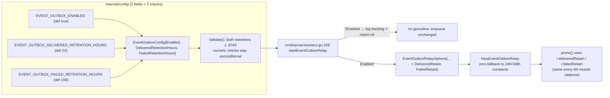

# Design — durable-async event outbox: enable flag + retention knobs

> **Spec:** `docs/requirements/internal-config-durable-async-outbox.spec.md` (REQ-1/REQ-5/REQ-7/REQ-8) · **Module:** `internal/config` + `internal/events` + `cmd/server` + `internal/repository` (additive, D6) · **Status:** design rev 2 — reconciled (testing reviewer amendments A–D + D4 `baseValid()` fix; config reviewer items 1–3; SRE fleet amendments 1–4, incl. D6 backlog count) · **Gate:** `make check` (fmt/vet/build/test, ≤500 lines/file) · stdlib `testing` only (I6) · no new `go.mod` deps · no REST route / OpenAPI / DB schema change.

---

## 1. Evidence re-verification (independent, against this checkout)

All claims in the supplied evidence were re-checked against the working tree. **Verdict: substantively accurate; two immaterial line drifts.**

| Evidence claim | Verified result |
|---|---|
| `EventOutboxConfig` in `internal/config/config_event_outbox.go`, **78 lines**, 5 knobs, defaults 1000/32/30/5/10 | ✅ exact — 78 lines; `PollMilliseconds/BatchSize/ClaimTTLSeconds/HTTPTimeoutSeconds/MaxAttempts`; bounds poll `1..60000`, batch `1..500`, timeout `1..29`, TTL `> 2×timeout` and `≤600`, attempts `1..1000` |
| Wired into `Load()` + `Config.Validate()`, validated **unconditionally** | ✅ `config.go:226` `loadEventOutboxConfig()`; `config_validate.go:41-42` `withDefaults()` + `Validate()` with no `Enabled` gate (billing gates at `config_billing.go:128` — divergence is real, D1 holds) |
| Repository machinery with cited lines | ✅ exact: `HardDeleteObjectWithEvent` :102, `SoftDeleteObjectWithEvent` :147, `SoftDeleteObjectByIDWithEvent` :186, `ClaimEventOutbox` :251 (Postgres `FOR UPDATE SKIP LOCKED` :266/:276), `CompleteEventOutbox` :336, `RetryEventOutbox` :364, `PruneEventOutbox` :393 (**already takes both cutoffs** `deliveredBefore, failedBefore`), `HasEventOutboxFact` :437 |
| Line drift: `repository_interface.go:97` = `ListParts`, `InsertEvent` :100 | ✅ exact; outbox methods at interface :32-35/:106-110 |
| Hardcoded retention at `event_outbox_relay.go:61-63` | ✅ exact: `eventOutboxPruneEveryRounds=60` :61, `eventOutboxDeliveredRetain=24h` :62, `eventOutboxFailedRetain=7×24h` :63; `eventOutboxBackoff` :345 (billingBackoff shape, jitter `[0.75,1.0)×base`, 5 min cap) |
| Wiring at `cmd/server/workers.go:158` | ✅ exact: `startEventOutboxRelay` def at :158, caller at :63, `go relay.Run(ctx)` in body; **no cmd/server test calls it** (zero gate-insertion test risk) |
| Migration `0041_event_outbox.{up,down}.sql` both dialects | ✅ present in `internal/repository/migrations/{sqlite,postgres}/` |
| Docs gap: `.env.example` has no `EVENT_OUTBOX_*` | ✅ exact — `BILLING_OUTBOX_*` at :179-181, `EVENTS_*` block at :234-237, zero `EVENT_OUTBOX_*`; grep of all code/docs/env confirms `EVENT_OUTBOX_ENABLED` exists only inside the spec |
| `docs/configuration.md:354-358` documents 5 vars; "7 days / 24h" note at :358 | ✅ exact |
| Enqueue call sites `file_delete.go:46/:86`, facts `:123`, payload `schema_version 1.1`, bus persist-then-broadcast | ✅ exact (`payload.go:115/:146`; `bus.go` Publish → `InsertEvent` → broadcast) |
| Test anchors | ✅ all present: `event_outbox_test.go` :71/:136/:220/:259/:300/:355/:398/:482/:713/:758 · `relay_test.go` :144/:181/:229/:272/:299/:432/:665 · `schema_test.go` :31/:96 · `file_delete_test.go` :68/:156 |
| **Drift found** | `prune()` is at :362 (spec said :366 — that is the `PruneEventOutbox` call inside it); `Run` at :111 (spec said :106). Immaterial. |

**Gap confirmation (the actual scope):** enable flag and retention knobs are genuinely absent; the other four knobs are shipped and become regression guards.

---

## 2. Design overview



**Core decisions**
- **D1** — Enable flag is an **ops kill-switch, not an opt-in**: default `true`, and it gates *only* the relay loop (claim/deliver/complete + in-loop prune). The transactional enqueue inside `*DeleteObject*WithEvent` is untouched — a disabled relay never blocks, alters, or loses the delete transaction (spec REQ-1, pinned).
- **D2** — Retention split into delivered/failed horizons (spec REQ-5), because `PruneEventOutbox` already takes two independent cutoffs; one knob would force a derivation.
- **D3** — Zero-value fallback in `NewEventOutboxRelay` mirrors the existing per-field pattern (`opts.PollInterval <= 0 → 1000ms`, etc.) — direct callers/tests keep working.
- **D4 — `withDefaults()` must NOT default `Enabled`.** A bool `false` is a valid explicit value; `Config.Validate()` applies `withDefaults()` unconditionally (`config_validate.go:41`), so treating `false` as "unset" would silently flip an operator's explicit `EVENT_OUTBOX_ENABLED=false` back to `true` at every validation. Numeric fields are safe because `0` is never a valid explicit value (all bounds ≥ 1). Contract: `loadEventOutboxConfig()` always sets `Enabled` explicitly; `withDefaults()` fills only numerics; hand-built zero configs get `Enabled=false`, which is harmless because `Validate()` never reads `Enabled` and the only reader is `startEventOutboxRelay` on a `Load()`-produced config.
- **D5** — No shared `OutboxConfig` with billing (spec D1 upheld): claim-TTL invariant differs (`>2×HTTPTimeout` vs `>HTTPTimeout`), knob sets differ, prefixes differ, `Validate()` gating differs. Two private copies stay; factor a shared helper only if a third consumer appears.
- **D6 — F1 visibility is a startup-log COUNT, not a gauge.** While disabled, all 8 outbox counters are frozen (they are relay-side: delivered/retried/failed/claim_lost/pruned/l2_*; the enqueue path increments nothing outbox-specific), there is no outbox gauge, and `PROMETHEUS_ENABLED` defaults off (`config.go:222`) — the F1 backlog is invisible in default ops. Fix: one `SELECT COUNT(1) FROM event_outbox` — dialect-neutral by construction (zero placeholders ⇒ no `rebind` needed) — executed **once per process boot, in both branches of the gate** (`workers.go`), logged as `backlog=N` on the `started`/`disabled` lines; nil-repo/error ⇒ `backlog=unknown`, never blocks or fails startup (diagnostic only). Cost: one aggregate per boot (Postgres seq-scan at outbox scale; SQLite can use its smallest index) — bounded, not per-scrape, not periodic. Rejected alternatives: an observable gauge (`RegisterQueueDepthGauge` pattern) is per-scrape COUNT on a possibly-huge table **and** invisible in default installs (Prometheus off); a periodic COUNT inside the relay loop is silent exactly in the disabled state that needs the signal (the relay does not run when off). Precedent: audit-governance backlog visibility via `OldestPendingAuditGovernance` + maxLag (`internal/auditgovernance/runtime.go:157`).

---

## 3. API changes (concrete)

### 3.1 `internal/config/config_event_outbox.go` (78 → ~120 lines)

```go
type EventOutboxConfig struct {
    Enabled                bool // EVENT_OUTBOX_ENABLED
    PollMilliseconds       int  // EVENT_OUTBOX_POLL_INTERVAL_MILLIS
    BatchSize              int  // EVENT_OUTBOX_BATCH_SIZE
    ClaimTTLSeconds        int  // EVENT_OUTBOX_CLAIM_TTL_SECONDS
    HTTPTimeoutSeconds     int  // EVENT_OUTBOX_HTTP_TIMEOUT_SECONDS
    MaxAttempts            int  // EVENT_OUTBOX_MAX_ATTEMPTS
    DeliveredRetentionHours int // EVENT_OUTBOX_DELIVERED_RETENTION_HOURS
    FailedRetentionHours   int  // EVENT_OUTBOX_FAILED_RETENTION_HOURS
}
```

- `loadEventOutboxConfig()` adds:
  ```go
  Enabled:                 getEnvBool("EVENT_OUTBOX_ENABLED", true),
  DeliveredRetentionHours: getEnvInt("EVENT_OUTBOX_DELIVERED_RETENTION_HOURS", 24),
  FailedRetentionHours:    getEnvInt("EVENT_OUTBOX_FAILED_RETENTION_HOURS", 168),
  ```
- `withDefaults()` adds the two retention fills (`24`/`168`); **no `Enabled` handling** (D4). Add a comment at the `withDefaults` site noting the asymmetry: a hand-built zero `Config{}` yields relay-**off**, an env-loaded one relay-**on** — harmless today (`Validate()` never reads `Enabled`; `loadEventOutboxConfig()` at `config.go:226` is the only production producer) but a latent footgun for any future path that constructs `Config` directly (must set `Enabled` explicitly).
- `Validate()` adds (order: after MaxAttempts; `0` rejected, not "disable"):
  ```go
  if c.DeliveredRetentionHours <= 0 || c.DeliveredRetentionHours > 8760 {
      return errors.New("EVENT_OUTBOX_DELIVERED_RETENTION_HOURS must be within 1..8760")
  }
  if c.FailedRetentionHours <= 0 || c.FailedRetentionHours > 8760 { /* same shape */ }
  ```
- Validation stays **unconditional** — invalid numerics fail startup even when `Enabled=false` (spec REQ-1; matches today's behavior).

### 3.2 `internal/events/event_outbox_relay.go` (374 → ~395 lines)

```go
type EventOutboxRelayOptions struct {
    PollInterval    time.Duration
    BatchSize       int
    ClaimTTL        time.Duration
    HTTPTimeout     time.Duration
    MaxAttempts     int
    AuditSink       AuditSink
    DeliveredRetain time.Duration // NEW; <= 0 → 24h (eventOutboxDeliveredRetain)
    FailedRetain    time.Duration // NEW; <= 0 → 168h (eventOutboxFailedRetain)
}
```

- Relay struct gains `deliveredRetain`/`failedRetain`; `NewEventOutboxRelay` adds the two zero-fallbacks next to the existing five; `prune()` (:362) passes `now.Add(-r.deliveredRetain)` / `now.Add(-r.failedRetain)` to `PruneEventOutbox` instead of the package constants. Constants stay as the fallback defaults. Package constants `eventOutboxDeliveredRetain`/`eventOutboxFailedRetain` remain (used by the fallback); prune cadence (every 60 rounds) unchanged.

### 3.3 `cmd/server/workers.go:158` `startEventOutboxRelay`

1. Gate first, before options/L2-sink construction:
   ```go
   if !cfg.EventOutbox.Enabled {
       logger.Info("event outbox relay disabled",
           "backlog", eventOutboxBacklog(ctx, repo)) // D6
       return nil
   }
   ```
   Disabled ⇒ no goroutine, no L2 sink build, no prune; the backlog count is the one diagnostic that still runs (read-only, nil-repo-safe — §3.5). `Config.Validate()` still validates `AuditSinkL2` unconditionally today — unchanged fail-fast for malformed endpoints even when the relay is off (consistent with the numeric knobs).
2. Options gain:
   ```go
   DeliveredRetain: time.Duration(cfg.EventOutbox.DeliveredRetentionHours) * time.Hour,
   FailedRetain:    time.Duration(cfg.EventOutbox.FailedRetentionHours) * time.Hour,
   ```
3. "event outbox relay started" log gains `delivered_retain_h`/`failed_retain_h` **and `backlog`** (D6).

### 3.4 Docs (same change, AGENTS.md extension pattern)

- `.env.example`: new `EVENT_OUTBOX_*` block appended after the `EVENTS_*` block (:234-238), mirroring the `BILLING_OUTBOX_*` format (:179-181), all 8 keys: `EVENT_OUTBOX_ENABLED`, `EVENT_OUTBOX_POLL_INTERVAL_MILLIS`, `EVENT_OUTBOX_BATCH_SIZE`, `EVENT_OUTBOX_CLAIM_TTL_SECONDS`, `EVENT_OUTBOX_HTTP_TIMEOUT_SECONDS`, `EVENT_OUTBOX_MAX_ATTEMPTS`, `EVENT_OUTBOX_DELIVERED_RETENTION_HOURS`, `EVENT_OUTBOX_FAILED_RETENTION_HOURS`.
- `docs/configuration.md:354-358` table: add `EVENT_OUTBOX_ENABLED` (default `true`; kill-switch for the relay loop, enqueue unchanged; carries the review sentence "unparseable values fall back to the default (`true`)") + the two retention rows (`1..8760`, defaults `24`/`168`; each carries "non-numeric values silently fall back to the default"; the delivered row carries the fleet-min hard property "effective retention = min across running nodes — the most aggressive prune wins fleet-wide; configure identically on every replica" and the prune cadence/slack sentence "once per 60 relay rounds = 60s–60min across the poll bounds, so effective retention is the horizon plus up to one prune interval, ≈2× at the extremes (poll 60s + retention 1h ⇒ 1–2h)"; the failed row cross-references both); rewrite the `:358` note ("failed rows are pruned after 7 days, delivered rows after 24h") to "defaults; see `EVENT_OUTBOX_*_RETENTION_HOURS`"; update the "always-on relay" prose in the section intro (it now reads "always-on unless `EVENT_OUTBOX_ENABLED=false`").
- **Fleet semantics (per-process kill-switch):** the switch is per-process — during a rolling deploy with `EVENT_OUTBOX_ENABLED=false`, old-binary nodes keep claiming/delivering/pruning the shared table; it only bites when the fleet is fully new (F10a). Drain on re-enable ≈ `batch × poll` = 32 facts/s at defaults (`EVENT_OUTBOX_BATCH_SIZE` is the lever); the `backlog=N` boot log (D6) is the only default-on visibility signal.

### 3.5 Startup backlog visibility (F1) — `internal/repository` + `cmd/server/workers.go`

- **`internal/repository/event_outbox.go`** (480 → ~490 lines; after `HasEventOutboxFact` ~:445):
  ```go
  // CountEventOutbox returns the total event_outbox row count (any status).
  // Used only by the relay startup log (D6); dialect-neutral by construction
  // (no placeholders → no rebind needed, I1 unaffected).
  func (s *sqlStore) CountEventOutbox(ctx context.Context) (int64, error) {
      var n int64
      err := s.db.QueryRowContext(ctx, `SELECT COUNT(1) FROM event_outbox`).Scan(&n)
      return n, err
  }
  ```
  Interface: `CountEventOutbox(ctx context.Context) (int64, error)` added to `repository.Repository` after `HasEventOutboxFact` (`repository_interface.go` 200 → ~201 lines).
- **`cmd/server/workers.go`** (200 → ~222 lines) — small diagnostic helper, called from **both** branches (gate behind the log lines only; not on a timer, not per-scrape):
  ```go
  // eventOutboxBacklog returns the event_outbox depth for the startup log.
  // Diagnostic only: nil repo or query error → "unknown"; never blocks startup.
  func eventOutboxBacklog(ctx context.Context, repo repository.Repository) any {
      if repo == nil {
          return "unknown"
      }
      n, err := repo.CountEventOutbox(ctx)
      if err != nil {
          return "unknown"
      }
      return n
  }
  ```
  The `disabled` line carrying `backlog=N` is the **only** outbox signal that exists while the relay is off (all counters frozen); the `started` line carrying it surfaces a crash-restart backlog.

### 3.6 No changes

`PruneEventOutbox` semantics (already takes both cutoffs) · migrations · `internal/events/payload.go` / bus · `internal/service/file_delete.go` · billing config · telemetry (deliberately unchanged — D6).

---

## 4. Compatibility constraints

| # | Constraint | Why it holds |
|---|-----------|--------------|
| C1 | Defaults reproduce shipped behavior **exactly** on upgrade: relay on, prune cutoffs 24h/168h, all numeric defaults unchanged | Zero behavioral delta; the flag/retention envs are pure additions |
| C2 | `Enabled` semantics: enqueue **never** gated | Delete transaction must keep writing both facts even when the relay is off (deletion atomicity is not gated — spec REQ-1); rows drain on re-enable in claim order `available_at_ns, created_at_ns, id` (FIFO by `available_at_ns`; `created_at_ns` is only the tiebreak — insert sets both ≈ now) |
| C3 | `withDefaults()` excludes `Enabled` (D4) | Prevents `Config.Validate()` from flipping an explicit `false` to `true` |
| C4 | `NewEventOutboxRelay` zero-fallback keeps existing direct callers and all `relay_test.go` constructions working with no edits | New options fields are `<= 0` → package constants |
| C5 | Claim-TTL invariant **not** relaxed to billing's `> HTTPTimeout` | Shipped `> 2×` rule (D7) prevents duplicate POSTs from slow-target + lease-expiry; D1 keeps the structs separate so no merge pressure exists |
| C6 | No **breaking** interface/schema/payload change — one **additive** `CountEventOutbox` (D6) | `PruneEventOutbox` signature already sufficient; `vault.file.deleted@1.1`/`notify@1.1` byte-exactness untouched; the additive method is rollback-safe (old binary never calls it) and breaks no test code (no full-interface implementations — verified) |
| C7 | New config errors name their env var, startup fails fast | Matches every existing knob's error contract |
| C8 | No cmd/server test calls `startEventOutboxRelay` | Gate insertion breaks nothing (verified) |
| C9 | `.env.example` + `docs/configuration.md` in the same PR | AGENTS.md extension-entry pattern; prevents recurrence of the docs/env drift |
| C10 | Unknown env vars are inert on old binaries | Rollback = revert PR; old binary ignores the new vars |

---

## 5. Failure modes

| F# | Mode | Behavior | Mitigation / note |
|----|------|----------|-------------------|
| F1 | Relay disabled, rows accumulate | **2 facts per delete** (deleted@1.1 + notify@1.1, `file_delete.go:123-136`), all stuck `pending` — no claim/deliver/complete/prune while off. Growth = 2×delete rate (no enqueue throttle: `RATE_LIMIT_RPS` defaults 0, unlimited — `internal/middleware/ratelimit.go:39`): @10 deletes/s → 1.73M facts/day (~1–2 GB @ ~0.5–1 KB/row incl. 3 indexes); @32 deletes/s → 5.5M/day. On re-enable the backlog drains FIFO (`ORDER BY available_at_ns, created_at_ns, id`) at **batch 32 × poll 1s ≈ 32 facts/s nominal**; worst case (targets at timeout ⇒ batch cycle ≈ 30s claimTTL) ≈ 1.1 facts/s. Time-to-empty **with deletes continuing at 10/s** (net 12 facts/s): 24h backlog (1.73M) ≈ **40h**; 7d backlog (12.1M) ≈ **11.7d**. **Enqueue ≥ 32 facts/s ⇒ backlog never drains** (relay capacity crossover); degraded targets ⇒ never drains even at 10/s. Delivered rows linger ≤24h after drain (prune horizon) + ≤60s prune slack. Mitigation: **startup-log COUNT** (D6/§3.5) puts the depth on the `started`/`disabled` lines — the only outbox signal that exists while disabled (8 counters are relay-side and frozen when off; `PROMETHEUS_ENABLED` defaults off) |
| F2 | `EVENT_OUTBOX_ENABLED=tru` (unparseable) | `getEnvBool` parse error → default `true` (relay runs) | Consistent with all `getEnvBool` users; the "unparseable values fall back to the default (`true`)" sentence lives in the `.env.example`/`docs/configuration.md` rows (§3.4), not only here; fails toward the known-good running state — a kill-switch that fails to kill is detectable via the boot log line, a silent-off would be strictly worse; pinned by AC-1 test 5 |
| F3 | Retention `0` or negative | `Load()` fails startup with an error naming the env var | Validation bound (F-fail-fast) |
| F4 | Retention `> 8760` | `Load()` fails startup | Validation bound; 8760h ≈ 365d is also far inside `time.Duration` range (no overflow) |
| F5 | Zero/negative retention passed directly to `NewEventOutboxRelay` | Falls back to 24h/168h constants — identical to today's behavior | C4 zero-fallback |
| F6 | Explicit `Enabled=false` silently flipped | **Prevented by design** (D4: `withDefaults` excludes `Enabled`) | Guarded by AC-1 test 4 (`TestEventOutboxValidate_PreservesExplicitDisabled`, baseValid end-to-end) |
| F7 | L2 endpoint configured while relay disabled | No audit egress (loop not running); malformed L2 endpoint still fails startup via unconditional `Config.Validate()` | Documented; symmetric with numeric knobs being validated regardless of `Enabled` |
| F8 | Replicas run with different retention settings | Each prunes by its own cutoffs; shared table ⇒ **effective retention = min across running nodes — the most aggressive prune wins fleet-wide** (one node with `EVENT_OUTBOX_DELIVERED_RETENTION_HOURS=1` truncates what siblings' 168h would keep); prune stays idempotent (row-identity delete by `delivered_at_ns`/`created_at_ns` cutoff, `AUTOINCREMENT` id guards reuse; `event_outbox_delivered.outbox_id` has no FK — no FK-violation mode) | Uniform retention is a **hard requirement**, stated as such in §3.4; per-replica boot lines (started/disabled + retain hours) make drift visible; relay-level idempotency pinned by AC-4 test 3 (optional second-`prune()` → 0) |
| F9 | Prune error while configured retention is in effect | `prune()` logs and continues (existing behavior) | No change to error handling |
| F10 | Flag/retention envs set but old binary | Env vars ignored. **Fleet semantics during mixed versions:** (a) the kill-switch is per-process — during a rolling deploy with `EVENT_OUTBOX_ENABLED=false`, every old-binary node keeps claiming/delivering/pruning the shared table; the switch only bites when the fleet is fully new. (b) Retention changes are fleet-min effective: *increases are ineffective* while any old node runs, *decreases apply immediately* — and **rolling back a retention increase reverts prune to 24h and silently deletes 24h+ delivered rows within ≤60 rounds** (the one data-loss-adjacent path). (c) Rollback with `EVENT_OUTBOX_ENABLED=false` set re-enables the relay silently (safe direction, intent dropped) | Rollback-safe (C10); fleet caveats documented in §6 steps 5-6; verify via fleet-wide log grep (§6 step 6), not a single node |
| F11 | Retention string non-numeric (e.g. `EVENT_OUTBOX_DELIVERED_RETENTION_HOURS=abc`) | `getEnvInt` parse error → silent fallback to the default (`24`/`168`), **not** a startup failure | Same fail-open family as F2; benign direction (rows kept longer, never deleted early); consistent with every `getEnvInt` user; documented on the retention rows in `docs/configuration.md`; pinned by AC-1 test 5 (int control) |

---

## 6. Migration steps

1. **No DB migration.** Schema untouched; `PruneEventOutbox` already accepts both cutoffs.
2. Single PR containing code + `.env.example` + `docs/configuration.md` (C9), passing `make check` (fmt/vet/build/test) and `make test-race`.
3. **Existing deployments:** zero action. New defaults (`Enabled=true`, 24h/168h) reproduce shipped behavior byte-for-byte (same prune cutoffs, always-on relay, same enqueue path).
4. **Optional operator actions:** `EVENT_OUTBOX_ENABLED=false` stops the relay loop (backlog accumulates and drains on re-enable at ≈ `batch × poll` = 32 facts/s at defaults); retention envs tune table-growth policy.
5. **Rollback:** revert the PR; the old binary ignores the new env vars (C10). Fleet caveats: with `EVENT_OUTBOX_ENABLED=false` set, rollback silently re-enables the relay (safe direction — intent dropped, F10c); rolling back a retention *increase* reverts prune to the 24h delivered cutoff and deletes 24h+ delivered rows within ≤60 rounds — before reverting, either drain the table or lower retention via env on the new binary (F10b).
6. **Verify after deploy:** startup log shows `event outbox relay started … delivered_retain_h failed_retain_h backlog=N` (or `event outbox relay disabled backlog=N` — N is the live table depth, the F1 signal); grep the line **fleet-wide**, it attests per-process state and re-fires per restart (a single old node defeats the fleet's intent); spot-check `event_outbox` row count after a delete with `EVENT_OUTBOX_ENABLED=false` to confirm facts still land (AC-4).

---

## 7. Testable acceptance mapping

### F# → acceptance mapping (1:1, post-reconciliation)

| F# | Mapped test(s) |
|----|----------------|
| F1 | AC-4 `TestStartEventOutboxRelay_Disabled` + AC-4 composition (`event_outbox_test.go:136` + `:482`) + AC-5 count tests |
| F2 | AC-1 `TestEventOutboxLoad_UnparseableEnvFallsBackToDefault` (parse-error branch `"tru"`) |
| F3 | AC-1 `TestEventOutboxValidation` rows `0`/`-1` (delivered + failed) |
| F4 | AC-1 `TestEventOutboxValidation` rows `8761` (reject) + `8760` (valid, no-overflow pin) |
| F5 | AC-4 `TestOutboxRelay_ZeroRetentionFallsBackToDefaults` |
| F6 | AC-1 `TestEventOutboxValidate_PreservesExplicitDisabled` (baseValid; negative + positive control) |
| F7 | AC-1 `TestEventOutboxValidate_DisabledStillValidatesL2` (config half) + AC-4 `TestStartEventOutboxRelay_DisabledSkipsL2Build` (relay half) |
| F8 | AC-4 `TestOutboxRelay_PruneUsesConfiguredRetention` (+ optional second-`prune()` → 0) + existing `event_outbox_test.go:355` |
| F9 | Documented pre-existing behavior (optional low-value stub test; not in PR) |
| F10 | Documented rollback property — untestable in-tree (needs a pre-change binary) |
| F11 | AC-1 `TestEventOutboxLoad_UnparseableEnvFallsBackToDefault` (int control `abc` → `24`) |

### AC-1 — defaults + bounds validation (new tests; `internal/config/config_event_outbox_test.go`, stdlib only, `config_billing_test.go` pattern; `clearEnv` helper at `config_test.go:351`)

| Test | Assertions |
|------|-----------|
| `TestEventOutboxDefaults` | `t.Setenv` each of the 8 vars to `""` (empty string reads as unset for `getEnvInt`/`getEnvBool`) → `loadEventOutboxConfig()` returns `Enabled=true`, poll `1000`, batch `32`, TTL `30`, timeout `5`, attempts `10`, delivered `24`, failed `168` |
| `TestEventOutboxValidation` | Table-driven `Load()` rejection, one var at a time (`clearEnv` + `t.Setenv`, `config_test.go:351` pattern): poll `0`/`60001`, batch `0`/`501`, timeout `0`/`30`, TTL `10` (=2×5, boundary) / `601`, attempts `0`/`1001`, delivered `0`/`-1`/`8761`, failed `0`/`-1`/`8761`; **valid-boundary positives:** poll `60000`, batch `500`, timeout `29`, TTL `11` (=2×5+1, strict-`>` boundary) / `600`, attempts `1000`, delivered `1`/`8760`, failed `1`/`8760` (the `8760` rows also assert `8760*time.Hour > 0` — no-overflow pin); TTL rows set `EVENT_OUTBOX_HTTP_TIMEOUT_SECONDS=5` explicitly (the rule is cross-var); each error names the offending env var; claim-TTL rule asserted as `> 2×HTTP_TIMEOUT` (stricter than billing — do-not-relax guard) |
| `TestEventOutboxWithDefaults` | Zero `EventOutboxConfig` → `withDefaults()` fills the 7 numeric fields; **`Enabled` stays `false`** (pins D4 at the unit boundary) |
| `TestEventOutboxValidate_PreservesExplicitDisabled` | **Built on `baseValid()` (`config_test.go:185`)** — a bare zero `Config{}` fails earlier at `validateStorage` (empty `STORAGE_BACKEND`), so the original zero-config formulation could never reach the EventOutbox section. `c := baseValid(); c.EventOutbox = EventOutboxConfig{Enabled: false}` (zero numerics — `withDefaults()` fills them, which also proves the disabled config validates) → `c.Validate()` OK and `c.EventOutbox.Enabled` still `false`; **positive control** `Enabled: true` survives unchanged (the test can't pass vacuously). Pins D4 end-to-end through the *only* production caller of `withDefaults()` — the pointer-receiver write-back at `config_validate.go:41` (F6) |
| `TestEventOutboxLoad_UnparseableEnvFallsBackToDefault` | `clearEnv`; `t.Setenv("EVENT_OUTBOX_ENABLED", "tru")` → `Load()` → `Enabled == true` (parse-error branch; `"tru"` is a genuine parse error — `"1"` would legitimately parse `true`); controls: `"0"` → `false` (ParseBool accepts `0`); `EVENT_OUTBOX_DELIVERED_RETENTION_HOURS=abc` → `24` (int-side silent fallback, F11) |
| `TestEventOutboxValidate_DisabledStillValidatesL2` | `baseValid()` + `EventOutbox.Enabled=false` + `AuditSinkL2.Endpoint="not-a-url"` → `Validate()` errors naming `AUDIT_SINK_L2_ENDPOINT` (`AuditSinkL2Config.Validate()` at `config_audit_sink_l2.go:158-167` fails only on non-empty malformed endpoints; invoked unconditionally at `config_validate.go:45`); positive control: same config with a valid endpoint → OK (F7, config half) |

### AC-2 — same-transaction enqueue, restart survival, backoff+jitter, terminal failed (regression guards, existing)

| Anchor | Covers |
|--------|--------|
| `event_outbox_test.go:136` `TestDeleteObjectWithEvent_OneTx` + `:758` `TestHardDeleteAuditInsertFailure_RollsBack` | delete + facts commit/rollback in one transaction |
| `:220` `TestEventOutboxClaimCompleteLifecycle` | claim → complete lifecycle |
| `:300` `TestEventOutboxRetryBackoffAndTerminalFailed` | retry → terminal `failed` at max attempts |
| `:259` `TestEventOutboxClaimLeaseExpiryRedelivers` | lease expiry → redelivery (restart survival; rows are table state) |
| `relay_test.go:144` `TestOutboxRelay_DeliveryLifecycle`, `:181` `TestOutboxRelay_RetriesOn5xx`, `:299` `TestEventOutboxBackoffBounds` | delivery, 5xx retry, jitter bounds `[0.75,1.0)×base` cap 5 min |

Run: `make test` (SQLite baseline) + `make test-race`.

### AC-3 — event schema round-trip (regression guards, existing)

`schema_test.go:31` `TestEventSchema_GoldenJSON` + `:96` `TestEventSchema_Deleted11Envelope` (byte-exact goldens) · repository stores payload as TEXT byte-exact (`0041_event_outbox.up.sql`) with `schema_version=="1.1"` enforced at insert (`validOutboxPayload`, `event_outbox.go:85`) · `file_delete_test.go:156` `TestAdminDelete_EmitsExactlyOneDeletedFact`.

### AC-4 — composition e2e (existing + new env-dependent)

| Anchor | Covers |
|--------|--------|
| `relay_test.go:229` `TestOutboxRelay_ClaimLostLeadsToReclaimNotDoubleSchedule` + `event_outbox_test.go:259` | response-before-delivery (relay in own goroutine, `workers.go:178` `go relay.Run(ctx)`), crashed-worker reaping (`inflight AND lease_expires_at_ns <= now` re-claim) |
| **NEW** `cmd/server/workers_test.go` `TestStartEventOutboxRelay_Disabled` | `cfg.EventOutbox.Enabled=false` → `startEventOutboxRelay(ctx, cfg, logger, nil)` returns `nil` without requiring repo (gate precedes any repo/goroutine use — testable with `nil` repo precisely because the gate is first); the disabled-branch backlog count is nil-repo-safe (D6): logs `event outbox relay disabled` with `backlog=unknown`, no panic |
| **NEW** `cmd/server/workers_test.go` `TestStartEventOutboxRelay_DisabledSkipsL2Build` | Same shape with `cfg.AuditSinkL2.Endpoint="not-a-url"` (malformed) → still returns `nil` — pins fail-fast lives *solely* in `Config.Validate()` and the gate precedes the L2-sink build (`workers.go:166-176`) (F7, relay half) |
| **NEW** `relay_test.go` `TestOutboxRelay_PruneUsesConfiguredRetention` | Relay with `DeliveredRetain=1h`, `FailedRetain=2h`; seed rows; `prune()` deletes only rows older than the configured horizons (extend the `event_outbox_test.go:355` shape at relay level). **Harness (amendment D):** `openRelayTestRepo` (`relay_test.go:60`) must return the DSN (or add `openRelayTestRepoAt`) so tests can open raw SQL; the failed-horizon half needs no backdating — `RetryEventOutbox`'s `next time.Time` param sets `available_at_ns` arbitrarily far in the past via the public interface; the delivered-horizon half needs raw-SQL backdating of `delivered_at_ns` — new `backdateDeliveredAt` helper in package `events` (mirror `backdateEventOutboxDelivered`, `repository/event_outbox_test.go:645`). Call `r.prune()` directly (unexported, same package — no 60-round wait). Optional hardening (F8): a second `prune()` run returns 0 (relay-level idempotency) |
| **NEW** `relay_test.go` `TestOutboxRelay_ZeroRetentionFallsBackToDefaults` | `NewEventOutboxRelay` with zero retains → prune behaves exactly as today (24h/168h constants at `event_outbox_relay.go:62-63`); shares the seed/backdate helpers; seed rows at ages between the constants' horizons; assert identical removal (F5) |
| Enqueue-unchanged composition | `event_outbox_test.go:136` (delete writes both facts) + `:482` `TestHasEventOutboxFact` (facts observable) + AC-4 disabled-gate test together pin "flag off ⇒ no relay, facts still enqueued" |

### AC-5 — startup backlog visibility (D6; new tests)

| Test | Assertions |
|------|-----------|
| `event_outbox_test.go` `TestEventOutboxCount` (NEW) | `CountEventOutbox` → `0` on empty store; after one `HardDeleteObjectWithEvent` (2 facts, existing harness `openEventOutboxTestStore`/`seedOutboxObject`/`validDeleteFacts`) → `2`; both dialects via the standard store harness |
| `workers_test.go` `TestStartEventOutboxRelay_Disabled` (amended, AC-4) | nil repo ⇒ returns `nil`; log line `event outbox relay disabled` carries `backlog=unknown` (count guard pinned — D6) |
| `workers_test.go` `TestStartEventOutboxRelay_StartedLogsBacklog` (NEW, optional) | real sqlite repo (`repository.Open` + `Migrate`, AGENTS.md test pattern) + 2 seeded facts → started line carries `backlog=2`; pins the started-branch wiring end-to-end |

---

## 8. Non-goals (spec §4 upheld)

No `event_outbox` schema change · no payload/schema change (`1.1` byte-exactness preserved) · no billing knob changes · no shared `OutboxConfig` (D1/D5) · no prune-cadence knob (`every 60 rounds` stays derived from poll interval) · no claim-TTL invariant relaxation · no new `go.mod` dependencies · **no outbox gauge / telemetry change** (F1 visibility is the startup-log COUNT — D6; a `event_outbox.pending` observable gauge under `PROMETHEUS_ENABLED` is a future option, with the per-scrape COUNT cost + default-off caveat noted).

*Line budget: `config_event_outbox.go` 78→~120 · `event_outbox_relay.go` 374→~395 (the COUNT method is deliberately NOT here — it lives in repository + workers, §3.5) · `internal/repository/event_outbox.go` 480→~490 (`CountEventOutbox` ~10 lines — ~10 lines of headroom left, no further additions to this file this cycle) · `repository_interface.go` 200→~201 · `cmd/server/workers.go` 200→~222 (gate count + `eventOutboxBacklog` helper) · telemetry unchanged — all ≪ 500. `make check` applies unchanged.*
