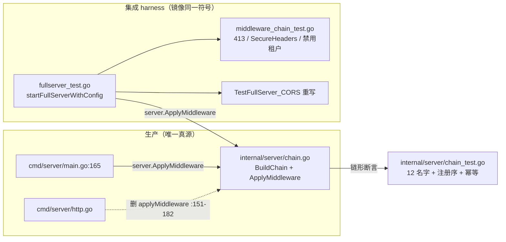

# Design: 共享 12 环中间件链 helper（internal/server）+ harness 镜像 + 4 个行为测试

> **Companion spec:** `docs/requirements/internal-integration-harness-12ring-chain-v1.md`（FR-1…FR-6 + AC-1…AC-5）· **模块：** `internal/server`（新包）· `cmd/server`（链构造抽取）· `internal/integration`（harness + 测试）· **Status:** design (not implemented) · **Baseline:** 当前工作树（HEAD `acfaaf4` + 69 个未提交改动；所有行号以工作树为准，见 §1 D2 处置）· **Gates:** `make check` 全绿 · 新非测试文件 ≤ 500 行（`internal/server/chain.go` 约 75 行）· stdlib only（I6）· 零 `go.mod` 变更 · 零 DB 迁移/schema（I2）· **生产链语义零漂移**（FR-1 约束 a）
> **前置文档：** `internal-integration-harness-12ring-chain-v1.md`（本方向验收规格；本文只引用不重述其证据表 E1–E17）。

---

## 1. Evidence re-verification（独立逐条核验，对照工作树）

spec 的 E1–E17 全部引证已逐条对树复核，**全部成立**；以下为设计直接依赖的关键锚点（今日实测行号）：

| # | 核验对象 | 工作树位置 | 结论 |
|---|---------|-----------|------|
| E1' | 生产 12 环链构造 | `cmd/server/http.go:151-182` `applyMiddleware`：12 链接表（access_log→…→request_id）+ `telemetry.WithMiddlewareTiming` 包裹循环（:178-180）；**执行序（外→内）RequestID → BucketCORS → CORS → SecureHeaders → MaxBodySize → Auth → Tenant → RateLimit → OTel → Recoverer → Concurrency → AccessLog** | ✅ 与 spec E3 一致 |
| E2' | 生产唯一装配点 | `cmd/server/main.go:165` `finalHandler := applyMiddleware(dispatcher, repo, authReg, rl, cfg, logger, concurrencyMW, corsProvider)`；`concurrencyMW` 在 :158-163 恒非 nil（`cl.Middleware()` 或 `ptcl.Middleware()`）；`applyMiddleware` 全仓库仅此 1 处调用 + 1 处定义 | ✅ 与 spec E7 一致 |
| E3' | harness 手工 7 环链 | `internal/integration/fullserver_test.go:147-157`：`var finalHandler http.Handler = dispatcher` + 7 环循环（AccessLog→Recoverer→rl.Middleware()→Tenant→authReg.Middleware()→CORS(CORSConfig{})→RequestID） | ✅ 与 spec E1 一致 |
| E4' | 空测试 `TestFullServer_CORS` | `fullserver_test.go:439-450`；`:449` `_ = resp.Header.Get("Access-Control-Allow-Origin")` —— 返回值丢弃，零断言 | ✅ 与 spec E2 一致 |
| E5' | harness 构造器四入口 | `startFullServer` :50（**转发非 nil** `&events.EventOutboxRelayOptions{}`）· `startFullServerWithRelay` :57 · `startFullServerWithAuthAndRelay` :65 · `startFullServerOpts` :72（共享函数体 :72-178，relay nil 判别 :163 `if relayOpts != nil`） | ✅ 与 spec E15 一致；**FWD-1 处置锚点** |
| E6' | CORS 语义 | `middleware/cors.go`：空配置透传 :31-34；preflight 命中 → 204 :74-76；不命中 → 403 :62-65；`writeCORSHeaders` 回显 origin :87-88 + `Vary: Origin` :88 | ✅ 与 spec E4/E11 一致 |
| E7' | MaxBodySize / SecureHeaders | `middleware/validation.go`：`MaxBodySize` :16（`maxBytes<=0` 透传 :19-21；`ContentLength > maxBytes` → 413 + `Connection: close` :24-30）；`SecureHeaders` :47（恒设 nosniff / DENY 等，无 bypass） | ✅ 与 spec E9/E10 一致 |
| E8' | TenantWithStatus | `middleware/tenant_status.go:15-42`：禁用 → 403 `TenantDisabled` :33-34；lookup err → 503 :27-31；未知租户放行；bypass 表 :37-42（`/healthz` `/readyz` `/metrics` `/openapi.json` `/docs` `/ui*` `/auth/oidc/*` `/share/*` `/public/assets/*`）；`middleware.go:46-48` `Tenant` = `TenantWithStatus(nil)`；`TenantHeader = "X-Aero-Tenant"` :25 | ✅ 与 spec E5/E6 一致 |
| E9' | 各缺失环 nil/0 语义 | `ratelimit.go:141-144` nil receiver 透传；`middleware.go:124-130` `NewConcurrencyLimiter(max<=0)` → 空结构体 + `Middleware()` nil sem 透传（:135-138）；`cors_bucket.go:150-152` nil provider 透传 | ✅ 与 spec E12 一致 |
| E10' | 租户持久化 | `repository_interface.go:170` `GetTenant(ctx, id) (TenantRecord, bool, error)`；`tenants.go:16` `UpsertTenant(ctx, TenantRecord)`；`repository.go:269-277` `TenantRecord{TenantID, DisplayName, Status, ...}`；`api/rest/router.go:232` `r.Get("/files", h.List)` 存在（AC-4 控制组真实路由） | ✅ 与 spec E8 一致 |
| E11' | 配置类型 | `config/config.go:22` `CORS CORSCfg`、`:48` `AppConfig.MaxBodySize int`；`config/config_auth.go:27-32` `CORSCfg{AllowedOrigins, AllowedMethods, AllowedHeaders, ExposeHeaders}`；零值 `config.Config{}` 即生产默认（MaxBodySize 0 / CORS 空） | ✅ 与 spec E9/E4 一致 |
| E12' | import 图无环 | `internal/middleware` 仅 import `repository`（cors_bucket.go:10）；`internal/auth` 仅 import `access`；`internal/access` → `repository`；`repository`/`telemetry`/`config` 不 import 任何内部包 → **新包 `internal/server` import {config, auth, middleware, repository, telemetry} 无环**（`internal/server` 尚不存在，验证通过） | ✅ 与 spec E13 一致 |
| E13' | harness 既有测试不持 disabled 租户 | `grep -rn "X-Aero-Tenant" internal/integration/` 仅命中 CLI 测试的 env 注释/`AERO_TENANT` 处理（admin_files_delete_test.go:199），**无请求头发送**；`UpsertTenant` 在 integration 包零引用；`disabled` 无租户语义命中 → 换 `TenantWithStatus(repo)` 非破坏 | ✅ 与 spec E14 一致 |
| E14' | 门禁事实 | `Makefile:113` `check: fmt vet vet-integration build test cli-check`；`:144` `vet-integration` = `go vet -tags=integration ./...`；`:161-165` 行数检查 `-not -name '*_test.go'`（**测试文件豁免**）；`engineering.yaml:16-17` ignore_patterns 含 `_test.go`；`internal/integration` 仅 3 个 `//go:build integration` 文件（qdrant/postgres/governance-postgres） | ✅ 与 spec E17 一致 |
| E15' | telemetry 测试环境安全 | `telemetry.WithMiddlewareTiming`（http.go:17-24）；`HTTPMiddleware` 用 `otel.Tracer`（全局默认 no-op provider）；`RecordMiddlewareLatency`（metrics.go:389）经 `initDomain()` 的 `otel.Meter`（metrics.go:59-62）——**无 exporter 时全部 no-op**，测试进程安全（与生产默认一致，I5） | ✅ 补充验证 |
| E16' | 工具链/驱动 | Go 1.26.5；`modernc.org/sqlite` 已在 go.mod（integration 测试在用）——chain_test 建临时 repo 无需新依赖 | ✅ 补充验证 |

**新发现偏差（spec 自身一处，已消化）：**

| # | 偏差 | 证据 | 设计响应 |
|---|------|------|---------|
| **D6** | spec FR-3/4/5 写"新测试（`fullserver_test.go` 内）"；但该文件已 **1373 行**（测试文件虽豁免 500 行门禁，但已是包内最大） | `wc -l internal/integration/fullserver_test.go` = 1373 | 三个新测试放**新文件** `internal/integration/middleware_chain_test.go`（同包 `integration`，约 120 行）；`TestFullServer_CORS` 按 FR-6 **原地重写**（:439-450 原位替换）。同包内文件位置对验收零影响（AC-2…AC-5 不钉文件名），符合 sibling D1 教训（不膨胀最大文件） |

---

## 2. Design overview



- **零生产语义漂移：** `BuildChain` 正文 = 现 `http.go:151-182` 逐行迁移（含 tenant 闭包、CORS `ExposeHeaders` 追加、12 环注册序、timing 包裹）；`cmd/server` 只改装配点。
- **唯一有意的 harness 行为变更：** tenant 环由裸 `Tenant` 变 `TenantWithStatus(repo)`（FR-2 约束 c，本方向核心目的）；其余新入环（Concurrency-0 / OTel / BucketCORS-nil / RateLimit-nil）全部透传或 no-op（E9'/E15'），SecureHeaders 只加响应头不拒绝任何请求。
- **验收可证伪性由构造保证：** 删掉任一环 → `chain_test` 链形断言失败 + 对应行为测试失败（AC-2…AC-5 各配控制组）。

---

## 3. API changes

### 3.1 生产面：新包 `internal/server`（唯一新增非测试代码）

**新文件 `internal/server/chain.go`（约 75 行，≤500 硬门禁）：**

```go
package server

// ChainLink 是中间件链的一环；Name 同时是 telemetry.WithMiddlewareTiming 的 label。
type ChainLink struct {
    Name string
    MW   func(http.Handler) http.Handler
}

// BuildChain 返回 12 环注册序链（数据形式，供 ApplyMiddleware 与链形测试共用）。
// 正文逐行迁移自 cmd/server/http.go:151-182（约束 a：零漂移）。
// concurrencyMW == nil 时防御性跳过该环（生产 main.go:158-163 恒非 nil，harness 传
// NewConcurrencyLimiter(0).Middleware()，均非 nil —— 跳过分支永不在真实装配中触发）。
func BuildChain(repo repository.Repository, authReg *auth.Registry, rl *middleware.RateLimiter,
    cfg *config.Config, logger *slog.Logger, concurrencyMW func(http.Handler) http.Handler,
    corsProvider middleware.BucketCORSProvider) []ChainLink {
    tenantMW := middleware.TenantWithStatus(func(ctx context.Context, tenant string) (string, bool, error) {
        record, found, err := repo.GetTenant(ctx, tenant)
        return record.Status, found, err
    })
    links := []ChainLink{
        {"access_log", middleware.AccessLog(logger)},
        {"concurrency", concurrencyMW},
        {"recoverer", middleware.Recoverer(logger)},
        {"otel", telemetry.HTTPMiddleware("aero-vault")},
        {"rate_limit", rl.Middleware()},
        {"tenant", tenantMW},
        {"auth", authReg.Middleware()},
        {"max_body", middleware.MaxBodySize(int64(cfg.App.MaxBodySize))},
        {"secure_headers", middleware.SecureHeaders()},
        {"cors", middleware.CORS(middleware.CORSConfig{
            AllowedOrigins: cfg.CORS.AllowedOrigins,
            AllowedHeaders: cfg.CORS.AllowedHeaders,
            AllowedMethods: cfg.CORS.AllowedMethods,
            ExposeHeaders:  append([]string{"ETag", "Idempotency-Replayed", "Retry-After", "X-Request-ID", "X-Version-Id"}, cfg.CORS.ExposeHeaders...),
        })},
        {"cors_bucket", middleware.BucketCORS(corsProvider)},
        {"request_id", middleware.RequestID},
    }
    if concurrencyMW == nil {
        links = slices.DeleteFunc(links, func(l ChainLink) bool { return l.Name == "concurrency" })
    }
    return links
}

// ApplyMiddleware 与现 http.go:151-182 语义逐字节一致：每环经 timing 包裹后从后向前套。
func ApplyMiddleware(handler http.Handler, repo repository.Repository, authReg *auth.Registry,
    rl *middleware.RateLimiter, cfg *config.Config, logger *slog.Logger,
    concurrencyMW func(http.Handler) http.Handler,
    corsProvider middleware.BucketCORSProvider) http.Handler {
    for _, link := range BuildChain(repo, authReg, rl, cfg, logger, concurrencyMW, corsProvider) {
        handler = telemetry.WithMiddlewareTiming(link.Name, link.MW)(handler)
    }
    return handler
}
```

- **`cmd/server/http.go`：** 删除 `applyMiddleware`（:151-182）；`buildRouter`/`runServer`/`readyzHandler`/`readyzProbeTimeout` 等**不动**（仅链构造抽取，`runServer` 的 `bus.Close` 等装配逻辑留在 cmd/server）。
- **`cmd/server/main.go:165`：** 改调 `server.ApplyMiddleware(dispatcher, repo, authReg, rl, cfg, logger, concurrencyMW, corsProvider)` + 新增 import。**参数逐一同名同序**，生产行为零漂移。
- 无路由、无 OpenAPI、无配置项、无 env、无 schema/迁移、无事件类型、无 go.mod 变更。

### 3.2 测试面新增

| # | 符号 | 落点 | 形状 |
|---|------|------|------|
| A1 | `startFullServerWithConfig(t, relayOpts, authKeys, cfg *config.Config) *fullServerHarness` | `internal/integration/fullserver_test.go` | 新构造器，承载现 `startFullServerOpts` 函数体（:72-178 整体平移）；`:147-157` 手工 7 环循环删除，替换为单行 `server.ApplyMiddleware` 调用（见下） |
| A2 | `startFullServerOpts` 变一行转发 | 同上 | `return startFullServerWithConfig(t, relayOpts, authKeys, &config.Config{})`——**relayOpts 原样透传，nil 判别位不变**（FWD-1 处置，见 §4 C1） |
| A3 | `TestFullServer_MaxBodySize413` | **新文件** `internal/integration/middleware_chain_test.go` | AC-2（§7） |
| A4 | `TestFullServer_SecureHeaders` | 同上 | AC-3（§7） |
| A5 | `TestFullServer_DisabledTenant403` | 同上 | AC-4（§7） |
| A6 | `TestFullServer_CORS` **重写** | `fullserver_test.go:439-450` 原位替换 | AC-5（§7） |
| A7 | `TestBuildChain_12RingsInOrder` | **新文件** `internal/server/chain_test.go` | AC-1（§7） |

harness 装配点替换（A1 内部，`:147-157` 的替换）：

```go
finalHandler := server.ApplyMiddleware(dispatcher, repo, authReg, rl, cfg, logger,
    middleware.NewConcurrencyLimiter(0).Middleware(), nil /* corsProvider */)
```

- `rl` 仍为 nil（ratelimit.go:141-144 透传，保持现有无限流语义，FR-2 约束 b）。
- `concurrencyMW` 传 `NewConcurrencyLimiter(0).Middleware()`（middleware.go:124-130 透传，非 nil 使链恒 12 环）。
- `corsProvider` 传 nil（cors_bucket.go:150-152 透传）。
- **cfg 非 nil 契约：** `if cfg == nil { t.Fatal("cfg required") }`（防误用导致 nil 解引用）。
- 既有三个构造器 + `startFullServerOpts` 的**签名与转发值逐字节不变**（C1），全部调用点（fullserver_test.go 28 处 + admin_files_delete_test.go 3 处 + presign_integration_test.go 2 处）零改动。

---

## 4. Compatibility constraints

| # | 约束 | 依据 |
|---|------|------|
| C1 | **转发值精确性（FWD-1 处置）**：`startFullServer` → `startFullServerWithRelay(t, &events.EventOutboxRelayOptions{})`（**非 nil**，今日语义）；`startFullServerWithRelay` → `startFullServerOpts(t, relayOpts, "")`；`startFullServerWithAuthAndRelay` → `startFullServerOpts(t, relayOpts, authKeys)`；`startFullServerOpts` → `startFullServerWithConfig(t, relayOpts, authKeys, &config.Config{})`；`if relayOpts != nil` 判别留在共享体内（relay 恒开/可关语义不变） | sibling 门禁 FWD-1 教训：spec 不写转发值 → 实现静默丢 relay |
| C2 | **harness 默认配置 = 生产默认**（`MaxBodySize 0` 透传 / CORS 空透传，E11'/E6'）→ 既有测试行为不变；唯一有意的行为变更是 tenant-status 门禁（FR-2 约束 c，E13' 证明非破坏） | spec D3 |
| C3 | **生产链语义零漂移**：`ApplyMiddleware` 12 环注册序、每环 timing 包裹、tenant 闭包、CORS ExposeHeaders 追加逐行保留；`cmd/server/http.go` 其余代码不动 | FR-1 约束 a |
| C4 | **新入环对既有测试惰性**：OTel（no-op meter/tracer，E15'）、Concurrency-0（nil sem 透传）、BucketCORS-nil（透传）、RateLimit-nil（透传）；SecureHeaders 恒激活但**只加响应头**（grep 验证无测试断言其缺席） | E9'/E15' |
| C5 | **tenant 门禁非破坏**：既有测试不发送 `X-Aero-Tenant`（E13'）→ 全部走隐式 `default` → `GetTenant` 未命中 → 放行（tenant_status.go:22-24）；`/healthz` `/readyz` `/openapi.json` `/docs` `/ui*` 在 bypass 表（:37-42）——健康探针测试零影响 | spec E5/E14 |
| C6 | **teardown 序不动**（C6 处置）：`startFullServerWithConfig` 内 cleanup 注册序保持今日精确顺序——注册：`repo.Close` → `notifCancel` → `bus.Close` → `ts.Close` → `relayCancel`；LIFO 执行：`relayCancel` → `ts.Close` → `bus.Close` → `notifCancel` → `repo.Close`。本设计**不增删任何 cleanup 注册**，文档按此精确表述（不再出现 sibling 的错标） | fullserver_test.go:101-107/:169-172 |
| C7 | **stdlib only（I6）**：测试仅用 `testing`/`net/http`/`encoding/json`/`strings`；`internal/server` 仅用标准库 + 既有内部包；无断言框架、无 go.mod 变更 | 门禁 |
| C8 | **行数门禁**：唯一新增非测试文件 `internal/server/chain.go` ≈ 75 行（≤500 硬门禁）；`cmd/server/http.go` 223 → ≈192 行（删 31 行）；测试文件豁免（Makefile:162 `-not -name '*_test.go'`，engineering.yaml:16-17）但仍自约束：新测试文件 ≈ 120 行、chain_test ≈ 55 行 | E14' + sibling D1 教训 |
| C9 | **vet-integration 兼容**：不新增 `//go:build` tag；新包在普通与 `-tags=integration` 两种编译模式下均合法 | E14' |

---

## 5. Failure modes & mitigations

| # | 模式 | 触发 | 缓解 |
|---|------|------|------|
| F1 | 转发链丢 relay（sibling FWD-1 复现） | `startFullServer` 转发 nil 或漏一层转发 | C1 逐层钉死转发值；步骤 3 全量回归锚点（§6） |
| F2 | nil cfg 解引用 panic | 调用方传 nil cfg | `t.Fatal("cfg required")` 前置守卫（§3.2 A1） |
| F3 | 413 测试走 chunked 导致判定歧义 | 请求体无 Content-Length | 用 `http.NewRequest` + `bytes.NewReader`（ContentLength 已知，validation.go:24-30 早拒路径，spec D5）；控制组 512B < 1024B 钉死 |
| F4 | 禁用租户 403 被 bypass 表吞掉 | 误选 `/healthz` 等路径 | AC-4 用 `/v1/files`（非 bypass，E8'/E5'）；控制组 ghost 租户断言 `!= 403`（未知租户放行语义锁定） |
| F5 | CORS 测试在透传配置下假绿 | harness 回退 `CORSConfig{}` | AC-5 断言 204 + ACAO 回显 + Vary——透传时 OPTIONS 落入 chi（405）且无 ACAO 头 → 必然失败（可证伪性） |
| F6 | OTel/指标在测试进程 panic | 全局 meter 未初始化 | 全局默认 no-op provider（E15'，`otel.Meter`/`otel.Tracer` 均 no-op）；生产默认同路径（I5） |
| F7 | 链形断言与行为漂移（BuildChain 与 ApplyMiddleware 失同步） | 未来重构只改其一 | 单一真源：`ApplyMiddleware` 迭代 `BuildChain`（§3.1）；chain_test 断言 12 名字 + 序 + 幂等（AC-1） |
| F8 | SecureHeaders 破坏既有断言 | 某测试断言精确头集合 | 步骤 3 全量 `go test ./internal/integration/` 回归锚点先绿再进步骤 4（重构先于功能，AGENTS 约定）；已 grep 确认无测试断言这些头的缺席 |
| F9 | 413 阈值边界脆弱 | 配置与 body 尺寸接近 | 1024 vs 4096（4×）/512（½）留足裕量；阈值常量内联于测试 |
| F10 | 测试间相互干扰 | 共享全局状态 | 沿用既有 per-test 模式（每测试独立 temp repo/storage/httptest server）；新测试不引入包级可变状态 |

---

## 6. Migration steps（零 DB；实施顺序）

1. **新包先行（编译安全）**：新建 `internal/server/chain.go`（§3.1 全文）+ `chain_test.go`（AC-1）。`go build ./...` 通过（新导出符号暂未被引用，合法）；`go test ./internal/server/ -v` 绿。
2. **生产切换**：`cmd/server/http.go` 删 `applyMiddleware`（:151-182）；`cmd/server/main.go:165` 改调 `server.ApplyMiddleware` + import。`go build ./...`；`go test ./cmd/server/ ./internal/server/` 绿。
3. **harness 重构（纯加法）**：`fullserver_test.go` 新增 `startFullServerWithConfig`（现函数体平移 + 链替换 + nil-cfg 守卫）；`startFullServerOpts` 变一行转发（C1 精确值）；**此步不添加任何新测试**，先跑 `go test ./internal/integration/` 全量——回归锚点（§8）必须全绿（F8 闸）。
4. **新测试**：`middleware_chain_test.go`（AC-2/3/4）+ `TestFullServer_CORS` 原地重写（AC-5）。定向跑 `go test ./internal/integration/ -run 'TestFullServer_MaxBodySize413|TestFullServer_SecureHeaders|TestFullServer_DisabledTenant403|TestFullServer_CORS' -v`。
5. **全门禁**：`make check`（fmt / vet / vet-integration / build / test / cli-check）+ 一致性 grep（§8 验证命令）。

---

## 7. Testable acceptance mapping

| 验收 | 测试函数 / 文件 | 关键断言（可测试化） | 验证命令 |
|------|----------------|---------------------|---------|
| **AC-1** 双向装配共享 helper + 链形 | `TestBuildChain_12RingsInOrder` · `internal/server/chain_test.go` | ① 以 `authReg, _ := auth.Parse("")` + `repository.Open(ctx,"sqlite","file:"+t.TempDir()+"/x.db")` + `Migrate` + `&config.Config{}` + `NewConcurrencyLimiter(0).Middleware()`（**非 nil**）调用 `BuildChain` → `len == 12`，名字依次 `access_log, concurrency, recoverer, otel, rate_limit, tenant, auth, max_body, secure_headers, cors, cors_bucket, request_id`（与 §1 E1' 表一致）；② 重复调用幂等（两次结果名字相等，且每次返回新切片）；③ 每个 `MW` 非 nil；④ 装配双向性：`grep -rn "func applyMiddleware" cmd/server/ internal/integration/` 无输出（定义只存于 `internal/server/chain.go`），且 `grep -rn "server.ApplyMiddleware" cmd/server/main.go internal/integration/fullserver_test.go` 两处均命中 | `go build ./...` · `go vet -tags=integration ./...` · `go test ./internal/server/ ./internal/integration/` |
| **AC-2** 超大请求体 → 413 | `TestFullServer_MaxBodySize413` · `internal/integration/middleware_chain_test.go` | `ts := startFullServerWithConfig(t, &events.EventOutboxRelayOptions{}, "", &config.Config{App: config.AppConfig{MaxBodySize: 1024}}).ts`；`PUT {ts.URL}/v1/files/oversize.txt` body 4096B（`bytes.NewReader`，ContentLength 已知）→ **status == 413**；控制组同配置 PUT 512B → **status ∈ [200, 299]**。**可证伪：** 删 `max_body` 环 → 本测试 413 变 201 失败 | `go test ./internal/integration/ -run TestFullServer_MaxBodySize413 -v` |
| **AC-3** 安全响应头 | `TestFullServer_SecureHeaders` · 同上 | `GET {ts.URL}/healthz`（`startFullServer`）→ `resp.Header.Get("X-Content-Type-Options") == "nosniff"` **且** `resp.Header.Get("X-Frame-Options") == "DENY"`（精确串，E7'）。**可证伪：** 删 `secure_headers` 环 → 头缺失失败 | `go test ./internal/integration/ -run TestFullServer_SecureHeaders -v` |
| **AC-4** 禁用租户 → 403 TenantDisabled | `TestFullServer_DisabledTenant403` · 同上 | 前置：`h := startFullServerWithRelay(t, &events.EventOutboxRelayOptions{})`；`h.repo.UpsertTenant(ctx, repository.TenantRecord{TenantID: "suspended", DisplayName: "suspended", Status: "disabled"})`（spec D4：不经 admin API）。`GET {h.ts.URL}/v1/files` + `X-Aero-Tenant: suspended` → **status == 403** 且 JSON 解码 `error.code == "TenantDisabled"`；控制组同请求 `X-Aero-Tenant: ghost-tenant`（未持久化）→ **status != 403**（实测将 200，`/files` 路由真实存在 router.go:232，锁定未知租户放行语义）。**可证伪：** 换回裸 `Tenant`（= `TenantWithStatus(nil)`）→ 403 断言失败 | `go test ./internal/integration/ -run TestFullServer_DisabledTenant403 -v` |
| **AC-5** CORS 重写（去空测试） | `TestFullServer_CORS`（fullserver_test.go:439-450 原位重写） | `ts := startFullServerWithConfig(t, &events.EventOutboxRelayOptions{}, "", &config.Config{CORS: config.CORSCfg{AllowedOrigins: []string{"http://example.com"}}}).ts`；① `OPTIONS {ts.URL}/v1/files` + `Origin: http://example.com` + `Access-Control-Request-Method: GET` → **status == 204**、`Access-Control-Allow-Origin == "http://example.com"`（回显）、`Vary == "Origin"`（E6'）；② 同请求 `Origin: http://evil.example` → **status == 403**（deny 路径 :62-65）；③ 旧 `_ = resp.Header.Get(...)` 空断言已删除（`grep -rn "_ = resp.Header.Get" internal/integration/` 无输出）。**可证伪：** harness 回退 `CORSConfig{}` → 无 ACAO 头且 OPTIONS 落入 chi（405）→ 断言失败 | `go test ./internal/integration/ -run TestFullServer_CORS -v` |

**回归锚点（步骤 3 后必须全绿，否则 harness 重构有行为漂移）：** `TestFullServer_Healthz`/`Readyz`/`REST_CRUD`/`ProtocolInterop`/`SearchDisabled`/`OpenAPI`（fullserver_test.go:184+）、`TestDeleteResponse_DoesNotBlockOnDelivery`（:702）、`TestComposition_DeleteDeliversBothFacts`（:893）、`TestComposition_MidClaimRestartRedeliversOnce`（:1032）、`TestAC2_AdminDelete_EventTypeFilteredState`、`TestComposition_AdminFilesDeleteEndToEnd`（admin_files_delete_test.go）、presign 两处（presign_integration_test.go）。

---

## 8. Prior-attempt disposition（设计门禁将逐条复查）

### 8.1 同族 sibling：`add-a-composition-profile-harness-to-startfullse-ebd6c467`（同 harness，design_gate **FAIL**，8 项发现）

| # | sibling 发现 | 处置 | 证据 |
|---|-------------|------|------|
| X1 | G1 软删→硬删流程不可执行（无 marker 行、GetObject 过滤 deleted_at） | **REJECTED（主题不相交）**：那是该方向的版本化删除测试缺陷；本方向新增测试零 `svc.Delete` 调用，只走 HTTP 中间件行为（413/头/租户/CORS），不触碰删除语义 | §7 AC-2…AC-5 无删除调用 |
| X2 | 竞态全局守卫 `deliveredTotal == 0` | **REJECTED（主题不相交）**：本方向无 outbox/delivery 断言；relay 装配语义原样保留（C1/F1），`if relayOpts != nil` 判别位不动 | §4 C1 |
| X3 | 错误 actor 常量（`apikey:` 前缀） | **REJECTED（主题不相交）**：本方向不新增 actor/audit 断言；只断言 HTTP 状态码 + 响应头 + tenant 错误码 | §7 |
| D1 | 行数引用错误（506 vs 383）；测试文件豁免 500 行 | **ADOPTED**：实测 `Makefile:162` `-not -name '*_test.go'` + `engineering.yaml:16-17` ignore `_test.go`；本设计新非测试文件仅 `internal/server/chain.go`（≈75 行）；且采纳其教训——`fullserver_test.go` 已 1373 行，新测试放独立文件（§1 D6） | E14' |
| FWD-1 | 转发未指定非 nil relay 值 → 静默丢 relay | **ADOPTED（本设计核心约束 C1）**：四层转发值逐层钉死；`startFullServer` 保持非 nil `&events.EventOutboxRelayOptions{}`；nil 判别位不变 | §4 C1、§6 步骤 3 |
| C6 | teardown LIFO 表述错标 | **ADOPTED**：本设计不增删 cleanup 注册；文档按精确注册序/执行序表述（C6），不再出现"注册序/执行序"混标 | §4 C6 |
| FWD-6 | "三个"构造器 vs 4 锚点 | **ADOPTED**：本设计精确枚举 4 个既有入口（:50/:57/:65/:72）+ 新增 1 个（`startFullServerWithConfig`），无概数表述 | §3.2 A1/A2 |
| Token stub | stubURL 无 cleanup | **REJECTED（主题不相交）**：本方向不引入 governance/stub 服务器，无新增 cleanup 义务 | §3 |

### 8.2 其他 sibling design-gate 裁定（主题不相交，均无本方向遗留项）

| 运行 | 裁定 | 处置 |
|------|------|------|
| `extract-the-billing-durable-outbox-…` | FAIL（B1/H1/H2、AC-6 测试落点） | **REJECTED（主题不相交）**：billing outbox 内核缺陷；仅引用 harness 的 relay-skip 能力，本方向不改 relay 选项、不新增 internal/service 测试 |
| `replace-the-hardcoded-audit-governance-…` | FAIL（双配置派生规则等） | **REJECTED（主题不相交）**：audit governance 配置面；本方向不触碰 governance/config 派生 |
| `authorizationprovider-port-for-vault-file-delete-…` | FAIL（PrincipalSystem 站点、幽灵引用） | **REJECTED（主题不相交）**：授权端口面；**其教训已采纳**——本设计所有行号今日逐条实测（§1），无幽灵引用 |
| `versioned-vault-file-deleted-1-1-…` | PASS（设计文档 vs 测试计划失同步） | **教训采纳**：本设计 §7 把测试函数/断言/命令直接写入设计文档，杜绝 doc/plan 分离漂移 |

### 8.3 本 run requirements 阶段决策（D1–D5）——设计确认

- **D1** 落点 `internal/server`：✅ 采纳（§3.1；E12' 无环复核通过；`internal/middleware` 为文档化备选，未采用——保持 middleware 叶子性）。
- **D2** `concurrencyMW == nil` 防御跳过：✅ 采纳（§3.1；生产 main.go:158-163 恒非 nil，harness 传非 nil，零生产漂移）。
- **D3** harness 默认配置 = 生产默认：✅ 采纳（§4 C2；`startFullServerOpts` 转发 `&config.Config{}`）。
- **D4** 禁用租户用 `repo.UpsertTenant`：✅ 采纳（§7 AC-4）。
- **D5** 413 走 Content-Length 早拒路径：✅ 采纳（§7 AC-2、§5 F3）。

---

## 9. Validation

- **门禁：** `make check` 全绿（gofmt / go vet / vet-integration / go build / go test / cli-check；行数门禁非测试文件 ≤500，`internal/server/chain.go` ≈75 行）。
- **定向：**
  - `go test ./internal/server/ -v`（AC-1 链形）
  - `go test ./internal/integration/ -run 'TestFullServer_MaxBodySize413|TestFullServer_SecureHeaders|TestFullServer_DisabledTenant403|TestFullServer_CORS' -v`（AC-2…AC-5）
  - `go test ./cmd/server/ ./internal/integration/`（生产切换 + 回归锚点全量）
- **重构闸：** 步骤 3 完成后、步骤 4 前，`go test ./internal/integration/` 全量必须全绿（F8）。
- **一致性 grep：**
  - `grep -rn "func applyMiddleware" cmd/server/ internal/integration/` → 无输出（`cmd/server/http.go` 无定义、无裸调用；大小写敏感，`server.ApplyMiddleware` 不命中）。
  - `grep -rn "server.ApplyMiddleware" cmd/server/main.go internal/integration/fullserver_test.go` → 两处命中（生产 + harness 同一符号）。
  - `grep -rn "_ = resp.Header.Get" internal/integration/` → 无输出（AC-5 可证伪性）。
  - `go vet -tags=integration ./...` → 通过（E14'）。
- **验收证据（落地后可复现）：** AC-2…AC-5 四个测试在删除任一对应环（`max_body`/`secure_headers`/tenant 状态查询/CORS 配置）或 harness 回退手工链时**必然失败**——"删掉 main.go 一行集成套件仍全绿"的缺口由构造关闭（AC-1 链形断言 + 行为测试双保险）。
