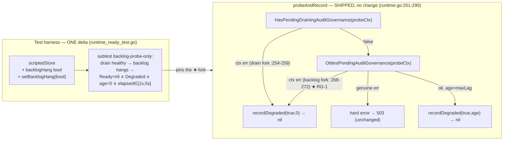

# Design record — `internal/reconcile` direction D1: read-path store errors/timeouts (already shipped — this design is the regression contract + RG-1 pin)

> **Companion spec:** `docs/requirements/internal-reconcile-d1-read-path-store-errors-timeouts-v1.spec.md` (REQ-1..6 / AC (a)–(d) / RG-1) · **Direction:** direction 2 of `docs/auto/analyses/internal-reconcile-7a29db11.json` · **Module label:** `internal/reconcile`; **touched code:** `internal/auditgovernance` (read path) + seam consumers `cmd/server/http.go` (`readyzHandler`), `cmd/server/build.go` (gauge callbacks), `deploy/prometheus/alerts.yml` · **Sibling (must stay consistent):** `docs/requirements/internal-auditgovernance-d1-read-path-timeout-degrade-v1.spec.md` + `-v1.design.md` (same shipped drill, selected from the auditgovernance analysis — this spec is the internal-reconcile analysis's duplicate direction) · **Status:** ✅ already shipped in the current worktree (commit `15763e2` + uncommitted changes, 2026-08-08) with **one pin-fidelity residual (RG-1)** · **Implement-stage expectation: zero production delta; one test-harness delta** (~25 lines, `runtime_ready_test.go`) closing RG-1.
> **Gates (re-measured this session, `-count=1`):** `go test ./internal/auditgovernance/` 31.6s ✓ · `go test ./cmd/server/ -run 'TestReadyz|TestAlertsYML|TestAuditGovernance|TestNoExecutable450'` 8.9s ✓ · `go test ./internal/telemetry/ -run 'AuditGovernance'` ✓ · `go test ./internal/config/ -run 'AuditGovernance'` ✓ · `go vet ./internal/auditgovernance/ ./cmd/server/` ✓ · single-file ≤ 500 lines (production files: `runtime.go` 353 · `http.go` 254 · `build.go` 220 · `metrics.go` 489; `*_test.go` exempt per `Makefile:178-179`) · no new `go.mod` deps (I6) · no schema migration (I2) · no config surface (D1).

---

## 0. Verdict

Evidence (requirements-stage artifact) treated as untrusted and independently re-verified against the worktree this session: **all core claims hold**. The five direction citations E1–E4 describe the pre-ship state (stale — shipped); E5 is a moved symbol (`runtimeReadiness` `audit_governance.go:53-59` → `:73-87`). Every acceptance pin exists at the claimed location and passes; baseline green. The one real gap, **RG-1**, is confirmed: both shipped stubs (`scriptedStore.hang`, `hangingAuditStore`) wedge *both* probes, so the backlog-probe-only timeout fork (`runtime.go:268-272`) — the literal shape of acceptance (a) — is never exercised alone. The design is therefore: **the shipped drill is the authoritative design (regression contract, mirror of the sibling), and the only delta is a ~25-line test-harness addition closing RG-1.** Production code needs no change.

---

## 1. Evidence re-verification (independent, this session)

### 1.1 Production code — all claimed shapes present

| Evidence claim | Re-check (this session) | Verdict |
|---|---|---|
| `probeAndRecord` + `isProbeCtxError` (`runtime.go:251-290`, `:231-233`); `storeProbeTimeout = 2s` (`:26`) | ✅ Exact. `isProbeCtxError` = `DeadlineExceeded‖Canceled`; drain fork `:254-259` → `recordDegraded(true,0)`+nil; backlog fork `:268-272` → same; genuine errors hard-fail `:260-261`/`:273` with the exact strings (`"audit governance drain lookup failed"` / `"audit governance backlog lookup failed"`); drain-in-progress hard error `:263-264`; maxLag flip `:283-288`; healthy `:289`; cache getters `:213-226`; run-loop feed `:319-323` | ✅ |
| `readyzHandler` (`http.go:91-127`): all three probes share the 2s `readyzProbeTimeout` (`:53`); degraded extra → 200 + `{"ok":true,"degraded":true,"backlog_age_seconds":N}` (`:118-122`); healthy `{"ok":true}` (`:125-127`) | ✅ Exact (`:97-100` ping, `:103-106` storage, `:110-111` `extra.Ready(probeCtx)`). Exactly three 503 branches, all non-degrade; `degradedChecker` `:40-44`, group aggregation `:55-86` | ✅ |
| Gauge callbacks cache-fed, zero store I/O (`build.go:101-118`, registered `:152-155`) | ✅ `auditGovernanceBacklogAgeGaugeFn`/`auditGovernanceDegradedGaugeFn` read only `BacklogAge()`/`Degraded()` | ✅ |
| Alert OR arm (`alerts.yml:186-195`, expr `:187`) | ✅ `audit_governance_backlog_age_seconds > 450 OR audit_governance_degraded == 1`, `for: 10m`, `severity: warning`, description "/readyz stays 200" | ✅ |
| `runtimeReadiness` moved (`audit_governance.go:73-87`) | ✅ Group assembly unchanged in substance | ✅ |
| Delivery-path classifier untouched | ✅ `isPermanentDeliveryError` call site `relay.go:87`; `DeadlineExceeded` remains transient on delivery (`relay_terminal_test.go:217`; list entry at `:242` — **trivial line drift vs spec's `:225`**, substance correct) | ⚠️ 1 line-drift |

### 1.2 Test pins — locations and pass status (this session `-count=1`)

| Pin (spec ref) | Location | Status |
|---|---|---|
| `TestRuntimeReadyDegradedSentinel` (both-wedged timeout shape, elapsed ∈ [1s,5s]) | `runtime_ready_test.go:176` | ✅ PASS |
| `TestRuntimeReadyFailClosedOnGenuineStoreError` (c1/c2 exact error strings + `Degraded()==false`; c3 pre-canceled ctx < 1s) | `runtime_ready_test.go:206` | ✅ PASS |
| `TestRuntimeBacklogAgeZeroWhenAllTerminal` / `TestRuntimeRunLoopRefreshesCacheWithoutReadyCalls` / `TestRuntimeRunLoopSurvivesWedgedStore` / `TestRuntimeDegradedCacheConcurrentAccess` | `runtime_ready_test.go:254 / 348 / 397 / 416` | ✅ PASS |
| `TestRuntimeReadyDegradesOnBacklogLag` (relocated cited pattern `runtime_test.go:415` → `:618`) | `runtime_test.go:618` | ✅ PASS |
| `TestReadyzAuditGovernanceDegradedDrill` (seam: 200 never 503, marker body, elapsed ∈ [1s,5s], ageGauge=0 ∧ degradedGauge=1) | `readyz_drill_test.go:444` | ✅ PASS |
| `TestReadyzExtraProbeTimeout` / `TestReadyzImmediateExtraError` / `TestReadyzBacklogLagDegradesNot503` / `TestReadyzDrainStill503` / `TestReadyzDeadLetteredBacklog200AndGaugeZero` / `TestAlertsYMLAuditGovernanceExprParity` / `TestNoExecutable450LiteralOutsideAlertsYml` | `readyz_drill_test.go:161 / 179 / 212 / 258 / 288 / 381 / 540` | ✅ PASS |
| Scrape surface / threshold owner | `internal/telemetry/metrics_test.go:171,192`; `internal/config/config_audit_governance_test.go:64` | ✅ PASS |

### 1.3 RG-1 confirmed (the one real gap)

- `scriptedStore` (`runtime_ready_test.go:33-77`) has a single `hang` flag: `HasPendingDrainingAuditGovernance` **and** `OldestPendingAuditGovernance` both `<-ctx.Done()` on `hang` → `probeAndRecord` always exits at the drain fork (`:254-259`) before the backlog fork (`:266-272`) is reached.
- `hangingAuditStore` (`readyz_drill_test.go:425-437`) likewise hangs both probes; the seam result is fork-agnostic anyway (marker body identical).
- Net effect: a regression in the backlog fork alone (ctx error misclassified as fail-closed, or missing `recordDegraded`) is **not caught by any existing pin**. The literal acceptance shape — *only* `OldestPendingAuditGovernance` times out → `Ready()==nil` (degraded), `/readyz` 200 — is unexercised.

---

## 2. Design overview (shipped design is authoritative; one test-only delta)



**Four core shipped semantics (locked as regression contract, mirror of sibling):**

1. **Timeout degrades, never 503.** Probe ctx timeout/cancel = the wedge shape → `recordDegraded(true, 0)` (age unknown → 0) + `Ready` returns nil; `/readyz` answers 200 + marker. Genuine store errors stay fail-closed 503 (the boundary is `isProbeCtxError`). Both forks must produce the **same** degraded output — that is exactly what the RG-1 pin asserts for the backlog fork.
2. **Shared budget.** `/readyz` ping/storage/audit probes share one 2s `readyzProbeTimeout` (worst-case degraded latency 6s < helm `timeoutSeconds: 10`); the audit runtime has its own self-contained `storeProbeTimeout = 2s` fallback. Non-degrading checkers still 503 on timeout (two-layer seam contract, both halves pinned).
3. **Read path bounded by construction.** Gauge callbacks are cache-fed (zero store I/O per scrape — strictly stronger than a probe-ctx bound); the store read that fills the cache is bounded inside `probeAndRecord`, fed by the run loop once per poll cycle. The wedge's signal carrier is `degraded == 1` (age unknown = 0), with the alert's OR arm keeping `for: 10m` accumulation alive across timeout samples.
4. **Two-path classifiers never leak.** Read path `isProbeCtxError` vs delivery path `isPermanentDeliveryError` are independent functions; `DeadlineExceeded` stays transient (redelivery) on delivery, degrade on read.

**Decisions (inherited from spec D1–D5, confirmed against code):** D1 `storeProbeTimeout` is a package const (mirror of `readyzProbeTimeout`, cross-referencing comment) — no config surface · D2 degraded is a cache sentinel, not a live query (deterministic drill) · D3 gauge callbacks cache-fed dominate the direction's "gauge err→0 masks wedge" acceptance (the per-scrape store read was removed entirely) · D4 wedge signal = degraded gauge + alert OR arm, not the age gauge · D5 two-layer seam contract with the fail-closed branch preserved (genuine errors and drain-in-progress keep 503 by design).

**The one new design decision (RG-1):** add a *per-probe* hang to `scriptedStore` as an **additive setter** (`setBacklogHang(bool)`), not a `setMode` signature change — see §3.2 for rationale.

---

## 3. API changes

### 3.1 Production API — **none**

| Surface | Change | Note |
|---|---|---|
| `Runtime.Ready(ctx)`, `Degraded()`, `BacklogAge()`, `PendingBacklogAge(ctx)`, `isProbeCtxError`, `recordDegraded`, `probeAndRecord` | — | Already shipped (ship-state surface documented in sibling design §3: `Ready` timeout→nil+degraded; breaking rename `BacklogAge(ctx)`→`PendingBacklogAge(ctx)`; new zero-I/O cache getters) |
| `readyzHandler`, `degradedChecker`, `readinessGroup` | — | Already shipped |
| Gauge callbacks, instruments, alert rule | — | Already shipped |
| Config, schema, go.mod, helm | — | No change (D1 / I2 / I6) |

### 3.2 Test-harness API — the one delta (`internal/auditgovernance/runtime_ready_test.go`)

| Symbol | Change | Compat |
|---|---|---|
| `scriptedStore` | **Add field** `backlogHang bool` (per-probe hang, alongside `hang`) | Additive; existing mode semantics unchanged |
| `scriptedStore.setBacklogHang(h bool)` | **New additive setter** — locks `s.mu`, sets `backlogHang`; one-line doc: "overlays the backlog-probe hang; `setMode` clears it" | Additive; zero call-site churn |
| `scriptedStore.setMode(hang, lag bool, drainErr, backlogErr error)` | **+1 line**: also sets `backlogHang = false` (total-reset primitive); one-line doc: "resets all probe state including `backlogHang`" | All 13 existing call sites (`:178,209,220,231,257,351,399,404,418,462,464,466,468`) byte-identical |
| `scriptedStore.OldestPendingAuditGovernance` | Hang condition becomes `hang \|\| backlogHang` | Only widens the wedge trigger; existing `hang`-mode tests behave identically |
| `scriptedStore.HasPendingDrainingAuditGovernance` | **Unchanged** (`hang`-only) | — |
| `scriptedStore` type doc comment | Update "mode hang blocks **both** probes" → document per-probe `backlogHang` | Docs only |
| `TestRuntimeReadyDegradedSentinel` | Add `t.Run("backlog-probe-only", …)` subtest (co-located with the both-wedged shape for fork comparison) | Additive |

**Rationale — additive setter vs. signature change.** Extending `setMode(hang, lag bool, drainErr, backlogErr error)` would churn all 13 existing call sites (`runtime_ready_test.go:178,209,220,231,257,351,399,404,418,462,464,466,468`) for zero semantic gain. The additive `setBacklogHang` setter: (a) leaves every existing mode/assertion byte-identical, (b) makes the new shape read explicitly — `setMode(false, false, nil, nil)` (drain healthy) then `setBacklogHang(true)` (backlog wedged), (c) keeps the mutex discipline centralized (both setters lock `s.mu`). To keep `setMode` the **total-reset primitive**, it also sets `backlogHang = false` (one line): a stale wedge can never survive a mode transition (the T7 multi-phase idiom at `:462-468` can never silently wedge), and a `setBacklogHang`-then-`setMode` mistake fails safe (healthy) instead of wedging — `setBacklogHang` is an overlay applied only *after* the final `setMode` (no pre-setMode reset call needed). One-line docs on both setters: setMode — "resets all probe state including `backlogHang`"; setBacklogHang — "overlays the backlog-probe hang; `setMode` clears it". The production fork under test is `runtime.go:268-272`, not the harness setter, so the harness surface must stay minimal.

**Explicit non-changes:** `hangingAuditStore` (`readyz_drill_test.go:425`) stays both-wedged — the seam's 200+marker path is fork-agnostic and already pinned by `TestReadyzAuditGovernanceDegradedDrill`; a seam-level per-probe variant would duplicate coverage. `readyz_drill_test.go` untouched (576 lines today; exempt from the gate, but the runtime-level fork is the only untested dimension).

---

## 4. Compatibility constraints

1. **Zero production behavior change** → zero config surface (no new env; both timeouts stay package consts, D1), zero schema migration (I2), zero `go.mod` changes (I6). No wire/HTTP contract change: healthy `/readyz` stays byte-identical `{"ok":true}`; marker shape, 503 branches, gauge series, and alert rule are pre-existing.
2. **Existing pins unaffected**: all 13 `setMode` call sites (`runtime_ready_test.go:178,209,220,231,257,351,399,404,418,462,464,466,468`) compile and behave byte-identically (additive setter + `backlogHang=false` reset only — no existing call site sets `backlogHang`, and each test builds a fresh `scriptedStore`); the both-wedged, lag, genuine-error, and run-loop shapes keep their exact assertions.
3. **Test-runtime budget**: the subtest adds ~2s (one blocking-stub wait); package goes ~31.6s → ~34s. Acceptable.
4. **File-size**: test files exempt from the 500-line gate (`Makefile:178-179`), but keep the addition inside `runtime_ready_test.go` (472 → ~500 lines), out of `readyz_drill_test.go`, consistent with the sibling's placement rule.
5. **Sibling consistency (scope resolution)**: the sibling design's "implement stage adds **no** pin" is scoped to *its* direction's acceptance shapes, none of which require the backlog-probe-only shape; **this** direction's acceptance (a) literally requires it, and its spec (RG-1) mandates exactly one new pin. The two documents do not contradict: one pin, in a file/function the sibling never touches, asserting a fork the sibling's shapes cannot reach.
6. **Determinism discipline**: the new subtest uses the proven blocking-stub idiom (response cannot precede the 2s ctx deadline → deterministic lower bound; ≤ 5s upper bound only proves boundedness). No sleeps, no wall-clock equality.
7. **No duplicate pin ownership**: every existing shape keeps its single owner test; the new subtest owns only the backlog-fork timeout shape.

---

## 5. Failure modes (wedge & exception matrix)

| Scenario | Behavior (shipped) | Visible surface | Pin |
|---|---|---|---|
| **Backlog probe only wedged (RG-1 literal shape)** | Drain probe healthy → `OldestPendingAuditGovernance` blocks to the 2s deadline → `ctx.Err()` → Warn + `recordDegraded(true,0)` + `Ready()==nil`; `/readyz` 200 + marker age 0; gauges `(0,1)` | Identical to both-wedged (fork output must match) | **NEW subtest `backlog-probe-only`** |
| Both probes wedged | Same output via the drain fork (`:254-259`) | Same | `TestRuntimeReadyDegradedSentinel` + `TestReadyzAuditGovernanceDegradedDrill` |
| Genuine (non-ctx) store error, either probe | Hard error `"drain/backlog lookup failed"`, `Degraded()==false`, `/readyz` 503 < 1s; cache retains last recorded pair (never silently zero a live wedge) | 503 + logs | `TestRuntimeReadyFailClosedOnGenuineStoreError` c1/c2, `TestReadyzImmediateExtraError`, `TestRuntimeRunLoopSurvivesWedgedStore` |
| Caller ctx pre-canceled | Immediate (< 1s) nil + degraded (Canceled branch) | Same as timeout | c3-pre-canceled-ctx |
| Backlog > maxLag (store healthy) | nil + degraded + real age; 200 marker; age gauge drives alert | age rises + degraded=1 | `TestRuntimeReadyDegradesOnBacklogLag`, `TestReadyzBacklogLagDegradesNot503` |
| All terminal / dead-lettered | ok=false → age 0, no degrade; never blocks readiness | age=0, degraded=0 | `TestRuntimeBacklogAgeZeroWhenAllTerminal`, `TestReadyzDeadLetteredBacklog200AndGaugeZero` phases 0–1 |
| No `/readyz` traffic while store deteriorates | Run loop refreshes cache each poll cycle (≤ poll interval) | gauge freshness | `TestRuntimeRunLoopRefreshesCacheWithoutReadyCalls` |
| Concurrent cache reads | Single-lock (degraded, age) pair discipline | — | `TestRuntimeDegradedCacheConcurrentAccess` (meaningful only under `-race`) |
| Delivery-path timeout (orthogonal) | `DeadlineExceeded` stays transient → redelivery | Delivery surface unchanged | `TestIsPermanentDeliveryErrorClosedList` |

**Failure modes of the RG-1 delta itself:** (i) backlog-fork regression misclassifying ctx errors as fail-closed → subtest fails on `err != nil`; (ii) regression skipping `recordDegraded` → fails on `Degraded()==false`; (iii) probe *returns slowly but bound-violated* (e.g., `storeProbeTimeout` raised) → fails on `elapsed > 5s` — a probe that *hangs forever* (loses `probeCtx`, blocks on the caller ctx) never returns, so it surfaces as go-test's per-package timeout (300s in `test-race-meta`), not via the elapsed check; (iv) over-eager probe → fails on `elapsed < 1s`; (v) fork records a **non-zero age** (e.g., `recordDegraded(true, staleAge)`) → fails on `BacklogAge()!=0`. The subtest fails exactly when the backlog fork diverges from the drain fork's output — the invariant the seam depends on.

---

## 6. Migration steps (production deployment)

1. **Code**: no production migration — the drill is in `15763e2` + worktree. Implement stage = add the RG-1 harness delta (§3.2), then verify: `make check` (gofmt / build / vet / full `go test ./...` / 500-line gate) + `make test-race` (the concurrency pin's only meaning).
2. **Deployment**: none from this direction (no prod delta). For completeness of the *shipped* drill: the new alert rule loads via Prometheus hot-reload (`for: 10m` prevents transient false positives); new gauge series `audit_governance.backlog_age_seconds` / `audit_governance.degraded` are additive — no existing dashboard breaks.
3. **Rollback**: RG-1 delta is test-only — trivially revertible, zero runtime impact. Production rollback of the drill = revert `15763e2`+worktree (restores fail-closed `Ready`; 503 behavior returns, but delivery/at-least-once semantics are unaffected — degrade affects readiness and metrics only).
4. **Observability verification** (drill already shipped): `curl /readyz` healthy = `{"ok":true}`; `curl /metrics | grep audit_governance` shows both series; a wedged-store drill = the two drill tests (`TestRuntimeReadyDegradedSentinel`, `TestReadyzAuditGovernanceDegradedDrill`) — and, after RG-1, the new subtest.

---

## 7. Testable acceptance mapping (AC (a)–(d) → pins)

| Acceptance (direction wording) | Testable mapping | Status |
|---|---|---|
| **(a)** *New test where `OldestPendingAuditGovernance` returns a timeout error → `Ready()` returns nil (degraded) and `/readyz` stays 200* | Both-wedged runtime shape: `TestRuntimeReadyDegradedSentinel` (`runtime_ready_test.go:176`; nil, `Degraded()==true`, `BacklogAge()==0`, elapsed ∈ [1s,5s]); seam shape: `TestReadyzAuditGovernanceDegradedDrill` (`readyz_drill_test.go:444`; 200 never 503, marker body, elapsed ∈ [1s,5s], ageGauge=0 ∧ degradedGauge=1). **Literal shape (RG-1): NEW subtest `backlog-probe-only` — drain probe healthy, backlog probe wedged → same nil/degraded/age-0/[1s,5s] quadruple** | 2 PASS + **1 to add** |
| **(b)** *Gauge under store error reports non-zero/sentinel or explicit error so the degraded alert (maxLag×0.5) still fires* | Wedge signal on degraded gauge: `TestReadyzAuditGovernanceDegradedDrill` (ageGauge=0 ∧ degradedGauge=1, cache-fed `build.go:101-118`); alert expr: `TestAlertsYMLAuditGovernanceExprParity` (`age > config.MaxLagSeconds/2 OR degraded == 1`, threshold derived from `config.Load()` default 900→450, `for: 10m`, `severity: warning`, "/readyz stays 200"); literal-location pin: `TestNoExecutable450LiteralOutsideAlertsYml`; scrape surface: `metrics_test.go:171,192`; genuine-error retains last pair: `TestRuntimeRunLoopSurvivesWedgedStore` | ✅ PASS |
| **(c)** *Assert no 503 path reachable from the audit read-path (grep readyzHandler wiring)* | Static wiring: `readyzHandler` (`http.go:91-127`) has exactly three 503 branches (`:97-100` ping, `:103-106` storage, `:110-111` `extra.Ready` error) and the degraded-200 branch (`:118-122`); `Runtime.Ready` returns nil on any timeout/cancel (REQ-2) → the audit read-path has **no 503 route for the degrade shape**. Pinned: `TestReadyzAuditGovernanceDegradedDrill` (200), `TestReadyzDegradedExtraReturns200WithMarker` (`http_test.go:181`). Fail-closed 503s pinned as intended: `TestReadyzImmediateExtraError`, `TestReadyzDrainStill503`, `TestRuntimeReadyFailClosedOnGenuineStoreError` | ✅ PASS |
| **(d)** *Regression: maxLag flip still degrades; terminal rows stay excluded* | `TestRuntimeReadyDegradesOnBacklogLag` (`runtime_test.go:618`, relocated cited pattern; drain still hard-fails `:662-670`); `TestReadyzBacklogLagDegradesNot503` (`readyz_drill_test.go:212`, 8s backdate vs 4s maxLag = 2× margin, exact marker body); terminal exclusion at runtime + seam: `TestRuntimeBacklogAgeZeroWhenAllTerminal`, `TestRuntimeBacklogAgeZeroWhenNoPending` (`runtime_test.go:676`), `TestReadyzDeadLetteredBacklog200AndGaugeZero` phases 0–1 | ✅ PASS |

**RG-1 subtest sketch (~25 lines, `runtime_ready_test.go`, inside `TestRuntimeReadyDegradedSentinel`):**

```go
// backlog-probe-only pins the acceptance's literal shape: only
// OldestPendingAuditGovernance times out (drain probe healthy). The fork
// at runtime.go:268-272 must produce the SAME output as the both-wedged
// drain fork — nil, degraded, age 0 — so /readyz renders one marker.
t.Run("backlog-probe-only", func(t *testing.T) {
	rt, scripted, _ := newReadyRuntime(t)
	// Order composes with the reset semantics: setMode is the total-reset
	// primitive (clears backlogHang), so the overlay comes last — no
	// pre-setMode reset call needed.
	scripted.setMode(false, false, nil, nil) // drain probe healthy
	scripted.setBacklogHang(true)            // only OldestPending wedges
	start := time.Now()
	err := rt.Ready(context.Background())
	elapsed := time.Since(start)
	if err != nil {
		t.Fatalf("Ready=%v, want nil (backlog-probe timeout degrades, never 503)", err)
	}
	if elapsed < time.Second {
		t.Fatalf("elapsed=%v: response cannot precede the 2s probe deadline", elapsed)
	}
	if elapsed > 5*time.Second {
		t.Fatalf("elapsed=%v: probe deadline did not bound the wedged backlog probe", elapsed)
	}
	if !rt.Degraded() {
		t.Fatal("Degraded()=false, want true after a backlog-probe timeout")
	}
	if got := rt.BacklogAge(); got != 0 {
		t.Fatalf("BacklogAge()=%v want 0 (age unknown on probe timeout)", got)
	}
})
```

---

## 8. Risks & gates

| Risk | Mitigation |
|---|---|
| Pin drift across four packages (`internal/auditgovernance`, `cmd/server`, `internal/telemetry`, `internal/config`); refactor of `probeAndRecord`, cache pair, marker body, or alert expr breaks named pins | `make check` covers all packages; `TestReadyzAuditGovernanceDegradedDrill` and `TestAlertsYMLAuditGovernanceExprParity` are the sentinels |
| RG-1 omission (backlog-fork regression invisible until now) | The new subtest is the only implement-stage delta; fails exactly when the backlog fork diverges from the drain fork's output |
| Timing flake | Blocking-stub lower-bound idiom only; WAL second-writer backdating (`backdateDrillFact`/`backdatePendingFact`) replaces sleeps; no wall-clock equality |
| Concurrency | `TestRuntimeDegradedCacheConcurrentAccess` meaningful only under `-race` → **run `make test-race` before merge** (not run this session; gate item) |
| Sibling-scope confusion in review | §4.5 resolves "sibling says no new pins" vs "this spec requires RG-1 pin" explicitly |
| Test duration | +~2s per blocking-stub test; package total ~34s, acceptable |

---

## 9. Implement-stage checklist

1. **Add the RG-1 harness delta** (`internal/auditgovernance/runtime_ready_test.go` only): `backlogHang` field + `setBacklogHang` setter + `backlogHang=false` reset line inside `setMode` + one-line docs on both setters + `hang || backlogHang` in `OldestPendingAuditGovernance` + type-doc update + the `backlog-probe-only` subtest (sketch §7).
2. **Do not touch** production code, `readyz_drill_test.go`, `hangingAuditStore`, the sibling spec/design, config, schema, or dependencies.
3. **Verify**: `make check` (gofmt / build / vet / full `go test ./...` / 500-line gate) + `make test-race`.
4. **Report**: the subtest's measured elapsed and that all §7 pins pass.

*Verification basis: all citations re-checked against HEAD `15763e2` + current worktree on 2026-08-08; `-count=1` measurements in §1. Mirror of `docs/requirements/internal-reconcile-d1-read-path-store-errors-timeouts-v1.spec.md`; stage artifact `docs/auto/runs/d1-incomplete-read-path-store-errors-timeouts-st-d2f77771/artifacts/design-a77de8a6/task-1-design.md`; sibling design `internal-auditgovernance-d1-read-path-timeout-degrade-v1.design.md`.*
