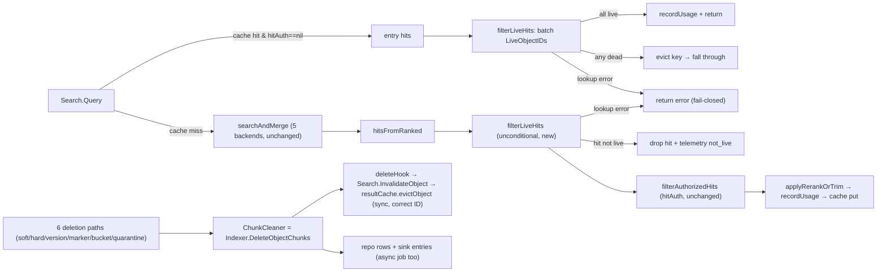

# Design: Fail-closed liveness gate on the RAG read path (`internal/ai`)

> **Companion spec:** `docs/requirements/rag-liveness-gate-v1.md` (R1–R6, AC-1…AC-5) · **Module:** `internal/ai` + `internal/repository` + `internal/telemetry` + `cmd/server` · **Status:** design (not implemented) · **Baseline:** HEAD `35ff4ce` · **Gates:** `make check` green · single file ≤ 500 lines · stdlib only (I6) · no `go.mod` changes · I1/I2 discipline (no schema migration, no placeholder reuse) · **Zero wire-level changes** (no REST/S3/MCP/WebDAV routes, no OpenAPI, no event payloads, no `Hit` JSON)

---

## 1. Evidence re-verification (independent check against working tree)

All 10 cited claims and the 10 additional spec facts were re-checked directly. All hold; three line-number nits noted (none material).

| # | Claim | Verified location | Verdict |
|---|-------|-------------------|---------|
| E1 | `Query` / `filterAuthorizedHits`; `hitAuth==nil` short-circuit; cache gated on `hitAuth==nil` | `internal/ai/search.go:333` (`Query` — spec said `:338-371`, function starts at `:333`), `:342-345` cache read + `:367-368` cache write under `if s.results != nil && s.hitAuth == nil`, `:373-385` filter with `:374` short-circuit | ✅ |
| E2 | `repoVectorIndex` → `repo.SearchChunks` | `internal/ai/vectorindex.go:26-31` | ✅ |
| E3 | `SearchChunks` chunk-only, no `objects` join, no `deleted_at` | `internal/repository/sql_chunks.go:76-101` (`FROM chunks WHERE tenant_id=$1 AND embedding IS NOT NULL`) | ✅ |
| E4 | pgvector chunk-only SQL | `internal/ai/pgvector.go:129-146` | ✅ |
| E5 | Qdrant chunk-only `/points/search` | `internal/ai/qdrant.go:146-160` | ✅ |
| E6 | BM25 in-memory chunk retrieval | `internal/ai/bm25.go:231-240` | ✅ |
| E7 | Chat/Agent funnel through `Query` | `chat.go:33` (`NewChat(search *Search,…)` — the *constructor*, not a call), `chat.go:132` (call); `agent.go:198` (call; spec's `:186` is inside `callSearch` but not the call) | ✅ |
| E8 | REST + MCP funnel through `Query` | `internal/api/rest/search.go:68`; `internal/mcp/server.go:273` | ✅ |
| E9 | Result cache: TTL staleness documented, no invalidation API | `internal/ai/result_cache.go:8-13` + full file (only `get`/`put`/`newResultCache`/`resultCacheKey`) | ✅ |
| E10 | `SoftDeleteObject` sets `deleted_at` | `internal/repository/sql_objects_maint.go:20-40` | ✅ |

**Additional facts re-verified for this design:**

| # | Fact | Verified location |
|---|------|-------------------|
| F1 | "Live" already = `deleted_at IS NULL` in `GetObject`; `CanReadObject` = `Stat` → `GetObject`; **marker rows are inserted with `deleted_at` set** (`InsertDeleteMarker` binds `deleted_at=now` on SQLite and PG; the returned marker carries `DeletedAt`) — so `deleted_at IS NULL` alone already excludes markers and **no explicit marker predicate is needed** | `sql_objects.go:176-177`; `internal/service/access.go:26-28`; `sql_objects_versions.go:35-64` (INSERT binds `$8=now`; return sets `DeletedAt`) |
| F2 | `hitAuth` nil by default: `buildAccessManager` nil unless `ACCESS_CONTROL_ENABLED`; wired `if cfg.Access.Enabled` only | `cmd/server/access.go:11-13`; `internal/config/config.go:215-216`; `cmd/server/ai.go:21-23` (assembly is `buildAIComponents`, not `main.go:224`) |
| F3 | `internal/ai` has zero `deleted_at` references (non-test) | grep — empty |
| F4 | Chunks FK `ON DELETE CASCADE` on SQLite only; external sinks (Qdrant/BM25/PG) not covered by cascade | `migrations/sqlite/0004_ai.up.sql`; `internal/repository/sqlite.go:31` |
| F5 | **Identity quirk (critical for R4):** every non-marker delete emits `EventDeleted` with the removed object's ID; the **delete-marker path emits the marker row's ID** (`delete_marker.go:58`) while the chunks removed belong to the **prior current version** (`current.ID`, `delete_marker.go:53-54`) | `file_delete.go:53,92,212`; `delete_marker.go:48-71` |
| F6 | `InsertDeleteMarker` sets `deleted_at`+`version_tombstone` on the shadowed version AND inserts the marker row **with `deleted_at` set to now** + `_aero_delete_marker=true` metadata (SQLite and PG); markers never emit `EventCreated` → **no chunk can reference a marker row**; marker exclusion via `deleted_at IS NULL` is automatic | `sql_objects_versions.go:35-64` (INSERT binds `$8=now`; return sets `DeletedAt`); `delete_marker.go` (grep: zero `EventCreated`) |
| F7 | All 6 deletion paths call `ChunkCleaner.DeleteObjectChunks` synchronously with the **correct removed-object ID**, all funnel into `Indexer.DeleteObjectChunks` (also the `delete_chunks` job handler) | hard per-version `file_delete.go:27-31`; soft `:81-82`; version `:195-196`; marker `delete_marker.go:53-54` (`current.ID`); bucket `file_bucket_delete.go:70-71`; quarantine `object_worker.go:61-62`; `indexer.go:230-238` |
| F8 | Cache opt-in, off by default (`AI_SEARCH_CACHE_SIZE=0`, TTL 30s) | `internal/config/config.go:155-156`; `cmd/server/ai.go:76-78` |
| F9 | Wrapper repos (`billing.meteredRepository`, `auditgovernance.auditedRepository`) **embed** `repository.Repository` → interface growth is transparent | `internal/billing/repository.go:14`; `internal/auditgovernance/repository.go:11` |
| F10 | Telemetry per-reason counter precedent | `internal/telemetry/metrics.go:238-245` (`IncIndexerSkip`) |

**Verdict:** the problem statement is fully confirmed — all 5 retrieval backends + result cache can return chunks of soft-deleted objects in the default configuration (`hitAuth==nil`, cache enabled, cleanup fail-open/async).

---

## 2. Design overview



**Core semantics (three invariants):**

1. **Gate at the single chokepoint, unconditional.** `Search.Query` is the only read path (E7/E8: REST, MCP, chat, agent all funnel through it). The liveness filter runs on every hit, every mode (vector/bm25/hybrid), whether or not `HitAuthorizer` is installed — `hitAuth == nil` (the default) must not weaken it.
2. **Fail-closed: error denies, unknown drops.** A liveness-lookup error returns an error from `Query` (deny the whole query, never unfiltered hits); a successful lookup that does not confirm an ID ⇒ that hit is dropped. Both are telemetry-counted.
3. **Cache never serves dead content.** Cache hits are re-validated against the liveness predicate before serving (correctness mechanism — covers bus-drop/crash windows); delete-event-driven eviction is hygiene/latency only (R4). Invalidation is keyed on the **removed object's ID**, delivered synchronously through the `ChunkCleaner` seam — which resolves the delete-marker identity quirk (F5) without changing the event shape.

**Key decisions (D1–D7):**

| # | Decision | Rationale |
|---|----------|-----------|
| D1 | New unconditional `Search.filterLiveHits` inserted after `hitsFromRanked`, **before** `filterAuthorizedHits` | One batched query, then per-hit `Stat` only for survivors when access control is on (strictly cheaper than the reverse); liveness is a separate concern from authorization (spec R2.1) |
| D2 | New repo method `LiveObjectIDs(ctx, tenant, ids) (map[int64]bool, error)` — single `IN` query, distinct placeholders (I1), `deleted_at IS NULL` (marker rows excluded automatically — F1/F6), tenant scoping enforced in Go, **no tenant predicate in SQL** (partial-index hijack, §3.1) | Spec R1.2: O(1) queries per search; map shape makes the gate O(1) per hit; no N+1 |
| D3 | Fail-closed: lookup error ⇒ `Query` error; absent ID ⇒ drop; telemetry `search.hits_dropped_total{reason∈{not_live,lookup_error}}` | Spec R3; `IncIndexerSkip` precedent (F10) |
| D4 | Cache-hit path re-validates: all hits live ⇒ serve; any dead ⇒ **evict that key and fall through to a full re-query** (no partial serving, no recursion); lookup error ⇒ deny | Spec R2.3 fail-closed; partial serving would return stale-shaped short lists; the re-query is gated and re-cached, so one extra query total |
| D5 | Invalidation hook attached to `Indexer.DeleteObjectChunks` (top of function, fires even if later sink cleanup fails), exposed as `WithDeleteHook(func(int64))`; wired in `cmd/server` to new `Search.InvalidateObject` → `resultCache.evictObject` | F7: every deletion path already funnels here with the **correct** removed-object ID (marker path delivers `current.ID` — resolving F5 without touching the event); reindex paths (`indexer.go:332/338/346`) get correct invalidation for free; `Indexer` and `Search` are same package → no layering violation, no import cycle |
| D6 | No config flag; gate is always-on | This is a correctness fix (deleted content leaking to search), not a new capability — an opt-in default would recreate the fail-open hole (I5's spirit); cost is one batched `IN` query (≤ ~30 IDs at default K≤10, ≤ 3K ≈ 300 at max K) |
| D7 | No backfill: after dropping dead hits the result list may be shorter than `K` | Matches existing `filterAuthorizedHits` behavior; backfill would add a second retrieval round-trip per query; REST/MCP/chat contracts already say "up to K" |

---

## 3. API changes

### 3.1 `internal/repository` — one new interface method (read-only, additive)

```go
// repository_interface.go (interface) + internal/repository/sql_liveness.go (new file, sqlStore impl)
// LiveObjectIDs returns the subset of ids that are live: a row exists with
// deleted_at IS NULL. Marker rows carry deleted_at (sql_objects_versions.go) so
// they are excluded automatically — no marker predicate needed (F1/F6).
// IDs not present in the map are not live (soft-deleted, hard-deleted, or
// unknown). Read-only; never mutates state. Batch shape: exactly one query for
// len(ids) > 0. Tenant scoping is enforced in Go, not SQL (see below).
LiveObjectIDs(ctx context.Context, tenant string, ids []int64) (map[int64]bool, error)
```

Implementation (new file `internal/repository/sql_liveness.go`, ~90 lines — keeps the 500-line gate clear of `sql_objects.go`):

```sql
-- both dialects (sqlite after s.rebind, which rewrites $N → ? in text order; postgres passthrough)
SELECT id FROM objects
WHERE id IN ($1,$2,…) AND deleted_at IS NULL
-- one distinct $N per id (I1: numbers ignored by rebind, text order is authoritative)
```

- **No `tenant_id` predicate in SQL (perf fix — load-bearing, do not "simplify"):** the partial index `objects_live_unique_idx (tenant_id, bucket, key) WHERE deleted_at IS NULL` (0002_multitenant, both dialects) is an exact match for `tenant_id=$1 AND deleted_at IS NULL`, so the planner range-scans the tenant's live-object index with the `IN` list as a per-row filter. Measured on modernc 3.53.1: **4.45 ms @ 50k rows/tenant → 19.5 ms @ 200k (linear; ~1 s @ 10M)** vs **0.05 ms flat** for rowid probes — a 100–1000× regression on the CI/default path, invisible at test scale. Tenant scoping is preserved by filtering the returned ids in Go: the map is tenant-scoped by construction, and a cross-tenant `object_id` requires an indexer bug (chunk rows are written with the object's tenant at index time).
- **No marker-exclusion predicate (dead code removed):** marker rows are inserted with `deleted_at` set (`InsertDeleteMarker`, `sql_objects_versions.go:35-64` — binds `now` on both dialects; returned marker carries `DeletedAt`), so `deleted_at IS NULL` already excludes them, and markers are never chunked (no `EventCreated`, F6). The `COALESCE(json_extract(metadata,'$._aero_delete_marker'),'') <> 'true'` predicate can never fire against the current schema and is removed; the invariant is pinned in a comment here and in `sql_liveness.go`, and guarded by the marker-row case in `TestLiveObjectIDs_Batch`. Removing it also drops the first JSON predicate from repo SQL — no `json_extract`/`->>` dialect divergence, no COALESCE, no malformed-JSON exposure. (For the record, had the predicate stayed: `metadata` is `TEXT/JSONB NOT NULL DEFAULT '{}'` in both dialects (0001_init) — a COALESCE would be for the **missing-key** case (`json_extract('{}','$.k')` → NULL), not legacy NULL metadata, which is impossible; and SQLite `json_extract` on malformed JSON raises `SQL logic error`, which fail-closed would turn into all search erroring.)
- Guard: `len(ids) == 0` → return empty map, no query; `len(ids) > 1000` → error (defensive cap, fail-closed). Real queries carry ≤ 3K ≈ 300 IDs at max K (`trimToOverK(merged, req.K*3)`, `search.go:329`); 1001 vars ≪ `SQLITE_MAX_VARIABLE_NUMBER` 32766 in modernc v1.50.1 / PG 65535, so the cap is unreachable today. Chunking is unnecessary below the cap; if K ever grows, chunk at ~500 (preserves "exactly one query").

**Interface-growth impact:** in-repo wrappers embed the interface (F9) → transparent. The only in-repo direct implementer is `sqlStore`. Test fakes that embed `repository.Repository` compile unchanged; the AC-2 fake overrides `LiveObjectIDs` (+ `RecordUsage` no-op, since `recordUsage` runs after the gate) **and** tests inject `fakeVectorIndex`/BM25 at the Search level — a nil-embedded fake panics on any un-overridden method, and vector mode routes through `repo.SearchChunks` (AC-2 prerequisites).

### 3.2 `internal/ai` — Search gate + cache invalidation (same package, unexported where possible)

```go
// search.go
// filterLiveHits drops hits whose object is not live per LiveObjectIDs.
// Runs unconditionally (hitAuth == nil must not weaken it).
// Lookup error → error (deny whole query); absent ID → hit dropped.
func (s *Search) filterLiveHits(ctx context.Context, req Request, hits []Hit) ([]Hit, error)

// InvalidateObject purges every cached result entry that references the object.
// Called from the Indexer delete hook (D5); safe to call with caching disabled.
func (s *Search) InvalidateObject(objectID int64)
```

`Query` pipeline (new order):

1. validate (unchanged)
2. **cache hit** (`s.results != nil && s.hitAuth == nil`): `filterLiveHits` over the entry's hits → all live: `recordUsage` + return; any dead: `s.results.evict(cacheKey)` + fall through to 3; error: return it.
3. `searchAndMerge` → `hitsFromRanked` (unchanged)
4. **`filterLiveHits`** (new; batches all distinct `ObjectID`s in one `LiveObjectIDs` call)
5. `filterAuthorizedHits` (unchanged, still short-circuits on `hitAuth == nil`)
6. `applyRerankOrTrim` → `recordUsage` → cache put (unchanged)

```go
// result_cache.go
// evict removes one key; evictObject removes every entry referencing objectID.
// Both under the existing mutex; scan is O(entries × hits), bounded by capacity.
func (c *resultCache) evict(key string)
func (c *resultCache) evictObject(objectID int64)
```

```go
// indexer.go
// WithDeleteHook installs a callback fired at the top of DeleteObjectChunks
// (before repo/sink cleanup, regardless of later cleanup failure).
func (ix *Indexer) WithDeleteHook(hook func(objectID int64)) *Indexer
// in DeleteObjectChunks:
if ix.deleteHook != nil { ix.deleteHook(objectID) }
```

### 3.3 `internal/telemetry` — one counter

```go
// metrics.go — register mSearchHitsDropped in initDomain ("search.hits_dropped_total",
// reason attribute), mirroring mIndexerSkip (F10).
func IncSearchHitDropped(ctx context.Context, reason string) // reason ∈ {not_live, lookup_error}
```

`not_live` increments per dropped hit; `lookup_error` increments once per denied query.

### 3.4 `cmd/server` — assembly wiring

```go
// ai.go — buildIndexer gains a *ai.Search parameter (search already exists in
// buildAIComponents scope; setupLexicalCache runs before buildIndexer):
if search != nil {
    indexer.WithDeleteHook(search.InvalidateObject)
}
```

### 3.5 Explicitly unchanged (zero wire-level API changes)

- REST `/v1/search`, `/v1/chat`, `/v1/chat/stream`, `/v1/agent`, `/v1/lineage` — same request/response shapes, same error codes; `Hit` JSON untouched.
- MCP tools/resources, S3 gateway, WebDAV, OpenAPI, CLI, SDKs — untouched.
- `Event` struct and `vault.file.deleted@1.1` payloads — untouched (identity resolved at the `ChunkCleaner` seam, not the event, per F5).
- All 5 retrieval backends' SQL/queries — untouched.
- No config keys, no env vars, no schema migration (I2).

---

## 4. Compatibility constraints

| Constraint | Detail |
|------------|--------|
| Wire/API compat | Zero changes (3.5). The only behavioral delta: results may be shorter than `K` after dead-hit drops, and cache entries may be evicted mid-TTL (cache is opt-in, off by default — F8). Both already permitted by existing contracts ("up to K", TTL-bounded staleness). |
| Go interface compat | `repository.Repository` gains one method — additive; in-repo wrappers embed the interface (F9) and are unaffected; third-party implementers must add `LiveObjectIDs`. |
| `hitAuth` interplay | Liveness runs first, authorization unchanged. With access control on, `CanReadObject`→`Stat` already excludes soft-deleted rows (F1) — the gate is strictly additive (spec §5 "must not weaken"). |
| I1 placeholder discipline | The `IN` list builds distinct `$N` per id in text order; `rebind` rewrites by text order (verified `sql.go:42-58`), so SQLite and Postgres agree. Covered by the SQLite contract test; PG branch is `//go:build integration`. |
| No JSON predicate in repo SQL | The final SQL is dialect-identical modulo `rebind` (`id IN` + `deleted_at IS NULL`); the marker predicate / `json_extract` / `->>` / COALESCE never ship — no dialect divergence, no malformed-JSON exposure. The invariant is pinned in a comment in `sql_liveness.go` (§3.1). |
| Concurrency | `resultCache` mutex covers `evict`/`evictObject`; `Search.InvalidateObject` is safe from any goroutine (the delete hook fires on the request goroutine or a worker goroutine). |
| MCP stdio path | `serveStdio` builds its own `Search` (main.go:223) — the gate applies there too (unconditional); invalidation hook absent there (no cache configured in stdio path) — irrelevant since gating is the correctness mechanism. |
| Performance | +1 batched `IN` query (≤ ~30 IDs at default K, ≤ ~300 at max K) per search, +1 per cache hit; measured 0.05 ms flat on SQLite at 200k rows/tenant with the final SQL shape (vs 19.5 ms with a tenant predicate — §3.1). Negligible vs embed + retrieval + rerank; `recordUsage`/latency histogram unchanged in meaning (gate is inside the measured window — acceptable, it's part of query cost). |

---

## 5. Failure modes

| # | Failure | Behavior | Mitigation |
|---|---------|----------|------------|
| FM1 | Liveness lookup DB error (SQLite queues behind writers, PG down) | `Query` returns error → REST 500-family, chat error, `/chat/stream` SSE `event:error` frame (`rest/search.go:132-134`), MCP error result; **agent: the error becomes a tool-result string (`agent.go:200` `"error: "+err`) and the run completes — never unfiltered hits** (AC-2). Telemetry `lookup_error` | Fail-closed is the spec mandate (R3); single small query; availability coupling (§8): SQLite `SetMaxOpenConns(1)` (`sqlite.go:26`) queues the read behind writers and `REQUEST_TIMEOUT_SECONDS` converts queueing into denials; multi-process gets raw `SQLITE_BUSY` (no `busy_timeout`) — spec-mandated, ops-visible |
| FM2 | Same on a cache hit | Query denied (fail-closed) even though the entry exists | D4; consistent with R3.1 |
| FM3 | Hit's object absent from lookup result (soft/hard-deleted, unknown, cross-tenant ID) | Hit dropped; telemetry `not_live`; remaining hits served | D2 map contract; AC-2 |
| FM4 | TOCTOU: object deleted between lookup and response | Bound is **per in-flight query**: one stale serve per query whose snapshot predates the commit (all queries in flight at commit time, not one globally); every query starting after the commit is clean | Inherent to read-then-delete; next query is gated; D5 eviction shrinks the window for cached entries; accepted and documented (§8) |
| FM5 | Placeholder misuse in `IN` list (I1) | Silent wrong bind → wrong tenant/IDs | Distinct `$N` generator + SQLite contract test + PG integration test |
| FM6 | Marker row without `deleted_at` (schema drift — today impossible: `InsertDeleteMarker` binds `now`, `sql_objects_versions.go:35-64`; `metadata` is `NOT NULL DEFAULT '{}'` in both dialects) | Would be treated as live; no chunk can reference a marker (no `EventCreated`, F6) → no leak; defensive only | Invariant comment in `sql_liveness.go` pinned to `sql_objects_versions.go`; marker-row case in `TestLiveObjectIDs_Batch` guards the current shape |
| FM7 | `ids` > cap (1000) | Error (fail-closed) | Defensive cap; real queries ≤ 3K ≈ 300 at max K (K≤100, ×3 over-fetch, `search.go:329`); 1001 vars ≪ `SQLITE_MAX_VARIABLE_NUMBER` 32766 (modernc v1.50.1) / PG 65535 |
| FM8 | Delete-marker identity quirk (event carries marker ID, F5) | Would invalidate the wrong object if hooked on the event | Hook is on `Indexer.DeleteObjectChunks` → receives `current.ID` (delete_marker.go:53-54); AC-4.2 pins this |
| FM9 | `evictObject` scan cost with a full cache | O(entries × hits) per delete; bounded by capacity; cache off by default (F8) | Documented; capacity-bounded |
| FM10 | Reindex/scrub chunk removal triggers eviction | Extra (correct) cache evictions; no correctness impact | Harmless; reindex paths already call `DeleteObjectChunks` (indexer.go:332/338/346) |
| FM11 | Sink cleanup fails after hook fires | Invalidation already happened (hook at top of `DeleteObjectChunks`); chunks may persist in a sink, but the gate still drops their hits | D5 ordering; AC-1 hard-delete matrix + AC-4 hook-through-seam failing-sink test exercise exactly this |
| FM12 | Restore (delete undone) | `deleted_at` cleared → object live again → hits return; visibility is **TTL-bounded**: entries rebuilt between delete and restore reference neither the object nor a hook event, so neither `evictObject` nor the hook can find them — restored results appear within the cache TTL (30 s, cache opt-in); promotion (`promoteLatestObjectVersion`, no event/hook) self-heals for free | No action; consistent with R1; AC-4 restore test pins it |

---

## 6. Migration steps

No schema migration, no config, no data backfill. Pure code change; three deployable phases (each independently green):

1. **Phase 1 — repository:** add `LiveObjectIDs` (interface + `sql_liveness.go` + `sql_liveness_test.go`). Verify: `go build ./... && go test ./internal/repository/`.
2. **Phase 2 — AI gate:** `filterLiveHits` + cache `evict`/`evictObject` + `Search.InvalidateObject` + `IncSearchHitDropped` + unit tests (`internal/ai/liveness_test.go`, `result_cache_test.go` additions, hook-through-seam failing-sink test in `indexer_test.go`, `TestMain` telemetry reader in `internal/ai`; rest-level SSE-frame test in `internal/api/rest`). Verify: `go test ./internal/ai/ ./internal/api/rest/`.
3. **Phase 3 — assembly + e2e:** `buildIndexer` signature + hook wiring in `cmd/server/ai.go`; AI-enabled full-server harness + AC-5 test (including the local tool-calling canned LLM and mandatory `flakySink`). Verify: `make check`, `make test-race`, `make test-integration`.

**Deploy/rollback:** ship 1→2→3 together in one release (phases are internal; no wire contract between them matters at runtime — the gate works without the hook, the hook works without the gate). Rollback = revert the commit(s) and redeploy: the gate writes nothing (read-only), so downgrade is lossless; pre-existing leaked chunks are *self-healing* — the gate drops them at query time without any cleanup job. Optionally run the existing `delete_chunks` drain for storage hygiene, but **correctness does not depend on it** (this is the point of R6).

---

## 7. Testable acceptance mapping

All stdlib `testing` only (I6), SQLite `file:` temp DB + `Migrate`, `MockLLM`/`NewHashEmbedder` for determinism (plus the local tool-calling canned LLM required by AC-5).

| Acceptance | Concrete test | Assertions |
|------------|---------------|------------|
| **AC-1** soft/hard/marker × vector/bm25/hybrid, `hitAuth` nil, failing sink | `internal/ai/liveness_test.go` — `TestSearch_ExcludesSoftDeleted`, `TestSearch_ExcludesHardDeleted_FailingSink`, `TestSearch_ExcludesDeleteMarkerShadowedVersion`, `TestSearch_KeepsLiveHits` (control), `TestSearch_HitAuthNonNil_LivenessBeforeAuth` (coexistence). Seams: `newTestEnv` (`integration_test.go:25`), `fakeVectorIndex` (`vectorindex_test.go:12`), real in-memory `BM25`, failing `ChunkCleaner` injected via `svc.WithChunkCleaner` | (1) soft: chunks rows still present (`ListChunksForObject` non-empty) yet zero hits in all 3 modes; (2) hard: sink fails → canned hits referencing the dead `ObjectID` dropped; (3) marker: bucket versioned, `CreateDeleteMarker` with failing cleaner → hits of shadowed version's `ObjectID` dropped; (4) live control object returned in all modes; (5) `hitAuth != nil` coexistence: counting authorizer (counts `Stat`) + counting fake repo — liveness runs **before** auth (dead hit dropped with no `Stat`), dead+unauthorized hit dropped exactly once (no double `Stat`), gate still active with the cache bypassed (`hitAuth != nil` bypasses cache, `search.go:342-345`) |
| **AC-2** fail-closed | `internal/ai/liveness_test.go` — `TestSearch_FailClosedOnLookupError`, `TestSearch_DropsUnknownIDs`, `TestAgent_SearchLookupError_ToolResult`; `internal/api/rest/` — `TestChatStream_LookupError_SSEErrorFrame`. **Prerequisites:** the fake repo embeds nil `repository.Repository` → *any* un-overridden method panics, so tests must also inject `fakeVectorIndex` (vector mode calls `repo.SearchChunks` via `repoVectorIndex`, `vectorindex.go:26-31`) and/or the real in-memory `BM25`, and override `RecordUsage` (no-op). **Telemetry infra (new):** `internal/ai` has no `TestMain` and no non-telemetry test installs an SDK provider (counters go to the global no-op provider) — add a `TestMain` installing `metric.NewManualReader`, following `internal/telemetry/prometheus_test.go` | lookup error ⇒ `Query` error, zero hits; partial map ⇒ only the absent-ID hit dropped, others returned; **agent**: `callSearch` error → tool-result string (`agent.go:200`), run succeeds, no hits leaked (FM1 through the agent surface); **stream**: lookup error → SSE `event:error` frame `{"code":"InternalError",…}` (`rest/search.go:132-134`, `writeSSEError` at `:144`); counter `search.hits_dropped_total` asserted via the new `TestMain` reader |
| **AC-3** drain + idempotency | `internal/ai/integration_test.go` — `TestDeleteChunksDrain_RemovesHits` | pre-state via **soft delete** (chunks provably intact — `ListChunksForObject` non-empty — cleaner unattached/failing; a hard-delete pre-state is impossible on SQLite: `ON DELETE CASCADE` (0004_ai.up.sql) removes chunk rows regardless of cleaner failure, so "chunks survive" cannot be built) → `Indexer.DeleteObjectChunks(ctx, id)` (the exact job handler) → `ListChunksForObject` empty, `BM25.Search` empty, `Query` zero hits in all modes; second run: no error, no change (**`DeleteChunksForObject`/`removeObjectLocked` idempotency** — the queue `DedupeKey` lives in `dispatch`/`Enqueue` and is not exercised here) |
| **AC-4** identity + invalidation | `internal/ai/result_cache_test.go` — `TestResultCache_EvictObject`; `internal/ai/liveness_test.go` — `TestSearch_CacheEvictedOnDeleteEvent`, `TestSearch_CacheHitGated`, `TestSearch_CacheHitAllLive_ServesWithoutRequery`, `TestSearch_RestoreBringsHitsBack`; `internal/ai/indexer_test.go` — `TestDeleteHook_ThroughSeam_FailingSink`; contract: `TestDeleteEvent_ObjectIdentity` (soft/hard/version/marker) | cache seeded with query whose hits include X → `InvalidateObject(X)` → same query no longer contains X, other objects' hits in the same entry survive; cache-hit path: entry with a dead X is *not served* (evicted, falls through, gated re-query returns live subset); **all-live positive branch**: counting fake repo proves `LiveObjectIDs` *is* consulted on a cache hit and counting `fakeVectorIndex`/`BM25` prove retrieval is *not* re-consulted (a regression that skips re-validation on hits would fail here); **hook through the real seam**: `Indexer.WithDeleteHook` recorder + `DeleteObjectChunks` with a failing repo/sink → hook fired at top of the function with the correct ID before cleanup (FM8/FM11 — the D5 wiring `cmd/server/ai.go` relies on); same property exercised from a reindex-path caller (`indexer.go:332/338/346`, FM10); **restore (FM12)**: soft delete → zero hits → `RestoreObject` (`sql_objects_maint.go:240`) → hits return; marker-restore no-op guarded (`sql_objects_maint.go:231`); marker case: hook receives `current.ID` (shadowed version), not the marker row's ID (F5 pinned) |
| **AC-5** full-server e2e, warm cache, before/during/after drain | `internal/integration/fullserver_test.go` — new `startFullServerWithAI` harness + `TestFullServer_RAGLivenessGate_NoTrace`. Harness: `NewHashEmbedder` + `BM25` (hybrid; built from repo **before** the delete, then kept current via `WithChunkSink(bm)` — the cmd/server/ai.go pattern) + `WithResultCache(1024, 60s)` + `NewChat`/`NewAgent`/`NewIndexer` passed to `rest.NewRouter(svc, repo, search, chat, agent, bus, …)` (signature at `router.go:213`); indexer **not** bus-subscribed and `svc` **without** `WithChunkCleaner` (deterministic drain control); drain = `indexer.DeleteObjectChunks` invoked between endpoint calls; **`flakySink` wrapper is mandatory** (not optional) — without it the "during" phase is indistinguishable from after-drain; **LLMs**: `MockLLM` for chat (never emits tool calls — `llm.go:281-291`), plus a **tool-calling canned LLM defined locally in `internal/integration`** for agent `Steps` assertions (ai-package `scriptedLLM`, `integration_test.go`, is unexported; with MockLLM alone the agent half is vacuous — it echoes the query, so "no marker in the answer" would pass trivially) | upload unique-marker file → index → `/v1/search` + `/v1/chat` (assert `Citations`) + `/v1/agent` (assert `Steps`/tool output) all contain marker; warm cache with the exact query; `DELETE /v1/files/{key}` (public REST delete — the direction's "admin API" does not exist; admin group is tenants/keys/jwt/jobs/config/webhook-failures only); before drain: same three endpoints (cache-hit path) contain **no** marker and no hit with the deleted `object_key`; during drain (partially removed): same; after drain: chunk rows + sinks gone and endpoints still clean; **soft-delete variant** repeats with `deleted_at` set and chunks present throughout (`ACCESS_CONTROL_ENABLED=false`, `hitAuth` nil) |

Coverage note: `internal/repository/sql_liveness_test.go` (`TestLiveObjectIDs_Batch`, `TestLiveObjectIDs_OverCap`) backs R1.2 — live / soft-deleted / absent / marker rows (excluded via `deleted_at`; pins the F1/F6 invariant) / tenant scoping (Go-side filter) / empty input / **>1000 cap error (FM7)** / **large-tenant correctness at scale (~100k rows — catches a future partial-index-scan regression without unportable plan assertions)**; runs on migrated SQLite in CI; PG dialect branch under `//go:build integration` (probe-skip pattern per AGENTS.md).

---

## 8. Risks and notes

- **Per-query cost:** one batched `IN` query per search + per cache hit; `K ≤ 10` keeps the list ≤ ~30 IDs (≤ 3K ≈ 300 at max K). Measured with the final SQL shape: **0.05 ms flat** at 200k rows/tenant on SQLite (vs 19.5 ms with a tenant predicate — the reason for the §3.1 shape); PG adds a round trip (~0.2–1 ms). If this ever shows up in p99, the `IN` can move to a VALUES-CTE join (forces rowid probes at equal cost, measured) — explicitly out of scope now.
- **Availability coupling (FM1, spec-mandated):** fail-closed makes search availability now *coupled to repo availability* — a DB that previously degraded to stale cache/partial results now errors the query. SQLite `SetMaxOpenConns(1)` (`sqlite.go:26`) already serializes `SearchChunks`/`recordUsage` behind write txns; the liveness read adds to that queue (no new contention class), and `REQUEST_TIMEOUT_SECONDS` converts queueing into fail-closed denials; multi-process gets raw `SQLITE_BUSY` (no `busy_timeout`). D4's any-dead ⇒ evict + full re-query can also spike p95 during delete storms on cached queries (rare, bounded, correct).
- **TOCTOU** (FM4) is accepted and documented: the bound is **one stale serve per in-flight query whose snapshot predates the commit** — all queries in flight at commit time, not one globally; every query starting after the commit is clean. Eviction bounds it for cached entries, and the async drain converges storage to the same state.
- **Restore** (FM12) is **TTL-bounded**: entries rebuilt between delete and restore reference neither the object nor a hook event, so neither the hook nor `evictObject` can find them — restored visibility is bounded by the cache TTL (30 s, cache opt-in); the promotion path (`promoteLatestObjectVersion`, no event/hook) self-heals for free. AC-4's restore test pins the mechanism.
- **Hook is hygiene, not correctness:** the delete hook fires before the DB commit on 5 of 6 paths and after it on the marker path; position is irrelevant because cache-hit re-validation is the correctness mechanism (every cache-hit serve re-derives liveness from a fresh SELECT; `result_cache.get` returns clones, so entries are never mutated). A miss-path query may `put` a stale entry *after* the hook evicted the key — safe only because of that re-validation. Hook-before-commit merely means over-eviction if the delete later fails (e.g., legal hold).
- **Marker invariant:** live rows are never markers — marker rows are inserted with `deleted_at` set (`sql_objects_versions.go:35-64`) and never emit `EventCreated`, so no chunk references them. The comment in §3.1/`sql_liveness.go` is load-bearing; the marker-row test case guards the current shape. No JSON predicate ships, so the malformed-metadata-JSON exposure is moot (write-side invariant: `metadata` is always `json.Marshal(map[string]string)`, `NOT NULL DEFAULT '{}'`).
- **Locking model:** single `resultCache` mutex, clone-in/clone-out, no lock held across DB calls, no nesting/ordering hazards; `s.results` is write-once pre-server. `evictObject` runs synchronously on the DELETE request goroutine — O(entries × hits) under the mutex (~100k comparisons at 1024×100, sub-ms; brief serialization under delete storms), acceptable since eviction is never load-bearing.
- **Not changed by this design:** write-side deletion ordering, event payloads, outbox relay, retrieval-backend SQL, `Hit` JSON, any wire contract. The `delete_chunks` drain remains exactly as-is (R6: verification only).
