完成了代码审查。以下是我的全面技术负责分析。

---

# 技术负责分析：扩展方向实施计划

## 0. 代码库现状分析

审查结果：

| 模块 | 状态 | 备注 |
|------|--------|-------|
| `storage.Storage` 接口 | ✅ 抽象良好 | 6 个后端（local/s3/oss/cos + encrypt/circuitbreaker 包装器） |
| `repository.Repository` 接口 | ✅ 完整 | SQLite + Postgres，24 个迁移文件，最新为 #0024 |
| `service.FileService` | ✅ 中心枢纽 | EventSink、ChunkCleaner 等钩子 |
| `events.Bus` | ✅ 持久化事件总线 | Postgres LISTEN/NOTIFY 传输，有背压处理 |
| 存储类 | 🟡 基线 | 迁移 #0021 添加了 `storage_class` 列；`STANDARD` / `STANDARD_IA` / `GLACIER` 作为字符串持久化；**尚无转换逻辑** |
| `reconcile.LifecycleJob` | 🟡 仅支持过期 | 检查 `ExpireAfterDays`，不支持类间转换 |
| 元数据查询 | 🔴 无 | 仅 `ListObjects`（按 key LIKE + 排序），无按标签/元数据/大小/日期过滤 |
| 缓存层 | 🔴 无 | 存储路径没有缓存包装器 |
| 加密 | ✅ 强 | 信封加密 + KMS 封装 + 密钥轮换 |
| 事件 WAL | 🟡 快速变化 | `events` 包在 `object.created`/`deleted`/`accessed` 时持久化；没有可重播的集中日志 |

---

## 1. 任务分解

### 1.1 方向 1：元数据查询引擎

| 任务 ID | 标题 | 涉及文件 | 前置依赖 | 工时 |
|---------|-------|-----------|----------------|-------|
| MQE-001 | 添加 SQL 查询构建器：`metadata`、`size`、`created_at`、`tags` 过滤 | `internal/repository/sql_objects.go`、`repository/repository.go` | 无 | 3h |
| MQE-002 | 在 Repository 接口中实现 `SearchObjects` | `repository/repository.go`，`sql_objects.go`，`sql_objects_test.go` | MQE-001 | 4h |
| MQE-003 | 在 FileService 中暴露 `SearchObjects` | `service/file.go`、`service/file_crud.go`、`service/service_test.go` | MQE-002 | 2h |
| MQE-004 | REST handler：`POST /v1/search/objects` + OpenAPI | `internal/api/rest/handler.go`、`router.go`、`dto.go`，`openapi.json` | MQE-003 | 3h |
| MQE-005 | S3 兼容 `POST ?select` 或 `?search` 参数 | `internal/api/s3compat/handler.go`、`extra.go` | MQE-003 | 3h |
| MQE-006 | 元数据查询结果缓存（共享 ristretto 实例） | `internal/service/search.go`（新文件）、`internal/ai/cache.go`（使用现有） | MQE-003，AI 缓存基础结构 | 4h |
| MQE-007 | 按索引路径的迁移 #0025（`metadata`、`size`、`created_at`） | `migrations/{sqlite,postgres}/0025_metadata_indexes.*` | MQE-001 | 2h |

**合计：21h**

### 1.2 方向 2：事件 WAL（可重播日志）

| 任务 ID | 标题 | 涉及文件 | 前置依赖 | 工时 |
|---------|-------|-----------|----------------|-------|
| WAL-001 | `wal_entries` 表的迁移 #0026（有序 LSN、事件类型、payload JSON、租户） | `migrations/{sqlite,postgres}/0026_wal_entries.*` | 无 | 2h |
| WAL-002 | Repository 接口中的 WAL 追加/读取/游标方法 | `repository/repository.go`、`sql_wal.go`（新文件）、`sql_wal_test.go` | WAL-001 | 4h |
| WAL-003 | 事件总线双重写入（持久化到 `events`+`wal_entries`） | `internal/events/bus.go` | WAL-002 | 3h |
| WAL-004 | WAL 游标消费者 API（从给定 LSN 重播，用于索引重建） | `internal/events/cursor.go`（新文件） | WAL-002 | 3h |
| WAL-005 | 索引器整合 WAL 以实现无遗漏索引 | `internal/ai/indexer.go` | WAL-003，WAL-004 | 4h |
| WAL-006 | WAL 保留策略作业（定期清理，保留最后 N 小时） | `internal/reconcile/wal_gc.go`（新文件） | WAL-002 | 2h |

**合计：18h**

### 1.3 方向 3：存储类生命周期（转换）

| 任务 ID | 标题 | 涉及文件 | 前置依赖 | 工时 |
|---------|-------|-----------|----------------|-------|
| SLC-001 | `BucketConfig` 中 `Transitions` 的迁移 #0027（JSON 列） | `migrations/{sqlite,postgres}/0027_bucket_transitions.*`，`repository/repository.go` | 无 | 2h |
| SLC-002 | `SetBucketTransition` / `GetBucketTransitions` 存储库方法 | `repository/sql_buckets.go`、`repository/buckets_keys_test.go` | SLC-001 | 3h |
| SLC-003 | FileService 中的 `SetBucketTransition` 和 REST handler | `service/file_features.go`，`api/rest/handler.go`，`router.go` | SLC-002 | 2h |
| SLC-004 | `STANDARD → STANDARD_IA` 仅元数据转换（`UPDATE storage_class`） | `internal/reconcile/lifecycle.go`、`lifecycle_test.go` | SLC-003 | 4h |
| SLC-005 | 本地后端的 `GLACIER` 归档：blob 移至 `{root}/.archive/` + 权限门控 | `internal/storage/local.go`、`local_read.go`、`local_write.go` | SLC-004 | 4h |
| SLC-006 | 恢复流程：`POST /v1/restore` + `RestoreObject` + `x-amz-restore` 头 | `service/file_features.go`、`repository/sql_objects.go`、`api/rest/handler.go` | SLC-005 | 4h |
| SLC-007 | 恢复到期作业（重新归档过期恢复） | `internal/reconcile/restore_expiry.go`（新文件） | SLC-006 | 3h |
| SLC-008 | S3 `GET ?transition` / `PUT ?transition` 兼容层 | `internal/api/s3compat/bucketconfig.go`，`extra.go` | SLC-003 | 3h |
| SLC-009 | Cloud 后端（S3/OSS/COS）转换包装器：调用本机 API | `internal/storage/s3.go`、`oss.go`、`cos.go`，`lifecycle.go` | SLC-004 | 4h |

**合计：29h**

### 1.4 方向 4：缓存层

| 任务 ID | 标题 | 涉及文件 | 前置依赖 | 工时 |
|---------|-------|-----------|----------------|-------|
| CCH-001 | `CachingStorage` 装饰器实现（L1：内存 ristretto，L2：可选本地磁盘） | `internal/storage/cache.go`（新文件）、`cache_test.go` | 无 | 5h |
| CCH-002 | SSE-C 检测 + 对加密对象的降级直通 | `internal/storage/cache.go` | CCH-001 | 2h |
| CCH-003 | 缓存失效钩子（在 `object.deleted`/`object.updated` 上） | `internal/storage/cache.go`、`cache_invalidation.go`，`bus.go` | CCH-001 | 3h |
| CCH-004 | 配置集成（大小、TTL、SSE-C 降级） | `internal/config/config.go`、`cmd/server/main.go`：`buildStorageFrom` | CCH-001 | 2h |
| CCH-005 | GLACIER 恢复路径：恢复后的临时副本应进入缓存 | `internal/reconcile/lifecycle.go`、`internal/storage/cache.go` | CCH-001，SLC-006 | 2h |

**合计：14h**

### 1.5 方向 5：跨协议一致性

| 任务 ID | 标题 | 涉及文件 | 前置依赖 | 工时 |
|---------|-------|-----------|----------------|-------|
| CPC-001 | 审计：WebDAV 锁 vs S3 对象锁 vs REST ACL 中的差距 | 跨协议审查，生成 `docs/cross-protocol-gaps.md` | 无 | 3h |
| CPC-002 | WebDAV LOCK/UNLOCK → FileService `LockObject`/`SetLockedUntil` 桥接 | `internal/api/webdav/lock.go`（新文件）、`dav.go` | CPC-001 | 4h |
| CPC-003 | ACL 规范化层（REST ACL ↔ S3 ACL 翻译） | `internal/api/rest/acl.go`、`s3compat/acl.go` → `service/acl.go`（新规范化文件） | CPC-001 | 4h |
| CPC-004 | S3 标签和 REST 元数据的跨协议同步（相同的底层持久化） | `internal/service/file.go`：审计，确保 `SetTags` 路径相同 | CPC-001 | 2h |
| CPC-005 | MCP `write_file` 工具尊重对象锁 | `internal/mcp/server.go` | CPC-002 | 2h |

**合计：15h**

### 1.6 方向 6：去重 × 存储类协调

| 任务 ID | 标题 | 涉及文件 | 前置依赖 | 工时 |
|---------|-------|-----------|----------------|-------|
| DED-001 | 去重块级 `min_storage_class` 跟踪（每个块查询所有引用对象） | `internal/storage/dedup.go`（审计现有），`repository/repository.go` | 无 | 3h |
| DED-002 | 转换守卫：如果 `min_storage_class` 要求，则阻止归档 | `internal/reconcile/lifecycle.go`，转换逻辑中的服务器端检查 | DED-001，SLC-004 | 3h |
| DED-003 | 处理去重对象引用的 `transition` 事件的事件挂钩 | `internal/events/` | DED-001，SLC-004 | 2h |

**合计：8h**

---

## 2. 执行顺序与依赖图

```mermaid
graph TB
    subgraph "Phase 1: Foundation (Weeks 1-2)"
        MQE001[MQE-001: SQL Query Builder]
        MQE007[MQE-007: Migration #0025 indexes]
        WAL001[WAL-001: Migration #0026 wal_entries]
        CCH001[CCH-001: CachingStorage impl]
        CPC001[CPC-001: Cross-protocol audit]
        SLC001[SLC-001: Migration #0027 transitions]
        DED001[DED-001: Dedup min_storage_class]
    end

    subgraph "Phase 2: Core Logic (Weeks 2-4)"
        MQE001 --> MQE002[MQE-002: SearchObjects repo]
        MQE002 --> MQE003[MQE-003: SearchObjects service]
        MQE007 --> MQE002

        WAL001 --> WAL002[WAL-002: WAL append/read/cursor]
        WAL002 --> WAL003[WAL-003: EventBus dual-write]

        SLC001 --> SLC002[SLC-002: Bucket transition CRUD repo]
        SLC002 --> SLC003[SLC-003: FileService + REST transition API]

        CCH001 --> CCH002[CCH-002: SSE-C detect + bypass]
        CCH001 --> CCH003[CCH-003: Cache invalidation hooks]

        CPC001 --> CPC002[CPC-002: WebDAV LOCK bridge]
        CPC001 --> CPC003[CPC-003: ACL normalization]

        DED001 --> DED002[DED-002: Archive guard in transition]
    end

    subgraph "Phase 3: Integration (Weeks 3-6)"
        MQE003 --> MQE004[MQE-004: REST handler + OpenAPI]
        MQE003 --> MQE005[MQE-005: S3 ?select handler]
        MQE003 --> MQE006[MQE-006: Query result cache]

        WAL003 --> WAL004[WAL-004: Cursor consumer API]
        WAL004 --> WAL005[WAL-005: Indexer use WAL]
        WAL002 --> WAL006[WAL-006: WAL retention GC]

        SLC003 --> SLC004[SLC-004: STANDARD→STANDARD_IA transition]
        SLC004 --> SLC005[SLC-005: Local GLACIER archive]
        SLC005 --> SLC006[SLC-006: Restore flow]
        SLC006 --> SLC007[SLC-007: Restore expiry job]
        SLC004 --> SLC008[SLC-008: S3 transition API]

        CCH003 --> CCH004[CCH-004: Config integration]
        CCH005[CCH-005: Glacier restore→cache] --> SLC006

        CPC002 --> CPC005[CPC-005: MCP write_file respect lock]
        DED002 --> DED003[DED-003: Transition event hook]
    end

    subgraph "Phase 4: Cloud & Polish (Weeks 5-7)"
        SLC004 --> SLC009[SLC-009: Cloud backend transition wrappers]
        MQE004 --> MQE_DONE[✅ Metadata Query MVP]
        WAL005 --> WAL_DONE[✅ WAL-powered indexing]
        SLC009 --> SLC_DONE[✅ Lifecycle transitions]
        CCH004 --> CCH_DONE[✅ Caching layer]
        CPC003 --> CPC_DONE[✅ Cross-protocol consistency]
        DED003 --> DED_DONE[✅ Dedup × Storage class]
    end

    style MQE001 fill:#c9e,color:#000
    style WAL002 fill:#c9e,color:#000
    style SLC004 fill:#c9e,color:#000
    style CCH001 fill:#c9e,color:#000
```



### 可以并行执行的组：

| 组 | 任务 | 原因 |
|-----|------|--------|
| **G1：仅迁移** | MQE-001，WAL-001，SLC-001，CPC-001，DED-001 | 迁移可以按任意顺序应用；它们影响不同的表/列；CPC-001 是文档审查 |
| **G2：元数据查询** | MQE-001→002→003→004/005/006 | 线性链，独立于其他方向 |
| **G3：WAL** | WAL-001→002→003→004/005/006 | 除了索引器集成（WAL-005 在第 3 阶段使用 EventBus），独立于其他方向 |
| **G4：生命周期** | SLC-001→002→003→004→005→006/007/008/009 | 唯一的外部依赖是 DED-002（去重守卫）和 CCH-005（缓存） |
| **G5：缓存** | CCH-001→002/003→004 | 独立，但 CCH-005 取决于 SLC-006 |
| **G6：跨协议** | CPC-001→002/003→005 | 独立于所有其他方向 |
| **G7：去重协调** | DED-001→002→003 | 只需要在 SLC-004 之前完成 DED-002 |

---

## 3. 技术风险

### 3.1 高风险项目

| # | 风险 | 方向 | 可能性 | 影响 | 缓解策略 |
|---|------|---------|------------|--------|-------------------|
| R1 | **元数据查询性能**：复合 WHERE 子句（`size > X AND metadata LIKE Y`）在 SQLite 上不使用索引会退化为全表扫描 | MQE | 中 | 高 | 仔细设计迁移 #0025 索引；对 `metadata` 使用表达式索引（SQLite `json_extract`）或 Postgres GIN 索引；在 CI 中进行性能基准测试 |
| R2 | **WAL 双写延迟**：向 `events` + `wal_entries` 每次事件追加可能会增加 P99 写入延迟 | WAL | 中 | 中 | 使用 `sqlite` 上的同一事务（Postgres：两个插入，同一连接）；测量基准延迟；如果压力大，考虑异步 WAL 追加 |
| R3 | **GLACIER 本地降冷**：本地 FS 没有不同的底层介质 | SLC | 高 | 中 | 文档说明 GLACIER = 元数据标记 + `{root}/.archive/` 移动 + 权限限制；实际节省来自外部存储迁移；如果降冷不改变物理介质，不要错误地暗示节省 |
| R4 | **SSE-C 缓存降级**：`CachingStorage.Get` 必须在加密密钥可用之前检测 SSE-C 对象 | CCH | 低 | 高 | 在 `Get` 中使用乐观路径：尝试从 metadata hint 检测 SSE-C；如果缺少 hint，回退到后端 stat；缓存否定结果（短 TTL） |
| R5 | **去重块引用**：一块被多个对象共享，其中一个被归档，另一个保持热状态 | DED | 中 | 高 | 维护块级 `min_storage_class`（所有引用对象中的最小值）；在转换逻辑中，在允许 GLACIER 之前检查此值 |
| R6 | **WebDAV LOCK 与 S3 对象锁语义**：WebDAV 锁是临时的（租约），S3 对象锁是固定的（WORM） | CPC | 中 | 中 | 不要桥接语义；改为创建 WebDAV LOCK → 临时租约，S3 对象锁 → 永久 WORM；在两个域中通过检查确保互操作性 |

### 3.2 性能瓶颈

| 瓶颈 | 方向 | 当前限制 | 目标 | 策略 |
|---------|-----------|-------------|--------|----------|
| 每查询全数据加载 | MQE | `ListObjects` 加载所有行并过滤 | `SELECT ... WHERE` 数据库端过滤 | SQL 查询构建器 + 迁移中的覆盖索引 |
| BM25 重建 | WAL | 每 30 秒全量重建 | 增量更新 | WAL 游标驱动增量索引（`internal/ai/indexer.go` 中的现有钩子） |
| 存储类转换锁 | SLC | 无转换锁 | 逐对象原子转换 | 使用存储库行锁 (`SELECT ... FOR UPDATE`) 防止转换过程中的并发覆盖 |
| 缓存内存压力 | CCH | 无缓存 | 受控内存使用 | ristretto 基于成本的准入（按大小计费，不为 >1MB 的对象缓存）；可配置最大内存 |
| 缓存未命中风暴 | CCH | 无缓存 | 逐渐预热 | 全新启动时，不要预先填充；依靠访问模式；可选的预热扫描（如果启用，速率限制） |

### 3.3 测试覆盖难点

| 场景 | 难度 | 策略 |
|-------|--------|----------|
| WAL 游标在崩溃后重播 | 高 | 使用内存 SQLite + 确定性事件序列；模拟崩溃重播比较 |
| GLACIER 恢复计时（`restore_expiry` 作业） | 中 | `clock.go` 抽象，用于在测试中推进时间 |
| SSE-C 缓存降级路径 | 中 | 用 `storage.SecretProvider` mock 的 `storage.Storage`
| 去重块引用正确性 | 高 | 属性测试（快速检查风格）：随机生成块共享图，应用转换，验证不变量 |
| 跨协议 ACL 同步 | 中 | 通过 REST 设置 ACL，通过 S3 API 读取，验证匹配；反之亦然 |

---

## 4. 资源评估

### 4.1 人员配置

| 角色 | 技能 | 数量 | 重点领域 |
|------|-------|--------|-----------------|
| 高级后端工程师 | Go、SQL、分布式系统 | 2 | WAL、缓存、生命周期转换 |
| 全栈工程师 | Go、REST API、OpenAPI | 1 | 元数据查询、S3 兼容性、REST 端点 |
| 质量保证工程师 | Go 测试、集成测试、性能 | 1 | Benchmark 套件、集成测试、CI 门控 |
| 技术负责人 | 架构、代码审查、风险管理 | 1（设想的） | 一致性、去重协调、跨领域问题 |

### 4.2 关键里程碑

| 里程碑 | 截止日期（周） | 完成条件 |
|----------|---------------|-------------------|
| M1：基础结构 | 第 2 周 | 所有 5 个迁移已应用；所有存储库方法已实现并测试；`CachingStorage` 基础结构有效 |
| M2：元数据查询 MVP | 第 4 周 | `POST /v1/search/objects` 返回过滤结果；OpenAPI 规范；S3 `?search` 参数有效 |
| M3：WAL 驱动索引 | 第 5 周 | 索引器使用 WAL 游标进行增量更新；事件总线双重写入已验证；WAL GC 作业有效 |
| M4：存储类生命周期 | 第 6 周 | `STANDARD→STANDARD_IA` 在本地和 S3 后端工作；本地 GLACIER 归档移动 blob；恢复/到期流程有效 |
| M5：缓存层 | 第 6 周 | 响应的 `X-Cache` 头（命中/未命中）；SSE-C 直通；缓存失效钩子有效；恢复后的 GLACIER 对象进入缓存 |
| M6：跨协议一致性 | 第 7 周 | WebDAV LOCK 桥接到 `LockObject`；ACL 在 REST↔S3 之间同步；MCP `write_file` 尊重锁 |
| M7：发布 | 第 8 周 | `make check` 全绿；基准测试显示 P99 延迟 < 200ms；文档更新 |

### 4.3 阻塞点与解决策略

| 阻塞点 | 影响 | 解决策略 |
|---------|--------|----------------|
| **无现有的 SQL 查询构建器** | MQE-001 从头开始 | 不要引入 ORM；编写一个受控的小型查询构建器（`internal/repository/query.go`），为已知列（`size`、`created_at`、`storage_class`）生成 `WHERE` 子句；拒绝 SQL 注入 |
| **WAL 双写一致性** | WAL-003 | 对每个事件操作使用单个事务（两个插入）；如果出现故障，记录错误并继续（事件丢失优于请求失败） |
| **cloud 后端转换 API 差异** | SLC-009 | S3 `RestoreObject` 与 OSS `RestoreObject` 与 COS `RestoreObject`：对每个在 `cloud_test.go` 中的抽象测试 |
| **ristretto 依赖** | CCH-001 | 已经存在于 `go.mod` 中（AI 缓存使用它）；无需新的依赖 |

---

## 5. 质量保证

### 5.1 单元测试覆盖要求

| 组件 | 行覆盖率目标 | 关键测试场景 |
|----------|---------------|-------------------|
| `QueryBuilder`（MQE-001） | ≥ 90% | 空过滤器、单列过滤器、复合过滤器（AND）、SQL 注入尝试、0 行结果 |
| `WALStore`（WAL-002） | ≥ 85% | 追加、按游标读取（无、一些、全部）、游标在截止点后滚动、并发追加 |
| `CachingStorage`（CCH-001） | ≥ 90% | 缓存命中/未命中、TTL 过期、内存压力驱逐、写入直通失效、SSE-C 直通 |
| `TransitionJob`（SLC-004） | ≥ 85% | STANDARD→STANDARD_IA（元数据更改）、STANDARD→GLACIER（blob 移动）、在锁定时跳过、去重守卫检查 |
| `RestoreFlow`（SLC-006） | ≥ 85% | 恢复归档对象、恢复热对象（无操作）、双恢复（幂等）、到期后重新归档 |
| `ACLNormalizer`（CPC-003） | ≥ 90% | 所有 S3 罐装 ACL 权限映射、REST→S3 往返、从 S3 格式回读的未知 ACL |

### 5.2 集成测试策略

| 测试套件 | 触发器 | 系统组成 | 持续时间 |
|------------|---------|-----------------|-----------|
| `TestIntegration_MetadataQuery` | `go test -tags=integration` | SQLite + local FS + mock embedder | ~30s |
| `TestIntegration_WALReplay` | `go test -tags=integration` | SQLite + local FS | ~15s |
| `TestIntegration_LifecycleTransition` | `go test -tags=integration` | SQLite + local FS + time travel clock | ~45s |
| `TestIntegration_CachingRoundTrip` | `go test -tags=integration` | SQLite + local FS + ristretto | ~20s |
| `TestIntegration_S3Lifecycle` | `make test-integration` → Docker | Postgres + S3（minio） | ~2m |
| `TestIntegration_CrossProtocolACL` | `go test -tags=integration` | SQLite + local FS | ~30s |

### 5.3 代码审查要点

| 审查重点 | 原因 |
|-------------|--------|
| **SQL 注入**：`QueryBuilder` 使用 `?` 参数化，绝不拼接 | MQE 方向的核心安全风险 |
| **事务边界**：WAL 双写和转换逻辑必须使用正确的提交/回滚 | 数据损坏风险 |
| **nil 安全**：`CachingStorage.Get` 必须在访问前检查 `backend` 是否为 nil | 类似于现有的 `embedder`/`llm` nil 保护模式 |
| **I1 合规**：`$N` 必须通过 `s.rebind`，每个绑定变量独立编号 | 现有的硬性不变量 |
| **I2 合规**：迁移是双文件（up + down），不修改已应用的文件 | 现有的硬性不变量 |
| **日志记录**：转换操作必须记录 `tenant`、`bucket`、`key`、`from_class`、`to_class` | 可审计性 |
| **幂等性**：恢复、转换和缓存失效必须幂等 | 崩溃恢复 |

### 5.4 性能测试需求

| 基准测试 | 程序 | 当前基线 | 目标 |
|-----------|------------|-----------------|--------|
| 元数据查询延迟 P95（10K 对象） | `bench/query_bench_test.go` | 不可用（无过滤） | < 50ms |
| WAL 追加延迟 P99 | `bench/wal_bench_test.go` | 不可用（无 WAL） | < 5ms |
| 缓存命中延迟 | `bench/cache_bench_test.go` | 不可用（无缓存） | < 1ms |
| 缓存未命中（穿透）延迟 | 相同程序 | 基线（无缓存） | 基线 + < 2ms |
| 转换吞吐量（对象/秒） | `bench/transition_bench_test.go` | 不可用 | > 500/s |
| 内存开销（缓存，1K 1KB 对象） | `bench/cache_mem_test.go` | 不可用 | < 50MB |

**基准测试基础设施**：在 `internal/bench/` 中使用 `testing.B` 基准测试。每个基准测试在专用临时目录中设置内存 SQLite + local FS。CI 在 `make bench` 下运行这些。

---

## 6. 实施计划

### 6.1 第 1 阶段：基础结构（第 1-2 周）

**目标**：迁移到位，所有新的存储库方法已实现并测试，缓存装饰器基础结构有效。

```
第 1 天-3 天：MQE-001  SQL 查询构建器 + 单元测试
         MQE-007  迁移 #0025 索引
         WAL-001  迁移 #0026 wal_entries
         SLC-001  迁移 #0027 bucket_transitions
         DED-001  去重 min_storage_class 审计

第 4 天-7 天：MQE-002  SearchObjects 存储库方法 + 测试
         WAL-002  WAL 追加/读取/游标存储库方法 + 测试
         SLC-002  BucketTransition CRUD 存储库 + 测试
         CCH-001  CachingStorage 装饰器 + 基本测试

第 8 天-10 天：MQE-003  FileService SearchObjects 方法 + 测试
         WAL-003  事件总线双写 + 测试
         SLC-003  FileService + REST BucketTransition API
         CPC-001  跨协议差距审查 → docs/cross-protocol-gaps.md
```

**第 1 阶段判断标准**：
- `make test` 全绿（新 + 现有）
- 所有 3 个迁移已应用并可降级
- `CachingStorage` 通过基本命中/未命中/过期测试
- 差距审查文档通过团队审查

### 6.2 第 2 阶段：核心逻辑（第 2-4 周）

**目标**：所有核心业务逻辑已实现，REST/S3 端点暴露，WAL 驱动索引有效。

```
第 11 天-14 天：MQE-004  REST handler POST /v1/search/objects + OpenAPI
         MQE-005  S3 ?search 参数
         WAL-004  WAL 游标消费者 API
         SLC-004  STANDARD→STANDARD_IA 转换作业
         CCH-002  SSE-C 检测 + 缓存直通

第 15 天-18 天：MQE-006  元数据查询结果缓存（ristretto 集成）
         WAL-005  索引器 WAL 游标集成
         SLC-005  本地 GLACIER 归档（blob 移动 + 权限门控）
         CCH-003  缓存失效钩子（事件驱动）
         CPC-002  WebDAV LOCK 桥接

第 19 天-21 天：WAL-006  WAL 保留 GC 作业
         SLC-006  恢复流程（REST + service + repo）
         CPC-003  ACL 规范化层
         DED-002  转换守卫（检查 min_storage_class）
```

**第 2 阶段判断标准**：
- 元数据查询：过滤按大小、日期、标签、存储类工作
- WAL：游标读取；索引器从 WAL 增量更新
- 生命周期：对象在满足条件时从 STANDARD 转换为 STANDARD_IA
- 缓存：L1 命中提供 < 1ms 延迟
- WebDAV LOCK：在 REST/S3 域中通过 `LockObject` 可见

### 6.3 第 3 阶段：集成与云（第 4-6 周）

**目标**：云后端转换、GLACIER 恢复到期、跨协议同步端到端。

```
第 22 天-25 天：SLC-007  恢复到期重新归档作业
         SLC-008  S3 转换 API（?transition GET/PUT）
         CCH-004  缓存配置集成（大小、TTL、降级）
         CPC-005  MCP write_file 尊重对象锁
         DED-003  转换事件挂钩（触发索引/通知更新）

第 26 天-30 天：SLC-009  云后端转换包装器（S3、OSS、COS）
         CCH-005  GLACIER 恢复→缓存集成
         CPC 集成测试：跨协议 ACL 往返
```

**第 3 阶段判断标准**：
- S3 转换 API 通过 minio 集成测试
- GLACIER 恢复在到期后重新归档
- ACL 在 REST↔S3 之间同步
- 去重守卫在归档可能使热数据变冷时阻止执行

### 6.4 第 4 阶段：发布准备（第 6-8 周）

**目标**：基准测试、文档、发布候选。

```
第 31 天-34 天：性能基准测试（查询延迟、缓存命中、转换吞吐量）
         文档更新（README、configuration.md、architecture.md）
         扩展 AGENTS.md 以覆盖新模块

第 35 天-38 天：端到端集成测试（Docker Compose 场景）
         修复基准测试和测试中发现的性能回归
         最终代码审查 + CHANGELOG

第 39 天-40 天：候选发布标签
         make check 全绿
         基准测试结果提交到 docs/benchmarks/
```

**第 4 阶段判断标准**：
- `make check` 全绿
- 基准测试目标达标（见表 5.4）
- 所有新 API 端点已记录
- `docs/` 已更新

---

## 7. 总结建议

| 维度 | 评估 |
|----------|---------|
| **总工作量** | ~105 小时开发 + ~30 小时测试/审查 = **~135 小时**（约 4 个开发周） |
| **团队规模** | 2 位高级工程师 + 1 位全栈 + 1 位 QA（或 2 位高级工程师，如果有更多时间） |
| **最高优先级** | 元数据查询（MQE）和存储类生命周期（SLC）同时开始 — 它们交付最高价值且不相互阻塞 |
| **最关键风险** | R3（本地 GLACIER 意义）— 尽早解决，避免浪费工程资源；记录什么是保证的，什么不是 |
| **最大架构影响** | WAL — 如果做得好，可以为未来功能解锁增量索引和集群范围的变更数据捕获 |
| **最容易削减** | 如果时间紧张，CPC 和 DED 可以推迟。它们解决的是正确性问题，而不是功能差距 |
| **最低风险快速收益** | CCH-001（缓存装饰器）可以独立完成，无需任何模式更改，提供直接的延迟改进 |

### 立即行动

从以下三个任务开始，它们是独立的，为所有其他任务奠定基础：

1. **MQE-001 + MQE-007**（并行）：查询构建器+索引迁移
2. **SLC-001**：转换迁移（需要在处理生命周期之前准备模式）
3. **CPC-001**：跨协议差距审查（低投入，高信息回报，指导后续决策）
