我现在有了完整的了解。以下是全面的技术负责人分析。

---

# Tech Lead 分析报告：生产盲区深层分析

## 执行摘要

本文档分析了 `docs/requirements/deep-production-gaps-v1.md` 中识别的四个生产盲区。代码库中的实际实现阶段各不相同：**方向 1** 的服务层已部分存在但未接线，**方向 2** 和 **方向 4** 完全缺失，**方向 3** 的存储库原语就位但缺少 API 层。共 22 个任务，总工作量约 **64-80 小时**（2 名开发人员 2 周，或 3 名开发人员 1.5 周）。

---

## 1. 任务分解

### Direction 1：读取路径数据完整性验证（P1）

| 任务 ID | 标题 | 涉及的文件 | 前置依赖 | 工时 | 验收标准 |
|---------|-------|------|-------------------|-------|-----------------|
| TASK-001 | **将 `ReadVerificationConfig` 接入配置系统** | `internal/config/config.go` — 新增 `StorageVerifyOnRead`、`StorageVerifyMaxSize`、`StorageVerifySample` 字段 | 无 | 2h | 出现三个新的环境变量。`Load()` 正确解析它们。现有测试通过 |
| TASK-002 | **在 `main.go` 中连接 `WithReadVerification`** | `cmd/server/main.go` — 调用 `svc.WithReadVerification(cfg)` 带配置值 | TASK-001 | 1h | 应用程序以 `STORAGE_VERIFY_ON_READ=true` 启动。Trace 日志显示验证已启用。CI 测试通过 |
| TASK-003 | **处理多部分上传 ETag（非内容 MD5）** | `internal/service/file_multipart.go` — 在 `CompleteMultipart` 期间存储独立的内容校验和（`_aero_content_md5`）；`internal/service/file_crud.go` — 更新 `NewETagVerifier` 以在可用时优先使用内容校验和，否则回退至 ETag | TASK-002 | 4h | 通过多部分上传创建的对象的 ETag 验证被跳过（因为 ETag 不是内容 MD5），但当 `_aero_content_md5` 可用时使用它。单元测试涵盖两种路径 |
| TASK-004 | **为大文件实现基于采样的验证** | `internal/service/file_crud.go` — `ETagVerifier` 获取 `maxSize`/`sample` 参数；对大于 `MaxSize` 的文件进行基于范围的抽样 | TASK-002 | 4h | 当 `StorageVerifySample=true` 且文件大小 > `StorageVerifyMaxSize` 时，验证器使用字节范围抽样而不是全读。测量结果显示大文件的开销更小 |
| TASK-005 | **为 S3 存储后端添加验证支持** | `internal/storage/s3.go` — `Get` 返回一个可读取可选校验和的包装读取器，或公开 `ContentMD5` 元数据字段；`internal/storage/storage.go` — 如果适用，将 `ContentMD5` 添加到 `ObjectInfo` | TASK-002 | 3h | S3 后端的 `Get` 在启用验证时在服务层进行校验和。集成测试验证 S3 模拟 |
| TASK-006 | **添加校验和失败指标和审计** | `internal/telemetry/metrics.go` — 新增 `object_corrupt_total` counter；`internal/service/file_crud.go` — 在验证失败时递增，写入 audit log；`internal/reconcile/scrub.go` — 在验证失败时标记对象腐化 | TASK-002 | 2h | 验证失败时：指标递增，审计条目写入，对象被标记为腐化。prometheus 指标暴露 |
| TASK-007 | **为方向 1 添加集成测试** | `internal/service/file_crud_test.go` — 腐化 blob 的测试；`internal/storage/storage_contract_test.go` — 校验和合同；`test/integration/` — 多后端端到端 | TASK-003, TASK-005 | 4h | 三种场景的测试：ETag 匹配 → 成功，ETag 不匹配 → 错误，多部分 → 跳过/使用内容校验和 |

### Direction 2：桶级 CORS 规则执行（P1）

| 任务 ID | 标题 | 涉及的文件 | 前置依赖 | 工时 | 验收标准 |
|---------|-------|------|-------------------|-------|-----------------|
| TASK-008 | **实现桶配置缓存** | `internal/service/bucket_cache.go` — 基于 TTL 的内存缓存 `BucketConfig`；`internal/service/file.go` — 添加到 `FileService`；`internal/repository/repository.go` — 如有则添加 `GetBucketConfigCached` | 无 | 4h | 缓存以 60 秒默认 TTL 运行。对 `GetBucketConfig` 的连续调用在同一 TTL 窗口内命中缓存。缓存失效在桶配置写入时发生 |
| TASK-009 | **重构 CORS 中间件以感知桶** | `internal/middleware/cors.go` — 拆分 `CORS` 为全局包装器 + 桶级覆盖层；新增 `BucketCORSProvider` 接口；`internal/middleware/cors_bucket.go` — 从请求上下文读取租户/桶并查询桶级规则的新中间件 | TASK-008 | 6h | OPTIONS 请求检查桶级 CORS（如果已配置），否则回退至全局。S3 兼容的预期行为。对所有变体的测试 |
| TASK-010 | **重新排序中间件链以支持桶级 CORS** | `cmd/server/main.go` — 将 CORS 中间件移动到租户解析之后；`internal/middleware/tenant.go` — 确认租户上下文在 CORS 前设置；`internal/service/file.go` — 添加向 CORS 提供者注入存储库的方法 | TASK-009 | 4h | 中间件顺序：`RequestID → CORS(global) → Tenant → Auth → RateLimit → ...` 全局 CORS 仍作用于最外层；桶级 CORS 作为二层覆盖。所有认证测试通过 |
| TASK-011 | **在桶 CORS 变更时添加缓存失效** | `internal/service/file_features.go` — 在 `SetBucketCORS`/`DeleteBucketCORS` 中调用缓存失效；`internal/service/bucket_cache.go` — 曝光 `InvalidateBucket(tenant, bucket)` | TASK-008, TASK-010 | 2h | `PUT /v1/buckets/{b}/cors` 之后，下一个 OPTIONS 请求立即反映新规则。无陈旧数据窗口 |
| TASK-012 | **添加桶级 CORS 指标** | `internal/telemetry/metrics.go` — `cors_origin_allowed`、`cors_origin_blocked`、`cors_bucket_hit`、`cors_bucket_miss` counters；`internal/middleware/cors_bucket.go` — 仪器化 | TASK-009 | 2h | Prometheus 暴露每个租户/桶的 CORS 决策，实现操作可视性 |

### Direction 3：对象元数据更新 API（P1）

| 任务 ID | 标题 | 涉及的文件 | 前置依赖 | 工时 | 验收标准 |
|---------|-------|------|-------------------|-------|-----------------|
| TASK-013 | **向 Repository 层添加批量 `SetObjectMetaKeys`** | `internal/repository/repository.go` — 新增 `SetObjectMetaKeys(ctx, tenant, bucket, key, meta map[string]string)`；`internal/repository/sql_objects.go` — 实现为单个事务中的原子操作或 `jsonb_set` 批量合并 | 无 | 3h | 在一次调用中更新多个元数据键。为版本化桶正确处理。现有 `GetObject`/`SetObjectMetaKey` 的向后兼容 |
| TASK-014 | **向 `FileService` 添加 `SetMetadata`/`DeleteMetadata` 方法** | `internal/service/file_features.go` — 新增 `SetMetadata(ctx, tenant, bucket, key, meta)`、`PatchMetadata(ctx, tenant, bucket, key, meta)`、`DeleteMetadata(ctx, tenant, bucket, key)` | TASK-013 | 3h | 公共方法匹配 `SetTags` 的模式。元数据大小验证在 64 KiB 处。版本化桶行为匹配当前最新语义 |
| TASK-015 | **添加 REST 端点：`PUT/PATCH/DELETE /files/{key}/metadata`** | `internal/api/rest/router.go` — 在 `putKey`/`deleteKey` 调度器中的 `/metadata` 路由；`internal/api/rest/handler_metadata.go` — 新文件包含 `PutMetadata`、`PatchMetadata`、`DeleteMetadata` handler | TASK-014 | 4h | `PUT /v1/files/k/metadata` 替换所有元数据。`PATCH /v1/files/k/metadata` 合并。`DELETE /v1/files/k/metadata` 清空。OpenAPI spec 更新。Handler 单元测试 |
| TASK-016 | **为元数据更新添加乐观并发控制** | `internal/repository/sql_objects.go` — `SetObjectMetaKeys` 检查 `updated_at` 或 ETag 条件；`internal/service/file_features.go` — 在更新方法中暴露 `If-Match`/`If-None-Match` 支持 | TASK-014 | 3h | 在读取后修改前被修改的元数据上的并发 `PATCH /metadata` 返回 `412 Precondition Failed`。无静默丢失更新 |
| TASK-017 | **将元数据更新连接到审计和事件** | `internal/api/rest/handler_metadata.go` — 写入 audit log；`internal/service/file_features.go` — 在元数据变更时发布 `object.modified` 事件 | TASK-015 | 2h | 元数据变更出现在 audit log 中。事件总线携带 `object.metadata.updated` 事件。Webhook 按预期触发 |
| TASK-018 | **为元数据更新添加集成测试** | `internal/service/file_features_test.go` — 元数据 CRUD 测试；`internal/api/rest/handler_metadata_test.go` — HTTP handler 测试 | TASK-015, TASK-016 | 3h | 完全覆盖：全量替换、合并、清空、并发冲突、空桶、不存在的对象、版本化桶 |

### Direction 4：多部分上传幂等性（P2）

| 任务 ID | 标题 | 涉及的文件 | 前置依赖 | 工时 | 验收标准 |
|---------|-------|------|-------------------|-------|-----------------|
| TASK-019 | **实现 `CompleteMultipart` 幂等性** | `internal/api/rest/router.go` — 将 `Post("/multipart/{uploadID}/complete")` 移动到幂等性组或添加特定中间件；`internal/service/file_multipart.go` — `CompleteMultipart` 检查现有的完成记录 | 无 | 4h | 对同一 `uploadID` 重试 `CompleteMultipart` 返回第一响应（幂等重放）。无重复对象版本 |
| TASK-020 | **实现 `UploadPart` 幂等性** | `internal/service/file_multipart.go` — 基于 `(tenant, uploadID, partNumber)` 去重；`internal/api/rest/router.go` — 应用幂等性中间件 | TASK-019 | 3h | 对同一 `(uploadID, partNumber)` 重试 `UploadPart` 返回相同的 ETag。后端未存储重复分片 |
| TASK-021 | **实现 `AbortMultipart` 幂等性** | `internal/service/file_multipart.go` — 已 abort 的 uploadID 上的 `AbortMultipart` 返回 204（安全重放）；`internal/repository/repository.go` — 为已 abort 的上传添加幂等性记录 | TASK-019 | 2h | 对同一已 abort uploadID 重试 `AbortMultipart` 返回 204。无错误 |
| TASK-022 | **为多部分操作添加持久幂等性存储** | `internal/repository/repository.go` — `SetMultipartIdempotency`、`GetMultipartIdempotency`；`internal/repository/sql_multipart.go` — 专用的 `multipart_idempotency` 表或共享的 `idempotency_keys` 表，含清理 TTL | TASK-019 | 4h | 幂等性记录在服务器重启后持续存在。后台清理任务在 TTL 后删除过期记录 |
| TASK-023 | **为多部分重试添加集成测试** | `internal/service/file_multipart_test.go` — `CompleteMultipart` 重试产生相同对象；`UploadPart` 重试产生相同 ETag；`AbortMultipart` 重试是安全的；`internal/api/rest/multipart_test.go` — HTTP 级测试 | TASK-020, TASK-021, TASK-022 | 4h | 所有重试场景的测试通过本地和模拟 S3 后端。幂等性在服务器重启后持续存在 |

---

## 2. 执行顺序与依赖图

```mermaid
graph TD
    subgraph "方向 1：读取路径验证【P1】"
        T001[TASK-001: 配置连接] 
        T002[TASK-002: main.go 连接] --> T001
        T003[TASK-003: 多部分 ETag 处理] --> T002
        T004[TASK-004: 大文件采样] --> T002
        T005[TASK-005: S3 后端支持] --> T002
        T006[TASK-006: 校验和指标] --> T002
        T007[TASK-007: 集成测试 D1] --> T003
        T007 --> T005
    end

    subgraph "方向 2：桶级 CORS【P1】"
        T008[TASK-008: 桶配置缓存]
        T009[TASK-009: 感知桶的 CORS 中间件] --> T008
        T010[TASK-010: 重新排列中间件链] --> T009
        T011[TASK-011: CORS 缓存失效] --> T008
        T011 --> T010
        T012[TASK-012: CORS 指标] --> T009
    end

    subgraph "方向 3：元数据更新 API【P1】"
        T013[TASK-013: 批量 SetObjectMetaKeys]
        T014[TASK-014: FileService 方法] --> T013
        T015[TASK-015: REST 端点] --> T014
        T016[TASK-016: 乐观并发控制] --> T015
        T017[TASK-017: 审计与事件集成] --> T015
        T018[TASK-018: 集成测试 D3] --> T015
        T018 --> T016
    end

    subgraph "方向 4：多部分幂等性【P2】"
        T019[TASK-019: CompleteMultipart 幂等性]
        T020[TASK-020: UploadPart 幂等性] --> T019
        T021[TASK-021: AbortMultipart 幂等性] --> T019
        T022[TASK-022: 持久幂等性存储] --> T019
        T023[TASK-023: 集成测试 D4] --> T020
        T023 --> T021
        T023 --> T022
    end

    subgraph "并行组"
        G1[G1: T001→T002→T003] 
        G2[G2: T008→T009→T010] 
        G3[G3: T013→T014→T015] 
        G4[G4: T019→T022]
    end

    G1 -.->|无交叉方向依赖| G2
    G2 -.->|无交叉方向依赖| G3
    G3 -.->|无交叉方向依赖| G4
```



### 可并行执行的任务组

| 组 | 任务 | 所需技能 | 建议分配 |
|-----|------|--------------|----------------|
| **G1** (方向 1) | T001→T002→T003→T004→T005→T006→T007 | Go、存储后端、安全 | 开发者 A |
| **G2** (方向 2) | T008→T009→T010→T011→T012 | Go、中间件、HTTP/网络 | 开发者 B |
| **G3** (方向 3) | T013→T014→T015→T016→T017→T018 | Go、REST API、SQL | 开发者 A（G1 之后）或 C |
| **G4** (方向 4) | T019→T020→T021→T022→T023 | Go、并发、存储库 | 开发者 B（G2 之后）或 C |

**所有四个方向在任务级别无交叉依赖。** 它们可以完全并行执行（前提是人力充足）。唯一的软依赖是：
- T010（中间件链重新排列）需要理解当前链，但不会更改其他任务的接口。
- T022（多部分幂等性存储）可与 T019 并行开发，但 T023 需要两者。

---

## 3. 技术风险

### 3.1 高风险项目

| 风险 | 方向 | 可能性 | 影响 | 缓解措施 |
|------|-----------|----------|--------|----------------|
| **中间件链重组破坏认证或租户** | D2 | 中 | 高 | 步骤式部署、全面的集成测试套件、金丝雀发布。添加 `CORS(bucket-aware)` 作为第二层，不破坏现有全局 CORS |
| **大文件校验和性能退化** | D1 | 中 | 中 | 基于采样作为默认值（全量校验和仅对小文件使用）。使 `StorageVerifyOnRead` 默认关闭。为 P95 延迟添加基准测试 |
| **多部分上传的 ETag 内容 MD5 不匹配** | D1 | 高 | 中 | 从第一天起为多部分上传存储独立的内容校验和（`_aero_content_md5`）。S3 多部分 ETag 为 `{MD5(part1..partN)}-{N}`，不是内容 MD5 |
| **并发元数据更新丢失** | D3 | 中 | 高 | 乐观锁定（`updated_at` CAS）是反制措施。不可变元数据是安全默认值——对现有数据无破坏性更改 |
| **幂等性键持久性/清理** | D4 | 低 | 中 | 专用的 `upload_idempotency` 表，TTL 过期。启动时清理旧记录。默认保留 24 小时 |
| **桶配置缓存过期数据** | D2 | 低 | 中 | 60 秒 TTL + 写入路径失效。通过 S3 SDK 写入的 CORS 规则不会绕过失效 |

### 3.2 外部依赖

| 依赖 | 用途 | 风险级别 | 回退 |
|----------|-----|---------------|----------|
| 无新的外部依赖。所有工作使用现有的存储库、存储和中间件抽象 | — | 无 | — |

### 3.3 性能建模

#### 方向 1：读取路径验证
```
场景：100 个并发 GET 请求，文件大小 1 MiB
- 无验证：~0ms CPU 开销
- 全量 MD5：~每 MiB 5ms（Go 中的单核 MD5 约为 2-4 Gbps）
- 采样验证：~每 MiB 0.5ms（对 1 MiB 文件的 10% 采样）

结论：对 <10 MiB 的文件启用全量验证可接受（<50ms 开销）
     对 >10 MiB 的文件使用采样。预计 P99 延迟增加 <3%。
```

#### 方向 2：桶级 CORS
```
在 TTL 窗口内每个 OPTIONS 请求有 1 次缓存命中 → 0 次 DB 查询
在 TTL 窗口外每个 OPTIONS 请求有 1 次缓存未命中 → 1 次 DB 查询（~1-5ms per PG/SQLite）
典型 CORS 流量：每个热桶每分钟 1-10 次 OPTIONS → 可忽略不计
```

#### 方向 3：元数据更新
```
PATCH /metadata 带单个键：1 次 DB 读取 + 1 次 DB 写入（json_set）
PUT /metadata 全量：1 次 DB 读取 + 1 次 DB 写入
与标签更新相同的性能特征（已存在）。无瓶颈预期。
```

#### 方向 4：多部分幂等性
```
每个 CompleteMultipart 额外 1 次 DB 写入（幂等性记录）
每个重试额外 1 次 DB 读取（幂等性回放）
幂等性键默认在 24 小时后清理。存储开销：每百万次完成约 100MB。
```

### 3.4 测试覆盖难点

| 场景 | 难点 | 策略 |
|--------|------|----------|
| 静默数据腐化（D1） | 存储后端不模拟腐化 | 在 `LocalStorage` 中添加 `CorruptRead(key, offset)` 测试辅助函数 |
| 多部分上传 ETag 验证（D1） | ETag 格式为非内容 MD5 | 使用已知非 MD5 ETag 的多部分 fixture 测试对象 |
| OPTIONS CORS 预检（D2） | 浏览器不会发送可脚本化的 OPTIONS | 使用 `httptest.Server` + 自定义 `Origin` 头的直接 HTTP 测试 |
| 并发 PATCH 冲突（D3） | 竞态条件难以一致触发 | 使用 `sync.WaitGroup` 的确定性并发 goroutine 测试 |
| 幂等性重启持久性（D4） | 进程重启 | 测试使用同进程存储库重建（SQLite 内存 = 进程重启 = 数据丢失）；使用基于文件的 SQLite 进行集成测试 |
| 中间件链顺序（D2） | 变更影响三个子系统 | 在具有真实中间件的集成测试中模拟 S3、REST 和 UI 请求 |

---

## 4. 资源评估

### 4.1 团队组成

| 角色 | 技能要求 | 人数 | 分配 |
|------|----------------|--------|--------------|
| **高级 Go 工程师** | Go、并发、存储库/存储层 | 1-2 | 方向 1 和 3（数据路径密集型） |
| **全栈 Go 工程师** | Go、HTTP/中间件、SQL | 1-2 | 方向 2 和 4（协议兼容性） |
| **QA 工程师** | Go 测试、集成测试、性能基准 | 1 | 所有方向，重点在 D1 和 D4 |

**最小可行团队：2 名工程师**（1 名高级 + 1 名全栈）

### 4.2 时间线估计

| 团队规模 | 总工时 | 日历时间（并行 80% 效率） |
|-------------|------------|-------------------------------|
| 2 名工程师 | ~70h | **~4.4 周** (70 / (2 * 8 * 0.8)) |
| 3 名工程师 | ~70h | **~2.9 周** (70 / (3 * 8 * 0.8)) |

*注：包括缓冲区（学习曲线、审查、代码审查迭代）。*

### 4.3 关键里程碑

| 里程碑 | 截止时间 | 定义完成（DoD） |
|-----------|------------|---------------------|
| **M1**：方向 1 可运行（配置 + 小型文件） | 第 1 周结束 | 启用 `STORAGE_VERIFY_ON_READ=true`，对 <10MiB 文件验证 ETag。覆盖所有后端的 CI 测试 |
| **M2**：方向 2 功能完整 | 第 2 周结束 | 桶级 CORS 通过 REST 和 S3 工作。全局配置作为默认值。CI 测试验证 5 种场景 |
| **M3**：方向 3 功能完整 | 第 3 周结束 | 元数据 `PUT/PATCH/DELETE` 通过 REST 工作。乐观锁定。审计和事件连接 |
| **M4**：所有方向 + 集成测试 | 第 4 周结束 | 所有四个方向都测试过。P1 项目上线就绪，P2 项目带功能标志 |
| **M5**：性能基准验收 | 第 5 周结束 | P99 延迟在 D1 启用下增加 <5%。无失败的 CI 管道 |

### 4.4 阻塞点与策略

| 阻塞点 | 解决策略 | 触发条件 |
|----------|----------------|-------------|
| **中间件链重构损坏认证** | 功能标志：通过 env var 启用桶级 CORS。默认回退至旧行为。可安全部署 | `CORS_BUCKET_ENABLED` 未设置 → 完全向后兼容 |
| **多部分 ETag 不匹配导致校验和误报** | 使用独立的内容校验和字段（`_aero_content_md5`），不为多部分设置。仅在校验和可用时验证 | 无校验和 → 跳过验证，非致命 |
| **元数据并发冲突** | 乐观锁定（`updated_at` CAS）。如果冲突罕见可接受，则无分布式锁 | 412 响应 → 客户端重试。行为匹配 S3 |

---

## 5. 质量保证

### 5.1 单元测试覆盖要求

| 任务 | 包 | 最低覆盖率 | 关键测试场景 |
|------|---------|---------------|-------------------|
| T001 | `config` | 90% | 默认值、所有 env var 组合、0/极大值边界 |
| T003 | `service` (multipart) | 85% | 内容校验和创建、ETag 匹配/不匹配、多部分 vs 单部分 |
| T004 | `service` (etag) | 90% | 全量验证、采样验证、空文件、大文件边界、腐化检测 |
| T008 | `service` (cache) | 95% | 命中、未命中、TTL 过期、写入时失效、并发访问 |
| T009 | `middleware` (cors) | 90% | 允许来源、拦截来源、通配符、无来源头、桶级覆盖 |
| T013 | `repository` (sql) | 90% | 单个键设置、批量设置、空映射、空键值、SQLite 与 PostgreSQL |
| T014 | `service` (metadata) | 85% | 设置、补丁、删除、大小限制、不存在的对象、版本化桶 |
| T016 | `repository` (乐观) | 90% | 最新更新成功、过期更新→412、并发覆盖 |
| T019 | `service` (multipart) | 85% | 首次完成、重试完成、幂等性回放、服务器重启（sqllite） |
| T022 | `repository` (幂等) | 90% | 设置、获取、过期、清理、并发声明 |

### 5.2 集成测试策略

| 层 | 工具 | 覆盖范围 |
|-----|-------|----------|
| **HTTP Handler 测试** | `httptest.NewRecorder()` + `chi.NewRouter()` | 每个新端点（D2 CORS、D3 metadata、D4 multipart）至少 1 个正向 + 2 个负向测试 |
| **中间件链测试** | 带真实中间件堆栈的 `httptest.NewServer()` | 1 个端到端测试覆盖方向 2：通过 REST 设置桶 CORS → 使用 `Origin` 头的 OPTIONS → 验证 `Access-Control-Allow-Origin` |
| **存储端到端** | `storage.ContractTestSuite` | 为所有后端运行 D1 验证测试（local、s3mock） |
| **数据腐化模拟** | `testing.TB.TempDir()` + 受控腐化 | 写入文件 → 腐化 blob → GET 触发验证错误 → 验证 502/污损标记 |

### 5.3 代码审查要点

| 关注领域 | 关键问题 |
|-------------|----------------|
| **方向 1** | `ETagVerifier` 是否在错误分支中正确关闭？采样逻辑是否跳过大于 `MaxSize` 的文件？S3 后端的 `_aero_content_md5` 是否在本地元数据中一致存储？ |
| **方向 2** | `BucketCORSProvider` 接口是否将存储库与中间件解耦？中间件顺序：CORS(global) 在 Tenant 之前，CORS(bucket) 在 Tenant 之后？桶不存在时的错误处理？ |
| **方向 3** | `DeleteMetadata` 是设置空映射还是删除映射？64 KiB 限制是否在更新路径中强制执行？乐观锁定中的 `updated_at` 舍入问题？ |
| **方向 4** | 幂等性键组合：`tenant+uploadID` 对 CompleteMultipart 是否足够？`UploadPart` 是否安全处理（分片内容相同但 ETag 不同）？AbortMultipart 是否释放幂等性声明？ |

### 5.4 性能测试要求

| 场景 | 工具 | 阈值 |
|--------|-------|-------------|
| D1：100 个并发 1MiB GET，启用全量验证 | `go test -bench` / `wrk` | P99 延迟增加 < 10%（对比基线） |
| D1：100 个并发 100MiB GET，启用采样验证 | `go test -bench` / `wrk` | P99 延迟增加 < 5%（对比基线） |
| D2：1000 个 OPTIONS/秒，热缓存 | `go test -bench` / `wrk` | P99 延迟 < 5ms |
| D3：100 个并发 `PATCH /metadata` | `go test -race` | 无数据竞争，零死锁 |
| D4：100 个重试的 `CompleteMultipart` | `go test -count=10` | 零重复对象，100% 幂等性 |

---

## 6. 实施计划

### 阶段 1：基础设施与配置（第 1-3 天）

**并行轨道：**
- **轨道 A**（方向 1 基础）：TASK-001（配置连接）→ TASK-002（main.go 连接）
- **轨道 B**（方向 2 基础）：TASK-008（桶缓存）
- **轨道 C**（方向 3 基础）：TASK-013（批量 SetObjectMetaKeys）
- **轨道 D**（方向 4 基础）：TASK-022（持久幂等性存储 — 共享基础设施）

**第 3 天结束时交付：**
- `STORAGE_VERIFY_ON_READ`、`STORAGE_VERIFY_MAX_SIZE`、`STORAGE_VERIFY_SAMPLE` 环境变量
- FileService 已连接 `WithReadVerification()`（默认禁用）
- `BucketCache` 带 60 秒 TTL + 写入失效
- `SetObjectMetaKeys` 存储库方法（批量，原子）
- `multipart_idempotency` 表 + CRUD 方法
- 所有四个的基础测试通过 CI

### 阶段 2：核心功能实现（第 4-10 天）

| 日 | 轨道 A（D1） | 轨道 B（D2） | 轨道 C（D3） | 轨道 D（D4） |
|-----|-------------|-------------|-------------|-------------|
| 4 | T003：多部分 ETag 处理 | T009：感知桶的 CORS 中间件 | T014：FileService 方法 | T019：CompleteMultipart 幂等性 |
| 5 | T003 测试 + T004：大文件采样 | T009 测试 + T010：中间件重新排序 | T014 测试 + T015：REST 端点 | T019 测试 + T020：UploadPart 幂等性 |
| 6 | T004 测试 + T005：S3 后端 | T010 测试 + T011：缓存失效 | T015 测试 + T016：乐观锁定 | T020 测试 + T021：AbortMultipart 幂等性 |
| 7 | T005 测试 | T011 测试 + T012：CORS 指标 | T016 测试 + T017：审计/事件 | T021 测试 |
| 8 | T006：校验和指标 | T012 测试 | T017 测试 | 缓冲区/审查 |
| 9 | T007：集成测试 D1 | D2 集成测试 | T018：集成测试 D3 | T023：集成测试 D4 |
| 10 | 跨方向集成测试 + 审查 | 跨方向集成测试 + 审查 | 跨方向集成测试 + 审查 | 跨方向集成测试 + 审查 |

**第 10 天结束时交付：**
- 方向 1：对 <10MiB 文件的完整读取验证，多部分内容校验和，所有后端的 S3 兼容性
- 方向 2：桶级 CORS 规则正确执行，全局回退，Prometheus 指标
- 方向 3：元数据 `PUT/PATCH/DELETE` 通过 REST 使用乐观锁定和审计
- 方向 4：所有四个多部分端点的幂等性，重启持久性
- 所有四个都已覆盖单元测试 + 集成测试

### 阶段 3：集成测试与优化（第 11-13 天）

- **第 11 天：** 在所有后端的完整端到端测试（local、s3——CI 中模拟）
- **第 12 天：** 性能测试（针对 D1 的 wrk 场景）和优化（分页读取、批量事务）
- **第 13 天：** `make check` 在所有配置上通过，审查边界情况文档

### 阶段 4：发布准备（第 14-16 天）

- **第 14 天：** 文档更新（配置参考、API 参考、变更日志）
- **第 15 天：** 团队代码审查 + 架构审查
- **第 16 天：** 预发布验证 + 部署剧本写作

**第 16 天结束时交付：**
- 合并到 main 的分支
- `make check` 和 CI 管道全绿
- 更新了配置参考文档（`docs/configuration.md`）
- 更新了 OpenAPI spec（`docs/openapi.json`）
- P1 功能（方向 1、2、3）默认启用
- P2 功能（方向 4）默认启用（无性能回归风险）

---

## 7. 关于方向 1 现状的特殊说明

代码库审查看似**方向 1 实际上已在服务层部分实现**：

- `ReadVerificationConfig` 结构体在 `internal/service/file.go:71-79` 中定义
- `WithReadVerification()` 方法存在于 `internal/service/file.go:119-122`
- `ETagVerifier` 结构体和 `NewETagVerifier()` 存在于 `internal/service/file_crud.go:135-180`
- `Get` 方法已经在 `file_crud.go:327-331` 处有条件地包装读取器

**缺失的部分（验证了 TASK-001 和 TASK-002 仍然是必需的）：**
1. **配置连接：** `config.go` 中没有 env var，`main.go` 中没有 `WithReadVerification()` 调用
2. **多部分 ETag 处理：** 当前 `ETagVerifier` 总是与 `obj.ETag` 比较，这对多部分对象会静默失败
3. **基于采样：** `MaxSize`/`Sample` 字段已定义但从未被 `Get` 方法使用
4. **S3 后端：** S3 后端的 `Get` 返回数据时没有内容校验和路径

**对实施的影响：** 方向 1 的总工作量从 ~24h 减少到约 **20h**，因为服务层基础设施已经存在。关键实现工作现在是连接和边界情况处理，而非从头开始编写验证器。

---

## 8. 每个方向的回滚策略

| 方向 | 回滚机制 | 复杂度 |
|-----------|-----------------|--------------|
| D1（读取验证） | 设置 `STORAGE_VERIFY_ON_READ=false`（默认值）并重新部署 | 零代码更改 |
| D2（桶级 CORS） | 设置 `CORS_BUCKET_ENABLED=false` 并重新部署；全局 CORS 完全接管 | 零代码更改 |
| D3（元数据更新） | 由于新端点只在显式调用时激活，因此无运行时回滚；只需不调用它们 | 无回滚必要 |
| D4（多部分幂等性） | 从幂等性组中移除路由，重新部署 | 一个 `router.go` 更改 |
