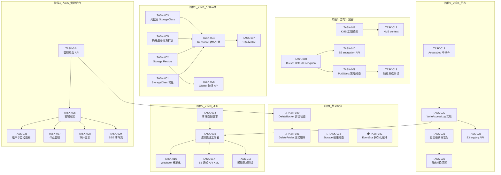
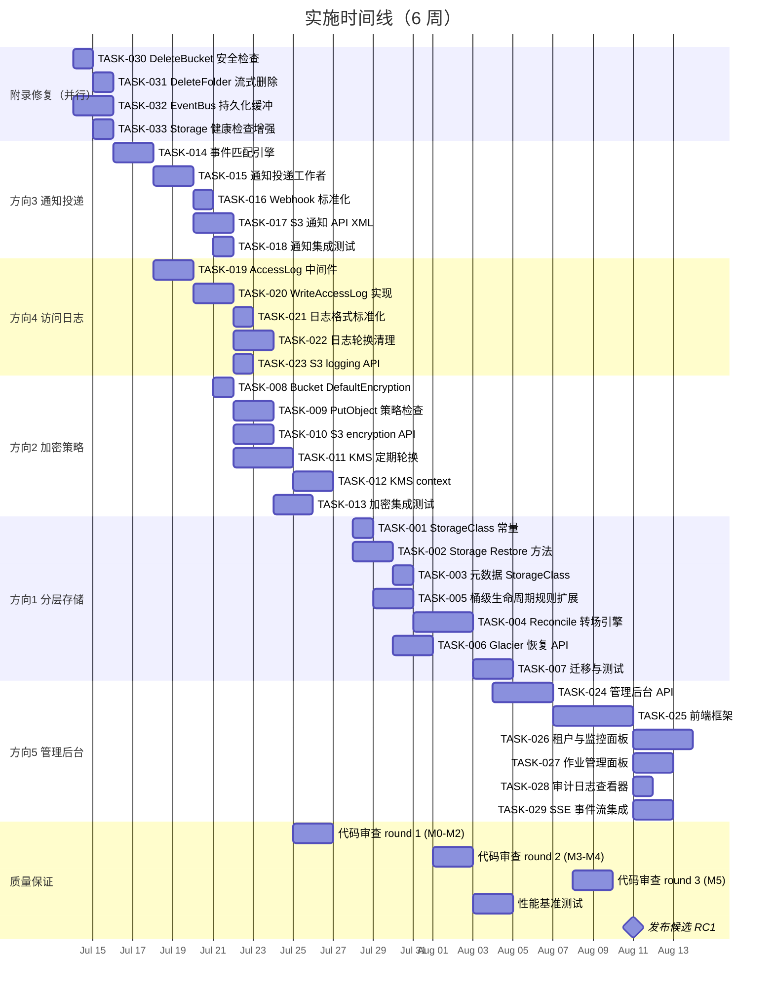

现在我已经对整个代码库有了全面的了解。以下是我的技术主管分析：

---

# 技术主管分析：5 个方向 + 4 个附录项的架构缺口

## 目录
1. [任务分解](#1-任务分解)
2. [执行顺序](#2-执行顺序)
3. [技术风险](#3-技术风险)
4. [资源评估](#4-资源评估)
5. [质量保证](#5-质量保证)
6. [实施计划](#6-实施计划)

---

## 1. 任务分解

### 方向 1：分层存储与生命周期转换

| 任务 ID | 任务标题 | 涉及文件 | 前置依赖 | 预估工时 | 验收标准 |
|---------|---------|---------|---------|---------|---------|
| TASK-001 | **定义存储类常量与迁移映射** | `internal/repository/repository.go`, `internal/config/config_storage.go` | — | 2h | `StorageClass` 类型 + `STANDARD/STANDARD_IA/GLACIER/DEEP_ARCHIVE` 常量定义；`ExpireAction` 扩展 `transition_to_<class>`；配置中新增 `STORAGE_CLASS_MAPPING` |
| TASK-002 | **Storage 接口扩展 Restore 方法** | `internal/storage/storage.go` + local/s3/oss/cos 实现 | — | 3h | `Storage` 接口增加 `Restore(ctx, key, days int) error` + `ColdStorageClass() string`；local 实现为空操作（冷热同池），S3 实现调用 `RestoreObject` |
| TASK-003 | **DataStore 增加 StorageClass 元数据读写** | `internal/storage/local_write.go`, `local_read.go` | TASK-002 | 2h | 写入时持久化 storage class 到对象元数据（S3 tag 或自定义元数据字段）；读取时返回 |
| TASK-004 | **Reconcile 生命周期转场引擎** | `internal/reconcile/lifecycle.go`（新增 `sweepTransition`） | TASK-001, TASK-002 | 4h | `LifecycleJob` 新增 `sweepTransition(ctx)`，读取 `expire_action=transition_to_STANDARD_IA` 等规则，调用 `storage.Restore`（当需要从冷存储恢复时）和 `repo.UpdateStorageClass`；添加 `lifecycle_transition_total{src,dst}` 指标 |
| TASK-005 | **桶级生命周期规则扩展** | `internal/repository/repository.go`, `sql_buckets.go`, `api/rest/handler.go`, `api/s3compat/bucketconfig.go` | TASK-001 | 3h | `BucketConfig` 新增 `TransitionDays int` + `TransitionClass string`；`SetBucketLifecycle` 接受可选的 transition 参数；S3-compat 解析 `Transition` XML 元素；REST API 新增 `transition_days` / `transition_class` 字段 |
| TASK-006 | **S3 Glacier 恢复操作 API** | `internal/service/file.go`, `api/s3compat/handler.go`, `api/rest/handler.go` | TASK-002, TASK-005 | 3h | `POST /{bucket}/{key}?restore` 在 S3 compat handler 中实现；`POST /v1/objects/{key}/restore` 在 REST handler 中；调用 `svc.RestoreObject`（新建 service 方法）；校验 `StorageClass` 为 GLACIER/DEEP_ARCHIVE |
| TASK-007 | **迁移与测试** | `migrations/{sqlite,postgres}/NNNN_*.sql`, `internal/repository/lifecycle_test.go` | TASK-001~006 | 4h | 双迁移文件增加 `transition_days` + `transition_class` 字段；存储类转换的集成测试；`Restore` 路径的 contract test |

### 方向 2：默认加密策略 + KMS 集成

| 任务 ID | 任务标题 | 涉及文件 | 前置依赖 | 预估工时 | 验收标准 |
|---------|---------|---------|---------|---------|---------|
| TASK-008 | **BucketConfig 扩展 DefaultEncryption 字段** | `internal/repository/repository.go`, `sql_buckets.go` | — | 2h | `BucketConfig.DefaultEncryption` 字段（struct `SSEConfig{S3Algorithm, KMSKeyID, KMSContext}` 或 nil）；迁移文件增加 `default_encryption` 列（JSON）；`GetBucketConfig` / `SetBucketConfig` 支持读写 |
| TASK-009 | **FileService PutObject 中加密策略检查** | `internal/service/file_crud.go`, `internal/service/file.go` | TASK-008 | 3h | `PutObject` 读取 `BucketConfig.DefaultEncryption`；若策略要求 SSE-KMS 但请求未携带 → 自动应用；若策略要求 AES256 但请求携带不同算法 → 拒绝请求（400）；日志记录强制/覆盖的加密策略 |
| TASK-010 | **S3 桶加密子资源 API** | `internal/api/s3compat/handler.go`, `api/s3compat/xml.go`, `api/rest/handler.go` | TASK-008 | 3h | `PUT /{bucket}?encryption` 解析 XML `ServerSideEncryptionConfiguration`；`GET /{bucket}?encryption` 返回 XML；`DELETE /{bucket}?encryption` 清除策略；REST 端点 `GET/PUT/DELETE /v1/buckets/{bucket}/encryption` |
| TASK-011 | **KMS 密钥定期轮换工作者** | `internal/storage/rewrap.go`, `internal/storage/kms.go`, `cmd/server/main.go` | — | 4h | `rewrap.go` 增加 `RewrapLoop(ctx, interval)` 定时扫描所有 envelope，识别使用过期 KMS key ID 的 envelope，重新包裹为新主密钥；可配置 `STORAGE_SSE_REWRAP_INTERVAL`；`rewrap_total{old_kid,new_kid}` 指标；幂等（跳过 `kid` 与当前主密钥相同的 envelope） |
| TASK-012 | **KMS context 与多区域支持** | `internal/storage/kms.go`, `internal/storage/encrypt.go` | TASK-011 | 3h | `DataKeyWrapper` 接口增加 `Context` 参数（map[string]string 或 protobuf 结构）；KMS 实现传加密上下文到 AWS KMS `GenerateDataKey` / `Decrypt`；S3-compat 的 `x-amz-server-side-encryption-context` header 解析 |
| TASK-013 | **桶加密策略的集成测试** | `internal/api/s3compat/handler_test.go`, `internal/service/service_test.go` | TASK-008~010 | 3h | 创建有加密策略的桶；验证上传对象是否自动按策略加密；验证违规请求被拒绝；验证 GET encryption 返回正确配置 |

### 方向 3：S3 事件通知投递管线

| 任务 ID | 任务标题 | 涉及文件 | 前置依赖 | 预估工时 | 验收标准 |
|---------|---------|---------|---------|---------|---------|
| TASK-014 | **事件匹配引擎（Matcher）** | `internal/events/matcher.go`（新文件） | — | 3h | `Matcher` 结构体：`Match(event Event, rules []NotificationRule) []NotificationRule`；支持事件类型过滤（`s3:ObjectCreated:*`, `s3:ObjectDeleted:*`）；支持 `FilterKey` 前缀/后缀匹配；单元测试覆盖通配符模式 |
| TASK-015 | **通知投递工作者** | `internal/events/notifier.go`（新文件） | TASK-014 | 4h | `Notifier` worker 订阅 EventBus；收到事件 → 从 repo 加载桶的 `NotificationRules` → `Matcher.Match` → 对每个匹配规则投递到 `QueueARN`（webhook URL）；对 `TopicARN` / `LambdaARN` 返回 `501 Not Implemented`；缓存的桶规则 TTL 60s |
| TASK-016 | **Webhook 格式标准化** | `internal/events/webhook.go` | TASK-015 | 2h | 通知投递的 body 格式需与现有 webhook body 对齐：`{"id","tenant","bucket","key","type","object_id","request_id","payload","created_at"}`；投递失败记录到 `webhook_failures` 表，复用现有 `RetryLoop` |
| TASK-017 | **S3-compat 通知 API 的完整 XML 解析** | `internal/api/s3compat/xml.go`, `api/s3compat/handler.go` | TASK-014, TASK-015 | 3h | 完善 `notificationConfiguration` XML 解析：支持 `QueueConfiguration`（含 `Filter` + `S3Key` + `FilterRule`）、`CloudFunctionConfiguration`（仅存储，返回501）、`TopicConfiguration`（仅存储）；重写 `putBucketNotifications` 使用标准 XML 编组 |
| TASK-018 | **通知投递的集成测试** | `internal/events/notifier_test.go`, `internal/events/bus_test.go` | TASK-014~017 | 3h | 创建测试桶 + 通知规则；发布事件；验证 webhook 目标收到 POST（httptest server）；验证匹配 `FilterKey` 的事件被投递而其他事件被忽略；验证投递失败的重试机制 |

### 方向 4：Server Access Logs

| 任务 ID | 任务标题 | 涉及文件 | 前置依赖 | 预估工时 | 验收标准 |
|---------|---------|---------|---------|---------|---------|
| TASK-019 | **AccessLog 记录中间件** | `internal/middleware/accesslog.go`（改造） | — | 3h | 在 `AccessLog` 中间件中检测请求的目标桶是否有 `LoggingConfig.Enabled`；加载桶的 logging 配置（缓存 60s TTL）；收集请求元数据（method, key, status, latency, user-agent）；异步调用 `repo.WriteAccessLog`（不阻塞请求） |
| TASK-020 | **WriteAccessLog 真实实现** | `internal/repository/sql_buckets.go` | TASK-019 | 3h | 替换空实现：在目标桶中以 `prefix/YYYY/MM/DD/HH/<target-bucket>-<YYYYMMDDTHH>-<UUID>.log` 格式写入日志对象；日志条目为 JSON Lines（每请求一行）；通过 FileService（而非直写 Storage）写入以触发事件和版本控制 |
| TASK-021 | **AccessLog 格式标准化** | `internal/repository/repository.go`, `internal/repository/sql_buckets.go` | TASK-020 | 2h | `WriteAccessLog` 签名扩展为 `(ctx, tenant, sourceBucket, targetBucket, targetPrefix, method, key, status, latencyMs, userAgent, requestID, bytesSent)`；日志条目按 [S3 Server Access Log Format](https://docs.aws.amazon.com/AmazonS3/latest/userguide/LogFormat.html) 字段为 JSON 键 |
| TASK-022 | **日志轮换与生命周期管理** | `internal/reconcile/accesslog.go`（新文件） | TASK-020, TASK-021 | 3h | `Reconcile` 新增 access log 清理通道：按日志对象的时间前缀（`YYYY/MM/DD/HH`）删除超过 `ACCESS_LOG_RETENTION_HOURS`（默认 168 = 7天）的日志对象；加入 `access_log_deleted_total` 指标 |
| TASK-023 | **S3-compat Logging API 完善** | `internal/api/s3compat/handler.go`, `api/s3compat/xml.go` | TASK-020 | 2h | 解析 `BucketLoggingStatus` XML（`PUT /{bucket}?logging`）；`GET /{bucket}?logging` 返回标准 XML；校验目标桶存在；`DELETE /{bucket}?logging` 清除配置 |

### 方向 5：企业级 Web Admin Dashboard

| 任务 ID | 任务标题 | 涉及文件 | 前置依赖 | 预估工时 | 验收标准 |
|---------|---------|---------|---------|---------|---------|
| TASK-024 | **管理后台 API 扩展** | `internal/api/rest/admin.go`, `router.go` | — | 4h | 新增端点：`GET /v1/admin/stats`（集群级统计：总对象数、总大小、活跃租户数、各后端状态）；`GET /v1/admin/jobs`（列出 JobPool 状态）；`GET /v1/admin/audit?limit=N`（最新审计日志）；`GET /v1/admin/webhook-failures`；`GET /v1/admin/events`（未消费事件）；所有端点需 `admin` scope |
| TASK-025 | **管理后台前端框架** | `internal/webui/static/`（多个新文件） | TASK-024 | 6h | 将 282 行单页应用重建为多页架构（或 SPA 路由）：`index.html`（现有搜索/detail/lineage/chat 标签保留）；新增 `admin.html`（或通过 `/#admin` 路由切换）；使用 fetch + 纯 JS（零依赖，与现有架构一致）；暗色主题与现有 UI 统一 |
| TASK-026 | **租户管理与监控面板** | `internal/webui/static/admin.html`（新文件） | TASK-025 | 4h | 租户列表（状态、创建时间）；租户配额/预算编辑（`PUT /v1/admin/tenants/{id}/quota`）；全局存储分布柱状图（按 storage class 的对象数）；prometheus 指标只读展示（请求 `/metrics` 并解析 `aero_*` 指标为简单仪表盘） |
| TASK-027 | **作业系统管理面板** | `internal/webui/static/admin.html` | TASK-025, TASK-024 | 3h | 作业队列仪表盘：按状态的作业数（pending/running/completed/failed）；最近失败的作业列表（重试按钮，调用 `POST /v1/admin/jobs/{id}/retry`）；webhook 失败记录查看 |
| TASK-028 | **审计日志查看器** | `internal/webui/static/admin.html` | TASK-025, TASK-024 | 2h | 分页审计日志表格（时间、actor、action、target、tenant、detail）；可过滤 action 类型和租户；`<pre>` 展示 detail JSON（格式化） |
| TASK-029 | **Web 端 SSE 事件流集成** | `internal/webui/static/admin.html` | TASK-025 | 3h | 管理面板顶部的实时事件流：`EventSource('/v1/events')` 显示最新 `object.created` / `object.deleted` 事件；限制显示最近 50 条；自动清理旧条目 |

### 附录项修复

| 任务 ID | 任务标题 | 涉及文件 | 前置依赖 | 预估工时 | 验收标准 |
|---------|---------|---------|---------|---------|---------|
| TASK-030 | **DeleteBucket 前检查对象引用** | `internal/repository/sql_buckets.go` | — | 2h | `DeleteBucket` 先在事务中检查 `BucketStats`；若 `ObjectCount > 0`，返回 `ErrBucketNotEmpty`（新 sentinel error）；测试驱动：创建带对象的桶后尝试删除 → 收到错误 |
| TASK-031 | **DeleteFolder 改为流式/分页删除** | `internal/api/rest/handler.go` | — | 2h | 将 `allKeys := []string{}` + 无限 append 改为：每获取一页（1000 条）立即 `BatchDelete` 该页；使用 `MAX_INFLIGHT_REQUESTS` 限流；删除过程中持续更新响应（SSE 或最终 JSON）；内存使用 O(页面大小) 而非 O(总对象数) |
| TASK-032 | **EventBus 持久化缓冲/背压** | `internal/events/bus.go` | — | 3h | 增设一个中间持久化缓冲 channel（buffered + 磁盘溢出）：默认 1024 的环形缓冲 + 当 channel full 时以 `webhook_failures` 表持久化溢出的最新事件（每个 subscriber 保留最近 N 个）；添加 `event_bus_buffer_usage` gauge；`Dropped()` 计数器保留但设 warn log |
| TASK-033 | **Storage 健康检查增强** | `cmd/server/main.go`, `internal/storage/storage.go` | — | 2h | `readyzHandler` 改为：写入探针对象 → `Put(ctx, "@healthz/probe_{pid}", bytes.NewReader([]byte(time.Now().UTC().String())), -1, PutOptions{})` → 读取验证 → 删除探针对象（cleanup）；设置 5s 超时；metric `health_check_duration_ms` |

---

## 2. 执行顺序



### 可并行执行的任务组

| 并行组 | 任务 | 原因 |
|--------|------|------|
| **A（安全修复）** | TASK-030, TASK-031, TASK-032, TASK-033 | 互相独立，各自解决一个独立的安全/稳定性问题 |
| **B（日志）** | TASK-019 → TASK-020 → TASK-021 + TASK-022 + TASK-023 | 线性依赖链，TASK-021 和 TASK-022 可并行 |
| **C（加密）** | TASK-008 → TASK-009 + TASK-010；TASK-011 + TASK-012 | 两个子链可并行 |
| **D（通知）** | TASK-014 → TASK-015 → TASK-016 + TASK-017 + TASK-018 | 线性核心链 + 三个可并行收尾任务 |
| **E（存储类）** | TASK-001 → TASK-002 → TASK-003 (小并行) + TASK-004 (大依赖) + TASK-005 + TASK-006 | **关键路径最长**，TASK-002/003/005 可部分并行 |
| **F（管理后台）** | TASK-024 → TASK-025 → TASK-026/027/028/029 | 前端密集，后端 API 需最先完成 |

---

## 3. 技术风险

### 3.1 方向 1：分层存储 — 高风险

| 风险 | 影响 | 可能性 | 缓解策略 |
|------|------|--------|---------|
| **S3 RestoreObject 异步性** | `Restore` 可能返回 `200` (restore 已启动 but 对象仍不可读) vs `202` (正在从 Glacier 恢复)。FileService 的 Get 路径需要判断对象是否仍在恢复中 | 高 | 在 `Object.RestoreStatus` 字段标记状态（`RESTORING` / `RESTORED`）；Get 时若为 `GLACIER` 且非 `RESTORED` → 返回 `X-Amz-Restore: ongoing-request="true"` header；客户端通过 `HEAD ?restore` 轮询 |
| **本地后端冷热模拟** | local FS 没有真正分层，所有存储类共用一个目录。需要确保 local 测试路径不产生假阳性 | 中 | local 实现 `Restore` 作为空操作（立即返回成功）；所有 storage class 转换操作在 local 后端仅更新元数据；contract test 覆盖 local + mock S3 |
| **多版本对象转场语义** | 当 bucket 启用 versioning，生命周期规则应作用于当前版本（而非所有版本）。S3 的 transition 只作用于当前版本，但删除标记继承需要额外逻辑 | 高 | 阅读 S3 Lifecycle 文档严格实现：`Expiration` 删除当前版本 + 保留删除标记；`NoncurrentVersionExpiration` 清理非当前版本；`Transition` 只作用于当前版本；`NoncurrentVersionTransition`（可选延期实现） |
| **迁移向后的兼容性** | 现有对象 `storage_class` 为 `""`（默认 STANDARD）。transition 引擎需正确处理空字符串 | 低 | `StorageClassOrDefault("")` → `STANDARD`；迁移时执行 `UPDATE objects SET storage_class='STANDARD' WHERE storage_class IS NULL OR storage_class = ''` |

### 3.2 方向 2：默认加密 — 中风险

| 风险 | 影响 | 可能性 | 缓解策略 |
|------|------|--------|---------|
| **KMS 依赖故障** | 如果 KMS 不可达，所有 PutObject 操作将失败（对配置了默认加密的桶），包括基础 CRUD | 中 | 在加密策略加载时 `ping` KMS（`DescribeKey` 调用），失败时 degrade 为无加密 + `warn`；外部可观测：`bucket_encryption_kms_healthy{tenant,bucket}` gauge |
| **SSE-C 与 KMS 冲突** | 用户请求携带 SSE-C header，但桶策略要求 SSE-KMS。S3 返回 400 `BadRequest` | 低 | 策略优先：在 `PutObject` 中，若桶有 `DefaultEncryption`，忽略用户 SSE-C header 并应用桶策略（记录 `warn`）；只有在桶无策略时才使用用户提供的加密 |
| **rewrap 性能** | 扫描所有 envelope 的 rewrap 循环在大型存储（百万对象）上可能持续数小时 | 中 | 分页扫描（每批 1000）；`rewrap_loop` gauge 显示进度（`rewrap_scanned` / `rewrap_rewrapped`）；可中断（ctx cancellation）；启动时若 `REWRAP_ON_START` + `REWRAP_INTERVAL` 同时设置，启动扫描完成后开始定期循环 |

### 3.3 方向 3：事件通知 — 中风险

| 风险 | 影响 | 可能性 | 缓解策略 |
|------|------|--------|---------|
| **事件风暴（Event Storming）** | 批量删除 10 万个对象 → `object.deleted` 事件 10 万个 → 通知投递工作者超载 | 高 | `BatchDelete` 内部引入去抖动机制（聚合相同桶/目标的事件）；通知工作者使用工作池（`sem.Weighted` 限制并行投递数 `NOTIFIER_CONCURRENCY=10`）；监控 `notifier_queue_depth` |
| **FilterKey 模式性能** | S3 通知支持 `FilterKey` 前缀 + 后缀过滤。如果规则很多（几十个），`Matcher.Match` 可能成为瓶颈 | 低 | 编译期的前缀树（Trie）和后缀通配符优化；缓存编译后的规则在 `Notifier` 中；基准测试验证 100规则 * 100事件/秒 < 1ms |
| **事件丢失 vs 重复** | 事件总线当前是 at-most-once（`broadcast` drop on full）。通知投递要求 at-least-once | 中 | 利用已存在的持久化事件表：`Notifier` 在接收到事件后将 `event_id` 写入 `notification_progress{tenant,bucket}` 表（类似消费者偏移量）；崩溃重启后从上次偏移量回放 |

### 3.4 方向 4：日志 — 低风险

| 风险 | 影响 | 可能性 | 缓解策略 |
|------|------|--------|---------|
| **日志写入延迟** | 每条请求都写一个日志对象 → 大量小对象 → 写入吞吐瓶颈 | 中 | 批量写入：每 5s 或每 1000 条合并写入一个日志对象；使用 `append` 语义（如支持）或单个 JSON Lines 文件；可配置 `ACCESS_LOG_FLUSH_INTERVAL` / `ACCESS_LOG_BATCH_SIZE` |
| **日志存储成本** | 日志对象可能快速增长（生产环境每天 GB 级） | 低 | 默认 7 天保留期（TASK-022）；日志对象自动使用 `STANDARD_IA` 存储类；`ACCESS_LOG_RETENTION_HOURS` 配置 |
| **自引用日志** | 如果 `LoggingTarget` 指向同一个桶，写入日志会触发新的事件 → 无限的日志-事件循环 | 中 | 写日志时在 `PutObject` 请求中传递 `X-Aero-Internal: access-log` header（或 context key）；FileService 检测该标记 → 不触发事件发布；`WriteAccessLog` 直写 Storage（跳过 Service 层） |

### 3.5 方向 5：管理后台 — 低风险

| 风险 | 影响 | 可能性 | 缓解策略 |
|------|------|--------|---------|
| **前端技能差距** | Go 工程师可能不熟悉前端开发，282 行 vanilla JS 的管理后台扩展可能质量参差 | 中 | 使用零依赖的 vanilla JS（保持现有栈）；限制 UI 复杂度（无虚拟 DOM，无路由库）；使用模板字符串 + `innerHTML` 构建视图；提供 HTML 代码审查 checklist |
| **API 端点权限放行** | Admin API 端点可能被非 admin 用户调用 | 低 | 所有 `admin` 端点必须在 `router.go` 中注册 `admin` scope（`r.With(mw.RequireScope("admin"))`）；统一测试：`TestAdminEndpointsRequireScope` |

### 3.6 附录修复 — 低风险

| 风险 | 影响 | 可能性 | 缓解策略 |
|------|------|--------|---------|
| **TASK-030 破坏现有行为** | 一些客户端可能依赖 `DeleteBucket` 级联删除所有对象（AWS S3 不允许删除非空桶） | 低 | 严格匹配 S3 行为：`DeleteBucket` 要求桶为空 → 返回 `BucketNotEmpty`；提供 `POST /v1/admin/buckets/{bucket}/purge` 进行强制级联删除 |
| **TASK-032 引入竞态** | 持久化缓冲可能在多生产者/多消费者模式下出现事件顺序错乱 | 低 | 每个 subscriber 独立环形缓冲（非共享）；顺序仅在同一 subscriber 通道内保证；使用 `sync.Mutex` 而不是 channel select 来保护环形缓冲 |

---

## 4. 资源评估

### 4.1 团队配置建议

| 角色 | 所需人数 | 技能要求 | 主要负责 |
|------|---------|---------|---------|
| **Backend Go 工程师（主力）** | 2 人 | Go, SQLite/Postgres, S3 API 知识 | 方向1/2/3 核心逻辑 + 所有附录修复 |
| **Backend Go 工程师（辅助）** | 1 人 | Go, HTTP/REST, 前端基础知识 | 方向4 日志管线 + 方向5 管理 API |
| **前端工程师** | 1 人 | HTML/CSS/JS (vanilla), 数据可视化 | 方向5 管理面板 UI |
| **QA 工程师** | 1 人 (兼职) | Go 测试, S3 兼容性测试 | 集成测试 + 性能基准 |
| **技术主管** | 1 人 (兼职) | 架构设计, 代码审查 | 设计决策, ADR, 代码审查, 进度跟踪 |

**最小可行团队**：2 人（1 主力 Go + 1 全栈），可在 4-6 周内完成附录修复 + 方向3/4。

### 4.2 关键里程碑

| 里程碑 | 时间点 | 交付物 | 验证方式 |
|--------|--------|--------|---------|
| **M0: 安全基线** | 第 1 周 | TASK-030, TASK-031, TASK-032, TASK-033 | `make check` 全绿；`go test ./...` 通过 |
| **M1: 通知投递就绪** | 第 2 周 | TASK-014~018 全部完成 | 集成测试：创建通知规则→上传对象→目标收到 POST |
| **M2: 日志管线就绪** | 第 2-3 周 | TASK-019~023 全部完成 | 集成测试：启用 logging→发出请求→目标桶出现日志对象 |
| **M3: 加密策略就绪** | 第 3-4 周 | TASK-008~013 全部完成 | 集成测试：设置桶加密策略→上传→验证对象加密 |
| **M4: 分层存储 alpha** | 第 4-5 周 | TASK-001~007 全部完成 | contract test 覆盖 local/S3 Restore；Reconcile 转场逻辑 |
| **M5: 管理后台 beta** | 第 5-6 周 | TASK-024~029 全部完成 | 人工 E2E 测试：管理面板功能可用 |
| **M6: 发布** | 第 6 周 | 全部任务 + `make check` + docs | 发布候选版本 |

### 4.3 阻塞点

| 阻塞点 | 影响 | 解决策略 |
|--------|------|---------|
| **方向1 S3 RestoreObject 的异步行为需要真实 AWS 账户测试** | 本地测试无法验证 S3 Glacier 恢复流程 | 使用 `minio` + `mc ilm tier add` 模拟 S3 Glacier 生命周期；Mock `S3API.RestoreObject` 返回可配置的响应 |
| **方向2 KMS 集成需要外部 KMS 提供者** | 本地开发环境无 KMS | 提供 `fakekms` 内部实现（内存中的 `DataKeyWrapper`，支持 kid 和 context，不做真正 wrapping）；集成测试使用 fakekms；生产使用真正的 AWS KMS |
| **方向5 管理 API 需要仔细的权限设计** | 新增的 admin 端点可能泄露敏感数据 | 严格执行 `admin` scope 检查；审计日志记录所有 admin 操作；API handler 新增 `mustBeAdmin` 辅助函数 |

---

## 5. 质量保证

### 5.1 单元测试覆盖要求

| 包 | 要求覆盖率 | 关键测试用例 |
|----|-----------|------------|
| `internal/events/` | ≥ 80% | `matcher_test.go`: 事件类型匹配、`FilterKey` 前缀/后缀、多规则优先级；`notifier_test.go`: 规则加载、投递成功/失败、去抖 |
| `internal/reconcile/` | ≥ 75% | `lifecycle_test.go` 扩展：transition 逻辑、`STANDARD→STANDARD_IA`、跳过锁定对象、多页过期对象 |
| `internal/storage/` | ≥ 70% | `contract_test.go` 扩展：Restore + ColdStorageClass 方法；mock S3 的 RestoreObject 模拟 |
| `internal/repository/` | ≥ 75% | `sql_buckets_test.go`: DefaultEncryption CRUD、TransitionDays、BucketNotEmpty 错误；`sql_objects_test.go`: UpdateStorageClass |
| `internal/api/s3compat/` | ≥ 60% | `handler_test.go`: notification XML round-trip、encryption sub-resource、logging sub-resource |
| `internal/api/rest/` | ≥ 60% | `admin.go` 新增端点测试、`encryption_test.go` |
| `internal/middleware/` | ≥ 80% | `accesslog_test.go`: logging config 加载、异步写延迟、自引用日志抑制 |

### 5.2 集成测试策略

| 测试层级 | 运行方式 | 覆盖场景 |
|---------|---------|---------|
| **单元测试** | `go test ./...` | 所有 Go 包；SQLite + local FS；零网络 |
| **storage contract test** | `go test -run TestStorageContract ./internal/storage/` | 所有 Storage 后端（local, s3 mock, oss mock, cos mock）；Restore + ColdStorageClass |
| **s3compat 集成** | `go test -run TestS3Compat ./internal/api/s3compat/` | 通过 `httptest.Server` 发完整 HTTP 请求；测试 notification/encryption/logging 子资源 |
| **端到端（方向3）** | `go test -run TestNotificationDelivery ./internal/events/` | 创建桶+规则→上传→目标 server 接收 POST |
| **端到端（方向4）** | `go test -run TestAccessLog ./internal/middleware/` | 启用 logging→请求→日志对象写入目标桶 |
| **端到端（方向1）** | `go test -run TestLifecycleTransition ./internal/reconcile/` | 设置 transition 规则→等待→验证 storage key 被移动 |

### 5.3 代码审查要点

| 审查焦点 | 检查项 |
|---------|--------|
| **方向1 存储类转换** | ① transition 规则是否考虑 locked objects（跳过）；② `Restore` 在 local backend 是空操作；③ 迁移脚本正确处理 `NULL` storage_class |
| **方向2 加密策略** | ① `DefaultEncryption` 对象生命周期（正确序列化/反序列化）；② 策略拒绝条件（SSE-C vs SSE-KMS 冲突）的 HTTP 状态码 = 400；③ rewrap 循环是否幂等且可中断 |
| **方向3 通知投递** | ① 事件匹配的 `FilterKey` 是否处理 `""`（空 = 不限制）；② 投递失败时 `webhook_failures` 记录是否包含完整 payload；③ at-least-once 投递的消费者偏移量管理 |
| **方向4 访问日志** | ① 自引用日志循环保护（`X-Aero-Internal` header）；② 批量写入的竞态安全；③ 日志格式与 S3 标准的兼容性 |
| **方向5 管理后台** | ① 所有 admin API 端点都有 scope 检查；② 审计日志记录所有写操作；③ 前端不存在 XSS 漏洞（使用 `textContent` 而非 `innerHTML` 渲染用户数据） |
| **附录修复** | ① `DeleteBucket` 的结果兼容性（AWS 行为）；② `DeleteFolder` 内存使用验证；③ EventBus 缓冲的锁安全性；④ 健康检查的超时和清理 |

### 5.4 性能测试需求

| 测试场景 | 工具 | 指标 | 目标 |
|---------|------|------|------|
| **大量对象生命周期转场** | `go test -bench` + 10万对象 | 转场单批处理时间 | < 30s / 200 对象（当前 limit） |
| **通知投递高吞吐** | `httptest` + 并发 producer | 事件->投递延迟 P99 | < 500ms |
| **日志写入批量缓冲** | 基准测试 | 日志写入吞吐 | > 1000 req/s 写入延迟 < 200ms avg |
| **EventBus 缓冲压力** | 模拟慢 subscriber | 环形缓冲用法 | 不 panic，不丢失事件（持久化溢出） |
| **管理 API 并发** | `wrk` / `hey` | 延迟 P95 | < 200ms (管理 API 轻量) |

---

## 6. 实施计划

### 甘特图



### 阶段计划详述

#### 阶段 1：基础设施搭建（第 1 周，7 月 14-18 日）

**目标**：消除 4 个附录项的高优先级安全/稳定性风险 + 开始方向 3 和方向 4 的基础建设

| 天 | 工作内容 | 产出 |
|---|---------|------|
| 1 | TASK-030 (DeleteBucket 安全检查) + TASK-031 (DeleteFolder 流式删除) | 2 个 PR，含测试 |
| 2 | TASK-032 (EventBus 持久化缓冲) + TASK-033 (Storage 健康检查增强) | 2 个 PR，含测试 |
| 3 | TASK-014 (事件匹配引擎) 设计 + 实现 + 测试 | 1 个 PR，matcher.go |
| 4 | TASK-015 (通知投递工作者) + TASK-016 (Webhook 标准化) | 1 个 PR，notifier.go |
| 5 | TASK-019 (AccessLog 中间件) 设计 + 实现 | 1 个 PR，改造 middleware/accesslog.go |

**阶段 1 完成标志**：`make check` 全绿，附录项 4 个修复全部通过测试，方向 3 和方向 4 的基础代码已提交

#### 阶段 2：核心功能实现（第 2-3 周，7 月 21 日 - 8 月 1 日）

**目标**：完成方向 2（加密策略）+ 方向 3（通知投递）+ 方向 4（日志管线）+ 开始方向 1

**周 2（7/21-7/25）：**
- TASK-008 (DefaultEncryption 字段) + TASK-009 (PutObject 策略检查) — 加密核心
- TASK-017 (S3 通知 API XML) + TASK-018 (通知集成测试) — 通知收尾
- TASK-020 (WriteAccessLog 真实实现) + TASK-021 (日志格式标准化) — 日志核心
- TASK-011 (KMS 定期轮换) 开始

**周 3（7/28-8/1）：**
- TASK-010 (S3 encryption API) + TASK-013 (加密集成测试) — 加密收尾
- TASK-022 (日志轮换清理) + TASK-023 (S3 logging API) — 日志收尾
- TASK-001~TASK-003 (StorageClass 基础) — 分层存储基础
- TASK-005 (桶级生命周期规则扩展) — 分层存储 API

**阶段 2 完成标志**：方向 3 端到端测试通过，方向 4 端到端测试通过，方向 2 核心集成测试通过

#### 阶段 3：集成测试和优化（第 4-5 周，8 月 4-15 日）

**目标**：完成方向 1（分层存储）+ 方向 5（管理后台）+ 性能优化

**周 4（8/4-8/8）：**
- TASK-004 (Reconcile 转场引擎) — 方向 1 关键路径
- TASK-006 (Glacier 恢复 API) — 方向 1 API
- TASK-007 (迁移与测试) — 方向 1 收尾
- TASK-024 (管理后台 API) — 方向 5 后端

**周 5（8/11-8/15）：**
- TASK-025 (前端框架) — 方向 5 前端基础
- TASK-026~TASK-029 (管理面板各组件) — 方向 5 前端实现
- 性能基准测试（方向 3/4/附录项）
- 代码审查 round 3

**阶段 3 完成标志**：方向 1 contract test 全部通过，方向 5 管理面板 E2E 可用，性能指标达标

#### 阶段 4：发布准备（第 6 周，8 月 18-22 日）

**目标**：最终测试 + 文档 + 发布候选

| 任务 | 工时 |
|------|------|
| `openapi.json` 更新 — 新端点全部加入 API 规范 | 3h |
| README / docs/configuration.md 更新 — 新的环境变量 + 配置 | 2h |
| Changelog 编写 | 1h |
| Release candidate 构建 + 部署测试 | 2h |
| 最终 `make check` + 全平台构建 | 1h |

**阶段 4 完成标志**：版本标签 `v0.2.0` 发布，包含全部 5 个方向 + 4 个附录项修复

---

## 总结

### 实施顺序的核心逻辑

```
1. FIRST: 附录修复（M0）— 安全/稳定性基线，零架构风险
2. THEN:  方向3（通知）+ 方向4（日志）— 数据模型已完整，只需补充运行时引擎
3. THEN:  方向2（加密）— 中复杂度，但桶级策略模式不改变存储层
4. THEN:  方向1（分层存储）— 最高复杂度，需要 Storage 接口变更 + reconcile 扩展
5. LAST:  方向5（管理后台）— 前端工作独立，可在后端 API 就绪后集中交付
```

### 估算总工时

| 方向 | 任务数 | 总小时 | 人周 (单人) |
|------|--------|--------|------------|
| 附录修复 | 4 | 9h | ~1.1 |
| 方向1 (分层存储) | 7 | 21h | ~2.6 |
| 方向2 (加密) | 6 | 18h | ~2.3 |
| 方向3 (通知) | 5 | 15h | ~1.9 |
| 方向4 (日志) | 5 | 13h | ~1.6 |
| 方向5 (管理后台) | 6 | 22h | ~2.8 |
| **总计** | **33** | **98h** | **~12.3** |

**2 人团队**: 约 6 周（含代码审查 + 性能测试）  
**3 人团队**: 约 4 周

### 下一推建议

如果您同意以上分析，我可以：

1. **立即开始代码实现** — 从 **M0（附录修复）** 开始写 PR，这 4 个任务可以在 2 天内完成
2. **深入设计 ADR** — 为方向 1 撰写架构决策记录（尤其是多版本对象的 lifecycle transition 语义）
3. **细化优先功能** — 如果您想聚焦特定方向（如方向 3 通知投递），我可以立即产出完整的实现代码
