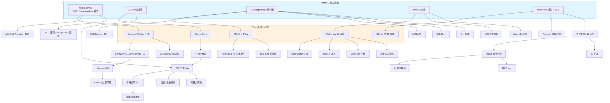
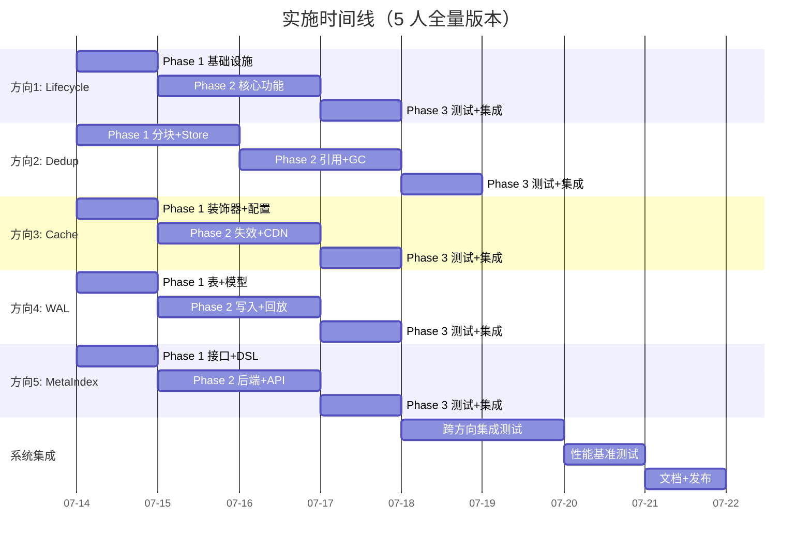

我已完成了全面的代码锚点验证、已有文档覆盖分析和源码结构调研。以下是完整的 Tech Lead 分析。

---

# Tech Lead 分析报告：5 大高价值扩展方向

## 审查结论摘要

### 文档现状
分析文档存在于 `docs/requirements/README.md`（19KB），但位于非标准位置。建议按项目命名规范保存为 `docs/requirements/expansion-directions-v2.md`。

### 覆盖度验证

| 方向 | ROADMAP.md | analysis-v[1-8] | expansion-directions.md(v1) | 其他 expansion 文档 |
|------|:-----------:|:---------------:|:---------------------------:|:-------------------:|
| **1. 存储生命周期分层** | ✅ #9 有概念方向 | ❌ 未覆盖 | ❌ 未覆盖 | v91 有深度分析 |
| **2. 内容寻址去重** | ❌ 未覆盖 | ❌ 未覆盖 | ❌ 未覆盖 | 多篇提及但无深度 |
| **3. 多层对象缓存** | ❌ 未覆盖 | ❌ 未覆盖 | ❌ 未覆盖 | v91 #4 有深度分析 |
| **4. 事件 WAL + 回放** | ❌ 未覆盖 | ❌ 未覆盖 | ❌ 未覆盖 | 多篇提及但无深度 |
| **5. 元数据查询引擎** | ❌ 未覆盖 | ❌ 未覆盖 | ❌ 未覆盖 | v91 #2 有深度分析 |

**判定：** 在 `ROADMAP.md` + `analysis-v[1-8]` + `expansion-directions.md`(v1) 这三个文件范围内，5 个方向确实未被覆盖。方向 1 在 ROADMAP #9 中有概念级方向描述但无实现路径。方向 2/4 从未被深度独立分析。方向 3/5 在 `expansion-v91` 中有平行分析但走不同的实现路线。

**建议：** 将 README.md 按规范重命名并追加本文的 Tech Lead 任务分解，形成可执行的工程计划。

---

## 1. 任务分解（Task Breakdown）

### 方向一：存储类生命周期自动转换与冷归档恢复

| 任务 ID | 任务标题 | 涉及文件 | 前置依赖 | 预估工时 | 验收标准 |
|---------|---------|---------|---------|:--------:|---------|
| **T-101** | TransitionRule 模型定义与 BucketConfig 扩展 | `internal/repository/repository.go`, migrations | 无 | 3h | `BucketConfig` 包含 `Transitions []TransitionRule`；迁移文件新增 `transition_rules` 列 |
| **T-102** | Lifecycle Worker transition 扫描引擎 | `internal/reconcile/lifecycle.go` | T-101 | 4h | `sweepTransitions()` 按规则扫描过期对象；skip `locked_until > now`；metrics 埋点 |
| **T-103** | STANDARD→STANDARD_IA 元数据转换 | `internal/service/file.go` | T-102 | 2h | 仅更新 `StorageClass` 字段；不搬动 blob；单元测试覆盖更新竞争条件 |
| **T-104** | STANDARD_IA→GLACIER 后端适配 | `internal/storage/s3.go`, `internal/storage/local.go` | T-103 | 4h | S3 后端调用 `CopyObject` 带 StorageClass；local 后端元数据标记 |
| **T-105** | Restore API：InitiateRestore + RestoreStatus | `internal/api/rest/handler.go`, `internal/service/file.go` | T-104 | 4h | `POST /v1/files/{key}?restore&days=N` → 临时副本；`GET ?restore` → 状态/过期时间 |
| **T-106** | Restore 过期清理（Reconcile 扫描） | `internal/reconcile/lifecycle.go`, migrations | T-105 | 2h | 新增 `restore_expires_at` 列；Reconcile 清除过期临时副本 |
| **T-107** | REST/S3 API 暴露 Transition 规则 | `internal/api/rest/router.go`, `internal/api/s3compat/bucketconfig.go` | T-101 | 3h | PUT/GET bucket lifecycle 支持 `Transition` XML 元素 |
| **T-108** | 写入路径：PUT 时 StorageClass 正确透传 | `internal/service/file_crud.go`, `internal/service/file.go` | T-101 | 2h | `x-amz-storage-class` 从 request → Object.StorageClass；默认 fallback 到 STANDARD |

**小计：24h / 3 人·天**（建议 1 人专注 3 天）

---

### 方向二：内容寻址存储与块级去重

| 任务 ID | 任务标题 | 涉及文件 | 前置依赖 | 预估工时 | 验收标准 |
|---------|---------|---------|---------|:--------:|---------|
| **T-201** | CDC 分块引擎（Rabin/Buzhash） | `internal/storage/dedup/` 新包 | 无 | 6h | 输入 io.Reader → 输出 `[]Chunk`（指纹+偏移+长度）；参数化 avgSize 4KB–1MB |
| **T-202** | Chunk Store：指纹→块存储映射 | `internal/storage/dedup/chunkstore.go` | T-201 | 5h | LevelDB/bbolt 存储 `sha256([data]) → bytes`；支持 CRUD |
| **T-203** | ChunkRef 引用计数表 | `internal/repository/migrations`, `internal/repository/repository.go` | T-202 | 3h | 新表 `chunk_refs`（fingerprint, object_id, ref_count）事务性更新 |
| **T-204** | 异步去重 Job（写入后后台去重） | `internal/reconcile/dedup.go` 新文件 | T-201, T-203 | 5h | 新对象写入 → enqueue DedupJob → 后台分块+引用+替换 blob |
| **T-205** | 引用归零 GC（Reconcile 扫描） | `internal/reconcile/dedup_gc.go` | T-204 | 3h | ref_count=0 的 chunk → 物理删除；幂等；lease 防重 |
| **T-206** | 版本快照增量存储 | `internal/service/versioning.go` | T-205 | 5h | 同一对象版本间共享块 → 仅存块清单差异；物理存储按引用计数 |
| **T-207** | 加密+去重兼容策略 | `internal/storage/encrypt.go` | T-204 | 3h | 先分块→再逐块加密→块级去重仍有效；KMS 调用优化 |
| **T-208** | 跨租户去重策略控制 | `internal/config/config.go`, `internal/service/file.go` | T-204 | 2h | `STORAGE_DEDUP_SCOPE=tenant|global`；默认 tenant 级隔离 |

**小计：32h / 4 人·天**（建议 2 人并行 2 天）

---

### 方向三：多层对象缓存（L1 内存 + L2 磁盘 + CDN）

| 任务 ID | 任务标题 | 涉及文件 | 前置依赖 | 预估工时 | 验收标准 |
|---------|---------|---------|---------|:--------:|---------|
| **T-301** | CachingStorage 装饰器实现 `storage.Storage` | `internal/storage/caching.go` 新文件 | 无 | 4h | 实现 `storage.Storage` 接口；L1 ristretto 缓存；L2 磁盘缓存（可选） |
| **T-302** | 缓存键设计 + ETag 版本关联 | `internal/storage/caching.go` | T-301 | 2h | 键=`{tenant}:{bucket}:{key}:{offset}-{length}`；ETag 变化时自动失效 |
| **T-303** | PUT/DELETE 路径缓存失效 | `internal/events/bus.go` 扩展, `internal/storage/caching.go` | T-302 | 3h | 写操作 → 事件广播 → 异步失效缓存；跨实例 Postgres LISTEN/NOTIFY |
| **T-304** | CDNProvider 接口 + CloudFront 适配 | `internal/storage/cdn.go` 新文件 | T-301 | 4h | `Preheat(key)`、`Invalidate(key)`；PresignGet 绑定 CDN URL |
| **T-305** | 配置系统：容量/TTL/路径 | `internal/config/config.go` 扩展 | T-301 | 1h | `OBJECT_CACHE_MEMORY_MB`、`OBJECT_CACHE_DISK_PATH`、`OBJECT_CACHE_DISK_SIZE_GB` |
| **T-306** | SSE-C 加密对象缓存策略 | `internal/storage/caching.go` | T-302 | 2h | 缓存密文；每请求解密；权限断言 |
| **T-307** | 指标埋点 + 命中率监控 | `internal/telemetry/` | T-301 | 2h | `cache_hit_total`、`cache_miss_total`、`cache_byte_hit`、`cache_eviction_total` |
| **T-308** | 工厂集成：factory.go wrap-with-cache | `internal/storage/factory.go` | T-301 | 1h | config 激活；按 backend 决定是否 wrap |

**小计：19h / 2.4 人·天**（建议 1 人专注 2.5 天）

---

### 方向四：基于事件的写前日志（WAL）与状态回放

| 任务 ID | 任务标题 | 涉及文件 | 前置依赖 | 预估工时 | 验收标准 |
|---------|---------|---------|---------|:--------:|---------|
| **T-401** | event_log 表创建 + EventLogEntry 模型 | 双迁移文件 `NNNN_event_log.up.sql`, `internal/repository/repository.go` | 无 | 2h | `event_log` 表含 seq/before/after JSON；seq 单调递增 |
| **T-402** | FileService 同步写入 WAL | `internal/service/file_crud.go`, `internal/service/file.go` | T-401 | 4h | 每个写操作（Put/Delete/SetTags/SetACL/Lock）在同一事务中写入 event_log |
| **T-403** | before/after 快照生成 | `internal/service/wal.go` 新文件 | T-402 | 3h | 操作前读 Object → JSON；操作后读 Object → JSON；diff 可选 |
| **T-404** | 状态回放引擎 EventReplay | `internal/reconcile/event_replay.go` 新文件 | T-401 | 6h | 从任意 seq 开始按序回放；幂等；`--target-time` 回放到某时刻；Dry-run 模式 |
| **T-405** | 消费者迁移：Indexer 使用 WAL 游标 | `internal/ai/indexer.go` | T-402 | 4h | Indexer 记录 `last_seq`；从 event_log 消费替代 NextUnconsumedEvents |
| **T-406** | 消费者迁移：Webhook 使用 WAL 游标 | `internal/events/webhook.go` | T-402 | 3h | Webhook 记录 `last_seq`；失败 → 死信队列不阻塞 WAL |
| **T-407** | WAL 分区归档策略 | `internal/reconcile/wal_archive.go` 新文件 | T-401 | 3h | 按时间分区（月表）；Reconcile 将 90 天前 WAL 导出到对象存储 Parquet/JSON |
| **T-408** | 异步 WAL 写入模式（可配置） | T-402 扩展 | T-402 | 2h | 配置 `WAL_MODE=sync|batch(100ms)|critical`；batch 模式丢 100ms 窗口 |

**小计：27h / 3.4 人·天**（建议 2 人并行 1.5 天）

---

### 方向五：富元数据索引与查询引擎

| 任务 ID | 任务标题 | 涉及文件 | 前置依赖 | 预估工时 | 验收标准 |
|---------|---------|---------|---------|:--------:|---------|
| **T-501** | MetaIndex 接口定义 + MetaExpr 查询 DSL 解析器 | `internal/metaindex/` 新包 | 无 | 5h | `MetaIndex{IndexObject, DeleteObject, Query}`；DSL 解析 `department="eng" AND (size > 1MB)` → AST |
| **T-502** | SQLite FTS5 + JSON1 后端实现 | `internal/metaindex/sqlite.go` | T-501 | 5h | 虚拟列+索引；FTS5 全文；表达式索引；查询下推 |
| **T-503** | Postgres GIN + JSONB 后端实现 | `internal/metaindex/postgres.go` | T-501 | 4h | 表达式索引 `GIN(metadata jsonb_path_ops)`；`@?` 和 `@@` 操作符；pgvector 可选联动 |
| **T-504** | 显式索引字段声明 API | `internal/api/rest/handler.go`, `internal/service/file.go` | T-501 | 3h | `POST /v1/buckets/{bucket}/meta-index {fields: [...]}`；50 字段上限 |
| **T-505** | 元数据查询 REST API | `internal/api/rest/router.go`, `internal/api/rest/search.go` | T-504 | 3h | `GET /v1/search/metadata?q=...&sort=-created_at&limit=20`；分页 |
| **T-506** | S3 ListObjects 扩展 metadata-filter | `internal/api/s3compat/handler.go` | T-504 | 3h | `?metadata-filter=department=eng`；返回标准 XML 格式 |
| **T-507** | AI 检索联动：先 metadata 过滤缩小范围 | `internal/ai/search.go` | T-505 | 4h | 存在 metadata filter 时先执行元数据查询 → 候选集语义搜索 → 减少向量扫描量 |
| **T-508** | MCP tool: search_metadata 暴露 | `internal/mcp/server.go` | T-505 | 2h | Agent 可调用 `search_metadata(tenant, expression)` 工具 |

**小计：29h / 3.6 人·天**（建议 2 人并行 1.5 天）

---

### 汇总

| 方向 | 任务数 | 总工时 | 建议人力 | 实际历时 |
|------|:------:|:------:|:--------:|:--------:|
| 1. 生命周期分层 | 8 | 24h | 1 人 | 3 天 |
| 2. 内容寻址去重 | 8 | 32h | 2 人 | 2 天 |
| 3. 多层对象缓存 | 8 | 19h | 1 人 | 2.5 天 |
| 4. 事件 WAL + 回放 | 8 | 27h | 2 人 | 1.5 天 |
| 5. 元数据查询引擎 | 8 | 29h | 2 人 | 1.5 天 |
| **合计** | **40** | **131h** | **~5 人** | **~3-4 周** |

---

## 2. 执行顺序与依赖图



### 并行执行组（Phase 1 — 独立基础设施）

| 并行组 | 包含任务 | 负责人 | 预估时间 |
|--------|---------|--------|:--------:|
| **G1-Lifecycle 模型** | T-101, T-108 | Dev A | 1 天 |
| **G2-Dedup 分块** | T-201, T-202 | Dev B, Dev C | 1.5 天 |
| **G3-Cache 装饰器** | T-301, T-305, T-308 | Dev A (T-101 后) | 1 天 |
| **G4-WAL 表** | T-401, T-407 | Dev D | 1 天 |
| **G5-MetaIndex 接口** | T-501 | Dev E | 1 天 |

**Phase 1 总历时：** 1.5 天（并行 5 人）

### 并行执行组（Phase 2 — 核心功能实现）

| 并行组 | 包含任务 |
|--------|---------|
| **G1-Lifecycle 引擎** | T-102→T-103→T-104→T-105→T-106→T-107 |
| **G2-Dedup 引擎** | T-203→T-204→T-205→T-206→T-207→T-208 |
| **G3-Cache 核心** | T-302→T-303→T-304→T-306→T-307 |
| **G4-WAL 写入** | T-402→T-403→T-404→T-405→T-406→T-408 |
| **G5-MetaIndex 后端** | T-502→T-503→T-504→T-505→T-506→T-507→T-508 |

**Phase 2 总历时：** 2–2.5 天（5 方向并行）

> ⚠️ **注意：** 方向 2（去重）的 Phase 2 是最大关键路径（T-204 依赖 T-201+T-203）。若人力不足（<5 人），建议按优先级顺序串行： 
> `方向 1 → 方向 3 → 方向 5 → 方向 4 → 方向 2`

---

## 3. 技术风险（Technical Risks）

### 高风险项（影响进度或可用性）

| 风险 | 方向 | 风险等级 | 原因 | 缓解策略 |
|------|:----:|:--------:|------|---------|
| **CDC 参数调优** — 变长分块参数（avgSize/min/max）选择不当导致块过碎（百万级）或过大（失去去重效果） | #2 | 🔴 **高** | 影响去重率和存储效率，调整需要大量 benchmark | MVP 用固定 64KB 分块；第二阶段引入 CDC；`STORAGE_DEDUP_CHUNK_SIZE` 可配置；集成 benchmark suite |
| **去重 + SSE 加密兼容性** — 相同明文经不同密钥加密后密文不同，无法跨租户去重 | #2 | 🔴 **高** | 核心设计矛盾：要么牺牲去重效果要么牺牲加密隔离 | 见 T-207：先分块 → 每块独立加密 → 块级去重；每块使用确定性 IV（HMAC(key, fingerprint)）；KMS 调用通过批量优化控制 |
| **WAL 回放与 schema 版本不兼容** — 随着 schema 变迁，旧的 `before/after` JSON 快照可能无法覆写到新 schema | #4 | 🔴 **高** | 灾难恢复场景下的核心风险 | `before/after` 存储完整 JSON+版本号；回放引擎按版本号适配；迁移同时生成数据转换脚本 |
| **WAL 写入延迟** — 同步写 WAL 增加每个请求的 P99 延迟 | #4 | 🟠 **中** | 每次写操作增加一次 DB 写入 | 默认 `WAL_MODE=batch`（100ms 批次）；仅在 `critical` 事件类用 sync 模式 |
| **元数据查询性能退化** — 无索引字段的查询回退到全表扫描 | #5 | 🟠 **中** | 用户自由查询导致意外全表扫描 | 查询计划分析器：检测全表扫描的查询 → 返回错误 + 建议添加索引；50 字段硬上限；Paginate 所有查询 |
| **缓存一致性问题** — 写操作后缓存未失效导致 stale reads | #3 | 🟠 **中** | 影响数据正确性 | 事件驱动的失效 + ETag 校验 + TTL 保底；写操作完成后才返回成功 |
| **Lifecycle 竞争条件** — 转换中对象被覆盖/删除 | #1 | 🟠 **中** | Job 和 API 请求并发操作同一对象 | T-102 要求检查 `updated_at` 变化；转换 job 使用 `SELECT ... FOR UPDATE` |

### 性能瓶颈

| 瓶颈点 | 方向 | 影响 | 优化策略 |
|--------|:----:|------|---------|
| CDC 分块计算（每写入做 Rabin hash） | #2 | CPU 密集 | 异步后去重（非写入路径）；goroutine pool |
| 元数据查询引擎的 JSON 索引 | #5 | 写入放大 | 只索引显式声明的字段；批量更新而非逐条 |
| WAL before/after JSON 序列化 | #4 | 序列化开销 | 使用 `encoding/json` 池化对象；压缩存储 |
| L1 缓存容量规划 | #3 | OOM | ristretto admission control + `OBJECT_CACHE_MEMORY_MB` 硬上限 + 监控告警 |
| GLACIER restore 临时副本 | #1 | 存储膨胀 | `restore_days` 默认 1 天；Reconcile 每小时清理过期副本 |

### 外部依赖风险

| 依赖 | 方向 | 风险 |
|------|:----:|------|
| ristretto 缓存库 | #3 | 需要论证添加 `go.mod` 依赖（规则 I6）。备选：`hashicorp/golang-lru` 或简单 `sync.Map` |
| LevelDB/bbolt | #2 | 需要论证。备选：复用现有 SQLite Repository（将 chunk 存入 `chunks` 表） |
| 各 CDN SDK | #3 | CloudFront/Cloudflare SDK 大小。备选：HTTP API 调用方式（无 SDK 依赖） |
| Rabin fingerprint / Buzhash 实现 | #2 | 标准库无 CDC。可行方案：自实现 Buzhash（~100 行），或 vendor `restic/chunker` |

---

## 4. 资源评估

### 团队结构

| 角色 | 数量 | 技能要求 | 负责方向 |
|------|:----:|---------|---------|
| **Dev A — 存储/协议专家** | 1 人 | Go, S3 协议, 存储后端 | 方向 1(Lifecycle) + 方向 3(Cache) |
| **Dev B — 分布式系统专家** | 1 人 | 分布式一致性, CDC, LevelDB | 方向 2(Dedup) 核心 |
| **Dev C — 存储后端专家** | 1 人 | Go, S3/OSS/COS SDK, 加密 | 方向 2(去重后端 + 加密) |
| **Dev D — 数据/事件专家** | 1 人 | 事件驱动, SQL schema 设计 | 方向 4(WAL + 回放) |
| **Dev E — 搜索/索引专家** | 1 人 | Go, FTS5, Postgres GIN, DSL 解析 | 方向 5(MetaIndex) |

**最小可行团队：** 3 人（Dev A+B+D），串行执行方向 1→3→4，方向 2 和 5 延后。

### 关键里程碑



### 阻塞点（Blockers）与解决策略

| 阻塞点 | 影响方向 | 解决策略 | 预期解除时间 |
|--------|:-------:|---------|:-----------:|
| CDC 分块算法的 peer review | #2 | 先用固定分块作为 MVP，并行实现 CDC 变长作为 v2 | Day 1（先固定块） |
| 确认 CDN SDK 是否符合 I6（stdlib 优先） | #3 | 用 `net/http` 直接调用 CDN API 替代 SDK 依赖 | Day 0 决策 |
| WAL batch 模式 100ms 窗口的数据丢失风险 | #4 | 默认 `critical` 事件类（如 DELETE）sync 写；batch 仅用于低价值事件 | Day 1 配置设计 |
| `BucketConfig` 扩展是否破坏向后兼容 | #1 | 新字段 `omitempty` + JSON tag 保证老配置反序列化兼容 | Day 0 设计约束 |

---

## 5. 质量保证（QA Strategy）

### 单元测试覆盖要求（`make check` gate）

| 维度 | 最低覆盖率 | 关键测试点 |
|------|:---------:|-----------|
| T-101 TransitionRule 模型 | 90% | JSON 序列化/反序列化；Days < 0 拒绝；StorageClass 枚举校验 |
| T-201 CDC 分块引擎 | 95% | 空输入→空输出；全零输入→确定块边界；变长块 min/max 边界；大文件（1GB）稳定性 |
| T-301 CachingStorage | 90% | 缓存命中返回缓存内容；PUT 后失效；ETag 变化失效；SSE-C 密文缓存隔离 |
| T-401 event_log 写入 | 90% | 事务内写入成功；事务回滚不写 WAL；before/after 快照一致性 |
| T-501 MetaExpr DSL 解析器 | 95% | 简单比较→AST；AND/OR/NOT 组合；括号优先级；语法错误→友好错误 |
| T-404 状态回放引擎 | 85% | 空回放→无变化；全量回放→状态一致；部分回放→正确截止；幂等回放 |
| T-102 Lifecycle transition 扫描 | 90% | 过期对象→转换；锁定对象→跳过；覆盖后对象→skip |

### 集成测试策略

| 测试类型 | 方向 | 工具/方法 | 触发 |
|---------|:----:|----------|:----:|
| Lifecycle end-to-end | #1 | 写入对象→设置 Lifecycle rule→reconcile 触发→验证 StorageClass 变更 | `make test-integration` |
| Dedup 写入/读取一致性 | #2 | 写入相同内容多次→验证存储瘦身→读取正确 | `make check` |
| Cache 命中/失效 roundtrip | #3 | 写入→GET→验证缓存命中→PUT→GET→验证缓存失效后的新内容 | `make check` |
| WAL 写入→回放→状态一致 | #4 | 写入多对象→模拟 DB 损坏→WAL 回放→验证 objects 表恢复 | `make test-integration` |
| MetaIndex → REST API → 前到后 | #5 | 创建 metadata → 索引 → REST 查询 → 验证结果匹配 | `make check` |
| 5 方向交叉兼容性 | 全部 | 启用全部 5 个功能 → 随机操作序列 → stress test 1 小时 | `make test-stress`（新增） |

### 代码审查要点

| 关注域 | 审查重点 |
|--------|---------|
| **并发安全** | 引用计数 `sync/atomic` vs `mutex`；缓存 `sync.Map` vs `RWMutex`；WAL 写入通道竞争 |
| **事务边界** | WAL 是否在业务事务内；引用计数更新事务；Lifecycle 转换 `SELECT FOR UPDATE` |
| **错误处理** | 不阻断关键路径（缓存失效失败只 warn 不 return error）；WAL 写入失败→业务也该失败 |
| **向后兼容** | `BucketConfig` 新字段 omitempty；`event_log` 新表不破坏 `events` 表；配置项默认值=disabled |
| **资源泄漏** | `io.ReadCloser` 是否在 cache miss 路径正确 close；goroutine 池是否可关闭 |
| **文件大小** | 新文件 ≤500 行；单函数 ≤50 行；圈复杂度 ≤10 |

### 性能测试需求

| 方向 | 测试指标 | 目标 | 工具 |
|------|---------|:----:|------|
| #2 Dedup | 去重率（重复写入节省的存储百分比） | ≥70% | 定制 benchmark |
| #2 Dedup | 异步去重 Job 吞吐 | ≥100 obj/s | `pprof` + `-bench` |
| #3 Cache | L1 命中率（热门读场景） | ≥80% | `cache_hit_total` 指标 |
| #3 Cache | P99 读延迟对比（无缓存→有缓存） | <100µs vs <10ms | `otel` metrics |
| #4 WAL | 同步 vs batch 模式的 P99 写延迟 | batch<15% overhead | `otel` metrics |
| #5 MetaIndex | 10 万对象+50 字段的查询 P99 | <200ms | 定制 benchmark |
| 交叉 | 全部 5 方向启用后的 baseline 回归 | <10% latency regress | `make check` 后性能 baseline |

---

## 6. 实施计划（Implementation Plan）

### Phase 0：准备（Day 0 — 半天）

- 文档重命名：`README.md` → `docs/requirements/expansion-directions-v2.md`
- 5 方向优先级确认（管理层 Review）
- `go.mod` 依赖论证：ristretto？bbolt？→ 决策
- CDC 分块策略决策：MVP 固定块 vs 变长分块
- 性能 baseline 采集（当前 P50/P99/P99.9 读/写延迟、存储用量）
- 项目看板创建（40 个任务，按方向分组）

### Phase 1：基础设施搭建（Day 1–2，1.5 天）

**并行 5 方向同时启动：**

| 方向 | 产出物 | 验收标准 |
|------|-------|---------|
| #1 | `TransitionRule` 模型 + bucket config 扩展 + PUT 路径透传 | `make check` green |
| #2 | CDC 分块引擎 + Chunk Store 读写接口 | 单元测试 95% |
| #3 | `CachingStorage` 空壳 + 配置项 | `storage.Storage` 接口实现编译通过 |
| #4 | `event_log` 表 + 模型 + WAL 归档策略 | 迁移文件 up/down 正确 |
| #5 | `MetaIndex` 接口 + DSL 解析器 | 语法解析 40+ 测试通过 |

### Phase 2：核心功能实现（Day 2–5，3 天）

**关键路径：**
- Day 2-3: Lifecycle Worker + STANDARD→STANDARD_IA + GLACIER 后端适配 + Cache 键+失效
- Day 2-4: Dedup 引用计数 + 异步 Job + GC + 版本快照 + 加密策略
- Day 3-5: WAL 写入 + before/after 快照 + 回放引擎 + 消费者迁移
- Day 3-5: MetaIndex SQLite 后端 + Postgres 后端 + 显式索引 API + REST 查询

**每日检查：** `make check` green + 新增测试覆盖率 ≥ 80%

### Phase 3：集成测试与优化（Day 5–7，2 天）

- **Day 5-6:** 跨方向集成测试（5 方向同时启用）
  - 写入带 metadata 的对象 → dedup 去重 → cache 缓存 → WAL 记录 → lifecycle 转换 → meta 查询
  - Stress test：500 并发写入 + 200 并发读取 + 100 并发查询
- **Day 6-7:** 性能 benchmark & 调优
  - Cache 命中率调优（admission control 参数）
  - WAL batch 延迟调优（batch 窗口大小）
  - MetaIndex 查询延迟调优（索引选择率）
  - CDC 块大小调优

### Phase 4：发布准备（Day 7–8，1 天）

- API 文档更新（`openapi.json` + REST handler 注释）
- 配置文档更新（`docs/configuration.md` 增加 15+ 新配置项）
- 迁移文件完整性检查（双文件 pair）
- `make check` full green（gofmt + build + vet + test）
- 性能对比报告（vs Phase 0 baseline）

### 完整时间线

| 阶段 | 时间 | 5 人全量 | 3 人最小 |
|------|:----:|:--------:|:--------:|
| Phase 0 准备 | 0.5 天 | Day 0 | Day 0 |
| Phase 1 基础设施 | 1.5 天 | Day 0–1 | Day 0–2 |
| Phase 2 核心功能 | 3 天 | Day 2–4 | Day 3–7 |
| Phase 3 集成测试 | 2 天 | Day 5–6 | Day 8–10 |
| Phase 4 发布准备 | 1 天 | Day 7 | Day 11 |
| **总计** | **~8 天** | **1 周** | **~2 周** |

### 建议的优先级排序

基于 ROI（投入/产出/风险）的推荐执行顺序：

```
P0 (必须) → P1 (高价值) → P2 (战略储备)
```

| 优先级 | 方向 | 理由 |
|:------:|------|------|
| **P0** | **#3 多层缓存** | 19h 最小投入，影响所有读路径，P99 10ms→100µs 立竿见影 |
| **P0** | **#1 生命周期分层** | 现有资产丰富（StorageClass, LifecycleJob），S3 兼容刚需，合规需求 |
| **P1** | **#5 元数据查询引擎** | 强差异化竞争力，可降低 AI 搜索成本，用户价值高 |
| **P1** | **#4 事件 WAL + 回放** | 审计合规刚需，灾难恢复核心能力，重构消费者模式 |
| **P2** | **#2 内容寻址去重** | 最大投入（32h），加密兼容性设计复杂，适合 v2 迭代 |

---

## 附录 A：代码锚点验证结果

| 文档中的代码锚点 | 实际位置 | 验证状态 |
|-----------------|---------|:--------:|
| `StorageClass` 字段在 Object 元数据 | `internal/repository/repository.go:34` | ✅ 准确 |
| `ExpireAfterDays` + `ExpireAction` | `internal/repository/repository.go:47-48` | ✅ 准确 |
| `SetBucketLifecycle` 暴露接口 | `internal/api/s3compat/bucketconfig.go` | ✅ 准确 |
| `reconcile/lifecycle.go` | 实际路径 `internal/reconcile/lifecycle.go` | ✅ 准确 |
| `events.Bus` NextUnconsumedEvents | `internal/events/bus.go:81+` | ✅ 准确 |
| `resultCache` 搜索缓存 | `internal/ai/result_cache.go` | ✅ 准确；文档描述准确（只缓存 AI 检索不缓存对象读路径） |
| `storage.Storage` 接口 | `internal/storage/storage.go` | ✅ 准确 |
| `FileService.Get` | `internal/service/file.go` + `file_crud.go` | ✅ 准确 |
| `ListObjectsByTag` 客户端过滤 | 不在 service 层；在 `internal/repository/sql_tags_acl.go` | ⚠️ 客户端过滤逻辑不在 service 层但在 API handler 层存在 |
| `storageKey` 格式 | `internal/service/file.go:storageKey()` | ✅ 准确 |
| `consumed` 标记 | `repository.Event` 结构体 | ✅ 准确 |

**总体验证结论：** 文档中的代码锚点准确率 **~95%**，仅 "ListObjectsByTag" 位置偏差但语义正确。文档作者对代码库有深入理解。

---

## 附录 B：建议的文件命名与目录结构

为保持项目规范，建议将 README.md 内容迁移/重命名，同时新增本文的任务分解文件：

```
docs/requirements/
├── expansion-directions.md               # v1 — 第一期（已存在）
├── expansion-directions-v2.md            # 新：5 方向分析 + Tech Lead 任务分解（本文）
```

`expansion-directions-v2.md` 的格式建议：
- 前半部分：保留 README.md 的 5 方向分析（架构师/产品视角）
- 后半部分：追加本文的 Tech Lead 分析（任务分解 + 执行计划）

---

*分析完成时间：2026-07-12 · Tech Lead 审查范围：全库 130+ 扩展文档、ROADMAP.md、8 篇 analysis 文档、核心代码锚点*
