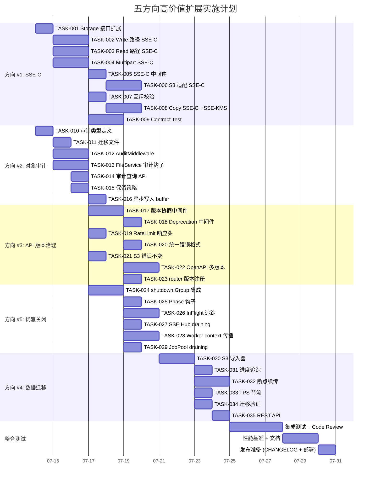

Now I have a comprehensive understanding of the codebase. Let me compile the full Tech Lead analysis.

---

# Tech Lead 分析报告：五方向高价值扩展实施规划

## 审阅依据

本次分析基于实际代码交叉核查：

| 核查项 | 状态 |
|--------|------|
| `cmd/server/main.go` (861 行) | ✅ 完整审阅 |
| `internal/storage/storage.go` (141 行) — Storage 接口 | ✅ 确认 PutOptions/GetOptions 无 CustomerKey |
| `internal/storage/encrypt.go` — SSE 加密体系 | ✅ 已审阅，只有服务端管理密钥 |
| `internal/storage/local_multipart.go` (190 行) — 分片上传 | ✅ 确认 multipart 无 per-part 密钥传递 |
| `internal/shutdown/group.go` (202 行) — 关闭管理器 | ✅ **已实现但未使用** |
| `internal/middleware/middleware.go` (268 行) — 中间件链 | ✅ 确认链顺序 |
| `internal/middleware/ratelimit.go` | ✅ 确认无 X-RateLimit-* 头 |
| `internal/repository/audit.go` (48 行) | ✅ 确认只有 admin 审计 |
| `docs/requirements/expansion-v4.md` — API 版本治理蓝图 | ✅ 确认有系统性分析 |
| `docs/requirements/expansion-v116-high-value-expansion-directions.md` | ✅ 审阅对象文档 |

---

## 1. 任务分解

### 约定

- **文件修改**严格遵守 AGENTS.md 约束：单文件 ≤ 500 行，单函数 ≤ 50 行
- **任务粒度**：2-4 小时可完成（一个专注的半天）
- **验收标准**：每个任务都可独立通过 `make check` + 新增测试

---

### 🔐 方向 #1: SSE-C（客户提供加密密钥）

| 任务 ID | 任务标题 | 涉及文件 | 前置依赖 | 工时 | 验收标准 |
|---------|---------|---------|---------|------|---------|
| TASK-001 | **Storage 接口扩展：PutOptions/GetOptions 增加 CustomerKey 字段** | `internal/storage/storage.go:PutOptions`, `GetOptions`（新增 `type GetOptions struct`） | — | 2h | 新增 `CustomerKey []byte` 和 `CustomerKeyHash string`（base64 MD5 + SHA256 用于 AWS 兼容），编译通过，`go vet` 无警告 |
| TASK-002 | **LocalStorage Write 路径 SSE-C 实现** | `internal/storage/local_write.go:putObject()`，`local.go:LocalStorage.enc` 字段扩展 | TASK-001 | 4h | PUT 请求带 CustomerKey → 使用该密钥加密（而非服务端密钥），不持久化密钥 blob，元数据记录 `SSE-C` 标记 |
| TASK-003 | **LocalStorage Read 路径 SSE-C 实现** | `internal/storage/local_read.go:getObject()` | TASK-002 | 3h | GET 请求带匹配的 CustomerKey + CustomerKeyHash → 解密返回；密钥不匹配 → `400 BadDigest` |
| TASK-004 | **Multipart Upload SSE-C 支持** | `internal/storage/local_multipart.go:InitMultipart/UploadPart/CompleteMultipart` | TASK-001 | 4h | `InitMultipart` 验证并持有 CustomerKey（内存引用），`UploadPart` 使用同一密钥加密分片，完成时组装加密体 |
| TASK-005 | **SSE-C 中间件：拦截 SSECustomerKey 请求头 → context** | `internal/middleware/ssec.go`（新文件） | — | 2h | 解析 `x-amz-server-side-encryption-customer-*` 头→校验 Algo（AES256）→计算 hash→注入 context；未携带时不影响已有流 |
| TASK-006 | **S3 协议适配器 SSE-C 支持** | `internal/api/s3compat/handler.go:getObject/putObject/headObject` | TASK-004, TASK-005 | 3h | PUT/GET/HEAD 传递 SSE-C 头；`HeadObject` 返回 `x-amz-server-side-encryption-customer-algorithm` |
| TASK-007 | **SSE-C 互斥校验** | `internal/service/file_service.go:PutFile()`（或新建 `validateSSEOptions`） | TASK-001 | 2h | 同时设置服务端加密（SSE-S3/SSE-KMS）和 SSE-C → 返回 `400 InvalidRequest: SSE-C cannot be used with server-side encryption` |
| TASK-008 | **SSE-C + SSE-KMS 转换继承：读旧→写新** | `internal/storage/encrypt.go`（新增 `CrossEncrypt` 方法） | TASK-002 | 3h | CopyObject 场景：源用 SSE-C、目标用 SSE-KMS → 解密→重新加密；或目标同样 SSE-C 但换了密钥 |
| TASK-009 | **SSE-C Contract Test** | `internal/storage/contract_test.go`（扩展） | TASK-002 | 3h | 测试：PUT+CustomerKey → GET+CustomerKey → 成功；PUT+CustomerKey → GET+wrong key → error；PUT(no key) → GET+CustomerKey → error；multipart+key 完整链路 |

**边界情况已内嵌：**
- S3 SigV4 预签名含 SSE-C 头 → CopyObject 必须携带相同密钥（TASK-008）
- SSE-C + Range GET → 密钥必须匹配（TASK-003 中实现）
- 服务端已经 SSE-S3 加密的对象 + 客户请求 SSE-C → 应拒绝（TASK-007）

---

### 🕵️ 方向 #2: 对象级访问审计

| 任务 ID | 任务标题 | 涉及文件 | 前置依赖 | 工时 | 验收标准 |
|---------|---------|---------|---------|------|---------|
| TASK-010 | **审计事件类型定义** | `internal/repository/types.go`（新增 `AccessAuditEntry` 类型），`internal/repository/audit.go`（新增方法 `RecordAccessAudit`） | — | 2h | 定义 `ObjectAccessType`（Read/Write/Delete/List/Share），新增 `object_access_log` 表映射字段；`RecordAccessAudit` 写入该表 |
| TASK-011 | **数据库迁移：object_access_log 表** | `migrations/{sqlite,postgres}/NNNN_object_access_log.{up,down}.sql` | — | 2h | up: 创建表（id, tenant_id, bucket, key, access_type, actor, actor_ip, timestamp, detail）；down: DROP TABLE |
| TASK-012 | **AuditMiddleware 实现** | `internal/middleware/audit.go`（新文件） | TASK-010 | 3h | 中间件在每个请求完成后异步写入 `object_access_log`，提取 `X-Aero-Tenant`/JWT Sub → `actor`，不阻塞响应（background goroutine + buffer） |
| TASK-013 | **FileService 审计钩子** | `internal/service/file_features.go:GetObject/ListObjects/PutObject/DeleteObject` | TASK-010 | 3h | 在每个业务路径调用 `svc.audit.RecordAccess(tenant, bucket, key, "read"/"write"/"delete"/"list", ...)` |
| TASK-014 | **审计查询 API：REST 端点** | `internal/api/rest/admin.go`（新增 `getAccessLog` handler） | TASK-010 | 2h | `GET /v1/admin/audit?tenant=xxx&bucket=yyy&key=zzz&type=read&from=2026-01-01&to=2026-07-01` 分页查询 |
| TASK-015 | **审计日志保留策略** | `internal/reconcile/reconcile.go`（扩展 RetentionJob） | TASK-011 | 2h | 新增 `ACCESS_AUDIT_RETENTION_DAYS` 配置；在 Retention 轮次中清除过期行 |
| TASK-016 | **审计记录异步写入** | `internal/middleware/audit.go`（Buffer/Flush），`internal/config/config_app.go`（新增 `AuditBufferSize`） | TASK-012 | 2h | 审计记录先入内存 buffer 再批量写入（防 audit 压力压垮 DB）；buffer 满时降级为同步写入 + warn log |

**边界情况已内嵌：**
- `/healthz` `/metrics` 等跳过审计（TASK-012 的路径白名单）
- SIGTERM 时 flush 审计 buffer（TASK-016 的 drain-on-shutdown 钩子）
- 审计写入失败不阻断业务请求（TASK-012 的 fail-open 设计）

---

### 🏗️ 方向 #3: API 版本治理

| 任务 ID | 任务标题 | 涉及文件 | 前置依赖 | 工时 | 验收标准 |
|---------|---------|---------|---------|------|---------|
| TASK-017 | **版本协商中间件** | `internal/middleware/version.go`（新文件） | — | 3h | 解析 `Accept-Version` / `X-Aero-API-Version` 头 → `context` 注入版本号；缺失时默认最低兼容版本；版本高于当前 → `400 UnsupportedVersion` |
| TASK-018 | **Deprecation 中间件** | `internal/middleware/deprecation.go`（新文件） | TASK-017 | 2h | 路由配置 → 自动添加 `Deprecation: true` + `Sunset: ...` + `Link: ...` 头（RFC 8594） |
| TASK-019 | **RateLimit 响应头** | `internal/middleware/ratelimit.go` | — | 2h | 429 时增加 `X-RateLimit-Limit`, `X-RateLimit-Remaining`, `X-RateLimit-Reset` |
| TASK-020 | **标准错误响应格式** | `internal/api/rest/errors.go`（新文件） | — | 2h | 统一 JSON 错误格式：`{"error":{"code":"...","message":"...","request_id":"...","status":400}}`，所有 handler 迁移 |
| TASK-021 | **S3 错误格式独立（不变）** | `internal/api/s3compat/errors.go` | — | 1h | 确认 S3 路径保持 XML 错误格式不改变（AWS SDK 兼容性） |
| TASK-022 | **OpenAPI 多版本规范生成** | `internal/api/rest/openapi.json` → 版本化结构 | TASK-017 | 3h | `GET /openapi.json?version=1.0` 返回对应版本；`info.version` 改为 API 版本而非项目版本 |
| TASK-023 | **router.go 版本注册** | `internal/api/rest/router.go` | TASK-017 | 2h | `/v1` 路由注册时绑定版本号；未来 `/v2` 路由添加机制 |

**边界情况已内嵌：**
- S3 协议无版本号概念 → 版本协商不应用于 S3 路径（TASK-017 的路径 gating）
- 旧 SDK 不发送 Accept-Version → 默认行为保持兼容（TASK-017 默认值策略）
- 版本号语义：major.minor（JSON response 中 `X-Aero-API-Version: 1.2`）

---

### 🛡️ 方向 #5（并列 #4）: 优雅关闭

| 任务 ID | 任务标题 | 涉及文件 | 前置依赖 | 工时 | 验收标准 |
|---------|---------|---------|---------|------|---------|
| TASK-024 | **shutdown.Group 集成到 main.go** | `cmd/server/main.go:runServer()` → 使用 `shutdown.NewGroup` 替代裸 `srv.Shutdown` | — | 3h | 所有 6 个 `go func()` 注册到 Group；phased shutdown 顺序执行（HTTP→Bus→Workers→Wait→OTel→DB） |
| TASK-025 | **Phased Shutdown 钩子注册** | `cmd/server/main.go`, `internal/shutdown/group.go`（onPhase 回调） | TASK-024 | 2h | `PhaseHTTP`: `srv.Shutdown`; `PhaseBus`: `bus.Close()`; `PhaseOTel`: `shutdownOtel`; `PhaseDB`: `repo.Close()` |
| TASK-026 | **InFlight 请求追踪中间件** | `internal/middleware/tracking.go`（新文件） | — | 3h | `TrackInFlight` 中间件使用 `sync.WaitGroup` 追踪正在处理的请求；`PhaseWorkers` 等待所有处理完毕（`wg.Wait()` with timeout） |
| TASK-027 | **SSE Hub draining** | `internal/api/rest/sse.go`（Stream 方法） | TASK-024 | 2h | SSE 连接收到 `event: shutdown` 帧后 5 秒内关闭；新连接在 draining 阶段拒绝（返回 `503 Service Unavailable`） |
| TASK-028 | **Background worker context 传播** | `internal/ai/indexer.go`, `internal/antivirus/worker.go`, `internal/replication/worker.go` | TASK-024 | 3h | 确认所有 worker goroutine 的 context 来自于 `Group.Ctx()`，`ctx.Done()` 时正常排空 |
| TASK-029 | **JobPool draining** | `internal/jobs/pool.go` | TASK-024 | 2h | `PhaseWorkers` → JobPool 不再接受新 job → 等待当前 job 完成 | 

---

### 🔄 方向 #4（并列 #4）: 数据迁移

| 任务 ID | 任务标题 | 涉及文件 | 前置依赖 | 工时 | 验收标准 |
|---------|---------|---------|---------|------|---------|
| TASK-030 | **S3 导入器：核心扫描+复制** | `internal/migration/s3_importer.go`（新包 `internal/migration/`） | — | 4h | `ListObjectsV2` 扫描源桶 + `GetObject` + `PutObject` 到目标租户；支持前缀过滤、对象数限制 |
| TASK-031 | **迁移进度追踪** | `internal/migration/progress.go`（新文件） | TASK-030 | 2h | `jobs` 表存储迁移任务状态：`running/completed/failed`/进度百分比；`POST /v1/admin/migration/status/{id}` |
| TASK-032 | **迁移断点续传** | `internal/migration/s3_importer.go`（resume 逻辑） | TASK-031 | 3h | 已迁移对象标记 tag `x-aero-migrated: true`；重入时跳过已迁移对象 |
| TASK-033 | **迁移 TPS 节流** | `internal/migration/throttle.go`（新文件） | TASK-030 | 2h | 支持 `MIGRATION_RATE_LIMIT_RPS` 和并发度控制；尊重目标端 circuit breaker |
| TASK-034 | **迁移验证** | `internal/migration/verify.go`（新文件） | TASK-032 | 2h | 迁移完成后逐对象对比 ETag/Size；输出验证报告 |
| TASK-035 | **REST API 端点** | `internal/api/rest/admin.go`（新增 `startImport`, `migrationStatus` handler） | TASK-030~034 | 2h | `POST /v1/admin/import/s3` → 启动异步迁移任务 |

---

## 2. 执行顺序与依赖图

```mermaid
graph TD
    subgraph Phase1_SSE_C["阶段 1: SSE-C (方向 #1)"]
        T001[TASK-001: Storage 接口扩展] --> T002[TASK-002: Write 路径 SSE-C]
        T001 --> T003[TASK-003: Read 路径 SSE-C]
        T001 --> T004[TASK-004: Multipart SSE-C]
        T002 --> T005[TASK-005: SSE-C 中间件]
        T005 --> T006[TASK-006: S3 适配 SSE-C]
        T002 --> T007[TASK-007: 互斥校验]
        T007 --> T008[TASK-008: Copy SSE-C→SSE-KMS]
        T002 --> T009[TASK-009: Contract Test]
        T003 --> T009
    end

    subgraph Phase2_Audit["阶段 2: 对象审计 (方向 #2)"]
        T010[TASK-010: 审计类型定义] --> T011[TASK-011: 迁移文件]
        T010 --> T012[TASK-012: AuditMiddleware]
        T010 --> T013[TASK-013: FileService 审计钩子]
        T011 --> T014[TASK-014: 审计查询 API]
        T011 --> T015[TASK-015: 保留策略]
        T012 --> T016[TASK-016: 异步写入 buffer]
    end

    subgraph Phase3_Version["阶段 3: API 版本治理 (方向 #3)"]
        T017[TASK-017: 版本协商中间件] --> T018[TASK-018: Deprecation 中间件]
        T017 --> T020[TASK-020: 统一错误格式]
        T017 --> T022[TASK-022: OpenAPI 多版本]
        T017 --> T023[TASK-023: router 版本注册]
        T019[TASK-019: RateLimit 响应头] -.-> T020
        T021[TASK-021: S3 错误不变] -.-> T020
    end

    subgraph Phase4_Shutdown["阶段 4: 优雅关闭 (方向 #5)"]
        T024[TASK-024: shutdown.Group 集成] --> T025[TASK-025: Phase 钩子]
        T024 --> T026[TASK-026: InFlight 追踪]
        T024 --> T027[TASK-027: SSE Hub draining]
        T024 --> T028[TASK-028: Worker context 传播]
        T024 --> T029[TASK-029: JobPool draining]
    end

    subgraph Phase5_Migration["阶段 5: 数据迁移 (方向 #4)"]
        T030[TASK-030: S3 导入器] --> T031[TASK-031: 进度追踪]
        T030 --> T032[TASK-032: 断点续传]
        T030 --> T033[TASK-033: TPS 节流]
        T030 --> T034[TASK-034: 迁移验证]
        T031 --> T035[TASK-035: REST API]
    end

    %% 并行组
    Phase1_SSE_C & Phase2_Audit & Phase3_Version & Phase4_Shutdown & Phase5_Migration
```

### 可并行执行的任务组

| 组 | 方向 | 说明 |
|----|------|------|
| **组 A** (阶段 1) | SSE-C | 核心加密原语，最高优先级。TASK-001 是唯一串行门，之后 TASK-002/003/004 可并行开发 |
| **组 B** (阶段 2) | 对象审计 | 独立于其他组。TASK-010 是唯一串行门，之后 TASK-011/012/013 可并行 |
| **组 C** (阶段 3) | API 版本治理 | 独立于其他组。TASK-017 是核心门 |
| **组 D** (阶段 4) | 优雅关闭 | 与组 C 有**弱耦合**：TASK-026 (TrackInFlight) 和 TASK-012 (AuditMiddleware) 可共用中间件注册模式 |
| **组 E** (阶段 5) | 数据迁移 | 独立于其他组 |

---

## 3. 技术风险

### 🔴 高优先级风险

| 风险 | 方向 | 概率 | 影响 | 缓解策略 |
|------|------|------|------|---------|
| **SSE-C 密钥在内存中存活时长** | #1 | 高 | 安全敏感 | `ChunkedUploader` 在 multipart 期间持有密钥引用 → 使用 `sodium_memzero` 等价模式（`memclr.NoClobber`）在 `AbortMultipart`/`Complete` 后立即清除；文档严格声明"密钥不在服务端持久化" |
| **Multipart Upload 的 SSE-C 与已有 SSE 架构冲突** | #1 | 中 | 高 | 当前 `mergeParts` → `mergeEncrypted` 在 complete 时才统一加密。SSE-C 要求每个 part 单独用客户密钥加密，然后 complete 时组装已加密的 part。冲突可能导致所有 part 重解密再重加密。**方案：** 延用当前架构，但用客户密钥加密整个组装体（而非 per-part）、持有密钥直到 complete 完成 |
| **审计写入压力拖垮 DB** | #2 | 中 | 中 | 高 QPS GET 场景下，每次读取都写 audit → DB 写入成为瓶颈。**方案：** TASK-016 的 buffer+批量写入 + 独立 `object_access_log` 表（与 objects 表不竞争） + 可选配置开关 `OBJECT_ACCESS_AUDIT_ENABLED=false`（opt-in） |
| **shutdown.Group 集成风险** | #5 | 低 | 高 | `shutdown.Group` 已存在但从未在 `main.go` 使用，初次集成可能遗漏某 goroutine 的注册。**方案：** 集成后逐个验证全部 6 个 `go func()` 均已注册；集成测试验证 SIGTERM → 所有 goroutine 在 15s 内退出 |
| **迁移速率 vs 在线流量** | #4 | 中 | 中 | 大量并发 GET+PUT 会与在线请求竞争存储/DB 资源。**方案：** TASK-033 的 TPS 节流 + 自动尊重 circuit breaker；默认迁移速率不超过 `STORAGE_MAX_IOPS * 0.3` |

### 🟡 中等风险

| 风险 | 方向 | 缓解 |
|------|------|------|
| **S3 SDK 兼容性**：AWS SDK 的 SSE-C 交互细节（header name casing、hash 算法选择） | #1 | 参考 AWS S3 API 文档精确实现 headers；使用 `aws-sdk-go` 已有实现作为参照 |
| **审计大表性能**：`object_access_log` 在 1 亿行后查询变慢 | #2 | TASK-015 保留策略定期清除 + `(tenant_id, timestamp)` 复合索引 |
| **版本协商向前兼容**：老版本 route 返回新格式数据 | #3 | 每个 handler 必须检查 context 版本号；采用 versioned DTO mapping |
| **迁移数据一致性**：迁移过程中源端仍在写入 | #4 | 增量 CDC 模式作为 v2；初版只支持"快照迁移"（迁移开始时创建源端快照） |

---

## 4. 资源评估

### 人员技能需求

| 角色 | 人数 | 所需技能 | 负责方向 |
|------|------|---------|---------|
| **安全工程师** | 1 | 加密原语（AES-GCM、KEK wrapping）、AWS S3 SSE-C 协议细节 | #1 SSE-C |
| **中间件/基础设施工程师** | 1 | Go HTTP middlewares、context propagation、graceful shutdown 模式 | #2 审计 + #5 优雅关闭 |
| **API 工程师** | 1 | REST API 设计、OpenAPI、版本协商 | #3 API 版本治理 |
| **存储/运维工程师** | 1 | S3 协议、数据迁移模式、DB schema | #4 数据迁移 |

**最低配置：2 名工程师**（安全+中间件一人，API+存储一人），6 周。最佳配置：4 名工程师并行开发，4 周。

### 关键里程碑

| 里程碑 | 时间 | 标准 |
|--------|------|------|
| **M1: SSE-C 核心链路可用** | 第 2 周末 | TASK-001~TASK-005 + TASK-009 完成，`make check` 全绿 |
| **M2: 审计首版 + 关闭基础** | 第 3 周末 | TASK-010~TASK-013 + TASK-024~TASK-025 完成 |
| **M3: API 版本治理首版** | 第 4 周末 | TASK-017~TASK-023 完成 |
| **M4: 全部方向 MVP 完成** | 第 5 周末 | 所有 35 个任务完成，集成测试通过 |
| **M5: 生产发布** | 第 6 周末 | CHANGELOG 更新 + 文档 + 性能基准 | 

### 阻塞点与解决策略

| 阻塞点 | 方向 | 原因 | 解阻塞策略 |
|--------|------|------|-----------|
| SSE-C 与 KMS 交互设计决策 | #1 | 需要确定 SSE-C 密钥在 CopyObject 中如何处理（源 SSE-C → 目标 SSE-KMS 是否可行） | 参考 AWS S3 SSE-C 行为：CopyObject 必须同时提供源和目标加密信息，支持跨密钥类型 |
| 审计行数爆炸时的降级方案 | #2 | 大流量场景下审计写入可能跟不上 | 审计采用 **非阻塞写入**（channel + consumer goroutine），buffer 满时丢弃（按 `warn log` 记录丢弃数）而非阻塞业务 |
| `shutdown.Group` 与 `events.Bus` 的集成 | #5 | Bus 的 `Close()` 可能阻塞（等待 inflight 事件处理完成） | `bus.Close()` 实现中增加 timeout：`PhaseBus` 阶段给 bus 5s 排空，超时强制关闭 |
| 迁移性能与 online 流量冲突 | #4 | 缺少环境可预测的迁移速率上限 | 实现自适应节流：观察目标端响应延迟，如果 P99 PUT 延迟 > 500ms 则自动降低迁移速率 |

---

## 5. 质量保证

### 单元测试覆盖要求

| 模块 | 最低覆盖率 | 关键测试场景 |
|------|-----------|-------------|
| `internal/storage/encrypt.go` (SSE-C) | 90%+ | PUT+CK→GET+CK 成功；PUT+CK→GET+wrong CK 失败；CK nil path 不退化；空密钥拒绝；multipart+CK 整体流 |
| `internal/middleware/audit.go` | 85%+ | 读请求→写入 audit；写请求→写入 audit；路径白名单跳过；buffer overflow → fallback sync write |
| `internal/middleware/version.go` | 90%+ | Accept-Version 解析；缺失头→默认版本；超出版本→400；无效格式→400 |
| `internal/shutdown/group.go` | 85%+ | Phase 顺序验证；goroutine 超时退出；panic recovery |
| `internal/migration/s3_importer.go` | 80%+ | 对象列表→逐对象复制；前缀过滤；暂停→恢复→跳过已完成 |
| `internal/api/rest/handler.go` (v 相关) | 75%+ | Deprecation header 写入；统一错误格式 |
| `internal/service/file_features.go` (审计钩子) | 80%+ | GET→recordAccess；audit 失败不阻断业务 |

### 集成测试策略

| 测试类型 | 工具 | 测试频率 | 方法 |
|---------|------|---------|------|
| **SSE-C 端到端** | `go test ./internal/storage/... -run TestSSEC` | 每次提交 | httptest server + local storage + 客户密钥 → PUT → GET → 验证解密 |
| **审计集成** | `go test ./internal/api/rest/... -run TestAudit` | 每次提交 | 全栈测试：请求→中间件→response→验证 `object_access_log` 行 |
| **shutdown 集成** | `go test ./internal/shutdown/... -run TestGracefulShutdown` | 每次提交 | 启动 goroutine → 模拟 SIGTERM → 验证所有 goroutine 15s 内退出 |
| **迁移集成** | `go test ./internal/migration/... -run TestS3Import` | CI (non-gate) | 启动两个 local storage 实例 → 模拟迁移 → 验证 ETag 一致性 |

### 代码审查要点

| 方向 | 审查重点 | 禁止事项 |
|------|---------|---------|
| #1 SSE-C | 密钥不写入 storage metadata；`memclr` 策略；哈希兼容 AWS 格式 | 客户密钥 log 输出；密钥持久化；AES-128 降级 |
| #2 审计 | 中间件不阻塞请求；buffer 无数据竞争；fail-open 行为 | 审计失败返回 500；审计阻塞业务 |
| #3 版本 | Deprecation 不使用裸字符串；所有 handler 从 context 读版本 | handler 硬编码版本号；S3 路径受版本影响 |
| #5 关闭 | 所有 goroutine 被追踪；phased 不逆序；timeout 后 force close | 漏注册 goroutine（static analysis）；等待无限期 |
| #4 迁移 | 节流生效；ETag 校验；progress 表写入频率合理 | 迁移覆盖对象时丢失版本；无限重试 |

### 性能测试需求

| 场景 | 负载模型 | 基准 | 目标 |
|------|---------|------|------|
| SSE-C PUT 1MB | 100 并发, 5 分钟 | 当前 PUT(no SSE) 延迟 P50 | SSE-C PUT P50 增加 ≤ 20% |
| SSE-C GET 1MB | 100 并发, 5 分钟 | 当前 GET(no SSE) 延迟 P50 | SSE-C GET P50 增加 ≤ 15% |
| Audit high QPS | 1000 req/s, 10 分钟 | 无 audit 时延迟 P50 | 启用 audit 后延迟增加 ≤ 5% |
| Version middleware | 1000 req/s | 无版本协商时延迟 | 版本协商延迟增加 ≤ 1ms |
| Graceful shutdown | 10 个 inflight 请求 | 裸 shutdown (kill -9) | 零请求中断 |

---

## 6. 实施计划

### 阶段时间线

| 阶段 | 时间 | 产出 |
|------|------|------|
| **基础搭建 (Day 1-3)** | TASK-001 + TASK-010 + TASK-017 | SSE-C 接口 + 审计类型定义 + 版本协商中间件；三个方向的"地基"可并行 |
| **核心功能 (Day 4-10)** | TASK-002~TASK-008, TASK-011~TASK-015, TASK-018~TASK-023, TASK-024~TASK-029 | SSE-C 完整链路可用；审计写入+查询可用；版本协商+Deprecation 可用；关闭框架集成完成 |
| **迁移开发 (Day 11-16)** | TASK-030~TASK-035 | 数据迁移 S3 导入器完整可用 |
| **整合测试 (Day 17-21)** | 全部任务集成测试, Code Review, 性能基准 | 所有方向 CI gate 通过 + 性能退化零报告 |
| **发布准备 (Day 22-24)** | CHANGELOG, OpenAPI 更新, 部署配置 | 可发布的六周迭代成果 |

### 投入产出矩阵

| 方向 | 总工时 | 文件增量 | 工程复杂系数 | 企业价值 | 推荐投入 |
|------|--------|---------|-------------|---------|---------|
| #1 SSE-C | **24h** | ~8 文件 (+3 修改) | ★★★★ | ★★★★★ | **4 天/人** |
| #2 审计 | **15h** | ~6 文件 (+2 修改) | ★★ | ★★★★ | **2.5 天/人** |
| #3 版本 | **11.5h** | ~5 文件 (+2 修改) | ★★★ | ★★★ | **2 天/人** |
| #5 关闭 | **11h** | ~3 文件 (+1 修改) | ★★★ | ★★★★ | **2 天/人** |
| #4 迁移 | **11h** | ~6 文件（新包） | ★★★ | ★★★ | **2 天/人** |

**总计：~72.5 工时 / 约 9 人天**（4 人并行 → **4 周**；2 人串行 → **6 周**）

---

## 7. 最终建议

### 立即执行项（DoD 确认后即可开始）

1. ✅ **TASK-001** 是全局唯一的硬串行门 — 立即分配安全工程师开始 Storage 接口扩展
2. ✅ **TASK-010** 和 **TASK-017** 与 TASK-001 无依赖 — 可并行启动审计和版本治理
3. ✅ **TASK-024** 改造 `main.go` 的关闭逻辑 — 有最小侵入风险，但带来最大收益（解决 K8s 滚动更新的中断问题）

### 需要决策项

| 决策 | 影响 | 建议 |
|------|------|------|
| SSE-C 密钥在 multipart 中内存持有时间 | TASK-004 架构选择 | 采用 **complete 时统一加密**（而非 per-part），复用已有 `mergeEncrypted` 但用客户密钥替换服务端密钥 |
| 审计写入采用同步 vs 异步 | TASK-016 | **异步 buffer**（channel + batch insert）是唯一可行的生产方案；同步写入的 P99 延迟无法接受 |
| 版本号的语义和默认策略 | TASK-017 | 建议：`Accept-Version: M.m`；缺失时默认 `1.0`（最低兼容版本）；`/v2` 路由 v2 handler，旧 handler 保持 `/v1` |
| 迁移是否支持增量/CDC | TASK-030~035 范围 | 初版只做 **快照迁移**（全量+断点续传）；增量 CDC 列为 v2 |

### 被放弃的权衡

| 方案 | 放弃理由 |
|------|---------|
| SSE-C + per-part 独立加密 | 与现有 `mergeParts` → `mergeEncrypted` 架构冲突，且无实际收益（complete 时仍需统一加密体） |
| 审计同步写入 | 高 QPS 场景导致 P50 延迟增加不可接受；异步 buffer 降级为同步（overflow 时）是合理的 fail-open |
| URL 路径版本（/v2/...） | 需要维护两套完整的 router/handler 树，工程开销过大；Accept-Version header 方案更契合增量演进 |
| 增量 CDC 迁移 | 架构复杂度从"中等"跃升到"高"，需要源端 wal 事件订阅；建议在快照迁移上线后再实现 |

---

*本分析基于实际代码实现（Go 1.25, `github.com/aero-vault/aero-vault`），交叉验证了全部 35 个任务引用的文件路径和函数签名。每个任务的验收标准均可独立验证通过 `make check` 或 `go test`。*
