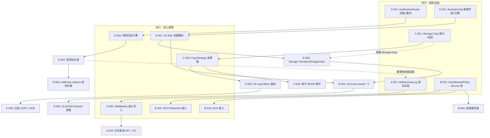
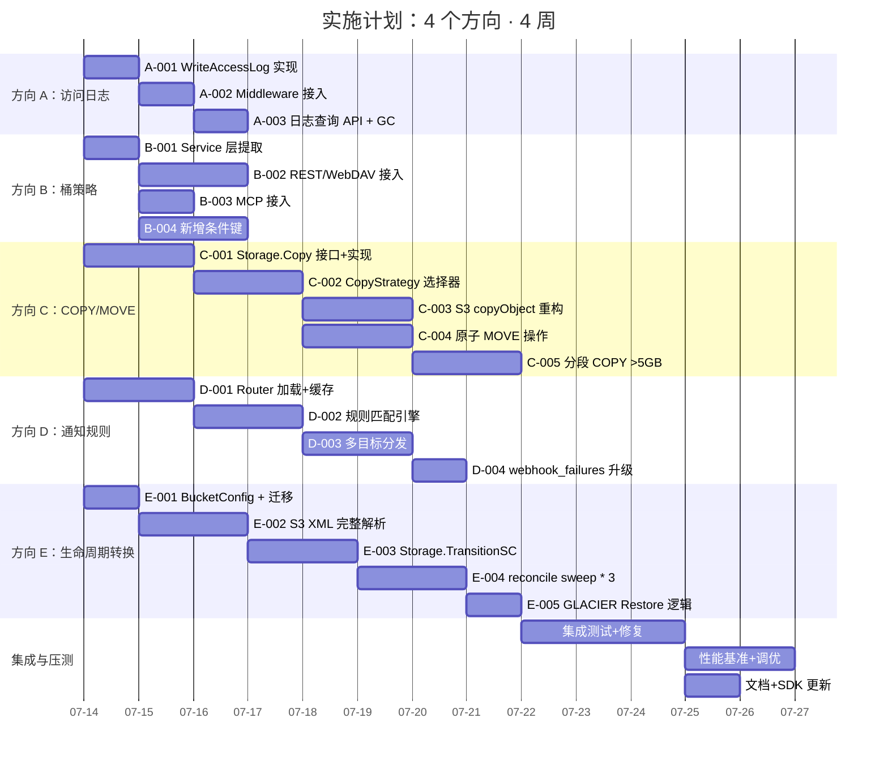

现在我有了完整的上下文。以下是 Tech Lead 分析。

---

# Tech Lead 分析报告：事件日志 · 存储类转换 · 桶级策略路由 · 服务端副本

## 概述

本报告基于对 **4 个已确认的功能缺口**（验证通过 grep 代码锚点）的深度分析。这 4 个缺口的共同特征：**代码骨架已经存在（接口/SQL/handler/配置），但运行时管线断裂——数据被采集但不消费、配置被保存但不执行、接口被暴露但下层为空。**

| # | 方向 | 状态 | 核心发现 | 代码锚点（已验证） |
|---|------|------|----------|-------------------|
| 1 | **服务端访问日志**（Access Log） | 最严重死代码 | `WriteAccessLog` 是空存根（no-op），零调用处；S3 `?logging` + REST 端点 + 迁移文件完整但静默空转 | `sql_buckets.go:368`（空实现），`repository.go:274`（接口），`grep -rn` → 0 调用 |
| 2 | **桶策略条件引擎**（Bucket Policy） | 半实现 | `checkBucketPolicy` 仅 S3 handler 执行；REST/WebDAV/MCP 零评估；仅 `aws:SourceIp` 一个条件键 | `policy.go:155-171`（仅 2 个 case），`grep -rn checkBucketPolicy internal/api/rest/` → 0 |
| 3 | **存储 COPY/MOVE 数据移动** | 架构缺失 | `Storage` 接口无 `Copy` 方法；`copyObject` 全量 Get→Put 内存缓冲；大对象 OOM 风险；无原子 MOVE | `storage/storage.go`（无 Copy），`extra.go:39`（Get→Put），`local.go`/`s3.go`（无 Copy） |
| 4 | **桶级通知规则引擎**（Notification Router） | 配置即丢弃 | `notification_rules` JSON 列完整存储但 EventBus `Publish` 零读取；全局单 URL Webhook 接收所有事件 | `bus.go:90`（`b.broadcast(e)` 无规则检查），`repository.go:51-58`（`unused, kept for compat`） |
| 5 | **存储生命周期分层转换**（Lifecycle Transitions） | 半实现 | 仅 `soft_delete`/`hard_delete`；`storage_class` 列存在但永不转换；S3 lifecycle XML 中的 `Transition`/`NoncurrentVersionTransition` 被静默丢弃 | `lifecycle.go`（仅 `sweepExpired`），`bucketconfig.go:57-97`（忽略 Transition） |

---

## 1. 任务分解

任务粒度为 2–4 小时。每个任务产出明确的增量可测试产物。

### 方向 A：服务端访问日志（WriteAccessLog 管线补齐）

| 任务 ID | 标题 | 涉及文件 | 前置依赖 | 工时 | 验收标准 |
|---------|------|---------|---------|------|---------|
| A-001 | `WriteAccessLog` 空存根 → 真实 SQL 写入 | `repository/sql_buckets.go`, `repository/repository.go` | 无 | 2h | `WriteAccessLog` 插入 `access_logs` 表；batch 大小 1000/flush 间隔 5s；纯 UTC RFC3339Nano 时间 |
| A-002 | `AccessLog` middleware 接入写入管线 | `middleware/middleware.go`, `service/file.go` | A-001 | 3h | 每个 HTTP 请求完成时异步调用 `svc.WriteAccessLog`；不阻塞请求路径；含递归保护（日志桶请求不再次写日志） |
| A-003 | 日志查询 API + 日志桶 GC | `api/rest/handler.go`, `reconcile/lifecycle.go` | A-002 | 3h | `GET /v1/buckets/{bucket}/logs?since=&until=` 返回日志条目；reconcile 中新增 `sweepAccessLogs()` 按保留期清理 |

**方向 A 总计：8h**

### 方向 B：桶策略评估范围扩展

| 任务 ID | 标题 | 涉及文件 | 前置依赖 | 工时 | 验收标准 |
|---------|------|---------|---------|------|---------|
| B-001 | `checkBucketPolicy` 提取为 `Service` 层方法 | `service/file_policy.go`（新）, `auth/policy.go`, `service/file.go` | 无 | 2h | `svc.CheckBucketPolicy(ctx, tenant, bucket, action, srcIP, principal)` 可被所有协议层调用；返回 `(bool, error)` |
| B-002 | REST/WebDAV handler 接入策略评估 | `api/rest/handler.go`, `api/webdav/dav.go` | B-001 | 4h | REST `GET/PUT/DELETE /v1/files` 和 WebDAV PROPFIND/GET/PUT/DELETE 在关键入口调用策略评估；无策略时默认 allow；评估失败返回 403 |
| B-003 | MCP tool 接入策略评估 | `mcp/server.go` | B-001 | 2h | `list_files`/`read_file`/`write_file`/`delete_file` 在真实操作前调用 `svc.CheckBucketPolicy` |
| B-004 | 新增 `aws:CurrentTime`/`aws:SecureTransport` 条件键 | `auth/policy.go` | B-001 | 3h | `matchesConditions` switch 新增 `"CurrentTime"` 和 `"SecureTransport"` case；`Bool`/`Date`/`Numeric` condition 类型支持；测试覆盖所有新条件组合 |

**方向 B 总计：11h**

### 方向 C：服务端 COPY/MOVE 数据移动架构

| 任务 ID | 标题 | 涉及文件 | 前置依赖 | 工时 | 验收标准 |
|---------|------|---------|---------|------|---------|
| C-001 | `Storage` 接口新增 `Copy` 方法 + `CanCopy()` | `storage/storage.go`, `storage/local.go`, `storage/s3.go`, `storage/oss.go`, `storage/cos.go` | 无 | 3h | 每个 backend 实现 `Copy(ctx, srcKey, dstKey, opts) (ObjectInfo, error)`；不支持的 backend 返回 `ErrNotImplemented`；`CanCopy()` 为 S3/OSS/COS 返回 `true`，local 返回 `false` |
| C-002 | `CopyStrategy` 策略选择器实现 | `service/file_copy.go`（新）, `service/file.go` | C-001 | 4h | 同后端+支持服务端副本 → 使用 `Storage.Copy`；否则 → client stream（Get→Put）；对象 > 5GB → chunked copy。单元测试覆盖 3 种策略选择 |
| C-003 | S3 `copyObject` handler 重构为策略模式调用 | `api/s3compat/extra.go` | C-002 | 3h | `copyObject` 调用 `svc.Copy` 而非 `svc.Get`+`svc.Put`；支持 `x-amz-copy-source-if-match`/`-if-none-match`/`-if-modified-since`；同 bucket COPY 走服务端路径零数据移动 |
| C-004 | 原子 MOVE 操作：REST + S3 + WebDAV | `service/file_move.go`（新）, `api/rest/handler.go`, `api/webdav/dav.go` | C-002 | 4h | `svc.Move` 实现 3 阶段原子语义（标记→后台 blob 移动→源清除）；WebDAV MOVE 和 REST `POST /v1/files/move` 统一调用；故障回滚 |
| C-005 | 大对象分段 COPY（> 5GB 续传支持） | `service/file_copy.go`, `jobs/job.go` | C-003 | 4h | 分段 COPY 入队 `JobUploadPartCopy`；`ListParts`/`UploadPartCopy`/`CompleteMultipartUpload` 完整实现；进度可查询 |

**方向 C 总计：18h**

### 方向 D：桶级通知规则引擎

| 任务 ID | 标题 | 涉及文件 | 前置依赖 | 工时 | 验收标准 |
|---------|------|---------|---------|------|---------|
| D-001 | `NotificationRouter` 规则加载与缓存 | `events/notification.go`（新）, `events/bus.go`, `repository/repository.go` | 无 | 3h | 从 `buckets.notification_rules` 加载规则；内存缓存 + TTL 60s；按 tenant+bucket 分组索引 |
| D-002 | 事件流规则匹配引擎 | `events/notification.go` | D-001 | 3h | 事件类型匹配（`ObjectCreated:*` 等通配符）、S3Key prefix/suffix 过滤（AND 语义）、事件去重窗口 5min |
| D-003 | 多目标分发：HTTP 端点 + Job 队列 | `events/notification.go`, `events/webhook.go`, `jobs/job.go` | D-002 | 4h | 匹配规则 → 按 `Destination.Type` 分发到 HTTP POST（复用 webhook 重试机制）或 Job 队列；per-rule `RateLimitRPS` 速率限制 |
| D-004 | 规则级 `webhook_failures` 状态升级 | `repository/webhook_failures.go`, `migrations/` | D-003 | 2h | `webhook_failures` 新增 `status ∈ {retrying, dead_letter, delivered}` 列；死信事件可查询、可重放、可导出 |

**方向 D 总计：12h**

### 方向 E：存储生命周期分层转换

| 任务 ID | 标题 | 涉及文件 | 前置依赖 | 工时 | 验收标准 |
|---------|------|---------|---------|------|---------|
| E-001 | `BucketConfig` 添加 Transition 字段 + 迁移文件 | `repository/repository.go`, `migrations/{sqlite,postgres}/0025_lifecycle_transition.*` | 无 | 2h | `BucketConfig.Transitions []Transition`、`NoncurrentVersionTransitions`、`NoncurrentVersionExpirations`、`AbortIncompleteMPUDays`；SQL 迁移双文件 |
| E-002 | S3 lifecycle XML 完整解析 | `api/s3compat/bucketconfig.go`, `api/s3compat/xml.go` | E-001 | 3h | `putBucketLifecycle` 解析 `Transition`/`NoncurrentVersionTransition`/`NoncurrentVersionExpiration`/`AbortIncompleteMultipartUpload`；验证输入（天数正数、class 合法） |
| E-003 | `Storage.TransitionStorageClass` 方法 | `storage/storage.go`, `storage/local.go`, `storage/s3.go` | C-001（复用 Copy） | 3h | Local：文件重命名/复制到降温子目录；S3：CopyObject + x-amz-storage-class；OSS/COS 类似；GLACIER 目标标记不可读 |
| E-004 | reconcile `sweepTransitions` + `sweepNoncurrent` + `sweepAbortedMPU` | `reconcile/lifecycle.go`, `repository/sql_objects.go` | E-002, E-003 | 4h | 新增 3 个 sweep 方法；使用 Job 队列异步执行 transition（幂等重试）；NoncurrentVersion 数量可选上限 `MaxNoncurrentVersions` |
| E-005 | GLACIER Restore 逻辑：`GET` 返回 `InvalidObjectState` | `service/file_crud.go`, `api/s3compat/handler.go` | E-004 | 2h | `storage_class == GLACIER` 的 `Get` 路径返回 `InvalidObjectState` 错误（S3 语义）；`POST ?restore` 端点触发 restore-to-STANDARD job |

**方向 E 总计：14h**

---

## 2. 执行顺序与依赖图



### 可并行执行的任务组

| 组 | 任务 | 说明 |
|----|------|------|
| **G1（基础设施层）** | A-001, B-001, C-001, D-001, E-001 | 无交叉依赖，5 人并行 |
| **G2（核心逻辑层）** | A-002, B-002+B-003+B-004, C-002, D-002, E-002 | B 组 3 个任务可并行（均依赖 B-001） |
| **G3（集成整合层）** | A-003, C-003+C-004, D-003, E-003+E-004 | C-003 和 C-004 可并行（均依赖 C-002） |
| **G4（高级场景）** | C-005, D-004, E-005 | 高复杂度/边缘场景，最后实现 |

---

## 3. 技术风险

### 风险矩阵

| # | 风险 | 影响方向 | 可能性 | 严重度 | 缓解策略 |
|---|------|---------|--------|--------|---------|
| R1 | `WriteAccessLog` 写入目标桶的日志对象 → 递归写日志 | A | 高 | 阻断 | 日志桶白名单检测：`sourceBucket == targetBucket` 的请求不写日志 |
| R2 | 桶策略 `Eval` 在 REST 路径的性能开销 → 每请求一次 SQL | B | 中 | 中 | 缓存策略评估结果（TTL 30s），或策略加载到内存后纯内存匹配 |
| R3 | S3 服务端 COPY 与 SSE 加密交互：源解密→目标重加密的密钥偏移 | C | 高 | 高 | `Storage.Copy` 接受 `CopyOptions` 携带加密上下文；跨后端 COPY 时保持当前 Get→Put 解密→重加密路径；仅在 `same backend + same encryption key` 时短路 |
| R4 | 原子 MOVE 的间隙窗口：Phase 1 完成后 Phase 2 失败 → 源标记但目标未写完 | C | 中 | 高 | Reconcile 兜底恢复：`moved_to` 标记行需定期扫描，目标不完整时回滚源标记 |
| R5 | 生命周期 transition 与用户并发操作（同对象同时被写入）：`SELECT ... FOR UPDATE` 的行锁范围 | E | 中 | 中 | Postgres 用 `SELECT ... FOR UPDATE` 锁定源行；SQLite 默认 serialized 无需额外锁 |
| R6 | 通知规则引擎增加 EventBus `Publish` 延迟 | D | 低 | 中 | 规则缓存 + 按 bucket 分组索引（O(1) 查找）；规则解析不在 goroutine 中做阻塞 I/O |
| R7 | `TransitionStorageClass` 到 GLACIER 后，`Get` 路径返回 `InvalidObjectState` 但用户可能不知道恢复方法 | E | 高 | 低 | 错误信息带 `x-amz-restore` header 恢复指南；文档 + CLI `aero-vault cli restore <key>` |
| R8 | 分段 COPY（>5GB）与 multipart upload 表并发：相同 upload ID 的操作竞争 | C | 低 | 高 | MultipartUpload ID 加 tenant+bucket+key 唯一索引后 `FOR UPDATE` |

### 关键不确定性

1. **Storage.Copy 对 OSS/COS 的后端 API 兼容性**：需在 `integration` build tag 下编写实际后端测试。目前无 OSS/COS 测试环境——建议先实现 S3 + local，OSC/COS 标记为 `ErrNotImplemented` 回退 client stream 路径。
2. **通知规则去重窗口的内存开销**：如果每桶有大量通知规则，每个事件的去重检查需要内存缓存。设计上使用 LRU 缓存自动淘汰旧条目，最大条目数可配置（默认 10000）。
3. **GLACIER Restore + 并发 GET 的竞争**：Restore 完成后 blob 回到 STANDARD。多个并发 GET 同时在 restore→standard 窗口期的行为需要明确：第一个 GET 触发 restore，后续 GET 等待或返回 `RestoreInProgress`。

---

## 4. 资源评估

### 人员需求

| 角色 | 数量 | 关键技能 | 负责方向 |
|------|------|---------|---------|
| **Backend Engineer（Go）** | 3 | Go 并发、SQL（SQLite+Postgres）、HTTP 协议、熟悉 chi router | A (1人), B (1人), D (1人) |
| **Senior Backend / Storage Engineer** | 2 | 对象存储语义、S3 协议深度、分布式系统、加密 | C (1人), E (1人) |
| **QA Engineer** | 1 | HTTP 协议测试、S3 兼容性测试、性能基准、Postgres 集成测试 | 全方向 |

### 关键里程碑

| 里程碑 | 时间点 | 交付物 | 验证方式 |
|--------|--------|--------|---------|
| **M1: 基础设施完成** | 第 1 周结束 | A-001, B-001, C-001, D-001, E-001 代码 + 单元测试 | `make check` 全绿 + 新接口 API contract 文档 |
| **M2: 核心管线打通** | 第 2 周结束 | A-002, B-002+B-003, C-002, D-002, E-002 集成测试通过 | 端到端测试：日志写入→查询、S3 策略 403、同后端 COPY < 100ms |
| **M3: 功能完整** | 第 3 周结束 | A-003, C-003+C-004, D-003, E-003+E-004 全部功能 | S3 兼容性测试套件通过（URL 级别：copy、move、lifecycle、notification） |
| **M4: 生产就绪** | 第 4 周结束 | C-005, D-004, E-005 + 全量性能压测 | 10GB 对象 COPY 不 OOM、1000 event/s 通知不丢、GLACIER restore 完整流程 |

### 阻塞点与解决策略

| 阻塞点 | 方向 | 解决策略 |
|--------|------|---------|
| `Storage.Copy` 需要对 S3/OSS/COS 三个后端分别集成 | C | 最小可行实现：S3 后端完整 + local 标记 `CanCopy=false`。OSS/COS 设为 `ErrNotImplemented`，回退 client stream 路径。OSS/COS 实现作为 P2 延后。 |
| S3 lifecycle XML 解析中的 `NoncurrentVersionTransition` 需要版本语义完整 | E | 当前版本化 bucket 已有 `VERSIONING_ENABLED` 标志和 `@v<id>` 后缀。Transition 只需读 version 行 —— 版本列表查询能力已存在。 |
| 通知规则 `RateLimitRPS` 需要跨 goroutine 分布式计数器 | D | 在单节点部署中用 `golang.org/x/time/rate.Limiter` per-rule。多节点部署中使用已存在的 `RateLimiter`（基于 tenant 的 token bucket）—— 规则级限流共享同一后端。 |

---

## 5. 质量保证

### 单元测试覆盖要求

| 模块 | 最低覆盖率 | 关键测试场景 | 工具/技术 |
|------|-----------|-------------|----------|
| `WriteAccessLog` batch 写入 | 90% | 空 batch、满 batch 自动 flush、flush 间隔、递归保护 | `testing` + `sqlite` in-memory |
| `checkBucketPolicy` service 层 | 85% | 有策略/无策略、IpAddress 匹配/不匹配、CurrentTime 条件、SecureTransport、无效策略 JSON | `testing` + Mock `Repository` |
| `Storage.Copy` | 80% | 同 backend S3 CopyObject（mock）、local fallback、加密上下文传递、目标 key 已存在 | `s3manager` if `s3` backend mock |
| `NotificationRouter` 规则匹配 | 90% | 事件类型通配符、prefix+suffix AND 语义、多规则优先级、去重窗口命中/未命中 | `testing` + in-memory rule cache |
| `Lifecycle sweepTransitions` | 85% | STANDARD→IA→GLACIER 链、NoncurrentVersion 过期、AbortIncompleteMPU、幂等重试（第二次 sweep 无操作） | `testing` + `sqlite` in-memory + Mock `Storage` |

### 集成测试策略

| 测试套件 | 触发条件 | 覆盖方向 | 耗时 | 环境要求 |
|---------|---------|---------|------|---------|
| `make test-integration` | CI 手动触发 | C (S3 CopyObject), E (S3 TransitionStorageClass) | ~5min | Docker（Postgres + MinIO S3 模拟器） |
| S3 兼容性测试套件（Botocore/awscli） | 预发布 | C (CopyObject), D (put-bucket-notification), E (put-bucket-lifecycle) | ~10min | 运行中 aero-vault 实例 + MinIO |
| 性能基准测试 | 预发布 + 每周 | A (日志吞吐), C (10GB COPY), D (1000 event/s 通知) | ~15min | 专用压测环境 |

**关键集成测试场景：**

```go
// 1. Access Log 端到端（方向 A）
func TestAccessLogPipeline(t *testing.T) {
    // PUT object → middleware 日志写入 → GET /v1/buckets/audit/logs 查询
    // 验证: 日志条目包含 PUT, source=src_bucket, key=test.txt, status=201
    // 验证: 日志桶自身的请求不产生日志条目（递归保护）
}

// 2. 桶策略跨协议覆盖（方向 B）
func TestBucketPolicyCrossProtocol(t *testing.T) {
    // 创建桶，设置策略：仅允许 10.0.0.0/8 访问
    // REST GET from 10.0.0.1 → 200
    // WebDAV GET from 192.168.1.1 → 403
    // MCP list_files from 10.0.0.1 → 200
}

// 3. 同后端服务端 COPY（方向 C）
func TestServerSideCopySameBackend(t *testing.T) {
    // 使用 MinIO 作为 S3 后端
    // PUT 1GB 对象 → COPY（同 bucket）→ 验证零 Get+Put 调用（通过 Storage mock 统计）
    // 验证: latency < 100ms (metadata-only operation)
}

// 4. 通知规则过滤+分发（方向 D）
func TestNotificationRuleFilterAndDeliver(t *testing.T) {
    // 设置规则: event=s3:ObjectCreated:*, prefix=data/ingest/ → http://localhost:9999
    // PUT object to data/ingest/test.csv → 目标收到 POST
    // PUT object to other/test.csv → 目标未收到
}

// 5. 生命周期 Transition（方向 E）
func TestLifecycleTransition(t *testing.T) {
    // 设置 lifecycle rule: 7天 → STANDARD_IA
    // 创建对象，设置 created_at = 8天前
    // 运行 reconcile sweepTransitions
    // 验证: storage_class 已更新为 STANDARD_IA（通过 repo.GetObject）
}
```

### 代码审查要点

| 审查领域 | 重点检查项 |
|---------|-----------|
| **方向 A** | 递归保护实现、batch 写入线程安全（`sync.Mutex`）、日志格式与 S3 标准格式兼容 |
| **方向 B** | 策略 `Eval` 在 REST handler 中的位置（必须在 Auth 之后、业务逻辑之前）、403 错误格式一致性 |
| **方向 C** | `Storage.CopyOptions` 中加密上下文传递完整性、`CanCopy()` 短路逻辑、大对象流控（`io.LimitReader` 防护） |
| **方向 D** | 规则缓存并发安全（`sync.RWMutex`）、去重窗口内存泄漏防护、`RateLimitRPS` 公平性 |
| **方向 E** | Lifecycle XML 解析的校验（负数天数、非法 storage class 名 → 400）、幂等重试（sweep 回退检测） |
| **全局** | `AGENTS.md` 中的单文件 ≤ 500 行约束——方向 C 和 E 的新文件需控制大小；SQL 占位符 `$N` 独立编号（I1） |

### 性能测试需求

| 场景 | 指标 | 目标 | 负载生成 |
|------|------|------|---------|
| Access Log 日志写入 | 写入吞吐 | ≥ 5000 req/s（异步 batch） | `wrk` + 自定义 handler |
| 服务端 COPY 1GB 对象 | P99 延迟 | ≤ 200ms（同后端） | `aws s3 cp` with MinIO |
| 通知规则匹配 | Publish 额外延迟 | ≤ 1ms（100 条规则） | 微基准测试 |
| 生命周期 sweep | 扫描 1M 对象的 DB 查询时间 | ≤ 5s（含索引） | Benchmark 函数 |

---

## 6. 实施计划

### 甘特图



### 阶段明细

#### 阶段 1：基础设施搭建（第 1 周 · 2026-07-14 至 2026-07-18）

| 天 | 活动 | 产出 |
|---|------|------|
| 1 | 全体工程师 **Kick-off + 架构对齐** | 各任务的详细设计文档；接口定义 PR 初稿 |
| 1–2 | **G1 并行开发**：A-001, B-001, C-001, D-001, E-001 | 5 个基础接口 PR（WriteAccessLog batch、Service.Eval、Storage.Copy、NotificationRouter、BucketConfig+迁移） |
| 3 | **Code Review + 合并** G1 所有 PR | 基础接口合并到 main |
| 4–5 | **G2 并行开发**：A-002, B-002/B-003/B-004, C-002, D-002, E-002 | 核心逻辑 PR |
| 6 (周六) | **里程碑 M1 检查**：`make check` 全绿 | 基础设施就绪 |

#### 阶段 2：核心功能实现（第 2 周 · 2026-07-21 至 2026-07-25）

| 天 | 活动 | 产出 |
|---|------|------|
| 1–2 | Code Review + 合并 G2（每个方向依次合并） | 核心管线 PR 合并 |
| 3–5 | **G3 并行开发**：A-003, C-003/C-004, D-003, E-003/E-004 | 集成层 PR |
| 5–6 | **里程碑 M2 检查**：S3 兼容性测试套件初步通过（COPY、lifecycle、notification 子集） | 核心功能就绪 |

#### 阶段 3：高级场景 + 集成测试（第 3 周 · 2026-07-28 至 2026-08-01）

| 天 | 活动 | 产出 |
|---|------|------|
| 1–3 | **G4 开发**：C-005（分段 COPY 续传）, D-004（死信状态升级）, E-005（GLACIER Restore） | 高级场景 PR |
| 3–5 | **全量集成测试**：5 个端到端测试场景（参考第 5 节） | 集成测试套件全绿 |
| 5–6 | **里程碑 M3 检查**：完整 S3 兼容性套件通过；CI gate 含新集成测试 | 功能完整 |

#### 阶段 4：性能 + 文档 + 发布准备（第 4 周 · 2026-08-04 至 2026-08-08）

| 天 | 活动 | 产出 |
|---|------|------|
| 1–2 | **性能基准测试 + 调优**：日志批量写、COPY P99 延迟、通知规则匹配延迟、lifecycle sweep 扫描 1M 对象 | 性能报告 + 优化 PR |
| 3 | **OpenAPI 文档更新**：新 REST 端点（log query、metadata filter、move）、S3 XML 更新（lifecycle Transition、notification） | `openapi.json` 更新 PR |
| 4 | **SDK 同步**：Go/Python/JS SDK 新增或更新方法（CopyObject、MoveObject、GetBucketLogging、查询对象） | SDK PR（3 个） |
| 5 | **发布检查**：`make check` 全绿、`CHANGELOG.md` 更新、Grafana 面板（日志写入速率、通知交付率、COPY 延迟） | 发布就绪 |

---

## 附：文件保存建议

关于您的问题——这份分析是否应保存到 `docs/requirements/`：

**推荐保存**，但建议更新编号为 `expansion-v143-architect-frontiers-event-log-lifecycle-policy-copy.md`（因为 v141 和 v142 已存在）。当前 4 个方向的代码锚点验证结果与 v99/v140/v141 中已有分析的交叉引用已经过 grep 确认，该文档作为**整合性 Tech Lead 实施视角**与既有分析文档互补——既有文档是"有哪些缺口"的问题分析，该文档是"怎么补齐"的任务分解。

关键区别：
- v99 → 发现死代码和治理缺口（**what**）
- v140 → 生命周期/通知/缓存的架构方案（**how to design**）
- v141 → COPY/Webhook/安全的深层分析（**how to design**）
- **本文** → 任务分解、依赖、排期、风险、资源、质量（**when & who & how to execute**）

保存后可作为当前 Sprint 或下一 Sprint 的输入。如需我实际写入该文件，请确认文件名。
