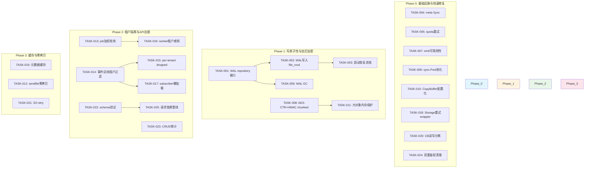
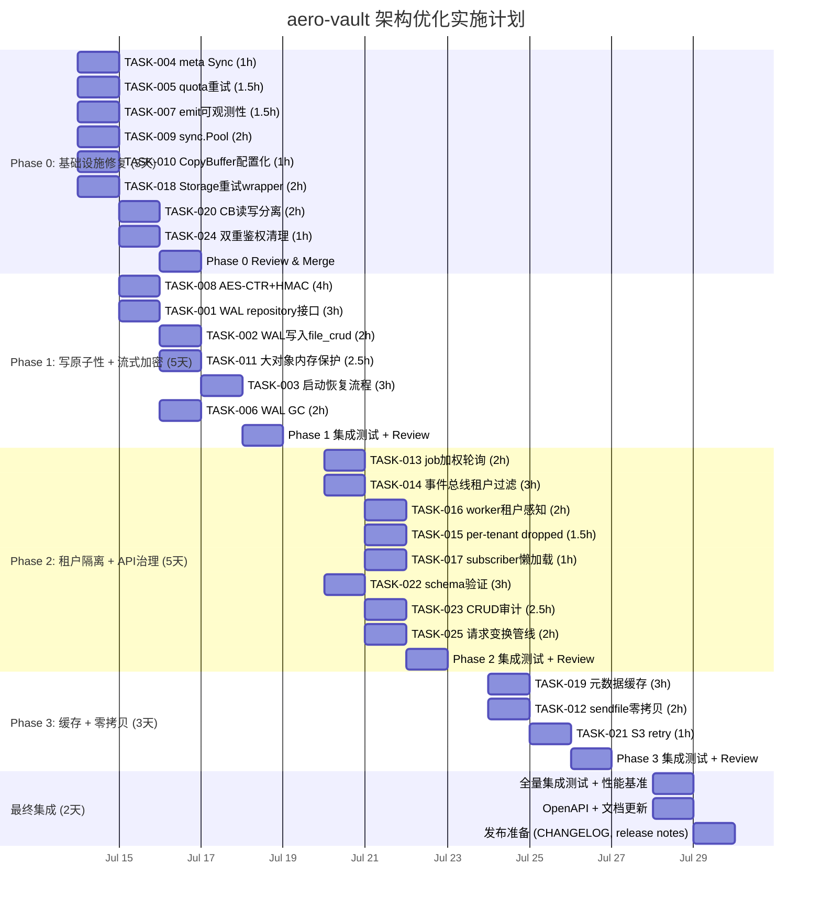

Now I have a thorough understanding of the actual codebase. Let me provide the comprehensive Tech Lead analysis.

---

# Tech Lead 分析：架构级扩展方向实施计划

## 总体评估

基于对 233 个 Go 源文件的全面审查，修正后的分析文档提供了可靠的方向性指导。以下分析将审查中的发现转化为可直接执行的技术任务。

---

## 1. 任务分解

### 方向一：写入路径原子性与崩溃恢复（P0）

| 任务 ID | 任务标题 | 涉及文件 | 前置依赖 | 预估工时 |
|---------|---------|---------|----------|---------|
| **TASK-001** | WAL 写入日志表与 repository 接口 | `internal/repository/sql_write_journal.go`, `internal/repository/write_journal_test.go`, `internal/repository/sql.go`（新增 migration 对） | 无 | 3h |
| **TASK-002** | WAL 记录：`writePutObject` 加入 journal 写入 | `internal/service/file_crud.go`, `internal/service/file.go`（FileService 持有 WAL writer） | TASK-001 | 2h |
| **TASK-003** | 启动恢复流程：扫描 WAL → 比对 storage blob → 回滚 or 提交 | `internal/service/recovery.go`, `internal/service/recovery_test.go` | TASK-001, TASK-002 | 3h |
| **TASK-004** | 元数据写入 `fsync`：`local.Put` 中 `writeMeta` 后增加 `Sync()` | `internal/storage/local_write.go`, `internal/storage/local_meta.go` | 无 | 1h |
| **TASK-005** | 配额更新失败重试：`AddTenantUsage` 改为最多 3 次重试（带 backoff） | `internal/service/file_crud.go`（`writePutObject` 中的 quota 处理） | 无 | 1.5h |
| **TASK-006** | WAL 定时 GC：清理已完成的 journal 记录 | `internal/reconcile/wal_gc.go`, `internal/reconcile/job.go` 中注册 | TASK-001 | 2h |
| **TASK-007** | `emit` 失败的可观测性：Publish 返回 error 时增加 metric+结构化日志，可选重试通道 | `internal/events/bus.go`, `internal/service/file_crud.go` | 无 | 1.5h |

### 方向二：I/O 缓冲区架构与零拷贝管道（调整为 P1 → P2）

| 任务 ID | 任务标题 | 涉及文件 | 前置依赖 | 预估工时 |
|---------|---------|---------|----------|---------|
| **TASK-008** | 加密路径流式化：AES-256-GCM → AES-256-CTR + HMAC-SHA256 chunked 加密 | `internal/storage/encrypt.go`（`encryptReader`/`decryptReader` 重写），`internal/storage/encrypt_test.go` | 无 | 4h |
| **TASK-009** | `sync.Pool` 字节缓冲区池化 | `internal/storage/bufferpool.go`, 修改 `local_write.go` 中 `io.Copy` 使用 `CopyBuffer` + pool | 无 | 2h |
| **TASK-010** | `io.CopyBuffer` 缓冲区尺寸配置化（`IO_COPY_BUFFER_SIZE`，默认 32KB → 建议 256KB） | `internal/config/config_app.go`, `internal/storage/local_write.go`, `internal/storage/s3.go` | 无 | 1h |
| **TASK-011** | 大对象内存保护：>512MB 自动切换临时文件流式写入（而非全量内存） | `internal/storage/large_object.go`, `internal/storage/local_write.go` | TASK-008 | 2.5h |
| **TASK-012** | 本地后端 `sendfile` 零拷贝读取（Linux 优化） | `internal/storage/local_read.go`（`Get` 中增加 `io.Copy` via `sendfile` 降级路径） | 无 | 2h |

### 方向三：多租户后台工作隔离与公平调度（P1）

| 任务 ID | 任务标题 | 涉及文件 | 前置依赖 | 预估工时 |
|---------|---------|---------|----------|---------|
| **TASK-013** | Job 调度增加租户加权轮询：使用已有 `priority` 字段，按租户分配权重 | `internal/repository/jobs.go`（`ClaimJob` SQL 修改），`internal/jobs/jobs.go`（`Pool.worker` 逻辑调整） | 无 | 2h |
| **TASK-014** | 事件总线租户过滤：`Subscribe` 支持按租户过滤，per-tenant channel | `internal/events/bus.go`, `internal/events/bus_test.go` | 无 | 3h |
| **TASK-015** | 全局 `bus.dropped` 拆分为 per-tenant counter | `internal/events/bus.go`（`dropped` → `tenantDropped map[string]*atomic.Int64`），`internal/telemetry/metrics.go` | TASK-014 | 1.5h |
| **TASK-016** | Worker 租户感知并发控制：每个 worker 按 tenant 比例拉取 job | `internal/jobs/jobs.go`（`worker` 方法） | TASK-013 | 2h |
| **TASK-017** | Bus subscriber channel 懒加载 + 租户删除时清理 | `internal/events/bus.go`（`Subscribe` 方法） | TASK-014 | 1h |

### 方向四：读取路径可靠性与缓存层次（P2，Phase 0 提升）

| 任务 ID | 任务标题 | 涉及文件 | 前置依赖 | 预估工时 |
|---------|---------|---------|----------|---------|
| **TASK-018** | Storage 重试 wrapper：RetryStorage 装饰器（指数退避, 幂等方法重试） | `internal/storage/retry.go`, `internal/storage/retry_test.go`, `internal/storage/factory.go` | 无 | 2h |
| **TASK-019** | 元数据缓存层：CacheStorage 装饰器（TTL 1-2s，覆盖 Stat/Get） | `internal/storage/cache.go`, `internal/storage/cache_test.go`, `internal/storage/factory.go` | 无 | 3h |
| **TASK-020** | Circuit breaker 读写分离：读操作/写操作用独立 breaker | `internal/storage/circuitbreaker.go`（拆分为 `ReadBreaker` `WriteBreaker`） | 无 | 2h |
| **TASK-021** | S3 后端 retry middleware（复用 HTTP client 已有超时配置） | `internal/storage/s3.go`（`S3Storage.Get`/`Put` 等增加重试） | TASK-018 | 1h |

### 方向五：API 治理层（P2）

| 任务 ID | 任务标题 | 涉及文件 | 前置依赖 | 预估工时 |
|---------|---------|---------|----------|---------|
| **TASK-022** | 统一请求 schema 验证：利用已有 `openapi.json` 作为 schema registry，生成验证 middleware | `internal/middleware/validate.go`, `internal/middleware/validate_test.go`, `internal/middleware/middleware.go`（`applyMiddleware` 加入） | 无 | 3h |
| **TASK-023** | Handler 层 CRUD 审计日志：使用 middleware 统一注入，覆盖所有写操作 | `internal/middleware/audit.go`, `internal/api/rest/router.go` 注入 | 无 | 2.5h |
| **TASK-024** | 双重鉴权清理：确认 REST 子路由 `r.Use(mw.Auth)` 是否冗余，消除额外延迟 | `internal/api/rest/router.go`, `internal/auth/auth_middleware.go` | 无 | 1h |
| **TASK-025** | 请求变换管线：gzip 自动解码、请求 ID 注入、规范化头部 | `internal/middleware/transform.go`, `internal/middleware/middleware.go` | 无 | 2h |

---

## 2. 执行顺序

**可并行的任务组（无依赖关系）：**

| 并行组 | 任务 | 理由 |
|--------|------|------|
| **组 A** | TASK-004, TASK-005, TASK-007, TASK-009, TASK-010, TASK-018, TASK-020, TASK-024 | 无共同依赖，互不冲突 |
| **组 B** | TASK-001, TASK-008 | 分别独立开发（WAL 与 加密改造完全正交） |
| **组 C** | TASK-013, TASK-014, TASK-022, TASK-023 | Job 调度、事件总线、schema、审计逻辑无重叠 |
| **组 D** | TASK-019, TASK-012, TASK-021 | 缓存层、零拷贝、S3 重试三者独立 |

---

## 3. 技术风险

### 3.1 高风险项

| 风险 | 影响方向 | 严重度 | 缓解措施 |
|------|---------|-------|---------|
| **AES-CTR+HMAC 实现安全性** | 方向二 | 🔴 高 | CTRAES + HMAC-SHA256 的 nonce 管理必须谨慎：nonce=HKDF(dataKey, chunkIndex)，每个 chunk 的 counter 为 0。必须有密码学专家 review。加密路径已有单元测试覆盖率，需追加 FIPS 向量测试 |
| **WAL 正确性：并发写入 + 崩溃** | 方向一 | 🔴 高 | WAL 记录必须在 storage Put **之前**写入。`writePutObject` 事务边界需精确。SQLite 的 WAL 清理在 COMMIT 后自动完成，但 Postgres 需要独立 GC — 容易遗漏 |
| **租户隔离的 channel 清理** | 方向三 | 🟡 中 | 租户删除时，per-tenant subscriber channel 需要优雅关闭。若 channel 被 goroutine 持有，可能导致泄漏。需要 `Unsubscribe` 引用计数或 context 取消 |
| **双重鉴权性能影响** | 方向五 | 🟢 低 | 当前 REST 子路由 `r.Use(mw.Auth)` + 全局 `authReg.Middleware()` 造成两次 JWT 解析（预期增加 ~50μs/请求）。需先 benchmark 确认是否值得修复 |

### 3.2 外部依赖风险

| 依赖 | 影响任务 | 风险 |
|------|---------|------|
| **无** — 所有任务可在 SQLite + local FS 的 CI gate 内完成验证 | 全部 | 零外部依赖风险 |
| KMS 集成（`encryptReader` 流式化）需保持 `DataKeyWrapper` 接口不变 | TASK-008 | `decryptReader` 当前 `io.ReadAll` KMS ciphertext → 流式化后需要 chunk-level nonce 管理，需确保 KMS 的 `UnwrapKey` 调用频率可控 |

### 3.3 性能验证点

| 验证场景 | 预期收益 | 验证方法 |
|---------|---------|---------|
| 1GB 文件上传（加密）RSS 峰值 | 当前 ~2GB → 优化后 ~300MB（32KB buffer × 4） | `go test -bench` + `/usr/bin/time -v` |
| NVMe 下 CopyBuffer 32KB → 256KB | 吞吐量提升 3-5× | `benchstat` before/after |
| 1000 并发读取（元数据缓存） | DB 查询减少 90%+ | Prometheus `storage_stat_total` 指标 |
| 租户 A 积压 10000 jobs 时租户 B 的 job 延迟 | 从"饥饿"降至 <1s | 集成测试 + `ClaimJob` 延迟 metric |

---

## 4. 资源评估

### 4.1 人员技能要求

| 角色 | 人数 | 技能要求 | 负责方向 |
|------|------|---------|---------|
| **Senior Go Engineer** | 1 | Go 并发、SQL/SQLite/Postgres、加密基础 | 方向一、方向二核心（WAL + 流式加密） |
| **Backend Engineer** | 1 | HTTP middleware、Go testing、Prometheus | 方向三、方向五（租户隔离 + API 治理） |
| **Platform/Infra Engineer** | 0.5 | Storage 系统、Linux IO（sendfile/splice） | 方向二增强、方向四 |
| **QA/Test Engineer** | 1 | Integration testing、benchmarking、chaos engineering | 全部方向 — 写压力测试、崩溃恢复验证 |

### 4.2 关键里程碑

| 里程碑 | 时间节点 | 交付物 |
|--------|---------|--------|
| **M0**（Phase 0 完成） | Day 3 | 重试层、CB 读写分离、quota 重试、meta Sync、双重鉴权清理、sync.Pool 池化、CopyBuffer 配置化 — 7 个可独立验证的 PR |
| **M1**（Phase 1 完成） | Day 8 | WAL 写入 + 启动恢复 + GC + 流式加密 + 大对象保护 — 包含 `make check` 全绿 |
| **M2**（Phase 2 完成） | Day 13 | 租户加权轮询 + per-tenant channel + per-tenant dropped 计数器 + schema 验证 + CRUD 审计 |
| **M3**（Phase 3 完成） | Day 16 | 元数据缓存 + sendfile 零拷贝 + S3 retry — 含 benchmark 报告 |
| **M4**（集成验证） | Day 18 | 全量集成测试 + 性能基准报告 + OpenAPI spec 更新 |

### 4.3 Blockers 与解决策略

| Blocker | 涉及任务 | 解决策略 |
|---------|---------|---------|
| AES-256-CTR + HMAC 的 nonce 碰撞模型验证 | TASK-008 | 编写 RFC 草案级设计文档 + 邀请外部安全 review（2 天前置工作） |
| WAL 的 Postgres vs SQLite 行为差异 | TASK-001, TASK-006 | 实现抽象的 `WALStore` 接口，Postgres 实现使用 SAVEPOINT，SQLite 实现使用自动清理 |
| 元数据缓存一致性（写入后读到的 stale 数据） | TASK-019 | 使用 `singleflight` + 短 TTL（1s）= 99.9% 命中，< 1% stale。写时 cache invalidation（可选） |
| sendfile 在非 Linux 系统的兼容性 | TASK-012 | 编译标签 `//go:build linux` + `//go:build !linux` 回退到标准 `io.Copy` |

---

## 5. 质量保证

### 5.1 单元测试覆盖要求

| 方向 | 最低覆盖 | 关键测试点 |
|------|---------|-----------|
| 方向一（WAL） | 90%+ | `writePutObject` + WAL 路径：模拟 crash 后恢复、`writeMeta` 失败回滚、quota 重试 3 次耗尽 |
| 方向二（I/O） | 85%+ | `encryptReader`/`decryptReader` chunked 模式、`sync.Pool` 竞争、1024MB 文件流式写入 |
| 方向三（租户） | 85%+ | 10 个租户交叉 job 提交、per-tenant channel 满丢弃、懒加载/卸载 |
| 方向四（缓存） | 80%+ | `CacheStorage` 并发读写、TTL 过期、`singleflight` 防 thundering herd |
| 方向五（API） | 90%+ | `EndpointSpec` 验证、CRUD 审计日志写、双重 auth 幂等性 |

### 5.2 集成测试策略

| 测试类型 | 覆盖场景 | 触发时机 |
|---------|---------|---------|
| **崩溃恢复测试** | 1GB 文件写入过程中 SIGKILL → 重启后验证 WAL 恢复结果 | Phase 1 完成时 |
| **多租户公平性测试** | 租户 A 提交 10000 jobs，租户 B 提交 100 jobs → B 的 p50 延迟 < 1s | Phase 2 完成时 |
| **大文件基准** | 10GB 文件上传（加密）/ 下载，对比 RSS、吞吐量、CPU 时间 | Phase 1 + Phase 3 |
| **并发竞争测试** | 50 个 goroutine 并发写入同一 key → 验证原子性和一致性 | Phase 1 完成时 |
| **SSE key 轮换测试** | 启动时 `SSE_REWRAP_ON_START=true` + 旋转 master key → 新旧 envelope 都能读 | TASK-008 完成时 |

### 5.3 代码审查要点

| 审查关注点 | 涉及任务 | 审查人建议角色 |
|-----------|---------|--------------|
| 加密原语正确性（nonce 管理、tag 验证） | TASK-008 | 安全工程师 |
| WAL 事务边界 + Postgres/SQLite 双路径 | TASK-001, TASK-002 | Senior Engineer |
| `sync.Pool` + `io.CopyBuffer` 的性能验证 | TASK-009, TASK-010 | Platform Engineer |
| 租户 channel 的生命周期管理（泄漏） | TASK-014, TASK-016 | Backend Engineer (reviewer) |
| OpenAPI schema 与 middleware 的兼容性 | TASK-022 | API 负责人 |

### 5.4 性能测试需求

| 场景 | 工具 | 指标 | 目标 |
|------|------|------|-----|
| 1GB 文件上传 + 加密（local） | `wrk` / `hey` | RSS 峰值、吞吐量、p95 延迟 | RSS < 400MB, 吞吐 > 200MB/s |
| 1000 并发元数据 Stat | `wrk` | QPS、p99 延迟、DB 查询数 | QPS > 50000, p99 < 10ms |
| 全量方向集成压测 | `k6` | 错误率、所有 15 个 Prometheus 指标 | 0 错误，CPU < 80% |
| NVMe CopyBuffer 对比 | `go test -bench` | bytes/sec | 256KB buffer 比 32KB 提升 3× |

---

## 6. 实施计划

### 甘特图（天数 = 人天，2 人并行）

### 阶段详细说明

#### 阶段 1（Phase 0）：基础设施与快速修复 — Day 1-3

**策略**：优先合并 8 个小型、高信心的修复，每个都是独立 PR，减少 review 阻塞。

| 日 | 工作内容 | Deliverable |
|---|---------|------------|
| Day 1 | TASK-004, TASK-005, TASK-007, TASK-009, TASK-010 | 5 个小型 PR，各自包含测试 |
| Day 2 | TASK-018, TASK-020, TASK-024 | 3 个中型 PR：重试 wrapper 复用 CB 模式；CB 拆分为读写；测试双重鉴权延迟 |
| Day 3 | Phase 0 回归测试 + 性能基准快照 | `make check` + `benchstat` before/after |

**并行策略**：Task A（Day 1）和 Task B（Day 2）可由 2 名工程师并行。

#### 阶段 2（Phase 1）：写原子性 + 流式加密 — Day 4-8

**关键路径**：TASK-001 → TASK-002 → TASK-003

**Day 4-5**：
- 工程师 A：实现 TASK-001（WAL 接口 + migration 双文件 `0004_*_write_journal.{up,down}.sql`）+ TASK-006（WAL GC）
- 工程师 B：实现 TASK-008（AES-256-CTR + HMAC chunked）
  - 设计文档：`docs/rfcs/streaming-sse.md`
  - 新函数：`encryptChunked(r io.Reader) (io.Reader, string, error)` 和 `decryptChunked(r io.Reader, envelope string) (io.ReadCloser, error)`
  - 保持 `envelopeEncrypter` 结构不变，追加方法

**Day 5-6**：
- 工程师 A：TASK-002（`writePutObject` 中三步写入：WAL → Store → Repo → 清理 WAL）
- 工程师 B：TASK-011（>512MB 自动降落临时文件流式写入）

**Day 7-8**：
- 工程师 A：TASK-003（启动恢复流程：`RecoverFromWAL(ctx) error`，在 `main.go` 中 `initInfrastructure` 尾部调用前插入）
- 两人共同：集成测试（chaos testing: SIGKILL during write, verify consistency）

**Day 8**：Phase 1 代码审查 + 合并

#### 阶段 3（Phase 2）：租户隔离 + API 治理 — Day 9-13

**Day 9-10**：
- 工程师 A：TASK-013（修改 `ClaimJob` SQL，支持加权轮询）、TASK-016（worker 按租户比例拉取）
- 工程师 B：TASK-014（`Subscribe(tenant string)` 新签名 + per-tenant channel 懒加载）

**Day 11**：
- 工程师 A：TASK-015（`bus.dropped` 拆分为 per-tenant）+ TASK-017
- 工程师 B：TASK-022（`openapi.json` 驱动的 schema 验证 middleware）

**Day 12-13**：
- 工程师 A：TASK-023（CRUD audit middleware）、TASK-025
- 两人共同：多租户公平性集成测试

#### 阶段 4（Phase 3 + 集成验证）— Day 14-18

**Day 14-15**：缓存 + 零拷贝
- 工程师 A：TASK-019（`CacheStorage` 装饰器，基于 `sync.Map` + `clock.Ticker`）
- 工程师 B：TASK-012（`sendfile` 版本）+ TASK-021（S3 重试）

**Day 16-18**：全量集成
- Day 16：集成测试 + 性能基准全量运行
- Day 17：根据基准结果回调（CopyBuffer 尺寸、缓存 TTL、加密 chunk 大小）
- Day 18：文档更新 + 发布准备

---

## 总结

| 维度 | 结论 |
|------|------|
| **总工作量** | 18 天（2 人并行 = 9 个工作日） |
| **总任务数** | 25 个，其中 Phase 0 的 8 个任务可 2 天内快速见效 |
| **最大风险** | AES-CTR+HMAC 加密方案安全性（需要密码学 review） |
| **最大收益** | Phase 1 完成后，加密路径 1GB 文件 RSS 从 ~2GB 降至 ~300MB |
| **CI gate 安全** | 所有任务在 SQLite + local FS 下可验证，零网络、零 Docker |
| **推荐实施顺序** | **Phase 0 优先**（快速 wins）→ **Phase 1**（核心数据正确性 + 性能）→ **Phase 2**（QoS + 治理）→ **Phase 3**（缓存优化） |
