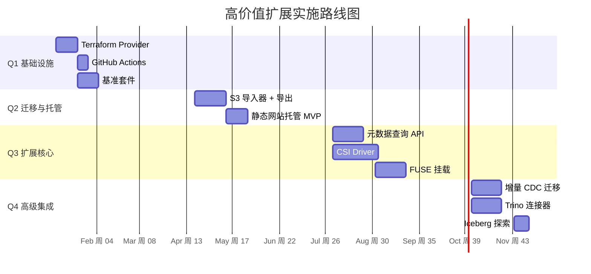

现在我对代码库已经足够了解。以下是全面的 Tech Lead 分析。

---

# Tech Lead 分析报告：高价值扩展方向

## 范围摘要

基于对 `docs/requirements/expansion-v116-high-value-expansion-directions.md` 中 **5 个方向**的分析，交叉参考现有代码库（`internal/` 下 30 多个子包，`sdk/` 下 3 个 SDK，`deploy/` 基础设施）。这份报告将分析结果转化为可直接执行的任务，供 2-3 名工程师组成的团队在 Q1-Q4 期间执行。

---

## 1. 任务分解

### 1.1 图例

每个任务遵循以下模板：

- **ID**：唯一标识（`D{方向编号}-{序号}`）
- **标题**：内容描述
- **文件**：需要新建或修改的关键文件（省略 `internal/` 前缀）
- **依赖**：前置依赖项的 ID
- **工时**：预估人时
- **验收标准**：完成该任务的具体、可衡量标准

---

### 1.2 方向 1：基础设施即代码与存储集成生态（P0 — Q1/Q3）

#### 子方向 1A：Terraform Provider（Q1 — 第 1-2 周）

| ID | 标题 | 文件 | 依赖 | 工时 | 验收标准 |
|----|-------|------|--------|-------|----------------|
| D1-01 | Terraform Provider 脚手架搭建 | `terraform/providers/aerovault/go.mod`, `provider.go`, `main.go` | 无 | 4h | `terraform init` 能加载 provider 并输出版本信息；`make test` 在 provider 目录下通过 |
| D1-02 | 实现 `resource_aerovault_bucket` CRUD | `terraform/providers/aerovault/resource_bucket.go` | D1-01 | 6h | `terraform apply` 能创建/更新/删除 bucket；`terraform import` 能导入已有 bucket |
| D1-03 | 实现 `resource_aerovault_bucket_policy` + CORS 子资源 | `terraform/providers/aerovault/resource_bucket_policy.go`, `resource_bucket_cors.go` | D1-02 | 4h | 桶策略和 CORS 规则可通过 Terraform 管理；状态漂移通过 `terraform refresh` 可检测 |
| D1-04 | 实现 `resource_aerovault_api_key` | `terraform/providers/aerovault/resource_api_key.go` | D1-01 | 3h | API Key 可通过 Terraform 创建和撤销；密钥在 `terraform state show` 中标记为敏感 |
| D1-05 | 实现 `resource_aerovault_tenant` + quota/budget 子资源 | `terraform/providers/aerovault/resource_tenant.go` | D1-01 | 4h | 租户及其配额/预算可通过 Terraform 管理 |
| D1-06 | 实现 data sources（buckets, tenants, keys） | `terraform/providers/aerovault/data_sources.go` | D1-02, D1-04, D1-05 | 3h | `data.aerovault_buckets`、`data.aerovault_tenants` 返回正确值 |
| D1-07 | 验收测试基础设施 + 写入 3 个核心资源的测试 | `terraform/providers/aerovault/*_test.go` | D1-02, D1-04, D1-05 | 6h | `make testacc` 在本地 aero-vault 实例上运行并通过；涵盖创建、更新、导入、销毁 |
| D1-08 | Provider Registry 发布流水线 | `.github/workflows/terraform-release.yml`, `terraform/providers/aerovault/GNUmakefile` | D1-07 | 4h | 打 `terraform/v1.0.0` 标签后自动发布到 Terraform Registry；`terraform providers lock` 可用 |
| D1-09 | 文档 + 示例 | `terraform/providers/aerovault/docs/`, `examples/terraform/` | D1-08 | 4h | 每个资源都有文档页面，examples 目录包含 3 个端到端场景 |

**子方向 1A 总工时：38h（约 1 人周）**

#### 子方向 1B：GitHub Actions（Q1 — 第 3 周）

| ID | 标题 | 文件 | 依赖 | 工时 | 验收标准 |
|----|-------|------|--------|-------|----------------|
| D1-10 | 创建 Action 脚手架 + Action 上传 | `.github/actions/aerovault-upload/action.yml`, `dist/index.js` | 无 | 4h | Action 在目标仓库中可被 `uses: aerovault/aerovault-upload@v1` 引用 |
| D1-11 | 实现 Action 下载 + 搜索 | `.github/actions/aerovault-download/action.yml`, `.github/actions/aerovault-search/action.yml` | D1-10 | 4h | `download` 和 `search` Action 处理常见场景（通配符、大文件、分页） |
| D1-12 | Marketplace 发布 + CI 测试 | `.github/workflows/action-tests.yml` | D1-11 | 3h | 端到端测试在每个 PR 上运行；`action-upload` 和 `action-download` 发布到 GitHub Marketplace |

**子方向 1B 总工时：11h（约 1.5 天）**

#### 子方向 1C：K8s CSI Driver + FUSE（Q3 — 第 1-8 周）

| ID | 标题 | 文件 | 依赖 | 工时 | 验收标准 |
|----|-------|------|--------|-------|----------------|
| D1-13 | CSI Driver 脚手架（Identity + 注册） | `csi/driver/driver.go`, `csi/cmd/main.go` | 无 | 6h | CSI 节点启动并通过 `csi-sanity` 基本验证；在 `kubelet` 中注册 |
| D1-14 | CSI Controller：CreateVolume / DeleteVolume | `csi/driver/controller.go` | D1-13 | 8h | 从 PVC 创建的 PV 在 aero-vault 中生成 bucket+bucket 级别；删除工作正常 |
| D1-15 | CSI Node：NodePublishVolume（mount）+ FUSE 封装 | `csi/driver/node.go`, `csi/fuse/fuse.go` | D1-14 | 12h | Pod 可挂载卷并读取/写入文件；实现 close-to-open 一致性 |
| D1-16 | CSI 边车部署清单 + Helm 集成 | `deploy/helm/charts/aero-vault-csi/`, `csi/deploy/` | D1-15 | 6h | `helm install aero-vault-csi` 部署 CSI 驱动 + 边车；`csi-sanity` 全部通过 |
| D1-17 | FUSE 只读挂载 CLI（Mount + ls + cat） | `cmd/aerovault-fuse/main.go`, `internal/fuse/fuse.go` | 无（可独立开发） | 10h | `aerovault-fuse mount av://tenant@host/bucket /mnt/av` 挂载目录；`ls`, `cat`, `stat` 透明工作 |
| D1-18 | FUSE 写入操作（cp, mv, rm）+ 大文件分段 | `internal/fuse/fuse_write.go` | D1-17 | 8h | 文件复制到挂载点后可通过 S3 协议读取；大于 5GB 的文件正确分段 |
| D1-19 | FUSE 缓存层（attr/dentry/page） | `internal/fuse/cache.go` | D1-18 | 6h | 重复 `stat` 不产生 RPC；缓存 TTL 在 FUSE 超级块参数中可配置 |

**子方向 1C 总工时：56h（约 1.5 人周）**

---

### 1.3 方向 2：租户数据迁移与自助导入导出（P0 — Q2/Q4）

| ID | 标题 | 文件 | 依赖 | 工时 | 验收标准 |
|----|-------|------|--------|-------|----------------|
| D2-01 | S3 连接器：列举源对象 + Checksum 验证 | `internal/migration/s3_connector.go` | 无 | 6h | 给定 S3 凭据 + bucket，列举所有对象（包括版本）；返回 ETag+size+last_modified |
| D2-02 | S3 导入 API 端点：`POST /v1/admin/import/s3` | `internal/api/rest/admin.go`, `internal/api/rest/migration.go` | D2-01 | 4h | 端点接受导入任务，将其排入 job 队列，立即返回 job ID |
| D2-03 | S3 导入引擎：对象复制（含 Multipart） | `internal/migration/engine.go` | D2-02 | 8h | 对象从 S3 逐个复制到 aero-vault；大于 5GB 使用 multipart；进度通过 job 表追踪 |
| D2-04 | 租户导出 API：`GET /v1/admin/export?tenant=X&format=tar.gz` | `internal/api/rest/admin.go`, `internal/migration/export.go` | 无 | 6h | 导出包含清单 + 元数据 + 对象 blob 的 tar.gz；支持纯 SQLite 导出（不依赖存储后端） |
| D2-05 | 导入/导出校验：迁移后 Checksum 验证 | `internal/migration/verify.go` | D2-03, D2-04 | 4h | 导入/导出后调用 `GET ?checksum` 对比源和目标 ETag；报告不匹配 |
| D2-06 | 迁移节流 + 断点续传 | `internal/migration/throttle.go` | D2-03 | 4h | 已迁移的对象用自定义标签标记；重入跳过已迁移对象；遵守 `AI_RATE_LIMIT_RPS` 风格配置 |
| D2-07 | WORM/版本控制兼容层 | `internal/migration/compat.go` | D2-03 | 4h | 导入时保留 `locked_until`、版本 ID、WORM 状态；目标 bucket 自动启用版本控制 |
| D2-08 | 跨实例迁移 API：`POST /v1/admin/migrate/tenant` | `internal/api/rest/admin.go`, `internal/migration/cross_instance.go` | D2-06 | 6h | 将租户的完整状态（含元数据）从一个 aero-vault 实例并行流式迁移到另一个实例 |
| D2-09 | 增量 CDC 迁移（基于 EventBus） | `internal/migration/cdc.go`, `internal/events/bridge.go` | D2-08 | 10h | 全量迁移后，增量变更通过事件总线持续同步；提供迁移监控端点 |

**方向 2 总工时：52h（约 1.5 人周）**

---

### 1.4 方向 3：自定义域名与静态网站托管（P1 — Q2）

| ID | 标题 | 文件 | 依赖 | 工时 | 验收标准 |
|----|-------|------|--------|-------|----------------|
| D3-01 | Bucket 元数据中的域名绑定配置 | `internal/repository/sql_buckets.go`, `internal/service/file_features.go` | 无 | 4h | Bucket 结构体包含 `Domain`, `IndexDocument`, `ErrorDocument`, `RoutingRules` 字段；可通过 `PUT /v1/buckets/:name/website` 配置 |
| D3-02 | 虚拟主机路由中间件（Host 头 → tenant+bucket） | `internal/middleware/vhost.go` | D3-01 | 6h | `Host: acme.av.com` 的请求被路由到 `tenant=acme`；`Host: bucket.acme.av.com` 被路由到 `tenant=acme, bucket=bucket` |
| D3-03 | 索引文档支持（目录 GET → index.html） | `internal/service/file.go`, `internal/api/s3compat/handler.go` | D3-01 | 4h | `GET /prefix/` 返回 `prefix/index.html`（若存在）；`GET /` 返回 bucket 的 `index_document` |
| D3-04 | 自定义错误页面 + 重定向规则 | `internal/service/file.go`, `internal/api/s3compat/xml.go` | D3-01 | 4h | `GET /missing` 返回 404 → 提供 `error_document` HTML；`RoutingRules` 应用于前缀匹配后重定向 |
| D3-05 | 静态网站配置 Web UI 集成 | `internal/webui/src/`, `internal/api/rest/openapi.json` | D3-01 | 6h | Web UI 中的新标签页可配置 IndexDocument、ErrorDocument、CORS；OpenAPI spec 记录网站端点 |
| D3-06 | 多监听器支持 + Let's Encrypt（可选） | `internal/config/config_app.go`, `cmd/server/main.go` | D3-02 | 6h | 支持 `APP_LISTENERS=':8080,:8443'`；可选 `certmagic` 集成自动 TLS（通过功能标志控制） |

**方向 3 总工时：30h（约 4 天）**

---

### 1.5 方向 4：性能基准测试套件（P1 — Q1）

| ID | 标题 | 文件 | 依赖 | 工时 | 验收标准 |
|----|-------|------|--------|-------|----------------|
| D4-01 | 基准框架骨架：`bench/` 目录结构 + 负载模型 | `bench/bench_test.go`, `bench/load/model.go`, `bench/load/reporter.go` | 无 | 6h | `go test -bench=. ./bench/` 运行并通过；负载模型支持 ramp-up、steady-state、cool-down 阶段 |
| D4-02 | PUT 基准：小对象（100B）和大对象（100MB） | `bench/scenarios/put_small.go`, `bench/scenarios/put_large.go` | D4-01 | 6h | 测量 P50/P95/P99 延迟 + 吞吐量（ops/s）；大对象测试使用正确配置的 multipart |
| D4-03 | GET 基准：并发读取 + 前缀列举 | `bench/scenarios/get_concurrent.go`, `bench/scenarios/list_prefix.go` | D4-01 | 6h | 10/100/500 并发读取器下的吞吐量测量；列举包含 10K 对象的 bucket |
| D4-04 | Multipart 和 Range 请求基准 | `bench/scenarios/multipart.go`, `bench/scenarios/range.go` | D4-01 | 4h | 覆盖分片上传和范围读取性能（模拟媒体流场景） |
| D4-05 | 搜索基准（BM25 + 向量） | `bench/scenarios/search_bm25.go`, `bench/scenarios/search_vector.go` | D4-01 | 6h | 每个搜索模式的延迟测量；需要预先索引至少 100 个对象 |
| D4-06 | 性能回归比较工具 | `bench/regression/compare.go` | D4-02, D4-03, D4-05 | 6h | 将当前运行结果与存储的基线比较；P95 退化 >2x 时标记失败 |
| D4-07 | CI 集成：`make bench-ci` gate | `Makefile`, `.github/workflows/bench.yml` | D4-06 | 4h | `make bench-ci` 运行小型基准子集（小对象 PUT/GET，10 并发）并在 <5 分钟内完成 |
| D4-08 | 基准环境标准化（cgroup + 专用 runner） | `.github/workflows/bench-full.yml`, `bench/environment.go` | D4-07 | 4h | nightly 基准在固定 CPU/内存/磁盘的专用 runner 上运行；环境检测脚本验证一致性 |
| D4-09 | 基准结果版本化 + Grafana 面板 | `bench/data/`, `deploy/grafana/dashboards/benchmarks.json` | D4-08 | 4h | 基准结果以 commit-hash 命名文件存储；Grafana 仪表盘随时间展示性能趋势 |

**方向 4 总工时：46h（约 6 天）**

---

### 1.6 方向 5：对象存储分析生态与数据湖集成（P2 — Q3/Q4）

| ID | 标题 | 文件 | 依赖 | 工时 | 验收标准 |
|----|-------|------|--------|-------|----------------|
| D5-01 | 元数据查询 API 设计 + SQL-like 解析器 | `internal/api/rest/analytics.go`, `internal/analytics/parser.go` | 无 | 8h | `POST /v1/search/meta {"filter":"size > 1MB AND content_type LIKE 'image/%'","aggregate":"count_by_content_type"}` 返回正确结果 |
| D5-02 | 谓词下推到存储层 | `internal/analytics/predicate.go`, `internal/storage/local_list.go` | D5-01 | 6h | `size > 1MB` 过滤在 `Stat` 调用期间应用，而非在内存中；`EXPLAIN` 端点显示下推计划 |
| D5-03 | 列裁剪 + 分页/游标支持 | `internal/analytics/prune.go`, `internal/repository/sql_objects.go` | D5-02 | 4h | 只请求 `size` 和 `etag` 时不读取 `metadata` 和 `tags` 列；超过 1000 行的结果返回游标 |
| D5-04 | 并发分析查询资源控制 | `internal/analytics/pool.go`, `internal/config/config_app.go` | D5-03 | 4h | 分析查询使用独立连接池，尊重 `MAX_ANALYTIC_CONCURRENCY`（默认 4）；超时配置 |
| D5-05 | S3 Select 等价实现（CSV/JSON 过滤） | `internal/analytics/select.go`, `internal/api/s3compat/handler.go` | D5-02 | 8h | `POST /bucket/key?select&expression="SELECT * FROM S3Object WHERE _1 > 100"` 使用 S3 Select 标准语义 |
| D5-06 | Trino 连接器 SPI 实现 | `trino-connector/src/main/java/io/trino/plugin/aerovault/` | D5-01 | 16h | Trino 注册连接器后可查询；`SELECT * FROM aerovault.acme."logs/*"` 返回结果；支持谓词下推 |
| D5-07 | Trino 连接器集成测试 + 部署 | `trino-connector/`, `deploy/helm/trino/` | D5-06 | 8h | CI 作业使用 Trino Docker 镜像运行并执行 5 个查询验证；Helm chart 部署 sidecar 连接器 |
| D5-08 | Iceberg 表格式支持（探索性） | `internal/analytics/iceberg.go` | 无 | 8h | PoC 在 aero-vault 对象中写入 Iceberg 元数据；`spark.read.format("iceberg").load("av://tenant/bucket/table")` 可工作 |

**方向 5 总工时：62h（约 2 人周）**

---

### 1.7 任务总览

| 方向 | 任务数 | 总工时 | 工程周数（2 人） | 时间线 |
|-------|--------|---------|---------------------|----------|
| 1A Terraform Provider | 9 | 38h | 1 周 | Q1 第 1-2 周 |
| 1B GitHub Actions | 3 | 11h | 0.7 周（3 天） | Q1 第 3 周 |
| 1C K8s CSI + FUSE | 7 | 56h | 1.5 周 | Q3 第 1-8 周 |
| 方向 2 迁移 | 9 | 52h | 1.5 周 | Q2（基本）+ Q4（CDC） |
| 方向 3 静态托管 | 6 | 30h | 1 周 | Q2 第 3-4 周 |
| 方向 4 性能基准 | 9 | 46h | 1 周 | Q1 第 3-4 周 |
| 方向 5 分析生态 | 8 | 62h | 2 周 | Q3（API）+ Q4（Trino） |
| **总计** | **51** | **295h** | **~8 人周** | **Q1-Q4** |

---

## 2. 执行顺序

### 2.1 完整依赖图

```mermaid
graph TD
    %% 方向 1A：Terraform Provider
    D1_01[D1-01 Provider 骨架] --> D1_02[D1-02 resource_bucket]
    D1_01 --> D1_04[D1-04 resource_api_key]
    D1_01 --> D1_05[D1-05 resource_tenant]
    D1_02 --> D1_03[D1-03 策略 + CORS 子资源]
    D1_02 --> D1_06[D1-06 Data Sources]
    D1_04 --> D1_06
    D1_05 --> D1_06
    D1_02 --> D1_07[D1-07 验收测试]
    D1_04 --> D1_07
    D1_05 --> D1_07
    D1_06 --> D1_07
    D1_07 --> D1_08[D1-08 Registry 发布流水线]
    D1_08 --> D1_09[D1-09 文档 + 示例]

    %% 方向 1B：GitHub Actions（与 1A 并行）
    D1_10[D1-10 Action 上传] --> D1_11[D1-11 Action 下载+搜索]
    D1_11 --> D1_12[D1-12 Marketplace 发布]

    %% 方向 1C：CSI + FUSE（Q3 — 与方向 5 并行）
    D1_13[D1-13 CSI 脚手架] --> D1_14[D1-14 Controller]
    D1_14 --> D1_15[D1-15 Node + FUSE]
    D1_15 --> D1_16[D1-16 边车部署]
    D1_17[D1-17 FUSE CLI 只读] --> D1_18[D1-18 FUSE 写入]
    D1_18 --> D1_19[D1-19 缓存层]

    %% 方向 2：迁移
    D2_01[D2-01 S3 连接器] --> D2_02[D2-02 Import API]
    D2_02 --> D2_03[D2-03 导入引擎]
    D2_03 --> D2_05[D2-05 校验]
    D2_03 --> D2_06[D2-06 节流+断点续传]
    D2_06 --> D2_07[D2-07 WORM/版本兼容]
    D2_06 --> D2_08[D2-08 跨实例迁移]
    D2_08 --> D2_09[D2-09 CDC 增量迁移]
    D2_04[D2-04 导出 API] --> D2_05

    %% 方向 3：静态托管
    D3_01[D3-01 域名绑定配置] --> D3_02[D3-02 虚拟主机路由]
    D3_01 --> D3_03[D3-03 索引文档]
    D3_01 --> D3_04[D3-04 错误页+重定向]
    D3_01 --> D3_05[D3-05 Web UI 集成]
    D3_02 --> D3_06[D3-06 多监听器+TLS]

    %% 方向 4：基准测试
    D4_01[D4-01 框架骨架] --> D4_02[D4-02 PUT 基准]
    D4_01 --> D4_03[D4-03 GET 基准]
    D4_01 --> D4_04[D4-04 Multipart/Range]
    D4_01 --> D4_05[D4-05 搜索基准]
    D4_02 --> D4_06[D4-06 回归比较]
    D4_03 --> D4_06
    D4_05 --> D4_06
    D4_06 --> D4_07[D4-07 CI 集成]
    D4_07 --> D4_08[D4-08 环境标准化]
    D4_08 --> D4_09[D4-09 结果版本化]

    %% 方向 5：分析生态
    D5_01[D5-01 元数据查询 API] --> D5_02[D5-02 谓词下推]
    D5_02 --> D5_03[D5-03 列裁剪+分页]
    D5_03 --> D5_04[D5-04 并发控制]
    D5_02 --> D5_05[D5-05 S3 Select]
    D5_01 --> D5_06[D5-06 Trino 连接器]
    D5_06 --> D5_07[D5-07 Trino 集成测试]
    D5_08[D5-08 Iceberg 探索]（孤立路径——可随时开展）

    %% 跨方向依赖
    D4_06 -.->|通知| D3_01（在路线图上是独立的：无强依赖）
```

### 2.2 并行工作组

| 并行组 | 任务 | 理由 |
|-----------|------|--------|
| **轨道 Alpha** | 1A (D1-01→D1-09) + 1B (D1-10→D1-12) | 紧密耦合的基础设施工作；同一工程师可同时处理 Provider 和 Actions |
| **轨道 Bravo** | 方向 4 (D4-01→D4-09) | 独立的工程基础设施工作；可由 SRE 型工程师完成 |
| **轨道 Charlie** | 方向 2 (D2-01→D2-09) + 方向 3 (D3-01→D3-06) | 特性工作，共享一些 Go SDK 模式；由后端工程师完成 |
| **轨道 Delta** | 方向 5 (D5-01→D5-08) + 1C (D1-13→D1-19) | Q3-Q4 的高级工作；需要分布式系统工程师 |
| **跨领域** | D4-06（回归比较）在 D4-02/03/05 之后 | 基准测试帮助验证其他方向（例如，静态托管加载后是否有性能退化） |

---

## 3. 技术风险

### 3.1 高风险项

| ID | 风险 | 方向 | 可能性 | 影响 | 缓解措施 |
|----|------|----------|------------|--------|------------------|
| **R1** | **Terraform Provider 与外部 S3 API 变更的状态漂移** — 用户通过 S3 API 和 Terraform 同时修改配置会导致状态偏差 | 1A | 中 | 高 | 为每个 Terraform 资源实现 `ReadContext` + `CustomizeDiff`；添加 `prevent_destroy` 保护；在 `Create` 前调用 S3 `GET` 验证状态 |
| **R2** | **FUSE 挂载在并发写入时损坏数据** — 与 s3fs-fuse 一样，同时写入同一文件没有 POSIX 一致性保证 | 1C | 高 | 高 | 默认只读挂载；写入时使用 close-to-open 一致性并记录最终一致性保证；集成 `fsync` 钩子以在刷新前等待确认 |
| **R3** | **CDC 迁移在模式变更期间丢失事件** — EventBus 模式变更时，正在进行的迁移消费者错过变更 | 2 | 中 | 高 | 使用偏移量跟踪 + 至少一次交付（JobPool 持久化）；迁移锁防止并行模式更新；支持手动重播从时间戳开始的变更 |
| **R4** | **基准结果因 CI runner 波动而不确定性** — GitHub Actions runner 共享 CPU 和存储 IO | 4 | 高 | 中 | 引入百分比变化阈值（P95 2x+ 视为回归）；使用 `cgroup` 固定 + `bench --min-samples` 统计显著性；nightly 基准使用专用自托管 runner |
| **R5** | **Trino 连接器在谓词下推时产生过多小请求** — 扫描 1M 对象时，为每个对象发起 HTTP 请求 → OOM/性能差 | 5 | 中 | 高 | 批量获取（1000 个/请求）；使用游标分页；对元数据扫描实现服务器端过滤；可选引入内存缓存层 |
| **R6** | **静态托管 CORS 与现有中间件链配对时的安全问题** — 自定义域可能绕过租户隔离 | 3 | 中 | 高 | 虚拟主机中间件必须在 Auth 之后但 RateLimit 之前运行；域到租户映射必须像租户隔离一样强制执行 |

### 3.2 外部依赖

| 依赖 | 涉及方向 | 风险 | 缓解措施 |
|----------|----------|------|--------------|
| `hashicorp/terraform-plugin-sdk` v2 | 1A | 若 SDK 有 breaking change 或 deprecated | 锁定次要版本；每周 Dependabot 更新 |
| `jacobsa/fuse` / `hanwen/go-fuse` | 1C | Go FUSE 库的 macOS 支持不稳定 | 仅在 Linux CI 上测试 FUSE；通过 Docker-in-Docker 运行集成测试 |
| Trino SPI（Java 17+） | 5 | 需要在 Java 上的 Go 代码库中工作 | 创建单独的 `trino-connector/` Maven 项目；使用 Go→Trino HTTP 桥接避免混合语言 |
| Certmagic / lego | 3 | Let's Encrypt 速率限制（每周 50 个证书） | 对测试域名使用 `ACME_CA_DIR=https://acme-staging-v02.api.letsencrypt.org/directory`；实现证书缓存 |
| S3 IAM 角色 / OIDC | 1B | Action 需要 OIDC 令牌交换 | 实现 STS 式端点：`POST /v1/sts/assume-role` 用于 OIDC 临时凭证 |

### 3.3 性能瓶颈与优化

| 瓶颈 | 涉及方向 | 根本原因 | 策略 |
|----------|----------|---------------|----------|
| **迁移期间大文件 multipart** | 2 | >5GB 对象必须在 S3 和 aero-vault 之间分段复制 | 使用并发分片上传（每部分 50MB，8 路并发）；导入后进行 ETag 校验 |
| **FUSE 目录列举** | 1C | S3 `ListObjectsV2` 在有大量键时延迟高 | 实现积极前缀缓存（TTL=5s）；使用 FUSE `readdirplus` 减少 RPC |
| **元数据扫描中的 OTel 指标开销** | 4 | API handler 的每个请求都记录到 OTel → 基准期间大量分配 | 基准期间使用无操作 MeterProvider；基准专用构建标签 |
| **Trino 连接器批量读取** | 5 | 为每个行跳过 HTTP 往返 | 实现 `ConnectorPageSource`，在单个请求中缓冲 ≥10MB |
| **静态托管目录列举** | 3 | `GET /photos/` 可能返回数百个键 | 实施类似于 S3 的 `MaxKeys` 分页；对于可选的目录索引，仅返回索引文件 |

### 3.4 测试覆盖难点

| 难点 | 涉及方向 | 问题 | 策略 |
|------|----------|-------|----------|
| **FUSE 并发写入** | 1C | 需要两个进程同时写入同一挂载点 | 使用 Docker Compose 与共享挂载卷的 Go 集成测试 |
| **CDC 分区容错** | 2 | 源端在 CDC 复制期间下线 | 注入网络故障（`tc qdisc`）并验证断点续传 |
| **Terraform 导入状态对齐** | 1A | 用户手动通过 S3 修改桶配置 | 编写 Terraform 验收测试，从外部修改状态然后运行 `terraform plan` |
| **Trino 连接器端到端** | 5 | 需要完整的 Trino 集群 + aero-vault | 使用 `trinodb/trino` Docker 镜像 + `testcontainers-java` |
| **基准方差** | 4 | GC 暂停导致单次运行结果不可靠 | 使用 `testing.B.ReportAllocs()`；运行 N=30 次迭代以获得统计显著性 |

---

## 4. 资源评估

### 4.1 团队规模与技能

| 角色 | 所需数量 | 技能 | 主要参与方向 |
|------|-----------|------|----------------|
| **后端 Go 工程师（高级）** | 2 | Go 1.25、HTTP API 设计、SQL、并发模式 | 方向 1A、2、3、5 |
| **平台 / SRE 工程师** | 1 | Kubernetes、CI/CD、Grafana、基准测试、cgroup | 方向 1C、4 |
| **全栈工程师** | 1 | TypeScript、Web UI、OpenAPI、SDK 维护 | 方向 3（Web UI）、方向 1B（Actions） |
| **Java 工程师（兼职）** | 0.5 | Trino SPI、Maven、测试容器 | 方向 5（Trino 连接器） |
| **QA 工程师** | 1 | 负载测试、集成测试、性能分析 | 方向 4、所有其他方向的集成测试 |

**最佳团队结构**：2 名 Go 后端工程师 + 1 名平台工程师 + 1 名全栈工程师（无 Java/QA 兼职）

### 4.2 关键里程碑

| 里程碑 | 日期 | 交付物 | 可演示结果 |
|-----------|------|-----------|----------------|
| **M1：Terraform 可用** | Q1 第 2 周结束 | D1-01→D1-07 完成 | `terraform apply` 创建 bucket |
| **M2：CI 性能门禁** | Q1 第 4 周结束 | D4-01→D4-07 完成 | `make bench-ci` 阻止 P95 退化 2x+ |
| **M3：S3 导入器 MVP** | Q2 第 2 周结束 | D2-01→D2-05 完成 | 1GB S3 bucket 迁移到 aero-vault |
| **M4：静态网站 MVP** | Q2 第 4 周结束 | D3-01→D3-05 完成 | SPA 部署在 `https://bucket.tenant.av.com` |
| **M5：元数据查询 API** | Q3 第 4 周结束 | D5-01→D5-04 完成 | `POST /v1/search/meta` 返回 `count_by_type` |
| **M6：CSI + FUSE alpha** | Q3 第 8 周结束 | D1-13→D1-19 完成 | Pod 通过 CSI 挂载 bucket |
| **M7：CDC 迁移** | Q4 第 4 周结束 | D2-09 完成 | 活动写入期间的增量实时同步 |
| **M8：Trino 连接器** | Q4 第 8 周结束 | D5-06→D5-07 完成 | `SELECT count(*) FROM aerovault.acme."logs/*"` |

### 4.3 阻塞点与解决策略

| 阻塞点 | 涉及 | 解决策略 | 应急方案 |
|----------|---------|----------------|-------------|
| **Terraform Provider Registry 审核** | 1A | HashiCorp 需要 5-10 天审核新 Provider | 在审核期间通过 `dev_overrides` 支持本地开发使用 |
| **K8s CSI 边车镜像** | 1C | 需要容器镜像仓库 + `k8s.gcr.io/sig-storage` 兼容性 | 使用 `ghcr.io/aero-vault/csi-driver`；记录镜像拉取策略 |
| **Trino JDK 兼容性** | 5 | Trino 需要 Java 17，Go 工具链不原生支持 | 在 `trino-connector/` 中使用独立的 `Dockerfile` + Maven 包装器 |
| **Let's Encrypt 速率限制** | 3 | 在生产域名上达到速率限制 | 记录每个主域名 50 个证书/周的速率限制；推荐用于暂存环境的 staging CA |
| **CI runner GPU/TPU 缺失** | 4 | 向量嵌入基准需要 NVIDIA GPU | 使用 `AI_EMBED_PROVIDER=hash`（确定性填充）作为无 GPU runner 的备用方案 |

---

## 5. 质量保证

### 5.1 单元测试覆盖要求

| 包 | 所需覆盖率 | 关键测试场景 | 注释 |
|-----|---------------|-----------------|----------|
| `internal/migration/` | ≥70% | 导入引擎、S3 连接器、校验、节流 | 通过注入 `storage.Storage` mock 测试错误路径 |
| `internal/middleware/vhost.go` | ≥80% | Host 头解析、域名→租户映射、缺失 Host 头 | 必须验证域名通配符和边缘情况 |
| `internal/analytics/` | ≥65% | SQL-like 解析器、谓词下推、列裁剪 | 解析器测试应涵盖 20+ 个过滤表达式 |
| `internal/fuse/` | ≥50% | 只读列举、写入、大文件分段 | 通过 `fuseutil.FileSystem` mock 测试，无需真实 FUSE 挂载 |
| `terraform/providers/aerovault/` | 验收测试 | 每个资源 CRUD + 导入 | 测试使用 `resource.TestCase` + `ProtoV6ProviderFactories` |
| `bench/` | 不适用 | N/A（基准测试是性能测试，不是行为测试） | 验证基准测试不会 panic（空运行） |

### 5.2 集成测试策略

| 测试类别 | 技术 | 涉及方向 | 频率 |
|-------------|----------|----------|-----------|
| **方向 1A 验收** | 针对本地 `aero-vault server` 进程的 `terraform-plugin-testing` | 1A | 每次 PR |
| **方向 2 导入端到端** | Docker Compose 与 `minio/minio` 作为 S3 源 | 2 | nightly |
| **方向 3 网站响应** | `httptest.NewServer` + 自定义域头 | 3 | 每次 PR |
| **方向 1C CSI** | `csi-sanity` + Docker-in-Docker 与 k3s | 1C | nightly |
| **方向 1C FUSE** | Docker 与 `--privileged --device /dev/fuse` | 1C | nightly |
| **方向 5 Trino** | `testcontainers-java` 与 `trinodb/trino:latest` | 5 | 发布前 |
| **方向 4 基准** | 专用 runner 上的 CI 工作流程 | 4 | nightly |

### 5.3 代码审查要点

每个 PR 都应使用清单进行审查：

| 检查项 | 涉及方向 | 具体关注点 |
|-----------|----------|----------------------|
| **存储键唯一性** | 2、3、5 | 没有路径遍历（`../`）；键以 tenant 为前缀；GC 可以匹配 |
| **Context 传播** | 全部 | `context.Background()` 仅在 main 级别使用；所有 I/O 调用都传递 ctx |
| **错误包装** | 全部 | 错误链；日志中没有 `panic`；所有迁移错误都用操作 ID 包装 |
| **SQL 占位符无复用** | 2、5 | 每个绑定变量使用独立的 `$N`；通过 `s.rebind` | 验证 SQLite 兼容性 |
| **功能门控** | 全部 | CSI、FUSE、分析 API 默认为禁用；在 config 中有明确的 `Enabled` 标志 |
| **otel 仪表** | 4、5、2 | 新端点使用 `mMiddlewareDuration` 或专用 `mAnalyticDuration` 仪表 |
| **迁移兼容性** | 2 | 导出的组件以 tar.gz 清单格式包含版本号；未来格式变更必须递增版本 |

### 5.4 性能测试需求

| 测试 | 负载模型 | 通过标准 | 涉及方向 |
|------|------------|-------------|----------|
| PUT 小对象（100B） | 100 并发，持续 30 秒 | P50 < 10ms，P95 < 50ms | 4 |
| PUT 大对象（100MB） | 10 并发，持续 60 秒 | 吞吐量 > 50MB/s，零失败 | 4 |
| GET 并发 | 500 并发，持续 30 秒 | P95 < 30ms，零超时 | 4 |
| S3 导入（1GB，10K 对象） | 单次迁移作业 | 完成时间 < 120 秒，零错误 | 2 |
| 静态网站并发 | 200 并发到单域 | P95 < 100ms，正确返回 index.html | 3 |
| 元数据查询过滤 | 按大小过滤 100K 对象 | P95 < 500ms | 5 |
| CSI 挂载 I/O | Pod 读取 1000 个文件 | 吞吐量 > 200 文件/秒 | 1C |

---

## 6. 实施计划

### 6.1 季度路线图



### 6.2 详细阶段计划

#### 阶段 1：基础设施搭建（Q1 — 4 周）— 轨道 Alpha + Bravo

**目标：** 让 Terraform Provider 在 Registry 上可用 + 带有 CI 门禁的可运行基准套件

| 周 | 轨道 Alpha（2 名 Go 工程师） | 轨道 Bravo（1 名平台工程师） |
|-----|------------------------------|--------------------------------|
| **第 1 周** | D1-01（Provider 骨架）+ D1-02（resource_bucket） | D4-01（基准框架）+ D4-02（PUT 基准） |
| **第 2 周** | D1-03（策略）+ D1-04（API key）+ D1-05（租户） | D4-03（GET）+ D4-04（Multipart） |
| **第 3 周** | D1-06（数据源）+ D1-07（验收测试） | D4-05（搜索）+ D4-06（回归比较） |
| **第 4 周** | D1-08（发布）+ D1-09（文档） | D4-07（CI 集成）+ D4-08（标准化） |

**交付物：**
- Terraform Provider v1.0.0 发布在 `registry.terraform.io/providers/aero-vault/aerovault`
- GitHub Action `aerovault/upload@v1` + `aerovault/download@v1` 在 Marketplace 上可用
- `make bench-ci` 在 <5 分钟内运行并通过
- nightly 基准结果发布到 Grafana

**容量规划：** 3 名工程师 × 4 周 = 12 人周

---

#### 阶段 2：核心功能实现（Q2 — 5 周）— 轨道 Charlie

**目标：** S3 迁移路径 + 静态网站托管可演示

| 周 | 工程师 1（迁移） | 工程师 2（静态托管） |
|-----|---------------------|---------------------------|
| **第 5 周** | D2-01（S3 连接器）+ D2-02（导入 API） | D3-01（域名绑定配置） |
| **第 6 周** | D2-03（导入引擎）+ D2-05（校验） | D3-02（虚拟主机路由）+ D3-03（索引文档） |
| **第 7 周** | D2-04（导出 API）+ D2-06（节流） | D3-04（错误页）+ D3-05（Web UI） |
| **第 8 周** | D2-07（WORM 兼容）+ D2-08（跨实例） | D3-06（多监听器 + TLS） |
| **第 9 周** | 跨方向集成测试 + 文档 | 跨方向集成测试 + 文档 |

**交付物：**
- `POST /v1/admin/import/s3` 可将 S3 bucket 全量导入到 aero-vault
- `GET /v1/admin/export?tenant=X` 返回可下载的 tar.gz 归档
- `https://bucket.my-tenant.av.com` 从自定义域提供静态网站
- 用于配置静态托管的 Web UI 标签页

**容量规划：** 2 名工程师 × 5 周 = 10 人周

---

#### 阶段 3：集成测试与优化（Q3 — 8 周）— 轨道 Alpha + Delta

**目标：** CSI Driver alpha + 元数据查询 API + FUSE beta

| 周 | 轨道 Alpha（平台 + 后端） | 轨道 Delta（后端 + Java） |
|-----|-----------------------------|-----------------------------|
| **第 10 周** | D1-13（CSI 脚手架）+ D1-14（Controller） | D5-01（元数据查询 API）+ 解析器 |
| **第 11 周** | D1-15（CSI Node + FUSE 封装） | D5-02（谓词下推） |
| **第 12 周** | D1-16（边车 + Helm） | D5-03（列裁剪 + 分页） |
| **第 13 周** | D1-17（FUSE CLI 只读） | D5-04（并发控制） |
| **第 14 周** | D1-18（FUSE 写入 + 大文件） | D4-09（基准结果版本化）——现有工作 |
| **第 15 周** | D1-19（FUSE 缓存层） | 回到 D1-18 帮助 FUSE 写入 |
| **第 16 周** | CSI + FUSE 集成测试 | 跨方向集成测试 |
| **第 17 周** | 性能调优 + 文档 | 安全审查 + 边缘情况 |

**交付物：**
- K8s CSI Driver alpha：Pod 通过 `storage: aerovault.csi.k8s.io` 挂载 bucket
- FUSE CLI beta：读写挂载 + 大文件分段 + 缓存
- `POST /v1/search/meta` 支持 SQL-like 过滤和聚合
- 基准趋势仪表盘和发布报告

**容量规划：** 3 名工程师 × 8 周 = 24 人周

---

#### 阶段 4：发布准备（Q4 — 8 周）— 所有轨道

**目标：** CDC 迁移 + Trino 连接器 + CSI/FUSE GA

| 周 | 工程师 1（CDC） | 工程师 2（Trino） | 工程师 3（CSI/FUSE GA） |
|-----|-------------------|---------------------|-----------------------------|
| **第 18 周** | D2-09 设计 + 事件桥接模式 | D5-06 Trino 连接器 MVP | CSI 压力测试 |
| **第 19 周** | D2-09 增量实现 | D5-06 谓词下推 | FUSE 压力测试 |
| **第 20 周** | D2-09 故障恢复/重播 | D5-07 集成测试 | CSI 错误路径 |
| **第 21 周** | D2-09 端到端测试 | D5-08 Iceberg 探索 | FUSE 缓存一致性 |
| **第 22 周** | 迁移文档 + 操作手册 | Trino 文档 | CSI 生产清单 |
| **第 23 周** | 跨方向集成测试 | 跨方向集成测试 | 跨方向集成测试 |
| **第 24 周** | 性能回归运行 | 性能回归运行 | 性能回归运行 |
| **第 25 周** | 发布 v1.3.0 | 发布 v1.3.0 | 发布 v1.3.0 |

**交付物：**
- 增量 CDC 迁移：零停机跨实例同步
- Trino 连接器：`SELECT * FROM aerovault.acme."logs/*"` 查询原生运行
- CSI Driver v1.0：生产就绪，通过 `csi-sanity` + 文档
- FUSE v1.0：最终一致写入，缓存层，用户文档

**容量规划：** 3 名工程师 × 8 周 = 24 人周

---

### 6.3 资源总结

| 阶段 | 持续时间 | 工程师 | 人周 | 方向 |
|---------|------------|-----------|---------|----------|
| 1：Q1 基础设施 | 4 周 | 3 | 12 | 1A、1B、4 |
| 2：Q2 功能 | 5 周 | 2 | 10 | 2（基础）、3 |
| 3：Q3 扩展 | 8 周 | 3 | 24 | 1C（CSI+FUSE）、5（API） |
| 4：Q4 发布 | 8 周 | 3 | 24 | 2（CDC）、5（Trino）、GA |
| **总计** | **25 周** | **2-3** | **~70** | **全部 5 个方向** |

### 6.4 风险缓解预算

从总容量中分配 **20% 缓冲**（约 14 人周）用于：

1. **Bug 修复** — 迁移兼容性问题、FUSE 数据损坏、Terraform 状态漂移
2. **性能调优** — 基准套件方差减少、FUSE 缓存命中率、Trino 连接器批处理
3. **安全审查** — CSI 权限模型、静态托管租户隔离、CDC 事件篡改预防
4. **文档与操作手册** — 操作指南（迁移、CSI 故障排除、基准解释）

---

## 7. 关键建议

### 7.1 应立即开始的事项

1. **Terraform Provider 骨架（D1-01）** ——优先事项 #1。1 天内准备好脚手架，第 2 天部分完成 `resource_bucket`。这是 Q1 交付的基石。
2. **基准框架（D4-01）** ——与 Provider 并行启动。第 1 天就位骨架和负载模型，第 2 天获得 PUT/GET 基准结果。
3. **S3 连接器（D2-01）** ——Q2 之前不需要，但接口设计（`Connector` 接口定义）现在有用。将其与 `storage.Storage` 接口对齐。

### 7.2 "不做"与"推迟"事项

| 事项 | 理由 | 替代方案 |
|------|----------|--------------|
| Docker Volume Plugin | 社区需求低；FUSE + CSI 覆盖了 90% 的用例 | 记录使用 CSI Driver 创建带有 aero-vault 后端的 Docker 卷的步骤 |
| 多云存储网关 | 最终一致性太复杂；Paxos/Raft 收益甚微 | Replication 已覆盖异步多站点 |
| SQL on Object Storage（内置） | 重复 Trino 社区工作 | Trino 连接器让 aero-vault 在分析生态中可被发现 |
| FUSE 强一致性 | s3fs-fuse 也不保证；会严重限制性能 | 记录最终一致性保证并提供 `fsync` 钩子 |

### 7.3 数量级观察

- **方向 1（Terraform + Actions）** 提供了在方向 2-5 上花费的每投入人时中 **最高的投入产出比**。1 周的 Terraform Provider 工作开启了对企业销售至关重要的基础设施声明式使用场景。
- **方向 4（基准测试）** 是唯一一个**不产生用户可见功能但保护所有其他功能**的方向。它必须始终存在。
- **方向 5（分析生态）** 是风险最高但潜在回报最高的。如果正确执行，它将 aero-vault 从一个"对象存储"转变为一个"数据平台"——但建造和购买之争（Trino vs 自建 SQL 引擎）需要作出战略性决策。当前的 Trino 连接器方法是正确的，因为它利用了现有生态系统。
- **方向 2（迁移）** 是**企业入驻的门户**。没有它，新用户手动上传数据 → 用户流失。优先于漂亮但并非必需的功能。

### 7.4 冲刺节奏推荐

所有任务的设计目标为 **2-4 小时**，以便在每个 2 周的冲刺中，每名工程师可以完成 10-16 个任务。在每个冲刺中：

- **第 1 天**：技术设计审查（30 分钟），包含接口定义
- **第 2-9 天**：实现+测试，每日站会核对任务完成情况
- **第 10 天**：集成测试 + 回归验证 + 演示

建议**每两周安排一次"基准节"**，验证没有引入显著的性能退化。基准命令应成为发布规程的一部分：在创建标签之前，工程师运行 `make bench-release` 并将结果与上一次发布进行比较。
