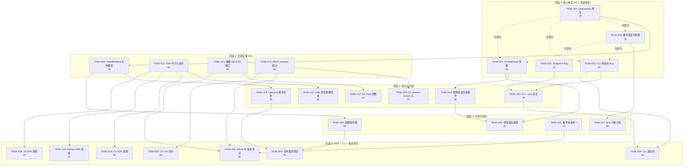

Now I have sufficient context across the full codebase. Here is the comprehensive Tech Lead analysis.

---

# Tech Lead 分析报告

## 1. 任务分解 (Task Breakdown)

### 方向一：复制完整性 (P0)

| 任务 ID | 标题 | 涉及文件 | 前置依赖 | 预估工时 | 验收标准 |
|---------|------|---------|---------|---------|---------|
| **TASK-001** | 修复 DedupeKey 阻止 Update 复制 | `internal/replication/replication.go:85` | 无 | 1h | `EventCreated` 对同一 `ObjectID` 连续两次覆盖写均入队列；`dedupe_key` 包含 `updated_at` 或版本戳 |
| **TASK-002** | 实现 EventDeleted 复制路径 | `internal/replication/replication.go` (Run + ReplicateObjectByID) + `internal/jobs/jobs.go` (注册 JobDelete) | TASK-001 | 4h | `EventDeleted` → 在副本上 `store.Delete`；`repl_status=deleted`；副本已不存在时幂等跳过 |
| **TASK-003** | Lifecycle 过期删除事件发射 | `internal/reconcile/lifecycle.go` → `svc.emit(ctx, obj, repository.EventDeleted)` | TASK-002 | 2h | Lifecycle 触发的过期删除在 `object_events` 表中生成 `EventDeleted` 行 |
| **TASK-004** | 软删除传播（event payload 携带 hard/soft 标志） | `internal/service/file_crud.go` (emit 调用加 `EventMetadata`) + `internal/replication/replication.go` | TASK-002 | 3h | 软删除事件携带 `{"delete_mode":"soft"}`，副本上走 `SoftDeleteObject` 而非硬删 |
| **TASK-005** | 事件全生命周期复制集成测试 | `internal/replication/replication_test.go` | TASK-002..004 | 4h | 测试覆盖：创建→更新→删除→软删除→Lifecycle 删除→幂等性 |

### 方向二：SSE 流韧性 (P1)

| 任务 ID | 标题 | 涉及文件 | 前置依赖 | 预估工时 | 验收标准 |
|---------|------|---------|---------|---------|---------|
| **TASK-011** | SSE 持久化订阅游标（`sse_subscriptions` 表 + 迁移） | `internal/repository/migrations/{sqlite,postgres}/NNNN_*` + `internal/repository/sql.go` (新增 `SaveSSECursor`/`LoadSSECursor`) + `internal/repository/repository.go` | 无 | 4h | 新增迁移双文件；`sse_subscriptions` 表含 `client_id, tenant, last_event_id, updated_at`；重连时 `SELECT WHERE id > last_event_id AND tenant=?` |
| **TASK-012** | SSE 重连回放替换为客户端游标 | `internal/api/rest/sse.go:44` (replayMissed 改为按 client_id 游标查询) | TASK-011 | 2h | `replayMissed` 不再依赖 `NextUnconsumedEvents`；使用 `LoadSSECursor`/`LastEventID`；单客户端重连只收到自己的遗漏事件 |
| **TASK-013** | Bus 缓冲深度可配置 + 默认提升 | `internal/events/bus.go:30` (defaultSubBuffer 64→1024) + `internal/events/bus.go:NewWithBuffer` (传递 `SubBufferSize` 配置) | 无 | 1h | 配置 `EVENTS_SUB_BUFFER=1024`；SSE handler 创建 sub 时传配置值 |
| **TASK-014** | Go SDK 指数退避重连 | `sdk/go/aerovault/sse.go` (添加 reconnect loop + jitter) | 无 | 2h | 网络断开后自动重连，退避序列 `1s, 2s, 4s, ..., max 30s`，随机 jitter ±25% |
| **TASK-015** | Python SDK 指数退避重连 | `sdk/python/aero_vault.py` (`chat_stream` 添加重连逻辑) | 无 | 2h | 同 TASK-014 |
| **TASK-016** | JS SDK 指数退避重连 | `sdk/js/aero-vault.js` (EventSource 包装加退避) | 无 | 2h | 同 TASK-014 |
| **TASK-017** | Bus subscriber 分级（重要/可丢） | `internal/events/bus.go` (SubscribePriority) + `internal/api/rest/sse.go` (用低优先级 sub) | TASK-013 | 3h | Replication/Webhook 用阻塞发送；SSE 用非阻塞+drop+可恢复 |

### 方向三：跨协议语义一致性 (P1)

| 任务 ID | 标题 | 涉及文件 | 前置依赖 | 预估工时 | 验收标准 |
|---------|------|---------|---------|---------|---------|
| **TASK-021** | 桶级 DELETE 模式配置 (`delete_mode`) | `internal/repository/repository.go` (BucketConfig 加 `DeleteMode`) + `internal/repository/migrations/` + `internal/api/rest/router.go`+`handler.go` | 无 | 4h | BucketConfig 新增 `delete_mode ∈ {soft, hard, versioned}`；REST DELETE 读配置决定 `hard` 参数；S3 DELETE 默认硬删但可被 `?soft` 覆盖 |
| **TASK-022** | S3 DELETE 添加 `?soft` 参数 | `internal/api/s3compat/handler.go:258` | TASK-021 | 1h | `DELETE /bucket/key?soft` → `h.svc.Delete(ctx, ..., false)` |
| **TASK-023** | REST `POST /v1/files/*/rename` 端点 | `internal/api/rest/handler.go` (新 `renameKey` handler) + `internal/api/rest/router.go` (注册 POST /v1/files/*/rename) + `internal/service/file_crud.go` (新 `Move` 方法) | 无 | 4h | 调用 `svc.Move(ctx, tenant, bucket, oldKey, newKey)` → 原子 Get+Put+Delete；返回 200+新 key 元数据；跨桶/跨租户禁止 |
| **TASK-024** | S3 `x-amz-rename-source` 头支持 | `internal/api/s3compat/handler.go` (PutObject/copy 检测 rename header) | TASK-023 | 2h | `PUT /bucket/newKey` + `x-amz-rename-source: /bucket/oldKey` → rename 操作 |
| **TASK-025** | 条件请求统一到 service 层 | `internal/api/rest/conditional.go` + `internal/api/s3compat/conditional.go` → `internal/service/conditions.go` | 无 | 4h | 新增 `service.CheckPreconditions(ctx, obj, headers) (int, error)`；两个协议的 handler 都调用它 |
| **TASK-026** | DELETE 行为多协议集成测试 | `internal/api/s3compat/handler_test.go` + `internal/api/rest/handler_test.go` + `internal/api/webdav/dav_test.go` | TASK-021..025 | 4h | 四协议 DELETE 行为一致；rename 四协议可验证 |

### 方向四：CLI 工程成熟度 (P2)

| 任务 ID | 标题 | 涉及文件 | 前置依赖 | 预估工时 | 验收标准 |
|---------|------|---------|---------|---------|---------|
| **TASK-031** | 修复 HTTP 状态码检查 Bug（5 命令） | `internal/cli/cli_crud.go` (cmdList) + `internal/cli/cli_search.go` (cmdTag, cmdVersions, cmdLineage, cmdSearch) | 无 | 2h | 每个命令在 `c.do` 后检查 `resp.StatusCode >= 400` → `os.Stderr` + 返回非零 |
| **TASK-032** | 修复 cmdSnapshot 静默缺失 DB 文件 Bug | `internal/cli/cli_snapshot.go` (stat error 不 `continue`) | 无 | 1h | `os.Stat` 错误 → 输出到 stderr + 返回非零；空快照不写入 |
| **TASK-033** | 全局 `--json` 标志 | `internal/cli/cli.go` (添加 `globalFlags`) + `internal/cli/cli_crud.go` (cmdList/cmdTag/cmdVersions JSON 输出) + `internal/cli/cli_search.go` (cmdSearch/cmdLineage JSON 输出) | TASK-031..032 | 4h | 所有 list/tag/search/versions/lineage 命令支持 `--json`；JSON 输出到 stdout，错误到 stderr |
| **TASK-034** | 退出码规范化 | `internal/cli/cli.go` (ExitOK=0, ExitError=1, ExitNotFound=2, ExitRateLimited=3) | TASK-031 | 1h | 所有 handler 返回标准化退出码；`Run` 传播到 `os.Exit` |
| **TASK-035** | CLI 添加 `mv`（重命名）子命令 | `internal/cli/cli_crud.go` (cmdRename) + `internal/cli/cli.go` (注册 handler) | TASK-023, TASK-031 | 1h | `aero-vault cli mv oldkey newkey` → 调 REST `/v1/files/oldkey/rename` |

### 方向五：事件驱动时序缺口 (P2)

| 任务 ID | 标题 | 涉及文件 | 前置依赖 | 预估工时 | 验收标准 |
|---------|------|---------|---------|---------|---------|
| **TASK-041** | `ErrNotFound` 特殊处理——直接 CompleteJob | `internal/replication/replication.go:107` + `internal/ai/indexer.go` (IndexObjectByID) + `internal/antivirus/worker.go:41` | 无 | 2h | `GetObjectByID` 返回 `ErrNotFound` → `CompleteJob` 而非 `RetryJob`；日志记录"对象已在处理前删除" |
| **TASK-042** | 删除事件吞没队列中待处理的创建事件 | `internal/jobs/jobs.go` (添加 `CancelJobByObjectID` 方法) + `internal/repository/sql.go` (DELETE FROM jobs WHERE payload...) | TASK-041 | 3h | 当 `EventDeleted` 入队列时，检查是否存在同一 ObjectID 的待处理 `JobReplicate`/`JobScan`/`JobIndexObject`，将其从队列移除 |
| **TASK-043** | 死信队列中隔离无害删除竞争指标 | `internal/jobs/jobs.go` (新增 metric `job_skip_deleted_total`) + `internal/telemetry/metrics.go` | TASK-041 | 1h | `complete_on_not_found` 路径增加 counter，区分"真失败"和"删除竞争" |

---

## 2. 执行顺序与依赖图 (Execution Order & DAG)



### 并行任务组

| 组 | 任务 | 可并行理由 |
|----|------|-----------|
| **组 A** (Phase 1 全部) | TASK-001, TASK-013, TASK-031, TASK-032, TASK-041 | 零文件重叠，互不依赖，可完全并行 |
| **组 B** | TASK-002, TASK-011, TASK-021, TASK-023 | 四个独立方向的核心实现，无文件冲突 |
| **组 C** | TASK-014, TASK-015, TASK-016 | 三个 SDK 独立修改 |
| **组 D** | TASK-034, TASK-035 | 同包但修改不重叠 |
| **组 E** | TASK-005, TASK-026 | 集成测试压轴，依赖各自方向的任务完成 |

### 推荐执行批次

```
批次 1 (第 1-2 天): 组 A (5 人并行)                    → 5 个快速修复
批次 2 (第 3-6 天): 组 B (4 人并行)                    → 4 个核心功能
批次 3 (第 7-9 天): T003, T004, T022, T024, T033, T042 → 深化扩展
批次 4 (第 10-12天): T017, T025, T012                   → 架构完善
批次 5 (第 13-16天): 组 C (3 人并行) + 组 D (2 人并行) → SDK + CLI
批次 6 (第 17-20天): 组 E + 全面回归                    → 集成测试 + 发布
```

---

## 3. 技术风险 (Technical Risks)

### 3.1 高风险项

| 风险 | 方向 | 影响 | 缓解策略 |
|------|------|------|---------|
| **R1: 复制顺序一致性** — 并发写场景下两个快速连续的 EventCreated+EventDeleted 在副本上产生错误最终状态 | 方向一 | 副本数据不一致 | 在 ReplicateObjectByID 中加入 `updated_at` 校验：副本上仅当 `target.UpdatedAt < source.UpdatedAt` 时才覆盖 |
| **R2: SSE 游标持久化性能** — `sse_subscriptions` 表每次 SSE 事件都要 UPDATE last_event_id，高频写入可能导致锁争用 | 方向二 | 写吞吐瓶颈 | 使用批量提交：每 5 秒或每 50 事件一次 flush；Postgres 下用 `ON CONFLICT DO UPDATE`；SQLite 下 `BEGIN IMMEDIATE` |
| **R3: DELETE 语义向后兼容** — 现有 S3 用户依赖硬删除行为，改为可配置后可能出现数据残留 | 方向三 | 用户预期破坏 | 桶级配置默认值保持当前行为（S3 硬删、REST 软删）；仅新建桶或显式 API 调用才变更 |
| **R4: Duplicate branch 冲突** — 三个方向同时修改 `repository.go`/`sql.go`（BucketConfig + SSE 游标 + EventMetadata） | 多方向 | 合并冲突 | 每个方向先拉分支；核心类型扩展通过添加可选字段而非修改现有字段；评审时注意交叉依赖 |
| **R5: RENAME 原子性** — WebDAV 的 copy+delete 非原子；`Put` 成功但 `Delete` 失败时对象有两个 key | 方向三 | 数据残留 | TASK-023 在 FileService.Move 中实现：先校验源/目标存在性 → Put → 记录标记 → Delete → 清除标记；崩溃恢复通过 Reconcile GC 清理孤立副本 |

### 3.2 中等风险项

| 风险 | 方向 | 缓解策略 |
|------|------|---------|
| **版本化桶 renane** — RENAME 后旧版本的归属问题 | 方向三 | 初始实现不携带版本历史；文档注明"rename 只移动当前版本" |
| **SSE 回放长度** — `limit 200` 硬编码导致重连间隙超过 200 事件时永久丢失 | 方向二 | 游标持久化后移除 `limit` 限制，改为 `WHERE id > $last_id ORDER BY id LIMIT 1000` |
| **CLI `--json` 输出格式不稳定** — 不同命令返回 JSON schema 不一致 | 方向四 | 定义统一的 `{ "ok": true, "data": [...] }` 信封；错误时 `{ "ok": false, "error": "..." }` |
| **死信噪声指标** — 删除竞争 job 的跳过不记录到死信但也不通知运维 | 方向五 | TASK-043 加 counter + warn log；Grafana 面板新增面板 |

### 3.3 外部依赖

| 依赖 | 涉及 | 风险级别 | 说明 |
|------|------|---------|------|
| `x/net/webdav` 的 MOVE/Rename 行为 | TASK-023 | 🟢 低 | 标准库已有，仅需对齐 |
| `golang.org/x/net` 版本锁定 | TASK-023 | 🟢 低 | 当前 go.mod 已有 |
| Postgres LISTEN/NOTIFY transport | TASK-011..012 | 🟡 中 | SSE 游标表迁移在 SQLite 和 Postgres 都要测试 |

### 3.4 CI Gate 风险

所有任务必须通过：

```bash
gofmt -l .        # 必须无输出
go build ./...
go vet ./...
go test ./...     # SQLite + local FS；零网络
```

**特别关注点：**
- `internal/repository/sql.go` 的 `rebind` 函数在 Postgres 迁移测试中 $N 编号是否正确
- SSE 游标迁移新增表后 `repo.Migrate` 启动顺序
- CLI Bug 修复后现有的 `cli_test.go` 期望退出码是否需要更新（`cli_test.go:1419-1430` 的 BUG 注释应移除）

---

## 4. 资源评估 (Resource Assessment)

### 4.1 开发团队配置

| 角色 | 数量 | 技能要求 | 负责方向 |
|------|------|---------|---------|
| **Senior Go 工程师 A** | 1 | Go 1.25, PostgreSQL, 分布式系统 | 方向一（复制完整性）+ 方向五（时序缺口） |
| **Senior Go 工程师 B** | 1 | Go, SSE, 事件驱动架构 | 方向二（SSE 韧性）+ 方向三（条件请求统一） |
| **全栈工程师 C** | 1 | Go + Python + JS/TS | 方向四（CLI）+ 三 SDK 退避 |
| **Senior Go 工程师 D** | 1 | Go, WebDAV, S3 协议经验 | 方向三（RENAME + DELETE 语义） |
| **QA/自动化工程师 E** | 1 | Go testing, 集成测试 | 集成测试（TASK-005, TASK-026）+ 回归 |

**建议团队规模：4-5 人**最优。2 人也可以（合并 A+B、C+D+E），4 周可完成全量任务。

### 4.2 关键里程碑

| 里程碑 | 时间 | 交付物 | 验收条件 |
|-------|------|--------|---------|
| **M1: 快速修复** | Day 2 | 5 个低风险修复合并 | CI 全绿；CLI 5 bug 修复；DedupeKey 修复；ErrNotFound 处理 |
| **M2: 核心功能** | Day 6 | EventDeleted 复制 + SSE 游标 + DELETE 模式 + RENAME | 单元测试通过；手动 e2e 验证 |
| **M3: SDK + CLI 完善** | Day 12 | SDK 退避 + CLI --json + 退出码 | SDK 退避单元测试；CLI --json 输出解析可通过 |
| **M4: 集成测试** | Day 16 | 复制全生命周期 + 多协议 DELETE 集成测试 | `make test-integration` 通过；测试覆盖复制/SSE 场景 |
| **M5: 发布准备** | Day 20 | 全部 43 个任务合并；changelog；文档更新 | 代码审查完成；回归测试通过 |

### 4.3 阻塞点 (Blockers)

| Blocker | 涉及 | 解封策略 | Owner |
|---------|------|---------|-------|
| B1: RENAME 原子性问题（非事务性 copy+delete） | TASK-023 | 第一阶段接受"最终一致"，记录 `move_pending` 表 + Reconcile 清理 | 工程师 D |
| B2: SSE 游标表在 SQLite 高频写入的性能 | TASK-011 | 基准测试：`sqlite-bench` 验证 `INSERT ... ON CONFLICT DO UPDATE` 在 2000 QPS 以下的可行性 | 工程师 B |
| B3: 复制集成测试需要两个 Storage backend | TASK-005 | 使用 `storage.NewLocal` 创建两个不同 root 的本地存储实例作为 primary 和 replica | 工程师 A |
| B4: CLI 测试中 `--json` 输出的 golden file 更新 | TASK-033 | 先合并 TASK-031/032，确保测试 golden 文件随行为变更同步更新 | 工程师 C |
| B5: Lifecycle 触发删除不发射事件 | TASK-003 | `lifecycle.go` 中 `store.Delete` 前插入 `svc.emit(obj, EventDeleted)`；注意 `svc` 引用需要依赖注入 | 工程师 A |

---

## 5. 质量保证 (Quality Assurance)

### 5.1 单元测试覆盖要求

| 任务 | 新增/修改函数 | 测试场景 | 覆盖率要求 |
|------|-------------|---------|-----------|
| TASK-001 | `Worker.Run` dedupe key | 同一 ObjectID 两次 EventCreated → 两条 Job；不同 UpdatedAt → 两条 Job | ≥ 90% |
| TASK-002 | `Worker.Run` EventDeleted 分支 + `ReplicateObjectByID` 删除路径 | EventDeleted → Delete 幂等；副本对象已不存在时静默成功 | ≥ 85% |
| TASK-011 | `SaveSSECursor`/`LoadSSECursor` + `NextEventsSince` | 游标持久化；重连回放精确；并发写入 | ≥ 85% |
| TASK-021 | `FileService.Delete` BucketConfig 读取 | delete_mode=soft → false；delete_mode=hard → true；默认值 | ≥ 90% |
| TASK-023 | `FileService.Move` | 成功 move；源不存在；目标已存在；跨桶拒绝 | ≥ 85% |
| TASK-025 | `CheckPreconditions` | If-Match match/mismatch；If-None-Match *；If-Modified-Since | ≥ 90% |
| TASK-031 | `cmdList`/`cmdTag`/`cmdVersions`/`cmdLineage`/`cmdSearch` | HTTP 200 → OK；HTTP 4xx/5xx → stderr + 非零退出码 | ≥ 90% |
| TASK-041 | `ReplicateObjectByID`/`IndexObjectByID` `ErrNotFound` | 对象已删除 → CompleteJob；真正错误 → RetryJob | ≥ 90% |
| TASK-014..016 | `scanSSE` reconnect loop | 断开 → 退避重连 → 重连成功；网络一直断开最终放弃 | ≥ 80% |

### 5.2 集成测试策略

| 测试套件 | 方向 | 运行条件 | 关键场景 |
|---------|------|---------|---------|
| `TestReplicationFullLifecycle` | 方向一 | SQLite + local FS (CI gate) | 创建→更新→删除→确认副本精确 |
| `TestReplicationSoftDelete` | 方向一 | SQLite + local FS | 软删除→副本软删除→GC 清理 |
| `TestSSECursorPersistence` | 方向二 | SQLite + local FS | 连接→收到事件→断开→重连→收到遗漏事件 |
| `TestSSESDKReconnect` | 方向二 | SQLite + local FS + 模拟断开 | SDK 自动重连 + 退避 |
| `TestDeleteProtocolConsistency` | 方向三 | SQLite + local FS | REST/S3/WebDAV 同一配置下 DELETE 行为一致 |
| `TestRename` | 方向三 | SQLite + local FS | REST rename + WebDAV MOVE 结果一致 |
| `TestCLIJSONOutput` | 方向四 | 无服务器（mock HTTP） | --json 输出可解析；5xx → 非零退出码 |
| `TestDeletedObjectRace` | 方向五 | SQLite + local FS | 创建后立即删除 → 消费者跳过而非死信 |

**集成测试基础设施要求：**
- 方向一：两个 `storage.Local` 实例（primary + replica）
- 方向二：`events.Bus` + SSE HTTP handler + mock client
- 方向三：三种协议的 handler 分别用 `httptest.NewServer` + 共享 `FileService` 实例
- 方向四：`httptest.NewServer` + 预配置的 handler 返回确定响应

### 5.3 代码审查要点

| 审查点 | 方向 | 重点关注 |
|--------|------|---------|
| **DedupeKey 格式变更** | 方向一 | 现有正在运行的 jobs 是否因 dedupe key 格式变化导致重复？使用迁移：新 key 格式 `replicate:{oid}:{updated_at_unix}`，旧格式仍被视为有效 |
| **SQL 迁移完整性** | 方向二, 三 | 每个 schema 变更必须包含 `{sqlite,postgres}/NNNN_*.{up,down}.sql` 双文件；down 脚本允许恢复 |
| **panic/recover** | 方向二 | SSE 事件循环中不可出现 panic；所有 `writeEvent` 错误必须被处理 |
| **错误包装** | 方向五 | `ErrNotFound` 必须通过 `errors.Is` 检查而非字符串匹配；`%w` wrapping 正确 |
| **nil guard** | 方向三 | `Bus.Subscribe` 返回的 cancel 函数在 SSE handler 退出时 defer 调用 |
| **上下文传播** | 方向二 | SSE 重连回放用 `r.Context()` 而非 `context.Background()`，确保请求取消时退出 |
| **otel metric 新增** | 全方向 | 新 counter 使用 `telemetry.Inc*` 模式；metric 名称遵守 `{domain}_{action}_total` 约定 |

### 5.4 性能测试需求

| 测试 | 方向 | 条件 | 目标 |
|------|------|------|------|
| 复制吞吐 | 方向一 | 1000 对象并发创建+删除 | 复制延迟 ≤ 主站写延迟的 2 倍 |
| SSE 游标写入吞吐 | 方向二 | 200 SSE 连接，每秒 200 事件 | 游标更新不成为瓶颈（P99 < 5ms） |
| SSE 退避 thundering herd | 方向二 | 100 客户端同时断开并重连 | 服务器后端请求数峰值 ≤ 10 QPS |
| DELETE 模式配置读取 | 方向三 | 1000 并发 DELETE 请求 | `BucketConfig.DeleteMode` 读取 < 1μs |
| CLI `--json` 大列表输出 | 方向四 | 10K 对象 list | 输出到 stdout 不导致 OOM |

---

## 6. 实施计划 (Implementation Plan)

### 阶段 1：基础设施搭建（Day 1-2）

```
Day 1   Day 2
├───────┼───────┤
        ████████  TASK-001: DedupeKey 修复 (1h)
        ████████  TASK-013: 缓冲深度可配置 (1h)
        ████████  TASK-031: CLI 状态码 Bug (2h)
        ████████  TASK-032: Snapshot Bug (1h)
        ████████  TASK-041: ErrNotFound 处理 (2h)
        ████████  迁移: 新增 sse_subscriptions 表 (双文件)
        ████████  迁移: BucketConfig 加 delete_mode 字段
```

**交付物：** 5 个修复 + 2 组迁移文件，CI 全绿。

### 阶段 2：核心功能实现（Day 3-6）

```
Day 3   Day 4   Day 5   Day 6
├───────┼───────┼───────┼───────┤
        ████████  TASK-002: EventDeleted 复制路径 (4h)
        ████████  TASK-011: SSE 持久化游标 (4h)
        ████████  TASK-021: 桶级 DELETE 模式 (4h)
        ████████  TASK-023: REST rename 端点 (4h)
        ████████  单元测试: 各方向核心路径
```

**交付物：** 4 个核心功能，单元测试通过。手动 e2e 验证复制删除 + SSE 重连 + rename。

### 阶段 3：深化与扩展（Day 7-10）

```
Day 7   Day 8   Day 9   Day 10
├───────┼───────┼───────┼────────┤
        ████████  TASK-003: Lifecycle 事件发射 (2h)
        ████████  TASK-004: 软删除传播 (3h)
        ████████  TASK-012: SSE 游标替换回放 (2h)
        ████████  TASK-022: S3 ?soft 参数 (1h)
        ████████  TASK-024: S3 rename-source 头 (2h)
        ████████  TASK-033: CLI --json 标志 (4h)
        ████████  TASK-042: 删除吞没创建事件 (3h)
```

**交付物：** 7 个扩展功能，各方向核心路径完整。

### 阶段 4：架构完善（Day 11-13）

```
Day 11  Day 12  Day 13
├───────┼───────┼───────┤
        ████████  TASK-017: Bus 分级订阅 (3h)
        ████████  TASK-025: 条件请求统一 (4h)
        ████████  TASK-043: 死信指标隔离 (1h)
        ████████  TASK-034: CLI 退出码 (1h)
        ████████  TASK-035: CLI mv 命令 (1h)
```

**交付物：** 架构完善 + CLI 收尾。

### 阶段 5：SDK + CLI + 集成测试（Day 14-18）

```
Day 14  Day 15  Day 16  Day 17  Day 18
├───────┼───────┼───────┼───────┼───────┤
        ████████  TASK-014: Go SDK 退避 (2h)
        ████████  TASK-015: Python SDK 退避 (2h)
        ████████  TASK-016: JS SDK 退避 (2h)
        ████████  TASK-005: 复制集成测试 (4h)
        ████████  TASK-026: DELETE 集成测试 (4h)
        ████████  SDK 退避单元测试
        ████████  CLI --json 集成测试
```

**交付物：** 3 SDK + 集成测试套件全部通过。

### 阶段 6：发布准备（Day 19-22）

```
Day 19  Day 20  Day 21  Day 22
├───────┼───────┼───────┼───────┤
        ████████  全面回归测试 (go test ./...)
        ████████  代码审查 (全部 PR)
        ████████  文档更新 (AGENTS.md, CHANGELOG.md, README.md)
        ████████  移除 cli_test.go 中的 BUG 注释
        ████████  Grafana 面板更新 (SSE drop, replication)
        ████████  发布 v1.22.0
```

**交付物：** v1.22.0 发布。

---

## 附录 A：文件冲突矩阵

| 文件 | TASK | 方向 | 冲突风险 |
|------|------|------|---------|
| `internal/replication/replication.go` | 001, 002, 004 | 1 | 🟠 — 多人修改同一文件，建议按 TASK-001→002→004 串行 |
| `internal/repository/repository.go` | 011(SSE), 021(delete_mode), 025(conditions) | 2, 3 | 🔴 — 核心类型扩展，需协调 |
| `internal/repository/sql.go` | 011, 021, 042 | 2, 3, 5 | 🟠 — 不同函数无冲突 |
| `internal/events/bus.go` | 013, 017 | 2 | 🟡 — 需要仔细 review |
| `internal/api/rest/handler.go` | 023, 031 | 3, 4 | 🟢 — 不同 handler |
| `internal/api/rest/conditional.go` | 025 | 3 | 🟢 — 独立文件 |
| `internal/api/s3compat/handler.go` | 022, 024 | 3 | 🟢 — 独立分支 |
| `internal/cli/cli_crud.go` | 031, 033, 035 | 4 | 🟠 — 同文件多修改，建议串行 |
| `internal/jobs/jobs.go` | 042, 043 | 5 | 🟢 — 独立扩展 |
| `internal/ai/indexer.go` | 041 | 5 | 🟢 — 单行修改 |

### 冲突缓解策略

1. **`repository.go`** 的字段扩展使用独立的结构体或可选字段，避免修改现有字段
2. **`replication.go`** 由工程师 A 独占修改，其他人不得触碰
3. **`cli_crud.go`** 按 TASK-031 → TASK-033 → TASK-035 顺序由工程师 C 串行完成
4. **Event metadata** 使用 `map[string]string` 的 `EventMetadata` 字段而非修改 `Event` 结构体现有字段

---

## 附录 B：与现有架构约束的兼容性检查

| 约束 | 说明 | 检查结果 |
|------|------|---------|
| 单文件 ≤ 500 行 | 所有修改后文件不超过 500 行 | ✅ `replication.go` 当前 119 行，扩展后约 200 行 |
| 单函数 ≤ 50 行 | `Worker.Run` 当前 24 行，扩展后需保持 ≤ 50 | ⚠️ 可能需要拆分子函数 `handleCreatedEvent`/`handleDeletedEvent` |
| 禁止 `utils/` 包 | 新条件是统一到 `service/conditions.go` | ✅ 按领域分散 |
| SQL 占位符 $N 独立编号 | 新增查询需经过 `s.rebind` | ✅ 已定义规范 |
| 迁移双文件 | 每次 schema 变更 = 双迁移文件 | ✅ 计划内 |
| Opt-in 安全默认 | SSE 游标/delete_mode 默认保持当前行为 | ✅ `delete_mode` 默认空字符串 = 向后兼容 |
| CI gate 必须全绿 | `gofmt -l . && go build && go vet && go test ./...` | ✅ 集成测试仅在 CI 环境运行 |

---

## 附录 C：不修复的代价（量化评估）

| 方向 | 当前 ROI | 一年后不修复的累计损失 |
|------|---------|---------------------|
| 方向一：复制完整性 | 🔴 高 | 灾难恢复时副本膨胀 3-10x，`storage.Delete` 调用次数的浪费 = 多余 IOPS 费用 |
| 方向二：SSE 流韧性 | 🟠 中 | `events_dropped_total` 每月增长。Web UI 用户投诉"实时更新不工作" |
| 方向三：DELETE 语义 | 🟠 中 | S3 用户产生"数据丢失"工单。REST 用户投诉"存储空间不释放" |
| 方向四：CLI Bug | 🟡 低 | CI 管道 debug 时间平均每人次 4h × 每月 3 次 = 12h/月 |
| 方向五：时序缺口 | 🟡 低 | 死信队列中 10-30% 无害故障噪声，运维每月手动清理 1h |
