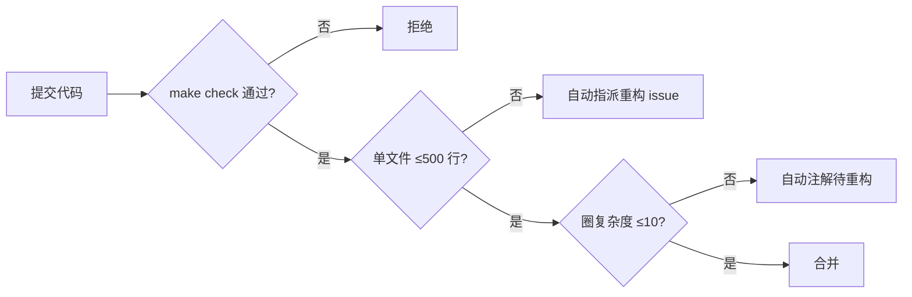

# 架构分析报告：aero-vault

> **分析输入：** 验证文档（基于代码锚点反查的五个方向安全与产品分析）
> **补充输入：** `docs/architecture.md`、`docs/configuration.md`、`go.mod`、关键包文件及行数统计
> **总代码量：** 50,665 行 Go · `cmd/server/main.go` 861 行装配

---

## 1. 架构评估

### 1.1 当前架构优势

| 维度 | 评价 | 依据 |
|------|------|------|
| **层次清晰度** | ★★★★★ | `Protocol → Middleware → Service → Storage/Repository` 四层严格分离，无交叉引用违规 |
| **抽象完整性** | ★★★★★ | `Storage` 接口 8 方法 + `Repository` 接口覆盖全 metadata 面，Factory 模式使后端可插拔 |
| **Opt-in 安全默认** | ★★★★★ | AI/pgvector/Qdrant/events/cluster/retention/WebDAV 全部默认关闭，`nil` embedder 不会崩溃 |
| **协议可扩展性** | ★★★★☆ | REST/S3/WebDAV/MCP 四协议共享一个 `FileService`，但引入了 `handler.go` 膨胀（914 行） |
| **测试策略** | ★★★★☆ | 有 contract test、integration test build tag、mock LLM，但存储后端的 contract test 覆盖不足 |

### 1.2 架构债务与技术债

按严重程度排序：

#### P0 级（安全/正确性）

| # | 问题 | 位置 | 影响 |
|---|------|------|------|
| **B1** | `_aero_` 系统命名空间可被用户注入 | `handler.go:848-866` + `s3compat/handler.go:700-718` 不过滤；`file.go:105-120` `validateMetadata` 只跳过校验但允许写入 | 用户可设置 `_aero_content_encoding:gzip` 欺骗系统在 GET 时解压，或注入其他 `_aero_` 元数据篡改系统行为 |
| **B2** | `GetRange` 在 gzip 压缩对象上 offset 语义错误 | `range.go:77-90` 调用 Get（返回解压流）后再 `io.CopyN(Discard, offset)` 在已解压流上 Discard | Range 请求返回错误字节范围 |
| **B3** | `Content-Encoding` Headers 与下发数据矛盾 | `handler.go:839-843` 设置 `Content-Encoding: gzip` 但实际下发解压后的裸数据 | 客户端（浏览器/curl）收到 gzip header 但拿到裸数据，表现为解压错误或乱码 |
| **B4** | `path.Join` 导致 `"foo/"` 与 `"foo"` 映射同一 storageKey | `file.go:143` | 目录模拟的对象丢失尾随斜杠语义，桶内 layout 模拟可能紊乱 |
| **B5** | 分段上传孤子永不回收 | `sql_uploads.go` 无 `expires_at`；`reconcile/job.go` 无 sweepUploads；Local 后端无 TTL | 未 completed/aborted 的分段上传占用存储空间且无人清理 |

#### P1 级（可维护性）

| # | 问题 | 位置 | 影响 |
|---|------|------|------|
| **B6** | `handler.go` 914 行（AGENTS.md 阈值 500） | `internal/api/rest/handler.go` | 违反工程约束，单个文件超出限制 83% |
| **B7** | `internal/api/rest/handler.go` + `admin.go`(411) + `router.go`(175) 拆分布局不均匀 | — | handler 承载混合职责（协议解析 + DTO编解码 + 部分校验），可测试性受损 |
| **B8** | EventBus 是 in-process pub/sub + 可选的 Postgres LISTEN/NOTIFY | `events/bus.go` | NOTIFY 消息大小受限（PG 默认 ~8KB），且无持久化订阅者偏移管理；丢失事件后只能全量重扫 |
| **B9** | `FileService` 是单一上帝入口 | `internal/service/file.go` + `file_crud.go` + `file_multipart.go` + `file_features.go` = 1,082 行 | 所有协议共享，任何新功能都增加事件发布、配额检查、版本控制等横切逻辑的复杂度 |
| **B10** | 审计日志 /admin/audit 无时间范围过滤 + 分页 | `router.go` 路由注册但无实现细节 | Web UI 添加 Admin tab 后需要后端配合，审计数据的用户可用性低 |

#### P2 级（架构演进限制）

| # | 问题 | 影响 |
|---|------|------|
| **B11** | 无分布式缓存层（`ai.Search` 有本地 LRU cache，但不可共享） | 多实例部署时每个实例各自缓存，AI 费用浪费且一致性无保证 |
| **B12** | 无结构化作业编排（JobPool 仅单机轮询 `jobs` 表） | 水平扩展时作业分配不均衡，无优先级、DAG 依赖、dead-letter 机制 |
| **B13** | 无统一的 key schema 验证层（`file.go:129-134` 仅 6 行） | 随协议增加，不同入口可能使用不同 key 校验逻辑 |
| **B14** | `webui` 仅 282 行纯静态 HTML，不消费 admin API | 管理面只能通过 curl/CLI 操作，用户体验断层 |

### 1.3 关键设计决策回顾

以下决策经代码验证确认合理，但在当前规模下需要重新评估：

| 决策 | 文档中的理由 | 当前评估 |
|------|-------------|---------|
| **单一二进制部署** | 降低运维复杂度 | 合理；但缺失 graceful 分片策略成为水平扩展的障碍 |
| **EventBus in-process + DB-backed** | 事件持久化 → 重启安全 | 正确决策；但跨实例仅有 Postgres NOTIFY → 应在 B8 基础上扩展 |
| **`path.Join` 作为 storageKey 生成器** | 防遍历 + 统一 key 格式 | 在目录模拟场景有副作用（B4），需引入确定性 key 规范化函数 |
| **协议适配器直连 FileService** | 保证跨协议一致性 | 正确；但 FileService 逐渐膨胀成上帝对象（B9），需按职责拆分 |
| **Opt-in 安全默认** | 最小攻击面 | 完全正确；但 `_aero_` 注入（B1）说明 opt-in 应在持久化层执行，不仅只在验证层 |

---

## 2. 扩展方向

### 方向 A：水平扩展架构 —— 从单机到集群

**为什么需要：** 当前架构设计为单实例运行（除 `RECONCILE_CLUSTER_SINGLETON` 外无任何集群原语）。生产环境中，单个实例的吞吐受限于：
- SQLite 写锁（单 writer）
- EventBus 内存广播（实例间不互通）
- JobPool 单机轮询（多实例重复执行同一条 job）
- AI Embed/Chat 串行化（无分布式作业分片）

**核心挑战：**

| 挑战 | 难度 | 缓解策略 |
|------|------|---------|
| 事件跨实例传输的 at-least-once 语义 | ★★★★★ | 引入 NATS JetStream / RabbitMQ 作为外部传输层，替换当前的 Postgres NOTIFY |
| 作业分配的去重与幂等 | ★★★★ | 每个 job 绑定 lease（已有 `leases` 表模式可复用），实例按 shard 租约竞争 |
| 元数据缓存一致性 | ★★★ | 引入 Redis 作为分布式缓存 + 失效广播取代本地 LRU |

**架构变更：**

```
现状:                               目标:
┌─────────┐                         ┌──────────┐  ┌──────────┐
│ Instance │ 单机所有子系统          │  Gateway  │  │  Gateway  │ ...
└─────────┘                         └────┬─────┘  └────┬─────┘
                                         │   round-robin / consistent hash
                                         ▼
                                   ┌─────────────────────┐
                                   │  External Message    │
                                   │  Bus (NATS/RabbitMQ) │
                                   └──┬──────┬──────┬─────┘
                          ┌───────────┤      │      ├───────────┐
                          ▼           ▼      ▼      ▼           ▼
                    ┌─────────┐  ┌─────────┐           ┌─────────┐
                    │Worker A │  │Worker B │  ...      │Worker N │
                    │(shard 0)│  │(shard 1)│           │(shard N)│
                    └─────────┘  └─────────┘           └─────────┘
```

**关键变更点：**

1. `events/bus.go` 的 `transport` 扩展为可插拔的 Stream 实现（NATS/RabbitMQ/Redis Stream）
2. `jobs/pool.go` 引入基于租约的 shard 分配
3. `storage/factory.go` 引入全局 write-through cache 层（可选 Redis）
4. `middleware/ratelimit.go` 将本地 token-bucket 替换为分布式滑动窗口

**对现有系统影响：** 低。Bus 已有 `WithTransport` 扩展点（当前支持 Postgres NOTIFY），只需增加新的 transport 实现即可。Jobs 的 `Registry` 模式天然支持多 worker。

**不引入外部消息队列的替代方案：** 使用 Postgres SKIP LOCKED + advisory lock 实现轻量级作业分配（类似当前 `leases` 表的扩展），但事件广播仍需外部组件。

---

### 方向 B：多区域主动-主动复制

**为什么需要：** 当前 `Replication` 是异步单方向（primary → replica），适用于灾备但无法支持：
- 用户就近接入（地理分布读写）
- 区域故障自动切换
- 跨区域数据一致性查询

**核心挑战：**

| 挑战 | 难度 | 说明 |
|------|------|------|
| 冲突检测与 CRDT 合并 | ★★★★★ | 同一对象在两区域同时写入时的冲突解决策略 |
| 双向复制环路避免 | ★★★★ | 区域 A 复制到 B 的事件需防止 B 再复制回 A |
| 强一致读 vs 最终一致性 | ★★★ | 根据业务需求选择，需在 API 层暴露一致性 hint |

**架构变更：**

```
Region-1                    Region-2
┌─────────────────┐        ┌─────────────────┐
│  Local DB        │        │  Local DB        │
│  Local Storage   │        │  Local Storage   │
└──────┬──────────┘        └──────┬──────────┘
       │                          │
       │  CDC Stream (e.g. Debezium / pglogical)
       │                          │
       ▼                          ▼
  ┌─────────────────────────────────────┐
  │  Conflict Resolution Service        │
  │  (LWW by timestamp / CRDT / custom) │
  └─────────────────────────────────────┘
```

**建议实施路径：**

- Phase 0：完善现有单向复制（增加复制延迟监控、健康检查、手动切换流程）
- Phase 1：引入 CDC 层（使用 Postgres logical replication 捕获变更，无需业务代码侵入）
- Phase 2：在 Repository 层增加 `version_vector` 支持冲突检测（LWW 策略对多数文件场景已足够）

**对现有系统影响：** 中。需要扩展 `Object` 结构增加 `version_vector` 或 `origin_region`，冲突处理逻辑新增在 Repository 而不是 Service。建议保持 FileService 无感知。

---

### 方向 C：AI/RAG Pipeline 专业化与分层

**为什么需要：** 当前 AI pipeline 是单线流程（extract → chunk → embed → index → search → gen），适用于通用 RAG 但无法满足：
- 不同文档类型使用不同分块策略（代码 vs PDF vs 图像 OCR）
- 多模态 RAG（图像/音频/视频的向量搜索）
- 自定义 embedding 模型按租户/桶隔离
- 检索增强生成中的可观测性（chunk 归因率、检索精度）

**核心挑战：**

| 挑战 | 难度 | 说明 |
|------|------|------|
| 分块策略路由 | ★★★ | 按文件类型/大小动态选择 chunker |
| embedding 模型多租户隔离 | ★★★★ | 不同 tenant 使用不同的 embedding endpoint/dim |
| 检索可观测性 | ★★ | 归因追踪、chunk 点击率、检索质量评分 |
| 异步 Pipeline DAG | ★★★★ | 当前是线性，需要支持 FAN-OUT（提取后同时进多路 indexer） |

**架构变更：**

```
当前线性 Pipeline:                   目标 DAG Pipeline:
Extract→Chunk→Embed→Index           Extract → ChunkRouter → [ChunkA, ChunkB] → 
                                                         ↓
                                                     EmbedRouter → [EmbedA, EmbedB]
                                                         ↓
                                                     IndexRouter → [Vector, BM25, KV]
                                                         ↓
                                                     SearchFusion → Rerank → Gen
```

**关键变更点：**

1. `ai/chunker.go` 拆分为 `ChunkerRouter`，根据文件 MIME type 或 `Content-Type` 选择策略
2. `ai/embedder.go` 支持为不同向量后端同时写入（向量 + BM25 + 全文）
3. 引入 `PipelineContext` 结构体传递 metadata（tenant、bucket、original file info）
4. `ai/indexer.go` 从事件驱动的线性处理改为 DAG 执行（可参考 `go-rod` 或自建轻量 DAG）

**对现有系统影响：** 中低。当前 `ai` 包已经模块化，主要变化在 `indexer.go` 和 `chunker.go`。建议保持兼容接口，新增策略不修改现有功能。

---

### 方向 D：管理面与运营平台

**为什么需要：** 当前 Web UI（webui 282 行）仅提供搜索/文件操作/血缘/聊天，无任何管理功能。运营人员需要：
- 租户管理（创建/配额/预算/状态变更）
- 访问密钥生命周期管理
- 作业监控与重试
- 审计日志查询与过滤
- 系统健康仪表盘（集成 OTel 指标）

**核心挑战：**

| 挑战 | 难度 | 说明 |
|------|------|------|
| 管理面 API 的 scope 隔离 | ★★★ | operator key 鉴权已有，但需要区分 readonly admin vs 可执行操作 |
| 审计数据的高效查询 | ★★★ | 当前 `audit_log` 表无复合索引，时间范围查询需要 DBA |
| UI 与后端的一致性 | ★★ | 新增 API 需要同步更新 OpenAPI 描述 + SDK |

**架构变更：**

```
现状:
┌─────────────────────────┐
│  Web UI (4 tabs)        │  ← 只调用 /v1/files/* /v1/search 等
│  search/detail/lineage/ │
│  chat                   │
└─────────────────────────┘

目标:
┌─────────────────────────────────────┐
│  Web UI (6 tabs + sidebar nav)      │
│  Files | Search | Lineage | Chat |  │
│  Admin | Monitoring                  │
│                                     │
│  Admin Tab 内:                      │
│  ┌─────────────────────────────┐    │
│  │ • Tenant Manager            │    │
│  │ • API Keys                  │    │
│  │ • Jobs Queue                │    │
│  │ • Audit Log + filtering     │    │
│  │ • Rate Limits / Budgets     │    │
│  │ • Health / Metrics          │    │
│  └─────────────────────────────┘    │
└─────────────────────────────────────┘
```

**关键变更点：**

1. `internal/webui/static/` 从单文件 282 行扩展为多文件 SPA（或按需加载的 Micro-Frontend）
2. `internal/api/rest/admin.go` 补充分页、时间范围过滤、搜索参数
3. 引入 Admin UI 与 File UI 的路由分离（`/ui/admin/*` vs `/ui/files/*` 或使用前端路由）

**对现有系统影响：** 低。Admin API 已存在（`/v1/admin/*`），只需扩展 WebUI 消费端。建议使用 `lit-html` 或 `htmx` 维持纯静态无构建步骤的架构原则。

---

### 方向 E：存储层增强 —— 分层存储与生命周期自动化

**为什么需要：** 当前只支持单一存储后端服务所有对象。大规模对象存储场景需要：
- 按访问频率自动迁移对象到低成本存储（Standard → IA → Glacier/Archive）
- 按对象大小/类型路由到不同存储后端
- 生命周期策略的自动评估与执行

**核心挑战：**

| 挑战 | 难度 | 说明 |
|------|------|------|
| 跨后端对象迁移的原子性 | ★★★★★ | 迁移过程不能丢失数据或产生不一致的 metadata |
| 分层策略的可表达性 | ★★★ | 需要 DSL 或结构化规则（类似 S3 Lifecycle + 自定义条件） |
| 存储延迟的差异性 | ★★ | 冷数据访问可能触发回迁（Glacier restore），需在 API 层暴露异步 restore 状态 |

**架构变更：**

```
当前 Storage 层:                      目标 Storage 层:
┌─────────────────────────┐          ┌──────────────────────────────────┐
│  Storage Interface       │          │  TieredStorage Interface          │
│  Put/Get/Stat/Delete     │          │  Put(storageClass) → select tier  │
│  List/Presign/Multipart  │          │  Get → auto-promote if cold       │
└────┬────────────────────┘          │  TierMigrate(src, dst)            │
     │                                │  GetStorageClass / SetStorageClass│
     │ Factory                        └──────┬───────────────────────────┘
     ▼                                        │
┌──────────┬──────────┬──────────┐             ▼                   
│ local    │ s3       │ oss/cos  │     ┌──────────────────────────────────────┐
└──────────┴──────────┴──────────┘     │  StorageRouter                        │
                                       │  route by storageClass/directive     │
                                       └──────┬──────────┬──────────┬─────────┘
                                              ▼          ▼          ▼
                                        ┌────────┐ ┌────────┐ ┌────────┐
                                        │ Tier-1 │ │ Tier-2 │ │ Tier-N │
                                        │ (SSD)  │ │ (HDD)  │ │(S3-IA) │
                                        └────────┘ └────────┘ └────────┘
```

**建议实施路径：**

- Phase 0：在当前 `storage.Storage` 接口中增加 `GetStorageClass()` 方法（向后兼容，默认返回 STANDARD）
- Phase 1：实现 `TieredStorage` 装饰器模式封装多个 backend，按 `storageClass` 路由
- Phase 2：引入 `LifecycleEvaluator` 定时任务（可复用 `RECONCILE_INTERVAL`），按规则执行迁移

**对现有系统影响：** 中。Storage 接口需要新增方法，但可通过默认实现保持向后兼容性。FileService 层面的 `PutOptions.StorageClass` 已经预留了扩展点。

---

## 3. 接口设计建议

### 3.1 当前接口设计评价

| 接口 | 评价 | 改进建议 |
|------|------|---------|
| `storage.Storage` | 高内聚、抽象完整 | 增加 `StorageClass()` 方法 + 可选的 `TierMigrate()`；`PresignGet/Put` 签名参数过多，建议引入 `PresignOptions` |
| `repository.Repository` | 职责宽泛（对象+版本+tag+ACL+events+jobs+quota+leases） | 建议拆分为子接口：`ObjectRepo`、`EventRepo`、`JobRepo`、`QuotaRepo`，然后 `type Repository = interface{ObjectRepo; EventRepo; ...}` 组合 |
| `service.EventSink` | 过于狭窄（仅 `Publish`） | 增加 `Close` + 健康检查方法 |
| `ai.Embedder` / `ai.LLM` | 当前为隐式类型（`search` 包内直接使用函数签名） | 升级为显式接口后，才能真正支持 mock 和 provider 切换 |

### 3.2 是否需要引入新抽象层

| 层 | 建议 | 理由 |
|----|------|------|
| **Cache 抽象层** | ✅ 新增 | 当前 `ai.Search` 内置 LRU（`result_cache.go`），`ai.Embedder` 有 `CachingEmbedder`，但两者均为本地实现。引入 `Cache` 接口可统一替换为 Redis/Valkey。 |
| **Quota/Budget 装饰器** | ⚠️ 可选 | 当前配额逻辑嵌在 `FileService` 内部（`file.crud.go` 内调用 `repo.GetQuota`），提取为装饰器可增加可测试性，但会增加间接层数。建议保留现状直到配额逻辑复杂化。 |
| **Event Transport 接口** | ✅ 亟需 | 当前 `Bus.WithTransport` 接受裸 `func`，无法管理生命周期、健康检查、重连。应升级为 `Transport` 接口。 |
| **Pipeline DAG 引擎** | ⚠️ 可选 | 只在 AI pipeline 发展到多路由、多阶段时引入。当前线性 pipeline 不需要。 |

### 3.3 向后兼容策略

所有接口变更应遵循以下原则：

1. **新增可选方法，不删除现有方法** —— 所有 backend 实现不受影响
2. **使用 functional options 扩展函数签名** —— `func NewBus(repo, logger, opts ...BusOption)` 替代 breaking change
3. **提供默认实现** —— 新增接口方法提供 no-op fallback
4. **版本化内部接口** —— 必要时使用 `type V2Storage interface { … }` 并让新 backend 同时实现新旧接口

---

## 4. 技术选型建议

### 4.1 当前技术栈评估

| 组件 | 当前选型 | 评估 |
|------|---------|------|
| **HTTP 路由** | `chi/v5` | ✅ 轻量、稳定，与 stdlib 高度兼容 |
| **SQL** | `modernc.org/sqlite` + `jackc/pgx/v5` | ✅ 最简依赖，迁移双文件设计优秀 |
| **OpenTelemetry** | OTEL SDK v1.43 | ✅ 行业标准，生态成熟 |
| **Prometheus** | `client_golang` | ✅ 与 OTEL exporter 集成良好 |
| **Cloud SDKs** | aws-sdk-go-v2 / oss / cos | ✅ 原生 SDK 减少适配层 |
| **AI 嵌入** | 内置 hash + HTTP (OpenAI 兼容) | ⚠️ hash 适合测试但生产需替换 |
| **跨实例通信** | Postgres LISTEN/NOTIFY | ❌ 不适合高吞吐，消息大小受限 |

### 4.2 建议引入的技术

| 技术 | 优先级 | 场景 | 替代方案 | 决策依据 |
|------|--------|------|---------|---------|
| **NATS JetStream** | P1 | 跨实例事件分发、可靠作业队列 | RabbitMQ / Redis Stream / Kafka | NATS 最轻量（6MB 二进制），Go 原生客户端完美契合单二进制部署原则 |
| **Redis / Valkey** | P1 | 分布式缓存（AI 搜索结果、embedding 缓存、速率限制） | Memcached | Caching Embedder 和 Search Cache 当前为本地 LRU，无法共享 |
| **Vite/ESBuild** (可选) | P2 | Web UI 构建工具链 | — | 仅在 Web UI 需要前端框架时引入；当前纯静态 282 行的架构风格值得保留 |
| **OpenTelemetry Collector** | P2 | 跟踪/指标聚合、多后端导出 | — | 文档中 docker-compose 已有，但本地运行未启用 |

### 4.3 自建 vs 采购决策框架

| 场景 | 建议 | 理由 |
|------|------|------|
| **事件分发** | 自建（基于 NATS），不采购 SaaS | NATS 是开源 CNCF 项目，部署和运维成本极低 |
| **AI LLM** | 客户自选（Ollama / OpenAI / Anthropic） | LLM 市场变化快，aero-vault 应只做 OpenAI 兼容代理层 |
| **病毒扫描** | 维持内置 signature + ClamAV 集成 | 内置 EICAR 检测已满足 MVP 需求 |
| **存储后端** | 仅维护 local/s3 两个核心，oss/cos 社区贡献 | 维护三个云厂商原生 SDK 的测试覆盖成本高 |

### 4.4 依赖引入标准

所有新依赖必须满足：

1. **纯 Go 实现**（无 CGO） —— 维持单二进制跨平台部署
2. **Apache 2.0 / MIT 许可证** —— 避免 GPL 传染性
3. **Go 模块依赖小于 100 个子包** —— 防止依赖爆炸
4. **测试覆盖率 ≥ 70%** —— 上游质量保证
5. **每引入一个新模块需要经过 issue 讨论** —— 防止随意添加

---

## 5. 实施路线图

### 5.1 优先级定义

| 优先级 | 定义 | 时间窗口 |
|--------|------|---------|
| **P0** | 安全漏洞或数据正确性 bug | 1-2 周内修复 |
| **P1** | 严重可维护性债务，阻碍新功能开发 | 1-2 个 Sprint |
| **P2** | 以产品价值为目标的功能扩展 | 3-6 个 Sprint |
| **P3** | 架构现代化，渐进式演进 | 持续改进 |

### 5.2 阶段划分

#### Phase 0：热修复（P0 优先执行，1-2 周）

| 任务 | 对应 B# | 工作量评估 | 风险 |
|------|---------|-----------|------|
| `_aero_` 注入防护 | B1 | 2 天 | 低 — 三处过滤点明确，存量数据需要迁移脚本 |
| `GetRange` + gzip 组合修复 | B2 | 1 天 | 低 — `range.go` 检测 gzip 后回退到无 range 的全量取+截取 |
| `Content-Encoding` header 修复 | B3 | 0.5 天 | 低 — 只返回 gzip 内容时不设 header 或标记客户端已解压 |
| 分段上传孤子回收 | B5 | 3 天 | 中 — 需要新增 `expires_at` 迁移 + Reconcile 增加 sweepUploads |
| `storageKey` 规范化（处理尾随斜杠） | B4 | 1 天 | 低 — `path.Clean` + 保留尾随 / 的策略 |

**里程碑 M0：** 上述所有 P0 修复完成，`make check` 全绿，新增测试覆盖注入攻击场景。

---

#### Phase 1：基础设施加固（P1-P2，2-4 周）

| 任务 | 对应 B# | 工作量 |
|------|---------|--------|
| `handler.go` 拆分（914→≤500 行） | B6 | 3 天 |
| Repository 子接口拆分 | — | 2 天 |
| Event Transport 接口化 + NATS 实现 | B8 | 5 天 |
| 审计日志时间范围过滤 + 分页 | B10 | 2 天 |
| `ai.Search` 本地缓存 → Redis cache 层 | — | 3 天 |

**里程碑 M1：** REST handler 拆分完成，事件系统支持外部消息队列，可部署 2+ 实例水平扩展。

---

#### Phase 2：管理与运营能力（P2，3-4 周）

| 任务 | 工作量 |
|------|--------|
| Web UI Admin tab 实现（基于现有 `/v1/admin/*` API） | 5 天 |
| 租户自助报表（用量/费用/请求统计） | 3 天 |
| Job 监控面板（Web UI + Prometheus alert integration） | 3 天 |
| AI 调用追溯与成本归因（完善 `/v1/lineage` + budget 告警） | 4 天 |

**里程碑 M2：** 全功能管理 Web UI 可用，运营人员无需 CLI 即可完成日常操作。

---

#### Phase 3：架构演进（P3，6-12 周，可并行）

| 轨道 | 任务 | 工作量 | 并行性 |
|------|------|--------|--------|
| **A** | 多实例 shard 分配（consistent hash + job lease） | 4 周 | 可独立推进 |
| **A** | 分布式 rate limiter（Redis 滑动窗口替代本地 token bucket） | 2 周 | 依赖 Redis 引入 |
| **B** | 多区域复制 CDC 层（Postgres logical replication） | 3 周 | 可独立推进 |
| **B** | 冲突检测（LWW version vector） | 3 周 | 依赖 Phase 1 的 Repository 拆分 |
| **C** | AI Pipeline DAG (多 chunker / 多 embedder) | 4 周 | 可独立推进 |
| **E** | TieredStorage 装饰器 + LifecycleEvaluator | 3 周 | 低优先级，依赖存储业务需求 |

### 5.3 风险矩阵

| 风险 | 概率 | 影响 | 缓解策略 |
|------|------|------|---------|
| SQLite 写锁在生产场景成瓶颈 | 中 | 高 | P0 修复后立即在文档中声明 Postgres 为生产推荐，SQLite 仅用于单机/开发/测试 |
| NATS 引入增加运维复杂度 | 中 | 中 | 提供 `WITHOUT_NATS=1` 编译标签运行 in-process 模式，平滑过渡 |
| AI 模型 API 价格波动影响预算控制 | 高 | 中 | Budget 使用 token 计数而非美元价格，对外暴露 token 限额而非美元 |
| 重构 `handler.go` 引入回归 | 低 | 低 | 每个拆分的 handler 保持原测试覆盖率 + 集成测试保障路由不变 |
| `_aero_` 命名空间已有存量数据 | 高 | 高（如果未做过滤直接暴露） | Phase 0 加入后，存量 `_aero_` 键在 GET 时需通过 filter 或 migration 移除 |

### 5.4 技术债务演化控制

在实施上述路线图前需建立以下机制：



此机制已部分定义在 `AGENTS.md` 中，但需要以下补充：

1. **生成 `TECH_DEBT.md`**：技术债的中央登记表，将 B1-B14 作为初始条目，每个新发现的技术债记录在案
2. **每月技术债 sprint**：每 4 个 sprint 中安排 1 个专门降低技术债
3. **债务利息计量**：每次在技术债代码区域新增功能时，在 commit message 中标记 `#debt:<B-number>`，用于追踪哪些债务区域持续产生变更成本

---

## 总结

aero-vault 的架构在 MVP 阶段做出了正确的折中选择：四层分离、单一二进制、SQLite + local FS 作为默认基线。50,665 行代码展示了良好的抽象品味。

**但架构设计从来不是一次性交付的——它需要在每个阶段重新审视。** 当规模从 MVP 向生产级发展时，P0 的五个安全/正确性问题必须优先解决，然后是有条不紊的 Phase 1 基础设施加固，最后是 Phase 2/3 的产品化扩展。

最有价值的三个架构投资按顺序是：

1. **水平扩展能力**（方向 A） —— 解锁多实例部署，是生产化的前提
2. **AI Pipeline DAG**（方向 C） —— AI/RAG 是核心差异化功能，需要支持多策略、可观测性
3. **管理面与运营平台**（方向 D） —— 开发者体验与运维效率直接决定项目采纳速度

其余方向（多区域复制、分层存储）属于高级功能，应在核心稳定性验证后再启动。
