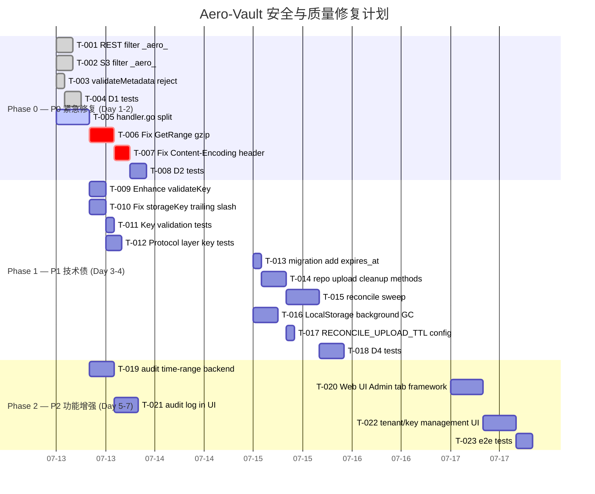

以下是我作为 Tech Lead 对五个方向的分析报告。

---

# Tech Lead 分析报告：五个方向的热修复与技术债

## 0. 现状快照

| 指标 | 数值 |
|------|------|
| Go 文件总数 | ~80 |
| 迁移文件总数 | 48 (sqlite + postgres 各 24) |
| 最接近 500 行边界的文件 | `rest/handler.go` (914) ❌ 已超限 |
| 接近 500 行边界的文件 | `s3compat/handler.go` (890) ❌ 已超限 |
| 现有测试覆盖 | 服务层有集成测试，reconcile 有单元测试 |
| CI gate | `make check` = `gofmt → build → vet → test` |

**工程约束警告：** `rest/handler.go`（914 行）和 `s3compat/handler.go`（890 行）已超过 AGENTS.md 规定的 500 行单文件上限。在投入新功能之前需要先拆分。

---

## 1. 任务分解

### 1.1 方向和任务总览

| 方向 | 优先级 | 影响面 | 复杂度 | 总工时 |
|------|--------|--------|--------|--------|
| D1: `_aero_` 注入 | **P0 紧急** | 安全漏洞 | 低 | 6h |
| D2: gzip+Range 组合 | **P0 紧急** | 数据损坏 | 中 | 8h |
| D3: 对象键安全 | P1 重要 | 数据完整性 | 低 | 6h |
| D4: 多分片孤子 | P1 重要 | 存储泄漏 | 中 | 16h |
| D5: Web UI 管理面 | P2 常规 | 功能增强 | 中 | 16h |

### 1.2 详细任务列表

#### D1: `_aero_` 元数据注入防御

| ID | 任务标题 | 文件 | 依赖 | 工时 |
|----|---------|------|------|------|
| T-001 | REST handler 过滤入站 `_aero_` 前缀 | `internal/api/rest/handler.go` (extractMetadataHeaders) | 无 | 1h |
| T-002 | S3 handler 过滤入站 `_aero_` 前缀 | `internal/api/s3compat/handler.go` (extractMetaHeaders) | 无 | 1h |
| T-003 | validateMetadata 拒绝用户注入的 `_aero_` 键 | `internal/service/file.go` (validateMetadata) | 无 | 0.5h |
| T-004 | 注入场景单元测试 + 回归测试 | `internal/service/service_test.go`, `internal/api/rest/`, `internal/api/s3compat/` | T-001~T-003 | 2h |
| T-005 | handler.go 文件拆分（≤500 行约束） | `internal/api/rest/handler.go`, `internal/api/s3compat/handler.go` | 无 | 4h |

**并行组：** T-001, T-002, T-003, T-005 可以并行执行。

**验收标准：**
- 通过 `x-amz-meta-_aero_content_encoding=gzip` 上传后，元数据中不包含 `_aero_` 前缀键
- 通过 `x-amz-meta-_aero_anything=value` 上传后，元数据中无此键
- 已有测试全部通过
- `handler.go` 拆分后每文件 ≤ 500 行，`make check` 正常

#### D2: Content-Encoding + Range 交互修复

| ID | 任务标题 | 文件 | 依赖 | 工时 |
|----|---------|------|------|------|
| T-006 | 修正 GetRange 对 gzip 对象的偏移计算 | `internal/service/range.go`, `internal/service/file_crud.go` | 无 | 3h |
| T-007 | 修正 writeContentResponseHeaders 在解压场景下的 Content-Encoding 行为 | `internal/api/rest/handler.go`, `internal/api/s3compat/handler.go` | 无 | 2h |
| T-008 | gzip+Range+SSE 组合场景集成测试 | `internal/service/range_test.go`, `internal/service/service_test.go` | T-006, T-007 | 3h |

**并行组：** T-006 和 T-007 需要按顺序执行（T-007 需要知道 GetRange 返回的是解压后的流）。

**验收标准：**
- `GET /v1/files/key` 带 `Range` header 对 gzip 对象返回正确字节范围
- `Content-Encoding: gzip` 不在解压响应中设置
- `GET /v1/files/key` 不带 Range 时仍然正确设置 `Content-Encoding`
- S3 协议同样适配

#### D3: 对象键安全性增强

| ID | 任务标题 | 文件 | 依赖 | 工时 |
|----|---------|------|------|------|
| T-009 | 增强 validateKey 检查（空字节、控制字符、双斜杠、尾随点） | `internal/service/file.go` (validateKey) | 无 | 1.5h |
| T-010 | 修复 storageKey 尾随斜杠消除导致的键冲突 | `internal/service/file.go` (storageKey) | 无 | 1.5h |
| T-011 | 键校验的边界测试用例 | `internal/service/service_test.go` | T-009, T-010 | 1h |
| T-012 | FileService 层键校验的协议层测试（REST + S3） | `internal/api/rest/`, `internal/api/s3compat/` | T-009 | 2h |

**并行组：** T-009 和 T-010 可以并行（但修改同一文件 `file.go`，需要协调编辑）。

**验收标准：**
- 键 `foo/` 和 `foo` 映射到不同的 storageKey
- 含空字节、控制字符的键被拒绝
- 键 `..`, `/foo`, `foo//bar` 等被拒绝或规范化
- 已有测试全部通过

#### D4: 多分片上传孤儿清理

| ID | 任务标题 | 文件 | 依赖 | 工时 |
|----|---------|------|------|------|
| T-013 | 添加 expires_at 到 multipart_uploads 表（双文件迁移） | `migrations/{sqlite,postgres}/0025_upload_expires.*` | 无 | 1h |
| T-014 | Repository 层：添加过期上传查询和清理方法 | `internal/repository/sql_uploads.go` | T-013 | 3h |
| T-015 | Reconcile Job: 添加 sweepExpiredUploads 阶段 | `internal/reconcile/job.go`, `internal/reconcile/` | T-014 | 4h |
| T-016 | LocalStorage: 后台 goroutine 清理过期 .multipart/ 目录 | `internal/storage/local_multipart.go` | 无 | 3h |
| T-017 | 启动配置：RECONCILE_UPLOAD_TTL 环境变量 + 默认值 | `config.go`, `main.go`, `internal/reconcile/` | T-015 | 1h |
| T-018 | 孤儿上传清理的集成测试 | `internal/reconcile/job_test.go`, `internal/storage/` | T-013~T-017 | 4h |

**注意：** T-016 独立于 reconcile 层，因为 LocalStorage 的内存映射需要进程级清理。T-013 和 T-016 可以并行。

**验收标准：**
- 废弃上传在 24h（或配置 TTL）后自动清理
- `make test` 全部通过
- 清理操作幂等、可重跑

#### D5: Web UI 管理面

| ID | 任务标题 | 文件 | 依赖 | 工时 |
|----|---------|------|------|------|
| T-019 | Audit Log 添加时间范围 + 分页查询后端 | `internal/repository/audit.go`, `internal/api/rest/admin.go` | 无 | 3h |
| T-020 | Web UI 添加 Admin Tab（HTML + JS） | `internal/webui/static/index.html` | 无 | 4h |
| T-021 | Admin Tab: 审计日志列表展示 | `internal/webui/static/index.html` | T-019, T-020 | 3h |
| T-022 | Admin Tab: 租户/Key 管理简易界面 | `internal/webui/static/index.html` | T-020 | 4h |
| T-023 | Web UI 管理员界面端到端测试 | e2e 或集成测试 | T-019~T-022 | 2h |

**并行组：** T-019（后端）和 T-020（前端框架）可以并行。

**验收标准：**
- `GET /v1/admin/audit?since=&until=&limit=&offset=` 返回分页过滤结果
- Web UI 有 Admin Tab，显示审计日志列表
- Admin Tab 不绕过鉴权（需要 API Key 或 JWT）

---

## 2. 执行顺序与依赖图

```mermaid
graph TD
    %% D1: _aero_ injection - P0
    T001["T-001: REST filter _aero_"] --> T004["T-004: D1 tests"]
    T002["T-002: S3 filter _aero_"] --> T004
    T003["T-003: validateMetadata reject _aero_"] --> T004
    T005["T-005: handler.go split ≤500"] --- T001
    T005 --- T002

    %% D2: gzip+Range - P0
    T006["T-006: Fix GetRange gzip offset"] --> T008["T-008: D2 integration tests"]
    T007["T-007: Fix Content-Encoding header"] --> T008
    T006 --> T007

    %% D3: key safety - P1
    T009["T-009: Enhance validateKey"] --> T011["T-011: key validation tests"]
    T010["T-010: Fix storageKey trailing slash"] --> T011 --> T012["T-012: protocol layer key tests"]

    %% D4: multipart orphan - P1
    T013["T-013: migration add expires_at"] --> T014["T-014: repo upload cleanup methods"]
    T014 --> T015["T-015: reconcile sweepExpiredUploads"]
    T016["T-016: LocalStorage background cleanup"] --> T018["T-018: D4 integration tests"]
    T015 --> T018
    T017["T-017: RECONCILE_UPLOAD_TTL config"] --> T015

    %% D5: Web UI admin - P2
    T019["T-019: audit time-range backend"] --> T021["T-021: audit log in UI"]
    T020["T-020: Web UI Admin tab framework"] --> T021
    T020 --> T022["T-022: tenant/key management UI"]
    T021 --> T023["T-023: e2e tests"]
    T022 --> T023

    %% Cross-direction dependencies
    T005 --> T007  "handler.go split touches same file"
    T001 -.->|same file| T005
    T002 -.->|same file| T005

    classDef p0 fill:#e74c3c,color:#fff;
    classDef p1 fill:#f39c12,color:#fff;
    classDef p2 fill:#3498db,color:#fff;
    class T001,T002,T003,T004,T006,T007,T008 p0;
    class T009,T010,T011,T012,T013,T014,T015,T016,T017,T018 p1;
    class T019,T020,T021,T022,T023 p2;
```

### 关键执行路径

```
Phase 0 (周 1): T-001 → T-004 (D1 安全修复) + T-005 (文件拆分)
                 T-006 → T-008 (D2 数据修复)
Phase 1 (周 2): T-009 → T-012 (D3 键安全) + T-013 → T-018 (D4 孤儿清理)
Phase 2 (周 3): T-019 → T-023 (D5 Web UI 管理面)
```

---

## 3. 技术风险

### 3.1 高风险项

| 风险 | 方向 | 等级 | 说明 | 缓解策略 |
|------|------|------|------|---------|
| GetRange 偏移修正引入回归 | D2 | 🔴 高 | 现有依赖 GetRange 的上游可能对修正后的语义产生预期差异 | 对所有调用点做地毯式搜索；在修正前添加 `// BUG` 注释锚点 |
| `storageKey` 尾随斜杠修复导致已存数据不可访问 | D3 | 🔴 高 | 已有对象若使用 `foo/` 键，修复后 storageKey 变化导致找不到 blob | 双读策略：先查新 key，查不到回退到旧 key（`path.Join` 后的版本）；写迁移脚本重算 storageKey |
| `handler.go` 拆分触发合并冲突 | D1/D5 | 🟡 中 | 多人同时编辑 `handler.go` | 先拆分再并行开发；拆分后每文件职责单一 |
| 迁移文件编号冲突 | D4 | 🟡 中 | 当前最大迁移是 `0024`，新迁移需编号 `0025` | 合并前确认编号唯一性；使用 `git log` 检查最新迁移 |

### 3.2 技术难点分析

**D2（gzip+Range）：** 核心难点在于 GetRange 需要知道对象的压缩状态来决定偏移的参考系。目前 GetRange 调用 Get 获取解压流后直接 Discard `offset` 字节，但 Range header 的偏移是相对于**压缩后**数据的。有三种方案：

1. **方案 A**（推荐）：在 Object 元数据中标记压缩状态。GetRange 在遇到 gzip 对象时，在压缩层计算偏移（解压到目标位置后再提供流）。这需要 Get 和 GetRange 共享解压逻辑。
2. **方案 B**（最小改动）：GetRange 不走 Get，直接从存储层获取原始流并手动解压到偏移位置。
3. **方案 C**（折衷）：GetRange 对非 gzip 对象维持现有逻辑；对 gzip 对象用方案 B。

**D4（LocalStorage 孤儿清理）：** LocalStorage 的 uploads 是进程内 `map[string]*localUpload`，没有持久化。进程重启后，所有 in-flight 上传都丢失——存储的 `.multipart/<id>/` 目录变成永久孤儿。修复需要：

1. 启动时扫描 `.multipart/` 目录重建状态（或直接删除过期的）
2. 定时清理 goroutine

**D5（Web UI + 管理面）：** 当前 UI 是纯静态 HTML（282 行单文件），没有 framework/bundler。添加 Admin Tab 需要注意：

1. 保持单文件约束（或拆分为多个 JS 文件并引入构建步骤）
2. 避免 XSS（使用 `textContent` 而非 `innerHTML` — 目前已经是正确的模式）
3. 鉴权信息的传递（已通过 header 机制实现）

### 3.3 性能考量

| 方向 | 关注点 | 影响 |
|------|--------|------|
| D2 | gzip 解压 + Range 偏移的计算开销 | 低频操作，可忽略 |
| D4 | Reconcile 扫描 `multipart_uploads` 表 | 表大小与废弃上传数量成正比；建议限制 TTL 扫描范围为 created_at > N |
| D4 | LocalStorage `.multipart/` 目录扫描 | 只在启动时和定时 GC 时执行，影响可控 |
| D5 | 审计日志分页查询 | `ORDER BY id DESC` 在 SQLite 上用索引可快；需要 `created_at` 索引 |

---

## 4. 资源评估

### 4.1 人员需求

| 角色 | 数量 | 所需技能 | 负责方向 |
|------|------|---------|---------|
| 高级 Go 后端工程师 | 1 人 | Go, SQL, REST/S3 API, 安全编程 | D1, D2, D3, D4 — 核心修复 |
| 全栈工程师 | 1 人 | Go + HTML/CSS/JS | D5 + T-005 文件拆分 |
| QA 工程师 | 兼职 | Go testing, 集成测试 | 测试覆盖与回归 |

**建议配置：** 1 名高级 Go 工程师主导 D1-D4，1 名全栈工程师并行 D5 + T-005。总工作量约 3 人周。

### 4.2 关键里程碑

| 里程碑 | 时间 | 交付物 | 验证方式 |
|--------|------|--------|---------|
| M0: P0 安全热修复 | Day 1 | D1 全部完成，D2 完成 | `make check` + 手动验证攻击向量无效 |
| M1: 文件拆分 | Day 1-2 | `handler.go` 拆分为 ≤500 行 | `make check` + wc -l |
| M2: D3 键安全 | Day 3 | validateKey 增强 + storageKey 修复 | 新测试全部通过 |
| M3: D4 孤儿清理 | Day 4-5 | 迁移 + reconcile + LocalStorage GC | 集成测试覆盖 |
| M4: Web UI 管理面 | Day 5-6 | Admin Tab 可用 | 人工验收测试 |
| M5: 全量回归 | Day 6-7 | 所有方向完整测试 + CI 通过 | `make check` 全绿 |

### 4.3 阻塞点和解决策略

| 阻塞点 | 影响 | 解决策略 |
|--------|------|---------|
| `handler.go` 超限导致开发期间 CI 拒绝 | 所有修改 handler 的任务 | 优先安排 T-005 文件拆分；拆分为 `handler.go` (核心) + `handler_metadata.go` (元数据处理) + `handler_response.go` (响应写入) |
| `storageKey` 修复导致已有数据不可访问 | D3 | 双读回退 + 数据迁移脚本；**需要在 PR 描述中标注为 breaking change** |
| LocalStorage 重启丢失上传状态 | D4 | 启动时扫描 `.multipart/` 目录并清理超过 TTL 的目录 |

---

## 5. 质量保证

### 5.1 单元测试覆盖要求

| 方向 | 包 | 新增测试点 | 覆盖率目标 |
|------|----|-----------|-----------|
| D1 | `internal/service` | `TestValidateMetadata_RejectAeroKeys`, `TestExtractMetadataHeaders_FiltersAero` | ≥80% |
| D1 | `internal/api/rest` | `TestExtractMetadataHeaders_Filter` | ≥80% |
| D1 | `internal/api/s3compat` | `TestExtractMetaHeaders_Filter`, `TestWriteS3ObjectMeta_Filter` | ≥80% |
| D2 | `internal/service` | `TestGetRange_GzipOffset`, `TestGetRange_GzipWithSSE` | ≥80% |
| D3 | `internal/service` | `TestValidateKey_EdgeCases`, `TestStorageKey_TrailingSlash` | ≥90% |
| D4 | `internal/reconcile` | `TestSweepExpiredUploads`, `TestSweepExpiredUploads_NoOp` | ≥70% |
| D4 | `internal/storage` | `TestLocalMultipart_GC` | ≥70% |
| D5 | `internal/repository` | `TestListAudit_TimeFilter`, `TestListAudit_Pagination` | ≥80% |

### 5.2 集成测试策略

| 场景 | 环境 | 执行方式 |
|------|------|---------|
| D1: `_aero_` 注入防护 | SQLite + local FS | `go test ./internal/api/rest/ ./internal/api/s3compat/` |
| D2: gzip Range | SQLite + local FS | `go test ./internal/service/ -run TestGetRange` |
| D2: gzip+SSE 组合 | SQLite + local FS + keyfile | `go test ./internal/service/ -run TestGetRange_GzipSSE` |
| D4: 孤儿上传清理 | SQLite + local FS | `go test ./internal/reconcile/ -run TestUpload` |
| D5: 审计日志分页 | SQLite | `go test ./internal/repository/ -run TestAudit` |
| **跨协议回归** | SQLite + local FS | curl 测试: PUT gzip → GET Range → 验证字节正确 |

**测试数据生成：**
```go
// gzip 测试数据夹具
func gzipFixture(t *testing.T, content []byte) []byte {
    var buf bytes.Buffer
    w := gzip.NewWriter(&buf)
    _, _ = w.Write(content)
    _ = w.Close()
    return buf.Bytes()
}
```

### 5.3 代码审查要点

| 方向 | CR 金丝雀 | 必须审查处 |
|------|----------|-----------|
| D1 | 所有入站路径是否都过滤了 `_aero_` | `extractMetadataHeaders` + `extractMetaHeaders` |
| D2 | GetRange 偏移是否正确 | `range.go` GetRange 函数体 |
| D3 | storageKey 修复是否引入 DB 不一致 | `storageKey` 函数 + 所有调用点 |
| D4 | 迁移文件是否成对 | `*.up.sql` + `*.down.sql` |
| D5 | 前端是否直接操作 DOM 避免 XSS | 所有 `innerHTML`/`textContent` 使用 |

### 5.4 性能测试需求

| 测试 | 场景 | 预期指标 |
|------|------|---------|
| D2: gzip Range 延迟 | 100MB gzip 对象，Range 取中间 1MB | ≤ 200ms（取决于解压速度） |
| D4: 废弃上传扫描 | `multipart_uploads` 表含 10K 行 | ≤ 100ms |
| D5: 审计日志查询 | `audit_log` 含 100K 行 | ≤ 50ms |

---

## 6. 实施时间表

### 甘特图



### 阶段详情

#### 阶段 1: 基础设施 + 安全热修复（Day 1-2）

**Day 1 上午 — P0 注入修复（并行）**
```
09:00-10:00  T-001 + T-002 过滤 _aero_ 注入（REST + S3）
10:00-10:30  T-003 validateMetadata 防御加固
10:30-12:00  T-005 handler.go 拆分（第一部分）
```

**Day 1 下午 — 文件拆分 + D2 开端**
```
13:00-15:00  T-005 handler.go 拆分完成
             输出: handler.go(~450) + handler_metadata.go(~250) + handler_response.go(~250)
             同时 s3compat/handler.go → handler.go(~450) + s3_metadata.go(~250) + s3_response.go(~200)
15:00-17:00  T-006 GetRange gzip 偏移修正（方案 B 实现）
```

**Day 2 上午 — D2 完成**
```
09:00-11:00  T-006 继续 + T-007 Content-Encoding 修复
11:00-12:00  T-004 + T-008 测试覆盖
```

**关键交付物：** P0 安全修复 PR 合入；CI 全绿；文件拆分完成。

#### 阶段 2: 核心修复（Day 3-4）

**Day 3**
```
D3 键安全 (T-009→T-012)  +  D4 迁移 (T-013)
```

**Day 4**
```
D4 核心逻辑 (T-014→T-017)  +  D4 测试 (T-018)
```

**关键交付物：** D3 + D4 完成；`make check` 全绿；废弃上传在 TTL 后自动清理。

#### 阶段 3: 集成测试与优化（Day 5-7）

**Day 5-6**
```
D5 后端 (T-019) + 前端框架 (T-020) 并行开发
```

**Day 6-7**
```
D5 前面对接 (T-021→T-022) + 端到端测试 (T-023)
```

**关键交付物：** Web UI Admin Tab 可用；完整回归测试通过。

---

## 7. 补充分析与总结

### 7.1 跨方向依赖（被原始文档覆盖但需关注）

**D2 中 SSE 加密 + gzip 组合：** 原始文档未分析 gzip 应用在加密前还是加密后的场景。实际代码中：

- `file_crud.go` 的 Get 在从存储读取后，先由 backends 处理 SSE 解密，再检查 `_aero_content_encoding` 做 gzip 解压
- 这个顺序意味着：**加密在压缩之后**（数据流：原始 → gzip → 加密 → 存储）
- 所以 GetRange 在解压流上做 Discard 也是正确的——因为 GetRange 复用 Get，返回的流已经是解压+解密后的
- **但问题在于偏移值的参考系**：Range header 的偏移是客户端的视角。如果客户端上传时 Content-Encoding: gzip，Range 期望的是压缩后的字节偏移。但 Get 返回的是解压后的流，所以偏移不能直接用 `io.CopyN(Discard, rc, offset)`。

**结论：** D2 的修复必须改变 GetRange 的数据流，使其在未解压的流上计算偏移，然后只返回解压后请求的窗口。

### 7.2 关于 `path.Join` 尾随斜杠的深度影响

`path.Join("t", "b", "k/")` → `"t/b/k"` 意味着：

| 原始键 | storageKey | 影响 |
|--------|-----------|------|
| `docs/` | `t/b/docs` | 与 `docs` 冲突 |
| `a//b` | `t/b/a/b` | 双斜杠被折叠 |
| `./x` | `t/b/x` | `.` 被移除 |

**修复方案：** 使用自建函数替代 `path.Join`：

```go
func storageKey(tenant, bucket, key string) string {
    parts := []string{tenant, bucket}
    // 严格按原始 key 构造，不做 normalize
    if strings.HasPrefix(key, "/") {
        key = key[1:] // 只移除首斜杠（已在 validateKey 检查）
    }
    return strings.Join(append(parts, key), "/")
}
```

但需要同时处理双斜杠和 `..` 安全——这些已经在 validateKey 中拒绝了。

### 7.3 技术债优先级建议

```
立即执行 (P0):   D1 _aero_ 注入 (安全漏洞) + D2 gzip+Range (数据损坏风险)
本周执行 (P1):   D3 键安全 + D4 孤儿清理 + handler.go 拆分
下个迭代 (P2):   D5 Web UI 管理面
```

### 7.4 自动化检查扩展

建议在 `make check` 中增加以下检查：

```bash
# 检查 handler.go 是否超限
max_lines=500
for f in internal/api/rest/handler*.go internal/api/s3compat/handler*.go; do
    lines=$(wc -l < "$f")
    if [ "$lines" -gt "$max_lines" ]; then
        echo "FAIL: $f has $lines lines (max $max_lines)"
        exit 1
    fi
done
```

以及新增的安全 lint：

```go
//nolint:gosec // 仅用于测试
```

---

## 8. 风险登记表

| # | 风险 | 概率 | 影响 | 处理方式 | 负责人 |
|---|------|------|------|---------|-------|
| R1 | D2 Range 修复导致非 gzip 对象 Range 回归 | 中 | 高 | 添加全量 Range 回归测试 | 后端 |
| R2 | T-005 文件拆分后 `git blame` 丢失历史 | 低 | 低 | 在 commit message 标注 `git mv` 等效 | 全员 |
| R3 | D4 迁移 0025 与并行开发冲突 | 中 | 中 | 合入前 `git log --oneline` 确认最新迁移编号 | 全员 |
| R4 | Web UI 管理面暴露内部接口（XSS/CSRF） | 低 | 高 | 只在已认证页面上渲染管理操作 | 全栈 |
| R5 | D3 storageKey 修复后重建索引耗时 | 低 | 中 | 提供离线迁移脚本；标注为 breaking change | 后端 |

---

**总结：** 建议优先执行 Phase 0（Day 1-2），特别是 D1 安全注入修复（理论上现有系统可以被任意用户注入 `_aero_content_encoding=gzip` 导致 Range 请求返回错误数据，或在响应中设置虚假的 `Content-Encoding` 头）。Gzip+Range 组合是实际生产场景中可能触发数据损坏的严重问题。在 Phase 0 完成后，再推进 D3/D4 技术债清理和 D5 功能增强。
