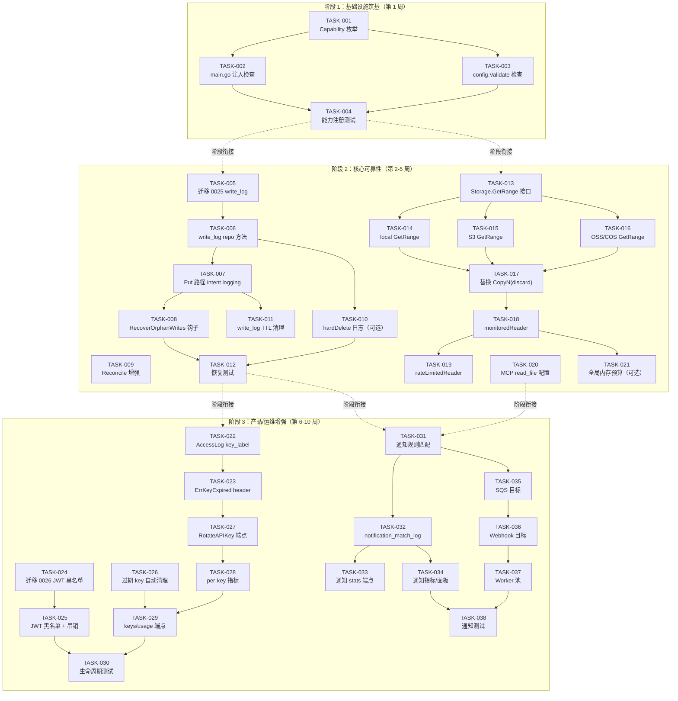

现在我已掌握了完整的背景知识。以下是我的技术主管分析：

---

# 技术负责人分析：v1.22 扩展 — 五个生产就绪度方向

## 1. 任务分解

以下将五个方向拆分为可执行的任务。每个任务需 2-4 小时完成，且附带可验证的验收标准。

### 方向三：DB 驱动特性不对称（Phase 1 — 基础设施筑基）

| 任务 ID | 标题 | 涉及文件 | 前置依赖 | 工时 | 验收标准 |
|---------|------|---------|---------|------|---------|
| **TASK-001** | 定义 `Capability` 枚举 + `DriverCapabilities()` + `CheckCapability()` | `internal/repository/capability.go`（新文件） | 无 | 2h | `DriverCapabilities("postgres")` 返回 4 个能力；`DriverCapabilities("sqlite")` 返回空切片；`CheckCapability("sqlite", CapEventTransport)` 返回 `false` |
| **TASK-002** | 在 Postgres-only 功能入口注入 capability 检查 | `cmd/server/main.go`（`setupPostgresTransport`、`setupAI` 等调用处） | TASK-001 | 2h | SQLite + `events.transport=postgres` 启动时打印 `WARN: postgres event transport requires postgres driver; disabling`；pgvector/pgfts 同样打印警告 |
| **TASK-003** | 在 `config.Validate()` 中添加特性/驱动兼容性检查 | `internal/config/config.go` | TASK-001 | 2h | `Validate()` 阶段提前检测不兼容配置组合，输出统一格式的警告信息 |
| **TASK-004** | 单元测试 + 集成测试：能力注册表 + 启动警告 | `internal/repository/capability_test.go`（新文件） | TASK-001~003 | 2h | 覆盖所有 4 种能力、所有 2 种驱动、配置校验路径、启动警告日志捕获 |

### 方向一：服务层双写事务完整性（Phase 2 — 数据一致性防线）

| 任务 ID | 标题 | 涉及文件 | 前置依赖 | 工时 | 验收标准 |
|---------|------|---------|---------|------|---------|
| **TASK-005** | 创建迁移 0025：`write_log` 表（双文件对） | `internal/repository/migrations/{postgres,sqlite}/0025_write_log.{up,down}.sql` | 无 | 2h | `migrate up` 后表存在（`id, tenant_id, bucket, key, storage_key, state, created_at, updated_at`）；`migrate down` 后表消失 |
| **TASK-006** | 实现 Repository 层：`InsertWriteLog` / `UpdateWriteLog` / `ListStaleWriteLogs` / `DeleteOldWriteLogs` | `internal/repository/sql_write_log.go`（新文件）+ `internal/repository/repository.go`（接口） | TASK-005 | 3h | `InsertWriteLog` 返回 `logID`；`UpdateWriteLog(logID, "done")` 更新状态和时间戳；`ListStaleWriteLogs(5min)` 返回超过 5 分钟且状态为 `writing` 的日志；`DeleteOldWriteLogs(24h)` 删除旧行 |
| **TASK-007** | `Put` 路径接入 intent logging + 失败时回滚 | `internal/service/file_crud.go` | TASK-006 | 4h | `Put` 成功路径：Insert → store.Put → writePutObject → Update(done)；失败路径：Update(rollback) + store.Delete 回滚 blob；`InsertWriteLog` 失败时降级到当前无日志行为 |
| **TASK-008** | 实现 `RecoverOrphanWrites` 启动钩子 | `internal/service/write_log_recovery.go`（新文件）+ `cmd/server/main.go`（启动调用） | TASK-007 | 3h | 启动时扫描 `writing` 状态 >5min 的日志；检查元数据是否存在——存在则标记 `done`，不存在则 `store.Delete` blob + 标记 `rollback`；返回清理计数 |
| **TASK-009** | 增强 `Reconcile.sweepOrphans` 优先使用 `write_log` | `internal/service/reconcile.go` | TASK-006 | 2h | `sweepOrphans` 首先处理 `write_log state=rollback` 的 storage_key，减少全表扫描窗口 |
| **TASK-010** | 为 `hardDeleteObject` 添加 delete-log（可选 Phase 2） | `internal/service/file_crud.go` + `sql_write_log.go`（新增 `InsertDeleteLog`） | TASK-006 | 3h | `hardDeleteObject` 每步记录状态：`insert(delete intent)` → `update(store_deleted)` → `update(metadata_deleted)` → `update(done)`；blob 已删但元数据失败时标记为 `dangling` |
| **TASK-011** | `write_log` TTL 清理 Reconcile 任务 | `internal/service/reconcile.go` | TASK-006 | 2h | Reconcile 周期中清理 24h 之前的 `done`/`rollback` 行；可在 `RECONCILE_WRITE_LOG_TTL` 配置 |
| **TASK-012** | 写日志恢复的单元 + 集成测试 | `internal/service/write_log_recovery_test.go`（新文件） | TASK-007~008 | 4h | 覆盖：正常路径、`InsertWriteLog` 失败降级、`store.Put` 成功后 `writePutObject` 失败回滚、启动恢复时元数据已存在 vs 不存在两种情况、hardDelete 部分失败日志追踪 |

### 方向四：流式路径内存压力管理（Phase 2 — 与 D1 并行）

| 任务 ID | 标题 | 涉及文件 | 前置依赖 | 工时 | 验收标准 |
|---------|------|---------|---------|------|---------|
| **TASK-013** | Storage 接口增加 `GetRange` 方法 | `internal/storage/storage.go` | 无 | 1h | 接口定义：`GetRange(ctx, key, offset, length int64) (io.ReadCloser, ObjectInfo, error)`；所有现有后端编译通过 |
| **TASK-014** | 实现 local 后端 `GetRange`（`file.Seek` + `io.LimitReader`） | `internal/storage/local.go` | TASK-013 | 2h | 读取 1GB 文件 offset=500MB length=100KB 时，只读入 ~100KB 数据（零浪费）；seek 到文件末尾后返回 `io.EOF` |
| **TASK-015** | 实现 S3 后端 `GetRange`（`Range` header） | `internal/storage/s3.go` | TASK-013 | 2h | HTTP Range 请求发送 `bytes=offset-offset+length-1`；服务端只返回请求范围的数据 |
| **TASK-016** | 实现 OSS/COS 后端 `GetRange` | `internal/storage/oss.go` + `internal/storage/cos.go` | TASK-013 | 2h | 与 S3 模式一致，使用各 SDK 的 Range 参数 |
| **TASK-017** | 用 `GetRange` 替换 `io.CopyN(io.Discard, rc, offset)` | `internal/service/range.go` | TASK-014~016 | 2h | `GetRange` 路径不再有 `CopyN(discard)`；遗留后端不支持 `GetRange` 时优雅降级到原逻辑 |
| **TASK-018** | 添加 `monitoredReader` 包装 + OTel 指标 | `internal/service/stream.go`（新文件） | 无 | 3h | 装饰 `io.ReadCloser`：每 `STREAM_METRIC_INTERVAL_BYTES`（默认 1MB）记录 `stream_bytes_total{operation,tenant}` 指标 |
| **TASK-019** | 添加 `rateLimitedReader` 包装 + 配置选项 | `internal/service/stream.go` + `internal/config/config.go` | TASK-018 | 2h | `STREAM_READ_RATE_LIMIT` 配置 >0 时激活；`Read()` 调用按限速器节流；burst 可配置 |
| **TASK-020** | MCP `read_file` 支持可配置限制 + 截断通知 | `internal/mcp/server.go` + `internal/config/config.go` | 无 | 2h | `MCP_READ_MAX_BYTES` 配置（默认 4MB）；截断时消息中包含 `truncated: true, actual_size: N` 字段 |
| **TASK-021** | 全局流式内存预算 + admission control（可选 Phase 3） | `internal/service/stream.go` + `internal/middleware/middleware.go` | TASK-018 | 4h | `STREAM_MAX_GLOBAL_BYTES` 配置（默认 0=off）；新读取请求检查 `streamingBytes + size <= max`；超过时 `Retry-After: 503` |

### 方向五：认证凭据生命周期管理（Phase 3）

| 任务 ID | 标题 | 涉及文件 | 前置依赖 | 工时 | 验收标准 |
|---------|------|---------|---------|------|---------|
| **TASK-022** | AccessLog 记录 `key_label` / `key_hash` | `internal/middleware/middleware.go` + `internal/auth/auth.go`（context 注入） | 无 | 2h | 认证后在 context 中设置 `key_label`、`key_hash`；AccessLog 输出包含这两个字段 |
| **TASK-023** | `ErrKeyExpired` + `X-Aero-Key-Expired` 响应头 | `internal/auth/auth.go` + `internal/auth/errors.go`（新文件） | 无 | 2h | 过期 key 认证失败返回 `401` + `X-Aero-Key-Expired: true` + 响应体中 `code: "key_expired"` |
| **TASK-024** | 创建 JWT 黑名单表（迁移 0026） | `internal/repository/migrations/{postgres,sqlite}/0026_jwt_blacklist.{up,down}.sql` | 无 | 2h | 表结构：`jti TEXT PRIMARY KEY`、`revoked_at`、`expires_at`（与 JWT 的 `exp` 一致） |
| **TASK-025** | JWT 黑名单检查 + 吊销端点 | `internal/auth/auth.go` + `internal/api/rest/admin.go`（`RevokeJWT`） | TASK-024 | 3h | JWT 认证路径检查黑名单（缓存优先）；`POST /v1/admin/jwt/revoke` 吊销指定 `jti`；返回 `204 No Content` |
| **TASK-026** | 过期 key 自动清理 Reconcile 任务 | `internal/service/reconcile.go` + `internal/repository/apikeys.go`（`DeleteExpiredKeys`） | 无 | 2h | Reconcile 周期中删除 `api_keys` 表中 `expires_at < now()` 的行；记录清理计数到 OTel |
| **TASK-027** | `RotateAPIKey` 端点实现 | `internal/api/rest/admin.go` + `internal/auth/store.go` | 无 | 3h | `POST /v1/admin/keys/{hash}/rotate`：生成新 key + 设置旧 key 宽限期 + 返回新旧 key 信息；`replacement_delay_minutes` 参数控制宽限期 |
| **TASK-028** | 每密钥请求计数 Prometheus 指标 | `internal/middleware/middleware.go`（`key_requests_total{key_hash,label}`） | TASK-022 | 2h | 认证中间件中按 `key_hash` 和 `label` 递增计数器；过期 key 的请求单独统计 |
| **TASK-029** | `GET /v1/admin/keys/usage` 端点 | `internal/api/rest/admin.go` + `internal/repository/apikeys.go`（`ListKeysWithUsage`） | TASK-028 | 2h | 返回密钥使用率数据：`label, requests_30d, last_used, status(active/inactive/expired)` |
| **TASK-030** | JWT 黑名单 + key 轮换的全面测试 | `internal/auth/jwt_blacklist_test.go`（新文件）+ `internal/api/rest/admin_test.go`（扩展） | TASK-025,027 | 4h | 覆盖：黑名单检查、吊销 + 恢复、key 轮换宽限期、宽限期后过期、并发轮换、未授权访问 |

### 方向二：桶通知运行时缺口（Phase 3 — 与 D5 并行）

| 任务 ID | 标题 | 涉及文件 | 前置依赖 | 工时 | 验收标准 |
|---------|------|---------|---------|------|---------|
| **TASK-031** | `Bus.Publish` 添加规则匹配（诊断模式） | `internal/events/bus.go` | 无 | 3h | `Publish` 中按事件 `Bucket` 读取 `notification_rules`；匹配 `event.type` 到规则模式；记录匹配结果日志；不匹配时不改变现有广播行为 |
| **TASK-032** | 创建 `notification_match_log` 表 + 插入逻辑 | `internal/repository/migrations/0027_notification_match_log.{up,down}.sql` + `internal/repository/sql_notifications.go`（新文件） | TASK-031 | 3h | 表：`id, rule_id, event_id, bucket, event_type, matched_at`；匹配命中时异步插入；`NOTIF_MATCH_LOG_ENABLED` 配置开关 |
| **TASK-033** | `GET /v1/admin/notifications/stats` 端点 | `internal/api/rest/admin.go` + `internal/repository/sql_notifications.go` | TASK-032 | 2h | 返回：`{total_events, matched_count, top_rules: [{rule_id, count}]}`；支持 `days` 查询参数 |
| **TASK-034** | 通知路由 Prometheus 指标 + Grafana 面板 | `internal/events/metrics.go`（新文件）+ `deploy/grafana/dashboard.json` | TASK-031 | 2h | 指标：`notif_events_total{rule_id,matched}`、`notif_delivery_seconds`、`notif_delivery_total{status}` |
| **TASK-035** | 实现 SQS 通知目标（Phase 2） | `internal/events/notif_target_sqs.go`（新文件） | TASK-031 | 3h | `SQSNotificationTarget`：通过 AWS SDK `SendMessage` 投递；Queue URL 从 ARN 解析；失败重试（指数退避） |
| **TASK-036** | 实现 Webhook 通知目标（Phase 2） | `internal/events/notif_target_webhook.go`（新文件） | TASK-031 | 2h | `WebhookNotificationTarget`：HTTP POST JSON envelope；签名（可选 HMAC）；失败 → `webhook_failures` 表 |
| **TASK-037** | 通知 worker 池 + 配置 | `internal/config/config.go` + `internal/events/notif_worker.go`（新文件） | TASK-035~036 | 3h | `NOTIF_WORKERS=4` 默认；独立 goroutine 池避免消费者饿死；池满时降级+日志 |
| **TASK-038** | 通知匹配 + 投递的单元/集成测试 | `internal/events/bus_test.go`（扩展） | TASK-031~037 | 4h | 覆盖：规则匹配（精确、通配符 `*`、`s3:ObjectCreated:*`）、无规则时不改变行为、SQS 投递 mock、Webhook 投递 mock、worker 池负载测试 |

---

## 2. 执行顺序

### 依赖图



### 并行执行组

| 并行组 | 任务 | 负责人数建议 |
|--------|------|------------|
| **组 A（Phase 1）** | TASK-001~004 | 1 人（全栈） |
| **组 B（Phase 2 — D1）** | TASK-005~012 | 1-2 人（DB + Service） |
| **组 C（Phase 2 — D4）** | TASK-013~021 | 1-2 人（Storage + Service） |
| **组 D（Phase 3 — D5）** | TASK-022~030 | 1 人（Auth + Admin API） |
| **组 E（Phase 3 — D2）** | TASK-031~038 | 1 人（Events + API） |

**B 和 C 完全并行**；D 和 E 完全并行。

---

## 3. 技术风险

### 高影响风险

| # | 风险 | 影响方向 | 概率 | 影响 | 缓解措施 |
|---|------|---------|------|------|---------|
| **R1** | `write_log` 本身成为写入路径的瓶颈 / 热点 | D1 | 低 | **高**：每个 `Put` 多 1-2 次 DB 写入 | TASK-007 中 `InsertWriteLog` 失败时降级到无日志模式（log fallback）；`write_log` 表无 FK、无索引竞争（仅 PK）；批量标记 `done` 可用 goroutine 异步 |
| **R2** | S3 `GetRange` 的 Range header 与压缩/加密结合时的语义模糊 | D4 | 中 | 中 | `GetRange` 操作压缩前的字节（如 S3 不透明处理）；文档明确标注 Range 作用于存储层字节而非逻辑内容；gzip 对象由 `FileService` 层解压后 Range |
| **R3** | JWT 黑名单在多副本间的同步延迟 | D5 | 中 | **高**：撤销后短期内仍可能被接受 | 利用已有 `PostgresTransport`（LISTEN/NOTIFY）实现 JWT 黑名单变更广播；本地缓存 TTL 默认 30s；服务端接受窗口 ≤ cache TTL |
| **R4** | 通知投递链路上的失败导致事件丢失 | D2 | 中 | 中 | Phase 1 仅诊断不投递——零丢失风险；Phase 2 SQS/Webhook 投递失败写 `notification_failures` 表 + Prometheus 告警；最终一致性保证 |
| **R5** | `GetRange` 接口可能导致现有 Storage 后端编译不通过 | D4 | 低 | 中 | Go 接口是静态契约——新增方法要求所有实现更新；可在 interface 中用 `GetRange(ctx, key, offset, length int64) (io.ReadCloser, ObjectInfo, error)` 并给未实现的后端返回 `ErrNotSupported` |

### 低影响但需关注

| # | 风险 | 缓解 |
|---|------|------|
| R6 | TASK-019 `rateLimitedReader` 在慢客户端上导致连接 hang | `Read()` 阻塞在 `limiter.Wait()` 时配合 `context.Context` 取消；Go 1.20+ `rate.Wait(ctx)` 支持 context |
| R7 | TASK-021 全局内存预算在 GC 压力下不准 | `runtime.ReadMemStats` 是快照，非实时；使用 `debug.SetMemoryLimit` 做软上限 + 自定义 admission controller 做准入 |
| R8 | SQLite `ListStaleWriteLogs` 无索引导致全表扫描 | 在 `created_at` 上加索引；SQLite 下 `write_log` 行数受 TTL 限制（24h），小型部署中无性能问题 |
| R9 | 通知规则 `eventMatchesPattern` 的通配符语义 | `s3:ObjectCreated:*` 匹配所有创建事件；`*` 匹配所有事件；显式列表（`["s3:ObjectCreated:Put","s3:ObjectCreated:Copy"]`）精确匹配 |

### 测试覆盖难点

| 难点 | 方向 | 策略 |
|------|------|------|
| crash = `store.Put` 后、`writePutObject` 前进程终止 | D1 | 无法真正模拟 crash。用单元测试模拟 `Put` 成功后 `writePutObject` 返回 error → 验证 `store.Delete` 被调用 + `write_log` 标记为 `rollback` |
| 启动恢复时检测元数据是否存在 | D1 | Mock `repo.GetObject` 返回 `(found=true)` / `(ErrNotFound)` 两种情况 |
| S3 `GetRange` 的 HTTP Range 行为验证 | D4 | 集成测试中启动真实 S3 兼容服务器（minio）验证 Range 返回的字节范围 |
| 并发 JWT 黑名单检查 | D5 | `go test -race` + 多个 goroutine 同时检查 + 1 个 goroutine 插入黑名单 |
| 通知规则匹配的时间序列 | D2 | 使用 `clocktest`（模拟时钟）验证规则匹配的时间相关行为 |

---

## 4. 资源评估

### 人员构成

| 角色 | 技能要求 | 人数 | 负责方向 |
|------|---------|------|---------|
| **中级 Go 后端（A）** | Go、SQL（SQLite+Postgres）、测试 | 1 | Phase 1（DB Capability）+ Phase 2 D1（write_log） |
| **中级 Go 后端（B）** | Go、存储系统（S3/local）、流处理 | 1 | Phase 2 D4（GetRange + 流控） |
| **中级 Go 后端（C）** | Go、认证（JWT/API key）、安全 | 1 | Phase 3 D5（凭据生命周期） |
| **中级 Go 后端（D）** | Go、事件驱动、AWS SDK（SQS/Lambda） | 1 | Phase 3 D2（通知路由） |

**实际建议：** 2 人团队（A+B 角色合一部分）可在 8 周内完成全部 Phase 1~3；3 人团队（A+B 单独，C+D 合并）可在 6 周内完成。

### 关键里程碑

| 里程碑 | 时间点 | 交付物 | 验证方式 |
|--------|-------|--------|---------|
| **M1** — DB Capability 完成 | 第 1 周末 | TASK-001~004 全部完成 + CI 全绿 | `go test ./internal/repository/... -run Capability` |
| **M2** — write_log 可运行 | 第 3 周末 | TASK-005~009 完成 + 启动恢复 + Reconcile 增强 | `make check` + 手动测试：启动 + Put 文件 + kill + 重启 + 验证 orphan 被清理 |
| **M3** — GetRange 全线完成 | 第 4 周末 | TASK-013~018 完成 + local/S3 验证 | `go test ./internal/storage/... -run Range` + S3 集成测试 |
| **M4** — JWT 黑名单 + key 轮换可用 | 第 6 周末 | TASK-022~027 完成 + 管理 API 增强 | API 测试：签发 JWT → 吊销 → 验证 401 |
| **M5** — 通知诊断可用 | 第 8 周末 | TASK-031~034 完成 + 诊断模式上线 | 创建通知规则 → PUT 文件 → 查看 stats 端点 |
| **M6** — 全部完成 | 第 10 周末 | 所有 38 个任务 + `make check` + `go test ./...` | 全量 CI gate + 集成测试 |

### 阻塞点与解决策略

| 阻塞点 | 涉及 | 策略 |
|--------|------|------|
| AWS SQS/Lambda SDK 依赖引入 | D2 TASK-035~036 | Phase 1 诊断模式不使用 AWS SDK，完全规避；引入 SDK 前需论证依赖必要性（参照 I6：`Stdlib 优先`）；可先用 HTTP 客户端手动实现 SQS API |
| 跨副本 JWT 黑名单同步 | D5 TASK-025 | 重用已有的 `PostgresTransport`（LISTEN/NOTIFY）基础设施；SQLite 部署无跨副本场景，本地缓存即可 |
| `Storage` 接口向后兼容性 | D4 TASK-013 | 新增方法不影响现有代码编译；各后端逐个实现；未实现时 `GetRange` 返回 `ErrNotSupported`，调用方降级到原 `CopyN(discard)` 路径 |

---

## 5. 质量保证

### 单元测试覆盖要求

| 方向 | 最低覆盖率 | 关键被测函数 | 测试方法 |
|------|-----------|-------------|---------|
| D3 — Capability | **95%** | `DriverCapabilities`、`CheckCapability`、`Validate` 兼容性检查 | 表驱动测试 + 所有驱动/能力组合 |
| D1 — write_log | **85%** | `InsertWriteLog`、`ListStaleWriteLogs`、`RecoverOrphanWrites`、Put rollback | Mock `store` + `repo`；模拟 `Put` 成功后 error |
| D4 — GetRange | **90%** | `GetRange`（所有后端）、`monitoredReader.Read`、`rateLimitedReader.Read` | temp dir local；minio S3；`iotest` 包 |
| D5 — Credential | **85%** | JWT blacklist check、`RotateAPIKey`、expiry check、AccessLog key 注入 | Mock `Store`；`httptest` handler 测试 |
| D2 — Notification | **80%** | `eventMatchesPattern`、规则读取、诊断匹配 | Mock `Bus.Publish`；模拟所有事件类型 |

### 集成测试策略

| 测试套件 | 运行方式 | 覆盖范围 |
|---------|---------|---------|
| `go test ./...`（CI gate） | 每次提交 | SQLite + local FS；零网络；零 Docker |
| `make test-integration` | CI 按需 | Postgres + pgvector（Docker）；`write_log` 恢复 |
| `make test-integration-qdrant` | CI 按需 | Qdrant（Docker）；通知匹配日志 |
| S3 Range 测试 | 手动 / nightly | `STORAGE_BACKEND=s3` + minio Docker |

**特定于本次扩展的集成测试要求：**

1. **D1**：Postgres 下的 `write_log` 并发写入测试（`go test -race -count=10`）验证无死锁
2. **D4**：minio S3 后端 `GetRange` 验证返回的字节范围与 `[offset, offset+length)` 完全匹配
3. **D5**：JWT 黑名单在多 goroutine 下的正确性（`-race`）
4. **D2**：通知规则匹配的 `go test -fuzz=FuzzEventMatchPattern` 模糊测试

### 代码审查要点

| 方向 | 审查重点 | 常见陷阱 |
|------|---------|---------|
| **D3** | `capability.go` 是否遗漏任何 Postgres-only 功能；`main.go` 检查点是否覆盖所有入口 | 新 Postgres-only 功能上线时忘记注册 capability |
| **D1** | `InsertWriteLog` 失败降级路径是否真的非阻塞（不 return error）；`RecoverOrphanWrites` 是否幂等 | 状态机遗漏 `writing→rollback→done` 转换；启动恢复时误删还在写入中的 blob |
| **D4** | `GetRange` 在各后端实现的 `io.ReadCloser` 是否正确关闭；offset+length 越界行为 | `length=-1`（直到 EOF）未处理；后端不支持 Range 时的降级路径未测试 |
| **D5** | JWT 黑名单的热路径性能（每次认证都查 DB？）；key 轮换的宽限期计算是否正确 | `RotateAPIKey` 宽限期过后未自动失效旧 key；JWT 黑名单缓存未同步 |
| **D2** | `eventMatchesPattern` 通配符匹配的边界（空 slice、`*`、`s3:ObjectCreated:*` vs `s3:ObjectCreated:Put`）；规则缓存刷新机制 | 不匹配规则时意外阻塞事件发布路径 |

### 性能测试需求

| 场景 | 负载 | 指标 | 目标 |
|------|------|------|------|
| `write_log` 写入路径 | 1000 req/s Put（每个 10KB） | P99 延迟、DB 写入 QPS | 延迟增加 < 5%（与基线无日志模式对比） |
| `GetRange` local + S3 | 100 concurrent GET, offset=500MB length=1MB | 内存使用、IO 带宽 | 内存消耗降低 ≥ 90%（对比 `CopyN(discard, 500MB)`） |
| JWT 黑名单检查 | 10000 req/s JWT auth | P99 延迟 | 缓存命中时延迟增加 < 1ms；miss 时 < 5ms |
| 通知规则匹配 | 5000 event/s | 匹配吞吐、CPU | 不阻塞 `Publish` 路径；匹配延迟 < 1ms |

---

## 6. 实施计划

### 时间线（3 人团队：A+B+C 角色）

```
周次      | 1 | 2 | 3 | 4 | 5 | 6 | 7 | 8 | 9 | 10|
里程碑    |M1 |   |M2 |M3 |   |M4 |   |M5 |   |M6 |
-----------|---|---|---|---|---|---|---|---|---|---|
Phase 1:   |███|   |   |   |   |   |   |   |   |   |
 D3 Cap    |AAA|   |   |   |   |   |   |   |   |   |
Phase 2:   |   |███|███|███|   |   |   |   |   |   |
 D1 write  |   |BBB|BBB|BBB|   |   |   |   |   |   |
 D4 Stream |   |CCC|CCC|CCC|   |   |   |   |   |   |
Phase 3:   |   |   |   |   |███|███|███|███|███|   |
 D5 Cred   |   |   |   |   |BBB|BBB|BBB|   |   |   |
 D2 Notif  |   |   |   |   |   |CCC|CCC|CCC|CCC|   |
Buffer     |   |   |   |   |   |   |   |   |   |███|
```

**图例：** `A/B/C` = 开发者角色；`███` = 主动开发；`   ` = 空闲或等待

### 详细周计划

#### 第 1 周 — DB Capability 注册（仅 A 开发者）

| 天 | 工作内容 | 产出 |
|---|---------|------|
| 周一 | TASK-001：`capability.go` 枚举 + 函数 | PR #1：`repository.Capability` 类型 + `DriverCapabilities()` + `CheckCapability()` |
| 周二 | TASK-002：`main.go` 注入检查点 | PR #2：3 个 Postgres-only 功能的启动检查 |
| 周三 | TASK-003：`config.Validate()` 兼容性检查 | PR #3：配置校验逻辑 |
| 周四 | TASK-004：测试 | PR #4：单元 + 集成测试 |
| 周五 | 代码审查 + 修复 + 文档更新 | 全部合并；`docs/configuration.md` 更新 Capability 矩阵 |

**Phase 1 完成标记：** `make check` 全绿；SQLite + `events.transport=postgres` 启动打印清晰警告。

#### 第 2-4 周 — write_log + GetRange 并行（B + C 开发者）

**开发者 B（D1 — write_log）：**

| 周 | 工作内容 |
|---|---------|
| W2 | TASK-005（迁移 0025）+ TASK-006（repo 方法） |
| W3 | TASK-007（Put 路径接入）+ TASK-008（启动恢复） |
| W4 | TASK-009（Reconcile 增强）+ TASK-011（TTL 清理）+ TASK-012（测试） |

**开发者 C（D4 — GetRange + 流控）：**

| 周 | 工作内容 |
|---|---------|
| W2 | TASK-013（接口）+ TASK-014（local）+ TASK-015（S3）+ TASK-016（OSS/COS） |
| W3 | TASK-017（替换 CopyN）+ TASK-018（monitoredReader） |
| W4 | TASK-019（rateLimitedReader）+ TASK-020（MCP 配置）+ TASK-021 设计评审 |

**里程碑 M2（第 3 周末）：** write_log 可运行，启动恢复通过手动测试。
**里程碑 M3（第 4 周末）：** GetRange 全线可用，`CopyN(discard, 1GB)` 场景不再存在。

#### 第 5-8 周 — 凭据生命周期 + 通知诊断并行（B + C 开发者）

**开发者 B（D5 — 凭据）：**

| 周 | 工作内容 |
|---|---------|
| W5 | TASK-022（AccessLog key）+ TASK-023（ErrKeyExpired） |
| W6 | TASK-024（迁移 0026）+ TASK-025（JWT 黑名单）+ TASK-026（过期 key 清理） |
| W7 | TASK-027（RotateAPIKey）+ TASK-028（per-key 指标） |
| W8 | TASK-029（keys/usage 端点）+ TASK-030（测试） |

**开发者 C（D2 — 通知诊断）：**

| 周 | 工作内容 |
|---|---------|
| W5 | TASK-031（规则匹配）+ TASK-032（匹配日志表） |
| W6 | TASK-033（stats 端点）+ TASK-034（指标） |
| W7 | TASK-035（SQS 目标）+ TASK-036（Webhook 目标） |
| W8 | TASK-037（worker 池）+ TASK-038（测试） |

**里程碑 M4（第 6 周末）：** JWT 黑名单 + key 轮换可用。
**里程碑 M5（第 8 周末）：** 通知诊断模式上线，stats 端点可用。

#### 第 9-10 周 — 缓冲 + 集成 + 发布

| 周 | 工作内容 |
|---|---------|
| W9 | 性能测试 + 问题修复 + 文档完善 |
| W10 | 全量集成测试 + `make check` + 发布审核 + 发布说明 |

**里程碑 M6（第 10 周末）：** 全部完成并发布。

---

## 7. 建议执行顺序总结

```
优先级 方向              理由                         建议投入
─────── ──────────────── ──────────────────────────── ────────
  P0    方向三 (DB Cap)  无外部依赖，低复杂度，高杠杆   1 周
  P0    方向一 (write_log) 数据一致性核心防线           2-3 周 (与 D4 并行)
  P0    方向四 (GetRange) 运行时稳定性核心防线           2-3 周 (与 D1 并行)
  P1    方向五 (Credential) 安全运维增强                 2-3 周
  P1    方向二 (Notification) 产品完整度补充             2-3 周
```

**关键建议：**
1. 方向三必须先做——它是后续所有方向的基础设施（让启动时"fail loud"而非沉默失败）
2. 方向一和四完全正交，必须并行执行以最大化 throughput
3. 方向五和二的 Phase 1（诊断模式）可在无外部依赖的情况下独立交付，降低风险
4. 方向二的 Phase 2（SQS 投递）需要 AWS SDK 依赖论证（受 I6 约束）——建议推迟到 v1.23 或通过 webhook-only 模式替代
