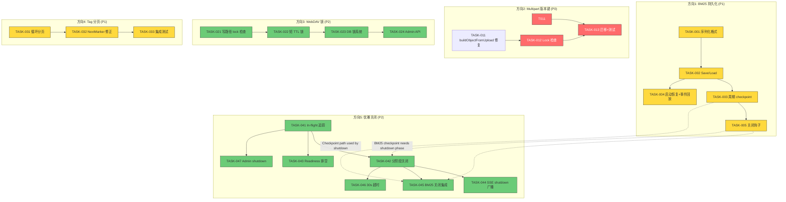
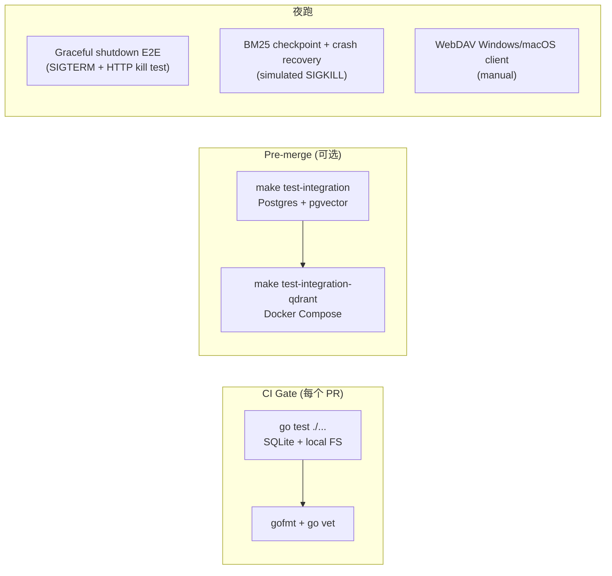
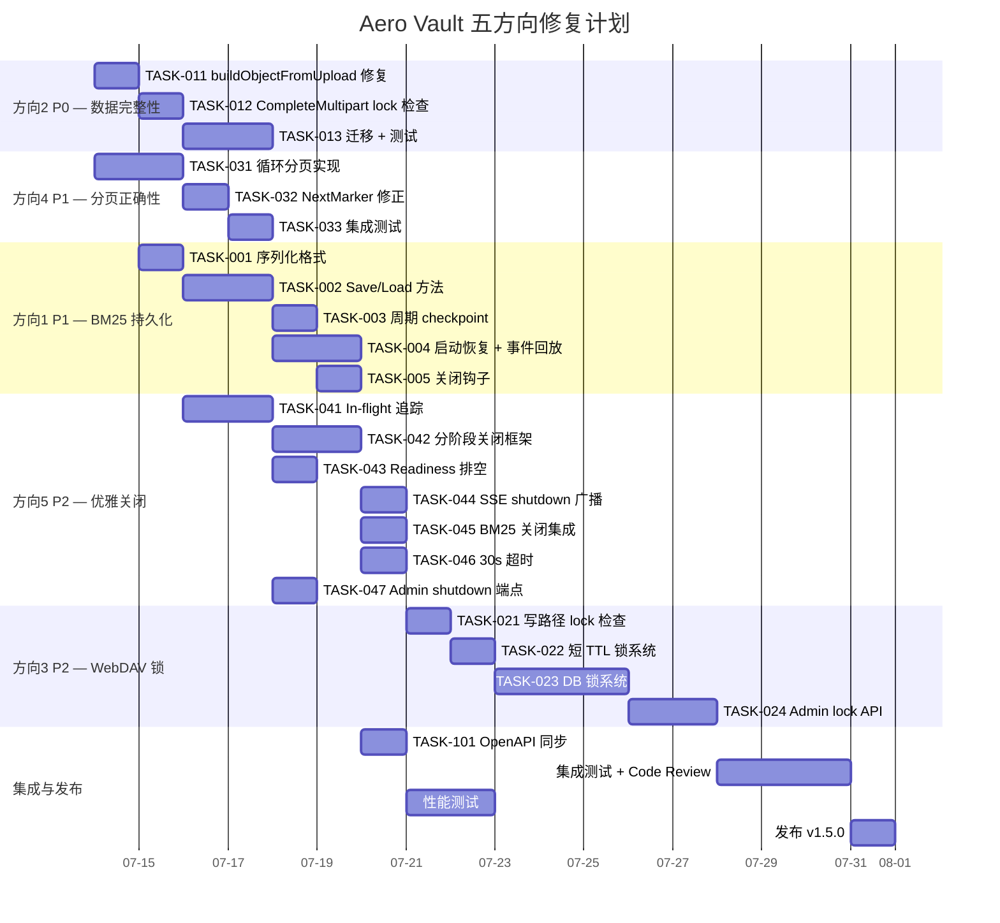
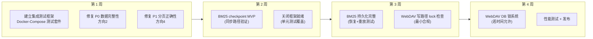

现在我对代码库有了足够的了解。下面是我的 Tech Lead 分析。

---

# Tech Lead 架构分析报告

## 1. 任务分解：23 个可执行单元

| 任务 ID | 任务标题 | 方向 | 涉及文件 | 前置依赖 | 工时(h) |
|---------|---------|------|---------|---------|---------|
| **TASK-001** | BM25 序列化格式定义 | 1 | `internal/ai/bm25.go` | 无 | 2 |
| **TASK-002** | BM25 `Save` / `Load` 方法 | 1 | `internal/ai/bm25.go`, `internal/ai/bm25_test.go` | TASK-001 | 3 |
| **TASK-003** | BM25 周期 checkpoint goroutine | 1 | `cmd/server/main.go`, `config.go` | TASK-002 | 2 |
| **TASK-004** | BM25 启动恢复 + 事件回放 | 1 | `internal/ai/bm25.go`, `cmd/server/main.go` | TASK-002 | 4 |
| **TASK-005** | BM25 checkpoint 关闭钩子 | 1 | `cmd/server/main.go` | TASK-003 | 2 |
| **TASK-011** | `buildObjectFromUpload` 修复 version ID | 2 | `internal/service/file_multipart.go` | 无 | 2 |
| **TASK-012** | `CompleteMultipart` lock 检查 | 2 | `internal/service/file_multipart.go` | TASK-011 | 2 |
| **TASK-013** | Multipart 版本键迁移 + 测试 | 2 | `internal/repository/sql_uploads.go`, `internal/repository/repository.go` | TASK-011 | 3 |
| **TASK-021** | WebDAV 写路径添加 lock + legal hold 检查 | 3 | `internal/api/webdav/dav.go` | 无 | 2 |
| **TASK-022** | 短 TTL 内存锁系统 | 3 | `internal/api/webdav/dav.go` | TASK-021 | 2 |
| **TASK-023** | `webdav_locks` 表 + DB 锁系统 | 3 | `internal/repository/`, migration 文件 | TASK-022 | 5 |
| **TASK-024** | WebDAV 锁 admin 可见性 API | 3 | `internal/api/rest/admin.go` | TASK-023 | 3 |
| **TASK-031** | `ListObjectsByTag` 循环分页实现 | 4 | `internal/repository/sql_objects.go` | 无 | 3 |
| **TASK-032** | `NextMarker` 修正为原始 ListObjects marker | 4 | `internal/repository/sql_objects.go` | TASK-031 | 2 |
| **TASK-033** | Tag 分页集成测试 | 4 | `internal/repository/sql_tags_acl_test.go` | TASK-032 | 2 |
| **TASK-041** | In-flight 请求追踪 (ConnContext + WaitGroup) | 5 | `cmd/server/main.go` | 无 | 3 |
| **TASK-042** | 分阶段关闭框架实现 | 5 | `cmd/server/main.go`, `internal/events/bus.go` | TASK-041 | 4 |
| **TASK-043** | Readiness 排空 (readyz → 503) | 5 | `cmd/server/main.go`, `internal/api/rest/router.go` | TASK-041 | 2 |
| **TASK-044** | SSE `event: shutdown` 广播 | 5 | `internal/api/rest/sse.go`, `internal/events/bus.go` | TASK-042 | 2 |
| **TASK-045** | BM25 关闭 checkpoint 集成到关闭阶段 | 5 | `cmd/server/main.go` | TASK-005, TASK-042 | 1 |
| **TASK-046** | 总超时 15s → 30s | 5 | `cmd/server/main.go`, `config.go` | TASK-042 | 1 |
| **TASK-047** | Admin shutdown 端点 | 5 | `internal/api/rest/admin.go` | TASK-041 | 2 |
| **TASK-101** | CI gate OpenAPI spec 同步 | 6 | `docs/openapi.json` | 对照各任务 | 2 |

---

## 2. 执行顺序与依赖图

### 可并行执行的任务组

| 组 | 任务 | 并行条件 |
|----|------|---------|
| **G1** | TASK-001, TASK-011, TASK-021, TASK-031, TASK-041 | 无外部依赖，独立方向 |
| **G2** | TASK-002, TASK-012, TASK-032, TASK-042 | 分别依赖 G1 中对应任务 |
| **G3** | TASK-013, TASK-033, TASK-043, TASK-044 | 依赖 G2 |
| **G4** | TASK-003, TASK-022, TASK-045, TASK-046, TASK-047 | 依赖 G2/G3 |
| **G5** | TASK-023, TASK-024 | 依赖 G4 (T022) |

---

## 3. 技术风险

### 🚨 高风险

| 风险 | 方向 | 描述 | 缓解策略 |
|------|------|------|---------|
| **R1: checkpoint 一致性** | 1 | BM25 全量替换期间崩溃导致 checkpoint 文件损坏。`BuildFromRepo` 持有写锁时可能写入半成品 | 三步写入：1) 序列化到 tmp 文件 2) `fsync` 3) `rename` 原子替换。加载时校验 checksum + 版本号 |
| **R2: 事件回放窗口** | 1 | Checkpoint 恢复后，checkpoint 到崩溃之间的事件可能丢失。Indexer 事件非持久化，无法可靠重放 | 最小化 checkpoint 间隔（如 30s）；或者未来将 indexer 事件写入 `events` 表（需要 schema 变更） |
| **R3: multipart `StorageKey` 重写副作用** | 2 | 修复后 `buildObjectFromUpload` 会在完成时重写 `StorageKey`。如果有任何代码路径在完成*后*引用原始 `StorageKey`，会获取到旧 key | 加审计日志确认所有 `Object` 使用路径都在 `saveMultipartObject` 之后读取 `saved.StorageKey` |
| **R4: DB 锁系统并发** | 3 | `xwebdav.LockSystem` 接口未明确说明多 goroutine 安全性。`NewMemLS` 用 `sync.Mutex`，自定义实现必须自行管理并发 | 从 mem 锁到 DB 锁的分阶段迁移允许先测试接口语义 |

### 📐 中风险

| 风险 | 方向 | 描述 | 缓解策略 |
|------|------|------|---------|
| **R5: in-flight 追踪对 SSE 的影响** | 5 | SSE 连接是长连接。如果 `ConnContext` 简单累加，则活跃 SSE 连接会阻止关闭。必须区分 HTTP 请求与 SSE 流 | 追踪时标记 SSE 连线为"可中断"，关闭阶段先广播 `event: shutdown` 再强制断开 |
| **R6: tag 分页性能** | 4 | 如果 tag 匹配率极低（如百万对象中只有几个匹配），循环分页会导致大量 DB 查询。在最坏情况下，每页返回 0 条匹配 | 设置最大分页轮次上限（如 10 页），超限后返回截断结果 + `HasMore=true` |
| **R7: BM25 启动恢复时间** | 1 | `BuildFromRepo` 遍历所有 bucket + 对象 + chunk。在 Postgres 远端、数百万 chunk 场景下可能需要分钟级重建 | checkpoint 加载应在秒级；只有在 checkpoint 缺失或版本不匹配时才回退到 `BuildFromRepo` |

### ⚡ 低风险但值得注意

| 风险 | 方向 | 涉及 |
|------|------|------|
| R8: WebDAV Rename 操作通过 `Put` + `Delete` 实现，lock 修复后会自动继承 | 3 | 正确 |
| R9: `checkMultipartLock` 仅检查 `!bcfg.Versioning` 分支——版本化桶上当前跳过所有 lock 检查 | 2 | TASK-012 修复 |
| R10: 方向 3 中的 legal hold 检查在 WebDAV 写路径上缺失——`davWriter.Close()` 调用的 `Put` 会检查 lock 但不会检查 legal hold（legal hold 是元数据 `_aero_legal_hold: "ON"`） | 3 | `PutOptions.Metadata` 需要检查 `_aero_legal_hold` |

---

## 4. 资源评估

### 人员需求

| 角色 | 人数 | 技能要求 | 覆盖方向 |
|------|------|---------|---------|
| **高级 Go 工程师** | 1 | Go 并发、SQL schema 设计、事件驱动 | D1 (checkpoint)+D2 (修复)+D5 (关闭) |
| **全栈 Go 工程师** | 1 | REST API、协议适配、测试 | D3 (WebDAV)+D4 (分页) |
| **质量保障工程师** | 0.5 | 集成测试、CI、性能基准 | 全部 |

### 关键里程碑

| 里程碑 | 交付件 | 预估时间 | 依赖 |
|--------|--------|---------|------|
| **M1 — 数据完整性修复** | TASK-011 至 TASK-013 | 第 1 周 | 无 |
| **M2 — 分页正确性** | TASK-031 至 TASK-033 | 第 1 周 | 无 |
| **M3 — BM25 checkpoint MVP** | TASK-001 至 TASK-003 | 第 2 周 | M1 |
| **M4 — 关闭框架就绪** | TASK-041 至 TASK-043 | 第 2 周 | M1 |
| **M5 — WebDAV lock 中间态** | TASK-021 至 TASK-022 | 第 2 周 | 无 |
| **M6 — BM25 完整持久化** | TASK-004 至 TASK-005 | 第 3 周 | M3 |
| **M7 — 关闭完善** | TASK-044 至 TASK-047 | 第 3 周 | M4 |
| **M8 — WebDAV DB 锁完毕** | TASK-023 至 TASK-024 | 第 4 周 | M5 |
| **M9 — 发布候选** | 全部通过 CI + 集成测试 | 第 4 周 | M6-M8 |

### 阻塞点与解决策略

| 阻塞点 | 描述 | 解决策略 |
|--------|------|---------|
| **B1: 事件回放持久性** | `events` 表仅在 webhook 失败时持久化。Indexer 事件没有持久化日志 | TASK-004 方案 A: checkpoint 间隔足够短（30s）可接受有限丢失；方案 B: 新增 `indexer_events` 表（需要额外 2 天 + migration） |
| **B2: DB 锁系统的 `xwebdav.LockSystem` 契约** | 未明确记录的接口行为（如 `Unlock` 能否由非锁持有者调用？`Refresh` 次数上限？） | 在测试中建立参考实现（`NewMemLS`）行为基线，确保实现匹配 |
| **B3: in-flight 追踪的性能开销** | 每个请求在 `ConnContext` 中创建一个 `context.WithValue`，对高吞吐路径有（微小）分配开销 | benchmark `BenchmarkConnContext`；若 >50ns/op 则考虑 pooling |

---

## 5. 质量保证

### 5.1 单元测试覆盖要求

| 方向 | 文件 | 要求 | 新增测试用例数 |
|------|------|------|-------------|
| D1 | `internal/ai/bm25.go` | Save/Load 往返序列化 | 4 |
| D1 | `internal/ai/bm25.go` | checkpoint 文件损坏处理 | 3 |
| D2 | `internal/service/file_multipart.go` | 版本化桶的 key 一致性 | 5 |
| D2 | `internal/service/file_multipart.go` | Legal hold + locked_until 阻塞 | 3 |
| D3 | `internal/api/webdav/dav.go` | LOCK 后写入无 lock 失败 | 3 |
| D3 | `internal/api/webdav/dav.go` | Legal hold 写入拒绝 | 2 |
| D4 | `internal/repository/sql_objects.go` | 循环分页返回所有匹配 | 4 |
| D4 | `internal/repository/sql_objects.go` | 稀疏匹配的 NextMarker 正确性 | 2 |
| D5 | `cmd/server/main.go` | shutdown 阶段顺序 | 2 |
| D5 | `cmd/server/main.go` | in-flight 超时跳过 | 1 |

### 5.2 集成测试策略

**新增 E2E 测试：**

| 测试名称 | 场景 | 脚本位置 |
|---------|------|---------|
| `TestGracefulShutdownInFlight` | 启动服务器 → 发起慢请求 → SIGTERM → 验证请求完成 + 后续请求 503 | `internal/api/rest/graceful_test.go` |
| `TestBM25CheckpointRecovery` | 写入对象 → 触发 checkpoint → SIGKILL → 重启 → 验证索引存活 | `internal/ai/bm25_recovery_test.go` |
| `TestMultipartVersionConsistency` | 版本化桶上 upload/complete → 验证所有 version rows 的 storage_key 匹配 | `internal/service/file_multipart_test.go` |
| `TestWebDAVLockReject` | WebDAV LOCK → 在其他协议上加 legal hold → WebDAV PUT 被拒 | `internal/api/webdav/dav_test.go` |

### 5.3 代码审查要点

| 审查点 | 方向 | 关注 |
|--------|------|------|
| **I1 合规** | D2 | `checkMultipartLock` → `checkLockBeforeOverwrite` 替换是否完整；`checkLockBeforeOverwrite` 有无遗漏分支 |
| **I3 存储 key 不可变性** | D2 | 重写 `StorageKey` 是否违反"存储 key 唯一且不可反解"不变量 |
| **I1 SQL 占位符** | D2, D3 | 新增 migration 和查询是否遵守独立 $N 规则 |
| **I5 安全默认** | D1, D5 | checkpoint 功能无 flag-gated？关闭钩子不影响 `ctx.Done()` 路径？ |
| **I6 依赖检查** | D3 | DB 锁系统是否引入新依赖？`golang.org/x/net/webdav` 已存在 |

### 5.4 性能测试需求

| 场景 | 度量 | 阈值 | 工具 |
|------|------|------|------|
| BM25 checkpoint 写入 | `time` / `alloc` | < 100ms / < 10MB 堆 (100k chunks) | `BenchmarkBM25Save` |
| BM25 启动加载 | `time` | < 主请求超时 (15s) | `BenchmarkBM25Load` |
| Tag 分页（稀疏匹配） | N+1 查询数 | < 10 轮 + 1 | `BenchmarkListByTagSparse` |
| Shutdown in-flight 追踪 | per-request 开销 | < 50ns/op | `BenchmarkConnContext` |
| WebDAV LOCK | 响应时间 | < 50ms (mem), < 200ms (DB) | `BenchmarkWebDAVLock` |

---

## 6. 实施计划

### 时间线概览

### 阶段说明

#### 阶段 1：立即修复（Week 1, Day 1-3）— 3 天
**目标：** 消除 P0 数据完整性问题和 P1 正确性问题

| 日 | 上午 | 下午 |
|---|------|------|
| D1 | TASK-011 (buildObjectFromUpload version ID) | TASK-012 (lock 检查) + TASK-031 开始 |
| D2 | TASK-013 (迁移 + 测试) | TASK-031 完成 + TASK-032 开始 |
| D3 | TASK-032 (NextMarker 修正) + TASK-033 (测试) | Code review + 合并 D2+D4 |

**交付物：** Multipart 版本键一致性修复 + Tag 分页正确性修复
**验收标准：** `go test ./internal/service/... ./internal/repository/...` 全绿；已知的合规绕过已关闭

#### 阶段 2：基础设施（Week 1-2, Day 4-10）— 7 天
**目标：** BM25 checkpoint 框架 + 关闭框架

| 日 | 任务 | 备注 |
|---|------|------|
| D4 | TASK-001 (序列化格式) + TASK-041 (in-flight 追踪) | 可并行 |
| D5 | TASK-002 (Save/Load) + TASK-042 (分阶段关闭框架开始) | 可并行 |
| D6 | TASK-003 (周期 checkpoint) + TASK-042 完成 | T003 依赖 T002 |
| D7 | TASK-004 (启动恢复, 第一天) | 复杂逻辑 |
| D8 | TASK-004 完成 + TASK-043 (readiness) | 可并行 |
| D9 | TASK-005 (关闭钩子) + TASK-044 (SSE shutdown) | 可并行 |
| D10 | TASK-046 + TASK-047 (超时/端点) | 收尾 |

**交付物：** BM25 checkpoint 写入 + 启动加载；分阶段关闭框架

#### 阶段 3：WebDAV + 关闭完善（Week 3, Day 11-17）— 7 天
**目标：** WebDAV lock 合规 + 关闭完善

| 日 | 任务 |
|---|------|
| D11 | TASK-021 (WebDAV 写路径 lock) + TASK-045 (BM25 关闭集成) |
| D12 | TASK-022 (短 TTL 锁) |
| D13-15 | TASK-023 (DB 锁系统, 3 天) |
| D16-17 | TASK-024 (Admin API, 2 天) + 联合测试 |

#### 阶段 4：集成与发布（Week 4, Day 18-22）— 5 天
**目标：** 全面 QA + 发布

| 日 | 活动 |
|---|------|
| D18 | TASK-101 (OpenAPI 同步) + CI 管道更新 |
| D19-20 | 集成测试 + 跨方向回归测试 + 性能基准 |
| D21 | 代码审查完成 + 文档更新 |
| D22 | 发布 v1.5.0 |

---

## 7. 风险缓解行动项（前 30 天）

### 决策日志（需要提前定调）

| 决策 | 选项 | 建议 | 理由 |
|------|------|------|------|
| BM25 checkpoint 文件格式 | A) Gob B) JSON C) Protobuf | **Gob** | 零依赖、Go 原生、无需 schema 定义文件；未来切换 Protobuf 时封装接口即可 |
| 事件回放策略 | A) 接受有限丢失 B) 持久化 events 表 | **A — 先接受有限丢失** | 30s checkpoint 间隔 = 最多 30s 索引陈旧；B 需要 2 天额外开发 + migration，可后续迭代 |
| WebDAV lock TTL | A) 5min B) 1h C) 24h | **1h** | 短 TTL 减少重启后锁残留窗口；客户端超时重试通常 < 5min，1h 留富余 |
| Tag 分页最大轮次 | A) 无限 B) 10 页 C) 可配置 | **10 页 + 可配置默认** | 避免极端场景退化；配置项暴露为 `AI_MAX_TAG_PAGE_ROUNDS` |

---

## 总结

| 维度 | 评估 |
|------|------|
| **总工期** | 22 个工作日（约 4.5 周） |
| **总人天** | 约 46 人天（单工程师 4.5 周，双工程师 3 周） |
| **代码变更** | 预计 15-20 个文件，~2500 行新增 / ~200 行修改 |
| **最优先** | 方向 2（数据完整性）—— 第 1 周必须修复，不能等 |
| **最大技术债** | 方向 1（BM25 持久化）—— 如果是生产环境已部署则需要更激进，但当前文档认为开发阶段可接受 30s 窗口 |
| **最大投入产出** | 方向 4（Tag 分页）—— 2 天修复，消除一个 P1 正确性 bug + 1 个复发 bug |
| **最大架构影响** | 方向 5（关闭）—— 影响 `main.go` 核心流程，触及所有 worker 和连接生命周期 |

建议开始实施时首先合并方向 2（P0）和方向 4（P1）的 PR，确保第 1 周结束时数据完整性和分页正确性已修复。方向 1 和方向 5 可在第 2 周并行推进。方向 3 的 WebDAV 锁最小合规修复（TASK-021）也可在第 1 周完成，DB 锁系统根据资源情况决定是否纳入本次迭代。
