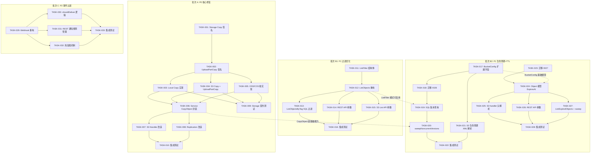
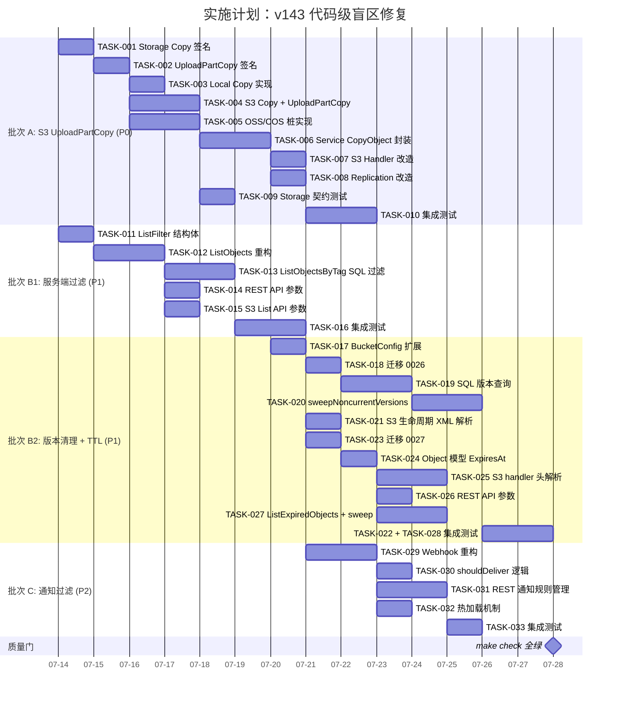

现在我有了完整的代码理解。让我生成全面的 Tech Lead 分析。

---

# Tech Lead 分析报告：代码级盲区与生产就绪缺口（v143）

## 执行摘要

本文档涵盖 5 个独立可交付方向，总预估工作量约 **23–27 个开发日**（单人）。推荐 2 人并行开发，日历周期 **16 个工作日**。

总体优先级排序（复杂度 × 影响）：

| 优先级 | 方向 | 复杂度 | 生产影响 | 建议执行顺序 |
|--------|------|--------|---------|-------------|
| **P0** | 1. S3 UploadPartCopy / 大对象复制 | ★★★ | S3 后端 >5GB 对象完全断裂；DR 方案不可用 | **第 1 批** |
| **P1** | 3. Metadata/Tag 服务端过滤 | ★★ | 百万级桶查询 O(n) 性能线性退化 | **第 1 批**（与方向 1 并行） |
| **P1** | 4. NoncurrentVersion 自动清理 | ★★ | 版本化桶存储成本无限膨胀 | **第 2 批**（依赖 BucketConfig 扩展） |
| **P1** | 2. Per-Object TTL | ★★ | 缺失 S3 协议标准能力；临时文件需手动清理 | **第 2 批**（与方向 4 并行） |
| **P2** | 5. Event Notification Filter | ★ | 字段已存在但管道断裂；无过滤的噪音广播 | **第 3 批** |

---

## 1. 任务分解

### 批次 A（P0 — 方向 1：S3 UploadPartCopy / 大对象复制）

| 任务 ID | 任务标题 | 涉及文件 | 前置依赖 | 预估工时 |
|---------|---------|---------|---------|---------|
| **TASK-001** | Storage 接口增加 `CopyOptions` 和 `Copy` 方法签名 | `internal/storage/storage.go` | — | 2h |
| **TASK-002** | Storage 接口增加 `UploadPartCopy` 方法签名 | `internal/storage/storage.go` | TASK-001 | 1h |
| **TASK-003** | Local 后端实现 `Copy`（`copy_file_range` 或 `io.Copy`） | `internal/storage/local.go` (new file or extend) | TASK-001 | 3h |
| **TASK-004** | S3 后端实现 `Copy`（`s3.CopyObject`）+ `UploadPartCopy`（`s3.UploadPartCopyCopy`） | `internal/storage/s3.go` | TASK-002 | 4h |
| **TASK-005** | OSS/COS 后端实现 `Copy` + `UploadPartCopy` 桩（优先 API，回退 `ErrUnsupported`） | `internal/storage/oss.go`, `cos.go` | TASK-002 | 3h |
| **TASK-006** | Service 层 `CopyObject` 封装（优先 `store.Copy`，回退 Get→Put 流式；>5GB 自动分片） | `internal/service/` (new file `copy.go`) | TASK-001…TASK-005 | 4h |
| **TASK-007** | S3 handler `copyObject` 改用 `service.CopyObject`；支持 `x-amz-copy-source-if-*`、`?versionId`、`x-amz-metadata-directive` | `internal/api/s3compat/extra.go` | TASK-006 | 3h |
| **TASK-008** | Replication worker `ReplicateObjectByID` 改用 `service.CopyObject` | `internal/replication/replication.go` | TASK-006 | 2h |
| **TASK-009** | Storage contract test 扩展：`TestStorage_Copy` + `TestStorage_UploadPartCopy` 契约测试 | `internal/storage/contract_test.go` | TASK-003…TASK-005 | 3h |
| **TASK-010** | 集成测试：跨后端复制、>5GB 自动 multipart fallback、S3 Copy 条件请求 | `internal/api/s3compat/extra_test.go`, `internal/replication/replication_test.go` | TASK-007, TASK-008 | 4h |

---

### 批次 B1（P1 — 方向 3：Metadata/Tag 服务端过滤）

| 任务 ID | 任务标题 | 涉及文件 | 前置依赖 | 预估工时 |
|---------|---------|---------|---------|---------|
| **TASK-011** | 定义 `ListFilter` 结构体（Prefix、Marker、Limit、MetaFilter `map[string]string`、TagKey/TagValue） | `internal/repository/repository.go` | — | 1h |
| **TASK-012** | 重构 `ListObjects` 接受 `ListFilter`；动态构建 WHERE 子句（参数化绑定，遵循 I1 约束） | `internal/repository/sql_objects.go` | TASK-011 | 4h |
| **TASK-013** | 重构 `ListObjectsByTag` 改为 SQL 侧过滤（`WHERE tags->>'key' = 'value'`）；移除客户端 Go 循环 | `internal/repository/sql_objects.go` | TASK-012 | 3h |
| **TASK-014** | REST `GET /v1/files` 支持 `?metadata.k=v` 和 `?tag.k=v` 参数 | `internal/api/rest/handler.go`, `router.go` | TASK-012 | 2h |
| **TASK-015** | S3 ListObjectsV2 支持 `?x-amz-meta-*` 自定义 metadata 过滤参数 | `internal/api/s3compat/handler.go` | TASK-012 | 2h |
| **TASK-016** | 集成测试：metadata 过滤、tag 过滤、组合过滤、分页保持正确性 | `internal/repository/sql_objects_test.go` | TASK-012…TASK-015 | 3h |

---

### 批次 B2（P1 — 方向 4：NoncurrentVersion 自动清理 & 方向 2：Per-Object TTL）

#### 方向 4：NoncurrentVersion Expiration

| 任务 ID | 任务标题 | 涉及文件 | 前置依赖 | 预估工时 |
|---------|---------|---------|---------|---------|
| **TASK-017** | BucketConfig 扩展字段：`NoncurrentVersionDays`、`MaxNoncurrentVersions`、`NoncurrentVersionDeleteAction` | `internal/repository/repository.go`, `internal/api/s3compat/xml.go` | — | 2h |
| **TASK-018** | 迁移 0026：buckets 表增加版本过期列（sqlite + postgres 双文件） | `internal/repository/migrations/{sqlite,postgres}/0026_noncurrent_version.*.sql` | TASK-017 | 2h |
| **TASK-019** | SQL 查询：`ListNoncurrentVersionsByAge(tenant, bucket, days)` + `ListNoncurrentVersionsByCount(tenant, bucket, maxVersions)` | `internal/repository/sql_objects.go` | TASK-018 | 3h |
| **TASK-020** | Reconcile 实现 `sweepNoncurrentVersions`（天数+数量双条件，锁定对象跳过，软/硬删除配置） | `internal/reconcile/noncurrent.go` (new file) | TASK-019 | 4h |
| **TASK-021** | S3 生命周期 XML 解析 `NoncurrentVersionExpiration` 规则 | `internal/api/s3compat/xml.go`, `handler.go` | TASK-017 | 2h |
| **TASK-022** | 集成测试：版本化桶清理、NoncurrentDays + MaxVersions 混合条件、锁定版本跳过 | `internal/reconcile/reconcile_test.go` | TASK-020 | 3h |

#### 方向 2：Per-Object TTL

| 任务 ID | 任务标题 | 涉及文件 | 前置依赖 | 预估工时 |
|---------|---------|---------|---------|---------|
| **TASK-023** | 迁移 0027：objects 表增加 `expires_at TEXT` + 索引 | `internal/repository/migrations/{sqlite,postgres}/0027_expires_at.*.sql` | — | 1h |
| **TASK-024** | Object 模型增加 `ExpiresAt *time.Time`，更新 scanObject（含 NULL 处理） | `internal/repository/repository.go`, `internal/repository/sql_objects.go` | TASK-023 | 2h |
| **TASK-025** | S3 handler：PutObject 解析 `x-amz-expires` / `x-amz-expiration`，GetObject 响应输出 `x-amz-expiration` header | `internal/api/s3compat/handler.go` | TASK-024 | 3h |
| **TASK-026** | REST API：`PUT /v1/files/*key?expires_at=<ISO8601>` + Object JSON 中输出 `expires_at` | `internal/api/rest/handler.go` | TASK-024 | 2h |
| **TASK-027** | 新增 `ListExpiredObjects` SQL + Reconcile `sweepExpiredObjects`（跳过锁定对象；软/硬删除可配置） | `internal/repository/sql_objects.go`, `internal/reconcile/retention.go` (new file) | TASK-024 | 4h |
| **TASK-028** | 集成测试：TTL 过期自动清除、版本化桶中 TTL、桶生命周期 + 对象 TTL 共同作用 | `internal/reconcile/reconcile_test.go` | TASK-025…TASK-027 | 3h |

---

### 批次 C（P2 — 方向 5：Event Notification Filter）

| 任务 ID | 任务标题 | 涉及文件 | 前置依赖 | 预估工时 |
|---------|---------|---------|---------|---------|
| **TASK-029** | Webhook 重构：`webhookTarget` 结构体包含 URL + FilterKey；`NewWebhook` 接受 `[]NotificationRule` | `internal/events/webhook.go` | — | 3h |
| **TASK-030** | 实现 `shouldDeliver` 过滤逻辑（prefix/suffix AND/OR 语义） | `internal/events/webhook.go` | TASK-029 | 2h |
| **TASK-031** | REST API：`PUT /v1/buckets/{name}/notification` 管理通知规则 | `internal/api/rest/handler.go`, `router.go` | TASK-029 | 3h |
| **TASK-032** | 通知规则变更热加载（Webhook 暴露 `Reload([]NotificationRule)` 方法） | `internal/events/webhook.go` | TASK-029 | 2h |
| **TASK-033** | 集成测试：前缀过滤、后缀过滤、多规则 OR、向后兼容（无 filter = 全量转发） | `internal/events/webhook_test.go` | TASK-029…TASK-032 | 3h |

---

## 2. 执行顺序



### 可并行执行的任务组

| 并行组 | 任务 | 开发者 |
|--------|------|--------|
| **组 1** | 批次 A（T001–T010）+ 批次 B1（T011–T016） | Dev A: Storage 层 + Service；Dev B: 过滤层 |
| **组 2** | 批次 B2（T017–T028） | Dev A 完成方向 1 后接手方向 4；Dev B 继续方向 2 |
| **组 3** | 批次 C（T029–T033） | 任一开发者完成批次后接手 |

---

## 3. 技术风险

### 风险矩阵

| 风险 ID | 风险描述 | 影响方向 | 概率 | 严重度 | 缓解策略 |
|---------|---------|---------|------|--------|---------|
| **R1** | S3 SDK `UploadPartCopy` 参数复杂度高（SourceRange、CopySourceIfMatch 等） | 方向 1 | 中 | 高 | 分步实现：先 CopyObject（单次），再 UploadPartCopy（分片），每部分独立测试 |
| **R2** | SQLite JSON1 `->>` 运算符 vs Postgres `->>` 行为差异（SQLite 返回 TEXT，Postgres 返回 jsonb→text 等价） | 方向 3 | 低 | 中 | 两套迁移文件 + `s.rebind` 已在处理方言差异；集成测试需覆盖两个后端 |
| **R3** | 版本清理的删除原子性：storage blob + repo 行必须在同一事务（或等价语义）中完成 | 方向 4 | 中 | **高** | Reconcile 采用"先 repo 标记（软删除），再异步清理 blob"的模式，失败可重试 |
| **R4** | 对象 TTL 与桶生命周期共同作用时的竞态（同一对象被两个 Reconcile 流程同时处理） | 方向 2 + 4 | 中 | 中 | `ClusterSingleton` 门控 + `SELECT ... FOR UPDATE`（Postgres）或事务序列化（SQLite） |
| **R5** | Webhook 热加载时正在发送的事件丢失 | 方向 5 | 低 | 低 | 使用 `sync.RWMutex` 保护 targets；热加载等待进行中的 deliver 完成后切换 |
| **R6** | `ListFilter` 重构破坏现有调用者（大量 handler 直接调用 `ListObjects` 旧签名） | 方向 3 | **高** | **高** | 采用 Go 函数选项模式（`func ListObjects(ctx, tenant, bucket string, opts ...ListOption)`）保持向后兼容；或保留旧签名 + 新增 `ListObjectsFiltered` |
| **R7** | UploadPartCopy 跨后端（local→s3）时，Local 不支持 range-based 复制，必须 fallback 到全量 Get→Put 再进行分片 | 方向 1 | 高 | 中 | Service 层 `CopyObject` 检测 backend 类型差异：同后端→调用 `Copy`；跨后端→Get→Put 流式（但 >5GB 需要 multipart 分片上传） |
| **R8** | 测试 >5GB 大对象在 CI 环境中不可行（磁盘/内存/时间限制） | 方向 1 | **高** | 中 | 使用 Mock Storage 模拟 S3 5GB 限制；集成测试仅验证 <10MB 对象 + mock 模拟限流触发 multipath |

### 关键不确定点

1. **S3 `UploadPartCopy` 的 SourceRange 指定**：AWS S3 API 要求 `x-amz-copy-source-range:bytes=first-last` 格式，需要确保 Go SDK 的 `UploadPartCopyInput.CopySourceRange` 参数正确传递。
2. **SQLite JSON 表达式索引**：SQLite 的 `CREATE INDEX idx_meta ON objects(json_extract(metadata, '$.key'))` 在不同版本中的支持程度不同，需要验证 CI 环境中的 SQLite 版本。
3. **版本化桶 `deleted_at` 复用**：当前版本化使用 `deleted_at` 标记非当前版本。NoncurrentVersion 清理需要区分"软删除的版本"和"被新版本覆盖的旧版本"——当前数据模型使用同一字段。

---

## 4. 资源评估

### 人员需求

| 角色 | 数量 | 关键技能 | 负责方向 |
|------|------|---------|---------|
| **Senior Go 后端工程师** | 1 | Go 并发、存储抽象、S3 协议、SQL 优化 | 方向 1（核心）+ 方向 4（版本清理） |
| **Mid-level Go 后端工程师** | 1 | REST API、SQL、事件驱动 | 方向 3（过滤）+ 方向 2（TTL）+ 方向 5（通知） |

> **建议**：2 人并行。若仅 1 人，按 P0→P1→P2 顺序顺次执行，预估 23–27 个工作日。

### 关键里程碑

| 里程碑 | 交付物 | 预计时间（2 人并行） | 验收标准 |
|--------|--------|-------------------|---------|
| **M1** | Storage 接口就绪 | 第 2 天 | `Copy` + `UploadPartCopy` 在 Storage 接口中定义；Local/S3 桩实现通过编译 |
| **M2** | 大对象复制可用 | 第 5 天 | S3 CopyObject 使用 `Storage.Copy`；>5GB 对象通过 multipart 自动回退；`make test` 全绿 |
| **M3** | 服务端过滤可用 | 第 5 天 | `GET /v1/files?metadata.color=red` 返回正确过滤结果；`ListObjectsByTag` 使用 SQL 过滤 |
| **M4** | 版本清理 + TTL 就绪 | 第 10 天 | NoncurrentVersion 清理 + Per-Object TTL 过期在 Reconcile 中运行；`make test` + `make test-integration` 全绿 |
| **M5** | 事件通知过滤就绪 | 第 13 天 | Webhook 按 prefix/suffix 过滤事件；REST API 管理通知规则 |
| **M6** | 全量集成验证 | 第 16 天 | 所有 5 个方向通过集成测试；`make check` 全绿；无文件超过 500 行限制 |

### 阻塞点与解决策略

| 阻塞点 | 方向 | 解决策略 |
|--------|------|---------|
| S3 `UploadPartCopy` 需要在 `storage.S3Storage` 中维护 `s3.Client` 的并发安全性 | 1 | 现有 `s3.Client` 已是并发安全（AWS SDK 设计）；只需在 `UploadPartCopy` 方法中正确构造 `UploadPartCopyInput` |
| `ListFilter` 动态 WHERE 子句违背"静态 SQL 易审查"原则 | 3 | 限制动态部分仅限 `WHERE metadata->>$N = $M` 模式；禁止自由组合（防止 SQL 注入）。输出到日志供审计 |
| 版本清理可能一次删除数十万 blob，导致 Reconcile 周期过长 | 4 | 每批处理 ≤200 个对象（与现有 `sweepExpired` 一致）；使用 `time.Since(start) > 50ms` 内部分批控制 |
| Webhook 重构需要修改 `main.go` 装配代码 | 5 | 保持 `NewWebhook` 向后兼容（额外参数 `rules ...NotificationRule` 使用可变参数） |

---

## 5. 质量保证

### 5.1 单元测试覆盖要求

| 文件 | 要求覆盖度（行） | 关键测试案例 |
|------|----------------|-------------|
| `internal/storage/local.go` (Copy) | ≥80% | 同分区复制、跨分区复制（回退 io.Copy）、源不存在、目标已存在、空文件 |
| `internal/storage/s3.go` (Copy, UploadPartCopy) | ≥70%（需 mock AWS SDK） | CopyObject 成功、CopyObject 5GB 拒绝返回错误（模拟）、UploadPartCopy 分段 |
| `internal/service/copy.go` (新文件) | ≥85% | 同后端 Copy 通路、跨后端 fallback、>5GB 自动分片、条件请求处理 |
| `internal/repository/sql_objects.go` (ListFilter) | ≥90% | 单条件过滤、复合 AND 过滤、无匹配、全量分页保持、tag 过滤 |
| `internal/reconcile/noncurrent.go` (新文件) | ≥85% | 天数条件、数量条件、双条件取严、锁定版本跳过、事务失败回滚 |
| `internal/events/webhook.go` | ≥80% | 前缀匹配、后缀匹配、多规则 OR、空 FilterKey 全量、更新规则后切换 |

### 5.2 集成测试策略

| 场景 | 测试方法 | CI 地位 | 特殊要求 |
|------|---------|---------|---------|
| S3 CopyObject 端到端 | `httptest` + mock S3 backend | 强制（gate） | Mock 实现 `Copy` + `UploadPartCopy` |
| >5GB fallback 验证 | Mock Storage 在 5GB 返回 `ErrEntityTooLarge` | 强制（gate） | 无需真实大文件 |
| Metadata 过滤端到端 | REST API 调用 + SQLite DB | 强制（gate） | — |
| Postgres 方言兼容 | `DB_DRIVER=postgres` + Docker | `make test-integration` | Docker 依赖，CI gate 外 |
| 版本清理 + TTL 并发 | 多协程同时触发 Reconcile 和 PUT | `make test-integration` | 需要 ClusterSingleton mock |
| Webhook 过滤 + 热加载 | mock HTTP server + event bus | 强制（gate） | 验证事件去重 |

### 5.3 代码审查要点

| 审查点 | 方向 | 检查内容 |
|--------|------|---------|
| **SQL 注入防护** | 方向 3 | 所有动态 WHERE 子句使用参数化绑定 `$N`；禁止 `fmt.Sprintf` 拼接值 |
| **事务原子性** | 方向 2, 4 | `sweepExpiredObjects` / `sweepNoncurrentVersions` 中 storage + repo 操作是否在同一事务 |
| **并发安全** | 方向 5 | `webhookTargets` 的 `sync.RWMutex` 保护；`Run` 循环中 filter 变更的可见性 |
| **回退路径** | 方向 1 | `service.CopyObject` 是否在所有失败路径都正确处理回退；`ErrUnsupported` 传播 |
| **文件 ≤500 行** | 全部 | 若 `s3.go` 或 `sql_objects.go` 超过限制，必须在合并前拆分 |
| **圈复杂度 ≤10** | 方向 3 | `ListObjects` 的动态 WHERE 构建函数不得 >10 |
| **迁移版本号冲突** | 方向 2, 4 | 0026 和 0027 不能与已存在的迁移编号重复 |
| **`x-amz-*` 头大小写** | 方向 2 | S3 标准使用小写头名 `x-amz-expires`；Go HTTP handler 的 `r.Header.Get` 大小写不敏感 |

### 5.4 性能测试需求

| 测试 | 方向 | 方法 | 目标 |
|------|------|------|------|
| List API metadata 过滤 | 方向 3 | 插入 100K 对象，`GET /v1/files?metadata.env=prod` | 响应时间 <200ms（SQLite），<50ms（Postgres+索引） |
| 版本清理吞吐 | 方向 4 | 10K 版本对象，Reconcile 单次清理 | 每秒 ≥200 对象（含 storage blob 删除） |
| CopyObject 延迟 | 方向 1 | 1GB 对象，Local 后端 `copy_file_range` vs `io.Copy` | `copy_file_range` < 100ms，`io.Copy` < 2s |
| Webhook 过滤吞吐 | 方向 5 | 10K 事件/s，50% 被过滤 | CPU 增量 <5% |

---

## 6. 实施计划

### 甘特图（2 人并行，16 个工作日）



### 阶段时间线

| 阶段 | 时间范围 | 交付物 | 验收标准 |
|------|---------|--------|---------|
| **阶段 1：基础设施** | 第 1–2 天 | Storage 接口扩展（T001–T002）、ListFilter 定义（T011）、BucketConfig 扩展（T017） | 编译通过，旧测试不退化 |
| **阶段 2a：核心实现** | 第 3–8 天 | Storage 后端实现（T003–T005）、Service 封装（T006）、S3 Handler 改造（T007）、Replication 改造（T008）、过滤 SQL 重构（T012–T015）、BucketConfig 迁移（T018–T021） | 每个子任务通过单元测试 |
| **阶段 2b：核心实现** | 第 6–12 天 | 版本清理（T020）、TTL 模型+迁移（T023–T024）、S3/REST TTL 头（T025–T026）、sweepExpiredObjects（T027） | 集成测试通过 |
| **阶段 3：集成测试** | 第 9–14 天 | Storage 契约测试（T009）、全量集成测试（T010、T016、T022、T028）、Webhook 重构（T029–T032） | `make test` 全绿 |
| **阶段 4：发布准备** | 第 13–16 天 | 通知过滤集成测试（T033）、性能测试、Go 静态分析（gofmt、go vet）、OpenAPI 文档更新 | `make check` 全绿 |

### 风险管理缓冲

- 每批次预留 1 天缓冲处理意外问题（总缓冲 = 3 天）
- 若 TASK-006（Service CopyObject 封装）复杂度超预期，可拆分为 TASK-006a（同后端 Copy 通路）和 TASK-006b（跨后端 + multipart fallback）
- 若 R6（ListFilter 重构破坏现有调用者）发生，预期增加 1 天进行全量调用者适配

---

## 附录 A：各方向改动量估算

| 方向 | 新增文件 | 修改文件 | 预估新增代码行 | 预估修改代码行 |
|------|---------|---------|--------------|--------------|
| 1. UploadPartCopy | 1（`service/copy.go`） | 5（`storage.go`, `local.go`, `s3.go`, `oss.go`, `cos.go`, `extra.go`, `replication.go`） | ~280 | ~120 |
| 2. Per-Object TTL | 1（`reconcile/retention.go`） | 6（`repository.go`, `sql_objects.go`, `handler.go`×2, `router.go`, 迁移文件×4） | ~200 | ~150 |
| 3. Metadata 过滤 | 0 | 4（`repository.go`, `sql_objects.go`, `handler.go`×2, `router.go`） | ~150 | ~200 |
| 4. NoncurrentVersion | 1（`reconcile/noncurrent.go`） | 5（`repository.go`, `sql_objects.go`, `xml.go`, `handler.go`, 迁移文件×4） | ~250 | ~100 |
| 5. 通知过滤 | 0 | 2（`webhook.go`, `handler.go`, `router.go`） | ~120 | ~80 |
| **合计** | **3** | **~18** | **~1000** | **~650** |

> **注意**：所有新文件 + 修改后的文件必须遵守 ≤500 行/文件、≤50 行/函数、圈复杂度 ≤10 的硬性约束。`sql_objects.go`（当前 ~450 行）在 TASK-012 重构后可能接近限制，建议将 List/ListDeleted/ListByTag 拆分为 `sql_objects_list.go`。

## 附录 B：`make check` 门禁清单

在执行任何合并前，必须验证：

```bash
# 1. 格式检查
gofmt -l .          # 必须无输出
# 2. 编译
go build ./...
# 3. 静态分析
go vet ./...
# 4. 单元测试（基线：SQLite + local FS）
go test ./... -count=1 -timeout 120s
# 5. 文件行数检查（CI 脚本）
find . -name '*.go' -exec awk 'NR==500{print FILENAME; exit}' {} +
# 6. 圈复杂度（gocyclo）
gocyclo -over 10 . || true  # 输出超过 10 的函数，必须重构
```

---

以上为对 `docs/requirements/expansion-v143-code-level-blindspots-production-gaps.md` 的完整 Tech Lead 分析。核心建议：**先集中火力解决 P0（方向 1），同时并行推进 P1 中无依赖关系的方向 3**；方向 2 和 4 共享 Reconcile 扩展模式，可由同一人串联推进；方向 5（P2）留在最后作为收尾填充。
