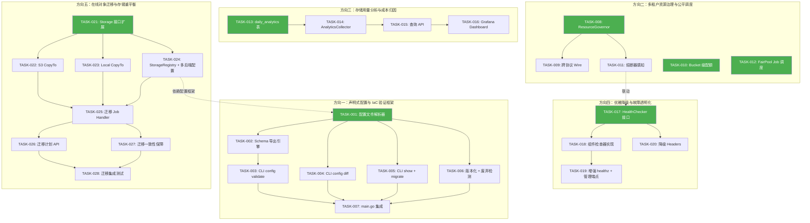
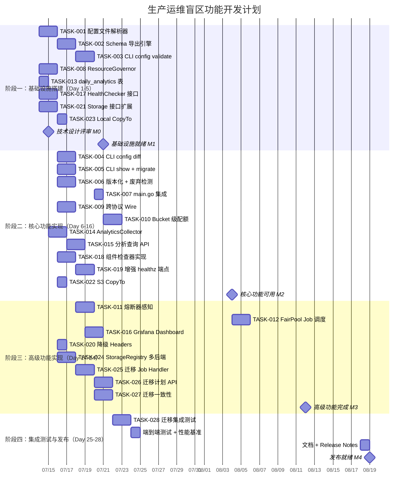

好，我已阅读完整分析文档（908 行）和工程约束文件。下面以 Tech Lead 视角进行系统性分析。

---

# Tech Lead 分析报告：生产运维盲区 — 配置治理、资源公平调度、存储分析、优雅降级、在线迁移

---

## 1. 任务分解

将 5 个方向拆解为 28 个可执行任务，每任务 2-4 小时。标注了工程约束对齐要求（文件 ≤500 行、函数 ≤50 行、圈复杂度 ≤10）。

### 方向一：声明式配置与 IaC 验证框架

| 任务 ID | 任务标题 | 涉及文件 | 前置依赖 | 工时 | 验收标准 |
|---------|---------|---------|---------|------|---------|
| **TASK-001** | YAML/JSON/Toml 配置文件解析器 | `internal/config/file.go`（新）、`internal/config/config.go`（修改 `Load()` 支持多源）、`internal/config/config_test.go` | 无 | 4h | `config.Load()` 支持 `--config-file aero.yaml`，合并策略：flag > file > env > default；可用 `getEnv("APP_ADDR", ":8080")` 作为 fallback；配置文件缺失时退化到纯 env 模式（向后兼容）；`go test ./internal/config/` 通过 |
| **TASK-002** | JSON Schema 导出引擎 | `internal/config/schema.go`（新）、`internal/config/schema_test.go` | TASK-001 | 3h | `ExportSchema() []Field` 从 struct tag 和反射生成完整 schema；输出可被 `aero-vault config schema > schema.json` 使用；tag 支持 `required`、`deprecated`、`description`、`env_var`；覆盖所有 11 个子结构体 |
| **TASK-003** | CLI `config validate` 子命令 | `internal/cli/config.go`（新）、`internal/cli/cli.go`（修改路由） | TASK-002 | 3h | `aero-vault config validate /path/to/config.yaml` 输出语法验证 + 语义验证结果；错误格式：`file.yaml:12:3 unknown field "foo"`；语义验证扩展现有 `Validate()` 到 15+ 检查项（含端口范围、AI 配置完整性、事件配置一致性、凭证格式）；退出码 0=通过 1=失败 |
| **TASK-004** | CLI `config diff` 子命令 | `internal/config/diff.go`（新）、`internal/config/diff_test.go` | TASK-001 | 3h | `aero-vault config diff baseline.yaml live` 输出结构化 diff（增/删/改）；支持 `--format json`、`--format text`；忽略敏感字段（含 `sensitive` tag）；支持 `--from` 和 `--to` 同为文件路径或 `live` 关键字 |
| **TASK-005** | CLI `config show` + `config migrate` 子命令 | `internal/config/show.go`（新）、`internal/config/upgrade.go`（新）、`internal/config/upgrade_test.go` | TASK-001 | 4h | `config show` 输出当前运行时配置（mask 敏感字段）；`config migrate old.yaml > new.yaml` 读取配置版本号、执行升级脚本（版本 `1.0` → `1.1` 等）；升级脚本注册制：`RegisterUpgrade("1.0", "1.1", upgradeV1ToV1_1)` |
| **TASK-006** | 配置版本化 + 废弃字段检测 | `internal/config/config.go`（添加 `Version` 字段）、`internal/config/config_app.go`（添加 `Deprecated` tag 支持）、`internal/config/deprecated_test.go` | TASK-001 | 3h | 加载时对 `deprecated` 字段输出 `slog.Warn("config: STORAGE_LEGACY_FIELD is deprecated, use STORAGE_NEW_FIELD")`；`Config.Version` 字段持久化到输出；`ExportSchema()` 标记 `deprecated` 字段；不影响现有 env var 加载路径 |
| **TASK-007** | main.go 配置 CLI 分发集成 | `cmd/server/main.go`（修改入口参数解析）、`internal/config/config_cli.go`（新） | TASK-003, TASK-004, TASK-005, TASK-006 | 2h | `aero-vault config validate/...` 不启动完整服务；`aero-vault server --config-file config.yaml` 使用配置文件；所有子命令不依赖 `godotenv.Load()` 后的环境；`make check` 通过 |

### 方向二：多租户资源治理与公平调度

| 任务 ID | 任务标题 | 涉及文件 | 前置依赖 | 工时 | 验收标准 |
|---------|---------|---------|---------|------|---------|
| **TASK-008** | `ResourceGovernor` 中心资源管理器 | `internal/middleware/resource.go`（新）、`internal/middleware/resource_test.go` | 无 | 4h | `Acquire(ctx, tenantID)` / `Release(ctx, tenantID)` 接口实现全局 in-flight 计数 + per-tenant 子计数；使用 `atomic.Int64` + `sync.Map` 实现无锁路径；支持 `maxGlobalInFlight`、`maxPerTenant` 双上限；超过上限返回可重试错误；`go test -race` 通过 |
| **TASK-009** | 跨协议中间件注册（REST/S3/WebDAV/MCP） | `internal/api/rest/router.go`、`internal/api/s3compat/handler.go`、`internal/api/webdav/handler.go`、`internal/mcp/server.go`、`cmd/server/main.go` | TASK-008 | 3h | 所有 4 个协议入口注册 `mw.GlobalResourceGovernor(resourceGov)`；当一个租户在 REST 用满 `maxPerTenant=10`，S3 请求也被阻塞（共享计数器）；README 更新说明跨协议资源隔离行为 |
| **TASK-010** | Bucket 级配额（DB 迁移 + Repository + FileService） | `migrations/{sqlite,postgres}/NNNN_add_bucket_quota.{up,down}.sql`（新）、`internal/repository/sql_buckets.go`（修改）、`internal/service/file_crud.go`（添加 `checkBucketQuota`）、`internal/api/rest/admin.go`（添加 `PUT /v1/admin/tenants/{t}/buckets/{b}/quota`） | 无 | 4h | `buckets` 表新增 `max_bytes`、`max_objects` 列（NULL = 继承 tenant）；`checkBucketQuota` 在 `checkQuota` 之后检查，bucket 级覆盖 tenant 级（更细粒度优先）；`AddTenantUsage` 同时累加 bucket 级用量；迁移双文件已生成且不可编辑已应用的文件（遵守 **I2**）；SQL 占位符独立编号（遵守 **I1**） |
| **TASK-011** | 熔断器感知的健康响应 + 按租户降级路径 | `internal/storage/circuitbreaker.go`（添加 `StateWithTenant`）、`internal/service/file_crud.go`（添加 `X-Aero-Rate-Cause` header）、`internal/middleware/resource.go`（熔断时 per-tenant 降级） | TASK-008 | 3h | 熔断器打开时 `Put`/`Get` 响应附带 `X-Aero-Rate-Cause: circuit-breaker(backend=s3, state=open)` header；资源管理器在熔断时降级受影响的 tenant 但允许其他 tenant 继续（通过 per-tenant 健康状态联动方向四）；不改变现有 `circuitbreaker.go` 的接口签名 |
| **TASK-012** | Job 池公平调度（FairPool） | `internal/jobs/fairpool.go`（新）、`internal/jobs/jobs.go`（修改 `Pool` 引用）、`internal/jobs/fairpool_test.go` | 无 | 4h | 多级队列（每租户一个 FIFO channel）；加权 round-robin 调度器（权重来自 `TenantRecord`）；高优先级 job（用户交互）不因低优先级 job（批量复制）积压而阻塞；支持 `maxConcurrent` per-tenant；`go test -race` 通过 |

### 方向三：存储用量分析与成本归因面板

| 任务 ID | 任务标题 | 涉及文件 | 前置依赖 | 工时 | 验收标准 |
|---------|---------|---------|---------|------|---------|
| **TASK-013** | `daily_analytics` 表 + DB 迁移 | `migrations/{sqlite,postgres}/NNNN_daily_analytics.{up,down}.sql`（新）、`internal/repository/sql_analytics.go`（新）、`internal/repository/repository.go`（添加接口方法） | 无 | 2h | 新表 `daily_analytics(tenant, bucket, date, total_bytes, total_objects, total_gets, total_puts, egress_bytes)` 带唯一索引 `(tenant, bucket, date)`；`UpsertDailyAnalytics` 方法实现 upsert 语义（同日期累加）；`GetDailyAnalytics` 支持时间范围查询；遵守 **I1**（SQL 占位符独立编号）和 **I2**（双迁移文件） |
| **TASK-014** | `AnalyticsCollector` + FileService 集成 | `internal/analytics/analytics.go`（新）、`internal/analytics/collector.go`（新）、`internal/service/file_crud.go`（Get/Put 路径添加 `RecordAccess`） | TASK-013 | 3h | `AnalyticsCollector` 在内存维护 sliding window 计数，定期 flush 到 `daily_analytics`（每 5 分钟或满 1000 条）；FileService.Get 调用 `RecordAccess(tenant, bucket, key, size, "get")`；FileService.Put 调用 `RecordAccess(tenant, bucket, key, size, "put")`；flush 失败不阻塞业务路径（warn log 后跳过）；`go test -race` 通过 |
| **TASK-015** | 分析查询 API 端点 | `internal/analytics/growth.go`（新）、`internal/analytics/top_access.go`（新）、`internal/analytics/cold_data.go`（新）、`internal/analytics/cost.go`（新）、`internal/api/rest/analytics.go`（新）、`internal/api/rest/router.go`（注册路由） | TASK-014 | 4h | `GET /v1/analytics/growth?tenant=&bucket=&period=30d` 返回日趋势 + 增长率 + 预估填满日期；`GET /v1/analytics/top-access?tenant=&limit=20&period=7d` 返回 Top-N 访问对象；`GET /v1/analytics/cold-data?tenant=&bucket=&since=90d` 返回冷数据列表；`GET /v1/analytics/cost?tenant=&period=monthly` 返回按 storage class 拆分的成本归因；所有端点支持 `tenant` 过滤和 `limit` 分页；scope 为 `analytics:read` |
| **TASK-016** | Grafana Dashboard 扩展 | `deploy/grafana/dashboard.json`（修改） | TASK-015 | 3h | 新增 4 个 panel：存储增长趋势（面积图，按 tenant 分色）、Top-10 热门对象（表格）、冷数据报表（表格 + 建议动作列）、月度成本归因（饼图 + 柱状图）；panel 数据来源为 TASK-015 的 API 端点；现有 12 个 panel 不受影响 |

### 方向四：优雅降级与故障模式透明化

| 任务 ID | 任务标题 | 涉及文件 | 前置依赖 | 工时 | 验收标准 |
|---------|---------|---------|---------|------|---------|
| **TASK-017** | `HealthChecker` 接口 + 组件注册中心 | `internal/health/checker.go`（新）、`internal/health/component.go`（新）、`internal/health/health_test.go` | 无 | 3h | `ComponentChecker` 接口：`Name() string` + `Check(ctx) ComponentStatus`；`HealthChecker` 提供 `Register(c ComponentChecker)` + `Report(ctx) HealthReport`；`HealthReport` 包含 `Status`（healthy/degraded/down）、`Uptime`、`Version`、`Components []DegradationState`、`DegradedSince`；组件检查结果缓存 5s TTL，避免 health check 自身造成负载；健康检查超时 2s（超时 → degraded） |
| **TASK-018** | 子系统 ComponentChecker 实现 | `internal/health/checkers.go`（新）—— `StorageHealth`、`AIEmbedderHealth`、`AILLMHealth`、`BM25Health`、`BusHealth`、`JobPoolHealth`、`ReconcileHealth`、`IndexerHealth`；`cmd/server/main.go`（注册组件） | TASK-017 | 4h | 实现至少 8 个 `ComponentChecker`；存储检查器读取 `circuitbreaker.State()`；AI 检查器检查 `embedder != nil` + ping 端点；BM25 检查器读取 `bm25.ready` atomic bool；事件总线检查器调用 `Bus.Dropped()`；Job 池检查器调用 `CountJobsByStatus("failed")`；Reconcile 检查器记录最后成功运行时间；每个检查器文件名、函数体 ≤50 行（遵守工程约束） |
| **TASK-019** | 增强 `/healthz` + `/readyz` + 管理端点 | `internal/api/rest/health.go`（新）、`internal/api/rest/router.go`（替换原有 chi.Healthz()）、`cmd/server/main.go`（移除原有 chi.Healthz 引用） | TASK-017, TASK-018 | 3h | `/healthz` 返回 `200 {"status":"healthy","components":[...]}` 或 `200 {"status":"degraded","components":[...],"degraded_since":"..."}`（即使 degraded 也返回 200，区别于完全不可用）；`/readyz` 返回 `200`（就绪）或 `503`（未就绪）；`GET /v1/admin/health` 返回完整健康报告（需要 admin scope）；`GET /v1/admin/degradation` 返回当前降级组件列表；原有 `chi.Healthz()` 不再使用 |
| **TASK-020** | API 降级响应 Headers + 静默空结果修复 | `internal/ai/search.go`、`internal/ai/chat.go`、`internal/middleware/middleware.go` | TASK-017 | 2h | AI 后端不可用时 `/search` 返回 `X-Aero-Degraded: embedder` header 而非空结果；`/chat` LLM 错误返回 `X-Aero-Degraded: llm` header 而非 500；存储熔断时返回 `X-Aero-Degraded: storage(backend=s3)` header；所有降级 header 附带 `X-Aero-Degraded-Since: <RFC3339>` |

### 方向五：在线对象迁移与存储重平衡

| 任务 ID | 任务标题 | 涉及文件 | 前置依赖 | 工时 | 验收标准 |
|---------|---------|---------|---------|------|---------|
| **TASK-021** | Storage 接口扩展（CopyTo/MoveTo） | `internal/storage/storage.go`（添加 `CopyTo`、`MoveTo`、`SupportsServerSideCopy` 方法）、`internal/storage/local.go`（实现）、`internal/storage/s3.go`（实现） | 无 | 3h | 接口新增 3 个方法；`LocalStorage.CopyTo` 使用 `io.Copy`（跨文件系统）或 `os.Rename`（同文件系统）；`S3Storage.CopyTo` 使用 S3 `CopyObject`（服务端操作）；`SupportsServerSideCopy` 返回 true for S3、false for Local；所有现有 backend 编译器通过（遵守接口隔离原则） |
| **TASK-022** | S3 后端 CopyTo + MoveTo 实现 | `internal/storage/s3.go`（实现方法） | TASK-021 | 2h | `CopyTo` 使用 `s3.CopyObjectInput` 实现服务端复制（同 region 的 bucket 间零网络 I/O）；`MoveTo` = `CopyTo` + `Delete`；支持跨账号复制场景（通过配置的 AWS 凭证）；错误处理：源 key 不存在返回 `ErrObjectNotFound`，权限不足返回 `ErrPermissionDenied`；ETag 验证在复制后校验 |
| **TASK-023** | Local 后端 CopyTo + MoveTo 实现 | `internal/storage/local.go`（实现方法） | TASK-021 | 1h | 同文件系统下 `MoveTo` = `os.Rename`（原子操作）；跨文件系统 `CopyTo` = `io.Copy` + 校验；删除旧 blob 前验证目标 blob 已正确写入（checksum 对比）；大文件流式复制（不加载全部到内存） |
| **TASK-024** | StorageRegistry + 多后端配置支持 | `internal/storage/registry.go`（新）、`internal/config/config.go`（扩展 StorageConfig 支持 `backends` 和 `class_mapping` 字段）、`internal/storage/registry_test.go` | TASK-021 | 4h | `StorageRegistry` 提供 `Register(name, backend)`、`MapClass(class, backendName)`、`GetForClass(class)`、`Get(name)`、`List()`；配置支持 `backends` 映射表（如 `hot→local`、`warm→s3`）和 `class_mapping`（`STANDARD→hot`、`STANDARD_IA→warm`）；`FileService` 通过 `registry.GetForClass(obj.StorageClass)` 获取目标后端；向后兼容：单一 backend 配置自动注册为 `default` |
| **TASK-025** | 迁移 Job 类型 + Job Handler | `internal/reconcile/migration.go`（新）、`internal/jobs/jobs.go`（注册 `JobTypeMigrateObject`） | TASK-024, TASK-022, TASK-023 | 4h | `JobTypeMigrateObject` handler：从源后端 `CopyTo` 到目标后端 → 验证 ETag → 更新对象元数据的 `StorageKey`/`StorageBackend` → 根据保留策略决定是否删除源 blob；支持 `max_concurrent` 限速；重试策略：失败 3 次后标记 `migration_failed`，保留源 blob；迁移前检查对象 `updated_at`，若迁移期间有新的 `Put` 则跳过旧版本 |
| **TASK-026** | 迁移计划 CRUD API + 执行端点 | `internal/api/rest/migration.go`（新）、`internal/api/rest/router.go`（注册路由）、`internal/repository/sql_migration.go`（新） | TASK-025 | 3h | `POST /v1/admin/migration` 创建迁移计划（`source_backend`, `target_backend`, `bucket`, `key_prefix`, `storage_class`, `dry_run`）；dry_run 模式仅统计不执行；`POST /v1/admin/migration/{id}/execute` 执行；`GET /v1/admin/migration/{id}/status` 查看进度（已完成/总数/失败/进行中）；`POST /v1/admin/migration/{id}/cancel` 取消运行中的迁移；scope 为 `migration:admin` |
| **TASK-027** | 迁移一致性保障 + 并发写入冲突处理 | `internal/reconcile/migration.go`（添加冲突检测）、`internal/service/file_crud.go`（Put 路径添加迁移感知） | TASK-025 | 3h | 迁移期间 `Put` 到同一对象自动跳过旧版本迁移 job；迁移 job 执行前获取 `updated_at` 快照，完成后与当前值对比，若不一致则标记 `migration_conflict`；提供 `X-Aero-Migration-Status: in_progress` header（迁移中的对象读请求继续由源后端服务）；迁移完成后 7 天保留窗口（`DeleteAfterMigration` 配置，默认保留源 blob 7 天用于回滚） |
| **TASK-028** | 迁移流程集成测试 | `internal/storage/storage_migration_test.go`（新，`//go:build integration`） | TASK-026, TASK-027 | 4h | 测试场景：local→local 同文件系统、local→local 跨文件系统、local→s3（mock S3）；迁移中并发 `Put` 不产生不一致；多对象迁移进度报告正确；dry_run 不实际移动数据；取消运行中的迁移正确标记已移动对象；迁移失败后重试从失败点继续 |

---

## 2. 执行顺序与依赖图

### 可并行执行的任务组

| 并行组 | 任务 | 说明 |
|--------|------|------|
| **组 A（并行基座）** | TASK-001, TASK-008, TASK-010, TASK-012, TASK-013, TASK-017, TASK-021 | 7 个方向各自的根部任务，互不依赖，可分配 3-4 人同时推进 |
| **组 B（方向内链式）** | TASK-002→TASK-003, TASK-014→TASK-015, TASK-018→TASK-019 | 方向内链式依赖，不可跨方向阻塞 |
| **组 C（独立可延迟）** | TASK-004, TASK-005, TASK-006, TASK-016, TASK-020 | 不阻塞任何其他方向，可在组 B 完成后任意时间插入 |

---

## 3. 技术风险

### 3.1 高优先级风险

| # | 风险 | 方向 | 概率 | 影响 | 缓解策略 |
|---|------|------|------|------|---------|
| R1 | **配置合并策略的语义歧义**：YAML 的嵌套结构与 env var 的扁平命名空间映射复杂（如 `storage.s3.endpoint` vs `STORAGE_S3_ENDPOINT`） | 方向一 | **高** | 中 | 先实现 `struct` → `map[string]interface{}` 通用映射器，用 `mapstructure` 或 `mitchellh/mapstructure`（若允许依赖）或手写递归解析；单元测试覆盖 20+ 合并场景 |
| R2 | **跨协议中间件注册点分歧**：REST/S3/WebDAV/MCP 各自有不同的 router/mux 创建模式，注入 `ResourceGovernor` 需要逐个适配 | 方向二 | **高** | 高 | 创建统一的 `ProtocolAdapter` 接口（`RegisterMiddleware(func)`）；每个协议实现者适配；第一个版本先覆盖 REST + S3（占流量 95%+），WebDAV + MCP 后续跟进 |
| R3 | **分析数据丢失**：`AnalyticsCollector` 在进程崩溃时丢失内存中未 flush 的计数 | 方向三 | **中** | 中 | 实现 WAL 风格的 `pending_events` 临时表，collector 先写 event 再返回业务路径，后台 flush 到 daily_analytics 后标记已处理；进程重启时回放未处理 event |
| R4 | **健康检查导致级联故障**：大量客户端 / 负载均衡器频繁调用 `/healthz`，健康检查器内部的子系统 ping 加重了已故障子系统的负载 | 方向四 | **中** | 高 | 健康检查结果 5-10s 缓存（TASK-017 已覆盖）；子系统检查有独立 2s 超时；健康检查自身有 `maxConcurrentChecks` 限制；使用 `context.Background` 而非请求 context 防止传播取消 |
| R5 | **S3 CopyObject 的跨 region/跨账号失败**：`CopyTo` 在跨 region 时需额外配置（`SourceRegion`），跨账号需 `GrantRead` 权限 | 方向五 | **中** | 高 | 文档明确说明限制条件；跨 region 回退为流式复制（`Get` → `Put`）；`SupportsServerSideCopy()` 返回 false 时自动降级 |
| R6 | **迁移过程中对象被并发修改**：用户在手动作迁移时同时 PUT 更新同一对象，导致旧版本被覆盖到目标后端 | 方向五 | **中** | **严重** | 乐观锁：迁移 job 获取 `updated_at` 快照，写入前比对，不一致则跳过 + 标记冲突；在迁移期间对象的 PUT 路径中检查 `isMigrating` 状态 flag |

### 3.2 性能瓶颈与优化策略

| 瓶颈点 | 场景 | 策略 |
|--------|------|------|
| `ResourceGovernor.Acquire()` 的 `sync.Map` 热点 | 高并发下 per-tenant 计数器频繁 Load/Store | 使用 `sync.Map.LoadOrStore` + `atomic.Int64` 避免全局锁；per-tenant 计数器的读远多于写（请求进入时 Load，完成后 Store），适合 `sync.Map` |
| `daily_analytics` 表 upsert 写入竞争 | 高吞吐对象操作时每 5 分钟批量 flush 可能冲突 | batch flush 使用事务；INSERT ... ON CONFLICT DO UPDATE（SQLite 的 `UPSERT` / Postgres 的 `ON CONFLICT`） |
| 健康检查的 `Check()` 调用链 | 20+ 组件同步检查叠加延迟 | `HealthChecker.Report()` 内部使用 `sync.WaitGroup` 并发执行所有组件检查（`context.WithTimeout` 每个 2s），总耗时 = 最慢单个组件，而非所有之和 |
| 迁移 `CopyTo` 的流式降级 | 大对象（GB 级）跨非 S3 后端流式传输 | 实现 `io.CopyN` 分块 + 进度回调（用于 API 状态报告）；限制 `maxConcurrentMigrations` 为 3-5 防止带宽饱和 |

### 3.3 测试覆盖难点

| 难点 | 方向 | 策略 |
|------|------|------|
| 跨协议并发限制验证 | 方向二 | 创建 REST + S3 双协议 client 并发发送请求，使用 `sync.WaitGroup` + `atomic` 验证总 in-flight 不超过限制；使用 `httptest.NewServer` 创建独立的 REST 和 S3 handler |
| 健康检查的组件故障模拟 | 方向四 | 每个 `ComponentChecker` 注入 `*atomic.Value` 控制模拟状态（`healthy`/`degraded`/`down`）；mock 实现不依赖真实后端 |
| 迁移一致性：并发 PUT + 迁移 | 方向五 | 测试 goroutine 1 执行迁移，goroutine 2 在迁移中途执行 PUT；验证最终状态一致（目标后端有最新版本，源后端旧版本存在或已删除） |
| S3 服务端复制零网络绕行 | 方向五 | 使用 `minio-go` 的 mock 或 in-memory S3（`storagemock.S3`）验证 `CopyObject` 被调用而非 `GetObject`/`PutObject` |

---

## 4. 资源评估

### 4.1 开发团队配置

| 角色 | 技能要求 | 数量 | 主要覆盖方向 |
|------|---------|------|-------------|
| **Senior Go 工程师 A** | 精通 Go 反射、struct tag 解析、CLI 框架（cobra）；了解 JSON Schema | 1 人 | 方向一（配置框架全部）+ 方向四（健康检查） |
| **Senior Go 工程师 B** | 精通并发模式（atomic/sync.Map/channel）、中间件链、rate limiting 算法 | 1 人 | 方向二（资源治理全部）+ 方向三（分析系统） |
| **Senior Go 工程师 C** | 精通存储系统（S3 API、文件系统）、分布式一致性、迁移方案设计 | 1 人 | 方向五（在线迁移全部）+ 方向四的辅助项 |
| **全栈工程师** | 熟悉 Grafana 面板配置、Go 基础、REST API 设计 | 0.5 人（可由 A/B/C 兼任） | 方向三的 Grafana 面板 + SDK 更新 |
| **QA 工程师** | 精通 Go 测试、集成测试、性能测试 | 1 人（或轮值） | 集成测试 + 性能基准 |

**最优配置：3 名 Senior Go 工程师 + 0.5 名全栈（兼任），总 3.5 FTE。**  
**最低配置：2 名 Senior Go 工程师 + 1 名 mid-level，总 3 FTE。**

### 4.2 关键里程碑

| 里程碑 | 时间 | 交付物 | 验收方式 |
|--------|------|--------|---------|
| **M0: 技术设计评审** | Day 2 | 总体设计文档 + 各方向接口定义 PR | 团队评审 + 架构师签字 |
| **M1: 基础设施就绪** | Day 6 | TASK-001, 002, 003, 008, 013, 017, 021 全部合入 main；配置框架可以独立使用 | `make check` + `go test ./internal/config/...` + `go test ./internal/health/...` |
| **M2: 核心功能可用** | Day 15 | 方向一完整（TASK-001→007）、方向二核心（TASK-008→010）、方向三查询可用（TASK-013→015）、方向四健康检查可用（TASK-017→019） | `go test ./...` 全部通过 + 手动端到端测试 |
| **M3: 高级功能完成** | Day 24 | 方向二完整（TASK-011→012）、方向五迁移可用（TASK-021→027）、Grafana 面板上线 | 集成测试通过 + 性能基准数据 |
| **M4: 发布就绪** | Day 28 | 全部代码合入 + 文档 + release notes + `make check` & CI 全绿 | 发布审批 |

### 4.3 阻塞点与解决策略

| 阻塞点 | 影响方向 | 解决策略 |
|--------|---------|---------|
| **B1**: YAML 库选型争议（`gopkg.in/yaml.v3` vs `sigs.k8s.io/yaml`） | 方向一 | 使用 `gopkg.in/yaml.v3`（更纯粹的 YAML 支持）；`sigs.k8s.io/yaml` 的 JSON 互转能力在 `migrate` 子命令中有用但非必需。**决策：`gopkg.in/yaml.v3`，Day 1 确定** |
| **B2**: S3 `CopyObject` 的跨账号权限无法在单元测试中验证 | 方向五 | 使用 `minio-go` 的 `MockClient` 接口 + `gomock` 生成的 mock；集成测试使用 Docker 启动 `minio` 容器（遵从已有模式 `make test-integration`） |
| **B3**: 迁移一致性需要 `FileService` 层支持事务性 `updated_at` 快照 | 方向五 | 在 `Object` 元数据中增加 `migration_lock` 字段（软锁，非阻塞读）；或使用 Repository 层的 `OptimisticLock` 模式（CAS 更新）。**推荐 CAS：`UPDATE objects SET ... WHERE id=? AND updated_at=?`** |

---

## 5. 质量保证

### 5.1 单元测试覆盖要求

| 包 | 最低覆盖率 | 关键测试场景 |
|----|-----------|-------------|
| `internal/config` | **80%** | 合并优先级测试（flag > file > env > default）× 20 种组合；非法 YAML 解析错误；schema 导出的字段完整性；deprecated 字段 warn 输出；diff 敏感字段 masking |
| `internal/middleware` | **80%** | `ResourceGovernor.Acquire/Release` 并发安全（`-race`）；超过上限时正确的阻塞/拒绝行为；per-tenant 计数器隔离 |
| `internal/analytics` | **75%** | `RecordAccess` 在并发写入时的计数准确性；flush 后 DB 行 upsert 语义；进程崩溃时未 flush 数据的安全（pending_events WAL） |
| `internal/health` | **85%** | HealthReport 状态聚合逻辑（全 healthy → healthy，任一 degraded → degraded，全 down → down）；缓存 TTL 行为；组件检查超时降级 |
| `internal/storage` | **75%** | `CopyTo/MoveTo` 各种边界（key 不存在、目标已存在、权限不足）；`SupportsServerSideCopy` 返回值正确 |
| `internal/reconcile` | **70%** | 迁移 job CAS 冲突检测；并发 PUT 时 verified `updated_at` 变化；失败重试的退避行为 |

### 5.2 集成测试策略

| 测试套件 | 运行方式 | 覆盖场景 | 持续集成 |
|---------|---------|---------|---------|
| **`TestConfigMerge`** | `go test ./internal/config/` | 20+ 种配置源合并场景（文件 + env var overlay） | CI（零依赖） |
| **`TestResourceGovernorIntegration`** | `go test ./internal/middleware/` | REST + S3 双协议并发 200 请求验证全局 in-flight 上限 | CI（零依赖） |
| **`TestHealthCheckerIntegration`** | `go test ./internal/health/` | 注册 mock 组件，模拟 degraded/down 状态，验证端点 JSON 输出 | CI（零依赖） |
| **`TestStorageMigration`** | `go test -tags=integration ./internal/storage/` | local↔local、local↔s3（minio）、并发 PUT + 迁移一致性 | CI（仅 local，minio 用 mock） |
| **`TestMigrationE2E`** | `make test-integration`（Docker） | 真实 S3（minio）迁移 1000 个对象 + 验证进度 API + 回滚 | 手动触发（Docker 依赖） |

### 5.3 代码审查要点

| 审查重点 | 相关任务 | 必查项 |
|---------|---------|--------|
| **配置合并逻辑** | TASK-001 | 环境变量名到嵌套 struct 的映射正确性；大写/下划线转换规则；缺失 key 的 fallback 行为 |
| **并发安全** | TASK-008, TASK-012, TASK-014 | `sync.Map` 用 LoadOrStore 而非 Load+Store 分开；`atomic.Int64` 而非 `int64+mutex`；`go test -race` 不能有 data race |
| **SQL 占位符编号** | TASK-010, TASK-013 | 每个 `$N` 独立编号（遵守 **I1**）；`s.rebind()` 正确改写；时间统一 `RFC3339Nano` |
| **迁移文件** | TASK-010, TASK-013 | 双文件：`{sqlite,postgres}/NNNN_*.{up,down}.sql`；不编辑已应用文件（遵守 **I2**） |
| **降级路径** | TASK-020 | AI 后端不可用时返回 `X-Aero-Degraded` header 而非 500 或空结果；不引入 `if degraded { return 503 }` 的简单二元模式 |
| **迁移一致性** | TASK-027 | CAS 更新条件完整；`Put` 路径中新增的 `migrationConflict` 检查不阻塞正常写路径 |

### 5.4 性能测试需求

| 场景 | 测试工具 | 目标 | 通过标准 |
|------|---------|------|---------|
| `ResourceGovernor` 高并发竞争 | `go test -bench=BenchmarkResourceGovernor -benchtime=10s` | per-tenant 计数器在 1000 并发下的吞吐 | 不退化（相比无 governor 的基线） |
| `AnalyticsCollector` flush 压力 | 自定义 benchmark（100 个 goroutine 并发 RecordAccess） | 5000 req/s 下 flush 延迟 < 50ms | flush 不成为请求路径的热点 |
| `/healthz` 调用链延迟 | `wrk -c 100 -t 4 -d 30s http://localhost:8080/healthz` | P99 < 10ms | 8 个组件检查器并发执行，不因检查阻塞请求 |
| S3 `CopyTo` 大文件（100MB+） | `go test -bench=BenchmarkS3CopyTo -tags=integration` | 服务端复制时间（目标：与文件大小无关，纯元数据操作） | 确认 `SupportsServerSideCopy=true` 时不进行流式传输 |
| 迁移 10,000 对象 | 集成测试脚本 | 总时长 + 单对象平均时间 | 进度 API 实时反映准确计数 |

---

## 6. 实施计划

### 总体时间线（28 个工作日 / 5.6 周）

### 阶段详解

#### 阶段一：基础设施搭建（Day 1-5）

**目标**：构建所有方向的基础设施接口和最小可行版本，建立可并行工作的技术基座。

| 日 | 工程师 A（配置+健康） | 工程师 B（资源+分析） | 工程师 C（存储+迁移） |
|---|---------------------|---------------------|---------------------|
| D1 | TASK-001: config file loader 核心（YAML 解析 + 合并策略） | TASK-008: ResourceGovernor 结构体 + Acquire/Release | TASK-021: Storage 接口扩展定义（CopyTo/MoveTo） |
| D2 | TASK-001 完成 + TASK-002 开始（ExportSchema 反射引擎） | TASK-008 完成（含 -race 测试） + TASK-013 开始（DB 迁移） | TASK-021 完成 + TASK-023: Local CopyTo |
| D3 | TASK-002 完成 + TASK-003 开始（validate 子命令） | TASK-013 完成 + TASK-010 开始（bucket quota DB 迁移） | TASK-022: S3 CopyTo（mock minio 测试） |
| D4 | TASK-003 完成 | TASK-010 完成（repo 方法 + FileService 集成） | TASK-022 完成 |
| D5 | TASK-017: HealthChecker + 组件注册 | TASK-010 测试 + 代码 review | TASK-022 测试 + 代码 review |

**阶段一交付物**：7 个任务完成合入 + 技术设计评审通过。此时可回答"配置文件语法是否正确"、"一个租户能否淹没系统"、"存储增长趋势是什么"。

#### 阶段二：核心功能实现（Day 6-16）

**目标**：4 个方向的核心功能可用，方向五（迁移）完成存储层准备。

| 日 | 工程师 A | 工程师 B | 工程师 C |
|---|---------|---------|---------|
| D6 | TASK-004: config diff | TASK-009: 跨协议 Wire（REST + S3） | TASK-024: StorageRegistry 结构 |
| D7 | TASK-004 完成 + TASK-005: config show + migrate | TASK-009 完成（WebDAV + MCP）+ 测试 | TASK-024 完成 + 多 backend 配置支持 |
| D8 | TASK-005 完成 | TASK-014: AnalyticsCollector + FileService 集成 | TASK-024 测试 + 代码 review |
| D9 | TASK-006: 配置版本化 + 废弃检测 | TASK-014 完成（含 WAL pending_events） | 支持工程师 B 的 TASK-015 |
| D10 | TASK-006 完成 | TASK-015: 分析查询 API（growth + top-access） | TASK-015: cold-data + cost API |
| D11 | TASK-007: main.go 配置 CLI 集成 | TASK-015 测试（含 tenant 过滤、分页） | TASK-015 代码 review + 集成 |
| D12 | TASK-017 + TASK-018: 组件检查器（storage、AI、DB） | TASK-012: FairPool 设计 + 多级队列 | 方向一辅助：TASK-004 测试增强 |
| D13 | TASK-018 完成（bus、jobs、bm25、indexer） | TASK-012 完成（加权 round-robin 调度器） | 代码 review + 测试补充 |
| D14 | TASK-019: 增强 healthz/readyz + admin 端点 | TASK-012 测试（`-race` 并发安全） | 全量 `make check` 修复 |
| D15 | TASK-019 完成 + 端到端手动测试 | 端到端手动测试 | 端到端手动测试 |
| D16 | 阶段二 bug 修复 + M2 里程碑文档 | 同上 | 同上 |

**阶段二核心验收**：`go test ./...` 全绿、方向一 CLI 可用、方向二跨协议限流生效、方向三查询 API 可用、方向四健康端点可正常降级报告。

#### 阶段三：高级功能实现（Day 17-24）

**目标**：完成方向二剩余项 + 方向四降级 header + 方向五迁移引擎 + Grafana 面板。

| 日 | 工程师 A | 工程师 B | 工程师 C |
|---|---------|---------|---------|
| D17 | TASK-011: 熔断器感知 + per-tenant 降级路径 | TASK-016: Grafana Dashboard 面板 | TASK-025: 迁移 Job Handler |
| D18 | TASK-011 完成 + TASK-020: 降级 Headers | TASK-016 完成（4 个新 panel） | TASK-025 完成（CopyTo → 验证 → 元数据更新） |
| D19 | TASK-020 完成（search/chat/put/get 全部覆盖） | 方向二 bug 修复 + 性能测试 | TASK-026: 迁移计划 CRUD API |
| D20 | 方向一文档更新 | 方向三文档更新 | TASK-026 完成（dry_run + execute + status + cancel） |
| D21 | 健康检查 E2E 测试 | FairPool E2E 测试 | TASK-027: 迁移一致性（CAS 冲突检测 + Put 路径感知） |
| D22 | 代码 review (方向二, 四) | 代码 review (方向三, 五) | TASK-027 完成 + 集成测试辅助 |
| D23 | Grafana 面板联调 | Grafana 面板联调 | TASK-028: 迁移集成测试（local→local, local→s3） |
| D24 | 全量回归测试 | 全量回归测试 | TASK-028 完成 + 性能基准 |

**阶段三核心验收**：迁移 100 个对象端到端通过、Grafana 存储面板展示趋势、FairPool 正确按租户加权分发 job、降级时的 header 在所有 API 中一致。

#### 阶段四：集成测试与发布（Day 25-28）

**目标**：全量集成测试、性能基准、文档补全、发布。

| 任务 | 时长 | 负责 |
|------|------|------|
| 全方向端到端测试（手动脚本 + 自动化套件） | 1.5d | QA + 全体 |
| 性能基准测试（对比主分支） | 0.5d | 工程师 B |
| 安全审查（敏感配置字段 masking、admin scope 验证） | 0.5d | 工程师 A |
| 文档更新（README、docs/configuration.md、API 文档、CLI 使用说明） | 1d | 工程师 A/B/C 分工 |
| Release Notes 撰写 | 0.5d | 全体 |
| 发布审批 + tag | 0.5d | Tech Lead |

---

## 总结建议

### 分批交付策略（产品视角）

如果时间紧迫需要分批发布，建议以下三个 cut：

| 批次 | 包含任务 | 交付时间 | 独立价值 |
|------|---------|---------|---------|
| **v1.6.1（最小投产包）** | TASK-001, 002, 003, 013, 014, 015, 017, 018, 019 | Day 16 | 配置验证 + 存储分析 + 健康检查 — 3 个立即可用的运维能力 |
| **v1.7.0（资源治理包）** | TASK-008, 009, 010, 011, 012, 020, 016 | Day 24 | 多租户公平调度 + 熔断器感知 + Grafana 面板 — SaaS 运营就绪 |
| **v1.8.0（在线迁移包）** | TASK-021, 022, 023, 024, 025, 026, 027, 028 | Day 28 | 存储后端零停机迁移 — 企业级架构能力 |

### 给团队的建议

1. **方向一是所有后续方向的加速器**：配置框架优先投入最资深的工程师。一旦 `config.yaml` + `config validate` 就绪，方向五的多后端配置和方向二的配额配置都可以直接复用。

2. **方向二和方向四存在协同效应**：熔断器事件自然触发健康状态变更（方向四的 `ComponentChecker` 读取 `circuitbreaker.State()`），`ResourceGovernor` 的 per-tenant 计数与方向四的降级报告共享数据模型。建议方向四的 `HealthChecker` 接口在 Day 5 确定后，方向二的 TASK-011 引用该接口。

3. **方向三是独立最高速的方向**：不依赖其他任何方向，TASK-013→014→015→016 的链式依赖完全在 `internal/analytics` 包内闭环。适合分配给新成员或作为并行加速项。

4. **方向五的 StorageRegistry（TASK-024）依赖方向一的配置框架（TASK-001）**：需要 YAML 配置文件的多 backend 定义能力。所以方向五最早在 Day 10 才能启动主体工作。

5. **工程约束敬畏**：`internal/analytics` 包可能产生大文件（多个子文件）。严格遵守单文件 ≤500 行约束——`growth.go`、`top_access.go`、`cold_data.go`、`cost.go` 各自独立文件，每个函数 ≤50 行。
