Now I have a thorough understanding of the codebase. Here is the complete Tech Lead analysis.

---

# Tech Lead 分析报告：五项技术方向实施计划

## 1. 任务分解

以下将五方向拆分为 **32 个可执行任务**，每个 2–8 小时，完成后可独立验证。

### 方向一：MCP 工具级授权与审计（P1 — 安全基线）

| 任务 ID | 标题 | 涉及文件 | 前置 | 工时(h) | 验收标准 |
|---------|------|----------|------|---------|---------|
| TASK-001 | MCP handler 注入 `auth.FromContext(ctx)` 读取 scope | `internal/mcp/server.go` | 无 | 2 | `callTool` 调用 `auth.FromContext` 获取 `Key`；scope 为 `nil` 时拒绝并返回 `-32001` |
| TASK-002 | 实现 `checkPermission` 函数 | `internal/mcp/server.go` | TASK-001 | 2 | 函数接收 `ctx, required Scope` 返回 bool；读取 `Key.Scopes`，admin 无条件通过 |
| TASK-003 | `toolWriteFile` 和 `toolDeleteFile` 追加 `checkPermission(ScopeWrite)` | `internal/mcp/server.go` | TASK-002 | 1 | write/delete 工具在 `svc.Put`/`svc.Delete` 前校验；不足 scope 返回 `-32001` |
| TASK-004 | `toolListFiles` 和 `toolReadFile` 追加 `checkPermission(ScopeRead)` | `internal/mcp/server.go` | TASK-002 | 1 | read/list 工具调用前校验 scope；`readResource` 同理 |
| TASK-005 | MCP `toolReadFile` 审计从 `ai_usage` 迁移至 `audit_log` | `internal/mcp/server.go`、`internal/repository/repository.go` | TASK-004 | 3 | `toolReadFile` 调用 `repo.InsertAuditLog` 而非 `repo.RecordUsage`；审计记录包含工具名和 object key |
| TASK-006 | MCP 凭证变更跨实例传播复用 `keyChangePublisher` | `internal/auth/auth.go`、`internal/mcp/server.go` | TASK-001 | 4 | MCP server 运行时对 `auth.Registry` 的变更通过现有 Postgres LISTEN/NOTIFY 通道传播至其他副本 |
| TASK-007 | MCP 工具清单按 scope 动态过滤 | `internal/mcp/server.go` | TASK-002 | 2 | `tools/list` 接口根据当前密钥 scope 返回可用工具列表；无 write scope 时不暴露 `write_file`/`delete_file` |
| TASK-008 | MCP 授权集成测试 | `internal/mcp/server_test.go` | TASK-003, TASK-004 | 3 | 测试覆盖：无 auth → 拒绝、read-only key → 写拒绝、admin key → 全通过、跨 tenant 隔离 |

### 方向二：跨租户运维面板（P1 — 运营刚需）

| 任务 ID | 标题 | 涉及文件 | 前置 | 工时(h) | 验收标准 |
|---------|------|----------|------|---------|---------|
| TASK-009 | `GET /v1/admin/usage` 聚合端点 | `internal/api/rest/admin.go`、`internal/api/rest/router.go` | 无 | 4 | 端点返回 `{total_objects, total_bytes, ai_cost_today, job_queue_depth, active_tenants}`；从现有 repo 方法聚合（`ListTenantQuotas`、`SumAICostMicros`、`CountJobsByStatus`、`JobStats`、`ListTenants`） |
| TASK-010 | `GET /v1/admin/health` 端点（含 per-tenant） | `internal/api/rest/admin.go`、`internal/api/rest/router.go` | TASK-009 | 3 | 返回 `{status, tenants: {tenantID, db_ping_ok, storage_stat_ok, last_event_at}}`；`readyzHandler` 逻辑扩展为 per-tenant |
| TASK-011 | `usage_snapshots` 表结构 + migration | `internal/repository/migrations/{sqlite,postgres}/`、`internal/repository/repository.go` | 无 | 4 | DDL（sqlite + postgres dual pair）；`SnapshotUsage` 方法写 `usage_snapshots(tenant, total_objects, total_bytes, ai_cost_micros, timestamp)` |
| TASK-012 | 每日 usage snapshot reconcile job | `internal/reconcile/`、`internal/repository/repository.go`、`cmd/server/main.go` | TASK-011 | 4 | Reconcile loop 中每日写一次 `usage_snapshots`；幂等（同一天 upsert） |
| TASK-013 | `GET /v1/admin/usage/history` 历史趋势端点 | `internal/api/rest/admin.go` | TASK-011, TASK-012 | 3 | 支持 `?days=30` 参数；返回每日快照数组；scope=admin |
| TASK-014 | `GET /v1/admin/usage/stats` 租户排行 | `internal/api/rest/admin.go` | TASK-011 | 3 | 返回 `{top_by_storage, top_by_objects, top_by_ai_cost}`；聚合现有数据和 snapshot 表 |
| TASK-015 | 跨租户面板集成测试 | `internal/api/rest/admin_test.go` | TASK-009, TASK-013, TASK-014 | 4 | 每个新端点都有 SQLite 驱动的 handler 测试；验证 scope 校验、空数据集、多租户数据隔离 |

### 方向三：限流标准化与客户端反馈（P2 — 生产硬化）

| 任务 ID | 标题 | 涉及文件 | 前置 | 工时(h) | 验收标准 |
|---------|------|----------|------|---------|---------|
| TASK-016 | 中间件链顺序调整（限流层相邻） | `cmd/server/main.go` | 无 | 2 | `applyMiddleware` 中 `rate_limit` 移到 `concurrency` 旁；链序变为 `AccessLog → rate_limit → concurrency → Recoverer → OTel → Tenant → Auth → CORS → RequestID` |
| TASK-017 | `RateLimitCoordinator` 统一组合 `rl + concurrencyMW` | `internal/middleware/ratelimit.go` | TASK-016 | 4 | 新类型 `RateLimitCoordinator` 将 token bucket + concurrency 合并为一个中间件；共享 `RateLimitResult` 结构体（`{Allowed, WaitDuration, ConcurrencySlots}`） |
| TASK-018 | `writeRateLimitHeaders` 扩展完整限流头 | `internal/middleware/ratelimit.go` | TASK-017 | 3 | 429 响应包含：`Retry-After`, `X-RateLimit-Limit`, `X-RateLimit-Remaining`, `X-RateLimit-Reset`, `X-RateLimit-Scope`(global/ai/concurrency) |
| TASK-019 | SSE 流建立纳入限流 + 长期存活限流 | `internal/api/rest/sse.go`、`internal/middleware/ratelimit.go` | TASK-017 | 4 | SSE handler 在建立连接时消耗 limit 配额；每 N 秒（`SSE_HEARTBEAT_INTERVAL`）消耗一次配额以限制长期连接；`rateLimitBypass` 不豁免 `/v1/events/stream` |
| TASK-020 | 预签名 URL 限流租户归属修复 | `internal/service/file_service.go`、`internal/storage/sign.go` | TASK-017 | 3 | 预签名 URL 验证时从签名中提取 `tenant` 注入 context；`rateLimiter.Middleware` 使用该 tenant 而非 header；确保浏览器直下场景不被限流绕过 |
| TASK-021 | `ConcurrencyLimiter` 添加标准限流头 | `internal/middleware/concurrency.go` | TASK-017 | 1 | 503 响应增加 `Retry-After` 和 `X-RateLimit-Remaining: 0` |
| TASK-022 | 限流标准化集成测试 | `internal/middleware/ratelimit_test.go` | TASK-017, TASK-018, TASK-020 | 4 | 测试覆盖：SSE 连接限流、预签名 URL 租户隔离、429 头完整、`RateLimitCoordinator` 组合行为、并发限流头 |

### 方向四：事件驱动自动化管线（P2 — 功能扩展）

| 任务 ID | 标题 | 涉及文件 | 前置 | 工时(h) | 验收标准 |
|---------|------|----------|------|---------|---------|
| TASK-023 | `EventType` 扩展（Created、Deleted、Accessed → +Moved、Copied、Tagged、Restored） | `internal/repository/repository.go` | 无 | 2 | `EventType` 新增 const `EventMoved`, `EventCopied`, `EventTagged`, `EventRestored`；不影响已有 const |
| TASK-024 | FileService CRUD 操作插入新事件 | `internal/service/file_crud.go` | TASK-023 | 4 | `CopyObject` 发布 `EventCopied`；`MoveObject` 发布 `EventMoved`；`TagObject` 发布 `EventTagged`；每个事件 payload 包含源/目标 key |
| TASK-025 | `Bus.Publish` 读取 `NotificationRule` 并匹配过滤 | `internal/events/bus.go`、`internal/repository/repository.go` | TASK-023 | 6 | `Bus.Publish` 在持久化后查询 bucket 的 `NotificationRules`；对每条规则匹配 `FilterKey`（解析 JSON 的 `S3Key.FilterRule`）和 `EventType`；匹配则触发对应行为（job enqueue、webhook 二次分发） |
| TASK-026 | `FilterKey` JSON 解析兼容性 + 单元测试 | `internal/events/filter.go`（新文件） | TASK-025 | 3 | 新 `filter.go` 实现 `MatchFilter(rule NotificationRule, event Event) bool`；支持 prefix/suffix 匹配；通过 S3 XML → JSON 格式的兼容性测试套件 |
| TASK-027 | 通知规则缓存 + 跨实例失效 | `internal/events/bus.go` | TASK-025 | 3 | 规则缓存（`map[string][]NotificationRule` per bucket）带 TTL；缓存失效通过 `PostgresTransport` 广播 NOTIFY 通道 |
| TASK-028 | 事件自动化集成测试 | `internal/events/bus_test.go` | TASK-025, TASK-026 | 4 | 测试覆盖：规则匹配、filter 解析前缀/后缀、新事件类型发布+消费、跨实例失效、空规则不消耗性能 |
| TASK-029 | S3 事件通知兼容性验证 | `internal/api/s3compat/` | TASK-025 | 3 | S3 `PutBucketNotification` 写入的规则能被 `Bus.Publish` 正确读取；返回 S3 兼容的 `NotificationConfiguration` XML |

### 方向五：零停机运维通道（P2 — 运维基础）

| 任务 ID | 标题 | 涉及文件 | 前置 | 工时(h) | 验收标准 |
|---------|------|----------|------|---------|---------|
| TASK-030 | `DynamicConfig` + `atomic.Value` 热重载框架 | `internal/config/config.go`、`internal/config/dynamic.go`（新文件） | 无 | 6 | 新 `DynamicConfig` 类型用 `atomic.Value` 包装 `map[string]any`；支持 `Get, Set, Watch`；`ReloadableFields` 白名单：`rate_limit_rps, rate_limit_burst, ai_rate_limit_rps, ai_rate_limit_burst, readonly`；白名单外字段写入返回错误 |
| TASK-031 | 服务状态机 `ACTIVE → DRAINING → READONLY → STOPPING` | `internal/shutdown/`、`internal/middleware/` | TASK-030 | 5 | 新包 `internal/lifecycle` 提供 `State` 类型和 `SetState`/`StateMiddleware`；DRAINING 时拒绝新建连接+排空 in-flight；READONLY 时写操作返回 503；状态可通过 HTTP `PUT /v1/admin/state` 切换 |
| TASK-032 | 排空 + 排空完成证据链 | `internal/shutdown/group.go`、`internal/middleware/concurrency.go`、`internal/events/bus.go` | TASK-031 | 4 | DRAINING 状态触发 `ConcurrencyLimiter.Drain()` 等待 in-flight 归零 → `Bus.Close()` 关闭 subscriber → `DynamicConfig.ReadOnly = true`；`GET /v1/admin/drain-progress` 返回 `{state, in_flight, subscribers_active}` |
| TASK-033 | `--skip-migrations` 命令行标志 | `cmd/server/main.go` | TASK-030 | 2 | `aero-vault --skip-migrations` 跳过 `repo.Migrate`；`aero-vault migrate` 子命令单独执行迁移；SQLite 场景下先 migrate 再启动 |
| TASK-034 | 零停机 E2E 测试框架 | `internal/integration/`、`Makefile` | TASK-031, TASK-032 | 6 | 测试脚本：启动一个实例 → 发送请求 → 切换 DRAINING → 验证排空 → 发送 READONLY 请求 → 验证 503 → 恢复 ACTIVE |

---

## 2. 执行顺序

```mermaid
graph TD
    %% 方向一：MCP 授权（P1 安全基线）
    T001[TASK-001: MCP 注入 auth.FromContext] --> T002[TASK-002: checkPermission 函数]
    T002 --> T003[TASK-003: write/delete scope 校验]
    T002 --> T004[TASK-004: read/list scope 校验]
    T003 --> T005[TASK-005: 审计迁移 ai_usage→audit_log]
    T003 --> T007[TASK-007: 工具清单动态过滤]
    T004 --> T007
    T001 --> T006[TASK-006: 复用 keyChangePublisher]
    T003 --> T008[TASK-008: MCP 授权集成测试]
    T004 --> T008
    T005 --> T008

    %% 方向二：跨租户面板（P1 运营刚需）
    T009[TASK-009: GET /v1/admin/usage] --> T010[TASK-010: GET /v1/admin/health]
    T011[TASK-011: usage_snapshots 表+migration] --> T012[TASK-012: 每日 snapshot reconcile]
    T011 --> T013[TASK-013: usage/history 端点]
    T011 --> T014[TASK-014: usage/stats 端点]
    T009 --> T015[TASK-015: 面板集成测试]
    T010 --> T015
    T013 --> T015
    T014 --> T015

    %% 方向三：限流标准化（P2）
    T016[TASK-016: 中间件链序调整] --> T017[TASK-017: RateLimitCoordinator]
    T017 --> T018[TASK-018: 完整限流头]
    T017 --> T019[TASK-019: SSE 流限流]
    T017 --> T020[TASK-020: 预签名 URL 租户归属]
    T017 --> T021[TASK-021: ConcurrencyLimiter 头]
    T018 --> T022[TASK-022: 限流集成测试]
    T019 --> T022
    T020 --> T022
    T021 --> T022

    %% 方向四：事件自动化（P2）
    T023[TASK-023: EventType 扩展] --> T024[TASK-024: CRUD 插入新事件]
    T023 --> T025[TASK-025: Bus.Publish 读取 NotificationRule]
    T025 --> T026[TASK-026: FilterKey JSON 解析+测试]
    T025 --> T027[TASK-027: 规则缓存+跨实例失效]
    T024 --> T028[TASK-028: 事件集成测试]
    T025 --> T028
    T026 --> T028
    T027 --> T028
    T025 --> T029[TASK-029: S3 通知兼容性验证]

    %% 方向五：零停机（P2）
    T030[TASK-030: DynamicConfig 热重载] --> T031[TASK-031: 服务状态机]
    T031 --> T032[TASK-032: 排空+排空证据]
    T030 --> T033[TASK-033: --skip-migrations]
    T031 --> T034[TASK-034: 零停机 E2E 测试]

    %% 跨方向依赖
    T016 -.->|链序调整影响| T031
    T030 -.->|DynamicConfig 含 readonly| T031
```



### 并行执行组

| 组 | 任务 | 估算总工时 | 建议人员 |
|----|------|-----------|---------|
| **组 A**（方向一快速打击） | TASK-001 → TASK-002 → TASK-003 + TASK-004（并行）→ TASK-005 + TASK-007（并行）→ TASK-006 → TASK-008 | 18h | 1–2 人 |
| **组 B**（方向二后端） | TASK-011 → TASK-012（可并行 TASK-009）→ TASK-010 → TASK-013 + TASK-014 → TASK-015 | 21h | 1–2 人 |
| **组 C**（方向三限流） | TASK-016 → TASK-017 → TASK-018 + TASK-019 + TASK-020 + TASK-021（并行）→ TASK-022 | 21h | 1–2 人 |
| **组 D**（方向四事件） | TASK-023 → TASK-024 + TASK-025（并行）→ TASK-026 + TASK-027 → TASK-028 + TASK-029 | 22h | 1–2 人 |
| **组 E**（方向五运维） | TASK-030 → TASK-031 → TASK-032 → TASK-033（可并行）→ TASK-034 | 23h | 1–2 人 |

**关键路径：** 组 A 是最短关键路径（安全修复需尽快上线），组 D 的 `TASK-025`（`Bus.Publish` 消费规则）是方向四的最大设计工作量。

---

## 3. 技术风险

### 🔴 高优先级风险

| 风险 | 方向 | 描述 | 缓解措施 |
|------|------|------|---------|
| **R1: 中间件链序调整破坏现有路由** | 三 | 限流层移到 concurrency 旁后，tenant/auth 尚未执行，限流器拿不到 tenant 上下文；当前 `rl.isAllowed` 依赖 `TenantFromContext` | 限流器改为双模式：排序前的限流器用 header 直接读 `X-Aero-Tenant`（header 在 auth 前可用）；排序后的用 context。`RateLimitCoordinator` 自动选择模式 |
| **R2: `Bus.Publish` 性能退化** | 四 | 当前 `Bus.Publish` 是 O(1) 持久化 + O(n) 广播。读取 `NotificationRule` 是 O(bucket) DB 查询 + O(rule) 过滤匹配。高并发写入场景（如 1000 PUT/s）可能使 DB 成为瓶颈 | ① `NotificationRule` 读缓存（TTL 60s）避免每次 Publish 查 DB；② `FilterKey` 匹配 O(1) 预编译 regex；③ 缓存失效通过 Postgres NOTIFY，批处理写入 |
| **R3: SSE 限流导致合法客户端断连** | 三 | SSE 流建立时消耗 token + 每 30s 心跳时消耗 token。如果心跳频率过高 + AI 限流桶较小，终端用户可能收到 429 → 前端 SSE 断开 | SSE 限流使用独立于 `aiRL` 的 `sseRL`（默认 RPS=10, Burst=5）；心跳 token 消耗一次不触发 429 断开，仅标记降级 |
| **R4: SQLite 排空时无法原子切换** | 五 | `DRAINING → READONLY` 过渡中，`Bus.Close()` 关闭 subscriber 和 `DynamicConfig.ReadOnly = true` 不是原子的。`Bus.Close()` 后、ReadOnly 生效前，新请求可能进入 | 使用 `sync.WaitGroup` 排空 + `atomic.Bool` readonly，并且 `StateMiddleware` 在 `SetState(READONLY)` 返回前检查所有 subscriber 已关闭 |
| **R5: Pre-signed URL 的 tenant 提取** | 三 | 预签名 URL 验证在 `storage.sign.go` 中，使用 HMAC key 验证签名，但不将签名中的 tenant 信息注入 HTTP context | 在 `SignGet`/`SignPut` 时将 `tenant` 编码进 URL query 参数（`?x-aero-tenant=acme`）或被签名消息的一部分；验证时解析并注入 context |

### 🟡 中优先级风险

| 风险 | 方向 | 描述 | 缓解措施 |
|------|------|------|---------|
| **R6: `usage_snapshots` 时间窗口竞态** | 二 | 每日 snapshot reconcile job 在跨日边界可能重复或丢失记录 | reconcile job 使用 UPSERT（`ON CONFLICT(tenant, DATE(timestamp))`）保证幂等 |
| **R7: MCP `auth.FromContext` 在 stdio 模式为空** | 一 | 当前 `ServeStdio` 不执行任何 HTTP 中间件，`auth.FromContext(ctx)` 返回 `(Key{}, false)` | `mcp.ServeStdio` 读取 `AUTH_KEYS` 环境变量中的第一个有效 key 作为 stdio 模式的身份；或在工具调用时要求用户传递 token 作为 JSON-RPC 参数 |
| **R8: `FilterKey` 的 S3 XML→JSON 转换** | 四 | S3 `PutBucketNotification` 写入的 XML 格式 `NotificationConfiguration` 经由 `s3compat` 处理转换为 JSON 存入 DB。标准 S3 SDK 的转换行为可能因版本差异 | 提供 `internal/events/filter_test.go` 向量测试，覆盖 AWS SDK v1/v2 产生的 XML 格式；使用 `encoding/xml` 反序列化的 canonical 格式作为基准 |

### 🟢 低优先级需要注意

| 风险 | 方向 | 描述 | 缓解措施 |
|------|------|------|---------|
| R9: 方向二 `SumAICostMicros` 全表扫描 | 二 | 无时间索引的大表上 `SUM` 聚合可能慢 | 添加 `(tenant, created_at)` 复合索引 |
| R10: 方向五 `DynamicConfig` 线程竞争 | 五 | `atomic.Value` 存储 `map[string]any`，并发读写导致 data race | `DynamicConfig.Update` 使用 COW（copy-on-write）：读旧 map → 复制 → 修改 → atomic.Store |

---

## 4. 资源评估

### 人员需求

| 角色 | 人数 | 核心能力 | 负责方向 |
|------|------|----------|---------|
| **Senior Go Engineer** | 2 | 并发编程、中间件设计、SQL 性能优化 | 方向三（限流标准化）+ 方向五（状态机排空） |
| **Full-stack Engineer** | 1 | Go + TypeScript/React、REST API 设计 | 方向二（跨租户面板）+ admin UI 改造 |
| **Security-focused Engineer** | 1 | auth 框架、审计日志、scope 模型设计 | 方向一（MCP 授权）+ 安全基线加固 |
| **Platform/Integration Engineer** | 1 | S3 协议兼容、事件系统、CI/CD | 方向四（事件自动化）+ E2E 测试框架 |
| **Tech Lead（本人）** | 0.5 | 架构决策、代码审查、风险跟踪 | 全局协调 + 关键设计评审 |

**建议：** 3–4 名全职工程师 + 1 名兼职 Tech Lead。总人力成本约 **4 人月**（5 方向 × ~20h/方向 = ~100h 开发 + ~40h 测试 = 140h ≈ 4 周 × 1 人，但并行可压缩至 2–3 周）。

### 关键里程碑

| 里程碑 | 时间 | 交付物 | 依赖 |
|--------|------|--------|------|
| **M1：安全基线冻结** | Day 5 | MCP 授权全量实现 + 测试覆盖 >80% | 组 A |
| **M2：运营面板上线** | Day 10 | `GET /v1/admin/usage` + `GET /v1/admin/health` 可调用 | 组 B |
| **M3：限流标准化完成** | Day 15 | 429 响应包含完整限流头；SSE 和预签名 URL 限流正常 | 组 C |
| **M4：事件自动化可用** | Day 18 | `EventMoved`/`EventCopied`/`EventTagged` 被拾起并触发通知规则匹配 | 组 D |
| **M5：零停机操作可用** | Day 20 | `PUT /v1/admin/state` 切换 DRAINING/READONLY；E2E 排空测试通过 | 组 E |
| **M6：集成验证 + 修复** | Day 25 | 全方向集成测试 + `make check` 绿 + 压力测试报告 | M1–M5 |

### 阻塞点（Blockers）

| 阻塞点 | 影响方向 | 描述 | 解决策略 |
|--------|---------|------|---------|
| B1: `auth.FromContext` 在 stdio 模式不支持 | 方向一 | MCP stdio 模式不走 HTTP 中间件，无法获取 scope | 在 `ServeStdio` 内部使用环境变量或启动参数注入身份（详见 R7 缓解方案） |
| B2: SSE 连接的生命周期跟踪 | 方向三 | 当前 SSE handler 没有活跃连接计数，无法在排空前等待它们关闭 | `sseHandler` 添加 `sync.WaitGroup`，`ServeHTTP` 时 `Add(1)`，连接结束时 `Done()`；排空时 `Wait()` |
| B3: `Bus.Publish` 无规则查询能力 | 方向四 | `Bus.Publish` 当前只拿 `repo` 做 `InsertEvent`，没有 bucket→rules 的查询入口 | `Bus` 构造函数传入 `repo` 并持有 `GetBucketNotifications` 方法引用；在 `broadcast` 前置入规则匹配阶段 |
| B4: 当前 `Summary` 测试套件缺少 `admin` 端点生态 | 方向二 | admin handler 的 scope 校验依赖 `auth.Registry`；测试需要构造带 admin scope 的 request | 在 `admin_test.go` 中使用 `auth.Parse("admin-key:*:admin")` 创建 registry，用 `mw.Auth(reg)` 包装 handler |

---

## 5. 质量保证

### 5.1 单元测试覆盖要求

| 方向 | 文件 | 覆盖目标 | 关键测试点 |
|------|------|---------|-----------|
| 一 | `internal/mcp/server_test.go` | >85% | 无 auth → 拒绝、read-only 写拒绝、admin 全通过、stdio 模式身份、工具清单动态过滤、审计日志写入 |
| 二 | `internal/api/rest/admin_test.go` | >80% | usage 聚合正确性、空数据集、多租户数据隔离、历史趋势分页、scope 校验 |
| 三 | `internal/middleware/ratelimit_test.go` | >90% | SSE 限流、预签名 URL 租户、429 头完整性、`RateLimitCoordinator` 组合、并发限流头 |
| 四 | `internal/events/bus_test.go` | >80% | 过滤匹配、新事件类型发布/消费、缓存失效、规则变更广播、S3 XML 兼容 |
| 五 | `internal/lifecycle/*_test.go` | >85% | 状态机转换（ACTIVE→DRAINING→READONLY→STOPPING）、排空超时、readonly 写拒绝 |

**全局要求：** 方向一至五全部新增代码测试覆盖率 **≥80%**；单函数圈复杂度 **≤10**；单文件 **≤500 行**。

### 5.2 集成测试策略

| 层级 | 范围 | 执行环境 | 触发时机 |
|------|------|---------|---------|
| L0: 单元测试 | 单一函数/方法 | SQLite in-memory + temp dir | `go test ./...`（每次提交） |
| L1: Handler 集成测试 | HTTP handler + repo + store | SQLite in-memory + temp dir | `go test ./internal/api/...` |
| L2: 跨组件集成测试 | Bus + Service + Repository + Worker | SQLite + local FS | `make test-integration`（CI gate） |
| L3: 端到端测试 | 完整启动 + client 调用 | SQLite + local FS + mock AI | `make test-e2e`（CI gate） |
| L4: 压力测试 | 限流/SSE/排空场景 | SQLite + local FS 或 Postgres | 手动/每周 |

**关键集成测试场景：**

```
1. MCP: 启动 stdio → 无 auth 调用 write_file → 拒绝 → 有 auth 调用 → 成功 → audit_log 行写入
2. 面板: POST admin key → GET /v1/admin/usage → 返回 200 + 聚合数据 → GET /v1/admin/usage/history → 返回历史
3. 限流: 请求 1000 次 → 最后获取 429 → 检查 X-RateLimit-* 头 → SSE 长连接 60s → 心跳限流不 429
4. 事件: PUT object → Bus.Publish → NotificationRule 匹配 → 触发 webhook → 验证 HMAC payload
5. 排空: ACTIVE → DRAINING → 10 in-flight → 等待归零 → READONLY → PUT 返回 503 → 恢复 ACTIVE
```

### 5.3 代码审查要点

| 方向 | 审查重点 | 典型问题 |
|------|---------|---------|
| 一 | scope 枚举类型扩展时是否覆盖所有 MCP 工具 | 新工具添加时忘记加 `checkPermission` 调用 |
| 二 | `SumAICostMicros` 等聚合 SQL 的索引扫描 | 全表 `SUM` 无索引 = 生产事故 |
| 三 | 中间件顺序调整后 tenant 获取路径 | 限流器在 auth 前读 tenant context 为空 |
| 四 | `FilterKey` JSON 的边界情况 | `"prefix":""` 空字符串匹配所有 key？`"*"` 出现？ |
| 五 | `DRAINING → READONLY` 的竞态条件 | `Bus.Close()` 后仍有请求写入新事件 |

**每次 PR 强制检查清单：**
- [ ] `gofmt -l .` 无输出
- [ ] `go vet ./...` 无 warning
- [ ] 新增测试通过 `-race -count=1`
- [ ] 圈复杂度 ≤10（`gocyclo -over 10 .`）
- [ ] 单文件 ≤500 行
- [ ] 无 `utils/` `common/` `helper/` 包

### 5.4 性能测试需求

| 场景 | 指标 | 基准 | 目标 | 方法 |
|------|------|------|------|------|
| `Bus.Publish` 规则匹配 | 延迟 p99 | 当前 ~200µs（无规则） | <5ms（1000 规则） | `go bench` + `pprof` |
| 限流器 429 响应 | 吞吐 | 当前 ~50k/s | >100k/s | `wrk -c 100 -d 30s` |
| SSE 1000 连接 | 内存 | 当前未知 | <200MB | `pprof -heap` |
| `usage_snapshots` 查询 | 延迟 p95 | N/A | <100ms（100 万行） | `EXPLAIN ANALYZE` |
| 排空 1000 in-flight | 排空时间 | N/A | <5s | E2E 计时 |

---

## 6. 实施计划

### 阶段 1：基础设施搭建（Day 1–Day 5，并行工程）

```
Week 1
Day 1-2       Day 3-4           Day 5
│              │                  │
▼              ▼                  ▼
T001 ──→ T002 ──→ T003+T004 ──→ T005+T007 ──→ T008 (MCP 授权)
T011 ──→ T009 ──→ T010 (后端聚合)
T016 ──→ T017 ──→ T018+T019 (限流核心)
T023 ──→ T024+T025 (事件核心)
T030 ──→ T031 (运维框架)
```

**交付：**
- MCP 授权全量实现 → 安全基线（M1）
- `GET /v1/admin/usage` 端点可调用
- `RateLimitCoordinator` + SSE 限流原型
- `EventType` 扩展 + `Bus.Publish` 规则匹配原型
- `DynamicConfig` + 状态机原型

**风险缓解动作：**
- Day 3 前完成 R1（中间件链序调整）的决策确认
- Day 4 前完成 `auth.FromContext` 在 stdio 模式下的方案设计（R7）

### 阶段 2：核心功能实现（Day 6–Day 15）

```
Week 2
Day 6-8                 Day 9-11              Day 12-15
│                        │                      │
▼                        ▼                      ▼
T008 完成 (MCP 测试)     │                      │
T015 完成 (面板测试)     │                      │
T022 完成 (限流测试)     │                      │
T012+T013+T014 (面板历史) ──→ T015 (面板完整)
T020+T021 (限流补充)     ──→ T022 (限流完整)
T026+T027 (规则缓存)     ──→ T028+T029 (事件完整)
T032 (排空实现)          ──→ T033+T034 (运维完整)
```

**交付：**
- 面板：`usage/history`、`usage/stats` 上线（M2）
- 限流标准化全量上线（M3），含 SSE + 预签名 URL
- 事件自动化全量上线（M4），含规则缓存 + S3 兼容性
- 零停机全量上线（M5），含 E2E 测试

### 阶段 3：集成测试和优化（Day 16–Day 22）

```
Week 3
Day 16-18                Day 19-22
│                          │
▼                          ▼
压力测试：限流器 100k/s    性能回归修复
SSE 1000 连接内存 profile  SQL 索引优化
排空 E2E 循环 20 次        全链路 tracing 补充
跨方向场景集成测试         bug 修复 + flaky test 稳定
```

**交付：**
- 性能测试报告（限流、SSE、排空、事件匹配）
- 全方向集成测试通过
- Flaky test 归零

### 阶段 4：发布准备（Day 23–Day 27）

```
Week 4
Day 23-24                 Day 25-27
│                          │
▼                          ▼
文档更新：                   最终回归：
- OpenAPI 新增端点           make check 绿
- CHANGELOG 条目            go test -race ./... 绿
- 运维手册（排空流程）      压力测试报告通过
- 配置变更说明（Reloadable） Code review 完成

生产发布 Checklist:
☐ MCP 授权: 旧 client 兼容性？
☐ 限流头: 客户端能否解析新字段？
☐ 排空: 部署脚本支持 curl PUT /v1/admin/state
☐ 事件: NotificationRule 存量兼容
```

### 甘特图

```
月 1
├─────────────────────────────────────────────────────────┤
第 1 周        第 2 周         第 3 周         第 4 周
│               │                │                │
MCP授权 ──────→ │                │                │
   测试 ◇ M1    │                │                │
                │                │                │
面板聚合 ──→ 面板历史 ──→ 面板完整                │
        ◇ M2   │                │                │
                │                │                │
限流核心 ──→ 限流补充 ──→ 限流完整                │
                    ◇ M3        │                │
                                │                │
事件核心 ──→ 规则缓存 ──→ 事件完整                │
                        ◇ M4    │                │
                                │                │
运维框架 ──→ 排空实现 ──→ 排空完整                │
                            ◇ M5                │
                                                │
                               集成测试 → 性能优化 → 回归 → 发布
                                                ◇ M6
```

---

## 总结：执行建议

### 优先级建议

1. **方向一（MCP 授权）→ 方向二（跨租户面板）→ 方向三（限流标准化）→ 方向四（事件自动化）→ 方向五（零停机）**
2. 原因：MCP 授权是安全缺陷（当前任何 MCP 客户端可以任意读写），方向二是运维刚需（当前无法观察多租户成本），限流和事件是生产硬化，零停机是高级运维特性。

### 快速胜利（Day 3 内可交付）

- **TASK-001 + TASK-002 + TASK-003：** 3 个任务共 5h，一个下午就能让 MCP 有基本授权
- **TASK-009：** 4h 实现 `GET /v1/admin/usage`，现有 repo 方法 0 新表

### 需要深度设计的任务（建议 Tech Lead 参与评审）

- **TASK-025：** `Bus.Publish` 消费 `NotificationRule` — 需要设计缓存策略和过滤匹配器
- **TASK-031：** 服务状态机 — 与现有 `shutdown.Group` 的集成需要仔细设计状态转换图
- **TASK-017：** `RateLimitCoordinator` — 需要兼容现有 `ConcurrencyLimiter` 的行为，且不破坏 P0 路径

### 不建议在本次 Sprint 中做的

- 方向四的 **EventBatch**（批量事件处理）— 复杂度高，实际需求不明确
- 方向二的 **实时 Grafana Dashboard**（可让运维团队在 Phase 2 按需搭建）
- 方向五的 **蓝色/绿色部署**（超出单机架构的 scope）

---

**文件定位：** `docs/tech-lead-analysis.md`
