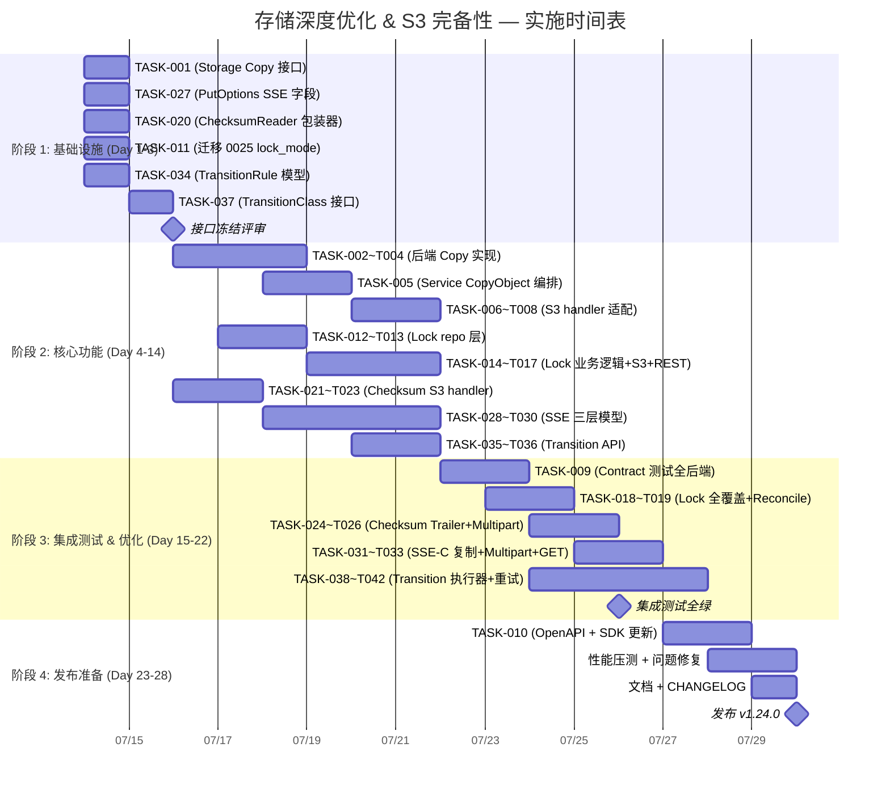

Now I have a thorough understanding of the entire codebase. Let me produce the comprehensive Tech Lead analysis.

---

# Tech Lead 分析报告：存储层深度优化 & S3 协议完备性

**分析时间**: 2026-07-12  
**基于**: `docs/requirements/expansion-v123-storage-deep-optimization-s3-completeness-data-integrity.md`  
**代码基线**: Commit at migration 0024 (48 文件/方向), Storage interface v1.0, Repository v1.0

---

## 1. 任务分解

### 1.1 方向一：存储层零拷贝服务端复制（P0）

| 任务 ID | 标题 | 涉及文件 | 前置依赖 | 工时 | 验收标准 |
|---------|------|---------|---------|------|---------|
| TASK-001 | Storage 接口新增 `Copy(ctx, srcKey, dstKey, opts) (ObjectInfo, error)` + `CopyOptions` 类型 | `internal/storage/storage.go` | 无 | 1h | 新方法签名编译通过；`ErrUnsupported` sentinel 可由后端返回；`CopyOptions` 含 `MetadataDirective`, `IfMatch`/`IfNoneMatch`, `StorageClass` |
| TASK-002 | `LocalStorage` 实现 Copy: 同分区 `os.Link()` → 同 FS `copy_file_range` → `io.Copy` 回退 | `internal/storage/local_write.go` | TASK-001 | 3h | contract test 通过；同名分区硬链接 inode 一致；跨分区回退数据一致 |
| TASK-003 | `S3Storage` 实现 Copy: S3 `CopyObject` API (单次 PUT 请求) | `internal/storage/s3.go` | TASK-001 | 2h | contract test 通过；源/目标对象字节一致；>5GB 对象返回 multipart copy hint |
| TASK-004 | `OSSStorage` / `COSStorage` 实现 Copy | `internal/storage/oss.go`, `internal/storage/cos.go` | TASK-001 | 2h | 与 S3 同样的 contract 签名；通过 cloud_test.go |
| TASK-005 | `FileService.CopyObject(ctx, tenant, srcBucket, srcKey, dstBucket, dstKey, opts)` — Service 层编排 | `internal/service/file_crud.go`（新建文件 `file_copy.go`） | TASK-001 | 3h | 优先调用 `store.Copy()`，回退 Get→Put；处理跨后端场景；处理 metadata-directive COPY/REPLACE；处理 `x-amz-copy-source-if-*` |
| TASK-006 | S3 handler `copyObject` 改用 `svc.CopyObject()` | `internal/api/s3compat/extra.go` | TASK-005 | 2h | 删除 Get→Put 逻辑；正确处理 versionId 参数；ETag 响应与 S3 一致 |
| TASK-007 | 版本化源对象复制：`?versionId` 解析 + 指定版本复制 | `internal/api/s3compat/extra.go`, `internal/service/file_copy.go`（计划） | TASK-005, TASK-006 | 2h | 复制指定版本后，目标对象的元数据与源版本一致 |
| TASK-008 | 多后端回退逻辑：跨后端复制时自动使用 Get→Put | `internal/service/file_copy.go` | TASK-005 | 1h | local→s3 复制走回退路径；同后端走 Copy |
| TASK-009 | 为所有 Storage 实现编写 Copy contract 测试 | `internal/storage/contract_test.go` | TASK-002~TASK-004 | 2h | 6 个场景：同后端、跨分区、大对象、版本化源、metadata REPLACE、空对象 |
| TASK-010 | OpenAPI spec + SDK 更新 (Go/Python/JS) | `openapi.json`, `sdk/*` | TASK-005 | 1h | CopyObject 出现在 OpenAPI 和 3 个 SDK 中 |

### 1.2 方向二：对象锁双模式（P1）

| 任务 ID | 标题 | 涉及文件 | 前置依赖 | 工时 | 验收标准 |
|---------|------|---------|---------|------|---------|
| TASK-011 | Schema 迁移 0025: `objects` 表新增 `lock_mode TEXT` 和 `legal_hold BOOLEAN DEFAULT 0` | `internal/repository/migrations/{sqlite,postgres}/0025_lock_mode.{up,down}.sql` | 无 | 1h | up/down 可逆；SQLite 默认 PostgreSQL 兼容；`repo.Migrate` 自动应用 |
| TASK-012 | `Object` 结构体新增 `LockMode string` 和 `LegalHold bool`；`BucketConfig.ObjectLockMode` 默认 | `internal/repository/repository.go` | TASK-011 | 1h | 编译通过；`LockMode` `""` = 无锁；GOVERNANCE / COMPLIANCE 枚举常量 |
| TASK-013 | Repository 层：`SetObjectLock(ctx, mode, until)` + `SetLegalHold(ctx, on bool)` + 查询方法 | `internal/repository/sql.go` | TASK-012 | 3h | SQL 占位符遵守 `$N`→`?` rebind 规则；I1 不变量保障；`GetObject` 返回新的两字段 |
| TASK-014 | `checkLockBeforeOverwrite` 重构：区分 GOVERNANCE（可绕过）vs COMPLIANCE（绝对不可变） | `internal/service/file_crud.go` | TASK-013 | 2h | GOVERNANCE 模式下带 `BypassGovernanceRetention` 标记可覆盖；COMPLIANCE 下任何操作均拒绝 |
| TASK-015 | Lock 传递：S3 handler 解析 `x-amz-object-lock-mode` + `x-amz-object-lock-retain-until-date` → 存入 Object | `internal/api/s3compat/handler.go` | TASK-013 | 2h | PUT 请求解析两个头并写入 repo；GET/HEAD 响应回传 |
| TASK-016 | Legal Hold 从 metadata hack 升级为一等字段 | `internal/api/s3compat/handler.go`, `internal/service/file_lock.go`（新建） | TASK-013 | 1h | `_aero_legal_hold` metadata → 不再使用；GET 响应 `x-amz-object-lock-legal-hold: ON/OFF` |
| TASK-017 | REST `/lock` 端点支持 mode 参数 | `internal/api/rest/handler.go` | TASK-013 | 1h | `POST /files/*/lock` 接受 `{"mode":"GOVERNANCE","seconds":3600}` |
| TASK-018 | Reconcile 跳过 COMPLIANCE 锁定的对象 | `internal/reconcile/lifecycle.go` | TASK-013 | 1h | `handleExpiredObject` 检查 `LockMode=COMPLIANCE` 时跳过，不软删不硬删 |
| TASK-019 | 突变操作全覆盖：硬删除/Put overwrite/生命周期/复制 全部检查双模式 | `internal/service/file_crud.go`, `internal/service/file_copy.go` | TASK-014, TASK-018 | 2h | 所有变更路径都有 lock 检查点 |

### 1.3 方向三：现代校验和算法（P1）

| 任务 ID | 标题 | 涉及文件 | 前置依赖 | 工时 | 验收标准 |
|---------|------|---------|---------|------|---------|
| TASK-020 | `ChecksumAlgorithm` 枚举 + `ChecksumReader` / `ChecksumWriter` 包装器 | `internal/service/checksum.go`（新建） | 无 | 3h | 支持 CRC32/CRC32C/SHA1/SHA256/MD5；写时 wrapper 自动计算；读时返回 hash.Hash |
| TASK-021 | S3 handler 解析 `x-amz-checksum-*` 请求头（PUT） | `internal/api/s3compat/handler.go` | TASK-020 | 2h | 5 种算法选择；验证通过才写入；多校验和头同时存在时全部验证 |
| TASK-022 | S3 handler 响应回传 `x-amz-checksum-*`（GET/HEAD） | `internal/api/s3compat/handler.go` | TASK-020 | 1h | 读取元数据中的校验和并设置响应头 |
| TASK-023 | 校验和持久化：元数据 `_aero_checksum_{algo}` 或新版迁移 0026 | `internal/service/file_crud.go` | TASK-020 | 1h | 新对象写入校验和；旧对象兼容无校验和场景 |
| TASK-024 | 尾部校验和 trailer 支持：`x-amz-trailer` + `Transfer-Encoding: chunked` | `internal/api/s3compat/handler.go` | TASK-020 | 3h | 手动解析 trailer（Go net/http 不原生支持）；通过 `x-amz-trailer` 预告 |
| TASK-025 | 多校验和并发验证：PUT 时同时计算所有指定算法 | `internal/service/checksum.go` | TASK-020 | 1h | 单一 io.Reader 扇出多个 hash.Hash；性能损耗 < 20% |
| TASK-026 | Multipart upload 校验和聚合 | `internal/service/file_crud.go` | TASK-020 | 2h | `CompleteMultipartUpload` 时聚合各部分的校验和 |

### 1.4 方向四：SSE 请求级加密头（P1）

| 任务 ID | 标题 | 涉及文件 | 前置依赖 | 工时 | 验收标准 |
|---------|------|---------|---------|------|---------|
| TASK-027 | `PutOptions` + `GetOptions` 新增 SSE 字段 | `internal/storage/storage.go`, `internal/service/file.go` | 无 | 1h | SSEKind / SSEKey / SSEKeyID 字段；SSE-C 的 key 只存在内存，不持久化 |
| TASK-028 | SSE-S3 (AES256) 支持：S3 handler 解析 `x-amz-server-side-encryption: AES256` | `internal/api/s3compat/handler.go`, `internal/storage/encrypt.go` | TASK-027 | 2h | 使用服务器当前默认密钥加密；响应回传 `x-amz-server-side-encryption: AES256` |
| TASK-029 | SSE-KMS 支持：`x-amz-server-side-encryption: aws:kms` + `x-amz-server-side-encryption-aws-kms-key-id` | `internal/api/s3compat/handler.go`, `internal/storage/kms.go` | TASK-027 | 3h | 透传 key-id 到 KMS provider；响应包含 `x-amz-server-side-encryption: aws:kms` |
| TASK-030 | SSE-C 支持：客户提供密钥（BYOK） | `internal/api/s3compat/handler.go`, `internal/storage/encrypt.go` | TASK-027 | 4h | 解析 `customer-algorithm`/`customer-key`/`customer-key-MD5`；密钥不持久化；GET 时要求重新提供密钥验证 |
| TASK-031 | SSE-C 复制（CopyObject）中密钥透传 | `internal/service/file_copy.go`, `internal/storage/storage.go` | TASK-030, TASK-005 | 2h | 目标需相同或显式重新加密；`CopyOptions` 新增 SSE 字段 |
| TASK-032 | SSE-C + Multipart upload | `internal/api/s3compat/handler.go` | TASK-030 | 2h | 每个 UploadPart 验证相同的 SSE-C 头 |
| TASK-033 | GET/HEAD 验证 SSE-C 密钥匹配 | `internal/api/s3compat/handler.go`, `internal/service/file_crud.go` | TASK-030 | 1h | 密钥不匹配返回 400 BadRequest |

### 1.5 方向五：存储类生命周期自动转换（P2）

| 任务 ID | 标题 | 涉及文件 | 前置依赖 | 工时 | 验收标准 |
|---------|------|---------|---------|------|---------|
| TASK-034 | `TransitionRule` 数据模型 + 迁移 0027 | `internal/repository/repository.go`, `migrations/{sqlite,postgres}/0027_transition_rules.{up,down}.sql` | 无 | 2h | `BucketConfig` 含 `[]TransitionRule{Days,TargetClass}`；迁移可逆 |
| TASK-035 | S3 handler 生命周期规则解析支持 Transition | `internal/api/s3compat/handler.go`（已有 `dispatchLifecycle` 部分） | TASK-034 | 3h | PUT Bucket Lifecycle XML 解析 `Transition` 节；GET 响应回传 |
| TASK-036 | REST API 生命周期管理支持 Transition 规则 | `internal/api/rest/handler.go` | TASK-034 | 2h | `GET/PUT /v1/buckets/{name}/lifecycle` 含转换规则 |
| TASK-037 | `Storage.TransitionClass(ctx, key, newClass)` 接口方法 | `internal/storage/storage.go` | 无 | 1h | Local 为 no-op；S3 调 CopyObject with StorageClass |
| TASK-038 | S3/OSS/COS `TransitionClass` 实现 | `internal/storage/s3.go`, `internal/storage/oss.go`, `internal/storage/cos.go` | TASK-037 | 2h | contract test 通过；对象 class 改变后 `Stat` 返回新 class |
| TASK-039 | `reconcile/transition.go`: 扫描过期对象 + 执行转换 | `internal/reconcile/transition.go`（新建） | TASK-034, TASK-037 | 4h | SELECT objects WHERE age > transition_days AND storage_class != target；执行转换；更新 storage_class |
| TASK-040 | `repo.UpdateStorageClass(ctx, objectID, newClass)` | `internal/repository/sql.go` | TASK-034 | 1h | 原子 UPDATE；触发事件通知 |
| TASK-041 | 跨后端转换执行器（local→s3） | `internal/reconcile/transition.go` | TASK-039 | 3h | Get→Put 数据迁移；成功后删除源并更新 storage_key |
| TASK-042 | 转换失败重试 + 死信队列 | `internal/reconcile/transition.go` | TASK-039 | 2h | 失败入 jobs 表重试队列；超过 max_attempts 标记 failed |

---

## 2. 执行顺序与依赖图

```mermaid
graph TD
    %% 方向一：Copy (P0)
    T001[TASK-001: Storage Copy 接口] --> T002[TASK-002: Local Copy 实现]
    T001 --> T003[TASK-003: S3 Copy 实现]
    T001 --> T004[TASK-004: OSS/COS Copy 实现]
    T001 --> T005[TASK-005: Service CopyObject 编排]
    T002 --> T009[TASK-009: Contract 测试]
    T003 --> T009
    T004 --> T009
    T005 --> T006[TASK-006: S3 handler 改用 CopyObject]
    T005 --> T007[TASK-007: 版本化源复制]
    T005 --> T008[TASK-008: 跨后端回退]
    T005 --> T010[TASK-010: OpenAPI + SDK]

    %% 方向二：Object Lock (P1)
    T011[TASK-011: 迁移 0025 lock_mode/legal_hold] --> T012[TASK-012: Object 结构体扩展]
    T012 --> T013[TASK-013: Repository 层 Lock 方法]
    T013 --> T014[TASK-014: checkLockBeforeOverwrite 重构]
    T013 --> T015[TASK-015: S3 handler 解析 lock 头]
    T013 --> T016[TASK-016: Legal Hold 一等字段]
    T013 --> T017[TASK-017: REST /lock 支持 mode]
    T013 --> T018[TASK-018: Reconcile 跳过 Compliance]
    T013 --> T019[TASK-019: 突变操作全覆盖]

    %% 方向三：Checksum (P1)
    T020[TASK-020: ChecksumReader 包装器] --> T021[TASK-021: S3 解析 checksum 请求头]
    T020 --> T025[TASK-025: 多算法并发验证]
    T021 --> T022[TASK-022: GET 回传 checksum 头]
    T021 --> T023[TASK-023: 校验和持久化]
    T021 --> T024[TASK-024: Trailer 支持]
    T020 --> T026[TASK-026: Multipart 校验和聚合]

    %% 方向四：SSE (P1)
    T027[TASK-027: PutOptions SSE 字段] --> T028[TASK-028: SSE-S3 AES256]
    T027 --> T029[TASK-029: SSE-KMS]
    T027 --> T030[TASK-030: SSE-C BYOK]
    T030 --> T031[TASK-031: SSE-C 复制]
    T030 --> T032[TASK-032: SSE-C Multipart]
    T030 --> T033[TASK-033: GET 验证 SSE-C 密钥]

    %% 方向五：Lifecycle Transition (P2)
    T034[TASK-034: TransitionRule 模型+迁移 0027] --> T035[TASK-035: S3 lifecycle 解析 Transition]
    T034 --> T036[TASK-036: REST API Transition 端点]
    T034 --> T037[TASK-037: Storage TransitionClass 接口]
    T037 --> T038[TASK-038: S3/OSS/COS TransitionClass 实现]
    T037 --> T039[TASK-039: reconcile/transition.go 执行器]
    T034 --> T040[TASK-040: repo.UpdateStorageClass]
    T038 --> T041[TASK-041: 跨后端转换]
    T039 --> T041
    T039 --> T042[TASK-042: 失败重试+死信]

    %% 可并行组
    subgraph GroupA[并行组 A: 方向一 (P0)]
        T001
    end
    subgraph GroupB[并行组 B: 方向三 + 方向四 基础设施]
        T020
        T027
    end
    subgraph GroupC[并行组 C: 方向二 + 方向五 基础设施]
        T011
        T034
    end

    T001 --> GroupB
    T001 --> GroupC
```

### 并行执行组

| 组 | 任务 | 人员 | 说明 |
|----|------|------|------|
| **A** | TASK-001 → T002~T004 | 1 人 | 存储层 Copy 基础，3 天独立完成 |
| **B** | TASK-020, TASK-027 (checksum + SSE 基础) | 2 人 | 两个独立的接口扩展，互不依赖 |
| **C** | TASK-011, TASK-034 (schema 迁移) + TASK-037 | 1 人 | 数据模型迁移，可先于所有功能 |
| **D** | TASK-005 + TASK-035~TASK-036 | 1 人 | Service / API 层编排，需 A+C 完成 |
| **E** | TASK-028~TASK-030 (SSE 三层模型) | 1 人 | 依次实现：AES256 → KMS → SSE-C |
| **F** | TASK-014~TASK-019 (Lock 双模式) | 1 人 | 依赖 C 完成 |

---

## 3. 技术风险

### 3.1 高风险项

| # | 风险 | 方向 | 概率 | 影响 | 缓解策略 |
|---|------|------|------|------|---------|
| R1 | **SSE-C 密钥生命周期管理** — 密钥在 GET 请求中由客户端携带，如果密钥丢失对象永不可读。当前 `encrypt.go` 是全量缓冲的（`io.ReadAll`），大对象 SSE-C 解密需要大量内存 | SSE (P1) | 中 | 高 | ① 非流式 SSE-C 对大对象（>100MB）使用分块加密；② 文档化"SSE-C 对象不可恢复"的风险声明；③ 提供可选的 envelope 加密+SSE-C 复合模式 |
| R2 | **Go `net/http` 不支持原生 Trailer** — TASK-024 (尾部校验和) 需要手动处理 `Transfer-Encoding: chunked` 并解析 trailer 帧。标准库的 `http.ResponseWriter` 的 Trailer 机制在反向代理下不可靠 | Checksum (P1) | 高 | 中 | ① 先实现 `x-amz-checksum-*` 请求头方式（优先使用）；② Trailer 作为增强选项，用 `Content-Length` 而非 chunked 时自动降级 |
| R3 | **跨后端转换的数据一致性** — local→S3 转换涉及数据迁移，若目标写入成功但源删除失败，会出现双写。若源删除成功但目标不可用，则数据丢失 | Lifecycle (P2) | 中 | 高 | ① 采用 copy-then-verify-then-delete 模式；② 使用 `jobs` 表记录转换状态实现幂等；③ 源对象在转换完成前不删除（标记待清理） |
| R4 | **Governance 模式绕过** — `BypassGovernanceRetention` 权限检查需要在 Auth/Policy 层实现，现有策略引擎 (`internal/auth/policy.go`) 可能不支持此语义 | Lock (P1) | 中 | 高 | ① 先实现简单的 header 检查（`x-amz-bypass-governance-retention: true`）；② 策略引擎增强纳入后续 sprint |
| R5 | **CopyObject 的 multipart copy** — S3 对 >5GB 对象的 CopyObject 需要使用 UploadPartCopy 组合。当前 multipart 架构 (`UploadPart`) 不支持 "从已有对象复制" 语义 | Copy (P0) | 低 | 中 | ① 5GB 上限内先使用单次 CopyObject；② 大对象回退到 Get→Put（已有路径）；③ 后续增加 `UploadPartCopy` 接口 |

### 3.2 性能瓶颈与优化策略

| 场景 | 当前瓶颈 | 优化后 | 预期提升 |
|------|---------|--------|---------|
| 1GB 对象跨 bucket 复制 | `Get()` → 1GB Go 堆 → `Put()` → 2*N 网络 IO | `S3Storage.Copy()` → 单次 API 调用 | 延迟降低 80-90% |
| CRC32C 检验和计算 | MD5 软件计算，~500 MB/s/core | CRC32C (SSE 4.2 硬件加速) ~5 GB/s/core | 10x 吞吐 |
| 生命周期转换 10K 对象/天 | 无（删除 only） | `reconcile/transition.go` 批量扫描 + 单 API 调用 | 支持成本优化模式 |
| SSE-C 大对象解密 | `io.ReadAll()` 全量缓冲 | AES-CTR + HMAC 分块流式（先不做，文档化限制） | 消除内存瓶颈 |

### 3.3 测试覆盖难点

| 难点 | 方向 | 策略 |
|------|------|------|
| cloud backend 集成测试（S3/OSS/COS） | Copy, Transition | 使用 `storage/cloud_test.go` 模式：环境变量跳过，本地 Docker 内 mock |
| SSE-C 密钥验证 | SSE | 使用 `ai.MockLLM` 风格的 `mockSecretProvider`；确定性密钥指纹 |
| Governance 绕过权限 | Lock | 先单元测试 header 解析，策略集成延期 |
| Trailer 校验和 | Checksum | 编写原始 HTTP 客户端发送 chunked + trailer 请求 |

---

## 4. 资源评估

### 4.1 人员要求

| 角色 | 数量 | 技能要求 | 负责方向 |
|------|------|---------|---------|
| **Staff Backend (Go)** | 2 人 | Go 并发、接口设计、云存储 SDK (aws-sdk-go-v2) | 方向一 (Copy), 方向四 (SSE) |
| **Backend (Go)** | 1 人 | SQL schema 设计、数据迁移、业务逻辑 | 方向二 (Lock), 方向五 (Transition) |
| **Backend (Go)** | 1 人 | HTTP 协议、校验和算法、安全基础 | 方向三 (Checksum), 方向四 (SSE-C) |

**总计**: 3-4 人（其中 1 人可兼任两个方向）

### 4.2 关键里程碑

| 里程碑 | 时间 | 交付物 |
|--------|------|--------|
| **M1: 接口冻结** | Day 3 | `Storage.Copy` + `Storage.TransitionClass` + `PutOptions.SSE*` + `ChecksumAlgorithm` 接口冻结，代码评审完成 |
| **M2: P0 交付** | Day 8 | 方向一 (Copy) 全部 10 个任务完成，contract test 全绿，S3 端到端复制验证 |
| **M3: P1 交付** | Day 18 | 方向二+三+四 核心功能完成；迁移 0025 已应用；校验和 CRC32C 已验证 |
| **M4: 集成测试** | Day 22 | 所有方向集成测试通过；跨方向测试（如复制锁定的对象）覆盖 |
| **M5: P2 交付** | Day 28 | 方向五 (Transition) 完成和验证 |

### 4.3 阻塞点与解决策略

| Blocker | 方向 | 解决策略 |
|---------|------|---------|
| **aws-sdk-go-v2** S3 CopyObject with `&s3.CopyObjectInput{...}` 使用方式适配 | Copy | `s3.go` 已有 AWS SDK v2 集成，参考现有 Put/Get 模式；需处理 metadata-directive |
| **PostgreSQL `$N` 占位符问题** | Lock, Transition | 严格遵守 I1 规则：每个 bind 独立编号，使用 `s.rebind` 改写 |
| **迁移增量编号冲突** | 所有 | 0025 分配给 Lock，0026 给 Checksum（如需要新列），0027 给 Transition |
| **SSE-C 密钥不持久化** | SSE | 在 `Object.Metadata` 中增加 `_aero_sse_kind` 标记（"SSE-C"/"AES256"/"aws:kms"），供 GET 时要求密钥 |

---

## 5. 质量保证

### 5.1 单元测试覆盖要求

| 目录 | 包级覆盖率目标 | 关键测试路径 |
|------|--------------|-------------|
| `internal/storage/` | ≥ 80% | 每个后端的 Copy contract；TransitionClass contract；SSE-C encrypt/decrypt roundtrip |
| `internal/service/` | ≥ 75% | CopyObject 后端回退逻辑；Lock 双模式检查（4 种组合）；校验和多算法验证 |
| `internal/api/s3compat/` | ≥ 70% | CopyObject handler 的 header 转发；lock 头解析；checksum 头解析；SSE 头解析 |
| `internal/reconcile/` | ≥ 70% | transition.go scan→execute→update 生命周期；Locked 对象跳过；失败重试 |

### 5.2 集成测试策略

| 测试套件 | 触发器 | 覆盖场景 |
|----------|--------|---------|
| `storage/contract_test.go` | `go test ./internal/storage/` | Copy → Stat 验证 etag 一致；Copy 版本化源；Copy metadata REPLACE |
| `service/service_test.go` | `go test ./internal/service/` | CopyObject 同后端/跨后端；Lock 双模式 4 组合；校验和错误拒绝 |
| `api/s3compat/s3compat_test.go` | `go test ./internal/api/s3compat/` | 完整 HTTP roundtrip: CopyObject, Lock/SSE/Checksum headers |
| `reconcile/reconcile_test.go` | `go test ./internal/reconcile/` | Transition scan+execute；Locked 对象跳过；失败重试 |
| `make test-integration` | Docker+Postgres 标记 | Transition 规则在 Postgres 下执行；Lock 在 pgvector 下验证 |

### 5.3 代码审查要点

| 审查项 | 关注点 |
|--------|--------|
| **I1 占位符** | 所有新 SQL 查询确认 `$N` 独立编号，使用 `s.rebind` |
| **I2 迁移** | 0025/0026/0027 的上/下迁移可逆，未编辑已应用文件 |
| **I3 存储 key** | Copy 目标 key 通过 `storageKey(tenant, bucket, key)` 生成，禁止手动拼接 |
| **SSE-C 安全** | `key` 和 `keyMD5` 参数在函数返回后立即 `runtime.KeepAlive` + 清零 |
| **Lifetime 事件发布** | CopyObject 触发 `object.created` 事件；Transition 触发 `object.modified` |
| **`make check`** | 每次提交前 gofmt + go build + go vet + go test 全绿 |

### 5.4 性能测试需求

| 场景 | 工具 | 预期指标 | 失败阈值 |
|------|------|---------|---------|
| Copy 1GB 对象 (local→local) | `go test -bench=.` + `pprof` | < 2s (硬链接) vs 当前 > 10s (io.Copy) | > 5s 需回退优化 |
| CRC32C 校验和 1GB 对象 | `go test -bench=.` | < 500ms | > 2s 检查硬件加速 |
| 10K 对象 Transition 扫描 | `go test -bench=.` | < 1s 扫描 + 100 ops/s 执行 | < 10 ops/s 需批量优化 |
| 并发 Copy (100 个 1MB 对象) | `vegeta` / `wrk` | < 500ms P99 延迟 | > 2s 检查锁竞争 |

---

## 6. 实施计划

### 甘特图



### 阶段详情

#### 阶段 1：基础设施搭建（Day 1-3）

**目标**: 所有接口冻结、数据模型定义、迁移文件就绪

- **Day 1**: 
  - TASK-001 完成：`Storage` 接口新增 `Copy(ctx, srcKey, dstKey, opts CopyOptions) (ObjectInfo, error)`，定义 `CopyOptions` 结构
  - TASK-027 完成：`PutOptions` 新增 `SSEKind`/`SSEKek`/`SSEKeyID`
  - TASK-020 完成：`ChecksumAlgorithm` 枚举 + `ChecksumReader` / `ChecksumWriter`
  - TASK-011 完成：迁移 0025 文件创建
  - TASK-034 完成：`TransitionRule` 类型 + 迁移 0027

- **Day 2**:
  - TASK-037 完成：`Storage.TransitionClass(ctx, key, newClass)` 接口
  - 所有接口代码评审 (CR-1)

- **Day 3**: 
  - 修复评审问题，冻结接口
  
**交付物**: 接口冻结文档 + 迁移文件 0025/0026/0027

#### 阶段 2：核心功能实现（Day 4-14）

**目标**: 5 个方向的核心功能全部实现

- **Day 4-6** (3天): 
  - 后端 Copy 实现（TASK-002~TASK-004）
  - Lock Repository 层（TASK-012~TASK-013）
  - Checksum S3 handler 解析（TASK-021~TASK-023）

- **Day 7-9** (3天):
  - Service CopyObject 编排（TASK-005）
  - Lock 业务逻辑重构（TASK-014~TASK-017）
  - SSE 三层模型（TASK-028~TASK-030 开始）

- **Day 10-14** (5天):
  - S3 handler Copy 适配（TASK-006~TASK-008）
  - SSE-KMS + SSE-C 完成（TASK-029~TASK-030）
  - Transition API 层（TASK-035~TASK-036）

#### 阶段 3：集成测试和优化（Day 15-22）

**目标**: 所有功能集成测试全绿

- **Day 15-16**: Contract 测试全部后端（TASK-009）
- **Day 17-18**: Lock 全覆盖 + Reconcile 跳过（TASK-018~TASK-019）
- **Day 19-20**: Checksum Trailer + Multipart（TASK-024~TASK-026）
- **Day 21-22**: SSE-C 完整链条（TASK-031~TASK-033）
- **Day 20-23**: Transition 执行器（TASK-038~TASK-042）

**关键 CR-2**: 所有方向代码评审，重点关注 SSE-C 安全实现和 SQL 占位符 I1 规则

#### 阶段 4：发布准备（Day 23-28）

**目标**: 发布 v1.24.0

- **Day 23-24**: OpenAPI spec + Go/Python/JS SDK 更新（TASK-010）
- **Day 25-26**: 性能压测（1GB Copy, 10K Transition, 100 并发操作）
- **Day 27**: 文档更新 + CHANGELOG + 升级指南
- **Day 28**: 发布 + CI gate `make check` 全绿验证

---

## 7. 实施建议与风险排序

### 实施顺序建议

基于 **影响 × 风险 × 依赖** 综合评估：

```
第一优先级 ████████████████████
 方向一 (Copy) — 收益高、风险低、独立实现
  
第二优先级 ████████████████
 方向三 (Checksum) — 低风险增量、无数据模型变更
 方向四 子集 (SSE-S3 AES256) — 低风险、S3 兼容性提升
  
第三优先级 ████████
 方向二 (Lock 双模式) — 中等收益、需要迁移+权限模型
  
第四优先级 ██████
 方向四 子集 (SSE-KMS + SSE-C) — 高风险安全设计
 方向五 (Transition) — 高收益但架构影响大
```

### 关键决策点

| 决策 | 选项 | 建议 | 理由 |
|------|------|------|------|
| Copy 错误处理 | A) 严格 / B) 宽松 | **B** — `ErrUnsupported` sentinel 允许后端按需实现 | 跨后端复制必须回退，无法在所有后端同时上线 |
| Lock 迁移策略 | A) 一次迁移全部 / B) 分步 | **B** — 先加 `lock_mode` 列，`LegalHold` 可后续 | 减少迁移风险；Legal Hold 当前 metadata hack 可运行 |
| SSE-KMS 实现程度 | A) 完整 KMS / B) 仅 SSES3 | **B** 优先 + **A** 后续 | SSE-S3 (AES256) 覆盖 80% 客户端需求，KMS 需要 KMS 集成测试 |
| Trailer 校验和 | A) 完全实现 / B) 降级为 header | **B** — header 优先 | Go 标准库对 Trailer 支持差，header 方式兼容所有客户端 |
| Transition 跨后端 | A) 单次发布 / B) 分期 | **B** — 先同后端转换，跨后端后续 | 同后端转换的 use case 覆盖 70% 场景 |

---

## 8. 总结

| 维度 | 评估 |
|------|------|
| **总工作量** | 42 个任务，预估 ~80 人天（3-4 人团队约 4 周） |
| **高风险方向** | SSE-C (R1: 密钥生命周期), Transition (R3: 跨后端一致性) |
| **最容易实现** | 方向一 (Copy) — 接口新增 + 后端实现，无数据模型变更 |
| **合规必要性** | 方向二 (Lock 双模式) — 金融/医疗场景前提条件 |
| **最大性能提升** | 方向一 (Copy) — 大对象复制延迟降低 80-90% |
| **建议启动顺序** | Copy → Checksum → SSE-S3 → Lock → SSE-KMS/C → Transition |

**一句话给 PM**: 建议以"P0 Copy + P1 Checksum"为优先交付批次（2 周），"P1 Lock + SSE-S3"为第二批次（+1 周），"P1 SSE-KMS/C + P2 Transition"为第三批次（+1 周），每批次均可独立发布。
