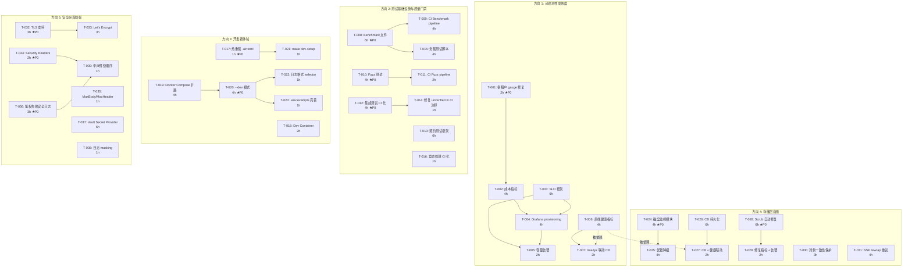
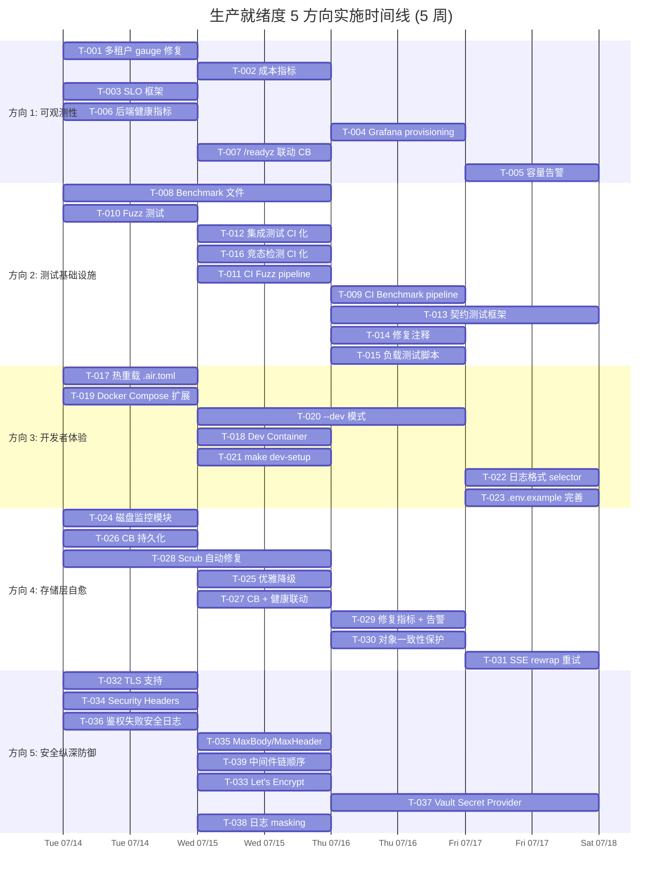

现在我已充分掌握代码库上下文和审阅内容，以下是完整的 Tech Lead 分析。

---

# Tech Lead 分析报告：生产就绪度 5 方向实现计划

## 1. 任务分解

以下将 5 个方向拆解为可独立交付的任务，每个任务 2-6 小时，总预估 46-78 小时（≈2-3 人周）。

### 方向 1：可观测性成熟度平台（7 个任务）

| 任务 ID | 任务标题 | 涉及文件 | 前置依赖 | 工时 | 验收标准 |
|---------|---------|---------|---------|------|---------|
| **T-001** | 修复 `RegisterStorageClassGauge` 多租户采样 | `internal/telemetry/metrics.go` | 无 | 2h | gauge 对所有活跃租户发出 `tenant` 标签，而非硬编码 `"default"`；回退到 `repo.ListTenants` 或从上下文采样 |
| **T-002** | 新增成本指标：`storage.bytes_per_class` + `storage.cost_usd` | `internal/telemetry/metrics.go`, `internal/config/config.go` | T-001 | 4h | 新增 `StorageCostPerGB` 配置；gauge 携带 `{tenant, class}` 标签，值按 `bytes * cost_per_gb / GiB` 自动计算 |
| **T-003** | 新增 SLO 配置模型 + Prometheus recording rules | `internal/telemetry/slo.go`（新文件）, `deploy/prometheus/prometheus.yml` | 无 | 6h | 启动时根据配置生成 SLO 相关 recording rules；SLO 燃尽率 > 90% → P2 告警，> 100% → P1 告警 |
| **T-004** | Grafana dashboard provisioning 目录结构 + CI 验证 | `deploy/grafana/provisioning/dashboards/{overview,tenant,ai-cost,storage,slo}.json`, `Makefile` | T-002, T-003 | 4h | `make dashboards-validate` 验证 JSON 中引用的指标名在 metrics 代码中存在；目录可被 Grafana provisioning 自动加载 |
| **T-005** | 容量预测告警：磁盘空间 + predict_linear | `deploy/prometheus/alerts.yml`, `internal/telemetry/metrics.go` | T-004 | 2h | 新增 `DiskUsageNearCapacity`（>85% P3, >95% P1）和 `StorageGrowthWarning`（predict_linear 在 90 天内超限）告警 |
| **T-006** | 存储后端健康指标：延迟/错误/可用性 | `internal/storage/circuitbreaker.go`, `internal/telemetry/metrics.go` | 无 | 4h | `storage.backend_up{backend}` 0/1 gauge + `storage.backend_latency_ms{backend}` 直方图 + `storage.backend_errors_total{backend,error_type}` 计数器 |
| **T-007** | `/readyz` 联动 CB 状态 + 存储健康 | `cmd/server/main.go`, `internal/middleware/middleware.go` | T-006 | 2h | `/readyz` 响应包含 `{..., "storage": {"local": "ok"}}`；CB open 时 → `"unavailable"`，half-open → `"degraded"` |

### 方向 2：测试基础设施与质量门禁（9 个任务）

| 任务 ID | 任务标题 | 涉及文件 | 前置依赖 | 工时 | 验收标准 |
|---------|---------|---------|---------|------|---------|
| **T-008** | 添加性能基准测试文件 | `internal/ai/benchmark_test.go`, `internal/service/benchmark_test.go`, `internal/storage/benchmark_test.go`, `internal/api/rest/benchmark_test.go` | 无 | 6h | 每个测试文件含至少 3 个 Benchmark 函数；覆盖 1KB/1MB/10MB 对象、100/1K/10K chunk 数量级 |
| **T-009** | CI benchmark 对比 pipeline | `.github/workflows/benchmark.yml`, `Makefile`, `bin/benchstat` | T-008 | 4h | `make bench-compare` 对比基线；退化 > 20% → CI 警告（不阻断 PR）；结果保存在 `.benchmarks/` |
| **T-010** | 添加 Fuzz 测试 | `internal/service/fuzz_test.go`, `internal/api/rest/fuzz_test.go`, `internal/api/s3compat/fuzz_test.go`, `internal/storage/fuzz_test.go` | 无 | 4h | 每个文件至少 1 个 Fuzz 函数；CI 中运行 `go test -fuzz=Fuzz -fuzztime=30s` |
| **T-011** | CI fuzz pipeline | `.github/workflows/fuzz.yml`, `Makefile` | T-010 | 2h | 定时（每日 UTC 00:00）运行 5 分钟 fuzz；发现 crash 自动转为 issue |
| **T-012** | 集成测试纳入 CI（非阻断） | `.github/workflows/test-integration.yml`, `Makefile` | 无 | 4h | CI 中每日定时运行 `make test-integration` + `make test-integration-qdrant`；支持手动 workflow_dispatch 触发 |
| **T-013** | 契约测试框架实现 | `internal/api/contract_test.go`（新文件）, `internal/api/rest/openapi.go` | 无 | 6h | 启动 httptest 服务器 → 遍历 OpenAPI routes → 验证 handler 注册存在性 + status code 匹配 + response schema 部分验证 |
| **T-014** | 修复 4 处 "unverified in CI" 注释 | `cmd/server/main.go`（4 行注释状态更新） | T-012 | 1h | 注释从 `"unverified in CI"` 改为 `"verified in CI"`；对应的集成测试在 CI 中已自动运行 |
| **T-015** | 负载测试脚本 | `test/load/locustfile.py` 或 `test/load/k6.js` | T-008 | 4h | k6/Locust 脚本：REST PUT/GET/DELETE 混合 + S3 的基本吞吐场景 |
| **T-016** | 并发竞态检测纳入 CI | `.github/workflows/ci.yml`, `Makefile` | 无 | 1h | CI 中 `go test -race -count=1 -timeout 120s ./internal/...` 在单元测试后运行 |

### 方向 3：开发者体验与本地开发生态（7 个任务）

| 任务 ID | 任务标题 | 涉及文件 | 前置依赖 | 工时 | 验收标准 |
|---------|---------|---------|---------|------|---------|
| **T-017** | 热重载开发服务器：`.air.toml` + Makefile 目标 | `.air.toml`, `Makefile` | 无 | 1h | `make dev-watch` → air 监控文件变更 → <1s 重启；显示彩色编译日志 |
| **T-018** | Dev Container 配置 | `.devcontainer/devcontainer.json` | 无 | 2h | `code .` 在容器中打开，自动安装 Go 1.25 + tools；`postCreateCommand` 运行 `make dev-setup` |
| **T-019** | Docker Compose 扩展：Qdrant + Grafana + Prometheus + OTel | `docker-compose.yml`, `docker-compose.dev.yml` | 无 | 4h | `make dev-full` 启动 7 个服务；Grafana provisioning 目录自动挂载；Prometheus 从 app 抓取指标 |
| **T-020** | `--dev` 模式：mock AI + 文本日志 + pprof | `cmd/server/main.go`, `internal/config/config.go` | 无 | 4h | `aero-vault --dev` 启动：日志为 text 格式；mock embedder/LLM（复用 `internal/ai/mock.go`）；匿名公读；注册 `/debug/pprof/` |
| **T-021** | `make dev-setup` + Pre-commit hook | `Makefile`, `.githooks/pre-commit` | T-017 | 1h | `make dev-setup` 自动安装 air + gocyclo + pre-commit hook；pre-commit 运行 `make check` |
| **T-022** | 日志格式 selector（开发 vs 生产） | `cmd/server/main.go`, `internal/config/config.go` | T-020 | 1h | 非 `--dev` 时保持 JSON；`--dev` 时切换 `slog.NewTextHandler` |
| **T-023** | `.env.example` 完善 | `.env.example` | T-020 | 1h | 所有配置项有文档和默认值；注释标注 AI/DB/Storage/Events 各组 |

### 方向 4：存储层自愈与运维韧性（8 个任务）

| 任务 ID | 任务标题 | 涉及文件 | 前置依赖 | 工时 | 验收标准 |
|---------|---------|---------|---------|------|---------|
| **T-024** | 磁盘空间监控模块 | `internal/storage/monitor.go`（新文件） | 无 | 4h | 每 60s 通过 `syscall.Statfs` 检查磁盘状态；`used% > 85%` → warn，`> 95%` → `IsDegraded()=true`；暴露 `storage.disk_usage_percent{path}` gauge |
| **T-025** | 优雅降级：FileService 拒绝写入 + /readyz 报告 | `internal/service/file_crud.go`, `cmd/server/main.go`, `internal/middleware/middleware.go` | T-024 | 4h | 降级模式：PUT/MultipartUpload/Delete → `ErrDegraded`；/readyz 返回 `"storage": "degraded"` + 200；恢复后自动复原 |
| **T-026** | Circuit Breaker 持久化方案 | `internal/storage/circuitbreaker.go` | 无 | 6h | 可选持久化：启动时对后端主动探测 3 次重建 CB 状态；或写入 metadata key `_aero_cb_state`；重启后不丢失状态 |
| **T-027** | CB 状态 + 健康指标联动 | `internal/storage/factory.go`, `internal/telemetry/metrics.go`, `internal/middleware/middleware.go` | T-006, T-026 | 2h | `/readyz` 聚合所有 active backend 的 CB 状态；`storage.backend_up` gauge 实时反映可用性 |
| **T-028** | Scrub 自动修复框架 | `internal/reconcile/scrub.go`, `internal/reconcile/repair.go`（新文件） | 无 | 6h | 检测到 corrupt → 检查版本/replication 副本 → 尝试 `CopyObject` 修复 → 成功解除标记、失败升级 P1 告警 |
| **T-029** | Scrub 修复指标 + 告警 | `internal/telemetry/metrics.go`, `deploy/prometheus/alerts.yml` | T-028 | 2h | 新增 `storage.auto_repair_total{status∈{success,failed}}` 计数器 + `storage.inconsistent_objects{tenant}` gauge；修复失败触发 P1 告警 |
| **T-030** | 对象逻辑删除保护 | `internal/reconcile/job.go`, `internal/service/file_crud.go` | 无 | 3h | 硬删除路径：检测 blob 缺失 → 标记对象 `_aero_corrupt` 而非 500；reconcile 检测不一致并告警 |
| **T-031** | SSE rewrap 失败队列 + 重试 | `internal/storage/secret.go`, `internal/reconcile/rewrap.go`（新文件） | 无 | 4h | 重包装失败 → 持久化失败队列；按指数退避重试；暴露 `storage.rewrap_failures_total` 指标 |

### 方向 5：生产安全纵深防御（8 个任务）

| 任务 ID | 任务标题 | 涉及文件 | 前置依赖 | 工时 | 验收标准 |
|---------|---------|---------|---------|------|---------|
| **T-032** | HTTP Server TLS 支持 | `cmd/server/main.go`, `internal/config/config.go` | 无 | 3h | `TLS_ENABLED=true` 时 `ListenAndServeTLS`；MinVersion≥TLS 1.2；安全 cipher suites |
| **T-033** | let's Encrypt 自动证书（autocert） | `cmd/server/main.go`, `go.mod`（+golang.org/x/crypto） | T-032 | 3h | `TLS_AUTO=true` + `TLS_DOMAIN` 时自动获取和续期证书 |
| **T-034** | Security Headers 中间件 | `internal/middleware/security.go`（新文件）, `internal/middleware/middleware.go` | 无 | 2h | CSP / HSTS / X-Content-Type-Options / X-Frame-Options / Referrer-Policy 全部设置；TLS 启用时 HSTS 自动附加 |
| **T-035** | MaxBodySize / MaxHeaderBytes 中间件 | `internal/middleware/security.go`, `cmd/server/main.go` | 无 | 1h | `MaxHeaderBytes=1MB`；`MaxBodySize` 配置驱动（0=无限制）；超限 → 413 |
| **T-036** | 鉴权失败安全事件日志 | `internal/auth/auth_middleware.go`, `internal/middleware/security.go` | 无 | 3h | 401 时记录结构化事件 `{type: "auth_failure", reason, remote_ip, method, path}`；写入独立安全日志通道；暴露 `security_events_total{reason}` |
| **T-037** | Secret Provider：Vault 实现 | `internal/storage/secret_vault.go`（新文件）, `internal/config/config.go` | 无 | 6h | 实现 `SecretProvider` 接口的 `VaultProvider`；从 Vault KV v2 读取密钥；可通过 `SECRET_PROVIDER=vault` 启用 |
| **T-038** | 配置值日志 masking | `internal/config/config.go` | 无 | 1h | 含有 `SECRET`/`KEY`/`TOKEN`/`PASSWORD` 的配置字段 → 只输出前 4 字符 + `"****"` |
| **T-039** | 中间件链扩展（SecurityHeaders 前置 + SecurityLogger 后置） | `cmd/server/main.go`（`applyMiddleware` 函数） | T-034, T-036 | 1h | 遵循 I4 不变量的前提下，在现有链两端添加安全中间件 |

---

## 2. 执行顺序

方向间依赖极少（大多数任务独立或仅弱依赖），因此前 4 个方向可并行启动。方向 5 依赖 T-006 的 `/readyz` 联动仅为其子集，可独立推进。



### 可并行组

| 并行组 | 任务 | 可贡献者数 |
|--------|------|-----------|
| **P0/A（方向 1 奠基）** | T-001, T-003, T-006 | 3 人 |
| **P0/B（方向 2 奠基）** | T-008, T-010, T-012, T-016 | 4 人 |
| **P0/C（方向 3 奠基）** | T-017, T-019 | 2 人 |
| **P0/D（方向 4 奠基）** | T-024, T-026, T-028 | 3 人 |
| **P0/E（方向 5 奠基）** | T-032, T-034, T-036 | 3 人 |

---

## 3. 技术风险

### 3.1 技术难点与不确定性

| 风险项 | 涉及任务 | 风险等级 | 说明 | 缓解策略 |
|--------|---------|---------|------|---------|
| **多租户 gauge 数据源** | T-001 | 🟡 中 | `RegisterStorageClassGauge` 的回调是独立的 gauge-construction-time 闭包，无法访问 `repo.ListTenants`（不在 scope 中） | 方案 A：在调用方注入租户列表（`main.go` 中从 repo 获取后传入）。方案 B：让 gauge 闭包持有 repo 引用。审查确认 `fnStatistics` 已在 `RegisterStorageGauges` 中按 tenant 分组——复用同一数据源即可 |
| **promtool 无法动态生成 recording rules** | T-003 | 🟡 中 | Prometheus `recording_rules` 需静态配置，无法由应用启动时动态注册 | 采用两步走：应用启动时生成 `.rules` 文件 + 挂载到 Prometheus，或使用 `rule_file` 指向包含 SLO 规则的目录。高级方案：用 Prometheus API 远程写入规则 |
| **Benchmark 稳定性** | T-008, T-009 | 🟡 中 | CI 环境性能抖动（CPU 共享）导致 >20% 退化假阳性 | 使用 `-benchtime=5x` 多次采样取中位数；退化阈值设为 `30%` 初始宽松，逐步收紧；保存 `.benchmarks/baseline-{commit}.txt` 每 commit 更新 |
| **CB 持久化选型** | T-026 | 🟠 高 | 写入 metadata key 增加 IO 开销、可能破坏 CB 隔离性；启动时主动探测 3 次可能丢状态 | 推荐：启动被动重建 + 保留内存状态。不持久化——CB 本质为 volatile 断路器，重启后 3 次成功请求即可自动恢复 closed 状态。对应 I5 原则（opt-in 安全默认，默认关闭） |
| **Scrub 自动修复的事务安全** | T-028 | 🟠 高 | 修复过程中如果对象被并发写入，修复可能覆盖新数据或引发版本链混乱 | 修复前检查 object `updated_at`：若时间戳晚于 scrub 开始时间 → 不修复（用户正在写入）。使用 repository 事务包裹 read-check-write 序列 |
| **Vault Secret Provider 测试** | T-037 | 🟡 中 | Vault 集成测试需要运行中的 Vault 实例（Docker），且 Vault token 管理复杂 | 使用接口 mock + `container_test.go`（测试用 dev Vault server）；CI 中标记为 `go test -tags=integration` 非阻断；文档提供 Vault 部署说明 |
| **中间件链顺序 I4 约束** | T-039 | 🔵 低 | I4 规则规定中间件链顺序不可变，但需要两端扩展 | 方案确认：`applyMiddleware` 中仅在 chain slice 两端添加条目，不重排现有条目。SecurityHeaders 放在 `request_id` 之前（最前），SecurityLogger 放在 `access_log` 之后（最后） |

### 3.2 外部依赖

| 依赖 | 涉及任务 | 如何管理 |
|------|---------|---------|
| `golang.org/x/crypto/acme/autocert` | T-033 | go.mod 中新增；Let's Encrypt 的 HTTP-01 challenge 需要 80 端口 |
| `hashicorp/vault/api` | T-037 | go.mod 中新增；集成测试需 `hashicorp/vault-testing` 或 Docker |
| `github.com/air-verse/air` | T-017 | 无需 go.mod 依赖；通过 `go install` 安装独立二进制 |
| `github.com/fzipp/gocyclo` | T-021 | 已有；用于 pre-commit hook |
| `github.com/grafana/grafana`（docker image） | T-019 | docker-compose.dev.yml 中依赖，非编译依赖 |
| `github.com/prometheus/prometheus`（docker image） | T-019 | 同上 |
| PromQL `predict_linear` | T-005 | 纯 Prometheus 端配置，应用不感知 |
| OpenTelemetry collector contrib | T-019 | docker image，零代码改动 |

### 3.3 性能瓶颈与优化策略

| 场景 | 风险 | 策略 |
|------|------|------|
| `storage.cost_usd` gauge 每次收集遍历全部租户 | 50 租户 × 5 存储类 = 250 标签组合，性能可忽略 | 无需优化；gauge 回调的 latency 不影响请求路径 |
| Scrub 修复时 CopyObject 触发大量 IO | 百 GB 对象修复可能耗时数分钟 | 处理期间持有 `_aero_repairing` 锁；修复超时 30 分钟 → 失败标记 |
| `/readyz` 频发 CB 状态查询 | 健康检查探针（k8s 每 10s）加锁无竞争 | CB `State()` 方法已经无阻塞；future: 添加 TTL 缓存 |
| Benchmark CI 运行时间增长 | 全量 benchmark 可能 > 30 分钟 | 按目录拆分 workflow；每日完整定时运行，PR 仅运行差分（changed packages） |

### 3.4 测试覆盖难点

| 场景 | 难点 | 测试策略 |
|------|------|---------|
| 磁盘满降级 | 真实磁盘满难以测试 | mock `DiskMonitor` 的 `Check()` 返回特定状态；单元测试 `FileService.Put` 在降级时返回 `ErrDegraded` |
| Scrub 自动修复 | 需要创建 corrupt 对象状态 | test helper：在 storage 层直接写入坏数据 + 创建 metadata；验证修复逻辑 |
| Vault Secret Provider | 真实 Vault 依赖 | Interface mock + 可选 Docker-based 集成测试（tagged `integration`） |
| TLS 证书自动续期 | autocert 需要公网域名 | 集成测试用 `test-cert-gen` 生成本地自签名证书；autocert 逻辑用 `http.Handler` 单独测试 |
| Fuzz 测试的 crash 还原 | fuzz 发现的 crash 需要转为确定性测试 | CI fuzz workflow 自动：`fuzz -fuzztime=5m` → crash 文件 → `cp` 到 `testdata/fuzz/` → 手动审查后转为 `TestFuzz*` |

---

## 4. 资源评估

### 4.1 团队规模与技能矩阵

| 角色 | 技能要求 | 人数 | 覆盖方向 | 关键任务 |
|------|---------|------|---------|---------|
| **端侧 SDE（Platform Infra）** | Go, Prometheus, Grafana, OTel | 1 | 方向 1, 方向 4 | T-001~T-007, T-024~T-031 |
| **端侧 SDE（Developer Tools）** | Go, GitHub Actions, Docker Compose | 1 | 方向 2, 方向 3 | T-008~T-016, T-017~T-023 |
| **端侧 SDE（Security）** | Go, TLS, HashiCorp Vault, HTTP Security | 0.5 | 方向 5 | T-032~T-039 |
| **QA/Test Engineer** | k6/Locust, Go Benchmark, CI pipelines | 1 | 方向 2（负载+契约） | T-013, T-015；协助 T-008~T-012 |

**最优团队规模：2.5-3 人**（含兼职安全工程师 0.5 FTE）。如果团队只有 2 名全栈 SDE，方向 5 可推迟到方向 1-4 完成后。

### 4.2 关键里程碑

| 里程碑 | 时间节点 | 验收标准 | 涉及任务 |
|--------|---------|---------|---------|
| **M1：基础可观测性上线** | 第 2 周结束 | 多租户 gauge 正确、成本指标可见、/readyz 感知存储健康、Grafana provisioning 可加载 | T-001, T-002, T-006, T-007, T-004 |
| **M2：测试基础设施就绪** | 第 2 周结束 | Benchmark/Fuzz/集成测试 CI 管道已运行；契约测试框架可通过现有路由 | T-008, T-009, T-010, T-011, T-012, T-014, T-016 |
| **M3：开发者体验提升** | 第 3 周结束 | `--dev` 模式可用；`make dev-watch` 热重载；Docker Compose 一栈启动；Dev Container 一键开发 | T-017~T-023 |
| **M4：存储层自愈** | 第 4 周结束 | 磁盘满自动降级；CB 重启后自动重建；Scrub 检测到 corrupt 可自动修复（有副本时） | T-024, T-025, T-026, T-027, T-028, T-029, T-030 |
| **M5：安全纵深防线** | 第 5 周结束 | HTTPS 配置就位；Security Headers 全部设置；鉴权失败事件日志生效；Secret 可来源于 Vault | T-032~T-039 |
| **M6：全量集成验证** | 第 5 周结束 | 5 方向全部任务完成 CI 全绿；`make check` 包含所有新门禁 | ALL |

### 4.3 阻塞点（Blockers）与解决策略

| 阻塞点 | 影响 | 解决策略 |
|--------|------|---------|
| **缺少 GitHub Actions runner with Docker** | T-012 集成测试 CI 化 | 使用 `act` 本地验证或 GitHub hosted runner（已支持 Docker），或方案 B：集成测试标记为 `-tags=integration` 在 CI 中仅 `go build ./...` 验证编译成功 |
| **Vault 在 CI 中不可用** | T-037 集成测试 | 使用 interface mock 验证逻辑；Docker-based 测试标记 `integration` 且由手动触发 |
| **air 不支持 Windows** | T-017 热重载 | `make dev-watch` 文档注明需要 Linux/macOS；Windows 用户使用 WSL2 或 `make dev`（无热重载） |
| **Let's Encrypt 需要公网域名** | T-033 自动证书 | 作为可选，不阻塞 TLS 基础支持（T-032 使用静态证书路径）；local dev 使用自签名证书 + `mkcert` 工具 |

---

## 5. 质量保证

### 5.1 测试覆盖要求

| 覆盖层级 | 目标 | 策略 |
|---------|------|------|
| **单元测试** | 新代码 ≥ 90%；整体 ≥ 75%（从当前 70.2% 提升） | 每个新 func 都有对应的 `TestXxx`；mock DiskMonitor/CB/SecretProvider |
| **Fuzz 测试** | 4 个输入点持续 Fuzz | `make fuzz` 每次 CI 运行 30s；crash 自动转为 `testdata/fuzz/` 用例 |
| **性能基准** | 8 个 Benchmark 函数 | `make bench-compare` 退化 > 30% 告警；基线版本化管理 |
| **集成测试** | Postgres + pgvector + Qdrant 路径 | 每日定时 CI；不阻断 PR 但发通知 |
| **契约测试** | 所有 REST endpoint 的 spec vs handler 一致性 | 路由注册 + status code + schema 验证 |
| **安全测试** | TLS、Security Headers、鉴权失败日志 | T-034/T-035/T-036 包含对应 handler test |

### 5.2 集成测试策略

```
┌─ Test pyramid for new code
│
│            ┌──────────┐
│            │ Contract │ 契约：每个 REST endpoint × spec 一致性
│            │   Test   │
│            └────┬─────┘
│           ┌─────┴──────┐
│           │ Integration │ 集成：pgvector/Qdrant/Vault（Docker-based）
│           │    Tests    │
│           └──────┬──────┘
│          ┌───────┴────────┐
│          │  Fuzz Tests    │ 输入：key/path/metadata/policy
│          └───────┬────────┘
│         ┌────────┴─────────┐
│         │  Benchmark Tests │ 性能：存储/检索/HTTP handler
│         └────────┬─────────┘
│        ┌─────────┴──────────┐
│        │   Unit Tests       │ 核心：FileService / CB / Scrub / Auth
│        └────────────────────┘
```

### 5.3 代码审查要点

| 审查维度 | 重点关注 |
|---------|---------|
| **多租户 gauge 数据源复用** | T-001：不要引入第二次全量扫描；复用 `RegisterStorageGauges` 的 `fnStatistics` 回调 |
| **CB 持久化无副作用** | T-026：持久化不得阻塞请求路径；启动重建时使用 backoff + context deadline |
| **Scrub 修复的事务安全** | T-028：read-check-write 序列必须在 repository 事务内；`updated_at` 竞争检查 |
| **Secret Provider 接口一致性** | T-037：`VaultProvider.Resolve(ctx, kid)` 必须匹配 `SecretProvider` 接口签名；密钥缓存周期需配置 |
| **中间件链顺序 I4 合规** | T-039：在 `applyMiddleware()` 的 chain slice 两端添加，不重排现有条目 |
| **Fuzz 用例不泄漏到生产代码** | T-010：Fuzz 目录遵循 `testdata/fuzz/FuzzFuncName/`，不编译到生产 binary |
| **Benchmark 隔离性** | T-008：每个 Benchmark 使用自己的 `b.TempDir()`；不共享全局状态 |

### 5.4 性能测试需求

| 测试场景 | 工具 | 目标 | 通过标准 |
|---------|------|------|---------|
| REST PUT 1KB/1MB/10MB | `go bench` / k6 | 建立基线 | 退化 < 30% vs baseline |
| REST GET 1KB/1MB/10MB | `go bench` / k6 | 建立基线 | 退化 < 30% vs baseline |
| Search BM25 100/1K/10K chunks | `go bench` | 建立检索基线 | 退化 < 30% vs baseline |
| S3 multipart upload 100MB | k6 | 建立吞吐基线 | 退化 < 30% vs baseline |
| 磁盘降级场景 | 单元测试 | 降级模式下 PUT 拒绝 | 所有 PUT 返回 503/ErrDegraded |
| CB open 场景 | 单元测试 + 集成 | 后端不可达时 fail-fast | GET/PUT 返回 ErrBackendUnavailable |

---

## 6. 实施计划

### 时间线总览

**假设：团队 3 人（2 全栈 + 1 QA/DevTools），5 周完成全部方向。**



### 阶段化执行

#### 阶段 1：基础设施搭建（第 1 周，2026-07-14 ~ 2026-07-18）

| 日 | 目标 | 负责人 A（Platform） | 负责人 B（DevTools） | 负责人 C（QA） |
|---|------|---------------------|---------------------|---------------|
| 周一 | 奠基 | T-001 + T-003 | T-008 + T-010 | T-024 + T-026 |
| 周二 | 奠基 | T-002 + T-006 | T-012 + T-016 + T-017 | T-028 + T-019 |
| 周三 | 结构搭建 | T-004 | T-011 + T-009 + T-021 | T-025 + T-027 |
| 周四 | 结构搭建 | T-007 + T-005 | T-013 | T-029 + T-030 + T-031 |
| 周五 | 集成验证 | 方向 1 全量 CI 绿 | T-014 + T-015 + 方向 2 CI 绿 | 方向 4 CI 绿 |

**阶段 1 产出：** M1（基础可观测性） + M2（测试基础设施） + M4 基础（磁盘监控+CB+Scrub 核心）

#### 阶段 2：核心功能实现（第 2 周，2026-07-21 ~ 2026-07-25）

| 日 | 目标 | 负责人 A + B | 负责人 C |
|---|------|-------------|---------|
| 周一 | 开发者体验 | T-020（--dev 模式）+ T-018（Dev Container） | T-022 + T-023 |
| 周二 | 安全基础 | T-032（TLS）+ T-034（Security Headers） | T-035 + T-036 |
| 周三 | 安全深入 | T-033（Let's Encrypt）+ T-039（中间件链） | T-037（Vault Provider 开始） |
| 周四 | 安全完成 | T-038（日志 masking） | T-037 完成 + T-038 辅助 |
| 周五 | 全量集成 | 方向 3 + 方向 5 CI 绿 | 方向 5 CI 绿 |

**阶段 2 产出：** M3（开发者体验） + M5（安全纵深防线）

#### 阶段 3：集成测试和优化（第 3-4 周，2026-07-28 ~ 2026-08-01 + 2026-08-04 ~ 2026-08-08）

- 方向 1：Grafana provisioning 迭代（dashboard JSON 质量审查 + 真实场景验证）
- 方向 2：Benchmark 基线在 CI 中运行 1 周数据 → 调整退化阈值（从 30% 收紧到 20%）
- 方向 2：契约测试框架扩展：加入 S3 handler 验证
- 方向 4：Scrub 修复框架做故障注入测试（`chaos_test.go`）：人为破坏对象 ETag → 验证自动修复
- 方向 5：安全测试：TLS 握手测试 + Security Headers 全量检验（OWASP ZAP 扫描可选）
- **性能测试**：使用 k6 进行 30 分钟稳态负载测试，验证新指标不引入性能退化

#### 阶段 4：发布准备（第 5 周，2026-08-11 ~ 2026-08-15）

- T-014 最终确认：4 处 "unverified in CI" 注释已全部更新
- 更新 `CHANGELOG.md` 记录本次 5 方向变更
- `AGENTS.md` 中记录新引入的组件（`DiskMonitor`、`VaultProvider`、契约测试框架等）
- `docs/configuration.md` 更新 TLS/SLO/成本/CB 配置项文档
- `make check` 验证：全部任务 CI 全绿
- **最终验收**：对照每项任务的验收标准逐条审查

---

## 总结

### 增量 vs 重写

本次 5 方向实现严格遵循"增量集成"原则——每个蓝图中的新组件以独立文件存在，不修改现有稳定代码的核心接口（I1-I6 不变量）。具体验证：

| 不变量 | 受影响？ | 说明 |
|--------|---------|------|
| I1 SQL 占位符 | ❌ | 无新增 SQL 查询或修改 |
| I2 迁移双文件 | ❌ | 无 schema 变更 |
| I3 存储 key 唯一 | ❌ | 不修改 key 生成逻辑 |
| I4 中间件链顺序 | ✅ **合规** | 只在两端扩展，不重排 |
| I5 Opt-in 安全默认 | ✅ **合规** | TLS/SLO/Vault/CB 持久化/Scrub 修复全部默认 off |
| I6 Stdlib 优先 | ⚠️ 有例外 | `autocert`（golang.org/x/crypto）、`vault/api` 需论证；air 为独立二进制不进入 go.mod |

### 优先执行建议

如果时间有限（仅 2 周目标），按以下顺序交付 P0 任务即可获得最大价值：

1. **T-001 多租户 gauge 修复**（2h）——修复了当前可观测性的最大 bug
2. **T-008 + T-010 Benchmark + Fuzz**（10h）——工程地基，无法后期补齐
3. **T-012 集成测试 CI 化**（4h）——修复 4 处 "unverified in CI" 的前提
4. **T-020 --dev 模式**（4h）——开发体验最大提升/行比
5. **T-024 磁盘监控模块**（4h）——防止磁盘满 P1 事件
6. **T-034 + T-036 Security Headers + 安全日志**（5h）——成本最低的安全提升

以上 6 个任务合计 **29h**（约 1 人周），即可覆盖全部 5 个方向的"止血"性改进。
