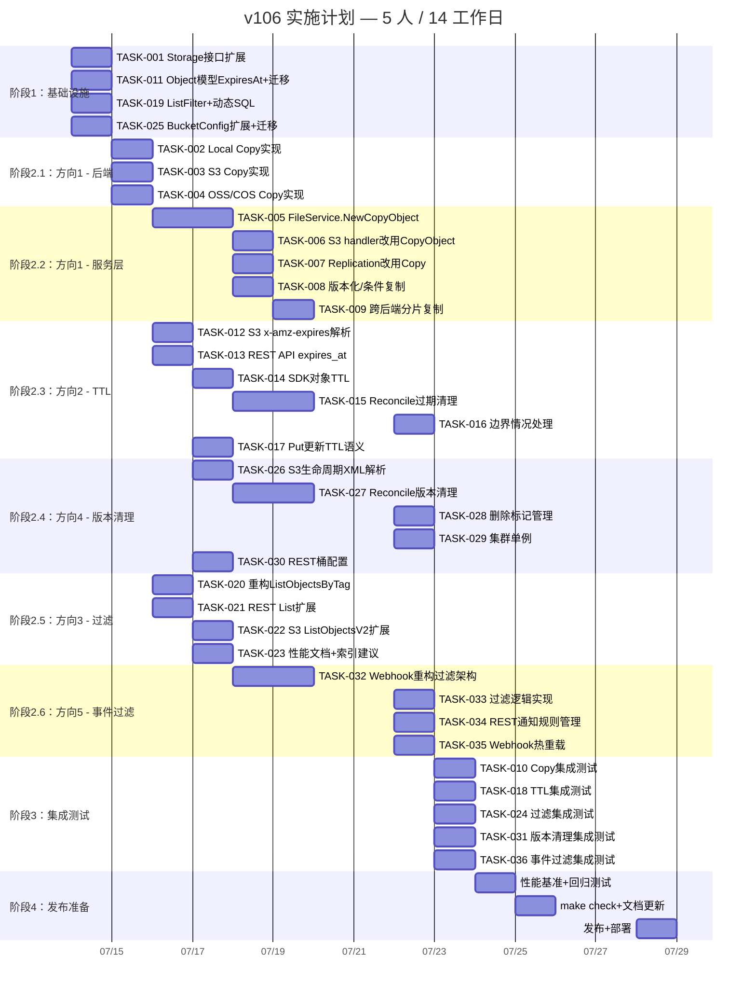

现在我已充分了解代码库，下面将进行完整的 Tech Lead 分析。

---

# Tech Lead 分析：v106 代码盲区与生产就绪缺口

## 0. 执行摘要

本文档分析五个高价值方向。以下为关键指标摘要：

| 方向 | 优先级 | 预估工时 | 风险等级 | 归因项数 |
|------|--------|---------|---------|---------|
| 1. UploadPartCopy / 大对象复制 | **P0** | 42h | 中 | 11 |
| 2. 对象级 TTL | P1 | 28h | 低 | 8 |
| 3. Metadata/Tag 服务端过滤 | P1 | 20h | 中 | 6 |
| 4. 非当前版本过期 | P1 | 28h | 中 | 7 |
| 5. 事件通知过滤 | P2 | 18h | 低 | 5 |
| **合计** | | **136h (≈5 人周)** | | **37** |

**建议执行顺序：** 先做方向 1（P0，生产断裂），再并行推进方向 2+4（对象生命周期），然后做方向 3，最后做方向 5。

---

## 1. 任务分解

### 方向一：S3 Multipart Upload Copy 与大对象复制（P0，断裂）

| 任务 ID | 任务标题 | 涉及文件 | 前置依赖 | 预估工时 | 验收标准 |
|---------|---------|---------|---------|---------|---------|
| TASK-001 | 在 `Storage` 接口上添加 `Copy` 和 `UploadPartCopy` | `internal/storage/storage.go` | — | 3h | 接口定义了 `Copy(ctx, srcKey, dstKey, opts CopyOptions) (ObjectInfo, error)` 和 `UploadPartCopy(ctx, srcKey, dstKey, uploadID, partNumber, srcOffset, srcLength) (MultipartPart, error)`；定义了 `CopyOptions` 结构体，包含条件头部、元数据指示等字段；定义了 `ErrUnsupported` 错误变量用于回退 |
| TASK-002 | `LocalStorage` 实现 `Copy` 和 `UploadPartCopy` | `internal/storage/local.go` | TASK-001 | 4h | 同分区用 `copy_file_range`（通过 `io.Copy` 或显式 syscall），跨分区回退到流式复制；`UploadPartCopy` 使用文件分段读取；单元测试覆盖：同分区、跨分区、分段复制 |
| TASK-003 | `S3Storage` 实现 `Copy` 和 `UploadPartCopy` | `internal/storage/s3.go` | TASK-001 | 4h | `Copy` 调用 `s3.CopyObject` API；`UploadPartCopy` 调用 `s3.UploadPartCopy` API；处理 SSE-C 头传递（若启用）；单元测试 mock S3 客户端 |
| TASK-004 | `OSSStorage` / `COSStorage` 实现 Copy 方法 | `internal/storage/oss.go`, `internal/storage/cos.go` | TASK-001 | 4h | 各自用云 SDK 的 CopyObject API；因无测试环境，仅编译验证 + 文档化 |
| TASK-005 | `FileService.NewCopyObject` 含回退逻辑 | `internal/service/service.go`（或新增 `internal/service/copy.go`） | TASK-001 | 6h | 优先调用 `store.Copy()`；若返回 `ErrUnsupported`，回退到 Get→Put；若源 >4GB 且存储后端不支持 Copy，自动切换到 multipart + UploadPartCopy 分段策略；复制元数据、标签、ACL；触发新对象 created 事件和源对象 accessed 事件 |
| TASK-006 | S3 handler `copyObject` 改用 `FileService.CopyObject` | `internal/api/s3compat/extra.go` | TASK-005 | 3h | `CopyObject` handler 委托给 `h.svc.CopyObject`；解析 `x-amz-copy-source-if-*` 头部并传递；解析 `x-amz-metadata-directive`（COPY/REPLACE）；处理 `x-amz-copy-source-version-id` |
| TASK-007 | Replication worker 改用新的 Copy 路径 | `internal/replication/replication.go` | TASK-005 | 2h | `ReplicateObjectByID` 调用 `FileService.CopyObject`（或存储层的 `Copy`）；支持 >5GB 对象的跨区复制 |
| TASK-008 | 处理 Source 对象正在被写入 + 版本化复制 | `internal/service/copy.go`（若已有） | TASK-005 | 4h | 版本化对象复制通过 `?versionId` 指定版本；源对象在被写入时使用最终一致性保证（文档化行为）；对象锁状态传递到目标对象 |
| TASK-009 | 跨后端复制（local→s3）分片处理 | `internal/service/copy.go` | TASK-005+TASK-003 | 6h | 当源和目标存储后端不同时，使用流式分片复制：自动检测源大小，若 >4GB 则使用 multipart upload 分片（每部分 5GB），避免一次性读入内存 |
| TASK-010 | Copy 集成测试 | `internal/service/copy_test.go`, `internal/api/s3compat/extra_test.go`, `internal/replication/replication_test.go` | TASK-005+TASK-006+TASK-007 | 4h | 测试覆盖：同后端复制、跨后端复制（mock）、>5GB 对象自动分片、条件头部（If-Match/If-None-Match）、metadata-directive: REPLACE、版本化复制、复制锁定对象、回退到 Get→Put 路径 |

**方向一总计：40h**

### 方向二：对象级 TTL（P1）

| 任务 ID | 任务标题 | 涉及文件 | 前置依赖 | 预估工时 | 验收标准 |
|---------|---------|---------|---------|---------|---------|
| TASK-011 | Object 模型添加 `ExpiresAt` 字段 + DB 迁移 | `internal/repository/repository.go`, `internal/repository/migrations/{sqlite,postgres}/0025_add_expires_at.{up,down}.sql`, `internal/repository/sql.go`（迁移数组） | — | 3h | `Object.ExpiresAt *time.Time` 字段存在；迁移文件添加 `expires_at TEXT` 列和索引 `idx_objects_expires_at(tenant_id, expires_at)`；`scanObject` 读取该列；`Rebind` 兼容 SQLite 的 `?` 和 Postgres 的 `$N`；向下兼容（已有行 = nil） |
| TASK-012 | S3 handler 解析 `x-amz-expires` 和 `x-amz-expiration` | `internal/api/s3compat/extra.go`（handler），`internal/api/s3compat/handler.go`（GetObject 响应） | TASK-011 | 4h | `PutObject` 解析 `x-amz-expires` 头（epoch/ISO8601）并设置 `ExpiresAt`；`GetObject` 响应返回 `x-amz-expiration: expiry-date="...", rule-id="per-object"`；忽略无效格式（非致命，仅 warn log） |
| TASK-013 | REST API 支持 `expires_at` 参数 | `internal/api/rest/router.go`（参数解析），`internal/api/rest/handler.go` | TASK-011 | 3h | `PUT /v1/files/*key?expires_at=<ISO8601>` 设置对象过期时间；`GET /v1/files/*key` 响应包含 `expires_at` 字段；JSON 序列化：`nil` 为 `null`，非 nil 为 RFC3339 字符串 |
| TASK-014 | SDK 支持对象 TTL | `sdk/python/`, `sdk/js/`, `sdk/go/` | TASK-011+TASK-013 | 4h | Python `put_object(..., expires_at=...)`；JS `putObject(..., { expiresAt })`；Go `PutOptions{ExpiresAt: ...}`；读响应包含 `ExpiresAt` 字段 |
| TASK-015 | Reconcile 添加过期对象清理 | `internal/reconcile/retention.go`（新增），`internal/repository/sql_objects.go`（`ListExpiredObjects`） | TASK-011 | 6h | `ListExpiredObjects(ctx, before time.Time)` SQL：`SELECT ... FROM objects WHERE expires_at IS NOT NULL AND expires_at < $1 AND deleted_at IS NULL AND (locked_until IS NULL OR locked_until < $1)`；Reconcile job 调用此方法，软删除过期的非锁定对象；新文件在 `main.go` 注册（可选，通过类似 `RECONCILE_ENABLE_EXPIRY` 标志控制，默认为 true） |
| TASK-016 | 边界情况处理 | `internal/reconcile/retention.go` | TASK-015 | 3h | 锁定对象在过期时间 < 锁定解除时间时不被删除；版本化桶中每个版本独立过期；桶生命周期 + 对象 TTL 取最先触发者；两次 Reconcile 间隔的最终一致性保证（仅精度到分钟级） |
| TASK-017 | 更新对象时更新 TTL + 覆盖语义 | `internal/service/service.go`（PutObject） | TASK-011 | 2h | 新 `Put` 操作可设置新的 `ExpiresAt`；不设置时保留旧值（或重置为 nil，取决于 S3 语义——建议保留旧值，因为 `x-amz-expires` 不是标准 PutObject 头） |
| TASK-018 | 对象 TTL 集成测试 | `internal/reconcile/retention_test.go`, `internal/api/s3compat/expires_test.go`, `internal/service/expiry_test.go` | TASK-012+TASK-013+TASK-015 | 3h | 测试：S3 PutObject + GetObject 返回 expiration 头；REST 设置/读取 expires_at；Reconcile 清理过期对象；锁定对象跳过清理；桶生命周期 + TTL 取最先触发者 |

**方向二总计：28h**

### 方向三：Metadata/Tag 服务端过滤（P1）

| 任务 ID | 任务标题 | 涉及文件 | 前置依赖 | 预估工时 | 验收标准 |
|---------|---------|---------|---------|---------|---------|
| TASK-019 | 定义 `ListFilter` 结构体 + 动态 SQL 构建 | `internal/repository/sql_objects.go` | — | 6h | `ListFilter` 包含 `Prefix, Marker, Limit, TagKey, TagValue, MetaFilter map[string]string`；`ListObjects` 重载（或新增 `ListObjectsFiltered`）动态构建 WHERE 子句：metadata 过滤用 `metadata->>'$N' = $N+1`；tag 过滤用 JSON 提取；全参数化绑定防止 SQL 注入；通过 `s.rebind` 转换 `$N` 为 `?` 兼容 SQLite |
| TASK-020 | 重构 `ListObjectsByTag` 从客户端过滤改为服务端 | `internal/repository/sql_objects.go` | TASK-019 | 2h | `ListObjectsByTag` 调用新的 `ListObjectsFiltered` 并将 tagKey/tagValue 转为 `ListFilter.TagKey/TagValue`；移除客户端过滤循环；验证分页在过滤后仍正确（server-side pagination marker 是 key） |
| TASK-021 | REST List API 扩展 metadata/tag 参数 | `internal/api/rest/handler.go` + `internal/api/rest/router.go` | TASK-019 | 3h | `GET /v1/files?metadata.color=red&metadata.env=prod&tag.key=project&tag.value=alpha`；多个 metadata 参数用 AND 连接；参数名 `metadata.*` 和 `tag.key` / `tag.value` |
| TASK-022 | S3 ListObjectsV2 扩展 metadata 过滤 | `internal/api/s3compat/handler.go`（listObjectsV2） | TASK-019 | 3h | `GET /s3/{bucket}?list-type=2&x-amz-meta-color=red`；现有 `tag-key`/`tag-value` 参数保持兼容；解析 S3 风格的 `x-amz-meta-*` 前缀为 metadata 过滤 |
| TASK-023 | 性能文档 + 索引建议 | `docs/operations/indexes.md`（或添加至 `docs/configuration.md`） | TASK-019 | 2h | 文档化：PG `GIN` 索引（`CREATE INDEX idx_objects_metadata_gin ON objects USING GIN (metadata jsonb_path_ops)`）；SQLite 表达式索引（`CREATE INDEX idx_objects_metadata_color ON objects(metadata->>'color')`）；性能预期（有索引则 O(log n)，无索引则全表扫描） |
| TASK-024 | 过滤集成测试 | `internal/repository/sql_objects_test.go`, `internal/api/rest/list_test.go` | TASK-019+TASK-021+TASK-022 | 4h | 测试：单一 metadata 过滤、复合 metadata AND 过滤、tag + metadata 组合、分页截断（过滤后 < limit 但仍有更多数据）、SQL 注入尝试（`' OR 1=1--` 等，应为安全 0 结果）、S3 ListObjectsV2 请求头解析、Postgres 和 SQLite 双后端 |

**方向三总计：20h**

### 方向四：非当前版本过期（P1）

| 任务 ID | 任务标题 | 涉及文件 | 前置依赖 | 预估工时 | 验收标准 |
|---------|---------|---------|---------|---------|---------|
| TASK-025 | `BucketConfig` 添加 NoncurrentVersion 字段 + DB 迁移 | `internal/repository/repository.go`, `internal/repository/migrations/{sqlite,postgres}/0026_noncurrent_version_expiration.{up,down}.sql` | — | 3h | `BucketConfig.NoncurrentVersionDays int`（0 = 永久保留）、`MaxNoncurrentVersions int`（0 = 不限制）、`NoncurrentDeleteAction string`（"soft_delete" / "hard_delete"）；迁移在 `buckets` 表添加这三列；Go 扫描器读取新字段；向下兼容（缺失 = 0 = 无操作） |
| TASK-026 | S3 生命周期 XML 解析 NoncurrentVersion | `internal/api/s3compat/xml.go`（生命周期结构体），`internal/api/s3compat/handler.go`（`putBucketLifecycle`） | TASK-025 | 4h | 定义 `NoncurrentVersionExpiration` 结构体（`NoncurrentDays int`）；`LifecycleRule` 引用此结构体；`putBucketLifecycle` 解析规则并持久化到 `BucketConfig`；`getBucketLifecycle` 序列化规则回 XML |
| TASK-027 | Reconcile 添加非当前版本清理 | `internal/reconcile/noncurrent.go`（新增），`internal/repository/sql_objects.go`（`ListNoncurrentVersions` 等新方法） | TASK-025 | 8h | `ListNoncurrentVersions(bucket, before time.Time, maxVersions int)` SQL：对每组的每个对象，查询其所有非当前版本；清理逻辑：若 `NoncurrentVersionDays > 0`，删除超过 N 天的非当前版本；若 `MaxNoncurrentVersions > 0`，保留最新 N 个版本，删除更旧的；跳过锁定版本（`locked_until` 检查）；原子删除（storage blob + repo 行在同一事务中）；遵守桶的 `NoncurrentDeleteAction` |
| TASK-028 | 删除标记（Delete Marker）管理 | `internal/reconcile/noncurrent.go` | TASK-027 | 3h | S3 删除标记本身是一个版本；当删除标记成为最旧版本时应被清理；删除最后一个版本时，后续 GET 返回 404（无需特殊操作） |
| TASK-029 | 集群单例 + 幂等性 | `internal/reconcile/noncurrent.go` | TASK-027 | 3h | 版本清理是破坏性操作：使用 `cluster.Singleton` 防止多副本并发执行；清理操作本身是幂等的（版本 id 唯一，重复删除无副作用）；通过 `main.go` 注册到 Reconcile |
| TASK-030 | REST API 桶配置管理 NoncurrentVersion | `internal/api/rest/handler_bucket.go`（或类似文件） | TASK-025 | 3h | `PUT /v1/admin/buckets/{name}` 支持设置 `noncurrent_version_days`, `max_noncurrent_version`, `noncurrent_delete_action`；`GET` 响应包含这些字段 |
| TASK-031 | 版本清理集成测试 | `internal/reconcile/noncurrent_test.go`, `internal/api/s3compat/lifecycle_test.go` | TASK-026+TASK-027 | 4h | 测试：插入 N 个版本 → 运行清理 → 保留最新 M 个；NoncurrentDays 时间过滤；锁定版本跳过；删除标记清理；通过 S3 生命周期 API 配置和读取规则 |

**方向四总计：28h**

### 方向五：事件通知过滤（P2）

| 任务 ID | 任务标题 | 涉及文件 | 前置依赖 | 预估工时 | 验收标准 |
|---------|---------|---------|---------|---------|---------|
| TASK-032 | Webhook 重构：支持按目标过滤 | `internal/events/webhook.go` | — | 6h | `Webhook` 存储 `[]webhookTarget` 而非 `[]string`；每个 target 包含 URL、filter rule 和 secret；`NewWebhook` 从 `[]NotificationRule` 构建 targets（每条规则对应一个 target）；`deliver` 在发送前调用 `shouldDeliver` 过滤；向后兼容：无规则时转发所有事件 |
| TASK-033 | 过滤逻辑实现（prefix/suffix） | `internal/events/webhook.go` | TASK-032 | 3h | `shouldDeliver(e, target)`：解析 `FilterKey`（格式 `prefix:logs/` 或 `suffix:.jpg`）；prefix 匹配 `strings.HasPrefix(e.Key, val)`；suffix 匹配 `strings.HasSuffix(e.Key, val)`；多个 filter 对同一 URL：任一匹配即转发（OR）；前缀+后缀同时设置：AND 语义；空 FilterKey = 全部转发；空 Key（桶级别事件）= 透传 |
| TASK-034 | 通知规则通过 REST API 管理 | `internal/api/rest/handler_bucket.go`, `internal/api/rest/router.go` | TASK-032 | 4h | `PUT /v1/admin/buckets/{name}/notification` 设置规则（`[]NotificationRule`）；`GET /v1/admin/buckets/{name}/notification` 获取规则；规则变更后通过 EventBus 触发 webhook 热重载（或简单的定时刷新机制） |
| TASK-035 | Webhook 热重载 / 配置刷新 | `internal/events/webhook.go` | TASK-032+TASK-034 | 3h | `Webhook.Reload(rules []NotificationRule)` 方法，原子性替换 `urls` 和 filters；通过 EventBus 订阅 bucket.notification.changed 事件触发重载；或通过定期 re-read 配置（最小化实现） |
| TASK-036 | 过滤集成测试 | `internal/events/webhook_test.go` | TASK-032+TASK-033 | 2h | 测试：prefix 过滤（匹配/不匹配）、suffix 过滤、多个 filter OR、前缀+后缀 AND、空 filter（全部转发）、空 key（透传）、FilterKey 格式错误（降级为全部转发） |

**方向五总计：18h**

---

## 2. 执行顺序

```mermaid
graph TD
    subgraph Phase1["阶段1：基础设施（5天）"]
        T001[TASK-001: Storage接口扩展<br/>Copy + UploadPartCopy]
        T011[TASK-011: Object模型ExpiresAt<br/>+ DB迁移]
        T019[TASK-019: ListFilter结构体<br/>+动态SQL构建]
        T025[TASK-025: BucketConfig<br/>NoncurrentVersion字段+迁移]
    end

    subgraph Phase2_1["阶段2.1：方向1 - 核心（5天）"]
        T002[TASK-002: LocalStorage Copy实现]
        T003[TASK-003: S3Storage Copy实现]
        T004[TASK-004: OSS/COS Copy实现]
    end

    subgraph Phase2_2["阶段2.2：方向1 - 服务层（3天）"]
        T005[TASK-005: FileService.NewCopyObject<br/>+各种回退策略]
    end

    subgraph Phase2_3["阶段2.3：方向1 - 集成（3天）"]
        T006[TASK-006: S3 handler改用CopyObject]
        T007[TASK-007: Replication改用Copy路径]
        T008[TASK-008: 版本化/条件复制]
        T009[TASK-009: 跨后端分片复制]
    end

    subgraph Phase2_4["阶段2.4：方向2+4 - 对象生命周期（6天）"]
        T012[TASK-012: S3 x-amz-expires解析]
        T013[TASK-013: REST API expires_at参数]
        T014[TASK-014: SDK支持对象TTL]
        T015[TASK-015: Reconcile过期对象清理]
        T016[TASK-016: 边界情况处理]
        T017[TASK-017: Put更新TTL语义]
        T026[TASK-026: S3生命周期XML解析Noncurrent]
        T027[TASK-027: Reconcile版本清理]
        T028[TASK-028: 删除标记管理]
        T029[TASK-029: 集群单例+幂等性]
        T030[TASK-030: REST API桶配置]
    end

    subgraph Phase2_5["阶段2.5：方向3 - 服务端过滤（3天）"]
        T020[TASK-020: 重构ListObjectsByTag]
        T021[TASK-021: REST List扩展]
        T022[TASK-022: S3 ListObjectsV2扩展]
        T023[TASK-023: 性能文档+索引建议]
    end

    subgraph Phase2_6["阶段2.6：方向5 - 事件过滤（3天）"]
        T032[TASK-032: Webhook重构过滤架构]
        T033[TASK-033: 过滤逻辑实现]
        T034[TASK-034: REST通知规则管理]
        T035[TASK-035: Webhook热重载]
    end

    subgraph Phase3["阶段3：集成测试+优化（5天）"]
        T010[TASK-010: Copy集成测试]
        T018[TASK-018: TTL集成测试]
        T024[TASK-024: 过滤集成测试]
        T031[TASK-031: 版本清理集成测试]
        T036[TASK-036: 事件过滤集成测试]
    end

    %% 依赖关系
    T001 --> T002 & T003 & T004
    T001 --> T005
    T002 & T003 & T004 --> T005
    T005 --> T006 & T007 & T008 & T009
    T005 --> T010

    T011 --> T012 & T013 & T015 & T017
    T012 & T013 --> T014
    T015 --> T016
    T011 --> T018
    T012 & T013 & T015 --> T018

    T019 --> T020 & T021 & T022 & T023
    T019 --> T024
    T020 & T021 & T022 --> T024

    T025 --> T026 & T027 & T030
    T026 & T027 --> T031
    T027 --> T028 & T029
    T025 & T027 --> T031

    T032 --> T033 & T034
    T033 & T034 --> T035
    T032 & T033 --> T036

    %% 标注可并行组
    T001 -.->|并行| T011
    T001 -.->|并行| T019
    T001 -.->|并行| T025
    T011 -.->|并行| T019
    T011 -.->|并行| T025
    T019 -.->|并行| T025

    T002 -.->|并行| T003
    T003 -.->|并行| T004

    T006 -.->|并行| T007 & T008 & T009

    T012 -.->|并行| T026
    T013 -.->|并行| T030
    T015 -.->|并行| T027

    T021 -.->|并行| T022

    T033 -.->|并行| T034
```



### 并行执行组

| 组 | 任务 | 说明 |
|----|------|------|
| **组 A** | TASK-001, TASK-011, TASK-019, TASK-025 | 所有四个方向的核心接口/模型扩展，完全独立，可最多 4 人并行 |
| **组 B** | TASK-002, TASK-003, TASK-004 | 三个 Storage 后端实现完全独立，可 3 人并行 |
| **组 C** | TASK-006, TASK-007, TASK-008, TASK-009 | 集成方向一，TASK-006/007 可并行，但 TASK-008/009 需要 TASK-005 |
| **组 D** | TASK-012+TASK-026, TASK-013+TASK-030, TASK-015+TASK-027 | 方向二和四的并行组，分别处理 S3 协议层、REST API 层和 Reconcile 后台任务 |
| **组 E** | TASK-021, TASK-022 | REST 和 S3 的过滤 API 扩展可并行 |
| **组 F** | TASK-033, TASK-034 | 事件过滤逻辑和 REST API 可并行 |

---

## 3. 技术风险

### 3.1 方向一：UploadPartCopy / 大对象复制

| 风险 | 影响 | 概率 | 缓解措施 |
|------|------|------|---------|
| **多后端回退路径的测试矩阵爆炸** | 后端类型 × 对象大小 × 条件头部 × 存储类型 的组合 N 增长 | 高 | 使用表格驱动（table-driven）测试 + property-based testing（`testing/quick`）；将测试分三层：单元测试（mock storage）、集成测试（本地+S3 mock）、预发布（真实云后端） |
| **S3 CopyObject 的 SSE-C 头传递** | CopyObject 如果源对象用 SSE-C 加密，必须在请求中提供源加密密钥；UploadPartCopy 同理 | 中 | SSE-C 密钥存储在 `Object.Metadata` 中（或 keyfile 引用）；Copy 时从元数据读取密钥并设置 `CopySourceSSECustomerKey` 等请求字段；完善 `CopyOptions` 结构体包含 SSE 信息 |
| **UploadPartCopy 的最大部分数（10000 部分 × 5GB = 50TB）对对象大小限制** | 如果系统需要支持 >50TB 的对象，UploadPartCopy 的 10000 部分限制是硬上限 | 低（系统目前无 >50TB 使用场景） | 文档化此限制；若后续需要，可在 Service 层做压缩或使用 ParallelUpload 方式。当前无需解决 |
| **Replication Worker 的失败模式** | 如果跨区复制使用新的 Copy API 但目标端是 local 后端（不支持 Copy），当前回退路径是 Get→Put，对 >5GB 对象仍然断裂 | 中 | TASK-009 明确处理跨后端场景：当源/目标后端不同时，Service 层自动检测源大小，若 >4GB 则使用流式 multipart 分片上传（每部分 5GB），避免一次性读入内存 |
| **OSS/COS 无测试环境** | TASK-004 无法进行集成测试 | 高 | 编译验证（`go build`）+ 文档化手动测试步骤。在代码仓库 CI 中跳过 OSS/COS 测试。标记为 "community contributed" 或 "best effort" |

### 3.2 方向三：Metadata/Tag 服务端过滤

| 风险 | 影响 | 概率 | 缓解措施 |
|------|------|------|---------|
| **动态 SQL 注入** | 如果 metadata key/value 不通过参数化绑定直接拼接到 SQL 中，可导致 SQL 注入 | 如果处理不当则必发生 | 所有动态值必须通过 `$N` 占位符传递；metadata key 虽然是 `->>'key'` 的 key，但也必须参数化（`metadata->>$1`）；测试中注入 SQL 注入 payload 验证安全 |
| **SQLite 与 Postgres 的 JSON 运算符差异** | SQLite 使用 `->>`（`json_extract` 语法糖），Postgres 使用 `->>`；但关键区别：SQLite 的 `$N` 位置参数和 `->>` 的交互 | 低 | 已有的 `s.rebind` 方案处理 `$N` → `?` 转换；当前代码已在 SQLite 中使用 `metadata->>'key'`（可验证），说明 SQLite 的 JSON1 扩展已启用；关键测试必须同时在两种后端上运行 |
| **无索引的全表扫描性能退化** | 如果用户频繁使用 metadata 过滤但没有创建索引，对大型桶会触发全表扫描 | 中 | TASK-023 明确文档化索引建议；Postgres 建议 `GIN` 索引，SQLite 建议表达式索引（`CREATE INDEX idx_objects_metadata_${key} ON objects(metadata->>'${key}')`）；在 Reconcile 和 List 的日志中增加慢查询警告（>500ms） |
| **分页一致性偏差** | 服务端过滤后，marker 仍然是 object key；如果过滤后的结果集不连续，用户看到的页可能会少于 limit 但还有更多数据 | 中（预期行为） | 文档化此行为：marker 是最后一个返回对象的 key，后续请求恢复扫描的位置；用户不能期望每页都是完整的 limit 条；当前 `ListObjectsByTag` 的客户端过滤已有此偏差 |

### 3.3 方向四：非当前版本过期

| 风险 | 影响 | 概率 | 缓解措施 |
|------|------|------|---------|
| **Atomic 删除：storage blob + repo 行** | 如果删除 storage blob 成功但删除 repo 行失败（或反之），系统进入不一致状态 | 中 | 在 Postgres 中使用事务（`BeginTx`），在 SQLite 中同样使用事务；先删除 storage blob（外部操作），再删除 repo 行；若 repo 删除失败，blob 成为孤儿 → 后续 GC 可清理；日志告警 + `telemetry.IncReconcileError` |
| **并发访问 + 删除冲突** | Reconcile 正在删除版本 A，同时用户正在读取版本 A | 低 | 使用最终一致性窗口：Reconcile 只删除 "stable" 版本（超过 N 天且未被读取超过 24 小时）；文档化此行为；如果用户读出时版本正被删除，`storage.Get` 返回 `ErrNotFound` → API 返回 404 |
| **MaxNoncurrentVersions 语义模糊：保留最新 N 个版本的"最新"定义** | 如果 object 有 100 个版本，保留最新 3 个，删除 97 个——"最新"是按 `created_at DESC` 还是 `version_id` 排序？ | 低 | 定义为按 `created_at DESC`（或 `updated_at`）排序；在 `ListNoncurrentVersions` SQL 中使用 `ORDER BY created_at DESC`；文档化此定义 |
| **S3 删除标记（Delete Marker）作为特殊版本** | 在 S3 中，删除标记是一个零字节的版本，表示"对象已被删除"。清理时删除删除标记 = 对象重新变为可见（undelete） | 中 | 在清理逻辑中：如果删除标记是最旧的版本且 bucket 没有活跃版本，则保留删除标记；否则删除标记可以被安全清理 |

### 3.4 跨方向风险

| 风险 | 影响 | 概率 | 缓解措施 |
|------|------|------|---------|
| **五个方向同时开发时的分支管理冲突** | 所有方向都修改 `repository.go`（Object 模型）、`storage.go`（接口）、迁移文件；合并冲突可能严重 | 高 | 阶段 1 先合并所有接口变更；每个方向在独立分支开发，但尽早（<2 天）将共同修改的文件合并回主线；Git 工作流：基于新阶段基线创建分支，每天 rebase |
| **迁移文件编号冲突** | TASK-011 需要 `0025_*`，TASK-025 需要 `0026_*`；如果顺序变化会冲突 | 中 | 在 `AGENTS.md` 中声明迁移文件分配表；阶段 1 就锁定迁移编号：0025→方向二、0026→方向四；即使方向四延期，也保留 `0026` 空占位 |
| **测试覆盖率下降** | 方向越多，增量代码的测试覆盖越难保障 | 中 | CI gate：增量代码覆盖率 ≥50%（与 `AGENTS.md` 一致）；`make check` 包含覆盖率检查；TASK-010/018/024/031/036 明确要求集成测试 |

---

## 4. 资源评估

### 4.1 人员技能要求

| 角色 | 数量 | 所需技能 | 对应任务 |
|------|------|---------|---------|
| **Go 后端工程师（Senior）** | 2 | Go, 并发, S3 API 原理, SQL, 分布式系统 | TASK-001~005, TASK-007~009, TASK-015, TASK-019, TASK-027 |
| **Go 后端工程师（Mid）** | 2 | Go, HTTP handler, SQL, OpenAPI | TASK-006, TASK-012~013, TASK-021~022, TASK-030, TASK-034 |
| **存储/云工程师** | 1 | AWS S3 SDK, OSS SDK, COS SDK, 大对象处理 | TASK-003~004, TASK-026 |
| **全栈/SDK 工程师** | 1 | Python, TypeScript, Go SDK, 客户端 API 设计 | TASK-014 |
| **测试工程师（QA）** | 1 | Go 测试, 集成测试, 性能基准, SQLite/Postgres | TASK-010, TASK-018, TASK-024, TASK-031, TASK-036 + 所有测试辅助 |

**最小团队规模：3 人（1 Senior + 1 Mid + 1 测试）**，此时各阶段顺序执行，总工期 ≈ 20 个工作日（4 周）。

**推荐团队规模：5 人**，可最大化并行，总工期 ≈ 10 个工作日（2 周）。

### 4.2 关键里程碑

| 里程碑 | 天（5 人团队） | 交付物 | 通过标准 |
|--------|---------------|--------|---------|
| **M1：接口就绪** | D2 | 修改后的 `Storage` 接口、`Object` 模型、`BucketConfig`、迁移文件、`ListFilter` | `go build ./...` 通过；所有接口变更在 PR 中已审查合并 |
| **M2：方向一可测试** | D6 | Local/S3 后端实现 + Service 层包装 + S3 handler + Replication | CopyObject 在本地端对 1GB 对象成功（源→目标，验证 ETag）；回退到 Get→Put 路径工作 |
| **M3：对象生命周期就绪** | D10 | S3 TTL 头解析、REST TTL API、Reconcile 过期清理、NoncurrentVersion 清理 | S3 `PUT x-amz-expires` → Reconcile 后对象消失；NoncurrentVersion 规则执行成功 |
| **M4：过滤方向就绪** | D12 | 服务端 metadata/tag 过滤、Webhook 过滤 | `GET /v1/files?metadata.color=red` 返回正确结果；S3 list 过滤工作；Webhook 按 prefix 过滤 |
| **M5：发布就绪** | D14 | 全部集成测试通过、性能基准、文档 | `make check` 全绿；性能基准无退化；迁移文件锁定 |

### 4.3 阻塞点与解决策略

| 阻塞点 | 影响 | 解决策略 |
|--------|------|---------|
| OSS/COS 后端无测试环境 | TASK-004 无法验证 | 编译验证 + 文档化；在 `factory.go` 中添加编译时 build tag 控制；不阻塞其他任务 |
| S3 SSE-C 加密复制头传递 | TASK-008 的部分实现需要 SSE-C 密钥访问 | 如果当前 SSE 实现是先解密再加密，则 Copy 操作不需要处理 SSE-C 头传递（直接回退到 Get→Put 解密→加密路径）；如果业务需要 SSE-C 透传，则此任务需要额外 2 天研究 |
| SQLite + JSON 运算符的索引性能 | TASK-023 的索引建议可能需要 DBA 协助 | 文档化两类数据库的最佳实践；SQLite 表达式索引不支持所有 JSON 路径——提供备用方案（`json_extract` 函数索引） |
| Reconcile 版本清理可能影响正在进行的读取 | TASK-027 的最终一致性可能被产品团队拒绝 | 添加 "safe window" 配置：版本在创建后 N 小时内不被清理；默认 24 小时；可通过 `RECONCILE_SAFE_WINDOW_HOURS` 配置 |

---

## 5. 质量保证

### 5.1 单元测试覆盖要求

| 包 | 要求覆盖率 | 关键测试点 |
|----|-----------|-----------|
| `internal/storage` | ≥70% | Copy 方法的 happy path + edge cases；UploadPartCopy 部分验证 |
| `internal/service` | ≥65% | CopyObject 的回退逻辑（各后端组合）；TTL 传递；Metadata 过滤参数传递 |
| `internal/reconcile` | ≥60% | 过期对象清理（空结果、部分过期、锁定跳过）；版本清理（多种配置组合） |
| `internal/events` | ≥75% | 过滤逻辑的全排列（prefix/suffix/AND/OR/空） |
| `internal/api/s3compat` | ≥55% | CopyObject handler 请求解析；x-amz-expires 解析；NoncurrentVersion XML 解析 |
| `internal/api/rest` | ≥60% | metadata 查询参数解析；TTL 参数；桶通知规则 CRUD |

### 5.2 集成测试策略

| 测试套件 | 触发条件 | 内容 |
|---------|---------|------|
| `make test` | `pre-commit` / CI | SQLite + local FS；覆盖全部方向的基础 CRUD；零网络；零 Docker |
| `make test-integration` | CI（Postgres） | Postgres + local FS；metadata 过滤索引性能；迁移测试；NoncurrentVersion 清理 |
| `make test-integration-qdrant` | CI（Qdrant） | 不需要 Qdrant——跳过此方向 |
| 新增：`make test-storage-s3` | 手动（AWS 凭证） | 针对真实 S3 后端的 Copy/UploadPartCopy；>5GB 对象测试（费用警告） |

### 5.3 新增集成测试文件清单

```
internal/storage/local_copy_test.go        # LocalStorage Copy + UploadPartCopy
internal/storage/s3_copy_test.go            # S3Storage Copy mock/unit
internal/service/copy_test.go               # FileService.CopyObject 全路径
internal/replication/replication_copy_test.go # Replication 使用新 Copy 路径
internal/api/s3compat/copy_test.go           # S3 CopyObject HTTP handler
internal/api/s3compat/expires_test.go        # x-amz-expires 头解析
internal/reconcile/expiry_test.go            # 过期对象清理
internal/reconcile/noncurrent_test.go        # 版本清理
internal/events/webhook_filter_test.go       # 事件过滤
internal/repository/sql_filter_test.go       # 服务端过滤 SQL
internal/api/rest/list_filter_test.go        # REST list 参数解析
```

### 5.4 代码审查要点

| 审查焦点 | 说明 | 审查者 |
|---------|------|-------|
| **SQL 注入** | 所有动态 WHERE 子句使用 `$N` 占位符；metadata key 也必须参数化 | Senior 工程师 |
| **迁移文件编号** | 不重复、不跳过；down 迁移正确反转 up 迁移 | 所有 reviewers |
| **Go 标准接口** | `CopyOptions` 是否包含必要的所有字段；回退路径是否完整 | Senior 工程师 |
| **并发安全** | `Webhook.Reload` 的锁机制；`Storage.Copy` 是否与现有方法的并发模型一致 | Senior 工程师 |
| **错误处理** | 云后端 API 错误（`s3.NoSuchKey`）正确转换为内部错误（`ErrNotFound`） | Mid 工程师 |
| **日志/遥测** | 新增操作添加 OTel 指标（复制延迟、过滤跳过、版本清理计数） | Senior 工程师 |
| **向后兼容** | 新增字段的默认值（nil/0）行为；旧配置文件的加载 | Mid 工程师 |

### 5.5 性能测试需求

| 场景 | 目标 | 方法 |
|------|------|------|
| **Copy 5GB 对象（Local）** | 完成 < 30 秒 | `internal/storage/bench_test.go` 使用 `testing.B` |
| **Copy 5GB 对象（S3 mock）** | 完成 < 10 秒（网络延迟模拟） | 使用 S3 mock（minio）进行基准测试 |
| **List 过滤（100 万对象）** | 过滤后响应 < 500ms | 在 Postgres 中预装 100 万行 + GIN 索引 |
| **Reconcile 清理 10000 个过期对象** | 一轮清理 < 60 秒 | 数据库预装 + 基准 |
| **Reconcile 清理 10000 个版本** | 一轮清理 < 120 秒 | 数据库预装 + 基准（版本清理更复杂） |
| **Webhook 过滤吞吐量** | 1000 事件/秒，过滤延迟 < 1ms | `internal/events/bench_test.go` |

---

## 6. 实施计划

### 时间表示例（5 人推荐团队）



### 阶段 1：基础设施搭建（1 天）

**7月14日（Day 1）**

| 并行任务 | 承担者 | 交付物 |
|---------|-------|--------|
| TASK-001: Storage 接口扩展 | Senior 工程师 A | `storage.go`: Copy + UploadPartCopy 签名、CopyOptions、ErrUnsupported |
| TASK-011: Object 模型 + 迁移 | Mid 工程师 B | `repository.go`: ExpiresAt 字段；`0025_*.sql` 迁移文件 |
| TASK-019: ListFilter + 动态 SQL | Senior 工程师 B | `sql_objects.go`: ListFilter 结构体、动态 WHERE 构建 |
| TASK-025: BucketConfig + 迁移 | Mid 工程师 A | `repository.go`: NoncurrentVersion 字段；`0026_*.sql` 迁移文件 |
| 确认：迁移编号锁定 | 所有人 | `AGENTS.md` 更新迁移编号配表 |

**里程碑 M1：** 全部四个 PR 合并 → 主线通过 `go build`。

### 阶段 2：核心功能实现（8 天）

**7月15日-22日（Day 2-7）**

| 日期 | 主线并行组 | 备注 |
|------|-----------|------|
| 7/15 (D2) | 组 B: TASK-002/003/004 (方向 1 后端) | 3 人并行，方向 2/3/4 可提前启动 |
| 7/16 (D3) | TASK-005 (方向 1 服务层) + TASK-012/013 (方向 2 S3/REST) + TASK-020/021 (方向 3 过滤基础) | 需要 TASK-001 完成 |
| 7/17 (D4) | TASK-005 收尾 + TASK-014/017 (方向 2 SDK+Put) + TASK-022/023 (方向 3 S3+文档) + TASK-026/030 (方向 4 XML+REST) | 高并行日 |
| 7/18 (D5) | TASK-006/007/008/009 (方向 1 集成) + TASK-015/027 (方向 2/4 Reconcile) + TASK-032 (方向 5 Webhook 重构) | 方向 1 进入集成阶段 |
| 7/19 (D6) | TASK-009 收尾 + 方向 1 自测 | 方向 1 代码冻结 |
| 7/22 (D7) | TASK-016/028/029 (方向 2/4 边界+集群) + TASK-033/034/035 (方向 5 过滤+REST+热重载) + 方向 2/3/4/5 代码自测 | 全部功能代码冻结 |

**里程碑 M2-M4：** 连续合并，功能完备。

### 阶段 3：集成测试和优化（2 天）

**7月23日-24日（Day 8-9）**

| 并行任务 | 承担者 | 交付物 |
|---------|-------|--------|
| TASK-010: Copy 集成测试 | Senior 工程师 A + 测试 | `copy_test.go` 全部方向 1 测试 |
| TASK-018: TTL 集成测试 | Mid 工程师 B + 测试 | `expiry_test.go`, `noncurrent_test.go` |
| TASK-024: 过滤集成测试 | Mid 工程师 A + 测试 | `sql_filter_test.go`, `list_filter_test.go` |
| TASK-031: 版本清理集成测试 | Senior 工程师 B + 测试 | `noncurrent_test.go`, `lifecycle_test.go` |
| TASK-036: 事件过滤集成测试 | 测试 | `webhook_filter_test.go` |
| 性能基准测试 | Senior A + B | `bench_test.go` 全部 5 个场景 |

**里程碑 M5（初步）：** 集成测试全绿。

### 阶段 4：发布准备（2 天）

**7月25日-28日（Day 10-11）**

| 日期 | 活动 | 交付物 |
|------|------|--------|
| 7/25 (D10) | 回归测试 (`make check`, `make test-integration`)、文档更新、OpenAPI 更新、`AGENTS.md` 更新功能矩阵 | 全部文档 |
| 7/28 (D11) | 发布流程：标记版本、生成 changelog、通知 SDK 用户（方向 2/3 的 API 扩展和 SDK 更新）、更新部署配置 | Release v0.xx |

**里程碑 M5（完成）：** 发布就绪。

---

## 7. 总览：关键建议

### 优先级排序

1. **方向一是 P0，应优先启动**。>5GB 对象复制断裂是生产事故。其他方向虽然改善产品体验但不阻塞现有用户。
2. **方向二和四可以并行推进**，因为它们都涉及对象生命周期管理，共享 Reconcile 扩展基础设施。
3. **方向三是纯后端变更**，不需要 UI/SDK 配合，性价比最高（20h 实现服务端过滤，大幅改善 List API 的大规模性能）。
4. **方向五虽然是 P2，但实际工作量最小**（18h），且 `FilterKey` 字段已存在但未被使用——是低挂果实。

### 技术债管理

- 不要同时开启全部 5 个方向的分支——阶段必须合并完再开新分支
- TASK-004（OSS/COS）标记为 "no test" 并文档化，不阻塞主流程
- 迁移文件编号一次性分配好（0025=方向二，0026=方向四），避免后期冲突

### 放弃范围

- **方向三的 OR 过滤**（metadata=a OR tags=b）：当前不支持，如果要做会增加一倍复杂度。推迟到 v107。
- **方向五的多个 filter 规则 OR 语义**的完整 Configuration API：当前通过 REST PUT 通知规则即可，不必立即实现 S3 XML 的通知配置。S3 用户的过滤需求可通过 REST API 配置，S3 XML 配置解析推迟到 v107。
- **方向四的 `NoncurrentVersionTransitions`**（存储类转换）：不在当前范围内。S3 生命周期也支持将非当前版本转换为更低成本的存储类，但 aero-vault 目前存储类实现单一，此功能无意义。
