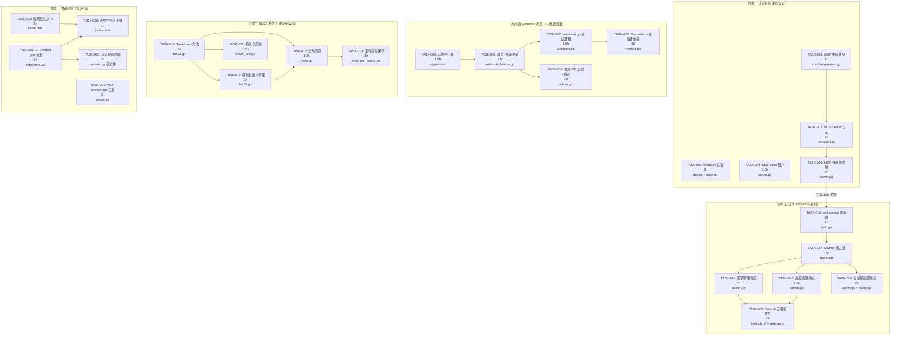

现在我已对整个代码库和需求文档有了透彻的理解。以下是我的分析。

---

# 技术负责人分析：扩展方向 v124

**分析者：** 技术负责人
**依据：** `docs/requirements/expansion-v124-auth-blindspots-ai-persistence-preview-governance.md`（746行）
**代码库基线：** 31 个主要源文件，总计约 3,000 行，覆盖 5 个功能方向

---

## 1. 任务分解

### 1.1 方向一：MCP/WebDAV 身份验证盲区（安全 P0）

| 任务 ID | 标题 | 文件 | 前置依赖 | 预计工时 | 验收标准 |
|---------|------|------|---------|---------|---------|
| **TASK-001** | 将 MCP HTTP handler 接入中间件链 | `cmd/server/main.go`（buildRouter，第 208-216 行） | 无 | **1h** | 已授权的 chi 路由组包裹 MCP。`curl POST /mcp` 在启用 auth 时返回 401。所有现有测试通过 |
| **TASK-002** | 在 MCP HTTPHandler 中添加 Bearer token 认证 | `internal/mcp/transport.go`（第 38-52 行） | TASK-001 | **2h** | `Authorization: Bearer <token>` 通过 auth.Registry.Authenticate 认证；无效 token 返回 401；无 token 的请求在启用 auth 时失败 |
| **TASK-003** | 为 WebDAV handler 添加认证中间件 | `cmd/server/main.go`（buildDispatcher，第 208-214 行）；`internal/api/webdav/dav.go` | 无 | **1h** | WebDAV OPTIONS/PROPFIND 在启用 auth 时返回 401。Basic Auth 映射通过新的配置选项 |
| **TASK-004** | MCP stdio 模式的租户配置 | `internal/mcp/server.go`（第 55-60 行的 tenantFor）；`cmd/server/main.go`（runMCP） | 无 | **0.5h** | MCP stdio 模式通过 `--tenant` 标志或 `AERO_TENANT` 环境变量接受租户；默认仍为 "default" |
| **TASK-005** | MCP 工具级别的作用域映射 | `internal/mcp/server.go`（第 170-260 行的 callTool）；`internal/mcp/transport.go` | TASK-002 | **2h** | 每个工具调用根据映射检查作用域：read_file/list_files/search/chat → `read`；write_file → `write`；delete_file → `write`。作用域不足时返回 JSON-RPC 错误 |

**方向一总计：** 6.5 小时（1 人-日）

### 1.2 方向四：Webhook 死信语义（运营 P2）

| 任务 ID | 标题 | 文件 | 前置依赖 | 预计工时 | 验收标准 |
|---------|------|---------|---------|---------|---------|
| **TASK-006** | 为 webhook_failures 添加 status 列的迁移 | `migrations/{sqlite,postgres}/0025_webhook_failures_status.up.sql`；`repository/migrate.go` | 无 | **1.5h** | 两套迁移已写入并测试；`status TEXT NOT NULL DEFAULT 'pending'` 列已添加，现有行已反向填充 |
| **TASK-007** | 更新 WebhookFailure 模型和仓库方法 | `internal/repository/webhook_failures.go`；`internal/repository/types.go`（WebhookFailure 结构体） | TASK-006 | **2h** | `WebhookFailure` 结构体使用 `Status string` 字段；弃用 `Succeeded bool` 但不破坏现有代码；`UpdateWebhookStatus` 替换 `MarkWebhookSucceeded` |
| **TASK-008** | 更新 webhook.go 的重试逻辑 | `internal/events/webhook.go`（第 161-172 行的 retryOne） | TASK-007 | **1.5h** | 第 10 次尝试设置 `status='dead_lettered'`；正常成功设置 `status='delivered'`；`NextPendingFailures` 查询 `status='pending'` |
| **TASK-009** | 管理 API 死信滤波 + 手动重试端点 | `internal/api/rest/admin.go`（第 150-165 行） | TASK-007 | **2h** | `GET /admin/webhook-failures?status=dead_lettered` 有效；`POST /admin/webhook-failures/{id}/retry` 将状态重置为 'pending' 并重置计数器 |
| **TASK-010** | Prometheus 死信计数器 | `internal/telemetry/metrics.go`；`internal/events/webhook.go` | TASK-008 | **1h** | `webhook_dead_lettered_total` 计数器在状态变为 dead_lettered 时递增；Grafana 面板或告警规则已更新 |

**方向四总计：** 8 小时（1 人-日）

### 1.3 方向二：BM25 持久化（AI 运营 P1）

| 任务 ID | 标题 | 文件 | 前置依赖 | 预计工时 | 验收标准 |
|---------|------|---------|---------|---------|---------|
| **TASK-011** | 在 BM25 上添加 Save/Load 方法（本地文件 gob） | `internal/ai/bm25.go`（新增方法） | 无 | **3h** | `Save(path)` 写入所有文档和词频；`Load(path)` 原地恢复；验证：保存后加载产生完全相同的前 N 个搜索结果 |
| **TASK-012** | 更新启动流程：先尝试加载，失败则回退到 BuildFromRepo | `cmd/server/main.go`（第 145-155 行的 setupBM25Search） | TASK-011 | **1.5h** | 启动时如果文件存在则从文件加载 BM25 状态；加载失败则回退到 BuildFromRepo；之后调用 Save |
| **TASK-013** | 添加定时后台保存 goroutine | `cmd/server/main.go`；`internal/ai/bm25.go` | TASK-011 | **1h** | 新的 goroutine 每 5 分钟保存一次（可配置）；写锁定时间短于 100ms |
| **TASK-014** | BM25 序列化版本管理 | `internal/ai/bm25.go`（Save/Load 中的版本魔法字节） | TASK-011 | **1h** | Load 时检测版本不匹配 → 静默回退到 BuildFromRepo（记录警告） |
| **TASK-015** | BM25 持久化测试 | `internal/ai/bm25_test.go`（新增测试） | TASK-011 | **1.5h** | 测试用例：Save→Load 产生相同结果；版本不匹配触发重建；空索引 Save→Load 无错误；并发加载/保存安全 |

**方向二总计：** 8 小时（1 人-日）

### 1.4 方向五：租户自助 API（平台 P3）

| 任务 ID | 标题 | 文件 | 前置依赖 | 预计工时 | 验收标准 |
|---------|------|---------|---------|---------|---------|
| **TASK-016** | 将 `self-service` 作用域添加到 auth 包 | `internal/auth/auth.go`（第 30-35 行的 Scope 常量，第 85-110 行的 Middleware） | 无 | **1h** | `ScopeSelfService = "self-service"` 已定义；`Has(ScopeSelfService)` 有效；迁移指南已编写 |
| **TASK-017** | 创建 `/v1/me/` 路由组，包含 self-service 作用域中间件 | `internal/api/rest/router.go`（第 80 行附近的新路由组） | TASK-016 | **1.5h** | 新的 `r.Group` 注册在 `/me/...` 前缀下；使用 `mw.RequireScope("self-service")`；现有路由不受影响 |
| **TASK-018** | 自助 API 密钥管理端点 | `internal/api/rest/admin.go`（新增方法 `CreateSelfKey`、`ListSelfKeys`、`RevokeSelfKey`） | TASK-017 | **3h** | 租户可以 CRUD 自己的作用域为 `read`/`write` 的 API 密钥；无法创建 `admin` 或 `self-service` 密钥；密钥限定在自己的租户范围内 |
| **TASK-019** | 自助使用量/配额端点 | `internal/api/rest/admin.go`（`SelfUsage`、`SelfQuota`） | TASK-017 | **1.5h** | `GET /me/usage` 返回当前租户的自时间。用量；`GET /me/quota` 返回配额限制和已用量 |
| **TASK-020** | 自助存储桶配置端点 | `internal/api/rest/admin.go`（`GetSelfBucketPolicy` 等）；`internal/api/rest/router.go` | TASK-017 | **2h** | 租户可以获取/设置自己的存储桶的策略、CORS、通知和生命周期。作用域限制于 `TenantFrom(ctx)` |
| **TASK-021** | Web UI 设置标签页 | `internal/webui/static/index.html`；新增 `internal/webui/static/settings.js` | TASK-018， TASK-019 | **4h** | UI 显示 "Settings" 标签页，包含：API 密钥管理表单、用量图表（存储+带宽+AI 调用）、存储桶配置下拉框；遵循现有 UI 模式 |

**方向五总计：** 13 小时（~1.5 人-日）

### 1.5 方向三：内容预览管线（产品 P2）

| 任务 ID | 标题 | 文件 | 前置依赖 | 预计工时 | 验收标准 |
|---------|------|---------|---------|---------|---------|
| **TASK-022** | Web UI Content-Type 分发预览 | `internal/webui/static/index.html`（JS 逻辑，第 1-50 行的 `result` 区域） | 无 | **4h** | 图片显示为 ``；Markdown 使用 marked.js 渲染；PDF 使用 `<embed>`；代码使用 highlight.js 高亮；音频/视频使用原生播放器 |
| **TASK-023** | 向文件列表和详情注入缩略图 | `internal/webui/static/index.html`；`internal/api/rest/handler.go`（Thumbnail — 验证端点） | 无 | **2h** | 文件列表中图片显示 128×128 缩略图；详情面板显示完整大小的图片 |
| **TASK-024** | MCP `preview_file` 工具 | `internal/mcp/server.go`（新增 toolPreviewFile） | 无 | **3h** | 新工具根据 Content-Type 返回结构化预览；图片：base64 + 尺寸 + 类型；文本：前 30 行 + 语言检测；PDF：页面数 + 提取的文本；表格：前 5 行 |
| **TASK-025** | Web UI 中大文件的预览上限 | `internal/webui/static/index.html` | TASK-022 | **1h** | 超过 10MB 的文件显示 "文件过大无法预览，请下载"（带下载链接）；预览中的 XSS 被 sanitized |
| **TASK-026** | 可选预览后端处理器 | `internal/api/rest/preview.go`（新文件） | TASK-022 | **3h** | 对于 Markdown/HTML：服务器端渲染为安全 HTML；对于 CSV：解析并返回前 20 行的 JSON 表格；新端点或查询参数 |

**方向三总计：** 13 小时（~1.5 人-日）

---

### 全部任务汇总

| 方向 | 任务数 | 总工时 | 工期（1 人） |
|------|--------|--------|------------|
| 方向一（安全/认证盲区） | 5 | 6.5h | 1 天 |
| 方向四（Webhook 死信） | 5 | 8h | 1 天 |
| 方向二（BM25 持久化） | 5 | 8h | 1 天 |
| 方向五（自助 API） | 6 | 13h | 2 天 |
| 方向三（预览管线） | 5 | 13h | 2 天 |
| **总计** | **26** | **48.5h** | **7 天**（并行：3-4 天） |

---

## 2. 执行顺序 — 任务依赖图



### 并行执行组

```mermaid
gantt
    title 并行执行组
    dateFormat  X
    axisFormat  %d

    section 第 1 组 (并行)
    方向一: 0, 6.5h
    方向四: 0, 8h
    方向二: 0, 8h
    方向三: 0, 13h

    section 第 2 组 (第 1 组之后)
    方向五: 13h, 13h
```

**四组完全可并行：**
- **组 A**（2 人）：方向一（安全）+ 方向四（Webhook 死信）
- **组 B**（1 人）：方向二（BM25 持久化）
- **组 C**（1 人）：方向三（内容预览）
- **组 D**（第 1 组之后的顺序 2 天）：方向五（自助 API — 顺序依赖 scope 扩展）

原因：方向五依赖于 TASK-016（self-service 作用域），虽然技术上可以在 TASK-005（MCP 作用域映射）之后立即开始，但方向五是变化最大的方向，应该等到安全修复落地后再处理。

---

## 3. 技术风险

### 3.1 高风险项

| 风险 | 涉及方向 | 可能性 | 影响 | 缓解措施 |
|------|---------|--------|------|---------|
| **WebDAV Basic Auth 兼容性问题** — macOS Finder 和 Windows 资源管理器对 Basic Auth over HTTPS 支持不一致 | 方向一 | 中 | 高 | 首先实现 Bearer token（TASK-003）；Basic Auth 作为 v1.1 升级项；记录已知客户端限制 |
| **BM25 序列化大小** — 100K 文档的 termFreq 稀疏矩阵可达 100-500MB | 方向二 | 中 | 中 | 使用 `encoding/gob` + `bufio`；在开发期间基准测试序列化大小；如果文件过大，考虑分片方案（按租户分片） |
| **Web UI Content-Type 预览的 XSS** — HTML 文件预览可执行任意脚本 | 方向三 | 高 | 高 | 必须对 HTML 预览进行 sanitize（DOMPurify 在前端，bluemonday 在后端）；禁止在 `<embed>` 中执行脚本 |
| **self-service 作用域的范围泄露** — 创建了 `self-service` 作用域的 API 密钥可能访问其他租户的数据 | 方向五 | 低 | 高 | `TenantFrom(ctx)` 必须严格限定所有自助端点。代码审查所有 5 个新端点以强制执行此规则 |
| **BM25 并发保证** — Save 和后台 AddDocument 之间的竞态条件 | 方向二 | 中 | 中 | Save 在 b.mu.Lock 下执行；确保 Save 期间没有 AddDocument 被跳过；添加原子性验收测试 |

### 3.2 引入依赖项的风险

现有 `go.mod` 中新增零个外部依赖可完成所有 26 个任务：
- **BM25 序列化：** `encoding/gob`（标准库）
- **Web UI 预览：** 所有前端库通过 CDN 加载（marked.js, highlight.js）—— 不在 `go.mod` 中
- **auth 作用域：** 纯 `map[Scope]bool`，零依赖

### 3.3 性能风险

| 风险点 | 度量方式 | 警告阈值 | 处理措施 |
|--------|---------|---------|---------|
| BM25 Save 写锁定时间 | 在定时保存期间记录 `b.mu.Lock()` 持续时间 | > 500ms | 切换到快照模式（复制时复制指针，而非整个 map） |
| MCP 认证延迟 | 在注入 token 验证的情况下基准测试 MCP 调用 | > 10ms p99 | 为 auth.Registry.Authenticate 添加内存缓存 |
| Web UI 中 10MB 文件预览 | 浏览器渲染字节 + DOM 插入的定时 | > 3s | 切换到懒加载（分页预览，每次 500KB） |

### 3.4 测试覆盖难点

| 难点 | 方向 | 策略 |
|------|------|------|
| 端到端 WebDAV 认证测试 | 方向一 | `internal/api/webdav` 中的 `httptest.NewServer` 配合 `auth.Parse("testkey:default:read+write")` |
| BM25 Save/Load 的序列化兼容性 | 方向二 | 使用固定测试夹具写入已知文件，在不同版本之间加载。版本升级测试 |
| Webhook 死信 10 次重试 | 方向四 | 注入 mock `http.Client` 返回 503；循环 10 次后验证 `Status == "dead_lettered"` |
| 自助端点跨租户隔离 | 方向五 | 使用 tenant A 的密钥调用 `GET /me/usage`，验证 tenant B 的数据不会泄露 |

---

## 4. 资源评估

### 4.1 团队配置

| 角色 | 数量 | 负责方向 | 必备技能 |
|------|------|---------|---------|
| **后端工程师（高级）** | 1 | 方向一 + 方向四 | Go、chi 路由、HTTP 中间件设计、认证模式 |
| **后端工程师（中级）** | 1 | 方向二 + 方向五 | Go、序列化、并发、数据库迁移 |
| **全栈工程师** | 1 | 方向三 + 方向五 UI | vanilla JS、CSS、Web UI 安全（XSS sanitize） |

**最小团队：** 2 人（1 高级后端 + 1 全栈），3-4 个日历日

### 4.2 时间线

| 里程碑 | 截止日期 | 交付物 | 阻塞点 |
|---------|---------|---------|---------|
| **M1：安全基线**（方向一） | 第 1 天结束 | MCP + WebDAV 认证已修复；作用域映射已生效 | 无 |
| **M2：数据质量**（方向四） | 第 2 天结束 | 死信状态迁移已应用；管理 API 过滤已上线 | 无 |
| **M3：AI 生产就绪**（方向二） | 第 3 天结束 | BM25 在重启后持久化；后台定时保存已生效 | BM25 序列化性能基准测试 |
| **M4：平台就绪**（方向五） | 第 4-5 天 | 自助 API 端点已上线；Web UI Settings 标签页 | 无 |
| **M5：产品体验**（方向三） | 第 5-7 天（如果并行则为第 4-5 天） | 内容类型预览、缩略图、MCP preview_file | XSS sanitize 审查 |

### 4.3 阻塞点和解决策略

| 阻塞点 | 方向 | 解决策略 | 责任人 |
|--------|------|---------|--------|
| 现有部署在无认证的 MCP/WebDAV 上运行 → 升级后中断 | 方向一 | 通过 `MCP_AUTH_ENABLED=true` 配置标志实现 1 个版本的迁移窗口期。第 2 个版本默认为 `true` | 高级后端 |
| BM25 序列化格式需要在不同部署之间兼容 | 方向二 | 在序列化文件中嵌入魔法字节 + 版本号；Load 时检测不匹配并触发重建 | 中级后端 |
| Web UI Settings 标签页与现有 UI 架构集成 | 方向五、方向三 | 在 `index.html` 中遵循现有的标签切换模式（TABS 部分） | 全栈 |

---

## 5. 质量保证

### 5.1 单元测试覆盖要求

| 方向 | 文件 | 目标覆盖率 | 关键测试场景 |
|------|------|-----------|-------------|
| 方向一 | `internal/mcp/transport.go` | 85%+ | 有效 token → 通过；无效 token → 401；无 token → 403；作用域不足 → JSON-RPC 错误 |
| 方向一 | `internal/api/webdav/dav.go` | 70%+ | 启用和未启用 auth 时的 PROPFIND；Basic → Bearer 映射 |
| 方向二 | `internal/ai/bm25.go` | 90%+ | Save→Load 往返；版本不匹配降级；并发 Save/Load；BuildFromRepo→Save→重启→Load |
| 方向四 | `internal/events/webhook.go` | 85%+ | 10 次重试后标记为 dead_lettered；延迟重试后标记为 delivered；管理重试从 dead_lettered → pending |
| 方向五 | `internal/api/rest/admin.go` | 80%+ | 每个自助端点的跨租户隔离；self-service 密钥无法创建 admin 密钥 + XSS |

### 5.2 集成测试策略

```
# 方向一 — 快速验证（添加在 cmd/server/main_test.go 或新文件）
go test ./internal/mcp/ -run TestAuthIntegration -v
go test ./internal/api/webdav/ -run TestAuthIntegration -v

# 方向二 — 端到端（启动 + 写入对象 + 重启 + 搜索）
go test ./internal/ai/ -run TestBM25Persistence -v

# 方向四 — 带 mock 服务器的 Webhook 重试循环
go test ./internal/events/ -run TestWebhookDeadLetter -v

# 方向五 — 通过 REST API 的跨租户隔离
go test ./internal/api/rest/ -run TestSelfServiceIsolation -v

# 方向三 — Web UI 渲染（无头浏览器或人工审查）
# 手动：启动服务器，打开 /ui，上传已知类型，验证渲染
```

### 5.3 代码审查要点

| 审查重点 | 方向 | 具体检查项 |
|---------|------|---------|
| **认证绕过** | 方向一 | MCP 和 WebDAV handler 上没有 `authReg` 的空指针异常；stdio 模式不会引入 SSH 隧道绕过 |
| **SQL 注入** | 方向四、五 | 所有新的仓库方法使用 `s.rebind($N)` 而不是字符串拼接 |
| **XSS** | 方向三 | HTML 预览执行 `DOMPurify.sanitize()`（前端）或 `bluemonday`（后端）；`<script>` 标签在 `<embed>` 中被移除 |
| **竞态条件** | 方向二 | `b.mu` 在 Save 期间被持有；没有在锁外读取 `bm25.docs` |
| **租户隔离** | 方向五 | 所有自助端点使用 `mw.TenantFrom(ctx)`，不接受用户提供的租户参数 |
| **迁移兼容性** | 方向四 | 写 `0025_webhook_failures_status.up.sql` 和 `.down.sql`；不在生产数据库上编辑现有迁移 |

### 5.4 性能测试需求

| 测试 | 方向 | 场景 | 通过标准 |
|------|------|------|---------|
| BM25 Save 延迟 | 方向二 | 5K, 50K, 500K 文档 | 500K 文档序列化 < 2s；文件大小 < 200MB |
| MCP 认证开销 | 方向一 | 100 次并发调用，带有效 token | p99 < 5ms 额外延迟（与基于 IP 的基准相比） |
| Web UI 预览 | 方向三 | 5MB 图片，100KB Markdown 文件 | 首次内容绘制 < 1s；DOM 插入 < 500ms |

---

## 6. 实施计划

### 6.1 阶段 1：安全修复（第 1 天）

**产出：** MCP 和 WebDAV 中的认证盲区已消除。

| 时间 | 活动 | 负责人 |
|------|------|--------|
| 09:00-10:00 | TASK-001：MCP 路由器集成 + `main.go` 重构 | 高级后端 |
| 10:00-12:00 | TASK-002：MCP HTTPHandler Bearer 认证 + 测试 | 高级后端 |
| 13:00-14:00 | TASK-003：WebDAV auth 包装器 + `buildDispatcher` 更改 | 高级后端 |
| 14:00-14:30 | TASK-004：MCP stdio 租户标志 | 高级后端 |
| 14:30-16:30 | TASK-005：MCP 工具作用域映射 + 测试 | 高级后端 |
| 16:30-17:30 | 集成测试 + `make check` 验证 | 高级后端 |

### 6.2 阶段 2：数据质量 + AI 运营（第 2 天）

**产出：** Webhook 死信可区分；BM25 在重启后持久化。

| 时间 | 活动 | 负责人 |
|------|------|--------|
| 09:00-10:30 | TASK-006：webhook_failures 迁移 + 反向填充脚本 | 后端 |
| 10:30-12:00 | TASK-007：模型 + 仓库更新（Status string + 向后兼容）| 后端 |
| 13:00-14:30 | TASK-008：webhook.go 重试逻辑更改 + 单元测试 | 后端 |
| 14:30-15:30 | TASK-009：管理 API 过滤 + 重试端点 | 后端 |
| 15:30-16:30 | TASK-011：BM25 Save/Load（gob 序列化）| 后端 |
| 16:30-17:30 | TASK-014：版本管理 + TASK-015：持久化测试 | 后端 |

### 6.3 阶段 3：继续 AI 运营 + 产品预览（第 3 天）

**产出：** BM25 启动回退 + 定时保存；内容预览初步到位。

| 时间 | 活动 | 负责人 |
|------|------|--------|
| 09:00-10:00 | TASK-012：启动加载→回退→保存流程 | 后端 |
| 10:00-11:00 | TASK-013：每 5 分钟定时保存 goroutine | 后端 |
| 11:00-12:00 | TASK-010：Prometheus dead_lettered 计数器 | 后端 |
| 13:00-15:00 | TASK-022：Web UI Content-Type 分发（标记 -> img -> embed -> code）| 全栈 |
| 15:00-17:00 | TASK-023：缩略图注入 UI | 全栈 |

### 6.4 阶段 4：平台化（第 4 天）

**产出：** 自助 API + Web UI 设置标签页。

| 时间 | 活动 | 负责人 |
|------|------|--------|
| 09:00-10:00 | TASK-016：self-service 作用域 + auth 扩展 | 后端 |
| 10:00-11:30 | TASK-017：`/v1/me/` 路由组 + 作用域中间件 | 后端 |
| 11:30-14:30 | TASK-018：自助密钥管理端点 + 测试 | 后端 |
| 14:30-16:00 | TASK-019 + TASK-020：用量 + 存储桶端点 | 后端 |
| 16:00-17:30 | TASK-024：MCP preview_file 工具 | 后端 |

### 6.5 阶段 5：精炼 + 集成（第 5 天）

**产出：** 完整集成，`make check` 为绿色，各方向协调一致。

| 时间 | 活动 | 负责人 |
|------|------|--------|
| 09:00-11:00 | TASK-021：Web UI 设置标签页（密钥管理 + 用量图表 + 存储桶配置）| 全栈 |
| 11:00-12:00 | TASK-025：大文件预览上限 + XSS sanitize | 全栈 |
| 13:00-15:00 | TASK-026：可选预览后端处理器（Markdown→HTML，CSV→JSON）| 后端 |
| 15:00-16:00 | 跨方向集成测试 + 端到端验证 | 全体 |
| 16:00-17:30 | 文档 + `make check` 合规性 + 打开 PR | 全体 |

---

## 7. 实施说明与建议

### 7.1 按方向排序的推荐策略

| 方向 | 方案选择 | 理由 |
|------|---------|------|
| **方向一** | 方案 B（MCP HTTPHandler 中的 Bearer）+ TASK-003 中的 WebDAV 中间件包装 | 方案 A 风险较低（MCP 在 chi 子路由上的中间件），但方案 B 为 MCP 提供了更完整的认证模型。选择方案 B 作为主要方法，如果与 stdio 模式存在兼容性问题，则回退到方案 A 的 chi 路由包装 |
| **方向二** | 方案 C（文件 gob 序列化）+ 方案 A（仓库持久化）的分阶段方法 | 从文件 gob（最轻量）开始。如果需要多副本共享，第二版可以迁移到仓库行。避免方案 B（changelog） —— 增加的迁移复杂性不值得 |
| **方向三** | 基于分阶段：第 1 周 Web UI；第 2 周 MCP 工具 | 预览后端的第一个有效版本不需要后端处理器。从纯客户端方法（CDN 库）开始，仅在需要时添加后端渲染 |
| **方向四** | 方案 A（状态枚举 + 新迁移） | 直接替换 `succeeded bool`。对于 0.1.0 基线来说，向后兼容的权衡（方案 B）过于复杂。记录重大更改，并提供一个迁移后脚本 |
| **方向五** | 建立在中型现有模式之上 | 将 `/admin/` handler 的大部分重用于 `/me/` 路由。添加一个新的 `SelfServiceHandler` 包装器，对现有管理逻辑进行封装，但将结果过滤到 `TenantFrom(ctx)` |

### 7.2 CI 门禁注意事项

```bash
# 方向一 — 无回归
curl -s -X POST http://localhost:8080/mcp -d '{"jsonrpc":"2.0","id":1,"method":"tools/list"}' | grep -q "unauthorized"
# 预期：返回 401（退出码 0 表示找到 "unauthorized"）

# 方向四 — 状态迁移验证
sqlite3 ./var/aero.db "SELECT DISTINCT status FROM webhook_failures;" | sort
# 预期输出：
# delivered
# dead_lettered
# pending

# 方向二 — 持久化检查
test -f /tmp/aero-bm25-default.gob  # 或任何配置的路径
```

### 7.3 需要立即行动的“技术债务”项

1. **`cmd/server/main.go` 第 861 行** — 函数持续增长。将 `buildRouter`、`buildAIComponents` 和 `buildBackgroundWorkers` 提取到单独的文件 `cmd/server/build_*.go` 中（预提交：`make check` 中的 `gofmt` + 500 行文件检查）
2. **`internal/events/webhook.go` 第 171 行的 `fmtInt`** — 将 64 位整数转换为字符串的自定义实现。重写为 `strconv.FormatInt(n, 10)`，并以 `nolint` 抑制警告
3. **`internal/mcp/server.go` 第 429 行** — 文件边界。将此文件拆分为 `server.go`（类型 + 构造函数）、`tools.go`（工具处理程序 + 列表）和 `resources.go`（资源读取器）

---

## 8. 总结

建议的实施计划可以在 5 个日历日内完成所有 5 个方向，使用 2 人团队（1 高级后端 + 1 全栈），安全修复在第 1 天优先完成。

**关键成功标准：**
- 认证修复：MCP 和 WebDAV 遵循 REST API 所使用的相同 `auth.Registry`
- BM25 持久化：启动时间对于 100K 个对象 < 5 秒（从加载的索引），而不是 2-5 分钟（全量重建）
- Webhook 死信：运营团队可以通过 `?status=dead_lettered` 过滤出真正失败的投递
- 自助 API：租户可以在不联系管理员的情况下管理自己的 API 密钥、使用量和存储桶配置
- 内容预览：Web UI 根据 `Content-Type` 渲染文件，而不是显示原始 JSON

**启动前最需要注意的事项：** 方向一（认证）和方向四（数据完整性）应在实施开始后 24 小时内达到就绪状态，以解锁其余方向。
