现在我已掌握完整的代码库情况。以下是我的 Tech Lead 分析报告。

---

# Tech Lead 分析：S3 协议深度、存储分层与对象锁合规

## 1. 任务分解

将 5 个方向拆解为 24 个可执行技术任务，每个任务 2-4 小时。

### 方向 1 — Delimiter/CommonPrefixes（5 个任务）

| 任务 ID | 任务标题 | 涉及文件 | 前置依赖 | 预估工时 | 验收标准 |
|---------|---------|---------|---------|---------|---------|
| **TASK-001** | 新增 `ListObjects` 签名支持 delimiter | `internal/repository/repository.go:254` (接口), `internal/repository/sql_objects.go:166` (实现), `internal/repository/sql_objects.go:91` (`ListPage` 结构体) | — | 2h | `ListObjects(ctx, tenant, bucket, prefix, delimiter, marker, limit)` 编译通过；`ListPage` 增加 `CommonPrefixes []string` 字段 |
| **TASK-002** | 应用层 CommonPrefixes 分组逻辑 | `internal/repository/sql_objects.go` (新函数 `groupByDelimiter`) | TASK-001 | 3h | 给定 10 个对象 `a/1.txt, a/2.txt, b/1.txt` 和 `delimiter=/`，返回 `CommonPrefixes: ["a/", "b/"]` 和 `Contents: []`；跨页边界正确中断 |
| **TASK-003** | `listBucketResult` XML 增加 CommonPrefixes 字段 | `internal/api/s3compat/xml.go:10-22` 和 `:27-37` | — | 1h | 两个结构体均新增 `CommonPrefixes []commonPrefix` 字段；XML 序列化与反序列化正确 |
| **TASK-004** | `listObjectsV2` 中解析 delimiter | `internal/api/s3compat/handler.go:457-506` | TASK-001, TASK-003 | 2h | `GET /b?list-type=2&prefix=a/&delimiter=/` 返回 `CommonPrefixes` 而非全部 `Contents`；`NextContinuationToken` 跨 prefix 边界正确 |
| **TASK-005** | `listObjectsV1` 增加 delimiter 支持 | `internal/api/s3compat/handler.go:512` (新函数或修改) | TASK-004 | 2h | `GET /b?prefix=a/&delimiter=/` (v1 协议) 行为与 v2 一致；`NextMarker` 跨 prefix 边界正确 |

### 方向 2 — UploadPartCopy（5 个任务）

| 任务 ID | 任务标题 | 涉及文件 | 前置依赖 | 预估工时 | 验收标准 |
|---------|---------|---------|---------|---------|---------|
| **TASK-006** | PutObject dispatcher 增加 UploadPartCopy 分支 | `internal/api/s3compat/handler.go:85` | — | 1h | `PUT /k?partNumber=N&uploadId=M` 且请求头含 `x-amz-copy-source` → 路由至 `uploadPartCopy` 而非 `uploadPart` |
| **TASK-007** | 实现 `uploadPartCopy` 核心函数 | `internal/api/s3compat/extra.go` (新函数) | TASK-006 | 4h | 解析 `x-amz-copy-source` 和 `x-amz-copy-source-range`；使用 `FileService.Get` 读取指定范围；以 part 形式写入 multipart upload；返回 `CopyPartResult` XML |
| **TASK-008** | `PutOptions` 增加 `ContentRange` 字段 | `internal/service/file_crud.go:176-182` | — | 1h | multipart part 写入时携带 `ContentRange`；后端存储正确存储 part 范围内容 |
| **TASK-009** | 条件请求头支持（UploadPartCopy 的 If-Match/If-None-Match/If-Modified-Since） | `internal/api/s3compat/extra.go` (uploadPartCopy) | TASK-007 | 2h | 条件不满足时返回 `412 PreconditionFailed`；条件满足时正常复制 |
| **TASK-010** | 集成测试：UploadPartCopy 5GB+ 场景 | `internal/api/s3compat/handler_test.go` | TASK-002, TASK-004, TASK-008 | 3h | 模拟 6GB 大对象的 multipart copy（mock sink 非实际磁盘）；验证所有 part 合并后 ETag 正确；验证 `CopySourceRange` 边界（0-5MB, 尾 part <5MB） |

### 方向 3 — SSE 请求头（5 个任务）

| 任务 ID | 任务标题 | 涉及文件 | 前置依赖 | 预估工时 | 验收标准 |
|---------|---------|---------|---------|---------|---------|
| **TASK-011** | 新增 `sse_algorithm` 列迁移（双文件） | `migrations/sqlite/0025_sse.up.sql`, `migrations/postgres/0025_sse.up.sql`, `migrations/sqlite/0025_sse.down.sql`, `migrations/postgres/0025_sse.down.sql` | — | 1h | `objects` 表新增 `sse_algorithm TEXT DEFAULT NULL` 列；迁移后降级可回滚 |
| **TASK-012** | `PutOptions` 增加 SSE 字段 + 请求头解析 | `internal/service/file_crud.go:176-182` (+字段), `internal/api/s3compat/handler.go:108-110` (解析) | TASK-011 | 2h | 接受 `x-amz-server-side-encryption: AES256` → `PutOptions.SSEAlgorithm="AES256"`；拒绝 `aws:kms` → `400 InvalidArgument` |
| **TASK-013** | SSE-S3 桥接到本地 SSE 加密层 | `internal/service/file_crud.go` (Put 路径), `internal/storage/encrypt.go` (复用) | TASK-012 | 3h | `SSEAlgorithm=AES256` 且 `STORAGE_SSE_KEY` 已配置时，对象走本地 AES-256-GCM 加密；未配置时返回 `400 BadRequest`（明确错误信息） |
| **TASK-014** | GET/HEAD 响应增加 SSE 响应头 | `internal/api/s3compat/handler.go` (GetObject/HeadObject) | TASK-012 | 1h | GET/HEAD 响应含 `x-amz-server-side-encryption: AES256`（当对象加密时）；否则无此头 |
| **TASK-015** | SSE-C 基础支持（接收客户密钥+MD5 校验） | `internal/api/s3compat/handler.go`, `internal/service/file_crud.go` | TASK-013 | 3h | 接受 `x-amz-server-side-encryption-customer-algorithm: AES256` + `x-amz-server-side-encryption-customer-key` + `x-amz-server-side-encryption-customer-key-MD5`；MD5 不匹配 → `400 InvalidArgument` |

### 方向 4 — 存储分层转换（6 个任务）

| 任务 ID | 任务标题 | 涉及文件 | 前置依赖 | 预估工时 | 验收标准 |
|---------|---------|---------|---------|---------|---------|
| **TASK-016** | `BucketConfig` 增加 `Transitions` 数组 | `internal/repository/repository.go:42-48` | — | 2h | `BucketConfig.Transitions []TransitionRule` 其中 `TransitionRule` 包含 `Days int` + `StorageClass string`；向后兼容（空数组 = 无转换） |
| **TASK-017** | `lifecycleRule` XML 模型增加 `Transition` | `internal/api/s3compat/xml.go:221-226` | — | 1h | PUT/GET 生命周期规则时 `<Transition>` 元素被正确解析和序列化 |
| **TASK-018** | `lifecycle_rules` JSON 列迁移（bucket 表） | `migrations/sqlite/0026_lifecycle_rules.up.sql`, postgres 对等文件 | TASK-016 | 1h | `buckets` 表新增 `lifecycle_rules TEXT NOT NULL DEFAULT '[]'` 列；迁移降级可回滚 |
| **TASK-019** | `ListEligibleForTransition` repository 方法 | `internal/repository/repository.go` (接口), `internal/repository/sql_objects.go` (实现) | TASK-016 | 2h | SQL 查询返回 `storage_class` 不等于目标且已过 `Days` 的对象；支持分页 |
| **TASK-020** | `TransitionJob` worker 实现（同后端标记） | `internal/reconcile/lifecycle.go` (新 `sweepTransitions` 函数) | TASK-019 | 3h | 对每个符合条件的对象执行 `repo.UpdateStorageClass(ctx, tenant, bucket, key, newClass)`；更新 `STORAGE_CLASS` 列；写入事件总线 |
| **TASK-021** | 跨后端迁移管线（流式复制+源删除） | `internal/reconcile/lifecycle.go`, `internal/service/file_crud.go` (Get/Put 复用) | TASK-020, TASK-007 | 4h | 当目标 storage class 映射到不同 storage backend 时，流式读取→写入新后端→更新 storage_key→删除旧 blob；错误时幂等重试；延迟删除（软删除+GC） |

### 方向 5 — 对象锁合规（5 个任务）

| 任务 ID | 任务标题 | 涉及文件 | 前置依赖 | 预估工时 | 验收标准 |
|---------|---------|---------|---------|---------|---------|
| **TASK-022** | `retention_mode` 和 `legal_hold` 列迁移（双文件） | `migrations/sqlite/0027_object_lock.up.sql`, postgres 对等文件 | — | 1h | `objects` 表新增 `retention_mode TEXT DEFAULT 'COMPLIANCE'` 和 `legal_hold BOOLEAN DEFAULT 0`；迁移降级可回滚 |
| **TASK-023** | `hardDeleteObject` 增加 GOVERNANCE/COMPLIANCE 区分 | `internal/service/file_crud.go:295-310` | TASK-022 | 2h | COMPLIANCE 模式下 `locked_until` 未过 → 永远阻止删除；GOVERNANCE 模式下检查 `x-amz-bypass-governance-retention: true` + caller scope → 允许绕过 |
| **TASK-024** | Legal Hold 独立端点（GET+PUT `?legal-hold`） | `internal/api/s3compat/handler.go` (新路由), `internal/api/s3compat/extra.go` (新函数) | TASK-022, TASK-023 | 3h | `GET /k?legal-hold` → `{Status: ON\|OFF}`；`PUT /k?legal-hold` body `{Status: ON}` → 设置 legal_hold=true；删除时检查 legal_hold → 阻止 |
| **TASK-025** | `putBucketObjectLock` 持久化 Mode 到 BucketConfig | `internal/api/s3compat/bucketconfig.go:171-200`, `internal/repository/repository.go` (BucketConfig 扩展) | TASK-022 | 2h | `ObjectLockConfig.Mode` 和 `ObjectLockConfig.Days` 独立存储；不是仅存 `seconds` |
| **TASK-026** | `x-amz-bypass-governance-retention` 请求头处理 + 权限检查 | `internal/api/s3compat/handler.go` (PutObject/DeleteObject 路径), `internal/service/file_crud.go` | TASK-023 | 2h | 请求头被解析；仅在 `retention_mode=GOVERNANCE` 且 caller 有 scope `admin` 时生效；无 scope 时返回 `403 AccessDenied` |

---

## 2. 执行顺序

```mermaid
graph TD
    subgraph "Phase 1: P0 协议缺口"
        T001[TASK-001: ListObjects 签名+delimiter]
        T002[TASK-002: 应用层分组逻辑]
        T003[TASK-003: XML CommonPrefixes 字段]
        T004[TASK-004: listObjectsV2 delimiter]
        T005[TASK-005: listObjectsV1 delimiter]
        
        T006[TASK-006: UploadPartCopy 路由]
        T007[TASK-007: uploadPartCopy 核心]
        T008[TASK-008: PutOptions ContentRange]
        T009[TASK-009: 条件请求头支持]
    end

    subgraph "Phase 2: SSE 桥接"
        T011[TASK-011: sse_algorithm 迁移]
        T012[TASK-012: PutOptions SSE 字段+解析]
        T013[TASK-013: SSE-S3 桥接本地加密]
        T014[TASK-014: GET/HEAD SSE 响应头]
        T015[TASK-015: SSE-C 基础]
    end

    subgraph "Phase 3: 存储分层"
        T016[TASK-016: BucketConfig Transitions]
        T017[TASK-017: lifecycle XML Transition]
        T018[TASK-018: lifecycle_rules 迁移]
        T019[TASK-019: ListEligibleForTransition]
        T020[TASK-020: TransitionJob 同后端]
        T021[TASK-021: 跨后端迁移管线]
    end

    subgraph "Phase 4: 对象锁合规"
        T022[TASK-022: retention_mode+legal_hold 迁移]
        T023[TASK-023: GOVERNANCE/COMPLIANCE 区分]
        T024[TASK-024: Legal Hold 独立端点]
        T025[TASK-025: ObjectLockConfig Mode 持久化]
        T026[TASK-026: BypassGovernance 权限]
    end

    %% Direction 1 依赖
    T001 --> T002
    T001 --> T004
    T002 --> T004
    T003 --> T004
    T003 --> T005
    T004 --> T005

    %% Direction 2 依赖
    T006 --> T007
    T008 --> T007
    T007 --> T009
    T007 --> T010[TASK-010: 集成测试 5GB+]

    %% Direction 3 依赖 (SSE 桥接是 UploadPartCopy 加密的前提)
    T012 --> T013
    T011 --> T012
    T013 --> T014
    T013 --> T015

    %% Direction 2 ←→ Direction 3 交叉依赖
    T013 -.->|加密对象 part copy 需要 SSE 头解析| T007

    %% Direction 4 依赖
    T016 --> T017
    T016 --> T018
    T016 --> T019
    T017 --> T018
    T018 --> T020
    T019 --> T020
    T020 --> T021
    T007 -.->|跨后端迁移复用流式 copy| T021

    %% Direction 5 依赖
    T022 --> T023
    T022 --> T024
    T022 --> T025
    T023 --> T024
    T023 --> T026
    T024 --> T026

    %% 方向 5 应在方向 4 之前（锁定对象不应被转换）
    T023 -.->|合规锁定对象不应被生命周期转换| T019

    %% 可并行组
    style T001 fill:#90EE90,stroke:#333
    style T003 fill:#90EE90,stroke:#333
    style T006 fill:#90EE90,stroke:#333
    style T008 fill:#90EE90,stroke:#333
    style T011 fill:#90EE90,stroke:#333
    style T016 fill:#90EE90,stroke:#333
    style T017 fill:#90EE90,stroke:#333
    style T022 fill:#90EE90,stroke:#333
```



### 可并行执行的任务组

| 并行组 | 任务 | 条件 |
|--------|------|------|
| **G1** 🟢 | TASK-001, TASK-003, TASK-006, TASK-008, TASK-011 | 无依赖，独立文件 |
| **G2** 🟢 | TASK-016, TASK-017, TASK-022 | 无依赖，独立文件 |
| **G3** 🟡 | TASK-004 + TASK-005, TASK-012, TASK-009, TASK-014 | 依赖 G1 完成 |
| **G4** 🟡 | TASK-018, TASK-019, TASK-023, TASK-025 | 依赖 G2 完成 |
| **G5** 🔴 | TASK-007 + TASK-013, TASK-020, TASK-024 | 依赖 G3/G4 完成 |

---

## 3. 技术风险

### 3.1 高风险项

| 风险 | 方向 | 描述 | 缓解措施 |
|------|------|------|---------|
| **R1: Delimiter 分页边界** | D1 | 当 CommonPrefix 下有超过 `max-keys` 的对象时，必须在该 prefix 内完成遍历才能返回下一个 `NextContinuationToken`。S3 行为是：`CommonPrefixes` 中的每个 prefix 在第一页就完整返回，即使其下的对象数量超过 `max-keys`。这与标准的 marker 分页（按 key 排序）冲突 | 采用"缓冲区策略"：`repo.ListObjects` 返回 `limit+N` 条记录（N 为 100），Go 层做 delimiter dedup。如果一个 CommonPrefix 下对象数超过 `limit+100`，跨页需要额外查询。这需要实现"延迟展开"逻辑：第一页返回 `limit` 条记录，若中间碰到未完成的 CommonPrefix，则设置内部 marker 指向该 prefix 的尾部 |
| **R2: UploadPartCopy + 加密对象** | D2+D3 | 如果源对象使用 SSE-C 加密（客户提供密钥），UploadPartCopy 请求必须在 header 中携带相同的加密密钥。当前未实现任何 SSE 头读取（D3），所以加密对象 >5GB 无法复制 | 先完成 SSE Phase A+B（方向 3），使 copy range 路径至少支持 SSE-S3。SSE-C 加密对象的 part copy 可留到后续迭代 |
| **R3: 跨后端迁移的数据一致性** | D4 | `TransitionJob` 跨后端迁移时：① 源 blob 何时删除？立即删除 → 失败不可恢复；延迟删除 → 存储膨胀。② 迁移期间服务崩溃 → 对象可能被复制但未标记，或标记但未复制 | 采用"两阶段提交"：① 复制对象到目标后端（新 storage_key）；② 更新 `storage_class` 和 `storage_key`（同一事务）；③ 软删除旧 blob（GC 间隔清除）。若步骤 ① 完成但 ② 失败 → 下一轮 `TransitionJob` 重试会看到旧 `storage_class` 重新尝试（幂等） |
| **R4: SQLite 字符串函数兼容性** | D1 | 应用层分组方案无需改 SQL 即可生效，但如果将来改为 SQL 层分组，SQLite 和 Postgres 的字符串函数差异大（`SUBSTR` vs `SUBSTRING`，`INSTR` vs `POSITION`/`STRPOS`） | 坚持**方案 2（应用层分组）**，不在 SQL 中做字符串操作，完全避免跨数据库兼容性问题 |
| **R5: COMPLIANCE 模式的不可逆性** | D5 | COMPLIANCE 锁定的对象→无法被任何操作删除。如果用户设置了错误的保留期（如 100 年），数据在保留期内彻底不可删除。这是设计行为，但产品需要向用户明确警告 | COMPLIANCE 锁定的设置应记录审计日志。在 `putBucketObjectLock` 和 `PutObject`（带 `x-amz-object-lock-mode`）路径增加警告日志。但代码层面不应提供"绕过后门"——否则 COMPLIANCE 语义失效 |

### 3.2 性能考量

| 场景 | 风险 | 优化策略 |
|------|------|---------|
| 单 bucket 1000 万对象 + delimiter 请求 | 应用层分组可能返回过多数据 | `repo.ListObjects` 增加 `limit + maxPrefixBuffer` 参数（默认 1000+200），超大前缀时自动截断并在 `IsTruncated` 中返回 |
| UploadPartCopy 大 part（500MB） | 整个 part 在内存中缓冲 | 复用 `io.CopyN` + 中间 `io.LimitedReader`，使用 `FileService.Get` 返回的 `io.ReadCloser` 流式转发，不做全量缓冲 |
| TransitionJob 扫描全 bucket | 全表扫描影响写入性能 | `ListEligibleForTransition` 查询使用索引 `(storage_class, updated_at)`；分批处理（每次 1000 条）；可配置调度间隔（默认每小时） |
| SSE-C 密钥计算 | 每请求 SHA-256 + MD5 认证 | 密钥计算是 CPU 绑定操作，SSE-C 请求量预计较小，无需优化 |

### 3.3 依赖外部系统

| 依赖 | 方向 | 风险 |
|------|------|------|
| 无（所有功能基于已有内部组件） | 全部 | 无外部系统依赖风险。`storage/encrypt.go`（方向 3）、`storage.Storage`（方向 4）、`reconcile` worker 框架（方向 4）均为已有内部组件 |

---

## 4. 资源评估

### 4.1 人员配置

| 角色 | 技能要求 | 数量 | 负责方向 |
|------|---------|------|---------|
| **高级 Go 工程师 A** | Go 并发、S3 协议、SQL 优化、存储系统 | 1 | D1(Delimiter) + D4(分层) |
| **高级 Go 工程师 B** | S3 协议、HTTP/REST 设计、安全 | 1 | D2(UploadPartCopy) + D3(SSE) |
| **中级 Go 工程师** | Go、SQL、测试 | 1 | D5(对象锁) + 测试自动化 |
| **QA 工程师** | 集成测试、性能测试 | 0.5 | 跨方向集成测试 |

### 4.2 里程碑

| 里程碑 | 时间 | 交付物 |
|--------|------|--------|
| **M1** | 第 1 周末 | D1(Delimiter) 完整，`aws s3 ls` 正常 |
| **M2** | 第 2 周末 | D2(UploadPartCopy) + D3(SSE Phase A) 完整，>5GB 复制可工作 |
| **M3** | 第 3 周末 | D5(对象锁合规) 完整，D4(分层) 同后端标记完成 |
| **M4** | 第 4 周末 | D4 跨后端迁移完整，所有方向集成测试通过，`make check` 全绿 |

### 4.3 阻塞点 (Blockers) 与解决策略

| 阻塞点 | 涉及方向 | 描述 | 策略 |
|--------|---------|------|------|
| **B1: Delimiter 分页语义设计** | D1 | S3 的 delimiter 分页与 AeroVault 当前基于 marker 的分页存在根本差异。S3 期望：如果一个 CommonPrefix 下对象数超 `max-keys`，该 prefix 在第一页就完整返回，下一页从该 prefix 之后开始 | 实现 **"延迟展开 + 内部缓冲"** 算法（见 R1 缓解措施）。在 `test_list_objects_v2.go` 中编写详细的边界测试覆盖此行为 |
| **B2: 加密对象的 part copy** | D2+D3 | UploadPartCopy 需要读取源对象的加密密钥。对于 SSE-C，密钥必须从请求头传递；对于 SSE-S3/AES256，密钥必须在服务器端自动使用 | D2 实现时：先支持非加密对象的 part copy（大部分场景）。SSE-S3 加密对象的 part copy 依赖 D3 Phase A 完成。SSE-C 加密对象的 part copy 推迟到后续迭代 |
| **B3: `TransitionJob` 的调度间隔设计** | D4 | Reconcile worker 当前由 `RECONCILE_INTERVAL_MINUTES` 控制（默认 60 分钟）。分层转换需要更精细的调度（如每小时一次，但避免每日高峰） | 在 `BucketConfig` 增加 `TransitionSchedule` 字段（默认为 `"0 * * * *"` cron 表达式），使每个 bucket 可独立配置转换时间 |

---

## 5. 质量保证

### 5.1 单元测试覆盖

| 方向 | 测试文件 | 测试用例 | 最低覆盖率 |
|------|---------|---------|---------|
| D1 | `internal/api/s3compat/handler_test.go` + `internal/repository/sql_objects_test.go` | 10 新增用例：空 delimiter、单层 prefix、深层嵌套 prefix、跨页 CommonPrefix、marker+delimiter 组合、v1 协议 | 80% |
| D2 | `internal/api/s3compat/handler_test.go` | 7 新增用例：单 part copy、多 part copy、range 边界（首 part、尾 part <5MB）、条件请求、`?versionId` 源、加密源对象 | 80% |
| D3 | `internal/api/s3compat/handler_test.go` + `internal/service/file_crud_test.go` | 8 新增用例：AES256 接受、aws:kms 拒绝、SSE 响应头、SSE-C 密钥 MD5 校验、加密对象 CRUD 往返 | 75% |
| D4 | `internal/reconcile/lifecycle_test.go` + `internal/repository/sql_objects_test.go` | 6 新增用例：`ListEligibleForTransition` 查询、同后端标记、跨后端迁移幂等、锁对象跳过转换、天数计算 | 70% |
| D5 | `internal/service/file_crud_test.go` + `internal/api/s3compat/handler_test.go` | 8 新增用例：GOVERNANCE 阻止/绕过、COMPLIANCE 阻止、Legal Hold 端点、BypassGovernance 权限检查、bucket 默认锁覆盖 | 80% |

### 5.2 集成测试策略

| 测试套件 | 命令 | 运行方式 | 覆盖场景 |
|---------|------|---------|---------|
| **S3 协议兼容套件** | `go test ./internal/api/s3compat/...` | 每次提交，CI gate | Delimiter 往返、UploadPartCopy 往返、SSE 头往返、Legal Hold 端点 |
| **生命周期/分层套件** | `go test ./internal/reconcile/...` | 每次提交，CI gate | `TransitionJob` 幂等、同后端标记、锁对象跳过 |
| **跨后端迁移** | `make test-integration`（Docker Postgres） | PR 合并前 | 跨后端迁移事务一致性、服务崩溃恢复 |
| **端到端 S3 SDK 兼容** | 新脚本 `test/s3_compat.sh` | 发布前 | 使用 `aws-sdk-go` 实际调用 ListObjectsV2（delimiter= `/`）、UploadPartCopy（5GB+ 对象）、SSE 头验证 |
| **故障注入测试** | 新测试 `internal/integration/fault_test.go` | 手动 / Nightly | TransitionJob 中间失败恢复、跨后端迁移源删除失败 |

### 5.3 代码审查要点

| 审查焦点 | 方向 | 具体检查项目 |
|----------|------|-------------|
| **分页正确性** | D1 | `NextContinuationToken` 是否在跨 CommonPrefix 边界时正确设置？是否测试了 marker=中间 key+delimiter= `/` 的场景？ |
| **Range 校验** | D2 | `x-amz-copy-source-range` 格式：`bytes=start-end`；start 和 end 均为闭区间；end 不得 >= 对象大小；S3 规范要求。检查 HTTP `Range` 头的复用方式 |
| **SSE 密钥安全** | D3 | SSE-C 密钥是否在内存中用完后主动清零？密钥是否出现在错误消息、日志或响应头中？`PutOptions` 中的 `SSECustomerKey` 字段是否使用 `sensitive` 类型（或 `[]byte` 避免 string 驻留）？ |
| **迁移幂等性** | D4 | `TransitionJob` 跨后端迁移的中断恢复逻辑：是否使用事务 update storage_class + storage_key？旧 blob 是否延迟删除？ |
| **COMPLIANCE 不可逃逸** | D5 | 是否存在任何路径可以直接设置 `deleted_at` 而绕过 `locked_until` 检查？`hardDeleteObject` 是否在所有删除路径上被调用（包括 lifecycle、bucket 删除）？ |
| **SQL 占位符规约** | D1-D5 | 所有新增 SQL 查询必须遵循 **I1 规则**：每个 `$N` 独立编号、`s.rebind` 适配。查看新增 `ListObjectsWithDelimiter` 或 `UpdateStorageClass` 的 SQL 实现 |

### 5.4 性能测试需求

| 场景 | 方法 | 目标 |
|------|------|------|
| Delimiter 请求 100万对象 bucket | `GET /b?list-type=2&prefix=photos/&delimiter=/`，对象均匀分布 1000 个 prefix | P95 < 500ms（当前扁平列表 P95 < 200ms，应用层分组延迟可接受） |
| UploadPartCopy 10GB（10 parts × 1GB） | 10 个 part 并发复制，每个 1GB 对象 | 总耗时 < 5 分钟（等同 S3 预期） |
| TransitionJob 10万对象 | `ListEligibleForTransition` 查询 + 10万对象标记 | P95 < 30s（不含实际存储复制） |

---

## 6. 实施计划

### 时间线（4 周 / 20 个工作日，2 名高级工程师 + 1 名中级工程师）

```
周次   D1＿Delimiter    D2＿UploadPartCopy   D3＿SSE        D4＿Tiering     D5＿Lock
───  ───────────────  ─────────────────  ─────────────  ──────────────  ─────────────
W1   T001-T003 ████   T006-T008 ████     T011 ██                         T022 ██
                  并行                   T012 ██           并行             并行
     T004-T005 ████   T009-T010 ████                                     
     
W2                   T007(续) ██        T013 ████      T016-T018 ████
                                        并行            T019-T020 ████
                     T010(测试) ██      T014-T015 ████  
     
W3                                         ┌──────── T021(跨后端) ████   T023-T024 ████
                                           │                            T025-T026 ████
                                           │
                                          D2+D3 集成测试 ██
     
W4   集成回归测试 ██  D4+D5 集成 ██      跨方向集成测试 ████
                                         性能测试+文档 ██
```

### 详细日程

#### 第 1 周：P0 协议缺口 + 基础设施

| 天 | 工程师 A (D1) | 工程师 B (D2) |
|---|-------------|-------------|
| 1 | TASK-001: `ListObjects` 签名 + `ListPage.CommonPrefixes` | TASK-006: UploadPartCopy 路由分支 |
| 2 | TASK-003: XML `CommonPrefixes` 字段 | TASK-007: `uploadPartCopy` 核心（非加密） |
| 3 | TASK-002: 应用层分组逻辑 | TASK-007: 续（ `x-amz-copy-source-range` 解析） |
| 4 | TASK-004: `listObjectsV2` delimiter 集成 | TASK-008: `PutOptions.ContentRange` |
| 5 | TASK-005: `listObjectsV1` delimiter 集成 | TASK-009: 条件请求头支持 |

**同时由中级工程师完成**：TASK-011（SSE 迁移）、TASK-022（Object Lock 迁移）。

**里程碑 M1 ✅**：`aws s3 ls s3://bucket/photos/` 正常返回目录结构。

#### 第 2 周：核心功能

| 天 | 工程师 A (D2+D3) | 工程师 B (D4) |
|---|----------------|--------------|
| 1 | TASK-007 加密版：加密对象 part copy + SSE 参数传递 | TASK-016: `BucketConfig.Transitions` |
| 2 | TASK-010: UploadPartCopy 边界测试（5GB+ mock） | TASK-017: lifecycle XML `Transition` |
| 3 | TASK-012: `PutOptions.SSEAlgorithm` + 请求头解析 | TASK-018: `lifecycle_rules` 迁移 |
| 4 | TASK-013: SSE-S3 → 本地加密桥接 | TASK-019: `ListEligibleForTransition` |
| 5 | TASK-014: GET/HEAD SSE 响应头 | TASK-020: `TransitionJob` 同后端标记 |

**里程碑 M2 ✅**：>5GB 跨键复制可用；SSE-S3 请求被接受并生效。

#### 第 3 周：合规 + 分层

| 天 | 工程师 A (D5) | 工程师 B (D4 续) |
|---|--------------|-----------------|
| 1 | TASK-023: `hardDeleteObject` GOVERNANCE/COMPLIANCE | TASK-020 续：TransitionJob + 事件发布 |
| 2 | TASK-024: Legal Hold 独立端点 | TASK-021: 跨后端迁移管线（流式复制） |
| 3 | TASK-025: ObjectLockConfig Mode 持久化 | TASK-021 续：幂等性 + 软删除 |
| 4 | TASK-026: BypassGovernance 权限检查 | D4 集成测试 |
| 5 | D5 集成测试 + 修复 | D4 集成测试 + 修复 |

**中级工程师**：D3 Phase C（TASK-015 SSE-C 基础，有能力时完成）。

**里程碑 M3 ✅**：GOVERNANCE/COMPLIANCE 正确区分；Legal Hold 端点就绪；STANDARD→STANDARD_IA 自动转换。

#### 第 4 周：集成 + 优化 + 交付

| 天 | 所有工程师 |
|---|-----------|
| 1 | 跨方向集成测试：Delimiter + UploadPartCopy + SSE | 
| 2 | 跨方向集成测试：分层转换 + 对象锁互斥 |
| 3 | 性能测试 + 优化（参见 5.4） |
| 4 | 代码审查修复 + `make check` 全通路 |
| 5 | 文档更新（`docs/`）+ SDK 更新 + 发布准备 |

**里程碑 M4 ✅**：所有 5 个方向完成，`make check` 全绿，SDK 兼容性测试通过。

---

## 总结性技术建议

1. **降低风险的最短路径**：先完成 D1（Delimiter）和 D2（UploadPartCopy）。这两项是 P0 协议缺口，直接影响 S3 SDK/CLI 可用性，且技术风险低（均基于已有组件扩展）。

2. **SSE 采用阶段性策略**：先实现 Phase A（声明兼容，~50 行），使客户端不再产生安全幻觉；Phase B（桥接加密）在 D2 加密 part copy 完成前必须就绪。

3. **分层转换的价值最大化**：D4 的"同后端标记"（TASK-020）实现量仅为 3 小时，但可立即产生成本效益。跨后端迁移（TASK-021）可以单独规划到下一轮迭代。

4. **对象锁合规的隐性债务**：当前 `lock_until` 硬编码 COMPLIANCE 行为，虽然安全，但没有绕过机制导致管理员无法处理紧急情况。D5 是实现可操作的治理（GOVERNANCE）的必要条件。

5. **测试投资回报率**：D1 的分页边界测试和 D2 的 range 边界测试是最容易出 bug 的地方。建议在代码编写之前先编写边界测试用例描述（`// TestXxxBoundaryCases` 注释），确保实现覆盖所有 S3 规范边缘情况。
