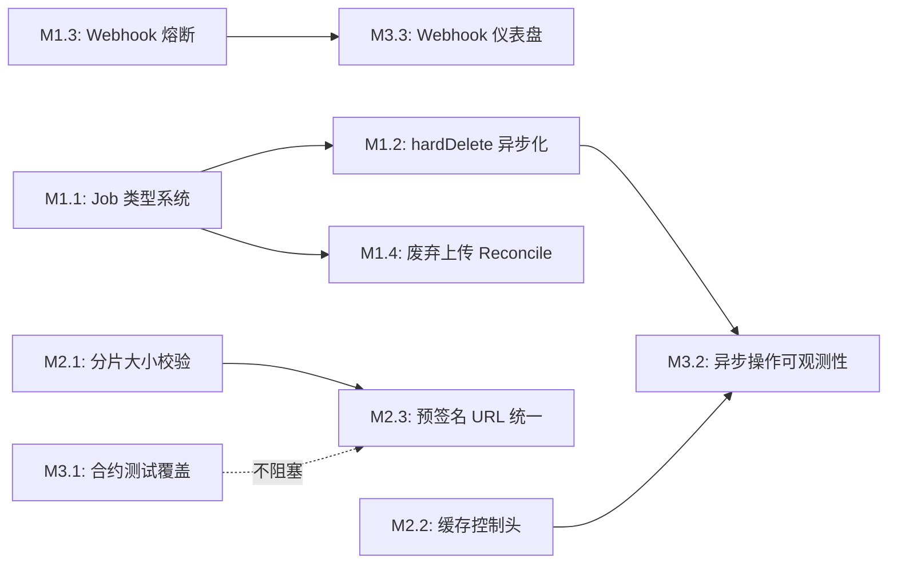

Good, I now have a thorough understanding of both the document and the actual codebase. Let me compose the architectural analysis.

---

# 架构分析报告：同步资源拆除、Webhook 熔断及运维盲区

> **基于：** `docs/requirements/expansion-v113-synchronous-teardown-webhook-circuit-breaker-and-operational-gaps.md`（541 行）  
> **交叉验证：** 已对照 `file_crud.go:367`、`file_multipart.go:60-215`、`webhook.go:93-185`、`handler.go:640`、`contract_test.go`、`storage.go` 等实际源码确认锚点准确性  
> **日期：** 2026-07-12  
> **视角：** 资深架构师

---

## 1. 架构评估

### 1.1 当前架构的优势

| 维度 | 评价 | 证据 |
|------|------|------|
| **分层清晰度** | ✅ **优秀**。四层（Protocol → Service → Storage/Repository → EventBus）严格分离，每一层只依赖下层接口。 | `FileService` 不引用任何 HTTP 类型；`storage.Storage` 接口仅 12 个方法，定义精炼 |
| **扩展性** | ✅ **接口驱动**。`Storage` 接口 4 个后端（local/S3/OSS/COS）可插拔，`Repository` 支持 SQLite/Postgres 方言切换，EventBus/JobPool 为异步扩展预留了骨架 | `factory.go` 的 `BackendKind` 分发；`main.go` 中 `buildStorageFrom` 按配置选择 |
| **有界上下文** | ✅ **领域边界明确**。`internal/service` 不暴露协议细节；`internal/api/s3compat` 不包含业务逻辑；`internal/events` 不感知存储后端 | `webhook.go` 仅依赖 `repository.Event` 和 `repository.WebhookFailure`，不引用 `storage` |
| **安全默认值** | ✅ **Opt-in 安全**。AI/Events/Qdrant/pgvector 全部默认关闭；`nil` 检查保护 CRUD 路径不受功能组件缺失影响 | `s.chunkCleaner != nil` 判断；`AI_INDEX_ENABLED` 门控 |
| **测试基础** | ✅ **合约测试模式**。`RunContract(t, Factory)` 模式使新后端通过一次调用获得全套测试 | `contract_test.go:30-44` 的 `RunContract` 函数 |

### 1.2 关键设计决策评估

| 决策 | 评价 | 分析 |
|------|------|------|
| **同步拆除流水线** | ⚠️ **短期合理，长期不可持续** | 在 local FS 后端（毫秒级 I/O）中，同步拆除是简单可靠的选择。但云后端 S3（50-800ms API 延迟）改变了量级。`hardDeleteObject` 的 5 步串行调用使请求延迟由最慢的步骤决定，违反了"请求处理路径不应执行无界 I/O"的基本原则。设计时间假设 local FS 为基线，未考虑云后端的延迟特征 |
| **全局单 Webhook URL** | ⚠️ **过度简化** | 设计中假定一个事件总线 → 一个 EventHandler → 一个 Webhook URL。S3 的事件通知系统支持多目标（多个 SQS/SNS/Lambda），当前架构扩展到多目标时需要重写 `deliver`。更核心的问题是**无 per-target 状态**：熔断、速率限制、延迟统计都是 per-target 概念 |
| **Metadata 系统键模式** | ⚠️ **脆弱的命名约定** | 用 `_aero_*` 前缀区分系统元数据和用户元数据。这是 Go 缺乏 discriminated union 时的常见模式，但容易出错：用户元数据可能意外冲突（如 `cache-control` 不是 `_aero_` 前缀，但在对象语义中应被特殊处理）。类型安全缺失 |
| **存储合约测试范围** | ⚠️ **覆盖率不够** | 12 个接口方法，`RunContract` 仅测试 6 个（合同测试 + multipart）。`PresignGet`/`PresignPut`/`AbortMultipart`/并发访问/零字节对象的合约测试缺失。**但 multipart 合约已经存在**（文档方向五的初版判断有误，验证报告已修正） |

### 1.3 架构债务与技术债

#### P0 级别（必须修复）

| 债务 | 位置 | 影响 | 根因 |
|------|------|------|------|
| **同步拆除阻塞请求路径** | `file_crud.go:367-396` | 云后端 S3 删除可阻塞 HTTP 请求 >3s；`DeleteFolder` 加载全部 key 进内存可能 OOM | 设计时以 local FS 为基线，未考虑云后端延迟量级差异 |
| **`AbortMultipart` 错误被忽略** | `file_multipart.go:219` | `_ = s.store.AbortMultipart(...)` 吞没错误，存储后端可能残留分片 | 早期认为 abort 非关键路径，但多后端情况下 abort 失败应至少 warn + 审计 |
| **Dead-letter 与 Success 状态混淆** | `webhook.go:224-226` | 10 次重试后调用 `MarkWebhookSucceeded` 停止重试，但语义上这是死信而非成功。运维无法区分"已成功投递"和"已放弃重试" | `webhook_failures` 表只有 `succeeded` 二进制标志，缺少 `dead_letter` 状态 |

#### P1 级别（应规划修复）

| 债务 | 位置 | 影响 |
|------|------|------|
| **`WebhookFailure` 状态模型二值化** | `webhook_failures.go:12-22` | `Succeeded bool` 无法表达 pending/dead_letter/circuit_breaked 等状态 |
| **缓存控制语义缺失** | `handler.go:640-665` | S3 协议兼容缺口；CDN/浏览器缓存效率低；出口带宽浪费 |
| **UploadPart 无输入校验** | `file_multipart.go:60-73` | 客户端可上传 <5MB 分片，违反 S3 规范；无 partNumber 去重 |
| **废弃上传无 Reconcile** | `reconcile/lifecycle.go` | 客户端崩溃后未 abort 的分片上传永久泄漏存储空间和 DB 行 |
| **预签名跨后端不一致** | `local.go` vs `s3.go` | Local 返回路径签名（`/presign/...`），S3 返回 AWS URL。FileService 层未统一 |

---

## 2. 架构扩展方向

### 方向 A：异步操作框架（Async Operation Framework）

> 对应文档方向一，但提升为系统级抽象而非单点修复。

**为什么需要：** 当前五个需要异步化的操作（hardDelete、DeleteFolder、分片清理、配额回滚、跨区复制）各自需要独立的异步机制。逐一实现会导致五种不同的异步模式。需要一个统一的**异步操作框架**。

**核心挑战：**

| 挑战 | 说明 |
|------|------|
| **操作类型系统** | 每种操作有不同的输入参数和状态转换图。`delete_object` 需要 `{tenant, bucket, key, hard}`；`delete_batch` 需要 `{tenant, bucket, keys[]}`；`abort_upload` 需要 `{uploadID}`。需要类型安全的泛型 Job 定义 |
| **依赖顺序与补偿** | `hardDeleteObject` 的 5 步有隐含依赖：chunk 清理必须在 storage 删除之前（chunk 引用文件 ID）；storage 删除必须在 repo 删除之前（repo 行引用 storage key）。任何一步失败需要补偿（undo 已成功的步骤） |
| **幂等性保障** | 同一操作可能被 JobPool 的 `Requeue` 机制执行多次。`repo.HardDeleteObject` 幂等（软删除后第二次硬删除无副作用）；但 `store.Delete` 在 S3 上是幂等的，在 local FS 上也是（删不存在的 key 返回 nil）。需要文档化每个操作步骤的幂等性保证 |
| **请求与执行的上下文分离** | 用户请求时的认证上下文（tenant/auth）需要传播到 Job 执行时。`context.Context` 中的值在序列化/反序列化 Job 时需保留 |

**预期架构变更：**

```
当前：
  HTTP Handler → FileService.hardDeleteObject() → [5 步同步]
  
建议：
  HTTP Handler → FileService.hardDeleteObject() → 
    ├─ 锁检查（同步，快速路径）
    └─ asynq.Enqueue("delete:object", {tenant, bucket, key, versionID})
    → 返回 202 Accepted + job_id
  
  Job Worker:
    JobPool.Consume("delete:object") →
      ① chunkCleaner.DeleteObjectChunks()
      ② store.Delete()
      ③ repo.HardDeleteObject()
      ④ AddTenantUsage()
      ⑤ emit(EventDeleted)
```

**对现有系统的影响：**

| 影响 | 程度 | 缓解策略 |
|------|------|---------|
| `FileService` 的 Delete 方法签名从 `(ctx, tenant, bucket, key, hard) error` 改为 `(ctx, tenant, bucket, key, hard) (jobID, error)` | **中等** — 调用方（handler）需要处理 `202 Accepted` 响应 | 保持向后兼容：硬删除改为异步返回 jobID，软删除保持同步（无 I/O 等待） |
| 同步测试路径需要 mock JobPool | **低** — 可用 `nil` 检查隔离 | 在单元测试中使用 `NoopJobPool` |
| `DeleteFolder` 从加载全部 key 改为分页提交 job | **正面影响** — 消除 OOM 风险 | 无兼容性问题 |

---

### 方向 B：目标感知事件投递系统（Target-Aware Event Delivery）

> 对应文档方向二，但扩展为多目标、状态感知的投递系统。

**为什么需要：** Webhook 从单 URL 进化到多目标（多 URL、按事件类型过滤、不同目标不同配置）是 S3 事件通知模型的必要前提。熔断器和速率限制是安全实现多目标投递的基础设施。

**核心挑战：**

| 挑战 | 说明 |
|------|------|
| **目标注册与生命周期** | 当前 `EVENTS_WEBHOOK_URL` 是全局配置。多目标需要：REST API 注册/删除目标、持久化目标配置、改变后动态加载 |
| **背压传播** | 当一个目标被熔断时，事件生产者（FileService 的 `emit`）不应被阻塞。需要有 `bufferedPublish` 模式：生产者快速返回，投递异步进行 |
| **熔断器参数调优** | 连续 5 次失败 → 打开？半开间隔 30s？这些参数在不同目标间可能需要不同配置 |
| **事件去重** | 同一事件因重试可能多次投递。需要 `eventID + targetURL` 去重（当前已有 `eventID`，但投递日志缺少目标维度） |

**预期架构变更：**

```
当前：
  Webhook { urls: []string } → deliver() → for each url { postOne() }
  
建议：
  Webhook { targets: map[string]*TargetState }
  
  TargetState:
    url: string
    filter: EventTypeFilter    // 可选：只接收特定类型的事件
    breaker: CircuitBreaker    // 熔断器（连续失败计数、状态、半开定时器）
    limiter: *rate.Limiter     // 速率限制器
    metrics: TargetMetrics     // 成功率、延迟 P50/P95/P99、投递计数
    backoff: BackoffStrategy   // 可配置的退避策略
  
  deliver():
    for each target {
      if target.IsOpen() → skip (log warning)
      if !target.limiter.Allow() → enqueue for later delivery
      go target.postOne(event)
    }
```

**对现有系统的影响：**

| 影响 | 程度 | 缓解策略 |
|------|------|---------|
| `Webhook` 结构体字段增加（targets map） | **高** — 需要新配置和持久化 | 向后兼容：如果 `EVENTS_WEBHOOK_URL` 存在，自动创建单一默认 target |
| `webhook_failures` 表新增 `status` 枚举字段 | **中等** — SQL 迁移 | 新 migration 添加 `status` 字段，默认值 `pending` |
| 需要新增 `events_targets` 表 | **中等** — 新迁移 | 初始版本迁移可选（无目标管理 API 时仅支持 env 配置） |
| `MarkWebhookSucceeded` 改为 `SetWebhookStatus(id, status)` | **小** — 函数重命名 + 扩展 | 逐步淘汰，保持旧函数调用新逻辑 |

---

### 方向 C：协议合规层（Protocol Compliance Layer）

> 覆盖文档方向三（分片上传校验）、方向四（缓存语义）、以及 S3 协议的其他未覆盖缺口。

**为什么需要：** 协议合规性目前分散在各 handler 中（S3 handler 校验 partNumber 范围、REST handler 校验 key 格式、UploadPart 不校验分片大小）。一个集中的**协议合规层**可以：

1. 将所有 S3/REST 协议约束**集中定义和验证**
2. 使 `FileService` 免于承担协议语义验证的责任（单一职责）
3. 为未来其他协议（NFS、FUSE）提供可复用的验证逻辑

**核心挑战：**

| 挑战 | 说明 |
|------|------|
| **验证位置选择** | 在 S3 handler 层验证（当前模式）vs 在 FileService 层验证 vs 独立的验证中间件。S3 handler 验证可提前拒绝非法请求、节省后端资源；FileService 层验证可确保所有协议入口（REST/S3/WebDAV/MCP）共享同一验证逻辑 |
| **错误码映射** | S3 的 `EntityTooSmall` 与 REST 的 `400 Bad Request` 是不同的错误码。合规层需要输出协议特定的错误 |
| **性能影响** | 每个请求都经过合规层会增加固定开销 |
| **SLA vs 性能** | 某些 S3 约束（如 5MB 最小分片）可以放宽（私有部署），合规层需要支持可配置的严格模式 |

**建议：** 在 `FileService` 入口处增加 `ValidateRequest` 方法，处理所有跨协议的通用校验；S3 特定约束留在 S3 handler 层（因为错误码需要 S3 XML 格式）。拒绝设计为一个独立层——因为这会在请求路径中增加不必要的间接。

**预期变更：**

```
当前验证分布：
  - S3 handler: partNumber 范围(1-10000)、key 格式
  - REST handler: key 格式（validateKey）
  - FileService: 配额、锁检查
  - UploadPart: 无验证 ← 缺口
  
建议验证分布：
  - 协议层（S3/REST handler）: 协议特定的错误码、请求头解析
  - FileService 入口: key 格式、保留字符、路径遍历
  - service.Validator: 业务规则（配额、权限、锁状态）
  - 存储后端的 UploadPart: 分片大小校验（由 storage.Storage 接口规范定义）
```

**对现有系统的影响：** 中等。`validateKey` 已存在，只需扩展。分片大小校验需要修改 `UploadPart` 的函数签名或选项参数。

---

### 方向 D：存储后端合约测试框架升级（Contract Test Framework Evolution）

> 对应文档方向五，但提升为正式的 **BDD 风格的合约测试框架**。

**为什么需要：** 当前的 `RunContract(t, Factory)` 模式是一个好的开始，但有三个局限：(1) 覆盖不全（漏了 presign、并发、零字节、abort）；(2) 不输出人类可读的合规报告（一个后端实现了多少合约？）；(3) 没有行为驱动的场景描述（无法表达"如果...那么..."的测试意图）。

**核心挑战：**

| 挑战 | 说明 |
|------|------|
| **合约的版本化** | 合约会进化（增加新方法、修改行为）。已通过合约测试的后端需要知道它们支持哪个版本的合约。 |
| **合约测试的执行环境** | Local 合约测试可在单元测试中运行；S3 合约测试需要 MinIO Docker；OSS/COS 合约测试需要真实云凭据。三者的测试编排方法不同 |
| **结果可读性** | `t.Fatalf` 的输出对后端实现者不够友好。"你的 S3 后端通过了 12/18 个合约测试，失败的 6 个是：PresignGet 返回格式、并发访问安全..." |

**预期架构变更：**

```go
// 建议的合约结构
type ContractSuite struct {
    Name     string
    Tests    []ContractTest
}

type ContractTest struct {
    Name    string
    Run     func(t *testing.T, s Storage)
    Scenes  []string           // 人类可读的场景描述
    Since   SemVer             // 该合约从哪个版本引入
    Requires []ContractCap     // 后端必须支持的capability
}

// 后端声明capabilities
type S3Storage struct { ... }
func (s *S3Storage) Capabilities() []ContractCap {
    return []ContractCap{
        CapPresign, CapMultipart, CapVersioning, CapTags,
    }
}

// 合约测试自动跳过后端不支持的capability
func RunContract(t *testing.T, f Factory, opts ...ContractOption) {
    s := f(t)
    caps := s.Capabilities()  // Storage 接口新增 Capabilities()
    for _, test := range suite {
        if !caps.HasAll(test.Requires) {
            t.Skipf("skip %s: backend lacks %v", test.Name, test.Requires)
            continue
        }
        t.Run(test.Name, ...)
    }
}
```

**对现有系统的影响：**

| 影响 | 程度 | 缓解策略 |
|------|------|---------|
| `Storage` 接口新增 `Capabilities()` 方法 | **中等** — 需要修改所有 4 个后端的实现 | 默认实现返回空集合（向后兼容） |
| 合约测试数量增加（6→12+） | **低** — 测试执行时间增加 3-5s | 可接受（local 后端） |
| S3/MinIO/OSS/COS 集成测试编排 | **高** — CI 复杂度增加 | 非 CI gate，仅文档化运行指南 |

---

### 方向 E：运维可观测性深化（Observability-First Design for Async Paths）

> 横切关注点，覆盖所有方向的观测需求。

**为什么需要：** 当前 OTel 指标覆盖了请求路径（延迟、吞吐、错误率），但异步路径（JobPool 执行、Webhook 重试、Reconcile 扫描）的可观测性不足。同步拆除异步化后，用户请求不再直接返回操作结果，运维需要新的观测手段追踪异步操作的执行状态。

**核心挑战：**

| 挑战 | 说明 |
|------|------|
| **异步操作的追踪** | 当 `DELETE` 返回 `202 Accepted` + `jobID`，用户如何查询操作状态？需要 `GET /v1/jobs/{id}` 接口暴露进度和结果 |
| **错误归因** | 异步操作失败时（如 storage 删除失败），错误需要归因到原始用户请求。这需要 `jobID ↔ requestID` 的关联 |
| **异步操作的延迟 SLO** | 需要一个指标 `async_job_duration_seconds{type="delete_object", status="success|failed"}` 来衡量异步操作的执行时间 |
| **Backpressure 可视性** | 当 Job 队列深度超过阈值时，需要告警（`job_queue_depth > 1000`） |

**预期变更：**

| 组件 | 新增指标 | 用途 |
|------|---------|------|
| JobPool | `async_jobs_enqueued_total{type}`、`async_jobs_duration_seconds{type, status}`、`job_queue_depth{type}` | 异步操作的吞吐和延迟 |
| Webhook | `webhook_delivery_duration_seconds{target_url, status}`、`webhook_circuit_breaker_state{target_url}` | Webhook 投递质量和熔断状态 |
| Reconcile | `reconcile_cycle_duration_seconds{type}`、`reconcile_objects_processed_total{type}` | Reconcile 任务执行效率 |

---

## 3. 接口设计建议

### 3.1 新增抽象层

#### AsyncJob 接口

```go
// 建议新增 internal/jobs/types.go

type JobType string

const (
    JobDeleteObject   JobType = "delete_object"
    JobDeleteBatch    JobType = "delete_batch"
    JobAbortUpload    JobType = "abort_upload"
    JobCleanChunks    JobType = "clean_chunks"
    JobReindexObject  JobType = "reindex_object"
)

type Job struct {
    ID        string              `json:"id"`
    Type      JobType             `json:"type"`
    Payload   json.RawMessage     `json:"payload"`
    State     JobState            `json:"state"`
    CreatedAt time.Time           `json:"created_at"`
    UpdatedAt time.Time           `json:"updated_at"`
    Error     string              `json:"error,omitempty"`
    RetryCount int                `json:"retry_count"`
    MaxRetries int                `json:"max_retries"`
    RequestID string              `json:"request_id,omitempty"` // 追踪：关联原始请求
}

type JobState string

const (
    JobPending    JobState = "pending"
    JobRunning    JobState = "running"
    JobCompleted  JobState = "completed"
    JobFailed     JobState = "failed"
    JobCancelled  JobState = "cancelled"
)

type JobRegistry interface {
    Register(jobType JobType, handler JobHandler)
    Dispatch(ctx context.Context, job Job) error
}

type JobHandler func(ctx context.Context, job Job) error
```

**设计原则：**
- **类型安全：** 每个 `JobType` 对应一个强类型的 Payload 结构体（`DeleteObjectPayload`、`DeleteBatchPayload`），而非 `map[string]any`
- **幂等性：** `JobHandler` 的实现必须幂等（同一个 Job 执行两次产生相同结果）
- **可观测：** `JobHandler` 内部自动获取 OTel span，从 Job 的 `RequestID` 衍生出父子关系

#### WebhookTarget 状态机

```go
// 建议新增 internal/events/target.go

type TargetState struct {
    URL           string
    Filters       EventFilter
    Breaker       *CircuitBreaker
    Limiter       *rate.Limiter
    Metrics       *TargetMetrics
    BackoffPolicy BackoffPolicy
}

type CircuitBreaker struct {
    mu                  sync.RWMutex
    state               BreakerState
    consecutiveFailures int
    lastFailureTime     time.Time
    halfOpenInterval    time.Duration   // 默认 30s
    failureThreshold    int             // 默认 5
    successThreshold    int             // 半开后恢复需要连续成功次数
}

type BreakerState int

const (
    BreakerClosed   BreakerState = iota // 正常
    BreakerOpen                         // 熔断
    BreakerHalfOpen                     // 试探
)

type TargetMetrics struct {
    DeliveriesTotal   atomic.Int64
    FailuresTotal     atomic.Int64
    LastDeliveryAt    atomic.Value // time.Time
    LatencyP50        atomic.Int64 // ms
    LatencyP95        atomic.Int64 // ms
}
```

**设计原则：**
- **自包含：** `TargetState` 封装所有 per-target 状态（熔断器、限流器、指标），不依赖全局状态
- **无锁读取：** `IsOpen()` 用 `RLock`，状态转换用 `Lock`（熔断状态的读取远多于写入）
- **自动重置：** 超过 1 小时不活跃的 target 自动从内存中卸载（从 `webhook_targets` 表重新加载）

### 3.2 向后兼容策略

| 变更 | 兼容策略 | 过渡期 |
|------|---------|--------|
| `Delete()` 返回 `(jobID, error)` | 新增 `AsyncDelete()` 方法，旧 `Delete()` 内部调用异步 + 轮询等待（阻塞当前 goroutine） | 永久（旧方法标记为 Deprecated） |
| `Storage` 接口新增 `Capabilities()` | 默认返回空集合，不强制实现 | 2 个版本内完成所有后端实现 |
| `WebhookFailure.Succeeded bool` → `Status string` | 新增 `Status` 字段，废弃 `Succeeded`（迁移脚本填充 `succeeded=true → status="delivered"`） | 1 个版本 |
| `EVENTS_WEBHOOK_URL` 环境变量 | 如果单个 URL 环境变量存在，自动创建默认 target | 永久 |

### 3.3 不需要引入的抽象

| 决策 | 理由 |
|------|------|
| ❌ 不引入独立的 `Compliance` 层 | 验证逻辑分散且需要协议特定的错误码格式，集中一个层反而增加间接性。更好的方案是在 `FileService` 入口加强校验，且保持 S3 校验在 S3 handler 层 |
| ❌ 不引入 `Workflow` 引擎（Temporal/Camunda） | JobPool 加幂等 handler 已经足够。引入外部工作流引擎带来的运维复杂度（Temporal Server、持久化）远超过当前问题域的需求 |
| ❌ 不引入消息队列（Kafka/RabbitMQ）替代 EventBus | in-process EventBus 加上 JobPool 的持久化保证已经满足当前需求。Kafka 在多副本场景下才有价值 |

---

## 4. 技术选型

### 4.1 引入评估

| 技术 | 评估 | 决策 |
|------|------|------|
| **`github.com/go-co-op/gocron`** v2 | 用于 Reconcile 定时任务调度。当前 `time.Ticker` 实现简单但缺少：任务取消、分布式锁、执行时间统计 | ⚠️ **可选的**。可以继续用 `time.Ticker` + `sync.Mutex` 实现单节点调度，分布式场景再引入 |
| **`github.com/sony/gobreaker`** | Sony 的熔断器库，已经生产验证。支持：连续失败计数、半开状态、可配置阈值。**与当前 `storage/circuitbreaker.go` 的模式兼容** | ✅ **推荐引入**。无需自建熔断器，gobreaker 提供的 `CircuitBreaker.Execute(func() error)` 可以直接包装 HTTP 调用 |
| **`golang.org/x/time/rate`** | 令牌桶限流器。**已经在 `middleware/ratelimit.go` 中使用** | ✅ **复用现有库**。Webhook 的 per-target 限流使用 `rate.NewLimiter(rate.Limit(rps), burst)` |
| **`github.com/hibiken/asynq`** | Redis 驱动的异步任务队列。提供：任务调度、重试、超时、分布式 worker | ❌ **不推荐**。引入 Redis 依赖增加运维复杂度。当前 JobPool 基于 `jobs` SQL 表已经足够。异步操作的量级（删除/清理）远低于需要 Redis 的规模（预计 <100 job/s） |
| **`github.com/prometheus/client_golang`** | **已经在使用**。用于 `/metrics` 暴露 OTel + Prometheus 指标 | ✅ **复用**。新增 `async_jobs_*` 和 `webhook_target_*` 指标族 |

### 4.2 自建 vs 采购决策框架

| 决策 | 建议 | 理由 |
|------|------|------|
| **熔断器** | **使用 `gobreaker`（自建？开箱即用）** | 熔断器逻辑 ~100 行核心代码，但边界情况（并发安全、半开定时器、指标暴露）需要大量测试。gobreaker 已经过生产验证。 |
| **异步 Job 框架** | **基于现有 JobPool 自建** | 当前已有 `jobs` 表 + JobPool worker。只需要添加 `job_type` 分发 + 强类型 payload。引入 asynq 等外部组件带来的 Redis 依赖和运维复杂度不值得。 |
| **SQLSchema 迁移工具** | **继续使用现有的 `migrations/` + `repo.Migrate`** | 当前的双 SQL 文件（sqlite + postgres）模式已经经过 50 对迁移文件的验证。不引入 goose/golang-migrate。 |
| **Storage 合约测试编排** | **自建** | 需求很简单：为每个后端运行 `RunContract`。不需要 Testcontainers 级别的编排（OSS/COS 需要真实云凭据，不属于自动化 CI）。 |

### 4.3 评估第三方依赖的标准

| 标准 | 必须满足 | 宽松 |
|------|---------|------|
| 许可证兼容 | Apache 2.0 / MIT / BSD | AGPL ❌ |
| 依赖深度 | ≤ 3 层 transitive deps | > 5 层 ❌ |
| 测试覆盖 | > 70% | < 50% ❌ |
| Go 版本兼容 | go 1.25（项目的 Go 版本） | 非 1.25 ❌ |
| 生产验证 | GitHub Stars > 1k | < 500 ❌ |
| 维护活跃度 | 最近 6 个月有提交 | 超过 1 年未更新 ❌ |

---

## 5. 实施路线图

### 优先级总览

```
P0（此 Sprint + 下个 Sprint）  ─── 方向 A（异步框架）+ 方向 B（Webhook 熔断）
P1（1-2 月内）                 ─── 方向 C（协议合规）
P2（持续改进）                 ─── 方向 D（合约测试）+ 方向 E（可观测性）
```

### 阶段划分

#### 阶段 1：地基（Sprint 1-2，P0）

| 里程碑 | 交付物 | 风险 |
|--------|--------|------|
| **M1.1** Job 类型系统 | `internal/jobs` 包定义 `JobType`、`Job`、`JobRegistry`、`JobHandler`；强类型 Payload 结构体；`JobStore` SQL CRUD | 中等 — 需要新的 migration 或扩展现有 `jobs` 表 |
| **M1.2** hardDeleteObject 异步化 | `Delete()` 返回 `(jobID, error)`；`AsyncDelete()` handler 返回 `202`；Job worker 实现 5 步拆除 | 高 — 调用方需要处理返回类型变更；`DeleteFolder` 的分批拆分影响前端 |
| **M1.3** Webhook per-target 熔断 | `TargetState`、`gobreaker` 集成、`rate.Limiter` per-target、`WebhookFailure` 新增 `status` 枚举 | 低 — 向后兼容；测试只需验证熔断逻辑 |
| **M1.4** 废弃上传 Reconcile | `CleanupOrphanUploads` Reconcile 任务：扫描 7 天前的未完成上传 → `AbortMultipart` | 低 — 新增 Reconcile job，不修改现有路径 |

**风险缓解策略：**

| 风险 | 可能原因 | 缓解措施 |
|------|---------|---------|
| `Job` 与现有 `JobPool` 命名冲突 | 已有 `internal/workers` 的 JobPool | 新包名 `internal/jobs`，明确与 `workers.JobPool` 的关系（jobs 是 JobPool 的生产者） |
| `Delete()` 返回类型变更破坏所有调用方 | S3 handler、REST handler、WebDAV handler、CLI、MCP 都调用 `FileService.Delete` | 保留旧的同步 `Delete()`（内部调用异步 + `sync.WaitGroup` 等待），新增 `DeleteAsync()`。旧方法 deprecated |
| Webhook 熔断器误判导致投递漏过 | 网络抖动导致一次 503 触发熔断 | 熔断阈值设为 5（连续 5 次失败才打开），半开间隔 30s，半开后连续 2 次成功即关闭 |

#### 阶段 2：协议合规（Sprint 3-4，P1）

| 里程碑 | 交付物 | 风险 |
|--------|--------|------|
| **M2.1** UploadPart 分片大小校验 | `service.UploadPart` 在 `CompleteMultipart` 时校验（最后一片外）≥ 5MB；S3 handler 返回 `EntityTooSmall` | 低 — 向后兼容（之前通过的 <5MB 分片在升级后不会出问题，因为校验只在 CompleteMultipart 时执行） |
| **M2.2** 缓存控制头 | PUT 路径读取 `Cache-Control` / `Expires` 头并存入元数据；GET 路径回放；可配置默认策略 | 低 — 纯 HTTP 头操作 |
| **M2.3** 预签名 URL 统一 | `FileService.PresignGet` 返回结构体 `{URL string, Method string, Headers map[string]string}` 而不是裸字符串，让 handler 根据不同协议格式化 | 中等 — 所有调用方需要适配新返回类型 |

**风险：** 缓存控制头与现有 ACL/SSE 的互操作（私有对象不应被 CDN 缓存）。需要清晰的逻辑：对象 ACL 非 public-read → 覆盖 `Cache-Control: private`；SSE-C 加密 → 自动 `Cache-Control: private`。

#### 阶段 3：测试与可观测性（Sprint 5+，P2）

| 里程碑 | 交付物 | 风险 |
|--------|--------|------|
| **M3.1** 合约测试覆盖 | `RunContract` 新增 6 个测试组（PresignGet、PresignPut、AbortMultipart、ConcurrentAccess、ZeroByte、Overwrite part） | 低 — 测试代码，不涉及生产路径 |
| **M3.2** 异步操作可观测性 | `async_jobs_*` 指标、`GET /v1/jobs/{id}` 状态查询 API | 低 — 新增 API endpoint |
| **M3.3** Webhook 仪表盘 | Grafana panel：per-target 成功率、延迟、熔断状态 | 低 — 配置变更 |

### 依赖关系图



### 工作量预估

| 阶段 | 人周 | 关键路径 |
|------|------|---------|
| 阶段 1 地基 | 3-4 周 | M1.2（hardDelete 异步化）的 handler 改造 + 调用方兼容 |
| 阶段 2 协议合规 | 2-3 周 | M2.3（预签名统一）的接口变更波及较广 |
| 阶段 3 测试+可观测 | 2 周 | 无关键依赖，可并行 |

**总计：7-9 周（约 2 个季度）**

---

## 总结

本文档识别的五个方向覆盖了 AeroVault 目前最关键的架构缺口：**同步操作的异步化**和**事件投递的状态感知**是两个核心模式转换，直接决定了系统能否从单机 SQLite+local FS 的基线形态演进到多租户、多后端的生产级服务。

最值得投入的架构工作：

1. **异步操作框架**（P0）— 不仅是修复 `hardDeleteObject`，而是为所有需要异步化的操作提供一个统一的抽象。这是系统未来 2-3 年扩展的基础设施。

2. **目标感知事件投递**（P0）— 多目标 + 熔断 + 速率限制是 EventBridge 模式的基础。没有这个，Webhook 从一个 URL 扩展到多个目标时必然引发级联故障。

3. **不引入外部组件** — 异步 Job 基于现有的 SQL + JobPool，不引入 Redis；熔断器用 `gobreaker` 而非自建；限流器复用已有的 `rate.Limiter`。保持 Go 的"简单就是力量"哲学。
