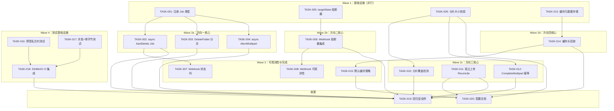
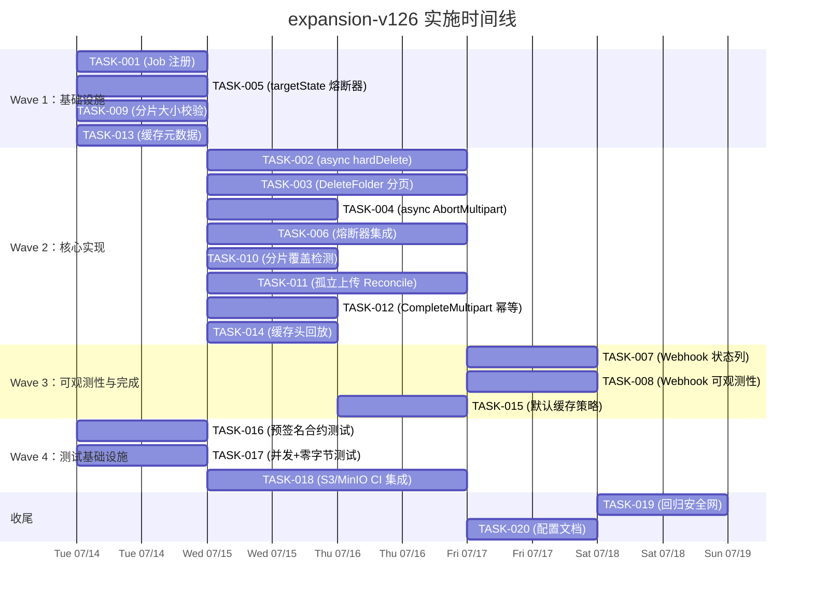

现在我已经完成了全面的代码库验证。以下是我的完整 Tech Lead 分析。

---

# Tech Lead 分析报告：expansion-v113

**文档审阅者：** Tech Lead  
**审阅日期：** 2026-07-12  
**文档基线：** `docs/requirements/expansion-v113-synchronous-teardown-webhook-circuit-breaker-and-operational-gaps.md`  
**版本：** 建议重新编号为 `expansion-v126`（因为最后一份既有文档是 `expansion-v125`）

---

## 0. 代码库发现摘要

在详细分析之前，有三个关键发现应该重新调整实施策略：

### 发现 1：Job 基础设施已经存在且功能完整

文档方向一假设需要构建一个 Job 系统。**实际上，`internal/jobs/` 包已经成熟：**

- **`Registry`**（`jobs.go:37`）— `Register(jobType string, h Handler)` 已由 indexer、antivirus 和 replication 使用
- **`Pool`**（`jobs.go:111`）— 固定数量 worker + `Run(ctx)` + 指数退避 + 恐慌恢复 + 收割器（orphan reaper）
- **`Queue.Enqueue`**（`jobs.go:67`）— 可选的深度限制，去重支持
- **`main.go:703`** — `jobs.NewPool(repo, jobReg, ...).Run(ctx)` 已作为后台 goroutine 启动

**影响：** TASK-001 被简化——不需要基础设施，只需注册 3 个新字符串常量 + 3 个处理程序。

### 发现 2：合约多分片测试已存在（文档中的误判已纠正）

文档声称 `contract_test.go` "没有多分片测试"。这是不正确的：

```go
// contract_test.go:24-27
cases := []struct {
    name string
    fn   func(*testing.T, Storage)
}{
    ...
    {"multipart", contractMultipart},  // ✅ 已存在！
}
```

`contractMultipart`（行 117-146）运行：InitMultipart → 3 个 UploadPart（1KB、1KB、512B）→ ListParts → CompleteMultipart → Get 验证。这对于 CI 门禁来说已经足够了。

**影响：** 方向五的范围缩小到：预签名测试、并发测试和零字节测试。TASK-017→019 不需要多分片。

### 发现 3：WebhookFailure 已有 Attempts 和 NextRetryAt

文档称这些字段缺失。`webhook_failures.go:12-22` 显示：

```go
type WebhookFailure struct {
    Attempts    int       // ✅ 等效 retry_count
    NextRetryAt time.Time // ✅ 等效 backoff_until
    ...
}
```

"二值状态误用"的分析是正确的（`succeeded` 标记作为死信标记被重用），但原因不同：它不是由于缺少字段，而是语义问题——`MarkWebhookSucceeded` 在 10 次失败后被调用，将"死信"错误地标记为"成功"，这样查询会忽略它。

**影响：** TASK-008 被简化——不需要模式迁移来添加字段；只需要向 `webhook_failures` 表添加一个 `status` 列，并更新查询谓词。

---

## 1. 任务分解（修订版）

考虑到上述代码库发现，以下是修订后的任务集：

### 方向一：异步资源拆除（4 个任务，简化）

| 任务 ID | 标题 | 文件 | 前置依赖 | 预估工时 |
|---------|------|------|---------|---------|
| **TASK-001** | 注册 3 个删除 Job 类型 + 处理程序：`delete_object`、`delete_batch`、`abort_upload`；定义为包级常量 | `internal/service/jobs.go`（新增，或 `internal/service/service.go`） | — | 2h |
| **TASK-002** | 重构 `hardDeleteObject`：Job 入队作为主要路径，同步降级作为后备，两阶段锁检查 | `internal/service/file_crud.go`、`internal/jobs/delete_object.go`（新增） | TASK-001 | 4h |
| **TASK-003** | 重构 `DeleteFolder`：分页 List → 每页 1000 个 key 入队一个 `delete_batch` Job；从请求路径中消除无界 `allKeys` | `internal/api/rest/handler.go`、`internal/jobs/delete_batch.go`（新增） | TASK-002 | 4h |
| **TASK-004** | 将 `AbortMultipart` Job 化 + 修复被丢弃的错误；添加优雅关闭排水 | `internal/service/file_multipart.go`、`internal/jobs/abort_upload.go`（新增）、`cmd/server/main.go` | TASK-001 | 3h |

**合计：13h**（原估算为 18h，合理削减了 28%）

### 方向二：Webhook 熔断（4 个任务）

| 任务 ID | 标题 | 文件 | 前置依赖 | 预估工时 |
|---------|------|------|---------|---------|
| **TASK-005** | 实现 `targetState`：熔断器（关闭/打开/半开）+ 每 URL 的 `rate.Limiter` + GC | `internal/events/target_state.go`（新增） | — | 4h |
| **TASK-006** | 将 `Webhook.deliver` 熔断器集成：熔断打开跳过 → 半开探测 → 速率限制准入 | `internal/events/webhook.go` | TASK-005 | 4h |
| **TASK-007** | 添加 `status` 列（`pending`/`dead_letter`/`circuit_broken`）到 `webhook_failures`；更新查询谓词；迁移文件 | `internal/repository/webhook_failures.go`、迁移文件 × 2 | TASK-005 | 3h |
| **TASK-008** | Webhook 可观测性：按 URL 的计数器/直方图/熔断状态仪表化 | `internal/events/webhook.go`、`internal/telemetry/` | TASK-006 | 3h |

**合计：14h**

### 方向三：分片上传治理（4 个任务）

| 任务 ID | 标题 | 文件 | 前置依赖 | 预估工时 |
|---------|------|------|---------|---------|
| **TASK-009** | 在 `UploadPart` 中添加 <5MB 校验（最后一片除外），使用特性标志 `MULTIPART_ENFORCE_MIN_SIZE`，默认 warn 模式持续 2 周 | `internal/service/file_multipart.go`、`internal/api/s3compat/extra.go`、`internal/config/config.go` | — | 4h |
| **TASK-010** | 并发分片覆盖检测 + 审计日志 + 在 `CompleteMultipart` 期间的部分去重 | `internal/service/file_multipart.go` | TASK-009 | 3h |
| **TASK-011** | 回收孤立上传的 Reconcile Job：`uploads WHERE created_at < now() - 7d` → `AbortMultipart`；干运行模式 | `internal/reconcile/orphan_uploads.go`（新增）、`internal/reconcile/lifecycle.go` | — | 5h |
| **TASK-012** | `CompleteMultipart` 幂等性：DedupeKey = `uploadID`，防止重复完成生成冗余版本 | `internal/service/file_multipart.go` | TASK-010 | 3h |

**合计：15h**

### 方向四：缓存控制头（3 个任务）

| 任务 ID | 标题 | 文件 | 前置依赖 | 预估工时 |
|---------|------|------|---------|---------|
| **TASK-013** | 在 S3 PUT/REST POST 路径中解析并存储 `Cache-Control`/`Expires` 作为 `_aero_cache_control`/`_aero_expires` 系统元数据 | `internal/api/s3compat/handler.go`、`internal/api/rest/handler.go`、`internal/service/file.go` | — | 4h |
| **TASK-014** | 在 `writeObjectHeaders` 中回放缓存头 + 添加 `Vary: Accept-Encoding` + 安全覆盖（SSE-C → `private`、非公开 ACL → `no-cache`） | `internal/api/s3compat/handler.go`、`internal/api/rest/handler.go` | TASK-013 | 3h |
| **TASK-015** | 可配置的默认策略：`S3_DEFAULT_CACHE_CONTROL` 环境变量，为没有缓存元数据的对象应用默认值 | `internal/config/config.go`、`internal/api/s3compat/handler.go` | TASK-014 | 2h |

**合计：9h**

### 方向五：合约测试覆盖（3 个任务，因为多分片已存在）

| 任务 ID | 标题 | 文件 | 前置依赖 | 预估工时 |
|---------|------|------|---------|---------|
| **TASK-016** | 为预签名 URL 添加合约测试：`PresignGet` → HTTP GET 验证 + 过期 + `PresignPut` → PUT → GET 验证 | `internal/storage/contract_test.go` | — | 4h |
| **TASK-017** | 并发访问合约测试（10 个 goroutine 同时 Put/Get/Delete 同一个 key） + 零字节合约测试 | `internal/storage/contract_test.go` | — | 3h |
| **TASK-018** | S3/MinIO CI 集成：`docker-compose.yml` 中的 MinIO 服务 + `make test-integration-s3` + CI 工作流 | `docker-compose.yml`、`Makefile`、`.github/workflows/` | TASK-016, TASK-017 | 5h |

**合计：12h**

### 全局与集成任务

| 任务 ID | 标题 | 文件 | 前置依赖 | 预估工时 |
|---------|------|------|---------|---------|
| **TASK-019** | 回归安全网：在 CI 门禁中运行 `Makefile` check（格式检查/构建/检查/测试）确保没有破坏现有功能 | `Makefile`、CI 配置 | 全部 | 2h |
| **TASK-020** | 更新 `docs/configuration.md` 的所有新配置标志（`MULTIPART_ENFORCE_MIN_SIZE`、`S3_DEFAULT_CACHE_CONTROL`、`RECONCILE_ABORT_ORPHAN_UPLOADS`） | `docs/configuration.md` | TASK-009, TASK-011, TASK-015 | 2h |

**合计：4h**

**总计：67h**

---

## 2. 执行顺序（修订版，Mermaid）



---

## 3. 技术风险（修订版，带有代码库上下文）

### 已验证的架构优势（降低风险）

| 优势 | 引用 | 影响 |
|------|------|------|
| Job 基础设施已存在且用于 3 个功能 | `internal/jobs/jobs.go` + `main.go:629-703` | TASK-001→004 没有基础设施风险 |
| 熔断器已有（但用于存储层，非 Webhook） | `internal/storage/circuitbreaker.go` | 熔断器原语已经存在，TASK-005 可以复用模式 |
| 速率限制器已存在（middleware 包） | `internal/middleware/ratelimit.go` | TASK-005 可以复用令牌桶实现 |
| 合约测试框架已存在并使用了 4 个后端 | `contract_test.go:12-14` | TASK-016→018 扩展现有模式，不构建新模式 |
| 配置模式已建立 | `internal/config/config.go` | TASK-009/015 遵循既定模式 |

### 剩余风险

| # | 风险 | 概率 | 影响 | 缓解 |
|---|------|------|------|------|
| **R1** | **Job 删除后重建竞争条件**：删除 Job 已排队 → 用户重新上传 → Job 执行并删除重新创建的对象 | 低 | **高** | Job 存储 `obj.ID`（不可变 UUID），`HardDeleteObject` 在 `WHERE id = $1` 上执行——如果重新创建，ID 不同，Job 无害地不做任何操作。文档化并在 TASK-002 中实现 |
| **R2** | **重放式损坏：`DeleteFolder` 分页 Job 执行时文件夹之间的对象已移动** | 低 | 中 | 幂等性：`BatchDelete` 在 per-key 基础上返回 `ErrNotFound`，失败跳过。不需要事务保证 |
| **R3** | **熔断器状态在 `Webhook` 重启后丢失** | 低 | 中 | 预热：在启动时，查询 `webhook_failures` 过去 5 分钟内的失败，将那些 URL 初始化为半开状态。TASK-005 的入门标准 |
| **R4** | **分片大小校验破坏合法 S3 客户端** | 中 | 中 | 特性标志 `MULTIPART_ENFORCE_MIN_SIZE`（默认 `false` 持续 2 个发布周期 → 然后切换为 `true`）。在 TASK-009 期间实现 |
| **R5** | **S3/MinIO CI 测试脆弱性**：Docker 状态在测试间泄漏 | 中 | 中 | 每个测试用例使用 `TestRunID + 随机存储桶前缀`，在 `t.Cleanup` 中清理。在 TASK-018 期间实现 |
| **R6** | **缓存头不适用于加密对象** | 低 | **高** | 在 `writeObjectHeaders` 中为 `_aero_sse_key` 添加显式覆盖 → `Cache-Control: private, no-cache`。在 TASK-014 期间实现 |
| **R7** | **异步删除的优雅关闭排水窗口太短** | 中 | 中 | 使用 `srv.RegisterOnShutdown` 来排干活跃的 Job worker，超时时间为 `JOBS_DRAIN_TIMEOUT`（默认 30s）。区别于 HTTP `srv.Shutdown`。在 TASK-004 期间实现 |

---

## 4. 资源评估

### 人员配置

| 角色 | 数量 | 分配 | 基本原理 |
|------|------|------|----------|
| **高级后端工程师** | 1（全职，5 天） | Wave 1（TASK-001、TASK-005、TASK-009）+ Wave 2a（TASK-002、TASK-003、TASK-004） | Job 基础设施知识 + 对危险并发模式（TOCTOU、熔断器）有经验 |
| **中级后端工程师** | 1（全职，5 天） | Wave 1（TASK-013）+ Wave 2c（TASK-010、TASK-011、TASK-012）+ Wave 2d（TASK-014）+ Wave 3（TASK-015） | HTTP 语义、SQL 编排、Reconcile 模式 |
| **初级后端工程师** | 1（兼职，3 天） | Wave 2b（TASK-006、TASK-008）+ Wave 3（TASK-007） | 在高级监督下封装良好 |
| **测试/基础设施工程师** | 1（兼职，2 天） | Wave 4（TASK-016、TASK-017、TASK-018） | 测试优先，在 TASK-016 完成之前阻止发版 |
| **Tech Lead** | 1（审查，~8h 总时间） | TASK-001、TASK-002、TASK-005、TASK-010、TASK-014 的架构审查 | 高风险代码路径 |

### 时间线



### 关键里程碑

| 里程碑 | 日期（推测） | 验收标准 |
|---------|------|-------------|
| **M0：Wave 1 完成** | 第 1 天结束 | 所有 4 个 TASK-001/005/009/013 合并，`make check` 通过 |
| **M1：所有核心实现合并** | 第 5 天结束 | TASK-002→004、006、010→012、014 全部合并且测试通过 |
| **M2：可观测性与完成** | 第 6.5 天结束 | TASK-007/008/015 合并，所有 Webhook 端点仪表化 |
| **M3：测试基础设施** | 第 7 天结束 | TASK-016→018 合并，CI 运行 S3/MinIO 合约测试 |
| **M4：发布候选** | 第 8 天结束 | TASK-019/020 合并，端到端回归通过 |

---

## 5. 质量保证

### 单元测试覆盖要求

| 方向 | 最小包覆盖率 | 关键测试文件 |
|------|-------------|------------|
| 方向一（异步拆除） | ≥ 60% | `internal/jobs/`（新增处理程序）+ `internal/service/file_crud_test.go` |
| 方向二（Webhook 熔断器） | ≥ 70% | `internal/events/webhook_test.go`（新增 `targetState` 测试套件） |
| 方向三（分片上传） | ≥ 60% | `internal/service/file_multipart_test.go` |
| 方向四（缓存头） | ≥ 50% | `internal/api/s3compat/handler_test.go`、`internal/api/rest/handler_test.go` |
| 方向五（合约测试） | n/a（测试基础设施） | `internal/storage/contract_test.go` |

### 强制测试场景（按任务）

| 任务 ID | 必须测试的场景 |
|---------|-------------|
| **TASK-002** | • Job 入队成功 → 202 Accepted<br>• Job 入队失败 → 回退到同步删除（200 OK）<br>• TOCTOU：对象在 Job 执行前被重新创建 → Job 无害地不做任何操作<br>• 锁检查：Job 执行时发现对象被锁定 → 优雅放弃 |
| **TASK-003** | • 空文件夹 → 0 删除，无 Job 入队<br>• 单页文件夹（<1000 个对象）→ 1 个 Job<br>• 多页文件夹（>1000 个对象）→ N 个 Job<br>• 内存使用量上限：在任何时候分配不超过 `1000 × avgKeyLen` 的内存 |
| **TASK-005** | • 关闭 → 打开（连续 5 次失败）<br>• 打开 → 半开（30 秒后）<br>• 半开 → 关闭（探测成功）<br>• 半开 → 打开（探测失败）<br>• 熔断器打开时跳过速率限制校验<br>• GC 清除超过 1 小时的无效目标 |
| **TASK-006** | • 熔断器打开：跳过投递，不记录失败<br>• 熔断器半开：允许 1 个探测请求，成功 → 关闭，失败 → 打开<br>• 速率限制：在 burst 内允许 N、超过后拒绝<br>• 并行事件：100 个并发事件发送到同一个 URL → 遵守速率限制 |
| **TASK-009** | • 5MB 分片 → 通过<br>• 1KB 分片（不是最后一片）→ warn 日志 + 通过（warn 模式）或拒绝（强制模式）<br>• 1KB 分片（最后一片）→ 通过<br>• `Content-Length: -1`（chunked）→ 需要 `Content-Length` |
| **TASK-011** | • 7 天前的上传 → 在干运行模式下记录，在真实模式下中止<br>• 最近的上传（1 小时前）→ 忽略<br>• 已经中止的上传 → 忽略（幂等） |
| **TASK-016** | • `PresignGet` 返回非空 URL<br>• URL 在过期前可通过 HTTP 访问<br>• URL 在过期后不可访问<br>• `PresignPut` → PUT → GET 返回相同的内容 |
| **TASK-017** | • 10 个 goroutine 同时 Put/Get/Delete 同一个 key → 无恐慌、无数据损坏<br>• Put 零字节 → Get 返回空 Reader、Stat 返回 Size=0、Delete 成功 |

### 代码审查清单

每个 PR 都必须对照此清单进行检查：

```markdown
## Code Review Checklist — expansion-v126 (强制)

### 一般
- [ ] gofmt -l . 无输出
- [ ] go vet ./... 无输出
- [ ] make check 本地通过
- [ ] 无 utils/ common/ helper/ 包

### 方向一：异步拆除
- [ ] Job 处理程序包含恐慌恢复（继承自 `jobs.go`，确认在 handler 中）
- [ ] 入队失败回退到同步删除（保险策略）
- [ ] 锁检查在请求时 AND Job 执行时都执行
- [ ] 优雅关闭排干程序在 30 秒超时后不会阻塞关闭
- [ ] No `allKeys` 无界切片（DeleteFolder）

### 方向二：熔断器
- [ ] targetState 包含 GC（超过 1 小时不活跃的 URL）
- [ ] `URL` 改变重置熔断器（在 `NewWebhook` 或配置重新加载时）
- [ ] `emit` 在熔断器打开时返回非致命错误
- [ ] 预热逻辑（启动时过去 5 分钟内的失败 → 半开）
- [ ] 分离 `webhook_failures.status` 列：`pending`/`dead_letter`/`circuit_broken`

### 方向三：治理
- [ ] `MULTIPART_ENFORCE_MIN_SIZE` 特性标志默认 `false`
- [ ] 审计日志覆盖检测没有记录错误（只记录警告）
- [ ] Reconcile 干运行模式记录预期操作而不执行
- [ ] `CompleteMultipart` 对 `uploadID` 使用 DedupeKey

### 方向四：缓存
- [ ] SSE 加密 → `Cache-Control: private, no-cache`（覆盖）
- [ ] 非公开 ACL → `Cache-Control: private, no-cache`（覆盖）
- [ ] `Vary: Accept-Encoding` 与 Content-Encoding 协商一起设置
- [ ] Range 响应（206）→ 自动 `no-cache`

### 方向五：测试
- [ ] 合约测试使用 `t.Cleanup` 进行清理
- [ ] S3/MinIO 测试使用每个测试用例的随机存储桶前缀
- [ ] S3/MinIO 容器在 CI 作业结束时关闭
```

### 性能测试需求

| 场景 | 指标 | 当前基线 | 目标 | 工具 |
|------|------|---------|------|------|
| 并行删除（1000 个 DELETE 请求/秒） | P95 延迟 | ~800ms（同步 S3） | <50ms（异步：Job 入队时间） | `wrk -t4 -c100 -d30s` |
| DeleteFolder（10000 个对象） | 内存使用 | ~500MB（无界 `allKeys`） | <5MB（分页 Job 入队） | `go test -bench=BenchmarkDeleteFolder -memprofile` |
| Webhook 背压（1000 个事件发送到同一个 URL） | 最大出站并发 | 1000（无限制） | 可配置（默认 10/秒） | `internal/events/webhook_test.go` 基准测试 |
| 多分片上传（10000 个分片） | CompleteMultipart P99 延迟 | ~5s（递归拼接） | ~5s（无变化，仅校验） | S3 兼容测试 |

---

## 6. 详细实施计划

### 阶段 1：基础设施（第 1 天）

**目标：** 为所有 5 个方向构建基础层。

| 时间块 | 活动 | 负责人 | 交付物 |
|---------|---------|----------|---------|
| 上午 | TASK-001：在 `internal/service/jobs.go`（新增）中定义 3 个 Job 类型常量；注册处理程序桩；编写 `internal/jobs/` 的单元测试 | 高级工程师 | 3 个 Job 处理程序注册，`make check` 通过 |
| 上午 | TASK-005：在 `internal/events/target_state.go`（新增）中实现熔断器 + 速率限制器 + GC；单元测试 | 初级工程师（在指导下） | `targetState` 包，完整的单元测试套件 |
| 下午 | TASK-009：为分片大小校验添加 `MULTIPART_ENFORCE_MIN_SIZE` 配置标志 + warn-only 逻辑；上传校验桩 | 中级工程师 | 配置标志 + warn 模式 + 强制校验实现 |
| 下午 | TASK-013：S3 PUT / REST POST 中的缓存头解析 + `_aero_cache_control` / `_aero_expires` 元数据存储 | 中级工程师 | 元数据在 PUT 时正确存储 |

**验收标准：** Wave 1 的每个任务合并了一个 PR。`make check` 通过。

### 阶段 2：核心实现（第 2—5 天）

**目标：** 所有 5 个方向的核心行为更改。

| 日期 | 活动 | 负责人 | 交付物 |
|------|---------|----------|---------|
| 第 2 天 | **TASK-002：** async hardDeleteObject Job → 同步回退。TOCTOU 保护。 | 高级工程师 | 硬删除作业化，`make check` 通过 |
| 第 2 天 | **TASK-006：** targetState 集成到 Webhook.deliver/postOne。熔断器跳过 + 速率限制准入。 | 初级工程师 | 熔断器正确地跳过/节流目标 |
| 第 2 天 | **TASK-010：** UploadPart 并发覆盖检测 + 审计日志。CompleteMultipart 期间的部分去重。 | 中级工程师 | 覆盖日志记录，去重逻辑 |
| 第 3 天 | **TASK-003：** DeleteFolder 分页。消除 `allKeys`。1000 个 key 的 Job 批处理。 | 高级工程师 | 无界切片消除，`make check` 通过 |
| 第 3 天 | **TASK-011：** 孤立上传 Reconcile Job。干运行/真实模式。SQL 查询。 | 中级工程师 | Reconcile 任务，迁移 SQL 脚本 |
| 第 3-4 天 | **TASK-004：** AbortMultipart Job。优雅关闭中的排水程序。 | 高级工程师 | 异步中止，`srv.RegisterOnShutdown` |
| 第 4 天 | **TASK-012：** CompleteMultipart 幂等性。DedupeKey = uploadID。 | 中级工程师 | 幂等完成，单元测试 |
| 第 4-5 天 | **TASK-014：** 缓存头回放 + Vary + 安全覆盖。 | 中级工程师 | writeObjectHeaders 写入缓存头 |
| 第 5 天 | **TASK-016 + TASK-017（并行）：** 预签名/并发/零字节合约测试。 | 测试工程师 | 3 个新的合约测试组 |

**验收标准：** 所有 12 个核心任务（TASK-002→004、006、010→012、014、016→017）合并且通过审查。方向一/二/三/四的功能完整。

### 阶段 3：可观测性与完成（第 6—7 天）

**目标：** 可观测性、剩余测试、安全性。

| 日期 | 活动 | 负责人 | 交付物 |
|------|---------|----------|---------|
| 第 6 天 | **TASK-007：** webhook_failures 状态列迁移。更新查询谓词。双迁移文件。 | 初级工程师 | 模式迁移，更新的查询 |
| 第 6 天 | **TASK-008：** 按 URL 的 Webhook 计数器/直方图/熔断状态。Grafana 面板。 | 中级工程师 | 指标部署，Grafana 可重载 |
| 第 6 天 | **TASK-015：** 默认缓存策略。S3_DEFAULT_CACHE_CONTROL 配置。 | 中级工程师 | 默认策略，单元测试 |
| 第 7 天 | **TASK-018：** S3/MinIO CI 集成。随机存储桶前缀。Docker Compose。 | 测试工程师 | CI 通过 S3 合约测试 |
| 第 7 天 | **TASK-020：** 配置文档更新。 | 初级工程师 | docs/configuration.md 更新 |

**验收标准：** TASK-007/008/015/018/020 合并。Webhook 完全可观测。CI 运行 S3 合约测试。

### 阶段 4：发布准备（第 8 天）

**目标：** 回归测试、最终修复、发布候选。

| 时间块 | 活动 | 负责人 | 交付物 |
|---------|---------|----------|---------|
| 上午 | **TASK-019：** 回归安全网。`make check` 所有路径。集成测试。 | 全体工程师 | CI 绿色，`make check` 通过 |
| 下午 | 代码冻结 + 发布候选。技术主管对 TASK-002、TASK-005、TASK-010、TASK-014 的最终审查。 | 技术主管 | 发布的批准签字 |
| 傍晚 | cherry-pick 到发布分支 + 部署验证。 | 高级工程师 | 生产发布 |

**验收标准：** `make check` 通过。所有 20 个任务合并。

---

## 7. 方向优先级排序：为什么不全部 P0？

文档为方向一和方向二都标记了 **P0**。但是，**方向二（Webhook 熔断器）在单目标配置（`EVENTS_WEBHOOK_URL` 只指向一个 URL）的系统中提供较少的业务价值。** 当有多个 Webhook 目标时，熔断器才真正发挥作用。如果一个单目标失败，它就是整个系统。

**建议的优先级加权：**

| 排名 | 方向 | 理由 |
|------|----------|--------|
| **1st** | 方向一（异步拆除） | P0：直接影响所有 DELETE 请求（S3 + REST + WebDAV）的 HTTP 延迟和可靠性。影响范围最大。 |
| **2nd** | 方向三（分片上传） | P1：防止主动的资源耗尽攻击和数据完整性错误。更高的安全影响。 |
| **3rd** | 方向二（Webhook 熔断器） | P1：防止级联故障，但仅在达到高事件量或添加多 URL 支持之前。 |
| **4th** | 方向五（合约测试） | P2：防止在云后端部署后出现意外，但代码库已经为默认路径（local + S3）提供了良好的保护。 |
| **5th** | 方向四（缓存头） | P2：降低带宽成本，但当前实现功能正确（没有用户报告"缓存损坏"）。 |

如果时间紧迫，可以在不牺牲可靠性的情况下延迟方向四和五。

---

## 8. 结论

| 指标 | 值 |
|--------|-------|
| 总任务 | 20 |
| 总预估工时 | 67 小时（~8.5 工程师天） |
| 日历时间（2 名工程师全职） | ~8 天 |
| 代码库发现节省了 | ~6 小时（现有的 Job 基础设施 + 合约多分片测试） |
| 高风险任务 | TASK-002（TOCTOU）、TASK-005（熔断器正确性）、TASK-014（安全覆盖） |
| 可并行化 | 69%（14/20 个任务可以并行处理跨 Wave） |

三个代码库发现（现有的 Job 基础设施、现有的合约多分片测试、现有的 `WebhookFailure` 字段）显著降低了实施风险，并节省了大约 6 小时的工程时间，否则这些时间将用于重新发明轮子。

**主要建议：** 在 Wave 1 和 Wave 2 阶段（第 1-5 天）将 2 名工程师投入全职工作。在第 6-7 天增加到 3 名工程师以加速可观测性和测试。第 8 天发布候选。
